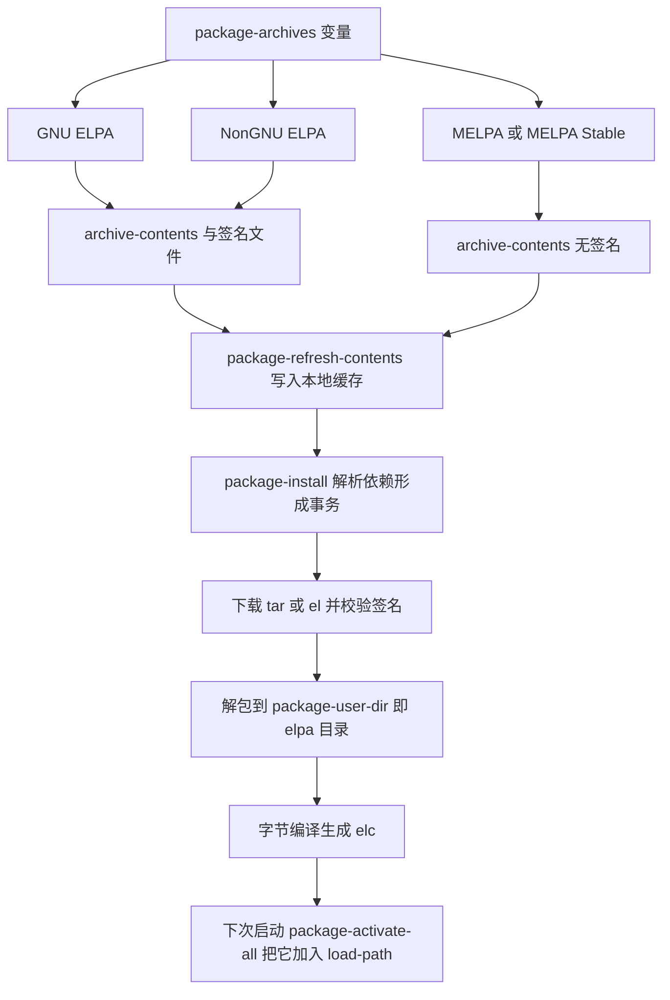
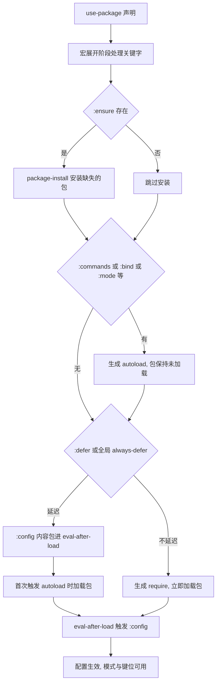
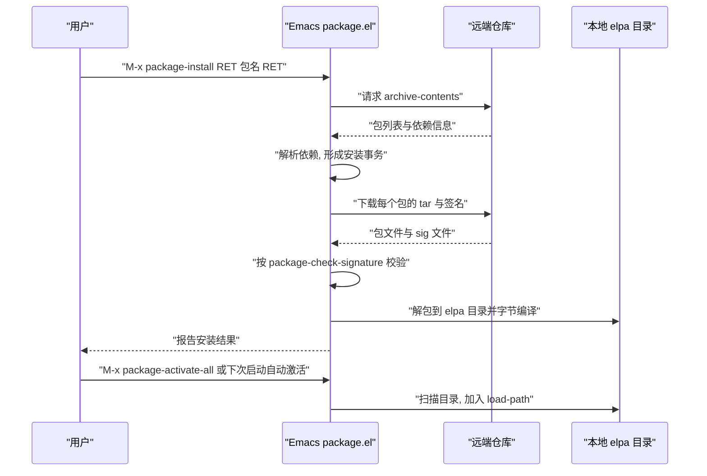

# 包管理与 use-package

> 这一篇讲清楚三件事：Emacs 内置的 `package.el` 从哪里下载包、装到哪里、什么时候加载；`use-package` 的每个关键字实际展开成什么代码；网络受限或需要 git 版本时有哪些替代路线。读完你应该能独立配置一套可重现、可排障的包管理方案。

---

## 一、package.el 的工作原理

### 1.1 三个组成部分

`package.el` 是 Emacs 内置的包管理器（不需要安装），它只做三件事，理解这三件事之后所有报错都能定位：

**仓库（archive）**。一个 HTTP 目录，里面有两个关键文件：`archive-contents` 列出该仓库所有包的名称、版本、依赖与摘要；包本身则是 `<包名>-<版本>.tar` 或单个 `.el` 文件。Emacs 启动时不会去访问仓库，只有在你执行安装、升级、刷新档案时才联网。

**包描述（package descriptor）**。Emacs 解析 `archive-contents` 之后得到的结构化数据，包含版本列表和依赖列表。依赖解析就发生在这里：安装 A 之前，Emacs 先算出 A 需要哪些包、哪些版本，形成一个事务（transaction），再依次下载。

**本地安装目录**。默认是 `~/.emacs.d/elpa/`，一个包一个子目录，里面是该包的 `.el` 源码、编译产物 `.elc`、以及 Emacs 生成的 `<包名>-pkg.el` 描述文件。Emacs 靠扫描这个目录来知道「我装了哪些包」。

用 `C-h v package-user-dir RET` 可以核对你的实际路径。它由 `locate-user-emacs-file` 决定，所以如果你把配置放在 `~/.config/emacs/`，安装目录也会跟着变成 `~/.config/emacs/elpa/`；Windows 上同样建议用 `C-h v` 看实际值，而不要照抄别人的路径。

### 1.2 package-archives：仓库列表

仓库列表存在变量 `package-archives` 里。Emacs 30 的默认值是两个官方仓库：

| 仓库名 | 地址 | 特点 |
|--------|------|------|
| `gnu` | https://elpa.gnu.org/packages/ | GNU ELPA，由 FSF 维护，包数量少但要求版权归 FSF，包有 GPG 签名 |
| `nongnu` | https://elpa.nongnu.org/nongnu/ | NonGNU ELPA，门槛低一些，包更多，同样有签名；Emacs 28 起默认启用 |
| `melpa` | https://melpa.org/packages/ | 包数量最多，从各包的上游 git 仓库自动构建，**没有签名** |
| `melpa` 稳定版 | https://stable.melpa.org/packages/ | MELPA Stable，只从打了版本标签的发布构建，更新慢但版本稳定 |

取舍的建议是这样：

- 只用 `gnu` 加 `nongnu` 已经能解决大部分需求，而且两者都提供 `archive-contents.sig` 签名文件，签名校验能真正起作用；
- 需要某个只在 MELPA 上的包时再加 MELPA，但要清楚 MELPA 上的包每次构建都取自上游最新提交，可能出现「昨天还能用的配置今天报错」；
- **不要同时启用 MELPA 和 MELPA Stable**。同一个包在两个仓库里版本号不同，Emacs 会按优先级挑一个，结果往往不是你想要的。要稳定就两个都写、用优先级控制，要新就用 MELPA。

配置写进 `init.el` 即可，因为它只影响后续的下载动作：

```elisp
;; 在 init.el 开头设置仓库列表
(setq package-archives
      '(("gnu"    . "https://elpa.gnu.org/packages/")
        ("nongnu" . "https://elpa.nongnu.org/nongnu/")
        ("melpa"  . "https://melpa.org/packages/")))

;; 同一个包出现在多个仓库时，数字大的优先；这里让 melpa 优先于 gnu
(setq package-archive-priorities
      '(("melpa" . 10)
        ("nongnu" . 5)
        ("gnu" . 0)))

;; 把某个包钉死在指定仓库，避免被其它仓库的同名包顶掉
(setq package-pinned-packages
      '((org . "gnu")))
```

`M-x package-refresh-contents` 会按这份列表重新下载各仓库的 `archive-contents`，本地缓存落在 `~/.emacs.d/elpa/archives/` 下。改过 `package-archives` 之后必须刷新，否则 `M-x list-packages` 里看到的还是旧仓库的内容。

### 1.3 数据流



---

## 二、安装目录与启动时的自动激活

### 2.1 Emacs 27 起不再需要 package-initialize

这是最容易被老教程误导的一点。Emacs 27 之前，你必须在 `init.el` 里写 `(package-initialize)`，否则装了包也不会被加载。**从 Emacs 27 开始这件事由启动流程自动完成**：Emacs 在读取你的 `init.el` **之前**，如果满足下面几个条件，就会调用 `package-activate-all` 把已安装的包加进 `load-path`：

- `user-init-file` 非空（也就是说不是用 `-q` 或 `-Q` 启动的）；
- `package-enable-at-startup` 的值非 nil；
- `package-user-dir` 或 `package-directory-list` 指向的目录里确实存在包。

结论很直接：**不要在 `init.el` 里写 `(package-initialize)`**。写了不会立刻出错，但 `package-initialize` 的文档字符串明确说明，在启动过程中被调用两次会报出警告，并提示你删掉多余的那次调用。反过来，如果你想在包被激活之前运行某些代码，正确的位置是 `early-init.el`，而不是在 `init.el` 里抢跑。

这里有个连带的重要结论：既然包在 `init.el` **之前**就激活了，那么「已安装」与「已加载」是两回事——激活只是把包目录放进 `load-path` 并处理 autoload，真正 `require` 一个包仍然要等你的配置或某次命令触发。

### 2.2 package-enable-at-startup

`package-enable-at-startup` 控制上面那一步是否发生，默认值是 `t`。它的文档字符串指出两点：

- 这个变量的值在读取 `init.el` **之前**就被用掉了，所以要修改它，必须写在 `early-init.el` 里；
- 即使设为 `nil`，你仍然可以随时执行 `M-x package-initialize`，或者在配置里调用 `(package-activate-all)`。

让读者自己核对一遍，比记住结论更可靠：

```text
M-: package-enable-at-startup RET   ; 打印当前值
C-h v package-enable-at-startup RET ; 看它的完整文档与设置位置提示
```

如果启动时想临时跳过所有第三方包（用来判断问题是不是插件造成的），用 `emacs -q` 或 `emacs -Q` 启动即可：这时 `user-init-file` 为空，包不会被激活。

### 2.3 加快启动：package-quickstart

如果装了上百个包，每次启动扫描 `elpa` 目录并计算激活动作会拖慢启动。Emacs 27 起提供了预计算机制：

```elisp
;; 在 init.el 里开启，然后在包有变动时手动刷新一次
(setq package-quickstart t)

;; 包安装或删除之后执行一次，重新生成预计算文件
M-x package-quickstart-refresh
```

生成的文件位置由 `package-quickstart-file` 决定，默认是 `~/.emacs.d/package-quickstart.el`。它的代价是：每次增删包、修改 `package-load-list` 之后都必须重新刷新，否则启动时用的是过期的激活记录。这是「用启动速度换维护成本」的典型取舍，包不多时不必开。

---

## 三、M-x list-packages 界面用法

### 3.1 界面与列的含义

`M-x list-packages` 打开 `*Packages*` 缓冲区。它会**先联网刷新**各仓库的档案再显示，想跳过刷新用 `C-u M-x list-packages`。界面有五列：

| 列 | 含义 |
|----|------|
| Package | 包名 |
| Version | 仓库里的版本号 |
| Status | 状态，常见值有 `available`（可安装）、`installed`（已安装）、`built-in`（随 Emacs 发布）、`new`（已安装但有新版）、`obsolete`、`disabled` |
| Archive | 这个版本来自哪个仓库 |
| Description | 一行摘要 |

`built-in` 这一状态很关键：它表示这个包是 Emacs 自带的，`package.el` 默认不会去动它，理由见第七章。

### 3.2 键位

| 键位 | 命令 | 动作 |
|------|------|------|
| `i` | `package-menu-mark-install` | 标记为安装 |
| `d` | `package-menu-mark-delete` | 标记为删除 |
| `U` | `package-menu-mark-upgrades` | 把所有可升级的包标记为升级 |
| `x` | `package-menu-execute` | 执行所有标记的动作 |
| `u` | `package-menu-mark-unmark` | 取消当前标记并下移 |
| `DEL` | `package-menu-backup-unmark` | 取消标记并上移 |
| `~` | `package-menu-mark-obsolete-for-deletion` | 把过时的包标记为删除 |
| `g` | `revert-buffer` | 重新刷新列表 |
| `RET` 或 `?` | `package-menu-describe-package` | 查看包详情 |
| `h` | `package-menu-quick-help` | 显示键位速查 |
| `/` | 过滤前缀 | `/ u` 只看可升级的包，`/ n` 按名字过滤，`/ a` 按仓库过滤，`/ /` 清除过滤 |

`U` 加 `x` 能一键升级全部，但官方在 Emacs 29 的 NEWS 里给出过相反的建议：如果打开了内置包升级选项，不要直接用 `U`，而应该用 `/ u` 筛出可升级的包，逐个决定。原因是一键升级会把内置包也换掉，而内置包与 Emacs 其余部分的配合最紧密，风险最高。

### 3.3 不用界面时的等价命令

| 命令 | 作用 |
|------|------|
| `M-x package-install RET 包名 RET` | 安装，并把包名记进 `package-selected-packages` |
| `M-x package-delete RET 包名 RET` | 删除已安装的包；被别的包依赖时会拒绝，加前缀参数强制删除 |
| `M-x package-upgrade RET 包名 RET` | 升级单个包（Emacs 29 起新增） |
| `M-x package-upgrade-all` | 刷新并升级全部可升级的包，会逐个询问 |
| `M-x package-autoremove` | 删除「已经没人需要」的包 |
| `M-x package-install-selected-packages` | 把 `package-selected-packages` 里列出但没装的包装回来 |
| `M-x package-reinstall RET 包名 RET` | 重新安装，用来修复损坏的安装 |
| `M-x package-refresh-contents` | 只刷新档案，不安装 |

`package-install` 的文档字符串说明了两件事：它会自动把包名加入 `package-selected-packages`；从 Lisp 调用时如果第二个参数非 nil，则只安装、不记为「用户显式选择」。另外带前缀参数执行会临时允许升级内置包，等价于把 `package-install-upgrade-built-in` 打开。

### 3.4 package-selected-packages 的作用与陷阱

`package-selected-packages` 的文档只有一句「记录用户显式安装的包」，但它的作用远超记录：**`package-autoremove` 完全以它为根**。它的文档字符串说明，`autoremove` 删除的是「不再被 `package-selected-packages` 中任何包及其依赖所需要」的包。

陷阱就出在这里。这个变量是通过 Customize 机制保存的，而 `custom-file` 的默认值是 nil，含义是「用你的 init 文件」。于是会发生两件事：

- 你每装一个包，Emacs 就可能往 `init.el` 里追加一段 `(custom-set-variables '(package-selected-packages ...))`。手写配置的人会突然看到自己的文件被改动；
- 反过来，如果你把配置整理过、把这段记录删掉了，或者换了一台机器只拷贝了 `init.el` 而没拷贝这段，那么执行 `M-x package-autoremove` 时，Emacs 会认为「这些包都不是用户装的」，从而提议把**几乎所有包都删掉**。

规避方法是显式指定一个独立的 custom 文件，并把它加载进来：

```elisp
;; 让 Customize 的自动保存写进独立文件，别污染 init.el
(setq custom-file (locate-user-emacs-file "custom.el"))
(load custom-file :no-error-if-file-is-missing)
```

同时记住一条纪律：执行 `M-x package-autoremove` 之前先看它列出了哪些包，确认没有把自己需要的包算进去。迁移到新机器时，`M-x package-install-selected-packages` 是最省事的重建方式，前提同样是那个列表还在。

### 3.5 核对「我到底装了什么」

排查问题时，「已安装」和「已加载」是两套不同的信息，需要分别查。

查已安装：`M-x list-packages` 里状态列显示 `installed` 的就是已安装；想看文件本身，直接用 dired 打开安装目录（`C-x d` 再输入 `package-user-dir` 的值），一个子目录就是一个包的一个版本。查已激活：`C-h v package-alist RET` 列出所有已经进入 `load-path`（即已被激活）的包及其描述对象，这个变量在启动阶段由 `package-activate-all` 填充，因此它的内容反映的是「这次会话实际能用的包」，比 `list-packages` 更贴近真实情况。查某个包被谁依赖：在 `*Packages*` 里按 `RET` 看详情，或者用 `M-x package-delete RET 包名 RET` 试删一次——被别的包依赖时它会拒绝并告诉你依赖方是谁。

如果怀疑是某个包导致启动异常，可以用 `package-load-list` 做定点停用。这个变量的文档字符串说明，它是「供 `package-activate-all` 决定让哪些包可用」的白名单：写成 `'((包名))` 表示只激活这个包、其余一律不激活，写成 `'((包名 "版本号"))` 可以指定版本，写成 `(all)` 表示全部激活。由于它在启动阶段就被读取，必须写在 `early-init.el` 里才有效。用它一行行地注释掉可疑的包，比反复卸载重装高效得多。

---

## 四、签名验证

### 4.1 package-check-signature 的取值

| 值 | 含义 |
|----|------|
| `t` | 只接受至少有一个已校验签名的包 |
| `all` | 同 `t`，并且当存在多个签名时全部校验 |
| `allow-unsigned` | 默认值。未签名的包也装，但如果包有签名、本地有对应公钥且装了 GnuPG，则校验签名 |
| `nil` | 完全忽略签名 |

它的文档字符串还指出，这套校验同样作用于 `archive-contents` 这个档案文件本身。

### 4.2 三个仓库的签名现状

本文写作时实测：GNU ELPA 的 https://elpa.gnu.org/packages/archive-contents.sig 与 NonGNU ELPA 的 https://elpa.nongnu.org/nongnu/archive-contents.sig 都返回 200，也就是说这两个仓库能提供可校验的签名文件；而 MELPA 的 `packages/` 目录下并没有对应的 `archive-contents.sig`，请求它会返回 404，这个仓库整体不提供签名。

这意味着：**如果把握 `package-check-signature` 设成 `t`，MELPA 上的包会全部装不上**，因为它们没有签名可验。解决办法是把 MELPA 放进豁免名单：

```elisp
;; 声明这些仓库不参与签名校验，适合 MELPA 这类不签名的仓库
(setq package-unsigned-archives '("melpa"))
```

`package-unsigned-archives` 的文档字符串说得很清楚：它列出的是「不检查签名的仓库名」，取值必须与 `package-archives` 里的名字一致。

### 4.3 密钥过期：gnu-elpa-keyring-update

GNU ELPA 的签名私钥有有效期，旧密钥过期后，即使包本身没变，校验也会失败。官方为此提供了一揽子密钥更新包：

```text
M-x package-install RET gnu-elpa-keyring-update RET
```

该包的说明页指出：这些密钥的有效期有限（例如第一把密钥在 2019 年 9 月就到期了），所以你需要**安装并保持它是最新的**，否则签名校验会莫名失败。它还给出了一条务实的补救路径：如果你的密钥已经过期到无法安装任何包，就必须临时关掉校验（把 `package-check-signature` 设为 `nil`）把更新包装上，再把它改回来。

如果你希望 GnuPG 使用独立的 keyring 而不是你的个人 `~/.gnupg`，可以自定义 `package-gnupghome-dir`，用 `C-h v package-gnupghome-dir RET` 查看它的文档。

---

## 五、use-package

### 5.1 它是什么，从哪个版本开始内置

`use-package` 是一个宏，本身不下载也不加载包，只负责把「声明」展开成正确的加载与配置代码。Emacs 29 起它随 Emacs 一起发布（见 Emacs 29 的 NEWS），Emacs 30 又加入了 `:vc` 关键字。如果你希望用到上游更新版本，官方在 NEWS 里的建议是把 `package-install-upgrade-built-in` 打开，再用 `M-x package-upgrade RET use-package RET` 从 GNU ELPA 升级。

它的核心价值有两个：一是把「安装、延迟加载、绑定键位、设置变量」这四件事收在一处，配置文件可读性大幅提升；二是它默认帮你想好了延迟加载，减少启动时的 `require`。

### 5.2 关键字速查表

下表覆盖了日常会用到的全部关键字。第二列是它的实际效果，第三列可以直接抄。

| 关键字 | 作用 | 示例 |
|--------|------|------|
| `:ensure` | 没装就自动安装；`t` 表示从当前仓库装最新版 | `:ensure t` |
| `:init` | 声明被求值时立即执行，**早于**包被加载 | `:init (setq foo-var 1)` |
| `:config` | 包加载之后执行 | `:config (foo-mode 1)` |
| `:hook` | 把函数加到钩子上 | `:hook (foo-mode . my-foo-setup)` |
| `:bind` | 绑定键位，支持 `:map` 指定键位表 | `:bind ("C-c f" . foo-do-it)` |
| `:bind-keymap` | 把一个键绑到某个（可能尚未加载的）键位表 | `:bind-keymap ("C-c f" . foo-map)` |
| `:commands` | 声明命令并生成 autoload，从而延迟加载 | `:commands (foo-do-it foo-undo)` |
| `:mode` | 把扩展名关联到模式 | `:mode ("\\.foo\\'" . foo-mode)` |
| `:interpreter` | 把解释器名关联到模式 | `:interpreter ("footool" . foo-mode)` |
| `:magic` | 按文件内容开头判断模式 | `:magic ("\\`#!.*/footool" . foo-mode)` |
| `:custom` | 设置变量，走 Customize 的机制 | `:custom (foo-option 42)` |
| `:custom-face` | 设置 face | `:custom-face (foo-face ((t (:height 1.2))))` |
| `:defer` | 延迟加载；`t` 表示永不主动加载，或写秒数 | `:defer t` 或 `:defer 5` |
| `:demand` | 立即加载，覆盖 `:defer` 与 `use-package-always-defer` | `:demand t` |
| `:after` | 在另一个特性加载之后再加载本包 | `:after foo-lib` |
| `:if` / `:when` | 条件成立才执行整段声明 | `:if (version< emacs-version "31")` |
| `:unless` | 条件不成立才执行整段声明 | `:unless (eq system-type 'windows-nt)` |
| `:requires` | 指定的特性已存在时才执行，**不负责加载它们** | `:requires (foo-lib bar-lib)` |
| `:diminish` | 把模式行上的模式名简化，需要 `diminish` 包 | `:diminish foo-mode` |
| `:delight` | 同上，需要 `delight` 包，支持改文字与 face | `:delight foo-mode " F"` |
| `:load-path` | 把目录加进 `load-path` | `:load-path "site-lisp/foo"` |
| `:vc` | 从 git 之类的版本控制源安装 | `:vc (:url "https://github.com/minad/vertico")` |
| `:no-require` | 不生成 `require` | `:no-require t` |
| `:pin` | 指定从哪个仓库安装 | `:pin "gnu"` |
| `:preface` | 包加载前就要可用的定义，通常放 `defun` 与 `defvar` | `:preface (defun my-fn () ...)` |
| `:defines` / `:functions` | 声明包内会定义的变量与函数，消除字节编译警告 | `:functions foo-do-it` |
| `:catch` | 是否把整段声明包进错误处理器，出错时报警告而不中断启动 | `:catch t` |

### 5.3 几个容易踩坑的关键字

**`:hook`**。它展开成 `add-hook`，而且会自动给目标补 `-hook` 后缀，后缀由 `use-package-hook-name-suffix` 控制（默认 `"-hook"`）。也就是说 `:hook (prog-mode . company-mode)` 实际加到的是 `prog-mode-hook`。如果目标已经是一个完整的钩子名（例如 `org-mode-hook`），它会被原样使用。省略函数名的写法 `:hook (prog-mode)` 会用「包名对应的模式函数」补上，容易记错，建议永远显式写成 `(钩子 . 函数)`。

**`:mode` 与 `:interpreter` 的简写形式要小心**。写成裸字符串 `:mode "\\.foo\\'"` 时，展开结果里的模式函数取的是**包名本身**，而不是包名加 `-mode`。只有包名恰好就是模式函数名（例如 `ruby-mode`）时才正确。稳妥的写法始终是显式的 `("正则" . 模式函数)`。

**`:custom` 不写 custom-file**。它的展开结果是通过一个名为 `use-package` 的临时主题调用 `custom-theme-set-variables`，因此这些设置不会写进你的 `custom.el`，也不会和 Customize 的历史值打架。这既避免了污染配置文件，也意味着你在 `:custom` 里改的值不会出现在 Customize 界面里。

**`:defer` 与 `:demand` 决定 require 是否发生**。不带 `:defer` 时，`use-package` 会生成 `(require '包名 nil t)` 并在失败时给出警告；带 `:defer t` 时这一段被去掉，`:config` 里的代码则被包进 `eval-after-load`。`:demand t` 的作用是覆盖全局的 `use-package-always-defer`，强制立即加载。

**`:requires` 只检查不加载**。它展开成 `(when (featurep 'foo-lib) ...)`，多个符号时要求全部存在。它只接受符号，写 `(:requires (bar "1.2"))` 这种带版本号的形式会直接报「`:requires` wants a symbol, or list of symbols」。需要版本判断请用 `:if`。

**`:load-path` 的相对路径以 `user-emacs-directory` 为基准**。`:load-path "site-lisp/foo"` 展开成 `(add-to-list 'load-path "~/.emacs.d/site-lisp/foo")`，并且外面包了 `eval-and-compile`，所以字节编译配置时也能找到路径。

**`:diminish` 与 `:delight` 是「有条件生效」的**。它们展开成 `(if (fboundp 'diminish) ...)` 与 `(if (fboundp 'delight) ...)`：如果没装 `diminish` 或 `delight` 这两个包，这段代码会安静地什么都不做，不报错也不提示。所以它们必须先安装：

```text
M-x package-install RET diminish RET
M-x package-install RET delight RET
```

两个包都在 GNU ELPA 上。`diminish` 只做「缩短模式行上的模式名」，`delight` 功能更多，可以改文字、改 face，也能用于全局次模式。

**`:vc` 用版本控制源安装**。它接受 `:url`、`:branch`、`:rev`、`:lisp-dir`、`:main-file`、`:vc-backend`、`:shell-command`、`:make`、`:ignored-files` 这些子关键字，底层调用 `package-vc.el`。同一段声明在字节编译的配置里会在编译期就尝试安装，否则推迟到运行时。想要「永远用最新提交」而不是稳定发布，把 `use-package-vc-prefer-newest` 设为非 nil。

**`:no-require` 不是「不加载」**。它的作用是让 `use-package` 不生成 `require` 语句。`:config` 里的代码会因此直接执行，而不是等包加载后再执行。它适合「包已经由别处加载」或者「这一段只是纯配置」的场景。

### 5.4 从声明到加载的实际流程



安装一个包时，网络侧与本地的交互顺序是这样的：



### 5.5 推荐的三条全局开关

```elisp
;; 每段 use-package 声明都自动安装缺失的包，省掉逐个写 :ensure
(setq use-package-always-ensure t)

;; 默认延迟加载：不写 :defer 也不写 :demand 的声明不会在启动时 require
(setq use-package-always-defer t)

;; 展开结果尽量精简，字节编译产生的代码更少，配置文件读起来也更干净
(setq use-package-expand-minimally t)
```

这三条的组合很常见，但要知道代价：

- `use-package-always-ensure` 让启动依赖网络。包已经装好时它不联网，但换新机器首次启动会一次性下载全部包；如果你的包列表里有 `:vc` 声明的包，还需要本机有 `git`。还有一处细节：这个开关的默认值判定里带了一个例外——声明中写了 `:load-path` 的段落不会被自动安装，因为这类段落通常指向本地目录而不是仓库；
- `use-package-always-defer` 让所有声明都延迟，好处是启动快，代价是如果某段声明既没有 `:commands`、也没有 `:bind`、也没有 `:hook`，那个包可能永远不会被加载。需要它立即生效时要显式写 `:demand t`；
- `use-package-expand-minimally` 会去掉展开代码里的调试辅助部分，出问题时定位信息变少。它还有一个连带效果：`:catch` 的默认值本来是「开启错误处理器」，而这个默认值的前提就是 `use-package-expand-minimally` 为假，所以打开这个开关之后，声明里出错会直接抛出而不是转成警告。排障阶段建议先把这一条关掉。

另外两个调试开关值得知道：`use-package-verbose` 设为 t 会把每个包的加载耗时打印到 `*Messages*`；`use-package-compute-statistics` 设为 t 之后重启，用 `M-x use-package-report` 可以看到每段声明的加载时间统计，用来找拖慢启动的元凶。

### 5.6 一段完整的配置示例

```elisp
;; 先声明全局开关，再写各包的声明
(setq use-package-always-ensure t
      use-package-always-defer t
      use-package-expand-minimally t)

;; 内置包：只做配置，不需要 :ensure，也不需要安装
(use-package emacs
  :init
  ;; 关掉启动画面与工具栏，这两项不涉及第三方包
  (setq inhibit-startup-screen t)
  (menu-bar-mode -1)
  :custom
  ;; 通过 Customize 机制设置变量
  (create-lockfiles nil)
  :bind
  ;; 内置命令也可以这样统一管理键位
  ("M-g f" . ffap))

;; 第三方包：需要安装、需要延迟加载、需要挂钩子
(use-package vertico
  :ensure t
  :init
  (vertico-mode 1)
  :custom
  (vertico-cycle t))

;; 用 :commands 生成 autoload，第一次调用命令时才真正加载包
(use-package magit
  :ensure t
  :commands (magit-status magit-dispatch)
  :bind ("C-c g" . magit-status))
```

注意第三段：`:commands` 与 `:bind` 都会生成 autoload，所以 `magit` 不会在启动时被 `require`，但你按下 `C-c g` 或执行 `M-x magit-status` 时它会被按需加载。这正是 `use-package` 相比手写 `require` 的主要好处。

---

## 六、straight.el 与 elpaca：什么时候需要它们

`package.el` 的模型是「从仓库发布的 tar 包安装」，它有两个先天限制：只认 ELPA 格式的仓库，以及版本只能是仓库给的版本号。以下场景它就不够用了：

- 你想用的包没有发布到任何 ELPA 仓库，只有一个 git 仓库；
- 你需要锁定到某个具体提交，保证半年后重装得到完全一样的代码；
- 你想同时用同一个包的两个分支（例如对比某次上游改动前后的行为）。

`straight.el`（https://github.com/radian-software/straight.el ）和 `elpaca`（https://github.com/progfolio/elpaca ）就是为解决这些场景而生的包管理器。它们的共同点是：**直接克隆 git 仓库**，把包当作 git 检出物来管理，并提供「记录当前所有包的提交号」的机制，让你可以冻结并重现一套环境。

两者的定位差异大致是这样：

- `straight.el` 出现更早，生态资料多，与 `use-package` 结合得紧，用 `straight-use-package` 替换 `use-package` 即可接手原有的声明；它默认会为已知的 ELPA 包自动生成 recipe，并支持 `:straight` 关键字直接写 git 地址、分支或提交；
- `elpaca` 更新，主打异步安装与构建：安装包的过程不会阻塞 Emacs，装几十个包时体感差别明显，也支持按需构建与版本锁定。

代价也是共同的：需要本机安装 `git`，首次安装要把所有包的仓库克隆到本地（体积和时间都远超 ELPA 的 tar 包），出问题时排查链路比 `package.el` 长。给出的建议是：**先用 `package.el` 加 MELPA 把环境跑顺**，等你确实遇到「需要 git 版本」或「需要锁版本」的具体问题，再迁移。迁移的具体 API 以上两个仓库的 README 为准，它们的接口变动比内置的 `package.el` 频繁。

---

## 七、为什么不要用包管理器安装内置包

Emacs 自带一批包，例如 `org`、`seq`、`project`、`transient`、`use-package`（29 起）、`which-key`（30 起）、`eglot`。它们的状态在 `M-x list-packages` 里显示为 `built-in`。不推荐用 `package.el` 把它们换成 ELPA 版本，原因有三条：

**第一，默认被上游挡住，说明它是个坑。** `package-install` 在目标包是内置包且 `package-install-upgrade-built-in` 为 nil 时会直接报错，文档字符串写明「试图用仓库版本替换内置包会报错」。要绕过必须显式打开这个选项或加前缀参数。上游刻意加了这道闸，正是因为这类替换出过大量问题。

**第二，删不干净。** 内置包不能被 `package-delete` 删除，源码里对应的报错是「Package `X' is a system package, not deleting」。你从 ELPA 装了一份之后，本地实际上有两份同名代码：一份在 Emacs 安装目录，一份在 `elpa` 目录。`package-delete` 只能删掉后者，前者始终在。混用状态下，究竟是哪一份被加载取决于 `load-path` 顺序，出问题时很难判断。

**第三，版本错配。** Emacs 内部很多部件是配套发布的。以 Org 为例，Emacs 里除 `org.el` 之外还有一批 `ox-*`、`org-agenda` 等文件，它们与随 Emacs 发布的那个 Org 版本是配套的。你只把主包升级到 ELPA 上的新版，其余部件仍是旧的，就可能出现函数签名不匹配、变量未定义这类问题。

所以实践建议是：内置包就用内置的，靠升级 Emacs 本身来获得新版本。确实需要新版（例如要用某个只在最新 Org 里存在的功能）时，注意三点：把相关的同族包一起升级；升级后用 `M-x package-recompile` 或 `M-x package-recompile-all` 重建字节码；出问题立刻用 `M-x package-delete` 把 ELPA 那份删掉，退回内置版本。

---

## 八、网络受限时的应对

### 8.1 用代理

`url-proxy-services` 是 Emacs 所有基于 `url.el` 的网络请求（包括 `package.el` 的下载）使用的代理变量。它的文档字符串说明，这个值默认由环境变量（`http_proxy`、`https_proxy` 等）初始化。因此有两条路径。

最省事的一条是在启动 Emacs 之前导出环境变量：

```bash
# 在 shell 里导出代理后再启动 Emacs，Emacs 会自动读取
export http_proxy=http://127.0.0.1:7890
export https_proxy=http://127.0.0.1:7890
export no_proxy=localhost,127.0.0.1
emacs &
```

另一条是让 Emacs 使用与环境不同的代理，这时必须写在 `early-init.el` 里，保证在任何包操作之前生效：

```elisp
;; ~/.emacs.d/early-init.el
;; 格式是 (("协议" . "主机:端口") ...)，https 与 http 要分别列出
(setq url-proxy-services
      '(("http"  . "127.0.0.1:7890")
        ("https" . "127.0.0.1:7890")))
```

设置完用一个不会造成副作用的命令验证：`M-x package-refresh-contents`。如果它能在几秒内完成，说明代理通了；如果卡住直到超时，检查端口、协议是否成对配置，以及 `no_proxy` 是否把要访问的域名排除掉了。

### 8.2 用国内镜像

镜像方案比代理更彻底：不需要代理进程，速度由镜像站决定。下面这份配置里的地址在本文写作时逐个验证过，`archive-contents` 与 GNU、NonGNU 的签名文件都能正常下载：

```elisp
;; 使用清华 TUNA 的 ELPA 镜像
(setq package-archives
      '(("gnu"    . "https://mirrors.tuna.tsinghua.edu.cn/elpa/gnu/")
        ("nongnu" . "https://mirrors.tuna.tsinghua.edu.cn/elpa/nongnu/")
        ("melpa"  . "https://mirrors.tuna.tsinghua.edu.cn/elpa/melpa/")))
```

该镜像下还有 `stable-melpa` 目录，需要用 MELPA Stable 时把地址写成 https://mirrors.tuna.tsinghua.edu.cn/elpa/stable-melpa/ 。如果你只想要 GNU ELPA，北外的镜像 https://mirrors.bfsu.edu.cn/elpa/gnu/ 也验证可用。

换过地址之后一定要执行一次 `M-x package-refresh-contents`。另外两点提醒：镜像同步官方仓库有延迟（通常几小时），出现「明明官方有新版本镜像里没有」属于正常；镜像站偶尔会临时不可用，那时把 `package-archives` 改回官方地址再刷新即可。

---

## 九、手动安装

有三类包不该走仓库：内部私有包、自己写的单文件包、以及临时验证用的包。它们都可以手动安装。

**加进 load-path 再 require。** 最通用的做法：

```elisp
;; 把目录加进 load-path，然后按需加载
(add-to-list 'load-path (expand-file-name "site-lisp/foo" user-emacs-directory))
(require 'foo)

;; 如果只是想用其中的某个命令，可以只生成 autoload 而不立即加载
(autoload 'foo-do-it "foo" "执行 foo 的主要动作" t)
```

用 `user-emacs-directory` 拼接路径比写死 `~/.emacs.d/` 更稳，因为你的配置目录可能是 `~/.config/emacs/`。

**用 package-install-file 安装本地文件。** 它的文档字符串说明，参数可以是 tar 包、单个 `.el` 文件，或者一个目录：

```text
M-x package-install-file RET ~/下载/foo-1.2.tar RET
M-x package-install-file RET ~/下载/foo.el RET
```

这样装进去的包会进入正常的 `elpa` 目录管理，能被 `M-x package-delete` 删除，也会被记进 `package-selected-packages`。

**单次加载与编译。** `M-x load-file RET 路径 RET` 用来临时求值一个文件；`M-x byte-compile-file RET 路径 RET` 把它编译成 `.elc`。自己写的包建议编译一次：字节编译能提前暴露未定义变量、参数个数不匹配这类错误，而这些错误在解释执行时可能到运行中才爆出来。

**关于 `require` 的一点提醒。** `require` 会检查特性（feature）是否已加载，而特性名未必等于文件名——它由文件里的 `(provide '特性名)` 决定。手写 `require` 报「Cannot open load file」时，先用 `C-h f require RET` 确认语义，再用 `M-x locate-library RET 名字 RET` 查 Emacs 实际会去哪个路径找这个文件。

---

## 十、排障对照表

| 现象 | 原因 | 处理 |
|------|------|------|
| 安装时报签名相关错误，例如无法校验签名 | GNU ELPA 的密钥过期，或本地没有对应公钥 | 装 `gnu-elpa-keyring-update` 并保持更新；已经装不上时先临时把 `package-check-signature` 设为 nil，装完再改回来 |
| 明明装了 GnuPG，MELPA 的包却因签名失败装不上 | 把 `package-check-signature` 设成了 t，而 MELPA 不提供签名 | 把 `"melpa"` 加进 `package-unsigned-archives`，或改回默认的 `allow-unsigned` |
| `M-x package-refresh-contents` 长时间无响应或报下载失败 | 网络到不了官方仓库 | 配代理或换镜像（见第八章），改完地址后重新刷新 |
| 某个包在 `M-x list-packages` 里搜不到 | 档案未刷新，或该包不在已启用的仓库里 | 先 `M-x package-refresh-contents`；确认包属于 gnu、nongnu 还是 melpa，把对应仓库加进 `package-archives` |
| 安装时报依赖版本不满足 | 某个依赖被钉在旧仓库，或本机已有版本低于要求 | 检查 `package-pinned-packages`；升级依赖；如果依赖是内置包，需要 `package-install-upgrade-built-in` 非 nil 才能装新版 |
| 升级某个包之后启动报错 | 新版改了函数名或参数，而配置还在用旧接口 | 用 `M-x package-recompile` 或 `package-recompile-all` 重建字节码；用 `C-h f` 核对接口；必要时用 `M-x package-delete` 回退 |
| `elpa` 目录越来越大 | 装了但已不再使用的包；Emacs 30 升级时会删掉旧版本目录，但不会删掉你不需要的包 | `M-x package-autoremove` 清理（先看它要删什么），单个包用 `M-x package-delete`；把不再用的仓库从 `package-archives` 里移除可以减少档案缓存 |
| `M-x package-autoremove` 提示要删掉几乎所有包 | `package-selected-packages` 丢失或被清空 | 立刻取消该操作，恢复它的值，或改用 `package-install-selected-packages` 重建；同时给 Customize 指定独立的 `custom-file` |
| `use-package` 的 `:diminish`、`:delight` 看起来没生效 | 对应的 `diminish`、`delight` 包没装，宏展开后的代码因 `fboundp` 检查为假而静默跳过 | `M-x package-install RET diminish RET` 或 `M-x package-install RET delight RET` |
| 配置里 `require` 的包总是加载失败 | 包没装，或 `load-path` 没包含它 | 用 `M-x locate-library RET 包名 RET` 看 Emacs 去哪里找；确认包在 `elpa` 目录里，或手动加 `load-path` |

补充一个版本提示：Emacs 31 新增了 `package-retention-policy`，可以让升级时保留旧版本目录，方便回退；Emacs 30 没有这个选项，升级会按前述逻辑清掉旧版本。

---

## 小结

- `package.el` 的动作只发生在你主动安装、升级、刷新时；Emacs 27 起已安装的包会在启动时自动激活，`init.el` 里不需要也不应该再写 `(package-initialize)`，相关行为由 `package-enable-at-startup` 控制，且必须在 `early-init.el` 里设置。
- `use-package` 只是把声明展开成加载与配置代码，`:defer` 与 `:demand` 决定是否立即 `require`，`:commands`、`:bind`、`:mode` 会生成 autoload 从而保持延迟；`:diminish`、`:delight` 依赖同名的外部包，缺失时静默跳过。
- 仓库选择优先 gnu 加 nongnu，缺包再加 MELPA；签名校验、密钥更新、镜像与代理三件事配好之后，包管理基本不会再成为日常障碍；内置包不要用 `package.el` 去替换。

---

## 相关章节

- [[emacs教程/1入门/00_认识Emacs|认识 Emacs]]
- [[emacs教程/1入门/02_内置教程与基本操作|内置教程与基本操作]]
- [[emacs教程/1入门/03_配置文件从零开始|配置文件从零开始]]
- [[emacs教程/1入门/05_从Vim迁移|从 Vim 迁移]]
- [[emacs教程/2Elisp语言/10_包与命名空间实践|包与命名空间实践]]
- [[emacs教程/3配置实践/01_配置工程化|配置工程化]]
- [[emacs教程/3配置实践/06_多机同步与配置分发|多机同步与配置分发]]
- [[emacs教程/7进阶/01_启动加速与性能优化|启动加速与性能优化]]
- [[emacs教程/7进阶/04_常见故障排查|常见故障排查]]
- [[git|Git 与 GitHub 指南]]

## 参考资料

- GNU ELPA https://elpa.gnu.org/packages/
- NonGNU ELPA https://elpa.nongnu.org/nongnu/
- MELPA https://melpa.org/packages/ ／ 上手指南 https://melpa.org/#/getting-started
- MELPA Stable https://stable.melpa.org/packages/
- gnu-elpa-keyring-update 说明页 https://elpa.gnu.org/packages/gnu-elpa-keyring-update.html
- delight 包页面（GNU ELPA）https://elpa.gnu.org/packages/delight.html
- use-package 上游仓库 https://github.com/jwiegley/use-package
- straight.el https://github.com/radian-software/straight.el ／ elpaca https://github.com/progfolio/elpaca
- 清华 TUNA ELPA 镜像 https://mirrors.tuna.tsinghua.edu.cn/elpa/
- 北外 BFSU GNU ELPA 镜像 https://mirrors.bfsu.edu.cn/elpa/gnu/
- Emacs 官方手册 https://www.gnu.org/software/emacs/manual/html_node/emacs/
- Elisp 参考手册单页版 https://www.gnu.org/software/emacs/manual/html_mono/elisp.html
- Emacs 源码镜像（查 NEWS 与 package.el 实现）https://github.com/emacs-mirror/emacs
- Emacs 中文社区论坛 https://emacs-china.org/
