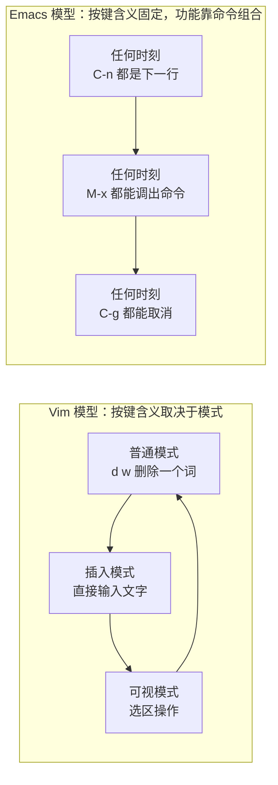
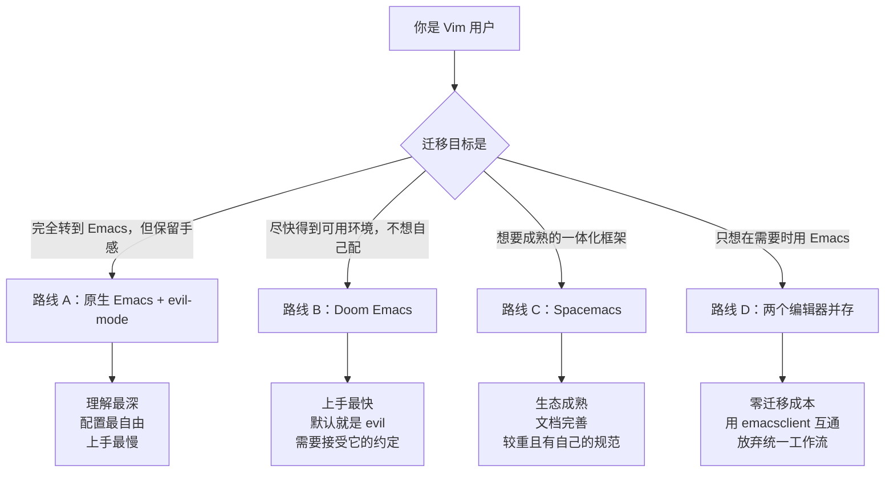
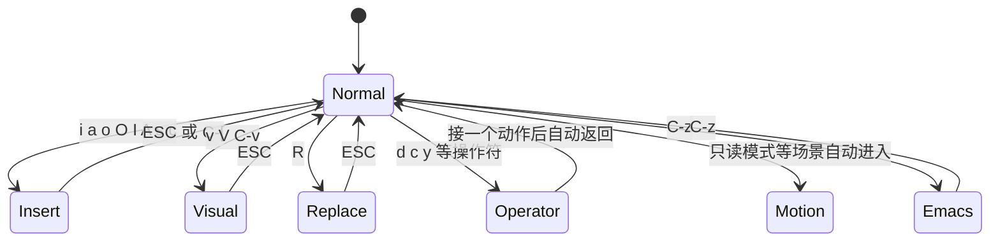
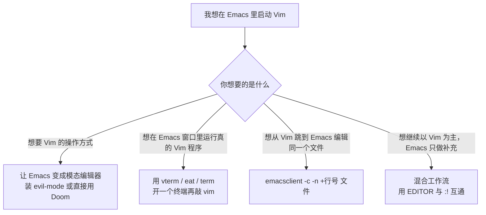

# 从 Vim 迁移

> 很多 Vim 用户想用 Emacs，却卡在同一个问题上：手不听话。本篇先讲清两套模型到底差在哪，再给出四条迁移路线，最后正面回答一个被问得最多的问题——**在 Emacs 里到底该怎么"启动 Vim"**。

---

## 一、先接受三件事

迁移失败的人，绝大多数不是因为学不会 Emacs，而是因为一开始就用 Vim 的预期去要求 Emacs。所以先把三处根本差异摆出来。

### 1.1 模态与非模态

Vim 是**模态编辑器**：同一个按键在不同模式下有不同含义，`d` 后面必须跟一个动作（`dw`、`d$`）才完整。Emacs 默认**没有模式概念**：任何时刻按下 `C-n` 都是"下一行"，`M-x` 永远能调出命令。



这不代表 Emacs 更好或更差，而是意味着：**在 Emacs 里你不需要"回到普通模式"，也就没有"忘了自己在哪个模式"的焦虑；代价是长时间按修饰键，以及必须记住命令名。** 后面要装的 evil-mode，就是把这套模态体验搬进 Emacs。

### 1.2 概念对照表

| Vim 概念 | Emacs 概念 | 差异要点 |
|----------|------------|----------|
| buffer | buffer | 基本相同，都是文件在内存中的副本 |
| window（分割） | window | **Emacs 的 window 是窗口内的一个视图区，不是操作系统的窗口** |
| tab（标签页） | tab-bar / frame | Emacs 的 frame 才是操作系统窗口；tab-bar 才是标签页 |
| `:command` | `M-x` 命令 | Emacs 里一切功能都是可调用的命令，数量级更大 |
| `.vimrc` | `init.el` | 配置语言不同：Vimscript / Lua 对 Elisp |
| 插件管理器（vim-plug 等） | `package.el` / `use-package` | Emacs 的包管理器是内置的 |
| 寄存器 register | register / kill-ring | kill-ring 是自动维护的剪切历史 |
| 宏 macro | 键盘宏 kmacro | `C-x (` 录制、`C-x )` 结束、`C-x e` 执行 |
| mark | mark | 概念相近，用法与键位不同 |
| `%` 匹配括号 | `C-M-n` / `C-M-p` / `show-paren-mode` | Emacs 靠 sexp 导航而不是符号匹配 |
| `:help` | `C-h` 全家桶 | Emacs 的帮助系统是它最被低估的部分 |

### 1.3 插件生态的生态位差异

Vim 的哲学是"小而快的编辑器，需要什么装什么"，插件之间边界清晰；Emacs 的哲学是"可编程环境"，很多功能（文件管理、Git、终端、邮件、PDF、日程）是**内置或者由内置库演化来的**。这带来两个实际后果：

- 你在 Emacs 中要装的东西可能比在 Vim 中少（例如 Dired 等价于 netrw + 一堆文件管理插件，且远比 netrw 强大）。
- 但你更需要理解"这些功能是怎么被组织的"，否则会陷入"装了八十个包却不知道它们如何协作"的状态。

---

## 二、四条迁移路线

不要一上来就问"哪个最好"。先看你要的是什么。



### 路线对比表

| 维度 | 路线 A：原生 + evil | 路线 B：Doom | 路线 C：Spacemacs | 路线 D：并存 |
|------|---------------------|--------------|-------------------|--------------|
| 上手时间 | 数小时到数天 | 十分钟 | 半小时 | 五分钟 |
| 默认 Vim 手感 | 需要自己装 evil | 默认就是 evil | 首次启动可选 vim 风格 | 不需要 |
| 配置自由度和可控性 | 最高 | 中（可用 config.el 覆盖） | 中（.spacemacs 分层） | 不涉及 |
| 学习价值 | 最高 | 中 | 中 | 低 |
| 启动速度 | 取决于你的配置 | 经过优化 | 偏慢 | 不涉及 |
| 适合谁 | 想长期掌握 Emacs 的人 | 想立刻干活的人 | 喜欢开箱框架的人 | 不确定要不要转的人 |

**建议：先走路线 D 或路线 B 中的一条，用一两周确认自己真的要用 Emacs，再决定要不要走路线 A。** 本文的重点是路线 A 与路线 D——因为它们才是"从 Vim 迁移"这件事的技术核心。

---

## 三、路线 A：手装 evil-mode

### 3.1 安装与启用

```elisp
;; 在 init.el 中：先安装再启用
(use-package evil
  :ensure t
  :init
  ;; 必须在 require evil 之前设置，否则不生效
  (setq evil-want-integration t)      ; 与 Emacs 原生键位集成
  (setq evil-want-keybinding nil)     ; 由 evil-collection 接管各模式的键位
  (setq evil-undo-system 'undo-redo)  ; 用 Emacs 28+ 内置的 undo-redo
  :config
  (evil-mode 1))                      ; 全局启用

;; evil-collection 把 evil 的键位适配到 dired、magit、help 等内置与第三方模式
(use-package evil-collection
  :ensure t
  :after evil
  :config
  (evil-collection-init))
```

如果暂时不用 `use-package`，等价的裸写法是：

```elisp
(require 'evil)
(evil-mode 1)
```

第一次启动时会从 MELPA 下载，安装完成后 `M-x evil-mode` 可以随时开关全局 evil。

### 3.2 evil 的状态机

evil 不只是"把 hjkl 绑定成方向键"，它实现了一整套**状态机**，这也是它比简单的 vi 模拟更接近 Vim 的原因。



各状态的含义：

| 状态 | 作用 | 进入方式 |
|------|------|----------|
| normal | 与 Vim 普通模式基本一致 | `ESC` 或 `C-[` |
| insert | 与 Vim 插入模式一致 | `i`、`a`、`o`、`O`、`I`、`A`、`s`、`c` 等 |
| visual | 字符/行/块可视模式 | `v`、`V`、`C-v` |
| replace | 覆盖输入 | `R` |
| operator | 按下 `d`/`c`/`y` 后等待动作的中间状态 | 自动进入并自动返回 |
| motion | 只读模式（如 Dired）中自动使用的状态 | 由模式决定 |
| emacs | 临时完全交还给 Emacs 原生按键 | `C-z` |

**`C-z` 是关键**：在普通状态按 `C-z`，evil 会切到 emacs 状态，此时 `C-f`、`C-n`、`C-y` 等原生键位全部回来；再按 `C-z` 切回普通状态。切换键由变量 `evil-toggle-key` 控制，不确定当前值时用 `C-h v evil-toggle-key RET` 查看。

另外，**Emacs 的 `C-x` 前缀在 evil 的普通状态下依然可用**——evil 只覆盖它自己定义了绑定的键位。所以在普通状态里直接按 `C-x C-f` 找文件、`C-x C-s` 保存，都正常。

### 3.3 ex 命令行

在普通状态按 `:` 会打开 evil 的 ex 命令行，支持 Vim 的一部分 ex 命令：

```vim
:w                  " 保存
:q                  " 退出当前窗口
:wq                 " 保存并退出
:e ~/.emacs.d/init.el
:%s/foo/bar/g        " 全文替换
:g/TODO/d           " 删除所有含 TODO 的行
:set nu             " 显示行号（evil 只实现了部分 :set 选项）
```

与 Vim 的差别要提前知道：**evil 实现的是 ex 命令的子集**，不是全部。在 `:` 后面按 `TAB` 可以看到当前支持的命令补全；`C-c C-c` 之类的用法在 evil 里不存在。遇到不支持的 ex 命令时，改用对应的 Emacs 命令即可（下一节有对照表）。

### 3.4 一份可直接使用的 evil 配置

```elisp
(use-package evil
  :ensure t
  :init
  (setq evil-want-integration t)
  (setq evil-want-keybinding nil)
  (setq evil-undo-system 'undo-redo)
  ;; 搜索时不要移动光标（与 Vim 默认一致）
  (setq evil-search-module 'evil-search)
  (setq evil-ex-search-vim-style-regexp t)
  (setq evil-split-window-below t)    ; :sp 在下方分割
  (setq evil-vsplit-window-right t)   ; :vsp 在右侧分割
  (setq evil-shift-width 4)           ; >> 与 << 的缩进宽度
  :config
  (evil-mode 1)
  ;; 让 C-u / C-d 保持 Emacs 的"翻页"含义以外的行为时，用下面这行
  ;; 在普通状态下用 M-数字前缀代替 Vim 的计数前缀（evil 已支持 3j 这类计数）
  (define-key evil-normal-state-map (kbd "C-h") 'evil-window-left)
  (define-key evil-normal-state-map (kbd "C-j") 'evil-window-down)
  (define-key evil-normal-state-map (kbd "C-k") 'evil-window-up)
  (define-key evil-normal-state-map (kbd "C-l") 'evil-window-right))

(use-package evil-collection
  :ensure t
  :after evil
  :config
  (evil-collection-init))
```

`evil-window-left` / `evil-window-down` / `evil-window-up` / `evil-window-right` 是 evil 提供的窗口切换函数，把它们绑到 `C-h/j/k/l` 上，就得到 Vim 用户熟悉的"Ctrl+方向键切分屏"手感。

### 3.5 值得一起装的 Vim 风格增强包

| 包 | 对应的 Vim 能力 | 说明 |
|----|-----------------|------|
| [evil-surround](https://github.com/emacs-evil/evil-surround) | vim-surround | `cs"'`、`ds"`、`ysiw)` 全套 |
| [evil-nerd-commenter](https://github.com/redguardtoo/evil-nerd-commenter) | vim-commentary | `gcc`、`gc` 注释切换 |
| [evil-matchit](https://github.com/redguardtoo/evil-matchit) | matchit | `%` 在 HTML/if-end 等结构间跳转 |
| [evil-easymotion](https://github.com/PythonNut/evil-easymotion) | vim-easymotion | 快速跳转到任意位置 |
| [avy](https://github.com/abo-abo/avy) | vim-sneak / easymotion | Emacs 侧最常用的跳转包，可与 evil 配合 |
| [expand-region.el](https://github.com/magnars/expand-region.el) | 无直接对应 | 逐级扩大选区，Vim 用户会很喜欢 |
| [multiple-cursors.el](https://github.com/magnars/multiple-cursors.el) | vim-multiple-cursors | 多光标编辑 |
| [smartparens](https://github.com/Fuco1/smartparens) | auto-pairs | 括号自动配对与结构化编辑 |
| [undo-fu](https://codeberg.org/ideasman42/emacs-undo-fu) | Vim 的撤销树手感 | 提供接近 Vim 的撤销/重做语义 |
| [undo-tree](https://elpa.gnu.org/packages/undo-tree.html) | undotree | 可视化撤销历史树 |

---

## 四、在 Emacs 里"启动 Vim"到底指什么

这个问题有四种完全不同的含义，很多争论其实是在各说各话。下面逐条给出做法。



### 4.1 含义一：我想要 Vim 的操作方式

这就是上一节的 evil-mode，或者直接用 Doom Emacs（它默认就是 evil）。此时"启动 Vim"= 启动 Emacs，按键体验是 Vim 的。

### 4.2 含义二：我想在 Emacs 窗口里跑真正的 Vim 程序

可以，而且很实用。Emacs 有终端模拟器，终端里当然可以运行 Vim。

**方案一：vterm（推荐，性能最好）**

```elisp
;; 需要编译原生模块，安装前先准备 cmake 与 libtool
(use-package vterm
  :ensure t
  :commands vterm
  :bind ("C-c t" . vterm))
```

安装依赖：

```bash
# Debian / Ubuntu
sudo apt install cmake libtool libtool-bin

# Arch Linux
sudo pacman -S cmake libtool

# macOS
brew install cmake libtool
```

Windows 上 `vterm` 需要 MSYS2 环境编译，成功率不高，建议改用下面的 `eat`。

然后在 `vterm` 缓冲区里直接敲：

```bash
vim ~/.emacs.d/init.el
```

这会启动一个**真正的 Vim 进程**，你在里面看到的界面、`:help`、插件全部是货真价实的 Vim。有一个关键点：在 vterm 里运行 Vim 时，**Vim 拿不到 Emacs 的按键映射**，它是独立进程，所以按 `Esc` 返回 Vim 的普通模式是有效的；但 vterm 自身也有一个"复制模式"（`vterm-copy-mode`），需要用键位（默认 `C-c C-t`）进出，具体以 `C-h b` 在该缓冲区内的显示为准。

**方案二：eat（纯 Elisp，无编译依赖）**

eat 是一个纯 Elisp 实现的终端模拟器，项目地址在 [codeberg.org/akib/emacs-eat](https://codeberg.org/akib/emacs-eat)，安装后 `M-x eat` 即可。它在性能上不如 vterm，但胜在零编译依赖、跨平台一致，对"只想在 Emacs 里跑一次 Vim"这种需求完全够用。

**方案三：内置 term / ansi-term**

`M-x ansi-term` 是 Emacs 内置方案，不需要装任何东西。它对全屏 TUI 程序的支持不如前两者，主要问题是**字符模式下控制字符的处理**：`term` 有行模式与字符模式（`C-c C-j` 切换），`C-c`、`C-\` 这类按键的行为与真实终端存在差异，实际使用时用 `C-h b` 查看当前缓冲区内的绑定最可靠。如果只是想临时跑个 Vim，可以接受；长期使用建议换 vterm 或 eat。

**为什么要在 Emacs 里跑 Vim 而不是直接开一个终端窗口？**

- 所有内容都在同一套键位与主题里，切换成本低。
- 可以用 Emacs 的复制粘贴、搜索（在当前缓冲区里 `C-s`）处理终端输出。
- 在学习 Emacs 的过渡期作为"降落伞"，随时能回到熟悉的环境。

### 4.3 含义三：从 Vim 跳到 Emacs 编辑同一个文件

这是**混合工作流最有价值的一条**：Vim 里正在编辑的文件，按一个键交给 Emacs 打开，编辑完回到 Vim 继续。

先启动 Emacs 守护进程，这样每次调用都是瞬间打开：

```bash
# 启动守护进程（只启动一次）
emacs --daemon
```

然后在 Vim 里加一条命令（写进 `.vimrc`）：

```vim
" 把当前文件在当前行位置交给 Emacs 打开
command! -bar EmacsEdit execute '!emacsclient -c -n +' . line('.') . ' ' . shellescape(expand('%:p'))

" 顺便给个快捷键
nnoremap <leader>e :EmacsEdit<CR>
```

`emacsclient` 的参数含义：

| 参数 | 含义 |
|------|------|
| `-c` | 创建一个新的图形窗口（frame） |
| `-n` | 不等待，立刻返回（否则 Vim 会卡住等 Emacs 关闭） |
| `-t` | 在当前终端里打开（适合纯终端环境，如 `:terminal` 里） |
| `-a ""` | 如果守护进程没启动，就先启动它再连接 |
| `+N` | 跳到第 N 行 |

如果 Vim 运行在远程服务器、Emacs 运行在本地，可以用 `-t` 配合 SSH 与端口转发，或者反向使用——把 Emacs 也跑在服务器上。

### 4.4 含义四：想继续以 Vim 为主，只借 Emacs 的部分能力

最常见的两种借法：

**借 Emacs 当 Git 提交编辑器（比 Vim 里写提交信息舒服）**

```bash
# 需要守护进程已启动
git config --global core.editor "emacsclient -c -a ''"
```

**借 Emacs 当某些工具的外部编辑器**

```bash
export EDITOR="emacsclient -t -a ''"   # 终端场景
export VISUAL="emacsclient -c -a ''"   # 图形场景
```

这样 `crontab -e`、`sudoedit`、`git commit` 等所有遵守 `EDITOR` 约定的工具都会交给 Emacs。想改回 Vim 只要取消这两行环境变量即可，**这是一次零风险的双向切换**。

### 4.5 反向：从 Emacs 回到 Vim

如果 Emacs 里你想直接调用系统 Vim，最简单的方式是在终端缓冲区里敲 `vim`；如果想用当前文件打开，可以写一个小命令：

```elisp
(defun my-open-in-vim ()
  "用系统 Vim 打开当前文件，并定位到当前行。"
  (interactive)
  (let ((file (or buffer-file-name
                   (user-error "当前缓冲区没有关联文件")))
        (line (line-number-at-pos)))
    (start-process "vim" nil "vim" (format "+%d" line) file)
    (message "已在新终端启动 Vim：%s" file)))
```

图形界面下 `start-process` 启动的终端程序能否显示取决于你的终端配置，更可靠的做法是在 vterm 里执行。这条命令的意义在于**心理上**：你知道随时可以回去，就不会因为焦虑而放弃 Emacs。

---

## 五、键位对照大全

下面按功能分组。左侧是 Vim，右侧是 Emacs 原生，最后一列是 evil 下的情况。

### 5.1 移动

| Vim | Emacs 原生 | evil 下 |
|-----|------------|---------|
| `h` `j` `k` `l` | `C-b` `C-n` `C-p` `C-f` | 与 Vim 相同 |
| `w` `b` `e` | `M-f` `M-b` `M-e` | 与 Vim 相同 |
| `0` `^` `$` | `C-a` `M-m` `C-e` | 与 Vim 相同 |
| `gg` `G` | `M-<` `M->` | 与 Vim 相同 |
| `C-d` `C-u` | `C-v` `M-v` | `C-d` 保留 Vim 语义 |
| `%` | `C-M-n` / `C-M-p`（按括号对跳转） | 需 `evil-matchit` |
| `f` `t` `;` `,` | `C-s` 搜索 / `avy` 跳转 | 与 Vim 相同（`avy` 更强） |
| `{` `}` | `M-{` `M-}`（按段落移动） | 与 Vim 相同 |
| `zz` `zt` `zb` | `C-l`（把当前行移到屏幕中央） | 与 Vim 相同 |

### 5.2 编辑

| Vim | Emacs 原生 | 说明 |
|-----|------------|------|
| `x` | `C-d` | 删除一个字符 |
| `dd` | `C-a C-k` 或 `M-x kill-line` | 删除整行；Emacs 的 `C-k` 删除到行尾 |
| `dw` | `M-d` | 删除一个词 |
| `d$` | `C-k` | 删除到行尾 |
| `yy` | `M-w`（复制）配合选区 | Emacs 没有"整行 yank"的单键，`M-w` 复制选区 |
| `p` `P` | `C-y` | 粘贴；Emacs 的 `C-y` 与 Vim 的 `C-y`（上滚一行）冲突 |
| `u` | `C-/` 或 `C-_` 或 `C-x u` | 撤销 |
| `C-r` | `M-x undo-redo`（28+）或 `C-g C-/` | 重做；Emacs 的 `C-r` 是反向搜索 |
| `ciw` `ci"` | 无直接对应，`expand-region` 最接近 | 结构化修改是 evil-surround 的领域 |
| `>>` `<<` | `C-c C->`? 用 `M-x indent-rigidly` 或选中后 `TAB` | evil 下 `>>` 与 `<<` 可用 |
| `gcc` | `M-;`（`comment-dwim`） | 注释切换，Emacs 原生一个键搞定 |
| `J` | `M-^`（`delete-indentation`） | 合并两行 |
| `~` | 无直接对应 | 大小写转换用 `M-u` `M-l` `M-c` |
| `gu` `gU` | `M-l` `M-u` | 小写/大写 |

### 5.3 搜索与替换

| Vim | Emacs 原生 | 说明 |
|-----|------------|------|
| `/` `?` | `C-s` `C-r` | 增量搜索，边输边跳 |
| `n` `N` | `C-s` `C-s`（重复上一次搜索）/ `C-r` | 重复搜索 |
| `*` | `C-s C-w` 或 `M-x isearch-forward-symbol-at-point` | 搜索光标下的词 |
| `:%s/a/b/g` | `M-x query-replace` 或 `C-M-%`（正则） | 交互式替换 |
| `:g/pat/d` | `M-x delete-matching-lines` | 删除匹配行 |
| `:vimgrep` | `M-x rgrep` / `consult-ripgrep` | 项目内搜索 |

### 5.4 文件、窗口、缓冲区

| Vim | Emacs 原生 | 说明 |
|-----|------------|------|
| `:e file` | `C-x C-f` | 打开文件 |
| `:w` | `C-x C-s` | 保存 |
| `:q` | `C-x C-c`（退出 Emacs）/ `C-x k`（关闭缓冲区） | **注意 `:q` 在 evil 里关闭窗口而不是退出 Emacs** |
| `:sp` `:vsp` | `C-x 2` `C-x 3` | 水平/垂直分割 |
| `C-w h/j/k/l` | `C-x o` 或方向键配合 `windmove` | 在窗口间移动 |
| `:bd` | `C-x k` | 关闭缓冲区 |
| `:ls` | `C-x C-b` 或 `M-x ibuffer` | 列出缓冲区 |
| `gt` `gT` | `C-x t o` / `tab-bar-switch-to-tab` | 切换标签页（需 `tab-bar-mode`） |
| `:terminal` | `M-x vterm` / `M-x eat` / `M-x shell` | 打开终端 |

### 5.5 宏、寄存器、标记

| Vim | Emacs 原生 | 说明 |
|-----|------------|------|
| `q` 录制 / `@` 执行 | `C-x (` / `C-x )` / `C-x e` | evil 下 Vim 的录制方式可用 |
| `"ayy` / `"ap` | `C-x r` 系列寄存器命令 | Emacs 的 register 用 `C-x r s` / `C-x r i` |
| `ma` / `` `a `` | `C-x r SPC a` / `C-x r j a` | Emacs 的 register 也存位置 |
| `Ctrl-o` / `Ctrl-i` | `M-x pop-global-mark` | 跳转历史 |
| `.` 重复上次修改 | 无对应命令 | Emacs 里靠键盘宏或多次 `C-x z`（`repeat`） |

---

## 六、`:` 命令到 `M-x` 命令的对照

Vim 的 ex 命令对应到 Emacs 就是"调用一个命令"。下面是最常用的对照。

| Vim ex | Emacs 等价 | 备注 |
|--------|------------|------|
| `:w` | `C-x C-s` | 另存为用 `C-x C-w` |
| `:q` / `:q!` | `C-x k` 后按 `!` 强制 | 丢弃修改并关闭缓冲区 |
| `:wq` / `:x` | `C-x C-s C-x k` | Emacs 里保存与关闭是两个动作 |
| `:e .` | `C-x d` | 打开 Dired 文件管理器 |
| `:e!` | `M-x revert-buffer` | 从磁盘重新读取 |
| `:set nu` | `M-x display-line-numbers-mode` | |
| `:set paste` | `M-x electric-indent-mode` 关闭 | Emacs 侧对应的是缩进行为 |
| `:help xxx` | `C-h f` / `C-h v` / `C-h k` | 按"函数/变量/按键"分别查 |
| `:make` | `M-x compile` | 通用命令执行框架 |
| `:grep` | `M-x rgrep` | |
| `:terminal` | `M-x vterm` | |
| `:cd` | `M-x cd` | 修改当前缓冲区的默认目录 |
| `:!cmd` | `M-x shell-command` 或 `M-!` | 执行一次性外部命令 |
| `:r file` | `M-x insert-file` | 把文件内容插入当前位置 |
| `:normal @q` | `M-x apply-macro-to-region-lines` | 对每行执行宏 |
| `:bufdo` | 无直接对应 | 用 `ibuffer` 标记后批量操作，或写一段 Elisp |

---

## 七、Vim 插件到 Emacs 包的对照

| Vim 插件 | Emacs 对应 | 说明 |
|----------|------------|------|
| vim-plug / lazy.nvim | `package.el` + `use-package` | 内置，无需额外安装 |
| NERDTree / nvim-tree | Dired、[treemacs](https://github.com/Alexander-Miller/treemacs)、dirvish | Dired 是内置的，先学它 |
| fzf / telescope | [consult](https://github.com/minad/consult) + vertico | 模糊查找文件、缓冲区、搜索 |
| CtrlP | vertico + consult | 同上 |
| vim-airline / lualine | [doom-modeline](https://github.com/seagle0128/doom-modeline)、mood-line | 状态栏 |
| gruvbox / tokyonight | modus-themes、[doom-themes](https://github.com/doomemacs/themes)、catppuccin | 主题 |
| vim-fugitive | [Magit](https://github.com/magit/magit) | 功能远超 fugitive |
| vim-commentary | `M-;`（内置）或 [evil-nerd-commenter](https://github.com/redguardtoo/evil-nerd-commenter) | |
| vim-surround | [evil-surround](https://github.com/emacs-evil/evil-surround) | |
| auto-pairs | [smartparens](https://github.com/Fuco1/smartparens) 或内置 `electric-pair-mode` | |
| ALE / coc.nvim | [eglot](https://elpa.gnu.org/packages/eglot.html)（Emacs 29 起内置）、[lsp-mode](https://github.com/emacs-lsp/lsp-mode) | |
| nvim-cmp | [corfu](https://github.com/minad/corfu) + cape | |
| vim-easymotion / sneak | [avy](https://github.com/abo-abo/avy)、[evil-easymotion](https://github.com/PythonNut/evil-easymotion) | |
| undotree | [undo-fu](https://codeberg.org/ideasman42/emacs-undo-fu)、[undo-tree](https://elpa.gnu.org/packages/undo-tree.html) | |
| vimwiki | Org mode、org-roam | |
| vimtex | AUCTeX | |
| vim-tmux-navigator | `windmove` + 窗口键位 | 需要配合 tmux 配置 |
| which-key.nvim | which-key（Emacs 30 起内置） | 按下前缀键后显示可用后续键 |

---

## 八、肌肉记忆冲突清单

从 Vim 迁移到 Emacs，最危险的不是"不会用"，而是"手比脑快"。下面这些冲突会导致实际的数据损失，请认真读一遍。

| 按键 | Vim 里是 | Emacs 里是 | 风险 | 处理建议 |
|------|----------|------------|------|----------|
| `C-w` | 删除前一个词（插入模式） | 剪切选中区域 | 中 | 用 evil 时注意状态；误切后 `C-/` 撤销 |
| `C-y` | 向上滚动一行 | 粘贴 | 中 | 用 evil 后语义回到 Vim |
| `C-r` | 重做 | 反向增量搜索 | 低 | 用 evil 后语义回到 Vim |
| `C-a` | 行首 / 数字加一 | 行首（同 Vim） | 低 | 一致 |
| `C-x` | 数字减一 | 极重要的前缀键 | 低 | evil 普通状态下未被覆盖 |
| `C-u` | 上翻半屏 | 通用前缀参数 | 中 | 在 Emacs 里 `C-u 3 C-n` 表示"往下 3 行" |
| `ESC` | 退出插入模式 | 元键（等同 `M-`） | 高 | 在终端里 `ESC` 有延迟，用 `C-[` 代替更稳 |
| `C-[` | 等同 ESC | 等同 ESC | 低 | 与 Vim 一致，可放心使用 |
| `C-c` | 无特殊含义 | 用户自定义前缀 | 低 | Emacs 惯例把 `C-c + 字母` 留给用户 |
| `C-g` | 无 | 取消当前操作 | 低 | **Emacs 里最重要的键**，任何卡住都先按它 |
| `C-h` | 左移一个字符 | 帮助前缀 | 高 | 在 evil 普通状态下 `h` 才是左移；`C-h` 是帮助 |

一条经验：**在 Emacs 里养成"先按 `C-g`"的条件反射**。命令输错、搜索卡住、minibuffer 里迷路、执行太久想中止，全都是 `C-g`。这个键在 Vim 里没有对应物，但它可能是 Emacs 里你最常用的键。

### 8.1 过渡期的三个建议

1. **前两周不要折腾配置。** 用 evil（或 Doom）把 Vim 手感保住，把精力放在理解 buffer、window、minibuffer、帮助系统上。
2. **每天强制自己用一次原生 Emacs 键位。** 比如强制用 `C-x C-s` 保存、`C-x C-f` 打开文件。这些是 Emacs 的"公共语汇"，绕开它们会让你之后读不懂别人的配置。
3. **把"卡住"当成信号。** 每次卡住都追问一句"Emacs 里这件事对应哪个命令"，然后用 `C-h` 查出来。三个月后你会发现自己在 Emacs 里比在 Vim 里更少卡住。

---

## 九、Doom Emacs 与 Spacemacs 快速上手

如果你选择路线 B 或 C，这里给出最小可用步骤。

### 9.1 Doom Emacs

```bash
# 备份原有配置（如果 ~/.emacs.d 已有内容）
mv ~/.emacs.d ~/.emacs.d.bak

# 克隆并安装
git clone --depth 1 https://github.com/doomemacs/doomemacs ~/.config/emacs
~/.config/emacs/bin/doom install
```

安装后：

| 操作 | 命令 |
|------|------|
| 应用配置改动 | `doom sync` |
| 升级 Doom 与包 | `doom upgrade` |
| 诊断环境 | `doom doctor` |
| 打开配置文件 | `SPC f p` 或直接编辑 `~/.config/doom/config.el` |
| 调用任意 Emacs 命令 | `SPC :` |

Doom 的三个核心文件：`init.el`（模块开关）、`config.el`（个人配置）、`packages.el`（声明额外包）。它的默认键位是 evil，`SPC` 是 leader 键。Windows 下配置目录是 `%APPDATA%\doom`。

### 9.2 Spacemacs

```bash
git clone https://github.com/syl20bnr/spacemacs ~/.emacs.d
```

首次启动会询问编辑风格，选择 `vim` 即可获得 Vim 键位（还有 `emacs` 与 `hybrid` 两种）。个人配置写在用户主目录的 `.spacemacs` 文件中，`SPC` 是 leader 键，按下 `SPC` 后稍等即可看到 which-key 提示的后续按键（例如 `SPC f e d` 打开配置文件）。

### 9.3 什么时候该离开框架

两个信号：**第一**，你开始频繁地"绕过"框架的约定；**第二**，你读不懂启动过程发生了什么。这时就该考虑回到路线 A，用自己的配置重建一个你完全理解的环境。框架的价值是让你快速用起来，不是永远替你做决定。

---

## 十、混合工作流的取舍

最后给一份实用建议。如果你一时决定不了，就按这张表分工。

| 任务 | 建议工具 | 理由 |
|------|----------|------|
| 快速改一行配置、临时看一个文件 | Vim | 启动快，不打断思路 |
| 长时间写代码、多文件重构 | Emacs | 补全、LSP、Magit、项目导航一体化 |
| 写文档、写笔记 | Emacs（Org / Markdown） | Org 的能力在 Vim 侧没有对等物 |
| Git 操作 | 任意，但推荐 Magit | 复杂操作（拆提交、交互式变基）在 Magit 里更快 |
| 远程服务器上临时编辑 | Vim（或用 TRAMP + Emacs） | 取决于服务器是否装了 Emacs |
| 提交信息、crontab 等外部编辑器场景 | `EDITOR=emacsclient` | 两端都能用，随时切换 |

---

## 十一、常见问题

| 现象 | 原因 | 解决 |
|------|------|------|
| evil 装完没反应 | `evil-mode` 没启用，或包没装成功 | 确认 `(evil-mode 1)`，用 `M-x list-packages` 看是否已安装 |
| 在 Dired 里按 `j` 没反应 | evil 未适配该模式 | 安装并初始化 `evil-collection` |
| 终端里按 Esc 有明显延迟 | 终端无法区分单独的 ESC 与转义序列的开头 | 用 `C-[` 代替，或使用图形界面版 Emacs |
| `:q` 没有退出 Emacs | evil 的 `:q` 关闭的是当前窗口 | 退出 Emacs 用 `C-x C-c` |
| `C-w` 把整段文字删掉了 | `C-w` 在 Emacs 里是剪切选区 | `C-/` 撤销，之后注意所处状态 |
| 想临时用原生 Emacs 键位 | 不必改配置 | 普通状态下按 `C-z` 切到 emacs 状态 |
| vterm 里 Vim 显示错乱 | 缺少 vterm 模块或行高设置问题 | 确认模块编译成功（`M-x vterm` 有报错会提示），或改用 `eat` |
| 中文输入法在 evil 下异常 | 输入法切换键与 evil 状态键冲突 | 调整输入法的切换键，或只在插入状态下切换 |
| `emacsclient` 报 "can't find socket" | 守护进程没启动 | 先执行 `emacs --daemon`，或用 `-a ""` 让它自动启动 |
| 想彻底回到 Vim | 正常卸载即可 | 删掉 `~/.emacs.d`（先备份），Vim 的配置一直都在 |

---

## 小结

- Emacs 与 Vim 的差异不在键位，而在"模态 / 非模态"和"编辑器 / 可编程环境"这两层模型上；先接受模型，键位只是习惯问题。
- 想在 Emacs 里获得 Vim 手感，装 evil-mode（或直接用 Doom）；在 Emacs 里跑真正的 Vim，用 vterm 或 eat 开终端；两端互通，用 `emacsclient -c -n +行号`。
- 最危险的是肌肉记忆冲突，尤其是 `C-w`、`C-y`、`C-r`、`ESC`。养成先按 `C-g` 的习惯。
- 迁移期不要追求一步到位。保留 Vim 作为降落伞，用 `EDITOR` 与 `:!emacsclient` 打通两端，是不会失败的做法。

---

## 相关章节

- [[emacs教程/1入门/02_内置教程与基本操作|内置教程与基本操作]]：先掌握 Emacs 自己的基本操作
- [[emacs教程/1入门/03_配置文件从零开始|配置文件从零开始]]：把 evil 装进自己的配置
- [[emacs教程/1入门/04_包管理与use-package|包管理与 use-package]]：理解 evil 与 evil-collection 的加载方式
- [[emacs教程/3配置实践/03_键位系统设计|键位系统设计]]：leader 键、which-key 与键位冲突排查
- [[emacs教程/5开发环境集成/06_终端Shell与远程开发|终端 Shell 与远程开发]]：vterm、eat、eshell 的完整对比
- [[vim教程|Vim 编辑器教程]]：本仓库的 Vim 教程，对照阅读效率更高
