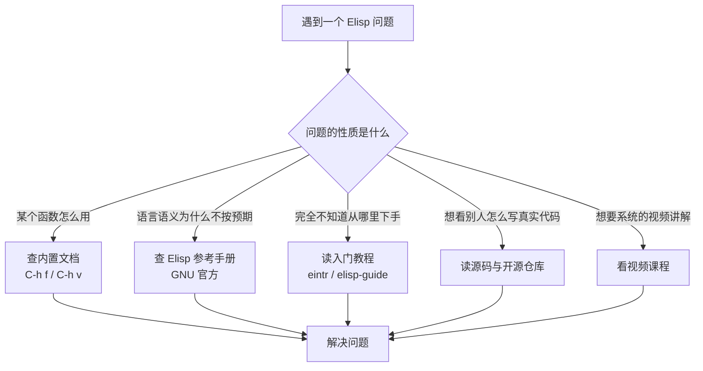

# Elisp 学习资源与视频

> 这一篇是本模块的资源索引：官方手册、开源仓库、中文资料、视频课程、社区，以及"什么时候该用哪一份"。本篇不替代后续章节，而是让你在遇到具体问题时知道该去哪里查。

本篇列出的每一个链接都在撰写时用 `curl` 验证过可访问（返回 200）。如果你发现某个链接失效，属于正常的互联网衰减，请以搜索到的同名项目为准。

---

## 一、先建立一个正确的资源观

学 Elisp 最常见的误区是"收藏了一堆教程，一个都没读完"。这背后是一个结构性问题：Elisp 的学习资料分成完全不同的四类，它们的用途不一样，混着看就会混乱。

四类资源的定位：

| 类型 | 代表 | 什么时候用 | 不要用它做什么 |
|------|------|------------|----------------|
| 内置文档 | `C-h f`、`C-h v`、`C-h k` | 日常最高频，占你查询量的八成 | 不适合系统学习语言语义 |
| 官方手册 | Elisp 参考手册、Emacs 手册 | 查语义细节、版本差异、权威定义 | 不适合当入门读物（太厚） |
| 入门教程与书 | eintr、elisp-guide、本模块 | 建立整体认知 | 不适合查具体函数的参数 |
| 源码与开源仓库 | emacs-mirror、各类包 | 学真实写法、找最佳实践 | 不适合零基础直接读 |

**最重要的一条建议：把 `C-h f` 和 `C-h v` 当成你的第一查询工具，而不是网页搜索。** Emacs 内置文档的质量和完整性远超绝大多数软件的文档，而且它永远与你的版本一致。

---

## 二、官方手册（权威但厚重）

### 2.1 GNU Emacs Lisp 参考手册

- 分节点版：[gnu.org/software/emacs/manual/html_node/elisp/](https://www.gnu.org/software/emacs/manual/html_node/elisp/)
- 单页版（适合全文搜索与打印）：[gnu.org/software/emacs/manual/html_mono/elisp.html](https://www.gnu.org/software/emacs/manual/html_mono/elisp.html)

这是 Elisp 的**权威定义**，由 GNU 维护，与你的 Emacs 版本一一对应。它的组织方式是按语言要素分章：数据类型、求值、变量、函数、宏、控制结构、缓冲区、文本、键映射、模式、包……几乎你在本模块学到的每个概念，都能在这里找到最精确的表述。

使用建议：

- 不要从头读。它的定位是**参考书**，遇到"这个函数的边界行为是什么"这类问题时按需查。
- 在 Emacs 里可以直接读离线版：`C-h i` 打开 Info 手册，选择 `Elisp` 节点。离线版的好处是可以用 Emacs 的搜索与跳转，比浏览器体验好。
- 注意手册页面顶部的版本标注，确认与你使用的 Emacs 版本一致。

### 2.2 GNU Emacs 手册（用户手册）

- [gnu.org/software/emacs/manual/html_node/emacs/](https://www.gnu.org/software/emacs/manual/html_node/emacs/)

这是**使用** Emacs 的手册，不是写 Elisp 的手册。在本教程体系里，它的价值在于：本模块讲的每个功能（Dired、Org、Magit 之外的任何内置功能）都能在这里找到官方说明。配套的 Info 版本在 Emacs 里用 `C-h r` 打开。

### 2.3 《Programming in Emacs Lisp》入门书

- [gnu.org/software/emacs/manual/html_node/eintr/](https://www.gnu.org/software/emacs/manual/html_node/eintr/)

社区通常称它为 **eintr**（文件名 `emacs-lisp-intro`）。这是 GNU 官方出的入门书，写给**没有编程经验的人**，从"什么是列表"讲到"怎么写一个函数并把它绑到键位上"。特点是：

- 循序渐进，例子丰富，每章都有练习。
- 因为面向初学者，有编程基础的人读起来会觉得啰嗦，但**它的练习质量很高**，可以只做练习跳过讲解。
- 在 Emacs 里用 `C-h i` 选 `Emacs Lisp Intro` 可以直接读中文以外的原生版本。

### 2.4 Org 手册

- [orgmode.org/manual/](https://orgmode.org/manual/)

Org mode 自带手册，是 Emacs 生态里文档质量最高的项目之一。学习 Org 相关 Elisp（`org-capture`、`org-agenda`、`org-babel`）时必备。

### 2.5 Emacs Wiki 与源码

- [emacswiki.org](https://www.emacswiki.org/)：社区积累二十余年的经验库。**质量参差不齐**，是它的真实状况：有些页面是宝藏，有些过时十年。用它搜索"某个奇怪问题的偏方"效果最好，不要用它学语言。
- [github.com/emacs-mirror/emacs](https://github.com/emacs-mirror/emacs)：Emacs 源码的 GitHub 镜像。想在浏览器里搜索 `simple.el`、`subr.el`、`window.el` 的实现在哪一行时非常方便。

---

## 三、开源仓库：读别人的 Elisp

这一节是本篇的核心。下面的仓库按"适合什么人"排列，你可以按顺序取用。

### 3.1 入门级：从零理解语言

| 仓库 | 语言 | 适合谁 | 说明 |
|------|------|--------|------|
| [chrisdone/elisp-guide](https://github.com/chrisdone/elisp-guide) | 英文 | 有编程基础、想快速搞懂语义 | 一份紧凑的 Elisp 速通指南，讲清"求值、列表、闭包、缓冲区和文本操作"这几件核心事，读完就能看懂别人的配置 |
| [caiorss/Emacs-Elisp-Programming](https://github.com/caiorss/Emacs-Elisp-Programming) | 英文 | 想要大量可运行示例 | 以笔记与示例组织，覆盖面广（语言基础、缓冲区操作、宏、界面、包开发），偏"代码片段合集"风格 |
| [hypernumbers/learn_elisp_the_hard_way](https://github.com/hypernumbers/learn_elisp_the_hard_way) | 英文 | 喜欢习题驱动 | 仿"Learn X the Hard Way"的练习册形式，边做边学；内容仍在补完中，适合当练习题使用 |
| [learnxinyminutes.com/docs/elisp](https://learnxinyminutes.com/docs/elisp/) | 英文 | 想一小时速览语法 | 单页速查，一屏一个大知识点，适合复习不适合入门 |
| [emacs-tw/emacs-101-beginner-survival-guide](https://github.com/emacs-tw/emacs-101-beginner-survival-guide) | 繁体中文 | 中文读者 | 台湾 Emacs 社区的新手指南，从操作讲到简单 Elisp，繁体中文写作 |

### 3.2 进阶级：写包与工程实践

| 仓库 | 语言 | 适合谁 | 说明 |
|------|------|--------|------|
| [alphapapa/emacs-package-dev-handbook](https://github.com/alphapapa/emacs-package-dev-handbook) | 英文 | 准备写并发布包的人 | 从文件头规范、命名约定、宏的写法到测试与发布，是目前最系统的"Emacs 包开发手册" |
| [jwiegley/use-package](https://github.com/jwiegley/use-package) | 英文 | 所有写配置的人 | 它的 README 本身就是最好的 `use-package` 文档，比任何二手教程都准确 |
| [Wilfred/helpful](https://github.com/Wilfred/helpful) | 英文 | 想看懂内置函数的人 | 一个增强版的帮助界面，能显示函数的源码、调用者、被谁 advice 过。装上它，`C-h f` 的价值会翻倍 |
| [Wilfred/elisp-refs](https://github.com/Wilfred/elisp-refs) | 英文 | 想知道"这个函数被谁用了" | 查找函数与变量的引用，读源码的利器 |
| [emacs-elsa/Elsa](https://github.com/emacs-elsa/Elsa) | 英文 | 写包的人 | Emacs Lisp 静态分析器，能在运行前发现未定义函数一类的问题 |
| [emacs-tw/awesome-emacs](https://github.com/emacs-tw/awesome-emacs) | 英文 | 需要找包的人 | 按领域分类的包索引。当你想"Emacs 里有没有做 X 的包"时，先查这里 |

### 3.3 学习范本级：读真实配置

读别人写好的配置，是进步最快的方式之一，但要注意**只读，不要直接抄**。

| 仓库 | 说明 |
|------|------|
| [purcell/emacs.d](https://github.com/purcell/emacs.d) | 极其经典的一份配置，结构清晰、注释克制，适合作为"如何组织配置"的范本 |
| [bbatsov/prelude](https://github.com/bbatsov/prelude) | 有观点、有文档、有模块划分，很多人的第一个 Emacs 环境 |
| [redguardtoo/emacs.d](https://github.com/redguardtoo/emacs.d) | 中文作者（陈斌）的配置，以**启动速度**和实用性著称，性能优化的思路值得学 |
| [seagle0128/.emacs.d](https://github.com/seagle0128/.emacs.d) | Centaur Emacs，中文作者，界面美观、开箱可用，适合看"一个完整的现代配置长什么样" |
| [doomemacs/doomemacs](https://github.com/doomemacs/doomemacs) | 不是一个配置，而是一个配置**框架**。它最有价值的部分是 `modules/` 目录：几乎每个主流语言、每个常用工具的推荐配置都在里面 |
| [syl20bnr/spacemacs](https://github.com/syl20bnr/spacemacs) | 另一个框架，`layers/` 目录的组织方式与文档规范值得学习 |

### 3.4 中文资源

| 资源 | 说明 |
|------|------|
| [redguardtoo/mastering-emacs-in-one-year-guide](https://github.com/redguardtoo/mastering-emacs-in-one-year-guide) | 《一年成为 Emacs 高手》，简体中文。不讲语法细节，讲**方法与心态**：如何排查问题、如何管理配置、哪些弯路不必走。建议在开始折腾配置之前读一遍 |
| [zilongshanren/Spacemacs-rocks](https://github.com/zilongshanren/Spacemacs-rocks) | 子龙山人的《Spacemacs Rocks》配套材料，简体中文，以 Spacemacs 为例讲解 Emacs 的日常使用与配置思路 |
| [lujun9972/emacs-document](https://github.com/lujun9972/emacs-document) | Emacs 文档的中文翻译项目。当官方手册的英文让你读不下去时，可以对照使用 |
| [emacs-china.org](https://emacs-china.org/) | 中文 Emacs 社区论坛。提问质量整体较高，搜索历史帖子常常能直接解决问题 |

### 3.5 用 Emacs 自己探索源码

比读仓库更高效的方式，是在 Emacs 里直接跳到实现：

| 操作 | 效果 |
|------|------|
| `C-h f 函数名 RET` | 查看函数文档，从帮助缓冲区可直接跳到源码 |
| `M-.`（`xref-find-definitions`） | 跳到定义处 |
| `M-,` | 跳回 |
| `M-x find-function RET 函数名 RET` | 直接打开定义该函数的源文件 |
| `M-x find-variable RET 变量名 RET` | 打开定义该变量的位置 |
| `M-x describe-keymap RET 键位图 RET` | 查看某个键位图里绑定了什么 |
| `M-x locate-library RET 库名 RET` | 找到库文件的实际路径 |

配合 `helpful` 与 `elisp-refs`，你就拥有了一个比任何网页文档都更完整的本地知识库。

---

## 四、视频资源

视频的优势是"能看到操作过程"，这对 Emacs 尤其重要——很多技巧靠看别人怎么按比读文字快得多。

**网络提示**：以下 YouTube 与 Bilibili 之外的资源在国内可能需要网络代理才能访问；Bilibili 上的中文内容不受影响。

### 4.1 英文频道

| 资源 | 链接 | 特点 |
|------|------|------|
| System Crafters | [youtube.com/@SystemCrafters](https://www.youtube.com/@SystemCrafters) | 目前最系统的 Emacs 教学频道，节奏平稳、注重原理。站点 [systemcrafters.net](https://systemcrafters.net/) 有配套文字版 |
| Emacs From Scratch 系列 | [播放列表](https://www.youtube.com/playlist?list=PLEoMzSkcN8oPH1au7H6osFyg_tDDgvB4W) | System Crafters 的招牌系列：从空配置开始，一集一个主题，最终搭出一套完整环境。**这是最推荐给"想自己写配置"的人的视频系列** |
| Protesilaos Stavrou | [youtube.com/@protesilaos](https://www.youtube.com/@protesilaos) | Emacs 核心贡献者、modus-themes 与 ef-themes 作者。内容偏"如何把 Emacs 用得更正统"，对理解内置能力帮助极大 |
| Uncle Dave's Emacs | [youtube.com/@UncleDavesEmacs](https://www.youtube.com/@UncleDavesEmacs) | 短小精悍的单点技巧，适合碎片时间看 |
| Emacs Elements | [youtube.com/@EmacsElements](https://www.youtube.com/@EmacsElements) | 以"某个具体功能怎么用"为主，覆盖面广 |
| Mike Zamansky | [youtube.com/@mikezamansky](https://www.youtube.com/@mikezamansky) | 系列名 "Using Emacs"，从用户视角讲日常使用，配套博客 [cestlaz.github.io](https://cestlaz.github.io/) |
| EmacsConf | [emacsconf.org](https://emacsconf.org/) | 每年一次的 Emacs 会议，全部演讲录像免费。适合在已经会用的阶段拓宽视野 |

### 4.2 中文视频

| 资源 | 链接 | 特点 |
|------|------|------|
| 子龙山人的 Spacemacs Rocks | [bilibili.com/video/BV1fE411x7jc](https://www.bilibili.com/video/BV1fE411x7jc) | 简体中文，配套仓库见上一节的 `zilongshanren/Spacemacs-rocks`。虽然以 Spacemacs 为载体，但讲的操作与概念适用于所有 Emacs |

中文视频资源整体偏少，且不少内容基于较老版本的 Emacs。**建议把中文视频用于建立整体印象，把英文频道用于学习具体技术**，遇到版本差异时以 `C-h v` 的实际结果为准。

### 4.3 视频的正确用法

看视频最大的陷阱是"看懂了但不会用"。建议：

1. 打开视频的同时打开自己的 Emacs，**跟着做**，不要只观看。
2. 每看完一集，把学到的键位或配置立刻写进自己的 `init.el` 并提交一次 Git。
3. 重要的操作重复三遍，直到不看视频也能做出来。

---

## 五、书与博客

| 资源 | 链接 | 说明 |
|------|------|------|
| Mastering Emacs | [masteringemacs.org](https://www.masteringemacs.org/) | 同名书籍的官方博客。作者 Mickey Petersen 的文章以严谨著称，适合在"会用"之后深入理解 Emacs 的设计 |
| Sacha Chua 的博客 | [sachachua.com/blog](https://sachachua.com/blog/) | Emacs 社区最著名的长期记录者，每周发布 Emacs News 汇总，是了解生态动态的最佳入口 |
| System Crafters 站点 | [systemcrafters.net](https://systemcrafters.net/) | 视频的文字版与进阶专题 |

书籍方面，除 GNU 官方的 eintr 与 Elisp 参考手册外，上面这份清单基本覆盖了公开可获取的优质内容。实体书的价值主要在"系统性"，如果时间有限，优先把官方手册的目录读一遍，知道自己以后该去哪查。

---

## 六、社区：怎么提问才能得到答案

Emacs 社区的技术水平普遍较高，但也很在意提问方式。一个好问题应该包含：

1. **Emacs 版本与操作系统**：`M-: emacs-version RET` 的结果。
2. **最小复现**：用 `emacs -Q`（不加载配置）能否复现；如果能，给出触发命令；如果不能，说明是配置问题。
3. **完整报错信息**：`*Messages*`（`C-h e`）里的原文，不要只截取一半。
4. **你已经尝试过什么**：这能避免别人重复你已经走过的路。
5. **期望行为与实际行为**：把"我想让它做 A，它做了 B"说清楚。

渠道：

- [Emacs 中文社区论坛](https://emacs-china.org/)：中文提问首选，有活跃的核心用户。
- [Emacs Stack Exchange](https://emacs.stackexchange.com/)：英文问答，历史积累极其丰富，**先搜索再提问**，八成问题已有答案。
- Reddit 的 r/emacs 版块：偏资讯与讨论，问题类内容不如 Stack Exchange 集中。
- 项目自己的 issue 区：如果是某个具体包的问题，直接去它的仓库提问最快。

如果确认是 Emacs 本身的缺陷，用 `M-x report-emacs-bug` 提交，它会自动带上你的版本与环境信息，这是官方推荐的反馈方式。

---

## 七、练习：把资源用起来

光读不写等于没读。下面这套练习按本模块章节顺序设计，每完成一个就说明你掌握了对应的知识点。

| 序号 | 练习 | 对应章节 | 验收标准 |
|------|------|----------|----------|
| 1 | 在 `M-:` 里求出 `(+ 1 2)`、`(car '(1 2 3))`、`(format "%s-%d" "a" 1)` 的值 | 01 求值与数据类型 | 能解释为什么 `(car '(+ 1 2))` 得到 `+` 而不是 `3` |
| 2 | 写一个用 `let` 绑定局部变量并返回其值的函数 | 02 变量作用域与绑定 | 能解释把 `let` 换成 `let*` 后行为是否变化 |
| 3 | 写一个带 `interactive "r"` 的命令，对选中区域做大写转换 | 03 函数闭包与宏 | `M-x` 能调用，选中文本后执行有效 |
| 4 | 用 `seq-filter` 与 `seq-map` 从 `(1 2 3 4 5)` 中取出偶数并求平方 | 04 列表序列与哈希表 | 结果为 `(4 16)` |
| 5 | 写一个函数：遍历当前缓冲区所有行，删掉完全空白的行 | 05 控制流与 06 缓冲区文本与点 | 在测试缓冲区中结果正确，且不破坏光标位置 |
| 6 | 用 overlay 把当前行高亮成自定义颜色 | 07 文本属性与 Overlay | 移动光标后高亮跟随，且关闭模式后清理干净 |
| 7 | 把练习 5 的函数绑到 `C-c C-d` 上，并加进 `prog-mode-hook` | 08 命令与键位映射与 09 Mode与Hook | `C-h k C-c C-d` 能看到你的命令 |
| 8 | 把前面所有函数组织成一个 `my-utils.el`，加上文件头与 `provide` | 10 包与命名空间实践 | `M-x byte-compile-file` 无警告 |
| 9 | 用 `profiler-start` 找出练习 5 中性能最差的一行并优化 | 11 调试与性能剖析 | 能用 `benchmark-run` 给出优化前后的数字 |

这些练习的答案不需要和别人一致——**Elisp 里同一个功能通常有三种写法，能跑通且能解释清楚就是合格。**

---

## 八、按顺序使用这些资源

配套建议：

- **写代码时**：内置文档（`C-h f` / `C-h v`）加源码跳转，够用九成。
- **卡住时**：先用 `emacs -Q` 排除配置干扰，再去 Emacs Stack Exchange 搜索报错原文。
- **想系统补课时**：读 eintr 的对应章节，或看 Emacs From Scratch 的相关集数。
- **想拓宽视野时**：读 Sacha Chua 的周报、看 EmacsConf 录像。

---

## 小结

- Elisp 的学习资料分四类：内置文档（最高频）、官方手册（最权威）、入门教程（建立认知）、源码与仓库（学真实写法）。混用会低效，按问题性质选资源。
- 最容易被忽略、但价值最高的是**内置文档加源码跳转**：`C-h f` 查文档、`M-.` 跳到定义、配合 `helpful` 与 `elisp-refs`，这一套组合比任何网页教程都更贴近你的实际版本。
- 视频的最佳用法是"边看边做"，Emacs From Scratch 系列最适合想要自己写配置的人。
- 中文资源里，《一年成为 Emacs 高手》讲方法，子龙山人的教程与视频讲使用，`emacs-document` 与 Emacs 中文社区解决具体问题。
- 资源本身不是能力。做完第七节那九个练习，比收藏一百个仓库有用。

---

## 相关章节

- [[emacs教程/2Elisp语言/01_求值与数据类型|Elisp 求值与数据类型]]：从这里开始系统学习
- [[emacs教程/2Elisp语言/11_调试与性能剖析|Elisp 调试与性能剖析]]：把本模块学到的能力用于解决真实问题
- [[emacs教程/1入门/04_包管理与use-package|包管理与 use-package]]：把学到的函数组织进配置
- [[emacs教程/4插件开发/01_插件结构与生命周期|插件结构与生命周期]]：从写函数走向写包
- [[emacs教程/7进阶/05_生态社区与进阶路线|生态社区与进阶路线]]：长期学习路线与社区参与方式
