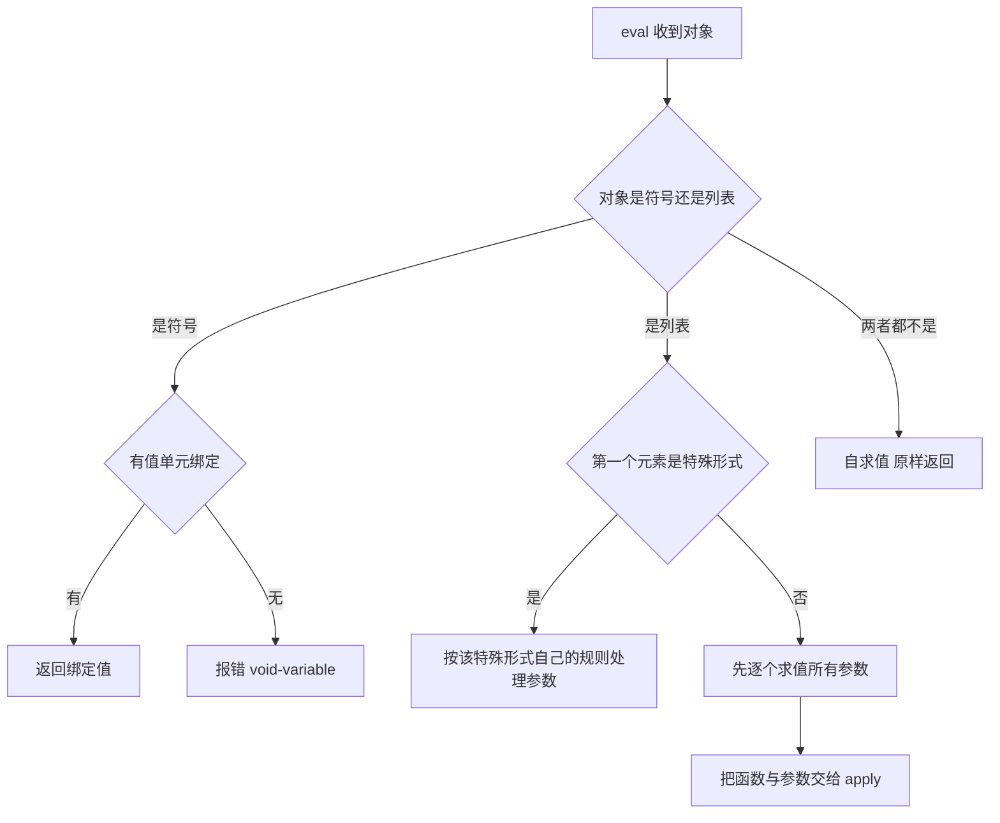
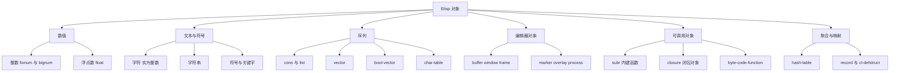

# Elisp 求值与数据类型

> 从 C 的 `add(1, 2)` 走到 Elisp 的 `(+ 1 2)`，把求值规则、自求值对象、类型清单和 `eq`/`eql`/`equal` 这三兄弟一次讲透。

---

## 一、为什么配置 Emacs 就必须学 Elisp

### 1.1 配置文件本身就是一段 Elisp 程序

`~/.emacs.d/init.el` 不是 INI，也不是 YAML。Emacs 启动时会用 Lisp 读取器（reader）把它读成一个个 S-表达式，再逐个交给求值器（evaluator）执行。也就是说，写配置等价于写程序：

```elisp
;; 这不是"设置项"，这是一次函数调用：把变量 inhibit-startup-screen 的值设为 t
(setq inhibit-startup-screen t)

;; 这也是函数调用：调用全局 minor mode 函数，打开行号显示
(global-display-line-numbers-mode 1)
```

因为没有"配置语法"这一层中间层，配置能做的事没有上限：可以在启动时判断操作系统、读取文件、请求网络、动态生成键位表。代价是，配置里的错误同样是程序错误，Emacs 会用 Lisp 的方式向你报告。

### 1.2 报错信息全是 Elisp 术语

初学者最常撞到的三类错误，每一类都对应一个后面必须掌握的概念：

- `Symbol's value as variable is void: foo`：符号 `foo` 没有值单元（value cell）里的绑定，对应本文的「符号求值」。
- `Wrong type argument: stringp, 42`：某个函数收到了错误类型，对应本文的「类型清单」与「类型判断」。
- `Invalid function: (1 2)`：把数据放到了函数位置，对应本文的「函数调用求值」。

除此之外还有一类不报错但行为诡异的 bug，例如用 `eq` 比较两个内容相同的字符串却得到 `nil`。这不属于语法问题，而是相等性语义问题，本文第八节专门处理。

### 1.3 阅读顺序

本文把「求值」和「类型」放在一起讲，是因为它们互为因果：求值规则决定了表达式产生什么类型的对象，而对象的类型又决定了它能不能被求值、能不能被修改、能不能安全比较。建议按顺序读，每一节末尾都留了一个可以直接在 `M-:` 里运行的练习。

---

## 二、S-表达式与前缀表示法

### 2.1 从 C 的写法说起

有 C 语言基础的人已经习惯了中缀表达式和「函数名(参数)」的调用形式：

```c
/* C 的写法：运算符在中间，函数名在前，参数在括号里 */
int add(int a, int b) { return a + b; }

int x = add(1, 2);          /* 函数调用 */
int y = (1 + 2) * (10 - 4); /* 中缀运算，靠优先级和括号决定顺序 */
```

Elisp 把这两件事统一了：函数调用和算术运算都是「列表」，列表的第一个元素是操作符（operator），其余元素是操作数（operand）。

```elisp
;; 函数调用：列表第一个位置是函数名
(add 1 2)                    ; 结果 3

;; 算术也是函数调用：+ 就是一个普通函数
(+ 1 2)                      ; 结果 3
(+ 1 2 3 4)                  ; 结果 10，加减乘除都可以接受任意多个参数

;; 嵌套就是括号套括号，不需要记优先级
(* (+ 1 2) (- 10 4))         ; 结果 18
```

这种写法叫前缀表示法（prefix notation），整体结构叫 S-表达式（symbolic expression，符号表达式）。`(+ 1 2 3 4)` 之所以不需要优先级表，是因为括号已经把顺序写死了：先算内层，再算外层。

### 2.2 代码即数据

这是 Elisp 与 C 最根本的不同。在 C 里，`add(1, 2)` 编译后是机器指令，运行时没有任何对象叫「add 的调用」。在 Elisp 里，`(+ 1 2)` 在读取阶段就是一个普通列表：三个元素，分别是符号 `+`、整数 `1`、整数 `2`。

```elisp
;; 用 quote 阻止求值，直接把这段代码当数据拿出来看
(car '(+ 1 2))    ; 结果 +    ，即符号 + 本身
(cdr '(+ 1 2))    ; 结果 (1 2)
(length '(+ 1 2)) ; 结果 3
```

既然代码是数据，程序就能在运行时构造代码、检查代码、修改代码。这份能力是宏（macro）的基础，第三章会展开；这里只需要记住结论：**列表是 Elisp 唯一的核心数据结构，代码也只是列表。**

### 2.3 括号阅读法

读 Elisp 时不要从左往右逐字读，要先用编辑器的括号高亮找到配对的右括号，再整体看结构。`C-M-f` 与 `C-M-b` 按括号层级前后移动，`C-M-u` 向上一层，`C-M-d` 向下一层，配合 `C-M-SPC` 选中整个表达式。一套组合下来，再长的嵌套也能拆成几层来看。

**练习**：在 `M-:` 中依次输入 `(+ 1 2 3 4)`、`(* (+ 1 2) (- 10 4))`、`(car '(+ 1 2 3))`，观察回显区结果。注意第三条需要 `quote`，去掉 `'` 再试一次，会得到 `Invalid function: +` 相关的错误，这正是下一节要解释的现象。

---

## 三、求值规则

### 3.1 求值器怎么处理一个对象

`M-:` 会把输入交给函数 `eval`。`eval` 按照对象类型分派处理，流程可以概括为下面这张图。



下面把这个流程拆开看。

### 3.2 自求值对象：原样返回

数字、字符串、关键字、`t`、`nil` 这类对象交给 `eval` 会原样返回，它们叫自求值对象（self-evaluating object）。

```elisp
(eval 42)        ; 结果 42
(eval "hello")   ; 结果 "hello"
(eval :keyword)  ; 结果 :keyword
(eval t)         ; 结果 t
(eval nil)       ; 结果 nil
```

`t` 和 `nil` 严格来说是符号，但它们是常量（constant），求值结果就是自身，不查值单元。

### 3.3 符号求值：查值单元

符号不是自求值的。求值一个符号，就是去访问这个符号的「值单元」（value cell），也就是它作为变量时的绑定值。

```elisp
(setq my-name "Emacs")   ; 给符号 my-name 的值单元写入字符串
my-name                  ; 结果 "Emacs"

(setq other-name my-name) ; 右侧先求值得到 "Emacs"，再写入 other-name
other-name                ; 结果 "Emacs"

never-defined-symbol      ; 报错 (void-variable never-defined-symbol)
```

这里有个容易混淆的点：同一个符号可以同时拥有「变量绑定」和「函数定义」，两者存放在不同位置。`car` 作为函数存在，但 `car` 作为变量是没有绑定的：

```elisp
(car '(1 2 3))   ; 结果 1，走的是函数定义
car              ; 报错 (void-variable car)，走的是值单元
```

### 3.4 函数调用求值：先求参数，再 apply

如果对象是列表且第一个元素不是特殊形式，求值器会：

1. 先求值列表中的每一个元素（包括第一个，得到函数对象）；
2. 再把这些值作为实参传递给函数。

注意第一步里「先求值第一个元素」意味着，函数位置可以放任何能求出函数的表达式，不只是符号：

```elisp
((lambda (x) (* x x)) 5)    ; 结果 25，函数位置是一个 lambda 表达式

(funcall '+ 1 2)            ; 结果 3，+ 求值得到函数对象，再调用
```

参数求值顺序是自左向右，这在有副作用的参数里可以观察到，但正常代码不应依赖顺序。

### 3.5 特殊形式：参数不求值

特殊形式（special form）是求值器的内建规则，它自己决定哪些参数求值、哪些不求值。最典型的是 `if`：

```elisp
(if t   "then" "else")   ; 结果 "then"，else 分支根本没被求值
(if nil "then" "else")   ; 结果 "else"
```

如果先求值所有参数，`if` 就无法实现条件分支（两个分支都会被执行）。类似的还有 `quote`、`setq`、`let`、`while`、`and`、`or`、`defun`、`lambda`、`condition-case`。判断一个符号是不是特殊形式可以用：

```elisp
(special-form-p 'if)     ; 结果 t
(special-form-p 'setq)   ; 结果 t
(special-form-p 'car)    ; 结果 nil，car 是普通函数
```

### 3.6 quote 与单引号

`quote` 是特殊形式，它返回参数本身，不求值。`'x` 只是 `(quote x)` 的简写，两者完全等价。

```elisp
(quote (1 2 3))    ; 结果 (1 2 3)
'(1 2 3)           ; 结果 (1 2 3)，同上
''a                ; 结果 (quote a)，读作"引号 a 的列表"
(quote my-name)    ; 结果 my-name 符号本身，不是它的值 "Emacs"
```

为什么必须有 `quote`：因为列表默认被当成函数调用。想要「一个字面量列表」，就必须显式阻止求值。

```elisp
(car (quote (1 2 3)))   ; 结果 1
(car '(1 2 3))          ; 结果 1，等价写法
```

反引号 `` ` ``（backquote，也叫 quasiquote）与 `,`（unquote）是模板化构造列表的语法，它的主场是宏，第三章会详细讲。这里只需记住一句：**反引号仍然是一种 quote，只是允许内部某些位置用 `,` 再求值回去。**

### 3.7 动态求值

`eval` 把「数据」变回「可执行的代码」，这对 `M-:`、`ielm`、以及所有需要运行用户输入的地方都至关重要。

```elisp
(eval '(+ 1 2))              ; 结果 3，先把 (+ 1 2) 当数据处理，再求值
(eval (read "(+ 1 2)"))      ; 结果 3，read 把字符串变成列表
(eval '(+ 1 2) t)            ; 第二个参数 LEXICAL 为 t 表示按词法绑定求值
```

日常写配置几乎不需要 `eval`。它的常见用途是构造一段代码然后运行，例如把用户输入的字符串当作表达式求值。要警惕的是：`eval` 求值的是「数据」，如果数据来自不受信任的来源，就等价于执行任意代码。

**练习**：在 `M-:` 里执行 `(eval (read "(+ 1 2)"))`，再执行 `(special-form-p 'quote)` 与 `(special-form-p 'car)`，对比两者的差别。最后试试给 `car` 求值，看 `void-variable` 报错长什么样。

---

## 四、自求值对象总表

把上一节的规则整理成一张表，方便日后查阅。

| 对象 | 示例 | 求值结果 | 说明 |
| --- | --- | --- | --- |
| 整数 | `42` | `42` | 含 bignum，见 5.1 |
| 浮点数 | `3.14` | `3.14` | 精度为 C 的 double |
| 字符串 | `"abc"` | `"abc"` | 可变数组，元素是字符 |
| 字符 | `?a` | `97` | 字符就是整数，注意这个陷阱 |
| 关键字 | `:foo` | `:foo` | 值为自身的常量符号 |
| 布尔真 | `t` | `t` | 常量符号 |
| 假与空表 | `nil` | `nil` | 同时代表假和空列表 |
| 向量 | `[1 2]` | `[1 2]` | 自求值，元素不求值 |
| 列表 | `(1 2)` | 报错 | 被当作函数调用，必须 `quote` |
| 符号 | `foo` | 变量的值 | 未定义时报 `void-variable` |

需要注意 `(1 2)` 这一行：它会被求值器当作「调用函数 1」，报错信息为 `Invalid function: 1`。同理 `'(+ 1 2)` 得到的是三元素列表，而 `(+ 1 2)` 得到的是 `3`。

---

## 五、完整类型清单

Emacs Lisp 的类型可以分成几大类。下图给出整体分类，后面逐类展开。



### 5.1 整数：fixnum 与 bignum

Emacs 的整数有固定宽度和任意精度两种。能放进机器字的叫 fixnum，超出范围自动升级为任意精度的 bignum。这个能力从 **Emacs 27** 开始提供；Emacs 26 及更早版本溢出时会静默变成浮点数，是当年著名的坑。

```elisp
most-positive-fixnum              ; 64 位平台为 2305843009213693951
(1+ most-positive-fixnum)         ; 结果 2305843009213693952，自动变 bignum
(fixnump most-positive-fixnum)    ; 结果 t
(bignump (1+ most-positive-fixnum)) ; 结果 t
```

整数除法会截断，这一点和 C 一致，但和 Python 3 不同：

```elisp
(/ 1 2)     ; 结果 0
(/ 7 2)     ; 结果 3
(/ 1.0 2)   ; 结果 0.5，只要有一个浮点参数，结果就是浮点
```

### 5.2 浮点数

浮点字面量写小数点或指数即可，支持 `1.0e10` 这样的科学计数法。Emacs 提供 `floatp` 和 `numberp` 两个判断函数。浮点在相等性上有个坑，见第八节。

```elisp
(type-of 3.14)    ; 结果 float
(integerp 3.14)   ; 结果 nil
(numberp 3.14)    ; 结果 t，整数与浮点都算 number
```

### 5.3 字符串与字符

字符串是字符的数组。关键前提：**Elisp 的字符就是整数**，`?a` 读出来是 `97`。

```elisp
(type-of ?a)          ; 结果 integer，不是 char
(+ ?a 0)              ; 结果 97
(char-to-string 97)   ; 结果 "a"
(string-to-char "a")  ; 结果 97
```

字符串可以用 `aref` 按下标取字符，也可以用 `aset` 修改；但字面量字符串在字节编译时会触发警告，改字符串前应先用 `copy-sequence` 复制一份。

```elisp
(aref "abc" 1)                       ; 结果 98，即字符 b
(let ((s (copy-sequence "abc")))     ; 先复制，避免改到共享的字面量
  (aset s 0 ?X)
  s)                                 ; 结果 "Xbc"
```

关于中文字符串有一个必须知道的差异：`length` 返回的是**字符数**，不是字节数；字节数要用 `string-bytes`。

```elisp
(length "中文")          ; 结果 2
(string-bytes "中文")    ; 结果 6，UTF-8 下每个汉字 3 字节
```

### 5.4 符号与关键字

符号是有名字的对象，名字存在符号的「名字单元」（name cell）里，可用 `symbol-name` 取出。符号比较用 `eq` 永远安全，因为同名符号在同一个 obarray 里只会有一个。

```elisp
(symbol-name 'my-var)     ; 结果 "my-var"
(intern "my-var")         ; 结果 my-var，字符串转符号
(intern-soft "no-such")   ; 结果 nil，不创建新符号
(keywordp :foo)           ; 结果 t
(symbolp :foo)            ; 结果 t，关键字也是符号
```

关键字是以 `:` 开头、值为自身的符号，最常出现在 plist（属性列表）和函数的可选参数中。

### 5.5 cons 与列表

cons 是一对格子，`car` 是前半，`cdr` 是后半。列表是一条 cdr 链，末尾以 `nil` 收尾。

```elisp
(cons 1 2)          ; 结果 (1 . 2)，点对
(cons 1 nil)        ; 结果 (1)，一元列表
(cons 1 (cons 2 nil)) ; 结果 (1 2)，与 (list 1 2) 等价
(car '(1 2 3))      ; 结果 1
(cdr '(1 2 3))      ; 结果 (2 3)
```

点对与列表的底层结构、以及由此产生的破坏性操作风险，是第四章的主题，这里先建立印象即可。判断函数有两个容易混用的：`consp` 测试「是 cons」，`listp` 测试「是 cons 或 nil」。

```elisp
(consp nil)      ; 结果 nil
(listp nil)      ; 结果 t，nil 就是空列表
(atom nil)       ; 结果 t，非 cons 即 atom
(atom '(1))      ; 结果 nil
```

### 5.6 vector、bool-vector 与 char-table

向量是定长数组，随机访问是 O(1)，字面量用方括号写。向量是自求值对象，元素不会被求值。

```elisp
(type-of [1 2 3])         ; 结果 vector
(aref [1 2 3] 0)          ; 结果 1
(let ((v (make-vector 3 0)))  ; 建一个长度 3、初值 0 的向量
  (aset v 1 "x")
  v)                      ; 结果 [0 "x" 0]
```

bool-vector 是紧凑的位数组，用于存放大量真假值，内置代码里大量使用（例如字符集、语法表的布尔标志）。

```elisp
(let ((bv (make-bool-vector 5 nil)))
  (aset bv 0 t)
  (aset bv 3 t)
  (bool-vector-count-population bv))   ; 结果 2，统计为真的位数
```

char-table 是「以字符为下标」的特殊向量，覆盖全部字符集，多用于语法表、大小写映射、字符类别。

```elisp
(let ((ct (make-char-table 'my-purpose 0)))
  (set-char-table-range ct ?a 1)
  (char-table-range ct ?a))            ; 结果 1
```

日常写配置基本不会直接创建 char-table，但读 `C-h s`（describe-syntax）的输出时会遇到它。

### 5.7 编辑器对象

这部分是 Emacs 特有的，也是术语最容易混淆的地方：

- 缓冲区（buffer）：一块文本内容，是 Emacs 里「打开的文件或临时文本」的载体，与操作系统窗口无关。
- 窗口（window）：框架内显示某个缓冲区的一块显示区域。Emacs 的 window 是「窗格」，不是操作系统的窗口。
- 框架（frame）：一个操作系统级别的窗口，里面可以包含多个 Emacs 窗口。

```elisp
(type-of (current-buffer))   ; 结果 buffer
(type-of (selected-window))  ; 结果 window
(type-of (selected-frame))   ; 结果 frame
```

这三个词与日常用语的重叠度最高，也最容易读错文档。一张对照表能省下很多困惑：

| Elisp 术语 | 实际含义 | 日常用语里容易误解成 |
| --- | --- | --- |
| buffer（缓冲区） | 一块文本内容，可能对应文件，也可能纯粹是临时文本 | 操作系统窗口、终端 |
| window（窗口） | 框架内部的一块显示区域，一个框架可以切分成多个 | 操作系统窗口 |
| frame（框架） | 一个操作系统级别的窗口，带标题栏和边框 | 骨架、容器 |

因此，「在另一个窗口打开这个文件」在 Emacs 语境下指的是 `C-x 4 C-f` 这类切分显示区域的操作，而不是新开一个操作系统窗口；要新开操作系统窗口应当用 `C-x 5 f`。读官方文档时把这三个词按上表翻译一遍，绝大多数描述会立刻变得通顺。

再补一句实践建议：这三类对象都属于即时状态。缓冲区会被杀死，窗口会随框架布局变化而消失，因此不要长期持有它们的引用。需要跨命令记住一个位置请用 marker，需要长期保存一段文本请复制成字符串。

此外还有几类：

- marker：缓冲区里的一个位置指针，会随文本插入删除自动移动，常用于记住「某个地方」。
- overlay：叠加在缓冲区文本上的一段附加显示属性或关联数据，是语法高亮、行内提示的实现方式。
- process：子进程对象，`start-process`、`make-process` 的返回值。

```elisp
(type-of (make-marker))      ; 结果 marker
(type-of (make-overlay 1 2)) ; 结果 overlay
```

### 5.8 函数对象与 record

函数是可以当数据传递的对象。解释执行的函数（含闭包）与字节编译后的函数类型名不同，判断时统一用 `functionp` 最稳妥。

```elisp
(functionp 'car)                     ; 结果 t，内建函数也是函数
(functionp (lambda (x) x))           ; 结果 t
(closurep (let ((n 1)) (lambda () n))) ; 结果 t，专测闭包对象
(type-of (lambda (x) x))             ; 解释执行为 interpreted-function，编译后为 byte-code-function
```

这里的版本差异必须讲清楚，否则读旧文章会看不懂。**Emacs 30** 引入了一对新的类型：`interpreted-function` 表示解释执行的函数，`closure` 是它与 `byte-code-function` 的共同父类型，同时新增了 `closurep` 与 `interpreted-function-p` 两个谓词。Emacs 29 及更早版本没有这两个类型名，解释执行的闭包统一报 `closure`。因为 `closure` 在 30 里变成了父类型，`closurep` 在 30 与 31 上对两类函数对象都返回真，所以跨版本判断函数请统一用 `functionp`，判断闭包用 `closurep`。

record 是一种有固定字段的结构体，由 `cl-defstruct` 生成。注意 `type-of` 对它返回的是结构体自己的名字，而不是 `record`，判断要用 `recordp`。

```elisp
(require 'cl-lib)
(cl-defstruct my-point x y)          ; 定义一个名为 my-point 的结构体类型
(setq p (make-my-point :x 1 :y 2))   ; 构造实例
(my-point-x p)                       ; 结果 1，自动生成的访问函数
(type-of p)                          ; 结果 my-point，不是 record
(recordp p)                          ; 结果 t
```

---

## 六、类型判断函数表

判断类型用谓词函数，它们统一以 `p` 结尾（predicate 的缩写）。下表列出最常用的一批。

| 函数 | 为真的条件 | 典型用途 |
| --- | --- | --- |
| `type-of` | 返回类型符号，不返回真假 | 调试时打印类型 |
| `integerp` | 是整数（含 bignum） | 校验算术参数 |
| `floatp` | 是浮点数 | 区分整数与浮点 |
| `numberp` | 是整数或浮点 | 通用数值校验 |
| `stringp` | 是字符串 | 校验文本参数 |
| `characterp` | 是合法字符编码 | 校验 `?x` 形式的值 |
| `symbolp` | 是符号（含 `nil`、`t`、关键字） | 校验符号参数 |
| `keywordp` | 是关键字 | 识别 plist 的键 |
| `consp` | 是 cons 对 | 区分点对与 atom |
| `listp` | 是 cons 或 `nil` | 校验列表（注意 `nil` 也算） |
| `atom` | 不是 cons | `consp` 的反面 |
| `sequencep` | 列表、向量、字符串、bool-vector | 写通用序列函数 |
| `vectorp` | 是向量（含 bool-vector） | 区分向量与列表 |
| `bool-vector-p` | 是位向量 | 处理位集合 |
| `char-table-p` | 是字符表 | 处理语法表等 |
| `hash-table-p` | 是哈希表 | 校验映射参数 |
| `bufferp` | 是缓冲区 | 处理编辑器对象 |
| `windowp` | 是窗口 | 处理界面 |
| `framep` | 是框架 | 处理界面 |
| `markerp` | 是标记 | 处理位置 |
| `overlayp` | 是 overlay | 处理显示属性 |
| `processp` | 是进程 | 处理子进程 |
| `functionp` | 可被调用 | 所有函数对象的通用判断 |
| `closurep` | 是闭包对象 | 判断是否捕获了环境 |
| `recordp` | 是 record | 判断结构体实例 |
| `commandp` | 可用 `M-x` 或键位调用 | 判断是否交互式命令 |

`commandp` 值得单独说一句：它判断的不是「是不是函数」，而是「能不能被 `call-interactively` 调用」，也就是有没有 `interactive` 声明。

```elisp
(commandp 'car)                          ; 结果 nil，car 是函数但不是命令
(commandp (lambda () (interactive)))     ; 结果 t
(commandp 'eval-last-sexp)               ; 结果 t
```

**练习**：在 `M-:` 里分别执行 `(type-of ?a)`、`(type-of "a")`、`(type-of nil)`、`(type-of [1])`、`(type-of (make-hash-table))`，记下返回值，再对同样的对象调用对应的判断函数核对。

---

## 七、类型转换

### 7.1 数字与字符串互转

```elisp
(number-to-string 42)       ; 结果 "42"
(number-to-string 3.5)      ; 结果 "3.5"
(string-to-number "42")     ; 结果 42
(string-to-number "3.5")    ; 结果 3.5，自动识别浮点
(string-to-number "abc")    ; 结果 0，解析不出内容时返回 0，不报错
```

`string-to-number` 在失败时安静地返回 `0`，这是常见 bug 来源。要校验用户输入是否合法，应先检查字符串本身，或使用 `read` 配合错误处理。

### 7.2 字符串与符号互转

```elisp
(intern "my-var")        ; 结果 my-var，字符串转符号
(symbol-name 'my-var)    ; 结果 "my-var"，符号转字符串
(intern-soft "my-var")   ; 结果 my-var，若符号不存在则返回 nil
```

`intern` 会在需要时创建新符号；`intern-soft` 只查不建。读取配置时如果不想污染符号表，用 `intern-soft`。

### 7.3 打印成字符串

`prin1-to-string` 把对象转成「可以被 `read` 读回来」的字符串，也就是带引号的机器可读形式：

```elisp
(prin1-to-string "a")       ; 结果 "\"a\""，带转义引号
(prin1-to-string '(1 "a"))  ; 结果 "(1 \"a\")"
(read (prin1-to-string '(1 "a")))  ; 结果 (1 "a")，读回来还原成列表
```

反过来，`format` 的 `%S` 也会产生 `prin1` 风格（带引号），`%s` 产生 `princ` 风格（不带引号），这个差别见第十一节。

### 7.4 拼接与格式化

`format` 是构造字符串的主力，`concat` 适合纯拼接，`mapconcat` 适合「列表加分隔符」：

```elisp
(concat "foo" "-" "bar")                    ; 结果 "foo-bar"
(format "%s has %d items" "list" 3)         ; 结果 "list has 3 items"
(mapconcat #'symbol-name '(a b c) ",")      ; 结果 "a,b,c"
```

Emacs 29 起 `string-join` 也在 `subr-x` 中提供，用法与 `mapconcat` 相近：

```elisp
(require 'subr-x)
(string-join '("a" "b") ", ")   ; 结果 "a, b"
```

**练习**：在 `M-:` 执行 `(read (prin1-to-string '(1 "a" 2.5)))`，对比 `(prin1-to-string "a")` 和 `(format "%s" "a")` 的输出差异。

---

## 八、相等性：eq、eql、equal、equal-including-properties

这是新手最容易踩的坑，也是本文最需要反复看的一节。Emacs 有四个不同的「相等」，语义从严格到宽松排列。

### 8.1 四者的语义

- `eq`：判断两个对象是不是**同一个对象**（同一块内存）。对符号、关键字、`nil`、`t`、以及小整数安全。
- `eql`：在 `eq` 基础上，额外把「类型相同且数值相同的浮点数」判为相等。整数的 `eql` 与 `eq` 一致。
- `equal`：判断**结构和内容**是否相同，递归比较列表、向量、字符串、哈希表等。
- `equal-including-properties`：在 `equal` 基础上，还要求字符串的文本属性（text properties）也相同。

### 8.2 行为对照表

| 表达式 | 结果 | 原因 |
| --- | --- | --- |
| `(eq 1 1)` | `t` | 小整数按值处理 |
| `(eq 1.0 1.0)` | `nil` | 浮点是独立对象，`eq` 只看身份 |
| `(eql 1.0 1.0)` | `t` | `eql` 专门处理浮点值相等 |
| `(equal 1.0 1.0)` | `t` | `equal` 递归比较内容 |
| `(eq "a" "a")` | 通常 `nil` | 两个字符串字面量不保证是同一对象 |
| `(equal "a" "a")` | `t` | 内容相同 |
| `(eq 'a 'a)` | `t` | 同名符号唯一 |
| `(eq :k :k)` | `t` | 关键字也是符号 |
| `(eq '(1) '(1))` | `nil` | 两个列表是不同对象 |
| `(equal '(1) '(1))` | `t` | 结构相同 |
| `(eq 100000000000000000000 100000000000000000000)` | `nil` | bignum 不是 fixnum，`eq` 不保证 |

最后一行特别值得记住：**大整数不能用 `eq` 比较**。fixnum 之外，整数比较必须用 `eql` 或 `equal`。

### 8.3 该用哪一个

| 场景 | 推荐 | 理由 |
| --- | --- | --- |
| 比较符号、关键字、`nil`/`t` | `eq` | 最快，语义正确 |
| 比较小整数 | `eq` | fixnum 下等价 |
| 比较任意整数（含 bignum） | `eql` | 覆盖固定宽度之外的情况 |
| 比较浮点数 | `eql` 或 `=` | `eq` 会失败 |
| 比较字符串内容 | `equal` 或 `string=` | `eq` 会失败 |
| 比较列表与向量结构 | `equal` | 递归比较 |
| 比较带属性的字符串 | `equal-including-properties` | 连文本属性一起比 |
| 用哈希表做键 | 看 `:test` 参数 | 见第四章 |

实际写代码时的经验法则是：**只要比较的不是符号或关键字，就默认用 `equal`。** 只有在热点代码里确认性能瓶颈、且比较对象确实是符号时，才降级到 `eq`。

Emacs 30 起，字节编译器会主动帮你抓这类错误：对 `eq`、`eql`、`memq`、`memql`、`assq`、`rassq`、`remq`、`delq` 使用浮点数或 bignum 字面量时会发出 `suspicious` 类警告，因为只有符号和 fixnum 字面量才保证有唯一身份。看到这条警告就说明该换成 `equal`、`member`、`assoc` 或 `eql`。可以用 `with-suppressed-warnings` 局部关闭，但更正确的做法是改代码。

### 8.4 一个能复现的 bug

下面这段代码想过滤掉列表中重复的字符串，但因为用了 `eq`，结果完全错误：

```elisp
;; 错误写法：用 eq 比较字符串
(cl-remove-duplicates '("a" "b" "a") :test #'eq)
;; 结果可能是 ("a" "b" "a")，因为两个 "a" 不是同一个对象

;; 正确写法：用 equal
(require 'cl-lib)
(cl-remove-duplicates '("a" "b" "a") :test #'equal)
;; 结果 ("a" "b")
```

注意第一行的结果是「可能」而不是「必然」——同名符号被 intern，但字符串不保证被合并，所以 `eq` 对字符串的结果依赖实现细节，这种不确定性本身就是必须避开它的理由。

**练习**：在 `M-:` 依次执行 `(eq "a" "a")`、`(equal "a" "a")`、`(eq 1.0 1.0)`、`(eql 1.0 1.0)`、`(eq 100000000000000000000 100000000000000000000)`，把结果与 8.2 的表格对照。

---

## 九、点对与打印表示

`cons` 是唯一的基础构造器，列表是它的特例。理解打印表示，才能读懂报错信息和 `*Messages*` 里的输出。

```elisp
(cons 1 2)          ; 打印为 (1 . 2)
(cons 1 (cons 2 3)) ; 打印为 (1 2 . 3)
(cons 1 nil)        ; 打印为 (1)
(list 1 2 3)        ; 打印为 (1 2 3)，与 (cons 1 (cons 2 (cons 3 nil))) 等价
```

规则是：当 cdr 的最后一个位置不是 `nil` 时，打印器用点号显式标出「不正规列表」的尾巴。`(1 . 2)` 读作「car 是 1、cdr 是 2 的 cons」。

点对在 alist（关联列表）里大量出现，也是 `(key . value)` 形式的来源：

```elisp
'((name . "Emacs") (version . 30))
(alist-get 'name '((name . "Emacs") (version . 30)))   ; 结果 "Emacs"
```

关于 alist、plist 与哈希表的取舍，第四章会给出完整对照。

**练习**：在 `M-:` 执行 `(cons 1 2)`、`(cons 1 (cons 2 3))`、`(cons 1 (cons 2 nil))`，观察三种打印结果的点号位置。

---

## 十、动手环境：M-:、C-x C-e 与 ielm

学 Elisp 不需要重启 Emacs，运行中的 Emacs 就是最好的实验场。

### 10.1 M-: 求值单个表达式

`M-:` 调用 `eval-expression`，在回显区提示输入一个表达式，回车后结果显示在回显区。它是最快的验证手段，适合一两行的试探。

对于想看到打印形式（带引号、带点号）的场景，`M-:` 可能只显示简略结果。这时可以包一层 `prin1-to-string`：

```elisp
(prin1-to-string (cons 1 2))   ; 结果 "(1 . 2)"
```

### 10.2 C-x C-e 求值光标前一个表达式

`C-x C-e` 调用 `eval-last-sexp`，它求值光标左边紧邻的那个 S-表达式，并把结果打印到回显区，同时在 `*Messages*` 里留下记录。这个命令的实际用法是：在任意 Lisp 缓冲区里写好一段代码，把光标放到表达式末尾，按 `C-x C-e` 立即执行。

在 `*scratch*` 缓冲区里，这个工作流非常顺手：默认 `*scratch*` 处于 Lisp Interaction 模式，直接敲代码、按 `C-x C-e` 就能看到结果，不需要保存文件。

### 10.3 ielm：真正的 REPL

`M-x ielm` 打开一个交互式 Elisp 环境（inferior Emacs Lisp mode）。与 `M-:` 相比，它的优势是：

- 有完整的输入历史，`M-p` / `M-n` 翻历史；
- 输出用 `prin1` 打印，能看到完整形式；
- 支持多行输入，括号不配对时会继续等待；
- 每个输入都在自己的作用域里求值，不会污染全局状态太多。

进入后可以直接敲：

```elisp
ELISP> (+ 1 2)
3 (#o3, #x3, ?\C-c)
ELISP> (type-of ?a)
integer
ELISP> (eq "a" "a")
nil
```

IELM 还会把整数同时显示为八进制、十六进制和字符形式，这对调试字符相关代码很有帮助。

### 10.4 三者怎么选

| 方式 | 适合 | 不适合 |
| --- | --- | --- |
| `M-:` | 临时验证一个表达式 | 需要保留历史、需要看完整打印形式 |
| `C-x C-e` | 在文件里写完一段代码就地执行 | 一次性试探 |
| `M-x ielm` | 长时间试验、多行代码、反复修改 | 快速的一次性确认 |

**练习**：`M-x ielm` 进入 REPL，依次输入 `(type-of ?a)`、`(eq "a" "a")`、`(equal "a" "a")`、`(cons 1 2)`，观察 IELM 的输出格式。再回到 `*scratch*`，把同样的表达式各写一行并逐行 `C-x C-e`。

---

## 十一、打印与读取：prin1、princ、print、message、format

Elisp 里「打印」这件事分两类：**转成字符串**和**显示给用户**。混淆这两类是另一个常见错误来源。

### 11.1 prin1 与 princ 的区别

- `prin1` 生成「可以被 `read` 读回来」的表示，字符串带引号，特殊字符带转义。这是面向机器的。
- `princ` 生成「给人看」的表示，字符串不带引号。这是面向人的。

```elisp
(prin1-to-string "a")   ; 结果 "\"a\""，带引号
(princ "a")             ; 回显 a，不带引号（返回值是 "a"）
(prin1 "a")             ; 回显 "a"，带引号（返回值是 "a"）
(format "%S" "a")       ; 结果 "\"a\""
(format "%s" "a")       ; 结果 "a"
```

`format` 的对应关系是：`%S` 等价于 `prin1` 风格，`%s` 等价于 `princ` 风格，`%d` 用于整数。

```elisp
(format "%S" '("a" "b"))   ; 结果 "(\"a\" \"b\")"
(format "%s" '("a" "b"))   ; 结果 "(a b)"
(format "%d" 42)           ; 结果 "42"
```

调试列表和字符串时用 `%S`，输出给用户看的提示信息用 `%s`，这是最简单可靠的判断标准。

### 11.2 print 会插入缓冲区

`print` 不只是打印，它会把表示插入到**当前缓冲区**的光标处，前后各加一个换行和空格。在 `*scratch*` 里能直接看到效果，但用在正经代码里会污染缓冲区，一般只在调试时临时使用。

```elisp
;; 在 *scratch* 中执行，会在光标处插入一行 (1 2 3)
(print '(1 2 3))
```

### 11.3 message 面向用户

`message` 把格式化后的字符串显示在回显区（echo area），同时写入 `*Messages*` 缓冲区，并返回这个字符串。

```elisp
(message "hello")                      ; 回显 hello
(message "value is %s" 42)             ; 回显 value is 42
(message "list is %S" '(1 2))          ; 回显 list is (1 2)
(message "percent: 100%%")             ; 字面量百分号要写 %%
```

传 `nil` 给 `message` 会清空回显区，这在命令结束时清理提示很有用：

```elisp
(message nil)   ; 清空回显区，*Messages* 不会新增内容
```

### 11.4 read：文本变对象

`read` 是 `prin1` 的逆操作，把字符串解析成 Lisp 对象。

```elisp
(read "(1 2 3)")              ; 结果 (1 2 3)
(read "(1 . 2)")              ; 结果 (1 . 2)
(read-from-string "(1 2) x")  ; 结果 ((1 2) . 5)，返回值是 (对象 . 结束位置)
```

`read-from-string` 返回一个 cons：car 是读到的对象，cdr 是读取结束的位置。这个设计是为了支持「一次读一点」的解析器。

**练习**：在 `M-:` 里对比 `(format "%S" '("a" "b"))` 与 `(format "%s" '("a" "b"))`，再执行 `(read "(1 2 . 3)")` 查看点对被读回来的样子。

---

## 十二、新手最常见的六个误区

下面六条是这一章内容在真实配置里最常以 bug 形式出现的形态。它们都不涉及语法，全部是「语义理解偏了一格」。

第一个误区是把字符当字符串。`?a` 不是字符串，它是整数 97。用 `(string= ?a "a")` 比较会直接报类型错误，正确写法是 `(char-equal ?a ?a)` 或先把字符转成字符串再比。看到某个函数文档里写着「接受字符」时，要意识到它接受的是整数。

第二个误区是用 `eq` 比较字符串或大整数。本文第八节已经给出对照表，这里再强调一次：`eq` 问的是「是不是同一个对象」，而不是「内容是否一样」。字符串在 Emacs 里不保证被合并，大整数同样不保证，所以这两类对象一律用 `equal` 或 `eql`。

第三个误区是以为 `nil` 与空列表是两个东西。在 Elisp 里它们是同一个对象：`nil` 既是假值，也是长度为零的列表。因此 `(listp nil)` 为真，`(consp nil)` 为假，`(atom nil)` 为真，这三个结果并不矛盾，因为 `listp` 判的是「cons 或 nil」，`consp` 判的是「确实是 cons」。

第四个误区是把「列表」和「被求值的列表」混为一谈。`(+ 1 2)` 的结果是整数 3，`'(+ 1 2)` 的结果才是列表。调试时看到 `(1 2 3)` 这样的输出，要分清它是「打印出来的列表数据」还是「一段还没运行的代码」。

第五个误区是依赖 `type-of` 判断函数对象。解释执行的函数在不同版本下可能报 `closure` 或 `interpreted-function`，字节编译后又是 `byte-code-function`。判断「能不能调用」永远用 `functionp`，判断「能不能被 `M-x` 调用」用 `commandp`。

第六个误区是把 `message` 当成调试万能钥匙。`message` 会把内容写进 `*Messages*`，在循环里调用会迅速淹没缓冲区，而且它不返回被打印的对象。需要「看一眼值就走」时，`M-:` 或 `C-x C-e` 更合适；需要在缓冲区里留下痕迹时，`*scratch*` 配合 `print` 更直观。

| 误区 | 错误写法 | 正确写法 |
| --- | --- | --- |
| 字符当字符串 | `(string= ?a "a")` | `(char-equal ?a ?a)` |
| 用 `eq` 比字符串 | `(eq s1 s2)` | `(equal s1 s2)` 或 `(string= s1 s2)` |
| 用 `eq` 比大整数 | `(eq n1 n2)` | `(eql n1 n2)` |
| 认为 `nil` 不是列表 | `(listp nil)` 判为假 | `(listp nil)` 为真，用 `consp` 区分 |
| 用 `type-of` 判函数 | `(eq (type-of f) 'closure)` | `(functionp f)` |
| 把 `message` 当输出流 | 循环里 `(message "%S" x)` | 用 `*scratch*` 与 `print` |

**练习**：在 `M-:` 里执行 `(listp nil)`、`(consp nil)`、`(atom nil)`、`(string= ?a "a")`，前三条的结果应当与直觉相反，最后一条会报类型错误，把报错信息完整读一遍。

---

## 小结

- Elisp 代码就是列表：`(+ 1 2)` 与 `add(1, 2)` 都是函数调用，只是操作符写在最前面；代码与数据的统一是宏的基础。
- 求值只做三件事：自求值对象原样返回，符号查值单元，列表先求值参数再 `apply`；`if`、`setq`、`quote` 这类特殊形式自己决定参数是否求值。
- 类型判断统一用 `p` 结尾的谓词，函数对象统一用 `functionp`；相等性上，除符号、关键字与小整数外一律用 `equal`，这是最不容易出错的默认选择。

---

## 相关章节

- [[emacs教程/2Elisp语言/02_变量作用域与绑定|变量作用域与绑定]]
- [[emacs教程/2Elisp语言/03_函数闭包与宏|函数、闭包与宏]]
- [[emacs教程/2Elisp语言/04_列表序列与哈希表|列表、序列与哈希表]]
- [[emacs教程/1入门/03_配置文件从零开始|配置文件从零开始]]
- [[c语言教程/c目录|C 语言教程]]

---

## 参考资料

- Elisp 参考手册 https://www.gnu.org/software/emacs/manual/html_node/elisp/
- Elisp 参考手册单页版 https://www.gnu.org/software/emacs/manual/html_mono/elisp.html
- 《Programming in Emacs Lisp》入门书 https://www.gnu.org/software/emacs/manual/html_node/eintr/
- Learn X in Y minutes（Elisp 页）https://learnxinyminutes.com/docs/elisp/
- elisp-guide https://github.com/chrisdone/elisp-guide
- Emacs 中文社区论坛 https://emacs-china.org/
