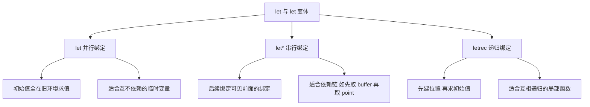
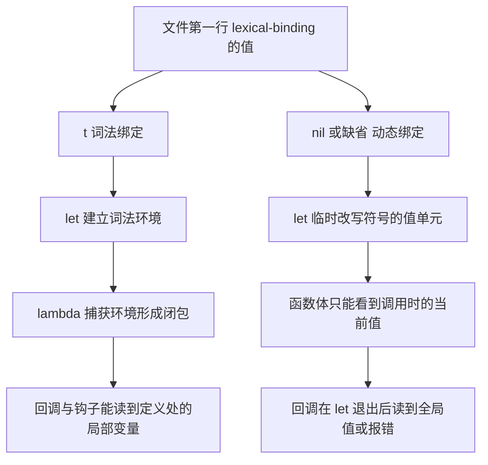
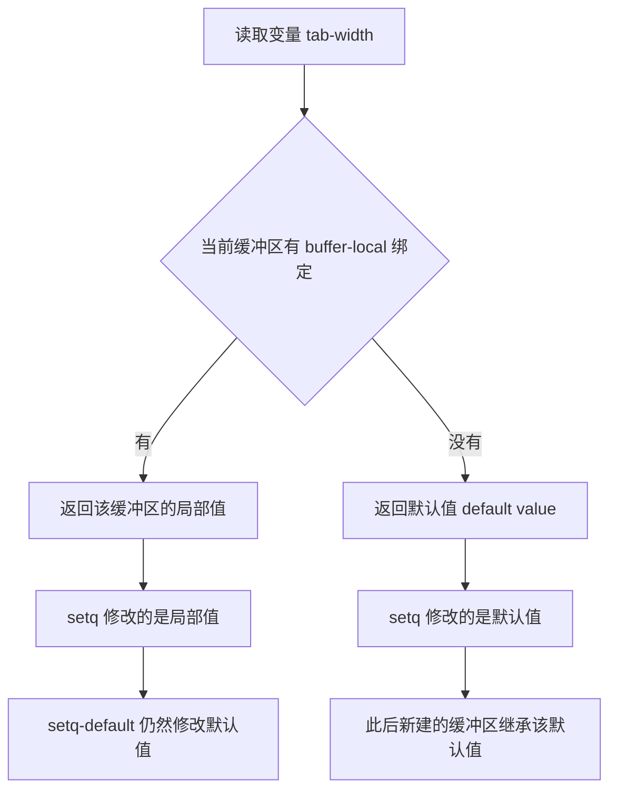

# 变量作用域与绑定

> `defvar` 为什么"只在没定义时才赋值"、`let` 和 `let*` 差在哪、配置里为什么必须在第一行写 `lexical-binding: t`，以及 buffer-local 变量的层级关系。

---

## 一、变量就是符号的值单元

Elisp 的变量不是内存地址的名字，而是**符号对象上的一个槽位**。每个符号有两处可以挂东西：值单元（value cell）存变量值，函数单元（function cell）存函数定义。同一个符号可以既是变量又是函数，互不干扰。

```elisp
;; 符号 car 的"函数单元"里有定义
(car '(1 2 3))     ; 结果 1

;; 符号 car 的"值单元"是空的
car                ; 报错 (void-variable car)
```

围绕值单元的操作函数如下，它们都接受**符号**而不是变量的值，因此参数要加 `'`：

```elisp
(set 'my-sym 10)          ; 把符号 my-sym 的值设为 10，等价于 (setq my-sym 10)
(symbol-value 'my-sym)    ; 结果 10，读取符号当前的值
(boundp 'my-sym)          ; 结果 t，判断值单元是否有绑定
(makunbound 'my-sym)      ; 解除绑定
(boundp 'my-sym)          ; 结果 nil
```

`set` 与 `setq` 的区别只有一个：`setq` 是宏，它不对第一个参数求值，所以可以直接写变量名；`set` 是函数，所有参数都要求值，所以必须传符号。

```elisp
(setq my-sym 10)     ; 名字不求值
(set 'my-sym 10)     ; 传的是符号对象，效果相同

;; set 的第一个参数可以是算出来的，setq 不行
(set (intern "dynamic-name") 1)   ; 合法，给 dynamic-name 赋值
```

在写配置时，99% 的情况用 `setq`；只有变量名本身是运行时才知道的时候才用 `set`。`symbol-value` 是读取时的对应物，同样用于名字动态计算的场景。

需要额外提醒的是，**函数单元与值单元完全独立**。`(fboundp 'car)` 为真、`(boundp 'car)` 为假，这两件事同时成立并不矛盾。写代码时如果看到 `void-variable` 却确信自己"明明定义过这个函数"，多半就是把这两处搞混了：`defun` 写的是函数单元，读变量仍然会失败。

另一个实践细节是 `makunbound` 的用途。它不是为了"清理内存"，而是用来**测试一个变量是否已被初始化**：先解除绑定，再 `(boundp 'sym)`，就能判断某个功能有没有在启动过程中动过这个变量。Emacs 内置的若干初始化函数正是这么用的。

**练习**：在 `M-:` 里依次执行 `(set 'foo 1)`、`(symbol-value 'foo)`、`(makunbound 'foo)`、`(boundp 'foo)`，观察四次结果。

---

## 二、定义变量的六个手段

Elisp 里"定义变量"这件事被拆成了多个宏，各自语义不同。混用是配置出问题的头号原因，下表先给出全貌。

| 形式 | 是否总是赋值 | 作用范围 | 典型用途 |
| --- | --- | --- | --- |
| `defvar` | 否，仅在未绑定时赋值 | 全局（动态特殊变量） | 声明包自己的变量 |
| `defconst` | 是，每次求值都赋值 | 全局 | 声明不会变的常量 |
| `defcustom` | 遵循初始化规则 | 全局或 buffer-local | 声明用户可定制选项 |
| `setq` | 是，每次执行都赋值 | 当前绑定所在的层级 | 配置里改值 |
| `setq-default` | 是 | 默认值，绕过 buffer-local | 设置全局默认 |
| `set` | 是 | 同 `setq` | 变量名动态时使用 |

### 2.1 defvar：只在未定义时赋值

这是最容易被误解的一条语义。`defvar` 的行为是：**如果符号已经有值，就什么都不做（只补文档字符串）；只有在值为 void 时才写入默认值。**

```elisp
(defvar my-option 10 "我的选项，默认 10。")
my-option                       ; 结果 10

(defvar my-option 99 "改了默认值")   ; 已有值，这次赋值被忽略
my-option                       ; 结果仍然是 10
```

这条规则的存在有充分理由：包作者在源码里写 `(defvar my-option 10)`，用户在配置里写 `(setq my-option 20)`。加载顺序上，用户的 `setq` 可能先执行。若 `defvar` 每次都赋值，用户配置就会被覆盖。

反过来说，这也意味着一个常见困惑：**改了包源码里的 `defvar` 默认值，重启 Emacs 却不生效**，因为值被 Customize 存进了 `custom-set-variables` 或者被你自己的配置覆盖了。排查时用 `C-h v` 看当前值，用 `M-x customize-option` 看保存的值。

`defvar` 的第二个作用比赋值更重要：它把符号标记为**特殊变量**（special variable），也就是动态绑定的变量。

```elisp
(princ (special-variable-p 'my-option))   ; 结果 t，defvar 声明过

(setq my-plain 1)                          ; 只 setq，没有 defvar
(princ (special-variable-p 'my-plain))     ; 结果 nil，不是特殊变量
```

不带值、只带文档的 `(defvar my-option)` 也是合法的，用于纯声明：告诉字节编译器"这个变量是特殊变量，别当成词法变量优化掉"。

### 2.2 defconst：每次求值都赋值

```elisp
(defconst my-version "1.0" "当前版本号。")
my-version                ; 结果 "1.0"

(defconst my-version "2.0" "新一轮求值")
my-version                ; 结果 "2.0"，defconst 会覆盖
```

`defconst` 的语义是"这是常量，请不要改"。它**不会**阻止 `setq` 修改，Emacs 也不做强制检查；它只是表达意图，并让字节编译器知道这个值在编译期就能确定。

这里要澄清一个来自其它 Lisp 方言的误解：Emacs Lisp **没有** Common Lisp 里的 `constantp` 函数，也没有"常量属性"可供查询。想知道一个符号是不是常量，只能查手册或看它的定义处是否用了 `defconst`。判断它当前是否有值，仍然用 `boundp`。

### 2.3 defcustom：面向用户的选项

`defcustom` 与 `defvar` 的区别在于它同时登记到 Customize 系统里，从而拥有类型、分组、界面和保存机制。

```elisp
(defcustom my-greeting "hello"
  "启动时打印的问候语。"
  :type 'string
  :group 'my-package)

my-greeting    ; 结果 "hello"
```

细节在第 2.8 节展开。这里先记住一条：**面向用户的选项用 `defcustom`，包内部的变量用 `defvar`。**

### 2.4 setq：配置里的主力

`setq` 是宏，接受任意多对「变量 值」，从左到右依次求值并赋值，返回最后一个值。

```elisp
(setq a 1 b 2 c 3)     ; 一次设置三个变量
a                       ; 结果 1
c                       ; 结果 3
```

`setq` 不只用于全局变量，它作用于"当前生效的那个绑定"。在 `let` 内部，`setq` 修改的是 `let` 建立的局部绑定，出了 `let` 就恢复原值。

```elisp
(defvar my-counter 0 "计数器。")
(let ((my-counter 100))
  (setq my-counter 200)   ; 改的是 let 建立的局部绑定
  my-counter)             ; 结果 200
my-counter                ; 结果 0，全局值没动
```

### 2.5 setq-default：绕过 buffer-local

当一个变量在当前缓冲区里有 buffer-local 绑定时，`setq` 改的是那份局部值，`setq-default` 改的是全局默认值。两者的差别在第五节会看得很清楚。

```elisp
(setq-default indent-tabs-mode nil)   ; 修改默认值，对所有尚未局部化的缓冲区生效
```

### 2.6 defvar 与 setq 的常见误用

| 误用 | 后果 | 正确做法 |
| --- | --- | --- |
| 在包里用 `setq` 声明变量 | 字节编译警告"引用自由变量" | 用 `defvar` |
| 用 `setq` 给用户选项设默认值 | 用户无法用 Customize 覆盖 | 用 `defcustom` |
| 用 `defvar` 覆盖用户已设的值 | 值不生效，误以为配置没加载 | 这是设计如此，用 `setq` 改 |
| 用 `set` 却传了变量的值 | `wrong-type-argument symbolp` | 传符号：`(set 'x 1)` |
| 把 `setq` 写成 `set` | 多求值一次参数名 | 记住 `setq` 名字不求值 |

`setq` 与 `set` 的混淆有一个经典表现：

```elisp
(setq my-var 1)      ; 正确
(set my-var 1)       ; 报错 wrong-type-argument symbolp 1，因为 my-var 先被求值成 1
(set 'my-var 1)      ; 正确
```

**练习**：在 `M-:` 里执行 `(defvar test-var 1)`，然后改写成 `(defvar test-var 2)` 再执行一遍，最后执行 `test-var` 看结果是不是仍然是 1。

---

## 三、let、let* 与 letrec

`let` 建立局部绑定，出了作用域自动恢复。它是 Elisp 里最重要的作用域工具，也是理解绑定语义的起点。

### 3.1 let：并行绑定

`let` 的绑定列表里，所有**初始值表达式都在旧环境中求值**，然后才一次性建立新绑定。

```elisp
(defvar x 10 "外层 x。")

(let ((x 1)      ; 1 在旧环境求值，与外层 x 无关
      (y x))     ; 这里读到的 x 是外层的 10，不是刚绑定的 1
  (list x y))    ; 结果 (1 10)
```

这一点与 C 的块作用域直觉一致：`{ int x = 1; int y = x; }` 里 `y` 拿到的是 1。Elisp 的 `let` 反而更像"同时声明"，所以才会拿到外层的 10。

### 3.2 let*：串行绑定

`let*` 里每个绑定都能看到前面已经建立的绑定，等价于嵌套的 `let`。

```elisp
(let* ((x 1)
       (y x))     ; 这里 x 已经是 1
  (list x y))     ; 结果 (1 1)
```

### 3.3 letrec：允许相互递归

`letrec` 先建立所有绑定的位置，再求值初始值，因此初始值可以引用同一组里的其他变量。它主要用于定义相互递归的局部函数。

```elisp
(letrec ((even-p (lambda (n) (if (= n 0) t (odd-p (1- n)))))
         (odd-p  (lambda (n) (if (= n 0) nil (even-p (1- n))))))
  (list (funcall even-p 10) (funcall odd-p 10)))   ; 结果 (t nil)
```

同样的事用 `let` 会在求值 `even-p` 的初始值时找不到 `odd-p`，用 `let*` 则会在建立 `even-p` 时找不到 `odd-p`。注意 `letrec` 要求启用词法绑定（`lexical-binding: t`），在纯动态绑定下这套写法不成立。

三种 `let` 的差异可以概括成下图。



### 3.4 什么时候用哪种

- 独立的临时变量、绑定 buffer 对象与 point 位置：用 `let`。
- 后一个变量要用到前一个变量的结果：用 `let*`，这是日常最常用的形式。
- 定义相互递归的局部函数：用 `letrec`，很少见。

**练习**：在 `M-:` 里对比 `(let ((x 1) (y x)) y)` 与 `(let* ((x 1) (y x)) y)`。第一条会因为外层的 `x` 未定义而报 `void-variable`，第二条返回 1，这个对比最能说明两者的差别。

---

## 四、动态绑定与词法绑定

### 4.1 两种绑定是什么

Emacs Lisp 有两种变量绑定规则：

- 动态绑定（dynamic binding）：变量的值存在符号本身的值单元里。`let` 的做法是"把旧值存起来，写入新值，退出时恢复"。任何能读到这个符号的代码，无论写在哪里，看到的都是当前最内层的动态绑定值。
- 词法绑定（lexical binding）：`let` 在栈上建立一个词法环境，变量名只在词法可见的代码范围内解析到这个环境。函数被调用时，如果它的定义位置在某个 `let` 内部，它就记住了那个环境。

为什么 Emacs 长期以动态绑定为默认？因为早期 Lisp 方言普遍如此，而 Emacs 的内置代码大量依赖"用 `let` 临时改变一个全局开关，让调用链上所有函数都受影响"这种模式。前面出现过的 `inhibit-read-only` 就是典型：它必须能被 `insert` 内部读到，而 `insert` 定义在完全无关的文件里，词法绑定做不到这一点。

Emacs 24 引入了词法绑定，并且**选择按文件切换方言**，而不是直接换掉默认值。这个设计是为了兼容：几万个既有的 Elisp 文件依赖动态绑定，如果全局改默认，整个生态会瞬间崩掉。于是新文件显式声明 `lexical-binding: t`，旧文件保持原样，两种方言在同一个 Emacs 里共存。

这也解释了一个常见疑问："既然都说词法绑定更好，为什么我 `let` 一个内置开关还能生效？"答案是那些开关是 `defvar` 声明过的特殊变量，方言设置对它们无效——这是第 4.5 节要讲的内容。

**Emacs Lisp 默认是动态绑定。** 要启用词法绑定，必须在文件第一行写文件局部变量（file-local variable）：

```elisp
;;; my-package.el --- 做某件事  -*- lexical-binding: t; -*-

;; 上面这一行必须在文件第一行，且形式必须是 -*- ... -*- 注释
;; 它告诉 Emacs 与字节编译器：本文件使用词法绑定的现代方言
```

`lexical-binding` 是一个文件级的设置，不能靠 `setq` 在运行时打开，也不能写在文件中间。它由读取器在读取文件之前读取，因此位置错了就等于没写。

### 4.2 为什么现代配置必须写这一行

三个理由，按重要性排序：

1. **Emacs 30 起，字节编译器会对缺少该 cookie 的 Elisp 文件发出警告**，提示 `Warn about missing 'lexical-binding' directive`。较新的 Emacs 在加载这类文件时同样会给出提示。也就是说，不写这行会持续看到警告。
2. **只有词法绑定才有真正的闭包。** 回调、钩子函数、`add-hook` 里捕获的局部变量，在动态绑定下全部失效，见 4.4 的实例。
3. **字节编译器能做得更好。** 词法绑定下编译器可以确定变量的可见范围，因此能发现"引用自由变量""未使用的参数"这类错误，并生成更高效的代码。

如果你的代码确实无法迁移到词法绑定，可以在第一行写 `;;; -*- lexical-binding: nil; -*-` 显式声明使用旧方言，从而消除警告。这是明确表态，而不是留空。

### 4.3 作用域对比图



### 4.4 动态绑定的经典陷阱

下面这段代码在动态绑定下会出错，而且错得很隐蔽。假设文件没有 `lexical-binding` cookie：

```elisp
;; 注意：这段代码演示"错误现象"，故意不启用词法绑定
(defvar my-message "global")

(defun my-make-printer ()
  (let ((my-message "from let"))     ; 动态绑定，只在 let 体内有效
    (lambda () (message "%s" my-message))))   ; 返回一个函数

(defun my-use-printer ()
  (let ((printer (my-make-printer)))  ; 此处 let 已退出，动态绑定已恢复
    (funcall printer)))                ; 打印的是 "global"，不是 "from let"
```

原因很简单：动态绑定下，那个 lambda 里根本没有"记住" `my-message` 的值，它只是运行时去查符号的值单元。等它被调用时，`let` 早就退出了。

改成词法绑定（文件第一行加 cookie）后，同一段代码打印的就是 `"from let"`，因为 lambda 捕获了定义处的词法环境。

这个差别在配置里最常见的表现形式是：`add-hook` 的回调里读不到局部变量，或者 `run-with-timer` 的延迟函数读到已经被覆盖的值。写回调时如果发现"值不对"，第一个要检查的就是文件头有没有 cookie。

### 4.5 两种绑定下 let 语义的细微差别

还有一个容易忽略的点：在词法绑定下，`let` 只影响**词法上可见**的代码；在动态绑定下，`let` 影响**调用链上所有**代码。

```elisp
;; -*- lexical-binding: t -*-
(defvar dyn-var "outer")

(defun reader () dyn-var)          ; 函数定义在 let 之外

(let ((dyn-var "inner"))
  (reader))                        ; 结果 "outer"

(defun reader2 () dyn-var)
(let ((dyn-var "inner"))
  (let ((f (lambda () dyn-var)))   ; lambda 定义在 let 之内
    (funcall f)))                  ; 结果仍然取决于 dyn-var 是否为特殊变量
```

注意第二条的细节：`dyn-var` 已经用 `defvar` 声明过，是**特殊变量**，所以即使在词法绑定文件里，它依然按动态绑定处理。这是一个非常关键的事实：**`defvar` 声明过的变量永远是动态绑定的，`lexical-binding: t` 不会改变它。** 词法绑定只作用于未被 `defvar` 声明过的局部变量。

这个规则的实际推论是：`defvar` 声明的变量可以被 `let` 临时改值并影响调用链上的所有函数，这在 Emacs 内置代码里被大量使用（例如 `inhibit-read-only`、`inhibit-modification-hooks`）。而普通的局部变量在词法绑定下是真正的局部变量，不会被深层调用看到。

### 4.6 检查自己文件用的是哪种方言

```elisp
lexical-binding    ; 在当前缓冲区求值，结果 t 或 nil
```

在 `*scratch*` 里求值得到的是该缓冲区的方言设置。用 `C-h v lexical-binding` 可以看到完整说明，包括它是如何被 `-*-` 行设置的。也可以用 `M-x elisp-enable-lexical-binding` 给当前缓冲区补上这一行。

**练习**：新建一个文件，第一行写 `;;; test.el -*- lexical-binding: t; -*-`，把 4.4 的两段代码依次写进去并用 `C-x C-e` 求值，观察 `*Messages*` 里的输出。然后把 cookie 改成 `nil` 重新求值，对比结果。

---

## 五、buffer-local 变量

### 5.1 什么是 buffer-local 变量

同一个变量名，在每个缓冲区里可以有一份独立的值，这就是 buffer-local 绑定。它的动机很实际：缩进宽度、tab 宽度、填充列宽这些设置本来就该按文件类型和项目分别配置。

Emacs 里有两层值：

- 默认值（default value）：全局那一份，用 `default-value` 读。
- 缓冲区局部值（buffer-local value）：当前缓冲区那一份，直接读变量名得到的就是它。

读值的规则是：**如果当前缓冲区有局部绑定就用局部值，否则回退到默认值。** 下图给出这个层级关系。



### 5.2 建立 buffer-local 绑定的三种方式

```elisp
;; 方式一：在当前缓冲区里就地建立局部绑定，值取自当前默认值
(make-local-variable 'my-var)
(setq my-var "local")              ; 这一步才真的写入局部值

;; 方式二：让变量"一旦被赋值就自动变为缓冲区局部"
(make-variable-buffer-local 'my-var)

;; 方式三：最常用的简写，建立局部绑定并赋值
(setq-local my-var "local")
```

`make-local-variable` 与 `make-variable-buffer-local` 的区别是作用时机：前者只影响当前缓冲区这一次；后者是一个全局声明，此后**任何**缓冲区只要给这个变量赋值，都会自动建立局部绑定。内置的 `tab-width`、`indent-tabs-mode`、`fill-column` 都用的是第二种，所以你在任何缓冲区里 `setq` 它们，改的都只是那个缓冲区。

```elisp
(local-variable-if-set-p 'tab-width)        ; 结果 t，已被声明为自动局部
(local-variable-if-set-p 'indent-tabs-mode) ; 结果 t
```

### 5.3 用 indent-tabs-mode 与 tab-width 观察

```elisp
;; 假设默认值分别是 nil 与 8
(default-value 'indent-tabs-mode)   ; 结果 nil
(default-value 'tab-width)          ; 结果 8

(with-temp-buffer
  (setq-local tab-width 4)                       ; 只在这个缓冲区改成 4
  (list tab-width                                ; 结果 4，读到局部值
        (default-value 'tab-width)))             ; 结果 8，默认值没变

;; 出了这个缓冲区，默认值依然是 8
(default-value 'tab-width)          ; 结果 8
```

三个配套函数的使用场景：

```elisp
(buffer-local-value 'tab-width (get-buffer "some-buffer"))  ; 读别的缓冲区的局部值
(kill-local-variable 'tab-width)                            ; 删掉当前缓冲区的局部绑定
(local-variable-p 'tab-width)                               ; 当前缓冲区是否有局部绑定
(buffer-local-boundp 'tab-width (current-buffer))            ; 兼容写法，等价于上一条
```

`buffer-local-value` 的第二个参数必须是缓冲区对象或缓冲区名，它**不会**切换到那个缓冲区去读。想读别的缓冲区的值又不想切过去，就用它。

注意 `default-value` 在变量未绑定时会报 `void-variable`，稳妥的写法是先查 `default-boundp`。

```elisp
(default-boundp 'tab-width)                  ; 结果 t
(default-value 'never-set-variable)          ; 报错 void-variable
```

### 5.4 let 绑定 buffer-local 变量

`let` 绑定一个 buffer-local 变量时，改的是**当前缓冲区的局部值**，而且只在 `let` 体内生效，退出后恢复。

```elisp
(with-temp-buffer
  (setq-local tab-width 4)
  (let ((tab-width 8))
    tab-width)                ; 结果 8
  tab-width)                  ; 结果 4，let 退出后恢复
```

如果当前缓冲区**没有**局部绑定，`let` 绑定的是默认值，同样在退出后恢复。这一点让 `let` 成为临时改变行为的首选工具。

```elisp
;; 临时关闭只读限制，常用于程序化修改只读缓冲区
(let ((inhibit-read-only t))
  (insert "这段文本即使缓冲区只读也能插入"))

;; 临时抑制修改钩子，批量修改时避免反复触发
(let ((inhibit-modification-hooks t))
  (delete-region (point-min) (point-max)))
```

需要强调两件事：第一，`inhibit-read-only` 与 `inhibit-modification-hooks` 都是 `defvar` 声明过的特殊变量，因此即使在 `lexical-binding: t` 的文件里，`let` 也按动态绑定生效，能影响 `insert` 内部的代码——这正是它们的设计目的。第二，不要用 `setq` 去改它们然后忘记改回来，`let` 会自动恢复。

### 5.5 buffer-local 变量的继承

有两类变量会被新缓冲区继承：

- 用 `make-variable-buffer-local` 声明为自动局部的变量，新缓冲区仍然是"未局部"状态，第一次赋值才建立局部绑定。
- 通过 major mode 机制建立的局部变量（`C-h v` 文档里写着 "This variable automatically becomes buffer-local when set"），在切换 major mode 时还会被 `kill-all-local-variables` 清掉。

```elisp
;; 演示：mode 切换会清掉非 permanent 的局部变量
(with-temp-buffer
  (setq-local my-temp-var 1)
  (local-variable-p 'my-temp-var)   ; 结果 t
  (kill-all-local-variables)        ; major mode 函数内部会调用它
  (local-variable-p 'my-temp-var))  ; 结果 nil，普通局部变量已被清除
```

如果希望某个局部变量在 mode 切换后仍然保留，需要给它加上 `permanent-local` 属性：

```elisp
(put 'my-temp-var 'permanent-local t)   ; 标记为永久局部，mode 切换时不清除
```

这也是 `defcustom` 的 `:local 'permanent` 参数所做的事，见 6.3。

**练习**：在 `M-:` 里执行 `(progn (setq-local tab-width 2) tab-width)`，然后执行 `(default-value 'tab-width)`，对比两个结果。再用 `C-h v tab-width RET` 看文档里关于自动局部的说明。

---

## 六、特殊变量与常量

### 6.1 不能改的常量

`nil` 与 `t` 是常量，赋值会直接报错：

```elisp
(setq t 1)      ; 报错 (setting-constant t)
(set 'nil 1)    ; 报错 (setting-constant nil)
```

报错类型是 `setting-constant`，意思是"试图给常量赋值"。`nil` 同时是假值与空列表，`t` 是标准的真值。还有一批内置常量：

```elisp
most-positive-fixnum    ; 结果 2305843009213693951，64 位平台上最大的 fixnum
most-negative-fixnum    ; 结果 -2305843009213693952
float-pi                ; 结果 3.141592653589793
```

这些是真正的常量，不要去 `setq`。`most-positive-fixnum` 最常见的用途是判断一个数会不会溢出到 bignum，以及做位运算掩码。

### 6.2 特殊变量的判定

"特殊变量"是 Elisp 的术语，等价于"动态绑定的变量"。判断方式有三种，效果一致：

```elisp
(defvar my-special 1 "特殊变量。")
(special-variable-p 'my-special)      ; 结果 t
(special-variable-p 'car)             ; 结果 nil，car 不是变量
(boundp 'my-special)                  ; 结果 t
```

`special-variable-p` 是写宏和生成代码时的关键判据：只有特殊变量才能被 `let` 动态地影响调用链。注意 `setq` 一个从未 `defvar` 过的变量**不会**让它变成特殊变量：

```elisp
(setq my-plain-var 1)
(special-variable-p 'my-plain-var)    ; 结果 nil
```

这正是字节编译器会警告"assignment to free variable"的原因：你在给一个未声明的变量赋值，编译器无法判断这是笔误还是有意为之。

### 6.3 defvaralias 与废弃声明

变量别名让两个符号共享同一个值单元。改其中一个，另一个跟着变。

```elisp
(defvar my-old-name 1 "旧名字。")
(defvaralias 'my-new-name 'my-old-name)   ; my-new-name 成为 my-old-name 的别名

(setq my-new-name 42)
my-old-name                                ; 结果 42，共享同一个值单元
```

字段别名常用于改名兼容。正式做法是 `define-obsolete-variable-alias`，它同时打上废弃标记，让 `C-h v`、字节编译器和 `M-x customize` 都能提示用户。

```elisp
(define-obsolete-variable-alias 'my-old-name 'my-new-name "2.0")
```

它的完整参数形式是 `(OBSOLETE-NAME CURRENT-NAME WHEN &optional DOCSTRING)`，`WHEN` 是一个表示起止版本的字符串。对应的函数版本有 `define-obsolete-function-alias`。文档里有一条重要提示：**别名语句应当写在 `defcustom` 之前**，否则用户保存的定制值会被忽略，因为 `defvaralias` 的工作方式决定了定制值必须在目标变量初始化之前应用。

### 6.4 一些容易被误当成普通变量的内置变量

| 变量 | 说明 |
| --- | --- |
| `lexical-binding` | 当前缓冲区的方言，由文件第一行决定 |
| `load-file-name` | 当前正在加载的文件的绝对路径 |
| `buffer-file-name` | 当前缓冲区关联的文件名，未关联时为 nil |
| `default-directory` | 当前缓冲区的默认目录，自动 buffer-local |
| `major-mode` | 当前缓冲区的主模式符号 |
| `inhibit-read-only` | 非 nil 时忽略只读限制 |
| `inhibit-modification-hooks` | 非 nil 时跳过修改钩子 |
| `standard-output` | 输出目标，默认是回显区 |

读它们的文档用 `C-h v 变量名 RET`，比翻手册快得多。

**练习**：在 `M-:` 里执行 `(special-variable-p 'major-mode)`、`(special-variable-p 'lexical-binding)`、`(boundp 'buffer-file-name)`，看哪些是特殊变量。

---

## 七、defcustom 与 Customize

### 7.1 一个完整的 defcustom

```elisp
(defcustom my-package-auto-format t
  "非 nil 表示保存时自动格式化当前缓冲区。

这个选项只影响 my-package 提供的格式化命令，不会改动其他包的行为。"
  :type 'boolean
  :group 'my-package
  :safe #'booleanp
  :set (lambda (symbol value)
         (set-default symbol value)
         (when (fboundp 'my-package-refresh)
           (my-package-refresh)))
  :version "1.0")
```

参数依次是：变量名、默认值、文档字符串，然后是若干关键字参数。文档字符串的规范与函数一致：第一行是完整的句子，概括取值含义；空一行后可以补充细节。

### 7.2 常用 :type 一览

| :type | 对应值 | 界面表现 |
| --- | --- | --- |
| `'boolean` | `t` 或 `nil` | 开关（Toggle） |
| `'integer` | 整数 | 数字输入框 |
| `'number` | 整数或浮点 | 数字输入框 |
| `'string` | 字符串 | 单行输入框 |
| `'symbol` | 符号 | 单行输入框 |
| `'function` | 函数或 lambda | 函数选择框 |
| `'file` | 文件名 | 文件选择框 |
| `'directory` | 目录名 | 目录选择框 |
| `'regexp` | 正则字符串 | 输入框（带高亮） |
| `'color` | 颜色名或 `#RRGGBB` | 取色器 |
| `'face` | face 名 | face 选择框 |
| `'coding-system` | 编码系统 | 下拉框 |
| `'(choice A B ...)` | 多个候选类型之一 | 单选下拉 |
| `'(repeat TYPE)` | TYPE 组成的列表 | 可增删的列表 |
| `'(alist :key-type K :value-type V)` | 关联列表 | 键值对表格 |
| `'(plist :options (...))` | 属性列表 | 键值对表格 |
| `'(set A B ...)` | 若干选项的组合 | 多选框组 |
| `'hook` | 钩子变量 | 函数列表编辑器 |

`choice` 与 `set` 的区别值得记牢：`choice` 是"从候选里选一个"，值是候选之一；`set` 是"多选组合"，值是选中项组成的列表。

```elisp
(defcustom my-package-backend 'auto
  "后端选择。"
  :type '(choice (const :tag "自动" auto)
                 (const :tag "本地" local)
                 (const :tag "远程" remote))
  :group 'my-package)
```

### 7.3 其余关键字

| 关键字 | 作用 |
| --- | --- |
| `:group` | 归属的定制组，决定在 Customize 界面里的位置 |
| `:type` | 值类型与界面控件，几乎每个 defcustom 都该给 |
| `:set` | 通过 Customize 修改值时要调用的函数，签名是 (SYMBOL NEWVALUE &optional BUFFER-LOCAL) |
| `:initialize` | 初始化方式，默认是 `custom-initialize-reset` |
| `:get` | 读取值的方式，默认是 `default-toplevel-value` |
| `:local` | `t` 表示自动 buffer-local；`permanent` 还标记为永久局部；`permanent-only` 只标记不局部化 |
| `:safe` | 设置 `safe-local-variable` 属性，函数式地声明"这个值对文件局部变量是安全的" |
| `:risky` | 设置 `risky-local-variable` 属性，声明该变量的文件局部值有风险 |
| `:tag` | 在界面上显示的友好名字，替代变量名 |
| `:options` | 给 `hook`、`plist`、`alist` 类型提供常用候选值 |
| `:set-after` | 保存的定制值应用顺序，声明"要先设置这些变量" |
| `:require` | 变量被设置时自动 require 某个 feature |
| `:version` / `:package-version` | 该选项引入的版本号，供文档与工具使用 |

`:safe` 与 `:risky` 的存在理由值得解释一句。Emacs 遇到文件局部变量（文件末尾的 `Local Variables:` 块，或第一行的 `-*-` 行）时会询问用户是否应用，因为恶意的局部变量可以执行任意代码。`:safe` 让包作者用谓词声明"这个变量的值只要满足这个谓词就安全"，从而免去每次询问；`:risky` 则相反，把连接文件信息（如 `load-path`、`eval` 相关变量）标记为高风险。

### 7.4 Customize 界面

```text
M-x customize-group RET my-package RET    进入某个分组，看到该组所有选项
M-x customize-option RET my-package-auto-format RET   直接跳到某个选项
M-x customize-apropos RET 关键字 RET       搜索选项
M-x customize-saved RET                    查看已保存但未生效的值
M-x customize-unsaved RET                  查看已设置但未保存的值
```

在界面里点 "Save for future sessions" 会把值写进 `custom-file`（默认是 init 文件末尾的 `custom-set-variables` 块）。这引出一个实践建议：把 `custom-file` 单独指向一个文件，避免 Customize 自动生成的代码混在自己的配置里。

```elisp
;; 让 Customize 把自动生成的内容写到单独的文件
(setq custom-file (expand-file-name "custom.el" user-emacs-directory))
(when (file-exists-p custom-file)
  (load custom-file))       ; 文件确实存在才加载，避免启动报错
```

注意 `load` 的第二个可选参数 NOERROR 是位置参数而不是关键字参数，写 `(load file t)` 才表示"文件不存在时不要报错"。写 `(load file :no-error)` 虽然也能工作，但那只是因为符号 `:no-error` 非 nil，属于误读文档的写法。

Emacs 29 起还可以在配置里用 `setopt` 宏来修改用户选项，它比 `setq` 更"正式"：`setopt` 会检查该变量确实是用 `defcustom` 声明的，并在需要时调用它的 `:set` 函数。

```elisp
(require 'cus-edit)
(setopt my-package-auto-format nil)   ; 推荐写法，Emacs 29 起可用
```

Emacs 31 进一步增加了 buffer-local 版本的 `setopt-local`，并让 `C-h v` 在文档里提示"这个选项应当用 setopt 设置"。

**练习**：在 `M-:` 里执行 `(get 'tab-width 'custom-type)` 与 `(get 'tab-width 'standard-value)`，看一个内置选项登记了哪些属性。再执行 `M-x customize-group RET editing RET`，浏览编辑相关选项的分组方式。

---

## 八、用 C-h v 查看变量文档

`C-h v`（`describe-variable`）是查变量的第一工具。它的输出包含四部分：变量的值、文档字符串、属性表、以及"在哪个文件里定义"。读懂它需要知道几个不成文的约定：

- 文档字符串第一行如果写着 "Non-nil means ..."，说明这是布尔选项。
- 如果写着 "This variable automatically becomes buffer-local when set."，说明它是自动 buffer-local 变量，`setq` 只会影响当前缓冲区。
- 如果末尾写着 "This variable is safe as a file-local variable if ..."，说明它带了 `:safe` 谓词。
- 属性表里的 `standard-value` 是 `defcustom` 的默认值，`saved-value` 是 Customize 保存的值，`customized-value` 是本次会话里改过的值。三者不一致时就能解释"为什么我的默认值不生效"。

在 Lisp 缓冲区的变量名上按 `C-h v` 或直接 `C-h v` 输入名字都可以。Emacs 29 起 `C-h v` 的输出里还能直接点击 `customize` 链接跳转。

**练习**：`C-h v indent-tabs-mode RET`，在输出里找到"automatically becomes buffer-local"那句话，再用 `C-h v tab-width RET` 对比两者的属性差异。

---

## 九、命名约定

Emacs Lisp 的命名约定不只是风格，其中一部分会影响工具行为。

| 形式 | 含义 | 例子 |
| --- | --- | --- |
| `my-package-xxx` | 包的公开接口，前缀是该包的命名空间 | `magit-status` |
| `my-package--xxx` | 包内部使用，双连字符表示"不对外" | `macroexp--fgrep` |
| `xxx-option` 无 `--` | 用户选项，应当用 `defcustom` | `org-startup-folded` |
| `xxx-mode-hook` | 钩子变量，值是函数列表 | `prog-mode-hook` |
| `xxx-function` | 值是函数的变量，间接调用点 | `font-lock-fontify-region-function` |
| `xxx-p` / `xxx-p` | 谓词，返回布尔值 | `string-empty-p` |
| `inhibit-xxx` | 非 nil 时禁止某行为，通常是特殊变量 | `inhibit-read-only` |
| `xxx-alist` / `xxx-plist` | 关联列表 / 属性列表 | `auto-mode-alist` |

两条容易被忽视的规则：

第一，**双连字符 `--` 是给工具看的**。`checkdoc` 与若干 lint 工具会据此判断该符号是否公开；用 `--` 命名的函数在 `C-h f` 里仍能看到，但按约定使用者不应依赖。

第二，**用户选项不要带 `--`**。因为 `M-x customize` 会展示这个名字，带 `--` 会让用户以为不该改。内部变量反过来要带 `--`，避免用户误以为可以改。

此外，buffer-local 变量**没有**额外的命名标记。判断一个变量是否 buffer-local 要看文档字符串里的自动局部说明，或者用 `local-variable-if-set-p` 查询，不能靠名字。

还有一条容易被忽略的约定：**钩子变量以 `-hook` 结尾，且其值永远是函数列表**，单个函数也要写成列表或由 `add-hook` 处理。与之相对，以 `-functions` 结尾的变量表示"由这些函数依次处理"，语义与钩子相似但由包自己调度，不经过 `run-hooks`。这两类变量的定义必须用 `defvar` 并配 `nil` 初值，用 `defcustom` 时要选 `'hook` 类型。

最后一类是"间接调用点"变量，例如 `font-lock-fontify-region-function`。它们不是钩子，而是一个单一的函数槽位，包在需要时调用它。改这类变量相当于替换实现，语义比钩子更强，覆盖时要谨慎——一旦设成自己的函数，原实现就被彻底替换掉了。

**练习**：在 `M-:` 里执行 `(local-variable-if-set-p 'fill-column)`、`(local-variable-if-set-p 'load-path)`、`(local-variable-if-set-p 'inhibit-read-only)`，看看哪些是自动局部变量。

---

## 十、常见错误与排查

### 10.1 void-variable

```
Symbol's value as variable is void: my-thing
```

含义是"这个符号的值单元是空的"。三种成因：

- 拼写错误。用 `C-h v` 确认名字。
- 该变量由某个包定义，但那个包还没加载。用 `(require 'some-package)` 或把配置放进 `with-eval-after-load`。
- 在 `let` 之外读了一个只在 `let` 内绑定的词法变量，本质是作用域错误。

第三种在迁移到词法绑定时最常见：旧代码依赖"函数能读到调用者的局部变量"，词法绑定后读不到了。

### 10.2 字节编译警告

```text
Warning: assignment to free variable 'my-var'
Warning: reference to free variable 'my-var'
Warning: defvar ignored because my-var is let-bound
```

- "assignment to free variable"：给一个未 `defvar` 的变量赋值。修法是补 `defvar` 声明。
- "reference to free variable"：读一个未声明的变量。同样补 `defvar`，或者确认是不是拼写错误。
- "defvar ignored because ... is let-bound"：在 `let` 体内调用 `defvar`，声明会被忽略。把 `defvar` 移到文件顶层。

这些警告默认只是警告，不妨碍运行，但它们是真实的 bug 信号。写包时应当把它们全部消除。

### 10.3 setq 未定义变量的后果

```elisp
(setq undefined-var 1)        ; 运行期合法，会创建全局绑定
(special-variable-p 'undefined-var)   ; 结果 nil，但它有全局值
(boundp 'undefined-var)               ; 结果 t
```

也就是说，`setq` 一个未声明变量在运行时不会报错，只在编译时警告。这意味着一个拼错的变量名会安静地创建一个新全局变量，然后原来的变量保持原值。配置"看起来没生效"时，这往往是真凶。

排查手段：`C-h v` 确认正确的变量名；用 `M-x elisp-lint` 或者至少 `M-x byte-compile-file` 看警告；写配置时对每个非内置变量都补一句 `defvar`。

### 10.4 把 setq 写成 set

```elisp
(setq my-flag t)     ; 正确
(set 'my-flag t)     ; 正确，传的是符号
(set my-flag t)      ; 报错 wrong-type-argument symbolp t
```

第三行的报错信息容易让人困惑，因为它说"需要一个符号，却收到了 t"。原因就是 `my-flag` 被求值成了它的值 `t`，而 `t` 不是可赋值的符号。

### 10.5 let 绑定与 setq 的混淆

```elisp
(defvar config-value 1 "配置值。")

;; 想临时改，结果改了全局
(defun bad-temp ()
  (setq config-value 99)     ; 没有 let，全局值被永久改掉
  config-value)

;; 正确：用 let 建立临时绑定
(defun good-temp ()
  (let ((config-value 99))
    config-value))           ; 退出后 config-value 恢复
```

**练习**：在 `*scratch*` 里写一个函数，故意引用一个未定义的变量，然后 `M-x byte-compile-file` 或 `M-x emacs-lisp-byte-compile` 看警告内容。

### 10.6 配置不生效时的排查顺序

把前面几节串成一套可执行的排查流程，按顺序做，通常三步之内就能定位。

第一步，确认变量名拼对了。在 `C-h v` 里输入你写的名字，如果提示 "No match"，说明这个名字根本不存在，多半是拼错或者属于一个尚未加载的包。

第二步，确认变量在运行时到底是什么值。`M-:` 里输入变量名回车，看到的就是当前生效值。如果这里是对的但行为不对，问题不在变量而在读取它的代码。

第三步，区分默认值与局部值。`M-:` 执行 `(default-value '变量名)`，再执行 `C-h v` 看文档里有没有 "automatically becomes buffer-local" 这句话。有这句话而你在 `setq`，那么改动只对当前缓冲区生效，其它缓冲区自然"不生效"。

第四步，检查是否被 Customize 覆盖。`C-h v` 输出里的 `saved-value` 如果非空，说明界面上保存过一份值；它会在 `custom-set-variables` 里被应用，从而覆盖你源码里的 `defvar` 默认值。

第五步，检查文件头的 `lexical-binding`。如果报的是 `void-variable`，而该变量确实在某个 `let` 里绑定过，那么这就是方言问题，见第四节。

| 现象 | 最可能的原因 | 验证方式 |
| --- | --- | --- |
| `void-variable` | 名字拼错、包未加载、方言不对 | `C-h v`、检查文件第一行 |
| 值改了但行为没变 | 变量是 buffer-local，只改了当前缓冲区 | `C-h v` 看自动局部说明 |
| 改了 `defvar` 默认值无效 | 变量已有值或 Customize 保存过 | `C-h v` 看 `saved-value` |
| `setq` 后完全没反应 | 变量名拼错，安静地创建了新全局变量 | `M-x byte-compile-file` 看警告 |
| 只在某些文件里正常 | 该变量由 major mode 设置成 buffer-local | `local-variable-if-set-p` |

这套顺序同样适用于给包提交 issue：报告问题时附上 `C-h v` 的完整输出，维护者一眼就能看到默认值、局部值和保存值三项，省去大量来回。

**练习**：随便挑一个你配置里改过但"感觉没生效"的变量，按上面五步走一遍，记录每一步的输出。

---

## 小结

- 变量是符号的值单元；`defvar` 只在未绑定时赋值并顺带把符号标记为特殊变量，这正是它"改了默认值不生效"的原因。
- `let` 并行绑定、`let*` 串行绑定、`letrec` 递归绑定；`lexical-binding: t` 必须在文件第一行，且 `defvar` 声明过的变量永远是动态绑定。
- buffer-local 变量有两层值，`setq` 改当前缓冲区的局部值，`setq-default` 改默认值；`let` 绑定 buffer-local 变量是最安全的临时修改手段。

---

## 相关章节

- [[emacs教程/2Elisp语言/01_求值与数据类型|Elisp 求值与数据类型]]
- [[emacs教程/2Elisp语言/03_函数闭包与宏|函数、闭包与宏]]
- [[emacs教程/2Elisp语言/09_Mode与Hook机制|Mode 与 Hook 机制]]
- [[emacs教程/1入门/03_配置文件从零开始|配置文件从零开始]]
- [[emacs教程/3配置实践/01_配置工程化|配置工程化]]

---

## 参考资料

- Elisp 参考手册 https://www.gnu.org/software/emacs/manual/html_node/elisp/
- Elisp 参考手册单页版 https://www.gnu.org/software/emacs/manual/html_mono/elisp.html
- 《Programming in Emacs Lisp》入门书 https://www.gnu.org/software/emacs/manual/html_node/eintr/
- Emacs Lisp 编程 https://github.com/caiorss/Emacs-Elisp-Programming
- Learn Elisp The Hard Way https://github.com/hypernumbers/learn_elisp_the_hard_way
- Emacs 中文社区论坛 https://emacs-china.org/
