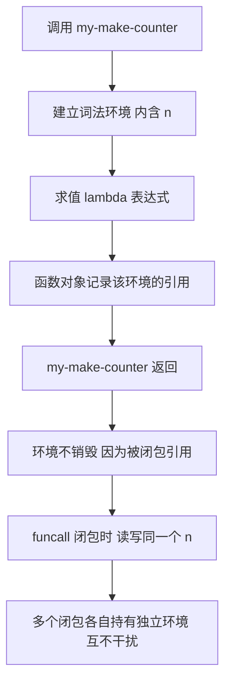
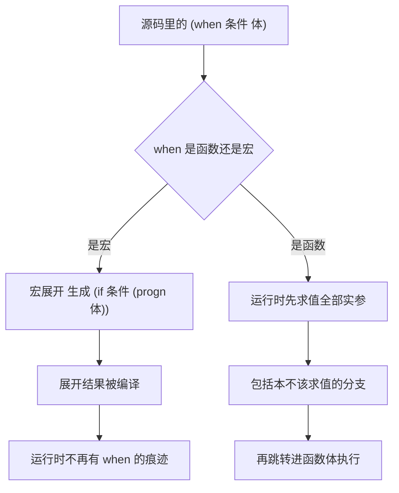

# 函数、闭包与宏

> `defun` 的完整参数形式、`interactive` 代码字符、闭包到底捕获了什么，以及从 `defmacro` 到 `gensym`、从 `when` 到线程宏的整套宏技术。

---

## 一、defun 的完整语法

### 1.1 基本形式

`defun` 定义一个具名函数，把它写进符号的函数单元。形式上分四段：名字、参数表、文档字符串、函数体。

```elisp
(defun my-add (a b)
  "返回 A 与 B 的和。"
  (+ a b))

(my-add 1 2)          ; 结果 3
(my-add "x" "y")      ; 结果 "xy"，+ 对字符串做拼接
```

注意 Elisp 没有静态类型：参数 `a`、`b` 可以是任何对象，`+` 对数字做加法、对字符串做拼接、对列表做合并。类型错误只在运行时暴露，错误信息形如 `wrong-type-argument number-or-marker-p "x"`。

### 1.2 &optional：可选参数

`&optional` 之后的参数可以省略，省略时取 `nil`。

```elisp
(defun my-greet (name &optional greeting)
  "向 NAME 打招呼，GREETING 默认是 Hello。"
  (format "%s, %s!" (or greeting "Hello") name))

(my-greet "Emacs")            ; 结果 "Hello, Emacs!"
(my-greet "Emacs" "你好")      ; 结果 "你好, Emacs!"
```

`&optional` 之后不能再有必需参数——这是语法限制，`&optional` 必须出现在所有必需参数之后。

### 1.3 &rest：收集剩余参数

`&rest` 把一个列表装下所有剩余实参，长度为 0 时得到 `nil`。

```elisp
(defun my-sum (&rest numbers)
  "对所有 NUMBERS 求和，没有参数时返回 0。"
  (apply #'+ 0 numbers))       ; 先垫一个 0，保证 nil 时也有结果

(my-sum)              ; 结果 0
(my-sum 1 2 3)        ; 结果 6
```

必需参数、`&optional`、`&rest` 可以组合，顺序固定为「必需 → `&optional` → `&rest`」。

```elisp
(defun my-join (separator &rest strings)
  "用 SEPARATOR 连接 STRINGS。"
  (mapconcat #'identity strings separator))

(my-join ", " "a" "b" "c")    ; 结果 "a, b, c"
(my-join ", ")                ; 结果 ""，没有元素时返回空串
```

### 1.4 cl-defun：&key 与 &aux

Emacs Lisp 原生没有关键字参数。要用关键字参数得用 `cl-lib` 提供的 `cl-defun`。

```elisp
(require 'cl-lib)

(cl-defun my-connect (host &key (port 22) user timeout)
  "连接 HOST，PORT 默认 22。"
  (list host port user timeout))

(my-connect "example.com")                       ; 结果 ("example.com" 22 nil nil)
(my-connect "example.com" :port 2222 :user "a")  ; 结果 ("example.com" 2222 "a" nil)
```

`&key` 的几个要点：

- 关键字参数可以被省略，默认值是 `nil`，或者用 `(port 22)` 形式给默认值。
- 判断某个关键字有没有被显式传入，用 `(cl-defun ... &key ((:port p) 22 port-supplied-p) ...)` 这种「带检测变量」的写法。
- 默认情况下，传入未知关键字会报错。想容忍未知关键字可以加 `&allow-other-keys`，或者调用时传一个 `:allow-other-keys t`。

```elisp
(cl-defun my-fn (a &rest rest &key b &allow-other-keys &aux (c 10))
  "A 是必需参数，B 是关键字参数，C 是 &aux 引入的局部变量。"
  (list a b c rest))

(my-fn 1 :b 2 :unknown 3)      ; 结果 (1 2 10 (:b 2 :unknown 3))
```

`&aux` 用来声明函数体内的局部变量，语义等价于在函数体最外层写一个 `let`，但它不算参数，调用者看不到也传不进去。`&rest` 与 `&key` 同时出现是合法的：`&rest` 收集全部剩余实参，`&key` 再从其中解析关键字。

### 1.5 参数解构

`cl-defun` 还支持在参数位置直接解构列表：

```elisp
(cl-defun my-show-point ((x y))
  "接收一个 (X Y) 形式的坐标。"
  (format "x=%d y=%d" x y))

(my-show-point '(3 4))     ; 结果 "x=3 y=4"
```

这一特性在写钩子函数、处理 `cl-defstruct` 实例时很方便，但会降低可读性，只在参数结构非常固定时使用。

**练习**：在 `M-:` 里定义 `(defun f (a &optional b &rest c) (list a b c))`，然后分别用 `(f 1)`、`(f 1 2)`、`(f 1 2 3 4)` 调用，观察三个返回值。

---

## 二、返回值

Elisp 的函数没有 `return` 语句（`cl-defun` 里有 `cl-return`，但它在 `cl-block` 内部使用，日常几乎不用）。**函数体最后一个表达式的值就是返回值。**

```elisp
(defun my-last-value ()
  "返回函数体最后一个表达式的值。"
  (+ 1 1)          ; 这个值被丢弃
  (* 3 3))         ; 结果 9，这才是返回值

(my-last-value)    ; 结果 9
```

这条规则带来两个实践后果：

第一，**不要写只有副作用的最后一个表达式却指望它返回 nil**。例如 `(message "done")` 作为最后一行时，函数返回的是那条消息字符串，而不是 `nil`。需要明确返回 `nil` 时把它写在最后。

第二，**返回值是 Edebug 和 `C-x C-e` 观察函数行为的入口**。写函数时让返回值携带尽可能多的信息，调试会轻松很多。一个典型反例是修改缓冲区的函数返回 `nil`，调用后什么也看不到；改成返回被修改的区域就方便得多。

如果确实需要提前返回，有两种正规写法：

```elisp
;; 用 catch/throw 做非局部退出，这是 Elisp 的标准做法
(defun my-find-first-even (list)
  "返回 LIST 中第一个偶数，找不到返回 nil。"
  (catch 'found
    (dolist (x list)
      (when (cl-evenp x)
        (throw 'found x)))
    nil))
```

对于循环内部，更简单的方式是直接用 `seq-find` 这类高阶函数，见第十节。

---

## 三、文档字符串与 C-h f

### 3.1 规范

文档字符串紧跟在参数表之后，必须是一个字符串字面量。约定如下：

- 第一行是一个完整的句子，以句号结尾，概括**做什么**而不是**怎么做**。`C-h f`、`apropos`、补全界面都只显示第一行。
- 如果函数是命令（有 `interactive`），第一行要写清楚它做什么。Emacs 的 `checkdoc` 会检查这一点。
- 参数名在文档里用大写书写，例如参数 `name` 在文档里写 `NAME`。这样 `C-h f` 能自动把它们变成可点击的链接。
- 需要展开说明时，空一行再写第二段。

```elisp
(defun my-count-lines (buffer)
  "统计 BUFFER 中的行数并返回。

BUFFER 可以是缓冲区对象，也可以是缓冲区名。
若 BUFFER 不存在则返回 nil。"
  (when-let* ((buf (get-buffer buffer)))
    (with-current-buffer buf
      (count-lines (point-min) (point-max)))))
```

注意最后一行用了 `when-let*`。**Emacs 31 起 `if-let` 与 `when-let` 被标记为过时**，官方建议改用 `if-let*`、`when-let*` 和 `and-let*`。在 Emacs 30 上三者都可用，所以新代码直接写带星号的版本最省事。

### 3.2 用 C-h f 验证

`C-h f`（`describe-function`）会显示函数名、参数列表、文档字符串、定义所在文件，以及是否有 `interactive` 声明。养成写完函数立刻 `C-h f` 看一眼的习惯，可以立刻发现两类问题：

- 参数列表和文档里的大写名字对不上，说明文档写漏了参数。
- 文档第一行是半句话，补全界面里会很难看。

`C-h f` 的输出里还能点击跳到定义处，比自己找文件快。

**练习**：定义上面那个 `my-count-lines`，然后 `C-h f my-count-lines RET`，检查参数 `BUFFER` 是不是变成了可点击的链接。

---

## 四、interactive：让函数变成命令

### 4.1 位置与作用

`(interactive ...)` 必须是**函数体的第一个表达式**（文档字符串之后）。它不是运行时调用的函数，而是一个声明：告诉 `call-interactively` 如何准备参数。

```elisp
(defun my-insert-date ()
  "在当前光标处插入今天的日期。"
  (interactive)
  (insert (format-time-string "%Y-%m-%d")))
```

有了 `interactive`，这个函数才能被 `M-x my-insert-date` 调用，也才能绑定到键位上：

```elisp
(global-set-key (kbd "C-c d") #'my-insert-date)
```

如果省略 `interactive`，函数仍然可以用 `M-:` 或代码调用，但 `M-x` 找不到它，绑键也会报 "commandp" 相关错误。

### 4.2 常用代码字符

`interactive` 的参数是一个字符串，每个字母代表一种读参数的方式，多个参数之间用换行符 `\n` 分隔。

| 字符 | 含义 | 传给函数的实参 |
| --- | --- | --- |
| `r` | 区域（region），点是起点、标记是终点 | 两个整数：起点与终点，小的在前 |
| `p` | 前缀参数转为数字 | 一个数字，如 `C-u 5` 得到 5 |
| `P` | 前缀参数的原始形式 | `nil`、`(4)`、`(16)` 或整数 |
| `s` | 从迷你缓冲区读一个字符串 | 一个字符串，不使用输入法 |
| `M` | 同 `s`，但继承当前输入法 | 一个字符串 |
| `f` | 读一个已存在的文件名 | 文件路径字符串 |
| `F` | 读一个文件名，可以不存在 | 文件路径字符串 |
| `n` | 从迷你缓冲区读一个数字 | 一个数字 |
| `N` | 有前缀参数时用前缀，否则同 `n` | 一个数字 |
| `d` | 点的位置 | 一个整数，不读输入 |
| `m` | 标记的位置 | 一个整数，不读输入 |
| `b` | 读一个已存在的缓冲区名 | 缓冲区名或对象 |
| `B` | 读一个缓冲区名，可以不存在 | 缓冲区名 |
| `a` | 读一个已有函数定义的符号 | 符号 |
| `C` | 读一个命令名 | 符号 |
| `v` | 读一个用户选项名 | 符号 |
| `x` | 读一个 Lisp 表达式，不求值 | 表达式（列表） |
| `X` | 读一个 Lisp 表达式并求值 | 求值结果 |
| `i` | 忽略，恒为 `nil` | `nil`，用于让参数个数对齐 |
| `k` / `K` | 读一个键序列 | 键序列向量或字符串 |

字符串开头还可以加修饰字符：`*` 表示缓冲区只读时报错，`@` 表示使用鼠标事件所属的窗口，`^` 表示启用临时标记（shift-selection）。

### 4.3 三个完整例子

```elisp
;; 例一：对区域做操作，r 一次给出起点和终点两个参数
(defun my-count-chars-in-region (start end)
  "统计区域内的字符数，并显示在回显区。"
  (interactive "r")
  (message "区域内有 %d 个字符" (- end start)))
```

```elisp
;; 例二：字符串参数加前缀参数，两个参数用 \n 分隔
(defun my-repeat-insert (text count)
  "在当前光标处插入 COUNT 次 TEXT。"
  (interactive "s要插入的文本: \np")
  (dotimes (_ (or count 1))
    (insert text)))
```

```elisp
;; 例三：读一个文件名，打开它并跳到末尾
(defun my-visit-log-tail (file)
  "打开 FILE 并跳到缓冲区末尾。"
  (interactive "f日志文件: ")
  (find-file file)
  (goto-char (point-max)))
```

注意提示串里的 `: ` 是提示语的一部分，Emacs 会在迷你缓冲区里原样显示。提示串会经过 `format` 处理，因此可以用 `%s` 引用前面已经读到的参数：

```elisp
(defun my-tag-file (tag file)
  "把 FILE 打上 TAG 标记。"
  (interactive "s标签: \nf文件: ")
  (message "已给 %s 打上标签 %s" file tag))
```

**练习**：写一个命令，用 `"r"` 读区域、用 `"s"` 读一段文本，把区域内容替换成这段文本。提示：用 `delete-region` 与 `insert`。

---

## 五、调用函数的三种方式

### 5.1 直接调用

第一种就是最普通的写法：把函数名放在列表的第一个位置。**前提是这个名字在编译期已知**，因为编译器会把它直接编译成一次函数调用。

```elisp
(car '(1 2 3))       ; 结果 1
```

### 5.2 funcall：函数已知，参数个数已知

当函数对象存在变量里，或者函数名是运行时算出来的，用 `funcall`。

```elisp
(funcall #'+ 1 2)                  ; 结果 3
(funcall '+ 1 2)                   ; 结果 3，符号也可以，因为 funcall 会取其函数定义
(let ((f (lambda (x) (* x x))))
  (funcall f 5))                   ; 结果 25
```

`funcall` 的第一个参数可以是符号或函数对象，其余参数原样传递。参数个数在源码里写死。

### 5.3 apply：参数在列表里

当参数本身就是个列表，用 `apply`。它的最后一个参数必须是列表，前面的参数会拼在列表前面。

```elisp
(apply #'+ '(1 2 3))         ; 结果 6
(apply #'+ 1 2 '(3 4))       ; 结果 10，等价于 (+ 1 2 3 4)
(apply #'message "值：%s" '(42))
```

一个非常常见的用法是转发参数，例如写包装函数：

```elisp
(defun my-logged-call (fn &rest args)
  "调用 FN 并转发 ARGS，同时在 *Messages* 里留下记录。"
  (message "调用 %S，参数 %S" fn args)
  (apply fn args))

(my-logged-call #'+ 1 2 3)   ; 先记录，再返回 6
```

### 5.4 #' 引号

`#'foo` 是 `(function foo)` 的简写，读作「函数引用」。它与 `'foo` 的区别在于：`#'` 告诉字节编译器这是一个函数引用，编译器可以检查它是否真的存在，并在字节编译后的文件里做相应处理。

```elisp
#'car        ; 等价于 (function car)
'car         ; 等价于 (quote car)
```

在传给 `mapcar`、`add-hook` 这类高阶函数时，**优先写 `#'`**。写 `'` 通常也能运行，但会失去编译期检查，也是 `checkdoc` 与 lint 工具会提示的写法问题。

| 场景 | 写法 |
| --- | --- |
| 函数名编译期已知 | `(foo 1 2)` |
| 函数存在变量里 | `(funcall f 1 2)` |
| 参数已经在列表里 | `(apply f args)` |
| 把函数当值传递 | `#'foo` 或 `(lambda ...)` |

**练习**：在 `M-:` 里执行 `(funcall (lambda (x y) (+ x y)) 3 4)`、`(apply #'+ '(3 4))`、`(apply #'+ 3 '(4))`，三个结果都应当是 7。

---

## 六、lambda 与匿名函数

`lambda` 构造一个匿名函数。它可以直接放在函数位置调用，也可以当值传递。

```elisp
((lambda (x) (* x x)) 5)                  ; 结果 25，直接调用

(mapcar (lambda (x) (* x x)) '(1 2 3))    ; 结果 (1 4 9)
(mapcar #'(lambda (x) (* x x)) '(1 2 3))  ; 结果同上，显式函数引用
```

`#'(lambda ...)` 与 `(lambda ...)` 在现代 Emacs 里基本等价，但 `#'` 形式对编译器更友好，也更符合惯例。

一个重要的事实：**Emacs 30 起，对一个 `lambda` 求值得到的对象类型是 `interpreted-function`**，而不再是历史上那种以 `closure` 开头的列表。这个变化对使用者几乎透明，但会影响两类代码：

- 用 `(car f)` 或 `(eq (car f) 'lambda)` 判断函数对象的旧代码会失效，应改用 `functionp`。
- 打印函数对象时的外观变了，调试时看起来更像一个不透明对象。

```elisp
(functionp (lambda (x) x))    ; 结果 t，跨版本都可用
(closurep (lambda (x) x))     ; 结果 t，Emacs 30 起可用
```

匿名函数的可读性上限很低：一旦超过三行，就应该提成具名函数。经验法则是——**如果需要在 `M-:` 里调试它，那就该给它起个名字**。

**练习**：用 `mapcar` 与 `lambda` 把 `'(1 2 3 4 5)` 中的偶数挑出来并各自平方，一步完成。

---

## 七、闭包

### 7.1 闭包捕获的是环境

闭包（closure）是「函数」加「它定义时所处的词法环境」。在启用了 `lexical-binding: t` 的文件里，`lambda` 会捕获外层 `let` 建立的词法环境，即使外层函数已经返回，环境依然存活。

```elisp
;; -*- lexical-binding: t -*-

(defun my-make-counter (&optional start)
  "返回一个计数器函数，每次调用返回递增后的值。"
  (let ((n (or start 0)))
    (lambda ()
      (setq n (1+ n))
      n)))

(let ((c (my-make-counter 10)))
  (list (funcall c) (funcall c) (funcall c)))   ; 结果 (11 12 13)
```

两个计数器互不干扰，因为每次调用 `my-make-counter` 都会建立**新的**词法环境：

```elisp
(let ((c1 (my-make-counter))
      (c2 (my-make-counter 100)))
  (list (funcall c1) (funcall c2) (funcall c1)))   ; 结果 (1 101 2)
```

下图给出环境与函数的绑定关系。



### 7.2 捕获的是变量，不是值

这是最容易理解错的一点。闭包捕获的是**变量本身**（那个词法位置），不是它当时的值。因此循环里创建的多个闭包会共享同一个变量。

```elisp
;; 错误示范：三个闭包共享同一个 i
(let (fns)
  (dotimes (i 3)
    (push (lambda () i) fns))
  (mapcar #'funcall (nreverse fns)))    ; 结果 (3 3 3)，不是 (0 1 2)
```

`dotimes` 的 `i` 是同一个词法变量，三个闭包都指向它；等它们被调用时，循环早已结束，`i` 的值是 3。

正确写法是把变量「复制」进每一轮独立的词法环境，最直接的方式是调用一个辅助函数：

```elisp
;; 正确示范：每轮都建立新的词法环境
(defun my-capture (i)
  "返回一个记住 I 的闭包。"
  (lambda () i))

(let (fns)
  (dotimes (i 3)
    (push (my-capture i) fns))
  (mapcar #'funcall (nreverse fns)))    ; 结果 (0 1 2)
```

另一种写法是在循环体里再套一层 `let`，前提是那一层 `let` 在每次迭代都被重新求值：

```elisp
(let (fns)
  (dotimes (i 3)
    (let ((j i))                  ; 每轮建立一个新的 j
      (push (lambda () j) fns)))
  (mapcar #'funcall (nreverse fns)))   ; 结果 (0 1 2)
```

### 7.3 动态绑定下的闭包陷阱

如果文件没有 `lexical-binding: t`，上面所有例子都不成立：lambda 不会捕获任何东西，它只会在被调用时去查符号的值单元。此时计数器的写法会直接报错或读到全局值。

这就是「配置里必须在第一行写 cookie」的最实际理由。回调、钩子、定时器、进程过滤器，全部依赖闭包。详见《变量作用域与绑定》第四节。

### 7.4 闭包在配置里的典型用途

```elisp
;; 保存按键次数，做成一个可以循环切换的开关
(defun my-make-cycler (values)
  "返回一个每次调用切换到 VALUES 中下一个值的闭包。"
  (let ((rest values))
    (lambda ()
      (prog1 (car rest)                 ; 返回当前值
        (setq rest (or (cdr rest) values))))))  ; 指针后移，到底回到开头
```

**练习**：把 7.2 的错误示范与正确示范各在 `M-:` 里跑一遍，确认结果分别是 `(3 3 3)` 与 `(0 1 2)`。

---

## 八、函数别名与函数作为数据

`defalias` 给函数起别名。它与 `defun` 的区别是：`defun` 定义一个新函数，`defalias` 让一个符号指向已有的函数对象。

```elisp
(defun my-original (x)
  "把 X 加倍。"
  (* x 2))

(defalias 'my-alias #'my-original)
(my-alias 5)          ; 结果 10

;; 查看别名指向谁
(indirect-function 'my-alias)   ; 结果就是 my-original 的函数对象
```

常见的三种用途：

```elisp
;; 用途一：给内置函数一个更符合自己习惯的名字
(defalias 'my-kill-this-buffer #'kill-current-buffer)

;; 用途二：临时替换某个函数，做调试或打补丁
(defalias 'my-old-message (symbol-function 'message))

;; 用途三：把键盘宏变成一个真正的命令
(defalias 'my-recorded-macro (kmacro-lambda-form ...))
```

`defalias` 也可以直接从 `lambda` 定义具名函数，这在动态生成命令时很有用：

```elisp
(defalias 'my-say-hello
  (lambda ()
    "打个招呼。"
    (interactive)
    (message "hello")))
```

函数作为数据还体现在可以用 `symbol-function` 取出函数对象，用 `fset` 写入函数单元：

```elisp
(fset 'my-direct #'(lambda (x) (+ x 1)))   ; 直接用函数对象填充函数单元
(my-direct 1)                               ; 结果 2
```

正式改名时应当用 `define-obsolete-function-alias` 标记旧名字，让 `C-h f` 与字节编译器提示用户迁移：

```elisp
(define-obsolete-function-alias 'my-old-name #'my-new-name "2.0")
```

**练习**：用 `defalias` 给 `insert` 起个别名 `my-insert`，在 `*scratch*` 里调用它插入一段文字。

---

## 九、递归与尾递归

Elisp 支持递归，但不做尾调用优化。深递归会触发栈溢出错误：

```elisp
(defun my-deep (n)
  "递归 N 层，用于观察栈深度限制。"
  (if (= n 0) 0 (1+ (my-deep (1- n)))))

(my-deep 100000)     ; 报错 (excessive-lisp-nesting ...)
```

这个错误的名字是 `excessive-lisp-nesting`，由变量 `max-lisp-eval-depth` 控制阈值（默认 1600，可在缓冲区里临时调大）。看到这个错误说明两件事：代码有无限递归，或者递归深度确实超过了 Emacs 的解释器上限。

**结论：不要靠尾递归写循环。** 需要迭代时用下面几种写法：

```elisp
;; 写法一：while，最接近 C 的习惯
(let ((i 0) (sum 0))
  (while (< i 10)
    (setq sum (+ sum i))
    (setq i (1+ i)))
  sum)                                    ; 结果 45

;; 写法二：dolist / dotimes，遍历与计数
(let ((sum 0))
  (dotimes (i 10 sum)
    (setq sum (+ sum i))))                ; 结果 45

;; 写法三：高阶函数，最贴近函数式写法
(seq-reduce #'+ (number-sequence 0 9) 0)  ; 结果 45
```

真正需要递归的场景是**处理递归数据结构**（树、嵌套列表），此时递归是自然的表达方式，深度通常也不大：

```elisp
(defun my-tree-depth (tree)
  "返回嵌套列表 TREE 的最大深度。"
  (if (consp tree)
      (1+ (apply #'max 0 (mapcar #'my-tree-depth tree)))
    0))

(my-tree-depth '(1 (2 (3 (4)))))    ; 结果 4
(my-tree-depth '(1 2 3))            ; 结果 1
(my-tree-depth 1)                   ; 结果 0
```

注意这里用 `(apply #'max 0 ...)` 补了一个 0，否则空列表会调用 `(max)` 报错。

**练习**：用 `while` 写一个函数，计算斐波那契数列第 n 项；再用递归写一遍，比较两者在 n 为 30 时的耗时。

---

## 十、高阶函数：seq.el 与 cl-lib

### 10.1 为什么需要高阶函数

「遍历列表并对每个元素做某事」是 Lisp 里最高频的操作。用 `while` 手写当然可以，但代码长、易错，而且把「遍历」和「做什么」混在一起。高阶函数把这两件事分开：你只提供「做什么」，遍历由库负责。

### 10.2 seq.el 的常用函数

`seq.el` 是 Emacs 25 起内置的统一序列库，**对列表、向量、字符串都能用**，这是它相对于 `mapcar` 的最大优势。

```elisp
(require 'seq)

(seq-map #'1+ '(1 2 3))                   ; 结果 (2 3 4)
(seq-map #'1+ [1 2 3])                    ; 结果 [2 3 4]，向量也行
(seq-filter #'cl-evenp '(1 2 3 4))        ; 结果 (2 4)
(seq-remove #'cl-evenp '(1 2 3 4))        ; 结果 (1 3)
(seq-reduce #'+ '(1 2 3) 0)               ; 结果 6
(seq-find #'cl-oddp '(2 4 5))             ; 结果 5
(seq-sort-by #'length #'< '("abc" "a"))   ; 结果 ("a" "abc")
(seq-group-by #'cl-oddp '(1 2 3 4 5))     ; 结果 ((nil 2 4) (t 1 3 5))
```

几个签名需要记住：

- `seq-reduce` 是 `(seq-reduce FUNCTION SEQUENCE INITIAL-VALUE)`，初始值在**最后**。空序列时直接返回初始值，因此它是安全的。
- `seq-sort-by` 是 `(seq-sort-by FUNCTION PREDICATE SEQUENCE)`，先用 FUNCTION 变换元素，再用 PREDICATE 比较变换后的值。
- `seq-find` 返回第一个满足谓词的元素，找不到返回 `nil`；要区分「找到 nil」与「没找到」，用 `seq-find` 的返回值无法区分，此时应改用 `seq-some` 或先判断存在性。
- `seq-group-by` 返回一个 alist，car 是谓词返回的键，cdr 是元素列表。注意键的顺序不保证。

其余常用函数列表：

| 函数 | 作用 |
| --- | --- |
| `seq-length` | 序列长度 |
| `seq-elt` | 按下标取元素 |
| `seq-first` / `seq-last` | 首元素 / 末元素 |
| `seq-take` / `seq-drop` | 取前 n 个 / 丢掉前 n 个 |
| `seq-take-while` / `seq-drop-while` | 按谓词截取 |
| `seq-concatenate` | 拼接两个序列，可指定结果类型 |
| `seq-uniq` | 去重 |
| `seq-contains-p` | 是否包含某元素 |
| `seq-some` / `seq-every-p` | 存在 / 全部满足 |
| `seq-max` / `seq-min` | 最大 / 最小 |
| `seq-partition` | 按 n 个一组切分 |
| `seq-doseq` | 遍历，类似 `dolist` 但支持任意序列 |
| `seq-let` | 解构绑定序列元素 |

```elisp
(seq-doseq (x [1 2 3]) (message "%s" x))   ; 遍历向量
(seq-let (a b c) '(1 2 3) (list c b a))    ; 结果 (3 2 1)，解构绑定
```

### 10.3 cl-lib 的对应函数

`cl-lib` 提供 Common Lisp 风格的版本，名字都带 `cl-` 前缀。它比 `seq.el` 出现更早，在很多老包里仍然是主力。

```elisp
(require 'cl-lib)

(mapcar #'1+ '(1 2 3))                       ; 结果 (2 3 4)，mapcar 是内置的
(cl-remove-if #'cl-evenp '(1 2 3 4))         ; 结果 (1 3)
(cl-find-if #'cl-oddp '(2 4 5))              ; 结果 5
(cl-reduce #'+ '(1 2 3) :initial-value 0)    ; 结果 6
(cl-mapcar #'+ '(1 2 3) '(10 20 30))         ; 结果 (11 22 33)
```

这里有两个容易踩的坑：

第一，**内置的 `mapcar` 只接受一个序列**。`(mapcar #'+ '(1 2 3) '(10 20 30))` 会报 `wrong-number-of-arguments`。要并行遍历多个序列，用 `cl-mapcar`，或者用 `seq-map`（它接受多个序列）。

```elisp
(mapcar #'+ '(1 2 3))            ; 结果 (1 2 3)，一个序列，合法
(cl-mapcar #'+ '(1 2 3) '(10 20 30))   ; 结果 (11 22 33)，多序列用 cl-mapcar
(seq-mapn #'cons [1 2] [3 4])    ; 结果 ((1 . 3) (2 . 4))
```

第二，**不要用无前缀的 `remove-if`、`find-if`**。那些名字来自已废弃的 `cl` 包，加载时会污染命名空间并触发警告。一律写 `cl-remove-if`、`cl-find-if`。

### 10.4 该用 seq 还是 cl-lib

| 场景 | 推荐 | 理由 |
| --- | --- | --- |
| 新代码，只处理列表 | `seq.el` | 接口统一，命名清晰，内置 |
| 需要同时支持列表与向量 | `seq.el` | `mapcar` 只认列表 |
| 需要并行遍历多个序列 | `cl-mapcar` 或 `seq-map` | 内置 `mapcar` 不接受多序列 |
| 需要复杂遍历（多重嵌套、条件收集） | `cl-loop` | 表达力最强，见《列表序列与哈希表》 |
| 维护老包、与既有风格一致 | `cl-lib` | 避免混用两种风格 |

**练习**：用 `seq-filter` 与 `seq-map` 把 `'(1 2 3 4 5 6)` 中的偶数挑出来并求平方和，结果为 4 + 16 + 36 = 56。

---

## 十一、宏

### 11.1 为什么需要宏

函数在**运行时**接收「已求值的值」。宏在**编译期**接收「未求值的代码」，并返回一段新代码。这个差别决定了两件事：

1. 宏可以控制参数**是否**被求值、求值**几次**、在**什么环境**里求值。`if` 能做到「只执行一个分支」正是因为它不是函数。
2. 宏在编译期完成展开，不产生运行时开销。函数调用则总是有一次跳转。

下图对比两条执行路径。



代价也很明显：宏的调试比函数难（报错位置指向展开后的代码），宏的错误用法会造成难以定位的问题（变量捕获、重复求值）。所以有一条通用建议：**能用函数解决就不要用宏。**

### 11.2 defmacro 与反引号

`defmacro` 的形式与 `defun` 一样，但它的返回值是「要被替换进去的代码」。

```elisp
(defmacro my-when (condition &rest body)
  "当 CONDITION 为真时依次求值 BODY。"
  `(if ,condition
       (progn ,@body)))
```

反引号（backquote）是构造代码模板的语法，三条规则必须记牢：

- `` ` `` 开始一个模板，模板里的内容默认当作数据。
- `,expr` 表示「这个位置求值后插进来」，插入的是**一个对象**。
- `,@expr` 表示「这个位置求值后展开拼接」，expr 必须求值出一个列表，列表的元素被逐个插入。

```elisp
(let ((x 1) (lst '(2 3)))
  `(a ,x ,@lst b))      ; 结果 (a 1 2 3 b)
  `(a (x) (lst)))       ; 结果 (a (x) (lst))，没有逗号就都是字面量
```

`(a ,x ,@lst b)` 的读法是：字面量 `a`，插入 `x` 的值 1，展开 `lst` 的元素 2 和 3，字面量 `b`。

### 11.3 展开与调试

三个工具按使用频率排列：

| 命令或函数 | 用途 |
| --- | --- |
| `M-x macroexpand-1` | 只展开最外层一层，看这个宏做了什么 |
| `M-x pp-macroexpand-last-sexp` | 展开光标前一个表达式并美化打印 |
| `M-x pp-macroexpand-expression` | 提示输入表达式再展开 |
| `(macroexpand-1 FORM)` | 函数形式，写在代码里做测试 |
| `(macroexpand FORM)` | 反复展开直到顶层不再是宏 |

```elisp
(macroexpand-1 '(my-when t (message "hi")))
;; 结果 (if t (progn (message "hi")))
```

`macroexpand-1` 只展开一层，这正是理解宏的关键：**宏展开是逐层的**，`my-when` 展开出的 `if` 与 `progn` 本身也是特殊形式，它们不再被 `macroexpand-1` 继续展开。

写宏时的调试流程建议是：先手写一遍「展开后应该长什么样」，再写宏，再用 `macroexpand-1` 对比。两者不一致就是宏写错了。

### 11.4 变量捕获与 gensym

宏展开的代码会插入到调用处的上下文里。如果宏内部用了普通变量名，而调用处恰好也有同名变量，就会发生**变量捕获**（variable capture）。

```elisp
;; 有 bug 的宏：内部用了 tmp 这个名字
(defmacro my-swap-bad (a b)
  "交换 A 与 B 的值。"
  `(let ((tmp ,a))
     (setq ,a ,b)
     (setq ,b tmp)))

;; 调用处恰好也有 tmp
(let ((tmp 1) (other 2))
  (my-swap-bad tmp other)
  (list tmp other))     ; 结果 (2 1)，看起来没问题
```

问题藏在展开结果里：

```elisp
(macroexpand-1 '(my-swap-bad tmp other))
;; 结果 (let ((tmp tmp)) (setq tmp other) (setq other tmp))
;; 内层 let 的 tmp 遮蔽了外层的 tmp，other 拿到的是内层 tmp 的值
```

修法是给内部变量一个**保证不会与用户代码冲突**的名字，用 `gensym` 生成：

```elisp
(defmacro my-swap (a b)
  "交换 A 与 B 的值，使用 gensym 避免变量捕获。"
  (let ((tmp (gensym "tmp")))
    `(let ((,tmp ,a))
       (setq ,a ,b)
       (setq ,b ,tmp))))

(macroexpand-1 '(my-swap x y))
;; 结果 (let ((tmp0 x)) (setq x y) (setq y tmp0))
```

`gensym` 每次调用都返回一个全新的、不可能被用户写出来的符号（形如 `tmp0`、`tmp1`）。`gensym` 由 `cl-lib` 提供，在文件里 `(require 'cl-lib)` 之后即可使用。

有一种更简洁的写法是给 `let` 的变量名加双连字符或使用 `--` 约定，但那只降低冲突概率，不提供保证。**涉及临时变量的宏一律用 `gensym`。**

### 11.5 多次求值陷阱

另一个经典问题是宏把同一个参数插入了多个位置，导致调用处的表达式被求值多次。

```elisp
;; 有 bug 的宏：x 出现了两次
(defmacro my-square-bad (x)
  "把 X 平方。"
  `(* ,x ,x))

(my-square-bad (my-expensive-computation))   ; 表达式被求值两次

;; 展开后看一眼就明白了
(macroexpand-1 '(my-square-bad (f)))
;; 结果 (* (f) (f))
```

修法是用 `let` 把值先取出来，只求值一次：

```elisp
(defmacro my-square (x)
  "把 X 平方，只求值 X 一次。"
  (let ((v (gensym "v")))
    `(let ((,v ,x))
       (* ,v ,v))))

(macroexpand-1 '(my-square (f)))
;; 结果 (let ((v0 (f))) (* v0 v0))
```

`cl-lib` 里已经内置了这个模式，叫 `macroexp-let2`，用它比自己写 `gensym` 更简洁，而且会处理一些边界情况：

```elisp
(require 'macroexp)

(defmacro my-inc (place)
  "把 PLACE 自增 1，PLACE 只求值一次。"
  (macroexp-let2 nil p place
    `(setq ,place (1+ ,p))))

(macroexpand-1 '(my-inc (car x)))
;; 结果 (let* ((p (car x))) (setq (car x) (1+ p)))
```

**判断宏有没有这个问题的方法**：展开一次，数一数调用处的参数在展开结果里出现了几次。出现两次以上，就要在展开结果里先绑定一次。

### 11.6 什么时候用宏，什么时候用函数

| 判断维度 | 用函数 | 用宏 |
| --- | --- | --- |
| 参数是否需要「不求值」 | 不需要 | 需要，如 `if`、`and`、`when` |
| 参数求值次数 | 恰好一次 | 需要控制，如绑定类宏 |
| 是否要在调用处引入新绑定名 | 不能 | 可以，如 `with-` 系列 |
| 是否要生成定义（defun、defvar） | 不能 | 可以 |
| 编译期就需要值 | 不能 | 可以，如 `eval-when-compile` |
| 调试难度 | 低 | 高 |
| 是否引入运行时开销 | 有函数调用开销 | 展开后通常没有 |

两条经验规则：

- 如果宏体里没有出现 `,`、`,@` 或返回的代码结构完全固定，那它多半该写成函数。
- 如果宏只是「把参数原样传给另一个函数调用」，那它该写成函数或 `defalias`。

### 11.7 常用内置宏

这些宏都内置在 Emacs 里，日常配置中会反复用到。

```elisp
;; when / unless：条件执行，是宏而非函数，所以体不被求值时不会执行
(when (> 3 2) (message "yes"))       ; 回显 yes
(unless (> 3 2) (message "no"))      ; 什么也不做，返回 nil

;; if-let* / when-let*：绑定成功才继续，Emacs 31 起推荐带星号的版本
(when-let* ((buf (get-buffer "foo"))
            (size (buffer-size buf)))
  (message "大小 %d" size))

;; dolist / dotimes：遍历与计数，返回值由第二个参数位置给出
(dolist (x '(1 2 3) 'done) (message "%s" x))    ; 返回 done
(dotimes (i 3 'fin) (message "%d" i))           ; 返回 fin

;; thread-first / thread-last：把上一个结果塞进下一个调用
(thread-first 5 (+ 3) (* 2))                    ; 结果 16
(thread-last '(1 2 3) (mapcar #'1+) (apply #'+)) ; 结果 9
```

关于线程宏必须澄清一个广泛流传的误解：**Emacs 内置的名称是 `thread-first` 和 `thread-last`，不是 `->` 和 `->>`。** 后两个短名字来自第三方包 `dash.el`，需要 `M-x package-install RET dash RET` 才能使用。

```elisp
;; 以下需要先安装 dash
(require 'dash)
(-> 5 (+ 3) (* 2))       ; 结果 16
(->> '(1 2 3) (mapcar #'1+) (apply #'+))   ; 结果 9
```

两者语义相同：`thread-first` 把值作为**第一个**参数插入，`thread-last` 把值作为**最后一个**参数插入。选择哪一个取决于目标函数的参数顺序——`(mapcar f seq)` 里序列在最后，所以用 `thread-last` 更顺手。

`thread-first` 定义在 `subr-x` 里，写在自己的包里时应当显式 `(require 'subr-x)`；在配置里（`init.el`）`subr-x` 通常已经加载，但显式 require 是好习惯。

```elisp
(require 'subr-x)
(thread-first "a,b" (split-string ",") (length))   ; 结果 2
```

`subr-x` 还提供 `named-let`，用于写带名字的循环，避免深递归：

```elisp
(named-let fib ((n 10))
  (if (< n 2) n (+ (fib (- n 1)) (fib (- n 2)))))   ; 结果 55
```

### 11.8 declare 与缩进声明

宏在编辑器里的缩进需要显式声明，否则 Emacs 不知道该怎么排版。`declare` 写在文档字符串之后、宏体之前。

```elisp
(defmacro my-with-thing (name &rest body)
  "在 NAME 指定的东西上执行 BODY。"
  (declare (indent 1) (debug t))
  `(progn ,@body))
```

- `(indent 1)` 表示把第一个参数当作「特殊参数」单独占一行，参数 2 起作为体缩进一级。写 `with-` 系列宏时几乎总要加它。
- `(debug t)` 告诉 Edebug 这个宏的参数都是普通表达式，可以逐条求值。参数含绑定列表的宏要用更复杂的 `debug` 声明，例如 `(debug ((&rest symbolp) body))`。
- `(doc-string 3)` 表示第 3 个参数是子表单的文档字符串，用于生成 `defun` 之类的宏。

不写 `(indent 1)` 的后果很直观：宏被 `TAB` 缩进成了一个普通函数调用的样子，可读性大打折扣。

### 11.9 完整示例一：一个 with- 宏

目标：写一个宏，临时切换当前缓冲区执行一段代码，无论成功失败都恢复原状。

```elisp
(defmacro my-with-buffer (buffer &rest body)
  "在 BUFFER 中依次求值 BODY，结束后恢复原缓冲区。

BUFFER 只求值一次。BODY 的返回值就是这个宏的返回值。"
  (declare (indent 1) (debug t))
  (let ((buf (gensym "buf")))
    `(let ((,buf ,buffer))
       (with-current-buffer ,buf
         ,@body))))
```

先看展开结果：

```elisp
(macroexpand-1 '(my-with-buffer (get-buffer "foo") (buffer-size)))
;; 结果 (let ((buf0 (get-buffer "foo"))) (with-current-buffer buf0 (buffer-size)))
```

这里用了 `gensym`，因为 `buffer` 参数只出现一次（没有多次求值问题），但 `buf` 是我们引入的绑定名，必须避免捕获。实际使用：

```elisp
(my-with-buffer "*scratch*"
  (goto-char (point-min))
  (buffer-substring (line-beginning-position) (line-end-position)))
```

再写一个更实用的版本：临时修改变量值执行代码，等价于 `let` 但更符合可读性的写法。注意内置的 `with-current-buffer` 就是这类宏的原型，`C-h f with-current-buffer RET` 可以看到它的文档与实现思路。

```elisp
(defmacro my-with-quiet-messages (&rest body)
  "在 BODY 执行期间把消息输出降到最低，结束后恢复。

通过 let 绑定 inhibit-message 实现，这是一个特殊变量。"
  (declare (indent 0) (debug t))
  `(let ((inhibit-message t))
     ,@body))
```

`inhibit-message` 是 defvar 声明过的特殊变量，因此 `let` 的动态绑定能影响 `message` 的内部实现。写这类宏前一定要用 `C-h v` 确认目标变量是特殊变量，否则 `let` 起不到作用。

### 11.10 完整示例二：生成定义命令的宏

目标：批量定义一组结构相同的命令。手写会重复十次，用宏一次解决。

```elisp
(defmacro my-define-window-opener (name key file)
  "定义命令 my-open-NAME，用 KEY 绑定它，打开 FILE。

NAME 是符号，KEY 是键位字符串，FILE 是文件路径字符串。"
  (declare (indent 1))
  (let ((fn (intern (format "my-open-%s" name))))
    `(progn
       (defun ,fn ()
         ,(format "打开 %s。" file)
         (interactive)
         (find-file ,file))
       (global-set-key (kbd ,key) #',fn)
       ',fn)))       ; 返回符号，方便确认生成了什么
```

展开结果（用 `macroexpand-1` 验证）：

```elisp
(macroexpand-1 '(my-define-window-opener config "C-c c" "~/.emacs.d/init.el"))
;; 结果 (progn
;;        (defun my-open-config ()
;;          "打开 ~/.emacs.d/init.el。"
;;          (interactive)
;;          (find-file "~/.emacs.d/init.el"))
;;        (global-set-key (kbd "C-c c") #'my-open-config)
;;        'my-open-config)
```

三个技术点：

- `intern` 在宏展开时（也就是编译时）就把命令名算出来，运行时不需要再做字符串拼接。
- 生成的文档字符串用 `(format ...)` 在展开时构造，因此是字面量，`C-h f` 能正常显示。
- 末尾返回 `',fn`，即符号本身。这不是必需的，但让宏在 `C-x C-e` 或 REPL 里有可见的返回值，调试时方便。

使用方式：

```elisp
(my-define-window-opener config "C-c c" "~/.emacs.d/init.el")
(my-define-window-opener notes  "C-c n" "~/org/notes.org")
```

之后 `C-c c` 与 `C-c n` 都能直接用了。

### 11.11 eval-and-compile 与 eval-when-compile

这两个宏控制「代码在什么阶段被求值」，写包时会用到。

- `eval-and-compile`：让一段代码在**编译时和运行时都执行一次**。常用于定义既被宏使用、又需要在运行时存在的函数或常量。
- `eval-when-compile`：让一段代码**只在编译时执行**。常用于在编译期计算一个常量，避免运行时开销。

```elisp
;; 编译期就计算出列表，生成的代码里直接是常量
(defconst my-weekdays
  (eval-when-compile
    (mapcar #'downcase '("Mon" "Tue" "Wed" "Thu" "Fri")))
  "工作日的英文小写名称。")
```

```elisp
;; 需要计算量较大、且编译期与运行期都要用到
(eval-and-compile
  (defun my-build-pattern (name)
    "根据 NAME 构造一个匹配模式字符串。"
    (format "\\_<%s\\_>" (regexp-quote name))))

(defmacro my-match-word (name)
  "展开为一个匹配 NAME 的正则。"
  `(re-search-forward ,(my-build-pattern name) nil t))
```

区别可以一句话概括：`eval-when-compile` 在解释执行时**什么也不做**（返回 `nil`），`eval-and-compile` 在解释执行时**照常执行**。所以如果一段代码在未编译的运行环境下也需要生效，就必须用 `eval-and-compile`。

### 11.12 宏的可读性与调试建议

最后给出一套写宏的检查清单：

- 先写出目标展开结果，再写宏。手写不出展开结果，说明还没想清楚。
- 用 `macroexpand-1` 逐层验证展开结果，不要一次展开到底。
- 数一数每个参数在展开结果里出现几次。出现两次以上，先用 `let` 或 `macroexp-let2` 绑定。
- 内部引入的临时变量一律 `gensym`。
- 加 `(declare (indent N))`，`N` 取第一个「体」参数的下标。
- 加 `(debug ...)` 声明，让 Edebug 能正确插桩。
- 文档字符串里写清楚展开后的求值语义，尤其是「哪个参数求值几次」。
- 如果宏体里没有任何反引号或逗号，改用函数。

还有一条排除法：**想在运行时根据值做决定，就用函数；想在编译期根据代码形态做决定，就用宏。** 大多数「我想写个宏」的冲动，其实都是「我想写个高阶函数」。

**练习**：写一个宏 `my-unless-zero`，当第一个参数不为 0 时求值其余参数，否则返回 `nil`。要求只求值第一个参数一次，并加 `(declare (indent 1))`。写完用 `macroexpand-1` 检查展开结果。

---

## 小结

- `defun` 支持 `&optional` 与 `&rest`，关键字参数要用 `cl-defun` 的 `&key`；函数体最后一个表达式的值就是返回值，Elisp 没有 `return`。
- `interactive` 让函数变成命令，`"r"` 给区域、`"p"` 给数字前缀、`"s"` 给字符串、`"f"` 给文件名；闭包捕获的是变量而非值，回调与循环里的坑都源于此。
- 宏在编译期操作代码：用反引号构造模板、用 `gensym` 避免捕获、用 `macroexp-let2` 避免重复求值、用 `declare` 声明缩进；能用函数解决就不要用宏。

---

## 相关章节

- [[emacs教程/2Elisp语言/01_求值与数据类型|Elisp 求值与数据类型]]
- [[emacs教程/2Elisp语言/02_变量作用域与绑定|变量作用域与绑定]]
- [[emacs教程/2Elisp语言/04_列表序列与哈希表|列表、序列与哈希表]]
- [[emacs教程/2Elisp语言/05_控制流错误处理与迭代|控制流、错误处理与迭代]]
- [[emacs教程/2Elisp语言/08_命令与键位映射|命令与键位映射]]
- [[emacs教程/2Elisp语言/10_包与命名空间实践|包与命名空间实践]]

---

## 参考资料

- Elisp 参考手册 https://www.gnu.org/software/emacs/manual/html_node/elisp/
- Elisp 参考手册单页版 https://www.gnu.org/software/emacs/manual/html_mono/elisp.html
- 《Programming in Emacs Lisp》入门书 https://www.gnu.org/software/emacs/manual/html_node/eintr/
- elisp-guide https://github.com/chrisdone/elisp-guide
- dash.el https://github.com/magnars/dash.el
- 插件开发手册 https://github.com/alphapapa/emacs-package-dev-handbook
- Emacs 中文社区论坛 https://emacs-china.org/
