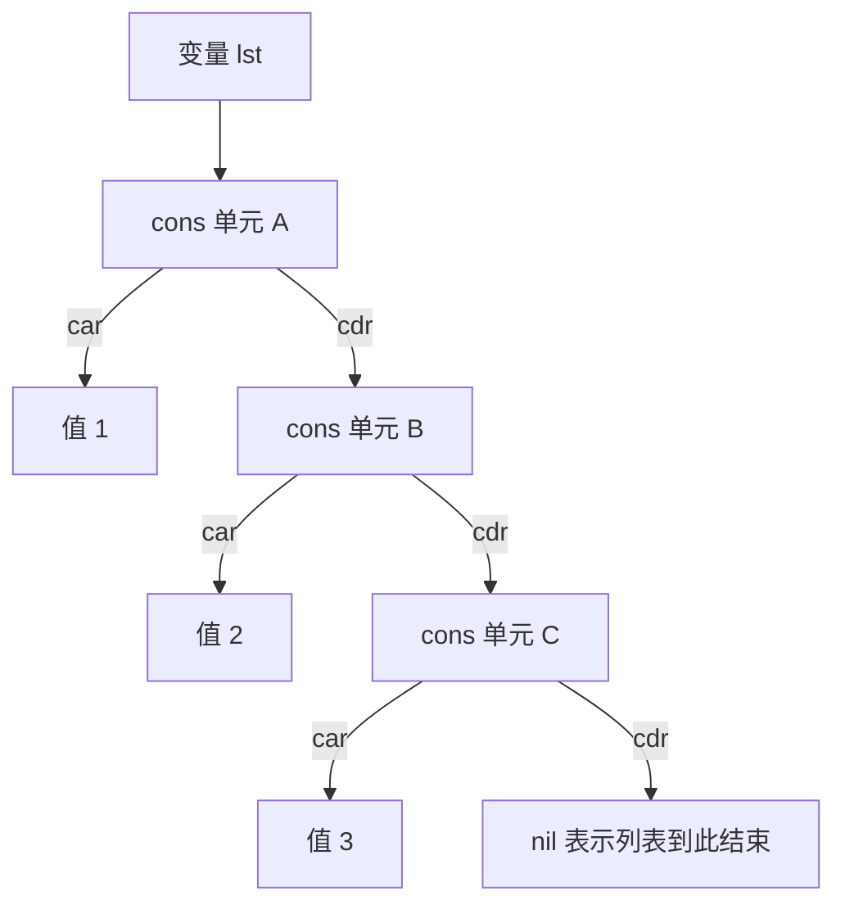
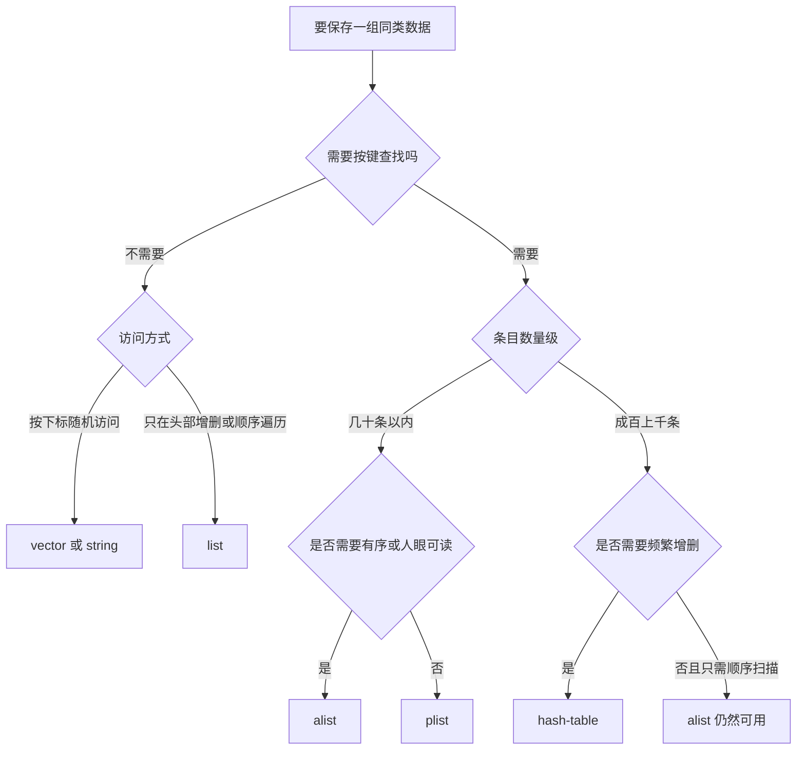

# 列表、序列与哈希表

> 本篇解决「数据往哪儿放」的问题：Elisp 的 cons 单元到底长什么样，为什么 `append` 是 O(n)，破坏性操作会在什么情况下咬人，以及 alist、plist、hash-table 三者应当如何取舍。有 C 语言基础的读者可以从指针链的角度直接理解 cons。

---

## 一、cons 单元与列表的底层结构

### 1.1 cons 就是一对指针

Elisp 里最基本的复合数据结构是 **cons 单元（cons cell）**，它只有两个槽位，分别叫 `car` 和 `cdr`。用 C 的话说，它等价于：

```c
/* 概念上的等价物，Elisp 里没有这个结构体的字面语法 */
struct cons {
    void *car;
    void *cdr;
};
```

`cons` 函数凭空造出一个新的 cons 单元，把两个参数分别放进 `car` 和 `cdr`：

```elisp
;; 造一个点对（dotted pair），打印时中间是一个英文句点
(cons 1 2)                     ; => (1 . 2)

;; 两个参数都是列表时，得到的是"列表的列表"，而不是扁平拼接
(cons '(1 2) '(3 4))           ; => ((1 2) 3 4)
```

最后那个结果值得琢磨：`(cons '(1 2) '(3 4))` 造出的新 cons 单元的 `car` 是整个 `(1 2)` 列表，`cdr` 是 `(3 4)` 列表。打印成 `((1 2) 3 4)`，因为打印器看到 `cdr` 是列表就不再打点号。

### 1.2 列表就是 cdr 串起来的链

一个**真列表（proper list）**的定义只有两条：要么是空列表 `nil`，要么是一个 cons 单元，且它的 `cdr` 也是真列表。所以 `(1 2 3)` 在内存里是三层嵌套的 cons：



这个图解释了三件事：

- `car` 取的是当前层的数据，`cdr` 取的是「剩下的整个链」，所以 `(cdr '(1 2 3))` 返回 `(2 3)` 而不是 `2`。
- 列表的长度是 O(n)，因为只能顺着 `cdr` 一节一节数到 `nil`。
- 从头部插入是 O(1)：只要造一个新 cons，把它的 `cdr` 指向原列表即可，不用碰原有数据。

构造列表的常用手段有四个，区别在于是不是必须写字面量：

```elisp
(list 1 2 3)                   ; => (1 2 3)     不定长参数
(make-list 3 'x)               ; => (x x x)     重复同一个对象
(require 'cl-lib)
(cl-list* 1 2 '(3 4))          ; => (1 2 3 4)   最后一个参数作为尾部拼上

;; 注意 Emacs Lisp 没有 list*，那是 cl-lib 里的 cl-list*
```

`make-list` 造出的每个元素都指向同一个对象。如果元素是可变对象（列表、向量），改一个就会改所有：

```elisp
(let ((l (make-list 3 (list 0))))
  (setcar (nth 1 l) 'X)
  l)                           ; => ((X) (X) (X))  三个位置全变了
```

`cl-list*` 的最后一个参数直接作为结果的尾部而不被复制，所以 `(cl-list* 1 2 tail)` 的结果与 `tail` 共享结构。这一点和 `append` 的最后一个参数是同一种设计。

如果 cons 链的最后一个 `cdr` 不是 `nil` 而是指回了链中间的某个 cons，就形成**循环列表（circular list）**。`make-list`、`list`、`append` 都不会造出循环列表，只有手工 `setcdr` 才会，所以正常代码里很少遇到；但一旦遇到，`length`、`reverse`、`equal` 这些函数可能永远不返回。调试时如果发现某个列表操作卡死，第一反应应该是检查有没有意外的循环引用。

`nil` 在这套设计里身兼两职：既是空列表，也是布尔假。这两重身份是后文若干坑的根源。

### 1.3 取元素的函数族与 C 的对照

`car` / `cdr` 可以组合成两到四层的缩写，读音是把字母从右往左念，`cadr` 读作「car of cdr」：

```elisp
(let ((x '((1 2) (3 4) (5 6))))
  (caar x)                     ; => 1      等价于 (car (car x))
  (cadr x)                     ; => (3 4)  等价于 (car (cdr x))
  (caddr x)                    ; => (5 6)
  (cddr x))                    ; => ((5 6))
```

对空列表取 `car` 或 `cdr` 都返回 `nil`，不报错——这一点和 C 里解引用空指针完全不同：

```elisp
(car nil)                      ; => nil
(cdr nil)                      ; => nil
```

判断类型时注意 `listp` 与 `consp` 的差别，以及 Emacs 27.1 起可用的 `proper-list-p`：

```elisp
(listp nil)                    ; => t    nil 被当成列表
(consp nil)                    ; => nil  但 nil 不是 cons
(proper-list-p '(1 2 3))       ; => 3    返回长度，而不是 t
(proper-list-p '(1 . 2))       ; => nil  点对不是真列表
(proper-list-p nil)            ; => 0    空列表长度为 0
(safe-length '(1 2 3))         ; => 3
(safe-length '(1 . 2))         ; => 1    点对按可数到的 cons 数算
```

`safe-length` 与 `length` 的区别在于遇到循环列表时：`safe-length` 会停下来返回一个上界，`length` 可能陷入无限循环。

### 1.4 为什么 append 是 O(n)

`append` 的语义是「把除最后一个参数之外的所有参数复制一遍，然后接上最后一个参数」。复制是必须的，因为原有列表的最后一个 cons 的 `cdr` 是 `nil`，要接上新东西就必须改掉它，而 `append` 承诺不修改任何输入，所以只能复制前面那些。

```elisp
(append '(1 2) '(3 4))         ; => (1 2 3 4)

;; 非破坏性：原列表纹丝不动
(let ((a '(1 2)))
  (append a '(3 4))
  a)                           ; => (1 2)

;; 但最后一个参数是被共享的，没有被复制
(let* ((tail (list 3 4))
       (whole (append (list 1 2) tail)))
  (eq (cddr whole) tail))      ; => t
```

结论：`append` 的开销是所有参数长度之和减去最后一个参数的长度。在循环里反复 `(setq acc (append acc (list x)))` 会退化成 O(n²)，正确写法是 `push` 之后最后 `nreverse`，或者用 `nconc`。

从 C 的角度类比：`append` 相当于「为前面每个链表节点 `malloc` 一份新节点并复制数据，最后把尾节点指向最后一个链表」。这个类比也解释了为什么 `append` 的最后一个参数不需要复制——它本来就是结果的尾巴，不需要改动自己。

`nconc` 与 `append` 语义相同但不复制，代价是它会修改除最后一个参数以外的所有输入的最后一个 cons：

```elisp
;; nconc 破坏性地拼接，O(1)
(let* ((a (list 1 2))
       (b (list 3 4)))
  (nconc a b)
  a)                           ; => (1 2 3 4)

;; append 不碰输入
(let* ((a (list 1 2))
       (b (list 3 4)))
  (append a b)
  (list a b))                  ; => ((1 2) (3 4))
```

`nconc` 的两个额外陷阱：如果第一个参数是 `nil`，它直接返回后面所有的参数，此时不修改任何东西；如果中间某个参数是 `nil`，它的前驱会直接接到再后面的参数上——这是 `nconc` 方便的地方，也是它在参数含 `nil` 时行为难以预测的原因。生产代码里若不确定参数是否为 `nil`，用 `append` 更安全。

另一个常见误解是「`nconc` 比 `append` 快所以应该无脑用」。`nconc` 只在拼接点省下复制成本，做「把两个列表接起来」这类操作时它确实快；但如果调用者之后还会用第一个参数，`nconc` 就破坏了它。判断标准很简单：这个列表还有别的引用吗？有就用 `append`。

---

## 二、常用列表操作速查

### 2.1 取元素与切片

| 函数 | 作用 | 复杂度 | 示例结果 |
| --- | --- | --- | --- |
| `car` | 取第一个元素 | O(1) | `(car '(1 2 3))` → `1` |
| `cdr` | 取除第一个元素外的剩余 | O(1) | `(cdr '(1 2 3))` → `(2 3)` |
| `cadr` | 取第二个元素 | O(1) | `(cadr '(1 2 3))` → `2` |
| `caddr` | 取第三个元素 | O(1) | `(caddr '(1 2 3))` → `3` |
| `nth` | 取第 N 个（从 0 起） | O(n) | `(nth 2 '(1 2 3 4 5))` → `3` |
| `nthcdr` | 跳过前 N 个后的剩余 | O(n) | `(nthcdr 2 '(1 2 3 4 5))` → `(3 4 5)` |
| `last` | 最后 N 个元素组成的列表 | O(n) | `(last '(1 2 3 4 5))` → `(5)` |
| `butlast` | 去掉最后 N 个 | O(n) | `(butlast '(1 2 3 4 5) 2)` → `(1 2 3)` |
| `length` | 长度 | O(n) | `(length '(1 2 3 4 5))` → `5` |

`last` 返回的是列表而不是元素，这是常见笔误来源：`(last '(1 2 3))` 得到 `(3)`，要拿元素得再套一层 `car`。`butlast` 与 `last` 都不会修改输入，但都会复制。

还有一点容易忽略：这一族里只有 `car`、`cdr`、`cadr`、`caddr` 等定层组合是 O(1)，凡是带位置参数的（`nth`、`nthcdr`）都是 O(n)，因为要从头数过去。所以在长度可能很大的列表上，`(nth 5000 lst)` 出现在循环里会变成 O(n²)。需要频繁按下标访问时应该换用向量。

截取子序列时，`seq-subseq` 和 `cl-subseq` 比手写 `nthcdr` 加 `butlast` 组合更清楚，而且它们同时支持列表和向量：

```elisp
(require 'seq)
(require 'cl-lib)
(seq-subseq '(1 2 3 4 5) 1 3)  ; => (2 3)      左闭右开
(cl-subseq '(1 2 3 4 5) 1 3)   ; => (2 3)
(cl-subseq [1 2 3 4] 1 3)      ; => [2 3]      向量也支持
```

注意 `nth` 严格要求列表，传向量会报 `Wrong type argument: listp`：

```elisp
(nth 1 [1 2 3])                ; 报错：Wrong type argument: listp
(aref [1 2 3] 1)               ; => 2
```

这条差异经常在「同一个函数既接受列表又接受向量」的工具函数里暴露出来，写通用代码时应当统一用 `elt` 或 `seq-elt`。

Emacs 29.1 新增了 `take` 和 `ntake`，Emacs 30 又把 `drop` 定义为 `nthcdr` 的别名，写法上比 `butlast` 组合更直白：

```elisp
(take 2 '(1 2 3 4 5))          ; => (1 2)
(drop 2 '(1 2 3 4 5))          ; => (3 4 5)   Emacs 30 起可用，等价于 nthcdr
```

`take` 的边界处理很贴心：`N` 为 0 或负数时返回 `nil`，`N` 大于等于列表长度时返回整个列表（或它的副本），不会越界报错。`ntake` 是它的破坏性版本，它会就地截断原列表，所以要按「破坏性操作」的规则对待。

### 2.2 拼接、反转与复制

| 函数 | 是否修改输入 | 说明 |
| --- | --- | --- |
| `append` | 否 | 复制除最后一个参数外的所有参数 |
| `nconc` | 是 | 就地拼接，O(1) |
| `reverse` | 否 | 返回新列表 |
| `nreverse` | 是 | 就地翻转 cdr 指针，O(n) 但零分配 |
| `copy-sequence` | 否 | 浅拷贝，只复制最外层 |
| `copy-tree` | 否 | 递归深拷贝 cons 结构 |

```elisp
(reverse '(1 2 3))             ; => (3 2 1)
(nreverse (list 1 2 3))        ; => (3 2 1)  原列表被拆散

;; 浅拷贝：内层列表仍然共享
(let* ((a (list (list 1)))
       (b (copy-sequence a)))
  (setcar (car a) 9)
  b)                           ; => ((9))  内层被连带修改

;; 深拷贝：完全独立
(let* ((a (list (list 1)))
       (b (copy-tree a)))
  (setcar (car a) 9)
  b)                           ; => ((1))
```

注意 `nreverse` 的返回值必须使用。Emacs 30 的字节编译器新增了对「忽略有返回值函数的结果」的警告，`(progn (nreverse my-list) my-list)` 这类写法会触发 `ignored-return-value` 警告，因为它几乎总是写错了。

### 2.3 查找：eq 系与 equal 系

列表查找函数按比较方式分成两族，选错族的后果是「明明有却查不到」：

| 函数 | 比较方式 | 适用场景 |
| --- | --- | --- |
| `memq` | `eq` | 成员是符号或小整数 |
| `member` | `equal` | 成员是字符串、列表等复合对象 |
| `assq` | `eq` 比较键 | alist 的键是符号 |
| `assoc` | `equal` 比较键 | alist 的键是字符串或列表 |
| `rassoc` | `equal` 比较值 | 反查 alist 中值匹配的条目 |

```elisp
(memq 'b '(a b c))             ; => (b c)
(member "a" '("a"))            ; => ("a")
(memq "a" '("a"))              ; => nil   字符串用 eq 比较必然失败

(assq 'b '((a . 1) (b . 2)))   ; => (b . 2)
(assq "a" '(("a" . 1)))        ; => nil   键是字符串时 assq 查不到
(assoc "b" '(("a" . 1) ("b" . 2)))  ; => ("b" . 2)
(rassoc 2 '((a . 1) (b . 2)))  ; => (b . 2)
```

`memq` / `member` 返回的是从匹配处开始的整个尾部，而不是 `t`，所以它可以直接当布尔值用，也可以顺手当切片用。

### 2.4 alist 与 plist

**关联列表（association list，alist）**是「每个元素都是一个 cons」的列表，适合表达有序的键值对；**属性列表（property list，plist）**是扁平的 `键 值 键 值` 列表，适合表达少量固定的属性。

```elisp
;; alist：键相同的第一个条目生效
(let ((al '((name . "root") (age . 30))))
  (alist-get 'name al)         ; => "root"
  (alist-get 'missing al)      ; => nil
  (alist-get 'missing al '默认值))  ; => 默认值

;; alist-get 从 Emacs 26.1 起接受 TESTFN 参数，可以指定比较函数
(alist-get "b" '(("a" . 1) ("b" . 2)) nil nil #'string=)  ; => 2

;; plist：键必须是符号，取值用 plist-get
(let ((pl (list 'a 1 'b 2)))
  (plist-get pl 'b)            ; => 2
  (plist-member pl 'b)         ; => (b 2)   返回以键开头的尾部，不是 t
  (plist-put pl 'c 3))         ; => (a 1 b 2 c 3)
```

`plist-put` 的细节要留意：如果键已存在，它就地修改原 plist 并返回同一个对象；如果键不存在，它在**头部**插入一对新的键值并返回新的 plist。所以 `plist-put` 的返回值必须用，不能只调用不接收。

`plist-member` 返回的是尾部而不是布尔值，这一点和 `memq` 一致；要判断存在性建议写成 `(and (plist-member pl 'k) t)`，或者直接看 `plist-get` 的返回值加上 `plist-member` 区分「值为 nil」和「键不存在」。

关于 alist 还需要记住三条性质：

- **查找是线性的**，`alist-get`、`assoc`、`rassoc` 都是从头逐个比较，所以 alist 适合几十条以内的场景。Emacs 自身的 `auto-mode-alist` 有上百条，它靠的是每次找文件只查一次，不会在热路径里反复查。
- **允许重复键，取第一个匹配**。这既是特性也是坑：`(alist-get 'a '((a . 1) (a . 2)))` 得到 `1`，后面的条目永远不会被查到。想「后设置的值覆盖先前的」，必须先删旧条目再 `push`。
- **顺序就是列表顺序**，所以 alist 天然有序，可以直接用 `sort` 重排，也可以人眼阅读。这是它相对 hash-table 最大的优势。

删除 alist 中的一个键有专门的函数，不要手写过滤：

```elisp
(let ((al '((a . 1) (b . 2))))
  (assq-delete-all 'a al)      ; => ((b . 2))
  (assoc-delete-all "a" '(("a" . 1) ("b" . 2))))  ; 用 equal 比较键
```

`assq-delete-all` 用 `eq` 比较键，`assoc-delete-all` 用 `equal`。两个函数都是破坏性的，会复用原列表的尾部结构，所以同样要把返回值赋回去。

浅拷贝 alist 用 `copy-alist`，它比 `copy-sequence` 多一层语义保证——复制每个条目 cons，但不复制条目的 `cdr`：

```elisp
(let ((al '((a . 1) (b . 2))))
  (copy-alist al))             ; => ((a . 1) (b . 2))  条目是新的，值共享
```

---

## 三、破坏性与非破坏性操作

### 3.1 setcar、setcdr 与 nconc

`setcar` 和 `setcdr` 是唯一两个直接改写 cons 槽位的原语，其余所有「就地修改」的函数最终都建立在它们之上：

```elisp
(let ((l (list 1 2 3)))
  (setcar l 'A)
  (setcdr l '(B C))
  l)                           ; => (A B C)
```

它们修改的是内存中的对象，而不是变量。这意味着**所有指向同一个 cons 的变量都会看到修改**：

```elisp
;; 别名效应：a 和 base 是同一个列表
(let* ((base (list 1 2 3))
       (a base))
  (setcar (cdr a) 'X)
  base)                        ; => (1 X 3)

;; 而 copy-sequence 出来的副本不受影响
(let* ((base (list 1 2 3))
       (b (copy-sequence base)))
  (setcar (cdr base) 'X)
  b)                           ; => (1 2 3)
```

危险点在于**浅拷贝只复制最外层**，内层仍然共享：

```elisp
;; 这个 bug 的典型症状：改了「副本」，原数据也变了
(let* ((inner (list 'x 'y))
       (l1 (list inner 'a))
       (l2 (append l1 nil)))   ; append 复制了外层
  (setcar (car l1) 'MUTATED)
  l2)                          ; => ((MUTATED y) a)
```

从 C 的角度看这非常自然——`append` 复制的是外层 `struct cons`，`car` 槽里存的仍是指向同一个内层列表的指针，等同于一串浅拷贝。要真正隔离必须用 `copy-tree` 或者自己写递归复制。

### 3.2 修改字面量：Emacs 30 开始报警

下面这种写法在过去很常见，现在已经明确是错误：

```elisp
;; 不要这样写：修改了程序里的常量
(setcar '(1 2 3) 'x)
(aset [3 4] 0 8)
(aset "abc" 1 ?d)
```

这些字面量可能被编译器合并、放进只读段、或者被多处代码共享，修改它们的行为不可预测。Emacs 30 的字节编译器会针对这几类情况发出 `mutate-constant` 警告，可以用 `with-suppressed-warnings` 抑制，但正确的做法是先用 `list`、`vector`、`copy-sequence` 造一份自己的数据再改。

### 3.3 破坏性操作的检查清单

写代码时按下表快速判断，凡是「是」的一列都需要确认调用者是否还持有原对象：

| 操作 | 破坏输入 | 返回值必须使用 |
| --- | --- | --- |
| `setcar` / `setcdr` | 是 | 否 |
| `nconc` | 是 | 是 |
| `nreverse` | 是 | 是 |
| `delete` / `delq` | 是 | 是 |
| `sort`（两参数旧签名） | 是 | 是 |
| `sort`（Emacs 30 关键字签名） | 否，默认排副本 | 是 |
| `append` | 否 | 是 |
| `reverse` | 否 | 是 |
| `push` / `pop` | 是，改变量 | 否 |

`delete` 和 `delq` 特别容易误用：它们不能删除列表的第一个元素，因为那需要改变量本身。删除首元素必须写成 `(setq l (delete x l))`。

### 3.4 sort 在 Emacs 30 的行为变化

这是 29 与 30 之间一个容易被忽略的差异。旧签名 `(sort SEQ PREDICATE)` 在 Emacs 30 里**仍然就地排序**，保持兼容；但 Emacs 30 新增了关键字签名，默认排副本：

```elisp
;; 旧签名：就地排序，原列表被改变
(let ((l (list 3 1 2)))
  (sort l #'<)
  l)                           ; => (1 2 3)

;; Emacs 30 关键字签名：默认排副本，可以同时指定 :key 和 :reverse
(sort (list "ccc" "a" "bb")
      :key #'length
      :lessp #'<)              ; => ("a" "bb" "ccc")

(sort (list 3 1 2) :lessp #'< :reverse t)   ; => (3 2 1)
(sort (list 3 1 2) :lessp #'< :in-place t)  ; 就地排序
```

`seq-sort` 则一直是在副本上操作，文档明确写了不修改输入：

```elisp
(let ((l (list 3 1 2)))
  (seq-sort #'< l)
  l)                           ; => (3 1 2)  原列表不变
```

---

## 四、push、pop、setf 与 cl-lib

### 4.1 push 与 pop

`push` 是「造一个新 cons 挂到列表头部并写回变量」的宏，`pop` 是「取头部并写回剩余」。它们都要求第一个参数是一个可赋值的位置：

```elisp
(let ((l (list 1 2)))
  (push 0 l)
  l)                           ; => (0 1 2)

(let ((l (list 0 1 2)))
  (list (pop l) l))            ; => (0 (1 2))
```

`push` 的展开就是 `(setq l (cons 0 l))`，所以它是 O(1)，也是「循环里收集结果」的推荐写法——先 `push` 再 `nreverse`，总复杂度 O(n)，不要用 `append` 累加。

### 4.2 setf 广义变量

`setf` 是宏，它的第一个参数不是值而是「位置」，可以作用在 `car`、`aref`、`gethash`、`alist-get`、`plist-get`、`symbol-function` 等一大批访问器上：

```elisp
;; 哈希表：setf gethash 与 puthash 等价
(let ((h (make-hash-table :test 'eq)))
  (setf (gethash 'k h) 1)
  (gethash 'k h))              ; => 1

;; 数组与向量
(let ((v (vector 1 2 3)))
  (setf (aref v 0) 9)
  v)                           ; => [9 2 3]

;; alist：键不存在时在头部插入
(let ((al '((a . 1))))
  (setf (alist-get 'b al) 2)
  al)                          ; => ((b . 2) (a . 1))

;; plist：键不存在时同样在头部插入
(let ((pl (list 'a 1)))
  (setf (plist-get pl 'b) 2)
  pl)                          ; => (b 2 a 1)
```

注意最后两个例子：当键不存在时，`alist-get` 和 `plist-get` 的 `setf` 都**在头部插入**，所以顺序会和你预期的不一样。如果顺序重要，还是用 `push` 显式构造。

### 4.3 cl-lib 的常用补充

`cl-lib` 提供了一批带 `cl-` 前缀的函数，与 Common Lisp 同名。它们不是「需要额外安装的包」，`cl-lib` 自 Emacs 24.3 起就是内置库，只要 `(require 'cl-lib)` 即可。

```elisp
(require 'cl-lib)

;; cl-pushnew：只在元素不存在时插入，避免重复
(let ((l (list 1 2)))
  (cl-pushnew 2 l)             ; 已存在，不插入
  (cl-pushnew 3 l)             ; 不存在，插入
  l)                           ; => (3 1 2)

;; cl-incf / cl-decf：自增自减，支持任意位置
(let ((n 0))
  (cl-incf n 5)
  (cl-decf n 2)
  n)                           ; => 3

;; cl-incf 可以直接作用在 gethash 上，计数器场景很方便
(let ((h (make-hash-table :test 'equal)))
  (puthash "a" 1 h)
  (cl-incf (gethash "a" h))
  (gethash "a" h))             ; => 2

;; 其它高频函数
(cl-remove-if #'cl-evenp '(1 2 3 4))       ; => (1 3)
(cl-find-if #'cl-evenp '(1 3 4 5))         ; => 4
(cl-position 3 '(1 2 3 4))                 ; => 2
(cl-remove-duplicates '(1 2 1 3) :test #'eql)  ; => (2 1 3)

;; cl-loop 是 Elisp 里最接近 C 的 for 循环写法
(cl-loop for i from 1 to 3 collect i)      ; => (1 2 3)
```

注意 `cl-remove-duplicates` 保留的是**最后一次出现**的位置：`(1 2 1 3)` 得到 `(2 1 3)` 而不是 `(1 2 3)`。这与很多人的直觉相反。

---

## 五、向量、字符串与布尔向量

### 5.1 aref 与 elt

`aref` 要求参数是**数组（array）**，即向量、字符串、布尔向量或字符表；列表不是数组，传列表会报 `Wrong type argument: arrayp`。`elt` 则对任何**序列（sequence）**都有效，包括列表，代价是列表上是 O(n)。

```elisp
(aref "abc" 1)                 ; => 98    字符串按字符取，得到字符编码
(aref [1 2 3] 1)               ; => 2
(aref '(1 2 3) 1)              ; 报错：Wrong type argument: arrayp

(elt '(1 2 3) 1)               ; => 2     elt 支持列表
(elt "abc" 1)                  ; => 98
```

`aset` 与之对应，可以写入向量、字符串、布尔向量和字符表。字符串虽然可以 `aset`，但字符数变化需要重建字符串；如果只是替换等长内容才适合原地改。

`sequencep` 对列表、向量、字符串都返回 `t`，这是「我想写一个能接受任意序列的函数」时的判据。

### 5.2 字符串处理

```elisp
(concat "ab" "cd" [101] (list ?f))            ; => "abcdef"  混合类型也可拼接
(substring "abcdef" 1 3)                      ; => "bc"
(string-join '("a" "b" "c") ", ")             ; => "a, b, c"
(string-trim "  x  ")                         ; => "x"
(string-replace "a" "A" "banana")             ; => "bAnAnA"
(replace-regexp-in-string "[0-9]+" "#" "a1b22c")  ; => "a#b#c"
```

`split-string` 有两个容易踩的细节。当 `SEPARATORS` 省略时，它使用 `split-string-default-separators`（值为 `"[ \f\t\n\r\v]+"`），此时 `OMIT-EMPTY` 被**强制设为 `t`**，所以首尾空白被自动裁掉；一旦你显式传了分隔符，`OMIT-EMPTY` 默认是 `nil`，空串会保留：

```elisp
(split-string " a b ")         ; => ("a" "b")        默认分隔符，忽略空串
(split-string "a,,b" ",")      ; => ("a" "" "b")     显式分隔符，保留空串
(split-string "a,,b" "," t)    ; => ("a" "b")        显式要求忽略空串
```

另外 `split-string` 会破坏 match data，在 `while` 循环里和 `string-match` 混用时要用 `save-match-data` 包起来。

`string-join`、`string-trim` 这一族工具在 Emacs 24.4 起随 `subr-x` 提供，`string-trim` 后来移入了 `subr.el` 并自带自动加载；直接调用即可，不必手动 `require`。

字符串作为序列时有一个必须留意的细节：**下标是以字符为单位，不是以字节为单位**。Emacs 内部用多字节编码保存文本，一个中文字符占 3 个字节但算 1 个字符：

```elisp
(length "abc")                 ; => 3
(string-bytes "abc")           ; => 3
(length "中")                  ; => 1      字符数
(string-bytes "中")            ; => 3      字节数
(string-width "中")            ; => 2      显示宽度，终端里占两列
```

所以 `substring`、`aref`、`length` 都是按字符计数，不需要自己做编码换算——这一点比 C 里处理 UTF-8 字符串要省心得多。真正需要关心字节数的地方只有文件读写、网络协议和 `string-bytes` 明确相关的场景。

`reverse` 对列表、向量、字符串都有效，返回同类型的新序列：

```elisp
(reverse '(1 2 3))             ; => (3 2 1)
(reverse [1 2 3])              ; => [3 2 1]
(reverse "abc")                ; => "cba"
```

但 `nreverse` 只对刚 `cons` 出来的列表安全。对字符串和字面量向量调用 `nreverse` 属于修改常量的范畴，Emacs 30 的编译器会就此发出警告。

### 5.3 布尔向量

布尔向量（bool-vector）是位图，每个元素只占一位，适合做大规模的存在性标记：

```elisp
(let ((bv (make-bool-vector 5 nil)))
  (aset bv 2 t)
  (list (aref bv 2)                        ; => t
        (bool-vector-count-population bv)  ; => 1
        bv))                               ; => #&5""
```

`bool-vector-p` 只认真正的布尔向量，`[t nil]` 是普通向量，返回 `nil`。Emacs 24.4 补齐了一批集合运算：`bool-vector-not`、`bool-vector-subsetp`、`bool-vector-set-difference`、`bool-vector-count-consecutive`、`bool-vector-count-population`。它们都是 C 层实现，比手写循环快得多。

### 5.4 字符表

**字符表（char-table）**是「以字符为下标」的稀疏数组，Emacs 内部用它实现大小写转换表、语法表和显示表。它有几个和普通数组不同的规则：

```elisp
(let ((ct (make-char-table 'my-purpose nil)))
  (set-char-table-range ct ?a 'lower)        ; 单个字符
  (set-char-table-range ct '(?0 . ?9) 'digit) ; 一个区间，用 cons 表示
  (list (char-table-range ct ?a)             ; => lower
        (aref ct ?a)                         ; => lower    aref 同样可用
        (char-table-range ct ?5)             ; => digit
        (char-table-range ct ?Z)))           ; => nil      未设置的字符
```

取值和设值的参数语义**不对称**，这是最容易记错的地方：`set-char-table-range` 用 `t` 表示「所有字符」、用 `nil` 表示「默认值」；而 `char-table-range` 只用 `nil` 表示默认值，不接受 `t`。

字符表还支持父表继承：`set-char-table-parent` 挂上父表后，子表未设置的字符会回退到父表查找，这和 keymap 的继承是同一套思路。`map-char-table` 用于遍历，遍历的是「区间」而不是单个字符，所以回调第一个参数是字符或区间 cons。

---

## 六、seq.el 统一接口

`seq.el` 是 Emacs 25 起内置的序列库，为列表、向量、字符串提供同一套函数。凡是需要「对任意序列操作」的函数，优先用 `seq-` 系列，比手写 `mapcar` 加类型判断更清晰。

它解决的问题很具体：Elisp 传统上把「序列操作」分成两套接口——列表用 `mapcar`、`member`、`nth`，向量和字符串用 `aref`、`aset`、`vconcat`。写一个既能吃列表又能吃向量的函数，就得先判断类型再分派，或者在内部统一转成列表，两种做法都啰嗦且容易漏分支。`seq.el` 用一组以 `seq-` 开头的函数把这层分派藏了起来，代价是运行时多一次类型判断，以及个别函数的返回类型与你直觉不符。

它的另一个价值是命名一致：`seq-find`、`seq-position`、`seq-count`、`seq-some`、`seq-every-p` 这一整套谓词风格接口在列表库里是没有对应物的，传统写法得手动 `catch`/`throw` 或者写 `while` 循环。

下面列出最常用的一批，全部对列表、向量、字符串通用：

```elisp
(require 'seq)                 ; 多数 seq- 函数自带自动加载，显式 require 更稳妥

(seq-map #'1+ '(1 2 3))                        ; => (2 3 4)
(seq-filter #'cl-evenp '(1 2 3 4))             ; => (2 4)
(seq-reduce #'+ '(1 2 3 4) 0)                  ; => 10
(seq-find #'cl-evenp '(1 3 4 5))               ; => 4
(seq-sort #'< '(3 1 2))                        ; => (1 2 3)   在副本上排序
(seq-sort-by #'length #'< '("ccc" "a" "bb"))   ; => ("a" "bb" "ccc")
(seq-uniq '(1 2 1 3))                          ; => (1 2 3)
(seq-contains-p '(1 2 3) 2)                    ; => t
```

`seq-contains-p` 是 Emacs 27.1 新增的，取代了已废弃的 `seq-contains`：旧函数返回元素本身，遇到元素为 `nil` 时无法区分「找到 nil」和「没找到」，新函数返回严格的布尔值。

几个必须记住的差异点：

- `seq-sort` 明确在副本上操作，`sort` 的两参数旧签名是就地排序。二者不可互换着用。
- `seq-into` 转换类型时，字符串会变成字符编码的列表：`(seq-into "abc" 'list)` 得到 `(97 98 99)`，不是 `("a" "b" "c")`。
- `seq-map` 作用在字符串上返回的是**列表**而不是字符串：`(seq-map #'upcase "abc")` 得到 `(65 66 67)`。要拿回字符串得再 `(apply #'string ...)` 或 `seq-into` 到 `string`。
- `seq-group-by` 返回的 alist 顺序没有保证，实测是按分组出现顺序的逆序，不要依赖它：`(seq-group-by #'cl-evenp '(2 1 4 3))` 得到 `((t 2 4) (nil 1 3))`，键 `t` 在前。

`cl-lib` 与 `seq.el` 有不少功能重叠。经验法则是：新代码优先用 `seq-`，因为它是 Emacs 官方库、命名统一、不依赖 Common Lisp 兼容层；`cl-lib` 的优势在于 `cl-loop`、`cl-destructuring-bind`、`cl-defstruct` 这些宏，以及 `cl-incf`、`cl-pushnew` 这类广义变量工具。

---

## 七、哈希表

### 7.1 make-hash-table 的 :test 取舍

`make-hash-table` 的 `:test` 决定键的比较方式，选错会导致「存进去却取不出来」。可用的取值有三个：

| `:test` | 比较方式 | 什么时候用 | 典型键类型 |
| --- | --- | --- | --- |
| `eql`（默认） | 数值按值、符号按标识 | 键是数字或符号 | 整数、符号 |
| `eq` | 对象标识 | 键是符号，追求最快 | 符号、buffer、marker |
| `equal` | 结构相等 | 键是字符串或列表 | 字符串、列表 |

```elisp
;; 字符串键必须用 equal，否则同一个字符串查不到
(let ((h (make-hash-table :test 'equal)))
  (puthash "key" 1 h)
  (gethash (concat "ke" "y") h))     ; => 1

;; 用默认的 eql 就会失败，因为两个 "key" 是不同的对象
(let ((h (make-hash-table)))
  (puthash "key" 1 h)
  (gethash (concat "ke" "y") h))     ; => nil
```

`equal` 比 `eq` 慢一些，因为它要递归比较内容；`eq` 最快但只对符号和定长整数可靠。经验做法是键用符号就用 `eq`，键是字符串就用 `equal`，不要把两种键混在一张表里。

在性能敏感的场景下，`equal` 的开销值得关注：每次查表都要对候选键做一次完整的结构比较，长字符串会明显变慢。Emacs 对此的优化是先比 `sxhash`，只有哈希相同才做完整比较，所以哈希计算本身成了主要成本。如果键是大量长字符串，可以考虑先 `intern` 成符号再用 `eq` 表，用符号名做去重。

`:size` 参数是容量提示，不是上限。哈希表会按需自动扩容，但扩容要重新散列所有条目。预先知道大概条目数时给出 `:size` 可以省掉若干次重散列：

```elisp
;; 预计放一万条，直接给出容量提示
(make-hash-table :test 'equal :size 10000)
```

`:size` 给大不会浪费太多内存，给太小只是多几次扩容，不会影响正确性。真正需要注意的是不要把它当成「表最多能放这么多」。

`make-hash-table` 还接受 `:size`（初始容量提示）、`:weakness`（弱引用类型，如 `key`、`value`、`key-or-value`）以及历史上的 `:rehash-size`、`:rehash-threshold`。

**版本差异：** Emacs 30 起 `:rehash-size` 和 `:rehash-threshold` 被完全忽略，Emacs 统一管理所有哈希表的内存；`hash-table-rehash-size` 和 `hash-table-rehash-threshold` 这两个函数为了兼容仍然存在，但永远返回旧默认值。同时 Emacs 30 简化了哈希表的打印形式：`:test` 为默认的 `eql` 时省略，`:data` 为空时省略，`rehash-size`、`rehash-threshold`、`size` 一律不再打印。旧代码里写这两个关键字不会报错，但在 Emacs 30 上它们没有任何效果。

### 7.2 基本操作

```elisp
(let ((h (make-hash-table :test 'equal :size 100)))
  (puthash "a" 1 h)
  (puthash "b" 2 h)

  (gethash "a" h)              ; => 1
  (gethash "missing" h)        ; => nil
  (gethash "missing" h '默认)  ; => 默认   第三个参数是找不到时的返回值

  (hash-table-count h)         ; => 2
  (hash-table-test h)          ; => equal
  (remhash "a" h)              ; 返回 nil，但条目已被删除
  (clrhash h)                  ; 清空并返回这张表本身
  (hash-table-count h))        ; => 0
```

`remhash` 的返回值是 `nil` 而不是「是否删掉了」，这点和很多语言不同；要判断删除前是否存在，应当先 `gethash` 并自己判断。`clrhash` 返回表本身，所以可以写成 `(hash-table-count (clrhash h))`。

### 7.3 遍历与键值列表

遍历用 `maphash`，回调按 `(键 值)` 的顺序接收两个参数：

```elisp
(let ((h (make-hash-table :test 'equal))
      (total 0))
  (puthash "a" 1 h)
  (puthash "b" 2 h)
  (maphash (lambda (key value)
             (setq total (+ total value)))
           h)
  total)                       ; => 3
```

`maphash` 的回调里有严格的修改限制。文档给出的允许范围只有两条：用 `puthash` 修改**当前这个键**的值，或者用 `remhash` 删除**当前这个键**。除此之外的任何改动——包括新增键、删除别的键、`clrhash` 整表清空——都可能让遍历器跳到未定义的状态，轻则漏掉条目，重则死循环。

需要「一边遍历一边按条件删除」时，安全做法是先收集再处理：

```elisp
;; 先取键列表，再逐个判断删除
(let ((h (make-hash-table :test 'equal)))
  (puthash "a" 1 h)
  (puthash "b" 2 h)
  (dolist (key (hash-table-keys h))
    (when (cl-evenp (gethash key h))
      (remhash key h)))
  (hash-table-count h))        ; => 1
```

这里 `hash-table-keys` 返回的是新列表，遍历它不会受 `remhash` 影响，这就是「先快照后修改」模式。

取键列表和值列表用 `hash-table-keys`、`hash-table-values`：

```elisp
(require 'subr-x)              ; 必须显式 require，这两个函数没有自动加载

(let ((h (make-hash-table :test 'equal)))
  (puthash "a" 1 h)
  (puthash "b" 2 h)
  (hash-table-keys h)          ; => ("b" "a")  顺序不保证
  (hash-table-values h))       ; => (2 1)
```

关于这两个函数有一个流传很广的误解，这里必须澄清：**它们不是 Emacs 29 的新功能**。`hash-table-keys` 和 `hash-table-values` 自 Emacs 24.4 起就随 `subr-x.el` 提供。真正的坑在于它们**没有自动加载**，在 `emacs -Q --batch` 下直接调用会报 `void-function`，必须 `(require 'subr-x)`；而同一个文件里的 `string-join` 是自带自动加载的，所以不能凭「同在 subr-x」推断可用性。

还有一个必须记住的性质：**哈希表的遍历顺序和键列表顺序都没有任何保证**。它取决于哈希函数、表大小和插入历史，在小表上实测常常表现为「与插入顺序相反」，但这不是契约。任何依赖顺序的代码都应该显式排序。键的值相等性由 `:test` 决定，哈希值则由 `sxhash-equal`、`sxhash-eq`、`sxhash-eql` 分别计算。

---

## 八、alist、plist 与哈希表的取舍

三种结构都能表达键值映射，选择依据是数据规模、访问模式和可读性：



| 维度 | alist | plist | hash-table |
| --- | --- | --- | --- |
| 查找复杂度 | O(n) | O(n) | 均摊 O(1) |
| 顺序 | 保持插入顺序 | 保持插入顺序 | 无保证 |
| 重复键 | 允许，取第一个 | 允许，取第一个 | 不允许 |
| 键类型 | 任意（取决于比较函数） | 只能是符号 | 取决于 `:test` |
| 打印可读性 | 好 | 好 | 一般 |
| 可否放进 `defcustom` | 可以 | 可以 | 可以但不直观 |
| 典型用途 | 配置项、模式表 | 符号属性、函数参数 | 索引、缓存、计数器 |

实践中的判断顺序：

- 条目数在几十以内、需要人眼阅读或需要被用户自定义，用 alist。Emacs 自身的配置变量大量使用 alist，例如 `auto-mode-alist`、`package-archives`。
- 表达「一个对象的若干属性」且属性名是固定符号，用 plist。文本属性、overlay 属性、`defcustom` 的 `:type` 都是 plist。
- 需要按字符串键做大量查找，或者规模可能上千，用 hash-table。
- 需要保持顺序又需要查找，用 alist 加一个 hash-table 做索引是常见组合；`org-agenda` 等模块内部就这么做。

还有一个容易被忽略的维度：**这些结构能不能被序列化进配置文件**。alist 和 plist 都是普通列表，可以原样写进 `defcustom` 的默认值，也可以直接 `prin1` 到文件再 `read` 回来；哈希表虽然也支持读写语法，但版本之间的打印形式会变（Emacs 30 就改了），拿它做持久化格式不如用列表稳妥。

反过来说，如果一份数据只在程序运行期间被频繁增删，而外部并不需要读它，就不要为了「可读性」硬用 alist。`alist-get` 是线性查找，几千条之后每次查询都要从头遍历一遍，与哈希表的差距会非常明显。经验阈值可以这样记：条目超过一百条并且处于热路径上，就换成 hash-table；反之，几十条以内且需要用户能看懂、能改，就老老实实用 alist。

---

## 九、ring.el 简介

**环形缓冲区（ring）**是固定容量的队列，写满之后新元素挤掉最旧的。它在 Emacs 内部用于 kill ring、`recentf`、`comint` 输入历史等场景。

```elisp
(require 'ring)

(let ((r (make-ring 3)))       ; 容量 3
  (ring-insert r 'a)
  (ring-insert r 'b)
  (ring-insert r 'c)
  (ring-insert r 'd)           ; 挤掉最旧的 a
  (list (ring-length r)        ; => 3      当前元素个数
        (ring-size r)          ; => 3      容量上限
        (ring-ref r 0)         ; => d      下标 0 是最近插入的
        (ring-elements r)      ; => (d c b) 从新到旧
        (ring-remove r)))      ; => b       不传 INDEX 时删除最旧的
```

容易混淆的两组命名：

- `ring-insert` 插入为**最新**元素；`ring-insert-at-beginning` 插入为**最旧**元素。名字里的 beginning 指的是队列头部（最旧端），不是「最新」。
- `ring-ref` 的下标 0 是最近插入的，下标越大越旧；而 `ring-remove` 不传 `INDEX` 时删的是**最旧**的。

这两个 API 的方向感不一致，是 `ring.el` 最常见的用错点，建议在代码里显式传 `INDEX` 而不是依赖默认行为。`ring-p` 用于判断对象是不是 ring，`ring-empty-p` 判断是否为空，`ring-copy` 做浅拷贝。

什么时候该用 ring，而不是普通列表？三条判据：

- **容量必须有上限，且超出后应该自动丢弃最旧的数据**。用列表就得自己写「加一个再删最后一个」的逻辑，ring 把这件事封好了。
- **需要按下标读取历史记录**，例如「取最近第 3 条输入」。列表上做到这件事要遍历，ring 的 `ring-ref` 就是一次取模寻址。
- **插入和读取都很频繁**。`ring-insert` 是 O(1)，因为内部用向量存数据加一个头指针，不需要移动元素。

反过来说，如果数据量不固定、需要排序、需要按内容查找，ring 都不合适，那是列表或哈希表的活。ring 也不提供「按值删除」的接口，`ring-remove` 只按位置删。

一个常见的误用是拿 ring 当队列的通用替代品：它的容量在 `make-ring` 时就固定了，事后无法扩容（`ring-resize` 是内部函数，不在公开接口里）。如果容量会变，还是应该用列表，或者用两个列表模拟队列。

---

## 十、完整实战：统计缓冲区词频

下面的函数统计当前缓冲区中每个词的出现次数，并按频率降序、同频率按字典序升序返回。它综合用到了哈希表、`re-search-forward`、`hash-table-keys` 和 `sort`。

算法的思路分三步：把整个缓冲区扫一遍，遇到一个词就查哈希表把计数加一；扫完后取出所有键；按计数排序。第一步是 O(总字符数)，第二、三步分别是 O(词种数) 和 O(词种数 × log 词种数)，比「收集所有词再排序再两两比较」高效得多。用哈希表做计数的关键点是 `puthash` 配合 `(gethash word counts 0)`——用 `gethash` 的默认值参数把「键不存在」和「值为 0」统一起来，省掉一次 `if` 判断。

```elisp
(require 'subr-x)              ; hash-table-keys 需要它，没有自动加载
(require 'cl-lib)              ; 仅为了 cl-evenp 之类的辅助函数，本例可省

(defun my-count-words-in-buffer ()
  "统计当前缓冲区中每个词的出现次数。
返回一个列表，元素为 (词 次数)，按次数降序排列，
次数相同时按词的正序排列。"
  ;; 用 equal 比较键，因为键是字符串
  (let ((counts (make-hash-table :test #'equal)))
    (save-excursion            ; 保存 point，函数结束后回到原处
      (goto-char (point-min))  ; 从缓冲区开头开始扫描
      ;; \\_< 与 \\_> 是"符号边界"，比 \\b 更严格，
      ;; 能把 foo_bar 当成一个词而不是三个
      (while (re-search-forward "\\_<[[:alpha:]]+\\_>" nil t)
        (let ((word (downcase (match-string-no-properties 0))))
          ;; match-string-no-properties 避免把文本属性带进哈希表键，
          ;; 否则属性不同的同形词会被当成不同的键
          (puthash word
                   (1+ (gethash word counts 0))  ; 不存在时以 0 为基数
                   counts))))
    ;; 先取出所有键，再排序
    (let ((words (hash-table-keys counts)))
      (sort words
            (lambda (a b)
              (let ((ca (gethash a counts))
                    (cb (gethash b counts)))
                (if (= ca cb)
                    (string< a b)   ; 次数相同，按字典序
                  (> ca cb))))))))  ; 否则次数多的在前
```

在临时缓冲区里验证：

```elisp
(with-temp-buffer
  (insert "the quick brown fox jumps over the lazy dog The DOG barks the fox\n")
  (my-count-words-in-buffer))
;; => ("the" "dog" "fox" "barks" "brown" "jumps" "lazy" "over" "quick")
```

结果里 `the`、`dog`、`fox` 各出现两次排在最前，其余各一次按字典序排列。几个设计要点：

- 用 `save-excursion` 保证不改变调用者的 point；如果还要保留 match data，得再套一层 `save-match-data`。
- `downcase` 在比较前统一大小写，否则 `The` 和 `the` 会被算作两个词。注意 `downcase` 对多字节字符也有效。
- `sort` 在这里用的是两参数旧签名，它会就地重排 `words`。`words` 是 `hash-table-keys` 新建的列表，不是共享数据，所以安全。
- 如果要统计的是「按词的长度分类」这类分组需求，把 `hash-table-keys` 换成 `seq-group-by` 更直接。

要让它在交互式使用时更方便，可以包一层命令：

```elisp
(defun my-count-words-in-buffer-message ()
  "统计当前缓冲区的词频，并在回显区显示前十个。"
  (interactive)
  (let ((result (my-count-words-in-buffer)))
    (if (null result)
        (message "缓冲区中没有可统计的词")
      (message "%s"
               (mapconcat (lambda (cell)
                            (format "%s:%d" (car cell) (cdr cell)))
                          (take 10 result)
                          " ")))))
```

`take` 是 Emacs 29.1 新增的，取列表前 N 个元素；在 29 之前需要写 `(butlast result (- (length result) 10))` 或者用 `cl-subseq`。这里的 `take` 在列表短于 10 时直接返回整个列表，不会越界。

---

## 十一、常见坑

### 11.1 eq 不能用来比较字符串和浮点数

这是从 C 过来的人最容易犯的错。C 里 `strcmp(a, b) == 0` 是常态，Elisp 里 `eq` 比较的是对象标识而不是内容：

```elisp
(eq "abc" "abc")               ; => nil   两个不同的字符串对象
(equal "abc" "abc")            ; => t
(string= "abc" "abc")          ; => t     语义最明确

(eq 1.5 1.5)                   ; => nil   浮点数不是立即数
(eql 1.5 1.5)                  ; => t
(equal 1.5 1.5)                ; => t

(eq 1000 1000)                 ; => t     定长整数是立即数
(eq ?a 97)                     ; => t     字符就是整数
(eq 'abc 'abc)                 ; => t     符号被 intern，全 Emacs 唯一
```

由此推出的实践规则：

- 列表成员是符号，用 `memq`；成员是字符串或列表，用 `member`。
- alist 的键是符号，用 `assq`；键是字符串，用 `assoc`。
- 哈希表的键是字符串，必须 `:test 'equal`。
- 想比较两个字符串内容，用 `string=`，不要用 `eq`，也不要用 `equal` 加否定当 `string=` 用——`string=` 对编码和多字节的处理更明确。

### 11.2 nil 的双重身份

`nil` 既是空列表也是假，这带来两类问题。

第一类是「找不到」和「值为 nil」无法区分：

```elisp
;; 如果 alist 里存的是 (key . nil)，这个判断会误判
(let ((al '((key . nil))))
  (if (alist-get 'key al)
      "有值"
    "没找到"))                 ; => "没找到"，但实际上键是存在的
```

正确做法是用 `assq` 判断键是否存在，再取值：

```elisp
(let ((al '((key . nil))))
  (if (assq 'key al) "键存在" "键不存在"))   ; => "键存在"
```

第二类是「空列表为假」导致的可读性问题。`(if (my-list) ...)` 在列表为空时走 else 分支，这通常是你想要的，但如果函数返回的语义是「可能为空的列表」，写成 `(if (null x) ...)` 更清楚。

### 11.3 共享结构导致的隐蔽 bug

最常见的形态是「函数返回了内部数据结构的一部分，调用者修改了它」：

```elisp
(defvar my-config '((name . "demo") (items . ("a" "b")))
  "一份全局配置。")

(defun my-bad-getter ()
  "错误示范：直接返回内部的 items 列表。"
  (cdr (assq 'items my-config)))

(let ((items (my-bad-getter)))
  (setcar items "MUTATED")     ; 调用者以为改的是自己的副本
  (cdr (assq 'items my-config)))   ; => ("MUTATED" "b")  全局配置被改坏了
```

防御手段按代价从低到高：

- 文档字符串里明确写「返回值是内部结构，调用者不得修改」。Emacs 自身大量使用这个约定，例如 `buffer-local-variables` 的返回值。
- 返回前做浅拷贝 `(copy-sequence items)`。这挡住绝大多数误改，但仍共享内层。
- 返回 `(copy-tree items)`，彻底隔离，代价是 O(n) 时间和空间。

### 11.4 在循环里 append

```elisp
;; 错误：O(n^2)
(let ((acc nil))
  (dolist (x '(1 2 3 4 5))
    (setq acc (append acc (list x))))
  acc)

;; 正确：先 push 再 nreverse，O(n)
(let ((acc nil))
  (dolist (x '(1 2 3 4 5))
    (push x acc))
  (nreverse acc))
```

这个模式在处理大缓冲区时差异非常明显：对一万个元素，前者要做约五千万次 cons 操作。

### 11.5 忘记处理 hash-table-keys 的依赖

```elisp
;; 在干净配置下会报 void-function: hash-table-keys
(defun my-broken () (hash-table-keys (make-hash-table)))

;; 正确
(require 'subr-x)
(defun my-fixed () (hash-table-keys (make-hash-table)))
```

包开发时建议在文件头统一 `(require 'subr-x)`，不要指望字节编译器帮你发现——因为该函数没有自动加载，编译期只能给出 `not known to be defined` 警告，而运行时才真正报错。

### 11.6 忘记接收 nreverse 的返回值

`nreverse` 不改变量，只改 cons 的 `cdr` 指针，所以新的表头是返回值。如果用 `nreverse` 之后继续用原来的变量，拿到的是「只剩一个元素的尾巴」：

```elisp
;; 错误：nreverse 的返回值被丢弃
(let ((l (list 1 2 3)))
  (nreverse l)
  l)                           ; => (1)  原变量仍指向旧表头，而它的 cdr 已被改成 nil

;; 正确：接住返回值
(let ((l (list 1 2 3)))
  (setq l (nreverse l))
  l)                           ; => (3 2 1)
```

对比 `reverse`，它返回新列表且不动输入，所以不需要重新赋值：

```elisp
(let ((l (list 1 2 3)))
  (list (reverse l) l))        ; => ((3 2 1) (1 2 3))
```

这个差异是「破坏性操作必须接收返回值」原则最直观的例子。`nconc`、`delete`、`delq`、`ntake`、`sort` 的两参数旧签名都遵守同一条规则。

### 11.7 sort 的比较函数必须构成全序

`sort` 只要求比较函数回答「第一个参数是否应排在第二个之前」，它**不检查**这个函数是否满足数学上的严格弱序。传一个不一致的比较函数（例如用 `<=` 代替 `<`，或者对某些输入返回常量）不会报错，但结果是无意义的，甚至可能因为排序算法内部状态混乱而给出错乱的顺序：

```elisp
(sort (list 3 1 2) #'<=)               ; => (1 2 3)  碰巧对了，但语义错误
(sort (list 3 1 2) (lambda (a b) nil)) ; => (3 1 2)  什么都没排
(sort (list 3 1 2) (lambda (a b) t))   ; => (2 1 3)  顺序错乱
```

排序谓词必须满足「对任意 a，`(pred a a)` 为假」这一条，也就是必须是严格小于而不是小于等于。用 `string<`、`<`、`string-lessp` 这类现成的严格序函数，或者用 Emacs 30 新增的 `value<`，不要自己写带 `<=` 语义的谓词。

### 11.8 在多值排序时忘了比较结果必须是元组

按多个键排序时，让谓词返回一个列表交给 `value<` 比较，比手写多层 `if` 清楚得多：

```elisp
;; Emacs 30：先把多条键组成列表，再统一比较
(sort '((2 "b") (1 "c") (1 "a"))
      :key (lambda (x) (list (car x) (cadr x)))
      :lessp #'value<)
;; => ((1 "a") (1 "c") (2 "b"))
```

`value<` 是 Emacs 30 新增的多态比较函数，对数字、字符串、符号、布尔向量、marker 等都按合理顺序比较，比手写 `cond` 加类型判断省事，也比 `string<` 之类的单类型函数通用。

---

## 小结

- cons 单元就是两个槽位的结构体，列表是 cdr 串成的链；`append` 必须复制前面的参数，所以是 O(n)，循环累加要用 `push` 加 `nreverse`。
- `eq` 比较对象标识，`equal` 比较结构；字符串和浮点数不能靠 `eq`。查找函数按比较方式分成 `memq`/`member`、`assq`/`assoc` 两族，选错族会导致「有却查不到」。
- 破坏性操作（`setcar`、`nconc`、`nreverse`、`delete`）会通过共享结构影响别名变量，浅拷贝挡不住内层共享；从 Emacs 30 起编译器会就修改字面量发出 `mutate-constant` 警告。
- `hash-table-keys` 与 `hash-table-values` 自 24.4 起就存在且**没有自动加载**，必须 `(require 'subr-x)`；哈希表的遍历与键列表顺序都没有保证。`make-hash-table` 的 `:rehash-size`、`:rehash-threshold` 从 Emacs 30 起被忽略。
- 几十条以内且需要可读性用 alist，固定符号属性用 plist，大规模按键查找用 hash-table；固定容量队列用 `ring.el`。

---

## 相关章节

- [[emacs教程/2Elisp语言/01_求值与数据类型|Elisp 求值与数据类型]]
- [[emacs教程/2Elisp语言/05_控制流错误处理与迭代|控制流、错误处理与迭代]]
- [[emacs教程/2Elisp语言/06_缓冲区文本与点|缓冲区、文本与点]]
- [[emacs教程/2Elisp语言/11_调试与性能剖析|调试与性能剖析]]
- [[数据结构|数据结构教程]]

---

## 延伸阅读

以下链接均已由项目规范预先校验可用：

- Elisp 参考手册 https://www.gnu.org/software/emacs/manual/html_node/elisp/
- Elisp 参考手册单页版 https://www.gnu.org/software/emacs/manual/html_mono/elisp.html
- GNU Emacs 手册 https://www.gnu.org/software/emacs/manual/html_node/emacs/
- 《Programming in Emacs Lisp》入门书 https://www.gnu.org/software/emacs/manual/html_node/eintr/
- Emacs 源码镜像 https://github.com/emacs-mirror/emacs
- Emacs 中文社区论坛 https://emacs-china.org/
- Learn X in Y minutes（Elisp 页）https://learnxinyminutes.com/docs/elisp/
