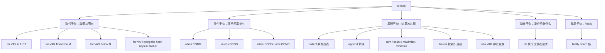
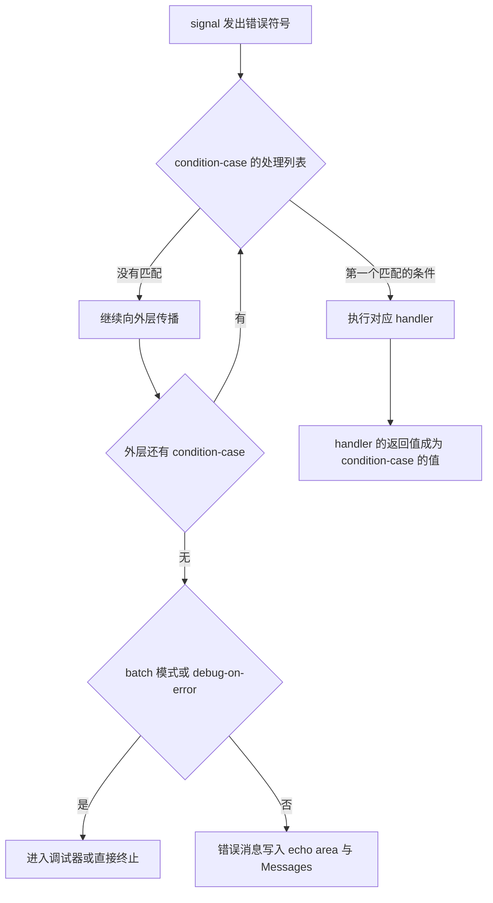
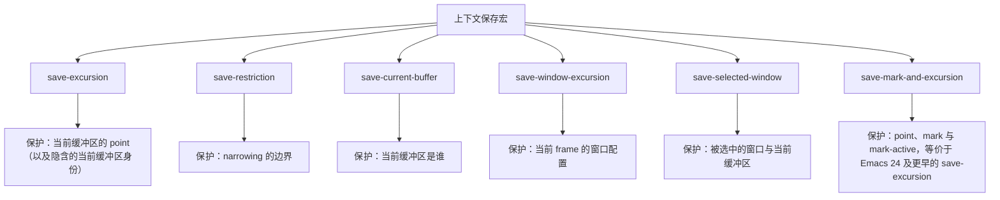

# 控制流、错误处理与迭代

> 本篇解决「写完语法之后，代码怎么真正跑起来」的问题：分支与循环怎么写才清晰，函数出错时如何优雅地失败，缓冲区状态被改乱之后如何恢复，以及为什么上下文保存宏用错会产生极难排查的 bug。

---

## 一、条件分支

### 1.1 if 的返回值语义

Elisp 的 `if` 是表达式而不是语句，它总是返回值：

```elisp
;; if 的形式是 (if COND THEN ELSE...)，ELSE 可以省略，省略时返回 nil
(if (> 3 2) 'yes 'no)          ; => yes
(if (> 2 3) 'yes)              ; => nil（没有 else 分支时返回 nil）

;; 条件只要求"非 nil"，任何非 nil 值都算真
(if 0 'true 'false)            ; => true（Elisp 中 0 是真！与 C 完全不同）
(if "" 'true 'false)           ; => true（空字符串也是真）
(if '() 'true 'false)          ; => false（空列表就是 nil）
(if [] 'true 'false)           ; => true（空向量不是 nil）
```

这一条是 C 程序员最容易踩的坑：**Elisp 里只有 `nil` 和 `()` 表示假**，`0`、`""`、`[]`、`"0"` 全部为真。如果你是从 C 过来的，写 `(if (string-match ...) ...)` 时要特别注意：`string-match` 在匹配到位置 0 时返回 `0`，而 `0` 为真，所以这个写法恰好是对的；但如果某个函数用「返回 0 表示失败」，那它在 Elisp 里就永远为真。

### 1.2 when 与 unless

`when` 和 `unless` 是单分支的语法糖，当分支体有多条语句时比 `if` 可读性好得多：

```elisp
;; 当条件为真时依次执行 BODY，返回最后一个表达式的值
(when (file-exists-p "/etc/hostname")
  (message "找到 hostname 文件")
  (insert-file-contents "/etc/hostname"))

;; 当条件为假时执行 BODY，等价于 (when (not COND) BODY)
(unless (boundp 'my-var)
  (defvar my-var nil)
  (message "已初始化 my-var"))

;; when 返回 nil 时说明条件不成立，可以据此判断
(when (> 1 2) 'never)          ; => nil
```

约定俗成：`if` 用于「二选一」，`when` / `unless` 用于「做或不做」。当 `if` 的 else 分支为空时，一律改用 `when`。

### 1.3 cond 多分支

`cond` 依次测试每个子句，返回第一个条件为真者对应的值。惯用法是用 `t` 作为兜底分支：

```elisp
(defun my-describe-size (bytes)
  "把字节数 BYTES 转成可读的大小描述。"
  (cond
   ((< bytes 1024) (format "%d B" bytes))
   ((< bytes (* 1024 1024)) (format "%.1f KB" (/ bytes 1024.0)))
   ((< bytes (* 1024 1024 1024)) (format "%.1f MB" (/ bytes 1048576.0)))
   (t (format "%.1f GB" (/ bytes 1073741824.0)))))

(my-describe-size 512)        ; => "512 B"
(my-describe-size 2048)       ; => "2.0 KB"
(my-describe-size 5000000)    ; => "4.8 MB"
```

如果用 `t` 兜底会掩盖错误，也可以省略兜底分支，让 `cond` 返回 `nil`。判断「这几种情况都不属于」时，显式写一个 `t` 分支并在其中 `error`，能避免静默失败：

```elisp
(defun my-mode-name (mode)
  "根据 MODE 符号返回中文说明。"
  (cond
   ((eq mode 'prog-mode) "编程模式")
   ((eq mode 'text-mode) "文本模式")
   (t (error "未知的模式: %S" mode))))   ; 不做静默兜底，出错就报错
```

### 1.4 pcase 模式匹配

`pcase` 比 `cond` 强的地方在于它同时做「判断」和「解构」。Emacs 里大量现代代码用它处理结构化数据。

```elisp
;; 基本形式：每个子句是 (PATTERN BODY...)
(pcase 5
  ((pred numberp) 'num)        ; pred 表示"用谓词测试当前值"
  (_ 'other))                  ; _ 是通配模式，永远匹配

;; 引用字面量：用 'symbol 或 "string" 直接匹配
(pcase 'b
  ((or 'a 'b) 'ab)             ; or 组合多个模式，任一匹配即可
  (_ 'no))                     ; => ab

;; and 同时做"匹配"和"绑定"：n 绑定到当前值
(pcase 7
  ((and (pred integerp) n) (* n 2)))   ; => 14

;; guard 在模式内部追加额外条件
(pcase "abc"
  ((and (pred stringp) s (guard (> (length s) 2)))
   (upcase s)))                ; => "ABC"

;; 反引号模式做解构：把 (1 2) 拆成 a 和 b
(pcase '(1 2)
  (`(,a ,b) (+ a b)))          ; => 3

;; _ 在解构里表示"这一位我不关心"
(pcase '(1 2 3)
  (`(1 ,_ ,c) c))              ; => 3

;; app 先对值调用函数，再拿结果去匹配
(pcase '(a 1)
  ((app car v) v))             ; => a

;; rx 模式：直接用 rx 语法匹配字符串，Emacs 27 起可用
(pcase "hello"
  ((rx bol "he") 'match)
  (_ 'no))                     ; => match
```

处理 plist 与 alist 时，`(map ...)` 模式非常省事（需要 `(require 'map)`）：

```elisp
(require 'map)

;; 关键字简写：:name 展开为「用键 :name 取值并绑定到 name」
(pcase (list :name "alice" :age 30)
  ((map :name) name)           ; => "alice"
  (_ 'no-name))

;; 显式形式是 (KEY PATTERN)，KEY 会被求值，所以符号键要写成 ('a v)
(pcase '((a . 1) (b . 2))
  ((map ('a v)) v)             ; => 1
  (_ 'no-a))

;; 多个键可以一起匹配
(pcase (list :x 5)
  ((map (:x n)) n)             ; => 5
  (_ 'no-x))
```

循环里也想用模式匹配时用 `pcase-dolist`：

```elisp
;; 直接解构 alist 的每一项，比 (dolist (cell alist)) 再 car/cdr 清爽
(let (result)
  (pcase-dolist (`(,k . ,v) '((a . 1) (b . 2)))
    (push (format "%s=%s" k v) result))
  (nreverse result))           ; => ("a=1" "b=2")
```

`pcase-let` 和 `pcase-let*` 用来做解构式绑定，后者允许后面的模式引用前面的绑定：

```elisp
(pcase-let ((`(,a . ,b) '(1 . 2)))
  (cons a b))                  ; => (1 . 2)

(pcase-let* ((`(,a ,b) '(1 2))
             ((pred numberp) b))   ; 断言 b 是数字，否则整个 pcase-let* 返回 nil
  (list a b))                  ; => (1 2)
```

`pcase` 的匹配是顺序的，第一个匹配成功的子句胜出，所以要把更具体的模式写在前面，`_` 这类通配模式永远写在最后。

### 1.5 and/or 的短路与返回值

`and` 与 `or` 不只是布尔运算符，它们返回的是**最后一个被求值的实参**，这一点在写配置代码时天天用到：

```elisp
(and 1 2 3)          ; => 3     返回最后一个真值
(and 1 nil 3)        ; => nil   遇到 nil 立即短路，后面的 3 不会被求值
(and)                ; => t     没有实参时为真
(or nil 2 3)         ; => 2     返回第一个真值，3 不会被求值
(or nil nil)         ; => nil
(or)                 ; => nil

;; 典型用法：取第一个存在的备选值
(or (getenv "EDITOR") (getenv "VISUAL") "emacs")

;; 典型用法：多个条件全部满足才继续
(and (file-exists-p "init.el")
     (file-readable-p "init.el")
     (with-temp-buffer
       (insert-file-contents "init.el")
       (buffer-string)))
```

**短路语义的一个实际后果**：`(and (boundp 'foo) foo)` 是安全的读取未绑定变量的惯用法，因为 `boundp` 为假时 `foo` 根本不会被求值。但要注意 `and` / `or` 只能用来保护「求值」，不能保护「编译期」的警告——字节编译器仍然会抱怨 `foo` 可能未绑定，此时应改用 `(bound-and-true-p foo)`。

### 1.6 not 与 null

`not` 与 `null` 在 Elisp 里是**完全相同的函数**，只是语义侧重不同：`null` 强调「这是个空列表」，`not` 强调「逻辑取反」。

```elisp
(not nil)     ; => t
(not 0)       ; => nil
(null '())    ; => t
(null nil)    ; => t

;; not 实际上是 null 的别名，两者共用同一份实现
(symbol-function 'not)                                ; => null
(eq (symbol-function 'not) 'null)                     ; => t
```

写判断「列表是否为空」时用 `null`，写「条件取反」时用 `not`，这是 Emacs 源码的通行风格。

---

## 二、循环

### 2.1 while：唯一真正的基础循环

Elisp 的内置循环只有 `while` 一个，其它循环宏最终都展开成它。

```elisp
;; 从 1 累加到 100
(let ((i 1) (sum 0))
  (while (<= i 100)
    (setq sum (+ sum i))
    (setq i (1+ i)))
  sum)                        ; => 5050
```

写 `while` 时最常见的两个错误：忘记推进循环变量（死循环）、用 `while` 遍历缓冲区时忘记 `goto-char` 回到起点导致一次都不执行（因为 point 已经在末尾）。

```elisp
;; 遍历缓冲区的正确骨架：先回到起点，再逐次前进
(with-temp-buffer
  (insert "one\ntwo\nthree\n")
  (goto-char (point-min))
  (let ((lines 0))
    (while (not (eobp))       ; 到达缓冲区末尾就停止
      (setq lines (1+ lines))
      (forward-line 1))       ; 每次至少前进一行，保证循环终止
    lines))                   ; => 3
```

### 2.2 dolist 与 dotimes

`dolist` 遍历列表，`dotimes` 计数循环。两者都支持返回值形式 `(dolist (VAR LIST RESULT) ...)`：

```elisp
;; dolist：收集所有偶数
(let (evens)
  (dolist (n '(1 2 3 4 5 6))
    (when (cl-evenp n)
      (push n evens)))
  (nreverse evens))           ; => (2 4 6)

;; dolist 的第三个参数是最终返回值
(dolist (n '(1 2 3) 'finished)
  (ignore n))                 ; => finished

;; dotimes：COUNT 是次数，VAR 从 0 数到 COUNT-1
(let (acc)
  (dotimes (i 5)
    (push (* i i) acc))
  (nreverse acc))             ; => (0 1 4 9 16)

;; dotimes 同样支持返回值
(dotimes (i 3 'done) (ignore i))   ; => done
```

`dolist` 和 `dotimes` 都是宏，内部用 `while` 实现，性能与手写 `while` 基本一致，可读性更好，应当优先使用。

### 2.3 cl-loop 的完整子句结构

`cl-loop`（`cl-lib` 提供）是 Elisp 里表达力最强的循环结构，源自 Common Lisp 的 `loop` 宏。它由「迭代子句」和「累积子句」两大类子句拼装而成。



各子句的语义与返回值如下表。**注意 `cl-loop` 默认返回 `nil`，唯一的例外是 `collect` / `append` / `sum` / `count` / `maximize` / `minimize` / `thereis` 这类累积子句会自动成为返回值。**

| 子句 | 作用 | 返回值 |
| --- | --- | --- |
| `for VAR in LIST` | 依次取列表元素 | 取决于累积子句 |
| `for VAR from N to M` | 数值区间，含两端 | 同上 |
| `for VAR from N below M` | 数值区间，不含 M | 同上 |
| `for VAR downfrom N to M` | 递减 | 同上 |
| `for VAR in LIST by FN` | 用 FN 取下一段 | 同上 |
| `for VAR on LIST` | 遍历尾列表（cdr 链） | 同上 |
| `for (K . V) in ALIST` | 解构点对 | 同上 |
| `for K being the hash-keys in H` | 遍历哈希表键 | 同上 |
| `repeat N` | 重复 N 次 | 同上 |
| `when COND` / `unless COND` | 过滤后续累积/动作 | 不改变返回值 |
| `while COND` / `until COND` | 提前结束循环 | 不改变返回值 |
| `collect EXPR` | 收集结果 | 结果列表 |
| `append EXPR` | 拼接列表 | 拼接后的列表 |
| `sum EXPR` | 求和 | 数值 |
| `count COND` | 计数 | 整数 |
| `maximize EXPR` / `minimize EXPR` | 求最大/最小值 | 数值 |
| `thereis EXPR` | 找到第一个非 nil 就返回 | 该值或 nil |
| `always EXPR` / `never EXPR` | 全称判断 | t 或 nil |
| `do EXPR` | 执行副作用 | 不直接贡献返回值 |
| `into VAR` | 把累积结果存进变量继续用 | 见 `finally return` |
| `finally return EXPR` | 显式指定返回值 | EXPR |

### 2.4 cl-loop 实例

第一个例子：遍历 alist 构造新表。这是配置代码里最常见的需求。

```elisp
(require 'cl-lib)

;; 把 (键 . 数值) 的 alist 转成 (键 . 数值*2) 的新 alist
(cl-loop for (k . v) in '((a . 1) (b . 2) (c . 3))
         collect (cons k (* v 2)))
;; => ((a . 2) (b . 4) (c . 6))

;; 只保留数值大于 1 的项，并用 append 摊平成 plist
(cl-loop for (k . v) in '((a . 1) (b . 2) (c . 3))
         when (> v 1)
         append (list k v))
;; => (b 2 c 3)
```

第二个例子：按条件收集文件名。这里演示 `when` 与 `collect` 的组合，以及 `for ... in` 与 `for ... on` 的区别。

```elisp
;; 收集你自己配置目录下所有 .el 文件，返回绝对路径
;; directory-files 的第二个参数为 t 时返回完整路径而非纯文件名
(cl-loop for f in (directory-files user-emacs-directory t "\\.el\\'")
         when (file-regular-p f)     ; 排除同名的子目录
         collect f)
;; 在本机上可能得到形如
;; => ("/home/you/.emacs.d/early-init.el" "/home/you/.emacs.d/init.el")
;; 具体内容取决于你的目录；目录不存在时 directory-files 会发 file-missing 错误

;; for ... on 遍历的是尾列表，可以同时看到"当前元素"和"剩余元素"
(cl-loop for tail on '(1 2 3)
         collect tail)
;; => ((1 2 3) (2 3) (3))
```

第三个例子：统计与求和。`count` 与 `sum` 是两回事，前者数「条件成立的次数」，后者把表达式求值后累加。

```elisp
;; 统计列表里偶数的个数
(cl-loop for n in '(1 2 3 4 5 6) count (cl-evenp n))    ; => 3

;; 求列表中所有正数的平方和
(cl-loop for n in '(-3 2 -1 4) when (> n 0) sum (* n n)) ; => 20

;; 求最大最小值（空列表时返回 nil，不会报错）
(cl-loop for n in '(3 1 4 1 5) maximize n)               ; => 5
(cl-loop for n in '(3 1 4 1 5) minimize n)               ; => 1
```

第四个例子：`thereis` 做「存在性检查并取出」。它一旦找到非 nil 结果就立即结束循环，等价于提前 `return`。

```elisp
;; 找第一个大于 2 的元素
(cl-loop for n in '(1 2 3 4 5) thereis (and (> n 2) n))  ; => 3

;; 没找到就返回 nil
(cl-loop for n in '(1 2) thereis (> n 10))               ; => nil

;; always 与 never 用来做全称/否定判断
(cl-loop for n in '(2 4 6) always (cl-evenp n))          ; => t
(cl-loop for n in '(1 2 3) never (cl-oddp n))            ; => nil
```

第五个例子：`into` 与 `finally return` 配合，先收集再统一处理。这在「先攒数据、最后统一输出」的场景里比提前定义 `let` 变量更清爽。

```elisp
;; 收集 1..5 的平方，最后按需返回
(cl-loop for i from 1 to 5
         collect (* i i) into squares
         finally return (format "共 %d 项，最大 %d"
                                (length squares)
                                (apply #'max squares)))
;; => "共 5 项，最大 25"

;; do 用来做副作用，返回 nil
(cl-loop for i below 3 do (message "第 %d 次" i))
;; 在 *Messages* 里输出三行，整个表达式返回 nil
```

数值迭代支持 `from`/`to`/`below`/`above`/`downfrom`/`by`，可以组合出很精确的区间：

```elisp
(cl-loop for i from 0 below 10 by 3 collect i)   ; => (0 3 6 9)
(cl-loop for i from 5 downto 1 collect i)        ; => (5 4 3 2 1)
(cl-loop for i downfrom 3 to 1 collect i)        ; => (3 2 1)
```

遍历哈希表用 `being the hash-keys` / `being the hash-values`，或者一次拿两者：

```elisp
(let ((h (make-hash-table)))
  (puthash 'a 1 h)
  (puthash 'b 2 h)
  (cl-loop for k being the hash-keys in h collect k))     ; => (a b)
```

`cl-loop` 还支持并行与嵌套的 `for`。两个 `for` 默认是**并行**推进的，用 `and` 连接才会变成串行：

```elisp
;; 并行：i 与 j 同时前进，循环次数取较短者
(cl-loop for i in '(1 2 3) for j in '(a b c) collect (cons i j))
;; => ((1 . a) (2 . b) (3 . c))

;; 串行：外层取一个 i，内层把 j 走完
(cl-loop for i in '(1 2) and j in '(a b) collect (list i j))
;; => ((1 a) (2 b))，注意这与上面结果一致是因为两个列表等长
```

### 2.5 迭代与异常的性能建议

- `dolist` / `dotimes` / `cl-loop` 都会被展开成朴素的 `while`，运行时开销几乎一致，选哪个只看可读性；不要在热路径上为了「性能」手写 `while`。
- 真正的性能差距来自**在循环体内反复调用会扫描整个缓冲区的函数**（如 `buffer-substring`、`line-number-at-pos`、`current-column`），而不是循环宏本身。
- 累积结果时用 `push` + `nreverse` 而不是 `(setq acc (append acc (list x)))`：后者是平方级复杂度。`cl-loop ... collect` 内部就是用 push 实现的，所以它同样高效。
- 删除列表元素用 `delete`（会修改原列表结构）还是 `remove`（返回新列表）要分清；在共享结构上误用 `delete` 是经典 bug。
- 循环体内如果可能 `throw` 或 `signal`，要保证资源已经清理，见第五节 `unwind-protect`。

---

## 三、非局部退出

### 3.1 catch 与 throw

`catch` / `throw` 是 Elisp 最底层的非局部跳转机制，`condition-case`、`cl-block`、`cl-return` 都建立在它之上。`throw` 的标签用 `eq` 比较，任何对象都可以做标签，惯例是用符号。

```elisp
;; 基本形式：throw 的第二个参数会成为 catch 的返回值
(catch 'done
  (message "开始")
  (throw 'done 42)
  (message "永远不会执行"))
;; => 42

;; 嵌套时内层 throw 会直接穿透到匹配的 catch
(catch 'outer
  (catch 'inner
    (throw 'outer 'jumped)))     ; 内层没有 outer 标签，直接跳到外层
;; => jumped

;; 用 catch 做"提前返回"的经典写法
(defun my-first-long-line (lines)
  "返回 LINES 中第一个长度超过 40 的字符串。"
  (catch 'found
    (dolist (l lines)
      (when (> (length l) 40)
        (throw 'found l)))
    nil))
```

`throw` 不能跨 `catch` 的标签类型误用：标签不匹配时会一直向上找，找不到就报 `no-catch` 错误并终止命令。**在有 `unwind-protect` 的位置，`throw` 会正常触发清理逻辑**，这一点和 `signal` 一样。

### 3.2 cl-block、cl-return-from 与 cl-return

`cl-block` 提供了带名字的返回点，比 `catch` 更适合「函数内多处提前返回」的写法：

```elisp
(require 'cl-lib)

;; cl-block 给一段代码命名，cl-return-from 从命名块返回
(cl-block my-block
  (when t
    (cl-return-from my-block 'early))
  'never)
;; => early

;; 等价于
(catch 'my-block
  (when t
    (throw 'my-block 'early))
  'never)
```

`cl-return` 是 `cl-return-from` 的简写，它返回**最近的** `cl-block` 或 `cl-loop`。也就是说，`cl-loop` 自己隐式建立了一个匿名块，所以循环里可以直接 `cl-return` 跳出：

```elisp
;; cl-return 从 cl-loop 跳出，值是 4
(cl-loop for i from 1 to 10
         do (when (> i 3) (cl-return i)))
;; => 4

;; 想从函数层级返回就用 cl-return-from，名字必须显式写出
(defun my-sum-until-negative (nums)
  "累加 NUMS 直到遇到负数为止。"
  (cl-block sum
    (let ((total 0))
      (dolist (n nums)
        (if (< n 0)
            (cl-return-from sum total)
          (setq total (+ total n))))
      total)))

(my-sum-until-negative '(1 2 3 -1 100))    ; => 6
```

`cl-return-from` 的名字不会被求值，是纯粹的标签；名字写错会在编译期给出警告，运行时则表现为找不到块而报错。

### 3.3 三种机制的取舍

| 机制 | 用途 | 典型场景 |
| --- | --- | --- |
| `catch` / `throw` | 最底层，标签动态作用域 | 库函数对外提供「跳出点」 |
| `cl-block` / `cl-return-from` | 具名块提前返回 | 函数体内多处出口 |
| `cl-return` | 从最近的块或循环返回 | 循环内提前拿到结果 |
| `condition-case` | 捕获错误信号 | 错误处理 |
| `unwind-protect` | 保证清理一定执行 | 资源释放 |

---

## 四、信号与条件系统

### 4.1 signal、error 与 user-error

Elisp 的异常叫「信号（signal）」。每个错误有一个符号作为类型，附带的参数是任意 Lisp 对象。

```elisp
;; 最底层的发信号函数：错误类型 + 数据列表
(signal 'error '("出错了"))
(signal 'my-error '("附加数据" 42))

;; error 是最常用的便捷函数，等价于 (signal 'error (list FORMAT-STRING ARGS...))
(error "文件 %s 不存在" "/tmp/x")     ; 数据部分是 ("文件 /tmp/x 不存在")

;; user-error 表示"用户操作有误"，而不是程序 bug
(user-error "这个命令不能在此模式下使用")

;; 两者的关键差异：user-error 不会进入调试器（即使 debug-on-error 为真），
;; 因为用户输入错误不需要用调试器刨根问底
```

由于 `user-error` 的错误条件是 `(user-error error)`，它是 `error` 的子类型，所以 `(condition-case ... (error ...))` 一样能捕获它。区别只在「是否触发调试器」和「消息的措辞」。

### 4.2 condition-case

`condition-case` 的形式是 `(condition-case VAR BODY HANDLERS...)`。`VAR` 绑定为一个 cons，`car` 是错误符号，`cdr` 是数据列表。

```elisp
;; VAR 收到 (error "出错了")
(condition-case err
    (error "出错了")
  (error (list 'caught (car err) (cdr err))))
;; => (caught error ("出错了"))

;; 只关心"有没有出错"，不关心细节时 VAR 可以写 nil
(condition-case nil
    (car 5)                       ; 对数字取 car 会报 wrong-type-argument
  (error nil))
;; => nil

;; 处理列表按顺序匹配，第一个匹配的条件决定走哪个分支
(condition-case err
    (signal 'file-error '("无法打开" "/tmp/nope"))
  (file-error (list 'file-problem (cadr err)))
  (error 'other))
;; => (file-problem "/tmp/nope")

;; quit 不属于 error 的子类型，必须单独列出才会被捕获
(condition-case nil
    (signal 'quit nil)
  (error 'caught-by-error))       ; 这里不会被捕获，quit 会继续向上传播
```

最后一条极其重要：**`(quit)` 必须显式列出**。`quit` 的错误条件是 `(quit)`，它和 `error` 之间没有父子关系。如果你的代码里有一个长循环，希望用户按 `C-g` 能中断它，就绝不能把 `C-g` 顺手用 `(error ...)` 吞掉——被吞掉的 `C-g` 会让 Emacs 看起来「卡死且无法中断」。

完整的条件层级如下：



每个错误符号都带一个 `error-conditions` 属性列出它的祖先链，可以用 `get` 查看：

```elisp
(get 'file-missing 'error-conditions)     ; => (file-missing file-error error)
(get 'void-variable 'error-conditions)    ; => (void-variable error)
(get 'quit 'error-conditions)             ; => (quit)
(get 'user-error 'error-conditions)       ; => (user-error error)
```

注意 `file-missing` 的链路是三层：写 `(file-missing ...)` 能精确捕获它，写 `(file-error ...)` 也能捕获，写 `(error ...)` 同样能捕获。**条件列表里写越具体的符号，捕获范围越小。**

### 4.3 define-error 自定义错误类型

`define-error` 定义一个全新的错误符号。它接收「符号、默认消息、父条件」三个参数：

```elisp
;; 第三个参数 'error 表示 my-config-error 是 error 的子类型
(define-error 'my-config-error "配置文件有误" 'error)

(get 'my-config-error 'error-conditions)   ; => (my-config-error error)
(get 'my-config-error 'error-message)      ; => "配置文件有误"

;; 抛出时附带的数据会替换掉默认消息
(condition-case err
    (signal 'my-config-error '("第 3 行缺少右括号"))
  (my-config-error (cadr err)))
;; => "第 3 行缺少右括号"

;; 默认消息在没有数据时生效
(condition-case err
    (signal 'my-config-error nil)
  (my-config-error (error-message-string err)))
;; => "配置文件有误"
```

完整的实战例子：定义一个带父类型的错误，并让上层既能精确捕获，也能用 `error` 兜底。

```elisp
(define-error 'my-parse-error "解析失败" 'error)
(define-error 'my-parse-eof "输入意外结束" 'my-parse-error)

(defun my-parse-int (str)
  "把 STR 解析为整数，失败时发出自定义错误。"
  (unless (string-match-p "\\`[0-9]+\\'" str)
    (signal 'my-parse-error (list (format "不是合法整数: %S" str))))
  (string-to-number str))

;; 精确捕获子类型
(condition-case err
    (signal 'my-parse-eof nil)
  (my-parse-eof 'eof)
  (my-parse-error 'parse))
;; => eof

;; 父类型捕获子类型
(condition-case err
    (signal 'my-parse-eof nil)
  (my-parse-error 'caught-as-parent))
;; => caught-as-parent

;; 用 error 兜底也能捕获
(condition-case err
    (my-parse-int "abc")
  (error (cadr err)))
;; => "不是合法整数: \"abc\""
```

**`define-error` 与 `signal` 的区别**：`signal` 只负责「发出」信号，如果符号没有被 `define-error` 定义过，`error-conditions` 就是 `(符号)` 本身，依然能工作，但不会有默认消息，也不会被 `(error ...)` 捕获。所以自定义错误类型一定要先 `define-error` 并挂到 `error` 下面。

### 4.4 常见错误类型速查表

| 错误符号 | 错误条件链 | 典型触发原因 | 排查方向 |
| --- | --- | --- | --- |
| `error` | `(error)` | 显式 `(error ...)` 调用 | 看错误消息里 `%s` 的位置 |
| `args-out-of-range` | `(args-out-of-range error)` | 索引越界，如 `(aref [1 2] 5)`、`(goto-char 99999)` | 打印参与运算的位置或索引 |
| `void-variable` | `(void-variable error)` | 变量未定义、`let` 拼写错误、忘了 `defvar` | 检查 `boundp`，注意全局与局部同名 |
| `void-function` | `(void-function error)` | 函数未定义、包未 `require`、函数名拼错 | `M-x describe-function`，检查 `require` |
| `wrong-type-argument` | `(wrong-type-argument error)` | 参数类型不对，如对数字取 `car` | 消息里会给出期望类型与实际值 |
| `wrong-number-of-arguments` | `(wrong-number-of-arguments error)` | 实参个数与形参不匹配 | 检查可选参数与 `&rest` |
| `file-missing` | `(file-missing file-error error)` | 文件不存在 | `file-exists-p` 先行检查 |
| `file-error` | `(file-error error)` | 文件系统操作失败（权限、目录等） | 看数据部分的操作描述 |
| `search-failed` | `(search-failed error)` | `search-forward` 等失败且未传 NOERROR | 循环里务必传第二个参数 `t` |
| `quit` | `(quit)` | 用户按 `C-g` | 不要被 `(error ...)` 掩盖 |
| `arith-error` | `(arith-error error)` | 除以零 | 检查除数 |
| `buffer-read-only` | `(buffer-read-only error)` | 在只读缓冲区里修改文本 | `inhibit-read-only` 或先 `toggle-read-only` |
| `end-of-buffer` | `(end-of-buffer error)` | 移动命令越界（交互式命令特有） | 用 `goto-char` 而非交互命令 |
| `user-error` | `(user-error error)` | 用户输入不合法 | 无需调试，直接看提示措辞 |

### 4.5 ignore-errors 与 condition-case 的取舍

`ignore-errors` 是 `(condition-case nil BODY (error nil))` 的宏，语义完全一致，只是写法更短：

```elisp
(ignore-errors (error "boom"))            ; => nil
(ignore-errors (+ 1 2))                   ; => 3
(condition-case nil (error "boom") (error nil))   ; => nil
```

选择原则：

- **只想知道「成没成」**：用 `ignore-errors`。例如尝试加载一个可选包 `(ignore-errors (require 'foo nil t))`。
- **需要拿到错误对象**：用 `condition-case` 并绑定变量，例如要记录日志或做降级处理。
- **需要区分错误类型**：必须用 `condition-case`，且把具体条件写在前面。
- **绝对不要用 `ignore-errors` 吞掉 `quit`**：`ignore-errors` 只捕获 `error`，`C-g` 会正常穿透，这一点是对的。
- **不要用 `ignore-errors` 掩盖逻辑错误**：它会连同「变量名拼错」这类 bug 一起吞掉，调试时表现为「函数静默返回 nil」。排查这类问题时把 `debug-on-error` 设为 `t`，或者临时用 `condition-case` 打印 `err`。

### 4.6 unwind-protect 与资源清理

`unwind-protect` 保证清理代码**无论正常返回、出错还是被 `throw` 跳出都会执行**：

```elisp
;; 基本形式：(unwind-protect BODY CLEANUP...)
(let (log)
  (unwind-protect
      (push 'body log)          ; 正常路径
    (push 'cleanup log))        ; 无论如何都执行
  (nreverse log))
;; => (body cleanup)

;; 即使中间出错，清理也会执行
(condition-case nil
    (unwind-protect
        (error "中途失败")
      (message "清理仍然执行了"))
  (error 'caught))
```

几个必须记住的细节：

- **`unwind-protect` 的返回值是 BODY 的值**，不是 cleanup 的值。上例中如果 BODY 报错，整个 `unwind-protect` 依然把错误继续抛出去，cleanup 的执行不影响错误传播。
- cleanup 中如果再次报错，新错误会取代原错误，原错误信息丢失。所以 cleanup 里要做的事情要么绝对安全，要么自己再包一层 `ignore-errors`。
- `unwind-protect` 不是错误处理器，它不「捕获」错误，只是插入清理钩子。

完整的资源清理实战：读取文件并处理内容，无论成功失败都恢复状态。这里同时演示了「临时缓冲区 + 临时文件 + 状态恢复」三个层次的清理。

```elisp
(defun my-process-file (file)
  "读取 FILE，把每行转成大写后返回字符串列表。
无论成功失败，都不会改变调用者的当前缓冲区与 point。"
  (let ((original-buffer (current-buffer))
        result)
    (unwind-protect
        (with-temp-buffer
          ;; with-temp-buffer 本身保证了临时缓冲区一定被销毁
          (insert-file-contents file)
          (goto-char (point-min))
          (let (lines)
            (while (not (eobp))
              (push (upcase (buffer-substring-no-properties
                             (line-beginning-position) (line-end-position)))
                    lines)
              (forward-line 1))
            (setq result (nreverse lines))))
      ;; 兜底：即使 BODY 抛错，也确保回到原来的缓冲区
      (unless (eq (current-buffer) original-buffer)
        (set-buffer original-buffer)))
    result))
```

写临时文件时，`unwind-protect` 用来确保删除：

```elisp
(defun my-with-temp-output (fn)
  "创建临时文件，调用 FN 写入内容，然后读取并删除该文件。"
  (let ((tmp (make-temp-file "my-output-")))
    (unwind-protect
        (progn
          (write-region "第一行\n第二行\n" nil tmp nil 'quiet)
          (funcall fn tmp))
      ;; 无论 FN 是否报错，临时文件都会被删除
      (when (file-exists-p tmp)
        (delete-file tmp)))))
```

`with-temp-file` 是「写临时缓冲区再一次性落盘」的高层封装，它不会替你删除文件，但会保证缓冲区被销毁：

```elisp
(with-temp-file "/tmp/my-demo.txt"
  (insert "由 with-temp-file 写入\n")
  (insert (format "生成时间: %s\n" (format-time-string "%F %T"))))
;; 返回值是最后一个 insert 的值，文件已经在磁盘上
```

---

## 五、上下文保存宏：最容易被低估的一组工具

这一节是全篇最重要的部分。上下文保存宏保护的是**隐式状态**：point 在哪、缓冲区收窄（narrowing）到哪、当前缓冲区是谁、窗口布局如何。这些状态不会出现在函数签名里，所以被破坏时极难定位——典型的症状是「调用某个命令后光标莫名跳到别处」「某个命令之后再也看不到文件开头」。



### 5.1 save-excursion

`save-excursion` 保存当前缓冲区的 point，执行 BODY，然后恢复。它在 `throw` 和报错时同样会恢复。

```elisp
(with-temp-buffer
  (insert "hello world")
  (goto-char 3)
  (save-excursion
    (goto-char (point-max))
    (insert "!"))
  (point))                     ; => 3，point 被恢复
```

三个必须知道的坑：

**坑一：`save-excursion` 不会恢复 mark。** 自 Emacs 25.1 起，`save-excursion` 只保存 point，不再保存 mark 和 `mark-active`。要连 mark 一起保护，用 `save-mark-and-excursion`。

**坑二：在 `save-excursion` 里调用 `set-buffer` 是错误的。** `save-excursion` 只保存「起始时那个缓冲区」的 point，你在 excursion 中间切到别的缓冲区并移动 point，那些改动不会被恢复。字节编译器会直接给出警告：

```text
Warning: Use ‘with-current-buffer’ rather than save-excursion+set-buffer
```

正确写法是把 `with-current-buffer` 放在外层：

```elisp
;; 错误写法：另一个缓冲区的 point 会被永久改变
(save-excursion
  (set-buffer (get-buffer-create "*log*"))
  (goto-char (point-max))
  (insert "一条日志\n"))

;; 正确写法
(with-current-buffer (get-buffer-create "*log*")
  (save-excursion
    (goto-char (point-max))
    (insert "一条日志\n")))
```

**坑三：恢复的是「marker」。** 保存的 point 值本质上是一个插入类型为 `nil` 的标记，所以在 BODY 中在 point 之前插入文本时，恢复后的位置会落在插入文本之前。多数情况下这正是你想要的，但写「在原位置插入并继续编辑」的逻辑时要意识到这一点。

### 5.2 save-restriction

`save-restriction` 保存并恢复 narrowing 边界。它**不恢复 point**，所以实践中几乎总是和 `save-excursion` 一起用。

```elisp
(with-temp-buffer
  (insert "AAA\nBBB\nCCC\n")
  ;; 单独收窄到 BBB 所在区域
  (save-restriction
    (narrow-to-region 5 8)
    (buffer-string))           ; => "BBB"
  ;; 离开 save-restriction 后自动恢复
  (point-min))                 ; => 1
```

`save-restriction` 的注意事项：

- 它不恢复 point，BODY 中如果 point 被移动，退出后 point 还在新位置。惯例写法是 `(save-restriction (widen) (save-excursion ...))`。
- 它不恢复当前缓冲区。在 BODY 中 `set-buffer` 之后，restriction 恢复的是「原本那个缓冲区」的，与当前缓冲区无关。
- `widen` 会取消收窄，`narrow-to-region` 建立收窄。判断是否处于收窄状态用 `(buffer-narrowed-p)`。

一个典型的实战价值：让某个命令只作用于当前函数体，而不影响用户当前的收窄状态。

```elisp
(defun my-uppercase-region (beg end)
  "把 BEG 与 END 之间的文本转成大写，不破坏用户的 narrowing 状态。"
  (interactive "r")               ; r 传入 point 与 mark，自动排好先后顺序
  (save-restriction
    (widen)                       ; 先放开收窄，保证 beg/end 处可写
    (save-excursion
      (goto-char beg)
      (while (< (point) end)
        (let ((c (char-after)))
          (when (and c (>= c ?a) (<= c ?z))
            (delete-char 1)
            (insert-char (- c 32) 1)))
        (forward-char 1)))))
```

### 5.3 save-current-buffer、with-current-buffer、with-temp-buffer

`save-current-buffer` 是特殊形式（不是宏），保存当前缓冲区身份，执行 BODY，最后恢复：

```elisp
;; save-current-buffer 不改变当前缓冲区，只保证"退出时还回来"
(save-current-buffer
  (set-buffer "*scratch*")
  (buffer-name))               ; => "*scratch*"
;; 退出后当前缓冲区恢复
```

`with-current-buffer` 是它的常用封装：先切到指定缓冲区，执行 BODY，再切回来。目标是「临时改别人」。

```elisp
;; 向 *Messages* 之外的日志缓冲区追加内容
(with-current-buffer (get-buffer-create "*my-log*")
  (goto-char (point-max))
  (insert (format-time-string "%F %T ") "事件发生\n"))
```

`with-temp-buffer` 创建一个临时缓冲区并把它设为当前缓冲区，退出时销毁。目标是「要一块空的文本工作区」。

```elisp
;; 计算一个字符串的行数，不污染任何真实缓冲区
(with-temp-buffer
  (insert "a\nb\nc\n")
  (count-lines (point-min) (point-max)))    ; => 3
```

三者的选择标准：

| 需求 | 用哪个 |
| --- | --- |
| 临时改变当前缓冲区并改内容 | `with-current-buffer` |
| 需要一块空白工作区，用完即弃 | `with-temp-buffer` |
| 需要写文件，内容先攒在缓冲区 | `with-temp-file` |
| 需要在多个缓冲区之间来回切 | `save-current-buffer` + `set-buffer` |
| 只是想恢复 point | `save-excursion` |

`with-temp-buffer` 的一个容易忽略的特性：它的临时缓冲区默认**不记录 undo 信息**，也不运行 `kill-buffer-hook`。所以不要指望在它里面用 `undo`，也不要把需要触发 `kill-buffer-hook` 的逻辑放进去。

### 5.4 with-temp-file 与 with-output-to-temp-buffer

`with-temp-file` 在临时缓冲区里执行 BODY，最后把缓冲区内容写入指定文件：

```elisp
(with-temp-file "~/.emacs.d/my-generated.el"
  (insert ";; 本文件由脚本生成，请勿手工编辑\n")
  (insert "(provide 'my-generated)\n"))
```

`with-output-to-temp-buffer` 把所有标准输出（`princ`、`print` 等）重定向到一个缓冲区并显示出来。它适合做「输出一份报告给用户看」的命令：

```elisp
(with-output-to-temp-buffer "*my-report*"
  (princ "系统报告\n")
  (princ (format "Emacs 版本: %s\n" emacs-version))
  (princ (format "当前缓冲区: %s\n" (buffer-name))))
;; 返回后 *my-report* 缓冲区里就是这三行文本
```

注意 `with-output-to-temp-buffer` 会弹出窗口，所以在非交互场景（如定时器回调）里使用要谨慎，建议改用 `with-temp-buffer` 加 `(display-buffer ...)`。

### 5.5 save-window-excursion 与 save-selected-window

这两个宏保护的是**窗口层**的状态，与文本层无关：

```elisp
;; save-selected-window 只恢复"哪个窗口被选中"，开销小，多数场景够用
(save-selected-window
  (select-window (get-buffer-window "*Messages*"))
  (goto-char (point-max)))

;; save-window-excursion 恢复整个窗口配置（分割方式也恢复），开销更大
(save-window-excursion
  (delete-other-windows)
  (split-window-right)
  (other-window 1))
```

官方手册明确建议：**大多数 Lisp 代码不应该用 `save-window-excursion`，`save-selected-window` 通常就够了**。原因是 `save-window-excursion` 只能恢复当前 frame 的窗口配置，BODY 中如果在别的 frame 上开了窗口，它管不了；而且完整恢复窗口配置会带来明显开销，用在定时器或高频钩子里会造成卡顿。

### 5.6 atomic-change-group 与 combine-after-change-calls

`atomic-change-group` 让一段修改要么全部生效，要么全部撤销。它内部用 `unwind-protect` 加 undo 边界实现：

```elisp
(with-temp-buffer
  (insert "abc")
  (condition-case nil
      (atomic-change-group
        (insert "X")             ; 这次插入会先发生
        (error "失败"))           ; 然后报错
    (error 'rolled-back))
  (buffer-string))
;; => "abc"，插入被撤销了

;; 正常退出时修改保留
(with-temp-buffer
  (insert "abc")
  (atomic-change-group (insert "X"))
  (buffer-string))               ; => "abcX"
```

它的适用场景是「多步编辑必须保持一致」：比如重命名一个符号，先删除旧文本再插入新文本，如果中途出错，缓冲区会停在一个半成品状态。用 `atomic-change-group` 包起来就能整体回滚。

需要注意：它依赖 undo 机制，在禁用了 undo 的缓冲区（包括 `with-temp-buffer` 的默认状态之外的某些场景）里行为会退化；它也不回滚 buffer 之外的状态（比如文件系统、overlay）。

`combine-after-change-calls` 用来合并多次修改触发的 change hook 调用，是性能优化工具：

```elisp
(with-temp-buffer
  (let ((calls 0))
    (add-hook 'after-change-functions
              (lambda (&rest _) (setq calls (1+ calls)))
              nil t)
    ;; 没有 combine 时每次 insert 都会触发一次钩子：5 次
    (dotimes (_ 5) (insert "x"))
    (setq calls 0)
    ;; 有 combine 时整段只触发一次：1 次
    (combine-after-change-calls
      (dotimes (_ 5) (insert "y")))
    calls))                       ; => 1
```

它只影响 `before-change-functions` 和 `after-change-functions` 的调用次数，不改变缓冲区内容。**只在明确知道钩子函数很重、且这段修改可以被视为一次整体变化时使用**；滥用会让依赖精确变更范围的钩子（如增量语法高亮）行为异常。

### 5.7 误用上下文保存宏会怎样

这类 bug 的特点是「症状与原因距离很远」：

- 在 `after-change-functions` 钩子里忘了 `save-excursion`，每敲一个字符 point 就跳一次，用户看到的是「打字时光标乱飞」。
- 在定时器里用 `with-current-buffer` 之外的 `set-buffer` 且没有恢复，定时器每隔几秒就把用户的当前缓冲区换成别的，表现为「莫名其妙跳到日志缓冲区」。
- 在命令里 `(widen)` 之后忘了 `save-restriction`，用户本来收窄到某个函数体，执行一次命令后整个文件都露出来了，而且 narrowing 再也回不去。
- 在 hook 里 `delete-other-windows` 而没有 `save-window-excursion`，用户精心摆好的窗口布局被摧毁。

排查这类问题的通用方法：把可疑函数包一层记录日志的包装器，打印进入和退出时的 `(current-buffer)`、`(point)`、`(point-min)`、`(point-max)`、`(selected-window)`，对比哪一项没有还原。

---

## 六、定时器与惰性执行

定时器（timer）让代码在「未来某个时刻」或「Emacs 空闲时」执行，是 Emacs 里少有的异步机制。

```elisp
;; 5 秒后执行一次，返回一个 timer 对象
(defvar my-once-timer
  (run-with-timer 5 nil
                  (lambda () (message "五秒到了"))))

;; 每 60 秒重复执行
(defvar my-repeat-timer
  (run-with-timer 60 60 #'my-refresh-something))

;; 空闲 1 秒后执行一次（idle 定时器：只有 Emacs 真正闲着才跑）
(defvar my-idle-timer
  (run-with-idle-timer 1 nil #'my-lazy-job))

;; 空闲 2 秒后重复执行
(defvar my-idle-repeat-timer
  (run-with-idle-timer 2 t #'my-background-job))
```

相关函数与判据：

```elisp
(timerp my-repeat-timer)         ; => t，判断对象是不是 timer
(cancel-timer my-repeat-timer)   ; 取消，取消后 timer 对象仍然存在但不再触发
;; 取消所有定时器只在测试或退出时做，不要在日常代码里无差别清理
```

`run-with-timer` 与 `run-with-idle-timer` 的参数完全一致：`(SECS REPEAT FUNCTION &rest ARGS)`。`REPEAT` 为 `nil` 表示只跑一次，为数字表示每次间隔；给 `t` 表示「上一次执行结束后再等 SECS」。

**idle 定时器的卡顿陷阱**：idle 定时器在 Emacs 空闲时触发，但它的回调是**在主线程同步执行**的。如果回调耗时长（例如扫描整个项目目录），用户会明显感觉到「停顿一下」。经验法则：

- idle 定时器回调尽量控制在几十毫秒内，超出的工作拆成多批，每次只做一小块。
- 不要在 idle 定时器里做需要用户输入的操作（`read-string`、`y-or-n-p`），会打断用户。
- 不要在 idle 定时器里做会改变窗口布局的操作，会导致「布局自己变了」的诡异体验。
- 用 `(cancel-timer ...)` 在合适的时机停掉不再需要的定时器；重复定时器如果忘记取消，会在整个 Emacs 生命周期内持续运行。
- 频繁的短间隔重复定时器（例如 0.1 秒）本身就值得警惕：即使每次只做很少的事，积累起来的开销也会体现在 `M-x profiler-start` 的报告中。

定时器回调里也要遵守上下文保存规则，因为它可能在任意时刻被触发，此时「当前缓冲区」是谁完全不确定：

```elisp
(defvar my-log-buffer-name "*my-timer-log*")

(defun my-timer-log (msg)
  "把 MSG 追加到日志缓冲区，不改变用户当前的缓冲区与 point。"
  (with-current-buffer (get-buffer-create my-log-buffer-name)
    (save-excursion
      (goto-char (point-max))
      (insert (format-time-string "[%F %T] ") msg "\n"))))

(defvar my-log-timer
  (run-with-timer 10 10 #'my-timer-log "心跳"))
```

---

## 七、断言与调试辅助

`cl-assert` 用来表达「这里必须成立」的假设。它比 `when` + `error` 更清晰地表达意图，并且可以被统一关闭。

```elisp
(require 'cl-lib)

;; 断言成立时返回 nil
(cl-assert (= 2 2))              ; => nil

;; 断言失败时发出 cl-assertion-failed 错误
(condition-case err
    (cl-assert (> 1 2))
  (error (car err)))             ; => cl-assertion-failed

;; 第二个参数为 nil 表示"不要用默认的 FORM 文本作为消息"
;; 后面可以跟自定义消息的格式串与实参
(condition-case err
    (cl-assert (> 1 2) nil "上限校验失败: %s" 'my-func)
  (error (cadr err)))            ; => "上限校验失败: my-func"
```

注意 `cl-assert` 的错误类型是 `cl-assertion-failed`，它的错误条件链包含 `error`，所以 `(error ...)` 能捕获。它的第二个参数如果是非 nil，就会被求值并用于构造消息（这是历史遗留的、容易误用的设计），日常使用请固定写成 `nil` 并紧跟格式串。

使用断言的三条实践建议：

- **用于内部不变式**，不用于用户输入校验。用户输入错误应该用 `user-error` 给出友好提示。
- **不要用断言做参数类型检查**，参数应该是「用户数据」而不是「内部状态」，用 `(unless (stringp s) (error ...))` 更合适。
- **在钩子和定时器里不要放昂贵断言**，因为它们的调用频率远高于普通函数。

调试相关的最小工具箱：

```elisp
;; 打开调试器，出错时进入 *Backtrace* 而不是只在 echo area 显示一行
(setq debug-on-error t)

;; 只对特定错误进入调试器，避免被无关错误打断
(setq debug-on-error nil)
(setq debug-on-signal t)         ; 配合下面的方式精确过滤

;; 从 Elisp 里主动进入调试器
(debug)

;; 打印调用栈（不中断执行）
(backtrace)

;; 性能测量：执行 10 次并统计耗时
(benchmark-run 10 (my-expensive-function))
;; 返回（总秒数 垃圾回收次数 垃圾回收总秒数）

;; 查看某个函数的调用次数与耗时
(profiler-start 'cpu)
;; ... 使用一段时间 ...
(profiler-report)
(profiler-stop)
```

完整的可运行例子：给一个可能出错的函数加上「断言 + 结构化错误 + 清理」三层防护。

```elisp
(require 'cl-lib)

(define-error 'my-pipeline-error "流水线执行失败" 'error)

(defun my-pipeline-step (input)
  "对 INPUT 做一步处理。INPUT 必须是字符串。"
  (cl-assert (stringp input) nil "输入必须是字符串，实际是 %S" input)
  (if (string-empty-p (string-trim input))
      (signal 'my-pipeline-error '("输入为空"))
    (upcase input)))

(defun my-run-pipeline (inputs)
  "依次处理 INPUTS，返回 (成功结果 . 失败信息) 的列表。"
  (let (results)
    (dolist (in inputs)
      (push (condition-case err
                (cons 'ok (my-pipeline-step in))
              (my-pipeline-error (cons 'bad (cadr err)))
              (error (cons 'bad (error-message-string err))))
            results))
    (nreverse results)))

(my-run-pipeline '("hello" "" "world"))
;; => ((ok . "HELLO") (bad . "输入为空") (ok . "WORLD"))
```

这个例子里 `condition-case` 同时挂了自定义错误和 `error` 兜底，且自定义错误放在前面——顺序很重要，如果 `(error ...)` 写在前面，自定义错误就永远匹配不到自己的分支。

---

## 小结

- Elisp 里只有 `nil` 表示假，`0` 和 `""` 都是真；`and` / `or` 返回的是操作数而不是布尔值。
- 循环优先用 `dolist`、`dotimes`、`cl-loop`，只有需要细粒度控制时才手写 `while`；遍历缓冲区时 `search-forward` 一定要传 NOERROR 参数。
- 错误处理用 `condition-case`，`(quit)` 必须单独列出；自定义错误先用 `define-error` 挂到 `error` 下面，`unwind-protect` 负责清理而不是捕获。
- 上下文保存宏保护的是隐式状态：改 point 用 `save-excursion`，改 narrowing 用 `save-restriction`，换缓冲区用 `with-current-buffer`，动窗口用 `save-selected-window`。漏掉它们的 bug 症状与原因距离极远，务必成对书写。

---

## 相关章节

- [[emacs教程/2Elisp语言/04_列表序列与哈希表|列表、序列与哈希表]]
- [[emacs教程/2Elisp语言/06_缓冲区文本与点|缓冲区、文本与点]]
- [[emacs教程/2Elisp语言/09_Mode与Hook机制|Mode 与 Hook 机制]]
- [[emacs教程/2Elisp语言/11_调试与性能剖析|调试与性能剖析]]
- [[emacs教程/7进阶/04_常见故障排查|常见故障排查]]
