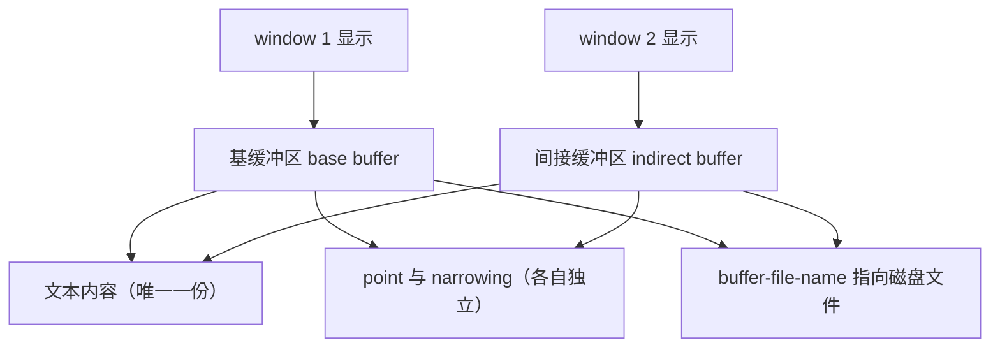
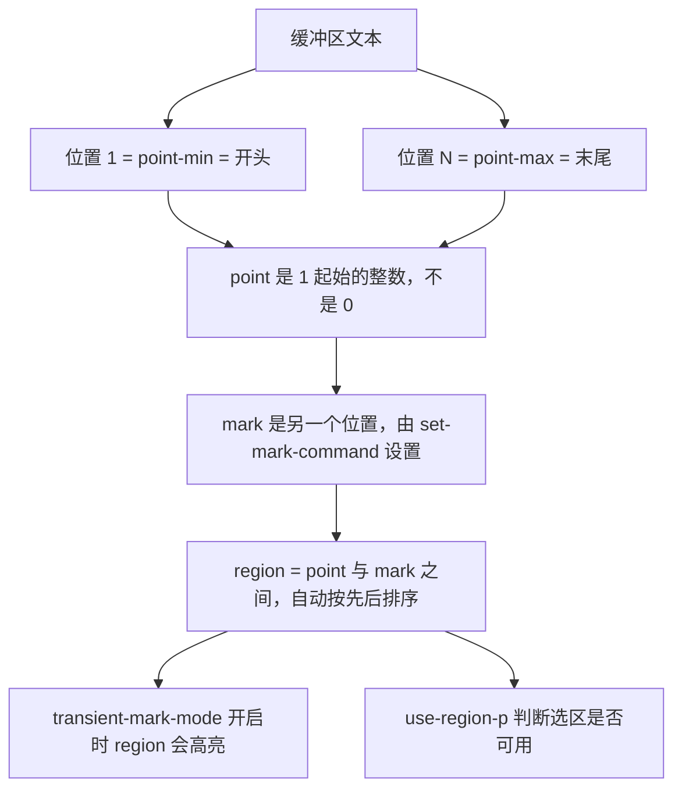
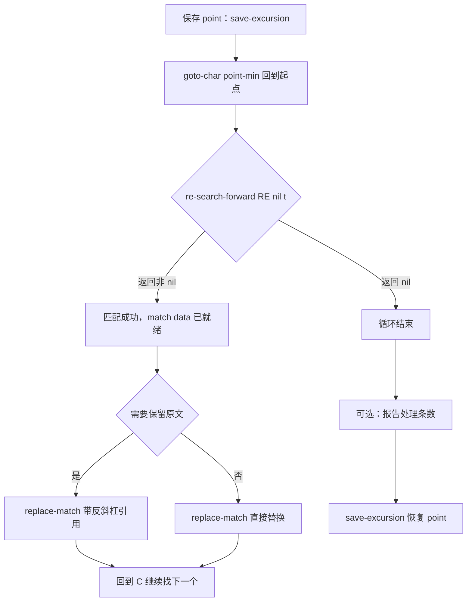

# 缓冲区、文本与点

> 本篇讲 Elisp 里最日常也最容易出错的一层：缓冲区（buffer）是什么、point 与 mark 在哪里、怎么读写文本、Emacs 正则与 PCRE 到底差在哪，以及文件与路径操作的完整工具集。

---

## 一、重新认识缓冲区

### 1.1 缓冲区不是文件

缓冲区（buffer）是 Emacs 里承载文本的对象：它可以关联一个文件，也可以只是一个临时工作区（如 `*scratch*`、`*Messages*`）。一个文件最多被一个缓冲区访问，但一个缓冲区不一定有文件。获取当前缓冲区用 `(current-buffer)`，判断「这个缓冲区是否在访问某个文件」用 `buffer-file-name`：

```elisp
;; 在 *scratch* 里执行，返回的是 *scratch* 缓冲区对象
(current-buffer)                  ; => #<buffer *scratch*>
(buffer-name)                     ; => "*scratch*"
(buffer-file-name)                ; => nil（*scratch* 没有关联文件）

;; 在访问某个文件的缓冲区里
(buffer-name)                     ; => "init.el"
(buffer-file-name)                ; => "/home/you/.emacs.d/init.el"
```

注意这是 Emacs 术语的第一个坑：**buffer 是文本容器，window 是显示区域，frame 是操作系统窗口**。一个 buffer 可以显示在多个 window 里，一个 frame 可以含多个 window。本文只讨论 buffer 层。

### 1.2 缓冲区名、文件名与 base buffer

```elisp
;; 名字与文件名的关系
(with-temp-buffer
  (princ (format "%S %S %S\n"
                 (buffer-name)          ; => " *temp*"（临时缓冲区名以空格开头）
                 (buffer-file-name)     ; => nil
                 (buffer-base-buffer))))  ; => nil，不是间接缓冲区
```

以空格开头的缓冲区名是 Emacs 的约定：这类缓冲区不会出现在 `C-x C-b` 的常规列表中（它们被 `list-buffers` 默认隐藏）。`with-temp-buffer` 创建的正是这种缓冲区。

`buffer-base-buffer` 用来判断一个缓冲区是否为**间接缓冲区（indirect buffer）**，这点在下一小节展开。

### 1.3 间接缓冲区

间接缓冲区与它的基缓冲区（base buffer）共享同一份文本，但拥有各自独立的 point、narrowing、文本属性视图和模式。它最常见的用途是「同一个文件用两种模式看」，例如一个窗口里用 `org-mode` 看内容，另一个窗口里用 `org-src` 之类的方式看源码。

```elisp
;; 创建一个基缓冲区
(let ((base (get-buffer-create "*my-base*")))
  (with-current-buffer base (insert "base content"))
  (let ((ind (make-indirect-buffer base "*my-ind*")))
    (prog1 (list (buffer-name ind)                     ; => "*my-ind*"
                 (buffer-name (buffer-base-buffer ind)) ; => "*my-base*"
                 (buffer-base-buffer ind))              ; => #<buffer *my-base*>
      (kill-buffer ind)))
  (kill-buffer base))
```

间接缓冲区的关键性质：

- 文本共享：间接缓冲区**总是**与基缓冲区共享同一份文本，在任一边修改文本，另一边立刻可见。`make-indirect-buffer` 的第三个参数 `CLONE` 控制的不是「是否共享文本」，而是「是否继承基缓冲区的 major mode 与 minor mode」：`CLONE` 为 `nil` 时新缓冲区的模式状态被重置为默认值，非 `nil` 时保留基缓冲区的模式状态。
- 状态独立：point、mark、narrowing、以及模式行显示各自独立。
- 销毁要成对：`kill-buffer` 掉基缓冲区时，间接缓冲区会一起失效；反过来删掉间接缓冲区不影响基缓冲区。

实际使用中很少手工创建间接缓冲区，但理解它能解释一个常见困惑：**为什么两个窗口看同一个文件，光标位置可以不同**——那通常是因为其中一个窗口在看间接缓冲区，或者窗口本身有独立的 point 记录。



### 1.4 point、mark 与 region 的位置关系

point 是「光标所在位置」，它是一个 1 起始的整数；mark 是另一个位置标记，region 是 point 与 mark 之间的区间。



三条必须记住的规则：

- **位置从 1 开始**，不是 0。`(point-min)` 对未收窄的缓冲区永远是 1。
- **`(point-max)` 是「最后一个字符之后」的位置**，所以它等于字符数加一。空缓冲区的 `point-min` 与 `point-max` 都是 1。
- point 可以等于 `point-max`（在末尾），但不能再往后；`goto-char` 会把它夹在合法范围内而不是报错，`forward-char` 则会报 `end-of-buffer`。

```elisp
(with-temp-buffer
  (insert "abc")               ; 三个字符
  (list (point-min)            ; => 1
        (point-max)            ; => 4
        (buffer-size)))        ; => 3

;; goto-char 越界会夹住，不报错
(with-temp-buffer
  (insert "abc")
  (goto-char 9999)
  (point))                     ; => 4

;; forward-char 越界会报错
(with-temp-buffer
  (insert "abc")
  (goto-char (point-max))
  (condition-case e (forward-char 1) (error (car e))))   ; => end-of-buffer
```

---

## 二、创建、获取与销毁缓冲区

```elisp
;; get-buffer：只查找，不创建；不存在返回 nil
(get-buffer "*scratch*")           ; => #<buffer *scratch*>
(get-buffer "*不存在的缓冲区*")     ; => nil

;; get-buffer-create：查找，不存在就创建
(get-buffer-create "*my-work*")    ; => #<buffer *my-work*>

;; generate-new-buffer：总是创建新缓冲区，名字冲突时自动加 <2> <3> 后缀
(generate-new-buffer "my-tmp")     ; => #<buffer my-tmp>
(generate-new-buffer "my-tmp")     ; => #<buffer my-tmp<2>>

;; buffer-live-p：判断缓冲区对象是否还有效（被 kill 之后就不是 live 了）
(buffer-live-p (get-buffer "*scratch*"))   ; => t

;; kill-buffer：销毁缓冲区，返回 nil；对已经不存在的缓冲区调用是安全的
(kill-buffer "*my-work*")
(get-buffer "*my-work*")           ; => nil
(buffer-live-p (get-buffer "*my-work*"))   ; => nil
```

`buffer-live-p` 与「缓冲区对象是否为 nil」是两件事：已经 `kill-buffer` 的缓冲区对象仍然存在于变量里，但它不再是 live 的。**保存缓冲区对象到变量里长期使用，一定要用 `buffer-live-p` 检查**，否则会在一个已死的缓冲区上操作，得到各种难以理解的 nil。

四者的选择标准：

| 需求 | 用哪个 |
| --- | --- |
| 只要一个一定存在的缓冲区，已有就复用 | `get-buffer-create` |
| 需要一块绝对干净的临时空间，用完就丢 | `with-temp-buffer` |
| 需要一块干净的缓冲区，但要在 BODY 之外继续持有它 | `generate-new-buffer` |
| 只是查找，不存在就当失败 | `get-buffer` |

`with-temp-buffer` 是最常用的一个，它的语义值得精确记住：

- 它**保存当前缓冲区身份**，创建临时缓冲区并设为当前，执行 BODY，然后恢复原缓冲区并销毁临时缓冲区。
- 临时缓冲区的名字以空格开头，默认**不记录 undo 信息**。
- 它**不运行** `kill-buffer-hook`、`kill-buffer-query-functions`、`buffer-list-update-hook`，所以不要把依赖这些钩子的逻辑放进去。
- BODY 报错或 `throw` 时同样会恢复并销毁。

```elisp
;; 返回值是 BODY 最后一个表达式的值
(with-temp-buffer
  (insert "one\ntwo\n")
  (buffer-string))                 ; => "one\ntwo\n"

;; BODY 里报错也不会污染调用者的当前缓冲区
(condition-case nil
    (with-temp-buffer
      (insert "临时内容")
      (error "中途出错"))
  (error nil))
(current-buffer)                   ; 仍然是调用之前的那个缓冲区
```

---

## 三、point 与 mark 的移动和查询

### 3.1 移动 point

```elisp
(goto-char 10)              ; 直接跳到位置 10，返回 10；越界时夹到边界
(forward-char 5)            ; 相对前进 5 个字符，负数表示后退
(backward-char 3)           ; 等价于 (forward-char -3)
(beginning-of-line)         ; 移到行首
(end-of-line)               ; 移到行尾
(forward-line 2)            ; 下移 2 行，见第五节
(goto-char (point-min))     ; 回到缓冲区开头（最常用的一个）
(goto-char (point-max))     ; 到缓冲区末尾
```

`goto-char` 与 `forward-char` 在越界时的行为不同：前者夹住，后者报错。**在需要「保证不报错」的地方优先用 `goto-char` 加 `max`/`min` 的组合**：

```elisp
;; 安全地停在不超过 POS 的位置
(goto-char (min pos (point-max)))
```

### 3.2 查询位置

```elisp
(point)                     ; 当前 point，1 起始整数
(point-min)                 ; 可访问区域起点（收窄时不是 1）
(point-max)                 ; 可访问区域终点
(bolp)                      ; point 是否在行首
(eolp)                      ; point 是否在行尾
(bobp)                      ; point 是否在缓冲区开头
(eobp)                      ; point 是否在缓冲区末尾
(current-column)            ; point 的列号，从 0 开始
(line-beginning-position)   ; 当前行的行首位置（比 beginning-of-line 好用：它是函数不是命令）
(line-end-position)         ; 当前行的行尾位置
```

`bolp` / `eolp` 只判断「point 是否**已经**在行首或行尾」，它们**不移动 point**。这是与 `beginning-of-line` / `end-of-line` 的本质区别。

`current-column` 返回的是**显示列**，制表符会按 `tab-width` 展开计算，所以它与「从行首到 point 的字符数」不一定相等：

```elisp
(with-temp-buffer
  (insert "\tab")               ; 先插入一个制表符再插入两个字符
  (goto-char 4)                 ; point 在第 4 个位置，即 ab 之后
  (list (current-column)        ; => 10（制表符按 tab-width 展开占了 8 列，再加 a、b）
        (- (point) (line-beginning-position))))  ; => 3（实际字符数是 3）
```

### 3.3 thing-at-point：按语法单位取文本

`thing-at-point` 按「thing」这个抽象概念取 point 附近的文本，返回字符串（不在任何 thing 上时返回 nil）：

```elisp
(with-temp-buffer
  (insert "alpha beta\ngamma")
  ;; 把 point 放在 beta 中间（位置 8）
  (goto-char 8)
  (list (thing-at-point 'word)          ; => "beta"
        (thing-at-point 'symbol)        ; => "beta"
        (thing-at-point 'line)          ; => "alpha beta\n"
        (thing-at-point 'line t)))      ; => 带 t 时去掉文本属性
```

`thing-at-point` 支持的 thing 类型（部分）：

| thing | 含义 | 说明 |
| --- | --- | --- |
| `word` | 单词 | 受语法表影响 |
| `symbol` | 符号 | Lisp 代码里常用 |
| `line` | 整行 | **包含行尾的换行符** |
| `sentence` | 句子 | 按句末标点切分 |
| `sexp` | 平衡表达式 | 取一个完整括号对 |
| `list` | 列表 | 与 `sexp` 接近 |
| `defun` | 函数定义 | 依赖 major mode 的设置 |
| `url` | URL | 依赖 mode 提供 provider |
| `filename` | 文件名 | 只是匹配文本，不检查存在性 |
| `existing-filename` | 存在的文件名 | 会调用 `file-exists-p` |
| `whitespace` | 空白 | 不在空白上时返回 nil |

`sentence` 与 `line` 这类 thing 依赖 major mode 通过 `thing-at-point-provider-alist` 注册的 provider，所以在 `prog-mode` 里取 `defun` 比在 `text-mode` 里更可靠。

`bounds-of-thing-at-point` 返回位置对而不是字符串，适合「先定位再操作」：

```elisp
(with-temp-buffer
  (insert "alpha beta")
  (goto-char 3)
  (bounds-of-thing-at-point 'word))      ; => (1 . 6)
```

有了位置对就能把 thing 传给 `buffer-substring` 或直接建 overlay。

---

## 四、文本的读写

### 4.1 插入

```elisp
(insert "hello")              ; 在 point 处插入，point 移到插入内容之后
(insert "a" "b" "c")          ; 多个参数按顺序插入
(insert-char ?X 3)            ; 插入 3 个 X，返回 nil
(insert-buffer-substring other-buffer 1 10)   ; 从别的缓冲区复制一段文本过来
```

`insert` 会**移动 point 到插入内容之后**，这是很多「插入后 point 跑到别处」问题的根源。不修改 point 时用 `save-excursion` 包起来。

`insert-buffer-substring` 的签名是 `(insert-buffer-substring BUFFER &optional START END)`，省略 START/END 时复制整个缓冲区：

```elisp
(with-temp-buffer
  (insert "SOURCE")
  (let ((src (current-buffer)))
    (with-temp-buffer
      (insert "TARGET:")
      (insert-buffer-substring src)
      (buffer-string))))              ; => "TARGET:SOURCE"
```

### 4.2 删除与提取

```elisp
(delete-region 1 5)                    ; 删除 [1,5) 区间的文本，返回 nil
(delete-and-extract-region 1 5)        ; 删除并返回被删除的文本，返回字符串
(erase-buffer)                         ; 清空整个缓冲区（受 narrowing 影响）
```

`delete-and-extract-region` 是「剪切」语义，做「移动文本」时最顺手：

```elisp
(with-temp-buffer
  (insert "hello world")
  (let ((first (delete-and-extract-region 1 6)))   ; 取出 "hello "
    (goto-char (point-max))
    (insert first)
    (buffer-string)))                              ; => "worldhello "
```

`erase-buffer` 只清除**可访问区域**，在收窄状态下不会清掉收窄范围之外的文本。要清空整个缓冲区先 `(widen)`。

### 4.3 读取

```elisp
(buffer-string)                        ; 整个可访问区域的内容
(buffer-substring 1 6)                 ; [1,6) 的文本，保留文本属性
(buffer-substring-no-properties 1 6)   ; 同上，但去掉文本属性
```

三点必须分清：

- `buffer-string` 返回的是**可访问区域**，被 narrowing 时会短于整个缓冲区。要拿到全部内容先 `(save-restriction (widen) (buffer-string))`。
- `buffer-substring` **保留文本属性**，返回的可能是 `#("text" 0 4 (face bold))` 这样的带属性字符串。做纯文本处理时应该用 `buffer-substring-no-properties`，否则从别处 `insert` 进来会把字体颜色一起带过来。
- 两个函数都**不复制 overlay**。overlay 属于缓冲区而不属于文本，复制文本时不会带上。

```elisp
(with-temp-buffer
  (insert "0123456789")
  (list (buffer-substring 1 4)                  ; => "012"
        (buffer-substring-no-properties 1 4)    ; => "012"
        (buffer-substring 1 4)))                ; 结果同上，但可能带属性
```

`buffer-substring` 的 START 大于 END 时也能工作（会自动交换），但这属于偶发现象，写代码时不要把顺序搞反当作特性来依赖。

---

## 五、行的遍历

### 5.1 forward-line 的返回值

`forward-line` 的返回值是**「请求移动的行数」减去「实际移动的行数」**：

```elisp
(with-temp-buffer
  (insert "l1\nl2\nl3\n")
  ;; 从开头下移 1 行：成功，返回 0
  (goto-char (point-min))
  (forward-line 1)              ; => 0

  ;; 已经在末尾再下移：移动不了，返回 1
  (goto-char (point-max))
  (forward-line 1)              ; => 1

  ;; 从开头往上移：返回 -1
  (goto-char (point-min))
  (forward-line -1))            ; => -1
```

所以判断「是否到达末尾」可以写 `(/= 0 (forward-line 1))`，但更清晰的做法是直接用 `(eobp)`。注意 `forward-line` **不报错**，它只是把 point 停在能到的位置。

`forward-line` 的另一个性质是它把 point 移到**行首**（除非已经在行首且 COUNT 为 0）。所以「逐行处理」的标准骨架是：

```elisp
(with-temp-buffer
  (insert "l1\nl2\nl3\n")
  (goto-char (point-min))
  (let (lines)
    (while (not (eobp))
      (push (buffer-substring-no-properties (line-beginning-position)
                                            (line-end-position))
            lines)
      (forward-line 1))
    (nreverse lines)))          ; => ("l1" "l2" "l3")
```

### 5.2 line-number-at-pos 与 count-lines

```elisp
(with-temp-buffer
  (insert "l1\nl2\nl3")
  (list (line-number-at-pos (point-min))        ; => 1
        (line-number-at-pos (point-max))        ; => 3
        (count-lines (point-min) (point-max)))) ; => 3
```

两者的区别与陷阱：

- `line-number-at-pos` 返回**行号**，第三个参数（第二个可选参数是 pos，第三个才是 absolute）为真时忽略 narrowing 返回绝对行号。
- `count-lines` 返回**区间内的行数**，START 与 END 相等时返回 0；否则至少返回 1，即使两点在同一行上。
- 在收窄状态下两者默认都按「可访问区域」计算。要拿到真实行号，用 `(line-number-at-pos pos t)`。

```elisp
(with-temp-buffer
  (insert "l1\nl2\nl3\n")
  (save-restriction
    (narrow-to-region 4 10)
    ;; 收窄后 point-min 对应的行在可访问区域内是第 1 行，在整个缓冲区里是第 2 行
    (list (line-number-at-pos (point-min))      ; => 1
          (line-number-at-pos (point-min) t)))) ; => 2
```

**性能提醒**：`line-number-at-pos` 需要从缓冲区开头数到目标位置，在大文件里逐行调用它是典型的平方级开销。要在循环里用行号，应当用一个计数器自己维护，而不是每次调用它。

---

## 六、正则表达式

### 6.1 Emacs 正则与 PCRE 的对照表

这是从其它语言转过来的人踩坑最多的地方。Emacs 正则不是 PCRE，也不是 POSIX ERE，**分组和交替都必须用双反斜杠转义**。

| 功能 | PCRE / Perl / Python 写法 | Emacs 写法 | 说明 |
| --- | --- | --- | --- |
| 捕获分组 | `(abc)` | `\\(abc\\)` | Emacs 里裸括号是普通字符 |
| 非捕获分组 | `(?:abc)` | `\\(?:abc\\)` | 别名 shy group |
| 反向引用 | `\1` | `\\1` | 在替换串里同样写 `\\1` |
| 交替 | `cat\|dog` | `cat\\\|dog` | 单竖线在 Emacs 里是普通字符 |
| 重复次数区间 | `a{2,4}` | `a\\{2,4\\}` | 花括号也必须转义 |
| 词边界 | `\b` | `\\b` 或 `\\<` `\\>` | `\\<` 与 `\\>` 分别是词首词尾 |
| 符号边界 | 无直接等价 | `\\_<` `\\_>` | 对 Lisp 符号特别有用 |
| 缓冲区/字符串开头 | `\A` 或 `^` | `\\\`` | 反引号前面两个反斜杠 |
| 缓冲区/字符串结尾 | `\z` 或 `$` | `\\'` | 与 `$` 的区别见下 |
| 数字 | `\d` | `[[:digit:]]` 或 `\\w` | Emacs 没有 `\d` 简写 |
| 空白 | `\s` 或 `\s+` | `[[:space:]]` 或 `\\s-` | `\\s-` 是「语法类为空白」 |
| 词字符 | `\w` | `[[:word:]]` 或 `\\w` | `\\w` 在 Emacs 里可用 |
| 非贪婪 | `*?` `+?` | `*?` `+?` | Emacs 同样支持 |
| POSIX 字符类 | `[[:alpha:]]` | `[[:alpha:]]` | 完全一致 |
| 点号 | `.` | `.` | 两者默认都不匹配换行 |
| 取反字符类 | `[^x]` | `[^x]` | 两者都会匹配换行 |

几个必须单独强调的点：

**`. ` 不匹配换行，`[^x]` 匹配换行。** 这条组合经常导致「明明写了正则却匹配不到跨行内容」或「只想要一行却匹配到了多行」：

```elisp
(string-match-p "a.b" "a\nb")          ; => nil，点号不匹配换行
(string-match-p "a[^x]b" "a\nb")       ; => 0，取反字符类匹配换行
(string-match-p "a[\n]b" "a\nb")       ; => 0，显式写出换行当然可以
;; 要匹配任意字符（含换行），用 "\\(.\\|\n\\)" 或 "\\(?:.\\|\n\\)"
```

**`$` 与 `\\'` 不同。** `$` 匹配行尾（换行符之前），`\\'` 匹配缓冲区或字符串的**绝对末尾**：

```elisp
(string-match-p "b$" "ab\n")           ; => 1，b 在行尾
(string-match-p "b\\'" "ab\n")         ; => nil，b 之后还有换行
(string-match-p "b\\'" "ab")           ; => 1
```

**`\\b` 与 `\\_<` 不同。** `\\b` 基于「词字符」判定，`\\_<` 基于「符号构成字符」判定。在 Lisp 代码里，`_` 是符号构成字符但不是词边界意义上的分隔，所以两者结果会不一样：

```elisp
(string-match-p "\\bfoo\\b" "a foo b")     ; => 2
(string-match-p "\\bfoo\\b" "afoob")       ; => nil
(string-match-p "\\_<foo\\_>" "(foo)")     ; => 1
(string-match-p "\\_<foo\\_>" "a_foo_b")   ; => nil，下划线让 foo 成了符号的一部分
```

**Emacs 正则由当前语法表（syntax table）决定 `\\w`、`\\s-`、`\\_<` 的行为。** 所以同一条正则在不同 major mode 里可能有不同结果——这是 Emacs 正则「看起来奇怪」的最大原因。

### 6.2 搜索函数

```elisp
;; 从 point 向后搜索固定字符串，找到则把 point 移到匹配之后并返回该位置
(search-forward "world")
;; => 12（在 "hello world" 中，world 结束于 12）

;; 第三参数 NOERROR 为 t 时，找不到返回 nil 而不报错
(search-forward "zzz" nil t)           ; => nil

;; 向后搜索
(search-backward "hello" nil t)

;; 正则版本
(re-search-forward "\\([a-z]+\\)@\\([a-z]+\\)" nil t)
(re-search-backward "^TODO" nil t)

;; 不移动 point 的前瞻判断
(looking-at "TODO")                    ; 返回 t/nil，point 不动
(looking-at-p "TODO")                  ; 同上，但不改变 match data

;; 纯字符串匹配（不涉及缓冲区）
(string-match "\\([0-9]+\\)-\\([a-z]+\\)" "id 42-abc")   ; => 3
(match-string 1 "id 42-abc")                            ; => "42"
(string-match-p "abc" "xxabcxx")                        ; => 2
(string-match-p "abc" "xxx")                            ; => nil

;; 替换
(replace-regexp-in-string "[0-9]+" "N" "a1b22c333")     ; => "aNbNcN"
(replace-regexp-in-string "\\([a-z]+\\)@\\([a-z]+\\)" "\\2.\\1" "user@host")
;; => "host.user"
```

`search-forward` 与 `re-search-forward` 都**移动 point 到匹配之后**，并把匹配信息放进 match data，之后可以用 `(match-beginning 0)`、`(match-end 0)`、`(match-string 0)` 取用。

`looking-at` 不移动 point，但它**会设置 match data**；`looking-at-p` 同样不移动 point，且**不修改 match data**。在需要保持上一次匹配信息的循环里，用 `looking-at-p` 更安全。

### 6.3 经典死循环陷阱

**陷阱一：不给 NOERROR 参数，遇到 `search-failed` 而中断。**

```elisp
;; 危险：找不到就发 search-failed 错误
(save-excursion
  (goto-char (point-min))
  (while (search-forward "TODO")     ; 第三个参数省略了
    (replace-match "DONE")))
```

`search-forward` 的完整签名是 `(search-forward STRING &optional BOUND NOERROR COUNT)`。第二个参数 `BOUND` 是搜索上界，第三个 `NOERROR` 为 `t` 时返回 nil 而不报错。遍历式搜索**必须显式传 NOERROR**：想限定范围就传位置，不想限定就传 `nil`，然后传 `t`。

```elisp
;; 正确写法
(save-excursion
  (goto-char (point-min))
  (while (re-search-forward "TODO" nil t)
    (replace-match "DONE")))
```

**陷阱二：匹配长度为零的正则导致 point 不前进。**

```elisp
;; 死循环：x* 可以在 point 处匹配空串，point 永远不动
(save-excursion
  (goto-char (point-min))
  (while (re-search-forward "x*" nil t)
    (message "point = %d" (point))))   ; 一直打印 1
```

实测在 `"abc"` 上执行这段代码，`(point)` 会一直是 1。**所有可能匹配空串的正则（`.*`、`x*`、`\\(foo\\)?` 等）放进 `while` 循环前，都要想清楚它是否可能零长度匹配。** 解决办法是显式检查并手动前进：

```elisp
(save-excursion
  (goto-char (point-min))
  (while (re-search-forward "x*" nil t)
    (if (= (match-beginning 0) (match-end 0))
        (forward-char 1)               ; 零长度匹配时手动前进，保证循环推进
      (message "匹配到 %S" (match-string 0)))))
```

**陷阱三：在循环体里把 point 移回起点。** 这类代码看起来「只是想重新扫一遍」，实际上让循环条件永远为真：

```elisp
;; 死循环
(while (re-search-forward "TODO" nil t)
  (goto-char (point-min))              ; 每次回到开头，下一次一定能找到
  (insert "* "))
```

**陷阱四：修改匹配的文本后没有考虑下一次从哪里继续。** 先删后插会让 point 位置变化，在复杂的替换逻辑里推荐用 `replace-match`（它会正确处理 point 与 match data）而不是手工 `delete-region` + `insert`。

### 6.4 rx 宏：用可读的形式写正则

`rx` 把正则写成一棵 S 表达式，编译期展开成字符串。它的最大价值是**消除反斜杠地狱**，并且能被字节编译器检查。

```elisp
(require 'rx)

;; 1) 整行只含小写字母
(rx bol (one-or-more (any "a-z")) eol)
;; => "^[a-z]+$"
(string-match-p (rx bol (one-or-more (any "a-z")) eol) "hello")   ; => 0

;; 2) foo 后面跟任意个数字
(rx "foo" (zero-or-more (any "0-9")))
;; => "foo[0-9]*"

;; 3) 数字-字母的捕获分组
(rx (group (one-or-more digit)) "-" (group (one-or-more alpha)))
;; => "\\([[:digit:]]+\\)-\\([[:alpha:]]+\\)"

;; 4) TODO 或 FIXME，且必须在符号边界上
(rx symbol-start (or "TODO" "FIXME") symbol-end)
;; => "\\_<\\(?:FIXME\\|TODO\\)\\_>"

;; 5) 行首缩进之后的一整行内容
(rx line-start (zero-or-more space) (group (one-or-more nonl)))
;; => "^[[:space:]]*\\(.+\\)"
```

对照表如下，左边是 PCRE 习惯写法，右边是 rx 写法与它生成的 Emacs 正则：

| 想表达 | PCRE 习惯写法 | rx 写法 | 生成结果 |
| --- | --- | --- | --- |
| 行首到行尾全是小写字母 | `^[a-z]+$` | `(rx bol (one-or-more (any "a-z")) eol)` | `"^[a-z]+$"` |
| foo 加数字后缀 | `foo[0-9]*` | `(rx "foo" (zero-or-more (any "0-9")))` | `"foo[0-9]*"` |
| 捕获数字与字母 | `(\d+)-([a-z]+)` | `(rx (group (one-or-more digit)) "-" (group (one-or-more alpha)))` | `"\\([[:digit:]]+\\)-\\([[:alpha:]]+\\)"` |
| 符号边界上的关键字 | `\b(TODO\|FIXME)\b` | `(rx symbol-start (or "TODO" "FIXME") symbol-end)` | `"\\_<\\(?:FIXME\\|TODO\\)\\_>"` |
| 行首缩进加内容 | `^\s*(.+)$` | `(rx line-start (zero-or-more space) (group (one-or-more nonl)))` | `"^[[:space:]]*\\(.+\\)"` |
| 非贪婪的任意字符 | `.+?` | `(rx (minimal-match (one-or-more nonl)))` | `".+?"` |
| 十六进制颜色值 | `#[0-9a-fA-F]{6}` | `(rx "#" (= 6 (any "a-fA-F0-9")))` | `"#[0-9A-Fa-f]\\{6\\}"` |

rx 的常用构造器：

| 构造器 | 含义 | 生成的 Emacs 正则 |
| --- | --- | --- |
| `bol` / `eol` | 行首 / 行尾 | `^` / `$` |
| `line-start` / `line-end` | 同上（语义更明确） | `^` / `$` |
| `word-start` / `word-end` | 词边界 | `\\<` / `\\>` |
| `symbol-start` / `symbol-end` | 符号边界 | `\\_<` / `\\_>` |
| `any` | 字符集 | `[...]` |
| `not` | 取反字符集 | `[^...]` |
| `or` | 交替 | `\\(?:...\\|...\\)` |
| `group` / `group-n` | 捕获分组 | `\\(...\\)` / `\\(?N:...\\)` |
| `backref` | 反向引用 | `\\N` |
| `one-or-more` / `zero-or-more` | 一个以上 / 零个以上 | `+` / `*` |
| `optional` | 可有可无 | `?` |
| `repeat` / `=` | 重复范围 | `\\{n,m\\}` |
| `minimal-match` | 后续量词改为非贪婪 | `?` 后缀 |
| `digit` / `alpha` / `space` / `word` | POSIX 类 | `[[:digit:]]` 等 |
| `nonl` | 除换行外任意字符 | `.` |
| `regexp` | 直接嵌入字符串正则 | 原样嵌入 |

推荐 rx 的三个理由：

- **可读性**：`(rx symbol-start (or "TODO" "FIXME") symbol-end)` 比 `"\\_<\\(?:FIXME\\|TODO\\)\\_>"` 一眼能懂。
- **可组合**：正则片段可以被 `let` 绑定、被函数生成、被拼接，字符串正则做不到。
- **可检查**：反斜杠数量不再靠数数，编译期就能发现拼错的构造器名字（会报 `rx-form` 相关错误）。

代价是它需要 `(require 'rx)`（Emacs 27 起 `rx` 已经内置，但 `require` 仍然必要），以及在 `interactive` 字符串里没法用（那里只接受字符串）。

### 6.5 在缓冲区里查找与替换的完整流程



一个完整的、可以直接粘贴使用的函数：

```elisp
(defun my-replace-in-buffer (from to)
  "把当前缓冲区中所有 FROM 替换为 TO，返回替换次数。
FROM 是 Emacs 正则，TO 中可以用 \\\\1 之类引用分组。"
  (interactive "s要查找的正则: \ns替换为: ")
  (save-excursion
    (goto-char (point-min))
    (let ((count 0))
      (while (re-search-forward from nil t)
        (replace-match to t nil)      ; 第二个参数 t = 把 TO 里的 \\1 当引用
        (setq count (1+ count)))
      (when (called-interactively-p 'interactive)
        (message "共替换 %d 处" count))
      count)))
```

关键细节：

- `replace-match` 的第二个参数 `FIXEDCASE` 为 `t` 时，替换文本的大小写不随原文调整；第三个参数 `LITERAL` 为 `t` 时，替换文本中的反斜杠**不**作为分组引用。上面用 `t nil` 表示「保留原文大小写风格，同时把 `\\1` 当引用」。若只想插入纯字面文本，用 `(replace-match to t t)`。
- `replace-match` 会把 point 放到替换文本之后，所以循环能正常推进。
- 整个循环包在 `save-excursion` 里，用户的光标位置不会被改变。
- 用 `(point-min)` 而不是 `1` 作为起点，这样在收窄状态下行为也正确。

---

## 七、文件名与路径操作

### 7.1 拆分与拼接

```elisp
(expand-file-name "init.el" "~/.emacs.d")      ; => "/home/you/.emacs.d/init.el"
(expand-file-name "~/.emacs.d/init.el")        ; => "/home/you/.emacs.d/init.el"
(file-name-directory "/a/b/c.txt")             ; => "/a/b/"
(file-name-nondirectory "/a/b/c.txt")          ; => "c.txt"
(file-name-extension "/a/b/c.txt")             ; => "txt"
(file-name-extension "/a/b/c.txt" t)           ; => ".txt"（带点）
(file-name-base "/a/b/c.tar.gz")               ; => "c.tar"（只去掉最后一层扩展名）
(abbreviate-file-name "/home/you/x.el")        ; => "~/x.el"（把家目录缩成 ~）
```

`file-name-base` 只剥掉**最后一个**扩展名，`"c.tar.gz"` 得到 `"c.tar"`。想拿到 `"c"`，自己再调一次或改用 `file-name-sans-extension` 递归处理。

`expand-file-name` 会展开 `~`、处理 `..` 与 `.`、并把相对路径接在第二个参数（默认是 `default-directory`）之后。**字符串拼接路径永远不要用 `concat`**，在 Windows 上分隔符不同，`expand-file-name` 会处理这些差异。

```elisp
;; 拿项目根目录：向上查找包含指定文件的目录
(locate-dominating-file "/home/you/project/src/main.c" ".git")
;; => "/home/you/project/"
```

`locate-dominating-file` 从给定位置（或 `default-directory`）开始逐级向上找，遇到包含指定名字的目录就返回。它是写「项目级配置」的标准工具，比手工拼字符串可靠得多。

### 7.2 目录与文件操作

```elisp
(directory-files "/tmp")                       ; 只要文件名，不排序以外的过滤
(directory-files "/tmp" t)                     ; 要完整路径
(directory-files "/tmp" nil "\\.el\\'")        ; 只要 .el 结尾的
(directory-files-recursively "~/.emacs.d" "\\.el\\'")   ; 递归查找

(file-exists-p "/etc/hostname")                ; => t
(file-readable-p "/etc/hostname")              ; => t
(file-directory-p "/etc")                      ; => t
(file-regular-p "/etc/hostname")               ; => t（排除目录与特殊文件）

(make-directory "/tmp/a/b" t)                  ; 第二个参数 t 表示递归创建父目录
(copy-file "/tmp/a" "/tmp/b" t)                ; 第三个参数 t 表示覆盖已存在的目标
(rename-file "/tmp/a" "/tmp/b" t)              ; 同样支持覆盖
(delete-file "/tmp/b")                         ; 删除，文件不存在时报 file-missing
```

`directory-files` 的第二个参数 `FULL` 为 `t` 时返回完整路径，这一点在后续要 `file-regular-p` 检查时必须用上。第三个参数是**文件名匹配正则**，注意它匹配的是文件名本身而不是路径。

`directory-files` 对不存在的目录会发 `file-missing` 错误，所以要么先 `file-directory-p`，要么用 `condition-case` 包住。

一个批量重命名的实用函数（对应 dired 里「批量改名」的脚本化做法）：

```elisp
(defun my-batch-rename (dir regexp replacement)
  "把 DIR 下匹配 REGEXP 的文件名按 REPLACEMENT 替换后重命名。
返回 (旧名 . 新名) 的列表。"
  (let (renamed)
    (dolist (name (directory-files dir nil "\\`[^.]"))
      (let ((old (expand-file-name name dir)))
        (when (and (file-regular-p old)
                   (string-match regexp name))
          (let* ((newname (replace-regexp-in-string regexp replacement name))
                 (new (expand-file-name newname dir)))
            ;; 目标已存在时跳过，避免静默覆盖
            (unless (or (string= old new) (file-exists-p new))
              (rename-file old new)
              (push (cons name newname) renamed))))))
    (nreverse renamed)))

;; 用法示例：把 foo-1.txt / foo-2.txt 改成 bar-1.txt / bar-2.txt
;; (my-batch-rename "/tmp/demo" "\\`foo-" "bar-")
```

这段代码里有三个值得学习的设计：用 `\\`[^.]` 跳过隐藏文件、用 `file-exists-p` 阻止覆盖、用 `push` + `nreverse` 收集结果。

---

## 八、打开与保存文件

### 8.1 打开

```elisp
(find-file "/tmp/x.txt")                ; 交互式打开，会切换当前缓冲区并可能弹窗口
(find-file-noselect "/tmp/x.txt")       ; 只返回缓冲区对象，不切换、不弹窗
(find-file-read-only "/tmp/x.txt")      ; 以只读方式打开
```

写 Elisp 时**应该用 `find-file-noselect`**：`find-file` 会调用 `switch-to-buffer`，在钩子或定时器里调用它会突然把用户的窗口内容换掉，这正是「Emacs 自己乱跳」的常见原因之一。

```elisp
;; 正确：只取内容，不影响用户界面
(with-current-buffer (find-file-noselect "/tmp/x.txt")
  (buffer-string))
```

### 8.2 读取文件内容

```elisp
;; 把文件内容插入当前缓冲区（point 之后），返回 (绝对文件名 长度)
(with-temp-buffer
  (insert-file-contents "/tmp/x.txt")
  (buffer-string))

;; 只读文件的一段（BEG/END 是字节偏移）
(with-temp-buffer
  (insert-file-contents "/tmp/big.log" nil 0 500)
  (buffer-string))
```

`insert-file-contents` 返回值是 `(绝对文件名 长度)` 的列表。它还会做编码转换（通过 `after-insert-file-functions`），所以对二进制文件要自己绑定 `coding-system-for-read`。

### 8.3 写入

```elisp
;; write-region：把缓冲区的一段写到文件，参数是 (START END FILENAME &optional APPEND VISIT LOCKNAME)
(write-region (point-min) (point-max) "/tmp/out.txt")

;; 追加写
(write-region (point-min) (point-max) "/tmp/out.txt" t)

;; 静默写入（不打印 "Wrote ..." 消息）
(write-region (point-min) (point-max) "/tmp/out.txt" nil 'quiet)

;; with-temp-file：最常用的"生成文件"写法
(with-temp-file "/tmp/out.txt"
  (insert "第一行\n")
  (insert "第二行\n"))

;; save-buffer：保存当前缓冲区访问的文件
(save-buffer)

;; write-file：另存为
(write-file "/tmp/copy.txt")
```

`write-region` 的第四个参数 `APPEND` 为 `t` 时追加；第五个参数 `VISIT` 传 `'quiet` 或 `t` 可以抑制消息、并让 Emacs 认为该文件已被「访问」（影响后续的自动保存与锁判断）。日常生成文件时，**优先用 `with-temp-file`**，它把「建缓冲区、写内容、落盘、销毁缓冲区」打包成一步，并且异常安全。

---

## 九、点的保存惯例与 narrowing

### 9.1 save-excursion 与搜索的组合

「在缓冲区里做一次搜索、但不要动用户的光标」是 Elisp 里最常见的模式，标准写法是 `save-excursion` 套 `goto-char` 再套循环：

```elisp
(defun my-count-matches (regexp)
  "统计当前缓冲区中匹配 REGEXP 的次数，不移动 point。"
  (interactive "s正则: ")
  (save-excursion
    (goto-char (point-min))
    (let ((n 0))
      (while (re-search-forward regexp nil t)
        (setq n (1+ n)))
      n)))
```

三条惯例：

- **先 `save-excursion`，再 `goto-char (point-min)`**。顺序不能反，否则保存下来的 point 已经是移动后的位置。
- **`save-excursion` 只保存 point，不保存 mark**。修改 mark 的代码要用 `save-mark-and-excursion`。
- **函数内不要依赖调用者的 point**。凡是会移动 point 的辅助函数，一律自己用 `save-excursion` 包好，而不是要求调用者「记得先保存」。

### 9.2 narrowing 与 widen

narrowing（收窄）把缓冲区的「可访问区域」限制在一个区间内，所有位置操作、搜索、`buffer-string` 都只看这个区间。`C-x n n` 就是它的交互入口，`org-mode` 的「只显示当前子树」也基于它。

```elisp
(with-temp-buffer
  (insert "AAA\nBBB\nCCC\n")
  (save-restriction
    (narrow-to-region 5 8)
    (buffer-string))              ; => "BBB"
  (buffer-string))                ; => "AAA\nBBB\nCCC\n"，已自动恢复
```

判断与操作：

```elisp
(buffer-narrowed-p)               ; point-min 与 point-max 之间是否只是缓冲区的一部分
(narrow-to-region beg end)        ; 建立收窄
(widen)                           ; 取消所有收窄
```

**在自己的代码里临时收窄，必须用 `save-restriction` 包住**，否则用户的收窄状态会被永久破坏。`save-restriction` 不恢复 point，所以它几乎总是与 `save-excursion` 成对出现：

```elisp
(save-restriction
  (widen)                         ; 保证在整个缓冲区范围内操作
  (save-excursion
    ;; 这里的搜索不受用户当前 narrowing 影响
    (goto-char (point-min))
    (re-search-forward "^defun" nil t)))
```

实用场景：写一个「统计整个文件的行数」的命令时，用户可能正处于收窄状态。加上 `(save-restriction (widen) ...)` 就能保证统计的是整个文件，同时不破坏用户视图。

---

## 十、修改钩子与 undo 边界

### 10.1 before-change-functions 与 after-change-functions

缓冲区每次被修改前后，Emacs 会运行这两个钩子。它们**默认是全局的**，几乎总是应该用 `add-hook` 的 LOCAL 参数只加到当前缓冲区：

```elisp
(with-temp-buffer
  (let ((log '()))
    ;; 第四个参数 t 表示"只加到这个缓冲区"
    (add-hook 'after-change-functions
              (lambda (beg end old-len)
                (push (list beg end old-len) log))
              nil t)
    (insert "hello")            ; 触发一次：beg=1 end=6 old-len=0
    (delete-region 1 3)         ; 触发一次：beg=1 end=1 old-len=2
    (nreverse log)))
;; => ((1 6 0) (1 1 2))
```

三个参数的语义：

- `beg`、`end`：**修改后**被改动的区间。
- `old-len`：**修改前**该区间被替换掉的字符数。插入时为 0；删除时为被删字符数，此时 `beg` 与 `end` 相等。

`before-change-functions` 的回调接收 `(beg end)` 两个参数，用来记录「修改前是什么样」。

**修改钩子的三条铁律**：

- 钩子里**不要修改缓冲区**。会引发递归调用，轻则卡顿重则死循环。确实需要修改时，用 `inhibit-modification-hooks` 包起来：
  ```elisp
  (let ((inhibit-modification-hooks t))
    (my-fixup-text))
  ```
- 钩子里**必须保存上下文**。修改钩子会在用户敲键盘的每一刻触发，如果在里面移动了 point 或换了当前缓冲区，用户会看到光标乱跳。
- 钩子要**足够快**。它运行在编辑的热路径上，任何扫描整个缓冲区的操作都会造成输入延迟。需要复杂处理时用 `run-with-idle-timer` 延后。

```elisp
;; 钩子里保存上下文的正确写法
(defun my-after-change-handler (beg end old-len)
  "在修改后更新状态，不干扰用户的编辑。"
  (save-excursion
    (save-restriction
      (widen)
      (goto-char beg)
      ;; ... 只做轻量工作 ...
      )))
```

### 10.2 修改标志与 undo 边界

```elisp
(buffer-modified-p)                ; 缓冲区是否被修改且未保存
(set-buffer-modified-p nil)        ; 手工把"未修改"标志设为 nil（慎用）
(undo-boundary)                    ; 插入一个 undo 边界，让后续修改成为独立的一步
```

`buffer-modified-p` 是模式行上那个 `**` 的来源。`set-buffer-modified-p` 只改标志，**不会真的保存或还原内容**，误用会让用户丢掉修改。正常流程下这个标志由 Emacs 自动维护。

`undo-boundary` 用来控制 `C-/`（`undo`）一次撤销多少内容。Emacs 默认会在「用户停顿」时自动插入边界，所以脚本里连续的多步修改通常会被合并成一次撤销。如果希望它们分成多步，就显式插入边界：

```elisp
;; 让两次插入成为两次独立的 undo 步骤
(insert "第一步\n")
(undo-boundary)
(insert "第二步\n")
```

关于 undo 的三个事实：

- 一次 `undo` 命令撤销到**上一个边界**为止。
- 修改文本属性会记入 undo，**移动或修改 overlay 不会**。
- `with-temp-buffer` 创建的临时缓冲区默认不记录 undo，所以不要在它里面依赖 undo。

---

## 十一、完整实战

### 11.1 给当前缓冲区中所有 TODO 行加时间戳

```elisp
(defun my-todo-timestamp ()
  "为当前缓冲区中所有以 TODO 开头的行加上当前时间戳。
已带时间戳的行不会被重复处理。返回处理的行数。"
  (interactive)
  (save-excursion                     ; 保护用户的 point
    (goto-char (point-min))           ; 每次操作从可访问区域起点开始
    (let ((stamp (format-time-string "%Y-%m-%d %H:%M"))
          (count 0))
      ;; 只匹配尚未加时间戳的行：TODO 后面紧跟的字符不是左方括号
      (while (re-search-forward "^TODO \\([^[].*\\)$" nil t)
        ;; 第二个参数 t 表示保留原有大小写风格，第三个 nil 表示 \\1 是分组引用
        (replace-match (format "TODO [%s] \\1" stamp) t nil)
        (setq count (1+ count)))
      (when (called-interactively-p 'interactive)
        (message "已为 %d 行加上时间戳" count))
      count)))
```

在临时缓冲区里验证它的行为：

```elisp
(with-temp-buffer
  (insert "TODO 写文档\n普通行\nTODO 修 bug\n")
  (my-todo-timestamp)
  (buffer-string))
;; => "TODO [2026-01-01 12:00] 写文档\n普通行\nTODO [2026-01-01 12:00] 修 bug\n"
```

这段代码里体现了前面所有的要点：`save-excursion` 保护 point、`goto-char (point-min)` 从起点开始、`re-search-forward` 带 NOERROR、`^` 锚定行首配合 `re-search-forward` 逐行前进、`replace-match` 正确处理 point 与分组引用。

注意 `^` 在 `re-search-forward` 里表示「行首」，所以这个循环每次至少前进一行，不会死循环。

### 11.2 抽取当前文件中的所有 URL 并去重

```elisp
(defun my-extract-urls ()
  "抽取当前缓冲区中所有 http/https URL，去重后写入 *my-urls* 缓冲区。
返回 URL 列表。"
  (interactive)
  (require 'rx)
  (let ((urls '())
        ;; URL 允许的字符：除了空白与常见包裹符号之外的一切
        (url-re (rx "http" (optional "s") "://"
                    (one-or-more (not (any " \t\n\"'()<>"))))))
    (save-excursion
      (goto-char (point-min))
      (while (re-search-forward url-re nil t)
        (let ((u (match-string-no-properties 0)))
          ;; 去掉行尾可能粘上的句号、逗号、分号、冒号
          (setq u (replace-regexp-in-string "[.,;:]+\\'" "" u))
          (push u urls))))
    ;; delete-dups 去重（会破坏性地修改列表，所以传的是局部变量）
    (setq urls (delete-dups (nreverse urls)))
    ;; 结果写进一个独立缓冲区，方便用户查看和复制
    (with-current-buffer (get-buffer-create "*my-urls*")
      (let ((inhibit-read-only t))
        (erase-buffer)
        (dolist (u urls)
          (insert u "\n"))
        (goto-char (point-min))))
    (when (called-interactively-p 'interactive)
      (display-buffer "*my-urls*")
      (message "共找到 %d 个不同的 URL" (length urls)))
    urls))
```

验证：

```elisp
(with-temp-buffer
  (insert "参考 https://www.gnu.org/software/emacs/ 和 http://a.example/x.\n")
  (insert "重复 https://www.gnu.org/software/emacs/\n")
  (my-extract-urls))
;; => ("https://www.gnu.org/software/emacs/" "http://a.example/x")
```

这段代码的几个要点：

- 用 `rx` 而不是手写字符串正则，URL 里包含 `//` 和 `:` 这些在 Emacs 正则里无需转义但在其它正则里需要转义的字符，用 rx 更不容易出错。
- `(not (any " \t\n\"'()<>"))` 不允许空白与括号，这样 URL 不会被「吃」到下一行。
- 用 `replace-regexp-in-string` 清掉尾部的标点，因为 `"http://a.example/x."` 这种写法在自然语言里很常见。
- `delete-dups` 会破坏性修改列表，所以对局部变量调用它是安全的。
- 写目标缓冲区时绑定 `inhibit-read-only`，避免 `*my-urls*` 被用户设为只读后命令失败。

---

## 小结

- 缓冲区是文本容器，point 是 1 起始的位置整数，`point-max` 是最后一个字符之后的位置；`goto-char` 越界会夹住，`forward-char` 越界会报错。
- 读文本用 `buffer-substring-no-properties`，遍历行用 `forward-line`，取语法单位用 `thing-at-point` 与 `bounds-of-thing-at-point`。
- Emacs 正则的分组是 `\\(...\\)`、交替是 `\\|`、区间是 `\\{n,m\\}`，`.` 不匹配换行而 `[^x]` 匹配换行；写复杂正则优先用 `rx`。
- 遍历式搜索一律写 `(re-search-forward RE nil t)`，并警惕零长度匹配导致 point 不前进的死循环。
- 打开文件用 `find-file-noselect`，生成文件用 `with-temp-file`；改 point 用 `save-excursion`，改 narrowing 用 `save-restriction`。

---

## 相关章节

- [[emacs教程/2Elisp语言/05_控制流错误处理与迭代|控制流、错误处理与迭代]]
- [[emacs教程/2Elisp语言/07_文本属性与Overlay|文本属性与 Overlay]]
- [[emacs教程/2Elisp语言/09_Mode与Hook机制|Mode 与 Hook 机制]]
- [[emacs教程/2Elisp语言/04_列表序列与哈希表|列表、序列与哈希表]]
- [[emacs教程/5开发环境集成/05_Git与Magit|Git 与 Magit]]
