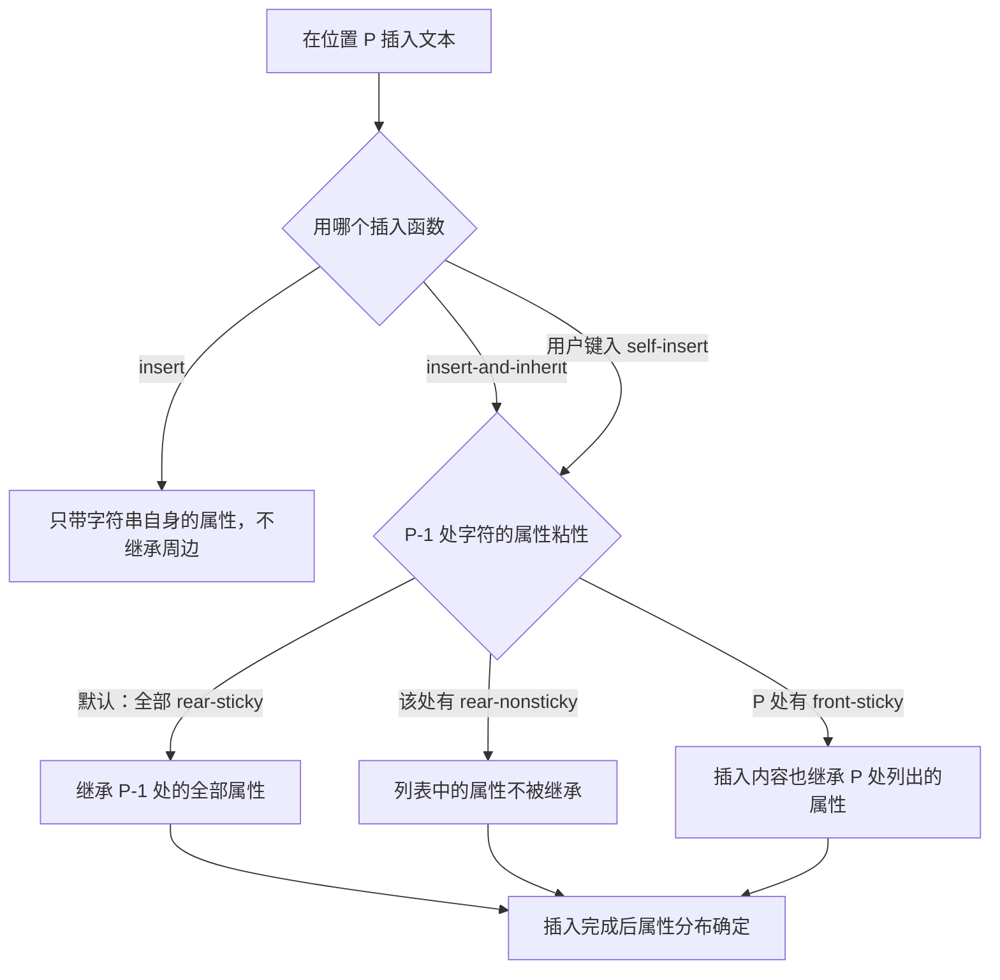
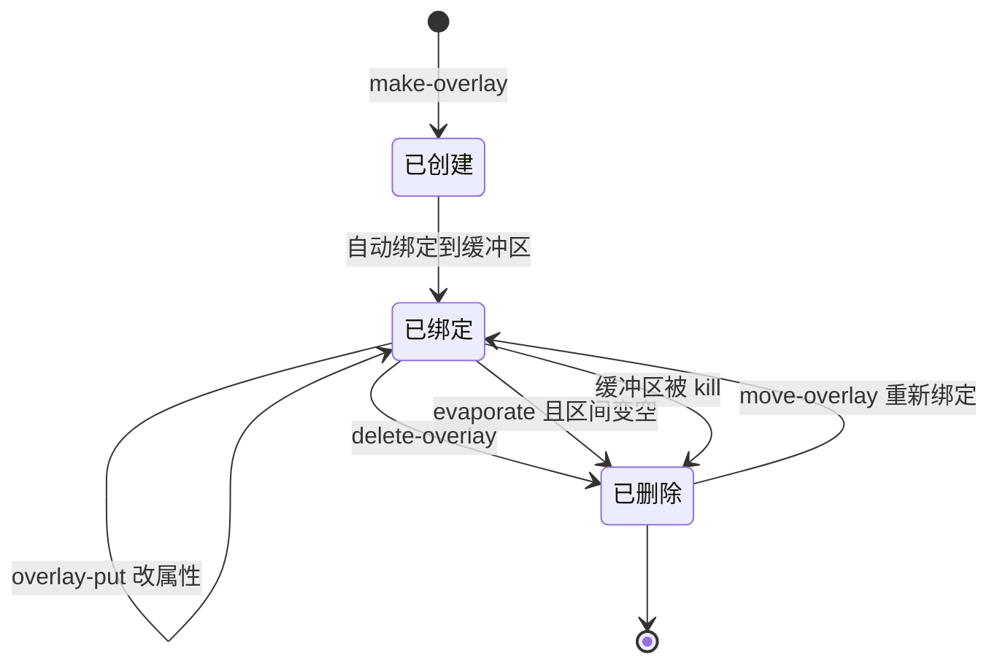
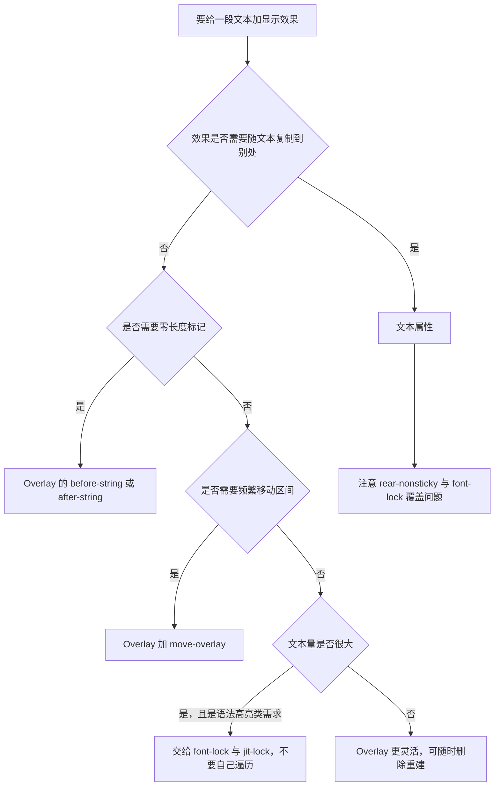

# 文本属性与 Overlay

> 本篇讲 Emacs 的「显示层」：如何给文本上色、加提示、插图片、隐藏内容，以及 text property 与 overlay 这两种机制在语义、性能和插入行为上的关键差异。

---

## 一、为什么需要一层独立的显示机制

Emacs 把「缓冲区里有什么字符」和「这些字符显示成什么样」彻底分开了。缓冲区里存的永远只是纯字符，颜色、字体、图片、折叠、行内提示全部是**附加在字符上的属性**。这个设计带来三个直接后果：

- 复制文本时，字符是确定的，属性可以带也可以不带（`buffer-substring` 带，`buffer-substring-no-properties` 不带）。
- 语法高亮、拼写标记、diff 着色这类功能不需要修改文本本身，因此不会弄脏文件内容。
- 同一份文本可以在不同窗口里显示成不同样子（overlay 可以绑定到特定窗口）。

Emacs 提供两种挂属性的机制：

- **文本属性（text property）**：属性属于字符本身，随文本一起被复制、删除、undo。
- **覆盖层（overlay）**：属性属于一段区间，独立于文本存在，文本被复制时不带走它。

选错机制会导致难以理解的 bug，所以本篇先讲清各自的语义，再讲实战。

---

## 二、文本属性

### 2.1 读写属性的函数

```elisp
(with-temp-buffer
  (insert "hello world")

  ;; 写入属性：区间是 [START, END)，即左闭右开
  (put-text-property 1 6 'face 'bold)

  ;; 一次写多个属性，属性表是 (属性 值 属性 值 ...) 形式的 plist
  (add-text-properties 1 3 '(mouse-face highlight help-echo "打个招呼"))

  ;; 读取单个属性
  (get-text-property 1 'face)              ; => bold
  (get-text-property 7 'face)              ; => nil，位置 7 不在区间内

  ;; 读取某位置的全部属性
  (text-properties-at 1)
  ;; => (help-echo "打个招呼" mouse-face highlight face bold)

  ;; 删除指定属性（值写 nil 表示"删掉这个属性"）
  (remove-text-properties 1 3 '(mouse-face nil))
  (text-properties-at 1)                   ; => (help-echo "打个招呼" face bold)

  ;; set-text-properties 会先清空再设置，是最"霸道"的一个
  (set-text-properties 1 6 '(face italic))
  (text-properties-at 1)                   ; => (face italic)

  ;; 传 nil 表示清空所有属性
  (set-text-properties 1 6 nil)
  (text-properties-at 1))                  ; => nil
```

四者的语义差异必须分清：

| 函数 | 行为 | 典型用途 |
| --- | --- | --- |
| `put-text-property` | 只设置**一个**属性，其他属性保留 | 加一个 face |
| `add-text-properties` | 批量添加/覆盖属性，其他属性保留 | 一次加一组属性 |
| `set-text-properties` | 先清空区间内**所有**属性，再设置给定的 | 完全接管一段文本的外观 |
| `remove-text-properties` | 删除指定属性 | 撤销自己加过的标记 |

`set-text-properties` 最容易误伤：它会连同 font-lock 的字体属性一起清掉，导致那段文本变成「未字体化」的裸文本。**日常应该优先用 `put-text-property` 和 `add-text-properties`。**

### 2.2 propertize：给字符串挂属性

`propertize` 返回一个带属性的**字符串**（不是修改缓冲区）：

```elisp
(propertize "TODO" 'face 'bold)
;; => #("TODO" 0 4 (face bold))

;; 多个属性直接写在后面
(propertize "点击这里" 'face 'link 'mouse-face 'highlight 'help-echo "打开链接")

;; 取出纯文本要显式去属性
(substring-no-properties (propertize "TODO" 'face 'bold))   ; => "TODO"
```

带属性的字符串插入缓冲区时，属性会一起进入缓冲区（`insert` 不继承**周边**属性，但会保留**字符串自己**带的属性）：

```elisp
(with-temp-buffer
  (insert (propertize "红色" 'face '(:foreground "red")))
  (get-text-property 1 'face))       ; => (:foreground "red")
```

### 2.3 常用文本属性表

| 属性 | 作用 | 值的形式 |
| --- | --- | --- |
| `face` | 外观，会被 font-lock 覆盖 | face 名、匿名 face、face 列表 |
| `font-lock-face` | 外观，font-lock **不会**覆盖它 | 同上 |
| `display` | 替换或修饰显示 | `(image ...)`、`(left-fringe ...)`、`(height . 1.5)` 等 |
| `help-echo` | 鼠标停留时在回显区/提示框显示 | 字符串或返回字符串的函数 |
| `keymap` | 该位置的按键覆盖其他 map | keymap |
| `local-map` | 该位置的按键**替换**缓冲区局部 map | keymap |
| `mouse-face` | 鼠标悬停时的外观 | face 名或匿名 face |
| `invisible` | 隐藏文本 | `t` 或与 `buffer-invisibility-spec` 匹配的符号 |
| `read-only` | 该段文本不可修改 | 非 nil |
| `intangible` | 阻止 point 进入（已过时） | 非 nil |
| `cursor` | 覆盖光标外观 | `(bar . 2)`、`(box . 1)` 等 |
| `line-prefix` / `wrap-prefix` | 整行 / 续行显示前缀 | 显示规格 |
| `field` | 把连续字符组成一个「字段」 | 任意可比较对象 |
| `category` | 复用某个符号上的属性作为默认值 | 符号 |
| `syntax-table` | 为这段文本指定语法表 | 语法表 |
| `modification-hooks` | 该段文本被修改时的钩子 | 函数列表 |
| `rear-nonsticky` / `front-sticky` | 控制属性是否被插入文本继承 | `t` 或属性名列表 |

`face` 与 `font-lock-face` 的区别值得单独说：`font-lock-face` 在 font-lock 未启用时会被当作 `face` 处理，但 font-lock 在字体化时**不会覆盖**它。所以**自己写的包要给文本上色，用 `font-lock-face` 更安全**，否则你的颜色会在下一次字体化时被 font-lock 抹掉。

### 2.4 插入文本时属性如何延续（关键差异）

这是文本属性最容易出错的一点，也是它和 overlay 最本质的差别之一。

- **用户键入的字符会继承**前一个字符的属性（这叫继承，inheritance）。这是 `self-insert-command` 的特意行为。
- **`insert` 不会继承**任何周边属性。它只插入字符串自身携带的属性。这样设计是为了让「把文本从一个地方复制到另一个地方」不会带上原环境的颜色。
- **`insert-and-inherit` 会继承**。它是给需要「续写带属性文本」的程序用的。

```elisp
;; 用 insert 插入：新文本没有属性
(with-temp-buffer
  (insert "abcdef")
  (put-text-property 1 7 'face 'bold)
  (goto-char 4)
  (insert "XY")
  (get-text-property 5 'face))       ; => nil

;; 用 insert-and-inherit 插入：新文本继承了 bold
(with-temp-buffer
  (insert "abcdef")
  (put-text-property 1 7 'face 'bold)
  (goto-char 4)
  (insert-and-inherit "ZW")
  (get-text-property 5 'face))       ; => bold
```

默认规则是「**后向粘性（rear-sticky）但不前向粘性（front-sticky）**」：插入位置前面那个字符的属性会被继承，后面那个字符的属性不会被继承。两个属性用来打破默认：

- `rear-nonsticky`：值为 `t` 时该位置之后不继承任何属性；值为列表时只有列表里的属性不继承。
- `front-sticky`：值为 `t` 时插入到该字符**之前**的文本继承它全部属性；值为列表时只继承列出的属性。

```elisp
;; 让 face 不向后传播
(with-temp-buffer
  (insert "abcdef")
  (put-text-property 1 7 'face 'bold)
  (put-text-property 1 7 'rear-nonsticky '(face))
  (goto-char 4)
  (insert-and-inherit "XY")
  (get-text-property 5 'face))       ; => nil
```

`text-property-default-nonsticky` 是一个缓冲区局部变量，用来一次性改变某个属性的默认粘性，形式是 `(属性 . 非粘性)` 的 alist。



---

## 三、Overlay

### 3.1 创建与销毁

```elisp
;; make-overlay START END &optional BUFFER FRONT-ADVANCE REAR-ADVANCE
(let ((ov (make-overlay 2 5)))
  (overlay-start ov)          ; => 2
  (overlay-end ov)            ; => 5
  (overlay-buffer ov)         ; => 当前缓冲区对象
  (overlayp ov)               ; => t
  (overlay-put ov 'face 'bold)
  (overlay-get ov 'face)      ; => bold
  (overlay-properties ov)     ; => (face bold)
  (move-overlay ov 4 8)       ; 移动区间，这是唯一合法的改端点方式
  (delete-overlay ov)
  (overlay-start ov))         ; => nil，已删除的 overlay 没有位置
```

几个关键点：

- overlay 的区间是 `[START, END)`，与文本属性一致。START 与 END 相等时是**空 overlay**，它不覆盖任何字符。
- `move-overlay` 是**唯一**可以修改端点的函数。删除后的 overlay 仍然是合法的 Lisp 对象，可以用 `move-overlay` 复活。
- `delete-overlay` 只解绑，不释放；`overlay-start` 之后返回 nil。用 `(overlayp ov)` 仍返回 `t`，所以判断「还活着吗」应该看 `(overlay-buffer ov)` 或 `(overlay-start ov)` 是否为 nil。
- **overlay 的变化不记入 undo，也不把缓冲区标记为已修改**。这与文本属性正好相反：改文本属性会标记缓冲区为已修改。

`delete-all-overlays` 清空当前缓冲区的所有 overlay，会连带清掉 font-lock、flymake、isearch 等所有功能的 overlay，**日常代码里不要用**，只在测试或特殊重置场景使用。要只清自己建的，用属性打标记再定向删除：

```elisp
;; 只删自己建的：给它们统一打上 my-hl 属性
(with-temp-buffer
  (insert "abcdef")
  (let ((a (make-overlay 1 3)) (b (make-overlay 4 6)))
    (overlay-put a 'my-tag t)
    (overlay-put b 'my-tag 'other)
    ;; remove-overlays 按属性值定向删除，值用 eq 比较
    (remove-overlays (point-min) (point-max) 'my-tag t))
  (length (overlays-in (point-min) (point-max))))   ; => 1，只删掉了 my-tag 为 t 的那个
```

`remove-overlays` 的语义比较特别：它会把跨越边界的 overlay **切断**或**移动端点**而不是简单删除。名字参数与值参数必须同时给出或同时省略，且值用 `eq` 比较——所以只有符号和整数这类能 `eq` 相等的值才适合做定向删除的标记。

### 3.2 front-advance 与 rear-advance

`make-overlay` 的后两个参数决定「在端点处插入文本时，overlay 是否吞掉新文本」：

| FRONT-ADVANCE | REAR-ADVANCE | 在 START 处插入 | 在 END 处插入 |
| --- | --- | --- | --- |
| `nil`（默认） | `nil`（默认） | 新文本**在 overlay 内** | 新文本**在 overlay 外** |
| 非 `nil` | `nil` | 新文本**在 overlay 外** | 新文本**在 overlay 外** |
| `nil` | 非 `nil` | 新文本**在 overlay 内** | 新文本**在 overlay 内** |
| 非 `nil` | 非 `nil` | 新文本**在 overlay 外** | 新文本**在 overlay 外** |

「默认会吞掉开头插入的文本」这一点经常造成意外：你在行首建了一个高亮 overlay，然后用户在行首输入，新输入的字符也被高亮了，看起来像是「高亮自己长出来了」。对「高亮恰好这几个字符」的语义，通常希望是 `front-advance` 为 `t`。

### 3.3 查找 overlay

```elisp
(overlays-at pos)          ; 覆盖 pos 处字符的 overlay 列表，顺序不确定
(overlays-at pos t)        ; 带 t 时按优先级从高到低排序
(overlays-in beg end)      ; 与区间有交叠的 overlay，顺序不确定
```

`overlays-in` 的顺序**明确不可预测**，任何依赖顺序的逻辑都必须在拿到列表后自己排序，或者用 `(overlays-at pos t)`。这是新手写「多个 overlay 叠加时取最上层」时最常见的错误来源。

`(overlays-at pos)` 只返回包含**字符**的 overlay，因此**空 overlay 永远不会被它返回**；空 overlay 要用 `(overlays-in pos pos)` 或 `(overlays-in pos (1+ pos))` 才能拿到。

### 3.4 常用 overlay 属性

| 属性 | 作用 |
| --- | --- |
| `face` | 外观。多个 overlay 的 face 会按优先级**合并**而不是简单覆盖 |
| `priority` | 优先级，见下文 |
| `evaporate` | 非 nil 时 overlay 变空就自动删除 |
| `before-string` | 在 overlay 起点**之前**显示的字符串，不进入缓冲区 |
| `after-string` | 在 overlay 终点**之后**显示的字符串，不进入缓冲区 |
| `invisible` | 隐藏 overlay 覆盖的文本 |
| `help-echo` | 鼠标提示 |
| `keymap` | 该位置的按键 map，优先级高于大多数 map |
| `local-map` | 替换缓冲区局部 map（优先级低于 minor mode map） |
| `mouse-face` | 鼠标悬停时的外观 |
| `window` | 只在指定窗口生效 |
| `category` | 从符号的属性里取默认属性值 |
| `modification-hooks` | overlay 内文本被修改时调用 |
| `insert-in-front-hooks` / `insert-behind-hooks` | 恰好在起点前 / 终点后插入时的钩子 |
| `isearch-open-invisible` | 匹配到被隐藏的文本时如何临时显示 |
| `line-prefix` / `wrap-prefix` | 整行 / 续行前缀 |
| `display-line-numbers-disable` | 该区域不显示行号 |

`before-string` 与 `after-string` 是**显示层**的内容：它们不出现在缓冲区里，`buffer-string` 看不到，光标也不能停在上面（严格说 point 不会落在它们上面）。它们常被用来做行内标记，例如在行尾显示一个未保存标记、在行首显示折叠三角。

**一个必须记住的陷阱**：给一个**空 overlay** 设置 `evaporate` 为 `t`，这个 overlay 会被**立刻删除**——因为空 overlay 的长度本来就是零。

```elisp
(with-temp-buffer
  (insert "abc")
  (let ((ov (make-overlay 2 2)))       ; 空 overlay
    (overlay-put ov 'evaporate t)
    (overlay-start ov)))               ; => nil，已经被自动删除了
```

所以「在行尾放一个标记」这种需求要写成 `(overlay-put ov 'evaporate nil)` 或者在删除时机上自己负责清理。

### 3.5 overlay 的优先级

当多个 overlay 覆盖同一字符并给出同一属性的不同值时，`priority` 决定谁赢：

- 值可以是 `nil`（等价于 0）、正整数，或 `(PRIMARY . SECONDARY)` 的 cons。
- 优先级高的覆盖优先级低的。
- **对 `face` 属性，高优先级的不是完全覆盖，而是按属性合并**：高优先级的 `:foreground` 覆盖低优先级的 `:foreground`，但低优先级里高优先级没指定的属性（如 `:slant`）仍然生效。
- 优先级相同时，**嵌套更深的（覆盖范围更小的）那个胜出**；彼此不嵌套时行为未定义，不要依赖。
- **所有 overlay 都优先于文本属性。**

官方手册特别提醒：大多数 Emacs 内置功能不使用 `priority`，所以给 overlay 设一个正整数优先级会**压过所有未设优先级的 overlay**，容易造成意外。需要「必要时才排序、平时不抢」时用 `(nil . N)` 的形式。

### 3.6 overlay 的生命周期



要点：删除**不是终点**，overlay 对象仍在，可以用 `move-overlay` 复活；但缓冲区被销毁时，它的 overlay 也随之失效。

---

## 四、文本属性与 Overlay 的对比

| 维度 | 文本属性 | Overlay |
| --- | --- | --- |
| 归属 | 属于字符，是文本的一部分 | 属于缓冲区，是一个独立对象 |
| 区间 | 必须附着在具体字符上 | 可以是空区间（零长度） |
| 复制文本时 | 随文本一起复制 | 不复制 |
| 插入文本时 | 按粘性规则被继承 | 端点行为由 front/rear-advance 决定 |
| 缓冲区修改标志 | 修改属性会标记缓冲区为已修改 | 修改 overlay 不会 |
| undo | 记入 undo | 不记入 undo |
| 性能 | 与字符数相关的存储，天生分散 | 每个 overlay 都是对象，数量多时明显变慢 |
| 移动区间 | 不能移动，只能重新设置 | `move-overlay` 可以任意移动 |
| 优先级 | 最低（overlay 总是赢） | 可按 `priority` 排序 |
| 空区间 | 不支持 | 支持，可用来放显示标记 |
| 随文本编辑自动跟随 | 是（属性跟着字符走） | 端点跟着插入类型变化，可能「长大」 |
| 典型用途 | 语法高亮、链接、拼写标记 | 行内标记、可点击区域、折叠、diff 高亮、临时装饰 |



共同的使用原则：

- **不要用 `set-text-properties` 破坏别人的属性**，也不要调用 `delete-all-overlays`。
- **给 overlay 打上自己的属性标记**（例如 `(overlay-put ov 'my-feature t)`），便于定向清理。
- **模式关闭时清理自己建的 overlay**，否则用户关掉模式后高亮仍然残留。
- **在 `kill-buffer-hook` 或模式的关闭分支里清理**，缓冲区局部变量会随缓冲区一起消失，但 overlay 会一直占着内存直到缓冲区被销毁。
- **文本属性用 `font-lock-face` 而不是 `face`**，避免被 font-lock 覆盖。

---

## 五、face 与显示

### 5.1 defface 定义 face

```elisp
;; 三种显示类型：t 表示所有终端；也可以分别给 graphic / color / mono 指定
(defface my-hl-todo-face
  '((t :inherit font-lock-warning-face :weight bold))
  "TODO 关键字使用的 face。")

(defface my-hl-fixme-face
  '((((class color) (background dark)) :foreground "#ff6666" :weight bold)
    (((class color) (background light)) :foreground "#cc0000" :weight bold)
    (t :inherit error))
  "FIXME 关键字使用的 face，区分深浅色背景。")
```

face 属性的完整列表（由 `custom-face-attributes` 给出）：

| 属性 | 含义 | 值示例 |
| --- | --- | --- |
| `:family` | 字体族 | `"Monospace"` |
| `:foundry` | 字体厂商 | `"gnu"` |
| `:width` | 字宽 | `condensed`、`normal`、`expanded` |
| `:height` | 字号 | `1.2`（相对）、`140`（0.1pt 单位） |
| `:weight` | 字重 | `thin`、`normal`、`bold`、`black` |
| `:slant` | 倾斜 | `normal`、`italic`、`oblique` |
| `:foreground` | 前景色 | `"red"`、`"#ff0000"` |
| `:distant-foreground` | 与背景过近时的替代前景色 | `"gray"` |
| `:background` | 背景色 | `"blue"` |
| `:underline` | 下划线 | `t` 或 `(:color "red" :style line)` |
| `:overline` | 上划线 | `t` |
| `:strike-through` | 删除线 | `t` |
| `:box` | 边框 | `t` 或 `(:line-width 2 :color "grey")` |
| `:inverse-video` | 反显 | `t` |
| `:stipple` | 背景点阵 | 位图文件名 |
| `:font` | 直接指定字体对象（不推荐） | font 实体 |
| `:inherit` | 继承其它 face | face 名或 face 列表 |
| `:extend` | 该 face 的背景色是否延伸到行尾 | `t` 或 `nil` |

`:extend` 值得单独提一句：它控制「行尾空白是否也用这个背景色」。整行高亮（如当前行高亮）通常要设 `:extend t`，否则行末会留下一段没有背景色的空隙。

### 5.2 匿名 face

不定义 face 名，直接把属性 plist 当作 face 使用，写法是以 `:` 开头的关键字属性列表：

```elisp
;; 直接写成一个 plist，首元素是关键字时被当作匿名 face
(put-text-property 1 6 'face '(:foreground "red" :underline t))

;; 匿名 face 也可以放进 face 列表，前面的优先级更高
(propertize "警告" 'face '((:foreground "white" :background "red") bold))
```

匿名 face 适合一次性、局部的显示效果；需要被用户自定义、被主题覆盖、或复用的效果应该用 `defface` 定义具名 face。**给用户看的配色一律用 `defface` 加 `:inherit`**，这样它能跟随主题变化。

### 5.3 查看 face

- `M-x list-faces-display`：列出所有已定义的 face 及其当前外观，是排查「这个颜色是谁设的」的第一站。
- `M-x describe-face`：查看单个 face 的完整定义，包括每个显示类型下的属性、继承链、以及被哪些主题修改过。
- `M-x customize-face`：交互式修改并保存到 `custom-file`。
- `(face-attribute 'bold :weight nil t)`：用代码读某个 face 在某个显示类型下的属性值，第四个参数非 nil 表示不查询继承。

```elisp
(face-attribute 'my-hl-todo-face :weight nil t)   ; => bold
(face-list)                                       ; 所有已定义 face 的列表
(facep 'my-hl-todo-face)                          ; => t
```

---

## 六、图片与 SVG 显示

`display` 属性可以把一个字符**替换成**图片显示，字符本身仍在缓冲区里（只是不显示）。这是 org-mode 内联图片、eww 显示图片、以及各种图标化界面的实现方式。

```elisp
;; 从文件创建 image 对象
(create-image "/tmp/logo.svg" 'svg nil :scale 1.0 :ascent 'center)

;; 从字符串数据创建，适合动态生成的图
(create-image "<svg xmlns=\"http://www.w3.org/2000/svg\" width=\"16\" height=\"16\">
                 <circle cx=\"8\" cy=\"8\" r=\"7\" fill=\"steelblue\"/>
               </svg>"
              'svg t
              :ascent 'center
              :scale 1.5)

;; 把图片挂到文本上（替换第 1 到第 2 个字符的显示）
(put-text-property 1 2 'display (create-image "/tmp/logo.svg" 'svg))
```

`create-image` 的常用关键字参数：

| 参数 | 含义 |
| --- | --- |
| `:type` | 图片类型符号，如 `png`、`jpeg`、`svg`、`gif`、`xpm` |
| `:data` | 第三个位置传 `t` 表示第一个参数是数据而非文件名 |
| `:ascent` | 垂直对齐，`center` 或数字（相对于高度的百分比） |
| `:scale` | 缩放倍数 |
| `:margin` | 外边距，数字或 `(H V)` |
| `:rotation` | 旋转角度 |
| `:width` / `:height` | 显式指定显示尺寸（单位是像素或 `(em . N)`） |

配套的查询函数：

```elisp
(image-type-available-p 'svg)     ; => t，判断这个 Emacs 是否支持 SVG
(imagep (create-image "..." 'svg t))
(image-size (create-image "..." 'svg t) t)   ; => (宽 高)，t 表示返回像素尺寸
(image-flush image)               ; 清除图片缓存（重新生成图片后要调用）
```

必须注意两点：

- **图片类型的支持取决于构建选项。** 无图形界面的 Emacs（`emacs -nw`）以及没有链接相应库的构建可能不支持 png、jpeg。写代码前用 `image-type-available-p` 检查，并准备纯文本回退。
- **`image-size` 需要图形环境**。在 `emacs --batch` 里调用它通常返回 nil，所以不要在批处理脚本里依赖图片尺寸。

`display` 属性的其他常用形式（不需要图片）：

```elisp
;; 把字符显示成一条竖线（常用于表格辅助线）
(put-text-property 1 2 'display '(space :width 2))       ; 显示为两倍宽的空格

;; 显示为高度 1.5 倍
(put-text-property 1 2 'display '(height 1.5))

;; 提升或降低基线
(put-text-property 1 2 'display '(raise 0.3))

;; 在左边缘（fringe）显示一个位图
(put-text-property 1 2 'display '(left-fringe right-triangle my-hl-todo-face))
```

`(FRINGE BITMAP FACE)` 中 FRINGE 是 `left-fringe` 或 `right-fringe`，BITMAP 是符号。Emacs 内置的标准位图包括：`left-arrow`、`right-arrow`、`left-curly-arrow`、`right-curly-arrow`、`right-triangle`、`left-triangle`、`up-arrow`、`down-arrow`、`bottom-left-angle`、`bottom-right-angle`、`top-left-angle`、`top-right-angle`、`left-bracket`、`right-bracket`、`empty-line`、`filled-rectangle`、`hollow-rectangle`、`filled-square`、`hollow-square`、`vertical-bar`、`horizontal-bar`、`exclamation-mark`、`question-mark`、`large-circle`。其中 `right-triangle` 就是 overlay 箭头（`C-x C-n` 之类功能）用的那个。

手册明确建议：**FACE 参数不要省略**，否则位图颜色会受 `default` 与 `fringe` face 的当前值影响而难以预测。想让它跟随 fringe 的配色就写 `'fringe`。

---

## 七、隐藏文本与折叠

隐藏文本靠 `invisible` 属性配合 `buffer-invisibility-spec` 变量。`invisible` 属性可以是文本属性，也可以是 overlay 属性。

三种用法：

```elisp
;; 用法一：invisible 为 t，且 buffer-invisibility-spec 保持默认值 t
;; 任何非 nil 的 invisible 值都会让文本不可见，且不显示省略号
(put-text-property 1 10 'invisible t)

;; 用法二：按类别隐藏，便于一次性切换某一类内容
(add-to-invisibility-spec '(my-folded . t))   ; 带 . t 时隐藏处显示省略号
(overlay-put (make-overlay beg end) 'invisible 'my-folded)
;; 想临时让这类内容重新出现，只要改变 spec
(remove-from-invisibility-spec '(my-folded . t))

;; 用法三：不带省略号的类别
(add-to-invisibility-spec 'my-hidden)
```

`buffer-invisibility-spec` 的取值语义（这是最容易记混的部分）：

- 值为 `t`（默认）：`invisible` 属性非 nil 就隐藏。
- 值为列表：只有当字符的 `invisible` 属性**匹配列表中的某一项**时才隐藏。
  - 列表元素是**原子** `ATOM`：属性值等于 `ATOM`，或属性值是一个列表且 `ATOM` 是其中成员（用 `eq` 比较）。
  - 列表元素是 `(ATOM . t)`：匹配规则同上，**并且**连续被隐藏的文本会显示成一个省略号。

设置这个变量会让它变成缓冲区局部的。两个配套函数是 `add-to-invisibility-spec` 与 `remove-from-invisibility-spec`，它们会处理「原本是 `t`，现在要变成列表」的转换。

相关的辅助函数：

```elisp
(invisible-p pos-or-prop)
;; 传位置：该位置当前是否不可见
;; 传一个属性值：在当前 spec 下这个值会不会导致隐藏
;; 返回 t 表示完全隐藏；返回非 t 的非 nil 值表示会被替换成省略号
```

两个必须知道的交互：

- **isearch 与隐藏文本**：需要在搜索命中被隐藏内容时自动展开，就给 overlay 加 `isearch-open-invisible`（永久展开）或 `isearch-open-invisible-temporary`（搜索期间临时展开）。值是函数，接收 overlay 参数。
- **光标与隐藏文本**：命令执行结束时如果 point 停在不可见文本内部，命令循环会把 point 移到该段文本的某一端。所以「在隐藏区域里精确定位光标」是做不到的，写折叠逻辑时要意识到这一点。

---

## 八、行内提示与行号

### 8.1 line-prefix 与 wrap-prefix

两者既是**文本属性/overlay 属性**，也是**缓冲区局部变量**：

- `line-prefix`：在每个**逻辑行**显示时加在行首（续行不加）。
- `wrap-prefix`：在每个**续行**（因为太长而折行产生的屏幕行）显示时加在行首。

```elisp
;; 用变量形式：影响整个缓冲区
(setq-local line-prefix (propertize "| " 'face 'shadow))
(setq-local wrap-prefix (propertize "| " 'face 'shadow))

;; 用 overlay 形式：只影响一段区间
(let ((ov (make-overlay beg end)))
  (overlay-put ov 'line-prefix (propertize ">> " 'face 'font-lock-keyword-face)))
```

典型用途：写一个「专注模式」给它下面的每一行加缩进视觉引导、给当前段落加行首标记。

### 8.2 在 fringe 上放置位图与行号

前面 6 节已经给出 `(left-fringe BITMAP FACE)` 的用法。它最常见的两个场景是：

- 在左边缘显示断点、diff 标记、错误标记（flycheck/flymake 就是这么做的）。
- 在边缘显示 overlay 箭头。

`display-line-numbers-disable` 这个 overlay 属性用来阻止某段文本显示行号。手册提到的典型场景是**在缓冲区末尾放一个空 overlay**——否则那里会多显示一个行号。

---

## 九、性能注意事项

overlay 是对象，数量一多就会拖慢编辑。经验值如下（供判断量级，实际取决于缓冲区大小与机器）：

- **几百个** overlay：完全无感。
- **几千个**：在被打包成「每次修改都重建」的实现里开始能感觉到输入延迟。
- **上万个**：滚动、搜索、`overlays-in` 的调用都会明显变慢，`C-n`/`C-p` 可能一卡一卡。

实践建议：

- **不要自己遍历整个缓冲区做语法高亮。** 这是 font-lock 与 jit-lock 的职责：font-lock 通过 `font-lock-add-keywords` 声明规则，jit-lock 只对**看得见的窗口区域**做字体化。自己用 overlay 全量高亮大文件，等于把 jit-lock 的优化全部丢掉。

  ```elisp
  ;; 声明式的语法高亮：不要自己遍历
  (font-lock-add-keywords
   'prog-mode
   '(("\\_<\\(TODO\\|FIXME\\)\\_>" (1 'font-lock-warning-face prepend))))

  ;; 需要更复杂的按需字体化逻辑时用 jit-lock
  (jit-lock-register #'my-fontify-region)
  ```

- **修改钩子里只处理受影响的区域。** 用 `after-change-functions` 的三个参数拿到 `beg`/`end`，把它扩展到整行后只重扫这一段，而不是每次 `erase-buffer` 式地重建全部 overlay。

- **用 `evaporate` 而不是自己跟踪区间。** 文本被删除时让 overlay 自动消失，比在钩子里手工维护端点可靠得多（但记住空 overlay 不能设 `evaporate`）。

- **优先用文本属性而不是 overlay 做大范围高亮。** 语法高亮、拼写检查的标记应该用属性或 font-lock；overlay 留给「需要独立生命周期、需要零长度、需要频繁移动」的场景。

- **用 `overlays-in` 而不是反复 `overlays-at` 逐点查询**。后者每次都从头查找 overlay 树。

- **不要在 `post-command-hook` 里重建大量 overlay。** 那个钩子每条命令都跑，是输入延迟最常见的来源。

- **测量而不是猜。** `M-x profiler-start RET cpu RET`、操作、`M-x profiler-report`，能看到时间究竟花在字体化、overlay 查找还是别的什么地方。

---

## 十、完整实战

### 10.1 highlight-todo-mode：一个完整的 minor mode

需求：把 `TODO`、`FIXME` 等关键字用不同 face 高亮，关键字可通过 `defcustom` 自定义，模式关闭时清掉所有 overlay，且修改缓冲区时只重扫受影响的行。

```elisp
(require 'cl-lib)

(defface my-hl-todo-face
  '((t :inherit font-lock-warning-face :weight bold))
  "TODO 关键字使用的 face。")

(defface my-hl-fixme-face
  '((t :inherit error :weight bold))
  "FIXME 关键字使用的 face。")

(defcustom my-hl-keywords
  '(("TODO"  . my-hl-todo-face)
    ("FIXME" . my-hl-fixme-face)
    ("XXX"   . my-hl-todo-face))
  "关键字与 face 的对照表，键是字符串，值是 face。"
  :type '(alist :key-type string :value-type face)
  :group 'convenience)

(defvar-local my-hl-overlays nil
  "本缓冲区中由 my-highlight-todo-mode 建立的 overlay 列表。")

(defun my-hl--regexp ()
  "由 my-hl-keywords 构造匹配正则。"
  ;; regexp-opt 会做前缀合并与转义，比手工拼字符串安全
  (concat "\\_<\\(" (regexp-opt (mapcar #'car my-hl-keywords)) "\\)\\_>"))

(defun my-hl--clear ()
  "删除本模式建立的所有 overlay。"
  (mapc #'delete-overlay my-hl-overlays)
  (setq my-hl-overlays nil))

(defun my-hl--fontify-region (beg end)
  "为 [BEG, END) 区域内的关键字建立 overlay。"
  (save-excursion
    (goto-char beg)
    (let ((re (my-hl--regexp)))
      (while (re-search-forward re end t)
        (let* ((word (match-string-no-properties 1))
               (face (cdr (assoc word my-hl-keywords)))
               (ov (make-overlay (match-beginning 1) (match-end 1))))
          ;; 打上自己的标记，便于定向清理
          (overlay-put ov 'my-hl t)
          (overlay-put ov 'face face)
          (overlay-put ov 'evaporate t)
          (overlay-put ov 'help-echo (format "关键字：%s" word))
          (push ov my-hl-overlays))))))

(defun my-hl--refresh ()
  "重建整个缓冲区的高亮。"
  (my-hl--clear)
  (my-hl--fontify-region (point-min) (point-max)))

(defun my-hl--after-change (beg end _old-len)
  "缓冲区变化后只重扫受影响的整行。"
  (save-excursion
    (save-restriction
      (widen)
      (let ((from (progn (goto-char beg) (line-beginning-position)))
            (to   (progn (goto-char end) (line-end-position))))
        ;; 先删掉这一行里由本模式建立的 overlay
        (dolist (ov (overlays-in from to))
          (when (overlay-get ov 'my-hl)
            (setq my-hl-overlays (delq ov my-hl-overlays))
            (delete-overlay ov)))
        (my-hl--fontify-region from to)))))

(define-minor-mode my-highlight-todo-mode
  "高亮当前缓冲区中的 TODO、FIXME 等关键字。"
  :lighter " HL"
  :group 'convenience
  (if my-highlight-todo-mode
      (progn
        ;; 只加到这个缓冲区，避免影响全局
        (add-hook 'after-change-functions #'my-hl--after-change nil t)
        (my-hl--refresh))
    (remove-hook 'after-change-functions #'my-hl--after-change t)
    (my-hl--clear)))
```

验证行为：

```elisp
(with-temp-buffer
  (insert "TODO 写文档\naTODO 不算关键字\nFIXME 修 bug\n")
  (my-highlight-todo-mode 1)
  (list (length my-hl-overlays)                       ; => 2，aTODO 不算
        (mapcar (lambda (ov) (overlay-get ov 'face))
                (reverse my-hl-overlays)))            ; => (my-hl-todo-face my-hl-fixme-face)
  ;; 继续输入应当只影响当前行
  (goto-char (point-max))
  (insert "TODO 新加的\n")
  (prog1 (length my-hl-overlays)                      ; => 3
    (my-highlight-todo-mode -1)
    (length (overlays-in (point-min) (point-max)))))  ; => 0，关闭后清理干净
```

这个实现里有几个刻意的设计：

- 用 `defvar-local` 而不是 `defvar`，overlay 列表随缓冲区独立。
- `\\_<` / `\\_>` 而不是 `\\b`，避免 `aTODO` 被误匹配。
- 每个 overlay 带 `my-hl` 标记，想只清自己的就靠这个属性。
- `after-change` 钩子只在当前行重扫，并在清洗时同步从 `my-hl-overlays` 里 `delq` 掉已删除的项，防止列表无限增长（这是 overlay 实现里最常见的内存泄漏点）。
- 模式关闭时既 `remove-hook` 又清 overlay，缺一不可。

如果这个模式要在多个缓冲区同时开启，`add-hook` 的 LOCAL 参数（第四个参数 `t`）是必须的；用全局钩子会让所有缓冲区都执行这段代码。

### 10.2 在当前行末尾显示未保存标记

```elisp
(defvar-local my-unsaved-ov nil
  "当前行行尾未保存标记的 overlay。")

(defun my-unsaved--clear ()
  (when (overlay-buffer my-unsaved-ov)
    (delete-overlay my-unsaved-ov))
  (setq my-unsaved-ov nil))

(defun my-unsaved-show ()
  "在光标所在行的行尾显示一个「未保存」标记。"
  (interactive)
  (my-unsaved--clear)
  (when (buffer-modified-p)
    (let ((pos (line-end-position)))
      ;; 注意：空 overlay 绝对不能设 evaporate，否则会被立即删除
      (setq my-unsaved-ov (make-overlay pos pos))
      (overlay-put my-unsaved-ov 'after-string
                   (propertize " [未保存]"
                               'face '(:foreground "orange" :weight bold))))))
```

验证：

```elisp
(with-temp-buffer
  (insert "第一行\n第二行\n")
  (goto-char 5)
  (set-buffer-modified-p t)
  (my-unsaved-show)
  (list (overlay-start my-unsaved-ov)                  ; => 9，即第一行行尾
        (overlay-get my-unsaved-ov 'after-string)))
;; => (9 #(" [未保存]" 0 6 (face (:foreground "orange" :weight bold))))
```

三个要点：`after-string` 只在显示层出现，不进入缓冲区内容；空 overlay 必须显式不设 `evaporate`；`buffer-modified-p` 为 nil 时（文件已保存）不应该显示标记。

要让它自动跟随编辑，把它接到 `post-command-hook` 上，但注意 `post-command-hook` 每条命令都跑，所以函数体必须极短——上面这个实现只做「删一个、建一个 overlay」，开销可以接受；如果在里面重扫缓冲区就会明显卡顿。

### 10.3 可点击文本：overlay 加 keymap

给一段文本挂上 overlay，并在 overlay 上放一个局部 keymap，就能让它响应鼠标点击。这是「行内按钮」最标准的做法。

```elisp
(defvar my-link-map
  (let ((map (make-sparse-keymap)))
    (keymap-set map "<mouse-1>" #'my-link-follow)
    (keymap-set map "<mouse-2>" #'my-link-follow)
    (keymap-set map "RET" #'my-link-follow)
    map)
  "可点击文本使用的局部 keymap。")

(defun my-link-follow (event)
  "点击可点击文本时的处理函数。EVENT 是鼠标事件。"
  (interactive "e")
  (let* ((pos (posn-point (event-start event)))
         (target (get-char-property pos 'my-link-target)))
    (when target
      (message "打开目标：%s" target))))

(defun my-make-clickable (beg end target)
  "把 [BEG, END) 变成可点击文本，点击时打开 TARGET。"
  (let ((ov (make-overlay beg end)))
    (overlay-put ov 'my-link t)
    (overlay-put ov 'my-link-target target)
    (overlay-put ov 'keymap my-link-map)
    (overlay-put ov 'mouse-face 'highlight)
    (overlay-put ov 'face 'link)
    (overlay-put ov 'help-echo (format "打开 %s" target))
    ov))
```

验证：

```elisp
(with-temp-buffer
  (insert "[打开配置文件]\n")
  (let ((ov (my-make-clickable 1 15 "~/.emacs.d/init.el")))
    (list (overlay-get ov 'keymap)
          (keymap-lookup (overlay-get ov 'keymap) "<mouse-1>")
          (get-char-property 3 'my-link-target))))
;; => ((keymap (mouse-1 . my-link-follow) ...) my-link-follow "~/.emacs.d/init.el")
```

细节说明：

- `(posn-point (event-start event))` 是鼠标事件的标准取值方式，拿到的是点击处的缓冲区位置。
- 目标信息放在 overlay 属性 `my-link-target` 上，点击处理函数用 `get-char-property` 反查——这样同一个处理函数可以为多个可点击区域服务，不需要闭包捕获。
- `keymap` 属性优先级高于绝大多数 map（只有 `overriding-terminal-local-map` 和 `overriding-local-map` 能压过它）。
- 要支持键盘操作，还应把 `RET` 加进 map，不过当 point 位于这段文本上时 `RET` 通常已被 major mode 占用，需要按场景决定。
- 如果是用来打开文件或 URL，记得用 `browse-url` 或 `find-file` 并在出错时给出 `user-error`，不要直接把字符串丢给 shell。

---

## 小结

- 文本属性属于字符、随文本复制、记入 undo 并标记缓冲区已修改；overlay 属于缓冲区、可零长度、可移动、不记 undo。选择依据是「是否需要随文本走」。
- `insert` 不继承周边属性，`insert-and-inherit` 才继承；继承规则由 `rear-nonsticky` 与 `front-sticky` 控制。
- 给 overlay 设 `evaporate` 时空 overlay 会被立刻删除；`overlays-in` 的顺序不可预测；所有 overlay 都优先于文本属性。
- 语法高亮交给 `font-lock` 与 `jit-lock`，自己写的包用 `font-lock-face` 避免被覆盖；overlay 数量是编辑延迟的主要来源之一，能在修改钩子里只重扫受影响的行就不要全量重建。
- 模式结束时必须清理自己创建的 overlay，并用自定义属性做标记以便定向清理。

---

## 相关章节

- [[emacs教程/2Elisp语言/06_缓冲区文本与点|缓冲区、文本与点]]
- [[emacs教程/2Elisp语言/08_命令与键位映射|命令与键位映射]]
- [[emacs教程/2Elisp语言/09_Mode与Hook机制|Mode 与 Hook 机制]]
- [[emacs教程/4插件开发/02_编写MinorMode|编写 Minor Mode]]
- [[emacs教程/3配置实践/02_主题字体与美化|主题、字体与美化]]
