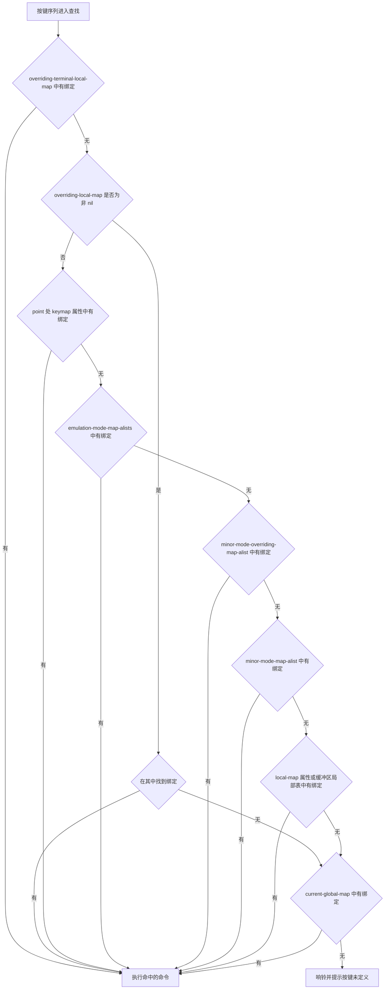
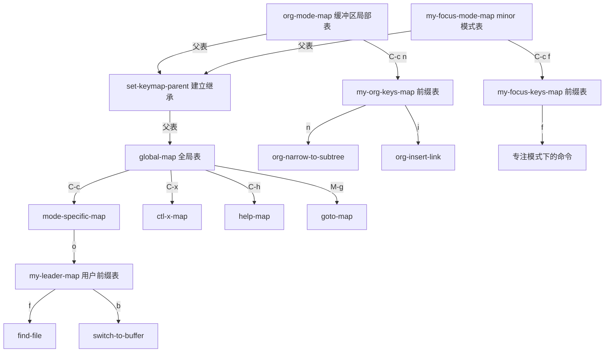

# 命令与键位映射

> 本篇解决「写好的函数怎么变成能敲的键」这个问题：`interactive` 到底做了什么，完整的代码字符有哪些，`keymap` 体系按什么顺序查找，以及为什么 29 之后推荐 `keymap-set` 而不是 `define-key`。

---

## 一、命令与普通函数的区别

### 1.1 命令就是带交互规格的函数

Elisp 里没有独立的「命令」类型。一个函数是不是命令，取决于它有没有**交互规格（interactive specification）**。判断函数是 `commandp`：

```elisp
(defun my-command ()            ; 有 interactive，是命令
  "把当前行打印到回显区。"
  (interactive)
  (message "%s" (buffer-substring (line-beginning-position)
                                   (line-end-position))))

(defun my-function ()           ; 没有 interactive，只是普通函数
  "返回当前行内容。"
  (buffer-substring (line-beginning-position) (line-end-position)))

(commandp 'my-command)          ; => t
(commandp 'my-function)         ; => nil

;; 匿名函数也可以带交互规格
(commandp (lambda () (interactive) 'x))  ; => t
(commandp (lambda () 'x))                ; => nil
```

`interactive` 这个特殊形式做三件事：它在函数对象上标记「这是命令」、声明参数从哪里来、并告诉命令循环在调用前后需要做什么准备（例如检查只读、激活区域）。它本身不产生任何运行时代码，纯粹是一个声明。

### 1.2 能被 M-x 调用的条件

`M-x` 绑定的是 `execute-extended-command`，它读入一个符号名，然后要求这个符号满足两个条件：

- 它的函数定义能通过 `commandp` 检查，也就是带 `interactive`；
- 它是一个**具名符号**，而不是匿名 lambda。

第二条意味着把命令写成 lambda 虽然 `commandp` 返回 `t`，却无法用 `M-x` 调用，也没法被 `where-is` 查到。想让用户能敲，必须 `defun` 或者 `defalias` 到一个符号上。

还有一个细节：`commandp` 对字符串和向量返回 `t`，因为它们被当作键盘宏：

```elisp
(commandp "abc")                ; => t    字符串是键盘宏
(commandp [1 2 3])              ; => t    向量也是
(commandp "abc" t)              ; => nil  加第二个参数后不再接受键盘宏
```

`commandp` 的第二个参数 `FOR-CALL-INTERACTIVELY` 用于区分「能被 `call-interactively` 调用」和「只是一个可交互对象」。`call-interactively` 需要的是前者，普通键盘宏走的是另一条路径。

### 1.3 检查一个函数为什么不能敲

用 `interactive-form` 直接看函数对象上挂的规格，比反复试错快：

```elisp
(interactive-form 'my-command)  ; => (interactive)
(interactive-form 'my-function) ; => nil      所以它不是命令
```

命令行里对应的检查手段是 `M-x` 后按 `TAB` 补全：能补全出来的名字就是命令。补全不出来而 `fboundp` 为真，说明它缺 `interactive`。

---

## 二、interactive 代码字符完整表

### 2.1 字符串形式的读法

最常见的写法是把代码字符直接拼成一个字符串传给 `interactive`。规则是：

- 每个代码字符读一个参数，**大写和小写是不同的代码**（`p` 与 `P`、`n` 与 `N`、`r` 与 `R` 语义都不一样）。
- 大多数代码字符后面可以跟一段提示串，提示串一直延伸到字符串结尾或者下一个换行符为止。
- **不需要读取输入的代码**（文档里标注为 No I/O）不使用提示串，你写了也会被忽略；但它们后面**必须跟一个换行符**，除非它正好是字符串的最后一个字符。

下面这张表列出全部合法代码，一个不漏。

| 代码 | 读入的内容 | 是否读输入 | 提示串 |
| --- | --- | --- | --- |
| `a` | 一个函数名（满足 `fboundp`） | 是 | 需要 |
| `b` | 一个已存在的缓冲区名，默认当前缓冲区 | 是 | 需要 |
| `B` | 一个缓冲区名，可以不存在，默认最近用过的其他缓冲区 | 是 | 需要 |
| `c` | 一个字符，不需要按 RET | 是 | 需要 |
| `C` | 一个命令名（满足 `commandp`） | 是 | 需要 |
| `d` | point 的位置，整数 | 否 | 忽略 |
| `D` | 一个目录，默认 `default-directory` | 是 | 需要 |
| `e` | 触发命令的按键序列中第一个（或下一个）列表类型事件 | 否 | 忽略 |
| `f` | 一个已存在的文件名 | 是 | 需要 |
| `F` | 一个文件名，可以不存在 | 是 | 需要 |
| `G` | 一个文件名，可以不存在；只输入目录时保留目录名 | 是 | 需要 |
| `i` | 无意义的参数，恒为 `nil` | 否 | 忽略 |
| `k` | 一个按键序列，读到能在当前 keymap 中定位到命令为止 | 是 | 需要 |
| `K` | 同 `k`，但按 `keymap-set` 能接受的格式返回 | 是 | 需要 |
| `m` | mark 的位置，整数 | 否 | 忽略 |
| `M` | 一段任意文本，用当前缓冲区的输入法读取 | 是 | 需要 |
| `n` | 一个数字，从 minibuffer 读，不使用前缀参数 | 是 | 需要 |
| `N` | 数字前缀参数；没有前缀时按 `n` 读取，结果一定是数字 | 是 | 需要 |
| `p` | 数字前缀参数 | 否 | 忽略 |
| `P` | 原始前缀参数（`nil`、`-`、数字或列表） | 否 | 忽略 |
| `r` | point 与 mark 两个整数，小的在前 | 否 | 忽略 |
| `R` | 同 `r`，但只在区域处于激活状态且适合操作时给值，否则给两个 `nil` | 否 | 忽略 |
| `s` | 一段任意文本，用 `C-j` 或 `RET` 结束 | 是 | 需要 |
| `S` | 一个符号，读入其名字并 intern | 是 | 需要 |
| `U` | 跟在 `k` 或 `K` 之后，取回被丢弃的 up-event，没有则为 `nil` | 否 | 忽略 |
| `v` | 一个声明为用户选项的变量（满足 `custom-variable-p`） | 是 | 需要 |
| `x` | 一个 Lisp 对象，按读语法输入，不求值 | 是 | 需要 |
| `X` | 一个 Lisp 形式，先读再求值，用求值结果作为参数 | 是 | 需要 |
| `z` | 一个编码系统名（符号），空输入得到 `nil` | 是 | 需要 |
| `Z` | 编码系统名，但只在命令带前缀参数时才读，否则给 `nil` | 是 | 需要 |
| `*` | 特殊字符，缓冲区只读时报错 | 否 | 不适用 |
| `^` | 特殊字符，处理 shift 翻译下的区域激活状态 | 否 | 不适用 |
| `@` | 特殊字符，选中按键序列里第一个鼠标事件所指的窗口 | 否 | 不适用 |

三个特殊字符必须出现在字符串**开头**，它们是孤立的单字符，不消耗提示串也不消耗换行符。其余代码的顺序决定参数的顺序：字符串里第 N 个代码字符对应函数的第 N 个参数。

### 2.2 一个必须澄清的误传：不存在 `V` 这个代码

网上流传的 `interactive` 代码表里经常能看到一个 `V`，写成「读一个变量名」或者「读一个 Lisp 对象」。**这个代码并不存在。**

Emacs 会在解析 `interactive` 字符串时校验每一个代码字符，遇到 `V` 直接报错：

```elisp
;; 定义时不报错，因为是运行时才解析
(defalias 'my-bad-command (lambda () (interactive "V") nil))

;; 调用时立刻失败
;; 报错：Invalid control letter 'V' (#o126, #x0056) in interactive calling string
```

要把变量名作为参数，用的是 `v`（读用户选项）或者 `S`（读任意符号）。这两个都真实存在，语义也在上一节的表里。

这个例子说明一件事：`interactive` 字符串里的错误是**运行时错误**，不会被字节编译器发现。定义一个写错了代码字符的命令，只有等到用户真的敲下那个键才会暴露。手写 `interactive` 字符串之后，最好立刻 `M-x` 调一次确认。

### 2.3 数值与前缀参数

`p`、`P`、`n`、`N` 四个代码都和前缀参数有关，区别在于「读不读 minibuffer」和「拿到的是原始值还是数字」：

```elisp
(defun my-count-lines (n)
  "向下移动 N 行，N 来自前缀参数。
不带前缀时 N 为 1，C-u 3 时 N 为 3。"
  (interactive "p")
  (forward-line n))

(defun my-raw-prefix (arg)
  "把前缀参数原样显示。
ARG 可能是 nil、符号 -、整数，或者 (4) 这样的列表。"
  (interactive "P")
  (message "原始前缀参数是 %S" arg))

(defun my-ask-number (n)
  "总是从 minibuffer 读一个数字，忽略前缀参数。"
  (interactive "nRepeat count: ")
  (message "读了 %d" n))

(defun my-prefix-or-ask (n)
  "有前缀参数就用它，没有就弹 minibuffer 问。结果一定是数字。"
  (interactive "NHow many: ")
  (message "得到 %d" n))
```

`p` 与 `n` 的关键差别是：`p` 在**没有**前缀参数时给 `1`，而 `n` 一定会弹 minibuffer 问用户。所以「给命令一个带默认值的次数参数」用 `p`，用 `C-u` 传值；「必须让用户明确输入一个数字」用 `n`。

`P` 拿到的原始值需要自己判断：无前缀是 `nil`，`M--` 是符号 `-`，`C-u` 是 `(4)`，`C-u 3` 是 `3`。想统一处理，用 `(prefix-numeric-value arg)` 把它转成数字。

### 2.4 字符串、符号与 Lisp 对象

```elisp
(defun my-greet (name)
  "读一个字符串作为名字。"
  (interactive "sName: ")
  (message "你好，%s" name))

(defun my-intern-name (sym)
  "读入一段文本并 intern 成符号。"
  (interactive "SSymbol: ")
  (message "符号名是 %s，类型是 %S" sym (type-of sym)))

(defun my-read-object (obj)
  "读入一个 Lisp 对象，不求值。"
  (interactive "xObject: ")
  (message "%S" obj))

(defun my-eval-form (value)
  "读入一个形式并求值，把结果作为参数。"
  (interactive "XForm: ")
  (message "求值结果是 %S" value))
```

`x` 和 `X` 的区别只有一步：`x` 把读到的形式原样给你，`X` 先 `eval` 再给你。用 `x` 传给 `(message "%S" obj)` 是安全的，用 `X` 就等于让用户在你的命令里执行任意代码，只在确实需要「求值一个表达式」的场景用。

`S` 的读取规则特殊：空格、括号、方括号这些在其他场合会终止符号的字符，在这里**不会**终止输入，只有 `C-j` 或 `RET` 才结束。

### 2.5 文件、目录、缓冲区与命名对象

```elisp
(defun my-show-file (file)
  "读一个已存在的文件。"
  (interactive "fFile: ")
  (message "文件是 %s" file))

(defun my-create-file (file)
  "读一个文件名，允许不存在。"
  (interactive "FFile name: ")
  (message "将创建 %s" file))

(defun my-choose-dir (dir)
  "读一个目录，默认当前目录。"
  (interactive "DDirectory: ")
  (message "目录是 %s" dir))

(defun my-on-buffer (buf)
  "读一个已存在的缓冲区，默认当前缓冲区。"
  (interactive "bBuffer: ")
  (message "缓冲区是 %s" buf))

(defun my-name-buffer (name)
  "读一个缓冲区名，允许不存在。"
  (interactive "BBuffer name: ")
  (message "名字是 %s" name))

(defun my-run-command (cmd)
  "读一个命令名（满足 commandp）。"
  (interactive "CCommand: ")
  (call-interactively cmd))

(defun my-call-function (fn)
  "读一个函数名（满足 fboundp），不要求是命令。"
  (interactive "aFunction: ")
  (funcall fn))

(defun my-set-option (var)
  "读一个用户选项名。非 defcustom 变量不会被接受。"
  (interactive "vVariable: ")
  (message "%s 当前是 %S" var (symbol-value var)))
```

`C` 与 `a` 的差别值得一提：`C` 用 `commandp` 过滤，只能选命令；`a` 用 `fboundp` 过滤，普通函数也能选。做「调用一个命令」的元命令用 `C`，做「对某个函数做分析」的工具用 `a`。

`v` 的过滤条件是 `custom-variable-p`，也就是只接受用 `defcustom` 声明的变量。用 `defvar` 声明的内部变量选不到，它不会出现在补全列表里。

### 2.6 位置与区域

```elisp
(defun my-region-info (beg end)
  "读区域的两端，小的在前。
mark 未设置时会报错。"
  (interactive "r")
  (message "从 %d 到 %d，共 %d 个字符" beg end (- end beg)))

(defun my-maybe-region (beg end)
  "读区域，但只有区域激活时才给值。
没有激活区域时 BEG 和 END 都是 nil，不会报错。"
  (interactive "R")
  (if beg
      (message "对区域 %d 到 %d 操作" beg end)
    (message "没有激活的区域，按整行处理")))

(defun my-point-and-mark (pt mk)
  "分别读 point 和 mark 的位置。"
  (interactive (list (point) (mark)))
  (message "point 在 %d，mark 在 %d" pt mk))
```

`r` 和 `R` 是仅有的两个**一次读两个参数**的代码字符，其他代码都是一个参数。

选择依据很明确：

- 命令在区域未激活时应当报错提醒用户先选区域，用 `r`。
- 命令在区域未激活时有合理的退化行为（例如作用于整行、作用于当前词），用 `R`。`R` 通过 `use-region-p` 判断，`mark-even-if-inactive` 为 `nil` 且区域处于非激活状态时同样给 `nil`，绝不会报错。

`R` 是「对激活区域特殊处理」的命令的推荐写法，`r` 是「必须要有区域」的命令的推荐写法。

### 2.7 按键序列与事件

```elisp
(defun my-bind-key (key)
  "读一个按键序列，返回内部表示。
describe-key 和 keymap-global-set 都用这种读取方式。"
  (interactive "kKey: ")
  (message "按键序列是 %S" key))

(defun my-bind-key-2 (key)
  "读一个按键序列，返回符合 key-valid-p 的字符串。
K 会抑制把未定义按键转换成已定义按键的转换，适合
在提示用户输入一个「待绑定的新键」时使用。"
  (interactive "KKey: ")
  (message "可以交给 keymap-set 的键是 %S" key))

(defun my-drag-info (event)
  "读一个列表类型的输入事件，鼠标事件就走这条路径。"
  (interactive "e")
  (message "事件是 %S" event))
```

`k` 与 `K` 的差异在最后那个事件上：`k` 会像正常读取一样做转换（例如把未定义的组合转换成等价的有定义形式），`K` 抑制这些转换。要提示用户「按一个你想绑定的键」，用 `K`；要提示用户「按一个你想查看的键」，用 `k`。

`e` 拿到的只包括**列表类型**的事件，也就是鼠标点击和系统事件。功能键和普通字符是符号或整数，不算在内。一个命令的 `interactive` 串里可以出现多个 `e`，按顺序取第 N 个列表事件：

```elisp
(defun my-two-events (first second)
  "取按键序列中的前两个列表事件。"
  (interactive "e\ne")
  (message "第一个 %S，第二个 %S" first second))
```

按键序列以 down-event 结尾时，`k` 会顺带读掉随后的 up-event；那个被丢弃的 up-event 可以用 `U` 取回来：

```elisp
(defun my-key-and-release (key up)
  "读一个按键序列，以及被丢弃的 up-event（如果有）。"
  (interactive "kKey: \nU")
  (message "键 %S，松开事件 %S" key up))
```

### 2.8 编码系统与占位参数

```elisp
(defun my-recode (coding)
  "读一个编码系统名，空输入得到 nil。"
  (interactive "zCoding system: ")
  (message "编码系统是 %S" coding))

(defun my-recode-if-prefix (coding)
  "只有带前缀参数时才读编码系统，否则为 nil。"
  (interactive "Z")
  (message "编码系统是 %S" coding))

(defun my-ignore-arg (arg)
  "ARG 恒为 nil，用 i 占位以对齐参数列表。"
  (interactive "i")
  (message "这个参数是 %S" arg))
```

`i` 的用处是把函数签名补齐：当某个参数在非交互调用时需要、但交互调用时无法提供，就用 `i` 占位填 `nil`，而不必改变函数的参数个数。

### 2.9 特殊修饰字符

三个特殊字符必须放在字符串最前面，可以叠加，并且可以与其他代码字符混用：

```elisp
(defun my-readonly-guard (name)
  "在只读缓冲区里直接报错，不做任何后续处理。"
  (interactive "*\nsName: ")
  (message "%s" name))

(defun my-shift-aware ()
  "带 shift 翻译调用时激活区域，否则在区域临时激活时取消激活。"
  (interactive "^")
  (message "区域激活状态是 %S" (region-active-p)))

(defun my-mouse-window (event)
  "先选中鼠标事件所在的窗口，再读事件。"
  (interactive "@e")
  (message "事件 %S" event))
```

`*` 的价值在于「早失败」：命令实现里如果用了 `inhibit-read-only` 或者可能根本不碰缓冲区，Emacs 的底层原语不一定替你报错，加 `*` 让它在调用前就拒绝，避免产生一半副作用。`^` 主要给移动类命令用，让 `S-<right>` 这类带 shift 的按键在移动 point 的同时把区域拉出来。`@` 让命令作用于鼠标点击的那个窗口，而不是当前选中窗口——鼠标命令几乎都应该加它。

### 2.10 列表形式与字符串形式的取舍

`interactive` 的参数也可以是一个 `(interactive FORM)` 的列表形式，此时 `FORM` 在调用时求值，结果必须是一个列表，列表的元素就是命令的参数：

```elisp
(defun my-read-name (name)
  "列表形式：可以复用 read-string 的全部参数。"
  (interactive (list (read-string "Name: " nil nil "default-name")))
  (message "得到 %s" name))

(defun my-smart-region (beg end)
  "列表形式：区域未激活时自动退化成整行。"
  (interactive
   (if (use-region-p)
       (list (region-beginning) (region-end))
     (list (line-beginning-position) (line-end-position))))
  (message "处理 %d 到 %d" beg end))
```

两种形式的取舍：

| 维度 | 字符串形式 | 列表形式 |
| --- | --- | --- |
| 写法 | 紧凑，一行搞定 | 啰嗦 |
| 提示串 | 只能是字面量 | 可以用 `format` 动态生成 |
| 默认值 | 由代码字符固定 | 任意计算 |
| 跨参数依赖 | 不支持 | 后面的参数可以引用前面读到的值 |
| 条件读取 | 只能整体加 `^`、`*` | 任意 `if` |
| 复用读取函数 | 只能用内置的那几种 | 可以调用任何函数 |
| 可读性 | 代码字符需要查表 | 一眼能看懂 |

判断标准是「参数之间有没有依赖」和「提示串要不要动态生成」。有依赖就必须用列表形式，因为字符串形式是按顺序独立读取的，读第二个参数时拿不到第一个的值。

列表形式有一个容易踩的坑：`read-string`、`read-file-name` 这类函数返回的字符串默认带文本属性，如果拿去做哈希键或者比较，可能因为属性不同而失配。需要「干净的」字符串时用 `substring-no-properties` 或者给 `read-string` 传 `inherit-input-method` 之外的参数处理。稳妥做法是在读取后统一 `(substring-no-properties s)`。

`interactive` 还有一种无参形式 `(interactive)`，表示命令不接受参数。这是最常见的写法，前面的 `my-command` 就是。

### 2.11 docstring 规范

命令的文档字符串比普通函数更重要，因为它是 `C-h f` 和 `M-x` 里唯一能被用户看到的信息。几条硬性要求：

- **第一行必须是一句完整的、能独立成立的摘要句，以句号结尾。** `apropos`、`M-x` 补全列表、`C-h f` 的标题行都只显示第一行，所以第一行不能是半截话，也不能是「这个函数用于……」这类没有信息量的开头。
- **参数名在文档里用大写**，例如 `FILE`、`BUFFER`、`N`。这和函数签名里的小写参数名形成对照，`help` 缓冲区会据此做高亮。写成大写还能避免被误认为是自由变量。
- 之后空一行，再展开细节。
- 引用键位时用 `\\[命令名]`，引用 keymap 时用 `\\{keymap变量}`。`C-h f` 渲染时会通过 `substitute-command-keys` 把它们替换成当前实际的键位，这样用户改了键位之后文档依然正确。
- 提到另一个符号时统一用 `'symbol` 形式（`help` 会把它渲染成可点击的链接）。

```elisp
(defun my-save-and-tag (tag)
  "保存当前缓冲区，并为它加一个 TAG 标签。

TAG 是任意字符串。如果当前缓冲区没有关联文件，先提示用户
选择路径。

在 `my-tag-mode' 下也可以用 \\[my-save-and-tag] 调用。"
  (interactive "sTag: ")
  (message "标签 %s" tag))
```

检查手段是内置的 `checkdoc`：

```elisp
;; 批量检查当前文件
(checkdoc-file "~/.emacs.d/init.el")

;; 在命令行里检查
;; $ emacs -Q --batch -f checkdoc-file ~/.emacs.d/init.el
```

字节编译器也会检查一部分文档问题，例如文档字符串里用了未转义的单引号、文档引用了不存在的键位，这些会以编译警告的形式出现，不要忽略。

---

## 三、keymap 体系

### 3.1 keymap 是什么

**键位映射（keymap）**是一个把「事件」映射到「定义」的对象。它的底层表示是一个列表，`car` 是符号 `keymap`，后面跟着一系列条目；也可以是字符表（char-table）形式，见 `make-keymap`。用 `keymapp` 判断一个对象是不是 keymap：

```elisp
(keymapp (make-sparse-keymap))  ; => t
(keymapp (make-keymap))         ; => t
(keymapp global-map)            ; => t
```

两种构造函数的差别：

- `make-sparse-keymap` 造一个稀疏表，只有显式绑定的键才占位置，适合绝大多数场景。
- `make-keymap` 造一个全表，所有 ASCII 字符都有位置（初始为 `nil`），查表更快但占用更大。Emacs 的 `global-map` 和 `esc-map` 用全表。

一个 keymap 条目可以是：

- `nil`：该键未定义。
- 一个命令：事件构成的键序列到此为止，执行这个命令。
- 一个 keymap：该键是前缀键，下一个事件在这个表里继续找。
- 一个字符串或向量：这是一段键盘宏。
- 一个符号：顺着它的函数定义继续解析，可以嵌套多层，最终必须落到 keymap、命令或键盘宏上。
- 符号 `undefined`：显式地把键定义为未定义，用来**压过**父表或全局表里的绑定。

最后一条很实用：局部表里把键绑成 `nil` 并不能屏蔽全局绑定，绑成 `undefined` 才可以。

### 3.2 有哪几类活动 keymap

任何时刻只有少数几个 keymap 处于「活动」状态。按优先级从高到低：

- `overriding-terminal-local-map`：终端局部变量，压过**所有**其他表，包括全局表。`set-transient-map` 就是通过它实现的。
- `overriding-local-map`：全局变量，压过除了 `overriding-terminal-local-map` 和全局表之外的所有表。它是「替换」而不是「插入到最前面」，这一点很重要。
- point 处的 `keymap` 文本属性或 overlay 属性：只对覆盖到的那段字符生效。
- `emulation-mode-map-alists`：一组 alist 的列表，给 evil 这类模拟模式用。
- `minor-mode-overriding-map-alist`：允许覆盖其他 minor 模式的表。
- `minor-mode-map-alist`：启用的 minor 模式的表，由 `define-minor-mode` 自动维护。
- `local-map` 文本属性或 overlay 属性，或者当前的**缓冲区局部表（local keymap）**：通常由 major mode 通过 `use-local-map` 设置，同一个 major mode 的所有缓冲区共享同一个局部表。
- `current-global-map`：全局表，通常是 `global-map`，对所有缓冲区生效。

从 C 程序员的角度，可以把查找理解成「在一个有序的指针数组里做前缀匹配」：数组的顺序就是上面这个顺序，第一个命中的前缀键继续往下走，走到终端事件匹配到命令为止。

### 3.3 按键查找的完整优先级

下面这张流程图是 Elisp 手册给出的伪代码的图形化版本：



三个值得展开的细节：

- `overriding-local-map` 一旦为非 `nil`，中间那一整层（文本属性、minor 模式、局部表）**全部被跳过**，只剩它自己加全局表。这个行为和「优先级最高的表」直觉不同，是很多「我的键位突然失灵」问题的成因。
- 如果按键序列以鼠标事件开头，查找用的是**事件发生的位置**而不是 point，用的是**事件所在的缓冲区**而不是当前缓冲区。这解释了为什么同一个键在鼠标点击的窗口里行为可能不同。
- 内嵌到 `display`、`before-string`、`after-string` 属性里的字符串，如果自身带 `keymap` 或 `local-map` 属性，会覆盖底层文本上的同名属性。

### 3.4 间接绑定与命令重映射

查找过程中有两种「绕路」机制。

**间接绑定**：如果命中的定义是一个符号，而这个符号的值是字符串或向量，Emacs 会把输入键序列**替换**成那个字符串或向量，然后**从头重新查找**。标准前缀键就是这么实现的——`C-x` 在 `global-map` 里的定义是符号 `Control-X-prefix`，它的函数定义是 `ctl-x-map` 这张表。这个机制让「把 `C-p` 变成 `C-x` 的别名」变得非常简单：

```elisp
;; 让 C-p 前缀等价于 C-x，于是 C-p C-f 就等于 C-x C-f
(use-local-map (make-sparse-keymap))
(keymap-local-set "C-p" ctl-x-map)
(keymap-lookup nil "C-p C-f")   ; => find-file
```

**命令重映射**：命中的命令还会再经过一层 `remap` 查找，让用户可以「把某个命令的键位整体挪给另一个命令」，而不必逐个键位改。`keymap-lookup` 默认做这层重映射，传 `NO-REMAP` 非 `nil` 可以关掉。

### 3.5 keymap 的继承与层级结构

keymap 可以挂父表，子表里没有定义的键会回退到父表查。接口是 `set-keymap-parent` 和 `keymap-parent`：

```elisp
(let ((parent (make-sparse-keymap))
      (child (make-sparse-keymap)))
  (keymap-set parent "C-c a" #'forward-word)
  (set-keymap-parent child parent)
  (keymap-lookup child "C-c a"))     ; => forward-word   从父表继承
```

`keymap-parent` 在没有父表时返回 `nil`。minor 模式的表通常把父表设成 `global-map`，这样未定义的键自动落回全局绑定。

下面这张图把「标准前缀键的树」与「几种表之间的继承关系」放在一起：



标准前缀键都有自己的变量名，改动它们等同于改动对应的前缀键：

| 前缀键 | keymap 变量 |
| --- | --- |
| `ESC` | `esc-map` |
| `C-h` | `help-map` |
| `C-c` | `mode-specific-map` |
| `C-x` | `ctl-x-map` |
| `C-x RET` | `mule-keymap` |
| `C-x 4` | `ctl-x-4-map` |
| `C-x 5` | `ctl-x-5-map` |
| `C-x 6` | `2C-mode-map` |
| `C-x t` | `tab-prefix-map` |
| `C-x v` | `vc-prefix-map` |
| `M-g` | `goto-map` |
| `M-s` | `search-map` |

注意 `mode-specific-map` 这个名字有点误导：它其实是**全局**表，只是语义上给 major mode 用 `C-c` 时准备的。它的名字出现在 `C-h b` 的输出里，方便用户认出「这一段是某模式的键位」。

### 3.6 查看当前活动的表

`current-active-maps` 返回当前情形下命令循环会使用的那一串 keymap，是排查优先级问题的第一手资料：

```elisp
(current-active-maps)           ; => 一串 keymap，顺序就是查找顺序
(length (current-active-maps))  ; 数量随 major/minor 模式变化
```

在空白的 `fundamental-mode` 缓冲区里通常只有一个（全局表），打开 org 文件并启用若干 minor 模式后会变成五六个。要看 `overriding-local-map` 和 `overriding-terminal-local-map`，得给 `current-active-maps` 传第一个参数 `t`。

---

## 四、按键的表示法

### 4.1 同一个键的三种写法

一个按键序列有三种等价的表示，各有各的适用场合：

```elisp
;; 写法一：人类可读的字符串，key-valid-p 接受的格式
"C-c p"
"<f5>"
"M-<mouse-1>"
"C-M-<SPC>"

;; 写法二：内部表示，字符串或向量
(kbd "C-c p")                   ; => "p"      含控制字符的字符串
(kbd "<f5>")                    ; => [f5]     向量
[?\C-c ?p]                      ; => [3 112]  向量字面量

;; 写法三：描述函数，把内部表示转回可读字符串
(key-description (kbd "C-c p")) ; => "C-c p"
(key-description [f5])          ; => "<f5>"
```

`key-description` 是 `kbd` 的近似逆函数，也是连接两套 API 的桥梁，后文会用到。

### 4.2 kbd 与 key-parse

`kbd` 把人类可读的按键描述转成 Emacs 内部表示（字符串或向量），它接受的格式和 `C-h k` 输出的格式一致，也是键盘宏保存时用的格式：

```elisp
(kbd "C-c p")                   ; => "p"
(kbd "<f5>")                    ; => [f5]
(kbd "M-RET")                   ; => [134217741]  之类
(kbd "H-<left>")                ; 超修饰键加方向键
(kbd "C-M-<SPC>")               ; 控制加元加空格
```

`key-parse` 是较新的对应函数（Emacs 29 起有文档），语义更明确——它只接受 `key-valid-p` 格式并返回内部表示：

```elisp
(key-parse "C-c p")             ; => [3 112]
(key-parse "<f5>")              ; => [f5]
```

`key-valid-p` 用来校验一个字符串是不是合法的键序列描述：

```elisp
(key-valid-p "C-c p")           ; => t
(key-valid-p "<f5>")            ; => t
(key-valid-p "C-c o n")         ; => t    多事件序列也合法
```

`key-valid-p` 的格式规则有两条需要记住。

第一条是**修饰键的顺序固定**为 `A-C-H-M-S-s`，也就是 Alt、Control、Hyper、Meta、Shift、super。写 `S-C-a` 是无效的，必须写 `C-S-a`。

第二条是一小组字符有简写：`NUL`、`RET`、`TAB`、`LFD`、`ESC`、`SPC`、`DEL`。其中 `SPC` 与 `<space>` 是不同的东西，`RET` 与 `<return>` 也对应不同的事件，在终端上它们通常被合成同一个，但在图形界面里可以分开绑定。

### 4.3 key-valid-p 划出的分界线

这是本篇最重要的一条实践规则。Emacs 29 引入的 `keymap-set` 家族**只接受** `key-valid-p` 格式的字符串，而老 API `define-key` 接受 `kbd` 的输出。两者不能互换：

```elisp
(let ((m (make-sparse-keymap)))
  ;; 正确：新 API 配可读字符串
  (keymap-set m "C-c p" #'forward-word)      ; => forward-word

  ;; 正确：老 API 配 kbd 或向量
  (define-key m (kbd "C-c q") #'backward-word)  ; => backward-word

  ;; 错误：新 API 配 kbd 的输出
  ;; (keymap-set m (kbd "C-c r") #'kill-word)
  ;; 报错："" is not a valid key definition; see 'key-valid-p'

  ;; 错误：新 API 配向量
  ;; (keymap-set m [?\C-c ?s] #'kill-word)
  ;; 报错：[?\C-c ?s] 不是合法的键定义
  )
```

`keymap-lookup` 有同样的限制，它同样要求 `key-valid-p` 字符串：

```elisp
(keymap-lookup m "C-c q")              ; 可以
;; (keymap-lookup m (kbd "C-c q"))     ; 报错
```

如果手上只有 `kbd` 的结果或向量，用 `key-description` 转过去：

```elisp
(keymap-set m (key-description (kbd "C-c r")) #'kill-word)  ; 可以
(keymap-set m (key-description [?\C-c ?s]) #'kill-word)     ; 也可以
```

把这条规则记成一句口诀：**`kbd` 属于老 API，`key-valid-p` 字符串属于新 API，中间用 `key-description` 搭桥。**

### 4.4 函数键与鼠标事件

函数键写成尖括号名字，鼠标事件写成 `<事件名>` 加可选的修饰前缀：

```elisp
(keymap-set map "<f5>" #'my-f5)
(keymap-set map "<C-f5>" #'my-ctrl-f5)
(keymap-set map "<mouse-1>" #'my-click)         ; 左键按下
(keymap-set map "<down-mouse-1>" #'my-press)    ; 左键按下（拖动前的状态）
(keymap-set map "<M-mouse-1>" #'my-meta-click)
(keymap-set map "<wheel-up>" #'my-scroll)
```

鼠标事件有两个容易混淆的点：

- `mouse-1` 是「点击」（down 加 up 已经合成），`down-mouse-1` 是「按下」。想做拖动跟随，绑 `down-mouse-1`；想响应一次点击，绑 `mouse-1`。
- 用 `keymap-set` 在按键序列**中间**放鼠标事件是合法的，实际使用时应当配合 `@` 交互修饰字符让命令作用于正确的窗口。

`kbd` 对鼠标事件的返回是向量而不是字符串：`(kbd "<mouse-1>")` 得到 `[mouse-1]`，因此它同样不能直接喂给 `keymap-set`。

---

## 五、绑定命令的新旧写法

### 5.1 新旧 API 对照表

Emacs 29.1 引入了一整套新的键位绑定 API，并在 NEWS 里明确建议迁移。对照关系如下：

| 用途 | 老写法 | 新写法（29.1 起推荐） | 键的格式 |
| --- | --- | --- | --- |
| 绑定到指定表 | `define-key` | `keymap-set` | 新：可读字符串 |
| 绑定到全局表 | `global-set-key` | `keymap-global-set` | 新：可读字符串 |
| 绑定到局部表 | `local-set-key` | `keymap-local-set` | 新：可读字符串 |
| 在指定条目之后插入 | `define-key-after` | `keymap-set-after` | 新：可读字符串 |
| 查表 | `lookup-key` | `keymap-lookup` | 新：可读字符串 |
| 查全局表 | 无专用函数 | `keymap-global-lookup` | 新：可读字符串 |
| 查局部表 | 无专用函数 | `keymap-local-lookup` | 新：可读字符串 |
| 解绑 | `define-key` 绑 `nil` | `keymap-unset` | 新：可读字符串 |
| 解绑全局 | 无专用函数 | `keymap-global-unset` | 新：可读字符串 |
| 批量定义表 | 手写 `make-sparse-keymap` 加 `define-key` | `define-keymap` / `defvar-keymap` | 新：可读字符串 |

老 API 没有被废弃，仍然可用，行为也没有变化。迁移的理由不是「老的会消失」，而是新 API 有三个实际好处：键的写法与 `C-h k` 的输出、`which-key` 的显示、`describe-keymap` 的输出完全一致，不需要在脑子里做格式转换；非法键名会在调用时立刻报错，而不是安静地写进表里；`key-valid-p` 的校验能在字节编译期发现一部分笔误。

### 5.2 keymap-set 家族的用法

```elisp
;; 绑定到全局表，等价于 (keymap-set (current-global-map) KEY DEF)
(keymap-global-set "C-c w" #'my-command)

;; 绑定到当前缓冲区的局部表，会影响同一 major mode 的所有缓冲区
(keymap-local-set "C-c l" #'my-local-command)

;; 绑定到指定的表
(keymap-set org-mode-map "C-c a" #'org-agenda)

;; 解绑：让这个键在该表里变成未定义
(keymap-global-unset "C-c w")

;; 带 REMOVE 参数的解绑：连条目一起删掉，使父表的绑定重新生效
;; 不传 REMOVE 时只是"遮蔽"，父表的绑定仍然被挡住
(keymap-unset some-child-map "C-c w" t)

;; 在某个条目之后插入，菜单里用得较多
(keymap-set-after map "C-c n" #'my-cmd "C-c m")
```

`keymap-unset` 的 `REMOVE` 参数是这一段里最容易被忽略的细节。不传它时，键在子表里被标记为未定义，这会**继续遮蔽**父表中的同名绑定；传了它，条目被真正删掉，父表的绑定重新生效。

想给一个已经有绑定的键加上更长的前缀键，必须先解绑，否则会报错：

```elisp
(keymap-global-unset "C-l")
(keymap-global-set "C-l C-l" #'redraw-display)
```

### 5.3 define-keymap 与 defvar-keymap

`define-keymap` 是一个函数，按关键字参数批量构造 keymap；`defvar-keymap` 是它的宏包装，用来定义一个变量并把 keymap 作为初始值：

```elisp
(defvar-keymap my-keys-map
  :doc "我的一组自定义键位。"
  :prefix 'my-keys-map          ; 同时把这个名字定义成前缀命令
  "n" #'my-next-thing
  "p" #'my-prev-thing
  "g" #'my-refresh)

;; 只想要一个临时表时用函数版本
(let ((m (define-keymap
           "a" #'forward-word
           "b" #'backward-word)))
  (keymapp m))                  ; => t
```

`defvar-keymap` 支持的关键字有 `:doc`（变量文档）、`:prefix`（把变量名同时用作前缀命令，避免手写 `define-prefix-command`）、`:repeat`（配置 `repeat-mode` 行为）、`:parent`（挂父表）、`:full`（用全表而非稀疏表）、`:suppress`、`:name`。

### 5.4 defvar-keymap 的 defvar 语义陷阱

`defvar-keymap` 用的是 `defvar` 的赋值语义：**如果变量已经有值，它不会覆盖**。这意味着先在别处写了一个普通 `defvar`，后面的 `defvar-keymap` 会静默失效——变量还是原来那个空表，而文档字符串倒被换成了新的：

```elisp
(defvar my-keys-map (make-sparse-keymap) "先声明的空表。")

(defvar-keymap my-keys-map
  :doc "后声明的表。"
  "n" #'next-line)

(keymap-lookup my-keys-map "n")  ; => nil   绑定根本没进去
```

调试时的症状是「文档看起来是对的，键位却完全不生效」，非常反直觉。规避方式有两条：不要在 `defvar-keymap` 之前用别的形式初始化同一个变量；需要重新加载时先把变量 `setq` 成 `nil` 再 `eval-buffer`。

### 5.5 迁移建议

- **新写配置一律用新 API。** 键位字符串直接写 `"C-c p"`，不用 `kbd`，也不用向量。
- **旧配置不必急着全改。** 老 API 依然有效，混用也不会冲突，只是要注意别把 `kbd` 喂给新 API。
- **一个文件里不要把两套混着用。** 「同一个表有的键用 `define-key` 有的用 `keymap-set`」在功能上没问题，但读代码的人需要反复判断键的格式，是纯粹的认知负担。
- **写包给别人用时优先新 API。** 键名格式校验能在用户配置出错时报出清楚的错误，比默默写坏一个表要好。

---

## 六、前缀键与键位树

### 6.1 前缀键的本质

**前缀键（prefix key）**就是一个「绑定值是 keymap」的键。它没有任何特殊机制，`C-x` 是前缀键，只是因为 `global-map` 里 `C-x` 这个位置的绑定是一个 keymap 对象（通过符号 `Control-X-prefix` 间接指到 `ctl-x-map`）。

因为前缀键的绑定值就是表，所以几种做法完全等价：

```elisp
;; 做法一：把键绑到一个现成的 keymap 对象上
(keymap-set map "C-c o" (make-sparse-keymap))

;; 做法二：把键绑到一个符号上，符号的函数定义是 keymap
(define-prefix-command 'my-prefix-map)
(keymap-set map "C-c o" 'my-prefix-map)
```

做法二的额外好处是符号自带名字，`C-h k C-c o`、`describe-keymap`、`which-key` 都能显示出有意义的名字，而不是一串匿名对象。**做可维护的键位设计应当总是用做法二。**

### 6.2 define-prefix-command 与 make-sparse-keymap

```elisp
;; 造一个空表，同时把它存进这个符号的函数单元和值单元
(define-prefix-command 'my-ctl-c-o-map)
(fboundp 'my-ctl-c-o-map)                   ; => t
(boundp 'my-ctl-c-o-map)                    ; => t
(keymapp (symbol-function 'my-ctl-c-o-map))  ; => t
(keymapp my-ctl-c-o-map)                     ; => t

;; 返回值是符号本身，不是 keymap
(define-prefix-command 'my-another-map)      ; => my-another-map

;; 同样可以单独造表再手工绑定
(make-sparse-keymap)                         ; => (keymap)
```

`define-prefix-command` 接受三个参数，后两个都可选：

| 参数 | 含义 |
| --- | --- |
| `COMMAND` | 符号名，必须给 |
| `MAPVAR` | 一个符号；新表会存进它的值单元，而**不**存进 `COMMAND` 的值单元 |
| `NAME` | 菜单名字符串；要把这张表当菜单用就必须给 |

默认行为是把新表**同时**存进函数单元和值单元，所以不传 `MAPVAR` 时 `(symbol-function '名字)` 和 `名字` 都能拿到同一张表。`MAPVAR` 的作用是**改变值的去处**，例如想让表存在 `my-search-map-var` 而不是 `my-search-map` 里：

```elisp
(define-prefix-command 'my-search-command 'my-search-map-var "搜索")
(boundp 'my-search-map-var)       ; => t
(boundp 'my-search-command)       ; => nil   值单元没有拿到表
(fboundp 'my-search-command)      ; => t     函数单元仍然拿到了
```

`make-sparse-keymap` 只负责造表，不定义任何符号，适合放在 `let` 里做临时表。两者的选择标准是：这段键位需要被用户看见和查询吗？需要就用 `define-prefix-command`。

### 6.3 一个完整的前缀键树

下面这段把 `C-c o` 定义成一个三层的键位树，并且每个键都有名字：

```elisp
;; 第一层：把 C-c o 定义成前缀键
(define-prefix-command 'my-open-map)
(keymap-global-set "C-c o" 'my-open-map)

;; 第二层：C-c o f 又是一个前缀键，树再深一层
(define-prefix-command 'my-open-file-map)
(keymap-set my-open-map "f" 'my-open-file-map)

;; 第三层：叶子命令
(keymap-set my-open-file-map "i" #'my-open-init-file)     ; init.el
(keymap-set my-open-file-map "c" #'my-open-config-dir)    ; 配置目录
(keymap-set my-open-file-map "l" #'my-open-local-config)  ; 本机私有配置

;; C-c o 下的其它直接子命令
(keymap-set my-open-map "b" #'switch-to-buffer)
(keymap-set my-open-map "r" #'recentf-open)
```

树的形状是：

```text
C-c o
  f  (前缀)
    i  打开 init.el
    c  打开配置目录
    l  打开本机私有配置
  b    切换缓冲区
  r    打开最近文件
```

验证方式：

```elisp
(keymap-lookup nil "C-c o f i")   ; => my-open-init-file
(keymap-lookup nil "C-c o b")     ; => switch-to-buffer
(keymap-lookup nil "C-c o")       ; => my-open-map   前缀键本身返回表
```

前缀键的中间节点返回表而不是命令，这是判断「某个键是不是前缀」的直接方法。

如果一个键在多个活动表里都被定义成前缀，各定义会**合并**：minor 模式表里的命令在前，然后是局部表里前缀定义的命令，最后是全局表里的。合并意味着「局部表给某个前缀添加新分支」是可行的，不需要把整个前缀表重新定义一遍。

### 6.4 前缀键冲突的处理

给一个已经有非前缀绑定的键加子键会报错，处理办法是先解绑：

```elisp
(keymap-global-unset "C-c o")           ; 先清掉可能存在的旧绑定
(keymap-global-set "C-c o" 'my-open-map)
```

还有一种情况是旧绑定来自别的包，直接解绑会影响那个包的功能。此时更稳妥的做法是换一个不冲突的前缀键，而不是强行覆盖。排查旧绑定来自哪里，用第八章的方法。

---

## 七、保留键位规范

Emacs 有一套成文的键位分配惯例，写在 Elisp 手册的 Key Binding Conventions 一节。写包或者写共享配置时应当遵守，否则会和用户的键位打架。

| 键位范围 | 分配给谁 | 说明 |
| --- | --- | --- |
| `C-c` 加一个字母（大写或小写，ASCII 或非 ASCII） | 用户 | 唯一保留给用户的序列，Lisp 程序**不得**占用 |
| `C-c` 加控制字符或数字 | major mode | 例如 `C-c C-n`、`C-c 1` |
| `C-c` 加 `{` `}` `<` `>` `:` `;` | major mode | |
| `C-c` 加其它 ASCII 标点或符号字符 | minor mode | major mode 用不算错，但可能被 minor 模式遮蔽 |
| `C-h` 加任意字符（在任何前缀之后） | Emacs 保留 | 见下 |
| `<F5>` 到 `<F9>`（不带修饰键） | 用户 | |
| `C-x` 开头的序列 | Emacs 保留 | 不要占用 |

几条必须强调的：

- **`C-c` 加字母是 Lisp 程序唯一不能碰的区域。** 手册用很重的语气说明了原因：为了让所有 major mode 都尊重这条惯例，Emacs 开发组付出了大量工作，破坏它会让这些工作白费。所以**你自己写配置时用 `C-c` 加字母是完全正确的**，而给别人发的包里就不应该这么写。
- **不要在任何一个前缀字符后面绑定 `C-h`。** 不绑的时候，`C-h` 会自动变成「列出这个前缀下的所有子命令」的帮助键，非常好用；一旦绑掉，这个能力就没了。
- **不要绑定以 `ESC` 结尾的序列**，除非是以 `ESC ESC` 结尾。原因是不绑的时候 `ESC` 才能被识别为转义序列的开头，从而支持 `ESC` 加方向键这类组合。
- **不要绑定以 `C-g` 结尾的序列。** `C-g` 是取消键。
- 处理只读文本中「超链接」的 major mode 应当重定义 `mouse-2` 和 `RET`，并设置 `follow-link` 条件，让它遵守 `mouse-1-click-follows-link`。
- 需要「进入/退出」的临时状态，应当定义 `ESC ESC` 或 `ESC ESC ESC` 作为退出方式。

把这些规则用到实际设计上，得到的结论是：**用 `C-c` 加小写字母给自己的私有配置留前缀，是最安全的选择**，因为这块区域就是为这个用途保留的。`C-c o`、`C-c n`、`C-c k` 都是合规且不容易冲突的。

---

## 八、键位冲突排查

### 8.1 C-h k 查某个键现在绑了什么

最直接的手段。按下 `C-h k` 之后再按你要查的键，Emacs 会打开 `*Help*` 缓冲区显示完整的键位描述、绑定的命令名、命令的文档字符串，以及一段源码位置链接。

```text
C-h k C-c o
```

Emacs 30 对此有一处改进：如果键位经过翻译或输入法产生了一个字符，`C-h k` 会额外显示这个字符的 Unicode 名称，例如 `C-h k C-x 8 E` 会显示 `EURO SIGN` 并注明它来自 `C-x 8 E` 的翻译。`C-h b`（`describe-bindings`）在 Emacs 30 里也会显示 Unicode 名称。

对于查不出命令名、只显示「按键未定义」的情况，说明这个键没有被绑定，可以直接用。

### 8.2 C-h w 查某个命令绑在哪个键上

反向查询。`C-h w` 绑定的是 `where-is`，输入一个命令名，它会列出所有绑定了这个命令的键序列：

```text
C-h w my-command RET
```

如果没有任何键绑定，回显区会显示 `my-command is not on any key`，函数形式返回 `nil`：

```elisp
(where-is 'my-command)          ; => nil 或键序列列表
```

这个函数是排查「我给命令定义了但按不出来」的标准第一步：如果 `where-is` 返回 `nil`，问题在绑定那一步；如果返回了键序列而你按不出来，问题在键位被更高优先级的表遮蔽了，回到第八章第一节用 `C-h k` 看实际生效的绑定。

`where-is` 只查当前生效的绑定，不查「哪个包定义了它」。要找定义来源，`C-h k` 的输出里有源码链接，或者用第三方的 `helpful`、`elisp-refs` 追踪。

### 8.3 M-x describe-keymap 看整张表

Emacs 28.1 起内置了 `describe-keymap` 命令，输入一个 keymap 变量的名字，它会把整张表的内容列出来：

```text
M-x describe-keymap RET org-mode-map RET
```

对于前缀键树，它会递归展示子表。这是检查「我定义的前缀键树到底长什么样」最方便的界面。它接受 keymap 变量名，所以用 `define-prefix-command` 命名过的前缀表可以逐个查看。

同一类的命令还有：

- `C-h b`（`describe-bindings`）：按「哪个表提供了这个键」分组列出当前缓冲区里所有生效的绑定的**最终结果**。它展示的是查找结果而不是某一张表，所以最能反映用户实际按下去会发生什么。Emacs 30 起它的默认可见性由 `describe-bindings-outline-rules` 控制。
- `C-h m`（`describe-mode`）：列出当前 major 模式和启用的 minor 模式。Emacs 30 起默认使用 outline 折叠，可以用 `describe-mode-outline` 关掉。
- `C-h 4 s`：Emacs 30 新增的 `help-find-source`，从 `*Help*` 缓冲区直接跳到被描述对象的源码。

### 8.4 用 Lisp 检查优先级

界面命令之外，直接在 `*scratch*` 里求值往往更快：

```elisp
;; 看当前生效的绑定，nil 表示在全部活动表里查
(keymap-lookup nil "C-c o")

;; 只看全局表，跳过所有局部和 minor 模式
(keymap-lookup (current-global-map) "C-c o")

;; 只看某一张表
(keymap-lookup org-mode-map "C-c n")

;; 列出当前活动表，最靠前的优先级最高
(current-active-maps)
```

「全局表里有绑定、`keymap-lookup nil` 却查不到」这个现象几乎总是同一个原因：某个 minor 模式或文本属性在更高的优先级上把这个键绑成了别的命令，或者 `overriding-local-map` 被设成了非 `nil` 导致中间层被整体跳过。用 `current-active-maps` 挨个表试一遍就能定位。

---

## 九、repeat-mode

`repeat-mode` 是 Emacs 28.1 起内置的全局 minor 模式。它解决的问题是：像 `C-x o`（切换窗口）、`C-c n n`（下一节）这类多键命令，连续执行时每次都要把整个序列敲一遍。开启 `repeat-mode` 之后，第一次敲完整序列，之后只需要敲最后一个键。

它的机制是一条符号属性：命令符号的 `repeat-map` 属性指向一张 keymap，那张表里为这些命令定义了单键快捷方式。

```elisp
(require 'repeat)

(defvar-keymap my-nav-repeat-map
  :doc "导航命令的重复键位表。"
  :repeat t                     ; 把表里所有命令都登记为可重复
  "n" #'next-line
  "p" #'previous-line
  "f" #'forward-word
  "b" #'backward-word)

;; 确认登记成功：属性值就是那张表
(get 'next-line 'repeat-map)     ; => my-nav-repeat-map

;; 开启模式
(repeat-mode 1)
```

`repeat-mode` 默认是关的，需要显式开启（`(repeat-mode 1)` 或者 `M-x repeat-mode`）。开启后敲一次 `n`（如果 `n` 绑在某个前缀下）就会进入重复状态，回显区会显示后续可用的单键提示。

`:repeat` 的值除了 `t`，还可以是一个属性列表，用来精细控制：

```elisp
(defvar-keymap my-repeat-map
  :doc "带精细控制的重复键位表。"
  :repeat (:enter (my-other-command)     ; 额外的命令也能触发重复
           :exit (my-stop-command)       ; 这些命令退出重复状态
           :continue (my-continue-command) ; 这些命令只延续不启动
           :hints ((next-line . "n 下一行")))
  "n" #'next-line
  "p" #'previous-line)
```

`:hints` 用来定制回显区里显示的提示文字，默认显示命令的文档摘要。

`repeat-mode` 与 `set-transient-map` 的区别值得说清：`repeat-mode` 是「全局开关加符号属性」的声明式方案，适合给已有的多键命令补上重复能力；`set-transient-map` 是命令体内主动调用的一次性方案，适合临时状态（例如某个 hydra 风格的菜单），它以 `overriding-terminal-local-map` 实现，优先级最高、作用范围最窄。两者可以共存。

---

## 十、让键位可配置

### 10.1 为什么需要 defcustom

硬编码前缀键的问题不是「不够灵活」，而是**冲突时用户无法自救**。你把某个功能绑在 `C-c o`，用户可能已经在别的地方用了这个前缀；如果它写死在包里，用户只能整体覆盖你的 keymap，代价是失去后续更新。

把它做成 `defcustom` 之后，用户在 `M-x customize` 里改一下就行，而且改动能被 `custom-file` 或 `custom-set-variables` 持久化。

### 10.2 :set 与 :initialize 的分工

这里有一个非常容易写错的地方。`defcustom` 的 `:set` 函数负责「值变化时执行副作用」，但**它默认不会在变量定义时被调用**。如果不指定 `:initialize`，`defcustom` 走的是内置的 `custom-initialize-reset`，只设置默认值，不调用 `:set`：

- `:initialize #'custom-initialize-default`：只设置默认值，**不调用** `:set`。
- `:initialize #'custom-initialize-set`：设置默认值，并且**调用** `:set`（变量已有默认绑定时不重复初始化）。
- `:initialize #'custom-initialize-reset`：总是调用 `:set` 重置。

对于「改了选项就要重新绑定键位」这种场景，必须用 `custom-initialize-set`，否则包加载完之后键位根本没绑上，用户第一次按下去毫无反应，而 `M-x customize` 里看到的选项值又是对的——极难排查。

### 10.3 完整可运行的示例

下面这段代码定义一个选项控制前缀键，改值时自动解绑旧前缀并绑定新前缀：

```elisp
(require 'cl-lib)

(defgroup my-keys nil
  "我的一组键位设置。"
  :group 'convenience)

(defvar my-leader-map (make-sparse-keymap)
  "由 `my-keys-leader' 指向的前缀键位表。
不要直接给这个变量赋值，用 `my-keys-leader' 控制它挂在哪。")


(defun my-keys-apply-leader (symbol value)
  "把 SYMBOL 设为 VALUE，并据此重建前缀键绑定。

VALUE 必须满足 `key-valid-p'。旧的前缀键会被解绑，
避免改值之后留下一个指向空表的幽灵键位。"
  (set-default symbol value)
  (when (boundp 'my-leader-map)
    ;; 先清掉上一次绑定的前缀键
    (let ((old (get symbol 'my-keys-old-leader)))
      (when (and old (key-valid-p old))
        (keymap-global-unset old)))
    ;; 再绑定新的前缀键
    (when (key-valid-p value)
      (keymap-global-set value my-leader-map)
      (put symbol 'my-keys-old-leader value))))


(defcustom my-keys-leader "C-c o"
  "指向 `my-leader-map' 的前缀键。

改这个值会解绑旧前缀并绑定新前缀，不需要重启 Emacs。
必须是一个满足 `key-valid-p' 的字符串，例如 \"C-c o\"。"
  :type 'key-sequence
  :set #'my-keys-apply-leader
  :initialize #'custom-initialize-set   ; 关键：定义时就调用 :set
  :group 'my-keys)


;; 现在可以往里加命令了，键位随前缀键走
(keymap-set my-leader-map "f" #'find-file)
(keymap-set my-leader-map "b" #'switch-to-buffer)
(keymap-set my-leader-map "k" #'kill-buffer)
(keymap-set my-leader-map "s" #'save-buffer)
```

验证：

```elisp
(keymap-lookup nil "C-c o f")    ; => find-file

;; 模拟用户在 Customize 里改成 C-c z
(customize-set-variable 'my-keys-leader "C-c z")
(keymap-lookup nil "C-c z f")    ; => find-file     新前缀生效
(keymap-lookup nil "C-c o f")    ; => nil            旧前缀已解绑
```

`:type 'key-sequence` 让 Customize 界面显示成一个可以按 `C-h k` 风格录入按键的控件，而不是让用户手敲字符串。如果希望更宽松（允许用户填任意键序列字符串），`key` 也是可用的 widget 类型，但 `key-sequence` 的输入体验更好。

最后一步是把这份配置持久化。用户在 Customize 里改完点保存，Emacs 会往 `custom-file` 或者 `init.el` 里写入 `(custom-set-variables '(my-keys-leader "C-c z"))`。因为设置了 `:initialize #'custom-initialize-set`，下次启动时 `defcustom` 会读到 `saved-value` 并调用 `:set`，前缀键自动绑到新值上——整个链路是闭合的。

---

## 十一、模式相关键位应写在 mode 的 keymap

### 11.1 为什么不能用 global-set-key

给 org 的功能绑 `C-c n`，如果写成：

```elisp
;; 错误示范
(keymap-global-set "C-c n" #'org-narrow-to-subtree)
```

会带来三个问题。

第一，**作用域错了**。这个绑定在所有缓冲区里生效，包括正在写代码的 `c-mode` 缓冲区和 `*scratch*`。用户在那些缓冲区里按下 `C-c n` 会执行一个只对 org 有意义的命令，通常直接报错，或者更糟——静默地改了状态。

第二，**遮蔽了别人的键位**。`C-c n` 是你占用了用户保留区里的一块地方，用户原本可能想用 `C-c n` 做别的事。

第三，**模式关闭后绑定还在**。org 相关的功能在非 org 缓冲区里既不适用也无法清理。

### 11.2 正确做法：写进 mode 的 keymap

```elisp
;; 正确：写进 org-mode 自己的局部表
(with-eval-after-load 'org
  (keymap-set org-mode-map "C-c n" 'my-org-keys-map))
```

三点好处：绑定只在 `org-mode` 缓冲区里生效，因为 `org-mode-map` 是通过 `use-local-map` 装上的局部表；不会污染全局；org 没加载时配置不会报错，`with-eval-after-load` 把代码推迟到 org 真正加载之后。

### 11.3 局部表是共享的

有一个细节必须知道：**局部表由同一个 major mode 的所有缓冲区共享**。在某个 org 缓冲区里改了 `org-mode-map`，所有 org 缓冲区都会跟着变。这通常是想要的效果，但它也意味着：

```elisp
;; 这会影响所有 org 缓冲区，不是只影响当前这一个
(keymap-set org-mode-map "C-c z" #'my-cmd)
```

要只作用于当前缓冲区，应当用 `make-local-variable` 造一份浅拷贝再改：

```elisp
;; 只影响当前缓冲区：先复制一份局部表，再设置为本缓冲区的局部表
(use-local-map (copy-keymap (current-local-map)))
(keymap-set (current-local-map) "C-c z" #'my-cmd)
```

`use-local-map` 会把参数设成**当前缓冲区**的局部表，不再与其他缓冲区共享。需要「每个缓冲区独立的临时键位」时用这个模式，例如某些包为特定缓冲区装上的临时导航键。

### 11.4 minor 模式应当用 :keymap

minor 模式的键位不要手工往 `minor-mode-map-alist` 里塞，`define-minor-mode` 会自动处理：

```elisp
(define-minor-mode my-focus-mode
  "专注模式：屏蔽干扰，只留下当前任务相关的东西。"
  :lighter " Focus"
  :keymap (let ((m (make-sparse-keymap)))
            (keymap-set m "C-c f f" #'my-focus-toggle-frame)
            (keymap-set m "C-c f w" #'my-focus-toggle-writing)
            m))
```

`define-minor-mode` 会据此定义变量 `my-focus-mode-map`，并把它登记进 `minor-mode-map-alist`：

```elisp
(boundp 'my-focus-mode-map)                     ; => t
(keymapp my-focus-mode-map)                     ; => t
(assq 'my-focus-mode minor-mode-map-alist)      ; => (my-focus-mode keymap ...)
```

登记的机制是「`minor-mode-map-alist` 里存一对 `(模式变量 . 表)`，命令循环只看那些模式变量为真的表」。所以绑定随模式的开关自动生效和失效，不需要写任何额外的钩子。这正是「模式相关键位要写在该模式的表里」在 minor 模式上的意义。

如果键位表比较大，建议拆成独立的 `defvar-keymap` 再通过 `:keymap` 引用，可读性好得多：

```elisp
(defvar-keymap my-focus-mode-map
  :doc "专注模式的键位表。"
  "C-c f f" #'my-focus-toggle-frame
  "C-c f w" #'my-focus-toggle-writing
  "C-c f s" #'my-focus-save-session)

(define-minor-mode my-focus-mode
  "专注模式。"
  :lighter " Focus"
  :keymap my-focus-mode-map)
```

### 11.5 C-c 加字母的归属问题

回到第七章的规范。`C-c` 加字母是**保留给用户的**，所以：

- 你写给自己的配置，用 `C-c n` 给 org 加前缀键，完全合规。
- 你要发布一个包，就不应该占用 `C-c` 加字母，应当改用 `C-c C-n`（`C-c` 加控制字符属于 major mode 的地盘），或者定义一个 minor 模式用 `C-c` 加标点（例如 `C-c ,`）。

本节的实战示例两种写法都给出，读者按用途选。

---

## 十二、完整实战

把前面所有内容拼成一个可以直接放进 `init.el` 的完整方案。它包含三部分：org 的 `C-c n` 前缀键树、全局的 F5 系列功能键、以及一个前缀键可自定义的 minor 模式。

```elisp
;; -*- lexical-binding: t; -*-
;; ===== 第一部分：org-mode 的 C-c n 前缀键树 =====

;; C-c 加字母是保留给用户的区域，适合写在自己的配置里
(define-prefix-command 'my-org-keys-map)
(keymap-set my-org-keys-map "n" #'org-narrow-to-subtree)
(keymap-set my-org-keys-map "w" #'widen)
(keymap-set my-org-keys-map "l" #'org-store-link)
(keymap-set my-org-keys-map "i" #'org-insert-link)
(keymap-set my-org-keys-map "e" #'org-export-dispatch)

;; 用 with-eval-after-load 推迟到 org 加载之后，避免启动时报错
(with-eval-after-load 'org
  (keymap-set org-mode-map "C-c n" 'my-org-keys-map))

;; 如果这是要发布的包，把上面那行换成下面这行，
;; 因为 C-c 加字母是用户保留区
;; (keymap-set org-mode-map "C-c C-n" 'my-org-keys-map)


;; ===== 第二部分：全局 F5 系列 =====

;; F5 到 F9 不带修饰键时保留给用户，是放全局功能键的安全位置
(defun my-save-and-run ()
  "保存当前缓冲区，然后提示后续动作。"
  (interactive)
  (when (buffer-file-name)
    (save-buffer))
  (message "已保存 %s" (buffer-name)))

(defun my-toggle-window-layout ()
  "在单窗口和双窗口之间切换。"
  (interactive)
  (if (one-window-p)
      (split-window-right)
    (delete-other-windows)))

(defun my-open-init-file ()
  "打开 init.el。"
  (interactive)
  (find-file (expand-file-name "init.el" user-emacs-directory)))

(defvar-keymap my-function-keys-map
  :doc "全局功能键。F5 到 F9 保留给用户，不会与内置键位冲突。"
  "<f5>" #'my-save-and-run
  "<f6>" #'my-toggle-window-layout
  "<f7>" #'my-open-init-file)

;; 逐个键写进全局表；也可以直接用 keymap-global-set
(keymap-global-set "<f5>" #'my-save-and-run)
(keymap-global-set "<f6>" #'my-toggle-window-layout)
(keymap-global-set "<f7>" #'my-open-init-file)


;; ===== 第三部分：前缀键可自定义的 minor 模式 =====

(defgroup my-focus nil
  "专注模式。"
  :group 'convenience)

;; 用 define-prefix-command 建立命名前缀表：它会把新表同时放进
;; 符号的函数单元和值单元，于是"绑到符号上"和"往变量里加命令"
;; 两种操作都成立。只用一个普通 defvar 持有 keymap 则不行，
;; 后面把前缀键绑到"符号"上是无效的，见 12.1 节说明。
(define-prefix-command 'my-focus-keys-map)

(keymap-set my-focus-keys-map "f" #'my-focus-toggle-frame)
(keymap-set my-focus-keys-map "w" #'my-focus-toggle-writing)
(keymap-set my-focus-keys-map "s" #'my-focus-save-session)

(defvar-keymap my-focus-mode-map
  :doc "专注模式的键位表。
前缀键由 `my-focus-leader' 在下面挂上，命令表是 `my-focus-keys-map'。")

(defun my-focus-apply-leader (symbol value)
  "把 SYMBOL 设为 VALUE，并重建专注模式的前缀键绑定。

用 minor 模式的表而不是全局表，这样键位只在模式开启时生效。"
  (set-default symbol value)
  (when (boundp 'my-focus-mode-map)
    (let ((old (get symbol 'my-focus-old-leader)))
      ;; 先解绑旧前缀，避免改值后留下一个指向空表的幽灵键位。
      ;; 第三个参数 t 表示连条目一起删掉（REMOVE），而不只是遮蔽。
      (when (and old (key-valid-p old))
        (keymap-unset my-focus-mode-map old t))
      ;; 再把新前缀绑到命名过的前缀表上
      (when (key-valid-p value)
        (keymap-set my-focus-mode-map value 'my-focus-keys-map)
        (put symbol 'my-focus-old-leader value)))))

(define-minor-mode my-focus-mode
  "专注模式：只保留当前任务相关的缓冲区与窗口布局。"
  :lighter " Focus"
  :keymap my-focus-mode-map
  (if my-focus-mode
      (message "专注模式已开启")
    (message "专注模式已关闭")))

(defcustom my-focus-leader "C-c f"
  "专注模式前缀键。改成别的键位会解绑旧值。
注意 C-c 加字母属于用户保留区，用在私有配置里是合适的。"
  :type 'key-sequence
  :set #'my-focus-apply-leader
  :initialize #'custom-initialize-set
  :group 'my-focus)
```

### 12.1 一个必须避开的坑：前缀表要用命名符号

上面第三部分里 `my-focus-keys-map` 用的是 `define-prefix-command` 而不是普通的 `defvar` 加 `make-sparse-keymap`，原因值得单独说明，因为它是一个会静默失败的坑。

`keymap-set` 的 `DEFINITION` 参数可以是一个**符号**，这时查找会顺着这个符号的函数定义继续走。所以下面两种写法看起来等价：

```elisp
;; 写法一：绑一个 keymap 对象
(keymap-set map "C-c f" (make-sparse-keymap))

;; 写法二：绑一个符号，符号的函数定义是 keymap
(keymap-set map "C-c f" 'my-prefix-symbol)
```

但**如果那个符号只有变量定义、没有函数定义，写法二会静默失效**：

```elisp
;; 只有一个普通变量，函数单元是空的
(defvar my-keys (make-sparse-keymap))
(keymap-set my-keys "f" #'ignore)

(let ((m (make-sparse-keymap)))
  (keymap-set m "C-c f" 'my-keys)      ; 绑的是符号
  (keymap-lookup m "C-c f f"))         ; => 2   不是 ignore
```

`keymap-lookup` 返回 `2` 而不是报错，这是这个坑最讨厌的地方。返回数字表示「按键序列的前 2 个事件构成了一个完整的键，后面还有多余的事件」——也就是说 `C-c f` 被当成一个**终端**键而不是前缀键，因为 `my-keys` 这个符号没有函数定义，查找无法继续往下走。

对比之下，`define-prefix-command` 会把新建的 keymap 同时放进**函数单元**和**值单元**：

```elisp
(define-prefix-command 'my-keys2)

;; 注意：绑定命令要放在 define-prefix-command 之后，
;; 因为它会用一个全新的空表覆盖掉这个名字原有的内容
(keymap-set my-keys2 "f" #'ignore)
(symbol-function 'my-keys2)                  ; => (keymap (102 . ignore))

(let ((m (make-sparse-keymap)))
  (keymap-set m "C-c f" 'my-keys2)
  (keymap-lookup m "C-c f f"))               ; => ignore    现在能走通
```

这里还有一个连带的坑：`define-prefix-command` 会**无条件覆盖**这个名字原有的函数定义和值。如果在它之前已经用 `keymap-set` 往同名变量里加过命令，那些命令会连同旧表一起被丢掉：

```elisp
(defvar my-lost (make-sparse-keymap))
(keymap-set my-lost "z" #'ignore)
(keymap-lookup my-lost "z")                  ; => ignore

(define-prefix-command 'my-lost)             ; 换成一张全新的空表
(keymap-lookup my-lost "z")                  ; => nil    之前加的命令没了
```

所以顺序必须是「先 `define-prefix-command`，再往里加命令」。

结论很简单：**要把一个键绑成前缀，用 `define-prefix-command` 建立符号，或者直接绑 keymap 对象；不要用一个只有变量定义的符号。** 想确认当前绑的是不是有效前缀，`(keymapp (symbol-function '符号))` 返回 `t` 才算对。

### 12.2 验证各部分的作用域

验证各部分的绑定是否落到了正确的位置：

```elisp
;; 第一部分：org 的键位只出现在 org-mode-map 里
(keymap-lookup org-mode-map "C-c n n")     ; => org-narrow-to-subtree
(keymap-lookup nil "C-c n n")              ; 在非 org 缓冲区里是 nil

;; 第二部分：全局功能键在任何缓冲区都能查到
(keymap-lookup nil "<f5>")                 ; => my-save-and-run

;; 第三部分：minor 模式的键位随模式开关变化
(assq 'my-focus-mode minor-mode-map-alist) ; 表已登记
(my-focus-mode 1)
(keymap-lookup nil "C-c f f")              ; => my-focus-toggle-frame

;; 改前缀键之后，旧前缀应该被彻底释放
(customize-set-variable 'my-focus-leader "C-c k")
(keymap-lookup nil "C-c k f")              ; => my-focus-toggle-frame
(keymap-lookup nil "C-c f f")              ; => nil   旧前缀已交还给其它表
```

注意最后一行用的是 `(keymap-lookup nil ...)`，也就是在**全部活动表**里查找。这是判断「这个键对用户来说还能不能按」的正确方式。如果改成在 `my-focus-mode-map` 这一张表里查 `"C-c f f"`，会得到一个数字而不是 `nil`——那正是上一节说的「序列过长」返回值，因为 `C-c f` 在这个表里已经退化成一个未定义的完整键，第三个事件成了多余事件。两种查法的差异，是排查键位问题时最容易搞混的一点：**单表查找回答「这张表怎么定义」，活动表查找回答「按下去会发生什么」。**

这套方案体现了本章的几条主线：`C-c` 加字母给用户、F5 到 F9 给用户，所以这两处可以放心占用；org 的键位写进 `org-mode-map` 并用 `with-eval-after-load` 延迟，避免作用域错误；minor 模式的键位写进 `:keymap` 而不是全局表，让它随模式自动启停；需要用户可改的前缀键用 `defcustom` 加 `:set` 加 `custom-initialize-set` 三件套，保证定义时和改值时都能正确绑定。

一处需要留意的地方：第三部分里 `my-focus-mode-map` 用 `defvar-keymap` 定义时是空表，前缀键由 `my-focus-apply-leader` 在 `defcustom` 求值时挂上去。因此 `defvar-keymap` 必须写在 `defcustom` **之前**，否则 `:set` 函数里引用的变量还不存在。如果希望更保险，也可以把引用 `my-focus-mode-map` 的地方包一层 `(when (boundp 'my-focus-mode-map) ...)` 判断，本章第十章的 `my-keys-apply-leader` 就是这种写法。

另一处是 `define-minor-mode` 与 `defcustom` 的先后：`define-minor-mode` 会把 `:keymap` 指定的表登记进 `minor-mode-map-alist`，而 `defcustom` 只是往这张表里加条目。两者操作的是同一个 keymap 对象，所以先后无所谓；但如果把 `defvar-keymap` 挪到 `defcustom` 之后，`defcustom` 求值时会因为变量未定义而报错。

---

## 小结

- 命令就是带 `interactive` 的函数；`commandp` 判断这一点，`M-x` 额外要求它必须有名字。`interactive` 字符串里的错误是运行时错误，定义完要立刻试一次——顺便记住并不存在 `V` 这个代码字符。
- 字符串形式适合参数之间无依赖的简单场景，提示串是字面量；列表形式能动态生成提示、计算默认值、做条件读取，参数互相依赖时必须用它。docstring 第一行要能独立成句并以句号结尾。
- 查找优先级是 `overriding-terminal-local-map`、`overriding-local-map`、point 处 `keymap` 属性、`emulation-mode-map-alists`、`minor-mode-overriding-map-alist`、`minor-mode-map-alist`、`local-map` 属性或缓冲区局部表、`current-global-map`。`overriding-local-map` 非 `nil` 时会整体跳过中间层，这是「键位突然失灵」的常见成因。
- Emacs 29.1 起推荐 `keymap-set`、`keymap-global-set`、`keymap-local-set`、`keymap-lookup`、`keymap-unset`，它们**只接受 `key-valid-p` 格式的字符串**，不接受 `kbd` 的输出和向量；需要转换时用 `key-description` 搭桥。`defvar-keymap` 用的是 `defvar` 语义，变量已有值时不会覆盖。
- 给用户保留的只有 `C-c` 加字母和 `<F5>` 到 `<F9>`；不要在任意前缀后绑 `C-h`。模式相关键位写进该模式的 keymap（major 模式用 `with-eval-after-load` 加 `-mode-map`，minor 模式用 `define-minor-mode` 的 `:keymap`），不要用 `global-set-key`。
- 让前缀键可配置要用 `defcustom` 的 `:set` 加 `:initialize #'custom-initialize-set`；只用 `:set` 而不指定 `:initialize`，选项定义时不会调用 setter，键位根本不会绑上。

---

## 延伸阅读

以下链接均已由项目规范预先校验可用：

- GNU Emacs 手册 https://www.gnu.org/software/emacs/manual/html_node/emacs/
- Elisp 参考手册 https://www.gnu.org/software/emacs/manual/html_node/elisp/
- Elisp 参考手册单页版 https://www.gnu.org/software/emacs/manual/html_mono/elisp.html
- which-key（显示前缀键的后续可用键）https://github.com/justbur/emacs-which-key
- hydra（临时键位菜单）https://github.com/abo-abo/hydra
- helpful（查看键位与函数定义）https://github.com/Wilfred/helpful
- Emacs 中文社区论坛 https://emacs-china.org/

---

## 相关章节

- [[emacs教程/2Elisp语言/03_函数闭包与宏|函数、闭包与宏]]
- [[emacs教程/2Elisp语言/04_列表序列与哈希表|列表、序列与哈希表]]
- [[emacs教程/2Elisp语言/09_Mode与Hook机制|Mode 与 Hook 机制]]
- [[emacs教程/3配置实践/03_键位系统设计|键位系统设计]]
- [[emacs教程/4插件开发/02_编写MinorMode|编写 Minor Mode]]
- [[emacs教程/1入门/04_包管理与use-package|包管理与 use-package]]
