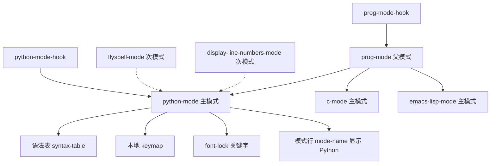
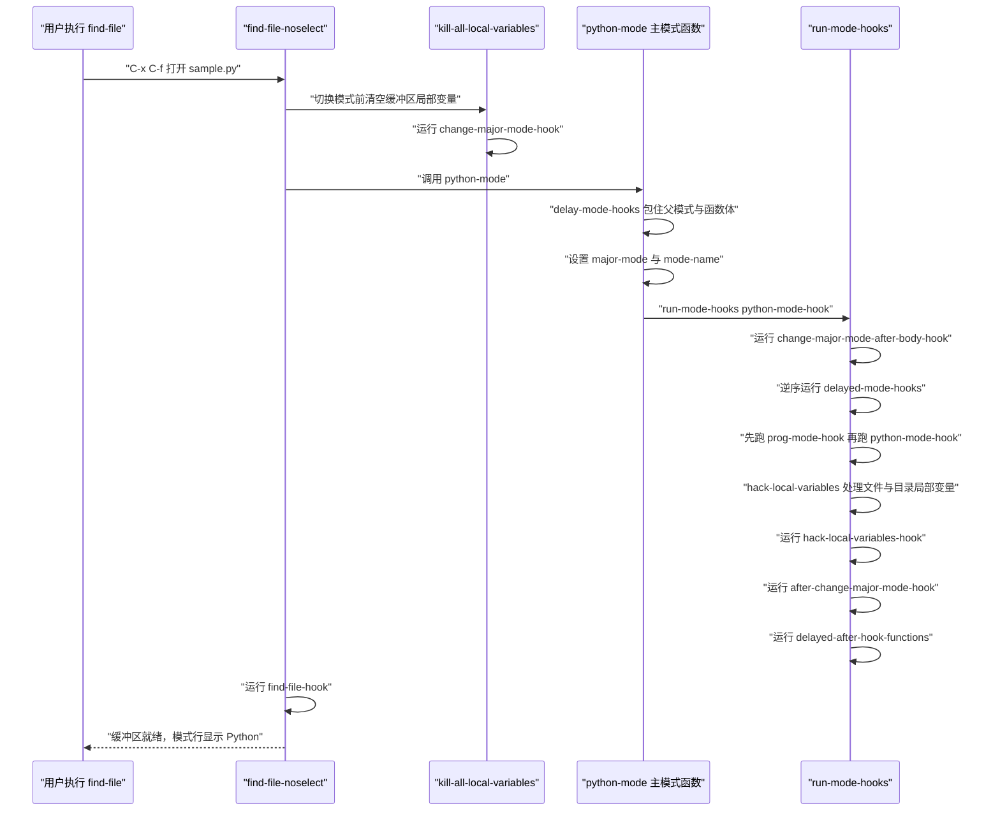

# Mode 与 Hook 机制

> 本篇解决三个具体问题：Emacs 如何决定一个缓冲区使用哪种编辑模式、模式在什么时刻被激活、以及你写的配置代码究竟应该挂在哪个钩子（hook）上。适合已经能写 Elisp 函数、准备把零散配置组织成模块的读者。

---

## 一、两种模式：major mode 与 minor mode

### 1.1 概念上的区别

Emacs 的「模式（mode）」不是界面皮肤，而是**一整套编辑规则的集合**：光标移动按什么语法单位跳、TAB 键怎么缩进、注释符号是什么、哪些词要高亮、哪些键绑定到哪些命令。模式分两类，它们的差别不是「重要程度」，而是「作用范围」：

- **主模式（major mode）**：一个缓冲区（buffer）在任一时刻只能有一个。它负责设置语法表（syntax table）、本地键位映射（keymap）、字体锁定（font-lock）关键字、缩进规则、注释语法。切换主模式会清空缓冲区局部变量（buffer-local variables），这是它最激烈的副作用。
- **次模式（minor mode）**：可以同时开启多个，可以随时开关，通常不改变语法表。它由一个缓冲区局部变量表示开关状态，用 `define-minor-mode` 定义。次模式的名字会出现在模式行上，除非你主动把它「减轻」。

术语上必须先厘清 Emacs 与常见编辑器用词不同的三个概念，因为它们在本篇里频繁出现：

- **缓冲区（buffer）** 是实际存放文本的对象，可以是文件的内容，也可以是一个临时构造的文本容器（例如 `*Messages*`、帮助缓冲区）。模式是**缓冲区**的属性，不是文件的属性：同一个文件可以同时被打开成两个缓冲区，各自处于不同模式。
- **窗口（window）** 是显示某个缓冲区的矩形区域，一个框架里可以分割出多个窗口，同一个缓冲区可以同时显示在多个窗口里。本篇第四节里的 `window-buffer-change-functions` 等钩子关心的是窗口，不是缓冲区。
- **框架（frame）** 是操作系统层面的一个顶层窗口（在 GUI 下就是你拖动的那种窗口，在终端下通常只有一个）。`window-setup-hook` 与首帧布局相关，其中的「帧」就是 frame。

| 对比项 | major mode | minor mode |
| --- | --- | --- |
| 同时生效数量 | 每个缓冲区恰好一个 | 任意多个 |
| 定义宏 | `define-derived-mode` | `define-minor-mode` |
| 是否设置语法表 | 通常设置 | 一般不设置 |
| 是否提供本地 keymap | 是，作为 `current-local-map` | 是，通过 `minor-mode-map-alist` 生效 |
| 切换时的副作用 | 运行 `kill-all-local-variables`，清空缓冲区局部状态 | 只改自己的开关变量 |
| 模式行显示 | 通过 `mode-name` 显示 | 通过 `minor-mode-alist` 中的条目显示 |
| 典型例子 | `prog-mode`、`text-mode`、`python-mode` | `flyspell-mode`、`display-line-numbers-mode`、`abbrev-mode` |

一个重要细节是**非递归性**：`prog-mode` 是编程类主模式的父模式，`python-mode` 从它派生，但 `(derived-mode-p 'prog-mode)` 在 Python 缓冲区里返回真，并不意味着缓冲区「同时处于两个主模式」——它只有一个主模式 `python-mode`，只是这个模式的父链上包含 `prog-mode`。用 `M-x` 调用 `prog-mode` 会真的把缓冲区切成 `prog-mode`，这不是「叠加」。

### 1.2 两者的共生关系

次模式与主模式通过三种方式协作：

1. **作用对象相同**：两者都在当前缓冲区内生效，都会读 `major-mode` 来调整行为。例如拼写检查的次模式只在文本类主模式下才有意义。
2. **键位优先级不同**：Emacs 查找键位的顺序是「覆盖式映射 → 次模式映射 → 缓冲区的本地映射（主模式 keymap）→ 全局映射」。因此次模式的绑定可以覆盖主模式的绑定，这也是为什么次模式适合做「临时改变某个键的含义」。
3. **挂载点相同**：配置代码通常既不在主模式函数里，也不在次模式函数里，而是挂在以它们名字命名的 hook 上。

下图给出三者的关系：主模式决定父链与语法规则，次模式叠加功能，hook 是把用户代码插入这个过程的唯一入口。



图中实线表示「派生 / 提供」，虚线表示「次模式叠加到当前缓冲区」。`prog-mode-hook` 挂在父模式上，因此所有派生模式的缓冲区都会经过它——这正是「一次配置、处处生效」的原理。

### 1.3 用 define-minor-mode 定义次模式

本篇主题是主模式与钩子，但次模式的写法必须顺带交代，否则两者容易混淆。`define-minor-mode` 会自动完成这些事：定义开关命令、定义（默认是缓冲区局部的）控制变量、把 `:lighter` 注册进 `minor-mode-alist`、执行函数体、最后运行 `MODE-hook`。

```elisp
;;; -*- lexical-binding: t; -*-

(defun my-highlight-todo-scan ()
  "扫描当前缓冲区，统计 TODO 的数量。"
  (interactive)
  (message "TODO 数量：%d"
           (how-many "\\<TODO\\>" (point-min) (point-max))))

(define-minor-mode my-highlight-todo-mode
  "把 TODO 标记高亮显示。"
  :lighter " TODO"                       ; 模式行上显示的内容
  :keymap (let ((map (make-sparse-keymap)))
            (define-key map (kbd "C-c t") #'my-highlight-todo-scan)
            map)
  ;; 函数体：开关状态切换之后、MODE-hook 之前执行
  (if my-highlight-todo-mode
      (font-lock-add-keywords nil '(("\\<TODO\\>" 0 'highlight)) 'append)
    (font-lock-remove-keywords nil '(("\\<TODO\\>" 0 'highlight)))
    (font-lock-flush)))
```

三个关键差异值得记住：主模式的函数体在「父模式之后、hook 之前」执行，次模式的函数体在「开关切换之后、hook 之前」执行；主模式切换会清空缓冲区局部变量，次模式只是改自己那个布尔变量；主模式用 `mode-name` 显示名字，次模式用 `:lighter`（反映到 `minor-mode-alist`）。

`define-minor-mode` 还支持 `:global`（做成全局次模式，控制变量不再是缓冲区局部）、`:init-value`（初始值）、`:variable`（把状态存到别处或自定义变量）、`:after-hook`（hook 跑完后的收尾表单）、`:interactive`（是否做成命令，用在特定主模式上时可写模式列表）。这些关键字的语义可以在 `C-h f define-minor-mode` 中逐一对照。

---

## 二、用 define-derived-mode 定义主模式

### 2.1 参数与关键字

`define-derived-mode` 的调用形式是：

```elisp
(define-derived-mode 子模式名 父模式名 "模式行名称"
  "文档字符串"
  :关键字 值 ...
  函数体表单...)
```

- **子模式名**：新命令的名字，惯例以 `-mode` 结尾，例如 `my-lang-mode`。
- **父模式名**：要继承的模式，写 `nil` 表示不继承（等价于从 `fundamental-mode` 开始）。宏的源码里有一句 `(when (eq parent 'fundamental-mode) (setq parent nil))`，也就是说把 `fundamental-mode` 写进去和写 `nil` 效果相同。
- **模式行名称**：会赋给变量 `mode-name` 的字符串，例如 `"MyLang"`。它直接显示在模式行上，所以保持短。
- **文档字符串**：可省略；省略时宏会自动生成一段包含 keymap 提示的文档。
- **关键字参数**：`:group`（关联自定义组，供 `customize-mode` 使用）、`:syntax-table`（指定语法表，`nil` 表示直接沿用父模式的）、`:abbrev-table`（同上）、`:after-hook`（在所有模式 hook 跑完之后再执行的单个表单）、`:interactive`（是否把新命令定义为交互式，默认是）。
- **函数体**：在父模式之后、模式 hook 之前执行，**不能**在里面写 `interactive`。

### 2.2 它自动替你完成的事

这是这个宏最有价值的部分。展开后它会：

1. 定义并初始化 `子模式名-hook` 这个变量，同时写入变量文档；所以 `M-x` 对应的 hook 一定存在，`add-hook` 不需要你先 `defvar`。
2. 定义 `子模式名-map` 键位映射（内部用 `defvar-keymap`），并在模式函数运行时用 `set-keymap-parent` 把父模式的 keymap 设为自己的父映射，从而继承父模式的全部绑定。
3. 定义 `子模式名-syntax-table`，并把它的字符表父级设为父模式当前的语法表。
4. 定义 `子模式名-abbrev-table`，把父模式的缩略表登记为 `:parents`。
5. 记录父子关系：Emacs 30.1 及以后使用 `(derived-mode-set-parent 子 父)`；更早的版本直接写符号属性 `derived-mode-parent`。**直接读写这个符号属性从 30.1 起被官方标记为不推荐**，公开接口是 `derived-mode-set-parent`、`derived-mode-add-parents`、`derived-mode-all-parents`。
6. 定义交互式命令 `子模式名`，函数体依次做：`delay-mode-hooks` 包住「调用父模式 → 设置 `major-mode` 与 `mode-name` → 安装 keymap、语法表、缩略表 → 执行你写的函数体」，然后调用 `run-mode-hooks` 跑 hook。
7. 从 30.1 起，`derived-mode-p` 的第一个参数改为「模式符号的列表」，旧的多参数写法仍被接受但已不推荐。

### 2.3 函数体与 hook 的先后顺序

理解顺序比记住语法更重要。`子模式名` 被调用时：

- 父模式先被完整执行一遍（包括父模式的 hook），所以父模式的设置已经就绪；
- 你的函数体在父模式之后运行，此时 `major-mode` 已经是子模式，`mode-name` 也已经改好；
- 函数体包在 `delay-mode-hooks` 里，因此这段时间内**不会**立刻运行 hook，而是把要跑的 hook 记到 `delayed-mode-hooks` 里推迟；
- 函数体结束后，`run-mode-hooks` 统一跑 `子模式名-hook`，此时你之前设置的缓冲区局部变量对 hook 函数全部可见。

结论：**函数体里放「这个模式必需的设置」，hook 里放「用户可覆盖的偏好」**。这也是为什么第三方包不应该把用户的配置项写死在函数体里——用户没有机会在它之后修改。

### 2.4 一个完整例子

```elisp
;;; -*- lexical-binding: t; -*-

(defgroup my-lang nil
  "MyLang 语言支持。"
  :group 'languages)

(defcustom my-lang-indent-offset 2
  "MyLang 的缩进宽度。"
  :type 'integer
  :group 'my-lang)

;; 从 prog-mode 派生：自动获得 prog-mode 的语法表、keymap 与 prog-mode-hook
(define-derived-mode my-lang-mode prog-mode "MyLang"
  "编辑 MyLang 源文件的主模式。"
  :group 'my-lang
  ;; 关键字 :syntax-table 省略时使用自动生成的 my-lang-mode-syntax-table
  (setq-local comment-start "//")      ; 行注释符号，供 newcomment 等使用
  (setq-local comment-end "")          ; 行注释没有结束符号
  (setq-local indent-line-function #'indent-relative) ; 简化的缩进策略
  (setq-local my-lang-indent-offset my-lang-indent-offset))

;; 只给这个模式用的键位，写在 keymap 上而不是 hook 里
(define-key my-lang-mode-map (kbd "C-c C-c") #'compile)

;; 用户偏好放在 hook 上，且用具名函数，便于 C-h v 查看与移除
(defun my-lang-setup ()
  "MyLang 缓冲区里用户级的显示偏好。"
  (setq-local show-trailing-whitespace t))
(add-hook 'my-lang-mode-hook #'my-lang-setup)
```

注意 `my-lang-mode-map` 在 `define-derived-mode` 之后就存在，无需先 `defvar`；而 `my-lang-mode-hook` 同理。

---

## 三、hook 机制

### 3.1 normal hook 与 abnormal hook

**普通钩子（normal hook）** 的值是一个函数列表，每个函数被调用时不接收任何参数。绝大多数 `*-mode-hook`、`before-save-hook` 都属于这一类。

**异常钩子（abnormal hook）** 的函数需要接收参数，因此不能直接用 `run-hooks` 来跑，而要用 `run-hook-with-args`、`run-hook-with-args-until-success`、`run-hook-with-args-until-failure` 这些运行器。判断一个 hook 是普通还是异常，最可靠的办法是 `C-h v 钩子名` 看文档里有没有写「The value should be a list of functions that take one argument」之类的说明。

几个真实的异常钩子及参数个数（可用 `emacs -Q --batch` 亲自验证）：

| 钩子 | 参数 | 说明 |
| --- | --- | --- |
| `before-change-functions` | 2 个：起始、结束位置 | 文本修改**之前**调用 |
| `after-change-functions` | 3 个：起始、结束、被替换文本的旧长度 | 文本修改**之后**调用 |
| `write-file-functions` | 0 个，但**返回值有意义** | 任一函数返回非 `nil` 表示文件已写好，后续函数与默认写盘都被跳过 |
| `window-buffer-change-functions` | 1 个：窗口或框架（`frame`） | 重绘期间窗口中显示的缓冲区发生变化时调用 |

`before-change-functions` 与 `after-change-functions` 还有两个必须知道的陷阱。第一，在这两个钩子执行期间修改缓冲区，不会再次触发它们，因为 Emacs 会把 `inhibit-modification-hooks` 临时设为非 `nil`。第二，如果钩子函数抛出未处理的错误，Emacs 会把**整个钩子变量的值设为 `nil`**，以免错误反复发生导致编辑器不可用——症状是「第一次报错之后钩子就再也不工作了」，这往往不是你的代码被删了，而是它被自动清空了。

`write-file-functions` 属于「返回值即协议」的钩子，它接收不到参数，靠返回非 `nil` 来表达「我已经写完了」。`before-save-hook` 与它相反：那是一个普通钩子，只用来做保存前的检查与更新（例如 `time-stamp`），不影响是否写盘。

### 3.2 add-hook 与 remove-hook

```elisp
(add-hook 'python-mode-hook #'my-python-setup)      ; 追加到全局值
(add-hook 'prog-mode-hook #'my-prog-config 10)      ; 指定顺序，10 表示靠后
(remove-hook 'prog-mode-hook #'my-prog-config)      ; 精确移除
```

关键行为：

- `add-hook` 会自动创建未绑定的 hook 变量，因此不需要预先 `defvar`；`define-derived-mode` 生成的 hook 变量文档里也明确写着「变量未绑定不会出问题，`add-hook` 会自动绑定它」。
- 要添加的函数如果已经在列表里，则不会重复添加。判断使用 `equal`，所以传符号最稳妥。
- `remove-hook` 的第三个参数 `LOCAL` 为真时只从缓冲区局部值中移除。

### 3.3 DEPTH 参数与执行顺序

`add-hook` 的第三个参数是 `DEPTH`（顺序权重），默认 0，约定取值范围 -100 到 100：100 表示排到最后，-100 表示排到最前。两个函数 depth 相同时，新加入的函数在 depth **严格大于 0** 时排在旧的之后，否则排在旧的之前。`add-hook` 的文档还特意提醒：既然没有什么是「永远」的，就不要用 100 和 -100。

这里有一个流传很广的错误认识需要纠正：`DEPTH` 参数**不是** Emacs 29 新增的。查 Emacs 27 的 `etc/NEWS` 可以读到原文——「`add-hook` 不再总是加在最前或最后」，因为 `append` 参数被 `depth` 取代；在 Emacs 27 的 `subr.el` 里 `add-hook` 的函数签名已经是 `(hook function &optional depth local)`。真正属于 29 的新特性是 `major-mode-remap-alist`（见第六节）。

正因为第三个参数从 `append` 变成了 `depth`，历史写法 `(add-hook 'some-hook #'some-function t)` 的含义已经变了：在 27 之前，第三参数为真表示「缓冲区局部」；现在非 `nil` 的符号会被解释成 `DEPTH` 为 90，函数被加到**全局值**末尾。实测如下：

```elisp
;; 实测环境：GNU Emacs（30 与 31 行为一致）
(defvar my-hook nil)
(defun my-fn () nil)

(with-temp-buffer
  ;; 旧代码的写法：第三个参数本想表达 LOCAL
  (add-hook 'my-hook #'my-fn t)
  ;; 结果：函数进了全局值，缓冲区局部值并未建立
  (list (default-value 'my-hook)      ; => (my-fn)
        (local-variable-p 'my-hook))) ; => nil

(with-temp-buffer
  ;; 现在的正确写法：先 DEPTH 后 LOCAL
  (add-hook 'my-hook #'my-fn 90 t)
  (local-variable-p 'my-hook))        ; => t
```

如果你要维护兼容 27 之前的老代码，必须改写这些调用；如果是新写代码，记住顺序是「函数、顺序、局部」。

### 3.4 缓冲区局部值中的 t：最容易踩的坑

hook 变量可以同时有全局值和缓冲区局部值。规则是：

- 缓冲区局部值是函数列表时，`run-hooks` **只**运行这个列表，全局值被完全忽略；
- 缓冲区局部值里包含符号 `t` 时，`t` 是一个开关，表示「运行完局部值后，把全局值也运行一遍」；
- 用 `add-hook` 并传 `LOCAL` 为非 `nil` 时，Emacs 会自动往缓冲区局部值里放入 `t`，所以「加局部函数」不会意外屏蔽全局配置；
- 反过来，如果你用 `setq-local` 或 `make-local-variable` 手工设置局部值，又没有放 `t`，全局配置就会被静默屏蔽。

`run-hooks` 的文档里有一句明确的禁令：不要用 `make-local-variable` 把 hook 变量变成缓冲区局部的，要用 `add-hook` 并传 `LOCAL`。理由是前者不会替你放入 `t`。

三种情况的实际效果：

```elisp
(defvar demo-hook nil)
(defun demo-global () (message "global"))

(with-temp-buffer
  ;; 情形一：带 t 的局部值（add-hook 的 LOCAL 参数就是这样做的）
  (add-hook 'demo-hook #'demo-global)
  (add-hook 'demo-hook (lambda () (message "local")) nil t)
  (buffer-local-value 'demo-hook (current-buffer))  ; => ((lambda ...) t)
  (run-hooks 'demo-hook))                           ; 局部函数与全局函数都运行

(with-temp-buffer
  ;; 情形二：不含 t 的局部值，全局函数被屏蔽
  (setq-local demo-hook (list (lambda () (message "only-local"))))
  (run-hooks 'demo-hook))                           ; 只有局部函数运行
```

排查这类问题的第一步永远是 `C-h v 钩子名`：帮助缓冲区会分别列出「缓冲区局部值」与「全局值」，看局部值里有没有 `t` 就能立刻定位。

### 3.5 run-hooks 与 run-mode-hooks

主模式函数**必须**用 `run-mode-hooks` 来跑自己的 `foo-mode-hook`，而不是 `run-hooks`。原因是 `run-mode-hooks` 额外处理了延迟机制与局部变量：

- 若变量 `delay-mode-hooks` 为真，它什么都不运行，只是把要跑的 hook 追加到 `delayed-mode-hooks` 列表里；
- 否则按固定顺序执行：`change-major-mode-after-body-hook` → `delayed-mode-hooks`（逆序）→ 你传入的各个 hook → （若缓冲区正在访问文件）`hack-local-variables` → `after-change-major-mode-hook` → `delayed-after-hook-functions` 里的函数。

`delayed-after-hook-functions` 是 `define-derived-mode` 的 `:after-hook` 关键字使用的内部列表，它保证 `:after-hook` 的表单在所有 hook 之后运行。

`delay-mode-hooks` 的实际用途是「父模式不要现在就跑 hook，等我准备完毕再一起跑」。这解释了为什么从 `text-mode` 派生的模式不会先跑一遍 `text-mode-hook` 再跑自己的 hook——它确实会跑，只是被推迟到统一时刻（顺序上父 hook 仍在前）。

| 对比项 | `run-hooks` | `run-mode-hooks` |
| --- | --- | --- |
| 是否响应 `delay-mode-hooks` | 否 | 是，会记录到 `delayed-mode-hooks` |
| 是否运行 `change-major-mode-after-body-hook` | 否 | 是 |
| 是否运行 `hack-local-variables` | 否 | 是（缓冲区访问文件时） |
| 是否运行 `after-change-major-mode-hook` | 否 | 是 |
| 适用场景 | 普通钩子 | 主模式的 `foo-mode-hook` |

### 3.6 模式切换时的真实执行时机

以下轨迹是在 `emacs -Q --batch` 中打开一个 `.py` 文件、给相关钩子都挂上「打印自己名字」的函数后得到的实际顺序，去掉了缓冲区创建阶段的一次 `fundamental-mode` 循环：

```text
change-major-mode-hook               major-mode=fundamental-mode
change-major-mode-after-body-hook    major-mode=python-mode
prog-mode-hook                       major-mode=python-mode
python-mode-hook                     major-mode=python-mode
hack-local-variables-hook            major-mode=python-mode
after-change-major-mode-hook         major-mode=python-mode
find-file-hook                       major-mode=python-mode
```

几个可以直接从轨迹里读出的结论：

- `change-major-mode-hook` 运行得最早，此时新主模式还没生效；它的作用是「在清空缓冲区局部变量之前做清理」（`kill-all-local-variables` 会先运行它）。实测中它打印的 `major-mode` 还是旧值。
- `change-major-mode-after-body-hook` 运行时 `major-mode` 已经是新值，但模式自己的 hook 还没跑。
- 父模式的 hook 先于子模式的 hook：`prog-mode-hook` 在 `python-mode-hook` 之前。
- `hack-local-variables-hook` 在模式 hook 之后、`after-change-major-mode-hook` 之前运行，此时文件局部变量与目录局部变量都已生效。
- `find-file-hook` 是最后一个，文档里明确写着「文件局部变量（含目录局部变量）已处理完毕」。



这张图里最容易配错的挂载点是 `python-mode-hook` 与 `find-file-hook` 的顺序：如果你的代码需要读文件内容，挂在 `find-file-hook` 更安全；如果只需要按主模式设置变量，`python-mode-hook` 就够。

### 3.7 hook 值的形态与缓冲区局部的生命周期

hook 变量的值允许三种形态，运行器会自行处理：

- `nil`：什么都不做。一个从未被使用过的 hook 变量就是这种状态，`add-hook` 遇到未绑定的变量会自动把它设为 `nil` 再追加。
- **单个函数**（符号、lambda 或闭包）：直接调用它一次。这是 `add-hook` 之前手工 `setq` 常见的结果，`add-hook` 会自动把它规范化成列表。
- **函数列表**：按顺序逐个调用。

理解这一点在排查「为什么钩子里的东西只跑了一次」时很有用：如果某个包用 `(setq some-hook #'my-fn)` 覆盖了钩子值，后续的 `add-hook` 会把它转成列表，原先通过其他途径加入的函数则已经消失了。

另一个与模式切换强相关的问题是**缓冲区局部 hook 值的生命周期**。切换主模式时会调用 `kill-all-local-variables`，它清空当前缓冲区的局部绑定，因此用 `add-hook ... LOCAL` 建立的局部 hook 值默认也会一起消失——这通常是期望行为，因为你不想让 A 语言的设置残留在 B 语言缓冲区里。但有两种情况需要保留：

```elisp
;; 一、给变量加 permanent-local 属性：该变量的缓冲区局部值在模式切换后保留
(defvar my-buffer-context nil)
(put 'my-buffer-context 'permanent-local t)

;; 二、给「函数」加 permanent-local-hook 属性：
;;     通过 add-hook 加入该函数时，对应的 hook 变量会被标记为部分永久局部，
;;     模式切换后这些函数仍留在缓冲区局部值里
(defun my-persistent-hook-fn () nil)
(put 'my-persistent-hook-fn 'permanent-local-hook t)
```

第一种写法是给变量本身打标记，值会被完整保留；第二种是 `add-hook` 内部实现的一个约定：若被加入的函数带有 `permanent-local-hook` 属性，且 hook 变量本身没有 `permanent-local` 属性，则把 hook 变量标记为 `permanent-local-hook`，从而让这部分局部值穿过模式切换。**只有确实需要跨模式保留状态时才用它**，滥用会让「切模式后残留旧配置」成为难以定位的 bug。

---

## 四、常用 hook 全表

下表按用途分类，只列出确实存在的钩子。「何时运行」一列描述的是触发条件，「典型用途」给的是实践中真正会写的场景。

| 钩子 | 类别 | 何时运行 | 典型用途 |
| --- | --- | --- | --- |
| `before-init-hook` | 启动 | `init.el` 之前、命令行参数处理完 | 极少用；需要在读配置前改 `load-path` 级设置时 |
| `after-init-hook` | 启动 | `init.el` 全部执行完之后 | 启动后统计耗时、延迟加载重型包 |
| `emacs-startup-hook` | 启动 | 与 `after-init-hook` 几乎同时，仅在正常启动流程中 | 启动完成后的收尾动作 |
| `window-setup-hook` | 启动 | 首个框架的窗口布局建立之后 | 调整首帧窗口分割、开启全屏 |
| `tty-setup-hook` | 启动 | 终端框架初始化后 | 终端下的配色与鼠标设置 |
| `term-setup-hook` | 启动 | 终端相关初始化完成 | 兼容旧配置，新代码一般不需要 |
| `kill-emacs-hook` | 启动 | 退出 Emacs 时 | 保存会话、清理临时文件 |
| `find-file-hook` | 文件 | 文件读入缓冲区、局部变量处理后 | 按内容做后处理、记录最近访问 |
| `find-file-not-found-functions` | 文件 | 访问的文件不存在时 | 自动创建空文件或提示 |
| `before-save-hook` | 文件 | 保存到磁盘之前 | 自动格式化、更新时间戳、清理行尾空白 |
| `after-save-hook` | 文件 | 保存成功之后 | 触发外部构建、刷新缓存 |
| `write-file-functions` | 文件 | 写盘流程中，返回值决定是否继续 | 自定义写盘方式（加密、加壳） |
| `first-change-hook` | 文件 | 缓冲区**第一次**被修改时 | 记录「文件已被改动」的状态 |
| `kill-buffer-hook` | 缓冲区 | 缓冲区被杀死时 | 清理该缓冲区相关的外部资源 |
| `before-change-functions` | 编辑 | 每次文本修改之前（异常钩子，2 个参数） | 精确跟踪编辑范围，做增量分析 |
| `after-change-functions` | 编辑 | 每次文本修改之后（异常钩子，3 个参数） | 增量语法高亮、实时检查 |
| `post-self-insert-hook` | 编辑 | `self-insert-command` 插入字符之后 | 自动配对括号、输入法联动 |
| `post-command-hook` | 编辑 | 每条命令执行之后 | 轻量的状态刷新（成本必须极低） |
| `pre-command-hook` | 编辑 | 每条命令执行之前 | 记录命令前的状态以便对比 |
| `change-major-mode-hook` | 模式 | 切换主模式、清空局部变量之前 | 保存即将被清掉的缓冲区局部状态 |
| `change-major-mode-after-body-hook` | 模式 | 主模式函数体内、模式 hook 之前 | 需要在新模式下、用户配置之前做统一处理 |
| `after-change-major-mode-hook` | 模式 | 主模式函数的最后 | 依赖「模式已完全就绪」的统一处理 |
| `hack-local-variables-hook` | 模式 | 文件与目录局部变量处理完之后 | 根据局部变量推导其他设置 |
| `prog-mode-hook` | 模式 | 任何从 `prog-mode` 派生的主模式 | 所有编程语言共用的编辑环境 |
| `text-mode-hook` | 模式 | 任何从 `text-mode` 派生的主模式 | 所有文本类模式的共同设置 |
| `window-buffer-change-functions` | 界面 | 重绘时窗口中显示的缓冲区变化（异常钩子，1 个参数） | 按窗口切换做延迟加载 |
| `window-size-change-functions` | 界面 | 重绘时窗口尺寸变化（异常钩子，1 个参数） | 尺寸变化时重算布局 |
| `window-selection-change-functions` | 界面 | 选中窗口变化（异常钩子，1 个参数） | 跟随焦点更新侧栏 |
| `window-state-change-functions` | 界面 | 窗口状态变化（异常钩子，1 个参数） | 综合的窗口状态响应 |
| `minibuffer-setup-hook` | 界面 | 进入 minibuffer 时 | 给补全框架设置局部键位 |
| `minibuffer-exit-hook` | 界面 | 退出 minibuffer 时 | 清理 minibuffer 内的临时状态 |
| `echo-area-clear-hook` | 界面 | 回显区内容被清空时 | 清掉自己显示的提示 |

有两类「看起来像 hook 但不是」的东西需要点明：

- **没有 `early-init-hook`。** 实测 `(boundp 'early-init-hook)` 返回 `nil`。早期初始化阶段只能靠在 `~/.emacs.d/early-init.el`（或 `~/.config/emacs/early-init.el`）文件里直接写代码来实现，那个文件本身在包系统与界面初始化之前被读取，没有对应的钩子变量。
- **没有 `message-hook`。** `message` 是函数而不是钩子变量，Emacs 不提供「消息显示时」的钩子。想拦截或改写消息，标准做法是用 advice 包装 `message` 函数（见 [[emacs教程/2Elisp语言/10_包与命名空间实践|包与命名空间实践]]），或者把内容写进 `*Messages*` 缓冲区后借 `messages-buffer-mode-hook` 做处理。

---

## 五、hook 的正确用法

### 5.1 为什么必须用具名函数而不是 lambda

三种写法在功能上等价，但只有第一种是可持续的：

```elisp
;; 推荐：具名函数
(defun my-prog-config ()
  "编程模式共用的编辑环境设置。"
  (setq-local indent-tabs-mode nil)
  (display-line-numbers-mode 1))
(add-hook 'prog-mode-hook #'my-prog-config)

;; 不推荐：匿名函数
(add-hook 'prog-mode-hook (lambda () (setq-local indent-tabs-mode nil)))
```

三个具体理由：

1. **可以精确移除与检查。** `(remove-hook 'prog-mode-hook #'my-prog-config)` 一句就撤销；用 `C-h v prog-mode-hook` 看到的是一个能读出名字的符号。lambda 在帮助缓冲区里显示成一堆 `(closure ...)` 或 `(lambda ...)`，无法辨认谁是谁，重复求值配置时也无法可靠地 `remove-hook`。
2. **修改后不会重复添加。** `add-hook` 用 `equal` 判断函数是否已存在。你把 lambda 的内容改一个字符再求值一次，新 lambda 与旧的就不相等，于是同一个钩子里出现两个几乎一样的函数。`add-hook` 的文档明确建议传函数符号而不是 lambda 形式，理由正是「用符号能保证函数被编辑后不会被重复添加」。
3. **有性能与检查上的好处。** 文档同时指出，使用 lambda 形式在运行 `add-hook` 和 `remove-hook` 时可能有负面性能影响（因为要逐项做结构比较）。具名函数还能被字节编译器单独检查、被 `C-h f` 查到、被 `M-x debug-on-entry` 断点调试，而匿名函数这些都做不到。

### 5.2 配合 use-package 的 :hook 写法

`use-package` 从 Emacs 29 起随 Emacs 一起发布（无需额外安装；如果你用的是 28 及更早版本，需要用 `M-x package-install RET use-package RET`）。它的 `:hook` 关键字会展开成 `add-hook` 调用，并自动为相关包设置延迟加载。

```elisp
(use-package python
  :hook (python-mode . my-python-setup))

;; 挂到多个模式：写成列表
(use-package my-utils
  :hook ((python-mode c-mode) . my-prog-config))

;; 不写函数时，默认使用「包名-mode」对应的设置函数名规则
(use-package flyspell
  :hook (text-mode . flyspell-mode))
```

`:hook` 接受的参数形式是「一个符号」或「（符号或符号列表 . 符号或函数）」，也可以是这些形式的列表。当被挂载的符号不是以 `-mode` 结尾时，`use-package` 会按 `use-package-hook-name-suffix`（默认为 `"-hook"`）补全钩子名；若该符号本身已经是绑定好的变量则不补。相关的还有 `:mode`（写入 `auto-mode-alist`）、`:magic`（写入 `magic-mode-alist`）、`:interpreter`（写入 `interpreter-mode-alist`）、`:commands`（为命令建立 autoload），它们与 `:hook` 一样都会触发延迟加载。

### 5.3 挂载点怎么选

写配置时最常见的问题不是语法，而是「这段代码该挂哪儿」。可以按下面的顺序自问：

| 你的需求 | 应该挂在哪里 | 原因 |
| --- | --- | --- |
| 所有编程语言共用的编辑环境 | `prog-mode-hook` | 覆盖全部派生模式，新增语言自动生效 |
| 某一语言特有的设置 | 该语言的 `<lang>-mode-hook` | 只影响这一种缓冲区 |
| 需要读取文件内容后才能决定 | `find-file-hook` | 此时内容与局部变量都已就绪 |
| 针对特定项目而非个人偏好 | 项目的 `.dir-locals.el` | 随项目版本控制走，对协作者可见 |
| 每次保存前都要做 | `before-save-hook` | 与写盘流程绑定，不用自己判断时机 |
| 需要改变写盘本身的行为 | `write-file-functions` | 它可以用返回值取消默认写盘 |
| 依赖某个次模式已经开启 | 该次模式对应的 hook 或它的模式变量 | 顺序上更靠后，状态确定 |
| 全局性的、与缓冲区无关 | `after-init-hook` | 一次性执行，不随缓冲区变化 |

一个经常被误用的挂载点是 `post-command-hook`：它每条命令之后都会运行，把它当成「随时刷新」的万能入口会明显拖慢编辑。确实需要时，至少要做到内部有早退条件（比如比较一个新值与缓存值，相同就立刻返回）。

---

## 六、模式是怎样被自动选中的

### 6.1 set-auto-mode 的查找顺序

打开文件时决定主模式的是 `set-auto-mode`。它的文档字符串给出了权威的查找顺序，这个顺序与直觉并不完全一致：

1. 文件第一行的 `-*- mode: xxx -*-` 标记；
2. 文件末尾 Local Variables 块中的 `mode:` 条目；
3. `.dir-locals.el` 中针对 `auto-mode-alist` 的条目；
4. 第一行的解释器（interpreter），对照 `interpreter-mode-alist`；
5. 缓冲区开头若干字符，对照 `magic-mode-alist`；
6. 文件名，对照 `auto-mode-alist`；
7. 缓冲区开头若干字符，对照 `magic-fallback-mode-alist`。

最后，所有结果都会再经过 `major-mode-remap-alist` 与 `major-mode-remap-defaults` 的重映射。

注意第 5 步与第 7 步的区别：`magic-mode-alist` 优先级高于文件名匹配，而 `magic-fallback-mode-alist` 是兜底。实测在 `emacs -Q` 下 `magic-mode-alist` 默认为 `nil`，内容嗅探实际上靠 `magic-fallback-mode-alist`（它内置了 HTML、XML、PostScript、压缩包等条目）。想按「文件内容」抢先决定模式，应该往 `magic-mode-alist` 里加规则。

```elisp
;; 内容以 #!/usr/bin/env 之外的自定义标记开头时，用我的模式
(add-to-list 'magic-mode-alist
             '(";;; my-lang-file" . my-lang-mode))
```

### 6.2 auto-mode-alist 与 .h 的歧义

`auto-mode-alist` 的元素是 `(正则 . 模式)`。匹配对象是**完整的文件路径**（去掉了版本号后缀与远程前缀），不是仅文件名，因此正则既能命中目录名也能命中文件名。这就是所有条目都以 `\\'`（字符串结尾）锚定的原因：如果写成 `"\\.py"`，`/home/me/py/notes.txt` 这类路径也会被误匹配。

```elisp
;; 正确：锚定结尾，只匹配 .py 结尾的路径
(add-to-list 'auto-mode-alist '("\\.py\\'" . python-mode))
;; 也常用 \\` 锚定开头，或同时用两端锚定做更严格的限制
```

`.h` 文件是经典的歧义案例，Emacs 内置的解决方案很值得学习：cc-mode 用一条 autoload 形式的注册把 `.h` 交给 `c-or-c++-mode`：

```elisp
;;;###autoload (add-to-list 'auto-mode-alist '("\\.h\\'" . c-or-c++-mode))
```

`c-or-c++-mode` 会读文件内容（内部用正则 `c-or-c++-mode--regexp` 寻找 C++ 特征）来判断这是 C 还是 C++ 头文件，再转到 `c-mode` 或 `c++-mode`。这一行为自 Emacs 26.1 起生效。如果你希望 `.h` 一律当作 C，用下面的写法覆盖：`add-to-list` 默认把元素加到列表**开头**，而 `auto-mode-alist` 取第一个匹配项，所以你的规则会生效。

```elisp
;; 覆盖内置规则：让所有 .h 都进 c-mode
(add-to-list 'auto-mode-alist '("\\.h\\'" . c-mode))
```

### 6.3 interpreter-mode-alist 与重映射

`interpreter-mode-alist` 把 `#!` 行里的解释器名映射到模式，键是匹配解释器文件名的正则。实测默认值里包括 `("python[0-9.]*" . python-mode)`、`("jruby" . ruby-mode)` 等。这类条目的好处是脚本即使没有扩展名也能得到正确模式。

`major-mode-remap-alist` 是 Emacs 29.1 引入的用户选项，用来把某个模式重映射到另一个模式，而不用 `defalias`（后者的副作用是会污染函数定义与文档）：

```elisp
;; Emacs 29 起可用：让 .py 文件直接进入 tree-sitter 版本的模式
(add-to-list 'major-mode-remap-alist '(python-mode . python-ts-mode))

;; 反向用法：显式声明「不要重映射」，阻止 Emacs 30 的自动重映射
(add-to-list 'major-mode-remap-alist '(c-mode))
```

Emacs 30 在此基础上增加了两件事，升级时要留意：

- 新变量 `major-mode-remap-defaults` 与函数 `major-mode-remap`。前者供 Lisp 包声明默认重映射，后者用于查询；用户配置应当写 `major-mode-remap-alist`，因为它优先于包声明。
- **加载一个 tree-sitter 模式会默认把对应的非 tree-sitter 模式重映射过去**。也就是说，`(require 'python-ts-mode)` 之后，原本会打开 `python-mode` 的文件被自动改成打开 `python-ts-mode`。要阻止这一点，就在 `major-mode-remap-alist` 里把模式映射到它自己。

### 6.4 文件局部变量与目录局部变量

文件第一行或末尾的局部变量块可以指定模式与变量：

```text
-*- mode: my-lang; my-lang-indent-offset: 4 -*-
```

末尾的 Local Variables 块形式更规整，适合放多个变量：

```text
;; Local Variables:
;; mode: my-lang
;; my-lang-indent-offset: 4
;; End:
```

目录级配置放在项目根目录的 `.dir-locals.el` 里，用 `nil` 表示「对所有主模式生效」：

```elisp
;; ~/work/some-project/.dir-locals.el
((nil . ((fill-column . 100)          ; 任何模式都生效
         (eval . (setq-local my-project-root default-directory))))
 (python-mode . ((indent-tabs-mode . nil)))  ; 仅 Python 缓冲区
 (prog-mode . ((tab-width . 4))))            ; 所有编程模式
```

实测行为（`emacs -Q --batch`，在子目录里打开文件）确认：`nil` 通配条目与对应主模式的条目都会应用，且产生的是缓冲区局部绑定。

安全性部分必须强调：`enable-local-variables` 控制是否接受文件与目录中的局部变量，取值 `t`（默认，安全值直接应用、不安全值询问一次）、`:safe`（只应用安全值、其余忽略）、`:all`（全部应用，官方文档明确说「不要永久设为 `:all`」）、`nil`（完全忽略）。目录局部变量里的 `eval` 形式可以执行任意代码，因此**打开来源不明的项目时不要直接回答「是」**。Emacs 会把用户确认过的安全值记录下来，供下次自动应用。

### 6.5 normal-mode 与 revert-buffer

- `M-x normal-mode`：重新执行「选模式 + 应用文件与目录局部变量」的完整流程，相当于把 `find-file` 里的模式决策再做一遍。文档特别说明：交互式调用时它**忽略** `enable-local-variables`，一律照做，因为它被当作「用户明确要求」。
- `M-x revert-buffer`：从磁盘重新读入文件内容，但它**不会**重新挑选主模式，也不会重跑 `find-file-hook`；已经建立的模式保持不变。

实践中常见的困惑是「我改了 `.dir-locals.el` 但不生效」：改完 `.dir-locals.el` 之后需要对该目录下已打开的缓冲区执行一次 `M-x normal-mode`（或重新打开文件），因为目录局部变量只在模式切换流程中被读取。而「改了文件内容里第一行的 `-*- mode -*-`」则需要 `M-x normal-mode` 而不是 `revert-buffer`，原因就是上面那条差异。

---

## 七、模式行：mode-name、lighter 与 (:eval ...)

模式行的外观由变量 `mode-line-format` 决定。它的值是一个列表，元素可以是字符串、`%` 构造（如 `%b` 缓冲区名、`%l` 行号）、符号（该符号的值被递归展开）、结构为 `(:eval 表单)` 的动态元素，或者 `(:propertize 文本 属性...)`。实测的默认值大致是：

```elisp
;; 默认 mode-line-format 的主要组成（实际输出为完整列表）
("%e" mode-line-front-space mode-line-mule-info mode-line-client
 mode-line-modified mode-line-remote mode-line-window-dedicated
 mode-line-frame-identification mode-line-buffer-identification
 "   " mode-line-position
 (project-mode-line project-mode-line-format)
 (vc-mode vc-mode) "  " mode-line-modes mode-line-misc-info
 mode-line-end-spaces)
```

其中：

- `mode-name` 是**缓冲区局部**变量，值是主模式的名字字符串，由 `define-derived-mode` 的第三个参数设置。想换一个更短的显示名，在模式 hook 里 `(setq mode-name "Xy")` 即可，这是对主模式的正确做法。
- 次模式在模式行上的名字来自变量 `minor-mode-alist`，它的每个元素形如 `(模式变量 显示片段)`。所谓「lighter」就是那个显示片段，通常以空格开头以便与前面的内容分隔。
- `(:eval 表单)` 在**每次重绘**时求值。把复杂计算或文件 I/O 放进去会让整个界面变卡，包括光标移动与滚动。需要动态内容时，优先用 `post-command-hook` 把结果缓存进一个缓冲区局部变量，让 `(:eval ...)` 只做读变量的动作，并且不要在其中调用 `message` 之类的函数，否则会触发递归重绘。

要减少模式行噪音，两个 GNU ELPA 包最常用（均可用 `M-x package-install` 安装）：

```elisp
;; diminish：把次模式在模式行上的名字改短或隐藏
(require 'diminish)
(diminish 'abbrev-mode "Abv")   ; 显示为 Abv
(diminish 'auto-fill-function)  ; 完全隐藏
;; 主模式的名字改成用模式 hook 里的 setq mode-name，而不是 diminish

;; delight：同样效果，同时支持主模式
(require 'delight)
(delight 'abbrev-mode " Abv" "abbrev")   ; 第三参数是定义该模式的库名
(delight 'emacs-lisp-mode "Elisp" :major) ; 关键字 :major 表示主模式
```

在 `use-package` 里可以写 `:diminish abbrev-mode` 与 `:delight (abbrev-mode " Abv" "abbrev")`，但这两个关键字只有在相应包已安装时才有意义（`use-package` 的文档写作「Support for diminish.el (if installed)」）。

---

## 八、实战：用 prog-mode-hook 统一配置所有编程模式

目标：让所有编程语言共享同一套编辑环境（显示行号、用空格缩进、统一缩进宽度、标出多余空白），而每种语言只保留自己的特有设置。

```elisp
;;; -*- lexical-binding: t; -*-

(defcustom my-prog-tab-width 4
  "所有编程模式使用的缩进宽度。"
  :type 'integer
  :group 'editing)

(defun my-prog-config ()
  "所有编程模式共用的编辑环境设置。"
  ;; 缩进：用空格而不是制表符，宽度统一
  (setq-local indent-tabs-mode nil)
  (setq-local tab-width my-prog-tab-width)
  ;; 显示：行号、超长行提示
  (display-line-numbers-mode 1)
  (setq-local display-fill-column-indicator-column 100)
  (display-fill-column-indicator-mode 1)
  ;; 可见性：行尾空白可视化
  (setq-local show-trailing-whitespace t))

;; 一次挂载，覆盖 python-mode、c-mode、emacs-lisp-mode 等所有派生自 prog-mode 的模式
(add-hook 'prog-mode-hook #'my-prog-config 20)

;; 语言特有设置只写自己的 hook，不重复公共部分
(defun my-python-config ()
  "Python 缓冲区特有设置。"
  (setq-local python-indent-offset 4))
(add-hook 'python-mode-hook #'my-python-config)
```

为什么这比逐语言重复配置好，理由有四条：

1. **覆盖范围自动扩大。** 只要你安装的新语言模式是标准写法（从 `prog-mode` 派生），它立刻获得全部公共设置，不需要你再改配置文件。这是父模式机制的直接红利。
2. **一处修改，处处生效。** 想改成缩进 2 格，只改 `my-prog-tab-width`；逐语言写法则要改十几处，并且极易漏掉某一处。
3. **差异清晰。** 每个语言的 hook 里只剩「这个语言特有的东西」，阅读配置时一眼能看出语言之间的差异，而不是在重复代码里找不同。
4. **顺序可控。** `add-hook` 的 depth 让「公共设置先于语言特有设置」成为显式约定（这里用 20），而不是依赖加载顺序这种偶然因素。

需要提醒的是，`prog-mode-hook` 里不宜做重活。它在每次进入编程模式时运行，如果里面启动语法检查服务或读取大型文件，打开文件就会有明显延迟。这类工作更适合放在 `find-file-hook`（可以拿到文件内容）或使用延迟机制（如空闲定时器）。

---

## 九、按条件启用

不是所有缓冲区都该套用同一套配置。两个常用的判断维度：

```elisp
;; 维度一：按当前主模式（含派生关系）判断
(defun my-prog-config ()
  "编程模式共用的设置，但对特定语言例外。"
  (setq-local indent-tabs-mode nil)
  (unless (derived-mode-p 'makefile-mode)  ; Makefile 必须用真 TAB
    (setq-local tab-width 4)))

;; 维度二：按文件所在项目路径判断
(defun my-work-project-p ()
  "当前缓冲区是否属于工作项目。"
  (and buffer-file-name
       (file-in-directory-p buffer-file-name (expand-file-name "~/work/"))))

(defun my-prog-config-conditional ()
  "只在特定项目里启用公司内部规范。"
  (when (my-work-project-p)
    (setq-local fill-column 100)
    (display-fill-column-indicator-mode 1)))
```

除了 `file-in-directory-p`，`locate-dominating-file` 也很实用：它从某个目录向上逐级查找指定名字的文件，用来实现「只要这一层或任意上层存在 `.git` 就认为是项目根」。

```elisp
(defun my-project-root ()
  "返回当前缓冲区的项目根目录，找不到返回 nil。"
  (when buffer-file-name
    (locate-dominating-file buffer-file-name ".git")))
```

不过要分清场景：**针对项目而非个人的配置，优先写进 `.dir-locals.el`**，而不是把路径硬编码进 `init.el`。`.dir-locals.el` 随项目走、对协作者可见、也不会在换机器后失效。只有当配置是个人偏好（例如「我的工作目录下才开启某个私有包」）时，才适合用路径判断。

---

## 十、hook 的调试方法

排查 hook 问题的固定流程：

1. **看值。** `C-h v prog-mode-hook` 会分栏显示缓冲区局部值与全局值。常见问题在这里就能看出：函数重复出现、局部值缺少 `t` 导致全局配置被屏蔽、或者值被错误清空（形如 `nil`）。
2. **看是否被调用。** 临时在钩子里插一个会打印信息的函数，观察触发时机与顺序：

```elisp
;; 临时调试：观察 hook 的执行顺序与当时的 major-mode
(defun my-hook-trace ()
  "打印当前 hook 的执行现场。"
  (message "hook 执行: buffer=%s major-mode=%s" (buffer-name) major-mode))
(add-hook 'prog-mode-hook #'my-hook-trace)
;; 观察完毕后立刻移除，避免污染 C-h v 的输出
(remove-hook 'prog-mode-hook #'my-hook-trace)
```

3. **看具体绑定。** 键位不生效时，先 `M-x describe-mode` 或 `C-h m` 确认当前主模式与已开启的次模式，再用 `C-h k` 查看某个键到底绑到了哪个命令、由哪个 map 提供。
4. **看错误。** `(setq debug-on-error t)` 之后重新触发一次，出错时会直接进入调试器，能看到完整的调用栈，比 `*Messages*` 里的单行信息有用得多。
5. **看是否真的执行了函数体。** 如果 hook 触发了但效果不对，问题常常在函数内部：用 `M-x debug-on-entry RET my-prog-config RET` 单步跟踪，或者把 `setq-local` 改成 `setq` 观察差异——用错作用域是这一层最常见的错误。

还有一个容易被忽略的排查方向：hook 里的错误会导致钩子被整体清空（`post-command-hook` 的文档明确写着出错的那个函数会被无条件移除；`before-change-functions` 与 `after-change-functions` 则会把整个变量值设为 `nil`）。因此「某天起配置突然失效」时，先翻 `*Messages*` 找最早的报错，再重建钩子。

---

## 十一、六个常见误区

**误区一：以为 `foo-mode-hook` 只属于 `foo-mode`。** 从 `foo-mode` 派生的所有模式都会跑 `foo-mode-hook`，因为派生模式的函数体会先调用父模式。这正是 `prog-mode-hook` 能统一所有编程模式的原因，但反过来也意味着你在 `text-mode-hook` 里放的重活会影响所有文本类模式。

**误区二：以为缓冲区局部值会与全局值合并。** 局部值是列表时全局值被完全忽略，只有局部值里含 `t` 才会两者都跑。用 `add-hook` 的 `LOCAL` 参数会自动放入 `t`，手工 `setq-local` 则不会。

**误区三：把 `(add-hook 'foo-hook #'fn t)` 当成「设为缓冲区局部」。** 这是 Emacs 27 之前的老写法，现在第三个参数是 `DEPTH`，`t` 被解释为 90，函数加到了全局值上。正确写法是把 `t` 放到第四个参数。

**误区四：在 hook 里用 lambda 图省事。** 结果是 `C-h v` 看不出内容、重复求值会叠加多份、想移除时找不到准确对象。写配置的手法应当是「先 `defun`，再 `add-hook`」。

**误区五：以为改了 `.dir-locals.el` 会立刻生效。** 目录局部变量只在模式切换流程中被读取，对已经打开的缓冲区要执行一次 `M-x normal-mode`。同理，`M-x revert-buffer` 不会重新选主模式。

**误区六：把 `(:eval ...)` 当成普通的变量插入。** 它每次重绘都会求值，里面做搜索、读文件或调用 `message` 都会直接拖慢整个界面，甚至造成递归重绘。

---

## 小结

- 一个缓冲区只有一个主模式，但可以有多个次模式；主模式决定语法与键位基础，次模式在其上叠加功能，二者的键位优先级不同：次模式映射先于主模式映射生效。
- `define-derived-mode` 会自动生成 `foo-mode-hook`、`foo-mode-map`、`foo-mode-syntax-table` 并建立父子关系；函数体在父模式之后、模式 hook 之前执行，且被 `delay-mode-hooks` 推迟了 hook 的运行。函数体放「模式必需」，hook 放「用户偏好」。
- `add-hook` 的第三个参数是 `DEPTH` 而不是旧的 `append`（自 Emacs 27.1 起，`(add-hook hook fn t)` 不再是「设为缓冲区局部」，而是 depth 90，务必写成第四个参数）；缓冲区局部 hook 值中的 `t` 是「同时运行全局值」的开关，缺失它会静默屏蔽全局配置。
- 主模式必须用 `run-mode-hooks` 跑自己的 hook，它额外处理延迟机制、`hack-local-variables` 与 `after-change-major-mode-hook`；实际顺序是 `change-major-mode-hook` → 父模式 hook → 子模式 hook → `hack-local-variables-hook` → `after-change-major-mode-hook` → `find-file-hook`。
- 模式选择按 `mode:` 标记、目录局部变量、解释器、`magic-mode-alist`、`auto-mode-alist`、`magic-fallback-mode-alist` 的顺序进行，最后经 `major-mode-remap-alist` 重映射；29.1 引入了 `major-mode-remap-alist`，30 又加入了 `major-mode-remap-defaults` 与「加载 tree-sitter 模式即自动重映射」的行为。
- 挂在 hook 上的函数一律用具名函数；用 `prog-mode-hook` 承载所有编程模式的公共配置，用语言自己的 hook 承载差异，用 `.dir-locals.el` 承载项目级配置。

---

## 相关章节

- [[emacs教程/2Elisp语言/08_命令与键位映射|命令与键位映射]]
- [[emacs教程/2Elisp语言/10_包与命名空间实践|包与命名空间实践]]
- [[emacs教程/2Elisp语言/06_缓冲区文本与点|缓冲区、文本与点]]
- [[emacs教程/2Elisp语言/11_调试与性能剖析|调试与性能剖析]]
- [[emacs教程/4插件开发/02_编写MinorMode|编写 Minor Mode]]
- [[emacs教程/4插件开发/03_编写MajorMode与语法高亮|编写 Major Mode 与语法高亮]]
- [[emacs教程/3配置实践/01_配置工程化|配置工程化]]
- [[emacs教程/1入门/03_配置文件从零开始|配置文件从零开始]]

参考资料：

- GNU Emacs Lisp 参考手册（钩子、派生模式、模式行章节）：https://www.gnu.org/software/emacs/manual/html_node/elisp/
- Elisp 参考手册单页版（便于全文检索）：https://www.gnu.org/software/emacs/manual/html_mono/elisp.html
- GNU Emacs 使用手册（模式与文件局部变量章节）：https://www.gnu.org/software/emacs/manual/html_node/emacs/
- use-package 官方仓库：https://github.com/jwiegley/use-package
- diminish（GNU ELPA）：https://elpa.gnu.org/packages/diminish.html
- delight（GNU ELPA）：https://elpa.gnu.org/packages/delight.html
