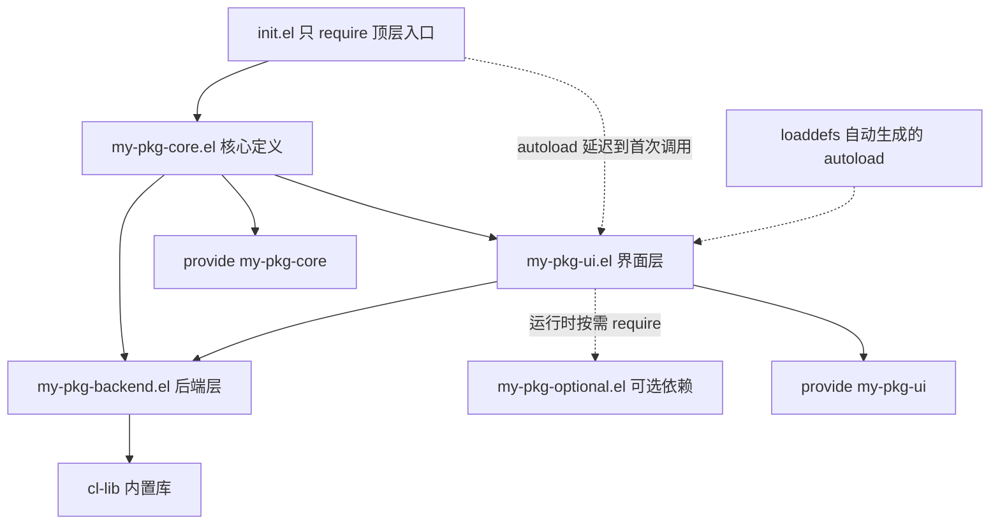
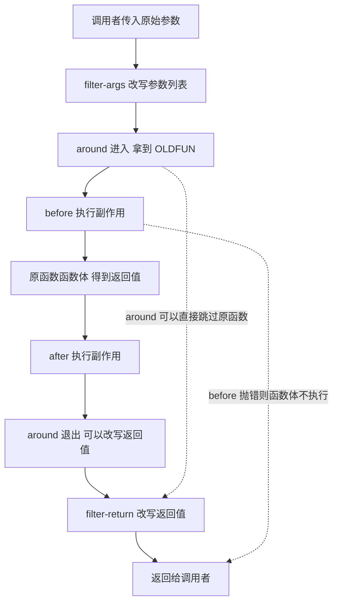

# 包与命名空间实践

> 本篇讲 Emacs Lisp 的「工程化」一面：没有命名空间的语言如何靠约定避免冲突、文件怎样声明依赖与被依赖、一个规范的包从文件头到文件尾该长什么样，以及在不修改别人源码的前提下改变别人行为的正规手段。

---

## 一、Emacs Lisp 没有命名空间

### 1.1 问题从哪来

Emacs Lisp 是 Lisp-2：函数与变量使用两套独立的全局符号表。一个符号 `foo` 可以同时有函数定义与变量值，两者互不干扰；但**所有**包的所有全局函数共享同一张函数表，所有全局变量共享同一张变量表。没有包前缀机制，没有模块作用域，加载两个都定义了 `parse-config` 的库，后者会静默覆盖前者。

后果是具体的：

- 你在 `init.el` 里定义 `(defun setup () ...)`，某个包也定义了一个全局 `setup`，谁最后加载谁生效，报错信息会指向完全无关的地方。
- 两个包都往 `auto-mode-alist` 里加规则时不冲突（那是列表，可以共存），但都 `defvar` 一个叫 `enabled` 的变量就会互相干扰。
- 卸载一个包后残留的全局定义不会自动消失，需要靠 `unload-feature` 与约定来收拾。

Emacs 官方手册在「Coding Conventions」一节里给出的第一道防线就是前缀约定：「程序里所有全局符号——变量、常量、函数的名字——都应当以你选定的前缀开头，前缀与其余部分之间用一个连字符分隔。」唯一被认可的例外是少数几个成体系的命名传统，例如列出某类对象的命令叫 `list-SOMETHING`（包名 `frob` 可以有命令 `list-frobs`），以及定义类宏以 `define-` 开头。

### 1.2 完整约定表

下表把散落在手册、Emacs 源码习惯与生态实践中的命名约定集中起来。第三列的样例都取自真实存在的 Emacs 符号或按惯例构造的同构名。

| 类别 | 约定 | 样例 | 说明 |
| --- | --- | --- | --- |
| 全局符号前缀 | `包名-` | `org-`、`projectile-` | 所有全局函数与变量，无一例外 |
| 内部符号 | `包名--`（两个连字符） | `org--get-tags` | 表示「不供其它包使用」，不受兼容性承诺保护 |
| 定义类宏 | `define-包名-xxx` 或 `包名-define-xxx` | `define-derived-mode` | 手册允许定义类宏把 `define-` 前置，第一个参数应是被定义的符号 |
| 列出对象的命令 | `list-包名对象` | `list-packages`、`list-frobs` | 唯一被手册点名的「前缀后置」场景 |
| 谓词函数 | 结尾加 `-p` | `buffer-modified-p`、`my-pkg-ready-p` | 单词谓词可直接加 `p`：`framep`、`symbolp` |
| 布尔变量 | 用 `-flag` 或 `is-` 前缀，不要用 `-p` | `my-pkg-auto-save-flag` | 手册明确建议避免在布尔变量上用 `-p`，除非它保存的是一个谓词函数 |
| 保存函数的变量 | 结尾加 `-function` | `font-lock-fontify-region-function` | 值为单个函数时用这个后缀；值为函数列表时按 hook 命名 |
| 普通钩子 | `包名-…-hook` | `org-mode-hook`、`my-pkg-after-load-hook` | 值为函数列表、调用时不传参数 |
| 异常钩子 | `包名-…-functions` | `before-change-functions`、`window-size-change-functions` | 调用时传参数，用 `run-hook-with-args` 系列运行 |
| 主模式 | `包名-mode` | `python-mode` | tree-sitter 变体用 `-ts-mode` 后缀（Emacs 29 起） |
| 次模式 | `包名-xxx-mode` | `display-line-numbers-mode` | 开关命令与控制变量同名，值通过 `:lighter` 显示 |
| 模式 keymap | `模式名-map` | `python-mode-map` | `define-derived-mode` 会自动创建 |
| 其它 keymap | `包名-…-map` | `my-pkg-command-map` | 前缀键专用的稀疏 keymap 也用这个后缀 |
| 语法表 | `模式名-syntax-table` | `python-mode-syntax-table` | `define-derived-mode` 自动创建 |
| 缩略表 | `模式名-abbrev-table` | `python-mode-abbrev-table` | 同上 |
| face | `包名-…-face` | `font-lock-keyword-face`、`my-pkg-error-face` | 与变量、函数区分，便于在主题里统一覆盖 |
| 转换函数 | `源-to-目的` | `string-to-number`、`char-to-string`、`color-name-to-rgb` | 手册未硬性规定，但 Emacs 自身高度一致 |
| 动作函数 | 动词开头 | `my-pkg-insert-header`、`my-pkg-refresh-cache` | 让 `M-x` 补全按动词聚合 |
| 文件名/目录名变量 | 用 `file`、`file-name`、`directory` | `my-pkg-cache-directory` | 手册明确要求避免用 `path`；`path` 只用于「目录列表」这种搜索路径 |
| 专用缓冲区名 | `*包名-用途*` | `*Messages*`、`*my-pkg-log*` | 星号约定只用于缓冲区，**不要**用来给变量命名 |

关于最后两行：手册专门指出，Emacs 不采用「变量名首尾加星号」这种来自其它系统的习惯，星号只用于特殊用途的缓冲区。同时手册要求：保存文件名或目录名的变量不要叫 `xxx-path`，因为 GNU 惯例里 `path` 专指「由目录名组成的搜索路径」（如 `load-path`、`exec-path`）。

### 1.3 双连字符对字节编译器与用户分别意味着什么

`包名--内部名` 这个双连字符约定没有任何运行时效果：`(defun foo--bar () ...)` 与 `(defun foo-bar () ...)` 在求值、字节编译、宏展开上完全一样，字节编译器**不会**因为它做内联或优化。它约束的是人和工具：

- **对用户**，它是一条可见的边界声明：单连字符的函数是你承诺维护的接口，双连字符的函数随时可能改名、改签名或消失。用户配置里直接调用 `org--get-tags` 属于「自担风险」，升级后报 `void-function` 是预期结果。
- **对其它包作者**，它是避免耦合的手段。手册的建议是：如果你想写一个「应该进 Emacs」的函数，先在自己的包里用带前缀的名字实现（例如把 `twiddle-files` 写成 `mylib-twiddle-files`），再向 Emacs 提出建议，而不是直接占用那个短名字。
- **对工具链**，它是可以被检查的：`checkdoc`、`package-lint` 这类工具与 MELPA 的审核都会围绕头字段与命名规范给出意见，`M-x package-lint-current-buffer` 是提交前的常规检查手段。
- **对卸载机制**，它决定了 `unload-feature` 能做什么。它会撤销加载该 feature 时的常见副作用（例如从 hook 里移除函数），但如果你加载时做了不寻常的事，需要自己定义 `FEATURE-unload-function`，`unload-feature` 发现它存在就会调用它。

需要强调一点：真正影响编译质量的是**前置声明**（`defvar`、`declare-function`）与显式抑制（`with-no-warnings`、`with-suppressed-warnings`），不是连字符的数量。第五节会专门讲这三者的区别。

最后是一句务实的补充：约定是给协作者看的，而你的 `init.el` 最常见的协作者是几个月后的你自己。配置代码同样值得加前缀（例如统一用 `my-` 开头），否则你会重复经历「这个 `setup` 函数是谁定义的」这类排查。

---

## 二、feature：require 与 provide

### 2.1 三个核心函数

一个文件通过 `provide` 宣布「我提供某个特性（feature）」，通过 `require` 声明「我需要某个特性」。特性名惯例是文件名的字符串化，`foo.el` 提供 `foo`。

| 函数 | 作用 | 是否会加载文件 | 返回值 |
| --- | --- | --- | --- |
| `provide` | 声明当前文件提供的特性，可选地带上子特性列表 | 否 | 特性符号 |
| `require` | 确保某特性已加载，未加载则加载对应文件 | 是（未加载时） | 特性符号；`NOERROR` 且找不到时为 `nil` |
| `featurep` | 仅查询特性是否已加载 | 否 | `t` 或 `nil` |

```elisp
;;; -*- lexical-binding: t; -*-

(require 'cl-lib)        ; 需要 Common Lisp 兼容层
(require 'seq)           ; 需要序列操作

(defun my-pkg-first-even (numbers)
  "返回 NUMBERS 中第一个偶数，没有则返回 nil。"
  (seq-find #'cl-evenp numbers))

(provide 'my-pkg)        ; 放在文件末尾
```

三个函数的行为要点：

- `require` **只在特性尚未加载时才加载文件**。判断依据是变量 `features` 里有没有这个符号。加载成功后返回值是特性符号；失败则报错，除非第三个参数 `NOERROR` 为非 `nil`，那时返回 `nil`。它还会抑制 `load` 打印的「Loading …」与「Loading…done」消息。
- `provide` 的第二个可选参数是子特性列表 `SUBFEATURES`：`(provide 'my-pkg '(python c))` 表示这个版本支持 `python` 与 `c` 两个子特性。之后可以用 `(featurep 'my-pkg 'python)` 精确判断，这个机制比散落的版本号比较更细。
- `featurep` 只查 `features` 变量，不做任何加载动作。用它来做条件化执行：`(when (featurep 'tree-sitter) ...)`。

`features` 是一个普通列表，因此可以被 `C-h v features` 直接查看，也可以在调试时搜索某个包到底有没有被加载。

### 2.2 循环依赖与拆包

循环依赖在 Elisp 里表现为加载到一半就回报「Recursive load」错误，或者更隐蔽地——某个变量还是 `void`，因为依赖它的文件在它定义那个变量之前就返回了。典型结构是 A 的顶层 `require` B，B 的顶层又 `require` A。



三种解法，按推荐程度排列：

1. **抽公共层**。把两边都要用的函数与变量抽到第三个文件 `my-pkg-core.el`，让 A 与 B 都只依赖 core，形成有向无环图。这是唯一从结构上消除环的办法，也是长期维护的包应当采用的方式。
2. **把 `require` 下沉到函数内部**。手册对此有明确态度：如果文件只在少数功能上需要某个库，就把 `require` 放进相关函数里，而不是放在顶层。这样只有真正用到那条路径的用户才会付出加载成本。

```elisp
;; 顶层不 require，只在需要时加载
(defun my-pkg-export-pdf (file)
  "把当前缓冲区导出为 FILE 指向的 PDF。"
  (require 'ox-latex)            ; 只有导出 PDF 时才需要 org 的 LaTeX 后端
  (org-latex-export-to-pdf nil nil nil nil file))
```

3. **用 autoload 代替顶层 require**。声明一个「调用时才加载」的入口，加载动作推迟到用户真正触发那一刻。下一小节讲具体写法。

还有两个辅助手段专治编译期报错而非运行期依赖：`declare-function` 告诉编译器「这个函数在别的文件里」（见第五节），以及在函数体内用 `(defvar my-pkg-other-var)` 之类的声明避免「自由变量」警告。

### 2.3 特性名与文件名的关系

惯例是「`foo.el` 提供 `foo`」，但这只是惯例，不是规则。`require` 的两个参数是分开的：

```elisp
;; FEATURE 用来查 features 列表，FILENAME 用来定位文件
(require 'my-feature "some/dir/actual-file")
```

`require` 的文档说明：如果省略 `FILENAME`，就用特性名的字符串形式当文件名，依次尝试补上 `.elc`、`.el` 与动态模块后缀——**不会**尝试完全没有后缀的名字。这解释了两个常见现象：

- 特性名与文件名不同时（例如一个文件里 `provide` 了多个特性，或特性名带项目前缀而文件名不是），必须写第二个参数，否则会报「Cannot open load file」。
- `load` 比 `require` 多试一种情况：`load` 在补后缀都失败后还会尝试原样的文件名，因此它可以加载一个没有 `.el` 后缀的脚本文件，而 `require` 不行。

判断一个包「到底加载了没加载」，永远看 `features`；判断「加载的是哪个文件」，用 `locate-library`；判断「这个文件定义了哪些东西」，看 `load-history`。这三者对应的分别是「有没有」「在哪」「是什么」。

### 2.4 autoload 与 ;;;###autoload 魔法注释

autoload 是一个占位函数：它在函数单元里放一个「桩」，记录真正的实现在哪个文件；首次调用时先加载那个文件，再执行真身。这就是为什么你从未 `require` 过某个包，`M-x` 却能直接补全并运行它的命令。

手写形式是函数 `autoload`：

```elisp
;; (autoload FUNCTION FILE &optional DOCSTRING INTERACTIVE TYPE)
(autoload 'my-pkg-refresh "my-pkg" "刷新缓存。" t)
```

但更常见、也更推荐的是在源码里写**魔法注释** `;;;###autoload`。它单独占一行，写在 `defun` 之前表示「为这个函数生成 autoload」；也可以写在任意表单之前，表示「把整个表单原样搬进 autoload 文件」——后者常用于在包加载之前就注册模式与别名：

```elisp
;;;###autoload
(defun my-pkg-refresh ()
  "刷新缓存。"
  (interactive)
  (message "刷新完成"))

;;;###autoload
(define-derived-mode my-pkg-mode prog-mode "MyPkg")

;;;###autoload (add-to-list 'auto-mode-alist '("\\.mypkg\\'" . my-pkg-mode))
```

第三条写法不是杜撰：cc-mode 就是用同样的形式注册 `.h` 的归属：

```elisp
;;;###autoload (add-to-list 'auto-mode-alist '("\\.h\\'" . c-or-c++-mode))
```

生成 autoload 的过程是：构建时扫描源码里的这些注释，把对应的定义写进 `包名-autoloads.el`，用户激活包时加载这个文件。Emacs 29 起相关的生成函数是 `loaddefs-generate`（实现在 `loaddefs-gen.el`），更早的代码与老文档里会见到 `update-file-autoloads`、`make-directory-autoloads` 这类函数，它们在当前 Emacs 里仍然可用。

实践上的判断标准是：**用户会通过 `M-x` 或键位直接调用的入口**才需要 `;;;###autoload`。每个内部函数都加 autoload 只会让 autoload 文件膨胀，反而拖慢启动。

要注意 autoload 与 `features` 的关系：autoload 桩只是让「调用命令」这一动作触发加载，它**不会**把特性提前放进 `features`。因此 `(featurep 'my-pkg)` 在用户真正触发命令之前一直是假，靠 `featurep` 来判断「用户是否在用这个包」是不可靠的。需要这种判断时，应当在包加载后主动设置一个自己的标志变量（例如 `my-pkg--loaded`），而不是去查 `features`。

---

## 三、load-path 与文件加载

### 3.1 load-path 的机制

`load-path` 是「由目录名组成的列表」，`load`、`require`、`locate-library`、`load-library` 都在这些目录里按顺序查找文件。查看真实值用 `C-h v load-path`。它的默认内容由构建方式决定（Emacs 自带的 lisp 目录、可能存在的 `site-lisp` 目录等），第三方目录需要你自己加，其中：

- `package.el` 会把它自己的安装目录（默认是 `user-emacs-directory` 下的 `elpa/`，可查 `C-h v package-user-dir`）加入 `load-path`；
- 你自己放在 `~/.emacs.d/lisp/` 之类的目录不会自动进 `load-path`，必须显式添加。

```elisp
;; 加到列表开头：优先级最高，可以覆盖内置同名文件
(add-to-list 'load-path (expand-file-name "lisp" user-emacs-directory))

;; 加到列表末尾：作为兜底，不遮蔽已有文件
(add-to-list 'load-path (expand-file-name "vendor" user-emacs-directory) t)
```

`add-to-list` 的行为要记清楚：它用 `equal` 判断元素是否已存在，默认把新元素加到列表**开头**，第四个参数 `APPEND` 为真时加到末尾。它的文档同时提醒：它适合用来配置 `load-path` 这类变量，不要滥用它构造普通列表，那种场景应当用 `push` 或 `cl-pushnew`。还有一个坑：`add-to-list` 的第一个参数必须是符号，不能传词法变量。

`locate-library` 可以在不加载的情况下查出「这个名字最终会解析到哪个文件」，排查「加载的是哪个版本的包」时非常有用：

```elisp
(locate-library "org")   ; => "/usr/share/emacs/31.1/lisp/org/org.elc" 之类的真实路径
```

### 3.2 load 与 require 的差别

| 对比项 | `require` | `load` |
| --- | --- | --- |
| 是否去重 | 是，已加载则什么都不做 | 否，每次调用都重新执行文件 |
| 参数 | `FEATURE &optional FILENAME NOERROR` | `FILE &optional NOERROR NOMESSAGE NOSUFFIX MUST-SUFFIX` |
| 返回值 | 成功返回特性符号，`NOERROR` 且找不到时返回 `nil` | 成功返回 `t` |
| 查找范围 | `load-path` | `load-path` |
| 后缀尝试顺序 | `.elc` → `.el` → 动态模块后缀，**不会**尝试无后缀 | 同上，但最后会尝试原样的 `FILE` |
| 与 `provide` 的关系 | 依赖 `features` 列表 | 不关心，只看文件内容 |
| 典型用途 | 声明依赖 | 手工加载某个文件、重新加载调试中的代码 |

`load` 的细节值得展开：`NOERROR` 为真时文件不存在也不报错；`NOMESSAGE` 为真时不打印加载消息；`NOSUFFIX` 为真时不自动补后缀。变量 `load-prefer-newer` 为非 `nil` 时，Emacs 会检查所有后缀并挑最新的那个文件（而不是找到第一个就用），这是调试「改了 `.el` 却仍在跑旧的 `.elc`」问题的关键开关。加载期间 `load-in-progress` 为真、`load-file-name` 绑定为当前文件名，`load-history` 会记录这个文件定义了哪些函数与变量——`unload-feature` 正是靠 `load-history` 来撤销定义。

`load-file` 与它们都不同：它按**给定路径**加载文件，不搜索 `load-path`，适合加载一个明确知道位置的文件：

```elisp
(load-file (expand-file-name "scratch/experiment.el" "~/tmp/"))
```

### 3.3 加载问题的排查套路

「我明明改了代码却没生效」「某个包加载了两个版本」这类问题有一套固定动作：

1. `C-h v load-path` 看搜索顺序，确认你期望的目录在不在、排在前面还是后面。搜索是**按顺序取第一个命中**，因此排在后面的同名文件永远轮不到。
2. `C-h v features` 看这个特性是否已经在列表里。没在，说明根本没加载；在，说明加载过，问题出在别处（多半是版本或顺序）。
3. `M-x locate-library` 查出这个名字最终解析到哪个文件。如果它指向 `elpa/` 下的老版本，而你改的是源码目录里的版本，问题就定位了。
4. `M-x list-load-path-shadows` 列出「被前面目录遮蔽的文件」。这是发现「装了两份同名包」最快的办法，输出会明确告诉你哪个文件被谁遮住了。
5. 怀疑 `.elc` 比 `.el` 旧时，检查 `load-prefer-newer`：它为 `nil` 时 Emacs 找到 `.elc` 就用，不会比较时间戳，重新编译才能生效。
6. 最后手段是 `emacs -Q`（不读任何用户配置）复现一次，以区分「配置问题」与「包本身问题」。

把这套动作和编译警告的处理放在一起看，会发现 Elisp 的很多「玄学问题」其实都是同一件事：**同一个名字在不同的加载阶段指向不同的东西**。

---

## 四、文件头与文件尾规范

### 4.1 完整模板

Emacs Lisp 手册（`Library Headers` 一节）给出了标准布局。把下面这份骨架复制到新包的 `my-pkg.el` 里，就已经满足了 `package.el`、Finder、`checkdoc` 以及人眼阅读的全部要求：

```elisp
;;; my-pkg.el --- 为 MyPkg 语言提供编辑支持  -*- lexical-binding: t; -*-

;; Copyright (C) 2024-2026 你的名字

;; Author: 你的名字 <you@example.com>
;; Maintainer: 维护者名字 <maintainer@example.com>
;; Created: 12 Mar 2024
;; Version: 1.2.0
;; Package-Requires: ((emacs "29.1") (seq "2.23"))
;; Keywords: languages, convenience
;; URL: 你的项目主页，例如 GitHub 仓库地址

;; This file is not part of GNU Emacs.

;; This program is free software; you can redistribute it and/or modify
;; it under the terms of the GNU General Public License as published by
;; the Free Software Foundation, either version 3 of the License, or
;; (at your option) any later version.
;;
;; This program is distributed in the hope that it will be useful,
;; but WITHOUT ANY WARRANTY; without even the implied warranty of
;; MERCHANTABILITY or FITNESS FOR A PARTICULAR PURPOSE.  See the
;; GNU General Public License for more details.
;;
;; You should have received a copy of the GNU General Public License
;; along with this program.  If not, see <https://www.gnu.org/licenses/>.

;;; Commentary:

;; 这里是给人读的说明：这个包做什么、怎么启用、有哪些主要命令。
;; Finder 会把它当作包的简介显示，所以第一段就要说清用途。
;;
;; 启用方式：
;;
;;   (require 'my-pkg)
;;   (add-hook 'my-pkg-mode-hook #'my-pkg-setup)

;;; Change Log:

;; 1.2.0  新增 my-pkg-refresh，修正缩进
;; 1.1.0  支持 Emacs 29 的 tree-sitter 模式

;;; Code:

(require 'seq)

(defgroup my-pkg nil
  "MyPkg 语言支持。"
  :group 'languages
  :prefix "my-pkg-")

(defcustom my-pkg-indent-offset 4
  "缩进宽度。"
  :type 'integer
  :group 'my-pkg)

(defun my-pkg-setup ()
  "MyPkg 缓冲区的公共配置。"
  (setq-local indent-tabs-mode nil))

(provide 'my-pkg)

;;; my-pkg.el ends here
```

### 4.2 每个字段给谁看，缺了会怎样

| 字段 | 主要读者 | 缺失的后果 |
| --- | --- | --- |
| `;;; file.el --- 摘要  -*- lexical-binding: t; -*-` | 人、Finder、`imenu` | 摘要缺失会让包列表里没有描述；`lexical-binding` 缺失则**整个文件退回动态作用域**，闭包与 `let` 覆盖语义全部改变，这是最严重的缺失 |
| `Copyright` / 许可证段 | 法律与分发渠道 | 无法合法分发；MELPA 与 GNU ELPA 都不接受没有许可证的文件 |
| `Author` | 用户、bug 报告者 | 手册说「几乎所有库都应当有 Author 与 Keywords 两行」 |
| `Maintainer` | 用户 | 缺失时约定由 `Author` 承担维护责任 |
| `Created` | 历史查询 | 纯历史信息，缺失无影响 |
| `Version` | 包管理器、人 | 缺失时 `package.el` 无法判断版本，升级与依赖解析都会退化 |
| `Package-Version` | 包管理器 | 当 `Version` 是 RCS 标识之类无法被 `version-to-list` 解析的字符串时用它 |
| `Package-Requires` | `package.el` | 缺失时依赖不会被自动安装，激活顺序也可能出错，用户会看到「void-function」类错误 |
| `Keywords` | Finder、MELPA 分类 | 缺失时按主题检索不到；值必须取自 `finder-known-keywords`（如 `languages`、`convenience`、`tools`、`lisp`、`files`、`comm`、`processes`） |
| `URL` | 人、包管理器 | `Homepage` 是同义但已过时的写法 |
| `;;; Commentary:` | 人、Finder | 缺失时 `M-x finder-commentary` 没有内容可显示，用户无法从包内说明启用方式 |
| `;;; Change Log:`（或 `History:`） | 人 | 可选；手册建议详细历史交给版本控制，这里只写摘要 |
| `;;; Code:` | 工具 | 它标记「从此处开始是代码」，`checkdoc` 等工具据此界定检查范围 |
| `(provide 'my-pkg)` | 加载系统 | 缺失会让 `require` 每次重新加载文件，或让 `featurep` 永远为假 |
| `;;; my-pkg.el ends here` | 人、工具 | 它的唯一作用是让人一眼看出文件是否被截断 |

两个容易忽略的细节：

- **第一行格式是 `;;; FILENAME --- DESCRIPTION  -*- lexical-binding: t; -*-`**，短横线是三个连字符，描述必须在一行内。如果还要设置别的变量导致行太长，就改用文件末尾的 Local Variables 块。手册明确要求 `lexical-binding` 尽量写在这一行上。
- **不要声称版权属于自由软件基金会**，也不要在文件里写「This file is part of GNU Emacs」，除非你的文件真的被 Emacs 发行版或 GNU ELPA 收录了。
- `Package-Requires` 的值是「列表的列表」，写在一行内：`((emacs "29.1") (seq "2.23") cl-lib (seq))`。子列表第二个元素是可被 `version-to-list` 解析的最低版本字符串；**只有符号、没有版本号的条目等价于版本 `"0"`**（例如 `cl-lib`）。`emacs` 是一个由包系统自动定义的伪包，写它就等于声明最低 Emacs 版本。不需要支持 27 以前版本的包可以把这个头字段折成多行，但列表必须紧跟在 `Package-Requires:` 同一行开始。

这些字段的价值在于「机器可读」：`package.el` 解析 `Version` 与 `Package-Requires` 决定装什么、装哪个版本；Finder 解析 `Keywords` 与 `Commentary` 建立主题索引；`checkdoc` 与 `package-lint` 解析头字段给出规范意见；人则通过 `Author` 找到该向谁报告问题。字段的顺序没有强制要求，但沿用上面的排列可以让工具与人都少花一次寻找的成本。

---

## 五、依赖与前置声明

### 5.1 为什么会有编译警告

字节编译器是**逐文件**工作的：编译 `a.el` 时它不会自动加载 `b.el`，因此当 `a.el` 里调用了定义在 `b.el` 的函数、或引用了那里的变量时，编译器会报「the function `foo' is not known to be defined」或「reference to free variable」。这些警告不是错误，但会掩盖真正的错误，所以正规做法是把「我知道它在别处」明确告诉编译器。

三种手段，用途各不相同：

```elisp
;; 一、变量前置声明：只声明存在，不给值
;;    文件顶层的 (defvar foo-bar) 不会覆盖运行时的真实值
(defvar my-other-pkg-auto-save-flag)

;; 二、函数前置声明：告诉编译器函数在哪个文件、参数表是什么
;;    FILE 参数不被字节编译器使用，而是给 check-declare 做校验；
;;    这行必须是所在行的第一个非空白内容
(declare-function my-other-pkg-refresh "my-other-pkg" (&optional force))

;; 三、宏的前置声明：必须在文件第一次使用该宏之前
(eval-when-compile (require 'cl-lib))
```

| 手段 | 影响时机 | 影响范围 | 典型场景 |
| --- | --- | --- | --- |
| `(defvar foo)` | 编译期 | 单个变量 | 引用别的包里的全局变量 |
| `(declare-function fn "file" (args))` | 编译期 | 单个函数 | 调用别的包里的函数，且该文件由 autoload 提供 |
| `(eval-when-compile (require 'bar))` | 编译期 | 整个文件 | 只用到了 BAR 里的宏 |
| `(require 'bar)` | 编译期与运行期 | 整个文件 | 运行期确实需要 BAR |

`(defvar foo)` 这个「没有值」的形式是关键技巧：它建立符号的**特殊变量**属性并告诉编译器不要报自由变量警告，但**不会**把变量设为 `nil`——如果变量此前已有值，值保持不变。反过来说，写 `(defvar foo nil)` 就可能把别的包已经设好的值覆盖掉，这是常见事故。

`declare-function` 的 `ARGLIST` 应当与真实定义一致，因为 `check-declare` 会去核对；省略它默认相当于 `t`（表示不检查参数），写 `nil` 则表示「这个函数不接受参数」，两者含义不同。

### 5.2 eval-when-compile 的取舍

手册对 `(eval-when-compile (require 'BAR))` 的适用场景说得很清楚：**当你的文件只用到了 BAR 里的宏，而没有用到 BAR 的函数或变量时**，才这样写。它让宏定义在编译期可用，同时避免编译后的文件在运行时还要加载 BAR。

判断规则可以简化成三句：

- 只用宏 → `(eval-when-compile (require 'bar))`；
- 只用函数 → 顶层 `(require 'bar)`（或者用 `declare-function` 让人去 autoload）；
- 两者都用 → 老实写顶层 `(require 'bar)`，因为运行时反正要加载。

需要 Common Lisp 扩展时用 `cl-lib`，手册明确要求不要用已废弃的 `cl` 库（它将在未来版本中移除）。

理解这一切的前提是区分两个时刻：**编译期**是字节编译器读你的源码、生成 `.elc` 的时刻；**运行期**是那份 `.elc` 被加载的时刻。`declare-function` 与 `(defvar foo)` 只影响编译期，它们不产生任何运行期代码；`(eval-when-compile ...)` 只在编译期执行函数体（解释执行时它等价于 `progn`）；顶层 `require` 则在两个时刻都有效果——编译时它会加载，运行时生成的文件里也保留着这条调用。把警告当成编译期的沟通问题、把加载顺序当成运行期的问题，绝大多数「改了没生效」的困惑都能自己解释清楚。

### 5.3 with-no-warnings 与 with-suppressed-warnings

`with-no-warnings` 的文档只有一句：「像 `progn`，但阻止函数体内产生编译器警告。」它是一把大锤——包住的部分里所有类型的警告都会消失，包括你原本想看到的那些。因此它只适合用在「我确实知道这里为什么看起来可疑」的极少数位置，例如调用一个故意保留的废弃接口、或者在兼容旧版本的分支里使用已被移除的函数。

更精确的工具是 `with-suppressed-warnings`，它接收一个「警告类型 → 涉及符号」的关联列表：

```elisp
(with-suppressed-warnings ((obsolete my-old-helper)
                           (callargs my-loose-function))
  (my-old-helper)          ; 这里调用废弃函数不报警
  (my-loose-function 1 2)) ; 这里参数个数不对也不报警
```

可抑制的类型是 `byte-compile-warning-types` 的子集，包括 `free-vars`、`callargs`、`redefine`、`obsolete`、`interactive-only`、`lexical`、`ignored-return-value`、`constants`、`suspicious`、`empty-body`、`mutate-constant`。

滥用这两者的典型症状是「编译零警告，运行时一堆错」。一个务实的纪律是：**先修掉能修的警告**（加 `defvar`、加 `declare-function`、改掉真正错误的调用），剩下确实无法修的每一条都补一行注释说明原因，再用最小范围的 `with-suppressed-warnings` 包住。

---

## 六、用 defgroup 组织自定义项

`defgroup` 把用户可配置的变量、face 与子组组织成一棵树，供 `M-x customize` 使用。它的形式是 `(defgroup SYMBOL MEMBERS DOC &rest ARGS)`，常用于定义类宏的位置，因此 `customize-mode` 也能据此找到某个模式的自定义项。

```elisp
(defgroup my-pkg nil
  "MyPkg 语言支持。"
  :group 'languages
  :prefix "my-pkg-")            ; 在 Customize 界面里去掉变量名前缀，可读性更好

(defgroup my-pkg-faces nil
  "MyPkg 的字体设置。"
  :group 'my-pkg
  :group 'faces)

(defface my-pkg-keyword-face
  '((t :inherit font-lock-keyword-face))
  "MyPkg 关键字使用的 face。"
  :group 'my-pkg-faces)

(defcustom my-pkg-indent-offset 4
  "MyPkg 的缩进宽度。"
  :type 'integer
  :group 'my-pkg)
```

组织上的建议：一个包一个顶层组，用 `:group 'languages` 之类挂到 Emacs 已有的分类上；把面（face）与变量分成子组（约定后缀 `-faces`）；`:prefix` 只在顶层组写一次，它让 Customize 显示 `Indent Offset` 而不是 `My Pkg Indent Offset`。手册还提到一条硬性要求：**任何包含 `defcustom` 的文件都不得在仅仅加载时改变 Emacs 的编辑行为**，必须提供命令让用户主动启用——这也是自定义组存在的意义之一。

自定义组还有一个容易被忽略的用途：`define-derived-mode` 的关键字 `:group` 会把自定义组记录到模式符号的属性上，`M-x customize-mode` 就能据此直接跳到「当前模式的全部可配置项」。实测 `(get 'python-mode 'custom-mode-group)` 在当前 Emacs 里为空，说明并非所有内置模式都登记了这一属性；但你自己的模式只要写上 `:group`，用户就能用 `customize-mode` 一次看到所有相关选项，这是很低的成本换来的可发现性。

---

## 七、向后兼容的写法

支持多个 Emacs 版本时，代码里会反复出现三类模式：能力探测、行为分支、废弃过渡。

### 7.1 能力探测与版本判断

```elisp
;; 函数是否存在（最精确的探测方式）
(when (fboundp 'tree-sitter-available-p)
  (setq my-pkg-use-treesit t))

;; 变量是否已绑定且为真（注意下面提到的词法绑定限制）
(when (bound-and-true-p my-pkg-auto-save-flag)
  (my-pkg-enable-auto-save))

;; 版本比较：判断当前 Emacs 是否足够新
(when (version< emacs-version "29.1")
  (setq my-pkg-fallback-mode t))

;; 特性是否存在
(when (featurep 'native-compile)
  (my-pkg-warm-up-compilation))
```

`version<` 的语义有几个需要注意的地方：`"1"` 与 `"1.0"`、`"1.0.0"` 相等（末尾的 `.0` 无意义）；`"1"` 高于 `"1pre"`，`"1pre"` 高于 `"1beta"`，`"1beta"` 高于 `"1alpha"`，`"1alpha"` 高于 `"1snapshot"`；带 `-GIT`、`-CVS`、`-NNN` 后缀的被当作快照版本。这些规则在写兼容判断时直接影响结果。

`bound-and-true-p` 有一个必须记住的限制：**在启用 `lexical-binding` 的文件里，它对词法绑定的变量没有意义**。它的用途是「探测另一个包里可能存在的动态变量」，因为那类变量总是特殊变量，不受此限制。

### 7.2 废弃与过渡

废弃不是删掉旧名字，而是「保留旧名字并让它继续工作，同时通知使用者换成新名字」。四个函数构成完整工具链：

```elisp
;; 函数改名：等价于 defalias + make-obsolete
(define-obsolete-function-alias 'my-pkg-refresh-cache
  'my-pkg-refresh "1.2.0" "改用 `my-pkg-refresh'。")

;; 变量改名：内部使用 defvaralias + make-obsolete-variable
(define-obsolete-variable-alias 'my-pkg-cache-dir
  'my-pkg-cache-directory "1.2.0")

;; 只警告不提供替代实现（例如彻底移除的功能）
(make-obsolete 'my-pkg-legacy-hook "使用 `my-pkg-mode-hook' 替代。" "1.2.0")

;; 只在「读取」或「写入」时才警告，ACCESS-TYPE 取 get 或 set
(make-obsolete-variable 'my-pkg-old-option 'my-pkg-new-option "1.2.0" 'get)
```

几点实践要点：

- `WHEN` 参数统一写成版本字符串（如 `"1.2.0"`），不要写成日期与版本混用，用户与工具都需要它来判断「我的配置是不是太旧了」。
- `define-obsolete-variable-alias` 的文档特别提醒：如果新变量是 `defcustom`，别名语句应当写在 `defcustom` **之前**，否则用户通过 Customize 保存过的值可能不会被正确应用（这与 `defvaralias` 的实现方式有关）。
- 兼容别名**必须带包前缀**，不要直接占用别的版本里的裸名字。手册举的 Gnus 例子很典型：它把兼容函数命名为 `gnus-point-at-bol`，内部再判断该用哪个内置实现。
- 手册同时提醒两件「不要做」：**不要给 Emacs 基本函数定义别名**（除非是为了向后兼容或可移植性），**不要重新定义或 advice Emacs 基本函数**——「对某个程序来说也许正确，但没法预知会破坏多少其它程序」。

实践上还有一个组织技巧：把兼容代码集中到一个文件里，例如 `my-pkg-compat.el`，在里面用 `version<`、`fboundp` 判断并定义统一的内部接口（比如 `my-pkg-compat-json-parse`），其余文件只调用这个内部接口。这样当最低支持的 Emacs 版本提高时，需要清理的只有一个文件，而不是散落各处的条件分支。同理，废弃别名也集中写在一起，便于在发布新版本时一眼看出「哪些过渡已经可以删了」。

---

## 八、advice：改变别人的函数行为

### 8.1 六种 HOW 与执行顺序

`advice-add` 把一段代码挂到**已命名函数**上。它的 `HOW` 参数决定挂载方式，文档给出的等价展开式是最准确的理解方式：

| HOW | 等价的组合结果 | 语义 |
| --- | --- | --- |
| `:before` | `(lambda (&rest r) (apply FUNCTION r) (apply OLDFUN r))` | 先跑你的，再跑原函数，返回值取原函数的 |
| `:after` | `(lambda (&rest r) (prog1 (apply OLDFUN r) (apply FUNCTION r)))` | 先跑原函数，再跑你的，返回值仍是原函数的 |
| `:around` | `(lambda (&rest r) (apply FUNCTION OLDFUN r))` | 你收到原函数作为第一个参数，自己决定何时调用、是否调用 |
| `:override` | `(lambda (&rest r) (apply FUNCTION r))` | 完全替换原函数，旧实现不再执行 |
| `:filter-args` | `(lambda (&rest r) (apply OLDFUN (funcall FUNCTION r)))` | 你收到参数列表，返回新的参数列表 |
| `:filter-return` | `(lambda (&rest r) (funcall FUNCTION (apply OLDFUN r)))` | 你收到返回值，返回替换值 |

此外还有四个条件型 HOW：`:after-until`、`:after-while`、`:before-until`、`:before-while`，以及 `:interactive-only`（使被 advise 的函数不再是交互式命令）。它们的展开式在 `C-h f add-function` 里可以逐条对照。

实际执行顺序（在 `emacs -Q --batch` 中把六种 advice 全挂上同一个函数后实测，函数体打印 `body(参数)`）：

```text
filter-args -> around 进入 -> before -> body -> after -> around 退出 -> filter-return
```

也就是说：参数先被 `:filter-args` 改写，然后 `:around` 包裹住剩下的一切，`:before` 在真正的函数体之前，`:after` 在之后，返回值最后经过 `:filter-return`。



一个真实可用的例子，接续上一篇提到的「`message` 没有钩子」问题：想让所有消息都带上时间戳，最直接的办法就是过滤 `message` 的参数（`message` 的第一个参数是格式串，后面是它的参数）。

```elisp
(defun my-message-timestamp (args)
  "给 `message' 的格式串加上时间前缀。"
  (if (stringp (car args))
      (cons (concat (format-time-string "[%H:%M:%S] ") (car args)) (cdr args))
    args))

(advice-add 'message :filter-args #'my-message-timestamp)

;; 取消时用同一个函数对象，不要用新写的 lambda
(advice-remove 'message #'my-message-timestamp)
```

### 8.2 add-function 与函数单元

`advice-add` 是函数，接收一个符号（已命名的函数）；`add-function` 是宏，作用于一个**函数单元或广义变量**（generalized variable）——也就是说，任何保存函数的位置都可以被动态加一层。因为它是宏，`PLACE` 要写**不加引号**的广义变量形式，这与 `advice-add` 的用法有细微差别。

```elisp
(defun my-wrapper (orig &rest args)
  "在调用原函数前后打印标记。"
  (message "开始")
  (prog1 (apply orig args) (message "结束")))

;; 形式一：函数单元。作用于已命名函数真正的定义处
(add-function :around (symbol-function 'my-pkg-refresh) #'my-wrapper)

;; 形式二：(var VAR)：作用于一个变量保存的函数值
(defvar my-fn-var #'ignore)
(add-function :around (var my-fn-var) #'my-wrapper)
(funcall my-fn-var)   ; 先打印「开始」，执行原函数，最后打印「结束」

;; 形式三：(local 'SYMBOL)：只影响该变量的缓冲区局部值
;; （文档字符串给出的写法，注意这里 SYMBOL 要加引号）
```

后两种形式说明了一个容易混淆的事实：围绕**函数本身**包装用形式一，围绕**某个变量里保存的函数**包装用形式二或三。做配置时更常见的是后者，因为很多扩展点本身就是变量，例如某个 `foo-function` 变量或 hook 变量。

与之配套的移除函数是 `remove-function`（`advice-add` 对应的是 `advice-remove`）。`add-function` 还接受 `PROPS` 关联列表，其中 `name` 给这段 advice 起名（之后可以用名字来移除），`depth` 控制顺序：默认 0，按约定 100 表示这段 advice 在最内层（列表末尾），-100 表示在最外层——同样的取值范围与 `add-hook` 的 `DEPTH` 一致，这也是 Emacs 内部两套机制刻意保持一致的设计。

### 8.3 查看、判断与移除

- `C-h f 函数名` 会显示 advice 信息。实测输出形如：

```text
This function has :filter-return advice: ‘filter-return-fn’.
This function has :filter-args advice: ‘filter-args-fn’.
This function has :around advice: ‘around-fn’.
This function has :after advice: ‘after-fn’.
This function has :before advice: ‘before-fn’.
```

- `(advice-member-p #'my-fn 'target-fn)` 返回非 `nil` 表示该 advice 已挂上，否则返回 `nil`。它也可以接收 advice 的**名字**而不是函数对象。
- `(advice-mapc FUNCTION SYMBOL)` 遍历某个函数上的全部 advice，排查「到底谁改了这个函数」时最有用。
- `advice-remove` 的第二个参数既可以是函数对象，也可以是注册时用的名字。**移除时务必传入与添加时相同的函数对象**，用新写的 `lambda` 移除会失败，因为 `equal` 比较（对闭包而言）不会成立——这又是一条用具名函数的理由。

### 8.4 什么时候才该用 advice

Emacs Lisp 手册对这件事的态度非常明确，值得逐条转述：

- 「重新定义或 advice 一个 Emacs 基本函数是坏主意。」
- 「同样，一个 Lisp 包去 advice 另一个 Lisp 包里的函数也是坏主意。」
- 「避免在库和包里使用 `eval-after-load` 与 `with-eval-after-load`——这个特性是给个人配置用的；在 Lisp 程序里使用它是不干净的，因为它在另一个文件之外修改了那个文件的行为，而且这种修改在那个文件里不可见，是调试的障碍，就像 advice 别的包里的函数一样。」

据此可以得到清晰的分工：

| 场景 | 正确做法 |
| --- | --- |
| 改自己写的函数 | 直接改源码，不要 advice |
| 用户想微调某个包的行为，而包提供了 hook 或 defcustom | 用 hook 与 defcustom，这是包作者留出的正式接口 |
| 用户想改的行为没有官方接口 | advice 是合理手段，属于「个人配置」范畴，但要写清理由并保持最小化 |
| 自己写的包想去改另一个包的行为 | 不应当。改为向对方提 issue、提供 hook，或在自己的包里重新实现一层并明确告知用户 |
| 想批量改写一堆函数的输入输出 | 优先考虑通过 `advice-add` 的 `:filter-args` / `:filter-return` 精准处理，而不是 `:override` 整个替换 |

一句话总结：**advice 是用户的逃生舱，不是库的集成方式**。库与库之间的协作应当走 hook、defcustom 与明确版本化的 API。

---

## 九、多态与泛型

Emacs Lisp 没有类，但 `cl-lib` 提供了完整的泛型函数与结构体机制，足以表达「同一个操作在不同数据类型上有不同实现」的需求。

```elisp
;;; -*- lexical-binding: t; -*-
(require 'cl-lib)

(cl-defgeneric my-pkg-render (object)
  "把 OBJECT 渲染成字符串。")

(cl-defstruct my-pkg-text (body ""))
(cl-defstruct my-pkg-link (url "") (label ""))

(cl-defmethod my-pkg-render ((obj my-pkg-text))
  (my-pkg-text-body obj))

(cl-defmethod my-pkg-render ((obj my-pkg-link))
  (format "[%s](%s)" (my-pkg-link-label obj) (my-pkg-link-url obj)))

;; 用 (eql VAL) 特化到具体取值，而不是类型
(cl-defmethod my-pkg-render ((kind (eql :separator)))
  "---")

(my-pkg-render (make-my-pkg-text :body "标题"))          ; => "标题"
(my-pkg-render (make-my-pkg-link :url "/a" :label "甲")) ; => "[甲](/a)"
```

`cl-defstruct` 会自动生成四类东西：构造器 `make-NAME`、复制器 `copy-NAME`、谓词 `NAME-p`，以及每个槽位的访问器 `NAME-SLOT`（可用 `setf` 赋值）。这些名字同样遵守前缀约定，因此不会与别的包冲突。它还支持 `:constructor`、`:copier`、`:predicate`、`:conc-name`、`:type`、`:named` 等选项来自定义这些名字。

结构体的底层是 Emacs 的记录（record）类型，实测 `(type-of (make-my-s))` 返回结构体名本身、`(recordp ...)` 返回真，打印形式是 `#s(my-s 1)`。因此它与用关联列表（alist）或属性列表（plist）表示数据有实质区别：结构体带类型标签，`my-s-p` 能可靠地判断类型，访问器是固定位置的取值；而 alist 只是一堆 cons，谁都能构造出形状相似的假数据，字段名拼错时也不会报错，只会返回 `nil`。需要「一个明确的、有若干字段的数据类型」时用结构体；只是临时传递几个键值对时用 plist 更轻。

与 C++ 虚函数的对照可以帮助理解，也能避免套用错误的直觉：

| 对比项 | C++ 虚函数 | `cl-defgeneric` / `cl-defmethod` |
| --- | --- | --- |
| 分派依据 | 对象的静态类型层次 + `virtual` 关键字 | 运行时对**任意参数**的类型做分派，不要求继承关系 |
| 是否需要声明为虚 | 需要（否则静态绑定） | 不需要，定义方法即成泛型 |
| 分派位置 | 通常第一个参数（this） | 任意必选参数，可用 `:argument-precedence-order` 指定顺序 |
| 特殊形式 | 重载、模板 | `(eql VAL)`、`(head VAL)` 特化，`&context` 上下文特化，`:before`/`:after`/`:around` 方法限定符 |
| 默认实现 | 基类里的虚函数定义 | `cl-defgeneric` 的函数体即默认实现 |
| 类型定义 | class | `cl-defstruct`、`cl-deftype`，或内置类型（`string`、`integer` 等） |

实用判断是：当同一操作对两三种数据结构有实质不同的实现时，用泛型比写一串 `cond` + `typep` 更清晰，而且扩展新类型时不用回头改那个 `cond`。反过来，如果只有一种实现、或者判断条件是「某个变量是否为真」这种非类型条件，普通函数加 `if` 就够了，不必引入泛型。

还要把泛型与 advice 分清楚，两者都能实现「一个名字、多种行为」，但作用点完全不同：泛型是在**定义时**决定「这个操作有哪些实现」，分派依据是参数类型，属于你自己的 API 设计；advice 是在**运行时**往一个已经存在的函数外面加一层，属于外部干预。前者是你的包对外提供的正规结构，后者是用户或调试手段。用 advice 去模拟多态会得到一堆难以追踪的包装层，用泛型去改别人的函数则根本做不到（你只能定义自己的泛型）。

---

## 十、包之间的协作建议

把前面九节收敛成一组可执行的工程建议：

1. **提供 hook 与 defcustom，而不是让用户去 advice。** 你的包每多一个 `foo-after-load-hook`、每多一个 `foo-do-something-function` 变量，用户就少一次动刀的理由。这是成本最低、收益最高的接口设计——它就是本篇第八节那张分工表的根基。
2. **加载一个包不应改变编辑行为。** 手册把这条列为强制要求：任何含 `defcustom` 的文件都必须提供开关命令，由用户主动启用。不要在 `require` 的副作用里直接改全局键位或切换模式。
3. **版本化 API。** 用 `Version` 与 `Package-Requires` 声明能力边界，改名时走 `define-obsolete-function-alias` 过渡至少一个大版本，`WHEN` 写成版本号，让用户的 `C-h f` 直接看到迁移指引。
4. **避免修改全局状态。** 不 `setq` 别人的变量，不在顶层改 `auto-mode-alist` 之外的全局键位，不用 `with-eval-after-load` 去改别人的行为（手册明确不推荐）。需要「按需生效」时，用 hook 或 `;;;###autoload` 注册入口。
5. **明确 require 时机。** 重依赖不要放顶层；只用宏依赖时用 `(eval-when-compile (require 'bar))`；只用函数且希望懒加载时用 autoload + `declare-function`。
6. **支持卸载。** 加载时如果做了不寻常的事（比如启动了定时器、注册了全局 handler），实现 `FEATURE-unload-function` 把它们收拾干净。
7. **发布前跑一遍工具。** `M-x checkdoc` 检查注释与文档字符串规范，`M-x package-lint-current-buffer` 检查头字段与打包问题，`M-x checkdoc-package-keywords` 检查 `Keywords` 是否都是 `finder-known-keywords` 里认可的值。这些命令都属于内置或常用工具，能在提交 MELPA 之前挡掉大部分低级问题。

这七条背后其实是同一个判断标准：**你的包与别人的代码之间，边界在哪里**。边界清晰（前缀命名、feature 声明、版本化 API、显式 hook）的包，用户升级时只会遇到需要阅读迁移说明的麻烦；边界模糊的包，用户的配置会在某次升级后以 `void-function` 或行为突变的形式炸掉，而双方都不知道原因。

---

## 小结

- Emacs Lisp 共享全局符号表，避免冲突的唯一手段是命名约定：全局符号用 `包名-` 前缀，内部符号用 `包名--`，谓词加 `-p`，布尔变量用 `-flag`/`is-`，保存函数的变量加 `-function`，钩子用 `-hook`（普通）或 `-functions`（异常），转换函数用 `源-to-目的`。双连字符不影响编译结果，它约束的是「谁可以依赖这个名字」。
- `provide` 放在文件末尾，`require` 只在 `features` 未包含该符号时加载文件，`featurep` 只查不加载，`require` 的 `NOERROR` 让它找不到时返回 `nil` 而不是报错。循环依赖的首选解法是抽公共层，其次是下沉 `require`，最后才是 autoload。
- `load-path` 决定 `load`/`require` 的查找范围，用 `add-to-list` 配置；`load` 每次都执行文件（可用 `NOERROR`、`NOMESSAGE`、`NOSUFFIX` 控制），`require` 只执行一次；`load-file` 按路径加载不走搜索路径。`load-prefer-newer` 决定 `.elc` 与 `.el` 谁优先。
- 规范的包必须有第一行的摘要与 `lexical-binding`、版权与许可证、`Author`、`Version`、`Package-Requires`、`Keywords`、`URL`、`Commentary`、`Code`、`provide` 与 `ends here` 尾行；缺 `Package-Requires` 会让依赖装不上，缺 `lexical-binding` 会让整个文件退回动态作用域。
- 编译警告靠 `(defvar foo)` 前置声明与 `(declare-function ...)` 消除，只在需要宏时用 `(eval-when-compile (require 'bar))`；`with-no-warnings` 是最后手段，`with-suppressed-warnings` 才能精确到「类型 + 符号」。
- 向后兼容靠 `version<`、`fboundp`、`bound-and-true-p` 做能力探测，靠 `define-obsolete-function-alias`、`define-obsolete-variable-alias`、`make-obsolete`、`make-obsolete-variable` 做平滑过渡，兼容别名必须带自己的包前缀。
- advice 的六种 HOW 中，`:filter-args` 最先、`:filter-return` 最后，`:around` 包住函数体与 `:before`/`:after`；`C-h f` 可以确认某个函数是否被 advice。库与库之间不应当互相 advice 或使用 `with-eval-after-load`，正确做法是提供 hook 与 defcustom，把选择权交给用户。
- 需要多态时用 `cl-defgeneric` + `cl-defmethod`（按运行时类型分派，还支持 `(eql VAL)` 与 `&context` 特化），数据用 `cl-defstruct`（自动生成构造器、复制器、谓词与访问器），它比 C++ 虚函数的约束更少：不需要继承体系，也不要求分派在第一个参数上。

---

## 十一、七个常见误区

**误区一：以为 `provide` 与 `require` 的名字必须等于文件名。** 只是惯例。名字不一致时必须用 `require` 的第二个参数显式给出文件名，否则会「Cannot open load file」。

**误区二：把 `(defvar foo nil)` 当前置声明用。** 前置声明的正确写法是 `(defvar foo)`——不带值。带上 `nil` 就可能把别的包已经设好的值覆盖掉，而且这种覆盖发生在加载顺序改变时才暴露，极难排查。

**误区三：用 `with-no-warnings` 一次性压掉所有警告。** 它屏蔽的是整个函数体内的全部警告类型，包括你本应修掉的真实错误。精确的做法是 `with-suppressed-warnings`，它按「警告类型 + 符号」限定范围。

**误区四：以为 `Package-Requires` 只是给人看的注释。** 它是 `package.el` 自动安装依赖、决定激活顺序的依据。漏写它，用户装完你的包会直接看到 `void-function`。

**误区五：忘记第一行的 `lexical-binding`。** 缺失时文件按动态作用域编译与执行，闭包、`let` 覆盖语义、`bound-and-true-p` 对词法变量的判断全部随之改变。新写文件一律加上 `-*- lexical-binding: t; -*-`。

**误区六：在自己的包里 advice 另一个包。** 手册明确不推荐，理由是这种修改在对方文件里不可见，会破坏调试与升级路径。正确做法是向对方提需求、提供 hook，或在自己包里包一层并清楚说明。

**误区七：把 `cl-defgeneric` 当成「更高级的函数」。** 泛型分派有运行期成本，且只有在「同一操作对多种类型有不同实现」时才有价值。单一实现、或按布尔条件分支的场景，普通函数加 `if` 更清楚。

---

## 相关章节

- [[emacs教程/2Elisp语言/09_Mode与Hook机制|Mode 与 Hook 机制]]
- [[emacs教程/2Elisp语言/03_函数闭包与宏|函数、闭包与宏]]
- [[emacs教程/2Elisp语言/11_调试与性能剖析|调试与性能剖析]]
- [[emacs教程/1入门/04_包管理与use-package|包管理与 use-package]]
- [[emacs教程/4插件开发/01_插件结构与生命周期|插件结构与生命周期]]
- [[emacs教程/4插件开发/04_测试打包与发布MELPA|测试、打包与发布 MELPA]]
- [[emacs教程/3配置实践/01_配置工程化|配置工程化]]
- [[emacs教程/7进阶/02_NativeComp与字节码|Native Comp 与字节码]]

参考资料：

- GNU Emacs Lisp 参考手册（命名约定、库头注释、加载、advice、泛型章节）：https://www.gnu.org/software/emacs/manual/html_node/elisp/
- Elisp 参考手册单页版（便于全文检索）：https://www.gnu.org/software/emacs/manual/html_mono/elisp.html
- 《Programming in Emacs Lisp》入门书：https://www.gnu.org/software/emacs/manual/html_node/eintr/
- 插件开发手册（社区整理，覆盖头字段、打包与发布流程）：https://github.com/alphapapa/emacs-package-dev-handbook
- package-lint（检查包的头字段与打包问题）：https://github.com/purcell/package-lint
- MELPA 提交说明：https://melpa.org/
- GNU ELPA：https://elpa.gnu.org/
