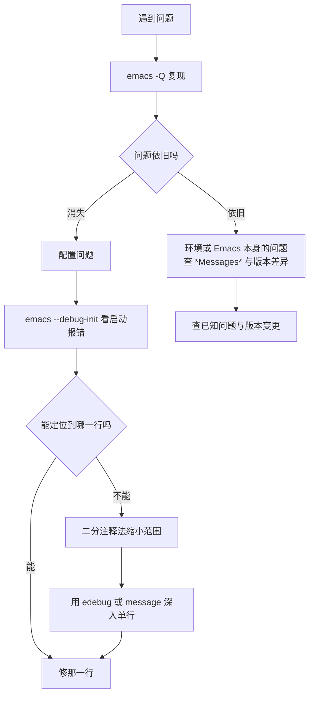
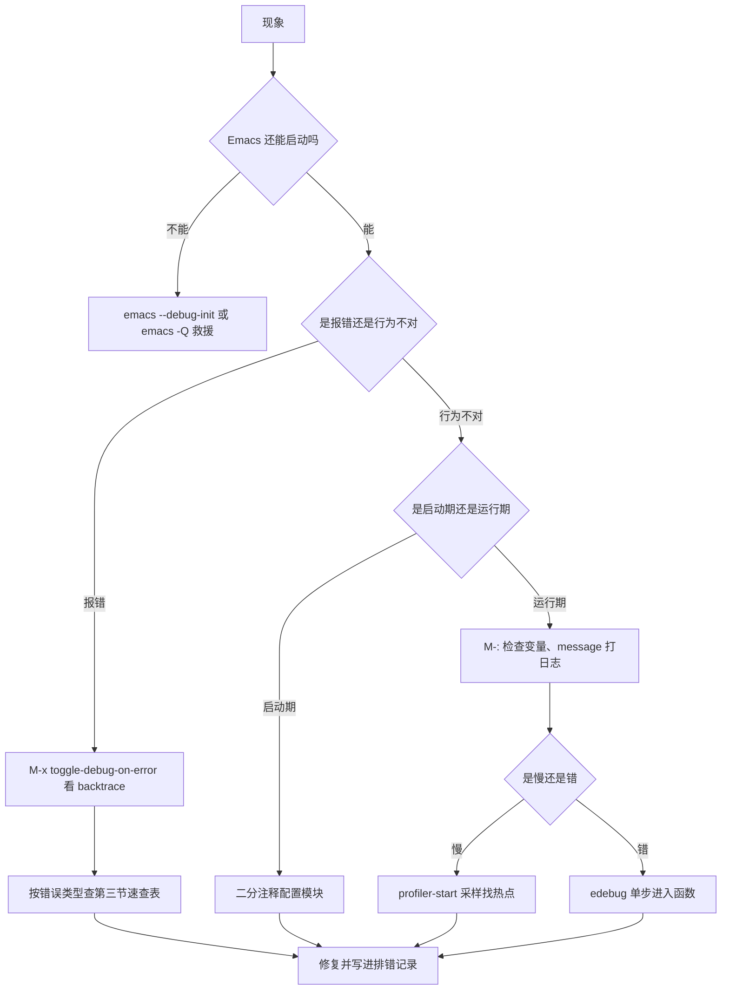

# 调试与性能剖析

> 配置出问题、插件不生效、Emacs 越用越卡——这三件事最终都指向同一项能力：**能定位问题出在哪一行**。本篇把 Emacs 自带的调试与性能工具讲完整，其中的大部分能力在别的编辑器里需要额外装工具才能获得。

---

## 一、先建立排错的基本姿势

在动手之前，先记住三条原则，它们决定了你解决问题的速度。

**第一，永远先确认问题出在配置还是出在 Emacs 本身。** 用 `emacs -Q` 启动一个不加载任何配置的实例，如果问题消失，那就是你的配置问题；如果问题依旧，那是 Emacs 或环境的问题。这一条能省掉一半的排查时间。

**第二，善用 `*Messages*` 缓冲区。** 大部分错误信息、警告、`message` 的输出都在这里，用 `C-h e` 打开。很多人遇到"没有报错但就是不对"的情况，其实 `*Messages*` 里早就写着原因。

**第三，把调试当成写代码的一部分。** 与其反复猜测，不如在关键位置插一句 `(message "到这里了，值是 %S" var)`。这是最朴素也最有效的手段，Elisp 的调试并不总是需要专业工具。



---

## 二、评估与检查：最轻量的四种手段

### 2.1 `M-:` 求值任意表达式

`M-:`（`eval-expression`）会在 minibuffer 里求值你输入的 Elisp 表达式，结果直接显示在回显区。它可以访问当前缓冲区的上下文，所以能用来检查"此刻这个变量的值是什么"：

```elisp
;; 查看当前 major mode
M-: major-mode RET

;; 查看某个变量在当前缓冲区的值
M-: (buffer-local-value 'indent-tabs-mode (current-buffer)) RET

;; 试探一个函数的行为
M-: (string-trim "  hello  ") RET
```

### 2.2 `C-x C-e` 与 `C-M-x`：就地求值

| 键位 | 命令 | 行为 |
|------|------|------|
| `C-x C-e` | `eval-last-sexp` | 求值光标前的一个表达式，结果显示在回显区 |
| `C-M-x` | `eval-defun` | 求值光标所在的整个顶层表达式（如一个 `defun`） |
| `C-u C-M-x` | `edebug-defun` | 用 Edebug 插桩当前函数，见第五节 |

`C-M-x` 有一个很多人不知道的特性：**当它求值一个 `defvar` 或 `defcustom` 时，会强制重新设置变量值**（而 `C-x C-e` 不会）。这意味着改完 `defcustom` 的默认值后想立刻生效，应该用 `C-M-x` 而不是 `C-x C-e`。

### 2.3 `M-x ielm`：交互式 REPL

`M-x ielm` 打开一个 Elisp 交互缓冲区，输入表达式后回车求值，结果直接打印在下方。相比 `M-:`，它的优势是：

- 有历史记录（`M-p`/`M-n`），可以反复修改上一条表达式。
- 输出保留在缓冲区里，方便对照。
- 出错时显示完整的 backtrace，而不是一句话。

调试一段逻辑时，`ielm` 是最舒服的试验场。

### 2.4 `pp` 与宏展开

Elisp 的数据结构常常是嵌套很深的列表，直接打印会挤成一行。用：

| 命令 | 用途 |
|------|------|
| `M-x pp-eval-last-sexp` | 求值并美化打印结果 |
| `M-x pp-macroexpand-last-sexp` | 展开光标前的宏并美化打印 |
| `M-x macroexpand` / `macroexpand-1` | 在 `M-:` 里查看宏展开结果 |

写宏的时候，`pp-macroexpand-last-sexp` 是必需品：它能让你看到宏到底生成了什么代码，而不是靠想象。

---

## 三、错误捕获：让 Emacs 停下来告诉你

### 3.1 打开调试器

| 命令 | 效果 |
|------|------|
| `M-x toggle-debug-on-error` | 任何错误都弹出 backtrace 缓冲区（等价于 `(setq debug-on-error t)`） |
| `M-x toggle-debug-on-quit` | 按 `C-g` 时弹出 backtrace，用于排查"卡住" |
| `M-x debug-on-entry RET 函数名 RET` | 一进入该函数就中断 |
| `M-x cancel-debug-on-entry RET 函数名 RET` | 取消上面的断点 |

`toggle-debug-on-error` 是排查配置问题时的第一选择。打开它，重现问题，backtrace 缓冲区会精确告诉你错误类型、出错函数、以及调用链。

### 3.2 读懂 backtrace

backtrace 缓冲区的每一行是一个**栈帧**，从下往上读是调用顺序，最上面的一帧是出错的位置：

```text
Debugger entered--Lisp error: (void-function my-undefined-helper)
  my-undefined-helper()
  my-broken-command()
  funcall-interactively(my-broken-command)
  call-interactively(my-broken-command record nil)
  command-execute(my-broken-command record)
```

读法：

- **第一行**是错误类型与描述。`void-function` 表示调用了不存在的函数，`void-variable` 表示引用了未定义的变量，`wrong-type-argument` 表示参数类型不对。
- **第二行**是真正出错的位置，通常就是你自己写的代码。
- **往下的行**是调用链，最底部是 Emacs 的命令循环，可以忽略。
- 形如 `#[0 "\300\301!..." ]` 的帧是**字节码函数对象**，说明那一层是编译过的代码（内置库通常是编译过的），看不到源码是正常的；把注意力放在能找到自己代码的那一层。

### 3.3 常见错误类型速查

| 错误 | 典型原因 | 排查方向 |
|------|----------|----------|
| `void-function` | 函数不存在：拼写错误、包没加载、忘写 `(require ...)` | 用 `C-h f` 查函数是否存在 |
| `void-variable` | 变量未定义：`setq` 前就读取、buffer-local 变量在错误缓冲区读取 | 用 `bound-and-true-p` 或 `boundp` 保护 |
| `wrong-type-argument` | 参数类型不对，如把字符串当列表用 | 报错信息里会写明期望类型与实际值 |
| `wrong-number-of-arguments` | 参数个数不对 | 用 `C-h f` 核对签名，注意 `&optional` |
| `args-out-of-range` | 索引越界，常见于对空缓冲区做字符操作 | 检查 `point-min`/`point-max` 边界 |
| `search-failed` | `search-forward` 等函数没找到目标且未处理失败 | 用 `(search-forward x nil t)` 让失败返回 nil |
| `file-missing` | 文件不存在 | 检查路径，注意 `expand-file-name` |
| `quit` | 用户按了 `C-g` | 若被 `condition-case` 捕获，注意不要吞掉用户的中断意图 |

一个实践建议：**写插件时，把 `(error ...)` 与 `user-error` 用对。** `user-error` 用于"用户操作不当"（例如在空区域上执行命令），它不会触发调试器、也不会写进 `*Messages*` 的报错记录，是更礼貌的做法。

---

## 四、Edebug：单步调试 Elisp

Edebug 是 Emacs 自带的源码级调试器，可以单步执行 Elisp 函数、查看每一步的变量值。

### 4.1 最小用法

1. 把光标放在某个 `defun` 上，按 `C-u C-M-x`（插桩该函数）。
2. 调用这个函数（例如 `M-x` 执行它，或在正常操作中触发它）。
3. Edebug 会在函数入口停下来，光标处显示 `=>`，回显区显示当前表达式。
4. 按 `SPC` 单步，按 `g` 一直运行下去。
5. 调试结束后按 `q` 退出，或者再次按 `C-u C-M-x` 取消插桩。

### 4.2 常用键位

| 键位 | 作用 |
|------|------|
| `SPC` | 单步执行，进入函数调用内部 |
| `g` | 继续运行，直到下一个断点或结束 |
| `t` | 跟踪模式：边执行边显示每个表达式 |
| `c` | 继续模式：只在断点或错误处停下 |
| `S` | 停在下一个断点 |
| `i` | 步入光标所在的函数调用 |
| `o` | 步出当前函数 |
| `f` | 向前执行一个表达式（不进入内部） |
| `b` | 在当前位置设置断点 |
| `u` | 取消当前位置的断点 |
| `e` | 在回显区求值一个表达式（可访问当前作用域的变量） |
| `q` | 退出调试，不再插桩该函数 |

在 Edebug 会话里按 `C-h m` 可以查看完整的当前键位表——**这是最可靠的做法**，因为 Edebug 的键位比这里列出的多得多。

### 4.3 什么时候该用 Edebug

- 函数逻辑复杂，靠 `message` 需要插很多行才能定位。
- 需要观察循环中变量的变化过程。
- 需要弄清某个回调到底被调用了几次、参数是什么。

什么时候不该用：**问题涉及宏展开或者涉及定时器与异步回调时，Edebug 的体验会很差**。宏优先用 `pp-macroexpand-last-sexp` 看展开结果，异步回调优先用 `message` 打日志。

### 4.4 与 edebug 相关的两个注意点

- 插桩状态**不会随文件保存而保留**：重新加载文件后需要再次 `C-u C-M-x`。
- 忘记取消插桩会导致之后每次调用都在断点停下，感觉像"Emacs 坏了"。用 `M-x cancel-debug-on-entry` 或者重新加载文件即可恢复。正确做法是调试完按 `q` 退出并重新求值一次函数。

---

## 五、字节编译与警告

### 5.1 编译单个文件

| 操作 | 命令 |
|------|------|
| 编译当前文件 | `M-x byte-compile-file` |
| 在 Elisp 里编译 | `(byte-compile-file "foo.el")` |
| 命令行批量编译 | `emacs -Q --batch -f batch-byte-compile foo.el bar.el` |
| 查看编译警告 | 编译过程的输出会显示在 `*Compile-Log*` 缓冲区 |

用命令行批量编译自己的配置，是配置工程化里非常实用的一招（详见 [[emacs教程/3配置实践/01_配置工程化|配置工程化]]）：

```bash
# 编译 lisp 目录下的全部配置文件，警告会打印到终端
emacs -Q --batch -L lisp -f batch-byte-compile lisp/*.el
```

### 5.2 常见警告逐条解读

| 警告 | 含义 | 修法 |
|------|------|------|
| `Warning: reference to free variable 'foo'` | 引用了未声明的变量 | 用 `(defvar foo)` 做前置声明，或修正拼写 |
| `Warning: Unused lexical variable 'x'` | `let` 绑定了但没用到 | 删掉它；如果是为了保持签名，改名加下划线前缀只是习惯而非语法 |
| `Warning: the function 'foo' is not known to be defined` | 调用了编译器不认识的函数 | `(require 'some-package)` 或 `(declare-function foo "file")` |
| `Warning: docstring wider than 80 characters` | 文档字符串超长 | 折行，这影响 `C-h f` 的显示 |
| `Warning: defvar 'foo' docstring ...` | 文档字符串格式问题 | 首行写成完整句子，参数名用大写 |
| `Warning: 'old-func' is an obsolete function` | 使用了已废弃 API | 换成替代函数，旧版本兼容用 `fboundp` 判断 |
| `Warning: empty body in function` | 函数体是空的 | 补上实现或写 `nil` |
| `Warning: Lexical argument shadows the dynamic variable` | 词法变量与动态变量重名 | 改名，否则行为可能出乎意料 |

**警告不是错误，但值得全部处理干净。** 原因很实际：警告里藏着真正的 bug——`free variable` 往往是拼写错误，`not known to be defined` 往往意味着运行时真的会 `void-function`。把警告清零之后，"突然多出一条警告"就成为一个极强的信号。

### 5.3 消除误报

有些警告是编译器理解能力有限造成的，例如通过 `funcall` 动态调用、或者父模式在运行时才定义函数。这时用：

```elisp
;; 声明一个在别处定义的函数
(declare-function my-other-package-do-thing "my-other-package")

;; 声明一个在别处定义的变量
(defvar my-other-package-state)

;; 在极少数情况下抑制特定警告（不要滥用）
(with-no-warnings
  (require 'some-old-package))
```

`with-no-warnings` 会连带屏蔽里面真实的错误，因此只应在确认警告是误报且无法用声明解决时使用。

---

## 六、性能剖析

### 6.1 采样剖析器：找出"哪里慢"

`profiler` 是内置的采样式剖析器，用于回答"这段时间 CPU 花在哪些函数上"。

```elisp
;; 1. 开始采样（cpu 模式，另有 mem 模式）
M-x profiler-start RET cpu RET

;; 2. 重现你觉得慢的操作（启动 Emacs、打开大文件、执行某个命令）

;; 3. 查看报告
M-x profiler-report RET

;; 4. 结束采样
M-x profiler-stop RET
```

`profiler-report` 缓冲区是一个可展开的树：每个节点显示函数名、在该函数中花费的采样数（`+` 之前是自身耗时，之后是含子调用的总耗时）。**按自身耗时排序，找出占用最高的几项，那就是优化目标。**

几条读报告的经验：

- 排在前面的是 `garbage-collect` 或与内存分配相关的函数，通常说明你的代码在循环里频繁产生临时对象（用 `string-join` 代替反复 `concat`、用 `push` 加 `nreverse` 代替反复 `append`）。
- 排在前面的是 `redisplay` 或 `font-lock-*`，说明瓶颈在**显示**而不是计算：可能是行号、高亮、overlay 过多。
- 排在前面的是 `file-remote-p` 或 `tramp-*`，说明有代码在远程路径上做了同步操作（TRAMP 场景下的经典问题）。

### 6.2 计时：量化"快了多少"

改完代码，必须用数字确认真的变快了。

```elisp
;; 运行 100 次，返回 (总耗时 垃圾回收次数 回收总耗时)
(benchmark-run 100 (my-slow-function))

;; 对比编译后与解释执行的差异
(benchmark-run-compiled 100 (my-slow-function))

;; 测量配置加载耗时
(benchmark-run 1 (load "init"))
```

返回值三个数字的含义：总共花了多少秒、期间 GC 了多少次、GC 占了多少秒。如果 GC 占的比例很高，先解决内存分配问题，比微调算法更有效。

### 6.3 函数级剖析：elp

`elp`（Emacs Lisp Profiler）统计每个函数被调用了多少次、每次平均多久。它适合回答"这个函数到底被调用了多少次"这类问题——这类问题采样剖析器答不上来。

```elisp
;; 对一个包的所有函数插桩
M-x elp-instrument-package RET my-package RET

;; 或只对一个函数插桩
M-x elp-instrument-function RET my-function RET

;; 正常使用 Emacs，重现问题

;; 查看统计结果
M-x elp-results RET

;; 全部取消
M-x elp-restore-all RET
```

结果表里的 `Calls` 列常常带来惊喜：你以为只调用一次的函数可能被调用了上千次，这正是它慢的原因。

### 6.4 启动耗时测量

```elisp
;; 直接查看启动耗时（返回一个字符串，如 "0.42 seconds"）
M-: (emacs-init-time) RET

;; 精确测量某个模块的加载时间
(benchmark-run 1 (require 'org))

;; 把启动耗时写进 *Messages*，方便每次启动后查看
(add-hook 'emacs-startup-hook
          (lambda ()
            (message "启动耗时：%s" (emacs-init-time))))
```

启动优化是一个独立话题，完整的测量方法与优化清单见 [[emacs教程/7进阶/01_启动加速与性能优化|启动加速与性能优化]]。

### 6.5 内存与垃圾回收

| 工具 | 用途 |
|------|------|
| `M-x profiler-start RET mem RET` | 按内存分配量剖析，找出"谁在制造垃圾" |
| `M-: (garbage-collect) RET` | 手动触发一次 GC，返回各类型的对象数量与内存占用 |
| `M-: (memory-info) RET` | 查看系统物理内存与交换分区的总量与可用量 |
| `C-h v gc-cons-threshold RET` | 查看 GC 触发阈值 |

关于 GC 阈值有一个必须澄清的常见误解：**把 `gc-cons-threshold` 调大并不能让代码变快，它只是把垃圾回收推迟。** 在启动阶段临时调大（避免启动过程中反复 GC）是合理的；常驻调大只会让内存一直涨、最后在一次巨大的 GC 里卡住。正确写法见启动加速章节。

### 6.6 长时间运行的问题

Emacs 可以连续运行几周不重启，这既是优势也是隐患。常见的三类"慢性病"：

| 症状 | 成因 | 排查与解决 |
|------|------|------------|
| 内存持续增长不回落 | 定时器泄漏、overlay 泄漏、缓冲区未 kill | 用 `M-x list-processes` 看进程，用 `(length (window-list))` 之类检查；重点查自己写的 `run-with-timer` 是否在关闭模式时取消 |
| 空闲时 CPU 占用高 | idle 定时器过于频繁，或每次都做重活 | 检查 `run-with-idle-timer` 的间隔，把重活改成只在必要时执行 |
| 越用越卡 | 打开的缓冲区过多、undo 历史过大、某个 minor mode 的开销累积 | 用 `M-x profiler-start` 采一次样，看是不是显示层的问题 |

写定时器时的两条纪律：**保存 timer 对象**（否则无法取消），**在关闭功能时 `cancel-timer`**。忘记取消的定时器会在你关闭功能后继续运行，这是最典型的慢性资源泄漏。

---

## 七、把排查经验沉淀下来

调试能力会随时间增长，但记忆不会。建议建立两个习惯。

**第一，把每次解决的问题写进一个 Org 文件。** 格式不必复杂：

```org
* 问题：启动时提示 Symbol's value as variable is void: my-leader-map
  原因：变量定义在 use-package 的 :config 块里，但 :bind 在加载前就引用了它
  解决：把 defvar 移到 :init 块，或用 define-prefix-command 提前创建键位图
  日期：2026-09-13
```

半年之后，这份文件会比任何教程都更贴合你的实际环境。

**第二，在配置启动时加一段自检。** 与其在出错后排查，不如在启动阶段就把隐患暴露出来：

```elisp
(defun my-check-environment ()
  "启动时检查关键依赖与版本，异常时在 *Messages* 中报告。"
  (let ((problems nil))
    ;; 检查 Emacs 版本
    (unless (version<= "29" emacs-version)
      (push (format "Emacs 版本过低：%s，建议 29 及以上" emacs-version) problems))
    ;; 检查必需的外部命令是否存在
    (dolist (cmd '("git" "rg"))
      (unless (executable-find cmd)
        (push (format "找不到外部命令：%s" cmd) problems)))
    ;; 检查动态模块是否可用
    (unless (fboundp 'module-load)
      (push "当前 Emacs 未启用动态模块支持" problems))
    (when problems
      (message "环境自检发现 %d 个问题：\n%s"
               (length problems)
               (string-join (nreverse problems) "\n")))))

(add-hook 'emacs-startup-hook #'my-check-environment)
```

这段代码的价值在于把"隐性依赖"变成"启动时可见的提示"。它同时也是这篇教程里讲到的多个知识点的实际应用：hook、`dolist`、`executable-find`、`string-join`、`push` 加 `nreverse`。

---

## 八、一份排错流程速查



---

## 小结

- 排查的第一步永远是 `emacs -Q` 区分"配置问题"和"环境问题"，第二步永远是看 `*Messages*`。
- `M-:`、`C-M-x`、`ielm`、`pp-macroexpand-last-sexp` 这四件轻量工具能解决日常八成的疑问。
- `toggle-debug-on-error` 加 backtrace，是定位报错的标准路径；学会区分 `void-function`、`void-variable`、`wrong-type-argument` 这几类错误，排查速度会立刻上一个台阶。
- Edebug 适合单步调试同步逻辑；宏用宏展开看，异步回调用 `message` 打日志。
- 字节编译警告必须清零——它是免费的静态检查，藏着真实的 bug。
- 性能问题先用 `profiler-start` 定位热点，再用 `benchmark-run` 量化改善，不要凭直觉改代码；`elp` 用来回答"这个函数被调用了多少次"。
- 定时器与 overlay 是长期运行中最常见的资源泄漏源，写的时候就要保证能被正确清理。

---

## 相关章节

- [[emacs教程/2Elisp语言/05_控制流错误处理与迭代|控制流、错误处理与迭代]]：`condition-case`、`unwind-protect` 与错误类型
- [[emacs教程/2Elisp语言/03_函数闭包与宏|函数、闭包与宏]]：用 `pp-macroexpand-last-sexp` 调试宏
- [[emacs教程/4插件开发/02_编写MinorMode|编写 Minor Mode]]：模式关闭时的资源清理
- [[emacs教程/7进阶/01_启动加速与性能优化|启动加速与性能优化]]：把测量方法用于启动优化
- [[emacs教程/7进阶/04_常见故障排查|常见故障排查]]：按现象组织的急救手册
