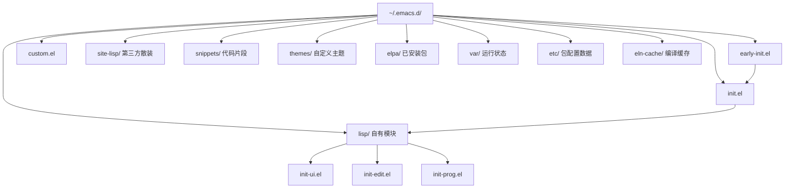
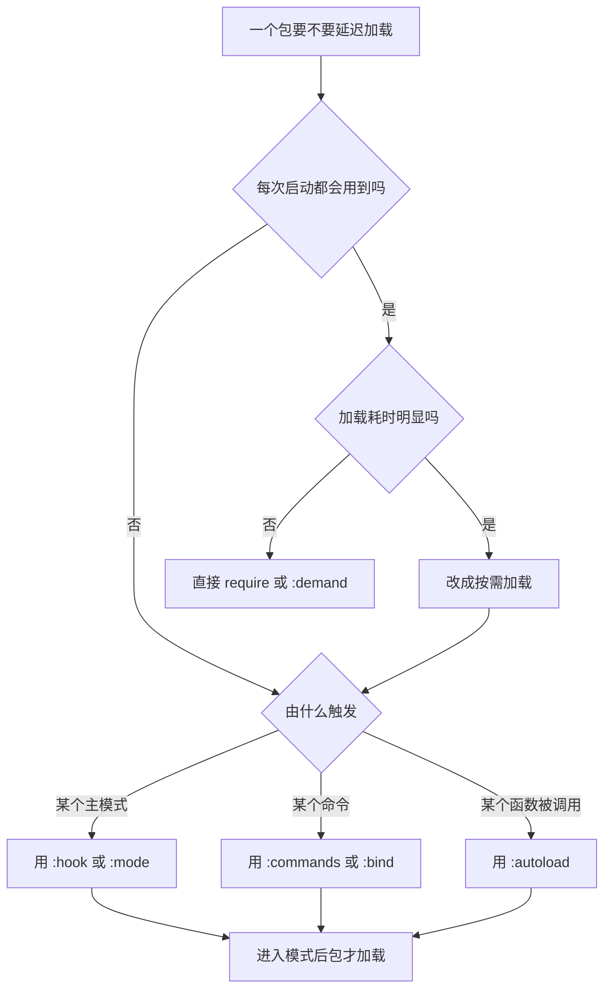
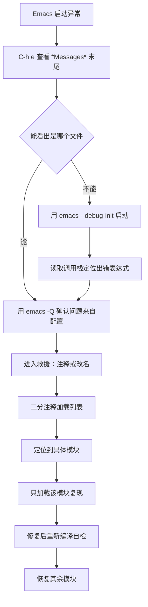

# 配置工程化

> 当 `init.el` 从几十行长到上千行，改一处崩一片就是必然结果。本篇讲的是把个人配置当成一个小型软件工程来组织：目录怎么分、模块怎么拆、什么时候加载、出错怎么救、怎么用 CI 兜底。适合已经能独立写 `init.el`、但配置开始失控的读者。

---

## 一、为什么不要把一切塞进单个 init.el

### 1.1 单文件配置的真实困境

Emacs 完全可以只靠一个 `init.el` 运行一辈子。问题不在于"能不能"，而在于**维护成本随行数非线性上升**。下面是长期维护单文件配置的人几乎都会遇到的具体麻烦，不是假设：

- **定位困难**。想改 Python 的缩进，你得在三千行里搜索 `python`，命中十几处，其中一半是注释掉的旧代码。改动前必须先读懂上下文，改动后不敢删旧代码。
- **改一处崩全部**。所有代码都在同一个求值序列里，第 1200 行的一个括号错位会让第 1201 行之后的全部配置失效。Emacs 启动只报一个错，后面的设置悄悄不生效。
- **无法做局部实验**。想试一个新包的配置，只能注释掉一大段再粘贴新代码，试完再换回来。稍不留神就丢改动。
- **无法复用**。工作机和家用机想共用一部分配置，只能整文件复制，然后手工合并差异。
- **无法测试**。单文件没有"加载某个模块"这个动作，写出来的东西只能靠人肉启动验证。
- **Git 历史噪音**。每次改动都是对同一个文件的整体重写，`git diff` 又长又碎，出问题回溯时很难判断哪次提交引入了故障。
- **启动性能无从优化**。所有包都在启动时 `require`，想找出到底是谁拖慢启动，只能靠猜。

### 1.2 一个可操作的经验阈值

不需要等到三千行才动手。出现下面任意两条，就该开始拆：

| 信号 | 说明 |
|------|------|
| 文件超过 500 行 | 单个文件已经不适合一屏浏览 |
| 出现两处以上功能重复的配置 | 说明缺少统一的辅助函数位置 |
| 需要注释掉大段代码才能试验 | 说明缺少模块边界 |
| 启动时总要盯着 `*Messages*` 看有没有报错 | 说明缺少错误隔离 |
| 两台机器要维护两份几乎相同的文件 | 说明缺少可复用的目录结构 |

拆分的核心思路只有一句话：**把"一类事情"的配置放进"一个文件"，然后在启动时按需把它们加载进来**。剩下的所有工程化手段都围绕这句话展开。

---

## 二、推荐的目录结构

### 2.1 完整目录树

下面这套结构是 `no-littering`、Prelude、Centaur Emacs 等成熟配置的共同做法的综合，命名与职责都比较通用。

```text
~/.emacs.d/                     # 或 ~/.config/emacs/，Windows 见 2.4
├── early-init.el               # 最早加载，包系统与第一帧相关设置
├── init.el                     # 主入口，只做加载与编排，尽量短
├── custom.el                   # Customize 界面写入的文件，不进 Git
├── lisp/                       # 你自己的模块，进 Git
│   ├── init-ui.el
│   ├── init-edit.el
│   ├── init-completion.el
│   ├── init-prog.el
│   └── init-org.el
├── site-lisp/                  # 第三方散装 .el，进来的东西不归你维护
├── snippets/                   # yasnippet 代码片段
├── themes/                     # 自己写的或改过的主题 .el
├── elpa/                       # package.el 安装的包，不进 Git
├── var/                        # 各类包的状态数据（no-littering 约定）
├── etc/                        # 各类包的配置数据（no-littering 约定）
└── eln-cache/                  # native-comp 编译产物缓存，不进 Git
```

### 2.2 各目录职责

| 路径 | 职责 | 是否进 Git | 备注 |
|------|------|-----------|------|
| `early-init.el` | 包系统开关、GC 阈值、第一帧参数 | 是 | 可选，但推荐有 |
| `init.el` | 加载顺序编排、`load-path` 设置、全局变量 | 是 | 控制在 100 行以内 |
| `custom.el` | Customize 界面自动写入的内容 | 否 | 用 `custom-file` 指向它 |
| `lisp/` | 你自己写的模块 | 是 | 需要通过 `load-path` 暴露 |
| `site-lisp/` | 从别处下载、未打包的 `.el` | 视情况 | 也需手动加入 `load-path` |
| `snippets/` | yasnippet 片段目录 | 是 | 由 `yas-snippet-dirs` 指向 |
| `themes/` | 自定义主题文件 | 是 | 由 `custom-theme-load-path` 指向 |
| `elpa/` | `package.el` 安装的包 | 否 | 即 `package-user-dir` 默认值 |
| `var/` | 包产生的可变状态数据 | 否 | 由 `no-littering` 重定向 |
| `etc/` | 包产生的配置类数据 | 视情况 | 同上 |
| `eln-cache/` | native-comp 的 `.eln` 缓存 | 否 | 属于 `native-comp-eln-load-path` |

默认值可以从 Emacs 里直接确认，不要凭记忆：

```elisp
;; 逐个求值，确认这些路径的真实取值
M-: package-user-dir RET
;; 输出通常为 ~/.emacs.d/elpa

M-: native-comp-eln-load-path RET
;; 输出形如 ("~/.emacs.d/eln-cache/" "/usr/lib/emacs/30.1/native-lisp/")
```

### 2.3 目录结构图



### 2.4 三平台路径差异

- **GNU/Linux 与 macOS**：`~/.emacs.d/` 是传统位置，`~/.config/emacs/` 是 XDG 位置，两者都能用，Emacs 会依次查找。
- **Windows**：Emacs 启动时若没有显式的 `HOME` 环境变量，会把 `HOME` 设为 `%APPDATA%`（即 `C:\Users\<用户名>\AppData\Roaming`），配置文件于是落在 `%APPDATA%\.emacs.d\init.el`。如果你自己设过 `HOME=%USERPROFILE%`，位置就变成 `%USERPROFILE%\.emacs.d\init.el`。
- **不要靠记忆判断**。任何平台上都执行一次下面这行，输出就是答案：

```elisp
M-: user-init-file RET
M-: user-emacs-directory RET
```

`user-emacs-directory` 是 Emacs 认定的配置根目录，本篇其余部分的 `~/.emacs.d/` 都可以替换成它。

---

## 三、early-init.el 与 init.el 的分工

### 3.1 加载时机差别

`early-init.el` 与 `init.el` 同级，加载顺序在 `init.el` 之前，而且早到**包系统还没有初始化、图形界面的第一帧还没有创建**。这个时间差决定了它能做什么、不能做什么。

GNU Emacs 手册（Early Init File 一节）对此的说明是：这个文件在包系统和 GUI 初始化之前加载，因此可以在其中定制**影响包初始化过程的变量**，例如 `package-enable-at-startup`、`package-load-list`、`package-user-dir`。手册同时明确写道，**不推荐**把本来可以放在普通 init 文件里的定制搬进 `early-init.el`，因为 GUI 相关的设置在 GUI 初始化之前读取并不可靠。

### 3.2 该放什么

| 内容 | 变量或形式 | 理由 |
|------|-----------|------|
| 是否自动激活已安装包 | `package-enable-at-startup` | 必须在包系统初始化前设定 |
| 允许加载哪些包 | `package-load-list` | 同上 |
| 包安装目录 | `package-user-dir` | 同上 |
| 快速启动缓存 | `package-quickstart` | 影响 `package-initialize` 的行为 |
| 启动期 GC 阈值 | `gc-cons-threshold` | 只在启动阶段临时放宽，见 3.4 |
| 优先加载较新的源文件 | `load-prefer-newer` | 与包加载顺序无关的全局策略 |
| 第一帧的初始参数 | `default-frame-alist`、`initial-frame-alist` | 纯变量赋值，不依赖 GUI 是否就绪 |
| 关闭启动画面 | `inhibit-startup-screen` | 纯变量，越早设越好 |

注意 `package-archives` 这类**只影响新包安装、不影响已装包激活**的变量，手册说明可以放在普通 init 文件里，不必挤进 `early-init.el`。

### 3.3 不该放什么

- **`use-package` 声明**。`use-package` 依赖包系统已经可用，在 `early-init.el` 里写 `:ensure` 之类的东西不会按预期工作。所有 `use-package` 一律放 `init.el` 或 `lisp/` 下的模块。
- **`require` 第三方包**。此时 `package-initialize` 还没跑，`load-path` 里没有第三方包。
- **依赖第一帧存在的代码**。例如 `(frame-parameter nil 'font)`、`(set-face-attribute 'default nil ...)` 的字体测量、`(display-graphic-p)` 之外的图形能力探测，都可能读到不完整的状态。
- **`after-init-hook` 上的工作**。这个钩子在 `early-init.el` 里注册本身没问题，但把它当成"early 阶段就能完成的事情"就错了。
- **调用 `menu-bar-mode` / `tool-bar-mode` / `scroll-bar-mode` 关界面元素**。这是社区里最常见的写法，也确实能避免"第一帧画出来再消失"的闪烁；但按手册的说法，GUI 相关定制在 `early-init.el` 里不可靠。稳妥的做法是改用纯变量 `default-frame-alist`（见 3.4），把模式函数的调用留给 `init.el`。

### 3.4 完整的 early-init.el

```elisp
;; -*- lexical-binding: t; -*-
;; ~/.emacs.d/early-init.el
;; 加载时机：包系统初始化之前、第一帧创建之前。

;;; 一、包系统
;; 不在启动时自动激活已安装的包，改由 init.el 显式控制加载时机。
;; 如果你的 init.el 完全依赖 use-package 的 :ensure，保持这里的默认值 t 也可以，
;; 只要后续逻辑一致即可，关键是不要两边打架。
(setq package-enable-at-startup nil)

;; 安装目录固定下来，方便做备份与迁移。
(setq package-user-dir (locate-user-emacs-file "elpa"))

;;; 二、启动期性能
;; 启动阶段临时把 GC 阈值调高，减少加载大量 Elisp 时的垃圾回收次数。
;; 这个值只在启动期间有效，启动完成后必须还原，否则日常编辑会出现卡顿。
(setq gc-cons-threshold most-positive-fixnum)

;; 读文件时优先使用比 .elc 更新的 .el，避免手工改源码后不生效。
(setq load-prefer-newer t)

;;; 三、第一帧外观
;; 用纯变量描述第一帧，避免"先画出来再改"的闪动。
;; 背景色和字体不在这里写死，交给主题与 init.el 处理。
(add-to-list 'default-frame-alist '(menu-bar-lines . 0))
(add-to-list 'default-frame-alist '(tool-bar-lines . 0))
(add-to-list 'default-frame-alist '(vertical-scroll-bars . nil))

;; 不显示启动画面，也不显示 echo 区的"关于 GNU Emacs"提示。
(setq inhibit-startup-screen t)
(setq inhibit-startup-echo-area-message user-login-name)

;;; 四、启动结束后还原 GC 阈值
(add-hook 'emacs-startup-hook
          (lambda ()
            ;; 16 MiB 是一个常见起点，可按机器内存调整。
            (setq gc-cons-threshold (* 16 1024 1024))))
```

把这段存成 `early-init.el` 后重启 Emacs。若某个设置没生效，先用 `M-: gc-cons-threshold RET` 之类的表达式确认变量当前值，再判断是加载顺序问题还是写法问题。

---

## 四、模块化的三种方案

### 4.1 方案一：手写 require 拆分

最朴素也最容易理解的方案：把配置按主题拆成若干文件放进 `lisp/`，在 `init.el` 里用 `require` 依次加载。

**目录约定**：每个模块文件提供一个与文件名同名的特性（feature），文件末尾必须有 `(provide '模块名)`。

```elisp
;; -*- lexical-binding: t; -*-
;; ~/.emacs.d/lisp/init-ui.el
;; 职责：界面元素的开关与外观。

;;;###autoload
(defun my-ui-setup ()
  "集中设置界面开关。"
  (interactive)
  ;; 关闭不需要的界面元素，每个都做存在性判断，保证终端下不报错。
  (when (fboundp 'menu-bar-mode) (menu-bar-mode -1))
  (when (fboundp 'tool-bar-mode) (tool-bar-mode -1))
  (when (fboundp 'scroll-bar-mode) (scroll-bar-mode -1))
  (when (fboundp 'set-fringe-mode) (set-fringe-mode 8))
  ;; 行号只在图形界面下开，终端下开了会明显变慢。
  (when (display-graphic-p)
    (global-display-line-numbers-mode 1))
  (setq inhibit-startup-screen t))

(my-ui-setup)

(provide 'init-ui)
```

```elisp
;; -*- lexical-binding: t; -*-
;; ~/.emacs.d/lisp/init-edit.el
;; 职责：编辑行为的默认值。

;; 用 setq-default 设置缓冲区局部变量，否则只影响当前缓冲区。
(setq-default indent-tabs-mode nil)     ; 使用空格缩进
(setq-default tab-width 4)              ; 制表位宽度
(setq-default truncate-lines nil)       ; 超长行自动折行

(setq sentence-end-double-space nil)    ; 句末单空格即可
(setq confirm-kill-emacs 'yes-or-no-p)  ; 退出时确认

(provide 'init-edit)
```

```elisp
;; -*- lexical-binding: t; -*-
;; ~/.emacs.d/init.el
;; 职责：把 lisp/ 挂上 load-path，然后按顺序加载模块。保持短小。

;; 把自己写的模块目录加进 load-path，必须加在 require 之前。
(add-to-list 'load-path (locate-user-emacs-file "lisp"))

;; 按顺序加载。顺序有意义：后面的模块可以覆盖前面的设置。
(require 'init-ui)
(require 'init-edit)
```

这里涉及 Emacs 的"特性（feature）"机制，值得单独说清楚，因为它是整个模块化方案的地基。

`require` 的参数不是文件名，而是一个**特性符号**。当 `(require 'init-ui)` 被求值时，Emacs 先检查 `features` 这个列表里有没有 `init-ui`：有就直接返回，什么都不做；没有才去 `load-path` 里找 `init-ui.el` 或 `init-ui.elc`，加载它，然后检查加载之后 `features` 里是否出现了 `init-ui`。如果文件加载完了但 `(provide 'init-ui)` 没有执行，Emacs 会报错说这个文件没有提供该特性。这就是为什么每个模块文件末尾必须有 `(provide ...)`。

理解这一点之后，两个常见现象就有了解释：

- **同一个模块 `require` 两次只会加载一次**，因为第二次在 `features` 里已经命中了。这既是优点（省时间）也是陷阱（改了模块文件后，当前会话里再 `require` 不会重新加载，必须 `M-x unload-feature` 或重启，或者直接用 `M-x eval-buffer` 对文件求值）。
- **文件名与特性名不一致时不会报错，但会让人迷惑**。约定俗成的做法是让两者完全相同，本篇所有示例都遵守这条约定。

**优点**：零依赖，任何 Emacs 版本都能跑；加载顺序完全显式；每个文件都能单独 `M-x eval-buffer` 验证；出错时调用栈短，容易定位。
**缺点**：包延迟加载要自己写 `with-eval-after-load` 或 autoload；装包要靠 `package-install` 手工做；模块之间的依赖关系要靠人记，没有声明式的地方可以查。

### 4.2 方案二：use-package 分组

`use-package` 从 **Emacs 29 起随发行版提供**（Emacs 28 及更早需要自己装）。它把"装包、延迟加载、设置变量、绑定键位、挂钩子"合并成一个声明块。

```
M-x package-install RET use-package RET
```

Emacs 29 与 30 都内置了它，上面这条命令只在需要升级到 GNU ELPA 上的新版本时才用；要让 `package-install` 愿意升级内置包，需要把 `package-install-upgrade-built-in` 设为非 `nil`（这个选项是 Emacs 29 新增的）。

在 `init.el` 里先做全局设定，再写分组声明：

```elisp
;; -*- lexical-binding: t; -*-
;; ~/.emacs.d/init.el（use-package 版本）

;;; 全局策略
(require 'use-package)

;; 声明了 :ensure t 就自动安装，省去逐个 M-x package-install。
(setq use-package-always-ensure t)

;; 默认延迟加载。注意这个选项会让"忘记写 :demand 的包"一直不加载，
;; 新手期建议先设 nil，等熟悉了再打开。
(setq use-package-always-defer nil)

;; 让 use-package 声明出现在 imenu 里，方便 C-c C-j 之类跳转。
(setq use-package-enable-imenu-support t)

;; 报错时打印更详细的信息，排查阶段有用。
(setq use-package-verbose t)

;;; 界面分组，对应原来的 lisp/init-ui.el
(use-package emacs                 ; emacs 是 use-package 的特殊伪包名，用来设置内置变量
  :custom
  (inhibit-startup-screen t)
  (sentence-end-double-space nil)
  (confirm-kill-emacs 'yes-or-no-p)
  :config
  (menu-bar-mode -1)
  (tool-bar-mode -1)
  (scroll-bar-mode -1)
  (set-fringe-mode 8))

;;; 编辑分组
(use-package emacs
  :custom
  (indent-tabs-mode nil)
  (tab-width 4))

;;; 第三方包分组，按需延迟加载
(use-package vertico
  :init
  (vertico-mode 1))
```

**优点**：装包与配置写在一起，迁移到新机器时启动一次就自动补齐；延迟加载的写法统一；`C-h` 系列帮助能直接跳到声明处。
**缺点**：多一层宏，宏展开后的行为需要理解；`use-package-always-ensure` 会让配置强依赖网络；出错时的调用栈比手写 `require` 长。

`use-package` 的关键字在 Emacs 30 中新增了 `:vc`，可以用 `package-vc` 从版本库直接安装源码包；Emacs 29 没有这个关键字，写了会报未知关键字。

### 4.3 方案三：literate config

把配置写成 Org 文件（通常是 `init.org`），用 `org-babel-tangle` 把其中的代码块"编织"成真正的 `.el` 文件。人读 Org，机器读 `.el`。

最小可用流程：

1. 新建 `~/.emacs.d/init.org`，在文件头部写一个 `init.el` 的代码块：

```org
#+title: 我的 Emacs 配置
#+PROPERTY: header-args:emacs-lisp :tangle yes

* 启动基础
** 界面开关
这一段说明为什么关掉菜单栏：屏幕空间有限，菜单栏条目几乎用不到。

#+begin_src emacs-lisp
(menu-bar-mode -1)
(tool-bar-mode -1)
#+end_src

** 只写进 init.el 的入口代码
这个代码块指定 :tangle 到具体文件，并且用 :comments no 避免把 Org 的注释带进生成文件。

#+begin_src emacs-lisp :tangle ~/.emacs.d/init.el :comments no
;; 这一行由 org-babel-tangle 生成，不要手工编辑生成结果
(add-to-list 'load-path (locate-user-emacs-file "lisp"))
#+end_src
```

2. 在命令行里执行编织：

```bash
# 从 init.org 生成 .el 文件。--eval 后面的表达式在批处理模式下运行。
$ emacs -Q --batch --eval "(progn (require 'org) (org-babel-tangle-file \"$HOME/.emacs.d/init.org\"))"
```

3. 或者在 Emacs 里执行 `M-x org-babel-tangle`（快捷键 `C-c C-v t`），只编织当前文件。想控制编织目标，可以在代码块上写 `:tangle 文件名`，也可以写 `:tangle no` 表示这个块只用于展示、不生成代码。

**`org-babel-tangle` 的用法要点**：

| 写法 | 含义 |
|------|------|
| `#+PROPERTY: header-args:emacs-lisp :tangle yes` | 本文件所有 emacs-lisp 块都参与编织 |
| `:tangle no` | 该块不生成代码，只作为文档 |
| `:tangle ~/.emacs.d/init.el` | 该块写入指定文件 |
| `:tangle lisp/init-ui.el` | 相对路径，相对 Org 文件所在目录解析 |
| `:comments no` | 生成的文件里不带 Org 自动加的注释头 |
| `:mkdirp yes` | 目标目录不存在时自动创建 |

**优点**：配置和"为什么这么配"写在同一处，半年后回看不用猜；可以给一个包写大段说明再配代码；生成的 `.el` 与手写文件没有区别。
**缺点**：多了一道生成步骤，改完 Org 必须记得重新编织，否则改的是"源码"、跑的是"旧产物"；出问题时要在 Org 与生成文件之间来回对照；Git 里同时存在 Org 与生成的 `.el`，需要决定哪个进版本库。

**明确不推荐新手一开始就用 literate config。** 理由不是它不好，而是它把"写配置"和"维护一套构建流程"两件事绑在了一起。你还在熟悉 `setq`、`require`、hook 的阶段，多一层间接会显著增加排错难度：明明改了配置却没生效，你还得先排除"是不是忘了 tangle"。建议先用方案一手写拆分，等配置稳定、自己确实有写大段说明的需求时，再考虑迁移。

### 4.4 三种方案对比

| 维度 | 手写 require | use-package 分组 | literate config |
|------|-------------|-----------------|----------------|
| 上手难度 | 最低 | 中 | 最高 |
| 需要额外步骤 | 否 | 否 | 是（tangle） |
| 自动装包 | 否 | 是（`:ensure`） | 取决于内部写法 |
| 延迟加载写法 | 手工写 | 关键字声明 | 取决于内部写法 |
| 排错难度 | 低 | 中 | 高 |
| 适合阶段 | 入门到进阶 | 进阶 | 长期维护、有写作需求 |
| Emacs 29 可用 | 是 | 是（内置） | 是 |

实践中最常见的是**方案一与方案二混用**：`init.el` 用 `use-package` 管第三方包，自己写的模块仍然放在 `lisp/` 用 `require` 加载。

---

## 五、加载时机与延迟加载

### 5.1 启动即需与按需加载的判断标准

不是所有配置都值得延迟。判断标准只有两条：

1. **这个东西是不是每次启动都会用到？** 是，就启动即加载。例如主题、字体、行号、键位前缀。
2. **加载它的代价是不是明显？** 加载一个 200 行的轻量包花不了几毫秒，为了"优雅"去延迟它，反而增加配置复杂度。

反之，满足下面条件的应该延迟：

- 只在特定主模式下才需要（`org-mode`、`python-mode`、`markdown-mode`）。
- 只在你主动敲某个命令时才需要（`magit-status`、`dired-sidebar`）。
- 包本身很大或依赖很多（`lsp-mode`、`org`、`magit`、`mu4e`）。
- 只在特定平台上存在（Windows 的 `w32-*` 相关）。

### 5.2 取舍表

| 手段 | 触发时机 | 适用场景 | 注意事项 |
|------|---------|---------|---------|
| 直接加载（`require` 或 `:demand t`） | 启动时立即 | 主题、字体、键位前缀、每次都会用的轻量包 | 用多了会拖慢启动 |
| `:defer t` | 永不自动加载，只等外部触发 | 只通过命令或钩子进入的包 | 写了 `:defer t` 又忘了配触发条件，包就永远不加载 |
| `:defer N` | 启动后空闲 N 秒 | 一定会用、但不急着用的包 | 空闲计时会被用户操作打断，实际时机不确定 |
| `:hook (模式 . 函数)` | 进入指定主模式时 | 只在某种文件里生效的配置 | 钩子名必须真实存在，写错不会报错、只会静默失效 |
| `:commands (命令…)` | 第一次调用这些交互命令时 | 通过 `M-x` 触发的包 | 只对交互命令建立 autoload |
| `:autoload (函数…)` | 第一次调用这些非交互函数时 | 被别的代码调用的入口函数 | 与 `:commands` 的区别是目标不要求是交互命令 |
| `:mode ("\\.py\\'" . python-mode)` | 打开匹配的文件时 | 主模式与扩展名绑定 | 正则要写对，否则模式不激活 |
| `:bind` | 第一次按键时（配合 `:commands`） | 只通过键位进入的命令 | 单独用 `:bind` 不会延迟加载，需配合延迟关键字 |

### 5.3 把重包推迟到首次使用

`org`、`magit`、`lsp-mode` 是启动时间的主要来源，下面给出可复制的写法。

```elisp
;;; org：推迟到第一次打开 .org 文件或调用 org-agenda
(use-package org
  ;; 不写 :defer，靠 :mode 与 :commands 建立 autoload
  :mode ("\\.org\\'" . org-mode)
  :commands (org-agenda org-capture org-store-link)
  :custom
  (org-directory "~/org")
  (org-agenda-files (list "~/org"))
  (org-startup-folded 'content)
  :config
  ;; :config 里的内容只在包真正加载后执行，因此可以安全地调用 org 的函数。
  (setq org-log-done 'time))

;;; magit：推迟到第一次调用 magit-status
(use-package magit
  :commands (magit-status magit-clone magit-log)
  :custom
  (magit-display-buffer-function #'magit-display-buffer-same-window-except-diff-v1))

;;; lsp-mode：推迟到第一次打开对应的编程模式
(use-package lsp-mode
  :commands (lsp lsp-deferred)
  :hook ((python-mode . lsp-deferred)
         (c-mode . lsp-deferred)
         (c++-mode . lsp-deferred))
  :custom
  (lsp-keymap-prefix "C-c l")
  (lsp-idle-delay 0.5))
```

三处关键点：

- `:commands` 里的名字必须是包中真实存在的交互命令。写错了不会报错，只是 autoload 永远不被触发，表现为"敲 `M-x` 找不到这个命令"。
- `:hook` 的第一个元素是钩子变量名（通常是 `模式名-hook`），第二个是函数。`lsp-deferred` 是 `lsp-mode` 提供的延迟启动入口，比直接用 `lsp` 更省资源。
- `:config` 里的代码只在包加载后运行，适合写依赖该包的设置；不依赖包的全局设置应放到 `:init` 或 `:custom`。

### 5.4 加载时机决策图



---

## 六、模块错误隔离

### 6.1 为什么需要

默认情况下，`init.el` 是一个连续的求值序列。任何一处抛出错误，求值立即中止，**后面的所有配置都不会执行**。于是"改了一个小地方，结果键位全乱了"这种事会反复发生，而且报错信息只有一个，看不出影响范围。

解决办法是给每个模块的加载套一层 `condition-case`：捕获错误、记录模块名、继续加载下一个模块。

### 6.2 可复制的加载器

```elisp
;; -*- lexical-binding: t; -*-
;; ~/.emacs.d/init.el（带错误隔离的版本）

;;; 记录加载失败的模块，启动后可以回头看
(defvar my/failed-modules nil
  "记录加载失败的模块名与错误信息。")

(defun my/load-module (feature)
  "加载 FEATURE 对应的模块，出错时记录并继续。
FEATURE 是符号，例如 'init-ui。"
  (condition-case err
      (require feature)
    (error
     ;; err 形如 (error "错误说明")，直接记录整个列表便于排查。
     (push (cons feature err) my/failed-modules)
     (message "模块 %s 加载失败：%S" feature err))))

(defun my/report-failed-modules ()
  "启动完成后汇报失败的模块。"
  (when my/failed-modules
    (message "有 %d 个模块加载失败，详情见 *Messages*：%S"
             (length my/failed-modules)
             (mapcar #'car my/failed-modules))))

;;; 先把模块目录挂上 load-path
(add-to-list 'load-path (locate-user-emacs-file "lisp"))

;;; 逐个加载，互不影响
(dolist (feature '(init-ui
                   init-edit
                   init-completion
                   init-prog
                   init-org))
  (my/load-module feature))

(add-hook 'emacs-startup-hook #'my/report-failed-modules)
```

三点说明：

- `condition-case` 的第一个参数是**被保护的表达式**，第二个是错误条件（这里用 `error` 覆盖所有常规错误），后面是处理体。处理体里可以正常使用动态变量 `err`。
- 只捕获 `error` 而不是 `t`，因此 `C-g`（`quit`）仍会正常中断，用户不会被困住。
- 被隔离的模块仍然要自己保证语法正确。`require` 失败往往意味着该模块的依赖缺失，这时"继续启动"只是让你能进 Emacs 去查问题，不等于问题解决了。

同样的思路可以包住 `use-package` 声明所在模块的加载，但更实用的做法是：**`use-package` 本身遇到错误时也会把错误抛出来**，所以把 `use-package` 声明放进 `lisp/` 下的模块文件、再用上面的 `my/load-module` 加载，就能获得同样的隔离效果。

---

## 七、custom-file 分离

### 7.1 问题

`M-x customize` 界面里点"Save for Future Sessions"时，Emacs 默认把生成的 `custom-set-variables` 和 `custom-set-faces` 写进**你当前的 init 文件**。结果是：你精心排版的 `init.el` 里会突然多出几十行机器生成的代码，而且可能出现在文件任意位置。

### 7.2 分离方法

按手册的做法，在 `init.el` 里把 `custom-file` 指向另一个文件并加载它：

```elisp
;; 把 Customize 的写入目标移到独立文件
(setq custom-file (locate-user-emacs-file "custom.el"))

;; 必须显式加载，否则 custom.el 里的设置不会生效
(load custom-file :no-error t)
```

`(locate-user-emacs-file "custom.el")` 会基于 `user-emacs-directory` 展开路径，比手写 `"~/.emacs.d/custom.el"` 更稳妥——尤其在你使用 `~/.config/emacs/` 或 Windows 的 `%APPDATA%` 时。

`:no-error t` 的作用是：首次使用时 `custom.el` 还不存在，加了这个参数就不会报错。

### 7.3 让 custom.el 不进版本库

在 `~/.emacs.d/.gitignore` 里加一行 `custom.el` 即可。完整的一份见第八节。

需要保留某些 `customize` 设置时，可以手动把内容抄进你自己的模块文件，然后从 `custom.el` 里删掉——这部分代码是可读的普通 Elisp，抄过去没有任何副作用。

---

## 八、密钥与隐私文件管理

### 8.1 auth-sources 与 authinfo

Emacs 的 `auth-source` 库负责把用户名密码集中存放。按 GNU Emacs 手册的说明，默认的凭据来源是 `~/.authinfo`、`~/.authinfo.gpg` 或 `~/.netrc`，文件语法与 `ftp` 的 netrc 类似：

```text
machine 主机名 login 用户名 password 密码 port 端口
```

可用后端包括 netrc 类文件、JSON 文件、Secret Service API 和 `pass`，通过用户选项 `auth-sources` 定制。

`auth-sources` 的取值是一个列表，列表里的每一项描述一个来源，Emacs 按顺序查找第一个命中的。元素可以是字符串（文件路径）或 `(后端类型 参数...)` 形式。日常最需要记住的只有三种：

| 取值 | 含义 | 适合场景 |
|------|------|---------|
| `"~/.authinfo.gpg"` | 加密的 netrc 文件 | 通用，跨平台最省事 |
| `"~/.authinfo"` | 明文的 netrc 文件 | 只在权限受控的机器上用 |
| `secrets` | 系统密钥环（Secret Service API） | Linux 桌面环境，凭据不落盘 |

默认值通常包含 `"~/.authinfo" "~/.authinfo.gpg" "~/.netrc"`，也就是"明文的也认"。如果在意安全，就把它收紧成只认 `.gpg` 一项。下面是最常用的一种配置：只从加密文件读取。

```elisp
;; 只用 GPG 加密的凭据文件，避免明文密码落在磁盘上。
;; 顺序有意义：Emacs 按列表顺序查找第一个可用的来源。
(setq auth-sources '("~/.authinfo.gpg"))

;; 让 Emacs 在打开 .gpg 文件时自动加解密，需要系统里有 gpg 可执行文件。
;; epa-file 是 Emacs 内置的，不需要额外安装。
(require 'epa-file)
(epa-file-enable)
```

首次保存 `~/.authinfo.gpg` 时，Emacs 会调用 `gpg` 让你选择收件人（通常填自己的密钥 ID 或邮箱）。也可以用命令行创建：

```bash
# 用你的 GPG 密钥加密一份明文凭据文件
$ gpg --encrypt --recipient 你的邮箱 --output ~/.authinfo.gpg ~/.authinfo
$ shred -u ~/.authinfo        # 删除明文原件（Linux）
```

```powershell
# Windows PowerShell 下创建加密凭据文件
PS> gpg --encrypt --recipient 你的邮箱 --output "$env:USERPROFILE\.authinfo.gpg" "$env:USERPROFILE\.authinfo"
PS> Remove-Item "$env:USERPROFILE\.authinfo"
```

### 8.2 .gitignore

把配置目录纳入版本控制时，下面这份 `.gitignore` 可以直接用：

```text
# ~/.emacs.d/.gitignore

# Customize 自动生成
custom.el

# 包系统产物
elpa/
eln-cache/
package-quickstart.el
package-quickstart.elc

# no-littering 的运行时数据
var/
etc/

# 任何私密文件与备份
.authinfo
.authinfo.gpg
.netrc
*.gpg
*~
\#*\#
.\#*
```

### 8.3 不要提交的东西

- 任何包含密码、token、私钥的文件（`authinfo*`、`netrc`、`.env` 类）。
- 机器相关的绝对路径。这类内容应通过第九节的环境分支按机器生成，而不是直接写死。
- `elpa/` 与 `eln-cache/`。前者可以由 `package.el` 重建，后者与具体架构和 Emacs 版本绑定，复制到别的机器上没用。
- `custom.el`。里面常常包含从 `customize` 写入的、与机器绑定的路径或字体名。

---

## 九、环境分支

同一份配置要跑在办公的 Windows、家里的 Linux 笔记本和一台远程 macOS 上时，差异必须显式写出来。三个可用的判断维度：

| 判断 | 表达式 | 典型取值 |
|------|--------|---------|
| 操作系统 | `system-type` | `gnu/linux`、`darwin`、`windows-nt`、`cygwin`、`haiku`、`berkeley-unix` |
| 主机名 | `(system-name)` | 字符串，可能带域名后缀 |
| 图形界面 | `(display-graphic-p)` | 图形会话为 `t`，终端下为 `nil` |
| 是否是守护进程 | `(daemonp)` | 由 `emacs --daemon` 启动时为非 `nil` |

`system-type` 的完整取值可以用 `C-h v system-type RET` 查看，常见的是上面表格里的几个；其他值表示某种 Unix 系统。

下面是一份可直接使用的完整分支示例：

```elisp
;; -*- lexical-binding: t; -*-
;; ~/.emacs.d/lisp/init-env.el
;; 职责：把"这台机器是什么"的差异集中在一处，其他模块只读结果。

(defconst my/os
  (pcase system-type
    ('gnu/linux   'linux)
    ('darwin      'macos)
    ('windows-nt  'windows)
    ('cygwin      'windows)          ; Cygwin 下多数路径按 Windows 处理
    (_            'other))
  "归一化后的操作系统标识。")

(defconst my/hostname
  (downcase (car (split-string (system-name) "\\.")))
  "去掉域名后缀的小写主机名。")

(defconst my/graphic-p (display-graphic-p)
  "当前会话是否为图形界面。终端下为 nil。")

(defconst my/daemon-p (daemonp)
  "当前是否运行在守护进程（daemon）模式下。")

(defun my/on-host-p (&rest names)
  "当前主机名是否在 NAMES 中。"
  (member my/hostname names))

;;; 按操作系统分支
(pcase my/os
  ('linux
   (setq browse-url-browser-function 'browse-url-xdg-open)
   ;; Linux 桌面环境下剪贴板通常已经打通，这里只处理终端场景的补充。
   (when (and my/graphic-p (fboundp 'pgtk-backend-display-class))
     (setq x-gtk-use-system-tooltips t)))
  ('macos
   ;; macOS 上 Command 键默认被系统占用，这里让 Command 作为 Meta 使用。
   (setq mac-command-modifier 'meta)
   (setq mac-option-modifier 'none)
   (setq browse-url-browser-function 'browse-url-default-macosx-browser))
  ('windows
   ;; Windows 上默认编码用 utf-8，避免中文文件名与内容乱码。
   (setq default-process-coding-system '(utf-8-unix . utf-8-unix))
   (setq locale-coding-system 'utf-8)
   (setq browse-url-browser-function 'browse-url-default-windows-browser)
   ;; 保存文件时不要因为换行符差异反复提示。
   (setq inhibit-eol-conversion t))
  (_ nil))

;;; 按主机名分支：给某台服务器单独减负
(when (my/on-host-p "workstation" "devbox")
  ;; 这两台机器上不开行号，远程桌面渲染行号开销明显。
  (setq display-line-numbers-type nil))

;;; 按界面类型分支：只在图形界面下加载字体与主题
(when my/graphic-p
  (add-to-list 'default-frame-alist '(font . "JetBrains Mono-12")))

;;; 守护进程需要额外处理：daemon 启动时还没有图形帧，
;;; 因此图形相关的设置在 daemon 下应挂到 frame 创建钩子上。
(when my/daemon-p
  (add-hook 'after-make-frame-functions
            (lambda (frame)
              (with-selected-frame frame
                (when (display-graphic-p)
                  ;; 在这里做只对图形帧有效的设置
                  (set-face-attribute 'default nil :height 120))))))

(provide 'init-env)
```

这样组织的好处是：**其他模块只依赖 `my/os`、`my/graphic-p` 这些常量**，不需要各自散落 `pcase system-type`。想看当前判定结果，`M-: my/os RET` 即可。

---

## 十、配置自检 CI

### 10.1 命令行自检

字节编译是成本最低的自检手段：它会检查括号是否配平、调用了不存在的函数、给只读变量赋值、参数量不匹配等常见错误。

```bash
# 在配置目录下执行：把 lisp/ 加进 load-path，然后编译其中所有 .el
$ cd ~/.emacs.d
$ emacs -Q --batch -L lisp -f batch-byte-compile lisp/*.el
```

参数含义：

- `-Q` 等价于 `-q --no-site-file --no-site-lisp --no-splash`，即不读任何用户配置，保证结果只反映被编译的文件本身。
- `--batch` 不进入交互界面，出错时以非零状态退出。
- `-L lisp` 把 `lisp/` 加入 `load-path`，让模块之间互相 `require` 时能找到对方。
- `-f batch-byte-compile` 对后面列出的文件逐个字节编译。

编译产物是同目录下的 `.elc`。**建议把 `.elc` 也加进 `.gitignore`**，因为它与 Emacs 版本绑定：

```text
*.elc
```

如果希望"有警告就失败"，加上下面这个参数——注意现有配置里可能本来就有无害警告，启用前先跑一遍看输出：

```bash
$ emacs -Q --batch -L lisp --eval '(setq byte-compile-error-on-warn t)' -f batch-byte-compile lisp/*.el
```

### 10.2 GitHub Actions 思路

把上面的命令放进 CI，每次推送自动跑一遍。仓库里新建 `.github/workflows/compile.yml`：

```yaml
name: 字节编译自检

on:
  push:
    paths:
      - "**/*.el"
      - ".github/workflows/compile.yml"
  pull_request:
  workflow_dispatch:

jobs:
  compile:
    runs-on: ubuntu-latest
    steps:
      - name: 检出配置
        uses: actions/checkout@v4

      - name: 安装 Emacs
        uses: purcell/setup-emacs@master
        with:
          version: "30.1"

      - name: 打印版本，确认环境
        run: emacs --version

      - name: 字节编译 lisp 目录
        run: emacs -Q --batch -L lisp -f batch-byte-compile lisp/*.el
```

几点实践建议：

- `paths` 过滤可以让文档改动不触发 CI，省额度。
- 版本号写死成 `30.1` 而不是 `snapshot`，避免上游更新导致构建结果漂移。
- 想在 29 与 30 上都验证兼容性，用 `matrix` 把 version 拆成两个值即可。
- CI 里**不要**跑 `package-install`。装包依赖网络且慢，字节编译只检查语法与函数调用，不需要真的把包装上——缺包只会在 `require` 处产生"找不到文件"的警告，不会让编译失败。

### 10.3 自检能查出什么、查不出什么

明确这套自检的能力边界，才不会对它产生错误期待。

**能查出来**：

- 括号不配平、字符串没有正确闭合这类语法错误。
- 调用了不存在或参数个数不对的函数。
- 引用了未定义的自由变量（会给出警告）。
- 对只读变量赋值。
- 宏展开后产生的可疑代码，例如 `condition-case` 里声明了但没用到的变量。
- `lexical-binding` 头缺失（这是很常见的警告，加上 `;; -*- lexical-binding: t; -*-` 即可消除）。

**查不出来**：

- 配置在运行时的加载顺序错误。例如你在第 10 行调用了某个第 50 行才定义的函数——字节编译器可能只给个警告，启动时才会真的报错。
- 键位冲突。两个模块绑定了同一个键，后加载的静默覆盖前面的，编译一切正常。
- 某个钩子名写错了，于是钩子永远不触发。
- 包版本差异导致的 API 变化。

因此，**字节编译是最低门槛而不是全部**。要覆盖上面的盲区，唯一可靠的办法是启动一次并检查 `*Messages*`，也就是第十一节讲的流程。

---

## 十一、配置出错时的救援流程

Emacs 配置写坏之后的表现往往很吓人：启动报错、界面空白、按键全乱。按下面的顺序处理，每一步都比上一步更彻底。

### 11.1 第一步：看错误信息

启动后先切到 `*Messages*` 缓冲区（`C-h e`），最后几行就是加载配置时打印的内容。如果报错一闪而过没看清，用调试模式启动：

```bash
# 让 init 文件里的错误进入 Emacs Lisp 调试器，并保留调用栈
$ emacs --debug-init
```

也可以只让当前会话在出错时进入调试器：

```elisp
M-: (setq debug-on-error t) RET
```

然后 `M-x eval-buffer` 重新求值当前缓冲区，调试器会停在出错的那一行。

### 11.2 第二步：不带配置启动

确认问题确实来自配置而不是 Emacs 本身：

```bash
# -Q 不加载任何用户配置与站点配置
$ emacs -Q
```

如果 `emacs -Q` 一切正常，问题就在你的配置里。此时可以继续用 `emacs -Q` 作为"干净的实验台"，逐个 `M-x load-file` 你的模块，找出是哪一个模块出问题。

### 11.3 第三步：临时改名

连 `emacs -Q` 都进不去（例如在守护进程或特定终端下无法用 `-Q`）时，直接让 Emacs 找不到配置文件：

```bash
$ cd ~/.emacs.d
$ mv init.el init.el.bak
```

重启后用 `M-x load-file RET ~/.emacs.d/init.el.bak RET` 手工加载，配合 `debug-on-error` 定位。修好后把名字改回来。

### 11.4 第四步：二分定位

模块化之后这一步变得非常轻松：在 `init.el` 的加载列表里注释掉一半模块，重启；问题还在就再注释一半，问题消失就把范围锁定在被注释的那一半。因为模块之间通过 `require` 显式依赖，通常五六次就能定位到具体模块。

如果当初写的是单文件配置，这一步就只能在文件里手动二分注释，容易误伤——这正是本篇第一节强调拆分的原因之一。

### 11.5 救援流程图



### 11.6 预防措施比救援更重要

上面这套流程能救回任何配置，但它花的是你的时间。真正省事的做法是让故障不容易发生，下面四条是投入产出比最高的：

- **每次只改一件事，改完立刻重启验证**。一次改三处，重启后出问题，你就得在三种可能里做组合排除。
- **用版本控制**。`git add -A && git commit -m "..."` 花十秒，出问题时 `git checkout -- lisp/init-org.el` 一秒回滚，比手工撤销可靠得多。
- **模块边界要按"能独立删除"来划**。如果一个模块删掉之后 Emacs 起不来，说明模块之间耦合过紧，应该把共享部分提到一个更底层的模块里。
- **保留一份能启动的最小配置**。把第十三节那四段代码另存为 `~/.emacs.d/minimal/`，出大事时先切过去能有可用环境，再慢慢修原来的配置。

---

## 十二、从零搭建的推荐顺序

不要试图一次搭好。下面这套顺序把风险摊到七天，每天都处于"可用"状态。

| 天 | 目标 | 具体动作 | 完成标志 |
|----|------|---------|---------|
| 第 1 天 | 建立骨架 | 创建 `early-init.el`、`init.el`、`lisp/`、`.gitignore`；写最小 `init.el` | 启动无报错，`M-: user-init-file RET` 指向预期文件 |
| 第 2 天 | 管住界面 | 关闭菜单栏、工具栏、滚动条；设置字体、行号、主题占位 | 界面干净，重启后设置仍生效 |
| 第 3 天 | 分离状态 | 设置 `custom-file`，把 Customize 的产物赶出 `init.el`；引入 `no-littering` | `init.el` 不再被自动改写 |
| 第 4 天 | 拆第一个模块 | 把界面相关配置搬进 `lisp/init-ui.el`，用 `require` 加载 | 功能不变，`init.el` 变短 |
| 第 5 天 | 加错误隔离 | 换成第六节的 `my/load-module` 加载器 | 故意在某个模块里写错，验证 Emacs 仍能启动 |
| 第 6 天 | 延迟重包 | 把 `org`、`magit` 改成 `:commands`/`:mode` 延迟加载 | 用 `M-x` 触发时才看到包被加载 |
| 第 7 天 | 上 CI | 写 `.github/workflows/compile.yml`，本地先跑一遍 `batch-byte-compile` | 推送后 CI 通过 |

`no-littering` 是可选但强烈建议的一步，它把大量包散落在 `~/.emacs.d/` 根目录下的状态文件重定向到 `var/` 与 `etc/` 子目录：

```
M-x package-install RET no-littering RET
```

```elisp
;; 必须在其他包加载之前 require，否则重定向来不及生效。
(require 'no-littering)

;; 这两个变量是 no-littering 提供的，默认指向 var/ 与 etc/。
;; 只有在想改变默认位置时才需要显式设置。
(setq no-littering-etc-directory
      (expand-file-name "etc/" user-emacs-directory))
(setq no-littering-var-directory
      (expand-file-name "var/" user-emacs-directory))
```

---

## 十三、可直接抄走的最小骨架

### 13.1 建立目录

```bash
# GNU/Linux 与 macOS
$ mkdir -p ~/.emacs.d/{lisp,site-lisp,snippets,themes}
$ touch ~/.emacs.d/{early-init.el,init.el}
```

```powershell
# Windows PowerShell
PS> $d = "$env:APPDATA\.emacs.d"
PS> New-Item -ItemType Directory -Force -Path "$d\lisp","$d\site-lisp","$d\snippets","$d\themes" | Out-Null
PS> New-Item -ItemType File -Force -Path "$d\early-init.el","$d\init.el" | Out-Null
```

```bash
# Arch 与 Debian/Ubuntu 上先确认 Emacs 本身可用
$ sudo pacman -S emacs            # Arch
$ sudo apt install emacs          # Debian 与 Ubuntu（Debian 13 起默认是 Emacs 30）
$ brew install emacs              # macOS（Homebrew）
```

Windows 上用 `winget install --id GNU.Emacs` 或从 GNU 官方发布的 zip 包解压，也可以走 WSL 在 Linux 侧运行。

### 13.2 最小 early-init.el

```elisp
;; -*- lexical-binding: t; -*-
;; ~/.emacs.d/early-init.el —— 只放必须在包系统初始化前生效的内容

(setq package-enable-at-startup nil)      ; 包激活改由 init.el 控制
(setq package-user-dir (locate-user-emacs-file "elpa"))
(setq gc-cons-threshold most-positive-fixnum)  ; 启动期放宽 GC
(setq load-prefer-newer t)                ; 优先加载比 .elc 更新的 .el

;; 第一帧就不要菜单栏和工具栏
(add-to-list 'default-frame-alist '(menu-bar-lines . 0))
(add-to-list 'default-frame-alist '(tool-bar-lines . 0))
(add-to-list 'default-frame-alist '(vertical-scroll-bars . nil))
(setq inhibit-startup-screen t)

;; 启动结束后把 GC 阈值调回正常值
(add-hook 'emacs-startup-hook
          (lambda () (setq gc-cons-threshold (* 16 1024 1024))))
```

### 13.3 最小 init.el

```elisp
;; -*- lexical-binding: t; -*-
;; ~/.emacs.d/init.el —— 只做加载与编排

;;; 一、模块目录
(add-to-list 'load-path (locate-user-emacs-file "lisp"))
(add-to-list 'load-path (locate-user-emacs-file "site-lisp"))

;;; 二、包来源
;; 至少配置一个归档，否则 package-install 无从下载。
;; Emacs 30 的默认值已经包含 GNU ELPA，这里补上 MELPA 与 NonGNU ELPA。
(require 'package)
(add-to-list 'package-archives '("melpa" . "https://melpa.org/packages/") t)
(add-to-list 'package-archives '("nongnu" . "https://elpa.nongnu.org/nongnu/") t)

;; package-enable-at-startup 在 early-init.el 里已设为 nil，
;; 因此这里显式激活已安装的包。
(package-initialize)

;;; 三、Customize 的产物写到独立文件
(setq custom-file (locate-user-emacs-file "custom.el"))
(load custom-file :no-error t)

;;; 四、错误隔离加载器
(defvar my/failed-modules nil
  "记录加载失败的模块。")

(defun my/load-module (feature)
  "加载 FEATURE，出错时记录并继续。"
  (condition-case err
      (require feature)
    (error
     (push (cons feature err) my/failed-modules)
     (message "模块 %s 加载失败：%S" feature err))))

;;; 五、按顺序加载自有模块
;; 文件还不存在时，这里会记一条失败，但不影响启动。
(dolist (feature '(init-env
                   init-ui
                   init-edit))
  (my/load-module feature))

;;; 六、基础设置兜底
(setq-default indent-tabs-mode nil)
(setq-default tab-width 4)
(setq confirm-kill-emacs 'yes-or-no-p)

(when (display-graphic-p)
  (global-display-line-numbers-mode 1))

;;; 七、启动后汇报
(add-hook 'emacs-startup-hook
          (lambda ()
            (when my/failed-modules
              (message "以下模块加载失败：%S"
                       (mapcar #'car my/failed-modules)))))
```

### 13.4 配套的 lisp/init-ui.el

```elisp
;; -*- lexical-binding: t; -*-
;; ~/.emacs.d/lisp/init-ui.el

(when (fboundp 'menu-bar-mode)   (menu-bar-mode -1))
(when (fboundp 'tool-bar-mode)   (tool-bar-mode -1))
(when (fboundp 'scroll-bar-mode) (scroll-bar-mode -1))
(when (fboundp 'set-fringe-mode) (set-fringe-mode 8))

;; 关闭光标闪烁，减少视觉干扰。
(when (fboundp 'blink-cursor-mode) (blink-cursor-mode -1))

;; 高亮当前行，只在图形界面下开，终端下开销更明显。
(when (display-graphic-p)
  (global-hl-line-mode 1))

(provide 'init-ui)
```

把这四段分别落盘，重启 Emacs。若启动正常，用 `M-: my/failed-modules RET` 确认是 `nil`；若某个 `lisp/` 模块还没建，列表里会出现对应的失败记录，这属于预期行为。

---

## 小结

- 拆分的目的是把"改一处崩一片"变成"改一处只影响一处"，配合 `condition-case` 加载器让单个模块失败不阻断启动。
- `early-init.el` 只承担手册明确认可的职责：包系统开关与必须在 GUI 初始化前设定的变量；GUI 相关设置优先用 `default-frame-alist` 这类纯变量表达。
- 模块化先用手写 `require` 拆分，稳定后再引入 `use-package`；literate config 需要额外的 tangle 步骤，不适合作为起点。

---

## 相关章节

- [[emacs教程/1入门/03_配置文件从零开始|配置文件从零开始]]
- [[emacs教程/1入门/04_包管理与use-package|包管理与 use-package]]
- [[emacs教程/3配置实践/02_主题字体与美化|主题字体与美化]]
- [[emacs教程/3配置实践/06_多机同步与配置分发|多机同步与配置分发]]
- [[emacs教程/7进阶/01_启动加速与性能优化|启动加速与性能优化]]
- [[emacs教程/7进阶/04_常见故障排查|常见故障排查]]
- [[git|Git 与 GitHub 指南]]

---

## 参考资料

- GNU Emacs 手册 https://www.gnu.org/software/emacs/manual/html_node/emacs/
- Emacs Lisp 参考手册 https://www.gnu.org/software/emacs/manual/html_node/elisp/
- use-package 项目主页 https://github.com/jwiegley/use-package
- no-littering 项目主页 https://github.com/emacscollective/no-littering
- Purcell 的配置（模块化拆分的经典范例）https://github.com/purcell/emacs.d
- Centaur Emacs（中文作者的模块化配置）https://github.com/seagle0128/.emacs.d
- redguardtoo 的配置（中文作者）https://github.com/redguardtoo/emacs.d
- Doom Emacs https://github.com/doomemacs/doomemacs
- MELPA https://melpa.org/
- GNU ELPA https://elpa.gnu.org/
- NonGNU ELPA https://elpa.nongnu.org/
- Emacs 源码镜像 https://github.com/emacs-mirror/emacs
- System Crafters（Emacs From Scratch 系列讲的就是这套搭建流程）https://systemcrafters.net/
- 《一年成为 Emacs 高手》 https://github.com/redguardtoo/mastering-emacs-in-one-year-guide
- Emacs 中文社区论坛 https://emacs-china.org/
- GitHub Actions 文档 https://docs.github.com/en/actions
- purcell/setup-emacs（在 CI 中安装 Emacs 的 Action）https://github.com/purcell/setup-emacs
