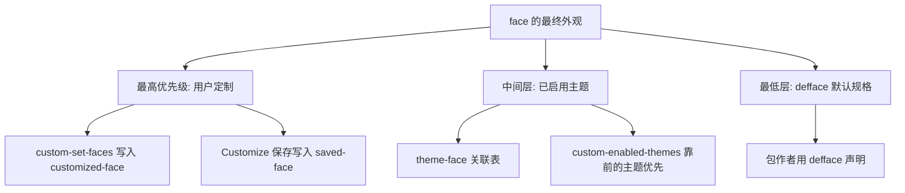
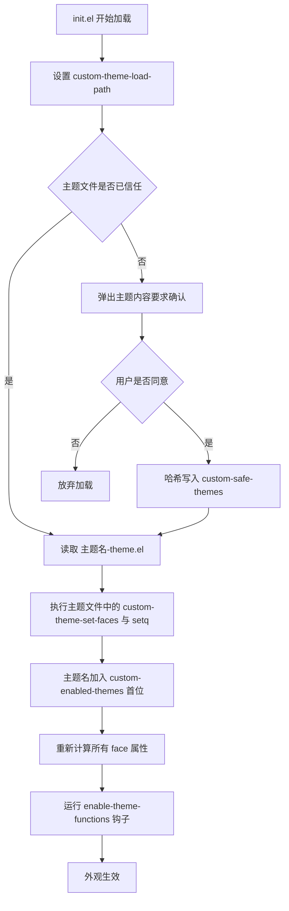
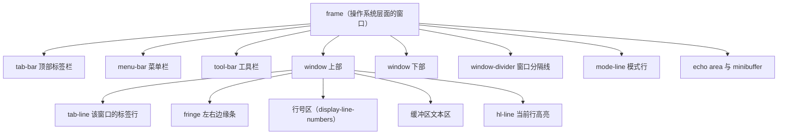
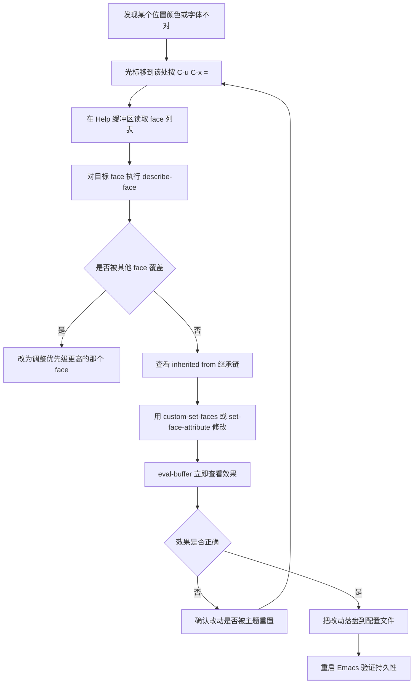

# 主题字体与美化

> 把 Emacs 从"能用的编辑器"变成"愿意每天盯着看的工具"。本篇讲清楚主题系统怎么工作、face 该怎么改才不会被覆盖、中英文字体怎么配才不乱码不虚、以及界面元素哪些该关哪些值得开。

---

## 一、主题系统原理

### 1.1 theme 到底是什么

一个 Custom 主题（custom theme）就是一份可整体启用、整体停用的设置集合，**它本质上是一个普通的 Emacs Lisp 源文件**。如果主题名叫 `tango`，文件名就是 `tango-theme.el`。主题里可以设置 face，也可以设置变量——虽然大家主要用它来改配色。

Emacs 从两个位置查找主题文件：

- 变量 `custom-theme-directory` 指定的目录，默认是 `~/.emacs.d/`，用来放你自己写的主题。
- Emacs 安装目录下的 `etc/themes`（即 `data-directory` 下的 `themes`），里面是随发行版提供的主题。

变量 `custom-theme-load-path` 决定主题的搜索路径，默认值是 `(custom-theme-directory t)`。这里的写法容易让人困惑：列表的第一个元素是**符号** `custom-theme-directory`，它的特殊含义是"取变量 `custom-theme-directory` 的值"，而 `t` 表示"内置的 `etc/themes` 目录"。所以如果把自己的主题放在 `~/.emacs.d/themes/`，需要自己把它加进去：

```elisp
;; 让 Emacs 也去 themes/ 子目录找主题文件
(add-to-list 'custom-theme-load-path
             (expand-file-name "themes/" user-emacs-directory))
```

`M-x customize-themes` 打开的 `*Custom Themes*` 缓冲区里列出的，就是 `custom-theme-load-path` 覆盖到的所有主题。

### 1.2 启用、停用与确认

四个命令/函数要分清楚：

| 名称 | 类型 | 作用 |
|------|------|------|
| `load-theme` | 函数，也有同名命令 | 从文件加载主题并启用它 |
| `enable-theme` | 函数 | **不读文件**，重新启用一个已经加载过的主题 |
| `disable-theme` | 函数 | 停用某个主题定义的全部变量与 face 设置 |
| `describe-theme` | 命令 | 查看主题的描述信息 |

`load-theme` 的完整签名是 `(load-theme THEME &optional NO-CONFIRM NO-ENABLE)`：

- `THEME` 是主题名符号，例如 `modus-vivendi`。
- `NO-CONFIRM` 非 `nil` 时跳过安全确认。**在 `init.el` 里直接调用它时必须传这个参数**，否则每次启动都会弹出一大段主题文件内容让你确认。
- `NO-ENABLE` 非 `nil` 时只加载文件、不启用。

```elisp
;; init.el 里加载主题的标准写法：第二个参数为 t，跳过确认
(load-theme 'modus-vivendi t)
```

主题为什么要确认？因为主题文件是 Lisp 代码，加载它可以执行任意操作。Emacs 的做法是：首次启用某个主题时把文件内容显示出来并询问，如果你回答"是"，它可以把该文件的 SHA-256 哈希记进变量 `custom-safe-themes`，以后就不再问。**随 Emacs 发行的 `etc/themes` 里的主题豁免这项检查**，永远视为安全。

如果你从网上下载了主题并且确认可信，可以一次性关掉全部检查：

```elisp
;; 把所有主题都视为安全。只在你能确认主题内容可信时这样做。
(setq custom-safe-themes t)
```

### 1.3 custom-enabled-themes：当前生效的主题列表

真正记录"现在启用了哪些主题"的是变量 `custom-enabled-themes`，它的值是主题名符号组成的列表，**按优先级从高到低排列**：

```elisp
;; 查看当前启用了哪些主题，以及它们的优先级顺序
M-: custom-enabled-themes RET
;; 例如输出：(modus-vivendi)
```

只有 `M-x customize-themes` 里的勾选和 `C-x C-s`（`custom-theme-save`）才会把选择保存到未来会话。直接调用 `load-theme` 只对当前会话有效，除非你把它写进 `init.el`。

这里有一条非常关键、很多人踩过的规则：**启用一个主题不会自动停用其他主题**。`load-theme` 的文档说明里写得很直白：启用 `THEME` 之后，它在已启用主题中具有最高优先级，要停用别的主题请用 `disable-theme`。

### 1.4 theme 与 face 的关系

需要把三个层次分开理解，否则"我改了 face 为什么没用"这类问题会反复出现。

Emacs 内部为每个 face 保存多份规格（spec），存放在符号属性上：

| 符号属性 | 内容 | 谁写入 |
|---------|------|-------|
| `face-defface-spec` | `defface` 声明的默认规格 | 包作者 |
| `saved-face` | 用 Customize 界面保存过的规格 | 用户，持久化 |
| `customized-face` | 仅在当前会话生效的定制规格 | `custom-set-faces` 等 |
| `theme-face` | "主题名 → 该主题给这个 face 的规格"的关联表 | `load-theme` |

优先级从高到低是：**用户定制（`user` 主题 / `saved-face` / `customized-face`）> 主题（`theme-face`）> `defface` 默认值**。手册的原话是"通过定制缓冲区做的任何定制都优先于主题设置"，这正是我们用来"在主题之上保留自己的微调"的依据。



### 1.5 一个必须知道的事实：主题加载会重置 set-face-attribute

`set-face-attribute` 是直接修改 face 属性的函数，它不走定制框架。问题在于，**加载主题时 Emacs 会重新计算所有 face 的属性，这个动作会把之前用 `set-face-attribute` 直接设的属性抹掉**。

这一点用三行命令就能自己验证（在 `*scratch*` 里逐行 `C-x C-e`）：

```elisp
(set-face-attribute 'region nil :background "red")   ; 立刻生效
(face-attribute 'region :background)                  ; 返回 "red"
(load-theme 'modus-vivendi t)                         ; 加载主题
(face-attribute 'region :background)                  ; 你设的红色没了
```

结论很清楚：

- **想让 face 微调长期有效**，用 `custom-set-faces`（写进 `custom-file`），它属于"用户定制"层，优先级高于主题。
- **必须用 `set-face-attribute` 时**，把它放在主题加载之后执行，例如挂在 `enable-theme-functions` 这个钩子上。该钩子是 Emacs 29.1 起提供的异常钩子（abnormal hook），在主题启用后调用，参数是被启用的主题名。

```elisp
;; 每次有主题被启用后，重新施加我们自己的 face 调整。
;; enable-theme-functions 是异常钩子，函数会收到主题名作为参数，因此用 lambda 忽略它。
(defun my/apply-face-overrides (&rest _)
  "在主题启用之后重新施加自定义 face。"
  (set-face-attribute 'region nil :extend t))

(add-hook 'enable-theme-functions #'my/apply-face-overrides)
```

---

## 二、内置主题与常用外部主题

### 2.1 内置的 modus-themes

`modus-operandi` 与 `modus-vivendi` 是一对以高对比度无障碍（WCAG AAA）为设计目标的主题，一亮一暗。**Emacs 28 起把它们收进了发行版**，Emacs 28 的 NEWS 里明确写着"New themes 'modus-vivendi' and 'modus-operandi'"。所以从 28 开始，你不装任何包就能用：

```elisp
;; Emacs 28 及以上内置，无需安装
(load-theme 'modus-operandi t)   ; 浅色
(load-theme 'modus-vivendi t)    ; 深色
```

不同 Emacs 版本内置的 modus-themes 版本不同，可用选项也不一样，这直接影响你抄别人配置时会不会报错：

| Emacs 版本 | 内置 modus-themes 版本 | 值得注意的差异 |
|-----------|----------------------|--------------|
| 28 | 1.6.0 | 只有 `modus-operandi` 与 `modus-vivendi` 两个主题 |
| 29 | 3.0.0 | 选项仍以 `modus-themes-` 开头；仍只有两个主题 |
| 30 | 4.4.0 | 新增 `modus-operandi-tinted`、`modus-vivendi-tinted`、`-deuteranopia`、`-tritanopia` 等变体；新增 `modus-themes-disable-other-themes`、`modus-themes-to-toggle` 等选项 |

常用选项示例（在 Emacs 29 与 30 上均存在）：

```elisp
;; 让代码中的斜体与粗体结构真正显示为斜体、粗体
(setq modus-themes-italic-constructs t)
(setq modus-themes-bold-constructs t)

;; 界面元素使用可变宽度字体（配合 4.x 的字体设置更协调）
(setq modus-themes-variable-pitch-ui nil)

;; 等宽与可变宽度字体混用，让正文更易读
(setq modus-themes-mixed-fonts t)

;; 设置 modus-themes-toggle 要切换的两个主题
(setq modus-themes-to-toggle '(modus-operandi modus-vivendi))

;; Emacs 30 起，加载 modus 主题时默认会自动停用其他主题（该选项默认值为 t）
(setq modus-themes-disable-other-themes t)

(load-theme 'modus-vivendi t)
```

设好 `modus-themes-to-toggle` 之后，用一个命令就能在明暗之间切换：

```elisp
M-x modus-themes-toggle
```

Emacs 30 还提供了 `M-x modus-themes-select`（带补全地选一个）和 `M-x modus-themes-rotate`（按列表轮换）。更早的版本里只有 `modus-themes-toggle` 可用。

另外有一个 Emacs 内置的、与具体主题无关的变体切换命令：`M-x theme-choose-variant`。它在你只启用了一个主题、且该主题存在多个变体（最常见的是明暗两版）时，可以直接切到另一个变体。**它只在单个主题处于启用状态时工作。**

### 2.2 常用外部主题

想在 modus 之外换换口味，下面几个是社区里维护活跃、包名真实可装的：

| 主题 | 包名 | 安装位置 | 定位 |
|------|------|---------|------|
| Doom Themes | `doom-themes` | MELPA | 数量多、风格统一，`doom-one`、`doom-dracula`、`doom-nord` 等都是常用选择 |
| Ef Themes | `ef-themes` | GNU ELPA | modus-themes 作者的另一套作品，色彩更活泼，同样强调可读性 |
| Catppuccin | `catppuccin-theme` | MELPA | 流行的柔和粉彩配色，提供 `catppuccin`、`catppuccin-mocha` 等变体 |

安装与启用：

```elisp
;; 在 init.el 里通过 use-package 声明，:ensure t 会自动安装
(use-package doom-themes
  :ensure t
  :config
  ;; 打开 Doom 主题自带的 modeline 配色与缓冲区内高亮增强
  (setq doom-themes-enable-bold t)
  (setq doom-themes-enable-italic t)
  (load-theme 'doom-one t))

(use-package ef-themes
  :ensure t
  :config
  (load-theme 'ef-summer t))

(use-package catppuccin-theme
  :ensure t
  :config
  (load-theme 'catppuccin t))
```

或者用命令安装，再在配置里只写 `load-theme`：

```
M-x package-install RET doom-themes RET
M-x package-install RET ef-themes RET
M-x package-install RET catppuccin-theme RET
```

注意 `ef-themes` 与 `modus-themes` 都在 GNU ELPA 上，而 `doom-themes`、`catppuccin-theme` 在 MELPA 上。如果你只配了 GNU ELPA 而没有把 MELPA 加进 `package-archives`，`M-x package-install` 会告诉你找不到包——这不是包名写错，是归档没配。

### 2.3 不要同时启用多个主题

这是新手最容易掉的坑，表现往往很迷惑：改了某个颜色，只有部分缓冲区跟着变；或者切换主题后，某些面的颜色"卡"在旧主题上不动。

原因在 1.3 节已经说过：**启用主题不会停用其他主题**。你以为在"切换"，实际上是在"叠加"，`custom-enabled-themes` 里现在有两个名字，优先级靠前的那个赢，没被它定义到的 face 才轮到后面那个——于是出现一半新一半旧的混合外观。

正确的做法有两种。第一种是自己管好顺序，切换时先禁用再启用：

```elisp
(defun my/switch-theme (theme)
  "停用当前所有主题，再启用 THEME，避免多层主题叠加。"
  (interactive
   ;; custom-available-themes 返回所有可加载的主题名符号，正是补全需要的列表。
   (list (intern (completing-read "切换主题: "
                                  (custom-available-themes)
                                  nil t))))
  ;; custom-enabled-themes 在遍历过程中会被 disable-theme 修改，
  ;; 因此必须先复制一份快照再遍历。
  (dolist (old (copy-sequence custom-enabled-themes))
    (disable-theme old))
  (load-theme theme t))
```

第二种是直接使用主题自带的切换命令：modus-themes 在 Emacs 30 里有 `modus-themes-disable-other-themes`（默认已为 `t`），`modus-themes-toggle` 会自动帮你清场；`ef-themes` 也提供了 `ef-themes-select` 之类的入口。

无论用哪种，判断当前是否处于"叠加"状态的命令始终是：

```elisp
M-: custom-enabled-themes RET
```

返回的列表长度超过 1 就要留意，除非你是有意做分层覆盖。

### 2.4 主题加载流程



---

## 三、微调 face

绝大多数时候你不需要写自己的主题。真实需求往往是"整体配色我很满意，就是注释太暗了""光标在选区里看不见"。这属于微调 face 的范畴。

### 3.1 三种改 face 的方法与它们的差别

| 方法 | 写入位置 | 与主题的关系 | 适用场景 |
|------|---------|-------------|---------|
| `custom-set-faces` | Customize 体系（通常落到 `custom-file`） | 优先级**高于**主题，主题切换后依然保留 | 长期保留的个人偏好，推荐 |
| `custom-theme-set-faces` | 只在自定义主题文件内部使用 | 主题的一部分 | 你在写自己的主题 |
| `set-face-attribute` | 直接改 face 对象 | 会被后续的主题加载**重置** | 临时试验，或挂在 `enable-theme-functions` 上 |

`custom-set-faces` 的调用形式是一个 face 加一组规格：

```elisp
;; 每个参数的形式是 (face 规格...)，规格照 defface 的写法来。
(custom-set-faces
 '(region ((t (:extend t))))
 '(highlight ((t (:background "gray90")))))
```

注意 `custom-set-faces` 通常是**机器生成的代码**，Customize 界面点保存时写的就是它。手工写完全没问题，但要清楚它可能被你后续的界面操作覆盖。

### 3.2 找出"这个颜色是哪个 face"的标准流程

不要猜。Emacs 内置了两个直接给答案的命令。

**流程一：光标处的字符用到了哪些 face**

1. 把光标移到那个字符上。
2. 按 `C-u C-x =`（带前缀参数的 `what-cursor-position`）。它会打开 `*Help*` 缓冲区，列出该字符的编码信息，并在 `face` 一栏列出所有作用于该位置的 face，**顺序就是从高优先级到低优先级**。
3. 点一下 `*Help*` 里 face 名字上的链接（或把光标移过去按 `RET`），进入 `describe-face`。

**流程二：浏览所有 face**

1. 执行 `M-x list-faces-display`，得到 `*Faces*` 缓冲区，其中每个 face 都用它自己的外观显示出来。
2. 找到想改的那一行，按 `RET` 查看详情，或者直接点 `[Customize]` 按钮进入定制界面。
3. 只想知道某个 face 当前是什么样，用 `M-x describe-face`，它会打印该 face 的文档、当前属性和继承关系。

`describe-face` 的输出里有一项特别重要：**inherited from**（继承自哪个 face）。很多"改了没用"的情况，是因为你改的是父 face，而子 face 自己覆盖了那个属性。

`M-x list-faces-display` 还可以带前缀参数 `C-u`，这样列表只显示那些当前**没有**被自定义过的 face——排查"我到底改了什么"时非常有用。

### 3.3 最常被微调的 face

下面这些是实际配置里出现频率最高的，每个都给出可直接用的写法。

**1. `default`：全局默认字体与前景背景色**

```elisp
;; default 是所有 face 的最终回退，改它影响最大，慎用。
;; :height 的单位是 1/10 磅，130 表示 13 磅。
(custom-set-faces
 '(default ((t (:family "JetBrains Mono" :height 130)))))
```

**2. `region`：选区**

现代 Emacs 建议给 `region` 加 `:extend t`，让选区背景一直延伸到行尾，视觉上更整齐。不加时选区只覆盖到文字结束的位置。

```elisp
(custom-set-faces
 '(region ((t (:extend t)))))
```

**3. `hl-line`：当前行高亮**

```elisp
;; 用极浅的背景色，不要用高饱和色，否则长时间盯着会累。
;; 该 face 只在启用 global-hl-line-mode 或 hl-line-mode 后才会显示。
(custom-set-faces
 '(hl-line ((t (:background "gray95" :extend t)))))
```

**4. `show-paren-match` 与 `show-paren-mismatch`：括号匹配**

```elisp
(custom-set-faces
 '(show-paren-match ((t (:background "lightsteelblue" :weight bold))))
 '(show-paren-mismatch ((t (:background "red" :foreground "white" :weight bold)))))
```

`show-paren-mismatch` 一定要和 `show-paren-match` 有明显区分，只靠一种颜色深浅区分时，写代码写到眼花时容易看漏。

**5. `line-number` 与 `line-number-current-line`：行号**

```elisp
(custom-set-faces
 '(line-number ((t (:foreground "gray60" :background unspecified))))
 '(line-number-current-line ((t (:foreground "orange" :weight bold)))))
```

这两项只在启用了 `display-line-numbers-mode`（或全局版本）之后才有意义。行号是 Emacs 26 起内置的**原生行号**，比早期的 `linum-mode` 快得多，不要再装 `linum` 了。

**6. `mode-line` 与 `mode-line-inactive`：模式行**

```elisp
(custom-set-faces
 '(mode-line ((t (:box nil :height 1.0))))
 '(mode-line-inactive ((t (:box nil :height 1.0)))))
```

`mode-line` 在很多主题里带一圈立体边框（`:box`），去掉后线条感更干净。

**7. `font-lock-comment-face` 与 `font-lock-comment-delimiter-face`：注释**

```elisp
;; 主题给的注释色往往偏暗，这里的思路是提亮而不是换色相。
(custom-set-faces
 '(font-lock-comment-face ((t (:foreground "gray45" :slant italic)))))
```

**8. `cursor`：光标**

```elisp
(custom-set-faces
 '(cursor ((t (:background "orange")))))
```

**9. `fringe`：边缘条**

```elisp
(custom-set-faces
 '(fringe ((t (:background unspecified)))))   ; unspecified 表示跟随 default
```

**10. `vertical-border` 与 `window-divider`：窗口分隔**

```elisp
(custom-set-faces
 '(vertical-border ((t (:foreground "gray70"))))
 '(window-divider ((t (:foreground "gray80"))))
 '(window-divider-first-pixel ((t (:foreground "gray85"))))
 '(window-divider-last-pixel ((t (:foreground "gray75")))))
```

把这一整块写进 `custom-file` 或你自己的模块里都可以。用 `custom-set-faces` 形式的好处是：**切换主题后它们依然生效**。

---

## 四、字体设置

### 4.1 set-face-attribute 设置字体

设置全局等宽字体最常用的做法是改 `default` face：

```elisp
;; 只在图形界面下执行，终端下没有字体概念，写了也没意义。
(when (display-graphic-p)
  ;; :family 是字体族名，:height 单位是 1/10 磅。
  (set-face-attribute 'default nil
                      :family "JetBrains Mono"
                      :height 130)
  ;; 有些界面元素更适合用可变宽度字体，例如 org 的正文。
  ;; fixed-pitch 与 variable-pitch 是两个内置 face，很多模式会引用它们。
  (set-face-attribute 'fixed-pitch nil :family "JetBrains Mono" :height 130)
  (set-face-attribute 'variable-pitch nil :family "Noto Sans" :height 140))
```

三个注意点：

- **`nil` 是 frame 参数**，表示"对所有 frame 生效"。写具体的 frame 对象只影响那一个 frame。
- **`set-face-attribute` 与主题的关系**见 1.5 节：它会随主题加载被重置。稳妥做法是把这段代码放进一个函数，既在启动时调用一次，也挂到 `enable-theme-functions` 上。
- **`font-family-list` 可以列出当前系统里所有可用的字体族名**，不确定字体名怎么写时先跑一次：`M-: (font-family-list) RET`。

另一个更"一次性"的写法是 `set-frame-font`，它可以同时设定字体并调整 frame 尺寸：

```elisp
;; 参数: 字体名、是否对所有已存在 frame 生效、是否同时调整 frame 大小
(set-frame-font "JetBrains Mono-13" t t)
```

字体名的 `-13` 后缀表示 13 磅。这种写法的缺点是不容易表达 `:height` 的 1/10 磅精度，也不方便分别控制中英文字体，因此长期配置里更推荐 `set-face-attribute`。

### 4.2 三平台等宽字体推荐与安装

选字体的硬性要求只有一条：**必须有真正的等宽版本，并且覆盖你需要的字符集**。下面是各平台上容易装、口碑稳定的选择。

**Debian 与 Ubuntu**

```bash
$ sudo apt update
$ sudo apt install fonts-jetbrains-mono   # JetBrains Mono
$ sudo apt install fonts-firacode         # Fira Code，带连字
$ sudo apt install fonts-hack             # Hack
$ sudo apt install fonts-noto-cjk         # 中文字体，见 4.3
$ fc-cache -fv                            # 刷新字体缓存
```

**Arch Linux**

```bash
$ sudo pacman -S ttf-jetbrains-mono       # JetBrains Mono
$ sudo pacman -S ttf-fira-code            # Fira Code
$ sudo pacman -S ttf-hack                 # Hack
$ sudo pacman -S noto-fonts-cjk           # 中文字体
$ fc-cache -fv
```

**macOS（Homebrew）**

```bash
$ brew install --cask font-jetbrains-mono
$ brew install --cask font-fira-code
$ brew install --cask font-hack
```

**Windows**

推荐从字体官方发布页下载后右键"为所有用户安装"。也可以用 `winget` 搜索可用条目：

```powershell
PS> winget search JetBrains
PS> winget search "Fira Code"
```

字体名在不同平台上可能有细微差别。装好之后一律用下面这行确认 Emacs 实际看到了什么：

```elisp
M-: (font-family-list) RET
```

如果列表里没有你刚装的字体，先 `fc-cache -fv`（Linux），再**完全重启 Emacs**——字体列表在启动时构建，光 `eval-buffer` 是刷不出来的。

### 4.3 中文字体

中文字体必须用 `set-fontset-font` 单独指定，因为它不是"给某个 face 换字体"，而是"给某个字符范围指定用哪个字体渲染"。这是 fontset（字体集）机制。

完整的函数签名与参数含义（来自文档字符串）：

```text
(set-fontset-font FONTSET CHARACTERS FONT-SPEC &optional FRAME ADD)
```

- `FONTSET`：字体集名（字符串）；`nil` 表示 `FRAME` 的字体集；**`t` 表示默认字体集**。日常用 `t` 就够了。
- `CHARACTERS`：可以是一个字符、一个 `(起始 . 结束)` 的字符区间、一个**脚本符号**（script symbol，例如 `han`）、一个字符集符号，或 `nil`（表示"没有其他指定时用这个字体"）。
- `FONT-SPEC`：字体规格，最简单就是字体族名字符串。
- `ADD`：`prepend` 或 `append`，表示追加在已有规格之前还是之后；默认是覆盖。

还有一个必须注意的官方提示：**这个函数最好在任何这些字符被显示之前调用**。原因是有些字符在首次显示时会生成并缓存"字符组合"（composition），缓存里包含了当时用的字体，之后再改字体不会影响已经缓存的结果。所以中文字体设置放得越早越好，最好在 `early-init.el` 或 `init.el` 的最前面。

**Linux（Noto Sans CJK SC）**

```elisp
(when (display-graphic-p)
  ;; 中文使用 Noto Sans CJK SC。脚本符号 han 覆盖汉字。
  (set-fontset-font t 'han "Noto Sans CJK SC")
  ;; 标点与全角符号单独指定，否则常被回退到难看的字体上。
  (set-fontset-font t 'cjk-misc "Noto Sans CJK SC")
  ;; 日文假名与韩文谚文如无需求可以不设，交给系统回退。
  (set-fontset-font t 'kana "Noto Sans CJK JP"))
```

**macOS（PingFang SC）**

```elisp
(when (display-graphic-p)
  (set-fontset-font t 'han "PingFang SC")
  (set-fontset-font t 'cjk-misc "PingFang SC")
  ;; macOS 上 emoji 由 Apple Color Emoji 提供，不需要额外设置。
  )
```

**Windows（Microsoft YaHei）**

```elisp
(when (display-graphic-p)
  (set-fontset-font t 'han "Microsoft YaHei")
  (set-fontset-font t 'cjk-misc "Microsoft YaHei")
  ;; Windows 上 Emoji 常用 Segoe UI Emoji，如果显示为方块可以显式指定。
  (set-fontset-font t 'symbol "Segoe UI Emoji" nil 'append))
```

把三平台合并成一个可复制运行的完整配置块：

```elisp
;; -*- lexical-binding: t; -*-
;; ~/.emacs.d/lisp/init-font.el —— 字体与中文字体设置
;; 建议在 init.el 中尽量早地 require 本模块。

(defun my/setup-fonts ()
  "按平台设置等宽字体与中文字体。"
  (interactive)

  ;; 一、等宽字体：三平台分别用一个确定的字体名
  (let ((mono (pcase system-type
                ('darwin      "JetBrains Mono")
                ('windows-nt  "Cascadia Mono")
                (_            "JetBrains Mono"))))
    ;; 只有图形界面才有字体可言
    (when (display-graphic-p)
      (set-face-attribute 'default nil :family mono :height 130)
      (set-face-attribute 'fixed-pitch nil :family mono :height 130)

      ;; 二、中文字体：按平台选择系统自带或常用的中文字体
      (let ((cjk (pcase system-type
                   ('darwin      "PingFang SC")
                   ('windows-nt  "Microsoft YaHei")
                   (_            "Noto Sans CJK SC"))))
        ;; 脚本符号 han 覆盖汉字
        (set-fontset-font t 'han cjk)
        ;; cjk-misc 覆盖全角标点等杂项
        (set-fontset-font t 'cjk-misc cjk)))

    ;; 三、可变宽度字体：org、markdown 的正文更耐读
    (when (display-graphic-p)
      (set-face-attribute 'variable-pitch nil
                          :family (pcase system-type
                                    ('windows-nt "Segoe UI")
                                    ('darwin     "Helvetica Neue")
                                    (_           "Noto Sans"))
                          :height 140))))

;; 启动时执行一次
(my/setup-fonts)

;; 主题加载会重置 face，因此在主题启用后重新设置一次
(add-hook 'enable-theme-functions (lambda (&rest _) (my/setup-fonts)))

(provide 'init-font)
```

### 4.4 中英文混排对齐与字体回退排查

中英文混排出现"参差不齐"或"中文变成方块"，原因通常只有三类，按下面的顺序排查。

**问题一：中文显示成方块或豆腐块**

说明没有任何字体覆盖到这些字符。排查步骤：

1. 把光标放到方块上，按 `C-u C-x =`，看 `*Help*` 里报告的字符编码属于哪个字符集。
2. 执行 `M-: (font-family-list) RET`，确认你配的中文字体名确实在列表里。名字写错是最常见的原因——例如把 `Noto Sans CJK SC` 写成 `Noto Sans CJK`，或者系统里只有 `Source Han Sans SC`。
3. 确认 `set-fontset-font` 的调用发生在字符首次显示之前，必要时把它移到 `early-init.el`。

**问题二：中文和英文的基线不齐，或者中文比英文高出一截**

这是中文字体与英文字体的度量（metrics）不一致造成的。可用的手段：

- 优先选择同一厂商、设计上配套的中西文字体组合，例如 Sarasa Gothic（更纱黑体）系列本身就设计为中西文等宽对齐，Arch 上的包名是 `ttf-sarasa-gothic`。
- 用 `:height` 分别微调，让中英文字号在视觉上接近：

```elisp
;; 中文略小一点，视觉高度反而更接近
(set-fontset-font t 'han (font-spec :family "Noto Sans CJK SC" :size 12.5))
```

注意 `set-fontset-font` 的第三个参数可以是 `font-spec` 对象，用 `(font-spec :family "..." :size 12.5)` 就能精确控制字号，这是纯字体名做不到的。

**问题三：某些生僻字或符号就是回退到了别的字体**

Emacs 对没有指定字体的字符会走回退链。想显式指定"兜底字体"，把 `CHARACTERS` 传 `nil`：

```elisp
;; 对任何没有明确指定字体的字符，使用这个字体兜底
(set-fontset-font t nil "Noto Sans CJK SC")
```

想搞清楚"某个字符当前究竟用了哪个字体"，用 `describe-char`：

```elisp
M-x describe-char
```

输出里的 `font` 与 `fontset` 两行会给出确切的字体文件路径。这是排查回退问题最直接的证据，比任何猜测都可靠。

---

## 五、字号与缩放

### 5.1 内置的缩放命令

Emacs 内置了一组缩放命令，不需要装任何包：

| 键位 | 命令 | 作用 |
|------|------|------|
| `C-x C-+` | `text-scale-adjust` | 增大当前缓冲区字号 |
| `C-x C-=` | `text-scale-adjust` | 同上 |
| `C-x C--` | `text-scale-adjust` | 减小当前缓冲区字号 |
| `C-x C-0` | `text-scale-adjust` | 恢复默认字号 |

这四个键位绑的是同一个 `text-scale-adjust`，它根据按键的最后一个字符决定方向，并且**按键之后会继续等待你按同样的键，连续按就连续缩放**，按别的键自动退出。每按一次，`default` face 的高度就乘以 `text-scale-mode-step`（默认 1.2）。

缩放的作用范围是**当前缓冲区**，不影响其他缓冲区。配套的命令还有：

- `text-scale-increase` / `text-scale-decrease`：只做单向调整，适合自己在键位上绑定。
- `text-scale-set`：直接设定缩放级别。
- `global-text-scale-adjust`：**全局**缩放，并且可以选择同时调整 frame 尺寸以保持每行的字符数不变。Emacs 29 起提供。

```elisp
;; 把全局缩放绑到一个顺手的键位上，缩放时同步调整 frame 大小
(global-set-key (kbd "C-=") #'global-text-scale-adjust)
```

`C-x C-+` 系列有个容易困惑的现象：**有些 face 不跟着缩放**。这是设计如此——文档明确说明，带显式 `:height` 设置的 face 不受影响，只有 `default` 和 `header-line` 两个 face 例外，即使设了 `:height` 也会跟着缩放。所以如果你给 `mode-line` 写死了 `:height 1.0`，缩放时模式行的大小是固定的，这通常是想要的效果。

### 5.2 HiDPI 与系统缩放

显示器的物理像素密度越来越高，字体设置要在两种策略之间做选择。

**策略一：系统层面缩放**（推荐）

- Windows：设置 → 系统 → 显示 → 缩放，选 125%、150% 或 200%。Emacs 的 GTK 或原生 Windows 构建会跟随系统 DPI，界面和字体一起放大。
- macOS：Retina 屏由系统自动处理，Emacs 用 Cocoa 构建时直接获得高分辨率渲染。
- Linux：在桌面环境的显示设置里调缩放，或在 X11 下通过 X 资源的 `Xft.dpi` 设置，例如在 `~/.Xresources` 中写 `Xft.dpi: 144`。

系统缩放的好处是所有应用统一，坏处是有些老程序会模糊。Emacs 30 在 GTK 构建下对分数缩放的跟随已经比较可靠。

**策略二：只放大 Emacs 的字体**

不改系统缩放，只把 `default` face 的 `:height` 调大：

```elisp
;; 在 4K 屏上把 13 磅的字放大到 16 磅
(set-face-attribute 'default nil :family "JetBrains Mono" :height 160)
```

这种做法的缺点是所有界面元素（模式行、行号、minibuffer）按字号等比例放大，但窗口边框、滚动条、菜单等由工具包绘制的部分不会跟着变大，视觉上会有大小不一的感觉。如果在意一致性，用策略一。

**判断当前实际生效的字体像素大小**：

```elisp
M-: (font-info (frame-parameter nil 'font)) RET
```

返回的向量里包含字体文件的完整路径、像素尺寸、DPI 等信息，是确认 HiDPI 是否真的生效的直接证据。

---

## 六、界面元素逐个美化

### 6.1 frame 的界面区域

先把 Emacs 自己对这些区域的叫法搞清楚，对照着看下面的开关表会顺畅很多。注意 Emacs 里的 frame 就是其他程序所说的"窗口"，window 则是指 frame 内部被分割出的区域。



### 6.2 逐个元素的开关与建议

| 元素 | 关闭或开启方式 | 建议 | 说明 |
|------|--------------|------|------|
| 菜单栏 menu-bar | `(menu-bar-mode -1)` | 建议关 | 所有菜单项都能用 `M-x` 或 `C-h` 找到，省下一行高度 |
| 工具栏 tool-bar | `(tool-bar-mode -1)` | 建议关 | 图形界面才有，图标按钮的使用频率通常很低 |
| 滚动条 scroll-bar | `(scroll-bar-mode -1)` | 建议关 | 图形界面才有；也可写进 `default-frame-alist` 的 `vertical-scroll-bars` |
| 边缘条 fringe | `(fringe-mode 8)` 或 `(set-fringe-mode 0)` | 视需要 | 终端下没有 fringe，写了不报错但无效果；`0` 是完全去掉 |
| 行号 | `(global-display-line-numbers-mode 1)` | 建议开 | Emacs 26 起内置原生实现；`display-line-numbers-type` 可设 `t`、`relative`、`visual` |
| 当前行高亮 | `(global-hl-line-mode 1)` | 建议开 | 只在图形界面下开更省资源 |
| 光标闪烁 | `(blink-cursor-mode -1)` | 建议关 | 长文本编辑时闪烁很干扰 |
| 窗口分隔线 | `(window-divider-mode 1)` | **Windows 上建议开** | 见 6.3 |
| 顶部标签栏 tab-bar | `(tab-bar-mode 1)` | 视需要 | 每帧一组标签；`tab-bar-show` 控制何时显示 |
| 行内标签行 tab-line | `(global-tab-line-mode 1)` | 视需要 | 每个 window 一行，显示该 window 的缓冲区列表 |
| 启动画面 | `(setq inhibit-startup-screen t)` | 建议关 | 关掉后可以用 dashboard 替代，见 6.4 |
| scratch 缓冲区提示 | `(setq initial-scratch-message "")` | 视需要 | 设成空字符串或 `nil` 都行 |

一份可直接抄走的完整设置：

```elisp
;; -*- lexical-binding: t; -*-
;; 界面元素的开关，放在 init.el 里直接执行即可。

(when (fboundp 'menu-bar-mode)   (menu-bar-mode -1))
(when (fboundp 'tool-bar-mode)   (tool-bar-mode -1))
(when (fboundp 'scroll-bar-mode) (scroll-bar-mode -1))

;; 不闪烁的光标
(when (fboundp 'blink-cursor-mode) (blink-cursor-mode -1))

;; 边缘条留 8 像素，给 flycheck、git-gutter 之类的指示留出位置；
;; 完全不需要就写 (fringe-mode 0)。
(when (fboundp 'fringe-mode) (fringe-mode 8))

;; 行号：图形界面下开绝对行号，终端下保持关闭
(when (display-graphic-p)
  (setq display-line-numbers-type t)
  (global-display-line-numbers-mode 1)
  (global-hl-line-mode 1))

;; 窗口分隔线：Windows 上原生边框极细，几乎看不出窗口边界
(when (fboundp 'window-divider-mode)
  (setq window-divider-default-places 'right-only)   ; 只画右侧分隔线
  (setq window-divider-default-right-width 12)       ; 比默认的 6 更明显
  (window-divider-mode 1))

;; 启动画面与 scratch 提示
(setq inhibit-startup-screen t)
(setq initial-scratch-message nil)
```

### 6.3 window-divider 为什么在 Windows 上特别必要

窗口分隔线由 `frame.el` 提供（早期版本里是独立的 `window-divider.el`，Emacs 30 中相关定义位于 `frame.el`）。它画在 window 之间，用来在视觉上区分被分割的区域。

相关变量：

- `window-divider-mode`：总开关，必须开启才会画线。
- `window-divider-default-places`：画在哪里。可选值是 `bottom-only`（只在底部）、`right-only`（只在右侧，**这是默认值**）和 `t`（底部和右侧都画）。注意这里**没有** `left` 或 `left-only`。
- `window-divider-default-right-width`：右侧分隔线宽度，默认 6。
- `window-divider-default-bottom-width`：底部分隔线宽度，默认 6。

为什么 Windows 上特别需要：Windows 版 Emacs 画的窗口边框极细，两个垂直分割的窗口之间几乎没有视觉分隔，光标跳到另一个窗口时不容易察觉。默认的 6 像素在 Windows 上偏窄，调到 10 到 16 之间会清楚很多，再配合 `window-divider`、`window-divider-first-pixel`、`window-divider-last-pixel` 三个 face 调色，就能得到清晰但不抢眼的边界。

在 macOS 和大多数 Linux 桌面环境上，窗口之间有系统绘制的间隙或阴影，默认值通常够用，可以不调。

### 6.4 启动画面与 dashboard

`inhibit-startup-screen` 设为 `t` 之后，Emacs 启动会显示 `*scratch*` 缓冲区。想换成一个信息更丰富的起始页，用 `dashboard` 包：

```
M-x package-install RET dashboard RET
```

```elisp
(use-package dashboard
  :ensure t
  :custom
  ;; 跳过启动画面，让 dashboard 接管
  (dashboard-startup-banner 'logo)
  (dashboard-center-content t)
  (dashboard-set-heading-icons nil)     ; 需要图标字体时才开
  (dashboard-set-file-icons nil)
  (dashboard-items '((recents  . 8)
                     (bookmarks . 5)
                     (projects . 5)))
  :config
  ;; 把 dashboard 挂到启动流程上
  (dashboard-setup-startup-hook))
```

`dashboard-setup-startup-hook` 会自动处理两件事：把 `initial-buffer-choice` 指向 dashboard 缓冲区，以及把启动画面关掉。如果你同时手工设置了 `inhibit-startup-screen`，两者不冲突。

想自己控制启动后显示哪个缓冲区，用 `initial-buffer-choice`：

```elisp
;; 启动后显示 dashboard 缓冲区
(setq initial-buffer-choice (lambda () (get-buffer-create dashboard-buffer-name)))

;; 或者更简单：启动后直接打开 org 目录
;; (setq initial-buffer-choice "~/org/")
```

### 6.5 scratch 缓冲区

`*scratch*` 是 Emacs 启动后的默认落脚点，默认是 `fundamental-mode` 加一句提示文字。值得改两处：

```elisp
;; 关掉那句 "This buffer is for text that is not saved..."
(setq initial-scratch-message nil)

;; 让 scratch 用你熟悉的模式，写临时 Elisp 时立刻有高亮和补全
(setq initial-major-mode 'emacs-lisp-mode)
```

`initial-major-mode` 的默认值本来就是 `emacs-lisp-mode`，如果被别的配置改过，这里可以改回来。

---

## 七、常用美化包分类清单

下面每个包都给出真实包名和一句话定位。安装统一用：

```
M-x package-install RET 包名 RET
```

或者在 `use-package` 声明里写 `:ensure t`。

### 7.1 模式行（mode-line）

| 包名 | 定位 |
|------|------|
| `doom-modeline` | 目前最流行的模式行，信息密度高、图标与配色精致，可配合 nerd-icons 使用 |
| `mood-line` | 极简风格，只保留必要信息，代码量小、依赖少 |
| `nano-modeline` | 另一种极简实现，把信息集中到一行两端，视觉上非常安静 |
| `minions` | 不替换模式行，而是把一堆次要的 minor mode 缩写收进一个菜单，解决模式行被挤爆的问题 |

`minions` 值得单独说：它的思路不是"美化"，而是"减少噪音"。当你装了十几个 minor mode 之后，模式行右侧会挤满 `Fly HSP Abbrev ...` 这样的缩写，`minions-mode` 把它们折叠成一个可点开的菜单，比任何配色都更能改善观感。

### 7.2 图标

| 包名 | 依赖的字体 | 定位 |
|------|-----------|------|
| `nerd-icons` | 只需 Symbols Nerd Font Mono | 新一代图标库，字形来自 Nerd Fonts v3，图标覆盖更全 |
| `all-the-icons` | 需要 all-the-icons、file-icons、fontawesome、octicons、weathericons、material-design-icons 等多套字体 | 老牌方案，仍有大量包依赖它 |

两者的核心差异在**字体安装方式**：

- `nerd-icons` 的 `M-x nerd-icons-install-fonts` 只下载并安装 **Symbols Nerd Font Mono** 一个字体文件，体积小、安装快。
- `all-the-icons` 的 `M-x all-the-icons-install-fonts` 需要下载**多套**字体，在 Linux 上会装到 `~/.local/share/fonts/` 下的子目录里，装完还需要 `fc-cache -fv` 刷新缓存。

新配置建议优先选 `nerd-icons`，因为依赖更轻。但如果某个包（例如某些版本的 `doom-modeline` 配置片段）默认引用 `all-the-icons`，两者并存也是可以的，只要字体都装好。

确定用哪个之后，做一次设置：

```elisp
;; 使用 nerd-icons 时，把图标字体族名固定下来
(setq nerd-icons-font-family "Symbols Nerd Font Mono")
```

如果图标显示成方块，几乎总是字体没装或没刷缓存。先执行一次 `M-x nerd-icons-install-fonts`，再 `fc-cache -fv`（Linux），最后**重启 Emacs**。

### 7.3 代码与文本高亮

| 包名 | 定位 |
|------|------|
| `hl-todo` | 把 `TODO`、`FIXME`、`NOTE`、`HACK` 等关键词染成醒目颜色，提供 `hl-todo-mode` |
| `rainbow-delimiters` | 按括号嵌套深度着色，提供 `rainbow-delimiters-mode` |
| `highlight-indent-guides` | 在缩进位置画竖线或色块，一眼看出代码块层级 |
| `symbol-overlay` | 高亮光标下的同名符号，并提供在符号间跳转的命令，替代部分 `highlight-symbol` 用法 |
| `beacon` | 光标跳转时在目标位置闪一下，配合 `beacon-mode`，翻页或跳转后不丢失位置感 |

启用写法（以 `use-package` 为例）：

```elisp
;; TODO 关键词高亮，只在编程相关的模式下启用
(use-package hl-todo
  :ensure t
  :hook (prog-mode . hl-todo-mode))

;; 彩虹括号
(use-package rainbow-delimiters
  :ensure t
  :hook (prog-mode . rainbow-delimiters-mode))

;; 缩进参考线，用线条而不是色块，视觉更轻
(use-package highlight-indent-guides
  :ensure t
  :hook (prog-mode . highlight-indent-guides-mode)
  :custom
  (highlight-indent-guides-method 'character))

;; 同名符号高亮
(use-package symbol-overlay
  :ensure t
  :hook (prog-mode . symbol-overlay-mode))

;; 跳转时闪一下光标位置，全局生效
(use-package beacon
  :ensure t
  :config
  (beacon-mode 1))
```

`highlight-indent-guides-method` 有 `fill`、`column`、`character` 三种取值。`fill` 画色块，识别度高但在深色主题下容易显得脏；`character` 用一个字符画线，最干净，但需要你的等宽字体里那个字符宽度正常。

### 7.4 交互辅助

| 包名 | 定位 |
|------|------|
| `which-key` | 按下前缀键后延迟弹出后续可用键位表。**Emacs 30 起随发行版内置**；Emacs 29 及更早需要 `M-x package-install RET which-key RET` |
| `focus` | 提供 `focus-mode`，把当前段落之外的文字调暗，专注写作。**它不是 Emacs 内置库**，MELPA 与 NonGNU ELPA 上都有这个包 |

`which-key` 的内置化是 Emacs 30 的一个重要变化。在 30 上只需要：

```elisp
;; Emacs 30 内置 which-key，直接开启即可
(which-key-mode 1)
```

在 Emacs 29 上则要先安装包，再开启。写跨版本配置时可以用 `(unless (require 'which-key nil t) ...)` 之类的判断，或者干脆依赖 `use-package` 的 `:ensure`。

`focus-mode` 的用法：

```elisp
;; focus 不是内置库，需要先安装
(use-package focus
  :ensure t
  :commands focus-mode
  :custom
  ;; 以段落为单位调暗其余部分
  (focus-mode-to-thing '((prog-mode . defun) (text-mode . paragraph))))
```

---

## 八、透明与全屏

### 8.1 alpha 与 alpha-background

Emacs 有两个与透明度有关的 frame 参数，作用完全不同。

- **`alpha`**：整个 frame 的不透明度，文字和背景一起变透明。取值可以是 0 到 100 的整数，也可以是 `(活动 . 非活动)` 的 cons，用来让失焦的窗口更淡。
- **`alpha-background`**：**只**让背景透明，前景的文字保持完全不透明。取值同样是 0 到 100 的整数，0 表示全透明，100 表示完全不透明（默认）。

`alpha-background` 是 Emacs 29 新增的参数（Emacs 29 的 NEWS 里有明确条目，同时新增了对应的 X 资源 `alphaBackground`）。

**平台支持情况需要说清楚，否则会白折腾**：

| 平台 | `alpha-background` 是否生效 | 说明 |
|------|---------------------------|------|
| X11 | 生效 | 实现位于 `xterm.c`，且要求使用 32 位视觉（depth 32）并运行在支持合成的环境下 |
| pgtk（纯 GTK 构建） | 生效 | 实现位于 `pgtkterm.c` |
| Windows | 参数被接受但**不改变背景透明度** | `w32fns.c` 中只是把参数登记并保存，渲染路径没有使用它 |
| macOS（NS） | 参数被接受但**不改变背景透明度** | `nsfns.m` 中登记了该参数，但 `nsterm.m` 没有用它参与渲染 |

所以在 macOS 上想要"半透明窗口"，实际能用的只有 `alpha`（整帧透明），而不是 `alpha-background`。这是很多抄来的配置在 Mac 上"没反应"的原因。

用法示例：

```elisp
;; 只让背景半透明，文字保持清晰。X11 与 pgtk 构建上有效。
(add-to-list 'default-frame-alist '(alpha-background . 90))

;; 整帧半透明：活动时 95，失焦时 85。
(add-to-list 'default-frame-alist '(alpha . (95 . 85)))
```

也可以对当前 frame 立刻生效：

```elisp
;; 对当前选中的 frame 立即设置背景透明度
(set-frame-parameter nil 'alpha-background 90)
```

`alpha` 在终端下没有意义，终端本身负责自己的不透明度（由终端模拟器的配置决定，例如 GNOME Terminal 或 iTerm2 的透明度设置）。Emacs 在终端里改这两个参数不会有任何效果。

### 8.2 全屏

Emacs 内置两个全屏相关命令，并且 `toggle-frame-fullscreen` 在图形界面下默认绑定在 `F11` 上：

| 命令 | 作用 |
|------|------|
| `toggle-frame-fullscreen` | 在真全屏（占满屏幕、隐藏系统界面元素）与普通状态间切换 |
| `toggle-frame-maximized` | 在最大化（占满可用区域但保留系统界面元素）与普通状态间切换 |

```elisp
;; 默认 F11 已经是 toggle-frame-fullscreen，不需要重复绑定。
;; 如果被别的配置覆盖了，可以显式绑回来：
(global-set-key (kbd "<f11>") #'toggle-frame-fullscreen)

;; 也可以用 C-c f 做同样的切换
(global-set-key (kbd "C-c f") #'toggle-frame-fullscreen)
```

想让 Emacs 启动就是最大化状态，放进 `default-frame-alist`：

```elisp
;; 启动即最大化
(add-to-list 'default-frame-alist '(fullscreen . maximized))
```

`fullscreen` 参数的取值有 `fullboth`、`fullwidth`、`fullheight`、`maximized` 和 `nil`。`fullboth` 是真全屏，`maximized` 是最大化。**这两个值在终端下无效**，终端里由终端自己决定窗口大小。

---

## 九、终端下的美化限制

在终端里运行 `emacs -nw` 时，很多图形界面的美化手段会直接失效或表现不同。提前知道边界，可以避免把时间花在不可能生效的设置上。

| 能力 | 图形界面 | 终端 |
|------|---------|------|
| 任意字体与字号 | 支持 | **不支持**，字体由终端模拟器决定 |
| `set-fontset-font` | 支持 | 无效果 |
| 边缘条 fringe | 支持 | **没有 fringe**，`fringe-mode` 不报错但不显示 |
| 窗口分隔线 | 支持 | 不显示 |
| 工具栏与滚动条 | 支持 | 没有，`tool-bar-mode` 无对象可关 |
| 菜单栏 | 支持 | 部分终端支持文字菜单，多数不可用 |
| `alpha` / `alpha-background` | 部分平台支持 | 无效果，透明度由终端控制 |
| 图片与 SVG | 支持 | 极少数终端支持，默认不支持 |
| 颜色数量 | 真彩色（24 位） | 取决于 `TERM` 与终端能力，常见为 256 色 |
| `hl-line`、`line-number` 等着色类 face | 支持 | 支持，但可用的颜色受色板限制 |
| 图标字体（nerd-icons / all-the-icons） | 支持 | 取决于终端字体，多数情况下显示为方块或乱码 |

几点实践建议：

- **用 `(display-graphic-p)` 把图形专属设置包起来**。这样同一份配置在终端和图形界面下都能用，不必维护两份。
- **检查终端是否启用了真彩色**：

```elisp
M-: (display-color-cells) RET
;; 返回 16777216 表示真彩色，256 表示只有 256 色
```

- 如果只有 256 色，主题会退回到该主题为低色深准备的那一套配色（`defface` 里的 `(min-colors 88)`、`(min-colors 8)` 分支就是为此存在的），观感会比图形界面差，这是正常的，不是配置错误。
- 终端下想用图标，需要在**终端模拟器**里把字体换成 Nerd Font 的等宽版本。这属于终端配置，不是 Emacs 配置，装 `nerd-icons` 解决不了。

一个常用技巧是让配置自动适配：

```elisp
;; 只在图形界面下做字体与透明度相关设置
(when (display-graphic-p)
  (set-face-attribute 'default nil :family "JetBrains Mono" :height 130)
  (add-to-list 'default-frame-alist '(alpha-background . 90)))

;; 终端下改用相对行号，绝对行号在窄终端里更占地方
(unless (display-graphic-p)
  (setq display-line-numbers-type 'relative))
```

---

## 十、用变量集中管理颜色与字体

### 10.1 为什么要集中

散落在各处的字符串有个隐蔽的问题：改一次配色要搜索整个配置目录，漏掉一处就会留下一个颜色突兀的 face；而且没法做"整套换色"，因为颜色值本身和用途混在一起了。

解决办法是**把值抽成变量，把用途作为变量名**。这样换配色时只改一处，而且读代码时能直接看出"这个颜色是干什么用的"。

### 10.2 完整示例

```elisp
;; -*- lexical-binding: t; -*-
;; ~/.emacs.d/lisp/init-appearance.el
;; 外观相关的集中管理：字体、颜色、face 微调。

;;; 一、字体族名
(defconst my/font-mono "JetBrains Mono"
  "等宽字体族名。")

(defconst my/font-proportional
  (pcase system-type
    ('windows-nt "Segoe UI")
    ('darwin     "Helvetica Neue")
    (_           "Noto Sans"))
  "可变宽度字体族名。")

(defconst my/font-cjk
  (pcase system-type
    ('windows-nt "Microsoft YaHei")
    ('darwin     "PingFang SC")
    (_           "Noto Sans CJK SC"))
  "中文字体族名。")

;;; 二、颜色
(defconst my/color-cursor   "orange"
  "光标颜色。")
(defconst my/color-region   nil
  "选区背景色。nil 表示沿用主题的取值。")
(defconst my/color-hl-line  nil
  "当前行背景色。nil 表示沿用主题的取值。")
(defconst my/color-comment  nil
  "注释颜色。nil 表示沿用主题的取值。")
(defconst my/color-divider  "gray80"
  "窗口分隔线颜色。")

;;; 三、字号
(defconst my/height-mono 130
  "等宽字体的高度，单位是 1/10 磅。")
(defconst my/height-proportional 140
  "可变宽度字体的高度，单位是 1/10 磅。")

;;; 四、统一的字体设置函数
(defun my/apply-fonts ()
  "把字体设置施加到相关 face 与 fontset 上。"
  (when (display-graphic-p)
    (set-face-attribute 'default nil
                        :family my/font-mono
                        :height my/height-mono)
    (set-face-attribute 'fixed-pitch nil
                        :family my/font-mono
                        :height my/height-mono)
    (set-face-attribute 'variable-pitch nil
                        :family my/font-proportional
                        :height my/height-proportional)
    ;; 中文字体走 fontset，覆盖汉字与全角标点
    (set-fontset-font t 'han my/font-cjk)
    (set-fontset-font t 'cjk-misc my/font-cjk)))

;;; 五、统一的 face 微调
;; 用 custom-set-faces 而不是 set-face-attribute，这样主题切换后依然生效。
(defun my/apply-faces ()
  "集中施加 face 微调。
颜色变量为 nil 的项会被跳过，从而沿用主题的取值。"
  (custom-set-faces
   `(cursor ((t (:background ,my/color-cursor)))))
  (when my/color-region
    (custom-set-faces
     `(region ((t (:background ,my/color-region :extend t))))))
  (when my/color-hl-line
    (custom-set-faces
     `(hl-line ((t (:background ,my/color-hl-line :extend t))))))
  (when my/color-comment
    (custom-set-faces
     `(font-lock-comment-face ((t (:foreground ,my/color-comment))))))
  (custom-set-faces
   `(window-divider ((t (:foreground ,my/color-divider))))))

;;; 六、启动时执行
(my/apply-fonts)
(my/apply-faces)

;;; 七、主题加载会重置字体类 face，因此需要在主题启用后重新施加
(add-hook 'enable-theme-functions
          (lambda (&rest _)
            (my/apply-fonts)))

(provide 'init-appearance)
```

几个设计上的取舍值得说明：

- **字体用 `set-face-attribute`，颜色用 `custom-set-faces`**。字体的 `:family` 与 `:height` 用 `custom-set-faces` 表达也可以，但字符串拼接更繁琐；而颜色用 `custom-set-faces` 能获得"高于主题"的优先级，这正是我们想要的。
- **`nil` 表示"沿用主题"**。把 `my/color-region` 设为 `nil` 时跳过对该 face 的设置，避免把主题精心调过的配色覆盖掉。这样"只改我在意的，其余交给主题"。
- **`enable-theme-functions` 上只挂 `my/apply-fonts`**。因为只有 `set-face-attribute` 会被主题加载重置，`custom-set-faces` 的结果不受影响，重复施加没有意义（虽然也无害）。

### 10.3 换主题时的检查清单

改完主题或字体后，按这个顺序确认一遍：

1. `M-: custom-enabled-themes RET`，确认没有意外叠加多个主题。
2. 打开一个有代码的文件，看注释、字符串、关键字、函数名四种 face 是否都可辨。
3. 执行 `M-x list-faces-display`，快速扫一遍有没有哪个 face 的底色和前景色非常接近（对比度不足）。
4. `C-u C-x =` 检查中文与英文混排处的字体是否如预期。
5. 在终端里 `emacs -nw` 打开同一个文件，确认没有因为图形专属设置而报错。

---

## 十一、主题调试流程

### 11.1 查清"这个字用的什么 face"

完整流程回顾，这是最高频的操作：

1. 光标移到目标字符上。
2. `C-u C-x =`（前缀参数的 `what-cursor-position`）。
3. 在 `*Help*` 里读 face 列表与字体信息。
4. 对感兴趣的 face 执行 `M-x describe-face`，看它的完整属性与继承链。
5. 改完用 `M-x eval-buffer` 或 `C-x C-e` 立即见效，不必重启。

### 11.2 调试中的常见陷阱

- **改完没反应**：先确认改的是不是正确的 face。`C-u C-x =` 列出的 face 列表是从高优先级到低优先级的，改动低的那个可能被高的遮住。
- **改动被主题覆盖**：改用 `custom-set-faces`，或者把 `set-face-attribute` 挪到主题加载之后。
- **只在一个缓冲区生效**：说明你改的是缓冲区局部设置。检查是不是用了 `setq` 而不是 `setq-default`，或者是不是只对当前 buffer 调用了 `face-remap-add-relative`。
- **改了 `default` 但部分文字没变**：那个位置的字符由 fontset 决定字体（见第四节），`default` face 的 `:family` 管不到它。
- **重启后设置消失**：改动只在当前会话生效。用一个能持久化的方式落盘——`custom-set-faces` 会写进 `custom-file`，手写代码则要放进 `init.el` 或其加载的模块。

### 11.3 主题调试流程图



---

## 小结

- 主题、定制、`defface` 三层优先级决定了改动会不会生效；`set-face-attribute` 会被主题加载重置，长期生效的微调要用 `custom-set-faces` 或挂在 `enable-theme-functions` 之后。
- 中文字体必须通过 `set-fontset-font` 按脚本指定，且要尽早调用，因为字符组合一旦缓存就不再受后续设置影响。
- 美化之前先用 `C-u C-x =` 与 `describe-face` 查明现状，比反复试错的成本低得多；终端环境下要接受字体、fringe、透明度等能力上的硬性限制。

---

## 相关章节

- [[emacs教程/1入门/03_配置文件从零开始|配置文件从零开始]]
- [[emacs教程/3配置实践/01_配置工程化|配置工程化]]
- [[emacs教程/3配置实践/04_界面布局与功能位置|界面布局与功能位置]]
- [[emacs教程/3配置实践/05_自定义功能开发|自定义功能开发]]
- [[emacs教程/2Elisp语言/07_文本属性与Overlay|文本属性与 Overlay]]
- [[emacs教程/7进阶/04_常见故障排查|常见故障排查]]
- [[VSCODE的配置与使用|VS Code 配置与使用]]

---

## 参考资料

- GNU Emacs 手册 https://www.gnu.org/software/emacs/manual/html_node/emacs/
- Emacs Lisp 参考手册 https://www.gnu.org/software/emacs/manual/html_node/elisp/
- Elisp 参考手册单页版 https://www.gnu.org/software/emacs/manual/html_mono/elisp.html
- modus-themes 项目主页 https://github.com/protesilaos/modus-themes
- Doom Themes https://github.com/doomemacs/themes
- Catppuccin for Emacs https://github.com/catppuccin/emacs
- doom-modeline https://github.com/seagle0128/doom-modeline
- dashboard https://github.com/emacs-dashboard/emacs-dashboard
- nerd-icons https://github.com/rainstormstudio/nerd-icons.el
- all-the-icons https://github.com/domtronn/all-the-icons.el
- hl-todo https://github.com/tarsius/hl-todo
- rainbow-delimiters https://github.com/Fanael/rainbow-delimiters
- highlight-indent-guides https://github.com/DarthFennec/highlight-indent-guides
- symbol-overlay https://github.com/wolray/symbol-overlay
- beacon https://github.com/Malabarba/beacon
- which-key https://github.com/justbur/emacs-which-key
- Nerd Fonts 官网 https://www.nerdfonts.com/
- Nerd Fonts 字体仓库 https://github.com/ryanoasis/nerd-fonts
- MELPA https://melpa.org/
- GNU ELPA https://elpa.gnu.org/
- NonGNU ELPA https://elpa.nongnu.org/
- Emacs 源码镜像 https://github.com/emacs-mirror/emacs
- Protesilaos 频道（modus-themes 与 ef-themes 作者）https://www.youtube.com/@protesilaos
- awesome-emacs https://github.com/emacs-tw/awesome-emacs
- Emacs 中文社区论坛 https://emacs-china.org/
