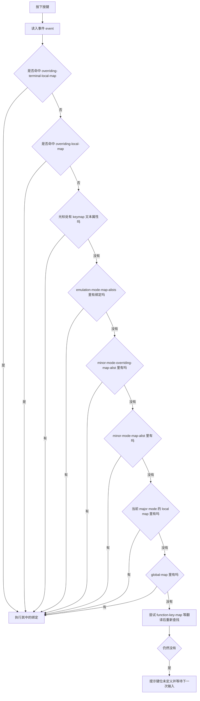
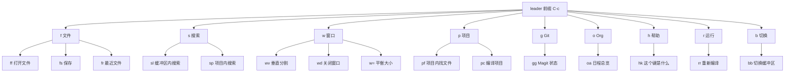
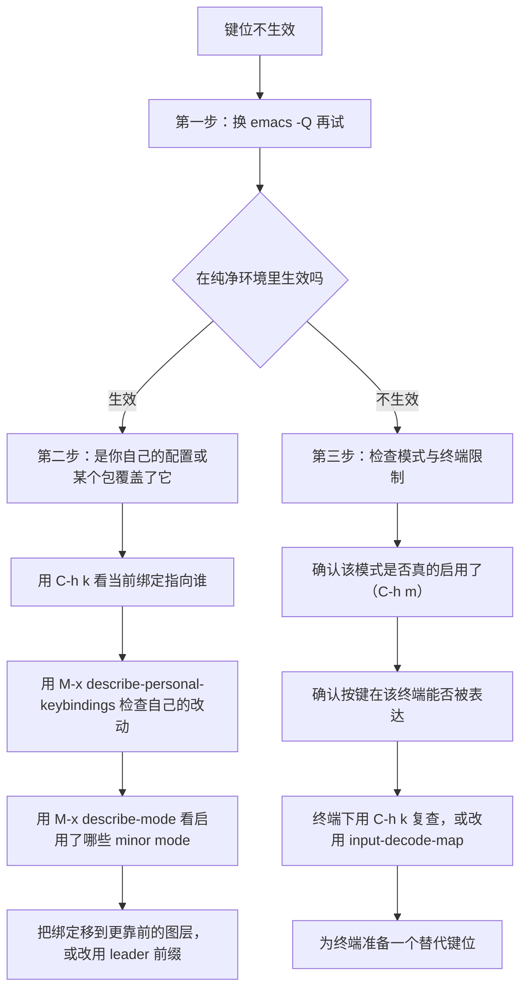

# 键位系统设计

> 配置里唯一每天都要用手去"读"的东西就是键位。本篇先讲清 Emacs 键位体系的真实结构，再给出五条设计原则、两套可直接使用的 leader 键实现（第三方包版与纯内置版）、which-key 与 hydra 的完整配置，以及一套可以照着走的冲突排查流程。

---

## 一、Emacs 键位体系再认识

在改任何一个键之前，需要先知道"一次按键在 Emacs 内部经历了什么"。否则你只能靠试错来排错。

### 1.1 键位语法

Emacs 文档里按键的写法是有约定的，本教程统一使用这一套：

| 写法 | 含义 | 示例 |
|------|------|------|
| `C-` | Control 修饰键 | `C-x C-f` 表示先按 Control+x，再按 Control+f |
| `M-` | Meta 修饰键，终端里等同 `ESC` 前缀 | `M-x`、`M-%` |
| `S-` | Shift 修饰键 | `S-<left>` |
| `C-M-` | Control 与 Meta 同时按 | `C-M-n` 移到下一个括号表达式 |
| `<...>` | 具名键，如功能键、方向键、鼠标键 | `<f5>`、`<return>`、`<mouse-1>` |
| `SPC`、`RET`、`TAB`、`DEL` | 空格、回车、制表、退格 | `C-c SPC` |
| `C-c f` | 前缀键加字母的序列 | 先按 `C-c`，再按 `f` |

`^X`、`Ctrl+X`、`Alt+X` 这类写法在不同编辑器里含义不同，在 Emacs 语境里一律不用：`Ctrl+X` 可能是 `C-x`，也可能是 `C-x` 之后跟一个 `X`，写清楚比写得短重要。

### 1.2 一次按键在内部经历了什么

按下一个键，Emacs 得到的不是"字符"，而是一个**事件（event）**。字母键的事件是一个整数（`a` 是 97），功能键的事件是一个符号（`<f5>`、`<left>`），鼠标事件是一个列表（`(mouse-1 (0 . 5) nil 1)`）。键位映射（keymap）做的事情，就是把"事件序列"翻译成"命令"。

这个模型解释了日常遇到的几件事：

- 为什么 `C-h k` 能显示按下的键位：它读取的就是事件序列本身。
- 为什么终端里的 `ESC` 会有延迟：终端把 `ESC` 当作转义序列的开头，Emacs 需要等一小段时间才能确定后面没有字符跟着。
- 为什么 `C-;` 之类的键在终端里无效：终端根本不会把"Control 加分号"这个组合发出来，Emacs 也就收不到对应事件。

除了一般的 keymap，Emacs 还有几张用于**翻译**的键位图，它们是排查"按了没反应"的关键：

| 变量 | 作用 |
|------|------|
| `function-key-map` | 把终端的转义序列翻译成具名键，全局默认 |
| `local-function-key-map` | 同上，但按终端类型生效 |
| `input-decode-map` | 优先于前两者，终端下的按键重定义常写在这里 |
| `key-translation-map` | 把已经识别出的按键序列翻译成另一串按键 |

终端里想用 `C-;` 之类的组合，通常要在 `input-decode-map` 里做映射；图形界面下不需要，因为窗口系统直接送来正确的事件。这就是"同一份配置在 GUI 与终端行为不同"的根本原因。

### 1.3 默认键位的历史包袱

Emacs 的默认键位从 1976 年延续至今，它带着几个明显的历史包袱：

- `C-h` 既是帮助前缀，在很多终端里又等同于退格键 `DEL`，两者在终端下天然打架。
- `C-x` 承担了过多前缀职责，功能多到要背。
- `C-z` 是挂起（`suspend-frame`），在图形界面里误按会让人以为 Emacs 死了。
- 撤销默认是 `C-/`、`C-_`、`C-x u` 三套并存，重做在 `undo-only`/`undo-redo` 出现之前根本没有标准键。
- `C-m`、`C-i`、`C-[` 分别等同 `RET`、`TAB`、`ESC`，在终端里无法区分。

这些不是缺陷，而是兼容性的代价。**你不需要"修正"它们，但必须知道哪些键碰不得。**

### 1.4 按键查找的完整顺序

按下按键后，Emacs 按固定顺序在若干张键位图里查找。这个顺序决定了"为什么我的绑定被别的模式抢走了"。下面是手册中给出的查找顺序的流程图：



这张图里有三个必须记住的结论：

1. **minor mode 的键位优先于 major mode 的 local map。** 很多人以为是反过来的，于是"我的 dired 键位被某个全局 minor mode 吃掉了"这类问题就找不到原因。
2. **`emulation-mode-map-alists` 排在普通 minor mode 之前。** evil 的状态键位、general.el 的 `override` 键位都挂在这里，所以它们能盖住绝大多数模式绑定。
3. **`overriding-terminal-local-map` 优先级最高。** `set-transient-map`（hydra、repeat-mode 内部都用它）以及 minibuffer 的临时键位就是走这条路，这也是为什么 hydra 激活时普通键位都会失效。

`C-x`、`C-c`、`C-h` 这类前缀键在查找中只是"读到一半"，Emacs 会继续读下一个事件，直到命中一个非前缀绑定为止。前缀键本身也是一张普通 keymap，只不过它的内容大多是别的绑定。

---

## 二、键位设计五原则

原则不是审美偏好，而是踩过坑之后的共识。Emacs 手册的"Key Binding Conventions"一节给出了官方约定，下面五条是它在个人配置里的落地版本。

### 2.1 原则一：`C-c + 字母` 留给用户

手册的原文是：`C-c` 加一个字母的序列"是唯一保留给用户的序列"，程序不应该占用。完整的保留规则如下：

| 序列 | 归属 | 说明 |
|------|------|------|
| `C-c` 加字母（大小写、ASCII 与非 ASCII 均可） | 用户 | 唯一完全属于你的空间 |
| 无修饰键的 `<f5>` 到 `<f9>` | 用户 | 第二块自留地 |
| `C-c` 加控制字符或数字 | major mode | 例如 `C-c C-c`、`C-c 1` |
| `C-c` 加 `{` `}` `<` `>` `:` `;` | major mode | 例如 `C-c ;` |
| `C-c` 加其他 ASCII 标点或符号 | minor mode | 例如 `C-c @`、`C-c ~` |

实践含义：**你的个人命令一律绑到 `C-c` 加字母**（`C-c f`、`C-c s`），不要抢 `C-c C-f`（那是模式的地盘），也不要抢 `C-c @`（那是 minor mode 的地盘）。照这条做，你的绑定永远不会和别人的包打架。

### 2.2 原则二：不覆盖 `C-h` 与 `C-g`

手册明确要求：不要在**任何前缀键之后**绑定 `C-h`，也不要让序列以 `C-g` 结尾。

原因很直接：

- `C-h` 是 Emacs 的"我不知道这个键是干什么的"入口。把它绑成删除字符（很多人的第一反应，因为终端里 `C-h` 像退格），你就失去了整个帮助系统的快捷键通道。
- `C-g` 是"取消一切"。绑定了以 `C-g` 结尾的序列，等于在用户最需要中断的时候给他一个别的结果。
- 同理不要绑定以 `<ESC>` 结尾的序列（`<ESC> <ESC>` 除外），否则终端把它识别为转义序列开头的能力会被破坏。

这两条是少数几条"收益为零、代价极大"的改动，直接照做即可。

### 2.3 原则三：优先绑到模式，而不是全局

全局绑定（`global-map`、`C-c` 前缀）的代价是：它在所有缓冲区里都生效，包括你正在读的 `*Help*`、正在编辑的 minibuffer 补全候选、别人的只读缓冲区。一旦某个包的文档里写着"按 `q` 退出"，而你把 `q` 全局绑成了别的命令，麻烦就开始了。

正确的分层是：

| 目标 | 绑定位置 | 写法 |
|------|----------|------|
| 某个模式下的行为 | 该模式的 map，且只在该模式生效 | `keymap-set dired-mode-map "j" #'my-dired-down` |
| 某个模式族的通用行为 | 父模式 map，例如 `prog-mode-map` | `keymap-set prog-mode-map "C-c C-r" #'my-run` |
| 与模式无关的自定义命令 | `C-c` 加字母，或 leader 前缀 | `keymap-set global-map "C-c l" ...` |
| 需要压过一切的特殊绑定 | `emulation-mode-map-alists`（general 的 `override`） | 见第三章 |

判断标准一句话：**如果这个命令只在某种文件里才有意义，就绑到那种模式上。** 例如"运行当前测试"是代码模式的事，绑到 `prog-mode-map`；"在 dired 里上下移动"是 dired 的事，绑到 `dired-mode-map`。

### 2.4 原则四：避开终端与输入法冲突

同一条绑定在图形界面可用、在终端不可用，是很常见的挫败来源。主要原因有三类：

- **终端无法表达该组合。** `C-;`、`C-:`、`C-=`、`C-,`、`C-.` 这类"Control 加标点"的组合，在大多数终端里根本不产生独立事件。`C-M-` 加字母的组合同样只在部分终端可用（需要终端支持扩展按键协议，或让 Emacs 通过 `input-decode-map` 自行解码）。
- **终端把按键等同了。** `C-h` 等同退格、`C-i` 等同 `TAB`、`C-m` 等同 `RET`、`C-[` 等同 `ESC`，在终端里无法区分，在图形界面下才能区分。
- **输入法截走了按键。** 见第八章。

结论：**把关键键位限制在"任何环境都能表达"的范围内**（`C-c` 加字母、`C-x` 前缀、功能键、`M-` 加字母），把 `C-;` 这类按键当作图形界面下的锦上添花，并始终准备一个终端可用的替代键。

### 2.5 原则五：同一功能跨模式保持一致

如果在 Markdown 里"预览"是 `C-c C-p`，在 Org 里是 `C-c C-e`，在 HTML 里又是 `C-c C-v`，那你的手指永远学不会。做法是给自己的**功能**分配固定键位，而不是给"包"分配键位：

```elisp
;; 用同一组 C-c 加字母表示同一件事，各模式自己决定调用哪个命令
(keymap-set markdown-mode-map "C-c C-c" #'markdown-preview)
(keymap-set org-mode-map "C-c C-c" #'org-latex-preview)
```

更彻底的做法是把"同一功能"收敛到自己写的一个命令上，让命令内部按 `major-mode` 分派。这样键位只有一个，模式差异被挡在实现层，配置也会更短。这一技巧在 [[emacs教程/3配置实践/05_自定义功能开发|自定义功能开发]]里有完整写法。

### 2.6 五原则速查

| 原则 | 一句话 | 违反后的典型症状 |
|------|--------|------------------|
| `C-c + 字母` 留给用户 | 个人命令只占这一块 | 与包、与模式绑定互相覆盖 |
| 不覆盖 `C-h` 与 `C-g` | 保住帮助与取消 | 查不到键位、中断失效 |
| 优先绑到模式 | 只在需要的地方生效 | 只读缓冲区里出现奇怪行为 |
| 避开终端与输入法冲突 | 关键键位要人人可用 | 换到 SSH 就全废 |
| 同一功能跨模式一致 | 给功能分配键位 | 每个模式都要重新记 |

---

## 三、leader 键方案

### 3.1 为什么要 leader 键

Emacs 原生给用户的空间只有 `C-c` 加一个字母，共 52 个槽位。当你装了二十个包、写了几十个自己的命令时，这点空间加上 `C-h` 查键位的开销，会让"我到底该按什么"变成每天都要重新决策的问题。

leader 键解决的是"**键位空间不足**"和"**键位难以记忆**"这两个问题。它的思路很朴素：拿一个很少用的前缀（`SPC`、`C-c`、`M-SPC`、`,` 都有人用），把后续按键组织成有语义的分区——`f` 是文件、`s` 是搜索、`w` 是窗口。于是键位从"记忆题"变成"推理题"：想到"搜索"就按 `s`，后面自然接得下去。

代价也需要说清楚：

- leader 前缀会占用一个当前没被大量使用的键，选择时要避开模式常用的键。`SPC` 在 Emacs 默认绑定里是 `self-insert-command`（在普通缓冲区就是输入空格），把它改成前缀意味着**你无法直接输入空格**，这是 Vim/Doom 用户熟悉的取舍，但对以写作为主的用户并不合适。
- leader 键让"按一个键"变成"按两个键"，高频操作反而变慢。高频动作（保存、撤销、切换缓冲区）应该留在最短的键上。

本教程的建议：**非 evil 用户用 `C-c` 作 leader**（它本来就是用户前缀，没有任何额外冲突），**evil 用户继续用 `SPC`**。

### 3.2 方案一：general.el + use-package + which-key（推荐）

`general.el` 是当前 Emacs 社区最主流的键位组织包，它提供三样东西：leader 定义器、前缀与 which-key 描述的联动、以及一个可以压过模式绑定的 `override` 键位图层。它是 MELPA 上的 `general` 包（<https://melpa.org/#/general>，安装命令 `M-x package-install RET general RET`）。

下面是一份完整的、可直接复制运行的配置：

```elisp
;;; ========== which-key：让前缀键可发现 ==========

(use-package which-key
  ;; Emacs 30 起 which-key 已内置，所以这里不需要 :ensure；
  ;; 在 Emacs 29 及更早版本上，请把下一行改成 :ensure t（从 MELPA 安装）
  :ensure nil
  :init
  (setq which-key-idle-delay 0.4)            ; 按下前缀键后 0.4 秒弹出提示
  (setq which-key-idle-secondary-delay 0.05) ; 第二次按同一前缀立刻显示
  (setq which-key-separator " → ")           ; 提示里的分隔符
  (setq which-key-prefix-prefix "+")         ; 前缀键显示成 + 号
  :config
  (which-key-mode 1)
  ;; 在 which-key 的提示窗口里，任何位置按 C-h C-k 都能看顶层键位表。
  ;; 绑到 which-key-mode-map 上，只有该模式启用时才生效。
  (keymap-set which-key-mode-map "C-h C-k" #'which-key-show-top-level))

;;; ========== general：定义 leader 键 ==========

(use-package general
  :ensure t
  :config
  ;; 定义一个 leader 定义器：这些绑定会进入 emulation-mode-map-alists，
  ;; 因此优先于所有 major/minor mode 的同名绑定。
  ;; 若非必要，不建议用 'override；见 3.5 的取舍讨论。
  (general-create-definer my-leader-def
    :keymaps 'override
    :prefix "C-c")

  ;; ---------------------------------------------------------------
  ;; 文件分区：C-c f
  ;; :ignore t 表示这一项不绑定命令，只作为 which-key 的分组标题
  ;; ---------------------------------------------------------------
  (my-leader-def
    "f"  '(:ignore t :which-key "文件")
    "ff" '(find-file :which-key "打开文件")
    "fs" '(save-buffer :which-key "保存")
    "fw" '(write-file :which-key "另存为")
    "fr" '(recentf-open-files :which-key "最近文件")
    "fk" '(kill-current-buffer :which-key "关闭缓冲区"))

  ;; 搜索分区：C-c s
  (my-leader-def
    "s"  '(:ignore t :which-key "搜索")
    "sb" '(consult-line :which-key "本缓冲区搜索")
    "sp" '(consult-ripgrep :which-key "项目内搜索")
    "sr" '(query-replace :which-key "替换")
    "sx" '(consult-imenu :which-key "跳转到定义符号"))

  ;; 窗口分区：C-c w
  (my-leader-def
    "w"  '(:ignore t :which-key "窗口")
    "wv" '(split-window-right :which-key "垂直分割")
    "ws" '(split-window-below :which-key "水平分割")
    "wd" '(delete-window :which-key "关闭当前窗口")
    "wo" '(delete-other-windows :which-key "只留当前窗口")
    "ww" '(other-window :which-key "切到下一个窗口")
    "w=" '(balance-windows :which-key "平衡大小"))

  ;; 项目分区：C-c p
  (my-leader-def
    "p"  '(:ignore t :which-key "项目")
    "pf" '(project-find-file :which-key "项目内找文件")
    "pp" '(project-switch-project :which-key "切换项目")
    "pc" '(project-compile :which-key "编译项目")
    "pb" '(project-switch-to-buffer :which-key "项目内切换缓冲区")
    "pk" '(project-kill-buffers :which-key "关闭项目所有缓冲区"))

  ;; Git 分区：C-c g（需要 Magit）
  (my-leader-def
    "g"  '(:ignore t :which-key "Git")
    "gg" '(magit-status :which-key "状态")
    "gl" '(magit-log-current :which-key "当前分支日志")
    "gf" '(magit-file-dispatch :which-key "当前文件操作")
    "gb" '(magit-blame :which-key "标注责任"))

  ;; Org 分区：C-c o（内置 Org）
  (my-leader-def
    "o"  '(:ignore t :which-key "Org")
    "oa" '(org-agenda :which-key "日程总览")
    "oc" '(org-capture :which-key "快速记录")
    "ol" '(org-store-link :which-key "存链接")
    "oi" '(org-clock-in :which-key "开始计时"))

  ;; 帮助分区：C-c h
  (my-leader-def
    "h"  '(:ignore t :which-key "帮助")
    "hk" '(describe-key :which-key "这个键是什么")
    "hf" '(describe-function :which-key "这个函数是什么")
    "hv" '(describe-variable :which-key "这个变量是什么")
    "hb" '(describe-bindings :which-key "当前所有键位")
    "hm" '(describe-mode :which-key "当前模式"))

  ;; 运行分区：C-c r
  (my-leader-def
    "r"  '(:ignore t :which-key "运行")
    "rr" '(recompile :which-key "重新编译")
    "rc" '(compile :which-key "编译命令")
    "rs" '(shell-command :which-key "执行一条命令")
    "rt" '(vterm :which-key "打开终端（需 vterm）"))

  ;; 切换分区：C-c b
  (my-leader-def
    "b"  '(:ignore t :which-key "切换")
    "bb" '(switch-to-buffer :which-key "切换缓冲区")
    "bi" '(ibuffer :which-key "缓冲区列表")
    "bm" '(bookmark-jump :which-key "跳转书签")
    "bt" '(tab-bar-switch-to-tab :which-key "切换标签页")))
```

把上面两段放进 `init.el`（或 `lisp/my-keys.el`），保存后 `M-x eval-buffer`。第一次按下 `C-c`，等 0.4 秒就能看到 which-key 列出的九个分区；按 `C-c f` 再等一次，会看到文件分区里的六条命令。

三点必须注意：

- `general` 在 `:keymaps 'override` 模式下，会自动启用 `general-override-mode`（由 `general-override-auto-enable` 控制）。这一模式的键位图被放进 `emulation-mode-map-alists`，所以它能盖住模式绑定。**能力越强越要克制**：只把真正需要覆盖的键位放进 override，其余用默认的 `global`。
- `:which-key` 与 `:wk` 是同一个关键字的两种写法，`general.el` 内部把它们都交给 which-key 的前缀描述机制。
- 上面用到的 `consult-*`（`consult` 包）、`magit-*`（`magit` 包）、`vterm` 都是第三方包。没装的话按 `C-c s p` 之类的键会提示命令不存在——这是正常的，装上即可。

### 3.3 方案二：只用内置功能实现 leader

不想引入第三方包也完全可以。核心只有两个内置函数：`define-prefix-command` 定义前缀命令，`keymap-set` 往里填绑定。下面这份实现不依赖任何第三方包，在 Emacs 29 与 30 上都能直接运行：

```elisp
;;; ---------- 1. 前缀描述表：给 which-key 看的中文名字 ----------
;; keymap 是「prefix-map 变量 -> (按键 . 描述) 列表」的映射，
;; 存起来是为了后面统一注册，避免 description 和绑定脱节。
(defvar my-leader-labels
  '((my-leader-map
     ("f" . "文件") ("s" . "搜索") ("w" . "窗口") ("p" . "项目")
     ("g" . "Git")  ("o" . "Org")  ("h" . "帮助") ("r" . "运行")
     ("b" . "切换"))
    (my-leader-file-map
     ("f" . "打开文件") ("s" . "保存") ("w" . "另存为")
     ("r" . "最近文件") ("k" . "关闭缓冲区"))
    (my-leader-search-map
     ("l" . "本缓冲区搜索") ("p" . "目录内搜索")
     ("r" . "替换") ("i" . "跳转符号"))
    (my-leader-window-map
     ("v" . "垂直分割") ("s" . "水平分割") ("d" . "关闭当前窗口")
     ("o" . "只留当前窗口") ("w" . "切到下一个窗口") ("=" . "平衡大小"))
    (my-leader-help-map
     ("k" . "这个键是什么") ("f" . "这个函数是什么")
     ("v" . "这个变量是什么") ("b" . "当前所有键位")))
  "leader 键各分区的 which-key 描述。")

;;; ---------- 2. 定义前缀命令 ----------
;; define-prefix-command 做两件事：
;;   把符号当作变量，值为一张新的 sparse keymap；
;;   把符号当作函数，成为一个可以激活前缀的交互命令。
(dolist (map-name '(my-leader-map
                    my-leader-file-map my-leader-search-map
                    my-leader-window-map my-leader-help-map))
  (define-prefix-command map-name))

;;; ---------- 3. 把 leader 挂到 C-c ----------
(keymap-set global-map "C-c" 'my-leader-map)

;;; ---------- 4. 分区之间的挂接 ----------
;; my-leader-map 的第二层：每个字母指向一个分区 keymap
(keymap-set my-leader-map "f" 'my-leader-file-map)
(keymap-set my-leader-map "s" 'my-leader-search-map)
(keymap-set my-leader-map "w" 'my-leader-window-map)
(keymap-set my-leader-map "h" 'my-leader-help-map)

;;; ---------- 5. 叶子绑定 ----------
;; 文件分区
(keymap-set my-leader-file-map "f" #'find-file)
(keymap-set my-leader-file-map "s" #'save-buffer)
(keymap-set my-leader-file-map "w" #'write-file)
(keymap-set my-leader-file-map "r" #'recentf-open-files)
(keymap-set my-leader-file-map "k" #'kill-current-buffer)

;; 搜索分区（f 交给本缓冲区的 C-s，项目搜索用内置的 rgrep）
(keymap-set my-leader-search-map "l" #'isearch-forward)
(keymap-set my-leader-search-map "r" #'query-replace)
(keymap-set my-leader-search-map "p" #'rgrep)
(keymap-set my-leader-search-map "i" #'imenu)

;; 窗口分区
(keymap-set my-leader-window-map "v" #'split-window-right)
(keymap-set my-leader-window-map "s" #'split-window-below)
(keymap-set my-leader-window-map "d" #'delete-window)
(keymap-set my-leader-window-map "o" #'delete-other-windows)
(keymap-set my-leader-window-map "w" #'other-window)
(keymap-set my-leader-window-map "=" #'balance-windows)
(keymap-set my-leader-window-map "u" #'winner-undo)   ; 需要 winner-mode
(keymap-set my-leader-window-map "r" #'winner-redo)

;; 帮助分区
(keymap-set my-leader-help-map "k" #'describe-key)
(keymap-set my-leader-help-map "f" #'describe-function)
(keymap-set my-leader-help-map "v" #'describe-variable)
(keymap-set my-leader-help-map "b" #'describe-bindings)
(keymap-set my-leader-help-map "m" #'describe-mode)

;;; ---------- 6. 注册 which-key 描述 ----------
;; 有 which-key 就用它显示中文说明；没有就静默跳过。
(when (require 'which-key nil t)
  (dolist (entry my-leader-labels)
    (dolist (pair (cdr entry))
      (which-key-add-keymap-based-replacements
        (car entry) (car pair) (cdr pair)))))

;;; ---------- 7. 检查结果 ----------
;; 求值完上面所有内容后，下列表达式应返回对应的 keymap 符号：
;;   (lookup-key global-map (kbd "C-c"))        => my-leader-map
;;   (lookup-key my-leader-map (kbd "f"))       => my-leader-file-map
;;   (lookup-key my-leader-file-map (kbd "f"))  => find-file
```

这份实现的关键点：

- `define-prefix-command` 只接受一个符号参数，它会创建同名变量（值为 keymap）与同名命令（前缀命令）。符号名建议以 `-map` 结尾，便于阅读。
- `keymap-set` 的 KEYMAP 参数可以是符号，它会用符号的函数值作为键位图，所以 `(keymap-set my-leader-file-map "f" #'find-file)` 这种写法是合法的（已在本机 Emacs 上实测）。
- `which-key-add-keymap-based-replacements` 的第三个参数是显示字符串。它比按"按键字符串"注册的 `which-key-add-key-based-replacements` 更稳，因为绑定换前缀时描述会跟着走。
- 想让这套东西也压过模式绑定，把第二步之后的所有 `keymap-set` 换成写入 `general-override-mode-map` 之类的覆盖图层；纯内置方案没有等价物，所以**内置方案更适合"不与模式冲突"的键位，而不是"强制覆盖"的键位**。

### 3.4 leader 分区设计

分区表不是随便定的，它遵循"左手区放高频、语义相邻的分区挨着放"的思路。下面这份分区表可以直接用：

| 分区 | 键位 | 语义 | 成员示例 |
|------|------|------|----------|
| 文件 | `C-c f` | file | 打开、保存、另存、最近、关闭 |
| 搜索 | `C-c s` | search | 本缓冲搜索、项目搜索、替换、符号跳转 |
| 窗口 | `C-c w` | window | 分割、关闭、切换、平衡、撤销布局 |
| 项目 | `C-c p` | project | 找文件、切换项目、编译、关项目缓冲区 |
| Git | `C-c g` | git | 状态、日志、文件操作、blame |
| Org | `C-c o` | org | agenda、capture、计时、存链接 |
| 帮助 | `C-c h` | help | 键位、函数、变量、当前模式 |
| 运行 | `C-c r` | run | 编译、重编译、执行命令、终端 |
| 切换 | `C-c b` | buffer | 缓冲区、缓冲区列表、书签、标签页 |

结构上它是一棵两层树，第二层每个叶子都是一个命令：



设计分区时有三条经验：

1. **分区数控制在 8 到 12 个。** 少于一屏能看完，多了就要靠 which-key 反复查。
2. **分区字母与英文单词首字母对齐。** `f`/`file`、`s`/`search`、`w`/`window`。对中文用户来说，记住英文单词比记住中文对应的任意一个字母容易得多。
3. **`h` 一定要留给帮助。** 你会在 leader 里迷路，而 `C-c h k` 就是你的地图。

### 3.5 两种方案的取舍

| 维度 | general.el | 纯内置 `define-prefix-command` |
|------|-----------|-------------------------------|
| 依赖 | 需要安装 MELPA 包 | 无 |
| 定义长度 | 一行一个绑定，`:which-key` 内联 | 绑定与描述分离，代码更长 |
| 覆盖模式绑定 | 支持（`override` 图层） | 不支持（只能进 global-map） |
| evil 状态支持 | 原生支持 `:states` | 需要自己处理 auxiliary keymap |
| 描述维护 | 与绑定写在一起，不易脱节 | 分散在两处，容易忘 |
| 适合谁 | 长期维护、键位多的配置 | 想减少依赖、键位不多的配置 |

结论：**键位数量超过五十条、或者要用 evil，就上 general.el；否则纯内置足够，而且你能完全看懂它做了什么。**

---

## 四、which-key：让前缀键可发现

### 4.1 30 起内置

`which-key` 在 Emacs 30 中被纳入 Emacs 本体（NEWS.30 的 "New package 'which-key'" 条目），因此 Emacs 30 用户不需要安装任何东西，`M-x which-key-mode` 即可启用。Emacs 29 及更早版本需要从 GNU ELPA 或 MELPA 安装（`M-x package-install RET which-key RET`）。

它的作用只有一个：按下前缀键后如果停顿，就在屏幕边缘列出现有后续按键及其对应命令。对"记不住键位"这件事，它是最直接的解法。

### 4.2 基本配置

```elisp
(use-package which-key
  :ensure nil                       ; 30 起内置；29 上改成 :ensure t
  :init
  (setq which-key-idle-delay 0.4)   ; 主延迟：0.4 秒，太快会一直闪
  (setq which-key-idle-secondary-delay 0.05) ; 已经显示过一次后，再按立刻出现
  (setq which-key-separator " → ")
  (setq which-key-prefix-prefix "+")
  :config
  (which-key-mode 1))
```

各参数的含义与建议值：

| 变量 | 作用 | 建议 |
|------|------|------|
| `which-key-idle-delay` | 停顿多久后弹窗 | 0.3 到 0.5 秒；小于 0.2 会干扰输入 |
| `which-key-idle-secondary-delay` | 同一前缀第二次按下后的延迟 | 0.05 秒，形成"第二次立刻显示"的手感 |
| `which-key-separator` | 按键与描述之间的分隔符 | 保持默认或换成箭头 |
| `which-key-prefix-prefix` | 前缀键在提示里的显示前缀 | `+` 比默认更清晰 |
| `which-key-max-description-length` | 描述最大长度 | 描述写太长时可调到 40 |
| `which-key-sort-order` | 排序方式 | 默认按 keymap 顺序，与你的绑定顺序一致 |
| `which-key-popup-type` | 弹窗形式 | `minibuffer`、`side-window`、`frame` 等 |

如果 which-key 的弹窗遮住了手头内容，可以换位置：

```elisp
;; 让提示出现在底部侧窗，并设置最小高度
(which-key-setup-side-window-bottom)
(setq which-key-side-window-max-height 0.25)

;; 或者干脆放到 minibuffer 里（不遮挡缓冲区内容）
;; (which-key-setup-minibuffer)
```

### 4.3 前缀描述：让 `C-c f` 显示"文件"

which-key 只能显示它**知道**的东西：命令名、或你注册的描述。前缀键本身没有命令名（`my-leader-map` 只是个 keymap），所以必须注册描述，否则你只会看到 `+prefix`。

两种注册方式：

```elisp
;; 方式一：按按键序列注册（简单，但绑定搬家时要记得改）
(which-key-add-key-based-replacements
  "C-c f" "文件"
  "C-c f f" "打开文件")

;; 方式二：按 keymap 注册（推荐，绑定与描述绑定在同一张图上）
(which-key-add-keymap-based-replacements my-leader-file-map
  "f" "打开文件"
  "s" "保存"
  "r" "最近文件")

;; 还可以给某个 major mode 专属的键位加描述
(which-key-add-major-mode-key-based-replacements 'org-mode
  "C-c C-e" "导出")
```

用 general.el 时不需要写这些，`:which-key` 关键字会替你调用同一套机制。

### 4.4 绑定 `which-key-show-top-level`

按下 `C-c` 之外的顶层键位表（比如"我到底把哪些键留给了 `C-x`"）需要 `which-key-show-top-level`。它默认没有键位，推荐绑在 `which-key-mode-map` 上：

```elisp
(keymap-set which-key-mode-map "C-h C-k" #'which-key-show-top-level)
```

选 `C-h C-k` 的理由：它在 `help-map` 中是空闲的（`C-h C-w` 已被 `describe-no-warranty` 占用，不要用），且在 which-key 的提示窗口里随手可及。绑定在 `which-key-mode-map` 上意味着只有 `which-key-mode` 启用时才生效，不会污染全局键位表。

相关的还有几个命令值得知道：`which-key-show-major-mode`（当前 major mode 的键位）、`which-key-show-full-keymap`（整张 keymap）、`which-key-show-minor-mode-keymap`（某个 minor mode 的键位）。

---

## 五、hydra 与 transient：两种命令面板

leader 键擅长"一次性触发一个命令"，但有些操作需要**连续调整并观察结果**：调窗口大小、缩放字号、翻页浏览。这类操作适合"面板"：按一个键进入，之后一连串单键反复生效，直到按下退出键。

### 5.1 hydra：一个可直接使用的窗口操作面板

`hydra` 是 MELPA 上的包（<https://github.com/abo-abo/hydra>）。它的核心宏是 `defhydra`，用法是"一个 body（挂载的键位）+ 若干 head（每个键对应一个命令）"。下面是一个完整的窗口操作面板：

```elisp
(use-package hydra
  :ensure t
  :config
  ;; 参数说明：
  ;;   (global-map "C-c W")  —— 把面板挂在 global-map 的 C-c W 上
  ;;                            用大写 W 是为了不与 leader 的 C-c w 窗口分区冲突
  ;;   "窗口"                —— 显示在回显区的提示文字
  ;;   :exit t               —— 执行任何一个 head 后都退出面板
  ;;   :foreign-keys warn    —— 按到面板之外的键时只警告并保持面板，不执行该键
  (defhydra hydra-window (global-map "C-c W")
    "窗口"
    ("h" windmove-left        "左")
    ("j" windmove-down        "下")
    ("k" windmove-up          "上")
    ("l" windmove-right       "右")
    ("v" split-window-right   "垂直分割")
    ("s" split-window-below   "水平分割")
    ("d" delete-window        "关闭当前窗口")
    ("o" delete-other-windows "只留当前窗口")
    ("=" balance-windows      "平衡大小")
    ("^" enlarge-window       "变高")
    ("}" enlarge-window-horizontally "变宽")
    ("u" winner-undo          "撤销布局变化")
    ("r" winner-redo          "重做布局变化")
    ("q" nil                  "退出面板")   ; 命令为 nil 表示只退出
    ;; 有一个 head 单独指定 :exit t，其余继承 body 的设置
    ("x" delete-window "关闭并退出" :exit t)))
```

安装并求值后，`C-c W` 进入面板，此时 `h`/`j`/`k`/`l` 直接就是窗口跳转，`v`/`s` 直接分割，按 `q` 退出。因为 `:exit t`，执行任一动作后面板就退出——这对窗口操作是合适的，因为每次操作后你要用鼠标或方向键确认结果。这里用大写 `W` 而非 `C-c w`，正是因为 `C-c w` 已经留给 leader 的窗口分区：**同一个字母区分大小写复用，是 leader 之外再开面板的常用手法**。

面板参数的含义：

| 参数 | 位置 | 取值 | 含义 |
|------|------|------|------|
| `:exit` | body 或 head | `t` / `nil` | `t` 表示执行后退出面板；head 上的设置覆盖 body |
| `:foreign-keys` | body | `run` / `warn` / `nil` | 面板激活时按到外部键怎么办：直接执行 / 警告不执行 / 忽略 |
| `:color` | body 或 head | `red` `blue` `amaranth` `teal` `pink` | 只是提示颜色，但会连带默认的 `:exit` 与 `:foreign-keys` |
| `:hint` | body | `nil` 或字符串 | 是否在回显区显示提示 |
| `:pre` / `:post` | body | 表达式 | 进入前 / 退出后执行，适合临时改变量 |
| `:timeout` | body | 秒数 | 停留多久自动退出，避免忘记退出后面板一直生效 |
| `:columns` | body | 整数 | 回显区提示的列数 |

关于 `:color` 的连带效果要特别小心：`blue` 与 `teal` 会默认把 `:exit` 设为 `t`，`pink` 会把 `:foreign-keys` 设为 `run`，`amaranth` 与 `teal` 会把 `:foreign-keys` 设为 `warn`。**如果你在意行为，就直接写 `:exit` 与 `:foreign-keys`，不要只写颜色。**

`:foreign-keys` 的选择是 hydra 最容易踩的坑：默认 `nil` 意味着面板激活时，你按下一个不在面板里的键**什么都不会发生**，很多人因此以为 Emacs 卡死了。窗口、缩放这类"随时想中途干别的"的面板建议用 `warn`；纯导航类面板可以用默认值。

### 5.2 transient：内置的现代化面板

`transient` 自 Emacs 28 起随 Emacs 一同分发（NEWS.28 的 "transient.el" 条目），因此 **Emacs 29 与 30 用户都不需要安装**。它是 Magit 的面板基础，特点是：有分组标题、支持开关型参数（infix）、有 `C-x` 之类的统一辅助键。相比 hydra，它更"正式"、更适合长期维护，代价是写法更啰嗦。

一个最小示例：

```elisp
;; transient 自 Emacs 28 起内置，无需安装
(require 'transient)

;; 布局写法：一个顶层向量，里面每个向量是一个分组；
;; 每个后缀的格式是 (按键 描述 命令)
(transient-define-prefix my-transient-window ()
  "窗口操作面板（transient 版）。"
  [["移动"
    ("h" "左" windmove-left)
    ("j" "下" windmove-down)
    ("k" "上" windmove-up)
    ("l" "右" windmove-right)]
   ["分割与关闭"
    ("v" "垂直分割" split-window-right)
    ("s" "水平分割" split-window-below)
    ("d" "关闭当前窗口" delete-window)
    ("o" "只留当前窗口" delete-other-windows)
    ("=" "平衡大小" balance-windows)]])

;; 绑到未被 leader 占用的字母上（C-c z 中的 z 只是"面板"的随手记法）
(keymap-set global-map "C-c z" #'my-transient-window)
```

调用 `C-c z` 后会出现一个面板：分组标题是中文，每个后缀显示描述，`C-g` 退出，`C-x` 可以查看更多选项。transient 面板默认在**执行一个后缀后退出**（除非该后缀声明了 `:transient t`），这与 hydra 的 `:exit t` 行为一致。

两个示例分别绑在 `C-c W` 与 `C-c z` 上，你可以把两段都放进配置，实际按一遍再决定留哪一个。

### 5.3 什么时候用哪个

| 场景 | 推荐 | 原因 |
|------|------|------|
| 需要连续调整并观察（缩放、翻页、调窗口） | hydra | 单键反复生效，提示常驻 |
| 需要一组开关参数再执行（导出、提交） | transient | 原生支持 infix 参数与状态显示 |
| 只想少写几行代码 | hydra | `defhydra` 一行一个 head |
| 想零依赖 | transient | Emacs 28 起内置 |
| 想让面板看起来像 Magit | transient | 同一套渲染 |

---

## 六、repeat-mode：让单键命令可以连按

### 6.1 内置的 repeat-mode

`repeat-mode` 自 Emacs 28 起内置。它的作用很具体：某些命令执行后，会临时把该命令的"重复键位"激活，让你不必反复按完整序列。例如启用后按下 `C-x u`（`undo`），回显区会提示可以用 `u` 继续撤销，直接按 `u` 就能一直撤销下去。内置的重复映射覆盖了撤销、窗口切换、方向移动等常用命令。

```elisp
;; 全局启用；不想全局启用时可以在某个模式的 hook 里单独打开
(repeat-mode 1)
```

### 6.2 为自己的命令加 repeat-map

给自己的命令加"可连按"，需要三步：定义命令、建立一张 repeat keymap、把命令与它关联。可以用 `defvar-keymap` 的 `:repeat t` 一次完成：

```elisp
;;; ---------- 1. 写两个命令：在 TODO 列表里上下跳 ----------
(defvar-local my-todo-list nil
  "当前缓冲区中的 TODO 行位置列表，由 my-todo-scan 生成。")

(defun my-todo-scan ()
  "扫描当前缓冲区里的 TODO 标记，把位置存进 my-todo-list。"
  (interactive)
  (setq my-todo-list
        (save-excursion
          (goto-char (point-min))
          (let (positions)
            (while (re-search-forward "\\bTODO\\b" nil t)
              (push (line-beginning-position) positions))
            (nreverse positions))))
  (message "找到 %d 处 TODO" (length my-todo-list)))

(defun my-todo-next ()
  "跳到下一处 TODO。"
  (interactive)
  (my-todo-scan-if-needed)
  (goto-char (or (car (seq-filter (lambda (p) (> p (point))) my-todo-list))
                 (point-max))))

(defun my-todo-prev ()
  "跳到上一处 TODO。"
  (interactive)
  (my-todo-scan-if-needed)
  (goto-char (or (car (last (seq-filter (lambda (p) (< p (point))) my-todo-list)))
                 (point-min))))

(defun my-todo-scan-if-needed ()
  "首次使用时先扫描一次。"
  (unless my-todo-list (my-todo-scan)))

;;; ---------- 2. 定义 repeat keymap ----------
;; :repeat t 会自动给这张图里的每个命令打上 repeat-map 属性，
;; 于是命令执行完，Emacs 就知道下一次按 n/p 应该继续而不是重新来。
(defvar-keymap my-todo-repeat-map
  :repeat t
  "n" #'my-todo-next
  "p" #'my-todo-prev)

;;; ---------- 3. 绑到 C-c t 分区 ----------
(keymap-set global-map "C-c t n" #'my-todo-next)
(keymap-set global-map "C-c t p" #'my-todo-prev)
(keymap-set global-map "C-c t s" #'my-todo-scan)
```

现在按下 `C-c t n` 之后，只需按 `n` 就能继续跳到下一个 TODO，按 `p` 反向跳，按其他任意键即退出重复状态。**这就是重复映射的价值：把"高频重复动作"的按键成本从三键降到一键。**

如果你不想用 `defvar-keymap`，等价的传统写法是手工设置属性：

```elisp
(defvar my-todo-repeat-map
  (let ((map (make-sparse-keymap)))
    (keymap-set map "n" #'my-todo-next)
    (keymap-set map "p" #'my-todo-prev)
    map))

;; 逐个命令指定它所属的重复映射
(put 'my-todo-next 'repeat-map 'my-todo-repeat-map)
(put 'my-todo-prev 'repeat-map 'my-todo-repeat-map)
```

用 `C-h v my-todo-next RET` 查看变量文档时，若看到 `repeat-map` 属性相关说明，就说明关联成功了。

---

## 七、键位与模式的关系

### 7.1 各层键位图的职责

第 1.4 节给出的查找顺序，对应到配置里就是下面这几层。写配置前先想清楚"这条绑定该放哪一层"，能省掉后面大量的排错时间：

| 层 | 变量 | 配置写法 | 典型用途 |
|----|------|----------|----------|
| 终端级覆盖 | `overriding-terminal-local-map` | `set-transient-map` | hydra、repeat-mode、临时键位 |
| 覆盖全局 | `overriding-local-map` | 很少手工设置 | 特殊用途 |
| 文本属性 | `keymap` 文本属性 | `add-text-properties` | 按钮、链接 |
| 模拟模式 | `emulation-mode-map-alists` | general 的 `override`、evil | 需要压过一切的状态键位 |
| minor mode 覆盖 | `minor-mode-overriding-map-alist` | `general-override-mode` 等 | 临时压过其他 minor mode |
| minor mode | `minor-mode-map-alist` | `define-minor-mode` 的 `:keymap` | 某个模式的附加键位 |
| major mode | `current-local-map` | `keymap-set 某某-mode-map` | 该模式自己的键位 |
| 全局 | `global-map` | `keymap-set global-map` | `C-c` 加字母等通用键位 |

一个常见的误解是"major mode 的键位一定赢过 minor mode"。按查找顺序，**minor mode 的键位图排在 major mode 之前**，所以一个全局启用的 minor mode 完全可能悄悄吃掉你在 `dired-mode-map` 里的绑定。排查这类问题时，`C-h b`（列出当前所有有效键位）与 `M-x describe-keymap` 是主要工具。

### 7.2 与 evil 状态键位的分工

使用 evil 后，键位世界被切成两层：

- **evil 的状态键位**（normal、insert、visual 等）挂在 evil 的 auxiliary keymap 上，通过 `emulation-mode-map-alists` 生效，优先级很高。
- **Emacs 原生键位**（`global-map`、各模式 map）依然存在，在 insert 状态与 emacs 状态下照常工作。

于是分工建议是：

| 内容 | 放在哪 | 原因 |
|------|--------|------|
| `C-c` 加字母的个人命令 | `global-map` 或 leader | 在任何 evil 状态下都可用，不受状态切换影响 |
| 与模态语义一致的动作（`d`、`y`、`ciw`） | evil 状态键位 | 符合 Vim 用户的肌肉记忆 |
| 跨模式通用的窗口跳转 | evil 的 `evil-window-*` 命令 + 原生键位各一份 | 两种状态下都不别扭 |
| 覆盖某个模式的既有键位 | evil-collection 提供，或 general 的 `:states` | 别自己硬写状态键位 |

用 general.el 时，给 evil 状态加键位写在 `:states` 里：

```elisp
;; 需要 evil；:states 只在 evil 存在时才有意义
(general-create-definer my-evil-leader-def
  :states '(normal visual)
  :prefix "SPC")

(my-evil-leader-def
  "f" '(:ignore t :which-key "文件")
  "ff" '(find-file :which-key "打开文件"))
```

不要试图给 `SPC` 同时安排"非 evil 输入空格"和"evil 状态下的 leader"——在 evil 的 insert 状态里 `SPC` 仍是空格，normal 状态里才是 leader，这个分工是 evil 自身的机制，不需要你额外配置。Vim 迁移的完整细节见 [[emacs教程/1入门/05_从Vim迁移|从 Vim 迁移]]。

### 7.3 组织键位的三条实践

1. **所有个人键位集中在一个模块文件里**（例如 `lisp/my-keys.el`），不要散落在各语言的配置里。找键位冲突时只需要读一个文件。
2. **按分区给代码加注释标题**，让文件结构与 which-key 的显示结构一致。看到 `C-c f` 提示"文件"，就能在文件里找到对应的注释段。
3. **每条绑定后面写一句为什么**。例如"绑到 `prog-mode-map` 而不是全局，因为运行命令只在代码里才有意义"。三个月后你会感谢自己。

---

## 八、中文输入法与键位冲突

中文用户在 Emacs 里遇到的键位问题，绝大多数来自"输入法把按键先吃掉了"。

### 8.1 两类输入法

| 类型 | 例子 | 与 Emacs 的关系 |
|------|------|----------------|
| 系统输入法 | Linux 上的 fcitx5、ibus；macOS 自带输入法；Windows 微软拼音 | 在 Emacs 之外拦截键盘，Emacs 只收到最终字符 |
| Emacs 内置输入法 | `chinese-py`、`chinese-tonepy`、`chinese-ziranma`、`chinese-sisheng` 等 | 在 Emacs 内部工作，可用 Elisp 控制 |

Emacs 内置输入法用 `C-\`（`toggle-input-method`）切换，可用 `M-x set-input-method RET chinese-py RET` 指定默认方案，也可以用 `(setq default-input-method "chinese-py")` 写进配置。它的优势是"输入过程完全在 Emacs 内"，因而不会与 Emacs 键位打架；劣势是词库与整句输入体验比不上现代系统输入法。

```elisp
;; 使用 Emacs 内置拼音输入法
(setq default-input-method "chinese-py")
;; 加标点也可以用内置方案
;; (setq default-input-method "chinese-py-punct")

;; C-\ 切换；进入输入法时的钩子，可以在这里做模式提示
(add-hook 'input-method-activate-hook
          (lambda () (message "输入法已开启")))
```

### 8.2 系统输入法造成的三类冲突

| 症状 | 原因 | 解决 |
|------|------|------|
| `C-SPC` 无法设置标记 | fcitx/ibus 默认用 `C-SPC` 切换中英文，按键被输入法截走 | 改输入法的切换键（推荐改成 `C-\\` 之外不常用的组合），或把 Emacs 的 `set-mark-command` 换到别的键 |
| `C-/` 无法撤销 | 部分输入法把 `C-/` 用作"切换拼音/英文标点" | 改输入法热键；或在 Emacs 侧改用 `C-x u` 撤销 |
| 某些 `C-` 组合失效 | 输入法在中文状态下吞掉修饰键 | 在 Emacs 里保持英文输入状态工作；或改用 `C-c` 加字母这类输入法不拦的序列 |

在 macOS 上还要注意：系统的"选择上一个输入法"快捷键默认是 `C-SPC`，与 Emacs 的 `set-mark-command` 冲突，需要在"系统设置 → 键盘 → 键盘快捷键 → 输入法"里改掉。在 Windows 上，微软拼音的默认中英切换是 `Shift`，通常不冲突，但要注意"全角/半角"切换键（默认 `Shift+Space`）会把 `S-SPC` 类绑定吃掉。

### 8.3 一条实用建议

**把 Emacs 的键位设计成"不依赖被输入法拦截的那些键"。** 具体做法：核心操作只用 `C-c` 加字母、`C-x` 前缀、`M-` 加字母、功能键；把 `C-SPC`（`set-mark-command`）与 `C-/`（`undo`）当作"顺手时可用、冲突时能替换"的第二选择，并在配置里为它们准备备用键：

```elisp
;; set-mark-command 的备用键：C-@ 与 C-SPC 等价，但通常不被输入法拦截
(keymap-set global-map "C-c SPC" #'set-mark-command)
;; undo 的备用键：C-x u 是内置的第三个绑定
(keymap-set global-map "C-c u" #'undo)
```

---

## 九、键位自省：先查再改

改键位前最重要的一步是"看清现状"。Emacs 提供了完整的自省工具，全部内置：

| 命令 | 键位 | 用途 |
|------|------|------|
| `describe-key` | `C-h k` | 按下一个键，告诉我它现在绑定到什么命令 |
| `describe-bindings` | `C-h b` | 列出当前缓冲区里所有生效的键位，按前缀分组 |
| `where-is` | `C-h w` | 反过来：输入命令名，告诉我它绑在哪些键上 |
| `describe-keymap` | `M-x describe-keymap` | 查看整张键位图的内容（会提示输入 keymap 名） |
| `describe-personal-keybindings` | `M-x describe-personal-keybindings` | 列出**你自己**改过的所有键位，用于事后审计 |
| `describe-mode` | `C-h m` | 看当前 major mode 与所有启用的 minor mode |
| `describe-function` | `C-h f` | 看命令的文档与所在文件 |
| `help-find-source` | `C-h 4 s` | 在 Emacs 30 起可用于跳到某函数/变量的源码位置 |

几个使用要点：

- `C-h k` 是最该养成习惯的一个。**遇到"这个键是干什么的"，直接查，不要猜。**
- `C-h C-w` 不是"where-is"，它是 `describe-no-warranty`（显示版权免责声明），这是个经典误会。`where-is` 是 `C-h w`。
- `M-x describe-personal-keybindings` 只列出通过 `define-key` / `keymap-set` 加进 `personal-keybindings` 的绑定，因此它显示的是**你的**改动，不是全部键位。清理陈年键位时非常有用。
- `M-x describe-keymap RET 名字 RET` 需要你输入 keymap 的符号名（例如 `my-leader-file-map`、`help-map`），想不起名字时先用 `C-h v` 或 `M-x describe-bindings` 找。

```elisp
;; 把三个最常用的自省命令绑到 leader 的 h 分区（配合第三章的 leader）
;; C-c h k  这个键是什么
;; C-c h f  这个函数是什么
;; C-c h b  当前所有键位
```

---

## 十、迁移建议：Vim 用户与 VS Code 用户

### 10.1 给 Vim 用户的十条

前提：你已经在用 evil（否则先看 [[emacs教程/1入门/05_从Vim迁移|从 Vim 迁移]]）。

| 序号 | Vim 习惯 | Emacs 里的做法 | 备注 |
|------|----------|----------------|------|
| 1 | `,` 或 `\` 作 leader | 用 `SPC`（normal 状态下） | evil 的 insert 状态下 `SPC` 仍是空格 |
| 2 | `:w` | `C-x C-s` | 保留 Emacs 原生键位，读别人配置时不吃亏 |
| 3 | `:q` | `C-x k` 关缓冲区、`C-x 0` 关窗口 | evil 的 `:q` 关的是窗口 |
| 4 | `C-w h/j/k/l` 切窗口 | `evil-window-left` 等绑到同名键 | 见 [[emacs教程/1入门/05_从Vim迁移|从 Vim 迁移]] |
| 5 | `gcc` 注释 | `M-;` 或 `evil-nerd-commenter` | `M-;` 是内置的 `comment-dwim` |
| 6 | `f`/`t` 跳转 | `avy` 或 evil 自带的 `f`/`t` | 跨窗口跳转用 `avy-goto-char-timer` |
| 7 | `%` 匹配括号 | `C-M-n` / `C-M-p` 或 `evil-matchit` | Emacs 原生按 sexp 跳转 |
| 8 | `C-p` 补全 | `corfu` + `cape` | 或者接受 Emacs 的 `M-x` 补全框架 |
| 9 | `:vimgrep` 全局搜索 | `project-find-regexp` 或 `consult-ripgrep` | 前者内置，后者更顺手 |
| 10 | `q:` 命令历史 | `M-x` 后按 `M-p`/`M-n` | minibuffer 历史由 `savehist-mode` 持久化 |

### 10.2 给 VS Code 用户的十条

| 序号 | VS Code 习惯 | Emacs 里的做法 | 备注 |
|------|--------------|----------------|------|
| 1 | `Ctrl+P` 快速打开文件 | `C-x C-f`，项目内用 `project-find-file` | 装了 vertico/consult 后体验接近 |
| 2 | `Ctrl+Shift+P` 命令面板 | `M-x` | 这是 Emacs 最核心的入口 |
| 3 | `Ctrl+Shift+F` 全局搜索 | `project-find-regexp` 或 `consult-ripgrep` | 结果可以直接跳转编辑 |
| 4 | `Ctrl+B` 侧边栏 | `treemacs` 或 `dired` 侧窗 | 见 [[emacs教程/3配置实践/04_界面布局与功能位置|界面布局与功能位置]] |
| 5 | `Ctrl+\` 分割编辑器 | `C-x 3` 垂直分割、`C-x 2` 水平分割 | Emacs 的 window 是窗口内视图区 |
| 6 | `Ctrl+W` 关闭编辑器 | `C-x k` 关缓冲区，`C-x 0` 关窗口 | 注意 `C-w` 在 Emacs 里是剪切选区 |
| 7 | `F12` 跳转定义 | `M-.`（`xref-find-definitions`） | 返回用 `M-,` |
| 8 | `Alt+←` 返回 | `M-,`（`xref-go-back`） | 标记环用 `C-u C-SPC` |
| 9 | `Ctrl+/` 注释切换 | `M-;`（`comment-dwim`） | 选区存在时作用于选区 |
| 10 | `Ctrl+Tab` 切换标签页 | `C-x t o`（`tab-bar-switch-to-tab`） | 需要 `tab-bar-mode` |

两条迁移经验：

- **不要试图一比一复制原编辑器的键位。** 那些键在原编辑器里之所以被选中，是因为它们与那套模型的其余部分配套。在 Emacs 里硬搬，往往撞上 Emacs 自己的高频键（`C-w`、`C-y`、`C-r` 都是重灾区）。
- **先接受 `M-x` 与 `C-h` 两个入口。** 只要这两条通道顺畅，剩下所有键位都可以慢慢补。

---

## 十一、冲突排查：四步定位法

键位不生效时，按下面顺序排查，每一步都有明确工具与判据。



### 11.1 第一步：用 `emacs -Q` 缩小范围

```bash
# 完全不读配置启动
emacs -Q
```

在纯净环境里手动 `M-x load-file` 只加载可疑的那个模块，看键位是否生效。这一步能立刻区分"配置环境问题"和"按键本身的问题"。

### 11.2 第二步：被别的绑定覆盖

判据：`C-h k` 按下去，回显区显示的**不是**你想要的命令。

常见的三种覆盖来源：

| 来源 | 特征 | 处理 |
|------|------|------|
| major mode 覆盖 | 只在某类文件里失效 | 用 `C-h m` 确认模式，改绑到该模式 map，或换一个模式没占用的键 |
| minor mode 抢占 | 全局失效，且 `C-h b` 里同一个键出现多次 | 找到是哪个 minor mode（`C-h k` 后再看命令所属文件），考虑把它关掉或换键 |
| 你自己的旧配置 | 改过两次，旧的仍在生效 | `M-x describe-personal-keybindings` 找出重复绑定 |

要注意：Elisp 没有"取消绑定"的隐式机制，后写的 `keymap-set` 只是覆盖前者。改键位后建议 `M-x eval-buffer` 重跑整个文件，而不是只求值新的一行。

### 11.3 第三步：被终端吞掉

判据：**同样一份配置，图形界面下正常，终端里按了没反应或触发别的命令。**

对照下表：

| 按键 | 图形界面 | 终端 |
|------|----------|------|
| `C-h` 与 `DEL` | 可区分 | 常被认为是同一个键 |
| `C-i` 与 `TAB` | 可区分 | 无法区分 |
| `C-m` 与 `RET` | 可区分 | 无法区分 |
| `C-/` 与 `C-_` | 可区分 | 常常无法区分 |
| `C-;`、`C-:`、`C-=` | 可用 | 多数终端不发送 |
| `C-M-` 加字母 | 可用 | 取决于终端是否支持扩展按键协议 |
| `S-` 加字母 | 可用 | 部分终端不区分大小写事件 |

在终端里的自救手段是 `input-decode-map`，把终端实际发来的序列翻译成你想要的事件：

```elisp
;; 示例：把终端发来的某个序列定义成 C-;（序列内容需按你的终端实际值填写，
;; 用 C-h l 查看最近输入事件的原始形式，或者 C-h k 后按该键观察）
;; (keymap-set input-decode-map "\e[59;5u" (kbd "C-;"))
```

上面这行被注释掉是有意的：**转义序列因终端而异，必须先用 `C-h l`（`view-lossage`）看到真实序列再填**，照抄网上别人的序列往往无效。

### 11.4 第四步：环境与输入法

如果前三步都没问题，检查输入法状态（第八章）与键盘布局（例如中文键盘布局下某些符号键位置不同）。在 macOS 上还要检查"系统设置 → 键盘 → 键盘快捷键"里是否有占用同一组合的系统级快捷键。

---

## 十二、完整键位模块示例

把前面的片段组织成一个模块文件 `lisp/my-keys.el`，由 `init.el` 加载（模块拆分方法见 [[emacs教程/1入门/03_配置文件从零开始|配置文件从零开始]]）。这份模块不依赖第三方包：

```elisp
;;; my-keys.el --- 统一管理所有个人键位  -*- lexical-binding: t; -*-

;;; Commentary:
;; 本模块遵守四条约束：
;;   1. 个人命令一律落在 C-c 加字母上；
;;   2. 不改动 C-h 与 C-g；
;;   3. 只在有意义的模式里绑定，其余交给 leader；
;;   4. 所有绑定集中在此文件，便于排查冲突。
;;
;; 依赖：无（which-key 若存在则自动使用其描述功能）。

;;; Code:

;;;###autoload
(defgroup my-keys nil
  "个人键位设置。"
  :group 'convenience)

;; ---------------------------------------------------------------
;; 0. 工具函数
;; ---------------------------------------------------------------

(defun my-open-init-file ()
  "打开用户的 init.el。"
  (interactive)
  (find-file user-init-file))

(defun my-reload-init-file ()
  "重新加载用户配置文件。"
  (interactive)
  (load-file user-init-file)
  (message "配置已重新加载"))

(defun my-open-config-dir ()
  "在 dired 中打开 Emacs 配置目录。"
  (interactive)
  (dired user-emacs-directory))

;; ---------------------------------------------------------------
;; 1. 前缀命令：leader 与各分区
;; ---------------------------------------------------------------

(dolist (map-name '(my-leader-map
                    my-leader-file-map my-leader-search-map
                    my-leader-window-map my-leader-help-map
                    my-leader-toggle-map))
  (define-prefix-command map-name))

;; ---------------------------------------------------------------
;; 2. 顶层挂载
;; ---------------------------------------------------------------

(keymap-set global-map "C-c" 'my-leader-map)

;; 个人杂项命令：直接用 C-c 加字母，不经过 leader，减少按键次数
(keymap-set global-map "C-c l" #'my-open-init-file)
(keymap-set global-map "C-c R" #'my-reload-init-file)
(keymap-set global-map "C-c D" #'my-open-config-dir)

;; ---------------------------------------------------------------
;; 3. leader 第一层：九个分区
;; ---------------------------------------------------------------

(keymap-set my-leader-map "f" 'my-leader-file-map)
(keymap-set my-leader-map "s" 'my-leader-search-map)
(keymap-set my-leader-map "w" 'my-leader-window-map)
(keymap-set my-leader-map "h" 'my-leader-help-map)
(keymap-set my-leader-map "t" 'my-leader-toggle-map)
;; 只有一两个命令的分区不必再建 keymap，直接就地绑定
(keymap-set my-leader-map "bb" #'switch-to-buffer)
(keymap-set my-leader-map "bi" #'ibuffer)
(keymap-set my-leader-map "rr" #'recompile)
(keymap-set my-leader-map "rc" #'compile)

;; ---------------------------------------------------------------
;; 4. 文件分区 C-c f
;; ---------------------------------------------------------------

(keymap-set my-leader-file-map "f" #'find-file)
(keymap-set my-leader-file-map "s" #'save-buffer)
(keymap-set my-leader-file-map "w" #'write-file)
(keymap-set my-leader-file-map "r" #'recentf-open-files)
(keymap-set my-leader-file-map "k" #'kill-current-buffer)
(keymap-set my-leader-file-map "d" #'dired)

;; ---------------------------------------------------------------
;; 5. 搜索分区 C-c s
;; ---------------------------------------------------------------

(keymap-set my-leader-search-map "l" #'isearch-forward)
(keymap-set my-leader-search-map "r" #'query-replace)
(keymap-set my-leader-search-map "R" #'query-replace-regexp)
(keymap-set my-leader-search-map "p" #'project-find-regexp)
(keymap-set my-leader-search-map "i" #'imenu)
(keymap-set my-leader-search-map "m" #'consult-line)   ; 需要 consult

;; ---------------------------------------------------------------
;; 6. 窗口分区 C-c w
;; ---------------------------------------------------------------

(keymap-set my-leader-window-map "v" #'split-window-right)
(keymap-set my-leader-window-map "s" #'split-window-below)
(keymap-set my-leader-window-map "d" #'delete-window)
(keymap-set my-leader-window-map "o" #'delete-other-windows)
(keymap-set my-leader-window-map "w" #'other-window)
(keymap-set my-leader-window-map "=" #'balance-windows)
(keymap-set my-leader-window-map "u" #'winner-undo)
(keymap-set my-leader-window-map "r" #'winner-redo)

;; ---------------------------------------------------------------
;; 7. 帮助分区 C-c h
;; ---------------------------------------------------------------

(keymap-set my-leader-help-map "k" #'describe-key)
(keymap-set my-leader-help-map "f" #'describe-function)
(keymap-set my-leader-help-map "v" #'describe-variable)
(keymap-set my-leader-help-map "b" #'describe-bindings)
(keymap-set my-leader-help-map "m" #'describe-mode)
(keymap-set my-leader-help-map "w" #'where-is)

;; ---------------------------------------------------------------
;; 8. 开关分区 C-c t：把"切换类"命令放一起
;; ---------------------------------------------------------------

(keymap-set my-leader-toggle-map "l" #'display-line-numbers-mode)
(keymap-set my-leader-toggle-map "t" #'toggle-truncate-lines)
(keymap-set my-leader-toggle-map "w" #'whitespace-mode)
(keymap-set my-leader-toggle-map "m" #'menu-bar-mode)
(keymap-set my-leader-toggle-map "f" #'toggle-frame-fullscreen)

;; ---------------------------------------------------------------
;; 9. 模式内键位：只在有意义的地方绑定
;; ---------------------------------------------------------------

;; 代码模式族：C-c C-r 运行当前文件（具体实现见运行器章节）
(with-eval-after-load 'prog-mode
  (keymap-set prog-mode-map "C-c C-r" #'recompile))

;; dired：用 C-c C-c 打开当前文件所在目录的 eshell
(with-eval-after-load 'dired
  (keymap-set dired-mode-map "C-c C-c" #'dired-do-shell-command))

;; Org：把 org-mode 已经占用的 C-c C-c 还给 Org，不要覆盖
;; （这里只做提示：若你把 C-c C-c 全局改成别的命令，Org 的 C-c C-c 会被抢走）

;; ---------------------------------------------------------------
;; 10. 重复映射：让上下跳转可以连按
;; ---------------------------------------------------------------

(defvar-keymap my-scroll-repeat-map
  :repeat t
  "n" #'next-line
  "p" #'previous-line)

(keymap-set global-map "C-c n" #'next-line)
(keymap-set global-map "C-c p" #'previous-line)

;; ---------------------------------------------------------------
;; 11. 惯性习惯修补
;; ---------------------------------------------------------------

;; 用 Shift+方向键在窗口间跳转（windmove，内置）
(when (fboundp 'windmove-default-keybindings)
  (windmove-default-keybindings))

;; C-x C-b 换成信息更全的 ibuffer
(keymap-set global-map "C-x C-b" #'ibuffer)

;; ---------------------------------------------------------------
;; 12. which-key 描述（有 which-key 时才注册）
;; ---------------------------------------------------------------

(when (require 'which-key nil t)
  (which-key-add-keymap-based-replacements my-leader-map
    "f" "文件" "s" "搜索" "w" "窗口" "h" "帮助" "t" "开关"
    "bb" "切换缓冲区" "bi" "缓冲区列表" "rr" "重新编译" "rc" "编译")
  (which-key-add-keymap-based-replacements my-leader-file-map
    "f" "打开文件" "s" "保存" "w" "另存为" "r" "最近文件"
    "k" "关闭缓冲区" "d" "打开目录")
  (which-key-add-keymap-based-replacements my-leader-window-map
    "v" "垂直分割" "s" "水平分割" "d" "关闭窗口" "o" "只留当前窗口"
    "w" "切到下一个窗口" "=" "平衡大小" "u" "撤销布局" "r" "重做布局")
  (which-key-add-keymap-based-replacements my-leader-help-map
    "k" "这个键是什么" "f" "这个函数是什么" "v" "这个变量是什么"
    "b" "当前所有键位" "m" "当前模式" "w" "命令绑在哪些键上"))

;; ---------------------------------------------------------------
;; 13. 自检：加载后确认关键键位确实生效
;; ---------------------------------------------------------------

(defun my-keys-check ()
  "检查本模块的关键键位是否都已生效。"
  (interactive)
  (let ((checks '(("C-c f" . my-leader-file-map)
                  ("C-c w" . my-leader-window-map)
                  ("C-c h" . my-leader-help-map)
                  ("C-c l" . my-open-init-file))))
    (dolist (cell checks)
      (let ((actual (lookup-key global-map (kbd (car cell)))))
        (message "%-8s %s %s"
                 (car cell)
                 (if (eq actual (cdr cell)) "生效" "未生效")
                 actual)))))

(provide 'my-keys)
;;; my-keys.el ends here
```

模块里的 `my-keys-check` 是一个实用的小工具：改完键位后 `M-x my-keys-check`，能在回显区一眼看到关键键位是否按预期生效。这类"自检命令"值得为每个模块都写一个。

---

## 小结

- Emacs 的按键查找有严格顺序：`overriding-terminal-local-map` 之后依次是覆盖图层、`emulation-mode-map-alists`（evil 与 general 的 override）、minor mode、major mode 的 local map、`global-map`。**minor mode 优先于 major mode**，这是多数"绑定被吃掉"问题的答案。
- 五条设计原则的核心是"尊重约定"：个人命令只占 `C-c` 加字母，不碰 `C-h` 与 `C-g`，能绑模式就不绑全局，关键键位必须终端与输入法都能用，同一功能在不同模式里保持一致。
- leader 键解决键位空间与记忆问题。键位多就用 general.el（`override` 图层 + `:which-key` 描述），键位少就用内置的 `define-prefix-command` 加 `which-key-add-keymap-based-replacements`。which-key 在 Emacs 30 起内置，transient 自 28 起内置，repeat-mode 自 28 起内置。
- 出问题时的顺序是：`emacs -Q` 缩小范围 → `C-h k` 看谁抢了绑定 → `C-h m` 看启用了哪些模式 → 检查终端与输入法。不要凭感觉改配置。

---

## 相关章节

- [[emacs教程/1入门/05_从Vim迁移|从 Vim 迁移]]：evil 状态键位的完整分工与键位对照表
- [[emacs教程/1入门/03_配置文件从零开始|配置文件从零开始]]：模块拆分与 `keymap-set` 的基本写法
- [[emacs教程/2Elisp语言/09_Mode与Hook机制|Mode 与 Hook 机制]]：理解 major mode、minor mode 与键位图的关系
- [[emacs教程/3配置实践/04_界面布局与功能位置|界面布局与功能位置]]：窗口键位背后的 window 与 display-buffer 机制
- [[emacs教程/3配置实践/05_自定义功能开发|自定义功能开发]]：为自己写的命令设计键位
- [[emacs教程/5开发环境集成/06_终端Shell与远程开发|终端 Shell 与远程开发]]：终端下不可用的按键与替代方案
- [[emacs教程/2Elisp语言/11_调试与性能剖析|调试与性能剖析]]：用调试器定位配置里的键位问题
- [[vim教程|Vim 编辑器教程]]：对照 Vim 的键位体系理解 evil 的设计
- [[VSCODE的配置与使用|VS Code 配置与使用]]：从 VS Code 迁移时可对照的键位语义
- 官方文档：GNU Emacs 手册 <https://www.gnu.org/software/emacs/manual/html_node/emacs/>；Elisp 参考手册（键位图部分）<https://www.gnu.org/software/emacs/manual/html_node/elisp/>
- which-key 项目主页 <https://github.com/justbur/emacs-which-key>；hydra 项目主页 <https://github.com/abo-abo/hydra>；general.el 的 MELPA 页面 <https://melpa.org/#/general>
