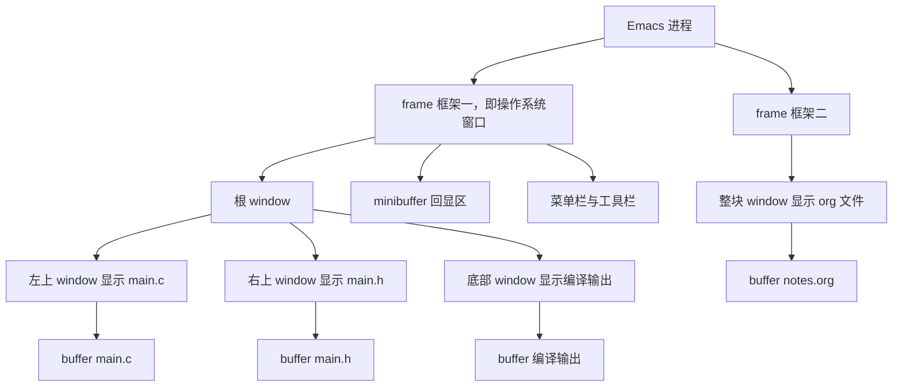
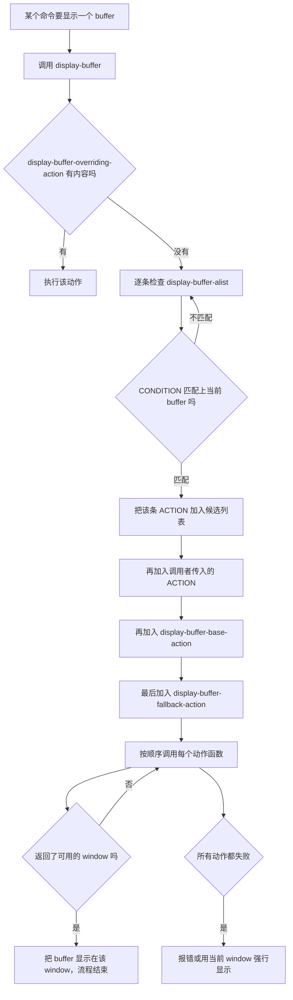

# 界面布局与功能位置

> 大多数人配置界面的方式是"缺什么补什么"，结果三个月后每个包都把窗口开在随机位置。本篇从 frame/window/buffer 三层模型讲起，把"某个功能出现在屏幕什么位置"这件事变成一条可以写进配置、可以复现的规则。

---

## 一、frame、window、buffer：三层模型

Emacs 的三个核心名词与日常理解完全错位，这是初学者最容易栽跟头的地方。先把它们钉死，后面所有内容才有意义。

### 1.1 三个词的准确含义

| 词 | 中文建议译法 | 准确含义 |
|----|--------------|----------|
| frame | 框架 | **操作系统意义上的窗口**。有标题栏、可以被窗口管理器移动、可以最小化，对应 `make-frame` 创建的东西 |
| window | 窗口 | **框架内部的视图区**。它是 Emacs 自己划分的子矩形，不是操作系统窗口；`C-x 2` 分出来的两个东西各是一个 window |
| buffer | 缓冲区 | 正在编辑的文本内容。它不显示在任何地方，直到某个 window 显示它 |

一个 buffer 可以同时显示在多个 window 里（改一处，所有 window 同步更新）；一个 window 在任一时刻只显示一个 buffer；window 必须属于某个 frame。用一句话概括：**frame 是容器，window 是格子，buffer 是内容。**

### 1.2 嵌套关系



从这张图可以读出四条规则：

1. **frame 是最外层**，`C-x 5 2`（`make-frame-command`）创建新 frame；`C-x 5 0` 关闭当前 frame。
2. **window 组成一棵树**。分割一个 window 就是把它的位置换成一个内部节点，两个子节点各占一半；删除 window 就是把两个子节点合并回去。
3. **minibuffer 是每个 frame 独占的一行**，它不是一个普通 window（`(window-list)` 默认不含它，需要 `(window-list nil t)` 才包含）。
4. **菜单栏、工具栏、tab-bar、tab-line 都是 frame 的装饰**，不属于任何 window 的文本区。

### 1.3 为什么必须先分清

三条现实影响：

- **`C-x 2`、`C-x 3` 分割的是"窗口内的格子"，不是"新开一个程序窗口"。** 想新开操作系统窗口要用 `C-x 5 2`。从 VS Code 或 Vim 过来的人第一周几乎都会在这里困惑。
- **"关掉一个窗口"有两种含义。** `C-x 0`（`delete-window`）只是把当前格子从布局里去掉，buffer 还在；`C-x k`（`kill-current-buffer`）才是真正把内容从内存里丢掉（未保存会问）。
- **布局是"window 树"的状态，不是 buffer 的状态。** 这也是为什么下一节的 `winner-mode` 能一键还原布局，而 buffer 内容不受影响。

### 1.4 两个衍生概念

- **tab（标签页）**：由 `tab-bar-mode` 提供，每个 tab 保存一套 window 配置。它不是"另一个 buffer"，而是"另一套布局"。见第六章。
- **side window（侧窗）**：一种特殊的 window，被固定在 frame 的某一侧（左、右、上、下），不会被 `C-x o` 遍历，也不会被 `C-x 1` 删掉（如果设置了对应参数）。它是"功能放到固定位置"的核心机制。见第三、四章。

---

## 二、窗口操作函数表

### 2.1 创建与删除

| 函数 | 键位 | 参数 | 说明 |
|------|------|------|------|
| `split-window-right` | `C-x 3` | `(&optional size window-to-split)` | 垂直分割（左右两个 window） |
| `split-window-below` | `C-x 2` | `(&optional size window-to-split)` | 水平分割（上下两个 window） |
| `split-window` | 无默认 | `(&optional window size side pixelwise refer)` | 底层函数，`side` 可指定在父窗口的哪一侧分割 |
| `delete-window` | `C-x 0` | `(&optional window)` | 删除一个 window，buffer 保留 |
| `delete-other-windows` | `C-x 1` | `(&optional window interactive)` | 只保留一个 window |
| `delete-windows-on` | 无默认 | `(&optional buffer-or-name frame)` | 关闭所有显示某 buffer 的 window |
| `make-frame-command` | `C-x 5 2` | 无 | 新开一个 frame（操作系统窗口） |

参数里的 `size` 是"新 window 占多少行/列"，可以是整数也可以是小数（例如 `0.3` 表示占 30%）。

### 2.2 大小调整

| 函数 | 键位 | 说明 |
|------|------|------|
| `balance-windows` | `C-x +` | 把当前 frame 里所有 window 调成大小相等 |
| `enlarge-window` | `C-x ^` | 变高，参数 `(delta &optional horizontal)`；`horizontal` 非 nil 时变宽 |
| `shrink-window` | 无默认键 | 变矮，与 `enlarge-window` 对称；负参数等于变高 |
| `enlarge-window-horizontally` | `C-x }` | 变宽 |
| `shrink-window-horizontally` | `C-x {` | 变窄 |
| `window-resize` | 无默认 | `(window delta &optional horizontal ignore pixelwise)`，底层接口，可指定目标 window |
| `fit-window-to-buffer` | 无默认 | `(&optional window max-height min-height max-width min-width preserve-size)`，让 window 恰好装下内容 |
| `shrink-window-if-larger-than-buffer` | `C-x -` | 内容比 window 短时把 window 缩短 |

注意 `C-x -` 绑的是 `shrink-window-if-larger-than-buffer`，不是 `shrink-window`。想手动缩小窗口就用 `M-x shrink-window`，或者写进自己的键位表。

### 2.3 移动与选择

| 函数 | 键位 | 说明 |
|------|------|------|
| `other-window` | `C-x o` | 按顺序切到下一个 window；`(other-window -1)` 反向 |
| `windmove-left` / `right` / `up` / `down` | 需自行绑定 | 按方向跳转，比 `C-x o` 更符合直觉 |
| `switch-to-buffer-other-window` | `C-x 4 b` | 在另一个 window 里切换到指定 buffer |
| `find-file-other-window` | `C-x 4 f` | 在另一个 window 里打开文件 |
| `display-buffer` | 无默认 | 让一个 buffer 出现在"合适的地方"，见第三章 |
| `pop-to-buffer` | 无默认 | 显示并选中，常用于包内部 |

### 2.4 一次性配置方向键跳转：windmove

`windmove` 是内置功能，提供四个方向的 window 跳转，以及四个"默认键位"开关函数：

```elisp
;; 用 Shift+方向键在 window 之间跳转（最常用）
(when (fboundp 'windmove-default-keybindings)
  (windmove-default-keybindings))

;; 其他三个开关，按需启用（都不启用也完全没问题）
;; (windmove-display-default-keybindings)   ; 按方向键在指定方向的 window 里显示 buffer
;; (windmove-delete-default-keybindings)    ; 按方向键删除那个方向的 window
;; (windmove-swap-states-default-keybindings) ; 按方向键交换两个 window 的位置
```

这四个函数都有可选的 `modifier` 参数（例如 `(windmove-default-keybindings 'control)` 会绑到 `C-<left>` 一类键位上）。它们的共同前提是**方向键在你的终端里能被识别**——SSH 场景下多数没问题，但极简终端可能收不到。

想更精确地控制键位，可以直接绑命令：

```elisp
;; 用 C-c w 分区下的 h/j/k/l 做方向跳转（与第三章的 leader 设计一致）
(keymap-set global-map "C-c w h" #'windmove-left)
(keymap-set global-map "C-c w j" #'windmove-down)
(keymap-set global-map "C-c w k" #'windmove-up)
(keymap-set global-map "C-c w l" #'windmove-right)
```

---

## 三、display-buffer：功能位置的总开关

**这是本篇最重要的一节。** 如果你只想学一个概念来控制"某个功能出现在哪里"，那就是 `display-buffer-alist`。

### 3.1 display-buffer 做了什么

当某个命令想让一个 buffer 出现在屏幕上（编译输出、帮助、补全候选、终端、grep 结果），它几乎都会调用 `display-buffer`。这个函数自己不做任何布局决定，它只是：

1. 收集若干条**候选动作（action）**，按优先级排序；
2. 依次调用每一条 action 里的**动作函数**，第一个成功返回 window 的就算数；
3. 都失败了，就退回默认行为。

于是"功能出现在哪"这个问题被拆成了两件事：**匹配哪个 buffer** 和 **用哪个动作函数、带哪些参数**。

### 3.2 五级候选动作的优先级

| 优先级 | 变量或参数 | 用途 |
|--------|-----------|------|
| 1（最高） | `display-buffer-overriding-action` | 由 Lisp 程序临时绑定，配置里不该永久设置 |
| 2 | `display-buffer-alist` | **用户配置的主战场**，按条件匹配 buffer |
| 3 | 调用者传入的 ACTION 参数 | 由包自己决定，用户改不了 |
| 4 | `display-buffer-base-action` | 用户设置的"兜底默认" |
| 5（最低） | `display-buffer-fallback-action` | Emacs 内置的最终兜底 |

`display-buffer-alist` 的位置很关键：它在**调用者传入的 ACTION 之前**生效。这意味着只要你的规则匹配上了，无论包的作者原本想让 buffer 出现在哪，都会被你的规则改写。这也是排查"某个包不听话"时首先要看的地方。

### 3.3 display-buffer-alist 的完整语法

它的值是若干条 `(CONDITION . ACTION)` 组成的列表：

```elisp
(setq display-buffer-alist
      `((CONDITION1 ACTION1)
        (CONDITION2 ACTION2)))
```

**CONDITION** 会被交给 `buffer-match-p` 判断，它可以是：

| 写法 | 含义 | 例子 |
|------|------|------|
| 正则字符串 | 匹配 buffer 名（子串匹配） | `"\\*compilation\\*"` |
| 函数 | 接收 buffer 名（及额外参数），返回非 nil 表示匹配 | `(lambda (name _) (string-prefix-p "*grep" name))` |
| `(major-mode . MODE)` | buffer 的 major mode 正好是 MODE | `(major-mode . dired-mode)` |
| `(derived-mode . MODE)` | buffer 的 major mode 派生自 MODE（**优先用这个**） | `(derived-mode . prog-mode)` |
| `(category . SYMBOL)` | 调用 `display-buffer` 时传入了同名 `category` | `(category . comint)` |
| `(this-command . CMD)` | 当前正在执行的命令是它 | `(this-command . magit-status)` |
| `(not COND)` | 取反 | `(not (derived-mode . prog-mode))` |
| `(and COND...)` | 全部满足 | `(and (derived-mode . prog-mode) "\\*xref\\*")` |
| `(or COND...)` | 满足任一 | `(or "\\*Help\\*" "\\*Apropos\\*")` |
| `t` | 无条件匹配（**慎用**，会拦下所有 buffer） | `t` |

**ACTION** 的形状是 `(FUNCTIONS . ALIST)`：前半部分是动作函数（一个符号或一个符号列表），后半部分是"动作参数表"。写成列表字面量时就是：

```elisp
'(CONDITION 动作函数 (参数 . 值) (参数 . 值) ...)
```

例如 `'("\\*Help\\*" display-buffer-in-side-window (side . right))`，其中 `display-buffer-in-side-window` 是动作函数，`(side . right)` 是参数表的一项。

### 3.4 常用动作函数

| 动作函数 | 作用 | 关键参数 |
|----------|------|----------|
| `display-buffer-same-window` | 直接用当前 window 显示（会替换掉你现在看的内容） | 无 |
| `display-buffer-reuse-window` | 复用已经显示该 buffer 的 window | `inhibit-same-window`、`reusable-frames` |
| `display-buffer-pop-up-window` | 在 frame 内分割出新 window | `window-height`、`window-width` |
| `display-buffer-below-selected` | 在当前 window 下方显示 | `window-min-height` 必须与 `window-height` 配合 |
| `display-buffer-at-bottom` | 在 frame 最底部显示（会复用底部已有 window） | `window-height`、`preserve-size` |
| `display-buffer-in-side-window` | 放进 frame 某一侧的 side window | `side`、`slot`、`window-width`、`preserve-size` |
| `display-buffer-in-direction` | 在参考 window 的指定方向显示 | `direction`、`window` |
| `display-buffer-use-some-window` | 用某个现成的、非专用的 window | `some-window`（`nil`/`lru`/`mru`） |
| `display-buffer-use-least-recent-window` | 用最久没被用过的 window | `bump-use-time` |
| `display-buffer-in-previous-window` | 用之前显示过该 buffer 的 window | `previous-window` |
| `display-buffer-reuse-mode-window` | 复用某个"同 major mode"的 window | `mode` |
| `display-buffer-pop-up-frame` | 新开一个 frame | `pop-up-frame-parameters` |
| `display-buffer-in-child-frame` | 在当前 frame 之上开一个子框架（悬浮窗） | `parent-frame`、`child-frame-parameters` |
| `display-buffer-no-window` | 不显示（需要 `allow-no-window` 配合） | `allow-no-window` |

多个动作函数可以连用，写成列表，前面的失败就用后面的：

```elisp
;; 先找已有的同模式窗口，找不到就在底部新开
'("\\*xref\\*" (display-buffer-reuse-mode-window display-buffer-at-bottom)
  (mode . xref--xref-buffer-mode))
```

### 3.5 动作参数表（ALIST）常用项

| 参数 | 取值 | 作用 |
|------|------|------|
| `side` | `left` / `right` / `top` / `bottom` | side window 放在哪一侧，默认 `bottom` |
| `slot` | 整数 | 同一侧的槽位：0 是中间，负数往左/往上，正数往右/往下 |
| `direction` | `left` `right` `above`/`up` `below`/`down`，以及 `leftmost` `top` `rightmost` `bottom` | 配合 `display-buffer-in-direction` 使用 |
| `window` | window 对象、`main`、`root` | 方向显示的参考 window |
| `window-height` | nil / 整数 / 小数 / `(body-lines . n)` / 函数（如 `fit-window-to-buffer`） | 调高度；小数表示占根 window 的比例 |
| `window-width` | 同上（宽度版本），`body-columns` | 调宽度 |
| `window-min-height` | 整数 / `full-height` | 保证的最小高度，**必须同时给 `window-height` 才会真正改变尺寸** |
| `window-min-width` | 整数 / `full-width` | 保证的最小宽度 |
| `preserve-size` | `(t . nil)` 保宽 / `(nil . t)` 保高 / `(t . t)` 都保 | 之后调整 frame 大小时不让它被挤变形 |
| `dedicated` | 非 nil | 把新建的 window 标记为专用，别的 buffer 不会占用它 |
| `window-parameters` | alist | 给 window 装参数，最常用 `no-other-window` 与 `no-delete-other-windows` |
| `inhibit-same-window` | 非 nil | 禁止用当前 window 显示 |
| `reusable-frames` | `nil` / `visible` / `0` / `t` | 跨 frame 复用的范围 |
| `pop-up-frame-parameters` | alist | 新建 frame 时的 frame 参数 |
| `parent-frame` | frame | 子框架的父框架 |
| `child-frame-parameters` | alist | 子框架的参数 |
| `allow-no-window` | 非 nil | 允许"不显示"，只有 `display-buffer-no-window` 关心它 |
| `bump-use-time` | 非 nil | 显示后更新 window 的使用时间，影响后续 LRU 选择 |

有两条经验性的坑：

- `window-height` 与 `window-min-height` 是两件事：前者"调整到这么高"，后者"至少要这么高"。只写后者，窗口不会被调大。
- `preserve-size` 只在 side window 或底部 window 上有明显效果，对普通分割窗口意义有限。

### 3.6 决策流程



### 3.7 五个可以直接复制的配方

下面五段可以整块放进 `init.el`，改完之后 `M-x eval-buffer` 生效。它们覆盖了日常最常需要固定的五个位置。

**配方一：编译输出固定底部**

```elisp
;; 编译输出固定在 frame 底部 25% 高度，并保持高度不被挤扁
(add-to-list 'display-buffer-alist
             '("\\*compilation\\*"
               display-buffer-at-bottom
               (window-height . 0.25)
               (preserve-size . (nil . t))))
```

用 `display-buffer-at-bottom` 而不是 `display-buffer-below-selected` 的原因：前者总是贴在 frame 最底部，无论你当前在哪个 window；后者贴着"当前 window 的下方"，当你有多个 window 时位置会跳来跳去。

**配方二：帮助缓冲区固定右侧**

```elisp
;; 帮助固定在右侧 33% 宽度，保留宽度；用 q 关闭时不破坏其他布局
(add-to-list 'display-buffer-alist
             '("\\*Help\\*"
               display-buffer-in-side-window
               (side . right)
               (slot . 0)
               (window-width . 0.33)
               (preserve-size . (t . nil))
               (window-parameters . ((no-other-window . t)))))
```

`no-other-window` 的作用是让 `C-x o` 跳过这个 window，这样你在主编辑区之间跳转时不会误入帮助窗口。如果你还希望 `C-x 1` 不要删掉它，再加上 `(no-delete-other-windows . t)`。

**配方三：补全候选固定底部**

```elisp
;; *Completions* 固定底部，占 20% 高度
(add-to-list 'display-buffer-alist
             '("\\*Completions\\*"
               display-buffer-at-bottom
               (window-height . 0.2)))
```

需要说明的是：**corfu 与 company 的补全弹窗不走 `display-buffer`**，它们用 overlay（company 默认）或子框架（corfu 默认）实现，因此不受这条规则影响。这条规则管的是 `*Completions*`（`M-x` 或 `TAB` 补全时可能弹出的候选列表缓冲区）。弹窗类的位置控制见 5.5 节的 posframe。

**配方四：终端固定底部且不被复用**

```elisp
;; 终端固定在底部 30%，标记为专用窗口，并且 C-x o 跳过它
(add-to-list 'display-buffer-alist
             '("\\*vterm\\*"
               display-buffer-at-bottom
               (window-height . 0.3)
               (dedicated . t)
               (window-parameters . ((no-other-window . t)))))
```

`dedicated . t` 让这个 window 不会被 `display-buffer` 拿去显示别的 buffer，终端就一直待在原地。代价是你也不能再往这个 window 里 `C-x b` 切别的 buffer（会另开一个 window），这正是"专用"的含义。

**配方五：dired 侧边栏**

dired 缓冲区没有固定名字（名字就是目录名），所以不能靠正则匹配。手册推荐的做法是写一个函数，直接调用动作函数：

```elisp
(defun my-dired-sidebar ()
  "在左侧 side window 里显示当前目录的 dired。"
  (interactive)
  (let ((buffer (dired-noselect default-directory)))
    (with-current-buffer buffer
      ;; 隐藏详细信息，侧边栏更紧凑（dired-hide-details-mode 是内置的）
      (dired-hide-details-mode 1))
    (display-buffer-in-side-window
     buffer '((side . left) (slot . 0)
              (window-width . 0.25)
              (preserve-size . (t . nil))
              (window-parameters . ((no-other-window . t)
                                    (no-delete-other-windows . t)))))))

(keymap-set global-map "C-c v d" #'my-dired-sidebar)
```

补一条横向尺寸相关的设置，否则 `window-width` 用小数时可能因为取整而不生效：

```elisp
(setq fit-window-to-buffer-horizontally t)  ; 允许横向按内容调整
(setq window-resize-pixelwise t)            ; 按像素而非整字符调整，减少舍入误差
```

### 3.8 调试 display-buffer 的方法

规则不生效时，按这个顺序查：

1. **确认你的规则真的匹配了。** 在目标 buffer 里执行
   `M-: (buffer-match-p "\\*compilation\\*" (current-buffer)) RET`，
   返回非 nil 才说明条件写对了。注意正则里的 `*` 必须转义成 `\\*`（写在 Elisp 字符串里是两个反斜杠）。
2. **确认 `display-buffer-alist` 的值里确实有这条。** `M-: display-buffer-alist RET` 打印当前值；用 `add-to-list` 时如果前面已有同条件条目，`add-to-list` 不会重复添加，旧的仍然生效。**改规则前先清掉旧条目**（`(setq display-buffer-alist nil)` 再重新 `add-to-list`）。
3. **确认没有更高优先级的动作。** 如果某个包自己传了 ACTION，且你的条件没匹配上，它就会生效。检查方法是在 `display-buffer` 上挂 advice 打印它的参数（见 [[emacs教程/2Elisp语言/11_调试与性能剖析|调试与性能剖析]]）。
4. **确认动作函数真的成功了。** `display-buffer-in-side-window` 在 frame 太窄、`window-sides-slots` 限制已满时会失败并返回 nil，于是退到后面的动作。把 `window-sides-slots` 调大是一个常见解法。

---

## 四、side window 与专用窗口

### 4.1 side window 的规则

side window 是"固定位置"最趁手的工具，它的特性与限制都很明确：

| 特性 | 说明 |
|------|------|
| 位置固定 | 由 `side` 与 `slot` 决定，一旦建立就不参与普通的分割/合并 |
| 默认专用 | 由 `display-buffer-in-side-window` 建立的 window 默认被标记为 `side` 专用（受 `display-buffer-mark-dedicated` 影响） |
| 按方向调整大小 | `enlarge-window`/`shrink-window` 可以改它；横向调整需要 `fit-window-to-buffer-horizontally` 非 nil |
| 不受 `C-x 1` 影响 | 默认情况：`delete-other-windows` 不删除 side window。想要能删掉就要求 `no-delete-other-windows` 为 nil |
| 槽位有限 | 每一侧最多放几个由 `window-sides-slots` 决定，它是一个四元素列表，依次是左、上、右、下 |
| 一键开关 | `M-x window-toggle-side-windows` 可以把所有 side window 收起或恢复（Emacs 31 起它还默认绑在 `C-x w s` 上） |

```elisp
;; 了解当前 frame 的槽位限制（默认值通常是每侧 1 个）
(setq window-sides-slots '(2 1 2 1))   ; 左 2、上 1、右 2、下 1
```

如果把 `side` 全设成 `bottom` 并把 `window-sides-vertical` 设为非 nil，底部 side window 会变成纵向排列；这是构建"底部多面板"工作流的技巧。

### 4.2 专用窗口（dedicated window）

专用窗口解决的是"这个格子只准显示这一个 buffer"。两个函数：

```elisp
;; 把当前 window 标记为专用：display-buffer 不会再拿它显示别的 buffer
(set-window-dedicated-p (selected-window) t)

;; 查询是否专用（返回上次设置的值）
(window-dedicated-p (selected-window))    ; => t
```

关键细节（来自 `set-window-dedicated-p` 的文档）：

- **FLAG 为 `t` 表示"强专用"**。强专用窗口连 `set-window-buffer` 都会拒绝换 buffer，是真正意义上的锁定。
- **FLAG 为非 nil 的其他值（例如 side window 用的 `side`）是"弱专用"**：`display-buffer` 不会主动占用它，但别的代码仍然可以通过 `set-window-buffer` 换掉内容。
- **专用不等于不可删**。`delete-windows-on`、`quit-window`、`kill-buffer` 都可能把专用窗口（连同它的 frame）删掉。想禁止 `C-x 1` 删除它，要额外装 `no-delete-other-windows` 参数。
- **`window-dedicated-p` 返回的是"上次设置的值"**，没有被显式设置过就返回 nil。所以它适合用来判断"我有没有锁过"，不适合用来推断"这个窗口能不能被复用"。

一个实用的小命令（绑定到 `C-c v D`，随手锁定/解锁窗口）：

```elisp
(defun my-toggle-window-dedicated ()
  "切换当前窗口的专用状态。"
  (interactive)
  (let ((window (selected-window)))
    (if (window-dedicated-p window)
        (progn (set-window-dedicated-p window nil)
               (message "窗口已解除专用"))
      (set-window-dedicated-p window t)
      (message "窗口已设为专用：%s" (buffer-name (window-buffer window))))))

(keymap-set global-map "C-c v D" #'my-toggle-window-dedicated)
```

---

## 五、"功能放到固定位置"完整清单

下面按屏幕位置逐个说明。每一项给出**成熟包方案**与**内置方案**，以及选择的依据。

### 5.1 左侧：文件树

| 方案 | 包名 | 定位与取舍 |
|------|------|------------|
| 内置 dired | 无 | 功能最全（重命名、复制、批量操作），但没有"树"的折叠视图；用 `C-x d` 打开，配合 `dired-hide-details-mode` 很紧凑 |
| dired 侧边栏 | 自己写 | 用 3.7 配方五，约十行得到"左侧固定目录视图"，零依赖 |
| treemacs | `treemacs`（MELPA） | 真正的树形侧边栏，支持多项目工作区、图标、跟随当前文件；体量较大 |
| neotree | `neotree`（MELPA） | 轻量树形侧边栏，配置简单；活跃度不如 treemacs |
| dired-sidebar | `dired-sidebar`（MELPA） | 用 dired 当侧边栏，保留 dired 的全部能力，外观是侧栏；适合"不想学新工具"的人 |
| dirvish | `dirvish`（MELPA） | 不是单纯侧边栏，而是把 dired 整体增强（预览、侧栏、属性面板），风格现代；需要适应它的约定 |

选择建议：

- **只想要"能看目录、能打开文件"**：用 3.7 配方五的手写 dired 侧栏，够用且没有依赖。
- **需要多项目切换、跟随当前文件高亮**：用 `treemacs`。
- **喜欢 dired 的按键但想要侧栏外观**：用 `dired-sidebar`。
- **想要"文件管理器级别的体验"（预览、批量操作面板）**：用 `dirvish`。

三个都装没有意义：它们都占左侧同一块位置，而且键位会互相干扰。

### 5.2 右侧：文档与帮助

右侧适合放"读"的内容：帮助缓冲区、xref 定义、文档查看、某些补全详情。配方二给出帮助的规则；把同类 buffer 一起收进去更省事：

```elisp
;; 帮助、apropos、xref 的结果统一放右侧
(add-to-list 'display-buffer-alist
             '("\\*\\(?:Help\\|Apropos\\|xref\\|info\\)\\*"
               display-buffer-in-side-window
               (side . right)
               (slot . 0)
               (window-width . 0.35)
               (preserve-size . (t . nil))
               (window-parameters . ((no-other-window . t)
                                     (no-delete-other-windows . t)))))
```

`C-h f`、`C-h v` 之后帮助会出现在右侧而不是把你正在看的代码挤走，读完按 `q` 关闭。这一条对"边读代码边查文档"的场景收益最大。

### 5.3 底部：编译、终端与搜索输出

底部适合放"过程性输出"：编译日志、测试结果、终端、grep 结果、`*Messages*`。

```elisp
;; 底部区域：编译、终端、grep、消息统一放底部
(add-to-list 'display-buffer-alist
             '("\\*\\(?:compilation\\|grep\\|vterm\\|shell\\|Messages\\)\\*"
               display-buffer-at-bottom
               (window-height . 0.3)
               (preserve-size . (nil . t))))

;; *Messages* 想用更强的约束（日志窗口不希望被别的 buffer 占用）
(add-to-list 'display-buffer-alist
             '("\\*Messages\\*"
               display-buffer-at-bottom
               (window-height . 0.2)
               (dedicated . t)))
```

终端的选择见 [[emacs教程/5开发环境集成/06_终端Shell与远程开发|终端 Shell 与远程开发]]，这里只给定位建议：

| 方案 | 包名 | 定位 |
|------|------|------|
| vterm | `vterm`（MELPA，需编译原生模块） | 性能最好，支持全屏 TUI 程序；Linux/macOS 首选 |
| eat | `eat`（项目地址 <https://codeberg.org/akib/emacs-eat>） | 纯 Elisp，无编译依赖，跨平台一致；Windows 上更省心 |
| shell-pop | `shell-pop`（MELPA） | 用指定终端在底部快速弹出/隐藏，本质是个开关函数 |
| ansi-term | 内置 | 零依赖，但对 TUI 程序兼容性一般 |

`shell-pop` 的思路值得单独说：它不改变 `display-buffer` 规则，而是提供一个"切换底部终端窗口"的命令，用同一个键在"显示/隐藏"之间来回。如果你只想要"一个随时能唤出的底部终端"，它比写 `display-buffer-alist` 更直接。

### 5.4 顶部：tab-bar

顶部一行用于 tab-bar（工作区）是最省空间的做法，因为它只占一行且默认在 frame 顶部。配置与用法见第六章。

### 5.5 悬浮弹窗：posframe 与补全

有些内容需要"浮在文字上面"而不是挤占布局：补全文档、快速跳转提示、定义预览。这类需求用**子框架（child frame）**实现，`posframe` 是这一领域最常用的库（MELPA 上的 `posframe`）。

```elisp
;; posframe：在指定位置显示一个悬浮的 child frame
(use-package posframe
  :ensure t)

(defun my-show-buffer-at-point (buffer)
  "在光标处显示 BUFFER 的悬浮窗。"
  (interactive "b缓冲区：")
  (posframe-show buffer
                 :position (point)
                 :min-width 40
                 :min-height 10
                 :internal-border-width 1
                 :timeout 5))          ; 5 秒后自动消失
```

与补全框架的配合关系要说清楚：

| 框架 | 弹窗实现 | 是否需要 posframe |
|------|----------|-------------------|
| `corfu` | 默认使用 child frame 显示候选 | 不需要；corfu 自带 child frame 支持，也可以改成 overlay |
| `company` | 默认使用 overlay 显示候选 | 不需要 |
| 文档页（corfu 的 `corfu-popupinfo`、company 的 `company-quickhelp` 一类） | 视实现而定 | 需要时由这些扩展自行调用 |

结论：**补全弹窗的位置不由 `display-buffer-alist` 控制**。想让补全信息悬浮显示，正确做法是开启对应扩展（例如 corfu 的 `corfu-popupinfo-mode`），而不是往 `display-buffer-alist` 里加规则。这一点是很多人配置失败的原因。

### 5.6 minibuffer 补全框架的位置

补全框架本身不改变"窗口布局"，但它改变了"候选列表出现在哪里"，因此属于界面位置设计的一部分。三套主流方案的定位：

| 方案 | 包名 | 定位 |
|------|------|------|
| vertico + consult + marginalia | `vertico`、`consult`、`marginalia`（均 MELPA） | 当前主流：候选显示在 minibuffer 正下方，纵向排列，与内置补全机制贴合 |
| ivy + counsel | `ivy`、`counsel`（均 MELPA） | 成熟稳定，`ivy-posframe` 可以把候选放到悬浮窗；生态仍活跃 |
| helm | `helm`（MELPA） | 功能全面但体量大、更新节奏慢；适合已经习惯它的人 |

`marginalia` 的作用是给候选列表加"注释列"（文件大小、变量当前值等），`consult` 提供一系列基于补全框架的高级命令（`consult-line`、`consult-ripgrep`、`consult-imenu`）。三者与 vertico 是互补关系，不是竞争关系。补全框架的完整配置见 [[emacs教程/5开发环境集成/01_补全与LSP|补全与 LSP]]。

### 5.7 位置清单速查

| 位置 | 放什么 | 首选机制 |
|------|--------|----------|
| 左侧 | 文件树、目录浏览 | side window（`side . left`） |
| 右侧 | 帮助、文档、xref | side window（`side . right`） |
| 底部 | 编译、终端、grep、消息 | `display-buffer-at-bottom` |
| 顶部 | tab-bar（工作区） | `tab-bar-mode` |
| 悬浮 | 补全信息、预览 | posframe / child frame |
| minibuffer | 候选列表 | 补全框架自身控制 |
| 中央 | 你要编辑的内容 | 永远留最大的一块 |

---

## 六、tab-bar 与 tab-line

### 6.1 tab-bar：把布局变成可切换的工作区

`tab-bar-mode` 是内置功能（Emacs 27 起）。它提供一行位于 frame 顶部的标签页，**每个标签页记住一套 window 配置**。注意它与 Vim/VS Code 的"标签页 = 打开的文件"不同：Emacs 的 tab 是"布局"，一个 tab 里可以有好几个 window，显示好几个 buffer。

```elisp
;; 打开 tab-bar（占 frame 顶部一行）
(tab-bar-mode 1)

;; 只显示一个标签页时也保留这一行（否则默认会隐藏）
(setq tab-bar-show 1)
```

默认键位（Emacs 30 的写法）：

| 键位 | 命令 | 作用 |
|------|------|------|
| `C-x t 2` | `tab-bar-new-tab` | 新建标签页（复制当前布局） |
| `C-x t 0` | `tab-bar-close-tab` | 关闭当前标签页 |
| `C-x t 1` | `tab-bar-close-other-tabs` | 关闭其他标签页 |
| `C-x t o` | `tab-bar-switch-to-next-tab` | 切换到下一个 |
| `C-x t RET` | `tab-bar-switch-to-tab` | 按名字切换（会提示输入标签名） |
| `C-x t <left>` / `C-x t <right>` | `tab-bar-history-back` / `tab-bar-history-forward` | 标签页的历史前进后退，需要先 `M-x tab-bar-history-mode` |

三个值得知道的函数：

```elisp
;; 按编号选择（编号从 1 开始，显示在标签上）
(tab-bar-select-tab 2)

;; 重命名当前标签页
(tab-bar-rename-tab "写作")

;; 移动当前标签页的位置（负数往左）
(tab-bar-move-tab -1)
```

需要注意的版本差异：**Emacs 31 给这些命令加了更短的新名字**（`tab-new`、`tab-close`、`tab-next`、`tab-switch`、`tab-duplicate`），键位不变，`tab-bar-*` 系列名字仍然可用。本节统一写 Emacs 30 的名字。

### 6.2 把 tab-bar 当工作区用

"工作区"的意思是：每个标签页对应一类工作，切换标签页等于切换整套布局。典型划分：

| 标签页名 | 布局内容 |
|----------|----------|
| 编码 | 左侧文件树 + 中间两个代码 window + 底部编译 |
| 调试 | 中间代码 + 底部终端 + 右侧调试变量 |
| 写作 | 全屏一个 Org/Markdown window（见第八章） |
| 笔记 | 左侧目录 + 右侧笔记 + 底部 agenda |

两个必备的配套设置：

```elisp
;; 1. 标签名用"当前 buffer 所属项目名 + buffer 名"，比默认的序号好认
(setq tab-bar-tab-name-function #'tab-bar-tab-name-truncated)

;; 2. 让 C-x t 2 新建标签页时保留当前布局（这是默认行为），
;;    想新建空标签页用 C-u C-x t 2
```

`tab-bar-tab-name-truncated` 是内置函数，按当前 window 的 buffer 名生成标签名并截断。想要"按项目名命名"，就写一个函数替换它（见 6.4）。

如果 `tab-bar-history-mode` 与 `winner-mode` 同时开启，注意它们**默认都占用 `C-c <left>` 与 `C-c <right>`**，会互相遮蔽。解决办法是给其中一个换键：

```elisp
;; winner-mode 保留默认的 C-c <left> / C-c <right>
(winner-mode 1)

;; tab-bar 的历史改用别的键，避免与 winner-mode 抢同一组键
;; 注意 keymap-unset 的第三个参数：为 nil 只是"设为未定义"（仍会遮蔽更低的键位图），
;; 传 t 才是真正把绑定移除，从而让 winner-mode 的 C-c <left> / <right> 生效。
(with-eval-after-load 'tab-bar
  (keymap-set tab-bar-history-mode-map "C-c <up>"   #'tab-bar-history-back)
  (keymap-set tab-bar-history-mode-map "C-c <down>" #'tab-bar-history-forward)
  (keymap-unset tab-bar-history-mode-map "C-c <left>" t)
  (keymap-unset tab-bar-history-mode-map "C-c <right>" t))
```

### 6.3 tab-line：在窗口顶部显示 buffer 列表

`tab-line-mode`（内置，Emacs 27 起）把一行"缓冲区标签"放在**每个 window 的顶部**，与 tab-bar 的区别是：

| 对比项 | tab-bar | tab-line |
|--------|---------|----------|
| 位置 | frame 顶部（全局一个） | 每个 window 顶部（可有多个） |
| 单位 | 一套 window 布局 | 一个窗口里的 buffer 列表 |
| 类比 | 工作区 | 编辑器标签页 |

```elisp
;; 在每个 window 顶部显示该 window 的 buffer 列表
(global-tab-line-mode 1)

;; 显示"该窗口最近显示过的 buffer"（默认行为，最像编辑器标签页）
(setq tab-line-tabs-function #'tab-line-tabs-window-buffers)

;; 或者显示"所有 buffer"，并按项目/模式分组
;; (setq tab-line-tabs-function #'tab-line-tabs-buffer-groups)
```

`tab-line-tabs-function` 的可选值是内置函数，常用的三个：`tab-line-tabs-window-buffers`（本窗口历史）、`tab-line-tabs-buffer-list`（按 `buffer-list` 顺序显示所有 buffer）、`tab-line-tabs-buffer-groups`（按分组显示）。切换标签用 `tab-line-switch-to-next-tab` / `tab-line-switch-to-prev-tab`，关闭用 `tab-line-close-tab`。

一条实践建议：**tab-bar 与 tab-line 同时开会让界面顶部有两行标签，除非你清楚各自的用途，否则只开一个。**

### 6.4 与项目结合的自定义函数

下面两个函数把 tab-bar 与内置的 `project` 结合起来：一个按项目名给标签命名，一个为当前项目开新标签。

```elisp
;;; ---------- 1. 标签名 = 项目名 / buffer 名 ----------

(defun my-tab-bar-tab-name ()
  "返回当前标签页的名字：项目名加当前 buffer 名。"
  (let* ((buffer (window-buffer (frame-first-window)))
         (name (buffer-name buffer))
         (project (ignore-errors
                    (with-current-buffer buffer
                      (when-let* ((proj (project-current)))
                        (project-name proj))))))
    (if project
        (format "%s: %s" project name)
      (format "%s" name))))

(setq tab-bar-tab-name-function #'my-tab-bar-tab-name)

;;; ---------- 2. 为当前项目新建一个标签页 ----------

(defun my-tab-bar-new-tab-for-project ()
  "新建标签页，并把当前项目的主目录设为默认目录。"
  (interactive)
  (let ((default-directory
          (or (ignore-errors (project-root (project-current)))
              default-directory)))
    (tab-bar-new-tab)
    (message "已新建标签页，默认目录：%s" default-directory)))

;;; ---------- 3. 按项目名建标签并打开项目文件 ----------

(defun my-tab-bar-switch-to-project-tab (project)
  "切换到（必要时新建）名为 PROJECT 的标签页。"
  (interactive (list (project-prompt-project-dir)))
  (let ((existing (seq-find (lambda (tab)
                              (string= (alist-get 'name tab) project))
                            (funcall tab-bar-tabs-function))))
    (if existing
        (tab-bar-select-tab (1+ (seq-position (funcall tab-bar-tabs-function) existing)))
      (tab-bar-new-tab)
      (tab-bar-rename-tab project)
      (let ((default-directory project))
        (find-file (project-find-file))))))

(keymap-set global-map "C-c v n" #'my-tab-bar-new-tab-for-project)
(keymap-set global-map "C-c v N" #'my-tab-bar-switch-to-project-tab)
```

`project-current`、`project-root`、`project-name`、`project-prompt-project-dir` 都是内置 `project.el` 的函数（`project-name` 在 Emacs 29 起可用）。`tab-bar-tabs-function` 是内置变量，返回当前 frame 的标签列表，每个元素是一个 alist，`name` 键就是标签名。

---

## 七、布局的保存与恢复

界面设计的最后一块拼图是"下次打开还是这个样子"。Emacs 有四套机制，职责不同，不要混用。

| 机制 | 保存什么 | 恢复时机 | 键位 |
|------|----------|----------|------|
| `winner-mode` | 最近若干次 window 布局变化 | 手动撤销/重做 | `C-c <left>` / `C-c <right>` |
| `desktop-save-mode` | 打开的 buffer、文件、位置、布局 | 下次启动 | 无（自动） |
| `save-place-mode` | 每个文件上次的光标位置 | 打开文件时 | 无（自动） |
| 寄存器 | 一份 window 配置或 frame 集合 | 手动跳转 | `C-x r w` / `C-x r f` / `C-x r j` |

### 7.1 winner-mode：撤销布局变化

`winner-mode` 是内置的全局 minor mode，它记录 window 配置的历史。当你手滑按了 `C-x 1` 把布局弄没了，`C-c <left>` 就能还原。

```elisp
;; 打开 winner-mode；它自带键位 C-c <left> 与 C-c <right>
(winner-mode 1)

;; 想让某些 buffer 不参与记录（例如临时弹出的帮助窗口）
(setq winner-boring-buffers '("*Completions*" "*Help*" "*compilation*"))

;; 想改键位就自己绑（这两个命令就是它绑的原始命令）
(keymap-set global-map "C-c v u" #'winner-undo)
(keymap-set global-map "C-c v r" #'winner-redo)
```

三条使用经验：

- `winner-undo` 会一直往回退，多按几次可以退到很早的布局；`winner-redo` 是反向。
- 它能"撤销"的只是**布局**，不会撤销 buffer 内容的修改（那是 `undo` 的事）。
- 它与 `tab-bar-history-mode` 默认键位冲突，见 6.2 的处理。

### 7.2 desktop-save-mode 与 save-place-mode

`desktop-save-mode` 是"关掉 Emacs 再打开，一切照旧"的关键。它保存打开的 buffer 列表、每个文件的位置、以及（默认开启的）frame 与 window 配置。

```elisp
;; 保存桌面到配置目录下（Linux 与 macOS 通常是 ~/.emacs.d/，也可为 ~/.config/emacs/，
;; Windows 为 %APPDATA%\.emacs.d\；具体位置由 desktop-path 决定）
(require 'desktop)

(desktop-save-mode 1)                    ; 打开桌面保存
(setq desktop-auto-save-timeout 300)     ; 每 5 分钟自动保存一次桌面
(setq desktop-restore-eager 5)           ; 启动时先恢复 5 个 buffer，其余惰性恢复
(setq desktop-restore-frames t)          ; 同时保存并恢复 frame 与 window 配置（默认即开启）
```

`desktop-restore-frames` 默认是开启的（Android 上默认关闭，因为那里的窗口管理器不允许恢复 frame）。它恢复的是 frame 与 window 的**配置**，不保证像素级位置完全一致，因为窗口管理器可能拒绝。

配套的还有两个"记住细节"的模式：

```elisp
(save-place-mode 1)      ; 记住每个文件上次的光标位置（默认已开启）
(savehist-mode 1)        ; 记住 minibuffer 历史，包括 M-x 用过的命令
(recentf-mode 1)         ; 记录最近打开的文件，配合 recentf-open-files 使用
```

要留意的两点：

- 桌面文件默认写在 `desktop-dirname`（配置目录在 Linux 与 macOS 上通常是 `~/.emacs.d/`，也可以是 XDG 风格的 `~/.config/emacs/`；Windows 上是 `%APPDATA%\.emacs.d\`），它可能包含你正在编辑的文件路径。多机同步配置时要把它排除（见 [[emacs教程/3配置实践/06_多机同步与配置分发|多机同步与配置分发]]）。
- 如果某次启动后 Emacs 因为恢复桌面而卡住，用 `emacs -Q` 或 `emacs --no-desktop` 启动，把桌面文件删掉即可。

### 7.3 把窗口配置存进寄存器

寄存器（register）是最轻量的"布局书签"：把当前 window 配置存进一个字母，之后一键跳回。

| 键位 | 命令 | 说明 |
|------|------|------|
| `C-x r w 字母` | `window-configuration-to-register` | 保存**当前 frame 的 window 配置** |
| `C-x r f 字母` | `frameset-to-register` | 保存**所有 frame**（frameset） |
| `C-x r j 字母` | `jump-to-register` | 恢复该寄存器里的配置 |

```elisp
;; 用 Elisp 做同样的事
(window-configuration-to-register ?1)   ; 存到寄存器 1
(jump-to-register ?1)                   ; 恢复

;; frameset 版本：跨 frame 的完整布局
(frameset-to-register ?2)
(jump-to-register ?2)
```

区别：`window-configuration-to-register` 只覆盖当前 frame；`frameset-to-register` 会记住所有 frame 的位置与大小（需要 `frameset.el`，内置）。**多显示器场景选 frameset 版本。**

### 7.4 frameset：可保存到文件的布局

`frameset-save` 与 `frameset-restore` 可以把布局写进文件，适合"工作区预设"：

```elisp
;; 把当前所有 frame 的布局存进一个变量（或写文件）
(defvar my-work-layout nil
  "保存下来的工作布局。")

(defun my-save-work-layout ()
  "保存当前 frame 布局。"
  (interactive)
  (setq my-work-layout (frameset-save nil))
  (message "布局已保存"))

(defun my-restore-work-layout ()
  "恢复之前保存的布局。"
  (interactive)
  (if my-work-layout
      (frameset-restore my-work-layout)
    (message "还没有保存过布局")))
```

`frameset-save` 的第一个参数是要保存的 frame 列表，传 nil 表示所有 frame；`frameset-restore` 还支持 `:reuse-frames`、`:cleanup-frames` 等参数控制是否复用与清理现有 frame（具体取值用 `C-h f frameset-restore RET` 查看）。

---

## 八、专注写作模式

写长文档时，宽屏上的长行与两侧空白会显著降低可读性。两个成熟的方案都是通过"给正文加边距"实现的：

| 方案 | 包名 | 特点 |
|------|------|------|
| writeroom-mode | `writeroom-mode`（MELPA） | 全局或局部开启，可以同时隐藏 mode-line、tab-bar 等界面元素，更适合"只留正文" |
| olivetti | `olivetti`（MELPA） | 只做居中与边距，界面元素原样保留，更克制；支持多种 `olivetti-style` |

```elisp
;; 方案 A：writeroom-mode 极简写作
(use-package writeroom-mode
  :ensure t
  :bind ("C-c v w" . writeroom-mode)
  :config
  (setq writeroom-width 100)            ; 正文宽度（字符列数）
  (setq writeroom-mode-line t)          ; 保留 mode-line；设为 nil 则隐藏
  (setq writeroom-global-effects nil))  ; 不做全局界面改动（例如不隐藏 tab-bar）

;; 方案 B：olivetti 只做居中排版
(use-package olivetti
  :ensure t
  :bind ("C-c v o" . olivetti-mode)
  :config
  (setq olivetti-body-width 100)
  (setq olivetti-style 'fancy))         ; 给正文加背景色块，观感更接近写作软件
```

选择建议：

- **想要"进入写作状态就换一套界面"**（隐藏 mode-line、两侧留白）：writeroom-mode，它甚至可以在进入某个模式时自动开启。
- **只想让正文居中、其余照旧**：olivetti，副作用更小。
- **两者都别在全局开启**。它们作用于"当前 frame 的 window 树"，全局开启会影响你查看编译输出、终端时的布局。

配套一个小函数，把"写作"做成一个动作（同时全屏 + 居中 + 打开写作标签页）：

```elisp
(defun my-writing-mode-setup ()
  "进入写作状态：全屏、居中排版、隐藏干扰元素。"
  (interactive)
  (unless (display-graphic-p)
    (user-error "全屏切换只在图形界面下有意义"))
  (toggle-frame-fullscreen)
  (olivetti-mode 1)
  (setq olivetti-body-width 100))
```

---

## 九、多显示器与 DPI

Emacs 对多显示器的支持主要靠 frame 参数与两个查询函数：

```elisp
;; 列出所有显示器的几何信息（位置、分辨率、工作区）
(display-monitor-attributes-list)
;; => (((geometry 0 0 1920 1080) (workarea 0 0 1920 1040) (mm-size 509 286)
;;      (name . "eDP-1") (frames #<frame ...>) ...) ...)

;; 当前 frame 在哪块显示器上
(frame-monitor-attributes)

;; 用像素坐标把 frame 放到第二块屏（坐标为负值表示在左侧副屏）
(set-frame-position (selected-frame) 2000 100)
```

几条实践建议：

1. **不要在配置里写死 frame 的像素尺寸。** 换显示器、改缩放后一定不匹配。用 `(setq default-frame-alist '((width . 100) (height . 35)))` 这类"字符行列"单位，或干脆不设。
2. **按显示器区分字体大小**。同一台机器接了 4K 屏与 1080p 屏时，用 `(frame-monitor-attributes)` 判断当前 frame 所在显示器，再调 `face` 高度。字体设置的细节见 [[emacs教程/3配置实践/02_主题字体与美化|主题字体与美化]]。
3. **整数缩放导致的像素舍入问题**，用这两个变量缓解：

```elisp
(setq frame-resize-pixelwise t)    ; frame 尺寸按像素调整
(setq window-resize-pixelwise t)   ; window 尺寸按像素调整
```

4. **全屏与最大化是两回事**：`toggle-frame-fullscreen` 是真正的全屏（无边框），`toggle-frame-maximized` 是最大化（保留标题栏），后者更适合多显示器下的日常使用。
5. **Windows 上的 DPI 缩放**建议用系统缩放加 Emacs 自己的字体设置来配合，不要在两个地方同时放大，否则会出现"界面很大但文字模糊"或"文字正常但图标极小"。

---

## 十、鼠标与触摸板

### 10.1 mouse-autoselect-window 的坑

`mouse-autoselect-window` 让"鼠标移到哪个 window，就选中哪个 window"。听起来很美好，但直接设成 `t` 会遇到两个问题：

- **路过即选中。** 鼠标从屏幕左边移动到右边菜单或滚动条时，会一路选中经过的 window，导致你正在编辑的位置频繁变化。
- **与窗口管理器的焦点策略打架。** 跨 frame 的自动选中还要求窗口管理器支持"焦点跟随鼠标"，否则行为不一致。

它的文档写得很清楚：值为 `nil` 表示关闭；**正数**表示"鼠标停留这么多秒后才选中"；**负数**表示"鼠标停止移动后才选中"；其他非 nil 值表示立即选中。所以正确做法是给一个延迟：

```elisp
;; 推荐：停留 0.3 秒后才切换，避免路过即选中
(setq mouse-autoselect-window 0.3)

;; 跨 frame 使用还需配套（具体值要与你窗口管理器的策略一致）
(setq focus-follows-mouse t)
```

如果用了 `windmove` 或 `C-x o`，其实不需要这个选项；它真正的价值场景是"一只手在鼠标上翻看多个 window 的内容"。

### 10.2 中键与触摸板

| 行为 | 默认绑定 | 说明 |
|------|----------|------|
| 鼠标中键（`<mouse-2>`） | `mouse-yank-primary` | 粘贴 X11 的 primary selection（"选中即复制"的那一份），**粘贴位置在鼠标点击处** |
| 想让中键粘贴到光标处 | 设置 `mouse-yank-at-point` 为非 nil | 默认 nil 表示"粘到点击位置"，设成 t 则"粘到 point" |
| 滚轮 | 由 `mwheel` 处理 | 触摸板双指滚动与滚轮等价 |
| 平滑滚动 | `pixel-scroll-precision-mode`（Emacs 29 起内置） | 按像素滚动，触摸板体验明显改善 |

```elisp
;; 让中键粘贴到 point，而不是点击位置（避免手一抖粘错地方）
(setq mouse-yank-at-point t)

;; 触摸板友好的平滑滚动（Emacs 29 起）
(when (fboundp 'pixel-scroll-precision-mode)
  (pixel-scroll-precision-mode 1))
```

触摸板还有两个常见困扰：**双指滚动速度**由系统设置决定，Emacs 侧可用 `mouse-wheel-scroll-amount` 调整每次滚动的行数；**横向滚动**在多数终端与驱动下不发送事件，因此不要依赖它。

```elisp
;; 每次滚动 3 行，并且关闭"随滚动加速"的渐进效果
(setq mouse-wheel-scroll-amount '(3 ((shift) . 1)))
(setq mouse-wheel-progressive-speed nil)
```

---

## 十一、完整"我的界面布局"配置示例

下面这份配置把本篇内容整合成一个 `my-ui-layout.el` 模块，实现四件事：**Org 在右侧、编译在底部、文件树在左侧、tab-bar 作工作区**。它只依赖内置功能，可以整块复制运行。

```elisp
;;; my-ui-layout.el --- 界面布局与功能位置  -*- lexical-binding: t; -*-

;;; Commentary:
;; 本模块负责"某个功能出现在屏幕什么位置"：
;;   - 左侧：手写的 dired 侧边栏
;;   - 右侧：帮助与文档
;;   - 底部：编译输出与终端
;;   - 顶部：tab-bar 作为工作区
;; 所有位置规则都写成 display-buffer-alist 条目，便于集中调整与回退。

;;; Code:

;; ---------------------------------------------------------------
;; 0. 全局前提
;; ---------------------------------------------------------------

;; 按像素调整尺寸，避免宽度用小数时因取整而不生效
(setq fit-window-to-buffer-horizontally t)
(setq window-resize-pixelwise t)
(setq frame-resize-pixelwise t)

;; 每一侧允许的侧窗数量：左 2、上 1、右 2、下 1
(setq window-sides-slots '(2 1 2 1))

;; ---------------------------------------------------------------
;; 1. 位置规则集中定义
;; ---------------------------------------------------------------

;; 从空白开始，避免与之前的规则叠加导致"改了没反应"
(setq display-buffer-alist nil)

;; 1.1 左侧：手写 dired 侧边栏专用的 buffer 名
(add-to-list 'display-buffer-alist
             '("\\*dired-side\\*"
               display-buffer-in-side-window
               (side . left)
               (slot . 0)
               (window-width . 0.25)
               (preserve-size . (t . nil))
               (window-parameters . ((no-other-window . t)
                                     (no-delete-other-windows . t)))))

;; 1.2 右侧：帮助、apropos、info、xref
(add-to-list 'display-buffer-alist
             '("\\*\\(?:Help\\|Apropos\\|info\\|xref\\)\\*"
               display-buffer-in-side-window
               (side . right)
               (slot . 0)
               (window-width . 0.35)
               (preserve-size . (t . nil))
               (window-parameters . ((no-other-window . t)
                                     (no-delete-other-windows . t)))))

;; 1.3 底部：编译输出固定在 frame 底部 25%
(add-to-list 'display-buffer-alist
             '("\\*compilation\\*"
               display-buffer-at-bottom
               (window-height . 0.25)
               (preserve-size . (nil . t))))

;; 1.4 底部：终端固定在底部 30%，专用且不被 C-x o 遍历
(add-to-list 'display-buffer-alist
             '("\\*vterm\\*"
               display-buffer-at-bottom
               (window-height . 0.3)
               (dedicated . t)
               (window-parameters . ((no-other-window . t)))))

;; 1.5 底部：grep 与消息
(add-to-list 'display-buffer-alist
             '("\\*\\(?:grep\\|Messages\\)\\*"
               display-buffer-at-bottom
               (window-height . 0.2)
               (preserve-size . (nil . t))))

;; ---------------------------------------------------------------
;; 2. 左侧文件树：一个命令开关
;; ---------------------------------------------------------------

(defun my-dired-sidebar ()
  "在左侧 side window 里显示当前目录的 dired。"
  (interactive)
  (let ((buffer (dired-noselect default-directory)))
    (with-current-buffer buffer
      (unless (string= (buffer-name buffer) "*dired-side*")
        (rename-buffer "*dired-side*" t))
      (dired-hide-details-mode 1))
    (display-buffer buffer)))

(defun my-dired-sidebar-toggle ()
  "打开或收起左侧文件树。"
  (interactive)
  (let ((buffer (get-buffer "*dired-side*")))
    (if (and buffer (get-buffer-window buffer))
        (window-toggle-side-windows)
      (my-dired-sidebar))))

(keymap-set global-map "C-c v d" #'my-dired-sidebar)
(keymap-set global-map "C-c v D" #'my-dired-sidebar-toggle)

;; ---------------------------------------------------------------
;; 3. 底部终端：与已安装的终端包解耦
;; ---------------------------------------------------------------

(defun my-open-terminal ()
  "在底部打开终端：优先 vterm，其次 eat，最后退回 shell。"
  (interactive)
  (cond ((fboundp 'vterm) (vterm))
        ((fboundp 'eat)   (eat))
        (t                (shell))))

(keymap-set global-map "C-c v t" #'my-open-terminal)

;; ---------------------------------------------------------------
;; 4. 标签页即工作区
;; ---------------------------------------------------------------

(tab-bar-mode 1)
(setq tab-bar-show 1)                              ; 只有一个标签页时也显示
(setq tab-bar-tab-name-function #'tab-bar-tab-name-truncated)

;; 标签名优先显示项目名
(defun my-tab-bar-tab-name ()
  "标签名：项目名加当前 buffer 名。"
  (let* ((buffer (window-buffer (frame-first-window)))
         (name (buffer-name buffer))
         (project (ignore-errors
                    (with-current-buffer buffer
                      (when-let* ((proj (project-current)))
                        (project-name proj))))))
    (if project (format "%s: %s" project name) name)))

(setq tab-bar-tab-name-function #'my-tab-bar-tab-name)

;; 为当前项目新建标签页
(defun my-tab-bar-new-tab-for-project ()
  "新建标签页并把默认目录设为当前项目根目录。"
  (interactive)
  (let ((default-directory
          (or (ignore-errors (project-root (project-current)))
              default-directory)))
    (tab-bar-new-tab)
    (message "新标签页默认目录：%s" default-directory)))

(keymap-set global-map "C-c v n" #'my-tab-bar-new-tab-for-project)

;; ---------------------------------------------------------------
;; 5. 布局的保存与恢复
;; ---------------------------------------------------------------

(winner-mode 1)                     ; C-c <left> 撤销布局，C-c <right> 重做
(setq winner-boring-buffers '("*Completions*" "*Help*" "*compilation*"))

(require 'desktop)
(desktop-save-mode 1)
(setq desktop-auto-save-timeout 300)
(setq desktop-restore-eager 5)

;; 用寄存器一键保存/恢复布局：C-x r w 1 存，C-x r j 1 恢复
;; （这里给出等价命令，方便绑到自己的键位上）
(defun my-save-layout-to-register-1 ()
  "把当前 window 配置存入寄存器 1。"
  (interactive)
  (window-configuration-to-register ?1)
  (message "布局已存入寄存器 1"))

(defun my-restore-layout-from-register-1 ()
  "从寄存器 1 恢复 window 配置。"
  (interactive)
  (jump-to-register ?1))

(keymap-set global-map "C-c v s" #'my-save-layout-to-register-1)
(keymap-set global-map "C-c v S" #'my-restore-layout-from-register-1)

;; ---------------------------------------------------------------
;; 6. 鼠标与滚动
;; ---------------------------------------------------------------

(setq mouse-autoselect-window 0.3)      ; 停留 0.3 秒才自动切换窗口
(setq mouse-yank-at-point t)            ; 中键粘贴到 point
(setq mouse-wheel-scroll-amount '(3 ((shift) . 1)))
(setq mouse-wheel-progressive-speed nil)
(when (fboundp 'pixel-scroll-precision-mode)
  (pixel-scroll-precision-mode 1))      ; Emacs 29 起内置的平滑滚动

;; ---------------------------------------------------------------
;; 7. 自检
;; ---------------------------------------------------------------

(defun my-ui-layout-check ()
  "检查界面布局的关键设置是否生效。"
  (interactive)
  (message "位置规则 %d 条；tab-bar %s；winner %s；侧窗槽位 %S"
           (length display-buffer-alist)
           (if tab-bar-mode "已开启" "未开启")
           (if winner-mode "已开启" "未开启")
           window-sides-slots))

;;; my-ui-layout.el ends here
```

这份配置的键位都落在 `C-c v` 前缀下（`v` 表示 view），与键位章节的 leader 分区不冲突：`v d` 打开文件树、`v D` 收起、`v t` 终端、`v n` 新工作区、`v s` 存布局、`v S` 恢复布局。改完执行 `M-x my-ui-layout-check` 可以一眼确认三类设置都生效了。

---

## 小结

- `frame` 是操作系统窗口，`window` 是框架内的视图区，`buffer` 是内容。分割窗口分的是"格子"（`C-x 2`/`C-x 3`），新开窗口是 `C-x 5 2`；关格子用 `C-x 0`，关内容用 `C-x k`。
- "功能出现在哪"由 `display-buffer` 决定，而用户能掌控的入口是 `display-buffer-alist`：条件交给 `buffer-match-p`，动作写成 `(动作函数 . 参数表)`。它在调用者传入的 ACTION 之前生效，因此能改写包作者的默认行为。
- fixed 位置的三种手段：side window（左右上下固定，默认专用、不被 `C-x o` 遍历）、`display-buffer-at-bottom`（贴底）、tab-bar（顶部工作区）。每一次调整后都用 `preserve-size` 与 `window-parameters` 把位置钉牢。
- 布局的保存分四层：`winner-mode` 管撤销，`desktop-save-mode` 管跨启动恢复，寄存器与 frameset 管手动预设。多显示器场景用 frameset 版本，并且不要在配置里写死像素尺寸。

---

## 相关章节

- [[emacs教程/3配置实践/03_键位系统设计|键位系统设计]]：窗口操作与布局切换的键位设计
- [[emacs教程/3配置实践/05_自定义功能开发|自定义功能开发]]：把侧边栏、工作区这类操作封装成自己的命令
- [[emacs教程/3配置实践/06_多机同步与配置分发|多机同步与配置分发]]：桌面文件、路径与机器相关的布局差异处理
- [[emacs教程/1入门/03_配置文件从零开始|配置文件从零开始]]：把布局拆成模块文件的基本方法
- [[emacs教程/3配置实践/01_配置工程化|配置工程化]]：界面模块的加载顺序与错误隔离
- [[emacs教程/3配置实践/02_主题字体与美化|主题、字体与美化]]：字体、face 与多显示器下的字号调整
- [[emacs教程/1入门/05_从Vim迁移|从 Vim 迁移]]：window、tab 与 Vim 分割/标签的概念对照
- [[emacs教程/5开发环境集成/01_补全与LSP|补全与 LSP]]：vertico、corfu 等补全框架的完整配置
- [[emacs教程/5开发环境集成/06_终端Shell与远程开发|终端 Shell 与远程开发]]：vterm、eat、shell-pop 的对比与安装
- [[emacs教程/2Elisp语言/07_文本属性与Overlay|文本属性与 Overlay]]：理解 overlay 类补全弹窗与子框架的区别
- [[emacs教程/2Elisp语言/11_调试与性能剖析|调试与性能剖析]]：给 `display-buffer` 挂 advice 排查位置问题
- 官方文档：GNU Emacs 手册（窗口与框架部分）<https://www.gnu.org/software/emacs/manual/html_node/emacs/>；Elisp 参考手册（Buffer Display 与 Window 部分）<https://www.gnu.org/software/emacs/manual/html_node/elisp/>
- 环境与工具：System Crafters（Emacs 配置与工作流视频站点）<https://systemcrafters.net/>；Emacs 中文社区论坛 <https://emacs-china.org/>
- 相关包：treemacs 的 MELPA 页面 <https://melpa.org/#/treemacs>；dirvish <https://melpa.org/#/dirvish>；dired-sidebar <https://melpa.org/#/dired-sidebar>；posframe <https://melpa.org/#/posframe>；olivetti <https://melpa.org/#/olivetti>；writeroom-mode <https://melpa.org/#/writeroom-mode>；vterm <https://github.com/akermu/emacs-libvterm>；eat <https://codeberg.org/akib/emacs-eat>
