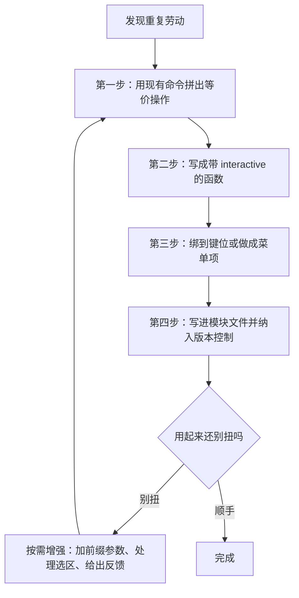
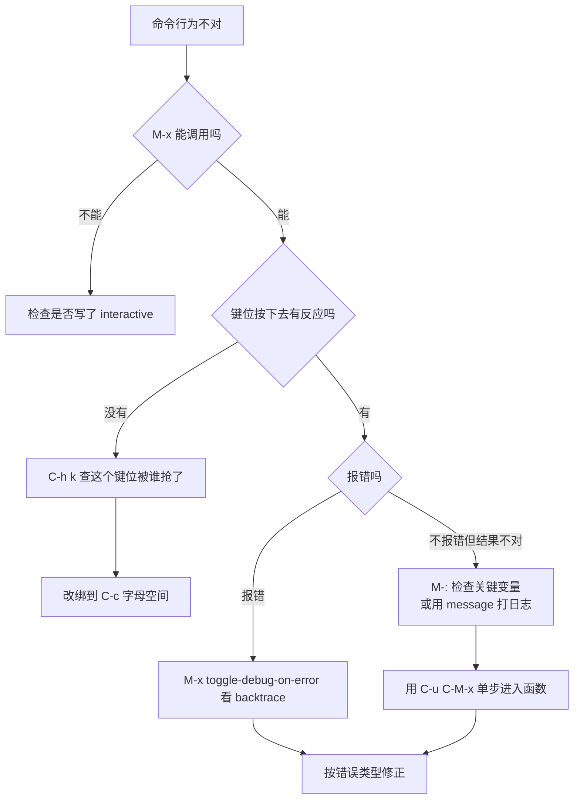

# 自定义功能开发

> Emacs 最被低估的能力是：**你每天重复做的那件小事，都可以变成一个按键。** 本篇给出从"发现重复劳动"到"写出可维护的模块"的完整方法，并附 20 个拿来就能用的实用函数。

---

## 一、方法论：从需求到命令的四步

写自定义功能不是从"我要学 Elisp"开始的，而是从"我又手动做了第三遍同一件事"开始的。



### 1.1 第一步：先用现有命令拼出等价操作

不要一上手就写 Elisp。先在 Emacs 里把这件事手动做一遍，把每一步操作对应的命令记下来。例如"给当前文件换个名字，同时缓冲区也跟着更新"，手动流程是：

```text
C-x C-w 新文件名 RET   -> write-file 另存为新文件
然后删掉旧文件          -> 这一步是多余的、容易忘的
```

于是你发现了问题所在：手动操作会留下旧文件。这就说明**这个功能值得写**。

### 1.2 第二步：交互命令的最小正确模板

任何能被 `M-x` 调用的命令都必须带 `interactive` 声明。下面是最小模板，包含了实战中必需的几个部分：

```elisp
(defun my-command-template (&optional arg)
  "一句话说明这个命令做什么（会成为 M-x 里的帮助信息）。

带前缀参数 ARG 时执行另一种行为。"
  (interactive "P")                 ; "P" 表示读取前缀参数（C-u）
  (let ((count 0))                  ; 用 let 声明局部变量
    (save-excursion                 ; 保存光标位置，执行完自动还原
      (goto-char (point-min))
      (while (re-search-forward "TODO" nil t)
        (setq count (1+ count))))
    (if (zerop count)
        (user-error "没有找到任何 TODO")   ; user-error 不会触发调试器
      (message "找到 %d 处 TODO" count))))  ; 给用户反馈
```

模板里的五个要素值得逐个记住：

| 要素 | 作用 | 省略的后果 |
|------|------|------------|
| 文档字符串 | `C-h f` 与 `M-x` 里显示的说明 | 半年后自己都看不懂 |
| `(interactive ...)` | 让函数成为可交互命令 | `M-x` 找不到它 |
| `save-excursion` | 保护光标与标记 | 执行完光标跳到别处 |
| `message` 反馈 | 告诉用户发生了什么 | 用户不确定命令是否生效 |
| `user-error` | 用错场景时给出清晰提示 | 用户收到难以理解的内部错误 |

### 1.3 处理选区的标准写法

大量命令需要"对选中区域操作"。判断有没有选区的正确方式是 `use-region-p`：

```elisp
(defun my-operate-on-region (beg end)
  "对选中区域做某事。没有选区时对整行操作。"
  (interactive
   (if (use-region-p)
       (list (region-beginning) (region-end))
     (list (line-beginning-position) (line-end-position))))
  ;; beg 与 end 就是操作范围
  (message "处理范围：%d 到 %d" beg end))
```

把参数读取写在 `interactive` 的列表形式里，比在函数体里判断更清晰，也让函数可以被其他 Elisp 代码直接调用（传入自己的 beg/end）。

### 1.4 第三步：暴露给用户的方式

一个命令可以同时通过多条通道暴露，没必要只选一种：

| 方式 | 写法 | 适合 |
|------|------|------|
| `M-x` 命令名 | 函数带 `interactive` 即可 | 低频、需要记住名字的操作 |
| 全局键位 | `(keymap-set global-map "C-c l" #'my-command)` | 高频、任何模式下都想用 |
| 模式键位 | `(keymap-set my-mode-map "C-c C-x" #'my-command)` | 只在该模式下有意义 |
| 菜单面板 | hydra 或 transient | 一组相关操作，不想记键位 |
| 自动触发 | 挂到 hook 上 | 不需要用户主动调用的处理 |

键位设计的完整方法见 [[emacs教程/3配置实践/03_键位系统设计|键位系统设计]]；这里只强调一条纪律：**`C-c` 加一个字母是留给用户的命名空间**，你自己的命令绑在这里不会与任何内置功能或第三方包冲突。

---

## 二、20 个实用自定义函数

下面每个函数都可以直接用。建议把它们收进一个 `my-utils.el` 模块（第八节给完整文件），而不是散落在 `init.el` 里。

### 2.1 配置与文件操作

```elisp
(defun my-open-init-file ()
  "打开用户的 init.el 配置文件。"
  (interactive)
  (find-file user-init-file))

(defun my-open-config-dir ()
  "在 Dired 中打开 Emacs 配置目录。"
  (interactive)
  (dired user-emacs-directory))

(defun my-open-current-directory ()
  "在 Dired 中打开当前缓冲区所在目录。"
  (interactive)
  (dired (or (and buffer-file-name (file-name-directory buffer-file-name))
             default-directory)))

(defun my-rename-current-file (new-name)
  "把当前文件重命名为 NEW-NAME，并让缓冲区指向新文件。"
  (interactive
   (progn
     (unless buffer-file-name (user-error "当前缓冲区未关联任何文件"))
     (list (read-file-name "重命名为："
                           (file-name-directory buffer-file-name)
                           nil nil
                           (file-name-nondirectory buffer-file-name)))))
  (let ((old-name buffer-file-name))
    (when (file-exists-p new-name)
      (user-error "目标文件已存在：%s" new-name))
    (rename-file old-name new-name)
    ;; 第二个参数 non-nil 表示同时重命名缓冲区
    (set-visited-file-name new-name t)
    (message "已重命名：%s -> %s" old-name new-name)))
```

`my-rename-current-file` 解决了前面提到的手动流程遗留旧文件的问题。注意 `set-visited-file-name` 的第二个参数：传 `t` 才会同步更新缓冲区名字。

### 2.2 路径与文本复制

```elisp
(defun my-copy-file-path (&optional relative)
  "复制当前文件路径到 kill-ring。

带前缀参数时复制相对于项目根目录的路径，便于写进文档与提交信息。"
  (interactive "P")
  (let* ((full (or buffer-file-name default-directory))
         (path (if relative
                   (condition-case nil
                       (file-relative-name full (project-root (project-current t)))
                     (error full))
                 full)))
    (kill-new path)
    (message "已复制：%s" path)))

(defun my-copy-file-path-with-line ()
  "复制「文件路径:行号」，便于在聊天工具中引用代码位置。"
  (interactive)
  (let ((text (format "%s:%d"
                      (or buffer-file-name default-directory)
                      (line-number-at-pos))))
    (kill-new text)
    (message "已复制：%s" text)))

(defun my-copy-whole-buffer ()
  "把当前缓冲区全部内容复制到 kill-ring。

在图形界面下 kill-new 会同时写入系统剪贴板。"
  (interactive)
  (kill-new (buffer-substring-no-properties (point-min) (point-max)))
  (message "已复制整个缓冲区，共 %d 行"
           (count-lines (point-min) (point-max))))
```

`file-relative-name` 配合 `project-root` 得到的是相对路径；用 `condition-case` 包住是因为当前文件可能不在任何项目里。

### 2.3 缓冲区内的统计与替换

```elisp
(defun my-count-occurrences (beg end)
  "统计选中文本在整个缓冲区中出现的次数，并高亮所有匹配。"
  (interactive
   (if (use-region-p)
       (list (region-beginning) (region-end))
     (user-error "请先选中要统计的文本")))
  (require 'hi-lock)
  (let ((term (buffer-substring-no-properties beg end)))
    (when (string-empty-p term)
      (user-error "选中内容为空"))
    (let ((count 0))
      (save-excursion
        (goto-char (point-min))
        (while (search-forward term nil t)
          (setq count (1+ count))))
      ;; regexp-quote 保证特殊字符按字面匹配
      (highlight-regexp (regexp-quote term) 'isearch)
      (message "「%s」在本文档中出现 %d 次" term count))))
```

这里有两个容易忽略的点：`search-forward` 的第三个参数 `t` 表示"找不到就返回 nil 而不是报错"（不写它会直接抛 `search-failed`）；`regexp-quote` 把用户输入的文本转成安全的正则，否则搜索 `a.b` 会把 `axb` 也算进去。

```elisp
(defun my-collect-urls ()
  "收集当前缓冲区中的所有网址，去重后在新缓冲区中列出。"
  (interactive)
  (let ((urls nil))
    (save-excursion
      (goto-char (point-min))
      (while (re-search-forward "https?://[^][()<>\"' \t\n]+" nil t)
        (push (match-string-no-properties 0) urls)))
    (setq urls (delete-dups (nreverse urls)))   ; push 是倒序的，nreverse 恢复顺序
    (if (null urls)
        (message "没有找到网址")
      (with-current-buffer (get-buffer-create "*urls*")
        (erase-buffer)
        (insert (string-join urls "\n") "\n")
        (goto-char (point-min)))
      (display-buffer "*urls*")
      (message "共收集 %d 个不重复的网址" (length urls)))))
```

`push` 加 `nreverse` 是 Elisp 里构建列表的标准写法：`push` 是 O(1)，而反复 `append` 是 O(n²)。

### 2.4 排版与清理

```elisp
(defun my-clean-blank-lines (beg end)
  "把选中区域中的连续空行压缩为一个空行。"
  (interactive
   (if (use-region-p)
       (list (region-beginning) (region-end))
     (list (point-min) (point-max))))
  (save-excursion
    (save-restriction
      (narrow-to-region beg end)
      (goto-char (point-min))
      (while (re-search-forward "\n\\([ \t]*\n\\)+" nil t)
        (replace-match "\n\n"))))
  (message "已整理空行"))

(defun my-align-equals (beg end)
  "对齐选中区域中每行的等号，用于整理赋值或配置块。"
  (interactive
   (if (use-region-p)
       (list (region-beginning) (region-end))
     (user-error "请先选中要对齐的区域")))
  ;; 参数依次为：起止位置、正则、对第几个分组对齐、间距、是否重复
  (align-regexp beg end "\\(\\s-*\\)=" 1 1 t))

(defun my-cleanup-before-save ()
  "保存前清理行尾空白。

Makefile 与 Markdown 里有意义的行尾空格不能删，因此跳过这两类模式。"
  (unless (derived-mode-p 'makefile-mode 'markdown-mode)
    (delete-trailing-whitespace)))

(add-hook 'before-save-hook #'my-cleanup-before-save)
```

`delete-trailing-whitespace` 是 Emacs 内置的，你不需要自己写一个。这里自定义的其实是**跳过规则**——这正是"配置即编程"的典型场景：内置功能加上你自己的判断条件。

### 2.5 标点与字符处理

```elisp
(defconst my-punct-halfwidth-pairs
  '(("，" . ",") ("。" . ".") ("、" . ",") ("；" . ";") ("：" . ":")
    ("？" . "?") ("！" . "!") ("（" . "(") ("）" . ")")
    ("“" . "\"") ("”" . "\"") ("‘" . "'") ("’" . "'")
    ("《" . "<") ("》" . ">") ("【" . "[") ("】" . "]"))
  "中文全角标点到半角标点的映射表。")

(defun my-punct-to-halfwidth (beg end)
  "把选中区域中的全角标点转换为半角标点。

写代码或写英文时把中文输入法留下的标点批量修正。"
  (interactive
   (if (use-region-p)
       (list (region-beginning) (region-end))
     (user-error "请先选中要转换的区域")))
  (let ((count 0))
    (save-excursion
      (save-restriction
        (narrow-to-region beg end)
        (dolist (pair my-punct-halfwidth-pairs)
          (goto-char (point-min))
          (while (search-forward (car pair) nil t)
            ;; 两个 t 分别表示区分大小写、按字面替换（不解释反斜杠）
            (replace-match (cdr pair) t t)
            (setq count (1+ count))))))
    (message "已替换 %d 处标点" count)))

(defun my-insert-random-password (&optional arg)
  "在光标处插入一个随机密码，默认 20 位。

带数字前缀参数时按该长度生成。"
  (interactive "P")
  (let* ((length (if arg (prefix-numeric-value arg) 20))
         (chars "abcdefghijkmnopqrstuvwxyzABCDEFGHJKLMNPQRSTUVWXYZ23456789!@#$%^&*-_=+")
         (chars-length (length chars))
         (result (make-string length ?\0)))
    ;; 去掉了容易混淆的 l、I、1、0、O
    (dotimes (i length)
      (aset result i (aref chars (random chars-length))))
    (insert result)
    (message "已插入 %d 位随机密码" length)))
```

### 2.6 项目级操作

```elisp
(defun my-search-symbol-in-project ()
  "在当前项目中搜索光标所在的符号。

优先使用 consult-ripgrep（如果安装了），否则退回 xref。"
  (interactive)
  (let ((sym (thing-at-point 'symbol t)))
    (unless sym (user-error "光标下没有符号"))
    (if (fboundp 'consult-ripgrep)
        (consult-ripgrep (project-root (project-current t)) sym)
      (xref-find-references sym))))

(defun my-count-lines-in-project (extensions)
  "统计当前项目中指定后缀文件的代码行数。

EXTENSIONS 是后缀列表，如 (\".c\" \".h\")。"
  (interactive
   (list (split-string (read-string "文件后缀（逗号分隔）：" ".c,.h") "," t)))
  (let* ((root (project-root (project-current t)))
         (files 0)
         (total 0))
    (dolist (ext extensions)
      (dolist (file (directory-files-recursively
                     root (concat (regexp-quote ext) "\\'") nil
                     ;; 谓词返回 nil 表示跳过，这里排除 .git 目录
                     (lambda (dir) (not (string-match-p "/\\.git\\'" dir)))))
        (setq files (1+ files))
        (with-temp-buffer
          (insert-file-contents file)
          (setq total (+ total (count-lines (point-min) (point-max)))))))
    (message "共 %d 个文件，%d 行" files total)))
```

`my-count-lines-in-project` 演示了三个常用配合：`project-root` 找项目根、`directory-files-recursively` 递归找文件（用谓词排除 `.git`）、`with-temp-buffer` 读取文件内容而不干扰当前编辑状态。

### 2.7 Org 与写作辅助

```elisp
(defun my-insert-timestamp ()
  "在光标处插入当前日期时间。"
  (interactive)
  (insert (format-time-string "%Y-%m-%d %H:%M:%S")))

(defun my-org-todo-with-deadline ()
  "把当前 Org 标题设为 TODO 并设置三天后的截止日期。"
  (interactive)
  (unless (derived-mode-p 'org-mode)
    (user-error "当前缓冲区不是 Org 模式"))
  (org-todo "TODO")
  ;; org-read-date 的第三个参数接受 "+3d" 这类相对日期写法
  (org-deadline nil (org-read-date nil nil "+3d"))
  (message "已设为 TODO，截止日期三天后"))

(defun my-insert-file-header ()
  "在缓冲区开头插入文件头注释。"
  (interactive)
  (let ((purpose (read-string "文件用途：")))
    (save-excursion
      (goto-char (point-min))
      (insert (format "/* %s\n * %s\n * 创建：%s\n */\n\n"
                      (file-name-nondirectory (or buffer-file-name "untitled"))
                      purpose
                      (format-time-string "%Y-%m-%d"))))))
```

### 2.8 界面与布局

```elisp
(defvar my-saved-window-configuration nil
  "由 my-save-window-layout 保存的窗口布局。")

(defun my-save-window-layout ()
  "保存当前窗口布局。"
  (interactive)
  (setq my-saved-window-configuration (current-window-configuration))
  (message "布局已保存"))

(defun my-restore-window-layout ()
  "恢复上次保存的窗口布局。"
  (interactive)
  (if my-saved-window-configuration
      (set-window-configuration my-saved-window-configuration)
    (user-error "还没有保存过布局，先执行 my-save-window-layout")))

(defun my-toggle-theme ()
  "在浅色主题与深色主题之间切换（以 modus 系列为例）。"
  (interactive)
  (let ((currently-dark (memq 'modus-vivendi custom-enabled-themes)))
    ;; 用 copy-sequence 避免在遍历时修改原列表
    (mapc #'disable-theme (copy-sequence custom-enabled-themes))
    (load-theme (if currently-dark 'modus-operandi 'modus-vivendi) t)
    (message "已切换到%s主题" (if currently-dark "浅色" "深色"))))
```

`current-window-configuration` 保存的是完整的窗口布局（哪些窗口显示了哪些缓冲区），恢复后连滚动位置都在。它是一个**不可序列化到文件**的对象，所以只适合在同一个会话内临时保存；跨会话的布局保存要用 `desktop-save-mode`。

### 2.9 函数索引表

| 函数 | 一句话说明 | 建议键位 |
|------|------------|----------|
| `my-open-init-file` | 打开配置文件 | `C-c l` |
| `my-open-config-dir` | 打开配置目录 | `C-c d` |
| `my-open-current-directory` | 打开当前文件所在目录 | `C-x C-j`（dired-x 已占） |
| `my-rename-current-file` | 重命名当前文件并同步缓冲区 | 不绑，`M-x` 调用 |
| `my-copy-file-path` | 复制文件路径 | `C-c y` |
| `my-copy-file-path-with-line` | 复制路径加行号 | `C-c Y` |
| `my-copy-whole-buffer` | 复制整个缓冲区 | 不绑 |
| `my-count-occurrences` | 统计并高亮选中词 | `C-c #` |
| `my-collect-urls` | 收集并去重网址 | 不绑 |
| `my-clean-blank-lines` | 压缩连续空行 | 不绑 |
| `my-align-equals` | 对齐等号 | `C-c a`（注意与 org 冲突） |
| `my-cleanup-before-save` | 保存前清理行尾空白 | 挂 hook |
| `my-punct-to-halfwidth` | 中文标点转半角 | `C-c p` |
| `my-insert-random-password` | 插入随机密码 | 不绑 |
| `my-search-symbol-in-project` | 项目内搜索当前符号 | `C-c s` |
| `my-count-lines-in-project` | 统计项目行数 | 不绑 |
| `my-insert-timestamp` | 插入时间戳 | `C-c i` |
| `my-org-todo-with-deadline` | Org 任务加截止日期 | 不绑 |
| `my-insert-file-header` | 插入文件头注释 | 不绑 |
| `my-save-window-layout` / `my-restore-window-layout` | 保存与恢复布局 | `C-c w` / `C-c W` |
| `my-toggle-theme` | 深浅主题切换 | `C-c t`（注意：`C-c t` 常被终端占用） |

---

## 三、把命令组织成面板

当一组命令总是被一起使用时，绑一堆键位不如做一个面板。两种方案各有适用场景。

### 3.1 transient：内置的现代方案

transient 是 Emacs 内置的菜单系统（Magit 的界面就是它）。下面是"文件操作面板"的最小实现：

```elisp
(require 'transient)

(transient-define-prefix my-file-dispatch ()
  "文件操作面板。"
  [["当前文件"
    ("c" "复制路径" my-copy-file-path)
    ("l" "复制路径加行号" my-copy-file-path-with-line)
    ("r" "重命名文件" my-rename-current-file)
    ("d" "打开所在目录" my-open-current-directory)]
   ["配置"
    ("i" "打开 init.el" my-open-init-file)
    ("D" "打开配置目录" my-open-config-dir)]]
  [["剪贴"
    ("w" "复制整个缓冲区" my-copy-whole-buffer)
    ("u" "收集网址" my-collect-urls)]])

(keymap-set global-map "C-c f" #'my-file-dispatch)
```

按下 `C-c f` 会弹出一个面板，列出所有可用操作与对应按键。**这解决了"想不起来自己写过哪些命令"的问题**，比死记键位友好得多。

### 3.2 hydra：轻量的连续操作

hydra 适合"需要连续按好几次"的场景，例如调整窗口大小：

```elisp
(use-package hydra
  :ensure t
  :config
  (defhydra my-window-hydra (:color blue :hint nil)
    "
窗口操作：
  _h_ 左  _l_ 右  _j_ 下  _k_ 上
  _H_ 变窄  _L_ 变宽  _J_ 变矮  _K_ 变高
  _s_ 水平分割  _v_ 垂直分割  _o_ 只留当前  _q_ 退出
"
    ("h" windmove-left)
    ("l" windmove-right)
    ("j" windmove-down)
    ("k" windmove-up)
    ("H" (shrink-window-horizontally 5))
    ("L" (enlarge-window-horizontally 5))
    ("J" (shrink-window 5))
    ("K" (enlarge-window 5))
    ("s" split-window-below)
    ("v" split-window-right)
    ("o" delete-other-windows)
    ("q" nil :exit t))
  (keymap-set global-map "C-c w" #'my-window-hydra/body))
```

`hydra` 的 `:color blue` 表示按任何一个命令后自动退出；`:exit t` 也用于同样的目的。窗口类操作的键位在 [[emacs教程/3配置实践/04_界面布局与功能位置|界面布局与功能位置]] 里有更完整的方案。

---

## 四、什么时候该用 hook 而不是命令

上面所有函数都需要用户主动触发。但有一类需求是"我希望它自动发生"——这种就该挂 hook。

| 需求 | 实现方式 |
|------|----------|
| 保存时自动清理、格式化 | `before-save-hook` 或 `after-save-hook` |
| 打开某类文件时自动设置缩进 | 对应模式的 hook，或 `prog-mode-hook` |
| 启动完成后自动做某事 | `emacs-startup-hook` |
| 光标停下时自动高亮 | `run-with-idle-timer` |
| 缓冲区内容变化时更新辅助显示 | `after-change-functions` |

```elisp
;; 只在写代码时启用清理，写文档时不启用
(defun my-prog-cleanup ()
  "编程模式下的保存前处理。"
  (when (derived-mode-p 'prog-mode)
    (delete-trailing-whitespace)))

(add-hook 'before-save-hook #'my-prog-cleanup)
```

关于 hook 的完整机制（普通 hook 与异常 hook、buffer-local hook 的 `t` 语义、执行顺序）见 [[emacs教程/2Elisp语言/09_Mode与Hook机制|Mode 与 Hook 机制]]。

---

## 五、给自定义功能写测试

自定义函数写多了，改一个可能弄坏另一个。`ert` 是内置的测试框架，写测试的成本比你想象的低：

```elisp
(require 'ert)

(ert-deftest my-collect-urls-test ()
  "测试网址收集与去重。"
  (with-temp-buffer
    (insert "见 https://example.com/a 与 http://example.org/b\n")
    (insert "重复一次：https://example.com/a\n")
    (my-collect-urls)
    (with-current-buffer "*urls*"
      (should (equal (buffer-string)
                     "https://example.com/a\nhttp://example.org/b\n")))))

(ert-deftest my-punct-to-halfwidth-test ()
  "测试全角标点转换。"
  (with-temp-buffer
    (insert "你好，世界。")
    (my-punct-to-halfwidth (point-min) (point-max))
    (should (equal (buffer-string) "你好,世界."))))

(ert-deftest my-rename-current-file-rejects-existing ()
  "目标文件已存在时应当报错。"
  (let ((tmp (make-temp-file "my-test-")))
    (unwind-protect
        (with-temp-buffer
          (set-visited-file-name tmp)
          (should-error (my-rename-current-file tmp)))
      (delete-file tmp))))
```

测试的三个实用手法：

- `with-temp-buffer` 提供一个干净的缓冲区，测试完自动销毁，不污染你的工作环境。
- `should` 断言结果为真；`should-error` 断言"这里应该报错"，用来测试错误处理分支。
- 运行方式：`M-x ert` 打开测试界面、`M-x ert RET t RET` 跑全部测试；命令行用 `emacs -Q --batch -L . -l my-utils.el -l my-utils-test.el -f ert-run-tests-batch-and-exit`。

**给自定义函数写测试的最大回报不是"保证正确"，而是"敢改"。** 有测试之后，你可以放心重构，而不用担心悄悄弄坏三个月前写的功能。

---

## 六、调试自定义功能

自定义函数出问题时，按下面的顺序排查，比反复重启 Emacs 快得多。



三条最常用的技巧：

1. **`C-u C-M-x` 单步调试**：光标放在函数上按这个键，下次调用会在每一行停下来。详细用法见 [[emacs教程/2Elisp语言/11_调试与性能剖析|调试与性能剖析]]。
2. **`C-h k` 查键位归属**：命令没反应时，按下 `C-h k` 再按你的键位，Emacs 会告诉你这个键实际上绑到了哪个命令。
3. **`message` 打印中间值**：`(message "%S" var)` 里的 `%S` 会以可读形式打印任意 Lisp 对象（`%s` 对列表的显示会难看很多）。

---

## 七、性能：别让小函数拖慢 Emacs

自定义函数跑在交互路径上，写得不好会直接表现为"Emacs 变卡"。三条纪律：

1. **避免在大缓冲区里逐字符操作。** 用 `re-search-forward` 而不是 `forward-char` 加判断，一次跳过一段。
2. **避免在循环里做字符串拼接。** 用 `push` 收集再用 `(string-join list "\n")`，而不是反复 `(setq s (concat s x))`——后者每次都会复制整个字符串。
3. **不要在每按键都会触发的 hook 里做重活。** `post-command-hook` 与 `post-self-insert-hook` 每次按键都执行，里面放一个遍历整个缓冲区的函数，输入立刻变卡。

怀疑某个函数慢时，用 `benchmark-run` 量化：

```elisp
;; 运行 10 次，观察总耗时与 GC 次数
(benchmark-run 10 (my-count-lines-in-project '(".c" ".h")))
```

---

## 八、组织成模块：my-utils.el

把散落的函数收进一个模块文件，是让配置长期可维护的关键一步。完整结构如下：

```elisp
;;; my-utils.el --- 我的常用工具命令  -*- lexical-binding: t; -*-

;;; Commentary:
;; 收集日常反复使用的小工具命令。
;; 本模块只定义命令，不做任何全局键位绑定与自动启用，
;; 键位统一放在 my-keys.el 中管理。

;;; Code:

(require 'seq)
(require 'subr-x)      ; string-join、string-empty-p 等字符串工具

(defgroup my-utils nil
  "个人常用工具命令。"
  :group 'convenience
  :prefix "my-")

(defcustom my-utils-password-length 20
  "my-insert-random-password 生成的默认密码长度。"
  :type 'integer
  :group 'my-utils)

(defcustom my-utils-skip-cleanup-modes '(makefile-mode markdown-mode)
  "保存前不清理行尾空白的模式列表。"
  :type '(repeat symbol)
  :group 'my-utils)

;; ---- 文件与配置 ----

(defun my-open-init-file ()
  "打开用户的 init.el 配置文件。"
  (interactive)
  (find-file user-init-file))

(defun my-open-config-dir ()
  "在 Dired 中打开 Emacs 配置目录。"
  (interactive)
  (dired user-emacs-directory))

;; …… 其余函数按前面的小节依次放入 ……

;; ---- 自动行为 ----

(defun my-cleanup-before-save ()
  "保存前清理行尾空白，跳过 my-utils-skip-cleanup-modes 中列出的模式。"
  (unless (apply #'derived-mode-p my-utils-skip-cleanup-modes)
    (delete-trailing-whitespace)))

;;;###autoload
(define-minor-mode my-utils-mode
  "启用后自动执行本模块的保存前清理。"
  :global t
  :group 'my-utils
  (if my-utils-mode
      (add-hook 'before-save-hook #'my-cleanup-before-save)
    (remove-hook 'before-save-hook #'my-cleanup-before-save)))

(provide 'my-utils)
;;; my-utils.el ends here
```

这个骨架里有几个专业习惯值得学习：

- **文件头写明 `lexical-binding: t`**：否则闭包与回调会有隐患。
- **`require 'subr-x`**：`string-join`、`string-empty-p` 这类函数在 `subr-x` 里，不 require 在字节编译时会警告。
- **`defgroup` + `defcustom`**：不写死数字，让"密码长度"这类参数可以通过 `M-x customize-group RET my-utils RET` 修改。
- **命令与键位分离**：模块只定义功能，快捷键统一在另一个文件里管理。这样当你换键盘或改键位方案时，不需要动功能代码。
- **末尾 `provide`**：让 `init.el` 可以用 `(require 'my-utils)` 加载它。

在 `init.el` 里引入：

```elisp
(add-to-list 'load-path (expand-file-name "lisp" user-emacs-directory))
(require 'my-utils)
(my-utils-mode 1)                  ; 启用保存前自动清理
(keymap-set global-map "C-c l" #'my-open-init-file)
```

---

## 小结

- 自定义功能开发的起点是"我又手动做了第三遍"，终点是一个能被 `M-x` 调用、有文档、有反馈、挂了正确 hook 的命令。
- 交互命令的五个必备要素：文档字符串、`interactive`、`save-excursion`、`message` 反馈、`user-error` 处理误用。
- 用 `use-region-p` 处理"有选区/无选区"两种情况，把参数读取写进 `interactive` 而不是函数体。
- `C-c` 加字母是你自己的命名空间；命令多了就用 transient 或 hydra 做面板，而不是继续绑键位。
- 反复用到的处理交给 hook，但**不要在每按键触发的 hook 里做重活**。
- 给自定义函数写 ert 测试，回报是"敢改"；用 `benchmark-run` 量化性能，而不是凭感觉优化。
- 把所有命令收进一个 `my-utils.el`，用 `defgroup`/`defcustom` 留出可配置项，命令与键位分离——这样半年后你还能维护它。

---

## 相关章节

- [[emacs教程/2Elisp语言/06_缓冲区文本与点|缓冲区文本与点]]：本篇函数用到的文本操作基础
- [[emacs教程/2Elisp语言/08_命令与键位映射|命令与键位映射]]：`interactive` 代码字符与键位绑定
- [[emacs教程/2Elisp语言/09_Mode与Hook机制|Mode 与 Hook 机制]]：自动触发的正确挂法
- [[emacs教程/2Elisp语言/11_调试与性能剖析|调试与性能剖析]]：ert 之外的调试与量化手段
- [[emacs教程/3配置实践/03_键位系统设计|键位系统设计]]：给这些命令安排键位
- [[emacs教程/4插件开发/02_编写MinorMode|编写 Minor Mode]]：把一个功能做成可开关的模式
