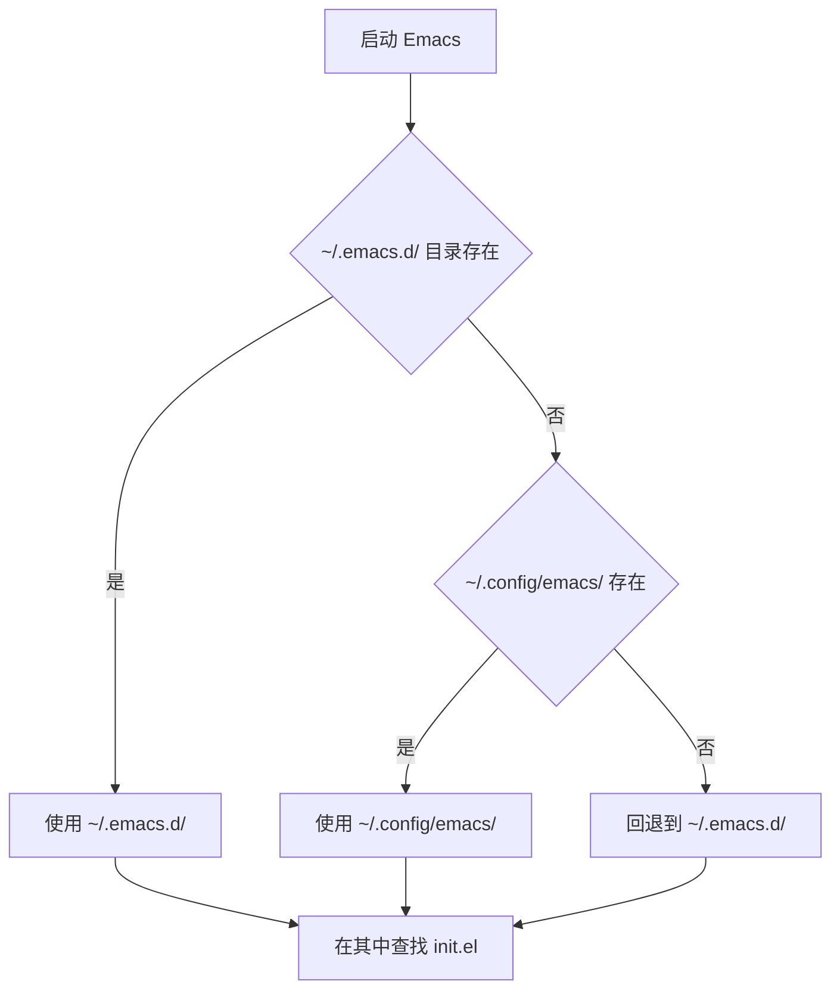
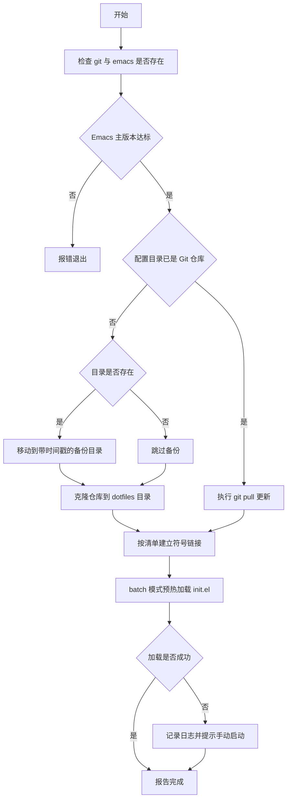
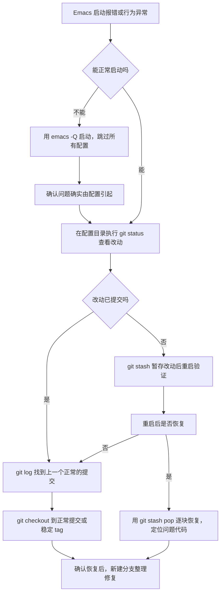

# 多机同步与配置分发

> 把 `~/.emacs.d` 变成一个受版本控制、可在新机器上一条命令恢复的仓库：讲清哪些文件必须提交、哪些必须忽略，并在 Linux、macOS、Windows 三平台上部署同一份配置。

---

## 一、为什么配置必须进版本控制

自维护配置写到一定规模后，`~/.emacs.d` 就变成一个几万行、几十个文件的私人项目。它和任何软件项目一样需要版本控制，理由不是"看起来专业"，而是三个具体到会立刻咬人的问题。

### 1.1 三个动机

**可回滚**。配置是持续演进的实验场：今天试了一个新的 `display-buffer-alist` 配方，明天换掉补全框架，后天把整套键位重排。这些改动里必然有一部分让 Emacs 变得难用甚至启动失败。没有版本控制时，唯一的"回滚"手段是凭记忆把改动改回去；有版本控制时，回滚是一次 `git checkout`。后面第九节会给出完整的救援流程。

**可迁移**。换电脑、加一台服务器、装一个 WSL 环境，都需要同一套配置。手工复制会漏文件、会带上不该带的缓存，而且无法保证版本一致。仓库化之后，新机器的恢复动作退化成"克隆加一次预热启动"。

**可一致**。多台机器跑同一份声明式配置，意味着你在笔记本上练熟的键位、写好的自定义函数、调好的窗口布局，在服务器和 WSL 里完全相同。这一点对肌肉记忆尤其重要：键位不一致等于每换一台机器就要重新学习一次。

### 1.2 手工同步的失败模式

绕开版本控制的手工方案通常有三种，各自失败得很稳定。

用 `rsync` 或网盘同步整个 `~/.emacs.d`：会把 `elpa/`、`eln-cache/`、历史记录、书签、TRAMP 连接缓存一起搬过去。这些文件中含有大量本机绝对路径和主机名；在另一台机器上，它们要么失效，要么让 Emacs 加载错误的字节码。更糟的是双向同步：两台机器同时运行时，双方的历史文件互相覆盖，最终得到一个两边都不对的状态。

用 U 盘或压缩包搬运：没有历史，没有分支，改名靠加日期后缀（`init-2024-03.el`），几个月后没人知道哪个版本是好的。

把文件直接放在网盘目录里：网盘的冲突处理会产生 `init (副本).el` 这类文件，而 Emacs 根本不会加载它们，于是"改了没生效"成为日常。

三种方案的共同缺陷不是不自动，而是**没有把"声明"和"运行期产物"分开**。这正是仓库化要解决的核心问题。

### 1.3 先划定同步边界

在写第一行 `.gitignore` 之前，先把 `~/.emacs.d` 里的所有东西分成两类：

- **声明（declaration）**：描述"我希望 Emacs 是什么样"的文件。`init.el`、`early-init.el`、拆分的模块、`snippets/`、锁文件。它们体积小、可读、跨机器有意义，必须提交。
- **运行期产物（runtime artifacts）**：Emacs 和第三方包在运行过程中写出的文件。包本体、字节码与原生编译缓存、历史、书签、会话状态、连接缓存。它们体积大、含本机信息、可自动重建，必须忽略。

判断一个文件属于哪一类，有一个可靠的检验方法：**把它删掉，Emacs 下次启动能不能自行恢复？** 能恢复的是产物，不能恢复的是声明。`elpa/` 删掉后包管理器会重装，历史删掉后只是丢历史，都属于产物；`init.el` 删掉后配置就没了，属于声明。

---

## 二、用 Git 管理 ~/.emacs.d

### 2.1 该提交的内容

推荐的仓库结构如下。核心思路是把配置拆成"入口 + 模块目录 + 资源目录"三部分。

```text
~/.emacs.d/
├── early-init.el          # 入口之一：在包系统初始化前生效的少量设置
├── init.el                # 主入口：读取配置、加载模块、定义键位
├── lisp/                  # 自己写的模块，一个文件一个主题
│   ├── my-utils.el
│   ├── my-ui.el
│   ├── my-keys.el
│   └── my-org.el
├── snippets/              # yasnippet 等片段资源
├── .gitignore
└── README.md              # 记录这份配置面向哪些机器、依赖哪些外部程序
```

对应地，`.gitignore` 之外需要提交的文件清单是：

| 路径 | 作用 | 是否提交 |
| --- | --- | --- |
| `early-init.el` | 包系统初始化前的设置（如 `package-enable-at-startup`） | 提交 |
| `init.el` | 主入口与 `load-path` 设置 | 提交 |
| `lisp/` | 自写模块 | 提交 |
| `snippets/` | 片段资源 | 提交 |
| 包管理器的锁文件（见第六节） | 锁定第三方包版本 | 提交 |
| `README.md` | 部署说明与依赖清单 | 提交 |
| `machine-specific.el` | 本机私有设置 | 忽略（见第七节） |

### 2.2 必须忽略的运行期文件

下面这张表里的路径都是 Emacs 30 与 31 的实际默认值（可在 Emacs 中用 `M-:` 后跟变量名逐一确认）。它们都落在 `user-emacs-directory`（默认 `~/.emacs.d/`）之下，这也是"忽略清单"如此之长的原因。

| 路径 | 由谁写出 | 忽略的原因 |
| --- | --- | --- |
| `elpa/` | `package.el` | 第三方包本体，体积大，可由声明重建 |
| `eln-cache/` | 原生编译（native-comp） | 本机架构与 Emacs 版本相关的 `.eln` 缓存 |
| `package-quickstart.el` | `package-quickstart` | 自动生成的启动加速文件 |
| `var/` | 部分包的运行期数据 | 可变状态，无跨机意义 |
| `transient/` | transient（Magit 等的菜单库） | 菜单历史与层级状态 |
| `.emacs.desktop` | `desktop-save-mode` | 上次会话的缓冲区与窗口布局 |
| `places.eld` | `save-place-mode` | 光标位置记忆 |
| `history` | `savehist-mode` | minibuffer 命令历史，可能含输入的敏感串 |
| `recentf.eld` | `recentf-mode` | 最近访问文件列表，含本机绝对路径 |
| `bookmarks.eld` | 书签 | 含本机绝对路径 |
| `url/` | `url` 库 | cookies 与访问历史 |
| `auto-save-list/` | 自动保存 | 崩溃恢复用的会话文件 |
| `*.elc` | 字节编译器 | 可由 `.el` 重新生成 |
| `tramp` | TRAMP | 远程连接历史，含主机名与用户名 |
| `projects.eld` | `project.el` | 项目根目录列表，含本机绝对路径 |
| `custom.el` | Customize 界面 | 见 2.4 节的说明 |

### 2.3 完整的 .gitignore

把配置文件放在 `~/.emacs.d/.gitignore`。以下是可直接复制使用的完整内容。

```gitignore
# ============ Emacs 运行期产物：一律不入库 ============

# 包管理器安装的第三方包本体，可由声明重建
elpa/
straight/
elpaca/
el-get/

# 原生编译缓存与包管理器的快捷启动文件
eln-cache/
package-quickstart.el

# 运行期可变数据目录
var/

# transient 菜单的历史与层级状态
transient/

# 桌面会话：上次退出时的缓冲区与窗口布局
.emacs.desktop
.emacs.desktop.lock

# 光标位置、命令历史、最近文件、书签
places
places.eld
history
recentf
recentf.eld
bookmarks
bookmarks.eld

# URL 库的 cookies 与访问历史
url/

# 字节码与原生编译产物
*.elc
*.eln

# 自动保存与自动保存列表
auto-save-list/
\#*#
.#*
*~

# 编辑器临时文件
*.orig
*.rej
*.bak

# TRAMP 连接历史（含主机名与用户名）
tramp

# project.el 的项目列表（含本机绝对路径）
projects.eld

# Customize 写出的个性化设置
custom.el

# 本机私有配置与密钥，绝不入库
machine-specific.el
local/
authinfo
authinfo.gpg
.netrc
*.gpg

# 安装脚本的日志
.install-warmup.log

# 操作系统杂项
.DS_Store
Thumbs.db
desktop.ini
```

### 2.4 逐行说明与三个易错点

上面的文件里，绝大多数行是直白的路径匹配，但有三个地方几乎每个初次配置的人都会踩。

**第一，`\#*#` 前面的反斜杠不能省。** Git 的 `.gitignore` 语法规定，以 `#` 开头的行是注释。Emacs 的自动保存文件恰好叫 `#init.el#`，如果直接写 `#*#`，Git 会把它当成注释而不是模式。正确的写法是在第一个井号前加反斜杠转义，即 `\#*#`。这一点在 Git 官方文档的 PATTERN FORMAT 一节里有明确说明，见 [gitignore 手册](https://git-scm.com/docs/gitignore)；GitHub 也有一份面向使用者的说明 [Ignoring files](https://docs.github.com/en/get-started/getting-started-with-git/ignoring-files)。

**第二，为什么必须显式忽略 `custom.el`。** `custom-file` 的默认值是 `nil`，含义是"把 Customize 的保存结果写进你的 init 文件"。也就是说，如果你在图形界面里改过任何 `M-x customize` 选项，Emacs 会把一大段 `(custom-set-variables ...)` 追加到 `init.el` 末尾。这有两个后果：`init.el` 被机器生成的代码污染，而且每次换机器都会产生巨大的、没有意义的 diff。解决办法是在 `init.el` 里显式指定独立的 `custom-file`，见 2.5 节。

**第三，不要忽略锁文件。** 第六节会讲，包管理器的锁文件是"只提交声明"策略的核心。忽略 `straight/` 整个目录是对的，但必须把 `straight/versions/` 加回白名单，否则跨机器的一致性无从谈起。

另外要提醒 `*.gpg` 这一行。它会把 `authinfo.gpg` 一并忽略，这是符合预期的默认行为（密钥不该进公开仓库）。但如果你确实想提交**加密后**的凭据文件（因为密文本身是安全的），就需要用 `!authinfo.gpg` 做反向例外，并在提交前确认这个文件真的是密文而不是误命名的明文。

### 2.5 init.el 里必须补的两处设置

第一处是 `custom-file`。`custom-file` 的文档字符串明确写着："第一行告诉 Custom 把设置保存到哪个文件，但不会加载它，两行都必要"。因此在 `init.el` 里必须同时写设置和加载：

```elisp
;; 把 Customize 的保存结果写到独立文件，避免污染 init.el
(setq custom-file (locate-user-emacs-file "custom.el"))
;; 加载它；文件不存在时（新机器首次启动）不报错
(load custom-file 'noerror)
```

这里用 `'noerror` 而不是文档示例里的裸 `(load custom-file)`，是因为新克隆的仓库里还没有 `custom.el`，裸调用会让首次启动在 `*Messages*` 里留下一个错误。`noerror` 是 `load` 的正式参数（第二个可选参数），语义就是"文件不存在时不报错"。

第二处是把单文件配置拆成模块，让 `init.el` 保持薄。`locate-user-emacs-file` 会把相对路径解析到 `user-emacs-directory` 之下，因此配置在 `~/.emacs.d` 和 `~/.config/emacs` 两种布局下都能正确工作：

```elisp
;; 把自写模块目录加入 load-path
(add-to-list 'load-path (locate-user-emacs-file "lisp"))

;; 用 require 加载，feature 名与文件名一致，便于 byte-compile 与卸载
(require 'my-ui)
(require 'my-keys)
(require 'my-utils)

;; 本机私有设置：文件被 .gitignore 忽略，不存在时静默跳过
(load (locate-user-emacs-file "machine-specific") 'noerror)
```

### 2.6 从零建立仓库并推送到远程

如果 `~/.emacs.d` 目前还不存在或可以弃用，直接从零开始最干净：

```bash
# 1) 在配置目录内初始化仓库
cd ~/.emacs.d
git init -b main

# 2) 先写 .gitignore，再添加文件——顺序很关键
$EDITOR .gitignore

# 3) 确认没有把运行期产物加入暂存区
git add -A
git status --short | head -20
git ls-files | wc -l

# 4) 提交
git commit -m "初始化 Emacs 配置仓库"

# 5) 关联远程并推送（把 URL 换成你自己的仓库）
git remote add origin git@github.com:yourname/emacs.d.git
git push -u origin main
```

第 2 步和第 3 步的顺序是全部要点。如果先 `git add -A` 再补 `.gitignore`，`elpa/` 里几千个文件已经进了索引，之后再删除会让仓库历史永久带上这份垃圾。先写忽略规则、再添加文件，就不存在这个问题。

### 2.7 已经在用的配置如何安全入库

真实场景多半是"配置已经用了一年"，此时目录里混着几万个运行期文件。这种情况不要直接 `git init`，而要分两步：先备份，再在一个干净的临时目录里确认忽略规则生效。

```bash
# 1) 完整备份，出问题时可以整体还原
cp -a ~/.emacs.d ~/.emacs.d.backup.$(date +%Y%m%d)

# 2) 进入配置目录，创建 .gitignore（内容用 2.3 节那份）
cd ~/.emacs.d
$EDITOR .gitignore

# 3) 关键一步：用 git status 复核"会被提交的文件"
#    --ignored 会把被忽略的路径也列出来，便于逐条核对
git init -b main
git status --short
git status --ignored --short | wc -l

# 4) 只有确认列表里全是声明文件时，才执行添加
git add -A
git ls-files

# 5) 提交并推送
git commit -m "把既有 Emacs 配置纳入版本控制"
git remote add origin git@github.com:yourname/emacs.d.git
git push -u origin main
```

如果 `git ls-files` 里出现了 `elpa/` 或 `eln-cache/`，说明忽略规则没生效，用 `git rm -r --cached elpa eln-cache` 把它们从索引里移除（保留磁盘文件），再重新提交。这个命令只动索引，不会删磁盘上的包。

---

## 三、部署方案对比

仓库建好之后，下一个问题是"新机器上怎么把仓库变成 `~/.emacs.d`"。有四类方案，机制不同，取舍也不同。

### 3.1 四种机制

**直接克隆到配置目录**：`git clone <URL> ~/.emacs.d`，让 Git 仓库本身就是配置目录。没有任何间接层，`cd ~/.emacs.d && git pull` 就是更新配置。这是最简单也最少出错的方案。

**GNU Stow**：仓库放在 `~/dotfiles` 下，按包组织成 `~/dotfiles/emacs/.emacs.d/init.el` 这样的目录树，然后 `stow emacs` 在 `$HOME` 下生成指向仓库的符号链接。它把多份 dotfiles 统一管理，代价是目录树必须严格镜像目标路径。

**手写符号链接脚本**：自己写一段 shell，对每个需要同步的文件执行 `ln -sfn`。灵活度最高，能处理仓库布局与目标布局不一致的情况，代价是要自己维护这份清单。

**dotfiles 管理器（chezmoi、yadm）**：在 Git 之上加一层模板、加密和主机差异化能力。`yadm` 的用法几乎是 `git` 的别名，直接管理 `$HOME` 下的文件；`chezmoi` 则提供模板语法，可以用同一份源文件为不同主机生成不同的目标文件。

### 3.2 对比表

| 方案 | 机制 | 优点 | 缺点 | 适用场景 |
| --- | --- | --- | --- | --- |
| 直接克隆 | 仓库即配置目录 | 零间接层，更新即 `git pull` | 配置与仓库无法分离，不方便把多份 dotfiles 放一个仓库 | 只同步 Emacs 配置，单一用途仓库 |
| GNU Stow | 镜像目录树加符号链接 | 多份 dotfiles 统一管理，链接关系可读 | 目录树必须严格对齐，Windows 上依赖符号链接权限 | 已经有 `~/dotfiles` 且同时在管 shell、Git、编辑器配置 |
| 手写脚本 | 脚本内 `ln -sfn` | 完全可控，可处理任意布局差异，可做备份与校验 | 需要自己维护文件清单，清单会随配置增长而腐化 | 布局特殊，或需要安装过程带额外步骤（如编译、装系统依赖） |
| chezmoi | Git 加模板与加密 | 同一源文件可按主机渲染不同内容，内置密钥加密 | 引入额外概念与依赖，需要学习其命令集 | 多台差异明显的机器，且愿意接受一层抽象 |
| yadm | Git 的包装，直接管 `$HOME` | 命令与 `git` 几乎一致，学习成本低 | 整体管理 `$HOME` 容易误提交无关文件 | 想用 Git 但不想把仓库塞进 `~/.emacs.d` |

### 3.3 选择建议

只同步 Emacs 配置，选**直接克隆**。这是绝大多数自维护配置的最优解：没有符号链接，就没有 Windows 权限问题；没有间接层，就没有"改了哪个副本"的困惑。

已经在用 `~/dotfiles` 统一管理多份配置，选 **GNU Stow**。它的模型简单到可以用一句话概括：源目录树的结构决定链接的目标路径。

需要按主机渲染不同内容，或需要把密钥加密后入库，选 **chezmoi**。它的模板能力是本列表里唯一能优雅解决"同一份配置在不同主机上有不同取值"的方案。

三款工具的官方仓库分别是 [chezmoi](https://github.com/twpayne/chezmoi)、[yadm](https://github.com/TheLocehiliosan/yadm) 与 [GNU Stow](https://github.com/aspiers/stow)。

### 3.4 GNU Stow 的最小用法

`stow` 的约定是：把仓库目录当作 `$HOME` 的镜像，`stow` 会为每个文件在 `$HOME` 下创建符号链接。假设仓库在 `~/dotfiles`，其中包含 `emacs` 这个"包"：

```text
~/dotfiles/
└── emacs/
    └── .emacs.d/
        ├── early-init.el
        ├── init.el
        └── lisp/
            └── my-ui.el
```

安装与卸载各一条命令：

```bash
# 在 ~/dotfiles 目录下执行；stow 会把 emacs/.emacs.d/init.el 链接到 ~/.emacs.d/init.el
cd ~/dotfiles
stow emacs

# 撤销：删除这些符号链接（不动仓库里的源文件）
stow -D emacs

# 先看会做什么、不实际动手
stow -n -v emacs
```

传统上 Stow 用"把整个目录链接过去"的方式，因此 `~/.emacs.d` 本身会成为一个指向 `~/dotfiles/emacs/.emacs.d` 的符号链接。这对 Emacs 是可以接受的；但如果你希望 `~/.emacs.d` 是真实目录、只有内部文件是链接，需要用 `--no-folding` 选项关闭目录折叠。

---

## 四、三平台路径差异

### 4.1 Emacs 到底读哪一个 init.el

这是多机部署里最容易出错、也最值得彻底搞清的一点。Emacs 27 起支持 XDG 目录规范，因此配置位置有了两种可能：传统的 `~/.emacs.d/` 和 XDG 风格的 `~/.config/emacs/`。二者的优先级由 `startup.el` 中的 `startup--xdg-or-homedot` 决定，其判定逻辑可以完整地概括为下面这个流程图。



把这段逻辑翻译成结论，有四条必须记住：

第一，**`~/.emacs.d/` 只要存在就赢**。即使你已经把配置完整地放在 `~/.config/emacs/`，只要 `~/.emacs.d/` 这个目录还在（哪怕里面只有一个残留文件），Emacs 就会去那里找 `init.el`。这解释了最经典的"我明明改了配置却没生效"：机器上同时存在两处目录。

第二，**在非 Windows 平台上，`~/.emacs` 文件也算数**。它和 `~/.emacs.d/` 目录同级触发同一个分支，效果同样是"使用 `~/.emacs.d/`"。

第三，**在 Windows 平台上，判定条件不同**。`startup--xdg-or-homedot` 在 `system-type` 为 `windows-nt` 时不去检查 `~/.emacs`，而是列出主目录下匹配 `[._]emacs` 的文件与目录。所以 `_emacs` 和 `.emacs` 在 Windows 上都会被认出来。

第四，**两处都不存在时回退到 `~/.emacs.d/`**。所以全新机器上克隆到 `~/.emacs.d` 永远是对的。

在任何一台机器上，可以用一行命令确认 Emacs 的真实选择：

```bash
$ emacs --batch --eval '(princ (format "init=%s\ndir=%s\n" user-init-file user-emacs-directory))'
```

如果输出里 `init=` 后面是 `nil`，说明这个位置没有找到 init 文件；`dir=` 反映的是 Emacs 选定的配置目录。

### 4.2 Linux 与 macOS

两种布局在 Linux 与 macOS 上都可用，选择取决于你的习惯：

| 布局 | 路径 | 说明 |
| --- | --- | --- |
| 传统 | `~/.emacs.d/init.el` | 与 Emacs 27 之前的版本、与所有第三方文档一致 |
| XDG | `~/.config/emacs/init.el` | 与 `~/.config` 下的其他工具统一，备份脚本只需覆盖一个父目录 |

macOS 上有一条额外注意：**不要用 iCloud 同步的 `Documents` 或 `Desktop` 目录存放配置仓库**。iCloud 会在文件中写入扩展属性并在同步时重命名冲突文件，而 `~/.emacs.d` 里大量文件（`.eln` 缓存、`.elc`）会产生高频写入，同步冲突会导致加载失败。用本地的 `~/dev/emacs.d` 或 `~/.emacs.d` 即可，跨机同步交给 Git。

XDG 布局下，环境变量也会影响位置。若设置了 `XDG_CONFIG_HOME`，Emacs 考虑的是 `$XDG_CONFIG_HOME/emacs/` 而不一定是 `~/.config/emacs/`。用 4.1 节那条命令一验便知。

### 4.3 Windows：HOME、%APPDATA% 与 .emacs.d

Windows 上的关键差异是"主目录从哪里来"。Emacs 把 `HOME` 环境变量指向的目录当作 `~`。如果 `HOME` 没有设置，Emacs 在 Windows 上会退回到 `%APPDATA%`，其典型值形如：

```text
C:\Users\<用户名>\AppData\Roaming
```

也就是说，Windows 上 Emacs 的 `~/.emacs.d` 可能是 `C:\Users\alice\AppData\Roaming\.emacs.d`，也可能是 `C:\Users\alice\.emacs.d`，完全取决于 `HOME` 是否设置。这个不确定性会让"配置到底克隆到哪"变成猜谜。

处理办法很简单：**在 Windows 上显式设置 `HOME`**，让它等于 `%USERPROFILE%`，然后所有平台的路径逻辑就统一了。

```powershell
# 为当前用户永久设置 HOME，指向标准的用户主目录
[Environment]::SetEnvironmentVariable('HOME', $env:USERPROFILE, 'User')
# 设置后需要重开终端（以及重启 Emacs）才生效
```

命令提示符下的等价写法：

```cmd
setx HOME "%USERPROFILE%"
```

设置完成后务必验证，不要凭假设：

```powershell
emacs --batch --eval "(princ (getenv \"HOME\"))"
emacs --batch --eval "(princ user-emacs-directory)"
```

注意上面两条命令在 PowerShell 里的引号处理：PowerShell 会吃掉双引号，所以传给 Emacs 的 Elisp 表达式必须用反斜杠转义内层引号，或者改用单引号包裹整个表达式（PowerShell 中单引号内的内容原样传递）：

```powershell
emacs --batch --eval '(princ user-emacs-directory)'
```

第二种写法更清晰，后文的 PowerShell 脚本会统一采用它。

### 4.4 Windows 上符号链接的权限要求

如果你选择 Stow 或手写链接脚本，Windows 上会遇到权限限制。三类链接的差别是实打实的：

| 类型 | 创建命令 | 是否需要管理员 | 适用对象 |
| --- | --- | --- | --- |
| 符号链接（symlink） | `New-Item -ItemType SymbolicLink` 或 `mklink` | 需要管理员，或已启用开发者模式 | 文件与目录 |
| 目录联接（junction） | `New-Item -ItemType Junction` 或 `mklink /J` | 不需要 | 仅目录 |
| 硬链接（hard link） | `New-Item -ItemType HardLink` 或 `mklink /H` | 不需要 | 仅同卷文件 |

由此得到两条实用建议。若坚持用符号链接，先在"设置 - 隐私和安全性 - 开发者选项"里打开开发者模式，这样普通用户也能创建符号链接；否则就以管理员身份运行一次安装脚本。若不想动权限，就用"目录用联接、文件用硬链接"的组合，代价是硬链接要求源与目标在同一磁盘卷上。

还有一个更隐蔽的坑：**Git 在 Windows 上的符号链接处理**。如果仓库里记录了符号链接而当前进程没有创建符号链接的权限，Git 不会报错，而是把链接"展开"成一个普通文本文件，内容就是那行目标路径。结果是 `~/.emacs.d/init.el` 变成一个内容为 `../dotfiles/init.el` 的文本文件，Emacs 加载它时把它当 Elisp 求值，得到一个莫名其妙的错误。判断方法是用 `git config core.symlinks` 查看（在无权限环境下自动检出会把它设为 `false`），以及在克隆后直接查看文件是链接还是普通文件：

```powershell
# 应当输出 ReparsePoint（链接）而不是普通文件属性
(Get-Item "$HOME\.emacs.d\init.el").Attributes
```

### 4.5 路径速查表

| 平台 | 传统布局 | XDG 布局 | 备注 |
| --- | --- | --- | --- |
| Debian / Ubuntu | `~/.emacs.d/init.el` | `~/.config/emacs/init.el` | 两者同时存在时前者优先 |
| Arch | `~/.emacs.d/init.el` | `~/.config/emacs/init.el` | 同上 |
| macOS | `~/.emacs.d/init.el` | `~/.config/emacs/init.el` | 避免放在 iCloud 同步目录 |
| Windows 原生 | `%HOME%\.emacs.d\init.el` | `%HOME%\.config\emacs\init.el` | 强烈建议显式设置 `HOME` |
| WSL | `~/.emacs.d/init.el` | `~/.config/emacs/init.el` | 对 WSL 而言就是 Linux 路径 |

关于 WSL，还有一条与部署相关的注意点：**不要把配置放在 `/mnt/c/` 下面**。跨文件系统的读写（经由 DrvFs）比 WSL 原生文件系统慢一个数量级，而 Emacs 启动要读取并字节编译大量小文件，放在 `/mnt/c` 会让启动明显变慢。正确做法是在 WSL 的家目录里克隆仓库，如果需要与 Windows 侧共享同一份配置，用 Git 同步而不是用同一份文件。

---

## 五、一键安装脚本

### 5.1 设计要点

脚本要解决的是"新机器上从零到可用"，因此必须覆盖六件事，缺一件都会在实际使用时卡住。

**检查前置条件**。Emacs 是硬依赖；Git 是软依赖（没有 Git 就没法克隆）。Emacs 主版本号必须达到配置要求，因为 `use-package` 从 Emacs 29 起才内置，`which-key` 从 Emacs 30 起才内置。这些声明如果写在配置里，在过旧的 Emacs 上会直接报错。

**备份已有配置**。这是脚本里最不能省的一步。用户在一台用了一段时间的机器上运行脚本时，`~/.emacs.d` 里可能有未提交的改动，直接覆盖等于数据丢失。备份必须带时间戳，且必须是"移动"而不是"删除"。

**幂等**。脚本要能在同一台机器上重复运行：第二次运行时应该更新已有仓库，而不是报错或再克隆一份。判断依据是目标目录里有没有 `.git`。

**区分"仓库目录"与"配置目录"**。克隆到 `~/dotfiles` 再软链到 `~/.emacs.d`，是符号链接方案的正确形态；仓库和配置目录是两个位置，脚本要对两者分别处理。

**首次启动装包**。配置里的包声明需要一次预热启动才会真正安装。这一步要在 batch 模式下做，并且要容忍失败——图形界面专属的设置（字体、frame 参数）在无图形环境里报错是正常的。

**失败可诊断**。所有错误信息要带上是哪一步失败的，退出码要非零，方便在 `&&` 链里被发现。

### 5.2 install.sh 完整实现

```bash
#!/usr/bin/env bash
# Emacs 配置一键部署脚本
# 用法：EMACS_D_REPO=<仓库URL> ./install.sh
# 不加 EMACS_D_REPO 时使用脚本内的默认值

set -euo pipefail

# ---------- 可配置项 ----------
REPO_URL="${EMACS_D_REPO:-https://github.com/yourname/emacs.d.git}"
DOTFILES_DIR="${DOTFILES_DIR:-$HOME/dotfiles}"   # 仓库工作副本位置
EMACS_D="${EMACS_D:-$HOME/.emacs.d}"             # Emacs 实际读取的配置目录
MIN_EMACS_MAJOR=29                               # 配置要求的最低主版本号
STAMP="$(date +%Y%m%d-%H%M%S)"
BACKUP_DIR="$HOME/.emacs.d.backup.$STAMP"

# 需要从仓库链接到配置目录的条目
LINK_ENTRIES=(early-init.el init.el lisp snippets)

# ---------- 输出工具 ----------
log() { printf '[%s] %s\n' "$(date +%H:%M:%S)" "$*"; }
warn() { printf '[%s] 警告：%s\n' "$(date +%H:%M:%S)" "$*" >&2; }
die() { printf '[%s] 错误：%s\n' "$(date +%H:%M:%S)" "$*" >&2; exit 1; }
trap 'die "脚本在第 $LINENO 行意外失败"' ERR

# ---------- 步骤 1：检查前置条件 ----------
log "步骤 1/6：检查前置条件"

command -v git >/dev/null 2>&1 || die "未找到 git，请先安装 Git"
command -v emacs >/dev/null 2>&1 || die "未找到 emacs，请先安装 GNU Emacs"

# 用 batch 模式取主版本号，避免启动图形界面
EMACS_MAJOR="$(emacs --batch --eval '(princ emacs-major-version)' 2>/dev/null || true)"
[ -n "$EMACS_MAJOR" ] || die "无法获取 Emacs 版本号，emacs 可能安装不完整"
if [ "$EMACS_MAJOR" -lt "$MIN_EMACS_MAJOR" ]; then
  die "Emacs 主版本为 $EMACS_MAJOR，配置要求至少 $MIN_EMACS_MAJOR"
fi

EMACS_VERSION="$(emacs --batch --eval '(princ emacs-version)' 2>/dev/null || echo '未知')"
log "检测到 Emacs $EMACS_VERSION，git $(git --version | awk '{print $3}')"

# ---------- 步骤 2：备份已有配置 ----------
log "步骤 2/6：处理已有的配置目录"

if [ -e "$EMACS_D" ] && [ ! -d "$EMACS_D/.git" ]; then
  # 存在但不是 Git 仓库，整体移走备份
  mv "$EMACS_D" "$BACKUP_DIR"
  log "已把原有配置移动到 $BACKUP_DIR"
elif [ -d "$EMACS_D/.git" ]; then
  # 已经是 Git 仓库，可能是此前部署过或用户自己托管的
  warn "$EMACS_D 已经是一个 Git 仓库，将跳过克隆步骤"
  SKIP_CLONE=1
fi
mkdir -p "$EMACS_D"

# ---------- 步骤 3：克隆或更新仓库 ----------
log "步骤 3/6：获取配置仓库"

if [ "${SKIP_CLONE:-0}" = "1" ]; then
  log "在 $EMACS_D 中执行 git pull"
  git -C "$EMACS_D" pull --ff-only || warn "git pull 失败，继续使用当前版本"
elif [ -d "$DOTFILES_DIR/.git" ]; then
  log "更新已有仓库 $DOTFILES_DIR"
  git -C "$DOTFILES_DIR" pull --ff-only || warn "git pull 失败，继续使用当前版本"
else
  log "克隆 $REPO_URL 到 $DOTFILES_DIR"
  # 配置仓库需要完整历史以便回滚，因此不加 --depth
  git clone "$REPO_URL" "$DOTFILES_DIR" || die "克隆失败，请检查仓库 URL 与网络"
fi

# 确定配置源目录：优先用仓库里的 emacs/ 子目录，否则用仓库根
if [ "${SKIP_CLONE:-0}" = "1" ]; then
  SRC_DIR="$EMACS_D"
elif [ -d "$DOTFILES_DIR/emacs" ]; then
  SRC_DIR="$DOTFILES_DIR/emacs"
else
  SRC_DIR="$DOTFILES_DIR"
fi
[ -d "$SRC_DIR" ] || die "找不到配置源目录：$SRC_DIR"

# ---------- 步骤 4：建立符号链接 ----------
log "步骤 4/6：建立符号链接"

link_entry() {
  local rel="$1"
  local src="$SRC_DIR/$rel"
  local dst="$EMACS_D/$rel"

  if [ ! -e "$src" ]; then
    log "跳过 $rel（源中不存在）"
    return 0
  fi

  # 目标已存在且不是符号链接：先备份再链接
  if [ -e "$dst" ] && [ ! -L "$dst" ]; then
    mv "$dst" "${dst}.pre-install.$STAMP"
    log "已备份原有 $dst"
  fi

  mkdir -p "$(dirname "$dst")"
  ln -sfn "$src" "$dst"
  log "链接 $dst -> $src"
}

if [ "$SRC_DIR" = "$EMACS_D" ]; then
  log "配置与仓库同目录，无需链接"
else
  for entry in "${LINK_ENTRIES[@]}"; do
    link_entry "$entry"
  done
fi

# ---------- 步骤 5：首次启动预热，安装声明的包 ----------
log "步骤 5/6：预热启动以安装第三方包"

WARMUP_LOG="$EMACS_D/.install-warmup.log"
if emacs --batch \
     --eval "(setq user-emacs-directory (file-name-as-directory \"$EMACS_D\"))" \
     -l "$EMACS_D/init.el" \
     --eval '(princ "WARMUP-OK\n")' >"$WARMUP_LOG" 2>&1; then
  log "init.el 加载成功，包声明已处理"
else
  warn "init.el 在 batch 模式下未完整加载（图形界面专属设置报错属正常）"
  warn "详情见 $WARMUP_LOG；请随后手动启动一次 Emacs 完成剩余安装"
fi

# ---------- 步骤 6：汇总 ----------
log "步骤 6/6：完成"
cat <<EOF

配置目录：$EMACS_D
源目录：  $SRC_DIR
备份目录：${BACKUP_DIR:-（无，未发生备份）}
预热日志：$WARMUP_LOG

下一步：
  1) 启动 Emacs（emacs 或 emacsclient -c），确认没有报错
  2) 查看 *Messages* 与 M-x emacs-init-time 确认启动耗时
  3) 在配置目录执行 git log 确认版本，必要时用 git tag 标记为稳定版本
  4) 如使用了私有凭据，确认 ~/.authinfo.gpg 存在且权限为 600
EOF
```

### 5.3 执行流程图

脚本的控制流可以概括成下面这张图。注意"是否为 Git 仓库"这个判定同时决定了克隆步骤和链接步骤是否执行，这是保持幂等性的关键。



### 5.4 PowerShell 最小版本

Windows 上不用强行移植整个 shell 脚本，一个覆盖"检查、备份、克隆、链接"的最小实现就够用。要点是用 Emacs 自己报告配置目录，因为 Windows 上 PowerShell 的 `$HOME`（等于 `$env:USERPROFILE`）和 Emacs 认定的 `HOME` 可能不一致。

```powershell
# install.ps1 —— Windows 版 Emacs 配置部署脚本
$ErrorActionPreference = 'Stop'

$RepoUrl = if ($env:EMACS_D_REPO) { $env:EMACS_D_REPO } else { 'https://github.com/yourname/emacs.d.git' }
$Stamp   = Get-Date -Format 'yyyyMMdd-HHmmss'

# 让 Emacs 自己报告它认定的配置目录，避免 %HOME% 与 %APPDATA% 的歧义
if (-not (Get-Command emacs -ErrorAction SilentlyContinue)) {
    throw '未找到 emacs，请先安装 GNU Emacs 并把它加入 PATH'
}
$EmacsD = (& emacs --batch --eval '(princ user-emacs-directory)') -replace '/$', ''
$EmacsD = $EmacsD -replace '/', '\'
Write-Host "Emacs 配置目录：$EmacsD"

$Major = [int](& emacs --batch --eval '(princ emacs-major-version)')
if ($Major -lt 29) { throw "Emacs 主版本为 $Major，配置要求至少 29" }
Write-Host "检测到 Emacs 主版本 $Major"

# 备份已有配置
if (Test-Path $EmacsD) {
    $backup = "$EmacsD.backup.$Stamp"
    Move-Item -Path $EmacsD -Destination $backup
    Write-Host "已备份原有配置到 $backup"
}

# 克隆仓库；若已有仓库则更新
$Dotfiles = Join-Path $HOME 'dotfiles'
if (Test-Path (Join-Path $Dotfiles '.git')) {
    git -C $Dotfiles pull --ff-only
} else {
    git clone $RepoUrl $Dotfiles
}

# 建立链接：目录用联接（无需管理员），文件用硬链接（无需管理员）
New-Item -ItemType Directory -Path $EmacsD -Force | Out-Null
foreach ($entry in @('early-init.el', 'init.el', 'lisp', 'snippets')) {
    $src = Join-Path $Dotfiles "emacs\$entry"
    $dst = Join-Path $EmacsD $entry
    if (-not (Test-Path $src)) { Write-Host "跳过 $entry（源中不存在）"; continue }
    if (Test-Path $dst) { Remove-Item $dst -Recurse -Force }
    if ((Get-Item $src).PSIsContainer) {
        New-Item -ItemType Junction -Path $dst -Target $src | Out-Null
    } else {
        New-Item -ItemType HardLink -Path $dst -Target $src | Out-Null
    }
    Write-Host "链接 $dst -> $src"
}

# 预热启动，触发包安装
$log = Join-Path $EmacsD '.install-warmup.log'
& emacs --batch -l (Join-Path $EmacsD 'init.el') --eval '(princ "WARMUP-OK")' *> $log
Write-Host "预热日志：$log"
Write-Host '完成。请启动 Emacs 确认没有报错。'
```

这里选择联接加硬链接而不是符号链接，是为了绕开 4.4 节讲的权限要求。如果你已经启用了开发者模式，把 `Junction` 和 `HardLink` 换成 `SymbolicLink` 即可，语义更接近 Linux 上的做法。

### 5.5 常见失败点

**预热启动失败但配置其实是好的**。batch 模式没有图形界面，任何依赖 frame 参数的设置都会报错。脚本把它降级为警告而不是致命错误，就是为了这个原因。判断配置是否有真问题，要看日志里错误出现的**位置**：如果是在加载某个 `my-ui.el` 时出错，那是真问题；如果在设置字体、`default-frame-alist` 时报错，属于环境差异。

**`git pull` 因为本地改动而失败**。脚本用 `--ff-only` 拒绝产生意外的合并提交，失败时只警告。真正的处理办法是去配置目录 `git status` 看清本地改动，再决定提交还是丢弃。

**克隆成功但 Emacs 加载的是旧配置**。这是 4.1 节讲的"两处目录同时存在"。用 `emacs --batch --eval '(princ user-init-file)'` 确认实际加载路径。

**包安装卡在签名校验**。首次安装需要从 GNU ELPA 拉取签名密钥。若网络受限，可能长时间无输出。可以在配置里把 `package-check-signature` 调整为更宽松的策略，但更稳妥的做法是先解决网络问题，而不是长期关闭校验。

---

## 六、包同步的两种策略

第三方包是配置里唯一"体积大又必须跨机一致"的部分。围绕它有两种截然不同的策略，选择会影响仓库体积、恢复速度和一致性强度。

### 6.1 策略 A：提交 elpa/ 目录

把 `~/.emacs.d/elpa/` 整个加入版本控制。每台机器克隆下来就带着全部包，不需要联网安装。

优点是恢复速度快、结果确定：只要仓库版本一致，包版本就完全一致，不依赖上游仓库的可用性。缺点是仓库体积会涨到几十到几百 MB，且包含大量平台相关文件。原生编译缓存（`eln-cache/`）如果也提交，问题更严重——`.eln` 文件与 Emacs 版本、CPU 架构强绑定，在另一台机器上要么被忽略重编，要么直接导致加载失败。

若采用这个策略，必须做到：提交 `elpa/`，但严格忽略 `eln-cache/`；并且接受"每次更新包都会产生一个巨大的提交"。

### 6.2 策略 B：只提交声明

仓库里只保留"要装哪些包"的声明，包本体由每台机器自行安装。声明有两种形态：`(use-package foo :ensure t)` 这样的形式，或者一个 `package-selected-packages` 变量。

优点是仓库轻（通常只有几百 KB），提交历史干净，diff 只反映意图而不是包的二进制内容。缺点是首次恢复需要联网安装，恢复时间取决于网络；而且如果不用锁文件，各机器在某次安装时抓到的包版本可能不同。

一致性由锁文件补齐，这就是 6.4 与 6.5 节的内容。

### 6.3 对比表

| 维度 | 策略 A：提交 elpa/ | 策略 B：只提交声明 |
| --- | --- | --- |
| 典型仓库体积 | 数十至数百 MB | 数百 KB |
| 首次恢复速度 | 快（克隆即完成） | 慢（取决于网络与包数量） |
| 版本一致性 | 强，且不依赖上游 | 需要锁文件才能达到强一致 |
| 提交历史可读性 | 差，混入大量包文件 | 好，只反映意图 |
| 离线恢复 | 可行 | 不可行 |
| 平台相关风险 | 高（字节码、原生编译产物） | 低 |
| 适用场景 | 网络受限环境、需要在无网机器上快速部署 | 绝大多数场景 |

结论很明确：**默认选策略 B**。只有在目标机器长期无法访问 MELPA 与 GNU ELPA 时，才值得付出策略 A 的体积代价。

### 6.4 straight.el 的 lockfile

[straight.el](https://github.com/radian-software/straight.el) 用锁文件把"声明"提升到强一致。它的工作方式是：`M-x straight-freeze-versions` 把当前所有包的提交版本写进 `~/.emacs.d/straight/versions/default.el`，这个文件应该被提交；在新机器上，`straight.el` 克隆包之后会按锁文件里的修订号检出对应版本。要手工回到锁文件记录的版本，用 `M-x straight-thaw-versions`。

注意 `default.el` 的路径在 `straight/` 目录下，而 `straight/` 整体是要忽略的。因此 `.gitignore` 需要一条反向例外：

```gitignore
# 忽略 straight 克隆下来的包本体，但保留版本锁文件
straight/*
!straight/versions/
straight/versions/*
!straight/versions/default.el
```

这里必须写成三步：先忽略 `straight/` 下的全部内容，再把 `versions/` 目录本身加回白名单（目录不被排除，Git 才会继续往里看），最后只放行 `default.el`。只写 `!straight/versions/default.el` 一行是不够的——Git 不会进入一个已经被排除的目录。

### 6.5 elpaca 的做法

[elpaca](https://github.com/progfolio/elpaca) 的目录布局是 `elpaca-directory`（默认 `~/.emacs.d/elpaca/`），下面分 `sources/` 存克隆的源码、`builds/` 存构建结果。它同时支持两种反序列化方式，其中锁文件方式的思路与 `straight.el` 类似，另外也支持把构建好的包缓存下来供其他机器使用。

对多机同步来说，实践上和 `straight.el` 的处理一致：忽略 `elpaca/` 下的内容，把锁文件加回白名单。具体文件名请以你所用的 `elpaca` 版本的文档为准，用 `M-x` 补全或阅读包内的 README 确认后，再往 `.gitignore` 里写例外规则——不要凭记忆写一个可能不存在的文件名。

### 6.6 用 package.el 时的声明写法

如果不引入 `straight.el` 或 `elpaca`，`package.el` 也能提供声明式的恢复。Emacs 29 起 `use-package` 已内置，配合 `:ensure` 可以自动安装：

```elisp
;; 让 use-package 在缺失时自动从已配置的归档安装
(require 'use-package)
(setq use-package-always-ensure t)

;; 归档：GNU ELPA 与 NonGNU ELPA 已默认存在，MELPA 需要手动加入
(require 'package)
(add-to-list 'package-archives '("melpa" . "https://melpa.org/packages/") t)
```

配置写好后，新机器上可以只用一条命令完成安装，不必启动图形界面：

```bash
$ emacs --batch --eval '(progn (require (quote package)) (package-refresh-contents) (package-install-selected-packages))'
```

`package-install-selected-packages` 会读取 `package-selected-packages`（由 `use-package :ensure` 维护），只安装缺失的包。这条命令是策略 B 在无 `straight.el` 时最实用的补全手段，可以直接放进 `install.sh` 替代通用预热步骤。

---

## 七、多机差异处理

同一份配置要在笔记本、台式机、服务器、WSL 上跑，差异必然存在。原则是：**差异集中到少数几个文件里，主体配置保持单一版本**。

### 7.1 system-type 与 system-name

Emacs 提供两个层次的环境判别。`system-type` 回答"什么操作系统"，取值是符号，常见的三个是 `gnu/linux`、`darwin`、`windows-nt`。`system-name` 回答"哪一台机器"，返回主机名。

```elisp
;; 按操作系统分支：处理 GUI、路径分隔符、外部程序名的差异
(pcase system-type
  ('gnu/linux  (setq my-browser-program "xdg-open"))
  ('darwin     (setq my-browser-program "open"))
  ('windows-nt (setq my-browser-program "explorer.exe"))
  (_           (setq my-browser-program nil)))

;; 按主机名分支：处理同一操作系统下不同机器的差异
(defconst my-laptop-name "thinkpad-x1"
  "我的笔记本主机名，用于区分移动与固定设备。")

(defun my-on-laptop-p ()
  "当前是否运行在笔记本上。"
  (string= (system-name) my-laptop-name))
```

用主机名分支时要注意两点。第一，`system-name` 在容器与部分云主机上可能是一个随机的容器 ID，不适合做稳定判据；这种情况下改用环境变量（见 7.2 节）。第二，Cyberpunk 式的超长分支会让配置难以阅读，超过三台机器就该改成配置文件驱动。

另外要区分 GUI 与终端：`display-graphic-p` 在图形界面下返回非 nil，在 `emacs -nw` 与 batch 模式下返回 nil。这比判断 `window-system` 更直接，也是官方推荐的写法。

```elisp
;; 只在图形界面下启用的设置：字体、frame 尺寸、鼠标行为
(when (display-graphic-p)
  (set-face-attribute 'default nil :height 130)
  (setq mouse-autoselect-window nil))

;; 只在终端下生效的设置
(unless (display-graphic-p)
  (xterm-mouse-mode 1))
```

### 7.2 machine-specific.el 的写法

把本机私有设置集中到一个文件，并让它被忽略，是这套方案的核心手法。文件内容按需要写，例如：

```elisp
;;; machine-specific.el --- 本机私有设置，不纳入版本控制 -*- lexical-binding: t; -*-

;; 本机的笔记与项目根目录
(setq my-notes-directory "~/Documents/notes")
(setq my-projects-directory "~/dev")
(setq org-directory "~/Documents/org")

;; 本机专属的外部程序路径
(setq my-cloc-program "/usr/local/bin/cloc")

;; 本机可能需要的特殊设置
(setq my-use-treemacs t)

(provide 'machine-specific)
;;; machine-specific.el ends here
```

`init.el` 里用 `noerror` 加载它，保证在还没有创建这个文件的新机器上不报错：

```elisp
(load (locate-user-emacs-file "machine-specific") 'noerror)
```

为了让新机器不至于面对一个"什么都没设"的状态，仓库里应该提交一个 `machine-specific.example.el`，内容是带默认值的模板加注释说明，并提示使用者复制为 `machine-specific.el` 后修改。`.gitignore` 只忽略 `machine-specific.el` 本身，示例文件照常入库。

### 7.3 笔记本与服务器的取舍

两类设备的配置诉求往往相反，值得用一张表固定下来：

| 关注点 | 笔记本（有图形界面） | 服务器（终端） |
| --- | --- | --- |
| 字体与主题 | 设置 `default` face 高度与字体族 | 不设置，交给终端模拟器 |
| 鼠标行为 | `mouse-autoselect-window`、右键菜单可按需开启 | 全部关闭，`xterm-mouse-mode` 按需 |
| 文件树 | treemacs 等侧边栏可用 | 通常不启用，屏幕宽度不足 |
| 窗口布局 | 左右分栏加 tab-bar 工作区 | 单窗口为主，禁用 tab-bar 节省一行 |
| 补全弹窗 | corfu 等图形化弹窗 | 考虑性能，可关闭 |
| 启动优化 | 关注原生编译与延迟加载 | 关注内存占用与 `emacs --daemon` |

一个可靠的组织方式是在 `machine-specific.el` 里只放**数据**（路径、开关），把**逻辑**留在受版本控制的模块里。这样同一份逻辑在多机上都是同一个版本，差异只体现在几个布尔值和路径字符串上，出问题时排查范围极小。

服务器上另一个常见需求是常驻守护进程。用 `emacs --daemon` 启动，再用 `emacsclient -c` 或 `emacsclient -t` 连接，可以把启动开销摊薄到零。需要注意的是，daemon 在无人登录时也可能被启动，此时 `display-graphic-p` 的判断结果会影响哪些设置生效——依赖图形界面的初始化应放进 `after-make-frame-functions`，而不是在顶层直接执行。

### 7.4 不同 Emacs 版本共存

如果多台机器的 Emacs 版本不同（例如笔记本是 30，服务器发行版仓库里是 29），需要注意三处差异：

第一，**包声明的可用性**。`use-package` 在 29 起内置，`which-key` 在 30 起内置。如果配置里假设它们一定存在，在 29 上就要显式安装。稳妥的写法是先判断再安装：

```elisp
;; which-key 在 Emacs 30 起内置，更早版本需要从 MELPA 安装
(unless (require 'which-key nil t)
  (package-install 'which-key))
```

第二，**字节码与原生编译产物不通用**。`.elc` 文件在版本间通常可用但并不保证，`.eln` 文件则是严格版本绑定的。既然 `eln-cache/` 已被忽略，这一条自动满足；但要注意别把某个 `.elc` 提交进仓库。

第三，**同一台机器上多版本共存**。此时不同的 Emacs 会共享同一个 `~/.emacs.d`，于是共享同一份 `elpa/`。这通常可以工作，但如果某个包针对不同 Emacs 版本安装不同版本的文件，就会互相覆盖。解决办法是给不同版本分配不同的 `user-emacs-directory`，例如在 shell 里按版本设置 `EMACS_USER_DIRECTORY`，或者用 `--init-directory` 命令行参数显式指定：

```bash
# Emacs 29 起支持用 --init-directory 指定配置目录
$ emacs --init-directory ~/.emacs.d-30
$ emacs --init-directory ~/.config/emacs
```

---

## 八、私有信息与密钥

配置仓库里最容易泄露的不是密码，而是那些"看起来无害"的元信息：主机名、内网地址、邮箱、私有仓库地址、API 端点。因此需要两条防线：把真正敏感的凭据挡在仓库外，以及在公开仓库前做一次系统检查。

### 8.1 authinfo.gpg

`auth-source` 是 Emacs 的统一凭据查找机制，它的默认查找列表是：

```elisp
("~/.authinfo" "~/.authinfo.gpg" "~/.netrc")
```

这个默认值本身就在提示正确做法：**凭据放在 `~/.authinfo.gpg`（GPG 加密）而不是 `~/.authinfo`（明文）**。Emacs 通过 `epa-file` 在读取时自动解密，无需额外配置，只要系统里有 [GnuPG](https://gnupg.org/) 提供的 `gpg` 可用。文件内容是一行一条的 netrc 风格记录：

```text
machine git.example.com login alice password 此处是令牌
machine api.example.org login alice^@example.com password 另一个令牌
```

创建加密文件的最小流程是先写明文、加密、再删除明文：

```bash
# 1) 生成密钥（如果还没有）
$ gpg --full-generate-key

# 2) 写好明文后立即加密
$ gpg -e -r alice@example.com -o ~/.authinfo.gpg ~/.authinfo

# 3) 安全删除明文
$ shred -u ~/.authinfo 2>/dev/null || rm -f ~/.authinfo

# 4) 收紧权限
$ chmod 600 ~/.authinfo.gpg

# 5) 验证 Emacs 能解密
$ emacs --batch --eval '(progn (require (quote auth-source)) (princ (auth-source-search :host "git.example.com" :max 1)))'
```

注意 `~/.authinfo.gpg` 位于家目录而不是 `~/.emacs.d` 内，所以它本来就不在配置仓库的管理范围内。这一点是好事：不需要在 `.gitignore` 里为它操心，但也意味着**换机器时必须单独搬运它**，否则 Emacs 会在需要认证时提示输入。把它纳入你 30 分钟恢复清单（第十一节）的最后一步。

### 8.2 环境变量走 shell

API 密钥这类东西更好的归宿是 shell 的环境变量，由 shell 的启动文件（`~/.bashrc`、`~/.zshrc`、`~/.profile`）从系统的密钥管理工具里取出。Emacs 继承启动它的 shell 的环境，用 `getenv` 读取即可：

```elisp
;; 从环境变量读取密钥，配置里只出现变量名，不出现值
(defun my-get-secret (name)
  "从环境变量 NAME 读取密钥；未设置时返回 nil 并给出提示。"
  (let ((value (getenv name)))
    (unless value
      (message "环境变量 %s 未设置，相关功能将不可用" name))
    value))

;; 使用示例：只在真正调用外部服务时才读取
(when-let ((token (my-get-secret "MY_API_TOKEN")))
  (setq my-api-token token))
```

这种做法的好处是密钥完全不出现在仓库里，连密文都不出现；代价是每台机器都要单独配置 shell。若 shell 启动文件本身也在 dotfiles 仓库里，就要把它一并排除或加密。

### 8.3 绝对不能提交的清单

以下内容无论仓库是公开还是私有，都不应提交。私有仓库同样会出现在托管平台的服务器上，也同样会因为误改可见性而泄露。

- `~/.authinfo` 与任何明文凭据文件
- API 令牌、OAuth 刷新令牌、CI 部署密钥
- SSH 私钥及其任何副本（`id_rsa`、`id_ed25519`、`*.pem`、`*.key`）
- GPG 私钥与撤销证书
- 含内网主机名、内网 IP、VPN 网关地址的文件。TRAMP 的历史文件是重灾区，它记录了你连过的所有主机
- 含邮箱、真实姓名、公司内部项目名的文件。`git log` 里的作者信息也算
- `recentf.eld`、`bookmarks.eld`、`projects.eld` 这类含本机绝对路径的文件。它们会暴露你的用户名与目录结构
- 浏览器 cookies、会话令牌文件
- 任何 `.env`、凭据文件、token 缓存

### 8.4 git-crypt 与提交前检查

如果确实需要把**部分**敏感文件纳入版本控制（典型场景是团队共享一份需要认证的项目配置），可以用 `git-crypt` 做透明加密：文件在磁盘上是明文，在仓库里是密文。它的代价是每位协作者都要先完成解密授权，且仓库一旦设错很难回退。

更轻量的做法是在提交前做一次机械检查。可以用 `.git/hooks/pre-commit` 挂一个脚本，扫描暂存区里的可疑模式：

```bash
#!/usr/bin/env bash
# .git/hooks/pre-commit —— 提交前扫描可疑内容，命中则阻止提交
set -euo pipefail

PATTERNS='(BEGIN [A-Z ]*PRIVATE KEY|ghp_[A-Za-z0-9]{20,}|sk-[A-Za-z0-9]{20,}|AKIA[0-9A-Z]{16})'

if git diff --cached --name-only -z | xargs -0 -r grep -nEI "$PATTERNS" 2>/dev/null; then
  echo "提交被阻止：暂存区中存在疑似密钥或私钥。请检查上面的匹配行。" >&2
  exit 1
fi

exit 0
```

记得给钩子加上可执行权限（`chmod +x .git/hooks/pre-commit`）。钩子不会自动随仓库分发，所以要么把它也放进仓库并在 `install.sh` 里链接到 `.git/hooks/`，要么改用托管平台提供的服务端密钥扫描。

---

## 九、备份与回滚

### 9.1 用 tag 标记稳定配置

配置仓库的提交历史会很长，其中大部分是"试了一下又改回来"。在这种历史里找回"上次一切正常的那个状态"很困难。解决办法是在每次确认配置稳定可用时打一个标签。

```bash
# 在日常使用一周无异常后，标记为稳定版本
$ cd ~/.emacs.d
$ git tag -a stable-2025-01 -m "补全与键位稳定，启动 0.6 秒"
$ git push origin stable-2025-01

# 查看所有稳定标记
$ git tag -l 'stable-*'

# 回到某个稳定版本
$ git checkout stable-2025-01
```

打标签的时机有两类：一是配置改动较多之后连续使用几天无异常；二是完成一次大迁移（换补全框架、换包管理器、调整键位）之后。标签的说明里值得写上当时的启动耗时和 Emacs 版本，日后排查性能退化时非常有用。

### 9.2 配置出问题时的救援流程

配置改坏的表现通常有两类：Emacs 启动报错，或者启动正常但行为异常。前者可以先绕过配置自救，后者只能靠 Git。下面这张图给出完整的处理顺序。



几个命令的细节值得展开。

`emacs -Q` 会跳过所有初始化文件，是判断"问题在配置还是在 Emacs 本身"的最快手段。如果 `-Q` 下一切正常，问题一定在配置里。若想进一步确认某个文件，用 `--init-directory` 指向一个只放了最小 `init.el` 的空目录。

`git stash` 适合处理"改了一堆还没提交"的情况。它把工作区改动收起来，让配置回到上次提交的状态：

```bash
# 收起所有未提交改动（含未跟踪文件用 -u）
$ git stash push -u -m "调试前的临时改动"

# 重启 Emacs 验证；若已恢复，逐块恢复改动以定位问题
$ git stash pop
```

`git checkout` 适合处理"坏改动已经提交"的情况。此时不要用 `git reset --hard` 直接把历史抹掉，那会丢失证据；正确做法是检出到已知良好的提交或标签，在确认可用后新建分支来做修复：

```bash
# 看最近提交，找到最后一个正常状态
$ git log --oneline -20

# 检出到已知良好的提交（会进入 detached HEAD），哈希从上面输出里取
$ git checkout a1b2c3d

# 验证恢复后，从这一点建分支来修复
$ git switch -c fix/broken-config
```

如果坏提交已经推送到远程，用 `git revert` 生成一个反向提交，而不是 `git push --force`。改写已推送的历史会让其他机器上的仓库无法快进合并，多机环境下代价很高。

### 9.3 定期备份脚本

Git 只保护了"已提交的内容"。还有两类数据需要独立备份：一是未提交的工作区改动，二是被 `.gitignore` 忽略但重建成本高的运行期数据（例如你手工整理过的 `recentf.eld`、书签）。

```bash
#!/usr/bin/env bash
# ~/.local/bin/backup-emacs-config.sh —— 定期备份 Emacs 配置
set -euo pipefail

BACKUP_ROOT="${BACKUP_ROOT:-$HOME/backups/emacs}"
STAMP="$(date +%Y%m%d-%H%M%S)"
DEST="$BACKUP_ROOT/$STAMP"
KEEP_DAYS="${KEEP_DAYS:-30}"

mkdir -p "$DEST"

# 1) 用 git archive 导出当前提交的干净副本，不带 .git
if [ -d "$HOME/.emacs.d/.git" ]; then
  git -C "$HOME/.emacs.d" archive --format=tar HEAD | tar -xf - -C "$DEST"
  # 同时记录当前提交号，便于日后定位
  git -C "$HOME/.emacs.d" rev-parse HEAD > "$DEST/.commit-id"
fi

# 2) 单独保存工作区里未提交的改动，避免误丢
if [ -d "$HOME/.emacs.d/.git" ] && ! git -C "$HOME/.emacs.d" diff --quiet; then
  git -C "$HOME/.emacs.d" diff > "$DEST/.uncommitted.diff"
fi

# 3) 备份少量重建成本高的运行期数据
for f in recentf.eld bookmarks.eld places.eld; do
  [ -f "$HOME/.emacs.d/$f" ] && cp -a "$HOME/.emacs.d/$f" "$DEST/" || true
done

# 4) 清理超过保留期的旧备份
find "$BACKUP_ROOT" -maxdepth 1 -type d -mtime "+$KEEP_DAYS" -exec rm -rf {} + 2>/dev/null || true

echo "已备份到 $DEST"
```

这个脚本刻意不复制 `elpa/` 与 `eln-cache/`——它们能重建，复制只会撑爆备份空间。如果需要异地容灾，把 `$BACKUP_ROOT` 换成 `restic` 或 `borgbackup` 的目标位置，在脚本末尾追加一次 `restic backup "$DEST"` 即可。

### 9.4 定时执行

三平台的定时机制不同，下面给出各自的最小配置。

Linux 上优先用 systemd timer，它比 cron 更容易查看日志和补跑错过的任务（参考 [systemd.timer 手册](https://man7.org/linux/man-pages/man5/systemd.timer.5.html)）。两个文件分别描述任务和触发时间：

```ini
# ~/.config/systemd/user/emacs-config-backup.service
[Unit]
Description=备份 Emacs 配置

[Service]
Type=oneshot
ExecStart=%h/.local/bin/backup-emacs-config.sh
```

```ini
# ~/.config/systemd/user/emacs-config-backup.timer
[Unit]
Description=每天备份 Emacs 配置

[Timer]
# 每天 12:30 触发；Persistent=true 表示关机期间错过的任务会在开机后补跑
OnCalendar=*-*-* 12:30:00
Persistent=true

[Install]
WantedBy=timers.target
```

启用与检查：

```bash
$ systemctl --user daemon-reload
$ systemctl --user enable --now emacs-config-backup.timer
$ systemctl --user list-timers emacs-config-backup.timer
$ journalctl --user -u emacs-config-backup.service -n 50
```

系统没有 systemd 时（例如 BSD、部分容器）用 cron（字段格式见 [crontab 手册](https://man7.org/linux/man-pages/man5/crontab.5.html)）：

```bash
# 编辑当前用户的 crontab
$ crontab -e

# 加入一行：每天 12:30 执行，日志追加到文件
30 12 * * * "$HOME/.local/bin/backup-emacs-config.sh" >> "$HOME/backups/emacs-cron.log" 2>&1
```

cron 的环境变量极简，`PATH` 往往只有 `/usr/bin:/bin`，因此脚本里所有外部命令要么用绝对路径，要么在 crontab 里显式设置 `PATH`。这是 cron 任务"手工跑得好、定时跑就失败"的头号原因。

macOS 上可以用 `launchd`，把任务描述写成 plist 放到 `~/Library/LaunchAgents/`，用 `launchctl` 加载（格式见 [launchd.plist 手册](https://keith.github.io/xcode-man-pages/launchd.plist.5.html)）。它的时间字段比 cron 啰嗦，但支持"错过后补跑"和按需触发。

Windows 上用任务计划程序（参考 [schtasks 文档](https://learn.microsoft.com/en-us/windows-server/administration/windows-commands/schtasks)），命令行方式如下：

```powershell
# 创建一个每天 12:30 运行的任务
$action  = New-ScheduledTaskAction -Execute 'wsl.exe' `
             -Argument '-e bash -lc "~/.local/bin/backup-emacs-config.sh"'
$trigger = New-ScheduledTaskTrigger -Daily -At '12:30'
Register-ScheduledTask -TaskName 'BackupEmacsConfig' `
  -Action $action -Trigger $trigger -Description '备份 Emacs 配置'
```

注意上面的例子是在 WSL 中运行备份脚本。如果配置在 Windows 原生 Emacs 里，把 `-Execute` 换成 `powershell.exe`，`-Argument` 换成一个 `.ps1` 备份脚本的路径。

---

## 十、从 Doom 或 Spacemacs 迁回自维护配置

有一类需求与前面的方向相反：把配置从 Doom Emacs 或 Spacemacs 迁到自维护的 `init.el`。也有反过来的情况。两种方向都值得说清。

**从框架迁到自维护**。Doom 与 Spacemacs 的价值在于开箱可用，代价是抽象层厚、升级会带来不可预期的变化、排查问题要穿透框架的加载逻辑。迁移的稳妥做法不是重写，而是**逐模块替换**：

先在框架里列出你每天真正用到的功能（不是框架提供的全部功能，而是你实际按过的键）。然后建一个空的 `~/.emacs.d`，按这个清单一项一项地加，每加一项就用几天。这样任何时刻都有一个可用的配置，而不是经历一段"什么都用不了"的过渡期。框架的目录结构无法直接复用，但插件清单可以照搬——`use-package` 声明是通用的。

**从自维护迁到框架**。如果配置已经膨胀到自己不愿维护，框架是合理选择。此时重要的是先**冻结**现有配置：打一个 tag，把仓库保留下来。框架的键位与自己设计的键位几乎必然冲突，所以迁移前先确认自己愿意接受框架的默认键位体系。一个折中方案是保留自维护的 `lisp/` 目录，在框架里通过其模块机制加载自己的函数——函数是纯 Elisp，与用不用框架无关。

无论哪个方向，`~/.emacs.d` 都要先备份。Doom 使用 `~/.config/emacs` 或 `~/.doom.d`，Spacemacs 使用 `~/.emacs.d`——后者会与自维护配置争抢同一个目录，迁移前必须把原配置移到别处，否则框架的安装脚本会覆盖它。

---

## 十一、新机器 30 分钟恢复清单

以下清单按顺序执行，每步都有验证手段。全流程在网络正常的情况下约 30 分钟，其中大部分时间是包安装。

1. **安装 Emacs**（约 5 分钟）。用系统包管理器最快：Debian 与 Ubuntu 用 `apt`，Arch 用 `pacman`，macOS 用 Homebrew，Windows 用 winget 或 scoop。安装后执行 `emacs --version` 确认主版本号不低于 29。

2. **安装 Git 并配置身份**（约 2 分钟）。`git config --global user.name` 与 `user.email` 必须设置，否则无法提交。有条件的话同时配置 SSH 密钥，避免每次推送输密码。

3. **确认 HOME 与配置目录**（1 分钟）。执行 `emacs --batch --eval '(princ user-emacs-directory)'`，记下它报告的路径。Windows 上先按 4.3 节设置 `HOME` 再做这一步。

4. **克隆仓库**（约 2 分钟）。`git clone <URL> ~/.emacs.d`，或者在 dotfiles 布局下克隆到 `~/dotfiles` 再链接。

5. **确认忽略规则生效**（1 分钟）。进入配置目录执行 `git status --short`，应当输出为空（或只有你刚创建的本机文件）。若列出大量文件，说明 `.gitignore` 有问题，先解决再继续。

6. **首次预热启动**（约 10 分钟）。用 `install.sh`，或手动执行 `emacs --batch -l ~/.emacs.d/init.el`。观察输出中的包下载进度。若长时间无输出，检查网络到 MELPA 的连通性。

7. **手动启动一次图形界面**（约 5 分钟）。确认没有报错弹窗，检查 `*Messages*` 里有无红色错误。用 `M-x emacs-init-time` 记录启动耗时作为基线。

8. **搬运私有凭据**（约 2 分钟）。把 `~/.authinfo.gpg` 从旧机器复制过来，`chmod 600`，然后用 8.1 节的命令验证 Emacs 能解密。这一步不能忘，否则 Magit 推送、包管理认证都会卡住。

9. **创建本机配置文件**（1 分钟）。复制 `machine-specific.example.el` 为 `machine-specific.el`，修改路径与开关。确认 `git status` 里它显示为未跟踪且被忽略。

10. **验证关键功能**（约 2 分钟）。逐一验证：打开文件、补全、`M-x` 命令可用、版本控制操作、终端、你的自定义函数。这一步是确认"配置迁移成功"而不是"Emacs 能启动"。

11. **打一个初始 tag**（30 秒）。`git tag -a setup-$(hostname)-$(date +%Y%m) -m "新机器部署完成"`，方便日后对比。

清单里最容易被跳过的是第 8 步与第 10 步。跳过第 8 步的症状是几周后才发现某个功能需要认证；跳过第 10 步的症状是以为迁移成功，但某个只在特定场景下用到的模块其实没加载。

---

## 十二、公开仓库前的隐私检查清单

如果打算把配置仓库公开（作为分享，或作为求职展示），提交前必须过一遍下面这份清单。私有仓库也建议做，因为托管平台的可见性设置可能被误改。

**先看整体，再看细节。** 用一条命令列出仓库里所有被跟踪的文件，逐类检查：

```bash
$ cd ~/.emacs.d
$ git ls-files | wc -l
$ git ls-files | sed 's|/.*||' | sort -u
```

**检查主机名、用户名与路径**。这三个是泄露最广、最容易被忽略的：

```bash
# 在仓库中搜索本机主机名、用户名、邮箱与家目录绝对路径
$ git grep -nI -e "$(hostname)" -e "$(whoami)" -e "$(git config user.email)" \
    -e "$HOME" -- . | head -40
```

命中的地方要逐一处理：把硬编码的绝对路径换成 `locate-user-emacs-file` 或 `expand-file-name` 加相对路径；把主机名判断改为从环境变量读取。

**检查提交历史中的作者信息与历史泄露**。`git grep` 只查当前版本，历史里可能还留着早已删除的敏感内容。检查历史中的作者邮箱，并在必要时整体筛掉某个文件：

```bash
# 查看历史里出现过的所有作者
$ git log --format='%an <%ae>' | sort -u

# 确认某个敏感文件是否曾经出现在历史中
$ git log --all --oneline -- authinfo.gpg machine-specific.el
```

如果某个敏感文件确实进过历史，仅在新提交里删除是不够的——它仍可从历史中检出。此时要么用 `git filter-repo` 重写历史（会改变所有提交哈希，需要所有机器重新克隆），要么直接放弃这个仓库、用清理后的内容建一个新仓库。**对于已经公开过的仓库，密钥必须视为已泄露并立即轮换**，删除历史不能挽回这一点。

**逐项核对清单**：

- 主机名与内网 IP 是否出现在任何被跟踪的文件里
- 用户名与家目录绝对路径是否硬编码在配置中
- 邮箱与真实姓名是否出现在文件内容或提交历史中
- 私有仓库地址、内部服务端点、VPN 网关地址是否出现
- `authinfo`、`authinfo.gpg`、`.netrc`、任何 `.env` 是否被跟踪
- `recentf.eld`、`bookmarks.eld`、`projects.eld`、`tramp` 是否被跟踪
- 是否有硬编码的令牌、密钥、密码（用 8.4 节的模式扫描）
- 配置里的第三方服务账号名与端点是否是敏感信息
- `README.md` 里是否写了不该公开的内部信息
- 提交历史里的作者邮箱是否需要改为 noreply 地址

---

## 小结

- 把 `~/.emacs.d` 仓库化的核心是分清**声明**与**运行期产物**：`init.el`、`early-init.el`、`lisp/`、`snippets/`、锁文件入库，`elpa/`、`eln-cache/`、`var/`、`transient/`、历史与书签类文件一律忽略，`.gitignore` 要从第一次 `git add` 之前就准备好。
- 部署方案按需选择：只管 Emacs 用直接克隆，管多份 dotfiles 用 GNU Stow，需要按主机渲染或加密才上 chezmoi；Windows 上优先用"目录联接加文件硬链接"绕开符号链接的权限限制。
- 包同步默认只提交声明，用 `straight.el` 的 `versions/default.el` 或 `elpaca` 的锁文件补齐一致性；备份与回滚靠 tag 加 `git stash` 与 `git checkout`，出问题时先用 `emacs -Q` 区分是配置问题还是 Emacs 问题。

---

## 相关章节

- [[emacs教程/3配置实践/01_配置工程化|配置工程化]]
- [[emacs教程/3配置实践/03_键位系统设计|键位系统设计]]
- [[emacs教程/3配置实践/05_自定义功能开发|自定义功能开发]]
- [[emacs教程/1入门/04_包管理与use-package|包管理与 use-package]]
- [[emacs教程/7进阶/01_启动加速与性能优化|启动加速与性能优化]]
- [[emacs教程/7进阶/03_TRAMP远程开发|TRAMP 远程开发]]
- [[emacs教程/7进阶/04_常见故障排查|常见故障排查]]
- [[git|Git 与 GitHub 指南]]
- [[linux/README|Linux 教程]]

---

## 参考资料

官方手册与文档：

- GNU Emacs 手册 https://www.gnu.org/software/emacs/manual/html_node/emacs/
- Elisp 参考手册 https://www.gnu.org/software/emacs/manual/html_node/elisp/
- gitignore 模式语法 https://git-scm.com/docs/gitignore
- GitHub：忽略文件 https://docs.github.com/en/get-started/getting-started-with-git/ignoring-files
- Pro Git 中文版 https://git-scm.com/book/zh/v2
- systemd.timer 手册 https://man7.org/linux/man-pages/man5/systemd.timer.5.html
- crontab 手册 https://man7.org/linux/man-pages/man5/crontab.5.html
- launchd.plist 手册 https://keith.github.io/xcode-man-pages/launchd.plist.5.html
- schtasks 文档 https://learn.microsoft.com/en-us/windows-server/administration/windows-commands/schtasks
- Windows 上的 Emacs 构建 https://ftp.gnu.org/gnu/emacs/windows/
- WSL 文档 https://learn.microsoft.com/en-us/windows/wsl/

包归档与包管理器：

- MELPA https://melpa.org/
- GNU ELPA https://elpa.gnu.org/
- NonGNU ELPA https://elpa.nongnu.org/
- use-package https://github.com/jwiegley/use-package
- straight.el https://github.com/radian-software/straight.el
- elpaca https://github.com/progfolio/elpaca

部署与同步工具：

- chezmoi https://github.com/twpayne/chezmoi
- yadm https://github.com/TheLocehiliosan/yadm
- GNU Stow https://github.com/aspiers/stow
- git-crypt https://github.com/AGWA/git-crypt
- GnuPG https://gnupg.org/
- restic https://github.com/restic/restic
- BorgBackup https://www.borgbackup.org/

框架与参考配置：

- Doom Emacs https://github.com/doomemacs/doomemacs
- Spacemacs https://github.com/syl20bnr/spacemacs
- Purcell emacs.d https://github.com/purcell/emacs.d
- Centaur Emacs（中文作者）https://github.com/seagle0128/.emacs.d
- redguardtoo emacs.d（中文作者）https://github.com/redguardtoo/emacs.d

中文社区：

- Emacs 中文社区论坛 https://emacs-china.org/
- 《一年成为 Emacs 高手》 https://github.com/redguardtoo/mastering-emacs-in-one-year-guide

部分链接位于 GitHub 与 YouTube 等站点，国内访问可能需要网络代理。
