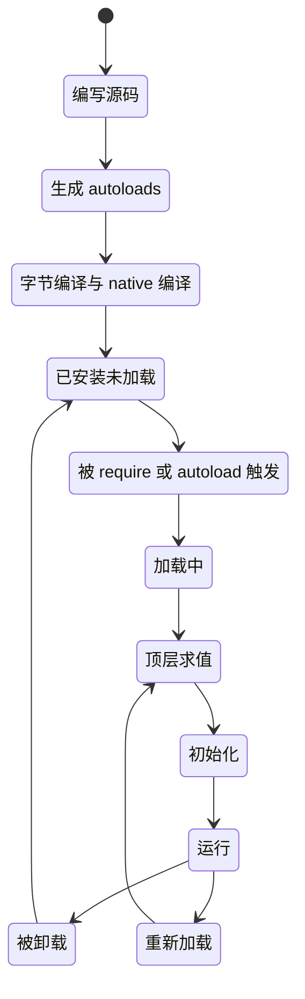
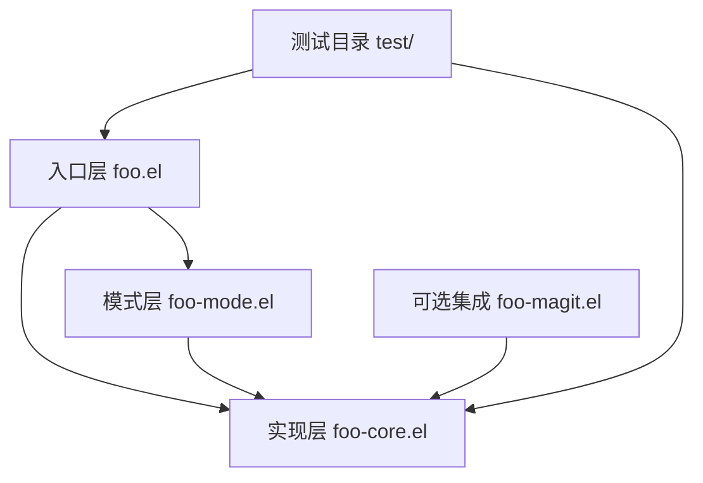

# 插件结构与生命周期

> 把一堆能跑的 Elisp 片段整理成一个能被别人安装、加载、升级和卸载的包，中间隔着文件头规范、autoload 生成、加载时机与目录结构这几道关卡。本篇逐道讲清楚，并给出一个可以直接运行的最小包。

---

## 一、先决定包的形态

Emacs 的「包（package）」在物理上就是若干 `.el` 文件加一份元数据。元数据来自文件头注释，不需要额外写配置文件。决定形态的依据只有一个：这份功能有多少代码、有多少可选的依赖。

### 1.1 单文件包

所有代码放在一个 `foo.el` 里。适合的场景：

- 代码量在一千行以内，一个文件读得完。
- 只有一两个命令、一两个 minor mode（次要模式，即可以和其他模式同时生效的开关式模式）。
- 不依赖可选功能。可选依赖意味着要延迟加载子模块，而单文件包没有子模块可延迟。
- 想让用户用 `M-x package-install-file` 直接装一个 `.el` 文件，或者干脆让用户把文件拖进配置目录。

单文件包的典型样板是 Emacs 自带的 `subr-x.el`、`thingatpt.el` 这类库，以及 MELPA 上大量的工具型包。

### 1.2 多文件包

代码拆成多个 `.el`，其中有一个「主库（main library）」承载文件头与 `provide`。适合的场景：

- 代码超过一千行，或者明显分成几个职责块。
- 有可选依赖：比如核心功能不依赖 `magit`，但有一个命令要在 Magit 里用，那就把 Magit 相关的放进 `foo-magit.el`，只有用户装了 Magit 才加载。
- 需要把「面向用户的门面」和「内部实现」分开，方便测试直接针对内部函数。
- 需要打包额外的数据文件：snippets、语法定义、Info 手册。

### 1.3 对比

| 维度 | 单文件包 | 多文件包 |
| --- | --- | --- |
| 文件数 | 1 个 `.el` | 主库 + `foo-core.el` + `foo-mode.el` 等 |
| 适合代码量 | 一千行以内 | 一千行以上 |
| 可选依赖 | 难以优雅处理，通常直接写进 `Package-Requires` | 放进子文件，用 `require` 隔离 |
| autoload 生成 | 简单，一个文件的 cookie | 每个文件都可以放 cookie，主库的 `###autoload` 指向子文件 |
| 测试 | 测试和实现同文件或单独 `foo-test.el` | 测试放 `test/` 目录，MELPA 默认不打包 |
| 首次加载开销 | 一次性加载全部代码 | 主库很轻，重代码按需加载 |
| 发布与版本 | 版本号写在唯一文件头里 | 版本号只写在主库文件头里，子文件不写 |
| 升级风险 | 改动大时用户一次拉全部代码 | 子文件可以独立演化，但要注意依赖方向 |
| 用户安装体验 | 可以把单个 `.el` 拷进配置目录 | 必须走包管理器或整目录放进 `load-path` |

判断方法很直接：如果发现自己要在文件里写「这一段是给谁用的、那一段是给谁用的」这种分区注释，就该拆文件了。

---

## 二、一个包的完整生命周期

从写第一行源码到用户按下 `M-x unload-feature`，一个包要经过下面这些阶段。这里的「加载」和「编译」不是一回事：编译产出 `.elc` 或 `.eln`，加载才真正执行代码。



### 2.1 编写源码

写 `.el` 文件，按下面第三节的规范写文件头，在需要用户直接调用的函数上放 `;;;###autoload` 注释。

### 2.2 生成 autoloads

把文件里所有带 cookie 的函数抽取成一份 `foo-autoloads.el`，内容是若干 `(autoload "函数名" "文件" "文档" 交互性)` 形式。用户在配置文件里 `(require 'foo)` 之前，`M-x foo-command` 就已经能被 `M-x` 补全到，因为这份文件在包安装时被自动加载了。

### 2.3 字节编译与 native 编译

字节编译把 `.el` 变成 `.elc`；Emacs 28 起的 native 编译（原生编译，把 Elisp 编译成机器码）再把 `.elc` 变成 `.eln`，放在用户缓存目录里，不污染包的安装目录。Emacs 30 默认开启 `native-compile-prune-cache` 相关的清理策略，编译产物由 Emacs 自己管理。

编译不改变语义，但会暴露大量问题：函数未定义、参数数量不对、变量引用自由（free variable）、过时 API。发布前必须做到字节编译零警告，理由在第四篇展开。

### 2.4 被 require 或 autoload 触发

两种入口：

- 显式加载：`(require 'foo)`，立刻读取并求值整个特性。
- 隐式加载：用户调用一个 autoload 过的命令，或者某个 hook 触发了一个 autoload 过的函数，Emacs 才去 `load` 对应文件。

### 2.5 加载中与顶层求值

`load` 会从上到下求值文件里的每个顶层形式：`defgroup`、`defcustom`、`defface`、`defvar`、`defun`、`define-minor-mode`、`define-derived-mode`、`add-to-list`。这个阶段应当只做「定义」，不做「副作用」。在顶层打开一个网络连接、启动一个 timer、修改用户的 `auto-mode-alist` 之外的全局状态，都会在用户每次重新加载时重复执行。

### 2.6 初始化与运行

`provide` 执行后特性进入 `features` 列表，其他文件才能 `require` 到它。此后包处于运行态：用户开开关关 minor mode、调用命令、hook 被触发。

### 2.7 卸载

`M-x unload-feature RET foo RET` 会把 `foo` 定义的函数、变量、face 从符号定义中抹掉。需要注意的是：

- `unload-feature` 只会撤销「定义」，不会撤销「效果」。已经绑定的键、已经加进 hook 的函数、已经创建的 buffer-local 变量，需要包自己清理。
- 因为这一点，Emacs 提供了 `unload-function` 约定：如果一个包导出了名为 `foo-unload-function` 的函数，`unload-feature` 会先调用它，返回值非 nil 表示「我已经处理了，不要再按默认方式卸载」。这是包作者负责清理副作用的正式接口。
- 卸载是有损的：`remove-hook` 之后原来的 hook 顺序不一定恢复。所以正常用户的日常操作是重启 Emacs，而不是反复卸载。

### 2.8 重新加载

开发时用 `M-x eval-buffer` 或 `M-x load-file` 重新执行整个文件。这时会踩到重复注册的坑：`add-to-list` 是幂等的，但 `add-hook` 用 lambda 就不幂等，`define-key` 是幂等的。第六节的 `with-eval-after-load` 和第五节的 `add-to-list` 选择都与此相关。

---

## 三、文件头字段逐个详解

一个符合 Emacs 约定和 `package.el` 解析要求的文件头长这样：

```elisp
;;; foo.el --- Short summary of what foo does  -*- lexical-binding: t; -*-

;; Copyright (C) 2025  Your Name

;; Author: Your Name <you@example.com>
;; Maintainer: Your Name <you@example.com>
;; Version: 0.1.0
;; Package-Requires: ((emacs "29.1"))
;; Keywords: convenience, tools
;; URL: https://example.com/foo

;; This file is not part of GNU Emacs.

;;; Commentary:

;; Longer description of the package.  This text is shown by
;; `M-x package-describe' and is indexed by the package archives.

;;; Code:

;; ... 真正的代码 ...

(provide 'foo)
;;; foo.el ends here
```

下面逐字段说明「给谁看」和「缺了会怎样」。

### 3.1 第一行 `;;; foo.el --- 摘要`

**格式**：三个分号、空格、文件名（含 `.el`）、空格、三个连字符、空格、摘要。摘要一行写完，不要换行，不要以句号结尾。

**给谁看**：`package.el` 解析器、包归档的索引生成器、`M-x package-list-packages` 里显示的那一列描述。

**缺了会怎样**：`package.el` 找不到合法的第一行时，包会在 `M-x package-install-file` 时报「Package lacks a file header」之类的错误，或者在列表里显示空描述。MELPA 的 recipe 构建会直接失败。

### 3.2 `-*- lexical-binding: t; -*-`

**格式**：必须与第一行的摘要写在同一行，形如 `-*- lexical-binding: t; -*-`。这不是注释，是 Emacs 认识的「文件局部变量（file local variable）」标记，Emacs 在读取文件时会先扫描第一行。

**给谁看**：Emacs 的 `load` 与字节编译器。它决定函数体默认是词法作用域还是动态作用域。

**缺了会怎样**：文件按动态作用域编译。闭包会失效，`let` 绑定的变量可能被内层函数意外看见或看不见，字节编译器会给出 `Warning: Lexical argument shadows the dynamic variable` 之外的、更难懂的一系列警告。Emacs 30 会在加载缺少该标记的文件时提示，并在字节编译时给出明确警告。新的包一律加。

**与 Emacs 29 的关系**：这条要求在 29 和 30 上完全一致，没有差异。

### 3.3 `Author` 与 `Maintainer`

**格式**：`;; Author: 名字 <邮箱>`，多人用逗号分隔。`Maintainer` 可省略，省略时归档工具默认用 `Author`。

**给谁看**：用户遇到问题时的联系人；MELPA 审核时用来确认提交者是不是作者本人（不是作者本人提交需要先通知原作者）。

**缺了会怎样**：`package-lint` 会报警告（级别低于错误），MELPA 审核会要求补上。没有联系方式的包在社区里被认为不可维护。

### 3.4 `Version`

**格式**：`;; Version: 主版本.次版本.修订号`，例如 `0.1.0`。必须是 `version-to-list` 能解析的字符串。

**给谁看**：MELPA Stable（稳定频道）用它给包打版本号；`M-x package-list-packages` 用它判断是否有新版本。

**缺了会怎样**：在 MELPA 上，如果你的包是单文件包且没有打 tag，MELPA 会用「日期 + 提交计数」生成版本号，仍能发布；但 `package-vc-install` 的 `:last-release`（即交互式的前缀参数）功能会失效，因为它靠 `Version` 头的变化来找最近一次发布。MELPA Stable 完全依赖它。

**多文件包**：版本号只写在主库文件头里。子文件不写 `Version`，写了只会让归档工具困惑。

### 3.5 `Package-Requires`

**格式**：一个 alist，元素是 `(包名 "版本字符串")`，例如：

```elisp
;; Package-Requires: ((emacs "29.1") (dash "2.19") (seq "2.24"))
```

`emacs` 这一项写的是 Emacs 版本，`package.el` 用它做安装前检查。第三方包必须写它在 MELPA 或 GNU ELPA 上的真实包名与最低版本。

**给谁看**：`package.el` 的安装器。它会递归安装依赖，并在版本不满足时拒绝安装。

**缺了会怎样**：只写了功能而没写依赖，用户的 Emacs 里没有 `dash`，加载时直接 `Cannot open load file: No such file or directory, dash`。这是被 MELPA 拒绝最常见的原因之一。

**版本写多少**：写「你实际用到的最早版本」。用了 Emacs 30 才有的 `treesit-thing-settings`，就写 `((emacs "30.1"))`；只用 `treesit`（29 起内置）就写 `((emacs "29.1"))`。写高一档会让老用户装不上，写低一档会让老用户装上后报错。

### 3.6 `Keywords`

**格式**：`;; Keywords: 关键词1, 关键词2`。取值来自 `finder-known-keywords` 这个列表，常见的有 `lisp`、`tools`、`convenience`、`languages`、`files`、`comm`、`wp`、`data`、`processes`、`maint`。

**给谁看**：`M-x finder-by-keyword`，以及包浏览界面的分类。MELPA 网页上也用类似分类。

**缺了会怎样**：包仍然能安装和运行，但用户在 `finder` 里找不到它。`package-lint` 会对未知关键词给出提示。

### 3.7 `URL`

**格式**：`;; URL: https://example.com/foo`，指向仓库主页或项目页面。

**给谁看**：用户想报 bug 或看文档时；`M-x package-list-packages` 里可以用 `RET` 跳到包描述，其中会显示这个地址。

**缺了会怎样**：不影响安装。但 MELPA 从 recipe 里能推出 `:repo`，所以对 MELPA 用户影响小；对手工分发的 `.el` 文件影响较大。

### 3.8 `;;; Commentary:` 与 `;;; Code:`

这两个不是普通注释，是分隔标记，解析器按它们切分文件。

`;;; Commentary:` 之后的整段文字是包的长描述。它会出现在 `M-x package-describe`（实际入口是 `M-x describe-package`）的说明里。这里写清楚：包解决什么问题、安装后要做什么配置、最小的用法示例、有什么已知限制。

`;;; Code:` 标记代码开始。Emacs 的 `checkdoc` 和 `package-lint` 都要求 `;;; Code:` 存在，因为它告诉工具「从这里往下是代码，上面是文档」。第二行的 `lexical-binding` cookie 之后、`;;; Commentary:` 之前的区域用来放版权声明和许可证。

**缺了会怎样**：`checkdoc` 会报 `You should have a section marked ";;; Code:"`。手工加载不受影响。

### 3.9 文件尾 `(provide 'foo)` 与 `;;; foo.el ends here`

`(provide 'foo)` 把 `foo` 放进 `features`，这是其他文件 `(require 'foo)` 能成功的前提。特性名必须和文件名去掉 `.el` 后的部分一致，否则 `require` 会重新加载文件，形成无限循环。

`;;; foo.el ends here` 是约定俗成的结尾标记，它让 `checkdoc` 和人工审阅都能确认文件没有被截断。`checkdoc` 会检查它。

**缺了会怎样**：没有 `provide`，`require` 拿不到特性，每次都会重新求值文件，并在 `features` 里找不到 `foo`，导致 `with-eval-after-load 'foo` 永远不触发。

---

## 四、`;;;###autoload` 魔法注释

### 4.1 什么东西能加 cookie

Cookie 只有三种写法，全部真实存在：

- `;;;###autoload` — 通用，放在 `defun`、`defmacro`、`define-minor-mode`、`define-derived-mode`、`defcustom`（较少用）之前。
- `;;;###autoload` 与 `;;;###` 是同一个东西；`;;;###` 后面可以直接跟一小段被复制的代码，例如变量赋值。
- `;;;###theme-autoload` — 主题专用，Emacs 29 起支持。

不存在 `###_autoload` 这种写法。网上偶尔见到的类似拼写都是笔误。

### 4.2 位置规则

cookie 必须写在目标形式的**上一行**，紧贴，中间不能有空行，也不能有别的注释。对于跨多行的形式，cookie 要在开括号那一行的上一行：

```elisp
;;;###autoload
(defun foo-do-something (arg)
  "Do something with ARG."
  (interactive "p")
  (message "%s" arg))
```

把 cookie 写在 `defun` 和 docstring 之间是无效的，解析器只看顶层形式之前的那一行。曾经有一段时间，写在顶层形式内部的 cookie 会被忽略；Emacs 29 起改为按正常方式解析，但把 cookie 写进 `when` 之类的嵌套位置仍然不是好做法。

### 4.3 生成 autoload 文件

这里的工具链在 Emacs 29 上换过一次，必须说清楚。

**旧方式（已废弃）**：`autoload.el` 提供的 `M-x update-file-autoloads`、`M-x update-directory-autoloads`。`autoload.el` 从 Emacs 29.1 起被标记为过时，文件被移到了 `lisp/obsolete/`，Emacs 30 里仍在但会打印废弃提示。Emacs 29 的 NEWS 明确说：由于 loaddefs 的语法变了，`M-x update-file-autoloads` 不再能正常工作，在文件里调用会直接报错。

**新方式（Emacs 29 起）**：`loaddefs-gen.el` 提供的 `loaddefs-generate` 与 `make-directory-autoloads`。

- `loaddefs-generate` 是 Lisp 函数，**不是交互式命令**，`(commandp #'loaddefs-generate)` 返回 nil，所以不存在 `M-x loaddefs-generate`。它要手写调用：

```elisp
;; 为 /path/to/foo 目录下（不含子目录）的 .el 生成 autoloads
;; 第二个参数是输出文件
(loaddefs-generate "/path/to/foo" "/path/to/foo/foo-autoloads.el")
```

- `make-directory-autoloads` 是交互式命令，内部转调 `loaddefs-generate`，所以可以 `M-x make-directory-autoloads RET 目录 RET 输出文件 RET`。

生成的 `foo-autoloads.el` 内容形如：

```elisp
;;; Generated autoloads from foo.el

(autoload 'foo-do-something "foo"
  "Do something with ARG.

(fn ARG)" t)
```

最后一个 `t` 表示这个函数是交互式命令，`M-x` 里能补全到。

**包安装时谁做这件事**：`package.el` 在安装时调用 `package-generate-autoloads`，把包目录里所有 `.el` 的 cookie 抽成 `foo-autoloads.el` 并写进包的目录，然后把它加进 `load-path` 的自动加载列表。用 `M-x package-install-file` 安装时也一样。所以发布者不需要手工提交 autoloads 文件，MELPA 的 recipe 默认规则也会把它排除在打包之外（`.*.el` 被 `:exclude`）。

### 4.4 开发时如何让 autoload 立刻生效

三种做法，按推荐程度排列。

**做法一：直接加载整个文件。** 开发阶段根本不需要 autoload，autoload 的唯一价值是「不加载就能用」。直接：

```elisp
;; 在 *scratch* 里求值，或 M-x load-file RET /path/to/foo.el RET
(load "/path/to/foo" nil t)
```

**做法二：生成 autoloads 再加载。** 想验证 cookie 位置对不对时用：

```elisp
(loaddefs-generate "/path/to/foo" "/path/to/foo/foo-autoloads.el")
(load "/path/to/foo/foo-autoloads.el")
```

之后 `M-x foo-do-something` 就能用，而且此时 `foo.el` 其实还没加载。按 `C-h f foo-do-something RET`，你会看到它是 autoload 状态，这一点是验证 cookie 是否生效的直接证据。

**做法三：用脚手架工具。** `eldev` 和 `eask` 都有「准备开发环境」的子命令，会替你生成 autoloads 并把目录加进 `load-path`，细节见第九节。

### 4.5 `:commands`、`:bind`、`:hook` 为什么能延迟加载

`use-package` 的这三个关键字都不是魔法，它们做的是同一件事：把「首次使用」注册成一个触发点，触发时先 `require` 包，再做原来要做的事。

- `:commands (foo-do-something)` — 展开为 `(autoload #'foo-do-something "foo" nil t)`。注意这里是 `use-package` 自己调用 `autoload` 函数，因此即使用户是从源码目录加载、没有生成过 autoloads 文件，也能生效。
- `:bind ("C-c f" . foo-do-something)` — 展开为在 `foo-mode-map` 上 `define-key`，再把整个 `define-key` 包进一个 autoload 触发的闭包；第一次按 `C-c f` 时加载包，然后重新解析键位。
- `:hook (foo-mode . my-setup)` — `add-hook` 到 `foo-mode-hook`，作为「加载后执行」的标记。真正的机制是：`use-package` 把 `my-setup` 加进 `foo-mode-hook` 的时候顺手 `(autoload #'foo-mode "foo")`，于是第一次进 `foo-mode` 时文件被加载，hook 自然运行。

由此可以推出一个结论：`use-package` 的延迟加载只对「文件里已经定义了的东西」有效。你的包如果只在文件顶层 `(add-to-list 'auto-mode-alist ...)`，那这段代码在加载前不会运行，用户打开 `.myconf` 文件时不会自动进入你的模式。要解决这个问题，就把这行 `add-to-list` 也加上 `;;;###autoload` cookie，或者用 `;;;###autoload` 形式的 `(add-to-list ...)`。

---

## 五、多文件包的结构与依赖方向

依赖方向必须单向，否则会出循环 `require`，表现为「加载到一半特性还没 provide，另一半又回来 require」。



规则：

- 入口层 `foo.el` 是唯一写完整文件头（含 `Version`、`Package-Requires`）的文件，也是唯一 `(provide 'foo)` 的主库。
- 实现层 `foo-core.el` 不 `require` 入口层，只 `(provide 'foo-core)`。
- 模式层 `foo-mode.el` 可以 `require` 实现层，不能 `require` 入口层。
- 可选集成层只被用户显式 `require`，入口层不主动加载它。
- 测试文件放 `test/` 目录，且**不要** `provide` 任何特性，避免被当成包的一部分。

入口层的组织示例：

```elisp
;;; foo.el --- Example multi-file package  -*- lexical-binding: t; -*-
;; ... 文件头省略 ...
;;; Commentary:
;; ...
;;; Code:

(require 'foo-core)

(defgroup foo nil
  "Example package."
  :group 'convenience
  :prefix "foo-")

;;;###autoload
(defun foo-run ()
  "Run the example."
  (interactive)
  (foo-core--do-work))

;;;###autoload
(autoload 'foo-mode "foo-mode" "Toggle Foo mode." t)

(provide 'foo)
;;; foo.el ends here
```

最后那段 `(autoload 'foo-mode "foo-mode" ...)` 是手动写 autoload 的标准做法：它把用户对 `foo-mode` 的第一印象指向子文件，从而避免入口层加载时就把整个模式文件拖进来。它本身也加了 cookie，所以会被抽进 `foo-autoloads.el`。

子文件 `foo-mode.el` 结尾写 `(provide 'foo-mode)`，文件头可以只留一行摘要加 `lexical-binding` cookie，`Version` 和 `Package-Requires` 留给主库。

---

## 六、加载时机与 `with-eval-after-load`

### 6.1 正确用法

`with-eval-after-load` 是宏，形式是 `(with-eval-after-load FEATURE BODY...)`。它在 `FEATURE` 被加载后执行 `BODY`；如果 `FEATURE` 已经加载过了，`BODY` 立即执行。这正是「用户可能还没装这个包」时唯一安全的挂接方式。

```elisp
;; 只有 magit 真的被加载了才改它的变量
(with-eval-after-load 'magit
  (setq magit-display-buffer-function
        #'magit-display-buffer-same-window-except-diff-v1))
```

正确用法的三条判据：

1. 目标特性是可选依赖，用户可能没装。用 `with-eval-after-load` 而不是 `require`，这样用户没装时配置不会报错。
2. 要修改的变量是 `defcustom`，且只在目标包加载后才存在。提前 `setq` 会在目标包加载时被它的 `defcustom` 覆盖。
3. 要做的是「配置」而不是「调用」。如果目标包提供了专门的 hook 变量（例如 `magit-mode-hook`），优先用 hook。

### 6.2 滥用警告

- **不要用它包住本来可以直接写的东西。** 对内置特性（`seq`、`project` 这些始终存在的）套一层 `with-eval-after-load` 只是增加阅读负担。
- **不要在 `BODY` 里 `require` 同一个特性。** `(with-eval-after-load 'foo (require 'foo))` 是循环论证，虽然不会死循环但语义混乱。
- **`eval-after-load` 已过时。** 老代码里的 `(eval-after-load "foo" '(progn ...))` 形式需要引号，容易漏；`with-eval-after-load` 是宏，函数体不需要引号，也不会被字节编译器抱怨。新代码一律用后者。
- **不要靠它做初始化顺序控制。** 如果一个包必须在本包之前加载，正确做法是把它写进 `Package-Requires` 然后直接 `require`，而不是靠 `with-eval-after-load` 制造一种隐式的顺序。
- **重复加载会重复执行。** `with-eval-after-load` 的 `BODY` 在每次该特性被重新加载时都会再跑一次（Emacs 30 的行为是钩在 `after-load-functions` 上）。`BODY` 里做 `add-hook` 时要保证幂等。

---

## 七、`define-package` 与包元数据

### 7.1 `foo-pkg.el` 是什么

`package.el` 安装一个多文件包后，会在包目录里生成 `foo-VERSION/foo-pkg.el`，内容是一个 `define-package` 调用：

```elisp
(define-package "foo" "0.1.0"
  "Short summary of what foo does"
  '((emacs "29.1") (dash "2.19"))
  :keywords '("convenience")
  :url "https://example.com/foo")
```

`define-package` 的参数是 `(NAME-STRING VERSION-STRING &optional DOCSTRING REQUIREMENTS &rest EXTRA-PROPERTIES)`，其中 `REQUIREMENTS` 是 `(包名 版本字符串)` 的列表，`EXTRA-PROPERTIES` 可以带 `:keywords`、`:url`、`:maintainer`、`:authors` 等。

`package.el` 加载这个文件后得到一个 `package-desc` 结构，用 `package-desc-name`、`package-desc-version`、`package-desc-summary`、`package-desc-reqs` 等访问器读取。`M-x package-list-packages` 列表里的每一行背后就是这样一个结构。

### 7.2 手写 `foo-pkg.el` 是旧做法

早期的包会把 `foo-pkg.el` 提交进版本库。现在不要这么做，原因有三条：

1. 版本号会出现两份，文件头和 `pkg` 文件里的版本很可能不一致。
2. MELPA、GNU ELPA、NonGNU ELPA 都从主库文件头重新生成它，提交进去的文件会被忽略甚至造成构建差异。
3. MELPA 的 README 明确写着：`NAME-pkg.el` 不应被纳入版本控制，它由主库的元数据生成。

所以：**你只需要写好 `foo.el` 的文件头，`pkg` 文件交给工具生成。**

---

## 八、本地开发环境搭建

### 8.1 三条可以立刻用的命令

**命令一：临时加 `load-path` 后加载，不碰用户配置。**

```bash
$ emacs -Q --batch -L /path/to/foo -l foo.el --eval '(foo-do-something 42)'
```

`-Q` 表示不读任何用户配置、不加载 site 文件；`--batch` 表示不进交互界面、跑完就退出（不加它，Emacs 会启动图形界面并停在命令循环里，看起来像卡住）；`-L` 把目录加进 `load-path`；`-l` 加载文件。这是验证「包在没有用户配置的干净环境里能不能用」的标准手段，也是排查「在我机器上好好的」类问题的第一招。

**命令二：生成 autoloads 并一次性验证 cookie 位置。**

```bash
$ emacs -Q --batch --eval '(progn (require (quote loaddefs))
                                  (loaddefs-generate "/path/to/foo"
                                                     "/path/to/foo/foo-autoloads.el"))'
```

跑完后打开生成的 `foo-autoloads.el`，检查每个你期望出现在 `M-x` 里的命令都在里面。缺了就说明 cookie 位置不对。

**命令三：字节编译并要求零警告。**

```bash
$ emacs -Q --batch -L /path/to/foo -f batch-byte-compile /path/to/foo/foo.el
```

任何输出都应当被当作待修问题处理。`batch-byte-compile` 在警告时不会让命令返回非零状态，所以在 CI 里要配合 `-Werror` 之类的检查，或者把输出抓下来判断是否为空。

### 8.2 把开发目录常驻 `load-path`

交互式开发时，在 `init.el` 里加：

```elisp
;; 把开发目录放在 load-path 最前面，保证优先于已安装的同名版本
(add-to-list 'load-path "~/src/foo")
```

`add-to-list` 默认把新元素放在最前面，这正是我们要的：开发版本优先。之后用 `M-x load-library RET foo RET` 或 `M-x load-file` 反复重载。

如果开发目录需要在每次打开任意外部文件时都能找到，可以在该目录里放一个 `.dir-locals.el`：

```elisp
;; ~/src/foo/.dir-locals.el
((emacs-lisp-mode . ((eval . (add-to-list 'load-path default-directory)))))
```

这样打开该目录下的 `.el` 文件时，`default-directory` 自动进入 `load-path`。注意 `eval` 形式会触发一次确认提示，属于正常的 Emacs 安全机制。

### 8.3 用 `use-package` 的 `:load-path`

`use-package` 的 `:load-path` 展开为 `(eval-and-compile (add-to-list 'load-path ...))`，语义就是在加载配置阶段把目录加进 `load-path`：

```elisp
(use-package foo
  :load-path "~/src/foo"
  :commands (foo-do-something))
```

注意 `:load-path` 里的路径是相对于 `user-emacs-directory` 解析的，也可以用绝对路径。这一条在 Emacs 29 起内置的 `use-package` 上完全一致。

### 8.4 用 straight.el 的 `:local-repo`

straight.el 用 `:local-repo` 指向本地检出目录，此时它不去克隆远端，直接用这个目录做构建：

```elisp
(use-package foo
  :straight (foo :type git :local-repo "~/src/foo" :host nil)
  :commands (foo-do-something))
```

开发时改完源码，`M-x straight-rebuild-package RET foo RET` 重新构建。

elpaca 是同类工具，用 `use-package` 的 `:ensure` 集成后安装。它的 recipe 写法以其手册为准，这里不复述容易记错的细节。

### 8.5 用 `package-install-file` 打包安装

`M-x package-install-file` 的文档只说了三件事：接受 tar 文件、`.el` 文件或目录。这是**最接近真实用户安装路径**的本地测试方式：

- 传单个 `.el` 文件：`package.el` 会把它复制进 `elpa/` 并生成 autoloads。
- 传目录：`package.el` 读取目录里的主库文件头，按普通包装进 `elpa/`。
- 传 `.tar`：等价于从归档安装。MELPA recipe 构建出来的就是这种 tar。

手工打一个 tar 的写法见第四篇；这里只要记住：**发布前必须至少用这种方式装一次，确认 autoloads、依赖声明和文件名都对**。

---

## 九、脚手架工具对比与最小 `Makefile`

### 9.1 三个工具的定位

| 工具 | 载体 | 定位 | 适合谁 |
| --- | --- | --- | --- |
| `eask` | Node.js 写的命令行工具（`emacs-eask/cli`） | 面向「我只有 Emacs，不想装 Nix」的人；一条 `eask test ert ./test` 就能在干净环境里跑测试 | 想快速标准化流程、不想读太多文档的人 |
| `eldev` | 纯 Elisp，本质是 `eldev` 脚本 | 功能最全：依赖管理、lint、测试、构建、打包、多版本 Emacs 测试 | 认真做包发布、需要 CI 与本地一致的团队 |
| `cask` | Python 写的命令行工具 | 早期事实标准，定义 `Cask` 文件声明依赖与 `load-path` | 维护老项目时才会遇到 |

三者的共同点是「在隔离环境里准备依赖，然后在指定的 Emacs 上跑命令」。它们的共同缺点是多一层抽象，出错时要先排查工具本身。

### 9.2 不依赖任何工具的最小 `Makefile`

只靠 Emacs 本身也能做出一套够用的流程。下面这份 `Makefile` 的每条命令都用到了前面验证过的真实函数：

```makefile
EMACS ?= emacs
SRC   := foo.el foo-core.el foo-mode.el
TEST  := test/test-foo.el

.PHONY: all autoloads compile test lint clean

all: autoloads compile

## 生成 autoloads（Emacs 29+ 的新接口）
autoloads:
	$(EMACS) -Q --batch --eval \
	  '(progn (require (quote loaddefs)) \
	          (loaddefs-generate "." "foo-autoloads.el"))'

## 字节编译全部源码
compile:
	$(EMACS) -Q --batch -L . -f batch-byte-compile $(SRC)

## 跑 ert 测试，失败时以非零状态退出
test:
	$(EMACS) -Q --batch -L . -L test -l $(TEST) -f ert-run-tests-batch-and-exit

## 文档检查与元数据检查（package-lint 需先装好）
lint:
	$(EMACS) -Q --batch -L . \
	  --eval '(progn (require (quote checkdoc)) (checkdoc-file "foo.el"))'
	$(EMACS) -Q --batch -L . -l package-lint \
	  -f package-lint-batch-and-exit foo.el

clean:
	rm -f *.elc foo-autoloads.el test/*.elc
```

几个细节：

- `ert-run-tests-batch-and-exit` 在测试失败时会让 Emacs 以非零状态退出，所以 `make test` 能直接用在 CI 里。
- `checkdoc-file` 只做报告，不以非零状态退出，需要额外判断输出。
- `package-lint` 的批处理入口是 `package-lint-batch-and-exit`，它从 `command-line-args-left` 取文件名，所以要写在 `-f` 之后。`package-lint` 没有叫 `package-lint-file` 的函数，别照抄网上那种写法。

---

## 十、一个最小但完整的包

下面这 60 行左右是一个可以直接运行、可以被 `package-install-file` 安装的完整包。它演示了文件头、`defgroup`、`defcustom`、`defface`、命令、`provide` 与文件尾。

```elisp
;;; tiny-quote.el --- Insert a random quotation  -*- lexical-binding: t; -*-

;; Copyright (C) 2025  Example Author

;; Author: Example Author <author@example.com>
;; Maintainer: Example Author <author@example.com>
;; Version: 0.1.0
;; Package-Requires: ((emacs "29.1"))
;; Keywords: convenience
;; URL: https://example.com/tiny-quote

;; This file is not part of GNU Emacs.

;;; Commentary:

;; A minimal but complete package.  It defines one customization group,
;; one user option, one face and one interactive command.
;;
;; Usage:
;;
;;   (require 'tiny-quote)
;;   M-x tiny-quote-insert
;;
;; Set `tiny-quote-prefix' to change the text inserted before the quote.

;;; Code:

(defgroup tiny-quote nil
  "Insert a random quotation."
  :group 'convenience
  :prefix "tiny-quote-")

(defface tiny-quote-face
  '((t :inherit font-lock-string-face))
  "Face used for the inserted quotation."
  :group 'tiny-quote)

(defcustom tiny-quote-prefix "> "
  "String inserted before every quotation."
  :type 'string
  :group 'tiny-quote)

(defcustom tiny-quote-list
  '("Simplicity is prerequisite for reliability."
    "Premature optimization is the root of all evil."
    "Make it work, make it right, make it fast.")
  "List of quotations to choose from."
  :type '(repeat string)
  :group 'tiny-quote)

(defun tiny-quote--pick ()
  "Return a random element of `tiny-quote-list'."
  (unless tiny-quote-list
    (user-error "`tiny-quote-list' is empty"))
  (nth (random (length tiny-quote-list)) tiny-quote-list))

;;;###autoload
(defun tiny-quote-insert ()
  "Insert a random quotation at point."
  (interactive)
  (let ((start (point)))
    (insert tiny-quote-prefix (tiny-quote--pick) "\n")
    (let ((ov (make-overlay start (point))))
      (overlay-put ov 'face 'tiny-quote-face)
      (overlay-put ov 'evaporate t))))

(provide 'tiny-quote)
;;; tiny-quote.el ends here
```

### 10.1 立即加载并测试

把上面的内容存成 `/tmp/tiny-quote.el`，然后在 shell 里跑：

```bash
$ emacs -Q -L /tmp -l tiny-quote.el \
    --eval '(with-temp-buffer (tiny-quote-insert) (princ (buffer-string)))'
```

预期输出是 `> ` 加上三条引文中的一条再换行。因为 `random` 每次结果不同，多跑几次能看到不同的引文。

### 10.2 验证 autoload 是否生效

```bash
$ emacs -Q -L /tmp --eval '(progn
    (require (quote loaddefs))
    (loaddefs-generate "/tmp" "/tmp/tiny-quote-autoloads.el")
    (load "/tmp/tiny-quote-autoloads.el")
    (princ (format "loaded tiny-quote? %s\n" (featurep (quote tiny-quote))))
    (princ (format "commandp: %s\n" (commandp (quote tiny-quote-insert)))))'
```

正确结果是 `featurep` 返回 nil 而 `commandp` 返回 `t`。这一对结果恰好证明了 autoload 的核心价值：命令可用，但文件还没被真正加载。

### 10.3 验证可安装性

```bash
$ emacs -Q --batch --eval '(progn
    (require (quote package))
    (package-initialize)
    (package-install-file "/tmp/tiny-quote.el"))'
```

装完后 `M-x package-list-packages` 里应该出现 `tiny-quote`，描述就是文件头第一行的摘要。如果这一步报错，通常是文件头格式或 `Package-Requires` 写法有问题。

---

## 小结

- 包形态先于代码结构：一千行以内、无可选依赖就用单文件；否则用「主库 + 子文件」并保持依赖单向。
- 文件头不是装饰，`package.el`、MELPA、`checkdoc`、`package-lint` 都靠它工作；`lexical-binding` cookie 必须写在第一行，`Version` 只写在主库。
- autoload 工具链在 Emacs 29 换过：`autoload.el` 已过时，用 `loaddefs-generate`（函数）或 `M-x make-directory-autoloads`（命令），不存在 `M-x loaddefs-generate`。

---

## 相关章节

- [[emacs教程/2Elisp语言/10_包与命名空间实践|Elisp 包与命名空间实践]]
- [[emacs教程/2Elisp语言/09_Mode与Hook机制|Elisp Mode 与 Hook 机制]]
- [[emacs教程/1入门/04_包管理与use-package|包管理与 use-package]]
- [[emacs教程/4插件开发/02_编写MinorMode|编写 Minor Mode]]
- [[emacs教程/4插件开发/04_测试打包与发布MELPA|测试、打包与发布 MELPA]]

---

## 参考链接

- Elisp 参考手册 https://www.gnu.org/software/emacs/manual/html_node/elisp/
- Elisp 参考手册单页版 https://www.gnu.org/software/emacs/manual/html_mono/elisp.html
- GNU Emacs 手册 https://www.gnu.org/software/emacs/manual/html_node/emacs/
- Emacs 源码镜像（可查 `loaddefs-gen.el`、`package.el` 的实现）https://github.com/emacs-mirror/emacs
- MELPA https://melpa.org/
- GNU ELPA https://elpa.gnu.org/
- MELPA 主仓库与 recipe 说明 https://github.com/melpa/melpa
- `package-build`（MELPA 的构建工具）https://github.com/melpa/package-build
- 插件开发手册 https://github.com/alphapapa/emacs-package-dev-handbook
- use-package https://github.com/jwiegley/use-package
- straight.el https://github.com/radian-software/straight.el
- elpaca https://github.com/progfolio/elpaca
- eldev https://github.com/emacs-eldev/eldev
- Eask 命令行工具 https://github.com/emacs-eask/cli
- cask https://github.com/cask/cask
- Emacs 中文社区论坛 https://emacs-china.org/
