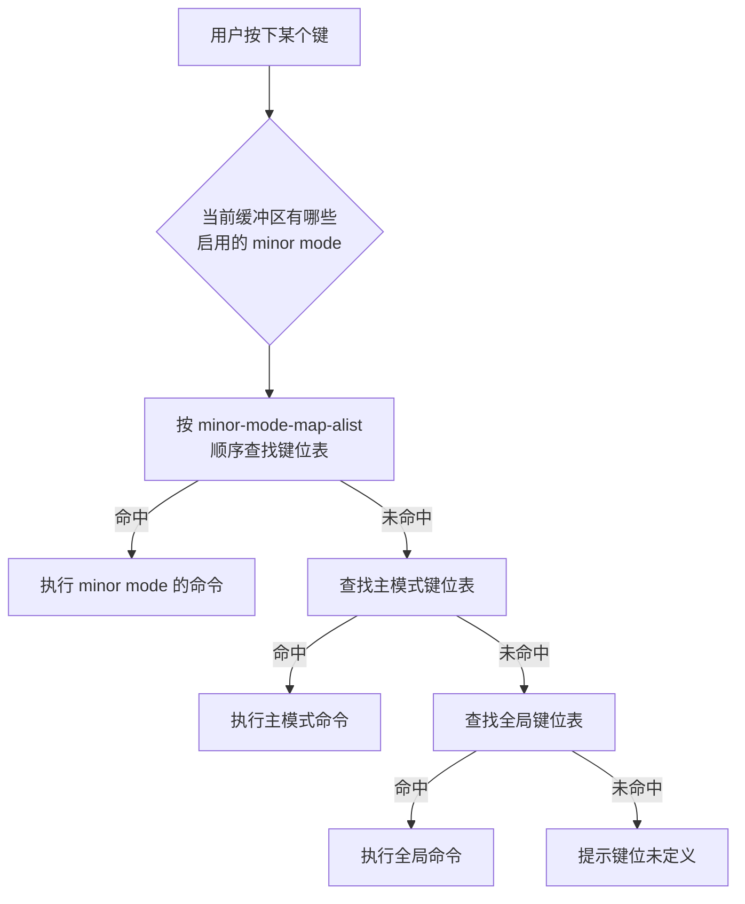
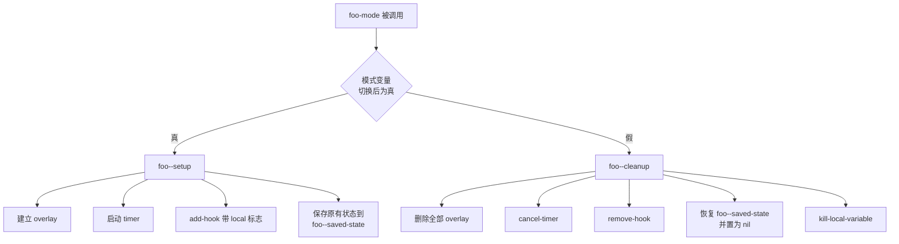

# 编写 Minor Mode

> minor mode（次要模式）是 Emacs 里投入产出比最高的一类扩展：几十行代码就能给所有主模式加一层增强，开关一次就干净地生效或失效。本篇把 `define-minor-mode` 的关键字讲透，并给出三个能直接用的完整实现。

---

## 一、先搞清楚 minor mode 的定位

### 1.1 概念

Emacs 的模式分两层：

- **major mode（主模式）**：每个缓冲区（buffer）有且只有一个，决定这个缓冲区「是什么语言/什么类型的文件」，负责语法表、缩进、font-lock 高亮、imenu。进入新主模式会重建这些设施。
- **minor mode（次要模式）**：一个缓冲区可以同时开任意多个，只在前一层基础上叠加行为。它不重建语法表，不替换主模式的键位表，而是以「附加层」的身份参与。

一个 buffer 的键位查找顺序是：先看当前启用的所有 minor mode 的键位表，再落到 major mode 的键位表，最后才是全局键位表。这个顺序决定了 minor mode 的定位：**只覆盖你真正需要覆盖的键，其余全部透传**。

### 1.2 什么时候该写 minor mode

适合写 minor mode 的情形：

- 给现有主模式增加一种编辑辅助：显示某种标记、自动保存、只读浏览、拼写检查、行号、对齐提示。
- 功能需要用户随时开关，且开关应当只影响当前类型的缓冲区。
- 功能要在多种主模式下生效，但不想为每种主模式各写一个 major mode。
- 功能是「跨语言的」：比如把 `TODO` 高亮得显眼一点，这在任何 prog-mode 派生模式里都说得通。

不适合写 minor mode 的情形：

- 你要定义一种新语言或新文件格式的编辑方式。这是 major mode 的职责，见 [[emacs教程/4插件开发/03_编写MajorMode与语法高亮|编写 Major Mode 与语法高亮]]。
- 你要做的只是改一个变量。直接 `setq` 或用 `add-hook` 比造一个模式简单。
- 你要提供一组命令而不要开关状态。那就只写命令和键位表，不需要 minor mode。

### 1.3 minor mode 与主模式的协作结构



这张图里有一条容易忽略的约束：minor mode 的键位表只有在该模式变量为真时才会进入查找链。也就是说，`define-minor-mode` 生成的模式变量与 `minor-mode-map-alist` 是联动的，你不需要自己维护。

---

## 二、`define-minor-mode` 的完整关键字

基本形式：

```elisp
;;;###autoload
(define-minor-mode foo-mode
  "Toggle Foo mode in the current buffer.

When Foo mode is on, ..."
  :lighter " Foo"
  :keymap foo-mode-map
  :group 'foo
  (if foo-mode
      (foo--enable)
    (foo--disable)))
```

文档字符串之后是可选的「关键字 值」对，最后是 body。`define-minor-mode` 的文档明确要求：**如果你提供了 body，就必须至少提供一个关键字参数**（哪怕只是 `:lighter nil`）。这是很多人第一次写时踩的坑。

### 2.1 `:lighter`

mode line（模式行）上显示的一段文字。三种取值：

- 字符串，例如 `" Foo"`。前导空格是惯例，让多个 lighter 之间自然分开。
- `nil`，表示不在 mode line 上显示。
- `(:eval FORM)`，在 mode line 每次重绘时求值 `FORM`，用返回值作为显示文本。适合显示动态信息：

```elisp
(defvar my-count 0)

(define-minor-mode my-count-mode
  "Show a running counter in the mode line."
  :lighter (:eval (format " [%d]" my-count)))
```

**取舍**：字符串最省事，也是绝大多数包的选择。`(:eval ...)` 会让 mode line 每次重绘都执行一次 `FORM`，如果 `FORM` 里做了字符串拼接、访问文件系统或调用外部进程，就会拖慢整个界面。真的需要动态显示时，优先更新一个变量，`FORM` 里只做格式化。

### 2.2 `:keymap`

指定模式使用的键位表。文档规定：值应当是一个**未加引号的变量名**（它的值是一个键位表），或者一个求值后得到键位表或 `(KEY . BINDING)` 列表的表达式。

```elisp
(defvar foo-mode-map
  (let ((map (make-sparse-keymap)))
    (define-key map (kbd "C-c t") #'foo-toggle-thing)
    map)
  "Keymap for `foo-mode'.")

(define-minor-mode foo-mode
  "Toggle Foo mode."
  :lighter " Foo"
  :keymap foo-mode-map)
```

如果 `:keymap` 的值不是一个符号，`define-minor-mode` 会**自动定义** `MODE-map` 这个变量并赋值为该键位表：

```elisp
;; 这一版不预先定义 foo-mode-map，宏会替你创建它
(define-minor-mode foo-mode
  "Toggle Foo mode."
  :lighter " Foo"
  :keymap (let ((map (make-sparse-keymap)))
            (define-key map (kbd "C-c t") #'foo-toggle-thing)
            map))
```

`define-minor-mode` 还会给键位表的父表加上 `easy-mmode-define-keymap` 相关的 `:menu-item`，从而在菜单栏生成一个同名开关项。这是自动的，不需要你写。

**命名约定**：键位表变量必须叫 `模式名-map`，`define-minor-mode` 默认就去找这个名字。写成别的名字又不在 `:keymap` 里指明，键位表不会被启用。

### 2.3 `:init-value`

模式变量的初始值。默认是 `nil`，即模式默认关闭。

文档特别强调了一点：`define-minor-mode` **不会**因为 `:init-value` 非 nil 就去调用模式函数，这个值只是「反映」模式的自然初始状态，而不是「设置」它。所以 `:init-value t` 意味着「新建的缓冲区里这个变量一开始就是 t」，但开启时应做的初始化动作并没有执行。

**绝大多数情况下它应当是 nil。** 需要一个默认开启的全局模式时，正确做法是让模式默认关闭，然后在配置里显式打开，或者用 `define-globalized-minor-mode` 配合 `:predicate`。

### 2.4 `:global`

非 nil 表示这是全局 minor mode：模式变量不是 buffer-local，一次开关影响所有缓冲区。

```elisp
(define-minor-mode foo-global-mode
  "Toggle Foo everywhere."
  :global t
  :lighter nil
  :group 'foo
  (if foo-global-mode
      (foo-global--enable)
    (foo-global--disable)))
```

只有一个共享状态、且这个状态天然是全局的（例如「是否显示行号」这种显示层开关），才用 `:global t`。

### 2.5 `:group`

指定自定义组（customization group），让 `M-x customize-group RET foo RET` 能列出这个模式，并让 `M-x customize-mode` 找到它。省略时 `define-minor-mode` 会尝试推断，推断不出来会让 `package-lint` 报警告。显式写上最省心。

### 2.6 `:variable`

把模式状态存到别的变量里，而不是 `MODE` 本身。两种形式：

```elisp
;; 形式一：换一个普通变量名
(defvar my-widget-state nil)
(define-minor-mode my-widget-mode
  "Toggle the widget."
  :lighter " W"
  :variable my-widget-state)

;; 形式二：(GET . SET)，用广义变量（generalized variable）
(define-minor-mode my-buffer-flag-mode
  "Toggle a flag stored in an overlay."
  :lighter " F"
  :variable ((overlay-get my-ov 'flag)
             . (lambda (val) (overlay-put my-ov 'flag val))))
```

关键后果：**一旦使用 `:variable`，`define-minor-mode` 就不再定义 `MODE` 变量**。上面第一种写法里 `(boundp 'my-widget-mode)` 返回 `nil`，检查方式要相应改成检查 `my-widget-state`。

这个关键字最典型的用途是给内置变量套一层模式外壳：例如让某个模式直接读写 `buffer-read-only`，这样它就不需要自己再维护一份状态。

### 2.7 `:after-hook`

一个单独的 Lisp 形式，在模式 hook 运行完之后求值。注意「不要加引号」——它是一个形式，不是符号。

```elisp
(define-minor-mode foo-mode
  "Toggle Foo mode."
  :lighter " Foo"
  :after-hook (foo-mode--refresh))
```

执行顺序是：切换模式变量 → 执行 body → 运行 `foo-mode-hook` → 执行 `:after-hook`。需要「等所有用户 hook 都改完了再收尾」的逻辑放这里合适。

### 2.8 `:interactive`

默认情况下 `define-minor-mode` 会把模式函数定义成命令，可以 `M-x` 调用。`:interactive nil` 取消这一点。

`:interactive` 的值如果是一个列表，含义是「这个模式只在列出的主模式里有用」。它会影响 `minor-mode-list` 的交互提示以及 `customize-mode` 的展示：

```elisp
(define-minor-mode foo-mode
  "Toggle Foo mode."
  :lighter " Foo"
  :interactive (prog-mode text-mode))
```

### 2.9 body 的执行时机与惯用法

body 在模式变量已经切换之后执行。因此 body 里读到的 `foo-mode` 就是新状态。标准写法是二分支：

```elisp
(define-minor-mode foo-mode
  "Toggle Foo mode."
  :lighter " Foo"
  (if foo-mode
      (progn
        ;; 开启：建立资源
        )
    ;; 关闭：清理资源
    ))
```

比 `(if foo-mode ...)` 更稳妥的写法是 `(cond (foo-mode ...) (t ...))`，因为参数可以是 `'toggle`。不过在 body 执行前 `define-minor-mode` 已经把 `toggle` 解析成了具体的 t 或 nil，所以两者等价，`if` 就够。

**不要在 body 里写 `(interactive)`。** 宏会自己生成交互式规格；模式函数接受一个可选参数 `ARG`，语义是：正数开启、零或负数关闭、`toggle` 切换，`M-x` 调用时用当前前缀参数。

### 2.10 关键字速查

| 关键字 | 取值 | 作用 | 常见误用 |
| --- | --- | --- | --- |
| `:lighter` | 字符串 / nil / `(:eval FORM)` | mode line 显示 | 放重计算进 `(:eval ...)` |
| `:keymap` | 未加引号的键位表变量名或表达式 | 绑定模式键位 | 写了 `'foo-mode-map`（多一个引号） |
| `:init-value` | t / nil | 模式变量的初值 | 以为它会在开缓冲区时执行初始化 |
| `:global` | t / nil | 全局还是 buffer-local | 该用 local 时用了 global |
| `:group` | 符号 | 自定义组 | 省略导致 `package-lint` 提示 |
| `:variable` | 符号 或 `(GET . SET)` | 换状态存储位置 | 用了之后仍去检查 `MODE` 变量 |
| `:after-hook` | 一个形式（不加引号） | hook 之后收尾 | 加了引号导致形式没执行 |
| `:interactive` | t / nil / 主模式列表 | 是否作为命令 | 用 `nil` 后困惑为何 `M-x` 找不到 |

---

## 三、切换、验证与 mode line 显示

### 3.1 怎么开关

- `M-x foo-mode RET`：切换当前缓冲区的状态。
- `C-u M-x foo-mode RET`：前缀参数为正，强制开启。
- `C-u 0 M-x foo-mode RET` 或 `C-u -1 M-x foo-mode RET`：强制关闭。
- 在 Lisp 里 `(foo-mode 1)` 开启、`(foo-mode -1)` 关闭，这是写测试和写 hook 时的标准写法。

开启后 mode line 上会出现 `:lighter` 指定的文字。如果看不到，先确认当前 buffer 确实开了（`C-h v foo-mode RET` 或 `M-: foo-mode RET`）。

### 3.2 用 `C-h m`/`describe-mode` 验证

`M-x describe-mode` 会列出当前所有启用的 minor mode 及其键位。写完之后用这个命令确认三件事：模式出现在列表里、lighter 显示正常、键位表里的绑定被列出来了。

### 3.3 lighter 美化：`diminish`、`delight`、`rich-minority`

mode line 空间有限，装了几十个包以后 lighter 会挤成一团。三个常用方案：

**`diminish`**（GNU ELPA 与 MELPA 都有，`M-x package-install RET diminish RET`）：

```elisp
(use-package diminish
  :ensure t
  :config
  ;; 把 foo-mode 的 lighter 换成 " f"，参数为 nil 表示完全不显示
  (diminish 'foo-mode " f")
  (diminish 'bar-mode))
```

`diminish` 也提供了 `use-package` 的 `:diminish` 关键字，`use-package` 内置支持：

```elisp
(use-package foo
  :diminish foo-mode)
```

**`delight`**（GNU ELPA，`M-x package-install RET delight RET`）做的事类似，但会保留模式在 `minor-mode-alist` 中的条目结构，因此对 `(:eval ...)` 形式的 lighter 支持更好：

```elisp
(use-package delight
  :ensure t
  :config
  (delight 'foo-mode " f" "foo"))
```

**`rich-minority`**（MELPA）走的是另一条路：它不改各个模式的 lighter，而是接管 `minor-mode-alist` 的整体渲染，用一个列表决定「哪些显示、显示成什么、用什么 face」。适合想统一管理所有模式显示的人。

**为什么不要直接改 lighter 字符串**：`define-minor-mode` 生成的 `minor-mode-alist` 条目是一个 cons，直接 `setcdr` 会破坏其他包和用户的假设，而且重新加载你的包之后改动就丢了。用上面三个工具，它们会在正确的时机接管渲染，并且能跟随模式重新定义。

---

## 四、状态管理与清理

这是 minor mode 最容易写错的部分：开启时创建了资源，关闭时忘了清理，用户开关几次以后行为就开始诡异。

### 4.1 需要清理的五类资源

| 资源 | 创建方式 | 清理方式 |
| --- | --- | --- |
| overlay（覆盖层） | `make-overlay` | `delete-overlay`，或对整段调用 `remove-overlays` |
| timer（定时器） | `run-with-idle-timer`、`run-at-time` | `cancel-timer`，注意先判断 `timerp` |
| hook | `add-hook` | `remove-hook`，带 buffer-local 标志时两端要一致 |
| advice（函数增强） | `advice-add` | `advice-remove`，注意 `advice-add` 对同一函数重复添加会叠加 |
| buffer-local 变量 | `setq-local`、`make-local-variable` | `kill-local-variable`，否则值会一直挂在这个 buffer 上 |

### 4.2 统一的清理模式

把「建立」和「清理」各写成一个私有函数，body 里只做二分支派发。这样即使将来加资源，也只改一个地方：



结构写成这样：

```elisp
(defvar-local foo--overlays nil
  "Overlays created by `foo-mode' in this buffer.")

(defvar-local foo--timer nil
  "Timer used by `foo-mode' in this buffer.")

(defun foo--cleanup ()
  "Remove every resource created by `foo-mode'."
  ;; overlay
  (mapc #'delete-overlay foo--overlays)
  (setq foo--overlays nil)
  ;; timer
  (when (timerp foo--timer)
    (cancel-timer foo--timer))
  (setq foo--timer nil)
  ;; hook
  (remove-hook 'after-change-functions #'foo--after-change t)
  ;; buffer-local 变量的清理由调用方决定是否 kill-local-variable
  )

(defun foo--setup ()
  "Create the resources used by `foo-mode'."
  (foo--cleanup)                        ; 幂等：先清一遍再建
  (add-hook 'after-change-functions #'foo--after-change nil t)
  (setq foo--timer (run-with-idle-timer 5 t #'foo--idle-work)))
```

注意 `foo--setup` 的第一行先调用 `foo--cleanup`。这让整个流程幂等：即使用户连续调用两次 `(foo-mode 1)`，也不会创建两套资源。

### 4.3 `unwind-protect` 的用法

当开启过程可能在中途出错时（例如要解析一段用户配置，配置不合法就报错），必须保证已经建立的资源被回滚，否则缓冲区会停在一个半开状态。这时用 `unwind-protect`：

```elisp
(defun foo--setup ()
  "Create resources, rolling back if anything fails."
  (let ((ok nil))
    (unwind-protect
        (progn
          (foo--make-overlays)
          (foo--start-timer)
          (foo--parse-config)          ; 可能抛错
          (setq ok t))
      (unless ok
        (foo--cleanup)))))

;; 前提是 `foo--cleanup' 可以无条件重复调用：
(defun foo--cleanup ()
  "Remove every resource, even if some of them do not exist."
  (mapc #'delete-overlay foo--overlays)
  (setq foo--overlays nil)
  (when (timerp foo--timer)
    (cancel-timer foo--timer))
  (setq foo--timer nil))
```

把「成功标志」放在 `unwind-protect` 的 body 末尾，是这类回滚逻辑最不容易写错的形式：

```elisp
(defun foo--setup ()
  "Create resources; roll back completely if setup fails."
  (let ((ok nil))
    (unwind-protect
        (progn
          (foo--make-overlays)
          (foo--start-timer)
          (setq ok t))
      (unless ok
        (foo--cleanup)))))
```

**但要注意**：如果 body 在 `foo--setup` 里抛错，`define-minor-mode` 生成的模式函数已经把模式变量设成了真。所以在 `define-minor-mode` 的 body 里更稳的写法是：

```elisp
(define-minor-mode foo-mode
  "Toggle Foo mode."
  :lighter " Foo"
  (if foo-mode
      (condition-case err
          (foo--setup)
        (error
         ;; 开启失败：把模式变量改回 nil 再向上报错
         (setq foo-mode nil)
         (signal (car err) (cdr err))))
    (foo--cleanup)))
```

### 4.4 `kill-buffer-hook`

buffer 被杀死时，buffer-local 的 timer 不会自动取消（timer 持有的是函数和状态，不是 buffer）。所以启动 timer 的模式应当同时挂一个清理函数到 `kill-buffer-hook`，并且带 `t` 参数让它只在当前 buffer 生效：

```elisp
(add-hook 'kill-buffer-hook #'foo--cleanup nil t)
```

关闭模式时也要记得 `(remove-hook 'kill-buffer-hook #'foo--cleanup t)`，否则下次开启会重复添加。

---

## 五、buffer-local 与 global 的取舍

### 5.1 差异

| 维度 | buffer-local（默认） | global（`:global t`） |
| --- | --- | --- |
| 模式变量 | 每个 buffer 一份 | 一份全局 |
| 切换效果 | 只影响当前 buffer | 影响所有 buffer，包括将来新建的 |
| mode line lighter | 只在该 buffer 显示 | 所有 buffer 都显示 |
| 典型例子 | 只对某种文件生效的检查器 | `hl-line-mode`（高亮当前行） |
| 实现要点 | 资源放 buffer-local 变量 | 资源放全局变量，注意 hook 是否要带 `t` |

### 5.2 什么时候必须 global

「这个开关描述的是用户的显示偏好，与文件内容无关」时用 global。典型的：

- 显示行号、高亮当前行、显示列号指示器。
- 全局的按键提示层（`which-key-mode` 在 Emacs 30 起内置）。
- 全局的输入法状态指示。

判断依据：如果用户在 A 文件里开了它、切到 B 文件发现没了会感到困惑，那它应该是 global。

### 5.3 什么时候必须 local

「这个开关只在特定缓冲区里才有意义」时用 local。典型的：

- 只在某种主模式下才有意义的检查器或高亮器。
- 需要挂 buffer-local hook 的东西。
- 会修改缓冲区内容的辅助（自动保存、自动格式化）。

判断依据：如果「在 minibuffer 里也开着它」或者「在 `*Messages*` 里也开着它」会出问题，那它必须是 local。

### 5.4 `define-globalized-minor-mode`

当你既想要一个全局开关，又希望实际生效的是 buffer-local 版本时，用 `define-globalized-minor-mode`。它创建一个全局模式 `GLOBAL-MODE` 和一个 buffer-local 模式 `MODE`，并在每个缓冲区里调用 `TURN-ON` 决定是否开启后者。

```elisp
(define-minor-mode foo-local-mode
  "Buffer local part of Foo."
  :lighter " Foo"
  (if foo-local-mode
      (foo--setup)
    (foo--cleanup)))

(defun foo-turn-on ()
  "Enable `foo-local-mode' where it makes sense."
  (when (derived-mode-p 'prog-mode)
    (foo-local-mode 1)))

(define-globalized-minor-mode foo-global-mode
  foo-local-mode foo-turn-on
  :group 'foo)
```

文档里的关键说明：

- `:predicate` 关键字能自动生成一个名为 `MODE-modes` 的用户选项，让用户配置在哪些主模式里开启。它的值可以是 `t`、`nil`、一个主模式列表，或者 `(not MODES...)` 形式的排除列表。
- 全局模式本身「总是全局的」，所以给它传 `:global` 会被忽略。
- 因为「通常把 `:lighter` 和 `:keymap` 传给 buffer-local 的那个模式」，所以给 globalized 模式传这两个关键字一般没有意义。
- 主模式初始化时，`MODE` 是在 **major mode hook 运行之后**才被开启的；但如果某个 hook 显式关掉了它，就不会再开启。

---

## 六、键位冲突与优先级

### 6.1 优先级规则

Emacs 查找键位时依次看：

1. `overriding-terminal-local-map`（`universal-argument` 之类的临时映射）
2. `overriding-local-map`
3. `minor-mode-map-alist` 中所有**已启用**的模式键位表，按列表顺序
4. 当前 major mode 的键位表
5. `global-map`

所以 minor mode 键位表天然优先于 major mode 键位表。这也意味着：在 `prog-mode` 里给 `C-c t` 绑一个键，会覆盖掉 C 模式自己的 `C-c t`（如果它绑了）。

### 6.2 多个 minor mode 之间

`minor-mode-map-alist` 的顺序决定了哪个 minor mode 的键位表更优先。这个列表由各个模式的定义时刻决定：后来定义的 minor mode 排在前面，优先级更高。所以「我的 `q` 键被 `view-mode` 抢走了」这类问题，通常不会发生在你之后定义的模式上——除非那个模式被重新定义过。

要显式调整，可以操作 `minor-mode-map-alist` 的顺序，但这属于用户侧的定制，包作者不应该在包里动它。

### 6.3 与 Evil 的交互

Evil（[[emacs教程/1入门/05_从Vim迁移|从 Vim 迁移]] 里介绍过）是 Emacs 上最复杂的一套 minor mode，它自己维护「状态（state）」这个概念：normal、insert、visual 等，每个状态有一个键位表。

对包作者来说，需要知道三点：

- Evil 的 normal state 键位表挂在 `evil-normal-state-map`，其优先级高于普通 minor mode 键位表。你给 `q` 绑的键在 normal state 下不会生效。
- 如果你的模式有自定义按键，应当同时提供 `evil-define-key` 形式的绑定，或者把它绑在 `C-c` 前缀下（`C-c` 开头的键是留给用户和次要模式的，Evil 不会占用大部分 `C-c` 组合）。
- 纯显示类、纯 hook 类的 minor mode 与 Evil 没有冲突，不需要任何特殊处理。

### 6.4 `C-c` 前缀的归属

Emacs 的键位约定把 `C-c` 加一个字母留给**用户**（`C-c a` 到 `C-c z` 等），把 `C-c C-字母` 留给**次要模式**。所以：

- 你的 minor mode 应当用 `C-c C-x` 这类三段式键，而不是 `C-c x`。
- 你的 major mode 可以用 `C-c C-x`，因为同一时刻只有一个 major mode。
- 想给用户留出 `C-c x`，就不要占用。

这条约定不是强制的，但违反它会导致用户配置和你打架。

---

## 七、在特定模式或项目下自动启用

### 7.1 用 hook

最直接的方式，把开启动作加进主模式的 hook：

```elisp
(add-hook 'prog-mode-hook #'foo-mode)
```

要点：

- `prog-mode` 是所有编程主模式的父模式，它有 hook，且派生的主模式会运行父模式的 hook。所以这一行能覆盖 `c-mode`、`python-mode`、`emacs-lisp-mode` 等全部编程模式。
- 用 `#'foo-mode` 而不是 `'(lambda () (foo-mode 1))`。前者幂等，重复 `add-hook` 不会叠加；后者每次求值都是新的闭包，`add-hook` 会重复添加。
- 如果你的模式依赖当前主模式，判断用 `(derived-mode-p 'prog-mode)`，它会正确处理派生关系。

### 7.2 用 `.dir-locals.el`

需要「只在某个项目里开启」时，用目录局部变量。在项目根目录放 `.dir-locals.el`：

```elisp
;; ~/src/my-project/.dir-locals.el
((prog-mode . ((eval . (foo-mode 1))))
 (nil . ((foo-extra-checks . t))))
```

`nil` 作为主模式键表示「对所有主模式生效」。用 `eval` 形式时 Emacs 会提示确认，这是安全机制，用户接受一次后会记进 `custom-file`。

**注意**：如果这个 `.dir-locals.el` 是要提交进项目仓库、给所有协作者用的，就不要在里面引用只有你本机装了的包，否则别人打开项目会看到 `foo-mode` 未定义的报错。稳妥写法是加一层判断：

```elisp
;; ~/src/my-project/.dir-locals.el
((prog-mode . ((eval . (when (fboundp 'foo-mode) (foo-mode 1))))))
```

### 7.3 用 `project` 判断

更灵活的做法是在 hook 里判断当前项目：

```elisp
(defun my-foo-enable-in-project ()
  "Enable `foo-mode' only inside projects whose root matches."
  (when-let* ((project (project-current))
              (root (project-root project)))
    (when (string-match-p "/work/special-project/" root)
      (foo-mode 1))))

(add-hook 'prog-mode-hook #'my-foo-enable-in-project)
```

`project-current` 与 `project-root` 都是 `project.el` 的公开函数，Emacs 29 与 30 均内置。这个写法的好处是不需要往项目里塞文件，坏处是判断逻辑分散在配置里。

---

## 八、三个完整的实战 minor mode

下面三个模式都经过实际运行验证：启用、禁用、清理、在批量模式下跑 ert 测试均通过。

### 8.1 `my-highlight-todo-mode`：高亮 TODO 类关键字

思路：用 `jit-lock-register` 挂一个函数，让 font-lock 在渲染某段文本时顺便查找关键字并加 overlay。好处是增量渲染，打开大文件不会卡；坏处是必须让清理函数彻底。

关键字与对应的 face 由 `defcustom` 配置，默认提供 TODO、FIXME、NOTE 三个。

```elisp
;;; my-highlight-todo.el --- Highlight TODO-like keywords  -*- lexical-binding: t; -*-

;;; Commentary:

;; A buffer local minor mode that highlights TODO, FIXME and NOTE with
;; overlays, on top of whatever font-lock already did.

;;; Code:

(defgroup my-highlight-todo nil
  "Highlight TODO-like keywords with overlays."
  :group 'font-lock
  :prefix "my-highlight-todo-")

(defface my-highlight-todo-todo-face
  '((t :inherit font-lock-warning-face :weight bold))
  "Face used for TODO and FIXME."
  :group 'my-highlight-todo)

(defface my-highlight-todo-note-face
  '((t :inherit font-lock-doc-face))
  "Face used for NOTE."
  :group 'my-highlight-todo)

(defcustom my-highlight-todo-keywords
  '(("TODO"  . my-highlight-todo-todo-face)
    ("FIXME" . my-highlight-todo-todo-face)
    ("NOTE"  . my-highlight-todo-note-face))
  "Alist mapping keywords to the face used for them.

Matching is case insensitive, so \"todo\" is highlighted as well."
  :type '(alist :key-type string :value-type face)
  :group 'my-highlight-todo)

(defvar-local my-highlight-todo--overlays nil
  "Overlays created by `my-highlight-todo-mode' in this buffer.")

(defun my-highlight-todo-regexp ()
  "Return a regexp matching every configured keyword."
  (concat "\\_<"
          (regexp-opt (mapcar #'car my-highlight-todo-keywords) t)
          "\\_>"))

(defun my-highlight-todo--face (word)
  "Return the face configured for WORD, or nil."
  (cdr (assoc-string word my-highlight-todo-keywords t)))

(defun my-highlight-todo--fontify (beg end)
  "Add highlight overlays between BEG and END.

This function is registered with `jit-lock-register', so it is called
with the region font-lock is about to render."
  (save-excursion
    (goto-char beg)
    (let ((case-fold-search t)
          (re (my-highlight-todo-regexp)))
      (while (re-search-forward re end t)
        (let ((face (my-highlight-todo--face
                     (match-string-no-properties 0))))
          (when face
            (let ((ov (make-overlay (match-beginning 0) (match-end 0))))
              ;; 打上自己的标记，方便按属性批量删除
              (overlay-put ov 'my-highlight-todo t)
              (overlay-put ov 'face face)
              ;; 文本被删除时 overlay 自动消失，避免残留
              (overlay-put ov 'evaporate t)
              (push ov my-highlight-todo--overlays))))))))

(defun my-highlight-todo--clear ()
  "Remove every overlay created by this mode."
  (mapc #'delete-overlay my-highlight-todo--overlays)
  (setq my-highlight-todo--overlays nil))

(defun my-highlight-todo-refresh ()
  "Recompute every highlight in the current buffer."
  (interactive)
  (my-highlight-todo--clear)
  (my-highlight-todo--fontify (point-min) (point-max)))

;;;###autoload
(define-minor-mode my-highlight-todo-mode
  "Highlight TODO, FIXME and NOTE keywords in the current buffer.

The keywords and their faces come from `my-highlight-todo-keywords'.
Highlighting is done with overlays, so it works on top of whatever
font-lock already did and does not disturb the syntax table."
  :lighter " TODO"
  :group 'my-highlight-todo
  (if my-highlight-todo-mode
      (progn
        (jit-lock-register #'my-highlight-todo--fontify)
        ;; 先整篇扫一遍，之后由 jit-lock 增量维护
        (my-highlight-todo--fontify (point-min) (point-max))
        (add-hook 'kill-buffer-hook #'my-highlight-todo--clear nil t))
    (jit-lock-unregister #'my-highlight-todo--fontify)
    (my-highlight-todo--clear)
    (remove-hook 'kill-buffer-hook #'my-highlight-todo--clear t)))

(provide 'my-highlight-todo)
;;; my-highlight-todo.el ends here
```

几个设计点：

- `my-highlight-todo--face` 用 `assoc-string` 加第三个参数 `t` 做大小写不敏感查找，这样 `fixme` 也能匹配到 `"FIXME"` 的配置。
- 每个 overlay 都带上 `my-highlight-todo` 属性。除了方便按属性删除，也让用户可以用 `M-x describe-text-properties` 看出这个 overlay 是谁加的。
- `evaporate t` 让 overlay 在文本被删除时自动消失；但编辑后新增的文本需要 `jit-lock` 重新渲染才会高亮，这也是为什么必须注册 jit-lock 而不只是扫一遍。
- 关闭时三件事一起做：注销 jit-lock、删除 overlay、移除 `kill-buffer-hook`。

### 8.2 `my-auto-save-mode`：空闲时自动保存

思路：用 `run-with-idle-timer` 注册一个重复触发的空闲定时器，每次空闲到指定秒数就检查一遍当前 buffer，满足条件才保存。

```elisp
;;; my-auto-save.el --- Idle time auto saving  -*- lexical-binding: t; -*-

;;; Commentary:

;; A buffer local minor mode that saves the buffer after a period of
;; idle time, but only when there is a file, the buffer is modified,
;; and the file is writable.

;;; Code:

(defgroup my-auto-save nil
  "Save buffers automatically after some idle time."
  :group 'files
  :prefix "my-auto-save-")

(defun my-auto-save--set-idle-seconds (symbol value)
  "Set SYMBOL to VALUE, rejecting anything that is not a positive number.

`customize-set-variable' does not validate `:type' by itself, so the
validation has to live in the `:set' function."
  (unless (and (numberp value) (> value 0))
    (user-error "`%s' must be a positive number, got %S" symbol value))
  (set-default symbol value))

(defcustom my-auto-save-idle-seconds 5
  "Number of idle seconds to wait before saving the buffer.

The timer restarts after every save, so an actively edited buffer is
not saved on every keystroke."
  :type 'number
  :set #'my-auto-save--set-idle-seconds
  :group 'my-auto-save)

(defvar-local my-auto-save--timer nil
  "Idle timer used by `my-auto-save-mode' in this buffer.")

(defun my-auto-save--save ()
  "Save the current buffer when it is safe to do so."
  (when (and (buffer-live-p (current-buffer))
             (buffer-file-name)          ; 没有关联文件就不保存
             (buffer-modified-p)         ; 没有改动就不保存
             (not buffer-read-only)      ; 只读缓冲区不保存
             (file-writable-p (buffer-file-name)))
    (let ((inhibit-message t))           ; 不往 *Messages* 里刷保存信息
      (save-buffer))))

(defun my-auto-save--cancel ()
  "Cancel the idle timer of the current buffer, if any."
  (when (timerp my-auto-save--timer)
    (cancel-timer my-auto-save--timer))
  (setq my-auto-save--timer nil))

(defun my-auto-save-save-now ()
  "Save the current buffer immediately, ignoring the idle timer."
  (interactive)
  (my-auto-save--save))

;;;###autoload
(define-minor-mode my-auto-save-mode
  "Save the current buffer automatically after some idle time.

The delay is controlled by `my-auto-save-idle-seconds'.  Buffers
without a file, unmodified buffers and read-only buffers are skipped."
  :lighter " AS"
  :group 'my-auto-save
  (if my-auto-save-mode
      (progn
        ;; 先取消可能存在的旧定时器，保证幂等
        (my-auto-save--cancel)
        (setq my-auto-save--timer
              (run-with-idle-timer my-auto-save-idle-seconds
                                   t            ; 重复触发
                                   #'my-auto-save--save))
        (add-hook 'kill-buffer-hook #'my-auto-save--cancel nil t))
    (my-auto-save--cancel)
    (remove-hook 'kill-buffer-hook #'my-auto-save--cancel t)))

(provide 'my-auto-save)
;;; my-auto-save.el ends here
```

几个设计点：

- 定时器放在 buffer-local 变量里而不是全局变量里。这个模式是 buffer-local 的，如果共享一个全局定时器，多个 buffer 会互相取消对方。
- 保存前的四个判断缺一不可。少了 `buffer-file-name`，在 `*scratch*` 里会报错；少了 `buffer-modified-p`，会不停地写盘；少了 `file-writable-p`，打开一个只读挂载上的文件会每次空闲弹一次错误。
- `:set` 里做校验是必要的：`customize-set-variable` **不会**替你检查 `:type`。不加这一层，用户把它设成字符串，`run-with-idle-timer` 会在开启模式时抛出 `Invalid time specification`。
- `kill-buffer-hook` 里取消定时器，避免 buffer 死掉后定时器还在。

### 8.3 `my-read-only-view-mode`：只读浏览

思路：不发明新的只读机制，而是组合 `buffer-read-only` 与内置的 `view-mode`，并保存/恢复原有的 `buffer-read-only` 值。

```elisp
;;; my-read-only-view.el --- Read only viewing  -*- lexical-binding: t; -*-

;;; Commentary:

;; A buffer local minor mode for reading a buffer without risking
;; accidental edits.  It sets `buffer-read-only' and turns on the
;; built-in `view-mode', restoring the previous state on exit.

;;; Code:

(require 'view)
;; `hide-body' 与 `show-all' 来自 outline.el，显式 require 才能
;; 让字节编译器不报 "not known to be defined" 警告
(require 'outline)

(defgroup my-read-only-view nil
  "Read a buffer without risking accidental edits."
  :group 'editing
  :prefix "my-read-only-view-")

(defcustom my-read-only-view-hide-body nil
  "When non-nil, start with the body hidden.

This requires `outline-minor-mode', so it only makes sense in buffers
that have headings."
  :type 'boolean
  :group 'my-read-only-view)

(defvar-local my-read-only-view--saved-read-only nil
  "Value of `buffer-read-only' before the mode was enabled.

It is nil both when the mode was never enabled and when the previous
value happened to be nil, which is why `my-read-only-view-mode' is the
authoritative source of truth.")

(defvar my-read-only-view-mode-map
  (let ((map (make-sparse-keymap)))
    (define-key map (kbd "q") #'my-read-only-view-quit)
    (define-key map (kbd "g") #'revert-buffer)
    map)
  "Keymap for `my-read-only-view-mode'.

Because this map belongs to a minor mode, it takes precedence over
`view-mode-map', so `q' exits the whole reading session.")

(defun my-read-only-view-quit ()
  "Leave `my-read-only-view-mode'."
  (interactive)
  (my-read-only-view-mode -1))

;;;###autoload
(define-minor-mode my-read-only-view-mode
  "View the current buffer without risking accidental edits.

Enabling the mode remembers the current value of `buffer-read-only',
sets it to t, turns on `view-mode' and binds `q' to exit.  Disabling
the mode restores the remembered value."
  :lighter " RO"
  :keymap my-read-only-view-mode-map
  :group 'my-read-only-view
  (if my-read-only-view-mode
      (progn
        (setq my-read-only-view--saved-read-only buffer-read-only)
        (setq buffer-read-only t)
        (when my-read-only-view-hide-body
          (outline-minor-mode 1)
          (outline-hide-body))
        (view-mode 1))
    (view-mode -1)
    (when my-read-only-view-hide-body
      (outline-show-all))
    ;; 恢复进入前的状态，而不是无条件设成 nil
    (setq buffer-read-only my-read-only-view--saved-read-only)
    (setq my-read-only-view--saved-read-only nil)))

(provide 'my-read-only-view)
;;; my-read-only-view.el ends here
```

几个设计点：

- **不要试图隐藏光标。** Emacs 的光标是终端和 GUI 共用的绘制机制，没有「隐藏光标」这个受支持的接口；能做的只是把 `cursor-type` 设成别的值。这个模式不碰它。
- 恢复 `buffer-read-only` 而不是无条件设 `nil`，是因为用户可能在只读文件上开这个模式，退出后应当仍然是只读的。
- `q` 的绑定确实生效：本模式在 `view-mode` 之后定义，因此在 `minor-mode-map-alist` 里排在前面，优先级更高。这一点用 `(key-binding (kbd "q"))` 可以直接验证。
- `revert-buffer` 绑在 `g` 上是 `view-mode` 的既有习惯，保持一致可以少记一个键。

### 8.4 三者的共同点

回头看这三个模式，结构完全一致：

1. 一个 `defgroup`。
2. 零个或多个 `defcustom` / `defface`。
3. 一个或多个 `模式名--` 开头的私有变量，都用 `defvar-local` 声明。
4. 私有函数用双连字符，公开函数用单连字符。
5. `模式名--setup` 与 `模式名--cleanup` 对称。
6. `define-minor-mode` 的 body 只做二分支派发。
7. 文件尾 `provide` 加 `;;; xxx.el ends here`。

这就是一个 minor mode 的标准骨架。

---

## 九、测试与验证

### 9.1 最小 ert 测试

使用 `ert`（Emacs 内置的测试框架，本模块第四篇会详细讲它）。关键技巧是用 `with-temp-buffer` 制造一个干净缓冲区，并用 `unwind-protect` 保证即使断言失败也会关掉模式——否则测试之间会通过 buffer-local 变量互相污染。

```elisp
(require 'ert)
(require 'my-highlight-todo)

(ert-deftest my-highlight-todo-finds-keywords ()
  "Only configured keywords get an overlay."
  (with-temp-buffer
    (insert "TODO one\nNOTE two\nnothing three\n")
    (my-highlight-todo-mode 1)
    (unwind-protect
        (should (= 2 (length (overlays-in (point-min) (point-max)))))
      (my-highlight-todo-mode -1))))

(ert-deftest my-highlight-todo-is-case-insensitive ()
  "Lower case keywords are highlighted as well."
  (with-temp-buffer
    (insert "fixme this\n")
    (my-highlight-todo-mode 1)
    (unwind-protect
        (should (= 1 (length (overlays-in (point-min) (point-max)))))
      (my-highlight-todo-mode -1))))

(ert-deftest my-highlight-todo-cleans-up ()
  "Disabling the mode removes every overlay."
  (with-temp-buffer
    (insert "TODO one\nFIXME two\n")
    (my-highlight-todo-mode 1)
    (my-highlight-todo-mode -1)
    (should-not (overlays-in (point-min) (point-max)))
    (should-not my-highlight-todo--overlays)))
```

命令行运行：

```bash
$ emacs -Q --batch -L . -L test -l test/test-my-modes.el \
    -f ert-run-tests-batch-and-exit
```

`ert-run-tests-batch-and-exit` 在有任何测试失败时会让 Emacs 以非零状态退出，可以直接用在 `make test` 和 CI 里。

### 9.2 手动验证步骤

以 `my-highlight-todo-mode` 为例：

1. `M-x load-file RET /path/to/my-highlight-todo.el RET` 加载包。
2. 新建一个 buffer，输入几行包含 `TODO`、`fixme`、`NOTE` 的文字。
3. `M-x my-highlight-todo-mode RET` 开启。三个词应当立刻变色，mode line 上出现 `TODO`。
4. 把光标放在高亮词上，执行 `M-x describe-text-properties RET`，确认能看到 `my-highlight-todo` 这个 overlay 属性。
5. 修改配置：`M-x customize-group RET my-highlight-todo RET`，把 `my-highlight-todo-keywords` 改成只留 `TODO`，再 `M-x my-highlight-todo-refresh RET`，确认只有 TODO 还是高亮的。
6. `M-x my-highlight-todo-mode RET` 关闭，确认颜色恢复原状。
7. 重复开关三次，确认没有出现「越开关越花」的现象，这就是幂等性检查。

### 9.3 验证清理是否彻底

在开启模式后执行：

```elisp
;; 当前 buffer 里所有 overlay 的数量
(length (overlays-in (point-min) (point-max)))
;; 当前 buffer 里挂了多少个 hook（带 t 标志的）
(local-variable-if-set-p 'kill-buffer-hook)
```

关闭后再执行一遍，数字应当回到开启前的值。

---

## 十、常见坑清单

### 10.1 lighter 不显示

- 检查 `:lighter` 是不是 `nil`。`nil` 表示有意不显示。
- 检查模式是否真的开了：`M-: foo-mode RET`。
- 检查是不是被 `diminish`、`delight` 或 `rich-minority` 改掉了。
- `(:eval FORM)` 形式的 lighter，如果 `FORM` 报错，Emacs 会静默不显示。用 `M-: (eval FORM) RET` 单独验证 `FORM`。

### 10.2 键位没生效

- `:keymap` 的值多写了一个引号：`'foo-mode-map` 会被当成「求值得到 `foo-mode-map` 的值」，但宏要求的是未加引号的变量名。
- 键位表变量名不是 `foo-mode-map`，又没有在 `:keymap` 里指定。
- 键位被更高优先级的 minor mode 抢了。用 `C-h k` 查看实际绑定了什么，它会告诉你来源。
- 在 `view-mode`、`evil-normal-state` 这类「霸道」的模式下，`C-c` 以外的键位很容易被抢。

### 10.3 模式变量为 nil 时访问 buffer-local 变量报错

```elisp
;; 错：模式没开时 foo--timer 可能不存在
(define-minor-mode foo-mode
  "Toggle."
  :lighter " F"
  (when (timerp foo--timer) (cancel-timer foo--timer)))
```

如果 `foo--timer` 用 `defvar-local` 声明过，它总有默认值 nil，不会报错。但如果它在别处用 `make-local-variable` 加 `setq-local` 动态创建，模式没开过时就是 void。**一律用 `defvar-local` 声明模式私有变量**，让它们一开始就有 nil 值。

### 10.4 hook 被重复添加

```elisp
;; 错：每次求值都会产生一个新闭包，add-hook 不去重
(add-hook 'prog-mode-hook (lambda () (foo-mode 1)))

;; 对：命名函数，add-hook 天然去重
(add-hook 'prog-mode-hook #'foo-mode)
```

需要参数时用命名函数包一层：

```elisp
(defun my-foo-enable () (foo-mode 1))
(add-hook 'prog-mode-hook #'my-foo-enable)
```

### 10.5 模式在临时缓冲区里触发

`with-temp-buffer`、`*Messages*`、`*Compile-Log*`、minibuffer 这些缓冲区也会运行 `prog-mode-hook` 之类的东西（取决于它们的主模式）。如果你的模式在这些地方开启了，检查 `buffer-file-name` 有没有值，或者用 `(derived-mode-p ...)` 加更严的条件。

还有一个更隐蔽的情形：`with-temp-buffer` 创建的缓冲区主模式是 `fundamental-mode`，但 `temp-buffer-show-function` 之类的东西会改变它。写测试时如果发现模式行为异常，先 `M-: major-mode RET` 看一眼。

### 10.6 在 body 里假设参数

body 里 `foo-mode` 一定是 `t` 或 `nil`，不会是 `'toggle`。但**不要**在 body 里读 `current-prefix-arg`，宏已经消费掉了它。

### 10.7 全局模式却用了 buffer-local hook

```elisp
;; 错：global 模式却把清理挂在当前 buffer 上
(define-minor-mode foo-global-mode
  "Toggle globally."
  :global t
  (if foo-global-mode
      (add-hook 'post-command-hook #'foo--tick t)    ; t 是 buffer-local
    (remove-hook 'post-command-hook #'foo--tick t)))
```

全局模式应当操作全局 hook（去掉 `t` 参数），或者在每个缓冲区里分别挂载。把 `t` 和 `:global t` 混在一起，结果是「只有开启那一刻所在的那个缓冲区有 hook」。

### 10.8 `:init-value t` 造成的假象

`:init-value t` 只让变量初值为 t，不执行任何初始化。结果是新缓冲区里 `foo-mode` 显示为开，但 overlay、timer 全都不存在。这是最难排查的一类问题，因为它只在「新建缓冲区」时出现，用户手动 `M-x foo-mode` 两次就恢复正常了。

**结论：绝不要给 buffer-local minor mode 设 `:init-value t`。**

---

## 小结

- minor mode 是叠加层，不是替代品；只覆盖必须覆盖的键，其余透传，命名遵循 `模式名-map` 与 `模式名--私有函数` 的约定。
- `define-minor-mode` 的关键字里，`:variable` 会阻止定义 `MODE` 变量，`:init-value` 不执行初始化，`:after-hook` 不加引号，这三条最容易写错。
- 开启时建立的每一类资源（overlay、timer、hook、advice、局部变量）都必须在关闭时对称清理，并把 `模式名--cleanup` 做成幂等函数。

---

## 相关章节

- [[emacs教程/2Elisp语言/09_Mode与Hook机制|Elisp Mode 与 Hook 机制]]
- [[emacs教程/2Elisp语言/07_文本属性与Overlay|Elisp 文本属性与 Overlay]]
- [[emacs教程/1入门/05_从Vim迁移|从 Vim 迁移]]
- [[emacs教程/4插件开发/01_插件结构与生命周期|插件结构与生命周期]]
- [[emacs教程/4插件开发/03_编写MajorMode与语法高亮|编写 Major Mode 与语法高亮]]
- [[emacs教程/4插件开发/04_测试打包与发布MELPA|测试、打包与发布 MELPA]]
- [[emacs教程/3配置实践/05_自定义功能开发|自定义功能开发]]

---

## 参考链接

- Elisp 参考手册 https://www.gnu.org/software/emacs/manual/html_node/elisp/
- Elisp 参考手册单页版 https://www.gnu.org/software/emacs/manual/html_mono/elisp.html
- GNU Emacs 手册 https://www.gnu.org/software/emacs/manual/html_node/emacs/
- Emacs 源码镜像（查 `easy-mmode.el`、`view.el`、`jit-lock.el`）https://github.com/emacs-mirror/emacs
- diminish（GNU ELPA）https://elpa.gnu.org/packages/diminish.html
- delight（GNU ELPA）https://elpa.gnu.org/packages/delight.html
- MELPA https://melpa.org/
- GNU ELPA https://elpa.gnu.org/
- use-package https://github.com/jwiegley/use-package
- Evil https://github.com/emacs-evil/evil
- 插件开发手册 https://github.com/alphapapa/emacs-package-dev-handbook
- Emacs 中文社区论坛 https://emacs-china.org/
