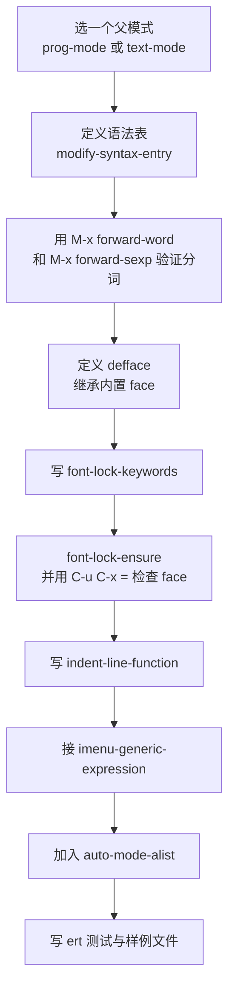
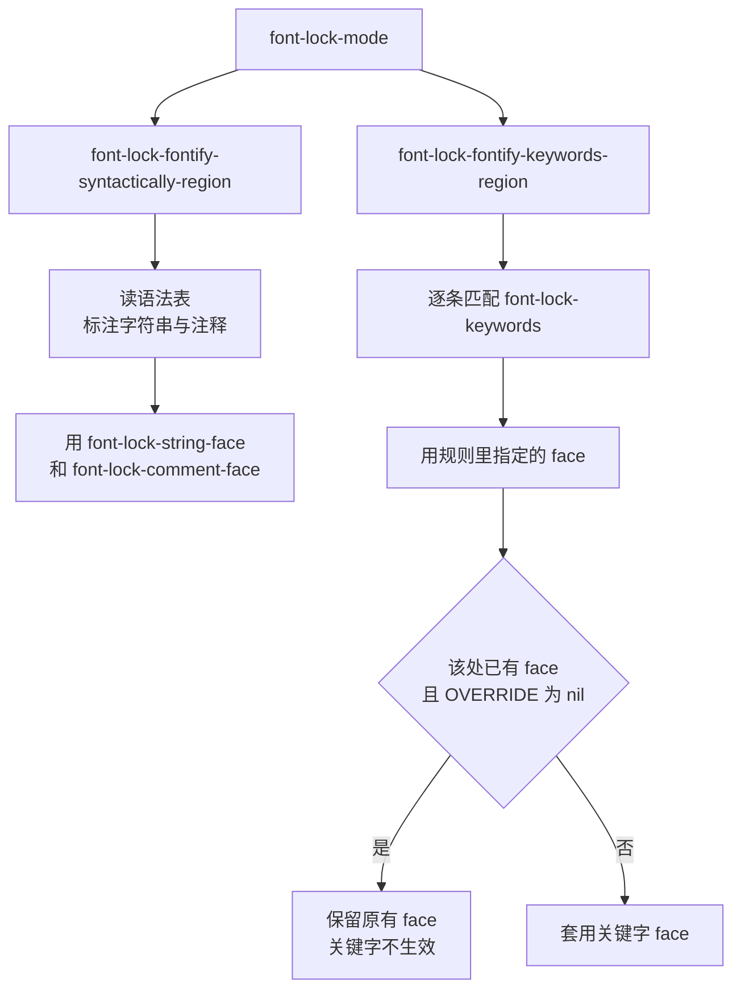

# 编写 Major Mode 与语法高亮

> major mode（主模式）决定一个缓冲区「是什么」。本篇讲清楚 `define-derived-mode` 替你做了哪些事，语法表与 font-lock 关键字怎么写，缩进和 imenu 怎么接，以及新写一个模式时该选传统 font-lock 还是 Emacs 29 起内置的 tree-sitter。

---

## 一、major mode 的职责

一个 major mode 要把「编辑这种文本」拆成四件互相独立的事，分开实现、分开调试：

1. **分词（lexing）**：什么是一个词、什么是一个符号、字符串从哪里到哪里、注释从哪里开始。这由 **语法表（syntax table）** 描述。
2. **高亮（fontification）**：哪些文本用什么 face（外观）显示。这由 **`font-lock-keywords`** 描述，语法表负责其中的字符串与注释部分。
3. **缩进（indentation）**：按下 `TAB` 时这一行应当有多少个前导空格。这由 **`indent-line-function`** 描述。
4. **外部工具协作**：语法检查、格式化、跳转定义、补全。这部分不属于「模式核心」，通常通过 hook 挂接 LSP 客户端（见 [[emacs教程/5开发环境集成/01_补全与LSP|补全与 LSP]]）或编译命令。

四件事里只有前两件是「必须做对」的，缩进可以先用最简实现，外部协作可以后补。

### 1.1 设计顺序

从上到下依次做，每一步都能独立验证：



**不要跳过第三步。** 语法表错了，font-lock 的字符串和注释高亮一定跟着错（而且错得很隐蔽），缩进和 sexp 移动也会莫名其妙。先把语法表调对是最省时间的做法。

---

## 二、`define-derived-mode`

### 2.1 三个可选的父模式

父模式决定你「免费继承」什么。常用的三个：

| 父模式 | 继承到什么 | 适合 |
| --- | --- | --- |
| `prog-mode` | 编程模式的公共设置，`prog-mode-hook`，各种编程辅助默认在它上面挂 | 任何编程语言的模式 |
| `text-mode` | 面向自然文本的设置，`text-mode-hook` | 配置文件、标记语言、结构化文本 |
| `special-mode` | 只读模式的设置，自带 `q` 退出、`g` 刷新、禁止插入 | 帮助缓冲区、日志查看器、列出信息的界面 |

`prog-mode` 与 `text-mode` 都是 `fundamental-mode` 的派生模式。选错父模式的后果是「用户装的所有编程插件对你的模式都不生效」——因为它们通常挂在 `prog-mode-hook` 上。

### 2.2 参数与关键字

```elisp
(define-derived-mode CHILD PARENT NAME [DOCSTRING] [KEYWORD-ARGS...] &rest BODY)
```

- `CHILD`：模式命令名，惯例以 `-mode` 结尾。
- `PARENT`：父模式命令名，或 `nil` 表示不继承。
- `NAME`：显示在 mode line 上的名字。不要叫 `Foo Mode`，惯例是短的 `Foo`。
- `DOCSTRING`：可省略，省略时宏会自动生成一段带键位表引用的文档。**但自己写更好**：自动生成的那段对用户没什么帮助。
- 支持的关键字只有五个：

| 关键字 | 作用 |
| --- | --- |
| `:group` | 声明自定义组，供 `M-x customize-mode` 使用 |
| `:syntax-table TABLE` | 用 `TABLE` 代替默认的 `CHILD-syntax-table`；传 `nil` 表示直接用父模式的语法表 |
| `:abbrev-table TABLE` | 同上，针对 abbrev 表 |
| `:after-hook FORM` | 在模式 hook 运行之后求值的一个形式，不加引号 |
| `:interactive BOOLEAN` | 是否把模式命令定义成交互式命令，默认是 |

`BODY` 里的形式在「模式 hook 运行之前」执行。**不要在 `BODY` 里写 `(interactive)`**，宏会自己生成。

### 2.3 宏替你完成了哪些事

这是本节最重要的一张清单。`define-derived-mode` 在展开时会生成：

1. `CHILD-hook` 变量，带文档字符串；模式函数最后调用 `run-mode-hooks` 运行它。
2. `CHILD-map` 键位表（若尚未存在则用 `make-sparse-keymap` 创建），并在模式函数里 `set-keymap-parent` 指向父模式的键位表，然后 `use-local-map` 安装它。
3. `CHILD-syntax-table` 语法表（若尚未存在则用 `make-syntax-table` 创建），模式函数里 `set-char-table-parent` 指向父模式的语法表，然后 `set-syntax-table` 安装它。用 `:syntax-table nil` 可以跳过这一整块。
4. `CHILD-abbrev-table` abbrev 表，把父模式的表设为它的 parents，然后设为 `local-abbrev-table`。
5. 记录父子关系。**Emacs 30 起改用 `derived-mode-set-parent`**，Emacs 29 及更早是直接 `(put 'CHILD 'derived-mode-parent 'PARENT)`。Emacs 30 的 NEWS 明确说：直接访问 `derived-mode-parent` 属性已被废弃，请改用新函数 `derived-mode-set-parent` 与 `derived-mode-all-parents`。
6. `CHILD` 模式函数本身：先用 `delay-mode-hooks` 包住父模式调用与 `BODY`，避免父模式的 hook 提前运行；再 `setq major-mode` 与 `mode-name`；再依次装好键位表、语法表、abbrev 表；最后 `run-mode-hooks`，从而按「父模式 hook 再到子模式 hook」的顺序运行。

「父模式先跑一遍」这一点很关键：你调用 `myconf-mode` 时，`prog-mode` 会先作为函数被执行一次，所以 `prog-mode` 里设的局部变量你全都继承到了，不需要自己重设。

### 2.4 docstring 的写法

第一行应当是一个完整的句子，以句号结尾，说明这个模式是干什么的。`checkdoc` 会检查这一条。惯例上还会在文档里引用键位表：

```elisp
(define-derived-mode myconf-mode prog-mode "MyConf"
  "Major mode for editing MyConf configuration files.

MyConf is a toy format in which every line is a comment, a section
header or a \"key = value\" pair.

\\{myconf-mode-map}"
  ...)
```

`\\{keymap}` 会被替换成该键位表的完整列表。这样 `C-h f myconf-mode RET` 里就能直接看到所有绑定，是文档质量的加分项。

`C-h m`（`describe-mode`）显示的也是这段文字加上键位摘要。

---

## 三、语法表

### 3.1 字符语义表

`modify-syntax-entry` 的第二个参数是一个字符串，**第一个字符**是类别，后面的字符是标志位。类别取值如下（这是 `modify-syntax-entry` 文档里列出的全部取值）：

| 类别字符 | 含义 |
| --- | --- |
| 空格 或 `-` | 空白字符 |
| `w` | 词构成字符（word constituent），`forward-word` 会跨过它 |
| `_` | 符号构成字符（symbol constituent），与 `w` 合起来构成一个符号 |
| `.` | 标点 |
| `(` | 左括号，第二个字符写它的配对 |
| `)` | 右括号 |
| `"` | 字符串引号 |
| `\` | 转义字符 |
| `$` | 成对分隔符（paired delimiter） |
| `'` | 表达式引用或前缀运算符 |
| `<` | 注释开始 |
| `>` | 注释结束 |
| `/` | 字符引用（character quote） |
| `@` | 继承父表（parent table）的设置 |
| `|` | 通用字符串栅栏（generic string fence） |
| `!` | 通用注释栅栏（generic comment fence） |

**重要澄清**：注释用的是 `<` 和 `>`，不是 `/`。网上常见的「`/` 表示注释」是错的——`/` 表示「字符引用」，那是给某些语言里 `\` 之外的转义机制用的。Emacs 自己的 `sh-mode`、`makefile-mode` 系都用 `<` 与 `>` 表示注释。

**标志位**（接在类别字符之后，可以多个）：

| 标志 | 含义 |
| --- | --- |
| `1` | 该字符是两字符注释开始的第一个字符 |
| `2` | 该字符是两字符注释开始的第二个字符 |
| `3` | 该字符是两字符注释结束的第一个字符 |
| `4` | 该字符是两字符注释结束的第二个字符 |
| `b` | 该注释序列属于 b 风格 |
| `c` | 该注释序列属于 c 风格 |
| `n` | 该注释可以嵌套 |
| `p` | 该字符是前缀字符，`backward-prefix-chars` 会用到 |

要表达「`/*` 开始、`*/` 结束」这种两字符注释，就是：

```elisp
(modify-syntax-entry ?/ "< 1" table)   ; / 是注释开始序列的第一个字符
(modify-syntax-entry ?* ". 23" table)  ; * 既是开始序列的第二个，也是结束序列的第一个
(modify-syntax-entry ?/ ". 34" table)  ; 第二个 / 需要单独设置，冲突时以后设的为准
```

实践中更常见的做法是照抄一个已有的同类模式的语法表，再改差异项。

### 3.2 构造一个语法表并逐行解释

以 MyConf（`#` 注释到行尾、`"` 字符串、`key = value`）为例：

```elisp
(defvar myconf-mode-syntax-table
  (let ((table (make-syntax-table)))
    ;; "#" 开始一个到行尾结束的注释
    (modify-syntax-entry ?# "<" table)
    (modify-syntax-entry ?\n ">" table)
    ;; 字母数字由 make-syntax-table 默认设为 word，这里补上标识符里的
    ;; 三个额外字符，让 my_key、my-key、my.key 各算一个词
    (modify-syntax-entry ?_ "_" table)
    (modify-syntax-entry ?- "_" table)
    (modify-syntax-entry ?. "_" table)
    ;; 双引号字符串，反斜杠是转义
    (modify-syntax-entry ?\" "\"" table)
    (modify-syntax-entry ?\\ "\\" table)
    ;; 结构性标点
    (modify-syntax-entry ?= "." table)
    (modify-syntax-entry ?\[ "." table)
    (modify-syntax-entry ?\] "." table)
    (modify-syntax-entry ?, "." table)
    table)
  "Syntax table for `myconf-mode'.")
```

逐行说明：

- `(make-syntax-table)` 返回一张新表，它的父表是 `standard-syntax-table`，因此 ASCII 字母数字已经是 word、空白已经是空白，你不用重设。
- `(modify-syntax-entry ?# "<" table)` 把 `#` 标为「注释开始」。
- `(modify-syntax-entry ?\n ">" table)` 把换行标为「注释结束」。**这一行不能少**，否则解析器认为注释一直延续到文件末尾，后面的字符串高亮会全乱。
- `?\-`、`?\.` 用 `"_"` 而不是 `"w"`：`_` 是符号构成字符，它和 word 字符一起构成一个符号。这样 `my-key` 在 `forward-word` 下是一个整体。
- `(modify-syntax-entry ?\" "\"" table)`：类别和配对都是双引号。字符串引号本身不需要配对字符，但 Emacs 约定这个位置也写 `"`。
- `(modify-syntax-entry ?\\ "\\" table)` 把反斜杠标为转义，于是 `"a\"b"` 中的 `\"` 不会提前结束字符串。

**注意源码里的写法**：`?[` 和 `?]` 在某些 Emacs 版本上会触发「未转义字符字面量」提示，写成 `?\[` 与 `?\]` 更稳妥。同理 `?\(`、`?\)`、`?\"`、`?\\`。

### 3.3 验证语法表

加载模式后打开一个样例文件，依次执行：

- `M-x forward-word`：光标应当一次跨过整个标识符。
- 把光标放在注释中间，`M-: (syntax-ppss) RET`：返回值的第 4 个元素非 nil 表示「在注释里」。
- 把光标放在字符串中间，`M-: (syntax-ppss) RET`：第 3 个元素非 nil 表示「在字符串里」。
- `C-u C-x =`：显示光标处字符的详细信息，其中包括语法类别，可以直接看到 `#` 是不是 `comment starter`。

`syntax-ppss` 的返回值结构是 `(DEPTH START-INSIDE-STRING COMMENT-LEVEL ...)`，日常只需关心第 3 和第 4 个元素。

---

## 四、font-lock 关键字

### 4.1 两者的分工



这张图说明了三件事：

1. 语法表负责字符串与注释，`font-lock-keywords` 负责其他所有东西。两者是互补关系。
2. 关键字规则默认不覆盖已经上色的地方。这就是为什么注释里的 `key = 5` 中的 `key` 仍然是注释色——它已经被语法着色了。
3. 想让关键字「压过」注释或字符串，必须在规则里显式写 `OVERRIDE`。

### 4.2 规则的格式

`font-lock-keywords` 的每个元素可以是下面几种形式（这是该变量文档里列出的全部形式）：

| 形式 | 含义 |
| --- | --- |
| `MATCHER` | 只写一个正则或函数名，命中整段用 `font-lock-keyword-face` |
| `(MATCHER . SUBEXP)` | 命中匹配的第 `SUBEXP` 组，用 `font-lock-keyword-face` |
| `(MATCHER . FACENAME)` | 命中整段用 `FACENAME` |
| `(MATCHER . HIGHLIGHT)` | 等价于 `(MATCHER HIGHLIGHT)`，`HIGHLIGHT` 是 `(SUBEXP FACENAME [OVERRIDE [LAXMATCH]])` |
| `(MATCHER HIGHLIGHT ...)` | 一条正则配多个高亮规则 |
| `(eval . FORM)` | `FORM` 求值结果必须是上述某种形式，在关键字首次用于某缓冲区时求值 |
| `(MATCHER PRE-MATCH-FORM POST-MATCH-FORM MATCH-HIGHLIGHT ...)` | 锚定形式，`MATCHER` 命中后在其附近继续匹配 |

`MATCHER` 可以是一个正则字符串，也可以是一个函数符号。函数接受一个参数（搜索上界），成功时应当移动 point、设置好 match data 并返回非 nil，行为类似 `re-search-forward`。

`HIGHLIGHT` 中的 `(SUBEXP FACENAME [OVERRIDE [LAXMATCH]])`：

- `SUBEXP` 是要高亮的子表达式编号，`0` 表示整个匹配。
- `FACENAME` 是求值后得到 face 的表达式，也可以求值得到一个属性列表 `(face FACE PROP VAL ...)`，那样会设置任意文本属性。
- `OVERRIDE`：`t` 表示覆盖已有 face；`keep` 表示只给尚未着色的部分上色；`prepend` 或 `append` 表示把新 face 合并进已有 face 列表，`prepend` 时新 face 在前（优先级更高）。
- `LAXMATCH` 非 nil 表示该子表达式没匹配到时不报错。

这三种 `OVERRIDE` 的差别可以直接验证。假设有规则 `("key" (0 'my-face ...))`，在一行 `# key comment` 上：

| `OVERRIDE` 取值 | 该处最终的 `face` 属性 |
| --- | --- |
| 省略（即 nil） | `font-lock-comment-face` |
| `t` | `my-face` |
| `prepend` | `(my-face font-lock-comment-face)` |
| `append` | `(font-lock-comment-face my-face)` |

### 4.3 一个真实的 `font-lock-keywords`

```elisp
(defvar myconf-font-lock-keywords
  `(;; 行首的 [section]
    ("^\\[\\([^]\n]+\\)\\]" (1 'myconf-section-face))
    ;; 行首的 key =
    ("^[ \t]*\\([A-Za-z_][A-Za-z0-9_.-]*\\)[ \t]*=" (1 'myconf-key-face))
    ;; = 后面的布尔值
    ("=[ \t]*\\(true\\|false\\|yes\\|no\\|on\\|off\\)\\_>"
     (1 'font-lock-builtin-face))
    ;; = 后面的数字
    ("=[ \t]*\\(-?[0-9]+\\(?:\\.[0-9]+\\)*\\)" (1 'font-lock-constant-face)))
  "Font lock keywords for `myconf-mode'.")
```

要点：

- 每个元素都是 `(正则 高亮规则...)` 形式，高亮规则里的 `'(face)` 是「引用的符号」，`font-lock` 接受这种写法，也接受 `(list 'quote face)` 求值后的结果。
- `\\_<` 与 `\\_>` 是「符号边界」，比 `\\b` 更精确：`\\b` 只看 word 字符，`\\_<` 会把 `_` 也算进去。
- `(1 ...)` 里的 `1` 是子表达式编号。正则里有几组括号，编号就从 1 开始数。写错编号最常见的表现是「什么都没高亮」或「只高亮了括号本身」。
- `^` 锚定在多行匹配里需要正则引擎按行处理，而 font-lock 逐行调用匹配函数，所以 `^` 的行为符合直觉。

### 4.4 `font-lock-defaults`

`font-lock-defaults` 是主模式告诉 font-lock「我这一套关键字在哪」的地方。形式是：

```elisp
(KEYWORDS [KEYWORDS-ONLY [CASE-FOLD [SYNTAX-ALIST ...]]])
```

- `KEYWORDS` 可以是一个符号（变量名或函数名，其值就是关键字列表），也可以是一个符号列表（按 fontification level 分级，用户用 `M-x font-lock-mode` 的前缀参数或 `font-lock-maximum-decoration` 选择用第几级）。
- `KEYWORDS-ONLY` 非 nil 表示不做字符串与注释的语法着色。
- `CASE-FOLD` 非 nil 表示匹配关键字时忽略大小写。
- `SYNTAX-ALIST` 是 `(字符或字符串 . 字符串)` 的列表，用来在 font-lock 期间临时修改语法表；有性能说明：如果 `syntax-ppss-table` 没设，要确保这些修改不会影响语法着色。
- 之后还可以跟 `(VARIABLE . VALUE)` 形式的 alist，每一项都会先让 `VARIABLE` 变成 buffer-local 再赋值为 `VALUE`。

最简单的写法，在模式 `BODY` 里：

```elisp
(setq-local font-lock-defaults '(myconf-font-lock-keywords))
```

想支持分级高亮：

```elisp
(setq-local font-lock-defaults
            '((myconf-font-lock-keywords-basic
               myconf-font-lock-keywords-extra)
              nil nil))
```

用户执行 `M-x font-lock-mode` 加前缀参数，或者设置 `font-lock-maximum-decoration`，就能在两级之间切换。

### 4.5 `font-lock-add-keywords`：给已有模式加料

不改动原模式、只追加规则，用 `font-lock-add-keywords`。签名是 `(MODE KEYWORDS &optional HOW)`：

- `MODE` 是主模式命令的符号。传 `nil` 表示对当前缓冲区追加。
- `KEYWORDS` 是要追加的规则列表。
- `HOW` 默认追加到列表开头；传 `'set` 表示替换；任何其他非 nil 值表示追加到末尾。

**关键细节**：给 `c-mode` 追加的关键字**不会**自动作用于 `c-mode` 的派生模式。要覆盖派生模式有两种办法——注册到每个具体模式，或者把调用放进父模式的 hook 里、`MODE` 传 `nil`：

```elisp
;; 给所有 prog-mode 派生模式加上 FIXME 高亮，包括注释里的
(defun my-fontify-fixme ()
  "Highlight FIXME in the current buffer, even inside comments."
  (font-lock-add-keywords
   nil
   '(("\\_<\\(FIXME\\|XXX\\|HACK\\)\\_>"
      (1 'font-lock-warning-face prepend)))))

(add-hook 'prog-mode-hook #'my-fontify-fixme)
```

这里 `prepend` 是必须的：不加它，注释里的 `FIXME` 会被注释色盖住而看不见。

### 4.6 `defface`：为什么应当继承内置 face

自定义 face 用 `defface`：

```elisp
(defface myconf-key-face
  '((t :inherit font-lock-variable-name-face))
  "Face used for MyConf keys."
  :group 'myconf)
```

规范是「一个 face 规格列表」，每一项的第一个元素是匹配条件：`t` 表示所有终端，`((class color) (min-colors 88))` 表示支持 88 色以上的彩色显示，`((background dark))` 表示深色背景。条件从上到下匹配，第一个命中的生效。

**为什么必须 `:inherit`**：

1. 用户切换主题时，你的 face 会自动跟随内置 face 的颜色变化，不需要你为每个主题写一套颜色。
2. 用户如果定制了 `font-lock-variable-name-face`，你的 face 自动继承这个偏好。
3. 高对比度模式、无障碍模式下内置 face 有专门调整，继承能免费得到这些适配。

MELPA 的贡献指南里专门有一条警告：**不要定义既 `:inherit` 某个 face 又覆盖它的属性**（比如强行加粗、加下划线或反显）。结果是用户难以预料的外观。正确做法就是单纯 `:inherit`，其余交给用户定制。

确实需要区分度时，可以继承一个语义相近但不完全相同的 face，例如关键字继承 `font-lock-keyword-face`、常量继承 `font-lock-constant-face`、类型名继承 `font-lock-type-face`、函数名继承 `font-lock-function-name-face`、字符串继承 `font-lock-string-face`、注释继承 `font-lock-comment-face`、警告继承 `font-lock-warning-face`。

---

## 五、注释、段落与表达式

除了语法表，还有一组「面向编辑命令」的变量需要在 `BODY` 里设好：

```elisp
(setq-local comment-start "# ")
(setq-local comment-end "")
(setq-local comment-start-skip "#+[ \t]*")
(setq-local paragraph-start "\\(^\\|[ \t]*\\)\\(#\\|\\[\\)")
(setq-local parse-sexp-lookup-properties t)
```

- `comment-start`：`M-;`（`comment-dwim`）插入的注释起始串。末尾带一个空格是惯例。
- `comment-end`：注释结束串。行注释留空字符串。
- `comment-start-skip`：正则，用来跳过已有的注释标记。`comment-dwim` 在已有注释上继续编辑时用它决定从哪里开始。写成 `"#+[ \t]*"` 可以兼容 `## 标题` 这类多井号注释。
- `paragraph-start`：正则，标记段落开始。配置文件通常希望「注释行和节标题行各自成段」，所以要把它设成匹配这些行的开头。不设的话，`M-q`（`fill-paragraph`）会把整段配置当成一个自然段来折行，效果很糟。
- `parse-sexp-lookup-properties`：非 nil 时，`forward-sexp` 等函数会参考文本属性里的语法信息（例如 font-lock 写的 `syntax-table` 属性）。对使用 `syntax-propertize-function` 的模式必须打开。

如果模式需要更精细的注释行为，还有 `comment-use-syntax`（默认 t，表示用语法表判断）、`comment-indent-function`、`comment-padding`。多数模式不用碰它们。

---

## 六、缩进

### 6.1 `indent-line-function`

按下 `TAB` 时，Emacs 调用 `indent-line-function` 指向的函数。约定是：把当前行的前导空白调整到位，**并把 point 保持在原来的相对位置上**（用户在前导空白里按 TAB 时，point 应当移到第一个非空白字符）。

### 6.2 一个真实的实现

MyConf 是扁平结构，绝大多数行顶格；只有「续行」（上一行的值太长折到下一行、本身不含 `=`）需要对齐到值的起始列。实现如下：

```elisp
(defcustom myconf-indent-continuation t
  "Whether continuation lines are aligned under the value column."
  :type 'boolean
  :group 'myconf)

(defun myconf-indent-line ()
  "Indent the current line in a MyConf buffer.

Section headers and comments go to column zero.  A line that has no
\"=\" of its own is treated as a continuation of the previous
assignment and is lined up with that value's first character."
  (interactive)
  (let ((target 0))
    (save-excursion
      (beginning-of-line)
      (unless (or (bobp)
                  ;; 节标题和注释顶格
                  (looking-at-p "[ \t]*\\(?:#\\|\\[\\)")
                  ;; 自己带 = 的行是赋值的开始，也顶格
                  (looking-at-p "[^=\n]*="))
        (when myconf-indent-continuation
          ;; 往回找最近一个有 = 的非空行
          (forward-line -1)
          (while (and (not (bobp)) (looking-at-p "[ \t]*$"))
            (forward-line -1))
          (when (re-search-forward "=[ \t]*" (line-end-position) t)
            (setq target (current-column))))))
    (indent-line-to (max 0 target))))
```

实测行为：对

```text
long = one
  two
```

在第三行的 `two` 上按 `TAB`，它会缩进到第 7 列，也就是 `one` 的起始列，因为 `long = ` 正好 7 个字符。

几个要点：

- 用 `save-excursion` 包住所有移动 point 的搜索，最后只调用 `indent-line-to`，由它负责维持 point 的相对位置。
- `(looking-at-p ...)` 只做判断不移动 point，比 `looking-at` 干净。
- `(max 0 target)` 是防御性的：万一算出负数，`indent-line-to` 会报错。

### 6.3 smie 的定位

`smie`（Simple Minded Indentation Engine，简易缩进引擎）是 Emacs 内置的缩进框架，接口是 `smie-setup` 配合一份语法描述（token 的优先级与 `smie-rules-function`、`smie-indent-rules`）。

它适合：**有明确括号嵌套层级的编程语言**，例如类 C 语法、类 ALGOL 语法。它替你处理「这一行在表达式树的第几层、要不要多缩一级」。

它不适合：扁平的数据格式、缩进语义由人类约定决定的语言（例如 Python 的缩进就是语法本身，`python-mode` 有自己的实现）、以及缩进规则依赖语义而非语法的语言。

### 6.4 现实建议

**缩进是 major mode 里最难做对的部分**，原因有三条：

1. 缩进需求往往有歧义，「上一行以 `(` 结尾就多缩一级」这条规则在续行和函数调用链上会互相矛盾。
2. 用户对缩进的容忍度极低。高亮不到位可以忍，缩进不对会立刻被骂。
3. 测试缩进比测试高亮困难：高亮可以查 `face` 属性，缩进要构造大量样例并逐个断言。

所以现实的策略是：

- 传统模式：先做「顶格 + 续行简单对齐」这类保守实现，明确写在文档里，不要试图猜用户的意图。
- 新写模式且语言有 tree-sitter 语法：优先用 `treesit-simple-indent-rules`，把缩进交给语法树，见第九节。
- 任何情况下都要在包文档里提供关掉自动缩进的办法（`(setq-local indent-line-function #'ignore)` 或者提供 `electric-indent-mode` 的局部关闭），这是对用户的尊重。

---

## 七、imenu 集成

imenu 提供「跳到本文件某个定义」的能力，通过 `M-x imenu` 或菜单栏的 Index 菜单访问，`which-function-mode` 与很多补全框架也依赖它。

最简单的方式是设置 `imenu-generic-expression`：一个 alist，每项是 `(菜单名 正则 子表达式编号)`。

```elisp
(setq-local imenu-generic-expression
            '(("Section" "^\\[\\([^]\n]+\\)\\]" 1)
              ("Key" "^[ \t]*\\([A-Za-z_][A-Za-z0-9_.-]*\\)[ \t]*=" 1)))
```

`imenu` 会对整个缓冲区反复用这些正则搜索，把所有匹配加到对应分类下。对简单的配置文件，这样就够了。

需要更复杂的索引（例如只列出顶层定义、或者要做去重与排序）时，改用 `imenu-create-index-function`：把它设成一个无参函数，返回索引列表。

```elisp
(defun myconf-imenu-create-index ()
  "Return an imenu index for the current MyConf buffer.

Only section headers are listed, in the order they appear."
  (let (index)
    (save-excursion
      (goto-char (point-min))
      (while (re-search-forward "^\\[\\([^]\n]+\\)\\]" nil t)
        (push (cons (match-string-no-properties 1)
                    (copy-marker (match-beginning 0)))
              index)))
    ;; imenu 期望按出现顺序排列
    (nreverse index)))

;; 在模式 BODY 里：
(setq-local imenu-create-index-function #'myconf-imenu-create-index)
```

两个细节：位置用 `copy-marker` 而不是整数，这样在缓冲区被编辑后索引仍然指向正确位置；返回的列表必须按出现顺序排列，否则菜单里的条目顺序会乱。注意这两个变量都应当设成 buffer-local。

---

## 八、把文件和模式关联起来

### 8.1 `auto-mode-alist`

```elisp
;;;###autoload
(add-to-list 'auto-mode-alist '("\\.myconf\\'" . myconf-mode))
```

要点：

- 正则结尾用 `\\'`（字符串结束）而不是 `$`（行尾）。用 `$` 会在多行文件名匹配上出错。
- 用 `add-to-list`，它把新项放在列表**最前面**。`auto-mode-alist` 是顺序匹配、第一个命中即生效，所以放前面才能胜过已有条目。
- 整个 `add-to-list` 加 `;;;###autoload` cookie，这样它在包被真正加载之前就能生效。这一条前面第一篇讲过，漏掉会导致「打开文件不进入我的模式，但 `M-x` 手动调用又正常」。
- `.conf` 不要抢。Emacs 自带的 `conf-mode` 已经处理 `.conf`，用 `add-to-list` 抢过来会让用户困惑。玩具语言用 `.myconf` 这种专属后缀最稳妥。

`auto-mode-alist` 的详细机制在 [[emacs教程/2Elisp语言/09_Mode与Hook机制|Elisp Mode 与 Hook 机制]] 里有更完整的说明。

### 8.2 文件局部变量的兜底

用户偶尔会给文件加一行 `-*- mode: myconf -*-`，或者用 `M-x myconf-mode` 手动切换。这两种方式不需要你写任何代码，但要注意：

- `-*-` 那行必须出现在文件第一行（或第二行，如果有 shebang），否则不生效。
- 如果文件同时匹配了 `auto-mode-alist` 的另一个条目，`-*-` 的优先级更高。

### 8.3 `major-mode-remap-alist`（Emacs 29 起）

如果一个语言同时有传统模式和 tree-sitter 模式（例如 `c-mode` 与 `c-ts-mode`），用户可以通过 `major-mode-remap-alist` 做重映射：

```elisp
;; 打开 .c 文件时实际使用 c-ts-mode
(add-to-list 'major-mode-remap-alist '(c-mode . c-ts-mode))
```

这个变量从 Emacs 29 起内置。**Emacs 30 有一处行为变化**：加载一个 tree-sitter 模式（例如 `M-x load-library RET c-ts-mode RET`）默认会让对应的非 tree-sitter 模式被重映射到 tree-sitter 模式。也就是说，你 `load` 一下就可能改变了用户打开 `.c` 文件的默认行为。要恢复，把 `major-mode-remap-alist` 里对应项设成「映射到自己」，或者用 `major-mode-remap-defaults` 做优先级更低的设置。

对你的包来说，这意味着：**如果你的模式有 tree-sitter 版本，加载它会有副作用**，应当在文档里说明。

---

## 九、tree-sitter 的现代路径

### 9.1 前提：它不是「装个包就有」

tree-sitter 集成从 **Emacs 29 起内置**（不需要再从 MELPA 装 `tree-sitter.el` 这类第三方绑定，那是另一套已经过时的方案）。但内置指的是「Emacs 里有了调用 tree-sitter 的代码」，还需要两样东西：

1. Emacs 编译时链接了 tree-sitter 库。发行版打包的 Emacs 通常已经开启；自己编译时用 `--without-tree-sitter` 可以关掉。用 `M-: (treesit-available-p) RET` 检查。
2. 每种语言一个 **grammar（语法）动态库**，文件名形如 `libtree-sitter-LANG.so`。Emacs 的搜索路径包括系统库目录、`treesit-extra-load-path` 列出的目录，以及 `user-emacs-directory` 下的 `tree-sitter/` 子目录。

`treesit.el` **不是**预加载的。`lisp/progmodes/c-ts-mode.el` 在文件开头就写了 `(require 'treesit)`。你的模式也必须显式 `require`。

安装 grammar 的命令是 `M-x treesit-install-language-grammar`：它会提示语言、grammar 仓库的 URL，然后用本机 C/C++ 编译器编译并安装。这是**用户侧的一次性操作**，也是 tree-sitter 模式在中文社区里最常被抱怨的地方——它要求用户机器上有编译器和网络。

### 9.2 让模式变得「可用也可不用」

标准写法是先探测：

```elisp
(defun mylang-ts-mode ()
  "..."
  (interactive)
  (unless (treesit-ready-p 'mylang)
    (error "Tree-sitter grammar for mylang is not available"))
  ...)
```

`treesit-ready-p` 的文档说得很清楚：它检查 tree-sitter 可用、语言 grammar 可用、当前缓冲区大小没有超过 `treesit-max-buffer-size`。不可用时它会发一条警告并返回 nil。第二个参数 `QUIET` 传 `t` 表示不发警告，传 `'message` 表示改用 `message` 而不是 `display-warning`。

由此可以推出推荐的做法：**不要**把 tree-sitter 模式直接绑到 `auto-mode-alist` 上，而是在模式函数里探测，失败时回退到传统模式。Emacs 自带的 `*-ts-mode` 都提供了「两者都可用时由用户选」的机制。

### 9.3 高亮的三个变量

```elisp
(require 'treesit)

(defvar mylang-ts-font-lock-rules
  (treesit-font-lock-rules
   :language 'mylang
   :feature 'comment
   '((comment) @font-lock-comment-face)
   :language 'mylang
   :feature 'keyword
   '(["if" "else" "while"] @font-lock-keyword-face)
   :language 'mylang
   :feature 'string
   '((string) @font-lock-string-face))
  "Tree-sitter font lock rules for `mylang-ts-mode'.")
```

- `treesit-font-lock-rules` 把若干「查询（query）」编译成一份适合赋给 `treesit-font-lock-settings` 的值。每个查询前面必须有 `:language` 与 `:feature`，可选 `:override`（取值 nil、`t`、`append`、`prepend`）。
- `:feature` 是一个符号标签，用来让用户按功能开关高亮。
- 捕获名（`@font-lock-keyword-face` 这类）直接对应 face 名，所以最省事的做法就是捕获到内置 font-lock face 上。

然后在模式 `BODY` 里：

```elisp
(setq-local treesit-font-lock-settings mylang-ts-font-lock-rules)
(setq-local treesit-font-lock-feature-list
            '((comment)
              (keyword string)
              (function-name variable-name type)
              (bracket delimiter)))
(treesit-major-mode-setup)
```

- `treesit-font-lock-feature-list` 是一个分级列表：第一层是 level 1 启用的 feature，第二层是 level 2，依此类推。
- `treesit-font-lock-level` 是用户选项，默认 3，表示启用前 3 层。用户可以按需调低以获得性能。
- `treesit-major-mode-setup` 是收尾函数，它会根据上面两个变量把 font-lock 设置好。

### 9.4 缩进

```elisp
(setq-local treesit-simple-indent-rules
            '((mylang
               ;; 规则形式是 (MATCHER ANCHOR OFFSET)
               ((node-is "}") parent-bol 0)
               ((parent-is "block") parent-bol mylang-indent-level)
               ((node-is ")") parent-bol 0)
               (no-node parent-bol 0))))
```

规则三元组 `(MATCHER ANCHOR OFFSET)` 的含义（来自该变量的文档）：

- `MATCHER` 是一个接收 `(NODE PARENT BOL)` 三个参数的函数，或者一个简写符号。返回非 nil 表示这条规则适用。`NODE` 是「起始位置在 BOL 处的最高节点」，`PARENT` 是它的父节点，`BOL` 是要缩进的位置。
- `ANCHOR` 同样接收 `(NODE PARENT BOL)`，返回一个位置（point）。
- `OFFSET` 是在 `ANCHOR` 基础上加减的偏移量，可以是整数或返回整数的函数。

简写符号（`parent-bol`、`node-is`、`parent-is`、`no-node` 等）定义在 `treesit-simple-indent-presets` 里，可以直接查看这个变量的值来了解全部可用简写。

`treesit-simple-indent` 是实际的缩进函数，模式里通过 `(setq-local indent-line-function #'treesit-simple-indent)` 安装，这一条通常由 `treesit-major-mode-setup` 代劳。

### 9.5 怎么选

| 判据 | 选传统 font-lock | 选 tree-sitter |
| --- | --- | --- |
| 语言有没有成熟的 grammar | 不用管 | 必须有，且用户要装 |
| 用户环境 | 零额外要求 | 需要编译器与网络，或发行版提供 grammar 包 |
| 语法复杂度 | 简单、行内可判定 | 嵌套、跨行、上下文相关 |
| 高亮精度要求 | 一般 | 高（能区分「同名但语义不同的标识符」） |
| 缩进需求 | 简单或不需要 | 依赖嵌套层级 |
| 大文件性能 | 大文件上 font-lock 可能变慢 | 增量解析，大文件表现更好 |
| 开发成本 | 语法表 + 正则，容易上手 | 要写 tree-sitter 查询，需要学 S-expression 查询语法 |
| 调试难度 | `M-x font-lock-flush` 就能重看结果 | 查询写错时的报错信息不直观 |

现实建议：

- **配置文件、标记语言、玩具语言**：传统 `font-lock`，够用且零依赖。
- **主流编程语言的新模式**：如果上游已有 `*-ts-mode`，直接复用或扩展它，不要从零写。
- **小众语言**：如果 community 有 grammar，写 tree-sitter 模式；没有就先用传统 font-lock 顶上，把缩进和 imenu 做扎实。

---

## 十、完整实战：`myconf-mode`

下面是一个约 150 行的完整 major mode，覆盖语法表、font-lock、缩进、imenu、键位、文件关联与 `provide`。MyConf 是你的玩具配置语言：`#` 注释，`[section]` 节标题，`key = value` 赋值。

```elisp
;;; myconf-mode.el --- Major mode for MyConf files  -*- lexical-binding: t; -*-

;; Copyright (C) 2025  Example Author

;; Author: Example Author <author@example.com>
;; Maintainer: Example Author <author@example.com>
;; Version: 0.1.0
;; Package-Requires: ((emacs "29.1"))
;; Keywords: languages, data
;; URL: https://example.com/myconf-mode

;; This file is not part of GNU Emacs.

;;; Commentary:

;; A major mode for MyConf, a toy configuration format.  Each line is
;; a comment, a "[section]" header or a "key = value" pair.
;;
;; Enable it with M-x myconf-mode, or let it turn on automatically for
;; files with the .myconf extension.

;;; Code:

(defgroup myconf nil
  "Major mode for MyConf configuration files."
  :group 'languages
  :prefix "myconf-")

(defface myconf-section-face
  '((t :inherit font-lock-type-face))
  "Face used for MyConf section headers."
  :group 'myconf)

(defface myconf-key-face
  '((t :inherit font-lock-variable-name-face))
  "Face used for MyConf keys."
  :group 'myconf)

(defcustom myconf-indent-continuation t
  "Whether continuation lines are aligned under the value column.

A continuation line is a line without a \"=\" of its own.  When this
is nil, such lines are simply put at column zero."
  :type 'boolean
  :group 'myconf)

(defvar myconf-mode-syntax-table
  (let ((table (make-syntax-table)))
    ;; "#" 开始一个到行尾结束的注释
    (modify-syntax-entry ?# "<" table)
    (modify-syntax-entry ?\n ">" table)
    ;; 标识符里额外允许的三个字符
    (modify-syntax-entry ?_ "_" table)
    (modify-syntax-entry ?- "_" table)
    (modify-syntax-entry ?. "_" table)
    ;; 双引号字符串与反斜杠转义
    (modify-syntax-entry ?\" "\"" table)
    (modify-syntax-entry ?\\ "\\" table)
    ;; 结构性标点
    (modify-syntax-entry ?= "." table)
    (modify-syntax-entry ?\[ "." table)
    (modify-syntax-entry ?\] "." table)
    (modify-syntax-entry ?, "." table)
    table)
  "Syntax table for `myconf-mode'.")

(defvar myconf-font-lock-keywords
  `(;; 节标题 "[section]"
    ("^\\[\\([^]\n]+\\)\\]" (1 'myconf-section-face))
    ;; 行首的 "key ="
    ("^[ \t]*\\([A-Za-z_][A-Za-z0-9_.-]*\\)[ \t]*=" (1 'myconf-key-face))
    ;; 布尔值
    ("=[ \t]*\\(true\\|false\\|yes\\|no\\|on\\|off\\)\\_>"
     (1 'font-lock-builtin-face))
    ;; 数字，含小数与负号
    ("=[ \t]*\\(-?[0-9]+\\(?:\\.[0-9]+\\)*\\)"
     (1 'font-lock-constant-face)))
  "Font lock keywords for `myconf-mode'.

Strings and comments are handled by `myconf-mode-syntax-table'.")

(defun myconf-indent-line ()
  "Indent the current line in a MyConf buffer."
  (interactive)
  (let ((target 0))
    (save-excursion
      (beginning-of-line)
      (unless (or (bobp)
                  (looking-at-p "[ \t]*\\(?:#\\|\\[\\)")
                  (looking-at-p "[^=\n]*="))
        (when myconf-indent-continuation
          (forward-line -1)
          (while (and (not (bobp)) (looking-at-p "[ \t]*$"))
            (forward-line -1))
          (when (re-search-forward "=[ \t]*" (line-end-position) t)
            (setq target (current-column))))))
    (indent-line-to (max 0 target))))

(defvar myconf-mode-map
  (let ((map (make-sparse-keymap)))
    (define-key map (kbd "C-c C-c") #'myconf-check-buffer)
    (define-key map (kbd "C-c C-s") #'myconf-insert-section)
    map)
  "Keymap for `myconf-mode'.")

(defun myconf--keys ()
  "Return a list of all keys used in the current buffer."
  (let (keys)
    (save-excursion
      (goto-char (point-min))
      (while (re-search-forward
              "^[ \t]*\\([A-Za-z_][A-Za-z0-9_.-]*\\)[ \t]*=" nil t)
        (push (match-string-no-properties 1) keys)))
    (nreverse keys)))

(defun myconf-check-buffer ()
  "Report duplicate keys in the current buffer.

MyConf has no scoping, so the same key may only appear once."
  (interactive)
  (let ((seen (make-hash-table :test #'equal))
        duplicates)
    (dolist (key (myconf--keys))
      (if (gethash key seen)
          (push key duplicates)
        (puthash key t seen)))
    (setq duplicates (delete-dups (nreverse duplicates)))
    (if duplicates
        (message "Duplicate MyConf keys: %s"
                 (string-join duplicates ", "))
      (message "No duplicate MyConf keys"))))

(defun myconf-insert-section (name)
  "Insert a section header for NAME at the end of the buffer."
  (interactive "sSection name: ")
  (save-excursion
    (goto-char (point-max))
    (unless (bolp) (insert "\n"))
    (insert "[" name "]\n")))

(defun myconf-imenu-create-index ()
  "Return an imenu index listing the section headers of this buffer."
  (let (index)
    (save-excursion
      (goto-char (point-min))
      (while (re-search-forward "^\\[\\([^]\n]+\\)\\]" nil t)
        (push (cons (match-string-no-properties 1)
                    (copy-marker (match-beginning 0)))
              index)))
    (nreverse index)))

;;;###autoload
(define-derived-mode myconf-mode prog-mode "MyConf"
  "Major mode for editing MyConf configuration files.

MyConf is a toy format in which every line is either a comment, a
\"[section]\" header or a \"key = value\" pair.

\\{myconf-mode-map}"
  :group 'myconf
  :syntax-table myconf-mode-syntax-table
  (setq-local comment-start "# ")
  (setq-local comment-end "")
  (setq-local comment-start-skip "#+[ \t]*")
  (setq-local font-lock-defaults '(myconf-font-lock-keywords))
  (setq-local indent-line-function #'myconf-indent-line)
  (setq-local imenu-create-index-function #'myconf-imenu-create-index)
  (setq-local parse-sexp-lookup-properties t)
  (setq-local paragraph-start "\\(^\\|[ \t]*\\)\\(#\\|\\[\\)"))

;;;###autoload
(add-to-list 'auto-mode-alist '("\\.myconf\\'" . myconf-mode))

(provide 'myconf-mode)
;;; myconf-mode.el ends here
```

### 10.1 逐块说明

**文件头与 `defgroup`**：`Package-Requires` 写 `((emacs "29.1"))`，因为这份代码没有用到 30 才有的 API。如果用了 `derived-mode-set-parent` 或者 Emacs 30 新增的 `treesit-thing-settings`，就要写 `30.1`。

**两个 `defface` 都只 `:inherit`，不覆盖任何属性**。这是 MELPA 贡献指南明确要求的行为。

**`myconf-mode-syntax-table` 用 `defvar` 而不是 `defconst`**：用户和派生模式都可能有理由改它，`defvar` 允许重新加载而不重置。

**`font-lock-keywords` 用反引号模板而不是普通引号**：这样将来加入 `(:eval ...)` 或条件生成 face 时不用改结构。这里没有插值，用 `'` 也可以，但保持模板写法便于扩展。

**`myconf--keys` 用双连字符**表示私有函数。`myconf-check-buffer` 是面向用户的命令，用单连字符。

**`imenu-create-index-function` 而不是 `imenu-generic-expression`**：因为要把键的索引去掉，只留节标题，并且用 `copy-marker` 保证编辑后仍然准确。

**`add-to-list` 带 `;;;###autoload` cookie**：保证文件关联在包加载前就生效。

### 10.2 测试步骤

```bash
# 1) 字节编译，应当零警告
$ emacs -Q --batch -L . -f batch-byte-compile myconf-mode.el

# 2) 在干净环境里加载并检查关键变量
$ emacs -Q --batch -L . -l myconf-mode.el --eval '(progn
    (with-temp-buffer
      (insert "[server]\n# comment\nport = 8080\ndebug = true\n")
      (myconf-mode)
      (princ (format "major-mode=%S comment-start=%S\n"
                     major-mode comment-start))
      (font-lock-ensure)
      (goto-char (point-min)) (search-forward "port")
      (princ (format "key face=%S\n"
                     (get-text-property (match-beginning 0) (quote face))))))'
```

预期输出 `major-mode=myconf-mode comment-start="# "` 和 `key face=myconf-key-face`。

接下来在交互式 Emacs 里手动验证：

1. `M-x load-file RET /path/to/myconf-mode.el RET`。
2. 打开（或新建）一个 `demo.myconf` 文件，确认底部 mode line 显示 `MyConf`。若没显示，说明 `auto-mode-alist` 那条没生效，检查 cookie 是否被 `load-file` 跳过——`load-file` 直接执行文件，会执行 `add-to-list`，所以应当生效。
3. 输入内容，观察颜色：节标题应当是 `font-lock-type-face` 的颜色，key 是变量名色，数字是常量色，`true` 是内建色，注释整行是注释色。
4. `M-x font-lock-flush RET`（或 `M-x font-lock-update RET`）强制重刷。改了 `font-lock-keywords` 之后必须重刷才看得到效果。
5. 把光标移到某个 key 上，按 `C-u C-x =`。回显区会显示该字符的 `face`，其中就有你的 face 名。这是检查「规则到底生效了没有、用的是哪个 face」最直接的手段。
6. `M-x imenu RET`，应当只列出 `server` 一个节。
7. 把光标放在一行续行上按 `TAB`，确认缩进到上一行值的起始列。
8. `C-c C-c` 检查重复键。构造两行同名的 key，应当看到 `Duplicate MyConf keys: ...`。

### 10.3 调试技巧

**font-lock 完全不生效的排查顺序**：

1. `M-: font-lock-mode RET` 是否为 t。为 nil 就先 `M-x font-lock-mode RET`。
2. `M-: font-lock-keywords RET` 是不是你预期的列表。如果是 `nil`，说明 `font-lock-defaults` 没设对，或者模式 `BODY` 里的 `setq-local` 被后面的东西覆盖了。
3. `M-: font-lock-defaults RET` 是不是 `(myconf-font-lock-keywords)`。
4. 在缓冲区里 `M-: (font-lock-ensure) RET`，再 `C-u C-x =` 看 face。`font-lock-ensure` 会强制把整篇刷一遍，绕过 jit-lock 的惰性渲染。
5. 如果部分生效部分不生效，问题几乎一定在正则上。用 `M-: (re-search-forward "你的正则" nil t) RET` 单独验证正则。

**正则死循环导致的卡死**：如果正则能匹配空字符串（例如 `"a*"` 这种），`while (re-search-forward ...)` 会在同一个位置无限循环，Emacs 界面完全冻住。避免方式：

- 正则里保证至少要消费一个字符。
- 循环里加保险：`(unless (> (point) last) (forward-char 1))`。
- 紧急情况下用 `C-g` 中断；如果 `C-g` 都没反应，用 `C-M-c` 或从另一个终端执行 `pkill -SIGUSR2 emacs` 让 Emacs 进入调试器。

**改了关键字看不到变化**：font-lock 会把已渲染的区域缓存起来。改完 `font-lock-keywords` 后必须 `M-x font-lock-flush RET` 或 `M-x font-lock-update RET`。`M-x font-lock-mode RET` 关一次再开一次也有效。

**换主模式后高亮错乱**：`M-x myconf-mode RET` 会重设一切，不会残留。如果在同一缓冲区反复切换两种模式后出现异常，检查你的模式有没有在 `BODY` 之外做 `setq` 或 `add-hook`——那些不会随主模式切换而撤销。

**字符串/注释高亮错位**：语法表问题。用 `C-u C-x =` 看有问题的那一行首字符的语法类别，通常是注释结束字符（`\n`）忘了设，或者两字符注释的标志位（`1`/`2`/`3`/`4`）配错。

---

## 小结

- `define-derived-mode` 会替你把键位表、语法表、abbrev 表、hook、`major-mode`/`mode-name` 全部安排妥当，并按「父模式先跑」的顺序执行；Emacs 30 起父子关系改用 `derived-mode-set-parent`，直接读 `derived-mode-parent` 属性已废弃。
- 语法表用 `<` 与 `>` 表示注释开始与结束，注释结束的换行字符不能漏；`font-lock-keywords` 的每条规则都要核对子表达式编号与 `OVERRIDE` 取值。
- 缩进是最容易做错也最容易被用户指责的部分，保守实现加清晰文档，比聪明的猜测更受欢迎；新写模式时按语言复杂度在传统 font-lock 与 tree-sitter 之间做选择。

---

## 相关章节

- [[emacs教程/2Elisp语言/09_Mode与Hook机制|Elisp Mode 与 Hook 机制]]
- [[emacs教程/2Elisp语言/07_文本属性与Overlay|Elisp 文本属性与 Overlay]]
- [[emacs教程/2Elisp语言/10_包与命名空间实践|Elisp 包与命名空间实践]]
- [[emacs教程/4插件开发/01_插件结构与生命周期|插件结构与生命周期]]
- [[emacs教程/4插件开发/02_编写MinorMode|编写 Minor Mode]]
- [[emacs教程/4插件开发/04_测试打包与发布MELPA|测试、打包与发布 MELPA]]
- [[emacs教程/5开发环境集成/01_补全与LSP|补全与 LSP]]

---

## 参考链接

- Elisp 参考手册（`(elisp) Derived Modes`、`(elisp) Syntax Tables`、`(elisp) Font Lock Mode`、`(elisp) Parsing Program Source`）https://www.gnu.org/software/emacs/manual/html_node/elisp/
- Elisp 参考手册单页版 https://www.gnu.org/software/emacs/manual/html_mono/elisp.html
- GNU Emacs 手册 https://www.gnu.org/software/emacs/manual/html_node/emacs/
- Emacs 源码镜像（查 `derived.el`、`font-lock.el`、`treesit.el`、`progmodes/*-ts-mode.el`）https://github.com/emacs-mirror/emacs
- tree-sitter 官方组织（各语言 grammar 仓库）https://github.com/tree-sitter
- tree-sitter-langs（第三方 grammar 打包，用于早期的 tree-sitter.el 方案）https://github.com/emacs-tree-sitter/tree-sitter-langs
- MELPA https://melpa.org/
- 插件开发手册 https://github.com/alphapapa/emacs-package-dev-handbook
- Emacs 中文社区论坛 https://emacs-china.org/
