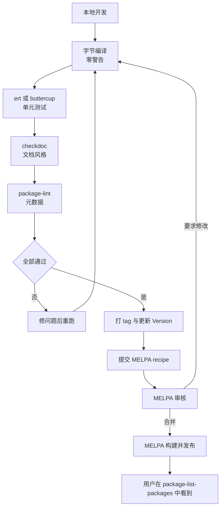
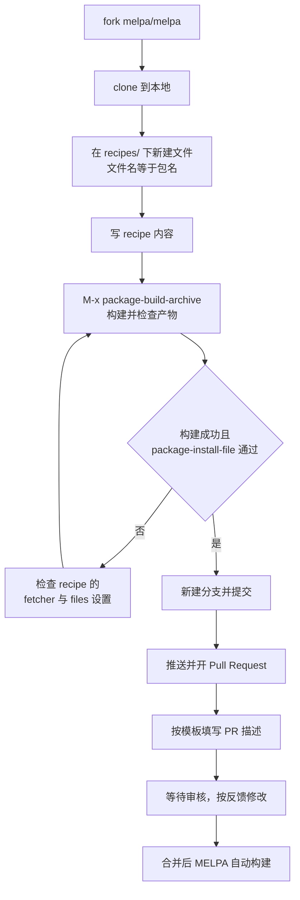

# 测试、打包与发布 MELPA

> 一个包在自己的配置里能跑，和在别人机器上能跑，是两件不同的事。本篇讲怎么用 ert 和静态检查把差距补上，怎么在 CI 里自动执行，以及把一个包真正发布到 MELPA 的完整流程与审核红线。

---

## 一、为什么包必须测试

在自己的 `init.el` 里能跑，说明不了任何问题。原因很具体：

- **环境不同。** 你的 Emacs 里已经装了三十个包，其中某个包可能无意中补上了你缺失的 `require`。用户装你的包时，那个包不在。
- **加载顺序不同。** 你的配置里 `require` 的顺序是固定的；用户可能通过 `use-package` 的延迟加载、`autoload` 或某个 hook 间接触发你的代码，此时某些全局状态尚未建立。
- **Emacs 版本不同。** 你在 Emacs 30 上开发，用户可能在 29 上。`treesit`、`which-key`、`derived-mode-set-parent` 这类 API 的可用版本各不相同。
- **交互与批量不同。** 交互式使用时会走完整的命令循环，`this-command`、`last-command`、`current-prefix-arg` 都有值；批量执行时它们可能是 nil。
- **回归是必然的。** 你今天修的 bug，三个月后改另一个功能时会原样复活。没有测试就没有防线。

测试的最低标准是三件事：**能自动跑、跑得快、失败时能以非零状态退出**。ert 全部满足。

---

## 二、ert 单元测试

ert（Emacs Lisp Regression Testing）从 Emacs 24 起内置，不需要装任何包。

### 2.1 基本形式

```elisp
(require 'ert)

(ert-deftest 测试名 ()
  "文档字符串，说明这个测试在验证什么。"
  (should 表达式))
```

`ert-deftest` 是宏，它定义一个测试并把它注册进 `ert-test` 记录。测试名是一个符号，命名惯例是 `被测对象-行为` 或 `被测对象-行为-条件`，例如 `my-highlight-todo-finds-keywords`。

四个断言宏：

| 宏 | 含义 |
| --- | --- |
| `should` | 表达式求值为 nil 则测试失败 |
| `should-not` | 表达式求值为非 nil 则测试失败 |
| `should-error` | 表达式没有抛出错误则测试失败 |
| `should equal` / `should-not equal` | 等价的常用简写；`(should (equal a b))` 的报错信息更具体 |

`should` 的文档只有两句：求值 FORM，如果返回 nil 则中止当前测试并标记失败；返回 FORM 的值。**注意它返回值**，所以可以嵌在 `let` 里或作为 `and` 的一部分。

### 2.2 `should` 的宏展开陷阱

`should` 是宏（`(macrop #'should)` 返回 t），这带来三个实际后果。

**陷阱一：不能当函数传递。** `(apply #'should '(t))` 会失败，因为 `should` 没有函数定义。需要在循环里做断言时，写成 `(dolist (x xs) (should (foo-p x)))` 而不是 `(mapc #'should ...)`。

**陷阱二：会捕获形式本身用于报错。** ERT 会把 `should` 的参数形式打印出来，所以你写 `(should result)` 失败时只看到「result 返回了 nil」，很难定位。好的写法是把比较写进断言里：

```elisp
;; 差：失败时只说 result 是 nil
(should result)

;; 好：失败时打印期望值与实际值
(should (equal (my-func 2) 4))
```

**陷阱三：不要在测试里依赖被测函数的副作用顺序。** `should` 只保证求值一次，但它不保证求值时机。如果你的断言写成了「先判断 A 再判断 B，而 A 的求值会改变 B 依赖的状态」，在 `and` 里嵌套多个 `should` 会让失败报告出现在错误的位置。拆成独立的 `ert-deftest` 更清楚。

**与 `should-error` 配合的坑**：`should-error` 默认捕获所有 `error` 及其子类。`user-error` 是 `error` 的子类，所以能被捕获。但如果代码里用的是 `signal` 加自定义条件（例如 `(define-error 'my-error "..." 'error)`），`should-error` 也能捕获到，只是书写时要用 `:type` 精确限定：

```elisp
(should-error (my-func -1) :type 'user-error)
```

### 2.3 在临时缓冲区里测试

测试操作缓冲区的代码时，一律用 `with-temp-buffer`。它创建一个临时缓冲区、把它设为当前缓冲区、执行 body，然后无条件杀掉它。这保证测试之间不互相污染。

```elisp
(ert-deftest my-mode-does-something ()
  "Verify the mode in a clean buffer."
  (with-temp-buffer
    (insert "some text\n")
    (my-mode 1)
    (unwind-protect
        (should (= 3 (my-count-things)))
      (my-mode -1))))
```

**为什么需要 `unwind-protect`**：`should` 失败时会抛出一个信号。如果没有 `unwind-protect`，直接写在后面的 `(my-mode -1)` 就不会执行。多数情况下 `with-temp-buffer` 会杀掉缓冲区所以看不出问题，但如果被测代码往全局 hook 或 timer 里加了东西，那些副作用会留下来，导致后续测试莫名其妙地失败。把清理放进 `unwind-protect` 的清理表是稳妥的做法。

### 2.4 五个真实的测试用例

下面这组测试针对前面几篇里写的 minor mode。全部可以直接运行。

```elisp
;;; test-my-modes.el --- Tests for the example modes  -*- lexical-binding: t; -*-

;;; Commentary:

;; Run with:
;;   emacs -Q --batch -L . -L test -l test/test-my-modes.el \
;;         -f ert-run-tests-batch-and-exit

;;; Code:

(require 'ert)
(require 'my-highlight-todo)
(require 'my-auto-save)

;; 1. 关键字识别：只有配置过的关键字才产生 overlay
(ert-deftest my-highlight-todo-finds-keywords ()
  "Only configured keywords get an overlay."
  (with-temp-buffer
    (insert "TODO one\nNOTE two\nnothing three\n")
    (my-highlight-todo-mode 1)
    (unwind-protect
        ;; 两个关键字，一个无关词，期望恰好两个 overlay
        (should (= 2 (length (overlays-in (point-min) (point-max)))))
      (my-highlight-todo-mode -1))))

;; 2. 大小写不敏感：小写关键字也要被认出来
(ert-deftest my-highlight-todo-is-case-insensitive ()
  "Lower case keywords are highlighted as well."
  (with-temp-buffer
    (insert "fixme this\n")
    (my-highlight-todo-mode 1)
    (unwind-protect
        (should (= 1 (length (overlays-in (point-min) (point-max)))))
      (my-highlight-todo-mode -1))))

;; 3. 资源清理：关闭后 overlay 与内部变量都必须回到初始状态
(ert-deftest my-highlight-todo-cleans-up ()
  "Disabling the mode removes every overlay."
  (with-temp-buffer
    (insert "TODO one\nFIXME two\n")
    (my-highlight-todo-mode 1)
    (my-highlight-todo-mode -1)
    (should-not (overlays-in (point-min) (point-max)))
    (should-not my-highlight-todo--overlays)))

;; 4. 自定义函数返回值：验证纯函数的返回内容
(ert-deftest my-highlight-todo-regexp-matches-configured-words ()
  "The generated regexp matches exactly the configured keywords."
  (let ((my-highlight-todo-keywords '(("TODO" . bold) ("NOTE" . italic))))
    (let ((re (my-highlight-todo-regexp)))
      (should (string-match-p re "TODO"))
      (should (string-match-p re "NOTE"))
      (should-not (string-match-p re "DONE")))))

;; 5. 错误输入：defcustom 的 :set 函数必须拒绝非法值
(ert-deftest my-auto-save-rejects-non-numeric-interval ()
  "Setting the idle interval to a non number signals an error."
  (should-error (customize-set-variable 'my-auto-save-idle-seconds "five")
                :type 'user-error)
  (should-error (customize-set-variable 'my-auto-save-idle-seconds 0)
                :type 'user-error)
  ;; 失败之后原值必须保持不变
  (should (= 5 my-auto-save-idle-seconds)))

;; 6. timer 生命周期：定时器只应当存在于模式开启期间
(ert-deftest my-auto-save-starts-and-stops-timer ()
  "The idle timer exists only while the mode is on."
  (with-temp-buffer
    (my-auto-save-mode 1)
    (should (timerp my-auto-save--timer))
    (my-auto-save-mode -1)
    (should-not my-auto-save--timer)))

;; 7. 无文件缓冲区不保存：验证守卫条件
(ert-deftest my-auto-save-skips-buffers-without-file ()
  "A buffer with no file is not saved."
  (with-temp-buffer
    (setq buffer-file-name nil)
    (should-not (my-auto-save--save))))

(provide 'test-my-modes)
;;; test-my-modes.el ends here
```

第 5 条是「错误输入」类测试的范例。它同时验证了三件事：非法输入会报错、错误类型是 `user-error`、以及失败后变量没有被改坏。第三条断言最重要——很多 `:set` 函数的实现是「先 `set-default` 再校验」，那样变量会被污染。

**注意 `:type` 参数**：`should-error` 的 `:type` 是关键字参数，写在被测形式之后。不加它的话，任何错误（包括拼错函数名导致的 `void-function`）都会让测试「通过」，这是假阳性。

### 2.5 交互式运行：`M-x ert`

`M-x ert RET` 会提示一个选择器（selector），可以：

- 直接 `RET`：跑所有已注册的测试。
- 输入 `t`：同上。
- 输入测试名（支持正则）：只跑匹配的测试，例如 `my-highlight-todo`。
- 输入 `(tag mytag)` 或 `(not (tag slow))`：按标签筛选，标签通过 `(ert-deftest foo () :tags '(slow) ...)` 设置。

结果界面里，`RET` 在失败的测试上会跳到失败点，`l` 重新显示最后结果，`d` 打开测试的文档。

直接在缓冲区里开发时，还有 `M-x ert-deftest`（插入一个新测试模板）和 `M-x ert` 的当前定义点运行形式 `M-x ert-run-tests-interactively`。

### 2.6 命令行运行

```bash
# 跑全部已加载的测试，有失败则以非零状态退出
$ emacs -Q --batch -L . -L test -l test/test-my-modes.el \
    -f ert-run-tests-batch-and-exit

# 只跑匹配某个正则的测试
$ emacs -Q --batch -L . -L test -l test/test-my-modes.el \
    --eval '(ert-run-tests-batch-and-exit "my-highlight-todo")'
```

`ert-run-tests-batch-and-exit` 接受一个可选的选择器参数。任何测试失败时它调用 `kill-emacs` 并返回非零状态，因此可以直接放进 Makefile 和 CI。

报告里的数字含义：

```text
Ran 7 tests, 7 results as expected, 0 unexpected (2025-01-01 12:00:00+0800, 0.31 sec)
```

「results as expected」把「通过」和「按预期失败」（`(should-error ...)` 成功捕获）都算进去。所以写了对错误输入的测试时，这个数字会比 `ert` 界面显示的「passed」多。

### 2.7 测试文件的组织

- 放 `test/` 目录。MELPA 的默认 `:files` 会排除 `test.el`、`tests.el`、`*-test.el`、`*-tests.el`，但为了保险，把整个 `test/` 目录都放在那里最干净。
- **测试文件不要 `provide` 包的特性**。MELPA 的文档明确要求「测试文件应当放在 `test/` 目录并且不应该 provide 任何 feature」，否则它们可能被当成包的一部分加载。
- 测试文件本身也要加 `lexical-binding` cookie，否则 Emacs 会打印提示。
- 需要用到的第三方测试工具（例如 buttercup）不要放进仓库，见下面。

---

## 三、buttercup 的定位

ert 是内置的、够用的、零依赖的。buttercup 是 MELPA 上的第三方测试框架，`M-x package-install RET buttercup RET`。

它的定位是「BDD 风格的可读断言」，写法接近 RSpec：

```elisp
;;; test-my-modes.el --- Buttercup specs  -*- lexical-binding: t; -*-

(describe "my-highlight-todo-mode"
  (it "highlights configured keywords"
    (with-temp-buffer
      (insert "TODO one\nNOTE two\n")
      (my-highlight-todo-mode 1)
      (unwind-protect
          (expect (length (overlays-in (point-min) (point-max))) :to-equal 2)
        (my-highlight-todo-mode -1))))

  (it "is case insensitive"
    (with-temp-buffer
      (insert "fixme this\n")
      (my-highlight-todo-mode 1)
      (unwind-protect
          (expect (length (overlays-in (point-min) (point-max))) :to-equal 1)
        (my-highlight-todo-mode -1)))))
```

命令行运行用 buttercup 自带的 `bin/buttercup` 脚本：

```bash
$ buttercup -L . test/
```

它会递归搜索目录下所有以 `test-` 开头、或以 `-test.el`、`-tests.el` 结尾的 elisp 文件，加载后运行。

**怎么选**：ert 是内置的、CI 里不需要额外依赖、和 Emacs 本身一起演进；buttercup 的报错信息更接近自然语言，写行为描述更方便。两者都能完成工作，**不要为了测试而在仓库里同时引入两套框架**。新包默认用 ert 就够了，除非你已经熟悉 buttercup 且团队统一用它。

---

## 四、静态检查

测试只能验证你想到的情况，静态检查能找出你没想到的。

### 4.1 `checkdoc`

内置的文档检查工具。两个入口：

- `M-x checkdoc`：检查当前缓冲区的文档风格，`SPC` 移到下一个问题，`C-h` 看解释。
- `checkdoc-file`：函数，接受一个文件名，在批量模式下用。

```bash
$ emacs -Q --batch -L . --eval '(progn (require (quote checkdoc)) (checkdoc-file "foo.el"))'
```

`checkdoc` 主要检查的规则：

- **docstring 第一行必须是完整的句子**，以句号结尾，且在一行内说完。Jargon 与缩写会造成误报。
- **docstring 里的参数名必须大写**：`(defun foo (name) "Greet NAME." ...)`，不是 `name`。`checkdoc` 会核对形参名与文档里的大写形式是否对应。
- **每个 defun/defvar/defcustom/defface 都要有 docstring**。`ert-deftest` 也建议有。
- **第一行摘要与文件名**：`;;; foo.el --- 摘要` 这一行要以句号结尾之外的形式书写，`checkdoc` 会检查首字母大写。
- **`;;; Code:` 段落必须存在**。
- **`;;; foo.el ends here` 结尾标记必须存在**。
- **行尾不能有空白**，不能有 TAB 缩进以外的问题字符。
- **键位绑定必须用 `kbd` 或向量形式**，不能写裸字符串。

`checkdoc-file` 只报告，不改变退出状态。想在 CI 里把它变成硬门槛，需要抓取输出并判断是否为空，或者用 `elisp-lint`（它把 checkdoc 作为一项检查包含进去）。

### 4.2 `package-lint`

MELPA 维护者推荐的元数据检查工具，`M-x package-install RET package-lint RET`。它检查的是「这个包能不能被归档正确解析和分发」。

常见报错与修法：

| 报错 | 原因 | 修法 |
| --- | --- | --- |
| `Package should have a ;;; Commentary section.` | 缺 `;;; Commentary:` | 在文件头加这一段，写清楚用途与最小用法 |
| `Package should have a Homepage or URL header.` | 缺 `URL` | 加 `;; URL: https://...` |
| `"Version:" or "Package-Version:" header is missing.` | 缺 `Version` | 加 `;; Version: 0.1.0`（多文件包写在主库） |
| `package.el cannot parse this buffer: Search failed: ";;; foo.el ends here"` | 缺结尾标记 | 在文件最后加 `;;; foo.el ends here` |
| `You should depend on (emacs "24.1") or above if you rely on lexical-binding.` | 用了 `lexical-binding` 但没声明最低 Emacs 版本 | 在 `Package-Requires` 写 `((emacs "29.1"))` 之类的真实下限 |
| `Package should depend on Emacs 25.1 or above if it uses cl-lib.` | 用了 `cl-lib` 但没在依赖里声明对应版本 | 把 Emacs 版本提到满足 `cl-lib` 要求的版本 |
| `Package foo-mode does not have a defgroup.` | minor mode 没有 `:group` 且推断不出组 | 加 `(defgroup foo ...)` 并在模式里写 `:group 'foo` |
| `Global minor mode foo-global-mode should be defined with define-globalized-minor-mode.` | 用 `:global t` 定义了本该 globalized 的模式 | 改成 `define-globalized-minor-mode` 加一个 buffer-local 版本 |
| `Error: Repeating key "C-c x" is reserved for users.` | 占用了 `C-c` 加一个字母 | 改成 `C-c C-x` 三段式 |
| `Package-Requires should have the form ((emacs "24.1") ...)` | 依赖列表格式不对 | 检查括号层级与版本是否写成字符串 |
| `Package xxx is not available in any archive.` | 依赖里的包名在归档里找不到 | 核对真实包名，或者从依赖里删掉 |
| `You should depend on the version of xxx that provides yyy.` | 依赖的版本太旧，用到的函数在更高版本才有 | 把该依赖的版本下限提高 |
| `Package should not use cl (use cl-lib instead).` | 用了已废弃的旧 `cl` 库 | 改用 `cl-lib` 并加 `(require 'cl-lib)` |
| `Package-Lint: docstring wider than 80 characters.` | docstring 行超宽 | 折行 |

命令行批量运行：

```bash
$ emacs -Q --batch -L . -l package-lint -f package-lint-batch-and-exit foo.el
```

要点：`package-lint-batch-and-exit` 从 `command-line-args-left` 读文件名，所以文件名要写在 `-f` 之后；`package-lint` 没有叫 `package-lint-file` 的函数。此外它依赖 `package-lint` 包自带的数据文件，所以用 `package.el` 从 MELPA 安装它，不要只手抄一个 `package-lint.el` 出来。变量 `package-lint-batch-fail-on-warnings` 默认是 t，也就是「仅警告也会导致非零退出」。

在 Emacs 里交互使用时是 `M-x package-lint-current-buffer RET`，结果会显示在 `*Package-Lint*` 缓冲区。

### 4.3 `elisp-lint`

MELPA 上的 `elisp-lint`，是把多项检查打包在一起的前端：字节编译、`checkdoc`、`package-lint`、缩进、行宽、TAB 字符、行尾空白、`declare-function` 完整性。

命令行用法：

```bash
$ emacs -Q --batch -L . -l elisp-lint --eval '(elisp-lint-files-batch)'
```

文件列表同样从命令行取。也可以 `M-x elisp-lint-file RET 文件 RET` 单个检查。

它的价值在于「一条命令跑完所有检查」，缺点是任何一项失败都会让整条命令失败，定位问题时要看输出里的分类。

### 4.4 字节编译警告清零

这是最基本也最容易被忽略的一项。发布前的标准是：**`batch-byte-compile` 完全没有输出**。

```bash
$ emacs -Q --batch -L . -f batch-byte-compile foo.el
```

零输出表示零警告。常见警告与处理：

| 警告 | 含义 | 处理 |
| --- | --- | --- |
| `the function 'foo-bar' is not known to be defined` | 函数未定义或未 `require` | 加 `(require '... )`，或用 `declare-function` 声明 |
| `the function 'foo-bar' might not be defined at runtime` | 条件加载的函数 | 用 `(declare-function foo-bar "foo")` 声明 |
| `reference to free variable 'foo-var'` | 变量未用 `defvar` 声明 | 加 `(defvar foo-var)`，或用 `defvar-local` |
| `assignment to free variable` | 给未声明的变量赋值 | 同上 |
| `Unused lexical variable 'x'` | 形参或 `let` 绑定没用到 | 改名成 `_x` 或删掉 |
| `Lexical argument shadows the dynamic variable` | 形参名与某内置变量同名 | 改形参名 |
| `docstring has wrong usage of unescaped single quotes` | docstring 里用了裸 `'` | 用 `` `x' `` 这种 Emacs 文档约定写法 |
| `obsolete function` | 用了已废弃的 API | 换用新 API，例如 `hide-body` 换成 `outline-hide-body` |
| `Warning: defvar 'foo' docstring wider than 80 characters` | 文档行超宽 | 折行 |

字节编译器不会因为警告而让命令失败，所以在 CI 里要把输出抓下来判断，或者用 `-Werror` 之类的开关。最简单可靠的做法是下面这个：

```bash
$ out=$(emacs -Q --batch -L . -f batch-byte-compile foo.el 2>&1)
$ test -z "$out" || { echo "$out"; exit 1; }
```

### 4.5 Elsa（可选）

Elsa 是 MELPA 上的 Elisp 静态分析器（`M-x package-install RET elsa RET`），做类型推断与未定义符号检查，类似其他语言的静态类型检查器。

它的报错信息质量依赖代码的注解程度，对传统的、`setq` 满天飞的 Elisp 代码误报较多。**可选使用**：对核心的纯函数模块开一开，能发现一些真问题；不要把它当成硬门槛，也不要为了通过它而把代码写成不自然的风格。

---

## 五、CI：把检查自动化

### 5.1 完整流程



### 5.2 GitHub Actions 工作流

下面这份 workflow 使用两个经过验证的 action：

- `purcell/setup-emacs`：用 Nix 提供多版本 Emacs 二进制，输入参数是 `version`。只支持 Linux 和 macOS。
- `jcs090218/setup-emacs`：封装了上面那个和 Windows 版本，输入参数同样是 `version`，跨三平台可用。

```yaml
name: CI

on:
  push:
    branches: [main, master]
  pull_request:

jobs:
  build:
    runs-on: ubuntu-latest
    strategy:
      fail-fast: false
      matrix:
        emacs_version:
          - "29.1"
          - "29.4"
          - "30.1"
          - "30.2"
    steps:
      - name: Checkout
        uses: actions/checkout@v4

      - name: Install Emacs ${{ matrix.emacs_version }}
        uses: purcell/setup-emacs@master
        with:
          version: ${{ matrix.emacs_version }}

      - name: Report Emacs version
        run: emacs --version

      - name: Byte compile
        run: |
          set -o pipefail
          output=$(emacs -Q --batch -L . -f batch-byte-compile myconf-mode.el 2>&1)
          if [ -n "$output" ]; then
            echo "$output"
            exit 1
          fi

      - name: Install package-lint
        run: |
          emacs -Q --batch \
            --eval "(progn
                      (require 'package)
                      (add-to-list 'package-archives
                                   '(\"melpa\" . \"https://melpa.org/packages/\") t)
                      (package-initialize)
                      (package-refresh-contents)
                      (package-install 'package-lint))"

      - name: Lint
        run: |
          emacs -Q --batch \
            --eval "(progn (require 'package) (package-initialize))" \
            -l package-lint \
            -f package-lint-batch-and-exit myconf-mode.el

      - name: Run tests
        run: |
          emacs -Q --batch -L . -L test \
            -l test/test-myconf-mode.el \
            -f ert-run-tests-batch-and-exit
```

说明：

- `fail-fast: false` 让某个版本的失败不影响其他版本继续跑，能一次看清「哪些版本有问题」。
- 「Byte compile」这一步用 shell 判断输出是否为空，从而把「警告」升级成「失败」。字节编译器本身在警告时不会返回非零状态。
- `package-lint` 通过 `package.el` 从 MELPA 安装，这样它自带的数据文件（`stdlib-changes` 等）才齐全。只手抄单个 `.el` 文件会因为缺数据目录而报 `Opening input file: No such file or directory, data/stdlib-changes`。
- `package-lint-batch-and-exit` 从 `command-line-args-left` 取文件名，所以文件名必须写在 `-f` 之后。
- 如果矩阵里要包含 Windows，把 `purcell/setup-emacs@master` 换成 `jcs090218/setup-emacs@master`，并把 `runs-on` 改成 `${{ matrix.os }}` 加 `os: [ubuntu-latest, macos-latest, windows-latest]`。

**如果不想用第三方 action**，可以手动下载 Emacs 源码编译安装。这个方案慢但完全不依赖第三方：

```yaml
      - name: Build Emacs from source
        run: |
          sudo apt-get update
          sudo apt-get install -y build-essential libgnutls28-dev libncurses-dev
          curl -LO https://ftp.gnu.org/gnu/emacs/emacs-30.2.tar.xz
          tar xf emacs-30.2.tar.xz
          cd emacs-30.2
          ./configure --with-native-compilation=no
          make -j"$(nproc)"
          sudo make install
```

这条路耗时通常在十分钟以上，而且 `ftp.gnu.org` 在国内访问不稳定，只在确实不能用第三方 action 时采用。

### 5.3 其他 CI 平台

GitLab CI、SourceHut builds、Codeberg 的 Woodpecker 都能做同样的事，核心只有一条：**在干净容器里装好指定版本的 Emacs，然后跑上面那四条命令**。把命令抽成一个 `Makefile` 目标，CI 配置就只是「装 Emacs」加「make check」。

---

## 六、Makefile 与构建脚本

### 6.1 一份够用的 `Makefile`

```makefile
EMACS ?= emacs
PKG   := myconf-mode
SRC   := $(PKG).el
TEST  := test/test-$(PKG).el

.PHONY: all compile test lint check clean

all: compile

## 字节编译，要求零警告
compile:
	@out=$$($(EMACS) -Q --batch -L . -f batch-byte-compile $(SRC) 2>&1); \
	if [ -n "$$out" ]; then echo "$$out"; exit 1; fi

## 单元测试
test:
	$(EMACS) -Q --batch -L . -L test -l $(TEST) \
	  -f ert-run-tests-batch-and-exit

## 文档风格
checkdoc:
	$(EMACS) -Q --batch -L . \
	  --eval '(progn (require (quote checkdoc)) (checkdoc-file "$(SRC)"))'

## 元数据检查
lint:
	$(EMACS) -Q --batch -L . -l package-lint \
	  -f package-lint-batch-and-exit $(SRC)

## CI 里的总入口
check: compile checkdoc lint test

clean:
	rm -f *.elc test/*.elc
```

`make check` 就是 CI 里要跑的那一条。

### 6.2 用 eldev

`eldev` 是纯 Elisp 实现的构建工具（[[emacs教程/4插件开发/01_插件结构与生命周期|插件结构与生命周期]] 里有三者对比）。它自己管理依赖与多版本测试，配置文件是 `Eldev`：

```elisp
;; Eldev
(eldev-use-plugin 'autoloads)
```

常用命令：

```bash
$ eldev compile                 # 字节编译，警告会标红
$ eldev test                    # 自动发现并运行 ert 测试
$ eldev lint                    # 跑 checkdoc 与 package-lint
$ eldev package                 # 构建包归档文件
```

`eldev` 的 `Eldev` 文件本身也是 Elisp，语法高亮和补全都正常，这是它相对其他工具的一个实际优势。

### 6.3 用 Eask

Eask（`emacs-eask/cli`）是 Node.js 写的命令行工具，配置文件是 `Eask`：

```elisp
(package "myconf-mode"
         "0.1.0"
         "Major mode for MyConf files")

(website-url "https://example.com/myconf-mode")
(keywords "languages" "data")

(package-file "myconf-mode.el")

(source 'gnu)
(source 'melpa)

(development
 (depends-on "package-lint"))

(script "test" "eask test ert ./test")
```

命令是 `eask compile`、`eask lint`、`eask test ert ./test`、`eask package`。

**怎么选**：想少装东西就用 `Makefile`；想一条命令管全套且接受多一个依赖，用 `eldev`；已经用 Node 生态或想要最平缓的学习曲线，用 `eask`。三者不冲突，`Makefile` 可以和它们共存。

---

## 七、打包

### 7.1 ELPA 风格的打包用 `package-build`

`package-build` 是 MELPA 的构建工具（`https://github.com/melpa/package-build`），也是 GNU ELPA 与 MELPA 之间事实上的标准打包器。它把「recipe + 上游仓库」变成「`.tar` 加 `archive-contents` 条目」。

常用入口（这些是当前 `package-build.el` 里的真实命令）：

- `M-x package-build-archive RET 包名 RET`：按 recipe 构建单个包，交互式提示输入 recipe 名。
- `M-x package-build-all RET`：构建 `recipes/` 下的全部包。
- `package-build-archive-alist`：读取生成的 `archive-contents`。

相关变量：`package-build-recipes-dir`（默认 `recipes/`）、`package-build-archive-dir`（默认 `packages/`），可以用 `M-x customize-group RET package-build RET` 查看。

要提醒的是：MELPA 的文档里目前仍写着 `package-build-current-recipe` 和 `package-build-create-recipe` 这两个命令，但在当前版本的 `package-build.el` 里它们已经不存在了，取而代之的是 `package-build-archive`。照着旧文档敲 `M-x` 会找不到命令。

### 7.2 最简单的手工打包

如果你只是想把包发给朋友，不需要任何工具。

**方式一：直接给对方 `.el` 文件。** 单文件包最省事。对方 `M-x package-install-file RET /path/to/foo.el RET` 就能装。

**方式二：打一个 tar。** 目录结构必须是 `foo-VERSION/foo.el`，然后在包目录的**上一级**打包：

```bash
$ mkdir -p /tmp/build/foo-0.1.0
$ cp foo.el /tmp/build/foo-0.1.0/
$ cd /tmp/build && tar cf foo-0.1.0.tar foo-0.1.0/
```

对方 `M-x package-install-file RET /tmp/build/foo-0.1.0.tar RET` 即可安装。多文件包把其他 `.el` 一起复制进去。

**方式三：用 `package-build` 生成标准归档。** 需要一份 recipe 文件，然后用上面的 `package-build-archive`。

手工打 tar 要注意 `foo-pkg.el` 不需要你提供，`package.el` 在安装时会从主库文件头生成它（这一点第一篇讲过）。手工放一个进去反而可能与文件头里的版本号冲突。

### 7.3 本地安装验证

发布前必须做这一步，因为它走的是完整路径：解析文件头、检查依赖、复制文件、生成 autoloads、写 `foo-pkg.el`。

```bash
$ emacs -Q --batch --eval '(progn
    (require (quote package))
    (package-initialize)
    (package-install-file "/tmp/build/foo-0.1.0.tar"))'
```

装完后 `M-x package-list-packages` 里应当能看到它，`M-x package-describe RET foo RET` 应当显示正确的摘要、依赖与 URL。如果这一步报错，问题一定在文件头或 tar 的目录结构上。

---

## 八、发布到 MELPA

### 8.1 完整流程



### 8.2 recipe 的格式

MELPA 的 recipe 是一个放在 `recipes/` 目录下的文件，**文件名等于包名**，内容是一个 Lisp 形式的 plist。完整语法如下（来自 MELPA 仓库 README 的 Recipe Format 一节）：

```elisp
(package-name
 :fetcher [git|github|gitlab|codeberg|sourcehut|hg]
 [:url "<repo url>"]
 [:repo "user-name/repo-name"]
 [:commit "commit"]
 [:branch "branch"]
 [:version-regexp "<regexp>"]
 [:files ("<file1>" ...)]
 [:old-names (old-name ...)])
```

各字段含义：

- `package-name`：与包同名的符号。
- `:fetcher`：仓库类型。有 `git` 和 `hg` 两个通用型，以及 `github`、`gitlab`、`codeberg`、`sourcehut` 四个针对具体托管平台的专用型。**专用型应当优先于通用型使用。**
- `:url`：通用 fetcher（`git`、`hg`）必填，专用 fetcher 上无效。
- `:repo`：专用 fetcher 必填，形式是 `user-name/repo-name`。Sourcehut 的用户名前缀 `~` 要省略。
- `:commit`：指定检出的提交，只被 git 系列使用。可以是 SHA，也可以是带 `origin/` 前缀的完整 ref。
- `:branch`：指定分支，非默认分支时必须写。
- `:version-regexp`：从 tag 里提取版本号的正则。默认已经能处理 `1.0`、`R16`、`v4.3.5` 这类常见形式，**通常不要覆盖它**。遇到 `OTP-18.1.5` 这种才需要写 `:version-regexp "[^0-9]*\\(.*\\)"`。捕获到的部分必须能被 `version-to-list` 解析。
- `:files`：可选，指定打包哪些文件。**默认值通常够用，不要覆盖**。
- `:old-names`：包以前的名字，元素是符号。

`:files` 的默认值（原文）：

```elisp
'("*.el" "lisp/*.el"
  "dir" "*.info" "*.texi" "*.texinfo"
  "doc/dir" "doc/*.info" "doc/*.texi" "doc/*.texinfo"
  "docs/dir" "docs/*.info" "docs/*.texi" "docs/*.texinfo"
  (:exclude
   ".*.el" "lisp/.*.el"
   "test.el" "tests.el" "*-test.el" "*-tests.el"
   "lisp/test.el" "lisp/tests.el" "lisp/*-test.el" "lisp/*-tests.el"))
```

可以看出：`.el` 文件放仓库根目录或 `lisp/` 下、测试文件放 `test/` 目录并且不要 `provide` 特性、不要提交 `NAME-pkg.el`、不要提交第三方库——这些都是为了让默认 `:files` 能正确工作。

需要额外文件时才写 `:files`。有两条原文警告值得记住：

1. `:files` 的元素**不再按顺序处理**（因为要用 `git log` 找最后修改相关文件的提交），所以无法用一个后面的元素去覆盖 `:defaults` 里的 `:exclude`。包名以 `-test` 结尾的不能用 `:defaults`。
2. `file-expand-wildcards` 的行为与 shell 不同，以 `*` 开头的 glob 也能匹配以 `.` 开头的文件名，所以可能需要显式排除。`:defaults` 已经排除了 `.dir-locals.el`。

常用写法：

```elisp
;; 最小写法：仓库只有一个 .el 文件
(myconf-mode :fetcher github :repo "yourname/myconf-mode")

;; 需要多打一个数据目录进去
(myconf-mode :fetcher github :repo "yourname/myconf-mode"
             :files (:defaults "snippets"))
```

`:defaults` 作为 `:files` 的第一个元素，表示「把默认值 prepend 上来」。所以 `:files (:defaults "snippets")` 等于「默认那些文件，再加 `snippets` 目录」。

### 8.3 PR 的检查清单

MELPA 的 CONTRIBUTING.org 列出的提交前要求：

- **一个 PR 只提交一个 recipe。** 多个包分多个 PR。如果其中一个包是其他包的依赖，先把依赖那个 PR 提上去，避免循环依赖。
- **包要从官方仓库构建。** fork 出来的仓库原则上不接受，除非有极端情况。
- **每个包用独立的版本控制仓库。** 这样各个包可以有独立的版本号，MELPA Stable 才能基于 tag 分配版本。
- **通知原作者。** 如果你不是原作者或维护者，提交前要先通知作者并把作者拉进 PR 流程。
- **有活跃的维护者。** MELPA 不是代码堆放处，包需要有愿意维护的人。
- **保持 recipe 更新。** 仓库搬家或所有权转移时要同步更新 recipe；GitHub 之间转移建议用 GitHub 的仓库转移功能，便于 MELPA 维护者确认合法性。
- **GPL 兼容的自由软件许可证**，最好是 GPL v3。许可证声明写在每个源文件的 `;;; Commentary:` 之上，仓库里要有 `LICENSE` 或 `COPYING` 文件，并且格式要能被常见工具识别。
- **代码风格**遵循 Emacs Lisp 约定。
- **包元数据**符合 `package.el` 的格式要求（也就是前面 `package-lint` 检查的那些）。
- **用质量检查工具**：`package-lint`、`checkdoc` 必做。
- **不要提交 CHANGELOG 和 README** 作为打包内容。原文理由是「这些文件只会落到一个用户永远想不到去看的安装目录里」。例外是 `.info` 文件，因为它会被自动加进 Info 索引。
- **可选：给发布打 tag**，tag 名要能被 `version-to-list` 解析。

### 8.4 常见被拒原因与修法

MELPA 的文档明确说：「提交到 MELPA 的包经常犯同样的问题，这些问题会让审核延迟数天甚至数周」。

| 被拒原因 | 具体表现 | 修法 |
| --- | --- | --- |
| 没有跑质量检查工具 | PR 里带着一堆 `package-lint` 能查出的错 | 本地先跑 `package-lint` 与 `checkdoc` |
| 没开词法绑定 | 文件头缺 `lexical-binding: t` | 在第一行加 `-*- lexical-binding: t; -*-` |
| face 既 `:inherit` 又覆盖属性 | 定义了 `:inherit font-lock-keyword-face` 又加 `:weight bold` | 只 `:inherit`，其余交给用户定制 |
| 用 `'` 引用函数 | `(seq-filter 'evenp list)` | 改成 `(seq-filter #'evenp list)` |
| 重复实现已有功能 | 包与某个活跃包功能重叠 | 优先改进已有包，或者说明差异在哪里 |
| 包太不成熟 | 刚写出来、没有真实使用 | 自己先用一段时间，积累 issue 与修复 |
| 依赖没写全 | `Package-Requires` 缺了实际用到的包 | 补全依赖与版本下限 |
| 依赖版本过低 | 用了高版本才有的函数但依赖写了老版本 | 用 `package-lint` 的提示提高版本下限 |
| 没有 `;;; Commentary:` | `package-lint` 直接报错 | 补上，写清用途、安装方法、最小示例 |
| 文件名与包名不一致 | recipe 文件名、`provide` 的特性名、主库文件名三者不一致 | 三者必须统一 |
| `NAME-pkg.el` 被提交进仓库 | 版本号出现两份 | 从版本控制里删掉 |
| 测试文件带 `provide` | 测试被当成包的一部分 | 去掉测试文件里的 `provide` |
| 把第三方库拷进仓库 | 与归档里的包冲突 | 用 `Package-Requires` 声明依赖 |
| 占用保留键位 | 用了 `C-c a` 这类留给用户的键 | 改用 `C-c C-a` |
| PR 里包含多个 recipe | 审核时难以逐个验证 | 拆成多个 PR |
| 提的是 fork 仓库 | MELPA 只从官方仓库构建 | 用官方仓库地址 |

### 8.5 测试 recipe

`package-build-recipes-dir` 默认指向 `recipes/`。构建单个 recipe 有两条路：

- 在 MELPA 仓库根目录执行 `make recipes/<NAME>`。
- 在 recipe 文件缓冲区里按 `C-c C-c`，或者 `M-x package-build-archive RET <NAME> RET`。

构建产物默认落在 `packages/` 目录。构建完成后：

1. 用 `M-x package-install-file` 安装刚生成的 tar，确认装得上。
2. 如果你为发布打了 tag，用 `MELPA_CHANNEL=stable make recipes/<NAME>` 确认版本号检测正确。检测不对就用 `:version-regexp` 调整。
3. 可选：`make sandbox INSTALL=<NAME>` 起一个沙盒 Emacs，里面除了已有 MELPA 包，还能安装你本地构建的包。这是发现「漏写依赖」的好办法。

### 8.6 MELPA Stable 的版本机制

MELPA 从上游仓库的最新代码构建包；同时，如果仓库里有 tag，MELPA 会用「最新 tag 的代码」构建一份放到 **MELPA Stable** 这个独立归档里。

机制细节：

- tag 名要能被 `version-to-list` 解析，例如 `0.1.0`、`v1.2.3`、`R16`。
- 版本号也可以来自主库文件头的 `Version:`—`package-vc-install` 的 `:last-release` 功能就是靠「最后一次改动 `Version:` 头的提交」来定位发布的。
- **如果同时配置了 MELPA 和 MELPA Stable，默认拿到的是 MELPA 的开发版本**，因为它按时间戳生成版本号（`%Y%m%d` 格式），数值上高于稳定版的语义版本号。
- 已经装了 MELPA 版本的包**不会**自动升级到稳定版，因为版本号规则不同。要切换得先卸掉再装。
- MELPA 的维护者自己不用 MELPA Stable，也不特别推荐使用它。原文如此。

对你的实际影响：**发 tag 是让用户能选择稳定版的唯一途径**，值得做；但不要指望用户默认会用到稳定版。

### 8.7 recipe 构建产物的版本号

`package-build` 生成版本号的规则（可通过 recipe 关键字调整）：

- 有 tag 且是在 stable 频道：用 tag 解析出的版本。
- 有 `Version:` 头：用文件头里的版本（`package-build-header-version`）。
- 都没有：用「最新提交的日期 + 提交计数」这类兜底形式（`package-build-timestamp-version` 等）。

所以在开发频道上，同一个包的版本号会随提交不断变化，这是正常现象。

---

## 九、GNU ELPA、NonGNU ELPA 与 MELPA 的差别

三个归档的定位不同：

| 维度 | MELPA | GNU ELPA | NonGNU ELPA |
| --- | --- | --- | --- |
| 收录范围 | 最广，只要求 GPL 兼容 | 只收录 GNU 项目或已把版权转让给 FSF 的包 | 收录非 GNU 项目、GPL 兼容许可的包 |
| 版权要求 | GPL 兼容即可，版权仍归作者 | 需要把版权转让给 FSF，作者需要签 Copyright Assignment（版权转让协议） | 不需要转让，但许可证必须 GPL 兼容 |
| 审核 | 维护者人工审核 recipe | FSF 流程，需要签署文件，周期以周计 | 相对宽松 |
| 发布节奏 | 自动构建，跟随上游最新提交 | 跟随上游，通常由维护者推动 | 自动构建 |
| 默认是否内置在 `package-archives` | 需要自己加 | 默认（`gnu`） | 需要自己加 |
| 适合谁 | 绝大多数第三方包作者 | 打算长期维护、愿意走 GNU 流程的项目 | 不想转让版权但想要更稳定归档的包 |

对个人包作者的实际建议：**先上 MELPA**。它没有版权转让要求，收录快，能拿到真实用户反馈。等到包足够成熟、有长期维护意愿、并且希望进入更稳定的归档时，再考虑 GNU ELPA 与版权转让流程。

NonGNU ELPA 的条目结构比 MELPA 更简单：它维护一个 `elpa-packages` 文件，往里面加一行对应的仓库地址即可，形式与 MELPA 的 recipe 不同。

---

## 十、发布后的维护

### 10.1 版本号语义

用语义化版本的三个数字：`主版本.次版本.修订号`。

- **修订号**（0.1.0 到 0.1.1）：只修 bug，不改 API。用户可以放心升级。
- **次版本**（0.1.0 到 0.2.0）：增加向后兼容的功能。旧的配置和调用方式仍然有效。
- **主版本**（0.x 到 1.0，或 1.x 到 2.0）：有破坏性改动。`0.x` 阶段的包按惯例允许随时破坏兼容性，但一旦发布 1.0 就应当遵守承诺。

每次发布时要改的两个地方：主库文件头的 `Version:`，以及对应的 git tag。两者必须一致。

### 10.2 CHANGELOG

MELPA 不打包 CHANGELOG，但**仓库里应当有**。理由很实际：用户升级后出了问题时，你需要一个地方告诉他「哪个版本改了什么」。

维护方式：

- 用 `CHANGELOG.md` 或 `CHANGELOG.org`，按版本倒序排列。
- 每个版本下面分「新增」「修改」「修复」「破坏性改动」四类。
- 破坏性改动必须写清楚迁移方法。这一条比前三条加起来都重要。
- 如果你的项目用 `git` tag 发布，也可以直接从 `git log` 生成，但人工写的质量更高。

### 10.3 用 `define-obsolete-function-alias` 弃用旧 API

删除一个公开函数是破坏性改动。更温和的做法是先标记为过时，保留几个版本再删。

```elisp
;; 旧名字叫 my-func，新名字叫 my-func-2，自 0.3.0 起过时
(define-obsolete-function-alias 'my-func #'my-func-2 "0.3.0")

;; 想给出替换说明时，第三个参数之后还可以跟文档字符串
(define-obsolete-function-alias
  'my-old-setup #'my-new-setup "0.3.0"
  "Use `my-new-setup' instead, it takes an extra argument.")
```

`define-obsolete-function-alias` 的文档说明它等价于两件事：`defalias` 加 `make-obsolete`。参数是 `(OBSOLETE-NAME CURRENT-NAME WHEN &optional DOCSTRING)`，`WHEN` 是一个字符串，表示首次被标记过时的时机，例如版本号或日期。

变量有对应的 `define-obsolete-variable-alias`。整段功能被移除时用 `make-obsolete` 与 `make-obsolete-variable`。

标记过时之后：

- 调用旧函数时 Emacs 会发出过时警告，用户能看到。
- 字节编译旧代码时会给出警告，帮助用户找到需要改的地方。
- 你自己的代码里，`package-lint` 也可能对内部使用旧名字给出提示。

### 10.4 处理用户 issue

- **先复现。** 不要在没有复现的情况下猜原因。让用户提供 `M-x emacs-version`、`M-x emacs-build-system`、相关的 `*Messages*` 内容，以及能触发问题的最小配置。
- **优先修崩溃和数据丢失类问题**，外观和体验问题次之。
- **修完在 CHANGELOG 里记一笔**，并在 commit message 里引用 issue 编号。
- **不确定要不要做的功能请求，先放着。** 一个包的功能边界越清晰越容易维护，什么都往里加最后会变成一个没人敢改的东西。

### 10.5 向下兼容策略

实际可执行的策略：

1. **优先用 `cond` 做版本分支，而不是 `if`。**

```elisp
(cond
 ;; Emacs 30 起有 derived-mode-set-parent
 ((fboundp 'derived-mode-set-parent) (derived-mode-set-parent 'child 'parent))
 ;; 29 及更早直接改属性
 (t (put 'child 'derived-mode-parent 'parent)))
```

2. **用 `fboundp` / `boundp` 探测能力，而不是用版本号比较。** 有些函数会被 backport 到旧版本，有些在同一个大版本的小版本之间才出现，比较版本号不如探测能力准确。
3. **不要把兼容代码写在核心逻辑里。** 集中到一个 `foo-compat.el` 或者几个 `foo--with-...` 宏里，核心逻辑保持干净。
4. **明确声明支持的最低版本**，写进 `Package-Requires` 和 README，并且真的在 CI 里测那个版本。声明了 29.1 却在 CI 里只测 30，等于没声明。
5. **删除兼容代码要有仪式感。** 提高 `Package-Requires` 的下限、在 CHANGELOG 里写清楚、把被删的兼容分支列出来，这样用户能看到「我的 Emacs 太旧了」而不是「包突然坏了」。

---

## 十一、从自己的 Git 仓库分发

不是所有包都要进 MELPA。如果你只想让用户从你的仓库装，有三条路。

### 11.1 `package-vc-install`（Emacs 29+ 内置）

`package-vc` 从 Emacs 29 起内置，提供了「直接从版本控制仓库安装包」的能力，不需要归档。

```elisp
;; 用 URL 安装，包名从 URL 的最后一段推断
(package-vc-install "https://github.com/yourname/myconf-mode")

;; 显式指定包名
(package-vc-install "https://github.com/yourname/myconf-mode" nil nil 'myconf-mode)

;; 安装最新发布版的提交（Version: 头最后一次变化的那次提交）
(package-vc-install "https://github.com/yourname/myconf-mode" :last-release)
```

`package-vc-install` 的完整签名是 `(PACKAGE &optional REV BACKEND NAME)`：

- `PACKAGE` 是符号时，按已配置的归档元数据安装；是字符串时按 URL 安装。
- `REV` 是字符串时表示要检出的修订；特殊值 `:last-release`（交互式下用前缀参数）表示用最近一次发布的提交。「最近一次发布」的定义是「最新一次改动主库 `Version:` 头的修订」。
- `BACKEND` 指定 VC 后端；为 nil 时按 `vc-clone-heuristic-alist` 和 `package-vc-default-backend` 推断。
- `NAME` 指定包名，为 nil 时用 URL 的基名。

交互式用法：`M-x package-vc-install RET`，提示输入 URL。加前缀参数（`C-u M-x package-vc-install`）则安装最新发布版。

注意：如果同一个包你既从归档装过又从 `package-vc-install` 装过，**后者安装的版本优先**。

另有 `package-vc-checkout`（只检出源码不安装）和 `package-vc-install-from-checkout`（从已检出的目录安装，适合开发时反复测试）。

### 11.2 straight.el

straight.el 不走 `package.el`，自己管理仓库克隆与构建。用 `use-package` 集成：

```elisp
(use-package myconf-mode
  :straight (:type git :host github :repo "yourname/myconf-mode")
  :mode "\\.myconf\\'")
```

开发时指向本地检出目录用 `:local-repo`：

```elisp
(use-package myconf-mode
  :straight (myconf-mode :type git :local-repo "~/src/myconf-mode" :host nil)
  :mode "\\.myconf\\'")
```

改完源码后 `M-x straight-rebuild-package RET myconf-mode RET` 重新构建。

### 11.3 elpaca

elpaca 是新一代的包管理器，同样在 `use-package` 里通过 `:ensure` 集成，安装顺序与依赖解析比 straight 更激进。具体的 recipe 关键字以其手册为准，不要照抄 straight 的写法。

要让用户能方便地用这三种方式安装，你需要保证仓库本身满足几个条件：`.el` 文件在根目录或 `lisp/` 下、文件头完整、`Version:` 头在每次发布时更新、tag 名可被 `version-to-list` 解析。这些和发布到 MELPA 的要求是同一套。

---

## 十二、发布前检查清单

逐条勾选，任何一条不满足都不要提交。

1. 第一行是 `;;; 包名.el --- 摘要`，摘要一行写完。
2. 第一行带 `-*- lexical-binding: t; -*-`。
3. 有 `Author`、`Maintainer`、`Version`、`Package-Requires`、`Keywords`、`URL` 六个文件头字段。
4. `Package-Requires` 里的每个依赖都是真实存在的包名，版本下限是实际用到的最低版本。
5. 有 `;;; Commentary:` 段落，写清了用途、安装方法与最小用法示例。
6. 有 `;;; Code:` 标记。
7. 文件最后有 `(provide '包名)` 与 `;;; 包名.el ends here`。
8. 文件名、`provide` 的特性名、`Package-Requires` 里的包名三者一致。
9. 多文件包的 `Version` 只写在主库文件头里。
10. 仓库里没有提交 `NAME-pkg.el`。
11. `emacs -Q --batch -L . -f batch-byte-compile 主库` 输出为空（零警告）。
12. `M-x checkdoc` 在当前文件上没有未处理的问题。
13. `package-lint-batch-and-exit` 在主库上返回 0。
14. `M-x ert` 全部通过，且测试覆盖了至少一个错误输入场景。
15. 测试文件放在 `test/` 目录，且不 `provide` 任何特性。
16. 所有面向用户的命令都加了 `;;;###autoload` cookie，cookie 位置紧贴目标形式上方。
17. `M-x package-install-file` 能装上，装完后命令可用、`M-x package-describe` 元数据正确。
18. 所有自定义 face 都是纯 `:inherit`，没有既继承又覆盖属性。
19. 所有键位都是 `C-c C-x` 三段式，没有占用 `C-c x`。
20. 仓库根目录有 GPL 兼容的 `LICENSE` 或 `COPYING` 文件，每个源文件里都有许可证声明。
21. `CHANGELOG` 里记录了本次版本的全部改动，破坏性改动写明了迁移方法。
22. git tag 与 `Version:` 头一致。
23. CI 在 `Package-Requires` 声明的最低 Emacs 版本上通过。

---

## 小结

- 测试的最低标准是「能自动跑、跑得快、失败时非零退出」，ert 全部满足且内置；`with-temp-buffer` 加 `unwind-protect` 是操作缓冲区类测试的标准骨架。
- 静态检查里 `package-lint` 与字节编译零警告是硬门槛，`checkdoc` 与 Elsa 是补充；CI 的价值在于把这几项固化下来，让「忘了跑」不再可能。
- 发布到 MELPA 的核心是「一个包一个 recipe、一个包一个仓库、GPL 兼容、元数据完整、工具检查通过」；发布之后的维护重点是用 `define-obsolete-function-alias` 温和地演进 API，而不是直接破坏。

---

## 相关章节

- [[emacs教程/4插件开发/01_插件结构与生命周期|插件结构与生命周期]]
- [[emacs教程/4插件开发/02_编写MinorMode|编写 Minor Mode]]
- [[emacs教程/4插件开发/03_编写MajorMode与语法高亮|编写 Major Mode 与语法高亮]]
- [[emacs教程/1入门/04_包管理与use-package|包管理与 use-package]]
- [[emacs教程/2Elisp语言/10_包与命名空间实践|Elisp 包与命名空间实践]]
- [[emacs教程/2Elisp语言/11_调试与性能剖析|Elisp 调试与性能剖析]]
- [[emacs教程/7进阶/05_生态社区与进阶路线|生态、社区与进阶路线]]
- [[git|Git 与 GitHub 指南]]

---

## 参考链接

- Elisp 参考手册（`(elisp) Packaging`、`(elisp) Simple Minded Indentation Engine`）https://www.gnu.org/software/emacs/manual/html_node/elisp/
- Elisp 参考手册单页版 https://www.gnu.org/software/emacs/manual/html_mono/elisp.html
- GNU Emacs 手册 https://www.gnu.org/software/emacs/manual/html_node/emacs/
- MELPA 站点 https://melpa.org/
- MELPA 收录说明 https://melpa.org/#/getting-started
- MELPA recipe 索引 https://melpa.org/#/recipes
- MELPA 主仓库 https://github.com/melpa/melpa
- MELPA 贡献指南（recipe 格式与审核红线）https://github.com/melpa/melpa/blob/master/CONTRIBUTING.org
- MELPA README（Recipe Format 一节）https://github.com/melpa/melpa/blob/master/README.md
- package-build（MELPA 的构建工具）https://github.com/melpa/package-build
- GNU ELPA https://elpa.gnu.org/
- NonGNU ELPA https://elpa.nongnu.org/
- package-lint https://github.com/purcell/package-lint
- elisp-lint https://github.com/gonewest818/elisp-lint
- buttercup https://github.com/jorgenschaefer/emacs-buttercup
- Elsa https://github.com/emacs-elsa/Elsa
- eldev https://github.com/emacs-eldev/eldev
- Eask 命令行工具 https://github.com/emacs-eask/cli
- cask https://github.com/cask/cask
- purcell/setup-emacs（GitHub Action）https://github.com/purcell/setup-emacs
- jcs090218/setup-emacs（跨平台 GitHub Action）https://github.com/jcs090218/setup-emacs
- straight.el https://github.com/radian-software/straight.el
- elpaca https://github.com/progfolio/elpaca
- Emacs 源码镜像 https://github.com/emacs-mirror/emacs
- 插件开发手册 https://github.com/alphapapa/emacs-package-dev-handbook
- Emacs 中文社区论坛 https://emacs-china.org/
