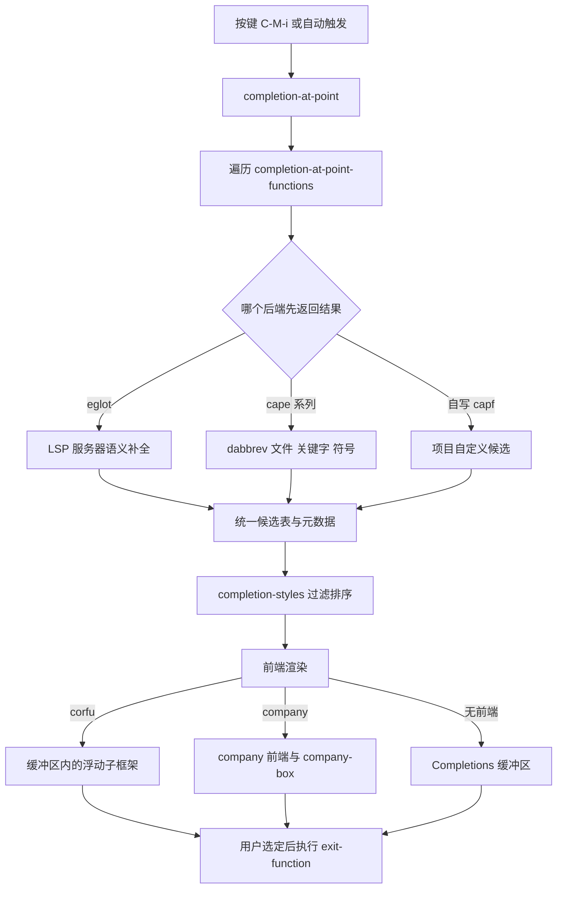
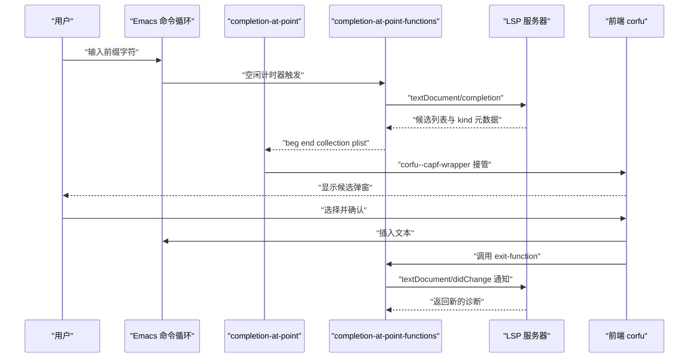

# 补全与 LSP

> 本篇把「Emacs 怎么补全代码」拆成数据、界面、上下文三层讲透，并给出 eglot、corfu、cape、flymake 的完整可用配置，读完即可把 Emacs 当作带语义补全的主力编辑器。

---

## 一、先建立三层模型

### 1.1 补全不是一件事，而是三件事

新手配置补全时最常见的失败模式，是把三个互相独立的问题混在一起调：候选从哪来、候选怎么显示、按什么规则过滤。Emacs 的设计把这三件事拆得很干净，理解这个拆分，后面所有配置都能自己推导出来。

- **数据层**：`completion-at-point-functions`（缩写 capf）里的函数，负责回答「光标处的候选集合是什么」。它是一个函数列表，Emacs 依次调用，取第一个返回非 nil 的结果。
- **界面层**：把候选画出来的前端。内置的 `*Completions*` 缓冲区和 `completion-in-region-mode` 是一种极简前端；第三方包 corfu 与 company 是弹出式前端。
- **上下文层**：给数据层提供语义信息的来源。LSP 服务器（eglot、lsp-mode）、语言自身的语法分析（tree-sitter、`syntax-ppss`）、Emacs 自身状态（dabbrev 扫缓冲区、`load-path` 里的函数名）都属于这一层。

术语先说清：本文里的**缓冲区（buffer）**指 Emacs 里承载文本的对象，和文件不是一对一；**窗口（window）**指框架内显示某个缓冲区的区域；**框架（frame）**才是操作系统层面的窗口。补全弹出的是窗口，不是新框架。

### 1.2 分层架构图



这张图里有一个容易被忽略的环节：`completion-styles` 的过滤排序发生在数据层和界面层之间。前端拿到的候选已经过了样式匹配，所以「补全不出来」有时是样式问题而不是后端问题，这一点在第十一节会再展开。

### 1.3 一次补全请求的时序



注意最后两步：补全确认后 Emacs 会调用 capf 返回的 `:exit-function`，而 eglot 正是在这里把改动同步回服务器。所以「补全后诊断略有延迟」是设计使然，不是故障。

---

## 二、内置补全基础

### 2.1 四个命令各自的职责

| 命令 | 作用 | 默认键位 |
| --- | --- | --- |
| `completion-at-point` | 在光标处补全，走 capf 机制，可用于任何 major mode | `C-M-i` 与 `M-TAB` |
| `completion-in-region` | 对指定区间补全，需要传入起止位置和候选表 | 无默认全局键位 |
| `completion-help-at-point` | 只显示 `*Completions*` 缓冲区，不插入 | 无默认全局键位 |
| `indent-for-tab-command` | `TAB` 的默认绑定，做缩进 | `TAB` |

`TAB` 的行为由变量 `tab-always-indent` 决定。它的默认值是 `t`，表示 `TAB` 只做缩进；把它设为 `complete`，`TAB` 会先尝试缩进，缩进不动时再尝试补全。这个变量的默认值在 Emacs 30 里仍是 `t`。

```elisp
;; TAB 先缩进，缩进无变化时触发补全；Emacs 24 起支持 complete 取值
(setq tab-always-indent 'complete)

;; 同时让 TAB 在补全菜单里循环选择候选，配合 corfu 时由 corfu-map 接管
(setq completion-cycle-threshold nil)
```

`completion-at-point-functions` 的默认值只有一个元素，是 `tags-completion-at-point-function`，也就是基于 `TAGS` 文件的补全。在编程缓冲区里想让补全生效，必须由 major mode 或第三方包往这个列表里加函数。

### 2.2 capf 的返回值格式

一个 capf 函数返回 nil 表示「我不管这段文本」；返回一个列表表示「我提供候选」。列表的固定部分是前三项：

```text
(BEG END COLLECTION . PROPS)
```

- `BEG`、`END`：被补全替换的区间。补全不只是插入，会把这段文本替换掉。
- `COLLECTION`：候选集合。可以是字符串列表、哈希表、函数，或者 `(作表函数 . 判定函数)` 这样的 cons。
- `PROPS`：属性列表，常用键有 `:exclusive`、`:annotation-function`、`:affixation-function`、`:company-kind`、`:exit-function`、`:company-doc-buffer`。

`:exclusive` 的语义值得单独记住：值为 `t` 时，如果本 capf 返回了结果，Emacs 就停止调用后面的 capf；值为 `no` 时还会继续合并后面的候选。eglot 默认不独占，所以 eglot 与 cape 的候选可以同时出现在列表里。

### 2.3 写一个自己的 capf 后端

下面这段是完整可运行的示例。把它放进 `init.el`，在任意 `emacs-lisp-mode` 缓冲区里输入 `re` 再按 `C-M-i`，就能看到颜色单词候选。

```elisp
;; 一个最小的自定义 capf 后端：补全颜色单词
(defvar my-capf-color-words
  '("red" "green" "blue" "yellow" "black" "white")
  "本后端提供的候选集合。")

(defun my-capf-colors ()
  "在符号位置提供颜色单词补全。

返回 (BEG END COLLECTION . PROPS) 形式的 capf 结果；
不在符号上时返回 nil，让 Emacs 继续问下一个后端。"
  (when-let* ((bounds (bounds-of-thing-at-point 'symbol))
              (beg (car bounds))
              (end (cdr bounds))
              (prefix (buffer-substring-no-properties beg end))
              ;; 前缀至少一个字符才开始打扰用户
              ((>= (length prefix) 1)))
    (list beg end my-capf-color-words
          ;; 不独占：允许后面的 capf 继续追加候选
          :exclusive 'no
          ;; 候选右侧的浅色注解
          :annotation-function
          (lambda (cand)
            (concat " " (number-to-string (length cand)) " 字母"))
          ;; 告诉 corfu 与 company 这个候选的图标类别
          :company-kind (lambda (_cand) 'color)
          ;; 确认补全后做什么
          :exit-function
          (lambda (cand status)
            (when (eq status 'finished)
              (message "选中了颜色 %s" cand))))))

;; 注册到当前 major mode，而不是全局，避免污染所有缓冲区
(add-hook 'emacs-lisp-mode-hook
          (lambda () (add-hook 'completion-at-point-functions
                               #'my-capf-colors nil t)))
```

三个设计细节值得模仿：

- 用 `bounds-of-thing-at-point` 而不是手工扫字符，能自动处理符号语法表。
- 返回 `:exclusive 'no`，把「要不要独占」的决定权留给用户配置，而不是硬编码。
- 用 `add-hook` 的 LOCAL 参数（末尾的 `t`）只影响当前缓冲区，同一个 hook 在别的 mode 里不会生效。

---

## 三、前端一：corfu

### 3.1 corfu 与 company 的对比

corfu 的作者是 Daniel Mendler，和 vertico、consult、cape、tempel 属于同一套设计语言。company 是历史最久的前端。

| 维度 | corfu | company |
| --- | --- | --- |
| 实现方式 | 用子框架（child frame）在光标处弹出，或用 `corfu-popupinfo` 在缓冲区内弹出文档 | 用 overlay 与 `after-string` 在缓冲区内绘制 |
| 与 capf 的关系 | 直接消费 capf，是 capf 的完整前端 | 有自己的一套 backend 协议，对 capf 通过适配层支持 |
| 终端支持 | 依赖图形界面；终端下能力受限 | 纯文本绘制，终端下表现更稳 |
| 生态 | 与 cape、tempel、vertico 天然配套 | 后端数量多，历史配置与教程多 |
| 体积 | 极小，单文件核心 | 较大 |
| 维护状态 | 活跃 | 仍在维护 |

给新配置的建议是 corfu：它不发明新协议，只做 capf 的显示层，配置项少、行为可预测，而且未来换回 `*Completions*` 只需关掉一个 minor mode。只有在必须跑在纯终端里、或者依赖某个只提供 company backend 的包时，才选 company。

### 3.2 corfu 完整配置

```elisp
;; corfu 需要 Emacs 29.1 以上：包声明依赖 (emacs "29.1") 与 compat
(use-package corfu
  :ensure t
  :custom
  ;; 输入时自动弹出候选，不需要手按补全键
  (corfu-auto t)
  ;; 自动弹出前输入多少个字符；1 表示立刻，编程建议 2
  (corfu-auto-prefix 2)
  ;; 自动弹出的延迟（秒），太小会在大项目里造成卡顿
  (corfu-auto-delay 0.25)
  ;; 让 TAB 与 S-TAB 在候选里循环
  (corfu-cycle t)
  ;; 让 RET 直接确认当前预选候选
  (corfu-preselect 'valid)
  ;; 输入分隔符（空格）时结束补全，避免在参数列表里乱弹
  (corfu-quit-at-boundary 'separator)
  ;; 没有匹配项时也退出，而不是显示空框
  (corfu-quit-no-match 'separator)
  ;; 候选数量与滚动边距
  (corfu-count 12)
  (corfu-scroll-margin 3)
  (corfu-min-width 20)
  :bind
  ;; 空格键触发补全，比 C-M-i 顺手；不占用 TAB
  (:map corfu-map
        ("SPC" . corfu-insert-separator)
        ("C-n" . corfu-next)
        ("C-p" . corfu-previous)
        ("C-h" . corfu-info-documentation)
        ("M-g" . corfu-info-location))
  :init
  ;; corfu 是全局 minor mode，用 global-corfu-mode 打开
  (global-corfu-mode 1)
  ;; 在 eshell、shell 等模式里自动弹出会干扰输入，排除掉
  (setq global-corfu-modes
        '((not eshell-mode shell-mode term-mode vterm-mode)
          t)))

;; 弹出文档与位置信息的小窗口
(use-package corfu-popupinfo
  :ensure nil          ; 随 corfu 一起安装，不需要单独拉包
  :after corfu
  :custom
  ;; 停留多久后显示文档，列表形式表示 (显示延迟 隐藏延迟)
  (corfu-popupinfo-delay '(0.5 . 1.0))
  :hook (corfu-mode . corfu-popupinfo-mode))
```

`global-corfu-modes` 的取值是一个条件列表，`(not ...)` 形式表示排除，末尾的 `t` 表示其余模式全部启用。这种写法在 corfu 的文档里叫「mode 条件表达式」，比逐个列举模式更好维护。

corfu 的默认键位定义在 `corfu-map` 里，值得知道的几个是：`C-g`（`corfu-quit`）、`RET`（`corfu-insert`）、`TAB`（`corfu-complete`）、`M-TAB`（`corfu-expand`）、`M-n` 与 `M-p`（`corfu-next` 与 `corfu-previous`）、`M-g`（`corfu-info-location`）、`M-h`（`corfu-info-documentation`）。用 `C-h v corfu-map RET` 可以看到当前版本的全部绑定。

### 3.3 company 完整配置

company 的组织方式与 corfu 根本不同：它维护 `company-backends` 这个**后端列表**，每个元素是一个 backend 函数或命令，`company-backends` 里还可以写 `(backend1 backend2 :separate)` 这样的分组形式来合并候选。

```elisp
(use-package company
  :ensure t
  :custom
  ;; 输入后多久自动弹出；0.2 是默认值
  (company-idle-delay 0.3)
  ;; 至少输入几个字符才自动弹出
  (company-minimum-prefix-length 2)
  ;; 只在符号内部补全，减少在字符串里乱弹
  (company-inhibit-inside-symbols t)
  ;; 候选列表最多显示多少条
  (company-tooltip-limit 12)
  ;; 候选左右对齐注解，阅读更整齐
  (company-tooltip-align-annotations t)
  ;; 候选循环选择
  (company-selection-wrap-around t)
  ;; 允许数字快速选择
  (company-show-quick-access t)
  ;; 唯一匹配时不自动确认，避免误插入
  (company-abort-on-unique-match t)
  :bind
  (:map company-active-map
        ("C-n" . company-select-next)
        ("C-p" . company-select-previous)
        ("C-h" . company-show-doc-buffer)
        ("M-g" . company-show-location)
        ("<tab>" . company-complete-common-or-cycle))
  :config
  ;; 后端列表：顺序即优先级，前面的候选排在最前面
  (setq company-backends
        '((company-capf          ; 走标准 capf，eglot 的候选从这里来
           company-dabbrev-code  ; 同缓冲区里的相近标识符
           :separate)            ; :separate 表示各后端的候选分组显示
          company-keywords       ; 当前 major mode 的关键字
          company-files          ; 文件路径
          company-yasnippet))    ; yasnippet 片段，需要另外装 yasnippet
  (global-company-mode 1))

;; company 的图标与图形化外观
(use-package company-box
  :ensure t
  :hook (company-mode . company-box-mode)
  :custom
  ;; 是否用图标代替文字类型标注；终端下建议关闭
  (company-box-enable-icon t)
  ;; 候选数量上限，超过则滚动
  (company-box-max-candidates 12)
  (company-box-scrollbar t))
```

关于 `company-box` 的现状必须说准确：它最后的发版版本停留在 2024 年 3 月，仓库仍在，功能可用，但没有跟随 company 后来的新特性同步演进。company 自身从 2023 年起内置了 `company-format-margin-function`、`company-icon-size`、`company-text-icons-*` 等图标相关能力，如果你只需要类型图标，优先用 company 自带的可选项，把 company-box 当作可选的增强层。

### 3.4 只装一个的判断标准

- 图形界面下的日常开发，选 corfu。
- 需要在服务器纯终端里 SSH 进去用 Emacs，选 company。
- 已经有一份用了很多年的 company 配置，不要为了追新而迁移，除非你确实需要 cape 的那些 capf 组合器。
- 两个都装不会冲突，但同时开着会看到两个候选框，务必只启用其中一个。

---

## 四、cape：给 capf 补齐常用后端

cape 是「Completion At Point Extensions」的缩写，它把那些本来只存在于 company 生态里的补全来源，改写成标准 capf，从而让 corfu 也能用。它的包声明只依赖 Emacs 29.1 与 compat，没有任何重量级依赖。

### 4.1 它提供哪些 capf

| 函数 | 候选来源 | 典型用途 |
| --- | --- | --- |
| `cape-dabbrev` | 当前缓冲区或指定缓冲区函数里的单词 | 补全你自己刚写过的长标识符 |
| `cape-file` | 文件系统路径 | 配置文件路径、`#include "..."` |
| `cape-keyword` | 各语言的关键字表（由 `cape-keyword-list` 定义） | 无 LSP 时的关键字补全 |
| `cape-elisp-symbol` | 已加载的 Elisp 符号，带文档注解 | 写配置时补函数名 |
| `cape-elisp-block` | org 缓冲区里 src 代码块的 Elisp 符号 | 在 org 里写配置片段 |
| `cape-dict` | 系统字典文件 | 写英文文档时的单词补全 |
| `cape-line` | 其他缓冲区里的整行 | 重复的样板行 |
| `cape-abbrev` | abbrev 表 | 老式缩写补全 |
| `cape-history` | 当前 major mode 的输入历史 | shell、eshell |

cape 还提供一组 `cape-wrap-*` 组合器，用来改造已有 capf，例如 `cape-wrap-super` 把多个 capf 的候选合并成一个后端、`cape-wrap-buster` 在补全期间禁用缓存、`cape-wrap-case-fold` 控制大小写折叠、`cape-wrap-properties` 统一追加属性。这些组合器是 cape 最有价值的部分，因为它们让你能修复别人写的 capf，而不必等上游更新。

### 4.2 一组实用的组合配置

```elisp
(use-package cape
  :ensure t
  :init
  ;; 关键：先把 cape 的 capf 挂进 completion-at-point-functions
  ;; 顺序决定优先级，想优先的放前面
  (add-hook 'completion-at-point-functions #'cape-dabbrev)
  (add-hook 'completion-at-point-functions #'cape-file)
  (add-hook 'completion-at-point-functions #'cape-keyword)

  ;; 只在编程模式里挂 cape-dabbrev 是更克制的做法：
  ;; 上面那行全局挂载会让 org、markdown 里也不断弹候选，
  ;; 如果你更喜欢克制的默认，把上面三行删掉，改用下面这段。
  ;; (add-hook 'prog-mode-hook
  ;;           (lambda ()
  ;;             (add-hook 'completion-at-point-functions
  ;;                       #'cape-dabbrev nil t)))

  ;; cape-dabbrev 默认在所有同 major mode 的缓冲区里找候选，
  ;; 候选太多时改成只看当前缓冲区
  (setq cape-dabbrev-buffer-function #'cape-same-mode-buffers)

  ;; 让 dabbrev 忽略长度不足 3 的词，减少噪声
  (setq cape-dabbrev-min-length 3)

  :config
  ;; 只在 Emacs Lisp 缓冲区里补符号与关键位置
  (add-hook 'emacs-lisp-mode-hook
            (lambda ()
              (add-hook 'completion-at-point-functions
                        #'cape-elisp-symbol nil t)))

  ;; 在 org 缓冲区里补 Elisp 代码块内容
  (add-hook 'org-mode-hook
            (lambda ()
              (add-hook 'completion-at-point-functions
                        #'cape-elisp-block nil t)))

  ;; 组合器示范：把 dabbrev 与 keyword 合成一个后端，
  ;; 并用 cape-wrap-buster 在每次补全时丢弃缓存，
  ;; 适合文件频繁变化、候选需要实时反映的场景
  (defun my-cape-combo ()
    "dabbrev 与关键字合并的 capf。"
    (cape-wrap-super #'cape-dabbrev #'cape-keyword))

  (add-hook 'text-mode-hook
            (lambda ()
              (add-hook 'completion-at-point-functions
                        #'my-cape-combo nil t))))
```

一个容易踩的坑：`add-hook` 到 `completion-at-point-functions` 时，**顺序即优先级**。eglot 启动时会把它的 capf 挂到列表最前面，所以 LSP 候选优先于 cape 候选。如果你希望 dabbrev 优先（比如补一个 LSP 索引不到的局部变量），把 `cape-dabbrev` 用 `add-hook` 的深度参数放到最前面，或者用 `cape-wrap-super` 自己控制合并顺序。

### 4.3 补全的图标

候选前的类型图标在两个前提下才有意义：终端或字体里有 Nerd Font 字形，以及前端支持渲染。两套常见方案如下。

方案一，nerd-icons-corfu，依赖 nerd-icons：

```elisp
;; 需要 Emacs 27.1 以上，以及 nerd-icons
(use-package nerd-icons
  :ensure t)

(use-package nerd-icons-corfu
  :ensure t
  :after corfu
  :init
  ;; nerd-icons-corfu-formatter 是 corfu 的 margin formatter，
  ;; 通过 corfu-margin-formatters 注册
  (add-to-list 'corfu-margin-formatters #'nerd-icons-corfu-formatter)
  :custom
  ;; 候选映射表：把 capf 的 :company-kind 映射成图标
  (nerd-icons-corfu-mapping
   '((array "nf-md-code_array" "solarized_blue")
     (boolean "nf-md-check_circle_outline" "solarized_green")
     (class "nf-md-vector_square" "solarized_yellow")
     (color "nf-md-palette" "solarized_orange")
     (constant "nf-md-lock" "solarized_orange")
     (constructor "nf-md-function_variant" "solarized_yellow")
     (enummember "nf-md-format_list_bulleted" "solarized_purple")
     (field "nf-md-square_small" "solarized_blue")
     (file "nf-md-file" "solarized_blue")
     (folder "nf-md-folder" "solarized_blue")
     (function "nf-md-function" "solarized_yellow")
     (interface "nf-md-vector_square" "solarized_yellow")
     (keyword "nf-md-key" "solarized_purple")
     (method "nf-md-function" "solarized_yellow")
     (module "nf-md-square" "solarized_blue")
     (numeric "nf-md-numeric" "solarized_blue")
     (operator "nf-md-plus_minus" "solarized_green")
     (property "nf-md-wrench" "solarized_blue")
     (snippet "nf-md-code_braces" "solarized_green")
     (string "nf-md-format_quote_open" "solarized_green")
     (struct "nf-md-vector_square" "solarized_yellow")
     (text "nf-md-format_text" "solarized_blue")
     (unit "nf-md-ruler" "solarized_blue")
     (variable "nf-md-variable" "solarized_blue"))))
```

方案二，kind-icon。它不在 MELPA 上，只能从源码仓库安装，这一点必须先说明，免得你 `M-x package-install` 找不到。用 Emacs 29 起内置的 `package-vc-install` 可以装：

```elisp
;; kind-icon 不在 MELPA，用 package-vc-install 从 Git 仓库安装
;; 需要 Emacs 29 以上，且能访问 GitHub
(unless (package-installed-p 'kind-icon)
  (package-vc-install "https://github.com/jdtsmith/kind-icon"))

(use-package kind-icon
  :after corfu
  :custom
  ;; 图标缓存目录
  (kind-icon-default-face 'corfu-default)
  ;; 终端里 SVG 不可用，自动降级为文本
  (kind-icon-use-icons (display-graphic-p))
  (kind-icon-blend-background t)
  (kind-icon-blend-frac 0.08)
  :config
  (add-to-list 'corfu-margin-formatters #'kind-icon-margin-formatter))
```

`kind-icon-use-icons` 与图形界面判断的这行写法是有意为之：在纯终端里 SVG 渲染会失败，图标会显示成方块，不如直接退回文本标注。

### 4.4 字体前提

Nerd Font 字形（`nf-*` 这些图标名）需要终端或 Emacs 使用打了补丁的字体。三平台安装：

```bash
# Debian/Ubuntu：仓库里有 nerd-fonts 的部分字体
$ sudo apt install fonts-firacode
# 更完整的一套建议手动下载安装
$ mkdir -p ~/.local/share/fonts && cd ~/.local/share/fonts
$ curl -fLO https://github.com/ryanoasis/nerd-fonts/releases/latest/download/FiraCode.zip
$ unzip -o FiraCode.zip && fc-cache -fv

# Arch：AUR 里有维护良好的包
$ yay -S nerd-fonts-fira-code
# 或者官方仓库的 ttf-firacode-nerd 系列（视仓库同步情况）

# macOS：Homebrew 的字体 cask 名称是 font- 前缀
$ brew install --cask font-fira-code-nerd-font

# Windows：用 scoop 的 nerd-fonts 桶
$ scoop bucket add nerd-fonts
$ scoop install FiraCode-NF
# 或者用 winget 装基础 Fira Code，再手动补 Nerd Font 版本
$ winget install --id=SublimeHQ.FiraCode
```

装完在 Emacs 里设置字体，注意把字体族名写对：

```elisp
;; 图形界面下设置字体；等宽字体族名要写系统里真实的名字
(when (display-graphic-p)
  (set-face-attribute 'default nil
                      :family "FiraCode Nerd Font"
                      :height 130)
  ;; 中文字体单独指定，避免 Nerd Font 里缺汉字导致回退
  (dolist (charset '(kana han cjk-misc bopomofo))
    (set-fontset-font t charset (font-spec :family "Noto Sans CJK SC"))))
```

---

## 五、minibuffer 补全与缓冲区补全是两回事

这是新手最容易混淆的一处。`M-x` 提示符、`C-x C-f` 找文件、`M-:` 求值，这些输入发生在 **minibuffer** 里；写代码时在缓冲区里补全标识符，走的是第一章讲的 capf 通路。两条通路的实现、变量、可插拔点完全不同。

| 维度 | 缓冲区补全 | minibuffer 补全 |
| --- | --- | --- |
| 入口 | `completion-at-point` 与 capf | `completing-read` |
| 候选过滤变量 | `completion-styles` 同样生效 | `completion-styles` 同样生效 |
| 前端插件 | corfu、company | vertico、ivy、helm、icomplete、ido |
| 弹出位置 | 光标处（corfu）或缓冲区末尾 | minibuffer 下方或独立缓冲区 |
| 典型配置 | 本篇第三节 | 见下 |

minibuffer 侧的三种主流方案定位：

- **vertico**：只做垂直显示层，配合 `consult`（搜索与导航命令集）和 `marginalia`（候选注解）。极简、无侵入，是当前新配置的主流选择。详细配置见 [[emacs教程/3配置实践/04_界面布局与功能位置|界面布局与功能位置]]。
- **ivy 与 counsel**：ivy 是补全框架，counsel 是命令集。成熟稳定但作者精力已转向其他项目，社区仍在维护。
- **helm**：功能最多、历史最久，但代码体量大、启动开销明显，目前活跃度最低。

补全与键位系统的关系在 [[emacs教程/3配置实践/03_键位系统设计|键位系统设计]] 里有更完整的讨论，这里只给一个可以立刻用起来的 vertico 最小配置：

```elisp
(use-package vertico
  :ensure t
  :custom
  (vertico-cycle t)
  :init
  (vertico-mode 1))

(use-package marginalia
  :ensure t
  :init
  (marginalia-mode 1))

(use-package consult
  :ensure t
  :bind
  ("C-x b" . consult-buffer)
  ("M-g g" . consult-goto-line)
  ("M-g i" . consult-imenu)
  ("M-s r" . consult-ripgrep))
```

---

## 六、诊断：flymake 与 flycheck

补全解决了「写什么」，诊断解决「写错了没有」。Emacs 有两套并存方案，`flymake` 内置，`flycheck` 是第三方。

### 6.1 flymake

flymake 的架构是「后端函数 + 报告回调」。后端通过变量 `flymake-diagnostic-functions` 注册，每个函数接收一个 report 回调，把诊断推给它。

```elisp
(use-package flymake
  :ensure nil                 ; 内置，不需要安装
  :custom
  ;; 缓冲区变化后多久开始检查（秒），太小会让大文件卡顿
  (flymake-no-changes-timeout 0.5)
  ;; 打开 flymake-mode 后立刻检查一次
  (flymake-start-on-flymake-mode t)
  ;; 保存缓冲区后检查（Emacs 29 新增的变量）
  (flymake-start-on-save-buffer t)
  ;; 到末尾后是否回到开头继续找
  (flymake-wrap-around t)
  ;; 在行尾直接显示诊断摘要，不用把光标移过去
  (flymake-show-diagnostics-at-end-of-line 'short)
  :hook
  ;; prog-mode 下统一打开；eglot 接管后会自己管理 flymake
  (prog-mode . flymake-mode)
  :bind
  ;; flymake 会设置 next-error-function，所以 M-g M-n 天然可用；
  ;; 这里再补一组更短的键位
  (:map flymake-mode-map
        ("M-n" . flymake-goto-next-error)
        ("M-p" . flymake-goto-prev-error)
        ("C-c ! l" . flymake-show-buffer-diagnostics)
        ("C-c ! p" . flymake-show-project-diagnostics)))
```

| 命令 | 作用 |
| --- | --- |
| `flymake-goto-next-error` | 跳到下一个诊断，可加前缀参数跳过指定级别 |
| `flymake-goto-prev-error` | 跳到上一个诊断 |
| `flymake-show-buffer-diagnostics` | 用列表缓冲区列出本缓冲区全部诊断 |
| `flymake-show-project-diagnostics` | 列出整个项目的诊断，需要 project.el 能识别项目根 |
| `flymake-start` | 手动立即检查一次 |
| `flymake-switch-to-log-buffer` | 打开日志，排查后端为什么没跑起来 |
| `flymake-mode` | 开关当前缓冲区的检查 |

与 eglot 的集成方式很关键：**eglot 启动时会自动往 `flymake-diagnostic-functions` 里加自己的后端**，并把 LSP 的 `publishDiagnostics` 通知转成 flymake 诊断。你不需要手动配置这一步。如果发现 LSP 诊断没出现，先看 `M-x flymake-switch-to-log-buffer` 的日志，再用第二节末尾的 `M-x eglot-events-buffer` 看服务器是否真的发了通知。

### 6.2 flycheck

flycheck 走的是另一条路：它为每种语言准备一个**命令行检查器**（checker），调用外部程序解析输出。这与 LSP 推送诊断的模型不同，两者可以并存，也可以让其中一个专责。

```elisp
(use-package flycheck
  :ensure t
  :custom
  ;; 什么事件触发检查：保存、空闲改动、换行、启用 mode
  (flycheck-check-syntax-automatically '(save idle-change mode-enabled))
  ;; 空闲检查的延迟（秒）
  (flycheck-idle-change-delay 0.5)
  ;; 只在保存后检查则用这一行代替上面的列表
  ;; (flycheck-check-syntax-automatically '(save mode-enabled))
  ;; 错误导航范围：buffer 只在当前文件，project 会跨文件
  (flycheck-navigation-scope 'buffer)
  ;; 错误行的指示方式：fringe 边栏、margin 边距或 none
  (flycheck-indication-mode 'left-fringe)
  ;; 光标停在错误上时是否自动在 echo area 显示信息
  (flycheck-display-errors-delay 0.9)
  ;; 命令行键位前缀，默认是 C-c !
  ;; 注意：此变量必须在加载 flycheck 前用 customize-set-variable 设置
  :init
  (global-flycheck-mode 1)
  :bind
  (:map flycheck-command-map
        ("n" . flycheck-next-error)
        ("p" . flycheck-previous-error)
        ("l" . flycheck-list-errors)
        ("c" . flycheck-buffer)
        ("v" . flycheck-verify-setup)
        ("s" . flycheck-select-checker)))
```

`flycheck-command-map` 的默认键位前缀就是 `C-c !`，常用绑定包括 `C-c ! n`（下一个错误）、`C-c ! p`（上一个错误）、`C-c ! l`（错误列表）、`C-c ! c`（立即检查）、`C-c ! v`（验证配置）、`C-c ! s`（临时换检查器）、`C-c ! ?`（描述检查器）。修改前缀要用 `customize-set-variable`，直接 `setq` 不生效，这是 flycheck 文档里明确写过的。

支持的检查器有几百个，用 `M-x flycheck-verify-setup` 能看到当前缓冲区实际会跑哪个检查器、为什么其他候选被跳过。常见对应关系是：C/C++ 用 `c/c++-clang` 或 `c/c++-gcc`，Python 用 `python-flake8`、`python-pylint`、`python-mypy`，Rust 用 `rust-cargo`，Go 用 `go-golangci-lint`，JavaScript 用 `javascript-eslint`，Shell 用 `sh-shellcheck`。

与 LSP 的配合必须写准确：flycheck 提供两个桥接模式，`flycheck-eglot-mode` 让 Eglot 的诊断进入 flycheck 的检查器链，`flycheck-lsp-mode` 则面向 lsp-mode。默认情况下 `flycheck-eglot-exclusive` 为 `t`，即启用桥接后缓冲区只报告 Eglot 的诊断；把它设为 `nil` 时，`eglot-check` 会继续链到后续的命令行检查器，于是 LSP 语义诊断与 lint 工具的结果可以同时出现。

```elisp
;; 让 flycheck 也显示 Eglot 的诊断，并继续链到命令行检查器
(use-package flycheck-eglot
  :ensure t
  :after (flycheck eglot)
  :custom
  ;; t：只报告 LSP 诊断；nil：LSP 诊断之后再链到命令行检查器
  (flycheck-eglot-exclusive nil)
  :hook (eglot-managed-mode . flycheck-eglot-mode))
```

### 6.3 选择建议

| 场景 | 建议 |
| --- | --- |
| 主要用 eglot 做 LSP | 用内置 flymake，零额外配置，eglot 自动接管 |
| 需要某些 LSP 不提供的 lint（如 shellcheck、eslint 的风格规则） | flycheck，或用 `flycheck-eglot-mode` 做桥接 |
| 需要错误列表缓冲区、跨项目错误导航 | flycheck 的 `flycheck-list-errors` 更成熟 |
| 追求配置最少、依赖最少 | flymake |
| 需要在同一个项目里混用多种语言且各自有独立检查器 | flycheck |

同时开两个会在 mode line 上看到两个计数、两套 fringe 图标，建议只留一个。切换的方法是关掉 `global-flycheck-mode` 并保持 `flymake-mode`，或者直接在 init 里不加载 flycheck。

---

## 七、LSP 的三条路线

### 7.1 对比

| 维度 | eglot | lsp-mode | lsp-bridge |
| --- | --- | --- | --- |
| 归属 | Emacs 内置，Emacs 29 起随发行版提供 | 第三方，MELPA | 第三方，独立仓库 |
| 设计目标 | 薄封装 LSP，尽量少发明概念 | 功能完备的 IDE 层，自带 UI 组件 | 把补全计算放到外部进程以求低延迟 |
| 依赖 | 无第三方依赖 | 依赖 dash、f、ht、spinner、markdown-mode、lv 等 | 依赖 Python 侧进程与对应包 |
| 配置量 | 小 | 大 | 中等 |
| IDE 风格 UI | 无，交给 flymake、xref、eldoc | 有 lsp-ui、treemacs、headerline 等 | 有独立 UI |
| 资源占用 | 低 | 较高，大项目里文件监视与 UI 更新是主要开销 | 视外部进程而定 |
| 适合 | 想要可靠、可预期的语义补全 | 想要完整 IDE 体验、愿意接受更多配置 | 想要极致补全响应速度 |

第三条路线属于多进程方案，其活跃状态与兼容性由使用者自行核实，本篇不展开细节，也不给出未经验证的安装步骤。

### 7.2 为什么默认推荐 eglot

eglot 由 João Távora 维护并已并入 Emacs 官方，这意味着三件事：它随 Emacs 一起升级、它的行为要过 Emacs 的兼容性要求、它与 Emacs 自带的 xref、eldoc、flymake、project.el 是原生配合关系。Emacs 30 的 eglot 已经覆盖了绝大部分日常需求：补全、跳转定义、查找引用、重命名、格式化、代码动作、文档悬浮、诊断，以及工作区配置与 typeHierarchy、callHierarchy 这类较新的 LSP 能力。

它不做的事也很清楚：不做花哨的悬浮文档框架，不做侧边栏符号树，不做自定义 mode line 诊断计数。这些交给别的包，或者不要。

### 7.3 语言服务器安装命令表

用 eglot 前必须先在系统里装好对应的语言服务器。`eglot` 只负责说 LSP 协议，不含编译器或索引器。

| 语言 | 服务器 | Debian/Ubuntu | Arch | macOS | Windows |
| --- | --- | --- | --- | --- | --- |
| C/C++ | clangd | `sudo apt install clangd` | `sudo pacman -S clang` | `brew install llvm` 后把 `$(brew --prefix llvm)/bin` 加入 PATH | `winget install LLVM.LLVM` |
| Python | pyright | `pipx install pyright` 或 `npm i -g pyright` | `sudo pacman -S pyright` | `brew install pyright` | `npm i -g pyright` |
| Python | pylsp | `pipx install python-lsp-server` | `sudo pacman -S python-lsp-server` | `brew install python-lsp-server` | `pipx install python-lsp-server` |
| Rust | rust-analyzer | `rustup component add rust-analyzer` | `rustup component add rust-analyzer` | `rustup component add rust-analyzer` | `rustup component add rust-analyzer` |
| Go | gopls | `go install golang.org/x/tools/gopls@latest` | `sudo pacman -S gopls` | `brew install gopls` | `go install golang.org/x/tools/gopls@latest` |
| JS/TS | typescript-language-server | `npm i -g typescript typescript-language-server` | `sudo pacman -S typescript-language-server` | `brew install typescript-language-server` | `npm i -g typescript typescript-language-server` |
| Java | jdtls | `sudo apt install jdtls`（部分版本才有）或从上游下载 | `sudo pacman -S jdtls` | `brew install jdtls` | 从上游 release 解压后加入 PATH |
| Dart | dart language-server | 随 Dart SDK 提供 | `sudo pacman -S dart` | `brew install dart` | 随 Dart SDK 提供 |
| Lua | lua-language-server | 从上游 release 下载 | `sudo pacman -S lua-language-server` | `brew install lua-language-server` | `winget install Lua.LuaLS` |

Rust 用 `rustup component add rust-analyzer` 是最省事的方式，不需要单独下载二进制。Python 侧建议用 `pipx` 而不是全局 `pip`，避免污染系统 Python 环境。

### 7.4 eglot 完整配置

```elisp
(use-package eglot
  :ensure nil                      ; Emacs 29 起内置
  :custom
  ;; 连接超时（秒），大项目首次索引慢，可调大
  (eglot-connect-timeout 60)
  ;; 阻塞等待时长。t 表示一直阻塞到超时，
  ;; nil 表示完全不阻塞，正整数表示阻塞这么多秒后转后台等待。
  ;; 大项目建议设 t 或较大的整数，否则会出现刚打开文件时没补全
  (eglot-sync-connect t)
  ;; 关掉最后一个托管缓冲区后自动关闭服务器进程，避免僵尸进程堆积
  (eglot-autoshutdown t)
  ;; 从跨项目引用跳转过去的文件也自动跟随启用 eglot
  (eglot-extend-to-xref t)
  ;; 服务器发起的编辑是否要确认；设为 nil 表示直接应用
  (eglot-confirm-server-initiated-edits nil)
  ;; 通知服务器的空闲延迟，越小越实时但越费 CPU
  (eglot-send-changes-idle-time 0.5)
  ;; 服务器日志缓冲区大小，排查问题时可以调大
  (eglot-events-buffer-config '(:size 2000000 :format full))
  :hook
  ;; 编程模式下自动启动 eglot，不需要每个文件手敲 M-x eglot
  ((prog-mode . eglot-ensure)
   ;; 首次打开文件时不要在只读或特殊缓冲区里启动
   (eglot-managed-mode . (lambda ()
                           (setq-local eldoc-documentation-strategy
                                       #'eldoc-documentation-compose-eagerly))))
  :config
  ;; 让 eglot 与 corfu 共存：eglot 默认也会试图接管 company，
  ;; 明确告诉它不要碰 corfu 相关的设置
  (setq eglot-stay-out-of '(corfu company)))

;; 项目级工作区配置：给服务器传项目专属参数
;; 推荐写成目录局部变量，放在项目根的 .dir-locals.el 里
;; 下面这段是示例内容，不要直接放进 init.el（它必须是 dir-local）
;; ((nil . ((eglot-workspace-configuration
;;           . (:pylsp (:plugins (:jedi_completion (:include_params t
;;                                                  :fuzzy t)
;;                                 :pylint (:enabled :json-false)))
;;              :gopls (:usePlaceholders t
;;                      :staticcheck t))))))
```

`eglot-workspace-configuration` 必须通过目录局部变量（`.dir-locals.el`）或 `setq-default` 之外的机制设置。Emacs 会从项目根目录读这个变量，然后把内容序列化成 JSON 发给对应的服务器。检查实际发出的内容用 `M-x eglot-show-workspace-configuration`。

一个真实踩坑点：`eglot-stay-out-of` 里的元素是字符串或符号，会用正则去匹配变量名。默认值是空的，意味着 eglot 会主动设置 flymake、xref 和 company 相关的变量。如果你同时装了 company 并且希望保留自己的 `company-backends`，就必须把 `company` 放进这个列表，否则 eglot 接管时会覆盖它。

### 7.5 eglot 键位与常用命令

eglot 不自己定义大量键位，它复用的是 Emacs 既有的前端：

| 键位 | 命令 | 说明 |
| --- | --- | --- |
| `M-x eglot` | `eglot` | 在当前缓冲区手动启动连接 |
| `M-x eglot-ensure` | `eglot-ensure` | 由 hook 调用的自动启动入口 |
| `M-.` | `xref-find-definitions` | 跳到定义 |
| `M-?` | `xref-find-references` | 查找引用，走 xref 界面 |
| `M-,` | `xref-go-back` | 跳回刚才的位置 |
| `M-x eglot-rename` | `eglot-rename` | 重命名符号，会提示输入新名字 |
| `M-x eglot-format` | `eglot-format` | 有活动区域时格式化区域，否则格式化整个缓冲区 |
| `M-x eglot-format-buffer` | `eglot-format-buffer` | 无条件格式化整个缓冲区 |
| `M-x eglot-code-actions` | `eglot-code-actions` | 列出光标处可用的代码动作 |
| `M-x eglot-code-action-organize-imports` | 同左 | 整理 import |
| `M-x eglot-find-declaration` | 同左 | 跳到声明而不是定义 |
| `M-x eglot-find-implementation` | 同左 | 跳到实现 |
| `M-x eglot-find-typeDefinition` | 同左 | 跳到类型定义 |
| `M-x eglot-show-call-hierarchy` | 同左 | 打开调用层次 |
| `M-x eglot-show-type-hierarchy` | 同左 | 打开类型层次 |
| `M-x eldoc-doc-buffer` | `eldoc-doc-buffer` | 把当前符号文档显示在独立缓冲区 |
| `M-x eglot-reconnect` | `eglot-reconnect` | 重连服务器 |
| `M-x eglot-shutdown` | `eglot-shutdown` | 关闭当前项目的服务器 |
| `M-x eglot-events-buffer` | `eglot-events-buffer` | 查看收发报文，排查问题的第一入口 |
| `M-x eglot-stderr-buffer` | `eglot-stderr-buffer` | 查看服务器标准错误输出 |
| `M-x eglot-show-workspace-configuration` | 同左 | 查看实际发给服务器的配置 JSON |

eldoc 的用法值得单独说：它是 Emacs 内置的「光标处信息显示」机制。eglot 会设置 `eldoc-documentation-functions`，在 echo area 显示当前函数签名。想在独立缓冲区里看完整文档，用 `M-x eldoc-doc-buffer`；想控制详细程度，调 `eldoc-echo-area-use-multiline-p`。Emacs 30 的 eldoc 支持多后端组合，用 `eldoc-documentation-strategy` 控制合并方式。

排查 LSP 问题的标准流程是：先 `M-x eglot-events-buffer`，看有没有 `initialize` 成功的记录；如果服务器根本没起来，看 `M-x eglot-stderr-buffer`；如果起来了但没有诊断，检查是不是 `workspace/didChangeWatchedFiles` 被绕过，或者项目根本不在服务器识别的根目录里。

---

## 八、lsp-mode 配置

lsp-mode 是另一套完整实现，功能多于 eglot，代价是配置量和资源占用。

```elisp
(use-package lsp-mode
  :ensure t
  :commands (lsp lsp-deferred)
  :custom
  ;; 键位前缀。默认值随版本变化过，务必显式设置，
  ;; 否则升级后可能发现 C-c l 突然不见了
  (lsp-keymap-prefix "C-c l")
  ;; 自动猜测项目根，仅在项目结构不规范时打开
  (lsp-auto-guess-root nil)
  ;; 服务器重启策略：interactive 表示询问，自动重启设为 t
  (lsp-restart 'interactive)
  ;; 启用代码片段补全（需要 yasnippet 配合）
  (lsp-enable-snippet t)
  ;; 文件监视开关，大项目里关掉能显著降低 CPU
  (lsp-enable-file-watchers t)
  ;; 保存时是否让服务器格式化缓冲区
  (lsp-format-buffer-on-save nil)
  ;; 保存时自动整理 import
  (lsp-organize-imports-on-save nil)
  ;; 诊断与 UI 组件
  (lsp-diagnostics-provider :auto)
  (lsp-modeline-diagnostics-enable t)
  (lsp-headerline-breadcrumb-enable t)
  (lsp-enable-symbol-highlighting t)
  (lsp-enable-xref t)
  ;; 由 lsp-mode 自动配置 dap-mode（调试相关，见本模块第 4 篇）
  (lsp-enable-dap-auto-configure t)
  :hook
  ((prog-mode . lsp-deferred)       ; deferred 表示延迟到真正需要时启动
   (lsp-mode . lsp-enable-which-key-integration))
  :bind
  (:map lsp-mode-map
        ("C-c l r" . lsp-rename)
        ("C-c l f" . lsp-format-buffer)
        ("C-c l a" . lsp-execute-code-action)
        ("C-c l d" . lsp-describe-session)
        ("C-c l R" . lsp-workspace-restart)))

;; lsp-ui 提供悬浮文档、边栏信息、peek 预览
(use-package lsp-ui
  :ensure t
  :after lsp-mode
  :hook (lsp-mode . lsp-ui-mode)
  :custom
  ;; 悬浮文档；用子框架显示，鼠标悬停触发
  (lsp-ui-doc-enable t)
  (lsp-ui-doc-show-with-cursor nil)
  (lsp-ui-doc-show-with-mouse t)
  (lsp-ui-doc-delay 0.3)
  (lsp-ui-doc-position 'at-point)
  (lsp-ui-doc-max-width 100)
  ;; 边栏：显示当前行的诊断与符号信息
  (lsp-ui-sideline-enable t)
  (lsp-ui-sideline-show-diagnostics t)
  ;; 禁用边栏的悬停信息，避免和 lsp-ui-doc 重复
  (lsp-ui-sideline-show-hover nil)
  ;; peek：不离开当前缓冲区预览定义
  (lsp-ui-peek-enable t)
  ;; lsp-ui-imenu：符号树视图
  (lsp-ui-imenu-enable t))
```

lsp-mode 的键位在 `lsp-command-map` 里，前缀由 `lsp-keymap-prefix` 决定。常用的是 `s l`（或你设置的前缀）下的 `g d` 跳定义、`g r` 查找引用、`r r` 重命名、`= =` 格式化、`a a` 代码动作、`h h` 文档、`T D` 切换 modeline 诊断、`T b` 切换 breadcrumb。

关于 `lsp-ivy` 与 `lsp-treemacs` 的定位：`lsp-ivy` 是给 ivy 用户准备的工作区符号选择器，用 `lsp-ivy-workspace-symbol` 交互；`lsp-treemacs` 提供基于 treemacs 的符号树与错误树视图，用 `lsp-treemacs-symbols` 打开。这两个都是可选增强，不装不影响核心功能。用 vertico 的用户不需要 `lsp-ivy`，因为 lsp-mode 的符号选择本身就走 `completing-read`，vertico 会自动接管。

---

## 九、代码格式化

三条路径各有适用场景：

| 方案 | 原理 | 优点 | 缺点 |
| --- | --- | --- | --- |
| `eglot-format` | 走 LSP 的 `textDocument/formatting` | 与服务器共享配置，无需额外装工具 | 服务器必须支持格式化 |
| apheleia | 调用本地格式化命令，回写缓冲区时最小化改动 | 支持任何命令行格式化器，改动范围小，不破坏撤销栈 | 需要系统里装好格式化工具 |
| format-all | 调用本地格式化命令 | 支持语言多，配置简单 | 项目活跃度低于 apheleia |

format-all 目前仍在 MELPA 上并可安装，但维护节奏明显慢于 apheleia。新配置建议直接用 apheleia。

```elisp
(use-package apheleia
  :ensure t
  :custom
  ;; 格式化失败时不要弹出一堆错误，静默处理更省心
  (apheleia-remote-algorithm 'remote)
  :config
  ;; 全局模式：在 apheleia 支持的语言里自动格式化
  (apheleia-global-mode 1)
  ;; 排除某些模式
  (setq apheleia-inhibit-functions
        (list (lambda () (derived-mode-p 'org-mode)))
        ;; 保存前若 lsp 也格式化，避免双重触发
        )
  ;; 指定某个语言的格式化命令
  (setf (alist-get 'python-mode apheleia-mode-alist) '(ruff-isort ruff-format))
  (setf (alist-get 'c-mode apheleia-mode-alist) '(clang-format))
  (setf (alist-get 'rust-mode apheleia-mode-alist) '(rustfmt)))
```

apheleia 的关键设计是「最小改动回写」：它把格式化结果与原文做 diff，只替换真正变化的部分，所以不会打乱撤销栈，也不会把光标弹到缓冲区开头。这一点和 `eglot-format` 有本质区别，后者通常整缓冲区替换。

保存时格式化的写法有两种，必须选一种，不要都开：

```elisp
;; 方案 A：用 LSP 服务器格式化（需要服务器支持 documentFormattingProvider）
(defun my-eglot-format-before-save ()
  "保存前若 eglot 可格式化，则格式化缓冲区。"
  (when (and (bound-and-true-p eglot--managed-mode)
             (eglot-server-capable :documentFormattingProvider))
    (eglot-format-buffer)))

(add-hook 'before-save-hook #'my-eglot-format-before-save)

;; 方案 B：用 apheleia（推荐，改动范围小）
;; 上面已经用 apheleia-global-mode 打开，无需额外 hook。
;; 如果只想在特定模式下启用：
;; (add-hook 'python-mode-hook #'apheleia-mode)
;; 如果只想在保存时格式化：
;; (setq apheleia-mode-lighter nil)
```

关于「格式化与 git diff 污染」，这是团队协作里真实存在的问题，值得单独提醒：

- 格式化会改动大量与本次逻辑无关的行，导致 code review 时真正的改动被淹没。解决方案是让整个团队的格式化配置一致，并把格式化提交单独作为一个 commit。
- 如果你接手的项目从未格式化过，第一次全量格式化会产生巨大 diff。建议先和团队约定，或者只在你自己新写的文件上启用保存时格式化。
- 用 `.git-blame-ignore-revs` 把纯格式化的提交排除在 blame 之外，命令是 `git config blame.ignoreRevsFile .git-blame-ignore-revs`。这与 [[git|Git 与 GitHub 指南]] 里讲的协作流程配合使用。
- 不同格式化工具对同一段代码的输出可能不同，跨平台开发时尤其要注意换行符与缩进宽度。

---

## 十、代码导航与代码片段

### 10.1 导航三件套

Emacs 的导航能力由三个内置机制承担，配好之后比大多数 IDE 的侧边栏更快：

- **xref**：跨文件定义与引用跳转的统一接口。`M-.` 跳定义、`M-?` 查引用、`M-,` 返回、`M-x xref-find-apropos` 按名字模糊搜索。xref 后端由 eglot 或 lsp-mode 提供，也可以由 `etags` 提供。
- **imenu**：当前缓冲区的符号索引。`M-x imenu` 弹出索引，`M-x imenu-add-to-menubar` 把它加到菜单栏。变量 `imenu-auto-rescan` 控制修改后是否自动重建索引。
- **imenu-list**：把 imenu 的结果显示在侧边窗口，形成类似 IDE 大纲的视图。

```elisp
;; imenu 在大文件里自动重扫会拖慢输入，排除掉大文件
(setq imenu-auto-rescan t)
(setq imenu-auto-rescan-maxout 200000)   ; 超过 200KB 不再自动重扫

(use-package imenu-list
  :ensure t
  :bind
  (("C-'" . imenu-list-smart-toggle))
  :custom
  ;; 侧边窗口宽度比例
  (imenu-list-size 0.25)
  ;; 侧边窗口位置
  (imenu-list-position 'left)
  ;; 空闲多久后更新列表
  (imenu-list-idle-update-delay 1.0)
  ;; 切到新符号时自动更新高亮
  (imenu-list-update-current-entry t))

;; consult-imenu 走 completing-read，vertico 会自动接管，检索比 imenu-list 快
(use-package consult
  :ensure t
  :bind
  ("M-g i" . consult-imenu)          ; 当前缓冲区的符号
  ("M-g I" . consult-imenu-multi))   ; 项目内所有缓冲区的符号
```

`consult-imenu` 的优势在于它直接复用 minibuffer 补全基础设施，所以在符号特别多的文件里也能用模糊匹配快速筛选。`imenu-list` 的优势是常驻侧边栏，适合需要一边看结构一边跳的场景。两者不冲突，可以都配。

### 10.2 yasnippet

yasnippet 的定位是**手写模板展开**：用户主动触发，把 `for` 展开成完整的循环骨架。它和 capf 的关系需要说清：yasnippet 自己会注册一个 capf（`yasnippet-capf`，在较新版本里提供），从而让补全列表里也出现片段候选；同时它也保留自己的独立触发键。

```elisp
(use-package yasnippet
  :ensure t
  :custom
  ;; 片段目录。默认值是 ~/.emacs.d/snippets
  (yas-snippet-dirs '("~/.emacs.d/snippets"
                      "~/.emacs.d/snippets-local"))
  ;; 展开后是否自动缩进
  (yas-indent-line 'auto)
  ;; 是否允许片段里的字段递归展开
  (yas-triggers-in-field t)
  ;; 触发键，默认 TAB；这里改成 C-c y 避免和补全的 TAB 冲突
  (yas-keymap-disable-hook nil)
  :config
  (yas-global-mode 1)
  :bind
  (:map yas-minor-mode-map
        ("C-c y e" . yas-expand)
        ("C-c y n" . yas-new-snippet)
        ("C-c y v" . yas-visit-snippet-file)
        ("C-c y i" . yas-insert-snippet)))
```

片段的目录结构是：`~/.emacs.d/snippets/` 下面是**以 major mode 名命名的子目录**，每个子目录里是以触发词命名的 `.yasnippet` 文件。例如 `~/.emacs.d/snippets/c-mode/for.yasnippet`。

一个 `c-mode` 下的片段示例，文件内容用 `#` 开头的行作为头部元数据：

```text
# -*- mode: snippet -*-
# name: for 循环
# key: for
# condition: t
# --
for (int ${1:i} = 0; ${1:i} < ${2:n}; ${1:i}++) {
    $0
}
```

字段语法说明：`${1:i}` 是第 1 个字段、默认文本是 `i`；`$0` 是展开完成后光标停留的位置；同一个编号出现多次时输入会同步。

如果更喜欢极简风格，tempel 是另一种选择。它不做复杂模板，只用 Elisp 列表定义模板，插入时用 overlay 管理字段，和 corfu 配合极好，包本体只有单个文件。

```elisp
(use-package tempel
  :ensure t
  :custom
  ;; 模板文件路径，支持单个文件或目录
  (tempel-path "~/.config/emacs/templates.eld")
  ;; 缩进与字段标记
  (tempel-mark "^")
  ;; 在选中区域内插入模板并保留区域内容
  (tempel-done-on-region t)
  :bind
  (("M-+" . tempel-complete)        ; 在光标处补全模板名
   ("M-*" . tempel-insert)          ; 按名字插入模板
   :map tempel-map
   ("TAB" . tempel-next)
   ("S-TAB" . tempel-previous)
   ("RET" . tempel-done)))
```

模板文件的格式是 s-表达式列表，每条是 `(模式 名字 . 内容)`：

```elisp
;; ~/.config/emacs/templates.eld 的内容示例
(c-mode "for" . "for (int ${1:i} = 0; ${1:i} < ${2:n}; ${1:i}++) {\n    ${0}\n}")
(python-mode "def" . "def ${1:name}(${2:args}):\n    \"\"\"${3:docstring}\"\"\"\n    ${0}")
(rust-mode "fn" . "fn ${1:name}(${2}) -> ${3:()} {\n    ${0}\n}")
```

tempel 与 capf 的关系是：`tempel-complete` 和 `tempel-expand` 都可以作为 capf 加入 `completion-at-point-functions`，从而让模板候选出现在 corfu 的列表里。这是 corfu 与 tempel 配合的最佳方式，比单独按一个展开键更顺手。

```elisp
;; 把 tempel 的模板候选也接入 capf，让 corfu 一起显示
(add-hook 'prog-mode-hook
          (lambda ()
            (add-hook 'completion-at-point-functions
                      #'tempel-complete nil t)))
```

---

## 十一、从零到能用的完整配置

下面这一整块可以直接复制进 `init.el`，包含 eglot、corfu、cape、flymake、yasnippet 五部分。逐段都有注释说明在做哪一层的事。

```elisp
;; ============================================================
;; 5开发环境集成/01 补全与 LSP：最小可用配置
;; 环境前提：Emacs 30（Emacs 29 亦可，差异见文末说明）
;; 需要能访问 MELPA，且 <language>-server 已装进 PATH
;; ============================================================

;; ---------- 第一步：包管理基础设施 ----------
(require 'package)
(setq package-archives
      '(("gnu"    . "https://elpa.gnu.org/packages/")
        ("nongnu" . "https://elpa.nongnu.org/nongnu/")
        ("melpa"  . "https://melpa.org/packages/")))
;; 只在需要时初始化，避免每次启动都刷新归档索引
(unless package-archive-contents
  (package-refresh-contents))
(package-initialize)

;; use-package 在 Emacs 29 起已经内置，不需要单独安装
(require 'use-package)
;; 让 use-package 自动安装缺失的包，省掉逐条 package-install
(setq use-package-always-ensure t)

;; ---------- 第二步：补全前端 corfu ----------
(use-package corfu
  :custom
  (corfu-auto t)                  ; 输入时自动弹候选
  (corfu-auto-prefix 2)           ; 至少 2 个字符才弹，减少噪声
  (corfu-auto-delay 0.25)         ; 弹出延迟，大项目可调大到 0.4
  (corfu-cycle t)                 ; TAB 在候选里循环
  (corfu-preselect 'valid)        ; 预选第一个有效候选
  (corfu-quit-at-boundary 'separator)
  (corfu-quit-no-match 'separator)
  (corfu-count 12)
  (corfu-min-width 20)
  (corfu-scroll-margin 3)
  (global-corfu-modes '((not eshell-mode shell-mode vterm-mode) t))
  :init
  (global-corfu-mode 1)
  :bind
  (:map corfu-map
        ("C-n" . corfu-next)
        ("C-p" . corfu-previous)
        ("C-h" . corfu-info-documentation)
        ("M-g" . corfu-info-location)
        ("SPC" . corfu-insert-separator)))

;; 候选文档小窗，随 corfu 一起安装
(use-package corfu-popupinfo
  :ensure nil
  :after corfu
  :custom
  (corfu-popupinfo-delay '(0.5 . 1.0))
  :hook (corfu-mode . corfu-popupinfo-mode))

;; ---------- 第三步：补全来源 cape ----------
(use-package cape
  :init
  ;; 顺序即优先级；这三个对所有 mode 生效，建议先跑一段时间
  ;; 若觉得弹得太频繁，删掉全局挂载，改用下面的 prog-mode 版本
  (add-hook 'completion-at-point-functions #'cape-dabbrev)
  (add-hook 'completion-at-point-functions #'cape-file)
  (add-hook 'completion-at-point-functions #'cape-keyword)
  :config
  ;; 在编程模式里再补符号
  (add-hook 'prog-mode-hook
            (lambda ()
              (add-hook 'completion-at-point-functions
                        #'cape-dabbrev nil t)))
  ;; Elisp 与 org 的专属后端
  (add-hook 'emacs-lisp-mode-hook
            (lambda ()
              (add-hook 'completion-at-point-functions
                        #'cape-elisp-symbol nil t)))
  (add-hook 'org-mode-hook
            (lambda ()
              (add-hook 'completion-at-point-functions
                        #'cape-elisp-block nil t))))

;; ---------- 第四步：诊断 flymake ----------
(use-package flymake
  :ensure nil                     ; 内置
  :custom
  (flymake-no-changes-timeout 0.5)
  (flymake-start-on-flymake-mode t)
  (flymake-start-on-save-buffer t)
  (flymake-wrap-around t)
  (flymake-show-diagnostics-at-end-of-line 'short)
  :hook (prog-mode . flymake-mode)
  :bind
  (:map flymake-mode-map
        ("M-n" . flymake-goto-next-error)
        ("M-p" . flymake-goto-prev-error)
        ("C-c ! l" . flymake-show-buffer-diagnostics)))

;; ---------- 第五步：LSP 客户端 eglot ----------
(use-package eglot
  :ensure nil                     ; Emacs 29 起内置
  :custom
  (eglot-connect-timeout 60)
  (eglot-sync-connect t)
  (eglot-autoshutdown t)
  (eglot-extend-to-xref t)
  (eglot-confirm-server-initiated-edits nil)
  (eglot-send-changes-idle-time 0.5)
  ;; 不要让 eglot 覆盖 corfu 与 company 的配置
  (eglot-stay-out-of '(corfu company))
  :hook
  ;; prog-mode 里自动启动；首次打开项目会有一段索引时间
  (prog-mode . eglot-ensure)
  :bind
  (:map eglot-mode-map
        ("C-c e r" . eglot-rename)
        ("C-c e f" . eglot-format-buffer)
        ("C-c e a" . eglot-code-actions)
        ("C-c e e" . eglot-events-buffer)
        ("C-c e s" . eglot-shutdown)))

;; ---------- 第六步：代码片段 yasnippet ----------
(use-package yasnippet
  :custom
  (yas-snippet-dirs '("~/.emacs.d/snippets"))
  (yas-indent-line 'auto)
  (yas-triggers-in-field t)
  :config
  (yas-global-mode 1)
  :bind
  (:map yas-minor-mode-map
        ("C-c y e" . yas-expand)
        ("C-c y n" . yas-new-snippet)))

;; ---------- 第七步：把格式化也接上，保存时自动运行 ----------
(use-package apheleia
  :custom
  (apheleia-inhibit-functions
   (list (lambda () (derived-mode-p 'org-mode))))
  :config
  ;; 只在有对应格式化工具的语言里生效，没有工具时会静默跳过
  (apheleia-global-mode 1))
```

### 11.1 启动后的验收步骤

配置写完后，按下面顺序验收，每一步都能独立定位问题：

1. 打开一个 C 文件，看 mode line 上是否出现 `Flymake`。没有说明 `flymake-mode` 没开起来。
2. 在 mode line 上寻找 eglot 的标识。eglot 会在 mode line 显示项目名与状态。
3. 输入一个已经声明过的变量名的前两个字符，看是否弹出 corfu 候选框。不弹说明 `corfu-auto` 或 `global-corfu-mode` 有问题。
4. 把光标放在标识符上按 `M-.`，看是否能跳到定义。跳不过去说明服务器没起来或没建成索引。
5. 故意写一个语法错误，看是否出现 fringe 图标与行尾提示。没有诊断时看 `M-x eglot-events-buffer`。
6. `M-x flymake-switch-to-log-buffer` 检查 flymake 后端是否在跑。

### 11.2 语言服务器确认可用

```bash
# 确认服务器真的能被 Emacs 找到
$ which clangd pyright rust-analyzer gopls typescript-language-server
# 如果 which 能找到但 Emacs 说找不到，问题是 Emacs 的 exec-path 与 shell 不一致
```

macOS 从 Finder 或 Dock 启动的 Emacs 不会读取 shell 的 PATH，这是最常见的一类「命令行能跑、Emacs 找不到」问题。解决办法是 `exec-path-from-shell`：

```elisp
;; 只在 macOS 与图形界面下需要
(when (and (memq system-type '(darwin))
           (display-graphic-p))
  (use-package exec-path-from-shell
    :config
    ;; 从登录 shell 里继承 PATH 与 MANPATH
    (exec-path-from-shell-initialize)))
```

---

## 十二、常见问题

### 12.1 服务器找不到

症状是 `M-x eglot` 提示 `eglot--error: No such file or directory` 或直接问你要用哪个程序。原因几乎都是 Emacs 的 `exec-path` 与终端里的 `PATH` 不一致。

```elisp
;; 查看 Emacs 眼里的 PATH
M-x shell-command RET echo $PATH RET
;; 或直接在 Elisp 里看
M-: exec-path RET
```

在图形界面启动的 Emacs 里，`exec-path` 通常来自会话环境，不含 `.bashrc` 或 `.zshrc` 里追加的路径。解法依次是：用 `exec-path-from-shell`；手工 `(add-to-list 'exec-path "/usr/local/bin")`；或者从终端里用 `emacs` 命令启动。

### 12.2 项目根识别错误

eglot 用 project.el 找项目根。project.el 的默认判据是版本控制目录（`.git`、`.hg` 等），其次是 `project-vc-extra-root-markers` 里列出的标记文件。

```elisp
;; 让 project.el 把这些文件也当作项目根标记
(setq project-vc-extra-root-markers
      '("CMakeLists.txt" "Makefile" "pyproject.toml" "Cargo.toml"
        "go.mod" "package.json" "pom.xml" "build.gradle"))
```

如果项目不是 Git 仓库，又没有上面这些文件，eglot 会把根识别到上层目录甚至家目录，导致服务器索引范围巨大、CPU 飙升。这时最直接的办法是手工指定连接方式：

```elisp
;; 为特定项目手工指定服务器与根目录
;; 交互式调用时，在提示里输入 (clangd "/path/to/project") 这样的列表
;; 更持久的做法是写进 .dir-locals.el
```

### 12.3 M-x eglot 卡住

首次连接大项目时，服务器要建索引，界面会变慢甚至看起来无响应。`eglot-sync-connect` 的默认值是 3，表示阻塞 3 秒后转后台等待。如果你把 `eglot-connect-timeout` 调得很大而 `eglot-sync-connect` 设为 `t`，首次连接会明显卡住。大项目的推荐组合是 `eglot-sync-connect` 为 `t`（接受一次性的等待，换取后续操作的确定性）或者较小的整数。

如果一直卡住不返回，检查 `M-x eglot-stderr-buffer`，常见原因是服务器在等待 `compile_commands.json`、或者在等待某个不存在的配置文件。

### 12.4 大项目 CPU 占用高

主要开销来自三处：

- **文件监视**：eglot 会为项目里每个目录注册文件监视（`file-notify-add-watch`）。变量 `eglot-max-file-watches` 的默认值是 10000，超过会报警告。项目里有 `node_modules`、`build`、`.venv` 这类大目录时，可以在项目根的 `.dir-locals.el` 里把它们排除，或者直接关掉不需要的服务器。
- **同步频率**：`eglot-send-changes-idle-time` 越小，每次打字后发给服务器的改动越频繁。调到 0.5 或更高能明显降低 CPU。
- **诊断刷新**：`flymake-no-changes-timeout` 太小会让每次按键都触发检查。

### 12.5 中文路径

LSP 协议用的是 URI，URI 编码与文件系统编码不一致时会出现找不到文件的问题。实践建议：

- 项目路径尽量不含中文与空格。这不只是 Emacs 的问题，很多构建工具与服务器在中文路径上都会出错。
- 如果路径必须含中文，确保系统 locale 是 UTF-8（`LANG=zh_CN.UTF-8` 或 `en_US.UTF-8`），并且 Emacs 的 `file-name-coding-system` 与系统一致。
- 服务器报错 `file not found` 而文件明明存在时，用 `M-x eglot-events-buffer` 看实际的 URI 编码结果。

### 12.6 TRAMP 下用 LSP 的限制

通过 TRAMP 编辑远程文件时，eglot 会尝试在**本地**启动语言服务器，然后让本地服务器去索引远程文件。这在小项目上勉强能用，在大项目上会因为网络往返而极慢，而且很多服务器依赖的本地路径解析会失败。

可行的做法有三种：在远程主机上也装一套 Emacs 并用 `emacs -nw` 在远程跑；用 TRAMP 只编辑代码，把补全关掉；或者用容器与远程开发方案。完整讨论见 [[emacs教程/7进阶/03_TRAMP远程开发|TRAMP 远程开发]]。

---

## 十三、Emacs 30 与 29 的差异

- **eglot**：两个版本都内置。Emacs 30 的 eglot 增加了 `eglot-show-type-hierarchy`、`eglot-show-call-hierarchy` 等命令，并在 mode line 上提供了更结构化的状态显示（`eglot-mode-line-format`）。29 上这些命令可能不存在，配键位前先 `C-h f` 确认。
- **use-package**：从 Emacs 29 起内置，所以 `(require 'use-package)` 不需要先安装。Emacs 28 及更早必须手动装。
- **which-key**：Emacs 30 起内置。
- **tree-sitter**：Emacs 29 起内置 `treesit`，但不带语法定义。语法文件仍需另外安装，见 [[emacs教程/4插件开发/03_编写MajorMode与语法高亮|编写 MajorMode 与语法高亮]]。
- **corfu、cape、tempel**：这三个包的最新版都声明依赖 Emacs 29.1。在 Emacs 28 上安装会报版本不满足。
- **dap-mode**：当前版本声明依赖 Emacs 29.1。
- **`flymake-start-on-save-buffer`**：Emacs 29 新增的变量，28 上不存在。

---

## 小结

- 补全要分三层看：capf 负责提供数据，corfu 或 company 负责显示，eglot 或 cape 负责提供上下文。任何一层出问题，症状都是「补不出来」，但排查方向完全不同。
- 新配置选 eglot 加 corfu 加 cape 加 flymake：依赖最少、行为最可预期、与 Emacs 官方进度同步。需要完整 IDE 风格 UI 时再考虑 lsp-mode 加 lsp-ui。
- 配置写完后按第十一节的六步验收，遇到问题先看 `M-x eglot-events-buffer` 与 `M-x flymake-switch-to-log-buffer`，绝大多数问题在这两个缓冲区里都有答案。

---

## 相关章节

- [[emacs教程/5开发环境集成/02_编译器集成|编译器集成]]
- [[emacs教程/5开发环境集成/03_运行器与构建任务|运行器与构建任务]]
- [[emacs教程/5开发环境集成/04_调试器集成|调试器集成]]
- [[emacs教程/3配置实践/03_键位系统设计|键位系统设计]]
- [[emacs教程/3配置实践/04_界面布局与功能位置|界面布局与功能位置]]
- [[emacs教程/4插件开发/03_编写MajorMode与语法高亮|编写 MajorMode 与语法高亮]]
- [[emacs教程/7进阶/03_TRAMP远程开发|TRAMP 远程开发]]
- [[emacs教程/2Elisp语言/07_文本属性与Overlay|文本属性与 Overlay]]
- [[VSCODE的配置与使用|VS Code 配置与使用]]

## 参考资源

- Eglot 项目仓库 https://github.com/joaotavora/eglot
- corfu 项目仓库 https://github.com/minad/corfu
- cape 项目仓库 https://github.com/minad/cape
- company 项目仓库 https://github.com/company-mode/company-mode
- company-box 项目仓库 https://github.com/sebastiencs/company-box
- flycheck 项目仓库 https://github.com/flycheck/flycheck
- lsp-mode 项目仓库 https://github.com/emacs-lsp/lsp-mode
- lsp-ui 项目仓库 https://github.com/emacs-lsp/lsp-ui
- nerd-icons-corfu 项目仓库 https://github.com/LuigiPiucco/nerd-icons-corfu
- nerd-icons 项目仓库 https://github.com/rainstormstudio/nerd-icons.el
- kind-icon 项目仓库 https://github.com/jdtsmith/kind-icon
- yasnippet 项目仓库 https://github.com/joaotavora/yasnippet
- tempel 项目仓库 https://github.com/minad/tempel
- apheleia 项目仓库 https://github.com/radian-software/apheleia
- imenu-list 项目仓库 https://github.com/bmag/imenu-list
- exec-path-from-shell 项目仓库 https://github.com/purcell/exec-path-from-shell
- clangd 官方网站 https://clangd.llvm.org/
- Language Server Protocol 规范 https://microsoft.github.io/language-server-protocol/
- MELPA 归档 https://melpa.org/
