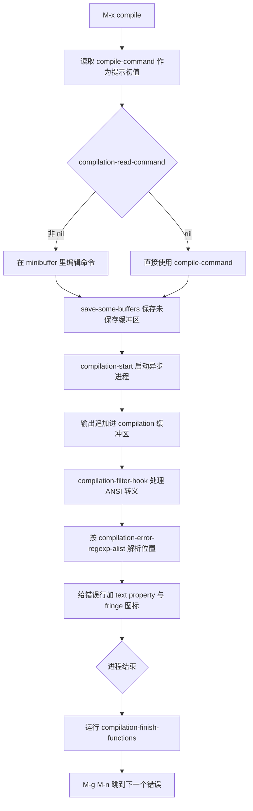
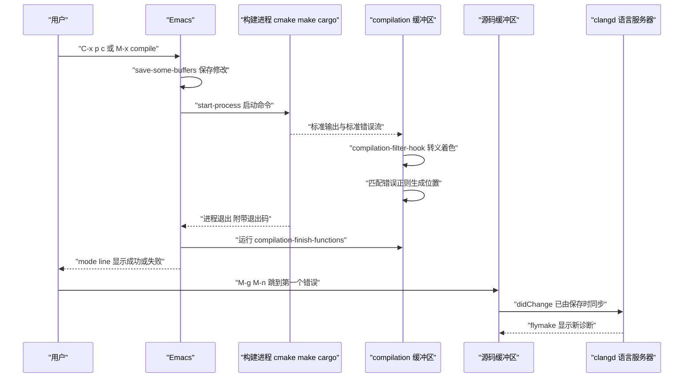
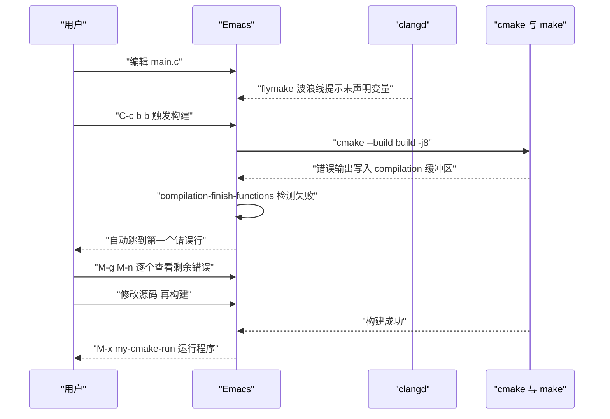

# 编译器集成

> 本篇讲清 Emacs 的 compilation 框架如何把任意命令行构建工具接进来，从 `M-x compile` 的默认值来源、错误正则的写法，到 C/C++、Rust、Go、Java、TypeScript、Dart 的具体命令，最后给出一份可以抄走的 `my-build.el`。

---

## 一、Emacs 的「编译」是一个通用命令执行框架

### 1.1 compilation-mode 不只管编译

初学者看到 `M-x compile` 的名字，会以为它是给编译器专用的。实际上它是**把一个 shell 命令异步跑起来，把输出收进一个缓冲区，然后从输出里解析出「文件:行号」形式的位置信息并做成可点击的链接**。至于那个命令是 `make`、`cargo build`、`pytest`、还是 `rg`，Emacs 完全不在意。

这带来三个直接后果：

- 任何能在终端里运行、并且会输出位置信息的命令，都能用 `M-x compile` 跑，也都能获得「跳到出错行」的能力。
- 内置的 `M-x grep`、`M-x grep-find`、`M-x rgrep`、`M-x project-find-regexp`、`M-x vc-git-grep` 全都复用同一套机制，它们的输出缓冲区也是 compilation-mode，错误跳转键位完全相同。
- 语言服务器给出的诊断走的是 flymake 通道，和 compilation-mode 是两套东西。两者可以在同一个缓冲区里并存，但不要指望 `M-g M-n` 能同时跳转两边的结果。

### 1.2 整体流程



### 1.3 一次构建从按键到诊断回填



注意最后四步：`M-x compile` 和语言服务器是两条独立通路。构建失败后 clangd 也会重新分析，但你看到的两组信息可能不完全一致，构建工具受编译选项影响，语言服务器受 `compile_commands.json` 影响。

---

## 二、M-x compile 的工作原理

### 2.1 compile-command 的默认值从哪来

`compile-command` 是一个 defcustom，它的初始化表达式是：

```elisp
(format "make -k -j%d " (ceiling (num-processors) 1.5))
```

也就是说，默认值形如 `make -k -j6 `（数字取决于你的 CPU 核数，按 1.5 分之一的核数向上取整）。用 `-j` 限制并行度是为了避免多核机器上一次性铺满所有核心导致系统失去响应，同时末尾留一个空格，方便你在 minibuffer 里接着输入目标名。

这个变量的行为有几点必须记住：

- 它是 `custom-initialize-delay` 初始化的，所以在 `init.el` 里直接 `(setq compile-command ...)` 未必是最早生效的时点，用 `setq-default` 更可靠。
- 每次你用 `M-x compile` 输入了一个与初值不同的命令，`compile` 函数会执行 `(setq compile-command command)`。这意味着**你上一次输入的命令变成了下次的默认值**，而且因为是 `setq` 而不是 `setq-local`，这个改变会影响全局默认值。
- 想让某个文件或某个 mode 用固定的命令，用 `setq-local`，最好放在 mode hook 或 `.dir-locals.el` 里。

```elisp
;; 每个 C 文件默认用这份固定的构建命令，而不是读全局默认
(add-hook 'c-mode-hook
          (lambda ()
            (setq-local compile-command
                        "cmake --build build -j 8 2>&1")))

;; 或者用目录局部变量，在项目根写 .dir-locals.el
;; ((c-mode . ((compile-command . "cmake --build build -j 8 2>&1"))))
```

### 2.2 C-u M-x compile 与 compilation-read-command

- `compilation-read-command` 默认为 `t`，意思是每次 `M-x compile` 都会在 minibuffer 里让你确认或修改命令。
- 把它设为 `nil` 时，`M-x compile` 直接用 `compile-command` 的值，不再问你。这带来一个**安全风险**：`compile-command` 是文件局部变量的合法名称，一个恶意文件可以在文件头写 `-*- compile-command: "rm -rf ~" -*-`，你按一下 `M-x compile` 就执行了。Emacs 的文档明确提示了这一点，所以 `compile-command` 只有在 `compilation-read-command` 非 nil 时才被标记为 safe local variable。
- `C-u M-x compile` 强制提示，并且让 compilation 缓冲区**以 comint 模式运行**，也就是可以往里面输入内容。这适合需要交互的构建脚本，代价是输出解析会略微复杂。
- `C-u C-u M-x compile`（前缀参数为 16）只强制提示，不开 comint。

```elisp
;; 保守设置：保留每次确认，避免误执行文件局部变量里的命令
(setq compilation-read-command t)

;; 追求快节奏：关掉确认，但要清楚安全代价
;; (setq compilation-read-command nil)
```

### 2.3 save-some-buffers 与自动保存

`compile` 函数在启动进程前会调用：

```elisp
(save-some-buffers (not compilation-ask-about-save)
                   compilation-save-buffers-predicate)
```

意思是：`compilation-ask-about-save` 默认为 `t`，此时 `save-some-buffers` 的第一个参数是 `nil`，会**逐个询问**要不要保存修改过的缓冲区。把 `compilation-ask-about-save` 设为 `nil` 就是「不问了，全部直接保存」。

实践中推荐后者，因为构建前手动确认保存既烦人又容易漏：

```elisp
;; 编译前不询问，直接保存所有修改过的文件
(setq compilation-ask-about-save nil)
;; 但只保存属于本次构建可能涉及的文件，避免保存无关缓冲区
;; 下面这个谓词保留「文件属于当前项目」的缓冲区
(setq compilation-save-buffers-predicate
      (lambda ()
        (when-let ((pr (project-current)))
          (string-prefix-p (file-truename (project-root pr))
                           (file-truename (or buffer-file-name ""))))))
```

`compilation-save-buffers-predicate` 的取值还可以是 `'ignore`（什么都不存）或一个函数。用函数时注意它会被每个缓冲区调用一次，不要在里面做重活。

### 2.4 recompile 与并行构建

- `M-x recompile`：在 compilation 缓冲区里按 `g`，或者在任何缓冲区里 `M-x recompile`。它重用 `compilation-arguments`，也就是**上一次用的命令和目录**。
- `C-u M-x recompile`：允许你先编辑命令再执行。
- 想在同一个 Emacs 里同时跑两个构建，需要先把 `*compilation*` 缓冲区改名（`M-x rename-buffer`），再切回源码缓冲区发起新的编译，这样 Emacs 会新建一个 `*compilation*` 缓冲区。这个技巧写在 `compile` 的文档字符串里。

```elisp
;; 并行构建的并行度：不要写死，按机器核数算
(defun my-build-jobs ()
  "返回一个适合本机的 -j 参数值。"
  (max 1 (/ (num-processors) 2)))

;; 用计算出来的并行度拼命令
(setq-local compile-command
            (format "cmake --build build -j %d 2>&1" (my-build-jobs)))
```

并行度不是越大越好。编译一个文件需要内存，`-j` 开满常常触发 OOM killer。经验值是物理核数的一半到全部核数之间，内存小于 16GB 时建议不超过 4。

---

## 三、compilation 缓冲区的使用

### 3.1 缓冲区的键位

在 `*compilation*` 缓冲区里按 `C-h m` 可以看到当前 major mode 的全部键位。核心的一组是：

| 键位 | 命令 | 说明 |
| --- | --- | --- |
| `g` | `recompile` | 用同样参数重新构建 |
| `TAB` | `compilation-next-error` | 跳到本条消息指向的下一个错误 |
| `S-TAB` | `compilation-previous-error` | 上一条 |
| `RET` | `compile-goto-error` | 按光标所在消息跳到源码 |
| `M-g M-n` | `next-error` | 全局键位，跳到下一个错误并访问源码 |
| `M-g M-p` | `previous-error` | 上一个错误 |
| `M-g M-f` | `next-error-follow-minor-mode` | 切换「跟随模式」 |
| `C-c C-k` | `kill-compilation` | 中断正在运行的构建 |
| `C-c C-f` | `next-error-follow-minor-mode` | 同上，模式内的绑定 |
| `q` | `quit-window` | 收起构建窗口 |
| `M-n` `M-p` | `next-error-no-select` | 移动但不切换当前缓冲区 |

`first-error` 值得单独记一下：`M-x first-error` 直接跳到**第一条**错误，等价于回到起点再走一步。它没有默认键位，适合自己绑一个。

```elisp
;; 把第一条错误绑到 F9，配合 M-g M-n 连续排查
(global-set-key (kbd "<f9>") #'first-error)

;; 让 next-error 自动跳到第一个错误，而不是每次都要自己移过去
(setq next-error-highlight 'fringe-arrow)
(setq next-error-highlight-no-select 'fringe-arrow)
```

### 3.2 next-error-follow-minor-mode

这个 minor mode 的作用是：**编译输出在增长时，自动把光标与构建缓冲区窗口同步到最新出现的错误**。它有两个实用场景：

- 长时间构建时，你可以去写别的代码，构建一报错，Emacs 会把构建窗口滚到那一行，你能马上看到问题。
- 它还能反过来工作：在源码缓冲区里 `M-g M-n` 逐步走错误时，构建缓冲区会自动滚动到对应消息。

它默认由 `M-g M-f` 与 compilation 缓冲区里的 `C-c C-f` 切换。注意它是**缓冲区局部**的 minor mode：在构建缓冲区里打开，只影响那个构建缓冲区，不会影响源码缓冲区。想让它对所有构建缓冲区默认打开：

```elisp
;; 所有 compilation 缓冲区默认开启跟随模式
(add-hook 'compilation-mode-hook #'next-error-follow-minor-mode)

;; 打开/关闭时在 mode line 上看到指示
(setq next-error-follow-minor-mode-lighter " Follow")
```

### 3.3 compilation-scroll-output

`compilation-scroll-output` 控制构建窗口是否随输出滚动。它的取值有实际意义，不只是开与关：

- `nil`（默认）：不自动滚动，你会停在缓冲区开头。
- `t`：总是滚到底部。
- `'first-error`：滚到第一条错误处就停下。这是长构建里最实用的取值，因为你既能看到错误，又不会被后面几百行无关输出带走。

```elisp
;; 构建输出滚到第一条错误就停
(setq compilation-scroll-output 'first-error)

;; 同时让 Emacs 自动跳到第一个错误所在的源码位置
;; if-location-known 表示只在能找到文件时跳，避免在编译早期误跳
(setq compilation-auto-jump-to-first-error 'if-location-known)
```

`compilation-auto-jump-to-first-error` 的取值有四种语义：`nil` 不跳；`if-location-known` 只在错误文件能被找到时跳；`first-known` 跳到第一个文件能找到的错误（中间那些找不到文件的错误会被跳过）；其他非 nil 值无条件跳。

### 3.4 compilation-finish-functions

构建进程结束时，Emacs 会用 `run-hook-with-args` 调用这个 hook，参数是**构建缓冲区**和**一条状态消息字符串**（例如 `"finished\n"`，或者被杀掉时的描述）。这是把构建结果接进通知体系的标准位置。

```elisp
(defun my-build-notify (buffer msg)
  "构建结束时给出提示，并在失败时保留窗口。"
  (let ((failed (not (string-match-p "finished" msg))))
    (message "构建 %s：%s"
             (if failed "失败" "成功")
             (string-trim msg))
    ;; 失败时把构建缓冲区调到最前，方便立刻定位
    (when failed
      (display-buffer buffer '(display-buffer-at-bottom)))
    ;; 成功时可以顺手做点别的，例如刷新 flymake 诊断
    (when (not failed)
      (dolist (buf (buffer-list))
        (with-current-buffer buf
          (when (bound-and-true-p flymake-mode)
            (flymake-start)))))))

(add-hook 'compilation-finish-functions #'my-build-notify)
```

`compilation-finish-functions` 的默认值是 `nil`，不像很多 hook 有默认函数，所以必须自己加。

### 3.5 编译环境变量与 PATH

Emacs 启动时继承的 `PATH` 取决于它是怎么被启动的：从终端启动会继承 shell 的环境；在图形界面里点图标启动，通常只继承桌面会话的环境，`~/.bashrc`、`~/.zshrc`、`~/.profile` 里追加的路径全都拿不到。

`exec-path` 这个变量是 Emacs 用来查找**外部可执行程序**的路径列表，和 `PATH` 环境变量是两份数据。修改它的正确方式：

```elisp
;; 方式一：手工追加，适合路径固定的环境
(add-to-list 'exec-path "/usr/local/bin")
(add-to-list 'exec-path (expand-file-name "~/.cargo/bin"))
(add-to-list 'exec-path (expand-file-name "~/go/bin"))
(add-to-list 'exec-path (expand-file-name "~/.local/bin"))
;; 同时同步 PATH 环境变量，让 shell-command 也能找到
(setenv "PATH" (mapconcat #'identity exec-path path-separator))
```

```elisp
;; 方式二：从登录 shell 里读取，适合 macOS 与复杂的 shell 配置
(when (or (memq system-type '(darwin))
          (and (eq system-type 'gnu/linux) (display-graphic-p)))
  (use-package exec-path-from-shell
    :ensure t
    :custom
    ;; 需要继承的环境变量，除了 PATH 通常还需要 MANPATH 与语言相关的变量
    (exec-path-from-shell-variables
     '("PATH" "MANPATH" "GOPATH" "GOROOT" "CARGO_HOME" "RUSTUP_HOME"
       "JAVA_HOME" "ANDROID_HOME" "LANG" "LC_ALL"))
    :config
    (exec-path-from-shell-initialize)))
```

### 3.6 Windows 下 PATH 的坑

Windows 上的问题比 Unix 更麻烦，原因有三层：

- **路径分隔符**：Emacs 内部用 `/` 也能识别 `C:/Users/...`，但传给某些 Windows 原生程序时需要 `\`。Emacs 的 `convert-standard-filename` 会做转换，但第三方工具的配置里写硬编码路径时容易出错。
- **PATH 分隔符**：`path-separator` 在 Windows 上是 `;`，在 Unix 上是 `:`。手工拼 PATH 时不要写死冒号。
- **两级 PATH**：Emacs 有 `exec-path`（Elisp 列表）和 `PATH`（环境变量字符串）。只改一个会出现「`M-x compile` 里 `make` 能用，但 `executable-find` 找不到」这类分裂症状。用上面的 `setenv` 一行同时同步。

```elisp
;; Windows 下常见工具位置，按需启用
(when (eq system-type 'windows-nt)
  ;; 从注册表或环境变量读取，注意含空格路径要保留
  (dolist (p '("C:/msys64/usr/bin"
               "C:/Program Files/LLVM/bin"
               "C:/Program Files/CMake/bin"
               "C:/Program Files/Java/jdk-21/bin"))
    (when (file-directory-p p)
      (add-to-list 'exec-path p)))
  ;; 注意用 path-separator 而不是冒号
  (setenv "PATH" (mapconcat #'identity exec-path path-separator))
  ;; 让 shell-command 默认走 PowerShell 还是 cmd，取决于你的习惯
  (setq shell-file-name "cmdproxy.exe"))
```

WSL 的说明：如果在 WSL 里跑 Emacs（`emacs -nw` 或 WSLg 下的图形 Emacs），看到的是 Linux 文件系统，用的是 Linux 的 PATH，按 Debian/Ubuntu 那一列配置即可。只有装的是 Windows 原生 Emacs 时才会遇到上面这些问题。WSL 里的项目路径是 `/mnt/c/...`，从 Windows 原生 Emacs 访问同一份代码则是 `C:/...`，两边混用会让错误正则解析出的相对路径找不到文件，尽量固定用一种。

---

## 四、错误信息的解析机制

### 4.1 两个变量的分工

- `compilation-error-regexp-alist-alist`：**定义**。它是一个关联表，键是符号（如 `gnu`、`clang-include`、`rust`），值是该工具输出格式对应的正则与分组信息。Emacs 内置了七十多组定义。
- `compilation-error-regexp-alist`：**启用列表**。它的默认值是上面那个表的所有键（去掉 `omake`），也就是默认全部启用。列表里的元素可以是符号，也可以直接写一条 `(REGEXP FILE LINE COLUMN ...)` 形式的规则。

每条规则的格式：

```text
(REGEXP FILE [LINE COLUMN TYPE HYPERLINK HIGHLIGHT...])
```

- `FILE`、`LINE`、`COLUMN` 是**子表达式编号**（第几个括号），不是值。`FILE` 为 2 表示第 2 个括号捕获的是文件名。
- `COLUMN` 还可以写 `(COLUMN . END-COLUMN)` 表示列范围。
- `TYPE`：`2` 或 `nil` 表示错误，`1` 表示警告，`0` 表示提示信息。也可以写成 `(WARNING . INFO)` 形式，按哪个子表达式匹配上决定级别。
- `HYPERLINK` 指定哪一段加链接属性，省略则整条匹配都算链接。
- 后面的 `HIGHLIGHT` 是 `(SUBMATCH FACE)` 形式，用来给某一段指定高亮 face。

### 4.2 为自定义工具添加错误正则

假设你有一个自研的检查工具 `mytool`，输出格式是：

```text
src/parser.c:42:7: error: expected ';' before '}'
src/lexer.c:18:1: warning: unused variable 'tmp'
```

这个格式和 GCC 的格式几乎一样，所以 `gnu` 规则其实已经能覆盖。但如果你的工具输出的是这种自定义格式：

```text
[ERROR] file=src/parser.c line=42 col=7: expected ';' before '}'
[WARN ] file=src/lexer.c line=18 col=1: unused variable 'tmp'
```

就需要自己加规则：

```elisp
;; 第一步：定义规则本体
;; 正则里的分组编号要数清楚：
;;   1 = 级别 ERROR 或 WARN
;;   2 = 文件名
;;   3 = 行号
;;   4 = 列号
(defvar my-mytool-error-regexp
  "^\\[\\(ERROR\\|WARN \\)\\] file=\\([^ \t\n]+\\) line=\\([0-9]+\\) col=\\([0-9]+\\):"
  "自研检查工具 mytool 的位置行格式。")

;; 第二步：注册进 alist
;; FILE 传 2、LINE 传 3、COLUMN 传 4；
;; TYPE 用 (警告组 . 提示组) 的形式：第 1 组匹配到 WARN 时算警告，
;; 其余情况算错误，正好符合我们的两种级别
(with-eval-after-load 'compile
  (add-to-list 'compilation-error-regexp-alist-alist
               `(mytool ,my-mytool-error-regexp 2 3 4 (1)))
  ;; 第三步：启用它
  (add-to-list 'compilation-error-regexp-alist 'mytool))
```

关于 `TYPE` 的那一项 `(1)`：文档说 TYPE 可以是 `(WARNING . INFO)` 形式，即第 WARNING 个子表达式匹配时算警告，第 INFO 个子表达式匹配时算提示信息，都没匹配上则算错误。上面的例子只给了警告组编号 1，所以 `[ERROR]` 会被算作错误，`[WARN ]` 会被算作警告。如果你想更精确地分别判定，把正则写成两个分支，把 ERROR 与 WARN 分成两个组：

```elisp
;; 更精确的版本：分出两个组，组 1 是 ERROR，组 2 是 WARN
(defvar my-mytool-error-regexp-2
  "^\\[\\(ERROR\\)\\|WARN \\] file=\\([^ \t\n]+\\) line=\\([0-9]+\\) col=\\([0-9]+\\):"
  "另一种写法：ERROR 与 WARN 分成两个子表达式。")
```

不过多分支正则很容易写错子表达式编号，实践中更省事的方式是**让工具输出对齐到 Emacs 已经认识的格式**（GCC 风格或 Python traceback 风格），这样一条规则都不用加。这是给自研工具提改进建议时最值得说的一条。

### 4.3 验证规则是否生效

写完之后不要靠猜，用 `compilation-mode` 手工验证：

```elisp
(defun my-test-error-regexp ()
  "在一个临时缓冲区里验证错误正则能否匹配样本输出。"
  (interactive)
  (with-current-buffer (get-buffer-create "*regexp-test*")
    (erase-buffer)
    (insert "[ERROR] file=src/parser.c line=42 col=7: expected ';' before '}'\n"
            "[WARN ] file=src/lexer.c line=18 col=1: unused variable 'tmp'\n")
    (compilation-mode)
    (compilation--parse-region (point-min) (point-max))
    (goto-char (point-min))
    (let ((count 0))
      (while (not (eobp))
        (when (get-text-property (point) 'compilation-message)
          (setq count (1+ count)))
        (forward-line 1))
      (message "识别到 %d 条带位置的消息" count))))
```

`compilation--parse-region` 是内部函数，用来验证很方便，但不要在产品配置里依赖它。更稳的验证方式是直接跑一次 `M-x compile`，用一条 `echo` 命令伪造输出。

### 4.4 常见工具的输出格式与对应规则

| 工具 | 输出示例 | 已内置的规则名 |
| --- | --- | --- |
| GCC / Clang | `src/a.c:12:5: error: ...` | `gnu` |
| Clang 的 include 提示 | `In file included from src/a.c:3:` | `clang-include` |
| Rust | `error[E0308]: mismatched types` 加 `--> src/main.rs:12:5` | `rust` |
| Cargo 的 panic 回溯 | `thread 'main' panicked at src/main.rs:12` | `rust-panic` |
| Go | `./main.go:12:5: undefined: foo` | 由 `gnu` 覆盖 |
| Maven | `[ERROR] /path/A.java:[12,5] cannot find symbol` | `maven` |
| javac | `A.java:12: error: ...` | `javac` |
| TypeScript 简洁格式 | `src/a.ts(12,5): error TS2304: ...` | `typescript-tsc-plain` |
| TypeScript 美化格式 | `src/a.ts:12:5 - error TS2304: ...` | `typescript-tsc-pretty` |
| Python traceback | `File "a.py", line 12, in foo` | `python-tracebacks-and-caml` |
| shellcheck | `In a.sh line 12:` | `shellcheck` |
| CMake 报错 | `CMake Error at CMakeLists.txt:12 (add_executable):` | `cmake` |
| Lua 栈回溯 | `a.lua:12: attempt to ...` | `lua` |
| Gradle（Kotlin DSL） | `e: file:///path/Build.kt:12:5 ...` | `gradle-kotlin` |

这份表是从 Emacs 内置的 `compilation-error-regexp-alist-alist` 里对照得到的。完整列表可以在 Emacs 的数据目录里看 `etc/compilation.txt`，那个文件同时给出了每种格式的样本，是排查正则问题最快的入口。

---

## 五、项目级编译

### 5.1 project.el 的前缀键

`project.el` 是 Emacs 内置的项目管理，Emacs 28 起提供了 `C-x p` 前缀。常用绑定：

| 键位 | 命令 | 作用 |
| --- | --- | --- |
| `C-x p c` | `project-compile` | 在**项目根目录**里执行 `compile` |
| `C-x p f` | `project-find-file` | 在项目里找文件 |
| `C-x p g` | `project-find-regexp` | 在项目里搜索，通过 ripgrep 或 grep |
| `C-x p p` | `project-switch-project` | 切换到别的项目 |
| `C-x p b` | `project-switch-to-buffer` | 只列本项目缓冲区 |
| `C-x p d` | `project-dired` | 在项目根打开 dired |
| `C-x p k` | `project-kill-buffers` | 关掉本项目所有缓冲区 |
| `C-x p !` | `project-shell-command` | 在项目根跑 shell 命令，异步 |
| `C-x p &` | `project-async-shell-command` | 同上，另一个变体 |
| `C-x p s` | `project-shell` | 在项目根开 shell |
| `C-x p e` | `project-eshell` | 在项目根开 eshell |
| `C-x p v` | `project-vc-dir` | 打开版本控制状态页 |

`project-compile` 的关键价值是它把 `default-directory` 临时改成项目根，所以你不需要关心当前在哪个子目录，构建命令总是从项目根开始执行。这一点对 CMake、Cargo、Gradle 这类必须在项目根调用的工具是必需的。

### 5.2 project.el 常用 API

```elisp
;; 取得当前缓冲区所属项目对象，第二个参数非 nil 时允许询问用户
(project-current)
;; 取得项目根目录，返回值一定以 / 结尾
(project-root (project-current t))
;; 列出项目内所有文件，返回文件名列表
(project-files (project-current t))
;; 在项目根运行编译
(project-compile)
;; 把项目记入已知项目列表，之后 C-x p p 会直接列出
(project-remember-projects-under "~/code" t)
;; 让 project.el 认可额外的根标记文件
(setq project-vc-extra-root-markers
      '("CMakeLists.txt" "Makefile" "meson.build" "Cargo.toml"
        "go.mod" "package.json" "pyproject.toml" "pom.xml"
        "build.gradle" "build.gradle.kts" "pubspec.yaml" "mix.exs"))
```

`project-vc-extra-root-markers` 的默认值是 `nil`，意味着 project.el 只靠版本控制目录识别项目根。项目不是 Git 仓库、或者有一个父级的 Git 仓库时，就必须靠这个变量。这一条在 [[emacs教程/5开发环境集成/01_补全与LSP|补全与 LSP]] 的「项目根识别错误」一节里也提到过，因为 eglot 用的是同一套根识别逻辑。

### 5.3 与 projectile 的对比

| 维度 | project.el | projectile |
| --- | --- | --- |
| 归属 | Emacs 内置 | 第三方，MELPA |
| 项目识别 | 主要靠 VCS 根，辅以 `project-vc-extra-root-markers` | 靠 `.projectile` 文件与一套内置规则，可自定义 |
| 缓存 | 无缓存，每次调用 `project-files` 都现算（受 `project-files` 实现影响） | 有索引缓存，大型项目里找文件更快 |
| 缓冲区切换 | `project-switch-to-buffer` | `projectile-switch-to-buffer`，默认按项目内文件反查 |
| 命令数量 | 少而稳定 | 多，涵盖测试、运行、切换、ibuffer 集成等 |
| 键位前缀 | `C-x p` | `C-c p` |
| 维护状态 | 随 Emacs 发布 | 活跃，仍是使用量最大的项目包之一 |

选择建议：**新配置优先用内置的 project.el**，它的 `C-x p` 前缀与 eglot、xref、flymake、`project-find-regexp` 是原生配合。只有在需要 projectile 的索引缓存、或者依赖某个只提供 projectile 集成的包（例如某些测试运行器、`counsel-projectile`）时再引入。两个可以共存，不冲突，只是多一份包体积。

```elisp
(use-package projectile
  :ensure t
  :custom
  ;; 索引方式：native 表示用 Emacs 自己遍历，alien 表示调用外部命令如 fd
  (projectile-indexing-method 'native)
  ;; 缓存文件位置
  (projectile-cache-file (expand-file-name "projectile.cache" user-emacs-directory))
  ;; 考虑 .gitignore，避免把 build 目录也索引进来
  (projectile-git-use-fd t)
  :config
  (projectile-mode 1)
  :bind-keymap
  ("C-c p" . projectile-command-map))
```

---

## 六、各语言的编译配置

### 6.1 C 与 C++

C/C++ 的构建方式有三条主流路径：Makefile、CMake、以及直接用编译器命令行。

**Makefile 路径**最简单。`compile-command` 的默认值本身就是 `make -k -jN`，所以只要项目根有 Makefile，`C-x p c` 就能直接用。`-k` 的作用是「遇到错误继续构建其他目标」，好处是一次能看到多个错误，坏处是对于有依赖关系的目标会产生大量级联错误。两者取舍看项目大小。

**CMake 路径**分两步：配置阶段生成构建系统，构建阶段调用生成的构建系统。Emacs 里对应两条命令：

```bash
# 配置阶段：在源码根执行，生成 build 目录与构建系统
$ cmake -S . -B build -DCMAKE_BUILD_TYPE=Debug \
        -DCMAKE_EXPORT_COMPILE_COMMANDS=ON

# 构建阶段
$ cmake --build build -j 8

# 只构建某个目标
$ cmake --build build --target myapp -j 8

# 安装
$ cmake --install build --prefix /usr/local
```

`-DCMAKE_EXPORT_COMPILE_COMMANDS=ON` 这一项是 C/C++ 体验的关键。它让 CMake 生成 `build/compile_commands.json`，文件里逐条记录了每个源文件在编译时用的完整命令行（包括所有 `-I`、`-D`、`-std=` 选项）。clangd 读这个文件就能精确知道每个文件的包含路径与宏定义，补全和诊断的准确度会有质的变化。

生成的文件的默认位置是构建目录（`build/compile_commands.json`），而 clangd 只会在**源文件所在目录及其父目录**里找 `compile_commands.json`。所以有两种做法：

```bash
# 做法一：把 JSON 软链或复制到源码根
$ ln -sf build/compile_commands.json compile_commands.json

# 做法二：告诉 clangd 去哪里找，写一个 .clangd 文件放在源码根
$ cat > .clangd <<'EOF'
CompileFlags:
  CompilationDatabase: build
EOF
```

做法二更干净，不会在源码根留下产物，也不会被 `git status` 打扰。注意 `.clangd` 文件本身要加入 `.gitignore` 或者提交进仓库（团队统一）。

Emacs 侧的 C/C++ 配置可以这么写：

```elisp
;; C/C++ 的构建命令与模式设置
(defun my-c-cpp-setup ()
  "C 与 C++ 缓冲区的通用设置。"
  ;; 优先用 CMake：有 CMakeLists.txt 且已有 build 目录时
  (cond
   ((and (locate-dominating-file default-directory "CMakeLists.txt")
         (file-directory-p
          (expand-file-name "build"
                            (locate-dominating-file default-directory "CMakeLists.txt"))))
    (setq-local compile-command
                "cmake --build build -j 8 2>&1"))
   ;; 否则回退到 Makefile
   ((locate-dominating-file default-directory "Makefile")
    (setq-local compile-command "make -k -j 8 2>&1"))
   ;; 都没有就单独编译当前文件，方便调试单个源文件
   (t
    (setq-local compile-command
                (concat "clang++ -std=c++20 -Wall -Wextra -g -O0 -o "
                        (shell-quote-argument
                         (file-name-sans-extension
                          (file-name-nondirectory (or buffer-file-name "a.cpp"))))
                        " "
                        (shell-quote-argument (or buffer-file-name "a.cpp"))
                        " 2>&1")))))

(add-hook 'c-mode-hook #'my-c-cpp-setup)
(add-hook 'c++-mode-hook #'my-c-cpp-setup)
;; Emacs 29 起有 tree-sitter 版本的模式，视你的配置启用
(add-hook 'c-ts-mode-hook #'my-c-cpp-setup)
(add-hook 'c++-ts-mode-hook #'my-c-cpp-setup)
```

**直接用编译器命令行**这条路在单文件练习时最方便，但要注意 `2>&1`：`compile` 只收集进程的标准输出，GCC 与 Clang 把诊断写到标准错误。如果命令末尾不写 `2>&1`，构建缓冲区里会只有链接错误却看不到编译错误。这个坑非常常见，值得记牢。

关于 `rust-ts-mode` 与 `rust-mode`：Emacs 29 起内置了 `rust-ts-mode`（依赖 tree-sitter 语法文件，需要显式安装 `rust` 语法），MELPA 上的 `rust-mode` 是纯 Elisp 实现、不依赖语法文件。两者的 `compile-command` 设置方式相同，但 hook 名不同：

```elisp
;; 用内置的 tree-sitter 版本
(add-hook 'rust-ts-mode-hook
          (lambda ()
            (setq-local compile-command "cargo build 2>&1")))

;; 或用 MELPA 的 rust-mode
(add-hook 'rust-mode-hook
          (lambda ()
            (setq-local compile-command "cargo build 2>&1")))
```

### 6.2 Rust

Rust 的日常命令分工明确：

| 命令 | 用途 | 说明 |
| --- | --- | --- |
| `cargo check` | 只做类型检查，不生成可执行文件 | 最快，日常改代码的首选 |
| `cargo build` | 编译并链接 | 生成 `target/debug/` 下的产物 |
| `cargo build --release` | 优化构建 | 生成 `target/release/` |
| `cargo clippy` | 运行 lint | 需要 `rustup component add clippy` |
| `cargo test` | 运行测试 | 见本模块第 3 篇 |
| `cargo run` | 构建并运行 | 适合快速验证 |
| `cargo doc --no-deps` | 生成文档 | 适合查看依赖的 API |

Rust 的错误输出天然带 `-->` 形式的路径与行列号，Emacs 的 `rust` 规则能直接识别。`cargo check` 的输出格式与 `cargo build` 相同，所以两者都能用同一套跳转。

```elisp
(defun my-rust-setup ()
  "Rust 缓冲区的编译与格式化设置。"
  ;; 默认用检查而不是构建，速度快
  (setq-local compile-command "cargo check --all-targets 2>&1")
  ;; 让 M-x compile 的输出带颜色（Cargo 默认在非 tty 下会关掉颜色，
  ;; 加 --color=always 才能在 Emacs 里看到彩色）
  (setq-local compilation-scroll-output 'first-error))

(add-hook 'rust-ts-mode-hook #'my-rust-setup)
(add-hook 'rust-mode-hook #'my-rust-setup)
```

想在 Emacs 里看到 Cargo 的彩色输出，需要给命令加 `--color=always` 并配置好 ANSI 解析：

```elisp
;; 让 compilation 缓冲区解析 ANSI 颜色转义
;; ansi-color-for-compilation-mode 自 Emacs 28.1 起存在，默认值就是 t
(setq ansi-color-for-compilation-mode t)
;; 把过滤器加入 hook。Emacs 31 起默认已经加好，
;; 在 Emacs 29 与 30 上建议显式添加一次，重复添加无害
(add-hook 'compilation-filter-hook #'ansi-color-compilation-filter)

;; 对应的 Cargo 命令
(setq-local compile-command "cargo clippy --all-targets --color=always 2>&1")
```

### 6.3 Go

Go 的命令很规整：

```bash
$ go build ./...          # 构建所有包
$ go build -o app ./cmd/app
$ go vet ./...            # 静态检查
$ go test ./...           # 运行测试
$ go test -run TestFoo ./pkg   # 只跑匹配的测试
$ gofmt -l -w .           # 格式化
$ go install golang.org/x/tools/gopls@latest   # 装语言服务器
```

Go 的编译错误格式是 `./main.go:12:5: undefined: foo`，由内置的 `gnu` 规则覆盖。`go vet` 的输出格式相同。

```elisp
(defun my-go-setup ()
  "Go 缓冲区的构建设置。"
  ;; 保存时自动跑 gofmt，比保存时编译更轻量
  (setq-local compile-command "go build ./... 2>&1")
  ;; Go 的错误信息里路径常带 ./ 前缀，compilation-search-path 里加上项目根
  (setq-local compilation-search-path
              (list (or (project-root (project-current)) default-directory))))

(add-hook 'go-ts-mode-hook #'my-go-setup)
(add-hook 'go-mode-hook #'my-go-setup)   ; go-mode 来自 MELPA 的 go-mode 包
```

### 6.4 Java

Java 的构建有三条路：`javac` 直编、Maven、Gradle。

```bash
# 单文件直编，注意 -d 指定输出目录
$ javac -encoding UTF-8 -d out src/main/java/com/example/App.java

# Maven
$ mvn -q compile                # 编译
$ mvn -q test                   # 编译并测试
$ mvn -q package -DskipTests    # 打包

# Gradle
$ ./gradlew compileJava         # 编译
$ ./gradlew test                # 测试
$ ./gradlew build               # 完整构建
$ ./gradlew --stop              # 停掉常驻的 Gradle daemon
```

Gradle 的注意点是它默认会启动一个常驻 daemon 进程来加速后续构建。这在 IDE 里是好事，但在 Emacs 里反复触发构建时，会看到 `gradle` 进程长期占用几百 MB 内存。如果只是偶尔构建，可以加 `--no-daemon`：

```elisp
(defun my-java-setup ()
  "Java 缓冲区的构建设置，按项目类型自动选择命令。"
  (let ((root (or (project-root (project-current)) default-directory)))
    (cond
     ;; Gradle：有 gradlew 或 build.gradle
     ((or (file-exists-p (expand-file-name "gradlew" root))
          (file-exists-p (expand-file-name "build.gradle" root))
          (file-exists-p (expand-file-name "build.gradle.kts" root)))
      (setq-local compile-command
                  (if (file-exists-p (expand-file-name "gradlew" root))
                      "./gradlew compileJava 2>&1"
                    "gradle compileJava 2>&1")))
     ;; Maven：有 pom.xml
     ((file-exists-p (expand-file-name "pom.xml" root))
      (setq-local compile-command "mvn -q -DskipTests compile 2>&1"))
     ;; 都没有就单独编译当前文件
     (t
      (setq-local compile-command
                  (format "javac -encoding UTF-8 -d out %s 2>&1"
                          (shell-quote-argument (or buffer-file-name "App.java"))))))))

(add-hook 'java-mode-hook #'my-java-setup)
(add-hook 'java-ts-mode-hook #'my-java-setup)
```

Java 的语言服务器 `jdtls` 会在项目里生成大量索引文件（`.metadata`、`jdtls-workspace`），记得加进 `.gitignore`。它的启动也慢，首次打开项目可能要几十秒，`eglot-connect-timeout` 要给足。

### 6.5 TypeScript

```bash
# 一次性类型检查，不产出文件
$ npx tsc --noEmit

# 监听模式，改动即增量编译
$ npx tsc --watch

# 构建
$ npm run build
$ pnpm build
```

TypeScript 的两种输出格式都有内置规则：`typescript-tsc-plain` 对应 `src/a.ts(12,5): error TS2304: ...`，`typescript-tsc-pretty` 对应带上下文的 `src/a.ts:12:5 - error TS2304: ...`。用 `--pretty` 时是后者，`--pretty false` 时是前者，两者都能跳转。

```elisp
(defun my-typescript-setup ()
  "TypeScript 缓冲区的构建设置。"
  ;; --noEmit 只做类型检查，速度最快，适合当作日常的 compile
  (setq-local compile-command "npx tsc --noEmit --pretty false 2>&1"))

(add-hook 'typescript-ts-mode-hook #'my-typescript-setup)
(add-hook 'tsx-ts-mode-hook #'my-typescript-setup)
;; typescript-mode 来自 MELPA 的 typescript-mode 包
(add-hook 'typescript-mode-hook #'my-typescript-setup)
```

`tsc --watch` 的输出是持续的、不会退出的，用 `M-x compile` 跑它会一直占着 `*compilation*` 缓冲区。监听模式更适合放在一个独立的终端里，或者用 `M-x async-shell-command` 跑（见本模块第 3 篇）。

### 6.6 Python

Python 没有「编译」这一步，但有两条相关的能力：

- **字节码编译**：`python -m py_compile file.py` 会把源文件编译成 `.pyc`，主要用于语法检查。`python -m compileall .` 递归编译整个目录。这在部署前的语法验收、或者检查 Python 2 与 3 兼容性时还有用，但日常开发里已经很少直接用。
- **类型检查与 lint**：`mypy`、`pyright`、`ruff check`、`pylint` 是真正替代「编译」的东西。它们的输出同样能被 compilation-mode 解析，`mypy` 的输出格式是 `a.py:12: error: ...`，走 `gnu` 规则。

```elisp
(defun my-python-setup ()
  "Python 缓冲区的检查命令设置。"
  (setq-local compile-command
              (concat "python -m mypy "
                      (shell-quote-argument (or buffer-file-name "a.py"))
                      " 2>&1")))
;; 想用 ruff 就换成下面这行
;; (setq-local compile-command "ruff check . 2>&1")
;; 想用语法检查就换成
;; (setq-local compile-command "python -m py_compile %s 2>&1" 需自行格式化)

(add-hook 'python-mode-hook #'my-python-setup)
(add-hook 'python-ts-mode-hook #'my-python-setup)
```

Python 的实际运行与测试见本模块第 3 篇，那里有完整的运行器实现。相关的语言教程可参考 [[python|Python 教程]]。

### 6.7 Dart

```bash
$ dart analyze                 # 静态分析
$ dart analyze lib/main.dart   # 只分析单个文件
$ dart compile exe bin/main.dart -o build/main   # 编译为原生可执行文件
$ dart compile js -o build/main.js bin/main.dart # 编译为 JavaScript
$ dart run bin/main.dart       # 直接运行
$ dart format .                # 格式化
$ dart test                    # 运行测试
```

`dart analyze` 的输出格式是 `Analyzing main.dart...` 加 `error • Undefined name 'foo' at lib/main.dart:12:5 • undefined_identifier`，这一串**不是** Emacs 内置规则覆盖的格式，所以直接用 `M-x compile` 跑 `dart analyze` 时点不动错误行。解决办法是加 `--format=machine`，机器可读格式是 `ERROR|COMPILE_TIME_ERROR|UNDEFINED_IDENTIFIER|lib/main.dart|12|5|7|foo|...`，同样不在内置规则里。因此 Dart 项目更推荐用语言服务器（`dart language-server` + eglot）来做实时诊断，`M-x compile` 只负责构建。

```elisp
(defun my-dart-setup ()
  "Dart 缓冲区的构建设置。"
  ;; 分析交给 eglot 的 dart language-server，这里只负责编译
  (setq-local compile-command "dart compile exe bin/main.dart -o build/main 2>&1"))

(add-hook 'dart-mode-hook #'my-dart-setup)   ; dart-mode 来自 MELPA 的 dart-mode 包
```

语言教程见 [[dart|Dart 教程]]。

### 6.8 各语言命令速查

| 语言 | 日常最快检查 | 完整构建 | 并行参数 |
| --- | --- | --- | --- |
| C/C++（Make） | `make -k -j8` | `make -j8` | `-j` |
| C/C++（CMake） | `cmake --build build -j8` | 同上 | `-j` |
| Rust | `cargo check --all-targets` | `cargo build --release` | 由 Cargo 自动管理 |
| Go | `go vet ./...` | `go build ./...` | 由 Go 自动管理 |
| Java（Maven） | `mvn -q -DskipTests compile` | `mvn -q package` | `-T 1C` |
| Java（Gradle） | `./gradlew compileJava` | `./gradlew build` | `--parallel` |
| TypeScript | `npx tsc --noEmit` | `npm run build` | 由打包器管理 |
| Python | `python -m mypy .` | 无 | 不适用 |
| Dart | `dart analyze` | `dart compile exe` | 不适用 |

---

## 七、cmake-mode 与用 compile 调 CMake

### 7.1 cmake-mode

`cmake-mode` 不在 Emacs 里，需要安装。它有两个来源：CMake 官方源码里带一份（安装 CMake 时可能一起提供），以及 MELPA 上的 `cmake-mode` 包。

```elisp
(use-package cmake-mode
  :ensure t
  :mode (("CMakeLists\\.txt\\'" . cmake-mode)
         ("\\.cmake\\'" . cmake-mode))
  :custom
  ;; 关键字高亮：把常用的 CMake 命令名加入高亮列表
  (cmake-font-lock-extra-keywords
   '("add_executable" "add_library" "target_link_libraries"
     "target_include_directories" "target_compile_options"
     "target_compile_definitions" "find_package" "install"
     "set_target_properties" "configure_file" "add_subdirectory"))
  :hook
  ((cmake-mode . (lambda ()
                   ;; CMake 缩进默认 2 空格，与官方风格一致
                   (setq-local indent-tabs-mode nil)
                   (setq-local tab-width 2)))))
```

`cmake-font-lock-extra-keywords` 是 `cmake-mode` 里真实存在的变量，用来把项目自定义的函数名或宏名也着色。此外 `cmake-command-run` 是 `cmake-mode` 提供的命令，它能用一个补全列表帮你选择常用 cmake 子命令，用法是 `M-x cmake-command-run RET` 然后选 `-S`、`-B`、`--build` 等。

CMake 文件里写构建命令时，注意 CMake 官方推荐「out-of-source 构建」，也就是构建目录与源码目录分开，不要污染源码树。

### 7.2 用 compile 调 cmake 的完整函数

下面这个函数把「切换构建目录」「切换 Debug/Release 配置」「选择目标」三件事做成可复用的命令，是日常最有价值的一段配置。

```elisp
(defvar my-cmake-build-dir "build"
  "CMake 构建目录名，相对于项目根。")

(defvar my-cmake-build-type "Debug"
  "CMake 构建类型，取值 Debug 或 Release。")

(defun my-cmake-configure (&optional build-type)
  "配置 CMake 项目。

在项目根执行配置阶段，生成构建系统与 compile_commands.json。
BUILD-TYPE 为 nil 时使用 `my-cmake-build-type'。"
  (interactive
   (list (completing-read "构建类型: " '("Debug" "Release" "RelWithDebInfo" "MinSizeRel")
                          nil t nil nil my-cmake-build-type)))
  ;; 记住本次选择，下次交互式调用的默认值就是它
  (setq my-cmake-build-type build-type)
  (let* ((root (or (project-root (project-current t)) default-directory))
         (cmd (format "cmake -S . -B %s -DCMAKE_BUILD_TYPE=%s -DCMAKE_EXPORT_COMPILE_COMMANDS=ON"
                      my-cmake-build-dir my-cmake-build-type)))
    ;; 让 compile 在项目根执行，而不是当前文件所在目录
    (let ((default-directory root))
      (compile cmd))))

(defun my-cmake-build (&optional target)
  "构建 CMake 项目。

TARGET 为 nil 时构建全部目标，否则只构建指定目标。"
  (interactive
   (list (when current-prefix-arg
           (read-string "目标名（留空表示全部）: "))))
  (let* ((root (or (project-root (project-current t)) default-directory))
         (jobs (max 1 (/ (num-processors) 2)))
         (cmd (format "cmake --build %s -j %d%s"
                      my-cmake-build-dir jobs
                      (if (and target (not (string-empty-p target)))
                          (format " --target %s" target)
                        ""))))
    (let ((default-directory root))
      (compile cmd)
      ;; 构建结束后自动同步 compile_commands.json 到源码根，
      ;; 让 clangd 在源码根也能找到它
      (add-hook 'compilation-finish-functions
                #'my-cmake-sync-compile-commands nil t))))

(defun my-cmake-sync-compile-commands (_buffer msg)
  "构建结束后把 compile_commands.json 复制到源码根，供 clangd 使用。"
  (when (string-match-p "finished" msg)
    (let* ((root (or (project-root (project-current t)) default-directory))
           (src (expand-file-name (concat my-cmake-build-dir "/compile_commands.json") root))
           (dst (expand-file-name "compile_commands.json" root)))
      (when (file-exists-p src)
        (copy-file src dst t)
        (message "已更新 %s" dst)))))

(defun my-cmake-clean ()
  "删除整个构建目录，做一次干净的重新配置。"
  (interactive)
  (let* ((root (or (project-root (project-current t)) default-directory))
         (dir (expand-file-name my-cmake-build-dir root)))
    (when (and (file-directory-p dir)
               (yes-or-no-p (format "确认删除 %s ？" dir)))
      (delete-directory dir t)
      (message "已删除 %s" dir))))

(defun my-cmake-run ()
  "运行构建目录里刚生成的可执行文件。

会要求输入可执行文件名，默认取构建目录下与项目同名的文件。"
  (interactive)
  (let* ((root (or (project-root (project-current t)) default-directory))
         (bin (read-file-name "可执行文件: "
                              (expand-file-name my-cmake-build-dir root)
                              nil t))
         (default-directory root))
    (compile (format "%s 2>&1" (shell-quote-argument bin)))))
```

这段配置里有两个关键细节：

- `default-directory` 用 `let` 临时绑定。`compile` 会在 `default-directory` 下启动进程，所以这是控制「构建从哪里开始」的正确方式，比手工 `cd` 干净。
- `add-hook` 的第三个参数 `t` 表示局部 hook，只对当前缓冲区生效，避免每次构建都往全局 hook 里加一个函数（那会导致重复执行）。

---

## 八、编译输出与流程优化

### 8.1 编译输出的可读性

**ANSI 颜色**。现代构建工具默认会在检测到非终端输出时关掉颜色，所以你在 Emacs 里看到的是纯文本。想保留颜色，需要工具侧强制输出颜色、Emacs 侧解析转义序列：

```elisp
;; Emacs 侧：让 compilation 缓冲区解析 ANSI 颜色
(setq ansi-color-for-compilation-mode t)
(add-hook 'compilation-filter-hook #'ansi-color-compilation-filter)

;; 工具侧：强制彩色输出
;; cargo 与 clippy 加 --color=always
;; cmake 加 --color（CMake 3.24 起支持）或设环境变量 CLICOLOR_FORCE=1
;; make 的输出本身不带颜色，颜色来自 gcc，可加 -fdiagnostics-color=always
```

在 Emacs 29 与 30 上，`ansi-color-compilation-filter` 需要自己加进 hook；到 Emacs 31 时它已进入 `compilation-filter-hook` 的默认选项列表，重复添加不会造成问题。

**长行的处理**。`compilation-max-output-line-length` 的默认值是 400（Emacs 29.1 引入），超过这个长度的行会被隐藏。这能防止某个工具吐出一行几千字符的 JSON 把整个缓冲区撑爆。设为 `nil` 则不隐藏。

**折叠与过滤**。`compilation-hidden-output` 接受一个正则或正则列表，匹配到的文本会被设为不可见（但仍在缓冲区里，因此不影响 `next-error` 跳转）。适合过滤掉构建工具刷屏的进度信息：

```elisp
;; 隐藏常见的噪声行：下载进度、进度百分比、纯分隔线
(setq compilation-hidden-output
      '("^\\[ *[0-9]+%\\]"                      ; [ 45%]
        "^ *Downloading:.*$"                     ; Maven 下载
        "^ *Progress ([0-9]+):.*$"               ; Gradle 进度
        "^Compiling.*$"                          ; Cargo 编译进度
        "^ *Finished.*target.*$"))               ; Cargo 完成行
```

**把 -Wall 的警告分级**。Emacs 按 `TYPE` 给消息分三级：错误、警告、提示。`compilation-skip-threshold` 决定 `next-error` 系列命令跳过哪些级别：`2` 只停在错误上，`1` 停在错误与警告上（默认），`0` 什么都停。想专心修错误时把它设为 `2`：

```elisp
;; 只在错误上停，跳过警告与提示
(setq compilation-skip-threshold 2)
;; 但构建缓冲区里仍然能按 TAB 逐条走过所有消息
```

编译器的警告分级由编译器自己控制。让 GCC 把所有警告当错误（CI 里常用）是 `-Werror`，让它把某类警告单独升级是 `-Werror=implicit-function-declaration`。这些属于构建脚本的职责，不应该写进 Emacs 配置。

**face 与视觉区分**。`compilation-error-face`、`compilation-warning-face`、`compilation-info-face` 分别控制三级的颜色。主题一般已经配好了，需要微调时改 face 即可。

### 8.2 把编译接入键位与菜单

编译属于高频操作，值得占一个单键或一个功能键。用 hydra 做一层菜单，可以做到「按一个键进入、再按一个键选择动作」：

```elisp
(use-package hydra
  :ensure t
  :config
  (defhydra my-build-hydra (:color blue :hint nil)
    "
构建与检查
----------------------------------------------------
_c_: 编译        _C_: 重新编译    _k_: 中断构建
_b_: 构建项目    _t_: 运行测试    _l_: 查看错误列表
_f_: 格式化      _d_: 清理产物    _q_: 退出
"
    ("c" compile)
    ("C" recompile)
    ("k" kill-compilation)
    ("b" my-cmake-build)
    ("t" my-run-tests)
    ("l" flymake-show-buffer-diagnostics)
    ("f" (lambda () (interactive) (call-interactively #'eglot-format-buffer)))
    ("d" my-cmake-clean)
    ("q" nil :exit t))
  :bind
  ("C-c b" . my-build-hydra/body))
```

如果更喜欢 Emacs 内置的 transient（Magit 的菜单框架，Emacs 29 起也随 Magit 一起提供），可以做成带参数的菜单：

```elisp
(use-package transient
  :ensure t
  :config
  (transient-define-prefix my-build-transient ()
    "构建菜单。"
    [["构建"
      ("c" "编译" compile)
      ("C" "重新编译" recompile)
      ("b" "CMake 构建" my-cmake-build)
      ("B" "CMake 配置" my-cmake-configure)]
     ["运行与测试"
      ("r" "运行" my-cmake-run)
      ("t" "测试" my-run-tests)
      ("l" "诊断列表" flymake-show-buffer-diagnostics)]
     ["清理"
      ("k" "中断构建" kill-compilation)
      ("d" "删除构建目录" my-cmake-clean)]])
  :bind
  ("C-c b" . my-build-transient))
```

上面 `my-run-tests` 的定义在本模块第 3 篇里，如果你还没写那部分，先把这个绑定注释掉。

`transient` 的优点是可以带开关参数，例如给构建菜单加一个「Release 模式」的开关：

```elisp
(transient-define-prefix my-build-transient-with-switch ()
  "带 Release 开关的构建菜单。"
  [["参数"
    ("-r" "Release 构建" "--release")
    ("-j" "并行度" "--jobs=" :reader transient-read-number)]
   ["动作"
    ("b" "构建" my-build-with-switches)]])
```

hydra 与 transient 的选择：hydra 更轻、任意 Emacs 版本可用、非常适合一级菜单；transient 更结构化、支持开关与多级菜单，但需要额外的包与更多学习成本。日常用 hydra 足够了。

### 8.3 保存即编译的实现与风险

「保存即编译」听起来很美好，但它有三个真实风险：

1. **频繁触发**：Emacs 的保存动作常被自动化触发（`save-some-buffers`、某些包的自动保存、`format-all` 的回写），每一次都会启动一个构建进程。
2. **并发冲突**：连续快速保存会启动多个构建进程，它们可能同时写同一个构建目录，产生难以复现的链接错误。
3. **反馈延迟**：大项目上一次构建几十秒，保存即构建等于每次保存都排一次队，很快会让人把功能关掉。

下面是一个**带防抖与去重**的正确写法：

```elisp
(defvar my-build-after-save-timer nil
  "保存后延迟构建的计时器。")
(defvar my-build-after-save-delay 2.0
  "保存后等待多少秒再构建，用于合并连续的保存动作。")
(defvar my-build-inhibit nil
  "非 nil 时禁止保存后自动构建。")

(defun my-build-after-save ()
  "保存缓冲区后安排一次延迟构建，替换掉上一次未执行的安排。"
  (when (and (not my-build-inhibit)
             (derived-mode-p 'prog-mode)
             buffer-file-name
             ;; 只对项目内的文件触发，避免在临时文件上构建
             (project-current nil))
    ;; 先取消上一个待执行的计时器，实现防抖
    (when (timerp my-build-after-save-timer)
      (cancel-timer my-build-after-save-timer))
    (setq my-build-after-save-timer
          (run-with-idle-timer
           my-build-after-save-delay nil
           (lambda ()
             (setq my-build-after-save-timer nil)
             ;; 再检查一次：可能已经有构建在跑
             (unless (get-buffer-process (get-buffer "*compilation*"))
               (save-window-excursion
                 ;; 不要抢占当前窗口
                 (let ((display-buffer-alist
                        '(("\\*compilation\\*" . (display-buffer-no-window)))))
                   (call-interactively #'recompile)))))))))

;; 只在明确想要的语言里开启，别全局开
(add-hook 'c-mode-hook
          (lambda () (add-hook 'after-save-hook #'my-build-after-save nil t)))
(add-hook 'c++-mode-hook
          (lambda () (add-hook 'after-save-hook #'my-build-after-save nil t)))
```

关键点逐条解释：

- 用 `run-with-idle-timer` 而不是直接 `compile`：空闲计时器只在 Emacs 空闲时触发，打字过程中不会打断你，也天然合并了连续的保存。
- 每次保存先 `cancel-timer`，实现「只保留最后一次保存」的防抖语义。
- 用 `get-buffer-process` 检查是否已有构建在跑。`compilation` 缓冲区的进程对象可以通过这个名字拿到，非 nil 说明还在运行。
- `display-buffer-no-window` 让构建输出不弹窗打扰你，只在 mode line 上看到状态。
- 用缓冲局部的 `after-save-hook`，只在你明确列出的模式里启用。

**大项目上的替代方案**。如果项目大到一个构建要超过十几秒，就不要用保存即构建。更好的组合是：

- 保存时只跑**语法检查**，让语言服务器（clangd、rust-analyzer）给出诊断，延迟通常在百毫秒级。
- 需要类型检查时用增量工具：Rust 用 `cargo check`（比 `cargo build` 快很多）、TypeScript 用 `tsc --noEmit` 加增量编译信息、C/C++ 用 `ccache` 加速重复编译。
- 把完整构建留给手动触发的 `C-x p c`，或者交给 CI。

```elisp
;; 保存时只刷新语言服务器诊断，不触发构建
(add-hook 'after-save-hook
          (lambda ()
            (when (bound-and-true-p flymake-mode)
              (flymake-start))))
```

---

## 九、完整实战：my-build.el

下面这份模块把前面讲的内容组装成一个可用工具。它按项目类型自动选择编译命令，提供键位，并在构建失败时自动跳到第一个错误。把整段保存为 `~/.emacs.d/lisp/my-build.el`，然后在 `init.el` 里 `(require 'my-build)`。

```elisp
;;; my-build.el --- 按项目类型自动选择构建命令的编译辅助模块 -*- lexical-binding: t; -*-

;;; Commentary:
;; 提供 my-build-command 自动判定、my-build 一键构建、
;; 以及构建失败自动跳转第一个错误的能力。
;; 依赖 Emacs 29 以上的 project.el 与内置 compile.el。

;;; Code:

(require 'compile)
(require 'project)

(defgroup my-build nil
  "构建辅助配置。"
  :group 'tools)

(defcustom my-build-jobs nil
  "并行构建的作业数。nil 表示按 CPU 核数的一半自动计算。"
  :type '(choice (const :tag "自动计算" nil) integer)
  :group 'my-build)

(defcustom my-build-jump-to-first-error t
  "非 nil 时，构建失败后自动跳到第一个错误所在位置。"
  :type 'boolean
  :group 'my-build)

(defcustom my-build-command-alist
  '(("CMakeLists.txt"  . "cmake --build build -j %j 2>&1")
    ("Makefile"        . "make -k -j %j 2>&1")
    ("Cargo.toml"      . "cargo check --all-targets --color=always 2>&1")
    ("go.mod"          . "go build ./... 2>&1")
    ("pom.xml"         . "mvn -q -DskipTests compile 2>&1")
    ("build.gradle"    . "gradle compileJava 2>&1")
    ("build.gradle.kts". "gradle compileJava 2>&1")
    ("package.json"    . "npm run build 2>&1")
    ("tsconfig.json"   . "npx tsc --noEmit --pretty false 2>&1")
    ("pyproject.toml"  . "python -m mypy . 2>&1")
    ("pubspec.yaml"    . "dart compile exe bin/main.dart -o build/main 2>&1"))
  "项目根标记文件到构建命令的映射。

命令里的 %j 会被替换成并行作业数。"
  :type '(alist :key-type string :value-type string)
  :group 'my-build)

(defun my-build--jobs ()
  "计算并行作业数。"
  (or my-build-jobs
      (max 1 (/ (num-processors) 2))))

(defun my-build--project-root ()
  "返回当前项目根，找不到时返回 nil。"
  (when-let ((pr (project-current nil)))
    (project-root pr)))

(defun my-build-command ()
  "根据项目根的标记文件推断构建命令。

返回 (COMMAND . ROOT)；无法判定时 COMMAND 为 nil。"
  (let* ((root (or (my-build--project-root) default-directory))
         (found (cl-find-if
                 (lambda (cell)
                   (file-exists-p (expand-file-name (car cell) root)))
                 my-build-command-alist)))
    (cons (when found
            (replace-regexp-in-string
             "%j" (number-to-string (my-build--jobs)) (cdr found) t t))
          root)))

(defun my-build--compilation-finished (buffer msg)
  "构建结束后的处理。

成功时提示，失败时按 `my-build-jump-to-first-error' 跳到第一个错误。"
  (let ((failed (not (string-match-p "finished" msg))))
    (if (not failed)
        (message "构建成功：%s" (string-trim msg))
      (message "构建失败：%s" (string-trim msg))
      (when my-build-jump-to-first-error
        ;; 在构建缓冲区里定位第一条错误，再访问它的源码位置
        (with-current-buffer buffer
          (save-excursion
            (goto-char (point-min))
            (when (compilation-next-error 1 nil (point-min))
              (compile-goto-error))))))))

(defun my-build (&optional edit)
  "构建当前项目。

EDIT 非 nil 时在 minibuffer 里编辑推断出来的命令。"
  (interactive "P")
  (let* ((pair (my-build-command))
         (command (car pair))
         (root (cdr pair))
         (default-directory root))
    ;; 没有识别出构建系统时，退回到让用户输入
    (unless command
      (setq command (read-shell-command "构建命令: " compile-command)))
    (when edit
      (setq command (read-shell-command "构建命令: " command)))
    ;; 构建结束后执行我们的回调，只作用于本次构建的缓冲区
    (add-hook 'compilation-finish-functions
              #'my-build--compilation-finished nil t)
    (compile command)))

(defun my-build-check ()
  "对当前单个文件做最快的语法或类型检查，不动整个项目。"
  (interactive)
  (let* ((file (or buffer-file-name (user-error "当前缓冲区没有关联文件")))
         (default-directory (or (my-build--project-root) default-directory))
         (ext (file-name-extension file))
         (cmd (pcase ext
                ("c"   (format "clang -fsyntax-only -Wall -Wextra %s 2>&1"
                               (shell-quote-argument file)))
                ("h"   (format "clang -fsyntax-only -Wall -Wextra %s 2>&1"
                               (shell-quote-argument file)))
                ("cc"  (format "clang++ -fsyntax-only -Wall -Wextra %s 2>&1"
                               (shell-quote-argument file)))
                ("cpp" (format "clang++ -fsyntax-only -Wall -Wextra %s 2>&1"
                               (shell-quote-argument file)))
                ("hpp" (format "clang++ -fsyntax-only -Wall -Wextra %s 2>&1"
                               (shell-quote-argument file)))
                ("rs"  "cargo check --color=always 2>&1")
                ("go"  (format "go vet %s 2>&1" (file-name-directory file)))
                ("py"  (format "python -m py_compile %s 2>&1"
                               (shell-quote-argument file)))
                ("ts"  "npx tsc --noEmit --pretty false 2>&1")
                ("java"(format "javac -encoding UTF-8 -d out %s 2>&1"
                               (shell-quote-argument file)))
                (_     (user-error "不认识的文件类型：%s" ext)))))
    (compile cmd)))

(defvar my-build-mode-map
  (let ((map (make-sparse-keymap)))
    (define-key map (kbd "C-c b b") #'my-build)
    (define-key map (kbd "C-c b c") #'my-build-check)
    (define-key map (kbd "C-c b r") #'recompile)
    (define-key map (kbd "C-c b k") #'kill-compilation)
    (define-key map (kbd "C-c b n") #'next-error)
    (define-key map (kbd "C-c b p") #'previous-error)
    (define-key map (kbd "C-c b f") #'first-error)
    map)
  "my-build 的键位表。")

;;;###autoload
(define-minor-mode my-build-mode
  "构建辅助 minor mode。

提供 C-c b 前缀下的构建、检查、错误导航键位。"
  :lighter " Build"
  :keymap my-build-mode-map
  :group 'my-build)

(provide 'my-build)
;;; my-build.el ends here
```

在 `init.el` 里接上：

```elisp
;; 加载并全局启用构建辅助
(add-to-list 'load-path (expand-file-name "lisp" user-emacs-directory))
(require 'my-build)
(my-build-mode 1)

;; 让 C-x p c 也用我们推断出来的命令
(advice-add 'project-compile :override #'my-build)
```

### 9.1 键位表

| 键位 | 命令 | 作用 |
| --- | --- | --- |
| `C-c b b` | `my-build` | 按项目类型自动选择命令并构建 |
| `C-u C-c b b` | `my-build` | 同上，但先让你编辑命令 |
| `C-c b c` | `my-build-check` | 只检查当前文件，最快 |
| `C-c b r` | `recompile` | 用上次的命令重新构建 |
| `C-c b k` | `kill-compilation` | 中断构建 |
| `C-c b n` | `next-error` | 下一个错误 |
| `C-c b p` | `previous-error` | 上一个错误 |
| `C-c b f` | `first-error` | 第一条错误 |

### 9.2 C/C++ 项目的端到端流程

以 [[c语言教程/c目录|C 教程]] 与 [[cpp教程/cpp目录|C++ 教程]] 里的项目结构为例，完整走一遍从写代码到修错误的流程。

```bash
# 第一步：准备项目骨架
$ mkdir -p ~/code/demo && cd ~/code/demo
$ cat > CMakeLists.txt <<'EOF'
cmake_minimum_required(VERSION 3.16)
project(demo C)
set(CMAKE_C_STANDARD 11)
add_executable(demo src/main.c)
target_compile_options(demo PRIVATE -Wall -Wextra -g)
EOF
$ mkdir -p src && cat > src/main.c <<'EOF'
#include <stdio.h>

int main(void) {
    int x = 1;
    printf("%d\n", x);
    return 0;
}
EOF
$ git init -q && git add -A && git commit -qm init

# 第二步：生成编译数据库，让 clangd 有准确信息
$ cmake -S . -B build -DCMAKE_BUILD_TYPE=Debug -DCMAKE_EXPORT_COMPILE_COMMANDS=ON
$ cat > .clangd <<'EOF'
CompileFlags:
  CompilationDatabase: build
EOF

# 第三步：确认 clangd 可用
$ clangd --version
```

接下来在 Emacs 里：

1. `C-x C-f ~/code/demo/src/main.c RET` 打开源文件。eglot 会自动启动 clangd 并读到 `.clangd`，状态在 mode line 上可见。
2. 输入 `print`，corfu 应弹出 `printf` 候选，说明补全链路通了。
3. 故意把 `printf("%d\n", x);` 改成 `printf("%d\n", y);`，保存后 flymake 应在 `y` 下方画出波浪线，并把 `y` 标为未声明。这就是「写代码 → clangd 补全 → 保存 → 实时诊断」的闭环。
4. 按 `C-c b b`（或 `C-x p c`）触发构建。`my-build-command` 识别到 `CMakeLists.txt`，执行 `cmake --build build -j N 2>&1`。
5. 构建失败，`my-build--compilation-finished` 自动跳到第一个错误的源码位置，光标落在出错行上。
6. 按 `M-g M-n` 继续跳到下一个错误，`M-g M-p` 回退。在构建缓冲区里按 `TAB` 可以在消息之间移动而不切窗口。
7. 修完所有错误，再按 `C-c b r` 重新构建，直到 mode line 显示成功。
8. `M-x my-cmake-run` 运行刚生成的 `build/demo`。



### 9.3 端到端流程里的三个易错点

- **`2>&1` 必须写**。`my-build-command-alist` 里每条命令都带了它。少了它，GCC 的编译错误全部跑到标准错误流，构建缓冲区里只剩链接阶段的错误，你会误以为代码没问题。
- **`CMAKE_EXPORT_COMPILE_COMMANDS` 只在配置阶段有效**。改了 `CMakeLists.txt` 之后要重新配置一次，否则 `compile_commands.json` 里的包含路径是旧的，clangd 会出现「找不到头文件」的假报错。`my-cmake-configure` 就是为这一步准备的。
- **构建目录要加进 `.gitignore`**。`build/` 与 `compile_commands.json` 都是产物。`-DCMAKE_EXPORT_COMPILE_COMMANDS=ON` 生成的 JSON 里含绝对路径，提交到仓库会让队友的路径失效。

---

## 十、Emacs 30 与 29 的差异

- **`rust-ts-mode`、`c-ts-mode`、`c++-ts-mode`、`go-ts-mode`、`java-ts-mode`、`typescript-ts-mode`、`python-ts-mode`**：Emacs 29 起内置，但需要单独安装 tree-sitter 语法文件。Emacs 30 的语法文件分发与内置支持更完善。
- **`compilation-filter-hook` 的默认选项**：Emacs 31 起把 `ansi-color-compilation-filter` 放进了 `:options`，Emacs 29 与 30 需要显式 `add-hook`。
- **`compilation-max-output-line-length`**：Emacs 29.1 引入，28 及更早不存在。
- **`ansi-color-for-compilation-mode`**：Emacs 28.1 引入，29 与 30 都有。
- **`C-x p` 前缀**：Emacs 28 起提供。Emacs 29 增加了 `project-save-some-buffers`（`C-x p s` 的变体之一），Emacs 30 里 `C-x p` 下的命令有细微调整，配键位前用 `C-h b` 确认。
- **`use-package`**：Emacs 29 起内置。
- **`project-compile` 的 `vc-compilation-mode` 处理**：Emacs 30 起会在从版本控制输出缓冲区调用时忽略该缓冲区的 `compile-command`，避免把 `git pull` 当成构建命令重跑。

---

## 小结

- `M-x compile` 是通用命令执行框架。任何输出「文件:行号」的命令都能接进来获得错误跳转能力，关键是命令末尾要有 `2>&1`。
- 默认命令来自 `compile-command`（初值是 `make -k -jN`），每次输入的新命令会变成下次的默认值。想让某个 mode 固定，用 `setq-local` 加 mode hook。
- 错误跳转依赖 `compilation-error-regexp-alist`。内置了七十多组规则，自定义工具优先考虑让它输出 GCC 风格，实在不行再自己加规则并用 `compilation--parse-region` 验证。
- 保存即编译必须做防抖与并发检查，大项目上应当改用「保存只跑语言服务器诊断 + 手动触发完整构建」的组合。

---

## 相关章节

- [[emacs教程/5开发环境集成/01_补全与LSP|补全与 LSP]]
- [[emacs教程/5开发环境集成/03_运行器与构建任务|运行器与构建任务]]
- [[emacs教程/5开发环境集成/04_调试器集成|调试器集成]]
- [[emacs教程/3配置实践/03_键位系统设计|键位系统设计]]
- [[emacs教程/7进阶/03_TRAMP远程开发|TRAMP 远程开发]]
- [[c语言教程/c目录|C 教程]]
- [[cpp教程/cpp目录|C++ 教程]]
- [[rust|Rust 教程]]
- [[python|Python 教程]]
- [[git|Git 与 GitHub 指南]]

## 参考资源

- CMake 的 CMAKE_EXPORT_COMPILE_COMMANDS 环境变量说明 https://cmake.org/cmake/help/latest/envvar/CMAKE_EXPORT_COMPILE_COMMANDS.html
- CMake 命令行手册（含 --build 与 -S -B 用法）https://cmake.org/cmake/help/latest/manual/cmake.1.html
- GNU Make 手册 https://www.gnu.org/software/make/manual/html_node/index.html
- Cargo build 子命令文档 https://doc.rust-lang.org/cargo/commands/cargo-build.html
- clangd 官方网站（含 compile_commands.json 说明）https://clangd.llvm.org/
- clangd 安装说明 https://clangd.llvm.org/installation
- gopls 仓库 https://github.com/golang/tools/tree/master/gopls
- dart analyze 文档 https://dart.dev/tools/analysis
- cmake-mode 包仓库 https://github.com/Kitware/CMake
- hydra 项目仓库 https://github.com/abo-abo/hydra
- transient 项目仓库 https://github.com/magit/transient
- projectile 项目仓库 https://github.com/bbatsov/projectile
- exec-path-from-shell 项目仓库 https://github.com/purcell/exec-path-from-shell
- Emacs 手册：Compilation Mode https://www.gnu.org/software/emacs/manual/html_node/emacs/Compilation-Mode.html
- Emacs 手册：Error Navigation https://www.gnu.org/software/emacs/manual/html_node/emacs/Error-Navigation.html
- Emacs 手册：Projects https://www.gnu.org/software/emacs/manual/html_node/emacs/Projects.html
- Emacs 手册：Xref https://www.gnu.org/software/emacs/manual/html_node/emacs/Xref.html
