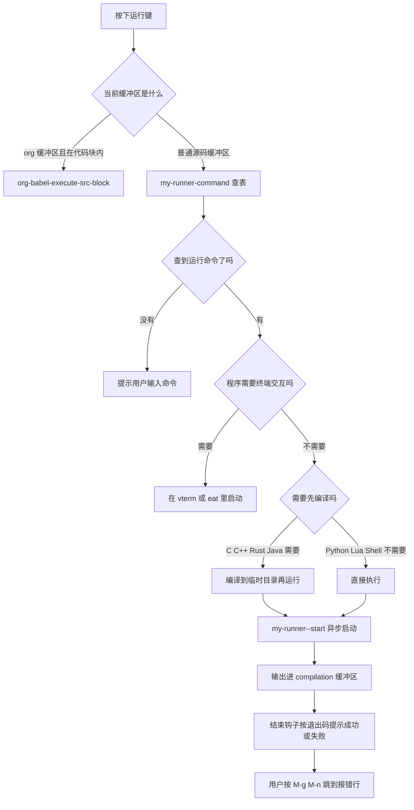
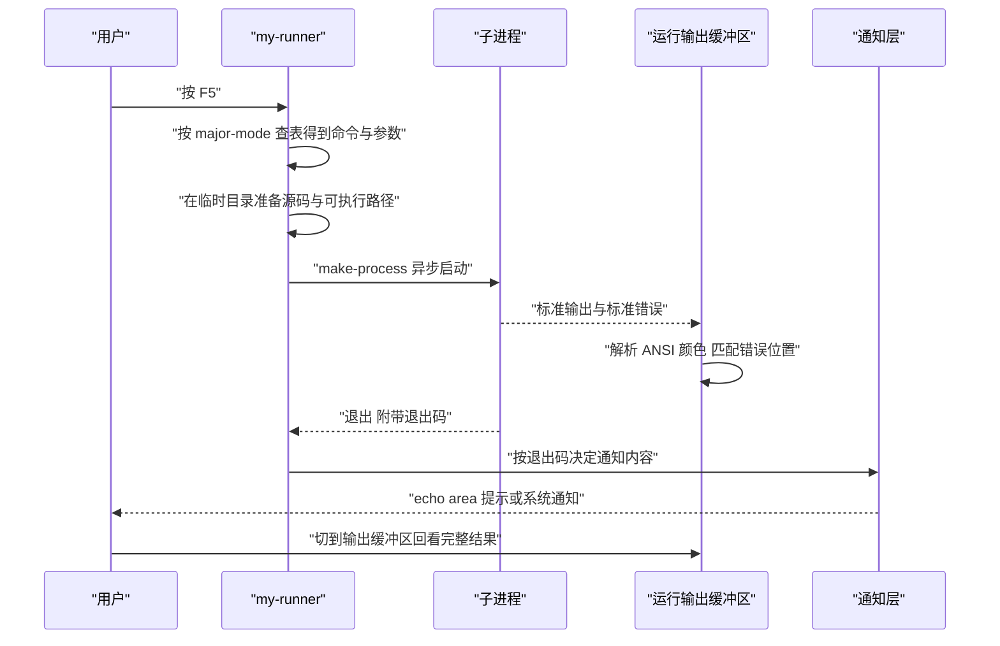

# 运行器与构建任务

> 一篇讲透「在 Emacs 里把代码跑起来」这件事：从七种执行原语的取舍，到 quickrun 的用法，再到一份可直接使用的 `my-runner.el`，最后是把运行、构建、测试、清理做成一个任务面板。

---

## 一、需求分析：运行器要解决什么

### 1.1 四种典型诉求

配置运行器之前先把诉求列清楚，否则很容易写出一堆只在一个项目里好用的命令。真实开发中的诉求大致是四类：

- **跑当前文件**。写算法题、写脚本、验证一段语言特性时需要一个键把当前文件跑起来。C 的单文件需要先编译再运行，Python 直接跑，Java 的文件名必须与 public 类名一致，Shell 脚本要注意有没有可执行位。这四种差异说明运行命令必须按语言分别处理，不能用一个通用命令糊过去。
- **跑当前测试**。光标停在某个测试函数上，按一个键只跑这个测试。这是最高频的诉求，也是收益最大的一个：全量测试可能要几十秒，只跑一个用例通常不到一秒，反馈速度决定了你愿不愿意频繁验证。
- **跑整个项目**。`cargo test`、`go test ./...`、`pytest`、`gradle test` 各自有固定命令。这一类的关键在于让 Emacs 自动识别项目类型，而不是每次手敲命令。
- **结果要留痕**。运行结果不能只闪一下 echo area，得留在一个可搜索、可滚动、可复制的缓冲区里，出问题时能回看。程序崩溃时的完整堆栈往往有几十行，只在 echo area 显示的话你根本来不及看清。**带参数运行**也要留位置，因为很多程序在调试时需要用命令行参数切换行为。

### 1.2 为什么不能只用一个 shell 命令

最朴素的方案是给每个语言绑一个 `shell-command`。它会在三件事上让你难受：

1. **输出去向不可控**。`shell-command` 的短输出进 echo area，长输出进 `*Shell Command Output*` 缓冲区，输出长度决定行为，你无法预期。更麻烦的是这个判断依赖输出是否包含换行等启发式规则，同一个命令在不同输入下表现可能不同。
2. **阻塞**。`shell-command` 是同步的，跑一个耗时几秒的程序时整个 Emacs 都会卡住。Emacs 是单线程的，同步等待外部进程期间无法响应任何按键，连 `C-g` 也要等进程结束才生效。
3. **不能从输出里跳转**。程序报错输出的 `文件:行号` 不会被解析成可点击链接，你得手动去找。

运行器的正确做法是统一走异步进程，把输出收进一个 `compilation-mode` 缓冲区（从而免费获得错误跳转、ANSI 着色、结束钩子），只在必须交互的场景里退回到终端模拟器。

### 1.3 分派决策图

运行器本质上是一张「上下文到命令」的映射表加一个统一的执行入口。上下文包括当前 major mode、当前项目类型、光标位置（在测试函数里还是普通代码里）、以及是否选中了区域。执行入口要统一处理进程启动、输出去向与结束通知这三件事。把这两部分拆开写，运行器就能保持简短：映射表可以随时增删条目，执行入口只需要写一次并反复复用。



### 1.4 从按键到结果的时序



---

## 二、Emacs 的执行原语对比

### 2.1 七种原语

| 原语 | 阻塞 | 输出去哪 | 能否中断 | 适用场景 |
| --- | --- | --- | --- | --- |
| `compile` | 否，异步 | `*compilation*` 缓冲区 | 是，`M-x kill-compilation` 或缓冲区里 `C-c C-k` | 构建、测试、任何输出含位置信息的命令 |
| `async-shell-command` | 否，异步 | `*Async Shell Command*` 缓冲区 | 是，`M-x kill-compilation` 也可用；或 `M-x list-processes` 后删进程 | 一次性的命令，不需要错误跳转 |
| `shell-command` | 是，同步 | 短输出进 echo area，长输出进 `*Shell Command Output*` | 否 | 需要立刻拿到结果的短命令，如 `git rev-parse` |
| `start-process` | 否，异步 | 由调用者指定缓冲区，或用过滤器接管 | 是，`delete-process` 或 `interrupt-process` | 自己管理进程与输出的底层用法 |
| `make-process` | 否，异步 | 由 `:buffer`、`:filter`、`:stderr` 参数决定 | 是，同上 | `start-process` 的现代替代，能分离标准错误 |
| `call-process` | 是，同步 | 由 DESTINATION 参数决定（缓冲区名、`t`、`nil` 或文件） | 否 | 需要拿到退出码与完整输出的短命令 |
| `process-file` | 是，同步 | 同 `call-process` | 否 | 同 `call-process`，但支持 TRAMP 远程文件 |
| vterm / eat | 否，异步 | 终端模拟器缓冲区 | 是，终端里 `C-c` 或原生命令 | 需要交互输入的程序、REPL、全屏 TUI |

### 2.2 `compile` 与 `make-process` 的分工

两者都是异步，差别在于**输出是否被解析**：

- `compile` 会把输出交给 `compilation-mode` 解析，自动识别 `文件:行号`、自动着色 ANSI、结束时调用 `compilation-finish-functions`。代价是它固定用 `*compilation*` 系列的缓冲区名，多个任务同时跑需要处理缓冲区冲突。
- `make-process` 给你完全的控制权：缓冲区名、过滤器、结束回调都自己定。代价是错误跳转、ANSI 着色都要自己实现。

实践建议是：**能用 `compile` 就用 `compile`**，因为 `compilation-mode` 免费提供了大量能力。只有在需要并行跑多个任务、或者需要自定义输出格式时才用 `make-process`。后者的进程生命周期要自己管理，这一点在 2.4 节末尾会再提一次。

### 2.3 同步原语的正确用法

`call-process` 的第二个参数决定输出去向，这是最容易记错的地方：

```elisp
;; DESTINATION 为 t 表示插入当前缓冲区
(with-temp-buffer
  (call-process "git" nil t nil "rev-parse" "--show-toplevel")
  (string-trim (buffer-string)))

;; DESTINATION 为 0 表示丢弃输出，只关心退出码
(call-process "test" nil nil nil "-f" "/etc/passwd")   ; 返回 0 表示文件存在

;; DESTINATION 为字符串表示写进该名字的缓冲区
(call-process "ls" nil "*ls-out*" nil "-l")

;; 最后一个可选参数是显示方式，非 nil 时会在进程运行时刷新显示
(call-process "make" nil "*make*" t)
```

`process-file` 与 `call-process` 的参数完全一样，区别是 `process-file` 尊重 `default-directory` 的远程属性。通过 TRAMP 打开远程目录时，`process-file` 会在远程主机上执行命令，而 `call-process` 在本机执行。写工具函数时优先用 `process-file`，兼容性更好。

### 2.4 中断一个正在运行的进程

```elisp
;; 对 compilation 缓冲区：用内置命令，它会妥善处理进程与缓冲区状态
M-x kill-compilation            ; 或在编译缓冲区里按 C-c C-k

;; 对任意进程：拿到进程对象后删掉
(let ((proc (get-buffer-process "*my-run*")))
  (when (process-live-p proc)
    (delete-process proc)))

;; 想发送 SIGINT 而不是直接杀掉，用 interrupt-process
;; Windows 上 interrupt-process 的行为与其他平台不同，尽量用 delete-process
(let ((proc (get-buffer-process "*my-run*")))
  (when (process-live-p proc)
    (interrupt-process proc)))
```

`delete-process` 直接终止进程（相当于 SIGKILL），`interrupt-process` 发送 SIGINT 让程序有机会做清理。对长时间构建，`kill-compilation` 是首选，因为它同时会把 compilation 缓冲区的状态置为「已中断」。

还有一个细节值得记住：`compile` 启动的进程与 compilation 缓冲区是绑定的，缓冲区被关掉时 Emacs 会一并处理它的进程；而 `make-process` 创建的进程需要你自己在结束回调里清理缓冲区，否则容易留下一个没有进程的孤儿缓冲区。写自管理进程的代码时，别忘了在 sentinel 里做收尾。

---

## 三、quickrun 的用法与配置

### 3.1 quickrun 的定位

quickrun 是 Vim 的 quickrun 插件在 Emacs 上的移植，做的事情非常专一：**把当前缓冲区或选区当作一个独立程序跑起来，输出到一个临时缓冲区**。它内置了七十多种语言或标记语言的运行模板，开箱即用。

它适合的场景是「验证一段代码」，不适合当作项目级运行器：它把源文件复制到临时目录再执行，因此拿不到项目的构建配置、依赖与相对路径。

```elisp
(use-package quickrun
  :ensure t
  :custom
  ;; 运行结果缓冲区是否获得焦点
  (quickrun-focus-p nil)
  ;; 超时秒数，超过就杀掉进程
  (quickrun-timeout-seconds 15)
  ;; 输出很长时是否截断行
  (quickrun-truncate-lines t)
  :bind
  (("C-c q q" . quickrun)
   ("C-c q r" . quickrun-region)
   ("C-c q s" . quickrun-shell)
   ("C-c q a" . quickrun-with-arg)
   ("C-c q c" . quickrun-compile-only)
   ("C-c q e" . quickrun-eval-print)
   ("C-c q d" . quickrun-set-default)))
```

### 3.2 命令一览

| 命令 | 作用 |
| --- | --- |
| `quickrun` | 运行整个缓冲区。找不到命令键时会询问，加 `C-u` 前缀则总是询问 |
| `quickrun-region` | 运行选中的区域；文档明确说明 Java 不支持区域运行 |
| `quickrun-with-arg` | 运行并传入命令行参数 |
| `quickrun-shell` | 把命令送到一个 eshell 缓冲区里执行，适合需要查看完整 shell 环境的情况 |
| `quickrun-compile-only` | 只编译不运行，用于语法检查或转换（例如 CoffeeScript 转 JavaScript） |
| `quickrun-eval-print` | 把运行结果替换回选区，类似 `M-:` 的效果 |
| `quickrun-replace-region` | 用运行结果替换选区 |
| `quickrun-select` | 运行前先选择要用哪个命令键 |
| `quickrun-set-default` | 修改某个语言的默认命令键 |

内置支持的语言覆盖很广，常用的有 C（`gcc` / `clang`）、C++（`g++` / `clang++`）、Rust（`rustc`）、Go（`go`）、Python、Java（`javac` + `java`）、JavaScript（`node`）、TypeScript（`tsc`）、Dart、Lua、Shell（按 shebang 判断）、Emacs Lisp、Ruby、Perl、Haskell、OCaml、Zig 等。

### 3.3 quickrun-add-command 自定义命令

`quickrun-add-command` 的签名是 `(key alist &key default mode override)`。第一个参数是命令键（任意字符串），第二个参数是命令参数列表，三个关键字参数分别是「设为该语言的默认」「绑定到某个 mode」「覆盖已有配置」。

命令参数里的占位符是理解自定义的关键：

| 占位符 | 展开为 |
| --- | --- |
| `%c` | 命令名，也就是 `:command` 的值 |
| `%o` | 命令选项，也就是 `:cmdopt` 的值 |
| `%s` | 源文件绝对路径 |
| `%a` | 脚本参数 |
| `%n` | 去掉扩展名的源文件绝对路径 |
| `%N` | 去掉扩展名的源文件名（不含目录） |
| `%d` | 源文件所在目录绝对路径 |
| `%e` | 带可执行后缀的源文件绝对路径 |
| `%E` | 带可执行后缀的源文件名（不含目录） |

下面是一个完整的自定义示例，把 C++ 的默认命令改成 C++20 标准：

```elisp
;; 定义一个用 C++20 编译并运行的新命令键
(quickrun-add-command "c++/cxx20"
  '((:command . "g++")
    ;; :exec 是命令列表，会按顺序执行
    ;; 第一条编译，第二条运行
    (:exec    . ("%c -std=c++20 -Wall -Wextra -g %o -o %e %s"
                 "%e %a"))
    ;; 运行结束后删除可执行文件
    (:remove  . ("%e"))
    (:description . "用 g++ 与 C++20 标准编译并运行"))
  ;; :default 表示把这条设为 c++ 语言的默认命令
  :default "c++")

;; 给某个 mode 单独绑定命令
(quickrun-add-command "c/lint-only"
  '((:command . "clang")
    (:exec    . "%c -fsyntax-only -Wall -Wextra %s")
    (:description . "只做语法检查"))
  :mode 'c-mode)

;; 覆盖已有命令的部分参数
(quickrun-add-command "c/gcc"
  '((:exec . ("%c -std=c17 -Wall -Wextra -O2 -o %e %s"
              "%e %a")))
  :override t)
```

关于 quickrun 的几处行为需要说准确，否则很容易配错：

- **源文件不是原文件**。quickrun 会把当前缓冲区的内容复制到一个临时文件再执行，所以 `%s`、`%n` 这些占位符展开出来的是**临时路径**而不是你正在编辑的文件路径。唯一的例外是 Java，因为 `javac` 要求文件名与 public 类名一致，quickrun 对它做了特殊处理。这条规则的意义是：如果你的程序依赖相对路径读取同目录的数据文件，用 quickrun 会读不到，这时应该改用自写运行器直接跑原文件。
- **`:exec` 是列表时按顺序执行，遇到失败会停下**。所以「先编译再运行」写成 `("%c ... -o %e %s" "%e %a")` 是可靠的，编译失败时不会去执行一个不存在的产物。
- **`:remove` 在运行结束后删除文件**。临时目录本来就由系统清理，但可执行文件占空间较大时显式删除更干净。
- **`:default` 与 `:mode` 的区别**。`:default` 是把这条命令设为某个**语言**的默认命令键（如 `"c++"`），`:mode` 是把它绑定到某个 **major mode**。前者影响 `quickrun` 在识别出语言后选哪条命令，后者影响在哪个 mode 里直接调用这条命令。
- **`:override t` 会替换已有参数**。注意它替换的是你给出的那些键，未给出的键保留原值。上面第三个例子只给了 `:exec`，所以 `:command` 仍然是原来 `c/gcc` 的 `gcc`。

`quickrun-compile-only` 用的是 `:compile-only` 参数而不是 `:exec`，做语法检查或语言转换时用它：

```elisp
;; 定义一个只做类型检查的 TypeScript 命令
(quickrun-add-command "typescript/tsc-check"
  '((:command . "tsc")
    (:exec    . "%c %s")
    ;; quickrun-compile-only 会执行这一项
    (:compile-only . "%c --noEmit --pretty false %s")
    (:description . "TypeScript 类型检查"))
  :default "typescript")
```

---

## 四、自写语言运行器：my-runner.el

下面的模块是本节的核心产出。它按 major mode 分派运行命令，处理编译产物路径、临时目录、跨平台可执行后缀，并在失败时给出明确提示。

```elisp
;;; my-runner.el --- 按 major mode 分派的一键运行器 -*- lexical-binding: t; -*-

;;; Commentary:
;; 提供 my-runner 一键运行当前文件、my-runner-tests 运行项目测试、
;; my-runner-clean 清理构建产物，以及 F5 到 F8 的键位。
;; 依赖 Emacs 29 以上的内置 compile.el、project.el。

;;; Code:

(require 'compile)
(require 'project)
(require 'subr-x)

(defgroup my-runner nil
  "一键运行器的配置。"
  :group 'tools)

(defcustom my-runner-search-roots
  '("src" "bin" "cmd" ".")
  "从项目根开始查找可执行文件时依次尝试的子目录。"
  :type '(repeat string)
  :group 'my-runner)

(defcustom my-runner-python-executable "python3"
  "运行 Python 代码时使用的解释器。

Windows 上通常写 \"python\"，某些发行版上写 \"python3\"。"
  :type 'string
  :group 'my-runner)

(defcustom my-runner-java-classpath "."
  "运行 Java 类时使用的 classpath。"
  :type 'string
  :group 'my-runner)

(defcustom my-runner-notify-function #'my-runner-default-notify
  "任务结束时的通知函数。

接收两个参数：任务名与退出码，退出码为 0 表示成功。"
  :type 'function
  :group 'my-runner)

;;; 基础工具

(defun my-runner--exe-suffix ()
  "返回当前平台的可执行文件后缀。"
  (if (eq system-type 'windows-nt) ".exe" ""))

(defun my-runner--temp-dir (&optional prefix)
  "创建一个临时目录并返回其路径。

PREFIX 用于目录名，方便在 /tmp 下识别。
目录会在系统重启时自动清理，无需手工删除。"
  (let ((dir (make-temp-file (or prefix "my-runner-") t)))
    dir))

(defun my-runner--project-root ()
  "返回当前项目根；不在项目里时返回文件所在目录。"
  (or (when-let ((pr (project-current nil)))
        (project-root pr))
      (when buffer-file-name
        (file-name-directory buffer-file-name))
      default-directory))

(defun my-runner--buffer-name (task)
  "为任务 TASK 生成一个唯一的输出缓冲区名。"
  (format "*runner:%s:%s*" task
          (format-time-string "%H%M%S")))

(defun my-runner--start (name buffer command &optional directory)
  "异步启动命令 COMMAND。

NAME 是任务名，用于提示；BUFFER 是输出缓冲区名；
DIRECTORY 是命令的执行目录，默认用当前 `default-directory'。
输出缓冲区会进入 compilation-mode，因此错误行可以点击跳转。"
  (let ((default-directory (or directory default-directory)))
    ;; compile 的第二个参数为 nil 表示不用 comint 模式
    (let ((compilation-buffer-name-function
           (lambda (_mode) buffer)))
      (compile command))))

(defun my-runner-default-notify (task exit-code)
  "默认通知实现：用 message 在 echo area 提示，并尝试系统通知。"
  (let* ((ok (zerop exit-code))
         (text (format "%s %s（退出码 %d）"
                       task (if ok "成功" "失败") exit-code)))
    (message "%s" text)
    (my-runner-system-notify task text ok)))

(defun my-runner-system-notify (title text success)
  "尝试发送系统通知。

SUCCESS 为 nil 时标记为严重级别。失败时静默返回，
因为不是所有环境都有通知能力，也不应该因此报错。"
  (ignore-errors
    (pcase system-type
      ((or 'gnu/linux 'berkeley-unix)
       (when (executable-find "notify-send")
         (call-process "notify-send" nil nil nil
                       "-u" (if success "normal" "critical")
                       title text)))
      ('darwin
       (when (executable-find "osascript")
         (call-process "osascript" nil nil nil
                       "-e"
                       (format "display notification %s with title %s"
                               (shell-quote-argument text)
                               (shell-quote-argument title)))))
      ('windows-nt
       (when (executable-find "powershell")
         (call-process
          "powershell" nil nil nil
          "-NoProfile" "-Command"
          (format "New-BurntToastNotification -Text '%s','%s'"
                  (replace-regexp-in-string "'" "''" title)
                  (replace-regexp-in-string "'" "''" text))))))))
```

### 4.1 运行命令分派表

```elisp
(defcustom my-runner-mode-alist
  '((c-mode            . my-runner--c)
    (c-ts-mode         . my-runner--c)
    (c++-mode          . my-runner--c++)
    (c++-ts-mode       . my-runner--c++)
    (python-mode       . my-runner--python)
    (python-ts-mode    . my-runner--python)
    (rust-mode         . my-runner--rust)
    (rust-ts-mode      . my-runner--rust)
    (go-mode           . my-runner--go)
    (go-ts-mode        . my-runner--go)
    (java-mode         . my-runner--java)
    (java-ts-mode      . my-runner--java)
    (dart-mode         . my-runner--dart)
    (js-mode           . my-runner--node)
    (js-ts-mode        . my-runner--node)
    (typescript-ts-mode . my-runner--node)
    (sh-mode           . my-runner--shell)
    (lua-mode          . my-runner--lua))
  "major mode 到运行函数的分派表。

每个函数接收源文件绝对路径，返回要执行的 shell 命令字符串。"
  :type '(alist :key-type symbol :value-type function)
  :group 'my-runner)

(defun my-runner--lookup (mode)
  "为 MODE 找到对应的运行函数。

先精确匹配，再沿 mode 的派生关系向上找。"
  (or (alist-get mode my-runner-mode-alist)
      (cl-loop for (m . fn) in my-runner-mode-alist
               when (and (fboundp m) (provided-mode-derived-p mode m))
               return fn)))
```

三种语言各给一个实现示例，其余结构相同：

```elisp
(defun my-runner--c (file)
  "为 C 源文件 FILE 生成先编译再运行的单行命令。

用 && 串联，编译失败时不会执行产物。"
  (let* ((dir (my-runner--temp-dir "my-runner-c-"))
         (exe (expand-file-name "a.out" dir))
         (cc (or (executable-find "clang") (executable-find "gcc") "cc")))
    (format "%s -std=c17 -Wall -Wextra -g -O0 -o %s %s && %s"
            cc
            (shell-quote-argument exe)
            (shell-quote-argument file)
            (shell-quote-argument exe))))

(defun my-runner--c++ (file)
  "为 C++ 源文件 FILE 生成先编译再运行的单行命令。"
  (let* ((dir (my-runner--temp-dir "my-runner-cpp-"))
         (exe (expand-file-name "a.out" dir))
         (cxx (or (executable-find "clang++") (executable-find "g++") "c++")))
    (format "%s -std=c++20 -Wall -Wextra -g -O0 -o %s %s && %s"
            cxx
            (shell-quote-argument exe)
            (shell-quote-argument file)
            (shell-quote-argument exe))))

(defun my-runner--python (file)
  "为 Python 源文件 FILE 生成运行命令。

-u 关闭输出缓冲，保证 print 的结果及时出现在缓冲区里。"
  (format "%s -u %s"
          my-runner-python-executable
          (shell-quote-argument file)))
```

### 4.2 运行当前文件与运行选区

`my-runner` 的三个分支对应三种使用状态。第一种是在 org 缓冲区里编辑文档并执行其中的代码块，这条路直接交给 org-babel，因为 org 已经有一套成熟的执行与结果内联机制，自己再实现一遍没有意义。第二种是普通的源码缓冲区，按 major mode 查表得到命令。第三种是没有关联文件的缓冲区（例如 `*scratch*` 或某个临时缓冲区），此时无法确定「当前文件」是什么，直接给出明确错误比猜测更友好。

这里的 `my-runner--lookup` 做了一件比简单查表更细致的事：它先用 `alist-get` 精确匹配当前 major mode，匹配不到时再遍历分派表，用 `provided-mode-derived-p` 判断当前 mode 是否派生自表里的某个 mode。这样一来，你只需要为 `python-mode` 注册一次，所有派生自它的第三方 mode（例如某些框架自带的 python 派生 mode）就都能用上同一套运行命令，不必逐个补登记。

```elisp
;;;###autoload
(defun my-runner ()
  "一键运行当前文件。

在 org 缓冲区里运行光标所在的代码块；
在其他编程缓冲区里按 major mode 分派命令。"
  (interactive)
  (cond
   ;; org 缓冲区：交给 org-babel，需要先在 org-babel-do-load-languages 里启用语言
   ((derived-mode-p 'org-mode)
    (if (org-babel-get-src-block-info)
        (org-babel-execute-src-block)
      (user-error "光标不在代码块内")))

   ;; 普通源码缓冲区
   (buffer-file-name
    (let* ((file buffer-file-name)
           (fn (my-runner--lookup major-mode)))
      (unless fn
        (user-error "没有为 %s 配置运行命令，可用 my-runner--mode-alist 添加"
                    major-mode))
      (let ((cmd (funcall fn file)))
        (message "运行：%s" cmd)
        (my-runner--start
         (file-name-nondirectory file)
         (my-runner--buffer-name (file-name-base file))
         cmd
         (my-runner--project-root)))))

   (t (user-error "当前缓冲区没有关联文件"))))
```

```elisp
;;;###autoload
(defun my-runner-region (beg end)
  "运行选区内的代码。

把选区内容写入临时文件再执行，适合验证一段片段。"
  (interactive "r")
  (unless (use-region-p)
    (user-error "请先选中要运行的代码"))
  (let* ((ext (or (and buffer-file-name
                       (file-name-extension buffer-file-name))
                  (pcase major-mode
                    ((or 'c-mode 'c-ts-mode) "c")
                    ((or 'c++-mode 'c++-ts-mode) "cpp")
                    ((or 'python-mode 'python-ts-mode) "py")
                    ((or 'rust-mode 'rust-ts-mode) "rs")
                    ('go-mode "go")
                    ((or 'sh-mode) "sh")
                    ('lua-mode "lua")
                    (_ "txt"))))
         (dir (my-runner--temp-dir "my-runner-region-"))
         (file (expand-file-name (concat "snippet." ext) dir))
         (buf (current-buffer)))
    (with-temp-file file
      (insert-buffer-substring buf beg end))
    (let ((fn (my-runner--lookup major-mode)))
      (unless fn (user-error "该模式不支持区域运行"))
      (my-runner--start
       "region" (my-runner--buffer-name "region")
       (funcall fn file) dir))))
```

### 4.3 交互式输入的程序为什么必须在终端里跑

有一类程序必须从终端运行：交互式命令行工具、需要 TTY 才能正确显示进度的程序、会读取密码的程序、ncurses 全屏界面（`top`、`vim`、`htop`）。

原因是操作系统层面的：这些程序在启动时会检查标准输入是否是一个 **TTY（终端设备）**。`compile` 与 `make-process` 给子进程挂的是**管道**，不是 TTY。程序发现 stdin 不是 TTY 后会出现三类行为：报错退出、跳过交互步骤、或者干脆挂在那里等一个永远不会到来的输入。

`compile` 的输出缓冲区看起来像终端，但那是 Emacs 用缓冲区渲染出来的，程序看不到它。往 compilation 缓冲区里打字不会传进子进程。

正确的替代方案是用终端模拟器包。两个主流选择：

```elisp
;; vterm：基于 libvterm 的原生模块实现，性能最好，但需要编译模块
(use-package vterm
  :ensure t
  :commands vterm
  :custom
  (vterm-max-scrollback 10000)
  (vterm-shell (or (getenv "SHELL") "/bin/bash"))
  :bind
  ("C-c t v" . vterm))

;; eat：纯 Elisp 实现，不需要编译原生模块，安装门槛更低
(use-package eat
  :ensure t
  :commands (eat eat-project)
  :bind
  ("C-c t e" . eat)
  ("C-c t p" . eat-project))
```

`vterm` 需要系统里有 `cmake` 与 `libvterm` 的开发文件，Arch 上用 `sudo pacman -S libvterm`，Debian/Ubuntu 上用 `sudo apt install libvterm-dev`，macOS 上 `brew install libvterm`。`eat` 是纯 Elisp，装完即用，性能略低但在远程与容器环境里更省事。

在终端里跑交互式程序时，可以带一个参数把程序的工作目录设成项目根：

```elisp
(defun my-runner-terminal (command)
  "在一个新的终端缓冲区里运行可能需要的交互式命令 COMMAND。"
  (interactive "s命令: ")
  (let ((default-directory (my-runner--project-root)))
    (cond
     ((fboundp 'eat) (eat command))
     ((fboundp 'vterm) (vterm (format "vterm-%s" command)))
     (t (async-shell-command command)))))
```

---

## 五、测试运行器集成

### 5.1 各语言的测试命令

| 生态 | 单次全量 | 只跑某一个 | 说明 |
| --- | --- | --- | --- |
| Python / pytest | `pytest` | `pytest tests/test_x.py::test_y` | 加 `-q` 减少输出，加 `-x` 首次失败即停 |
| Rust / cargo | `cargo test --color=always` | `cargo test test_name` | `cargo test -- --nocapture` 显示打印输出 |
| Go | `go test ./...` | `go test -run TestFoo ./pkg` | 加 `-v` 显示每个用例 |
| JavaScript / jest | `npx jest` | `npx jest -t "用例名"` | 加 `--watchAll` 进入监听模式 |
| TypeScript / vitest | `npx vitest run` | `npx vitest run -t "用例名"` | `vitest` 默认是监听模式，用 `run` 单次执行 |
| Dart | `dart test` | `dart test test/x_test.dart` | 加 `-r expanded` 看详细输出 |
| Java / Maven | `mvn -q test` | `mvn -q test -Dtest=类名#方法名` | |
| Java / Gradle | `./gradlew test` | `./gradlew test --tests "类名"` | |
| Emacs Lisp / ERT | `M-x ert` | `M-x ert RET 测试名 RET` | 见下文 |
| Lua / busted | `busted` | `busted spec/x_spec.lua` | 需要另外装 busted |

### 5.2 测试输出能不能点着跳

测试命令的输出格式决定了它在 compilation 缓冲区里的可用程度，这一点在选命令时值得考虑：

- **pytest 默认输出**是 `FAILED tests/test_x.py::test_y - AssertionError` 加一段 traceback。traceback 里的 `File "tests/test_x.py", line 12, in test_y` 命中内置的 `python-tracebacks-and-caml` 规则，所以能跳转；那一行 `FAILED ...` 汇总行则不能跳。加 `--tb=short` 可以让 traceback 更紧凑，跳转仍然可用。
- **cargo test 的输出**包含 `thread 'main' panicked at src/lib.rs:12:5`，命中 `rust-panic` 规则，可以跳转。
- **go test 的输出**是 `--- FAIL: TestFoo (0.00s)` 加 `foo_test.go:12: message`，后者命中 `gnu` 规则，可以跳转。
- **jest 的输出**格式是 `at Object.<anonymous> (src/a.test.js:12:5)`，Emacs 内置规则**不覆盖**这个格式，所以默认点不动。可行的变通是给 jest 加参数改变输出，或者在 `compilation-error-regexp-alist-alist` 里自己加一条规则（写法见本模块第 2 篇第四节）。
- **dart test 的输出**同样是自定义格式，跳转不可用。日常诊断更应该依赖 Dart 的语言服务器。
- **ERT 不走 compilation-mode**，它有自己的 `*ert*` 缓冲区，失败用例本身就已经是可点击的链接，所以不需要额外处理。

结论是：**把「跳转到失败用例」当作选测试命令的一个加分项**，而不是必然能力。如果一个测试框架的输出无法被解析，就把它的失败定位交给语言服务器或框架自己的输出格式选项。

### 5.3 统一的「跑当前项目测试」命令

```elisp
(defcustom my-runner-test-alist
  ;; 每一项是 (标记文件 . (全量命令 . 单测命令模板))
  '(("pytest.ini"        . ("pytest -q" . "pytest -q %s"))
    ("pyproject.toml"    . ("pytest -q" . "pytest -q %s"))
    ("Cargo.toml"        . ("cargo test --color=always" . "cargo test %s"))
    ("go.mod"            . ("go test ./..." . "go test -run %s ./..."))
    ("package.json"      . ("npx jest" . "npx jest -t %s"))
    ("pubspec.yaml"      . ("dart test" . "dart test %s"))
    ("pom.xml"           . ("mvn -q test" . "mvn -q test -Dtest=%s"))
    ("build.gradle"      . ("./gradlew test --console=plain" . "./gradlew test --tests %s"))
    ("build.gradle.kts"  . ("./gradlew test --console=plain" . "./gradlew test --tests %s")))
  "项目标记文件到测试命令的映射。

每项的值是 (全量命令 . 单测命令模板)，模板里的 %s 会被替换成测试名。"
  :type '(alist :key-type string :value-type (cons string string))
  :group 'my-runner)

(defun my-runner--test-spec ()
  "找到当前项目的测试命令配置。

返回 (全量命令 . 单测模板) 与项目根的 cons；找不到时返回 nil。"
  (let ((root (my-runner--project-root)))
    (cl-loop for (marker . spec) in my-runner-test-alist
             when (file-exists-p (expand-file-name marker root))
             return (cons spec root))))

;;;###autoload
(defun my-runner-tests (&optional test-name)
  "运行当前项目的测试。

交互式调用时若不处于项目内，会提示输入命令。
TEST-NAME 为空则跑全部测试。"
  (interactive)
  (let* ((spec (my-runner--test-spec))
         (root (or (cdr spec) (my-runner--project-root)))
         (cmd
          (if (null spec)
              (read-shell-command "测试命令: " "make test")
            (let ((all (car (car spec)))
                  (one (cdr (car spec))))
              (if (and test-name (not (string-empty-p test-name)))
                  (format one test-name)
                all)))))
    (my-runner--start
     "tests" (my-runner--buffer-name "tests") cmd root)))

;;;###autoload
(defun my-runner-test-at-point ()
  "尝试从光标处推断出测试名，只跑这一个测试。

支持 pytest 的 def test_ 与 Rust 的 fn 测试函数。"
  (interactive)
  (let ((name
         (pcase major-mode
           ((or 'python-mode 'python-ts-mode)
            ;; 向上找最近的 def test_xxx
            (save-excursion
              (when (re-search-backward
                     "^\\s-*def \\(test_[A-Za-z0-9_]+\\)" nil t)
                (match-string-no-properties 1))))
           ((or 'rust-mode 'rust-ts-mode)
            (save-excursion
              (when (re-search-backward
                     "^\\s-*fn \\([A-Za-z0-9_]+\\)" nil t)
                (match-string-no-properties 1))))
           ((or 'go-mode 'go-ts-mode)
            (save-excursion
              (when (re-search-backward
                     "^func \\(Test[A-Za-z0-9_]+\\)" nil t)
                (match-string-no-properties 1))))
           (_ nil))))
    (unless name (user-error "光标处找不到测试名"))
    (my-runner-tests name)))
```

### 5.4 Emacs Lisp 自身的测试：ERT

ERT 是 Emacs 内置的测试框架，不需要装包。它的用法和上面那些外部框架完全不同：测试直接定义在缓冲区里，用 `ert` 交互式运行。

```elisp
;; 一个最小的 ERT 测试
(ert-deftest my-add-test ()
  "验证 my-add 的两个基本性质。"
  (should (= (my-add 2 3) 5))
  (should-error (my-add "2" 3) :type wrong-type-argument))

(defun my-add (a b)
  "返回 A 与 B 的和，参数必须是数字。"
  (unless (and (numberp a) (numberp b))
    (signal 'wrong-type-argument (list 'numberp a)))
  (+ a b))
```

| 命令 | 作用 |
| --- | --- |
| `M-x ert` | 交互式运行测试，会问你要跑哪些（可输入正则或 `t` 表示全部） |
| `M-x ert-run-tests-interactively` | 同 `ert`，是它的完整名字 |
| `M-x ert-run-tests-batch` | 批量运行，把结果打到标准输出，适合 CI |
| `M-x ert-list` | 列出当前已定义的所有测试 |
| `M-x ert-delete-all-tests` | 清空已定义的测试，重新加载文件时常用 |

把 ERT 接到统一的测试运行器里：

```elisp
;; 让 my-runner-tests 在 Emacs Lisp 项目里走 ERT
(defun my-runner-ert ()
  "在当前项目里加载所有测试文件并运行 ERT。"
  (interactive)
  (let* ((root (my-runner--project-root))
         (files (directory-files-recursively root "\\(test\\|spec\\)s?.*\\.el\\'")))
    (if (null files)
        (user-error "在 %s 下没找到测试文件" root)
      (dolist (f files) (load f nil t))
      (ert-run-tests-interactively t))))
```

ERT 的输出在自己的 `*ert*` 缓冲区里，支持失败用例的可点击跳转，所以不需要走 compilation-mode。

---

## 六、构建任务与任务面板

### 6.1 四个动作做成一个面板

日常需要的就是运行、构建、测试、清理四件事。用 hydra 做一层面板：

面板的价值不在于省按键，而在于**可发现性**。运行器配好之后最常出现的问题是「过两个月忘了某个动作绑在哪个键上」，于是又要去翻配置文件。hydra 把四个动作与它们的备选形式全部列在一个提示框里，按一次 `C-c r` 就能看到全景，比记键位或翻 `C-h b` 的输出快得多。下面的定义里每个字母都配了中文说明，这是自用配置里值得保留的习惯。

```elisp
(use-package hydra
  :ensure t
  :config
  (defhydra my-task-hydra (:color blue :hint nil)
    "
任务面板
-------------------------------------------------------------
_r_: 运行当前文件     _R_: 运行选区      _a_: 带参数运行
_b_: 构建项目         _B_: 重新构建      _c_: 只做语法检查
_t_: 跑全部测试       _T_: 跑光标处测试  _e_: 跑 ERT
_d_: 清理构建产物     _k_: 中断当前任务  _o_: 查看输出缓冲区
_q_: 退出
"
    ("r" my-runner)
    ("R" my-runner-region)
    ("a" (lambda () (interactive)
           (my-runner-with-arg (read-string "参数: "))))
    ("b" my-build)
    ("B" recompile)
    ("c" my-build-check)
    ("t" my-runner-tests)
    ("T" my-runner-test-at-point)
    ("e" my-runner-ert)
    ("d" my-runner-clean)
    ("k" kill-compilation)
    ("o" (lambda () (interactive)
           (switch-to-buffer (other-buffer (current-buffer) t))))
    ("q" nil :exit t))
  :bind
  ("C-c r" . my-task-hydra/body))
```

`my-build`、`my-build-check`、`my-runner-clean` 的定义在本模块第 2 篇与本篇下一节。如果你还没配置第 2 篇，先把对应的绑定注释掉。

### 6.2 带参数运行

```elisp
;;;###autoload
(defun my-runner-with-arg (args)
  "运行当前文件并传入命令行参数 ARGS。"
  (interactive "s参数: ")
  (let* ((file (or buffer-file-name (user-error "当前缓冲区没有关联文件")))
         (fn (my-runner--lookup major-mode))
         (cmd (funcall fn file)))
    (my-runner--start
     (file-name-nondirectory file)
     (my-runner--buffer-name "run")
     (format "%s %s" cmd args)
     (my-runner--project-root))))
```

### 6.3 清理构建产物

```elisp
;;;###autoload
(defun my-runner-clean ()
  "按项目类型清理构建产物。删除前会要求确认。"
  (interactive)
  (let* ((root (my-runner--project-root))
         (targets
          (cl-remove-if-not
           (lambda (d) (file-directory-p (expand-file-name d root)))
           '("build" "target/debug" "target/release" "out" "dist"
             ".pytest_cache" "__pycache__" "node_modules/.cache"))))
    (if (null targets)
        (message "没有找到可清理的目录")
      (when (yes-or-no-p
             (format "确认删除这些目录？\n%s"
                     (mapconcat (lambda (d) (concat "  " d)) targets "\n")))
        (dolist (d targets)
          (delete-directory (expand-file-name d root) t)
          (message "已删除 %s" d))))))
```

`delete-directory` 的第二个参数为 `t` 表示递归删除。这个函数很危险，所以清理命令一定要保留 `yes-or-no-p` 确认，不要为了「快」而做成无确认的一键清理。

---

## 七、后台任务与输出管理

### 7.1 compilation 缓冲区的复用问题

`compile` 默认把输出写到同名缓冲区，连续启动两个任务时第二个会覆盖或者复用第一个的缓冲区，出现「跑着跑着输出跑到别的任务里」的现象。`compile` 的文档字符串给出的解决办法是手工改名，但这不适合做成自动化命令。

正确的办法是绑定 `compilation-buffer-name-function`，让每次任务生成独立的缓冲区名：

```elisp
(defun my-runner-unique-buffer-name (mode)
  "为 MODE 生成带时间戳的 compilation 缓冲区名。

绑定到 `compilation-buffer-name-function' 后，
每次任务都会得到独立的输出缓冲区，互不覆盖。"
  (let ((base (cond ((eq mode 'compilation-mode) "compilation")
                    ((stringp mode) mode)
                    (t (symbol-name mode)))))
    (generate-new-buffer-name
     (format "*%s-%s*" base (format-time-string "%H%M%S")))))

;; 全局启用：所有 compile 调用都得到独立缓冲区
(setq compilation-buffer-name-function #'my-runner-unique-buffer-name)
```

`generate-new-buffer-name` 会自动在名字后面加 `<2>`、`<3>`，所以即使时间戳相同（同一秒内的两次任务）也不会冲突。

代价是缓冲区会越积越多。可以加一条清理规则：

```elisp
;; 只保留最近 10 个任务输出缓冲区，更早的自动杀掉
(defun my-runner-prune-output-buffers ()
  "保留最近的若干任务输出缓冲区，其余删除。"
  (let ((bufs (seq-filter
               (lambda (b)
                 (string-match-p "\\`\\*compilation-[0-9]+\\*\\'" (buffer-name b)))
               (buffer-list))))
    (dolist (b (nthcdr 10 bufs))
      (when (and (not (get-buffer-process b))
                 (not (get-buffer-window b)))
        (kill-buffer b)))))

(add-hook 'compilation-finish-functions
          (lambda (_buf _msg) (my-runner-prune-output-buffers)))
```

### 7.2 任务完成通知

小任务用 `message` 就够了，它出现在 echo area 与 `*Messages*` 缓冲区里。大任务（构建几分钟、测试几万条）值得用系统通知，让你可以切去做别的事。

```elisp
;;;###autoload
(defun my-runner-notify-on-finish (buffer msg)
  "挂到 `compilation-finish-functions' 上的通知函数。

MSG 形如 \"finished\\n\" 表示正常结束，其他情况视为异常退出。"
  (let* ((ok (string-match-p "finished" msg))
         (name (buffer-name buffer)))
    (funcall my-runner-notify-function
             (format "任务 %s" name)
             (if ok 0 1))))
```

关于通知包的选择，这里必须说清一件事：MELPA 上有一个名为 `alert` 的包，它提供 `alert` 函数，可以调用系统通知工具（Linux 的 `notify-send`、macOS 的 `terminal-notifier` 或 `osascript`、Windows 的 `toast`）并在 Emacs 内显示弹出窗口。它的包名与主函数名都叫 `alert`，属于真实存在的包。

但如果你的诉求只是「任务结束响一声」，直接调用系统命令是最省事的做法，不需要额外依赖：

```elisp
;; 用 alert 包的写法，需要先 M-x package-install RET alert RET
(use-package alert
  :ensure t
  :custom
  (alert-default-style
   (pcase system-type
     ('darwin 'osx-notifier)
     ('windows-nt 'toast)
     (_ 'notifications))))
```

注意 Windows 上 PowerShell 的 `New-BurntToastNotification` 需要事先安装 `BurntToast` 模块（`Install-Module -Name BurntToast`），否则命令会失败。上面 `my-runner-system-notify` 里的 `powershell` 调用放在 `ignore-errors` 里，装不上模块时最多是收不到通知，不会影响运行。

### 7.3 什么时候不要用编译缓冲区

如果一个任务的输出是**持续不断的**（例如 `npm run dev`、`tsc --watch`、日志跟踪），它永远不会结束，`compilation-finish-functions` 也永远不会触发。这类任务适合放进终端模拟器或专门的缓冲区，而不是 compilation 缓冲区：

```elisp
;;;###autoload
(defun my-runner-long-running (command)
  "在 eat 或 vterm 里运行一个长期不退出的命令。"
  (interactive "s长期运行命令: ")
  (let ((default-directory (my-runner--project-root)))
    (cond
     ((fboundp 'eat) (eat command))
     ((fboundp 'vterm) (vterm (format "vterm-%s"
                                      (file-name-base command))))
     ;; 都没有时退回到异步 shell 命令，输出会不断追加到一个缓冲区
     (t (async-shell-command command)))))
```

---

## 八、保存时自动运行

### 8.1 「保存即测试」的成本

先算一笔账。假设你的项目有 300 个测试，跑一遍需要 8 秒。你每天保存 500 次，那么一天里光是等测试就跑掉 4000 秒，接近 70 分钟，而且这 70 分钟是被打断成 500 段、每段 8 秒的等待——比连续跑 70 分钟要痛苦得多。

所以「保存即测试」的正确用法不是全量测试，而是：

- **保存时只跑与当前文件相关的测试**。pytest 的 `--lf`（只跑上次失败的）、`--testmon` 或者按文件路径过滤都能把范围缩小到几秒。
- **保存时只跑当前文件所属模块的测试**。`go test ./pkg/foo` 而不是 `go test ./...`。
- **保存时只做语法检查**，把测试留给显式按键触发。

### 8.2 带防抖的实现

```elisp
(defvar my-runner-auto-test-timer nil
  "保存后延迟跑测试的计时器。")

(defvar my-runner-auto-test-delay 5.0
  "保存后等待多少秒再跑测试。太短会在连续编辑时反复触发。")

(defvar my-runner-auto-test-enabled nil
  "非 nil 时才启用保存后自动测试。

默认关闭，需要时用 `my-runner-toggle-auto-test' 打开。")

(defun my-runner-auto-test-maybe ()
  "保存后安排一次测试，替换掉上一次未执行的安排。"
  (when my-runner-auto-test-enabled
    (when (timerp my-runner-auto-test-timer)
      (cancel-timer my-runner-auto-test-timer))
    (setq my-runner-auto-test-timer
          (run-with-idle-timer
           my-runner-auto-test-delay nil
           (lambda ()
             (setq my-runner-auto-test-timer nil)
             ;; 已有任务在跑就不排队，避免任务堆积
             (unless (cl-some (lambda (p) (process-live-p p)) (process-list))
               (my-runner-tests)))))))

;;;###autoload
(defun my-runner-toggle-auto-test ()
  "开关保存后自动测试。"
  (interactive)
  (setq my-runner-auto-test-enabled (not my-runner-auto-test-enabled))
  (if my-runner-auto-test-enabled
      (progn
        (add-hook 'after-save-hook #'my-runner-auto-test-maybe)
        (message "已开启保存后自动测试，延迟 %.1f 秒"
                 my-runner-auto-test-delay))
    (remove-hook 'after-save-hook #'my-runner-auto-test-maybe)
    (when (timerp my-runner-auto-test-timer)
      (cancel-timer my-runner-auto-test-timer))
    (message "已关闭保存后自动测试")))
```

把它做成**默认关闭、需要时手动打开**，是这套设计里最重要的决定。默认开启的自动测试会在你第一次遇到卡顿时就被永久关掉，而默认关闭则可以在需要连续验证时临时打开。

### 8.3 三个常见失控场景

**场景一：格式化工具触发的保存**。很多人的配置里 `before-save-hook` 挂了格式化函数，格式化会再次修改缓冲区，某些包会把它当成一次新的保存。如果你把自动测试挂在保存上，就会形成「保存、格式化、再保存、再测试」的连锁反应。判断办法是在 `*Messages*` 里看有没有重复的测试启动记录。解法是把自动测试改成挂在 `after-save-hook` 上，并确认格式化用的是 `before-save-hook`（保存前改完再写盘，不会二次触发保存）。

**场景二：测试自己会写文件**。测试生成快照文件、覆盖率报告、临时数据库时，如果同时开了文件监视，监视回调会因为这些产物而触发，进而再跑一次测试，形成无限循环。解法是监视回调里过滤文件扩展名，只对源文件的变化做出反应。

**场景三：任务排队堆积**。快速连续保存时，如果测试比较慢，会出现「上一个还没跑完，下一个已经排队」的情况，几个任务同时读写同一份构建产物，产生难以复现的失败。上面的实现用 `(cl-some #'process-live-p (process-list))` 做了忙碌检测，但那是粗糙的全局检查：只要有任何进程在跑就不启动新任务，包括无关的进程。更精确的做法是记录自己启动的进程对象：

```elisp
(defvar my-runner-active-processes nil
  "由 my-runner 启动且仍在运行的进程列表。")

(defun my-runner--busy-p ()
  "返回非 nil 表示已有 my-runner 任务在运行。"
  ;; 清理已经结束的进程，避免列表无限增长
  (setq my-runner-active-processes
        (cl-remove-if-not #'process-live-p my-runner-active-processes))
  (and my-runner-active-processes t))
```

用这个精确检查替换掉全局的 `process-list` 扫描，自动测试的触发条件就准确得多。

### 8.4 更省事的替代：只跑「上次失败的」

如果测试套件既有快速用例又有慢速用例，最实用的折中方案不是按时间节流，而是**让测试框架自己缩小范围**：

- pytest 的 `--lf` 只跑上次失败的用例，`--ff` 先跑上次失败的再跑其余，`-x` 遇到第一个失败就停。把日常的自动测试命令设成 `pytest -q --lf`，通常能压到一秒以内。
- Rust 的 `cargo test` 本身有增量编译，第二次跑通常只要几百毫秒；如果还嫌慢，可以用 `cargo nextest`（需要另外安装）以获得更细致的并行与过滤。
- Go 的 `go test` 有结果缓存：同一个包的测试在没有改动时会直接返回缓存结果，输出里会显示 `(cached)`。所以 `go test ./...` 在没改动时几乎是瞬时的，不需要额外的节流。
- JavaScript 生态里的 jest 与 vitest 都有 `--onlyChanged` 或监听模式，让框架自己跟踪依赖图。

让框架做过滤比让 Emacs 做节流更可靠，因为框架知道哪些用例真的受影响。

---

## 九、文件监视与自动重跑

### 9.1 auto-revert-mode 与文件监视

一个容易混淆的点需要先澄清：Emacs 里**没有**一个叫「手表模式」或 `watch-mode` 的内置功能。与「文件发生变化后自动做点什么」相关的内置机制有两个，它们解决的是不同问题：

- **`auto-revert-mode`**：缓冲区对应的文件在磁盘上被外部程序改了，自动把新内容重新读进缓冲区。这是「文件变了，我这边跟着刷新」。`global-auto-revert-mode` 是它的全局版本。
- **`file-notify-add-watch`**：一个底层 API，注册一个目录或文件的变更监视，变化时调用你给的回调函数。这是「文件变了，执行我的代码」。EGLOT 就是用它在项目里监听文件变化并通知语言服务器的。

```elisp
;; 自动重新读取被外部修改的文件
(global-auto-revert-mode 1)
;; 远程文件（TRAMP）上轮询开销大，可以让它只依赖文件通知
(setq auto-revert-avoid-polling t)
;; 轮询间隔，只在无法使用文件通知时生效
(setq auto-revert-interval 5)
;; 在 dired 里也自动刷新
(setq global-auto-revert-non-file-buffers t)
```

```elisp
;; 用 file-notify-add-watch 自己实现「产物变化后自动重跑」
(defvar my-runner-watch-descriptors nil
  "当前已注册的文件监视描述符列表。")

(defun my-runner--on-artifact-change (event)
  "产物变化的回调。EVENT 是 (DESCRIPTOR ACTION FILE [FILE1])。"
  (when (memq (car (cdr event)) '(created changed))
    (message "检测到产物变化：%s" (nth 2 event))
    (my-runner-tests)))

(defun my-runner-watch-start (directory)
  "监视 DIRECTORY 下的变化，变化时重跑测试。"
  (interactive "D监视目录: ")
  (unless (file-directory-p directory)
    (user-error "%s 不是一个目录" directory))
  (push (file-notify-add-watch
         directory '(change) #'my-runner--on-artifact-change)
        my-runner-watch-descriptors)
  (message "已开始监视 %s" directory))

(defun my-runner-watch-stop ()
  "停止所有由 `my-runner-watch-start' 建立的监视。"
  (interactive)
  (dolist (desc my-runner-watch-descriptors)
    (ignore-errors (file-notify-rm-watch desc)))
  (setq my-runner-watch-descriptors nil)
  (message "已停止全部监视"))
```

`file-notify-add-watch` 在某些平台上需要额外的依赖才能工作：Linux 用 inotify（内核自带），macOS 用 kqueue 或 FSEvents，Windows 用 ReadDirectoryChangesW，这些都是 Emacs 编译期就绑定的。但**网络文件系统与某些容器挂载卷不支持文件通知**，此时会退化或直接不工作。用 `(file-notify--library)` 可以查看当前实际使用的后端。

几个实践要点：

- **监视是递归还是单层，取决于后端与参数**。Emacs 的 `file-notify-add-watch` 在大多数后端上只监视你给的那**一个**目录，子目录的变化不会上报，除非后端本身支持递归（inotify 就不支持，需要你自己为每个子目录注册）。监视一个有几万个目录的源码树会消耗大量文件描述符，务必限定范围。
- **回调返回的事件格式是 `(DESCRIPTOR ACTION FILE [FILE1])`**。`ACTION` 的取值是 `created`、`changed`、`deleted`、`renamed`。`renamed` 事件会带上新旧两个文件名，分别在第 3、4 个位置。
- **描述符必须保存下来以便注销**。`file-notify-rm-watch` 需要描述符，把描述符丢掉就等于永久泄漏了一个监视，只能重启 Emacs 才能清理。
- **TRAMP 远程目录上的监视行为不同**。远程路径会走轮询或后端支持的通知机制，开销远高于本地，`auto-revert-avoid-polling` 就是为这种情况准备的开关。
- **容器里的 bind mount 常常收不到事件**。Docker Desktop 在 macOS 与 Windows 上用的是虚拟化文件共享，宿主机上的改动可能不会通知到容器内的 inotify。这种情况下监视不可靠，改用轮询式的 `auto-revert-mode`。

### 9.2 与「保存即测试」的分工

两种自动化机制解决的是不同场景：

- **保存即测试**依赖你**在 Emacs 里保存**。适合你正在专注写某一个模块的时候。
- **文件监视**依赖文件**在磁盘上变化**，不管是谁改的。适合别的进程会生成文件的时候，例如：构建脚本生成代码后再跑测试、前端打包工具产出产物后再跑验收测试、或者你在终端里用别的编辑器改了文件。

两者可以同时开，但要注意不要形成环路：如果「测试」本身会写文件（生成了覆盖率报告、快照文件），文件监视会被自己的产物触发，进入无限循环。避免办法是监视特定的源文件扩展名，而不是整个目录：

```elisp
;; 只对 .c 与 .h 的变化做出反应，避免被测试自己生成的产物触发
(defun my-runner--on-source-change (event)
  "只在源文件变化时触发重跑。"
  (let ((file (nth 2 event)))
    (when (and (stringp file)
               (string-match-p "\\.\\(c\\|h\\|cpp\\|hpp\\|py\\|rs\\|go\\)\\'" file))
      (my-runner--on-artifact-change event))))
```

---

## 十、完整实战：my-runner.el 全文与键位

把前面的片段汇总成一份完整的模块。保存为 `~/.emacs.d/lisp/my-runner.el`，在 `init.el` 里 `(require 'my-runner)`。

```elisp
;;; my-runner.el --- 一键运行、构建、测试与清理 -*- lexical-binding: t; -*-

;;; Commentary:
;; 本模块提供：
;;   my-runner            运行当前文件
;;   my-runner-region     运行选区
;;   my-runner-with-arg   带参数运行
;;   my-runner-tests      运行项目测试
;;   my-runner-test-at-point  只跑光标处的测试
;;   my-runner-clean      清理构建产物
;;   my-runner-toggle-auto-test  开关保存后自动测试
;; 以及 F5 到 F8 的默认键位。
;;
;; 依赖：Emacs 29 以上（使用 project.el 与内置 compile.el）。
;; 构建命令的推断逻辑见本模块第 2 篇 my-build.el。

;;; Code:

(require 'compile)
(require 'project)
(require 'subr-x)
(require 'cl-lib)

(defgroup my-runner nil
  "一键运行器。"
  :group 'tools)

(defcustom my-runner-python-executable "python3"
  "Python 解释器命令名。Windows 上通常应改为 \"python\"。"
  :type 'string :group 'my-runner)

(defcustom my-runner-java-classpath "."
  "运行 Java 类时使用的 classpath。"
  :type 'string :group 'my-runner)

(defcustom my-runner-auto-test-delay 5.0
  "保存后等待多少秒再跑测试。"
  :type 'number :group 'my-runner)

(defcustom my-runner-notify-function #'my-runner-default-notify
  "任务结束时的通知函数，接收任务名与退出码两个参数。"
  :type 'function :group 'my-runner)

(defvar my-runner-auto-test-enabled nil
  "非 nil 时启用保存后自动测试。默认关闭。")

(defvar my-runner-auto-test-timer nil
  "保存后延迟跑测试的计时器。")

;;; 基础工具

(defun my-runner--exe-suffix ()
  "返回当前平台的可执行文件后缀。"
  (if (eq system-type 'windows-nt) ".exe" ""))

(defun my-runner--temp-dir (&optional prefix)
  "创建并返回一个临时目录路径。PREFIX 用于目录名。"
  (make-temp-file (or prefix "my-runner-") t))

(defun my-runner--project-root ()
  "返回当前项目根，找不到时回退到文件所在目录。"
  (or (when-let ((pr (project-current nil))) (project-root pr))
      (when buffer-file-name (file-name-directory buffer-file-name))
      default-directory))

(defun my-runner--buffer-name (task)
  "为任务 TASK 生成带时间戳的输出缓冲区名。"
  (generate-new-buffer-name
   (format "*runner-%s-%s*" task (format-time-string "%H%M%S"))))

(defun my-runner--start (name buffer command &optional directory)
  "异步启动 COMMAND。

NAME 为任务名，BUFFER 为输出缓冲区基名，DIRECTORY 为执行目录。
输出缓冲区走 `compilation-mode'，因此支持错误跳转与 ANSI 着色。"
  (let ((default-directory (or directory default-directory))
        (compilation-buffer-name-function (lambda (_m) buffer)))
    (message "%s：%s" name command)
    (compile command)))

;;; 分派表

(defcustom my-runner-mode-alist
  '((c-mode . my-runner--c) (c-ts-mode . my-runner--c)
    (c++-mode . my-runner--c++) (c++-ts-mode . my-runner--c++)
    (python-mode . my-runner--python) (python-ts-mode . my-runner--python)
    (rust-mode . my-runner--rust) (rust-ts-mode . my-runner--rust)
    (go-mode . my-runner--go) (go-ts-mode . my-runner--go)
    (java-mode . my-runner--java) (java-ts-mode . my-runner--java)
    (dart-mode . my-runner--dart)
    (js-mode . my-runner--node) (js-ts-mode . my-runner--node)
    (typescript-ts-mode . my-runner--node)
    (sh-mode . my-runner--shell) (lua-mode . my-runner--lua))
  "major mode 到运行函数的分派表。"
  :type '(alist :key-type symbol :value-type function) :group 'my-runner)

(defun my-runner--lookup (mode)
  "为 MODE 找到运行函数，先精确匹配再沿派生关系查找。"
  (or (alist-get mode my-runner-mode-alist)
      (cl-loop for (m . fn) in my-runner-mode-alist
               when (and (fboundp m) (provided-mode-derived-p mode m))
               return fn)))

;;; 各语言的运行命令

(defun my-runner--c (file)
  "C 源文件 FILE：编译到临时目录再运行。"
  (let* ((dir (my-runner--temp-dir "my-runner-c-"))
         (exe (expand-file-name (concat "a" (my-runner--exe-suffix)) dir))
         (cc (or (executable-find "clang") (executable-find "gcc") "cc")))
    (format "%s -std=c17 -Wall -Wextra -g -O0 -o %s %s && %s"
            cc (shell-quote-argument exe) (shell-quote-argument file)
            (shell-quote-argument exe))))

(defun my-runner--c++ (file)
  "C++ 源文件 FILE：编译到临时目录再运行。"
  (let* ((dir (my-runner--temp-dir "my-runner-cpp-"))
         (exe (expand-file-name (concat "a" (my-runner--exe-suffix)) dir))
         (cxx (or (executable-find "clang++") (executable-find "g++") "c++")))
    (format "%s -std=c++20 -Wall -Wextra -g -O0 -o %s %s && %s"
            cxx (shell-quote-argument exe) (shell-quote-argument file)
            (shell-quote-argument exe))))

(defun my-runner--python (file)
  "Python 源文件 FILE：用 -u 关闭输出缓冲。"
  (format "%s -u %s" my-runner-python-executable (shell-quote-argument file)))

(defun my-runner--rust (file)
  "Rust 源文件 FILE：单文件用 rustc 编译到临时目录。"
  (let* ((dir (my-runner--temp-dir "my-runner-rs-"))
         (exe (expand-file-name (concat "a" (my-runner--exe-suffix)) dir)))
    (format "rustc -O -o %s %s && %s"
            (shell-quote-argument exe) (shell-quote-argument file)
            (shell-quote-argument exe))))

(defun my-runner--go (file)
  "Go 源文件 FILE：优先用项目模块运行，否则单文件运行。"
  (let ((root (my-runner--project-root)))
    (if (file-exists-p (expand-file-name "go.mod" root))
        ;; 在模块里用相对包路径运行，能正确解析模块依赖
        (format "cd %s && go run ./..."
                (shell-quote-argument root))
      (format "go run %s" (shell-quote-argument file)))))

(defun my-runner--java (file)
  "Java 源文件 FILE：文件名必须与 public 类名一致。

先编译到临时目录，再用 java 运行对应的类。"
  (let* ((dir (my-runner--temp-dir "my-runner-java-"))
         (class (file-name-base file)))
    (format "javac -encoding UTF-8 -d %s %s && java -cp %s %s"
            (shell-quote-argument dir)
            (shell-quote-argument file)
            (shell-quote-argument
             (concat dir path-separator my-runner-java-classpath))
            class)))

(defun my-runner--dart (file)
  "Dart 源文件 FILE：直接在 JIT 模式下运行。"
  (format "dart run %s" (shell-quote-argument file)))

(defun my-runner--node (file)
  "JavaScript 或转译后的 TypeScript 文件 FILE：用 node 运行。"
  (if (string-match-p "\\.ts\\'" file)
      (format "npx tsx %s" (shell-quote-argument file))
    (format "node %s" (shell-quote-argument file))))

(defun my-runner--shell (file)
  "Shell 脚本 FILE：用 sh 执行，不依赖可执行位。"
  (format "sh %s" (shell-quote-argument file)))

(defun my-runner--lua (file)
  "Lua 脚本 FILE：用 lua 执行。"
  (format "lua %s" (shell-quote-argument file)))

;;; 交互命令

;;;###autoload
(defun my-runner ()
  "一键运行当前文件。org 缓冲区里运行光标所在的代码块。"
  (interactive)
  (cond
   ((derived-mode-p 'org-mode)
    (if (org-babel-get-src-block-info)
        (org-babel-execute-src-block)
      (user-error "光标不在代码块内")))
   (buffer-file-name
    (let* ((file buffer-file-name)
           (fn (my-runner--lookup major-mode)))
      (unless fn
        (user-error "没有为 %s 配置运行命令" major-mode))
      (my-runner--start
       (file-name-nondirectory file)
       (my-runner--buffer-name (file-name-base file))
       (funcall fn file)
       (my-runner--project-root))))
   (t (user-error "当前缓冲区没有关联文件"))))

;;;###autoload
(defun my-runner-region (beg end)
  "运行选区 [BEG, END) 内的代码。"
  (interactive "r")
  (unless (use-region-p) (user-error "请先选中要运行的代码"))
  (let* ((ext (or (and buffer-file-name
                       (file-name-extension buffer-file-name))
                  (pcase major-mode
                    ((or 'c-mode 'c-ts-mode) "c")
                    ((or 'c++-mode 'c++-ts-mode) "cpp")
                    ((or 'python-mode 'python-ts-mode) "py")
                    ((or 'rust-mode 'rust-ts-mode) "rs")
                    ((or 'go-mode 'go-ts-mode) "go")
                    ('sh-mode "sh") ('lua-mode "lua") (_ "txt"))))
         (dir (my-runner--temp-dir "my-runner-region-"))
         (file (expand-file-name (concat "snippet." ext) dir))
         (buf (current-buffer))
         (fn (my-runner--lookup major-mode)))
    (unless fn (user-error "该模式不支持区域运行"))
    (with-temp-file file (insert-buffer-substring buf beg end))
    (my-runner--start "region" (my-runner--buffer-name "region")
                      (funcall fn file) dir)))

;;;###autoload
(defun my-runner-with-arg (args)
  "运行当前文件并传入命令行参数 ARGS。"
  (interactive "s参数: ")
  (let* ((file (or buffer-file-name (user-error "当前缓冲区没有关联文件")))
         (fn (my-runner--lookup major-mode)))
    (unless fn (user-error "没有为 %s 配置运行命令" major-mode))
    (my-runner--start
     (file-name-nondirectory file) (my-runner--buffer-name "run")
     (format "%s %s" (funcall fn file) args)
     (my-runner--project-root))))

;;; 测试

(defcustom my-runner-test-alist
  '(("pytest.ini"       . ("pytest -q" . "pytest -q %s"))
    ("pyproject.toml"   . ("pytest -q" . "pytest -q %s"))
    ("Cargo.toml"       . ("cargo test --color=always" . "cargo test %s --color=always"))
    ("go.mod"           . ("go test ./..." . "go test -run %s ./..."))
    ("package.json"     . ("npx jest" . "npx jest -t %s"))
    ("pubspec.yaml"     . ("dart test" . "dart test %s"))
    ("pom.xml"          . ("mvn -q test" . "mvn -q test -Dtest=%s"))
    ("build.gradle"     . ("./gradlew test --console=plain" . "./gradlew test --tests %s"))
    ("build.gradle.kts" . ("./gradlew test --console=plain" . "./gradlew test --tests %s")))
  "项目标记文件到 (全量命令 . 单测模板) 的映射。"
  :type '(alist :key-type string :value-type (cons string string))
  :group 'my-runner)

(defun my-runner--test-spec ()
  "返回 (全量命令 . 单测模板) 与项目根的 cons；找不到返回 nil。"
  (let ((root (my-runner--project-root)))
    (cl-loop for (marker . spec) in my-runner-test-alist
             when (file-exists-p (expand-file-name marker root))
             return (cons spec root))))

;;;###autoload
(defun my-runner-tests (&optional test-name)
  "运行当前项目的测试。TEST-NAME 非空时只跑指定测试。"
  (interactive)
  (let* ((spec (my-runner--test-spec))
         (root (or (cdr spec) (my-runner--project-root)))
         (command
          (if (null spec)
              (read-shell-command "测试命令: " "make test")
            (let ((all (car (car spec)))
                  (one (cdr (car spec))))
              (if (and test-name (not (string-empty-p test-name)))
                  (format one test-name)
                all)))))
    (my-runner--start "tests" (my-runner--buffer-name "tests") command root)))

;;;###autoload
(defun my-runner-test-at-point ()
  "从光标处推断测试名并只运行它。"
  (interactive)
  (let ((name
         (pcase major-mode
           ((or 'python-mode 'python-ts-mode)
            (save-excursion
              (when (re-search-backward
                     "^\\s-*def \\(test_[A-Za-z0-9_]+\\)" nil t)
                (match-string-no-properties 1))))
           ((or 'rust-mode 'rust-ts-mode)
            (save-excursion
              (when (re-search-backward
                     "^\\s-*fn \\([A-Za-z0-9_]+\\)" nil t)
                (match-string-no-properties 1))))
           ((or 'go-mode 'go-ts-mode)
            (save-excursion
              (when (re-search-backward
                     "^func \\(Test[A-Za-z0-9_]+\\)" nil t)
                (match-string-no-properties 1))))
           (_ nil))))
    (unless name (user-error "光标处找不到测试名"))
    (my-runner-tests name)))

;;;###autoload
(defun my-runner-ert ()
  "在当前项目里加载所有测试文件并运行 ERT。"
  (interactive)
  (let* ((root (my-runner--project-root))
         (files (directory-files-recursively
                 root "\\(test\\|spec\\)s?.*\\.el\\'")))
    (if (null files)
        (user-error "在 %s 下没找到测试文件" root)
      (dolist (f files) (load f nil t))
      (require 'ert)
      (ert-run-tests-interactively t))))

;;; 清理

;;;###autoload
(defun my-runner-clean ()
  "按项目类型清理构建产物，删除前要求确认。"
  (interactive)
  (let* ((root (my-runner--project-root))
         (targets (cl-remove-if-not
                   (lambda (d) (file-directory-p (expand-file-name d root)))
                   '("build" "target/debug" "target/release" "out" "dist"
                     ".pytest_cache" "__pycache__"))))
    (if (null targets)
        (message "没有找到可清理的目录")
      (when (yes-or-no-p
             (format "确认删除？\n%s"
                     (mapconcat (lambda (d) (concat "  " d)) targets "\n")))
        (dolist (d targets)
          (delete-directory (expand-file-name d root) t)
          (message "已删除 %s" d))))))

;;; 通知

(defun my-runner-system-notify (title text success)
  "尽力发送系统通知。SUCCESS 为 nil 时标记为严重级别。"
  (ignore-errors
    (pcase system-type
      ((or 'gnu/linux 'berkeley-unix)
       (when (executable-find "notify-send")
         (call-process "notify-send" nil nil nil
                       "-u" (if success "normal" "critical") title text)))
      ('darwin
       (when (executable-find "osascript")
         (call-process "osascript" nil nil nil "-e"
                       (format "display notification %s with title %s"
                               (shell-quote-argument text)
                               (shell-quote-argument title)))))
      ('windows-nt
       (when (executable-find "powershell")
         (call-process "powershell" nil nil nil "-NoProfile" "-Command"
                       (format "New-BurntToastNotification -Text '%s','%s'"
                               (replace-regexp-in-string "'" "''" title)
                               (replace-regexp-in-string "'" "''" text))))))))

(defun my-runner-default-notify (task exit-code)
  "默认通知：echo area 提示加系统通知。"
  (let ((text (format "%s %s（退出码 %d）"
                      task (if (zerop exit-code) "成功" "失败") exit-code)))
    (message "%s" text)
    (my-runner-system-notify task text (zerop exit-code))))

(defun my-runner-notify-on-finish (_buffer msg)
  "挂到 `compilation-finish-functions' 的通知回调。"
  (funcall my-runner-notify-function
           "任务" (if (string-match-p "finished" msg) 0 1)))

;;; 保存后自动测试

(defun my-runner-auto-test-maybe ()
  "保存后安排一次测试，替换上一次未执行的安排。"
  (when my-runner-auto-test-enabled
    (when (timerp my-runner-auto-test-timer)
      (cancel-timer my-runner-auto-test-timer))
    (setq my-runner-auto-test-timer
          (run-with-idle-timer
           my-runner-auto-test-delay nil
           (lambda ()
             (setq my-runner-auto-test-timer nil)
             (unless (cl-some #'process-live-p (process-list))
               (my-runner-tests)))))))

;;;###autoload
(defun my-runner-toggle-auto-test ()
  "开关保存后自动测试。"
  (interactive)
  (setq my-runner-auto-test-enabled (not my-runner-auto-test-enabled))
  (if my-runner-auto-test-enabled
      (progn
        (add-hook 'after-save-hook #'my-runner-auto-test-maybe)
        (message "已开启保存后自动测试（延迟 %.1f 秒）"
                 my-runner-auto-test-delay))
    (remove-hook 'after-save-hook #'my-runner-auto-test-maybe)
    (when (timerp my-runner-auto-test-timer)
      (cancel-timer my-runner-auto-test-timer))
    (message "已关闭保存后自动测试")))

;;; 键位与 minor mode

(defvar my-runner-mode-map
  (let ((map (make-sparse-keymap)))
    (define-key map (kbd "<f5>") #'my-runner)
    (define-key map (kbd "<f6>") #'my-build)
    (define-key map (kbd "<f7>") #'my-runner-tests)
    (define-key map (kbd "<f8>") #'my-runner-clean)
    (define-key map (kbd "C-<f5>") #'my-runner-with-arg)
    (define-key map (kbd "S-<f5>") #'my-runner-region)
    (define-key map (kbd "C-<f7>") #'my-runner-test-at-point)
    map)
  "my-runner 的键位表。")

;;;###autoload
(define-minor-mode my-runner-mode
  "一键运行器 minor mode，提供 F5 到 F8 的键位。"
  :lighter " Run"
  :keymap my-runner-mode-map
  :group 'my-runner)

(add-hook 'compilation-finish-functions #'my-runner-notify-on-finish)

(provide 'my-runner)
;;; my-runner.el ends here
```

在 `init.el` 里启用：

```elisp
;; 加载并打开全局 minor mode
(add-to-list 'load-path (expand-file-name "lisp" user-emacs-directory))
(require 'my-runner)
(my-runner-mode 1)

;; Windows 上把解释器名改掉
(when (eq system-type 'windows-nt)
  (setq my-runner-python-executable "python"))

;; 如果不需要系统通知，换成只打日志的实现
;; (setq my-runner-notify-function
;;       (lambda (task code) (message "%s 退出码 %d" task code)))
```

### 10.1 键位表

| 键位 | 命令 | 作用 |
| --- | --- | --- |
| `F5` | `my-runner` | 运行当前文件，org 里运行代码块 |
| `S-F5` | `my-runner-region` | 运行选区 |
| `C-F5` | `my-runner-with-arg` | 带参数运行 |
| `F6` | `my-build` | 构建项目（来自本模块第 2 篇） |
| `F7` | `my-runner-tests` | 运行项目测试 |
| `C-F7` | `my-runner-test-at-point` | 只跑光标处的测试 |
| `F8` | `my-runner-clean` | 清理构建产物 |
| `C-c r` | `my-task-hydra/body` | 打开任务面板 |

如果 `F5` 到 `F8` 在你用的桌面环境里被系统占用了（某些 Linux 桌面会把它们绑到多媒体键或亮度调节），改用下面的前缀方案：

```elisp
;; 备选：用 C-c r 前缀下的字母键代替功能键
(define-key my-runner-mode-map (kbd "C-c r r") #'my-runner)
(define-key my-runner-mode-map (kbd "C-c r b") #'my-build)
(define-key my-runner-mode-map (kbd "C-c r t") #'my-runner-tests)
(define-key my-runner-mode-map (kbd "C-c r d") #'my-runner-clean)
```

### 10.2 我在各语言项目里各按什么

| 我在写什么 | 跑当前文件 | 跑当前测试 | 跑全部测试 | 构建 | 清理 |
| --- | --- | --- | --- | --- | --- |
| C 的单文件练习 | `F5`（clang 编译到临时目录再跑） | 不适用 | 不适用 | `F6` | `F8` |
| CMake 管理的 C 项目 | `F5` 跑当前文件、`M-x my-cmake-run` 跑构建产物 | 不适用 | `ctest` 手动触发 | `F6`（`cmake --build`） | `F8` |
| C++ 项目 | 同 C | 不适用 | 同上 | 同上 | 同上 |
| Python | `F5`（`python3 -u`） | `C-F7`（推断出 `test_xxx`） | `F7`（`pytest -q`） | 无构建步骤，用 `F5` | `F8`（删 `__pycache__` 与 `.pytest_cache`） |
| Rust 项目 | `F5`（`rustc` 单文件）或 `cargo run` | `C-F7` | `F7`（`cargo test`） | `F6`（`cargo check`） | `F8`（删 `target/debug` 与 `target/release`） |
| Go 项目 | `F5`（`go run ./...`） | `C-F7`（`-run TestXxx`） | `F7`（`go test ./...`） | `F6`（`go build ./...`） | `F8` |
| Java 项目 | `F5`（`javac` 加 `java`） | `C-F7` 走 Maven 或 Gradle 模板 | `F7` | `F6`（`compileJava` 或 `compile`） | `F8` |
| Dart 项目 | `F5`（`dart run`） | `C-F7` | `F7`（`dart test`） | `F6`（`dart compile exe`） | `F8` |
| Shell 脚本 | `F5`（`sh 文件`） | 不适用 | 不适用 | 不适用 | 不适用 |
| Lua 脚本 | `F5`（`lua 文件`） | `busted` 手动触发 | 同上 | 不适用 | 不适用 |
| Emacs Lisp 包 | `F5` 不适用（用 `M-x eval-buffer`） | `M-x ert` | `M-x my-runner-ert` | 无 | 无 |
| Org 文档里的代码块 | `F5`（`org-babel-execute-src-block`） | 不适用 | 不适用 | 不适用 | 不适用 |

### 10.3 与第 2 篇的分工

这个模块和 [[emacs教程/5开发环境集成/02_编译器集成|编译器集成]] 的职责边界应当清楚：

- **第 2 篇（my-build.el）负责「把项目构建出来」**：推断构建系统、管理 CMake 配置与构建目录、处理 `compile_commands.json`、保存即编译。
- **本篇（my-runner.el）负责「把东西跑起来」**：运行单个文件或选区、运行测试、清理产物、任务通知、任务面板。
- **共用的基础设施**是 `compile` 与 `compilation-mode`。两个模块都用它启动进程，都用 `compilation-finish-functions` 收尾，所以它们定义在同一个 hook 上的回调会依次执行，顺序由 `add-hook` 的先后决定。
- **不要重复定义同名命令**。`my-build` 只在本篇第 2 章定义，本篇只引用不重定义。运行器里需要「先构建再运行」时，应该直接拼一条 `make && ./app` 这样的命令，而不是去调用 `my-build`（那会启动两个独立的进程和两个缓冲区）。

---

## 十一、Emacs 30 与 29 的差异

- **`project.el`**：`C-x p` 前缀与 `project-compile`、`project-shell-command`、`project-async-shell-command` 在 29 与 30 上都有。Emacs 30 起 `project-compile` 在从版本控制输出缓冲区调用时会忽略该缓冲区的 `compile-command`。
- **`rust-ts-mode`、`go-ts-mode`、`python-ts-mode`、`java-ts-mode`、`typescript-ts-mode`、`c-ts-mode`、`c++-ts-mode`**：Emacs 29 起内置（需要额外安装 tree-sitter 语法文件）。本篇的分派表同时列出了传统 mode 与 ts mode，只写其中一种会导致分派失败。
- **`ansi-color-compilation-filter`**：Emacs 31 起进入 `compilation-filter-hook` 的默认选项；29 与 30 上需要显式 `add-hook`。
- **`use-package`**：Emacs 29 起内置。
- **`which-key`**：Emacs 30 起内置，任务面板的按键提示可以直接用它。
- **`make-process` 与 `:stderr`**：两个版本都支持。用 `:stderr` 把标准错误分流到独立缓冲区时，注意错误行的解析会失效，除非那个缓冲区也进入 compilation-mode。

---

## 小结

- Emacs 的执行原语按「是否阻塞」和「输出是否被解析」分成两轴。日常任务优先用 `compile`（异步加错误跳转），需要自己管理输出时用 `make-process`，需要交互时用 vterm 或 eat。
- quickrun 适合验证片段，`quickrun-add-command` 让你用占位符自定义任意语言的运行模板；项目级运行交给自写的 `my-runner.el`。
- 交互式程序必须在终端模拟器里跑，原因是子进程的标准输入是管道而不是 TTY，这是操作系统层面的限制，Emacs 无法绕过。
- 保存即测试与文件监视都会形成自动化环路，务必用「默认关闭 + 防抖 + 忙碌检测」三件套防止失控。

---

## 相关章节

- [[emacs教程/5开发环境集成/01_补全与LSP|补全与 LSP]]
- [[emacs教程/5开发环境集成/02_编译器集成|编译器集成]]
- [[emacs教程/5开发环境集成/04_调试器集成|调试器集成]]
- [[emacs教程/5开发环境集成/06_终端Shell与远程开发|终端 Shell 与远程开发]]
- [[emacs教程/3配置实践/03_键位系统设计|键位系统设计]]
- [[emacs教程/2Elisp语言/11_调试与性能剖析|Elisp 调试与性能剖析]]
- [[c语言教程/c目录|C 教程]]
- [[cpp教程/cpp目录|C++ 教程]]
- [[python|Python 教程]]
- [[rust|Rust 教程]]
- [[java|Java 教程]]
- [[dart|Dart 教程]]
- [[lua-tutorial|Lua 教程]]
- [[emacs教程/5开发环境集成/07_OrgMode效率系统|Org Mode 效率系统]]

## 参考资源

- quickrun 项目仓库（含语言列表与命令参数说明）https://github.com/emacsorphanage/quickrun
- hydra 项目仓库 https://github.com/abo-abo/hydra
- transient 项目仓库 https://github.com/magit/transient
- vterm 项目仓库 https://github.com/akermu/emacs-libvterm
- eat 项目仓库 https://codeberg.org/akib/emacs-eat
- pytest 官方网站 https://pytest.org/
- jest 官方网站 https://jestjs.io/
- Dart 的 dart test 文档 https://dart.dev/tools/dart-test
- Cargo build 子命令文档 https://doc.rust-lang.org/cargo/commands/cargo-build.html
- Emacs 手册：Processes https://www.gnu.org/software/emacs/manual/html_node/elisp/Processes.html
- Emacs 手册：Shell 命令 https://www.gnu.org/software/emacs/manual/html_node/emacs/Shell.html
- Emacs 手册：Interactive Shell https://www.gnu.org/software/emacs/manual/html_node/emacs/Interactive-Shell.html
- Emacs 手册：Compilation Mode https://www.gnu.org/software/emacs/manual/html_node/emacs/Compilation-Mode.html
- Emacs 手册：Auto Revert https://www.gnu.org/software/emacs/manual/html_node/emacs/Auto-Revert.html
- Emacs 手册：File Notifications https://www.gnu.org/software/emacs/manual/html_node/emacs/File-Watch.html
