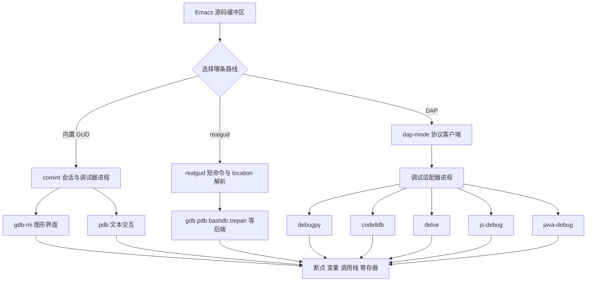
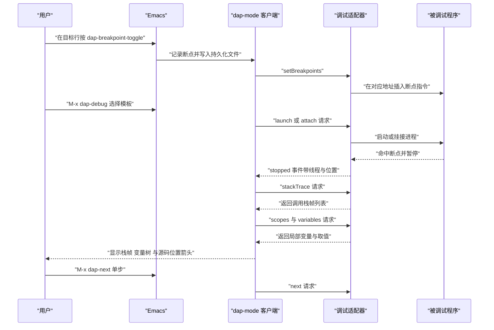

# 调试器集成

> 从 GUD、realgud 到 DAP，把 Emacs 里调试代码的三条路线讲清楚，并给出 Python、C/C++、JavaScript、Java、Rust、Go 六种语言的可用配置与从下断点到查看变量的完整操作步骤。

---

## 一、三个层次

### 1.1 为什么 Emacs 的调试方案这么杂

Emacs 出现得比现代调试适配器协议早得多。历史上每一种调试器（gdb、dbx、perldb、jdb）都有一套自己的命令语法，Emacs 为了支持它们，把「怎么发命令」和「怎么解析调试器输出」抽象出来，做成了 GUD。后来出现了 GDB/MI 这样的机器接口，于是有了 gdb-mi 这套图形化界面。再后来微软提出 DAP，把「调试器」和「编辑器」之间的协议标准化，于是有了 dap-mode。

今天在 Emacs 里调试代码，实际上是在这三层里选一层：

- **GUD（Grand Unified Debugger）**：Emacs 内置的调试器接口框架。它维护一个与调试器进程的 comint 会话，把用户在源码缓冲区里按的键翻译成调试器命令，再解析调试器的输出定位到源码行。Emacs 内置支持 gdb、pdb、perldb、jdb、dbx 等。
- **realgud**：第三方包，用同一套设计思路重新实现了更多后端，覆盖 bashdb、zshdb、kshdb、remake、trepan 系列、rdebug 等内置 GUD 没覆盖的调试器。
- **DAP 客户端（dap-mode）**：走 Debug Adapter Protocol。编辑器与「调试适配器」通信，适配器再驱动真正的调试器。好处是协议统一，一种客户端支持所有语言；代价是需要为每种语言准备一个适配器进程。

### 1.2 三层架构图



### 1.3 断点命中到查看调用栈的时序



### 1.4 哪个语言该用哪条路线

| 语言 | 推荐路线 | 具体方案 | 说明 |
| --- | --- | --- | --- |
| C / C++ | 内置 GUD 或 DAP | `M-x gdb`（配 `-i=mi`）或 dap-mode 加 codelldb | gdb-mi 的六窗口布局在纯 C/C++ 上体验最好，无需额外适配器 |
| Python | 内置 GUD 或 DAP | `M-x pdb` 或 dap-mode 加 debugpy | pdb 零依赖适合小脚本，debugpy 适合有框架的项目 |
| Rust | DAP | dap-mode 加 codelldb | codelldb 基于 LLDB，能正确处理 Rust 的泛型与所有权信息 |
| Go | DAP | dap-mode 加 delve | delve 是 Go 官方生态的调试器，dap-mode 有专门模块 |
| JavaScript / TypeScript | DAP | dap-mode 加 js-debug | js-debug 是 VS Code 的官方 JS 调试器，支持 Node 与浏览器 |
| Java | DAP（通过 lsp-java） | lsp-java 自带的 java-debug 集成 | dap-mode 包里没有 dap-java 模块，Java 的适配器由 lsp-java 提供 |
| Shell 脚本 | realgud | realgud 加 bashdb 或 zshdb | 内置 GUD 不支持 shell 调试器 |
| Perl / Ruby | realgud | realgud 加 perldb 或 rdebug | realgud 的覆盖范围比内置 GUD 广 |
| Emacs Lisp | 不需要调试器 | edebug 与 `debug-on-entry` | 见第八节 |
| Lua | DAP 或打印 | 依赖具体运行时，通常用打印调试 | Emacs 侧没有成熟的 Lua 调试适配器 |

这张表的用法是：先看语言，再决定装什么。**不要为了统一而强行全用 DAP**，纯 C/C++ 用 gdb-mi 的体验通常比配一个 codelldb 更直接。

---

## 二、GDB 集成

### 2.1 M-x gdb 与 -i=mi

`M-x gdb` 会提示你输入命令行，默认值是 `gdb -i=mi <可执行文件>` 的形式。`-i=mi` 是关键：它告诉 gdb 使用 **MI（Machine Interface）文本接口**，输出结构化的 `^done`、`*stopped` 这样的记录，而不是给人看的普通文本。gdb-mi 就是靠解析这些记录来填充变量窗口、调用栈窗口与断点窗口的。

Emacs 的 `gdb` 命令文档字符串里明确写了这一点：

```text
COMMAND-LINE should include "-i=mi" to use gdb's MI text interface.
Note that the old "--annotate" option is no longer supported.
```

所以：

- 用 `M-x gdb` 时务必保留 `-i=mi`。手输命令时如果漏了它，变量与栈窗口不会工作。
- 老教程里常见的 `--annotate=3` 已经不再受支持，看到这类配置可以直接跳过。

```elisp
;; 把常用的调试命令固定成几个入口
(defun my-gdb-debug-binary (binary)
  "用 GDB 的 MI 接口调试 BINARY。"
  (interactive "f可执行文件: ")
  (gdb (format "gdb -i=mi %s" (shell-quote-argument binary))))

;; 调试当前项目构建目录下的同名可执行文件
(defun my-gdb-debug-project ()
  "尝试用项目构建目录里与项目同名的可执行文件启动 GDB。"
  (interactive)
  (let* ((root (or (project-root (project-current t)) default-directory))
         (name (file-name-nondirectory (directory-file-name root)))
         (candidates (list (expand-file-name (concat "build/" name) root)
                           (expand-file-name (concat "build/" name ".exe") root)
                           (expand-file-name (concat "target/debug/" name) root))))
    (if-let ((bin (cl-find-if #'file-executable-p candidates)))
        (gdb (format "gdb -i=mi %s" (shell-quote-argument bin)))
      (user-error "在常见构建目录里没找到可执行文件，请用 my-gdb-debug-binary 手工指定"))))
```

### 2.2 gdb-many-windows 的六窗口布局

`gdb-many-windows` 的默认值是 `nil`。设为 `t` 之后，`M-x gdb` 会铺出下面这个布局（这是 Emacs 文档字符串里给出的原图）：

```text
+----------------------------------------------------------------------+
|                               GDB Toolbar                            |
+-----------------------------------+----------------------------------+
| GUD buffer (I/O of GDB)           | Locals buffer                    |
|                                   |                                  |
+-----------------------------------+----------------------------------+
| Source buffer                     | I/O buffer (of debugged program) |
|                                   | (comint-mode)                    |
|                                   |                                  |
+-----------------------------------+----------------------------------+
| Stack buffer                      | Breakpoints buffer               |
| RET      gdb-select-frame         | SPC    gdb-toggle-breakpoint     |
|                                   | RET    gdb-goto-breakpoint       |
|                                   | D      gdb-delete-breakpoint     |
+-----------------------------------+----------------------------------+
```

六个窗口分别是：GUD 缓冲区（发命令、看 gdb 输出）、Locals 缓冲区（局部变量）、Source 缓冲区（源码，带当前行箭头）、I/O 缓冲区（被调试程序的标准输出与输入，comint 模式）、Stack 缓冲区（调用栈）、Breakpoints 缓冲区（断点列表）。

三个相关命令：

- `gdb-many-windows`：既是变量也是命令。作为命令调用时切换这个布局的开关。
- `gdb-restore-windows`：窗口被你自己打乱之后，用它恢复布局。
- `gdb-setup-windows`：真正负责铺窗口的函数，`gdb-restore-windows` 会调用它。

```elisp
;; 打开多窗口布局；这是 Emacs 官方推荐的做法之一
(setq gdb-many-windows t)
;; 启动 gdb 后是否自动显示 main 函数所在源文件
(setq gdb-show-main t)
;; 程序停止时是否自动把对应源文件窗口切到前面
(setq gdb-switch-when-another-stopped t)
;; 变量列表里是否显示已变化的变量（值变过的会高亮）
(setq gdb-show-changed-values 'highlight-this)
;; 离开作用域的变量是否自动从列表中删除
(setq gdb-delete-out-of-scope t)
;; 用 debuginfod 自动下载调试符号（需要 gdb 编译时启用 debuginfod）
(setq gdb-debuginfod-enable t)
```

`gdb-show-changed-values` 的取值是 `nil`（不特别标记）、`t`（删除未变化的）、`'highlight-this`（高亮刚变化的）。最后一种在单步跟踪循环变量时最直观。

### 2.3 断点的两种操作方式

**鼠标方式**：在源码窗口左侧的 fringe（边栏）上用鼠标点一下就能设置或取消断点。相关的三个函数是：

| 函数 | 说明 |
| --- | --- |
| `gdb-mouse-set-clear-breakpoint` | 在鼠标位置设置或清除断点，默认绑定在 `[left-fringe mouse-1]` 上 |
| `gdb-mouse-toggle-breakpoint-margin` | 在 margin 区域切换断点 |
| `gdb-mouse-toggle-breakpoint-fringe` | 在 fringe 区域切换断点 |

**键盘方式**：用 GUD 的命令，见下一节的键位表。`gud-break` 在当前行设置断点，`gud-remove` 删除当前行断点，`gud-tbreak` 设置临时断点（命中一次后自动删除）。

### 2.4 GUD 键位表

GUD 的键位定义在 `gud-def` 宏里，它会把命令同时绑定到两个地方：**GUD 托管的源码缓冲区里用 `C-c` 前缀**，**全局用 `gud-key-prefix`**。`gud-key-prefix` 的默认值是 `C-x C-a`。

| 功能 | 缓冲区键位 | 全局键位 | 命令 |
| --- | --- | --- | --- |
| 在当行设置断点 | `C-c C-b` | `C-x C-a C-b` | `gud-break` |
| 删除当行断点 | `C-c C-d` | `C-x C-a C-d` | `gud-remove` |
| 设置临时断点 | `C-c C-t` | `C-x C-a C-t` | `gud-tbreak` |
| 继续运行 | `C-c C-r` | `C-x C-a C-r` | `gud-cont` |
| 单步进入（step） | `C-c C-s` | `C-x C-a C-s` | `gud-step` |
| 单步跳过（next） | `C-c C-n` | `C-x C-a C-n` | `gud-next` |
| 单步执行一条指令 | `C-c C-i` | `C-x C-a C-i` | `gud-stepi` |
| 执行到当前函数返回 | `C-c C-f` | `C-x C-a C-f` | `gud-finish` |
| 上移一层栈帧 | `C-c <` | `C-x C-a <` | `gud-up` |
| 下移一层栈帧 | `C-c >` | `C-x C-a >` | `gud-down` |
| 打印光标处表达式的值 | `C-c C-p` | `C-x C-a C-p` | `gud-print` |
| 把光标处表达式加入观察 | `C-x C-a C-w` | 同左 | `gud-watch` |
| 刷新显示到当前执行位置 | `C-c C-l` | `C-x C-a C-l` | `gud-refresh` |

其中 `gud-print` 用的是 `%e` 展开，也就是光标所在的 C 左值或函数调用表达式，所以把光标放在一个变量上按 `C-c C-p` 就会打印它的值。`gud-watch` 把表达式交给 speedbar 显示，`gdb-many-windows` 布局下会出现在 Locals 附近的观察区。

关于 `gud-run`：它被 `gud-def` 定义了但没有绑定键位，用 `M-x gud-run` 调用，作用是让被调试程序开始运行（需要先在 GUD 缓冲区里用 `run` 命令或让它自动运行）。

### 2.5 gdb-mi 的面板命令

`gdb-many-windows` 布局里的每个面板都可以单独打开或关闭：

| 命令 | 作用 |
| --- | --- |
| `gdb-display-locals-buffer` | 显示局部变量缓冲区 |
| `gdb-display-breakpoints-buffer` | 显示断点列表缓冲区 |
| `gdb-display-stack-buffer` | 显示调用栈缓冲区 |
| `gdb-display-source-buffer` | 把源码缓冲区显示到合适的位置 |
| `gdb-goto-breakpoint` | 从断点列表跳到断点所在的源码行 |
| `gdb-delete-breakpoint` | 从断点列表删除断点 |
| `gdb-var-list-children` | 展开变量的成员（在 Locals 缓冲区里对结构体按 `RET`） |
| `gdb-var-delete` | 从变量列表中删除一项 |
| `gdb-edit-value` | 修改变量的值（在 Locals 缓冲区里编辑） |
| `gdb-restore-windows` | 恢复六窗口布局 |
| `gdb-setup-windows` | 底层实现，一般不直接调用 |

Locals 缓冲区的实用操作是：`RET` 展开结构体或指针，`D` 删除该项，直接编辑值后 `C-c C-c` 提交。这些能力让 Emacs 的 gdb 前端在纯 C 调试上不输给任何图形调试器。

### 2.6 把 gdb 与 compile 联动

调试循环通常是「改代码、编译、重新调试」。把这三步串起来能省很多时间：

```elisp
(defun my-gdb-build-and-debug ()
  "先构建项目，成功后再用 GDB 启动调试。"
  (interactive)
  (let* ((root (or (project-root (project-current t)) default-directory))
         (name (file-name-nondirectory (directory-file-name root)))
         (bin (expand-file-name (concat "build/" name) root))
         (default-directory root))
    ;; 用 compile 的结束钩子判断构建结果，成功才启动 gdb
    (add-hook 'compilation-finish-functions
              (lambda (_buf msg)
                (when (string-match-p "finished" msg)
                  (if (file-executable-p bin)
                      (gdb (format "gdb -i=mi %s" (shell-quote-argument bin)))
                    (message "构建成功但没找到 %s" bin))))
              nil t)
    (compile (format "cmake --build build -j %d"
                     (max 1 (/ (num-processors) 2))))))
```

这个写法的关键点是：**只有构建成功才启动 gdb**。如果构建失败却启动了调试，你调试的是旧的可执行文件，会得到与源码完全不匹配的行号，这是非常浪费时间的错误。

### 2.7 M-x gud-gdb 与 M-x gdb 的差异

| 维度 | `M-x gdb` | `M-x gud-gdb` |
| --- | --- | --- |
| 所在文件 | `gdb-mi.el` | `gud.el` |
| 接口 | GDB/MI 机器接口 | 传统的文本命令模式 |
| 前端能力 | 变量窗口、栈窗口、断点窗口、内存窗口、反汇编 | 只有 GUD 缓冲区与源码位置箭头 |
| 命令语法 | 在 GUD 缓冲区里可以直接输入 gdb 命令，MI 命令由前端翻译 | 直接输入 gdb 命令 |
| 现状 | 推荐使用 | 保留用于兼容，在 gdb-mi 已经接管时会报错提示 |

Emacs 源码里对 `gud-gdb` 的注释写得很直白：「The old gdb command (text command mode). The new one is in gdb-mi.el.」并且 `gud-gdb` 在检测到已经有一个 gdbmi 会话时会给出 `Multiple debugging requires restarting in text command mode` 的错误。

实际结论是：**新配置只用 `M-x gdb`**。只有在需要同时调试多个程序（gdb-mi 不支持多会话）、或者 MI 接口在某个特殊平台上出问题时，才考虑 `gud-gdb`。

---

## 三、Python 调试

### 3.1 M-x pdb 与 python-mode 的集成

Emacs 内置的 pdb 支持在 `gud.el` 里，入口是 `M-x pdb`。它会询问命令行，默认值通常是 `pdb <文件>`。启动后你得到一个 comint 缓冲区，里面对话的是真正的 pdb。

变量 `gud-pdb-command-name` 保存默认的命令名，需要换成 `python3 -m pdb` 这样的形式时改它：

```elisp
;; 用 python3 的 pdb 模块而不是独立的 pdb 脚本
(setq gud-pdb-command-name "python3 -m pdb")

;; 建议把 pdb 会话的窗口固定下来，方便一边看源码一边敲命令
(add-hook 'gud-mode-hook
          (lambda ()
            (setq-local truncate-lines t)))
```

`gud.el` 里为 pdb 准备了 `gud-pdb-repeat-map`，配合 `repeat-mode` 可以连续按 `n`、`s`、`c` 等键重复上一步操作：

```elisp
;; Emacs 28 起内置 repeat-mode，让单键重复上一组操作
(repeat-mode 1)
;; 在 pdb 会话里，C-x C-a C-n 之后可以直接按 n 重复
(setq repeat-exit-timeout 5)
```

### 3.2 pdb 命令表

pdb 的命令在 GUD 缓冲区里直接输入即可。常用的一组：

| 命令 | 缩写 | 作用 |
| --- | --- | --- |
| `next` | `n` | 执行下一行，不进入函数 |
| `step` | `s` | 执行下一行，遇到函数调用则进入 |
| `continue` | `c` | 继续运行到下一个断点 |
| `until [行号]` | `unt` | 运行到当前行之后（或指定行） |
| `return` | `r` | 运行到当前函数返回 |
| `break [位置]` | `b` | 设置断点，参数可以是 `文件:行号` 或函数名 |
| `tbreak [位置]` | `tbreak` | 设置临时断点 |
| `clear [位置]` | `cl` | 清除断点 |
| `disable` / `enable` | | 禁用或启用断点 |
| `condition 断点编号 表达式` | | 给断点加条件 |
| `ignore 断点编号 次数` | | 忽略前若干次命中 |
| `list` | `l` | 显示当前代码上下文 |
| `longlist` | `ll` | 显示当前函数全部源码 |
| `where` | `w` | 打印调用栈 |
| `up` / `down` | `u` / `d` | 在栈帧之间移动 |
| `print 表达式` | `p` | 求值并打印 |
| `pp 表达式` | | 美化打印 |
| `whatis 表达式` | | 打印类型 |
| `display 表达式` | | 每次停下时自动打印该表达式 |
| `args` | `a` | 打印当前函数的参数 |
| `quit` | `q` | 退出调试 |
| `help` | `h` | 帮助 |
| `!语句` | | 执行一条 Python 语句，注意这会改程序状态 |

其中 `condition` 与 `display` 是排查循环问题最有效的两个命令。前者让断点只在特定条件下命中，后者在每次停下时自动打印你关心的值。

```text
(Pdb) b parser.py:120
Breakpoint 1 at parser.py:120
(Pdb) condition 1 i > 100
(Pdb) display i
(Pdb) display tokens[0:3]
(Pdb) c
```

### 3.3 用 debugpy 走 DAP 路线

pdb 的局限很明显：它是纯文本交互，没有变量树、没有可视化调用栈、多线程程序里切换线程很麻烦。现代 Python 项目更推荐走 debugpy 加 dap-mode。

debugpy 的安装与语言服务器无关，它是独立的一个包：

```bash
# 三种安装方式任选一种
$ pip install debugpy
$ pipx install debugpy
# 或者只装到当前项目虚拟环境里（推荐，避免污染全局）
$ python -m venv .venv && . .venv/bin/activate && pip install debugpy

# 验证
$ python -m debugpy --version
```

关键点是 `dap-python-executable` 必须指向**装了 debugpy 的那个解释器**。dap-mode 启动适配器时执行的命令是 `<解释器> -m debugpy.adapter`，所以用错解释器就会得到 `No module named debugpy` 这样的错误。

---

## 四、realgud

### 4.1 它解决什么问题

realgud 是一个第三方包，作者是 Rocky Bernstein（同时也是 bashdb、trepan 这些调试器的作者）。它的定位是弥补内置 GUD 的两个不足：

- **覆盖更多调试器**。内置 GUD 支持 gdb、pdb、perldb、jdb、dbx 等；realgud 补上了 bashdb（bash 调试器）、zshdb、kshdb、remake（make 调试器）、trepan、trepan2、trepan3k（Ruby 与 Python 的替代调试器）、trepanjs、rdebug（Ruby）等。
- **更好的源码定位体验**。realgud 有一套自己的 location 解析与短命令机制，在源码缓冲区里既可以用 `realgud` 的短命令，也可以用快捷键。

### 4.2 支持的调试器

从包的目录结构可以看到它自带的后端：

| 目录名 | 调试器 | 适用语言 |
| --- | --- | --- |
| `gdb` | GNU Debugger | C、C++、Rust、Go 等 |
| `pdb` | Python Debugger | Python |
| `bashdb` | Bash Debugger | Bash 脚本 |
| `zshdb` | Zsh Debugger | Zsh 脚本 |
| `kshdb` | Ksh Debugger | Ksh 脚本 |
| `perldb` | Perl Debugger | Perl |
| `rdebug` | Ruby Debugger | Ruby |
| `remake` | GNU Make 调试器 | Makefile |
| `trepan` | Ruby 与 Python 的替代调试器 | Ruby、Python |
| `trepan2` / `trepan3k` | trepan 的 Python 2 与 Python 3 版本 | Python |
| `trepanjs` | JavaScript 调试器 | JavaScript |
| `trepan.pl` | Perl 的 trepan | Perl |
| `gub` | Go 的调试前端 | Go |

另外它还附带 `realgud/lang/` 下的语言支持文件（`java.el`、`js.el`、`perl.el`、`posix-shell.el`、`python.el`、`ruby.el`），负责在对应的源码缓冲区里提供快捷键与短命令。

### 4.3 安装与自动关联

```elisp
(use-package realgud
  :ensure t
  :custom
  ;; 是否用 realgud 接管内置 GUD 的快捷键；设为 t 时 realgud 会尽量接管
  (realgud-populate-common-keys-function #'realgud:populate-common-keys)
  :config
  ;; 把 realgud 的短命令挂到对应语言的缓冲区上
  (realgud:gdb)
  ;; 也可以单独启用某个语言的支持
  (require 'realgud-lang-python nil t)
  (require 'realgud-lang-posix-shell nil t)
  :bind
  (("C-c d g" . realgud:gdb)
   ("C-c d p" . realgud:pdb)
   ("C-c d b" . realgud:bashdb)
   ("C-c d z" . realgud:zshdb)
   ("C-c d r" . realgud:rdebug)
   ("C-c d k" . realgud:trepan3k)))
```

realgud 的入口函数命名规则是 `realgud:<调试器名>`，例如 `realgud:gdb`、`realgud:pdb`、`realgud:bashdb`。它们都是交互式命令，用 `M-x` 调用即可，不需要预先启动什么。

### 4.4 与内置 GUD 的关系

两者的关系需要说准确，避免混淆：

- **不是替代关系，是并列关系**。realgud 没有替换内置的 GUD，它是另一套实现。安装 realgud 之后，`M-x gdb` 仍然走内置实现，`M-x realgud:gdb` 走 realgud。
- **键位可能冲突**。realgud 为了提供方便，会尝试在源码缓冲区里绑定与你熟悉的 GUD 相同的键。`realgud-populate-common-keys-function` 控制这个行为。如果你同时用内置 GUD 与 realgud，建议把 realgud 的键位换成一个独立前缀。
- **调试器本身要另行安装**。realgud 只是前端，`bashdb`、`zshdb`、`trepan3k` 这些调试器需要你自己装（`sudo apt install bashdb`、`pipx install trepan3k` 等）。

什么时候用 realgud：**你要调试 shell 脚本、Makefile、或者 Ruby 与 Perl**。这些场景内置 GUD 要么不支持，要么支持得很弱，realgud 是目前唯一的成熟选择。纯 C/C++ 与 Python 场景下，内置 GUD 或 dap-mode 已经够好，不必额外引入 realgud。

---

## 五、DAP 与 dap-mode

### 5.1 DAP 是什么

DAP（Debug Adapter Protocol）是微软提出的编辑器与调试器之间的通信协议，与 LSP 是同一个设计思路：定义一个标准协议，编辑器只实现协议的一端，每个语言实现一个「调试适配器」负责另一端。协议的消息类型包括 `initialize`、`launch`、`attach`、`setBreakpoints`、`configurationDone`、`threads`、`stackTrace`、`scopes`、`variables`、`continue`、`next`、`stepIn`、`stepOut`、`evaluate`、`disconnect`，以及 `stopped`、`continued`、`exited`、`output`、`terminated` 这些事件。

Emacs 侧的客户端就是 `dap-mode`。

### 5.2 dap-mode 与 lsp-mode 的关系

这一点必须写准确，因为很多教程说得含糊：

- **dap-mode 属于 lsp-mode 项目**（同一个 GitHub 组织 emacs-lsp，同一位主要维护者 Ivan Yonchovski）。
- **dap-mode 在代码层面依赖 lsp-mode**。它的包声明里有 `(lsp-mode "6.0")`、`(lsp-treemacs "0.1")`、`(lsp-docker "1.0.0")` 等依赖项，也就是说安装 dap-mode 会连带装上 lsp-mode。
- **但使用上不强制启用 lsp-mode**。你可以只开 eglot 做补全与诊断，同时单独使用 dap-mode 做调试。dap-mode 只在两个地方与 lsp-mode 有交互：`lsp-dap-auto-configure` 变量控制 lsp-mode 是否自动帮你打开 dap-mode；`lsp-after-open-hook` 是 dap-mode 挂接的一个钩子。用 eglot 时这两个钩子不会触发，dap-mode 靠你自己 `M-x dap-debug` 启动，完全可用。

结论是：**eglot 加 dap-mode 是可行的组合**，代价是 dap-mode 会顺带装上一整套 lsp-mode 依赖（dash、f、ht、spinner、markdown-mode、lv、bui、posframe、treemacs 等），包体积与启动时间都会增加。如果你已经在用 lsp-mode，那就没有任何额外负担。

另外，dap-mode 当前版本声明依赖 Emacs 29.1，在 28 及更早版本上装不上。

### 5.3 安装与最小配置

```elisp
(use-package dap-mode
  :ensure t
  :custom
  ;; 自动配置：打开 dap-mode、dap-ui-mode 与若干界面组件
  (dap-auto-configure-features
   '(sessions locals breakpoints expressions controls tooltip))
  ;; 会话输出是否直接打到 *Messages*，调试时建议关闭以免刷屏
  (dap-print-io nil)
  ;; 程序输出缓冲区的过滤，只收标准输出与标准错误
  (dap-output-buffer-filter '("stdout" "stderr"))
  ;; 命中停止、会话创建等事件是否弹输出窗口
  (dap-auto-show-output t)
  ;; 用哪个终端跑需要 TTY 的被调试程序；integrated 表示用 Emacs 内建终端
  (dap-default-terminal-kind "integrated")
  ;; 栈帧深度上限
  (dap-stack-trace-limit 1000)
  :config
  ;; 打开自动配置模式，它会连带启用 dap-ui-mode 与 dap-ui-many-windows-mode
  (dap-auto-configure-mode 1)
  :bind
  (("C-c d d" . dap-debug)
   ("C-c d l" . dap-debug-last)
   ("C-c d r" . dap-debug-restart)
   ("C-c d b" . dap-breakpoint-toggle)
   ("C-c d c" . dap-continue)
   ("C-c d n" . dap-next)
   ("C-c d i" . dap-step-in)
   ("C-c d o" . dap-step-out)
   ("C-c d h" . dap-hydra)
   ("C-c d e" . dap-disconnect)
   ("C-c d u" . dap-ui-sessions)))
```

`dap-auto-configure-mode` 的内部行为值得了解：打开它时会依次启用 `dap-mode`、`dap-ui-mode`，然后按 `dap-auto-configure-features` 里的每一项打开对应的界面组件，最后打开 `dap-ui-many-windows-mode`（一个类似 gdb-many-windows 的多窗口布局）。默认的 features 是 `(sessions locals breakpoints expressions controls tooltip)`，可用取值及其含义：

| 取值 | 作用 |
| --- | --- |
| `sessions` | 显示调试会话列表窗口 |
| `locals` | 显示局部变量窗口 |
| `breakpoints` | 显示断点列表窗口 |
| `expressions` | 显示观察表达式窗口 |
| `repl` | 显示 REPL 窗口，可以在其中求值表达式 |
| `controls` | 启用 `dap-ui-controls-mode`，用 posframe 显示一排控制按钮 |
| `tooltip` | 启用 `dap-tooltip-mode`，鼠标悬停显示变量值 |

注意 `repl` 默认**不在**列表里。想在调试时有一个可交互的求值窗口，需要自己加上它。

### 5.4 键位与命令表

dap-mode 本身几乎没有定义键位（`dap-mode-map` 里只有 fringe 与 margin 的鼠标绑定，用来点击切换断点）。所有键位都要自己绑，官方手册推荐的绑定如下：

| 命令 | 作用 | 说明 |
| --- | --- | --- |
| `dap-debug` | 选择模板并启动调试 | 交互式选择 `dap-register-debug-template` 注册的模板 |
| `dap-debug-last` | 用上一次的配置再启动一次 | 循环调试时最常用 |
| `dap-debug-restart` | 重启当前调试会话 | 保留断点 |
| `dap-breakpoint-toggle` | 在当前行切换断点 | 最常用的一个 |
| `dap-breakpoint-add` | 添加断点 | 与 toggle 的区别是不做切换只添加 |
| `dap-breakpoint-delete` | 删除断点 | 需要传断点对象，一般从断点窗口里调用 |
| `dap-breakpoint-condition` | 给当前行断点加条件 | 会提示输入条件表达式 |
| `dap-breakpoint-hit-condition` | 给断点加命中次数条件 | 命中指定次数后才停下 |
| `dap-breakpoint-log-message` | 把断点改成日志断点 | 命中时打印消息而不停下 |
| `dap-continue` | 继续运行 | 相当于 gdb 的 `continue` |
| `dap-next` | 单步跳过 | 相当于 `next` |
| `dap-step-in` | 单步进入 | 相当于 `step` |
| `dap-step-out` | 单步跳出 | 相当于 `finish` |
| `dap-restart-frame` | 回到指定栈帧重新执行 | 需要传栈帧对象 |
| `dap-disconnect` | 断开调试会话 | 会结束被调试进程 |
| `dap-hydra` | 打开调试专用 hydra 菜单 | 需要在配置里加载 `dap-hydra` |
| `dap-ui-mode` | 开关全部调试界面 | |
| `dap-ui-sessions` | 显示会话列表窗口 | |
| `dap-ui-locals` | 显示局部变量窗口 | |
| `dap-ui-breakpoints` | 显示断点列表窗口 | |
| `dap-ui-expressions` | 显示观察表达式窗口 | |
| `dap-ui-repl` | 显示 REPL 窗口 | |
| `dap-ui-many-windows-mode` | 开关多窗口布局 | 由自动配置模式负责启用 |
| `dap-switch-stack-frame` | 切换当前栈帧 | |

`dap-hydra` 是 dap-mode 附带的一个 hydra 菜单，绑到 `C-c d h` 之后按一下就能看到单步、继续、断点、REPL 等操作的字母提示，非常适合调试时使用：

```elisp
;; dap-hydra 在单独的文件里，需要显式加载
(use-package dap-hydra
  :ensure nil            ; 随 dap-mode 一起安装
  :after dap-mode
  :bind ("C-c d h" . dap-hydra))
```

**断点的持久化**值得单独说：dap-mode 会把断点写入一个文件，默认是 `~/.emacs.d/.dap-breakpoints`（由 `dap-breakpoints-file` 控制）。所以关掉 Emacs 再打开，之前设的断点还在。这在长期调试一个项目时很方便，但也会带来困惑：你换了分支、代码行号变了，旧断点会被放到错误的位置。遇到「明明没设断点却停下了」的情况，先看断点列表窗口。

---

## 六、各语言的完整调试配置

### 6.1 C 与 C++：codelldb

codelldb 是 LLDB 的一个调试适配器封装。dap-mode 自带 `dap-codelldb` 模块，能自动下载对应平台的适配器。

```elisp
(use-package dap-codelldb
  :ensure nil            ; 随 dap-mode 一起安装
  :after dap-mode
  :custom
  ;; 适配器存放目录，默认在 ~/.emacs.d/.extension/vscode/codelldb
  (dap-codelldb-debug-path
   (expand-file-name "codelldb" (expand-file-name ".extension" user-emacs-directory)))
  ;; 适配器可执行文件的完整路径
  (dap-codelldb-debug-program
   (concat dap-codelldb-debug-path
           (if (eq system-type 'windows-nt)
               "/extension/adapter/codelldb.exe"
             "/extension/adapter/codelldb")))
  :config
  ;; 首次使用时下载适配器，会从 GitHub 拉取 vsix 包并解压
  (dap-codelldb-setup))

;; 注册一个针对本项目的启动模板
(dap-register-debug-template
 "C/C++ :: 调试构建产物"
 (list :type "lldb"
       :request "launch"
       :name "C/C++ :: 调试构建产物"
       :program "${workspaceFolder}/build/app"
       :args []
       :cwd "${workspaceFolder}"))
```

`dap-codelldb-setup` 会访问 GitHub 下载约几十 MB 的包，网络受限时需要代理。下载失败时也可以用系统里已有的 LLDB：把 `dap-codelldb-debug-program` 指向 `lldb-vscode`（LLVM 自带的 DAP 适配器），前提是 LLVM 版本里包含它。

`${workspaceFolder}` 是 dap-mode 提供的变量，会被展开成当前项目根。dap-mode 支持一组这样的变量（还有 `${file}`、`${fileBasename}`、`${fileDirname}` 等，与 VS Code 的 `launch.json` 变量约定一致），在模板里用它们能避免硬编码路径。

### 6.2 Python：debugpy

```elisp
(use-package dap-python
  :ensure nil            ; 随 dap-mode 一起安装
  :after dap-mode
  :custom
  ;; 关键：必须指向装了 debugpy 的解释器
  ;; 用虚拟环境时写绝对路径，例如 "~/.venv/bin/python"
  (dap-python-executable "python3")
  ;; 用 debugpy 而不是已过时的 ptvsd
  (dap-python-debugger 'debugpy)
  ;; 测试调试的默认端口
  (dap-python-default-debug-port 32000)
  :config
  ;; dap-python 已经注册了几个开箱模板，这里再补一个本项目专用的
  (dap-register-debug-template
   "Python :: 调试当前文件"
   (list :type "python"
         :request "launch"
         :name "Python :: 调试当前文件"
         :program "${file}"
         :args []
         :cwd "${workspaceFolder}"
         :console "integratedTerminal"
         :justMyCode t))

  ;; 调试 pytest 的模板：把 module 设为 pytest
  (dap-register-debug-template
   "Python :: 调试 pytest"
   (list :type "python"
         :request "launch"
         :name "Python :: 调试 pytest"
         :module "pytest"
         :args ["-x" "-q"]
         :cwd "${workspaceFolder}"
         :console "integratedTerminal"

         :justMyCode t)))
```

三个字段的含义需要说清：

- `:program` 是要调试的脚本路径，用 `${file}` 表示当前缓冲区对应的文件。
- `:module` 与 `:program` 互斥。用 `:module "pytest"` 表示以模块方式启动，等价于 `python -m pytest`。调试测试时用它。
- `:justMyCode` 为 `t` 时只在自己写的代码里停下，跳过标准库与第三方库。改代码时这个开关能免掉大量无意义的单步。想钻进依赖库看实现时把它设为 `:json-false`。

`dap-python-executable` 指向的解释器如果没有 debugpy，启动时会报 `No module named debugpy`。确认方法是直接在终端里跑 `python3 -m debugpy --version`。

### 6.3 JavaScript 与 TypeScript：js-debug

dap-mode 有两个 JS 相关的模块：`dap-node`（基于较老的 node-debug2）与 `dap-js`（基于 VS Code 官方的 js-debug）。新配置应当用 `dap-js`。

```elisp
(use-package dap-js
  :ensure nil
  :after dap-mode
  :custom
  ;; js-debug 适配器的存放位置
  (dap-js-path (expand-file-name "js-debug" dap-utils-extension-path))
  ;; 适配器启动命令：用 node 运行 dapDebugServer.js
  (dap-js-debug-program
   `("node" ,(expand-file-name "src/dapDebugServer.js" dap-js-path)))
  :config
  ;; 补一个针对本项目的模板
  (dap-register-debug-template
   "Node :: 调试当前文件"
   (list :type "pwa-node"
         :request "launch"
         :name "Node :: 调试当前文件"
         :program "${file}"
         :cwd "${workspaceFolder}"
         :console "internalConsole")))

;; TypeScript 需要先编译或用 ts-node 之类的加载器
(dap-register-debug-template
 "Node :: 调试 TS 通过 ts-node"
 (list :type "pwa-node"
       :request "launch"
       :name "Node :: 调试 TS 通过 ts-node"
       :runtimeExecutable "npx"
       :runtimeArgs ["ts-node"]
       :program "${file}"
       :cwd "${workspaceFolder}"
       :console "internalConsole"))
```

`pwa-node` 是 js-debug 里用于 Node 调试的类型名，`pwa-chrome` 用于浏览器调试。用 `:runtimeExecutable` 与 `:runtimeArgs` 可以指定一个替代的运行时，上面就是用它来通过 `ts-node` 直接调试 TypeScript 源文件，不需要先编译。

### 6.4 Go：delve

```elisp
(use-package dap-dlv-go
  :ensure nil
  :after dap-mode
  :custom
  ;; delve 可执行文件路径；默认从 PATH 里找 dlv
  (dap-dlv-go-delve-path
   (or (executable-find "dlv")
       (expand-file-name "dlv" (expand-file-name "bin" (or (getenv "GOPATH") "~/go")))))
  ;; 传给 dlv 的额外参数，例如 "--only-same-user=false"
  (dap-dlv-go-extra-args "")
  :config
  (dap-register-debug-template
   "Go :: 调试当前包"
   (list :type "go"
         :request "launch"
         :name "Go :: 调试当前包"
         :mode "auto"
         :program "${workspaceFolder}"
         :buildFlags "-gcflags=all=-N -l"
         :args []
         :env {})))
```

`:buildFlags` 里的 `-gcflags=all=-N -l` 很关键：`-N` 关闭优化、`-l` 关闭内联，两者一起才能让断点落在你写的每一行上。Go 默认会做内联与优化，不加这两个标志时你会看到断点被「跳过」或者变量值显示为 `<optimized out>`。

delve 的安装：

```bash
# 三平台通用，需要先有 Go 工具链
$ go install github.com/go-delve/delve/cmd/dlv@latest

# 装完确认
$ dlv version
```

### 6.5 Rust：codelldb

Rust 用 codelldb 与 C/C++ 是同一套，区别在编译参数与模板。

```elisp
(dap-register-debug-template
 "Rust :: 调试当前 crate"
 (list :type "lldb"
       :request "launch"
       :name "Rust :: 调试当前 crate"
       :program "${workspaceFolder}/target/debug/myapp"
       :args []
       :cwd "${workspaceFolder}"))
```

Rust 的注意事项比 C/C++ 多：

- **必须用 debug 构建**。`cargo build` 默认生成 `target/debug/`，那里面的二进制带完整调试信息。用 `--release` 构建的二进制里很多变量会被优化掉。
- **codelldb 的 `:cargo` 字段**。dap-mode 的 codelldb provider 会把 `:cargo` 设成空字符串，这是为了兼容 VS Code 的字段约定；在 Emacs 里一般不需要动它。
- **泛型与 trait 对象的变量显示**。LLDB 对 Rust 的支持比 GDB 好，但在复杂泛型下变量树仍然可能显示为原始内存布局，这是调试信息本身的限制。
- **宏展开后的代码无法断点**。断点只能落在你写的源码行上，宏展开出来的代码在调试器眼里属于宏定义的位置。

### 6.6 Java：通过 lsp-java 的 java-debug

**dap-mode 包里没有 `dap-java` 模块**，这一点必须说清楚，很多教程会写错。Java 的 DAP 集成由 `lsp-java` 提供：它在 lsp-mode 之外额外集成 `java-debug` 适配器，并注册 DAP 模板。

```elisp
(use-package lsp-java
  :ensure t
  :after lsp-mode
  :custom
  ;; 让 lsp-java 自动下载并配置 java-debug 与 jdtls 相关组件
  (lsp-java-vmargs
   '("-noverify" "-Xmx2G"
     "-XX:+UseG1GC" "-XX:+UseStringDeduplication"))
  ;; 启用 dap 集成
  (lsp-java-dap t)
  :hook
  ;; Java 缓冲区里改用 lsp（而不是 eglot），因为 java-debug 只与 lsp-mode 集成
  (java-mode . lsp-deferred)
  (java-ts-mode . lsp-deferred))
```

这个选择带来一个取舍：如果你整体上用 eglot，Java 项目要么单独切成 lsp-mode（技术上是可行的，两个客户端可以在不同项目里共存），要么接受 Java 没有图形化调试器、只用 `jdb` 或打印调试。用 `lsp-java` 的代价是它会启动 jdtls，内存占用几个 GB 是常态，`lsp-java-vmargs` 里的 `-Xmx2G` 就是给它设堆上限。

配置好之后，Java 的调试入口仍然是 dap-mode 的命令：`M-x dap-debug` 会选择 lsp-java 注册的模板。

### 6.7 各语言适配器安装速查

| 语言 | 适配器 | 安装方式 |
| --- | --- | --- |
| C/C++ | codelldb | 在 Emacs 里 `M-x dap-codelldb-setup` 自动下载，或自行下载 vsix 解压 |
| Python | debugpy | `pip install debugpy` 或 `pipx install debugpy` |
| Go | delve | `go install github.com/go-delve/delve/cmd/dlv@latest` |
| JavaScript / TypeScript | js-debug | dap-mode 提供下载函数，或从 vscode-js-debug 仓库取 |
| Rust | codelldb | 同 C/C++ |
| Java | java-debug | 由 lsp-java 自动下载 |

---

## 七、调试界面说明

### 7.1 断点的视觉表示

dap-mode 用 overlay 在源码缓冲区里画断点标记。默认情况下：

- 已设置的断点显示在左侧 fringe 或 margin 上。
- 断点被适配器接受（verified）与未被接受（例如文件路径匹配不上）可能有不同的外观，也可能都没有明显区别，这点在排查「断点不生效」时要靠断点列表窗口确认。
- 程序停下的当前位置用另一个 marker overlay 表示，通常是一条箭头或高亮行。

```elisp
;; 断点与当前位置的图标可以用 dap-ui 提供的 face 微调
;; 查看当前可用的 face
M-x customize-group RET dap-ui-faces RET
```

用鼠标设置断点靠 `dap-mode-map` 里的绑定：`[left-margin mouse-1]` 与 `[left-fringe mouse-1]` 都映射到 `dap-mode-mouse-set-clear-breakpoint`。这需要 `dap-mode` 这个全局 minor mode 处于打开状态。

### 7.2 变量树、调用栈与 REPL

- **变量树（Locals）**：`dap-ui-locals` 会显示当前栈帧的局部变量，可展开的项前面有三角标记。按 `RET` 展开或折叠，按 `TAB` 在子节点间移动。展开一个指针会触发一次 `variables` 请求，对象很大时会有明显延迟。
- **观察表达式（Expressions）**：`dap-ui-expressions-add` 会提示你输入一个表达式，之后每次停下都会自动求值并显示。比每次手工 `evaluate` 方便得多。
- **调用栈（Sessions 或 Stack）**：会话窗口里能看到各线程的栈帧。选中某个栈帧后，变量窗口会切换到那一帧的上下文，源码窗口也会跳到对应位置。`dap-switch-stack-frame` 用于切换。
- **REPL**：把 `repl` 加进 `dap-auto-configure-features` 之后会出现一个 REPL 窗口，在其中输入表达式会走 `evaluate` 请求。注意 REPL 里执行的代码会影响被调试进程的状态，不是纯观察。
- **条件断点与日志断点**：`dap-breakpoint-condition` 给断点加条件表达式，只有表达式为真时才停下；`dap-breakpoint-hit-condition` 指定命中多少次后才停；`dap-breakpoint-log-message` 把断点变成日志断点，命中时只打印消息不暂停。日志断点在调试高频循环时极其有用，因为它不打断程序执行节奏。

```elisp
;; 一个条件断点的典型用法：只在循环变量超过阈值时停下
;; 光标放在目标行，执行 M-x dap-breakpoint-toggle 设置断点
;; 再执行 M-x dap-breakpoint-condition，输入 i > 100
```

---

## 八、Emacs Lisp 自身的调试

Emacs Lisp 不需要外部调试器，它有自己的两套机制，比任何外部调试器的集成都要顺手。

### 8.1 edebug

`edebug` 是 Elisp 的源码级调试器：它把函数重新定义为一个可单步执行的版本，你可以逐表达式执行、查看每个表达式的结果、设置断点与条件断点。

| 操作 | 键位或命令 |
| --- | --- |
| 对光标所在的 defun 插桩 | `C-u C-M-x` |
| 进入 edebug 的源码缓冲区 | `M-x edebug-defun`（与上一行等价） |
| 单步（进入子表达式） | `SPC` |
| 单步（跳过子表达式） | `n` |
| 求值光标处表达式 | `e` |
| 求值并把结果插入缓冲区 | `E` |
| 设置断点 | `b` |
| 设置条件断点 | `x` 之后输入条件 |
| 继续执行 | `g` |
| 跳到下一次断点 | `c` |
| 查看调用栈 | `d` |
| 在栈帧之间移动 | `u` / `d` |
| 打印当前表达式的值 | `p` |
| 退出 edebug | `q` |

edebug 最实用的两个特性是**插桩只影响函数定义**（不需要重启 Emacs）与**可以随时取消插桩**（再按一次 `C-u C-M-x`）。

### 8.2 debug-on-entry 与 debug-on-error

- `M-x debug-on-entry` 让某个函数在被调用时立即进入调试器，不需要提前知道在哪一行。
- `M-x cancel-debug-on-entry` 取消。
- `(setq debug-on-error t)` 让任何错误都进入调试器并显示调用栈（backtrace）。
- `(setq debug-on-quit t)` 让 `C-g` 也进入调试器，适合排查卡死。

```elisp
;; 排查配置加载失败：让错误直接弹出 backtrace
(setq debug-on-error t)
;; 排查无限循环或卡死：C-g 时给出调用栈
(setq debug-on-quit t)

;; 只对特定错误类型生效，避免被无关错误打断
(setq debug-on-error '(void-variable wrong-type-argument))
```

更完整的 Elisp 调试与性能剖析（`profiler`、`benchmark-run`、`elp` 等）见 [[emacs教程/2Elisp语言/11_调试与性能剖析|Elisp 调试与性能剖析]]。

### 8.3 三层调试能力的关系回顾

```mermaid
stateDiagram-v2
    [*] --> "编写代码"
    "编写代码" --> "静态检查由 flymake 与语言服务器完成"
    "静态检查由 flymake 与语言服务器完成" --> "构建"
    "构建" --> "运行"
    "运行" --> "行为正确"
    "行为正确" --> [*]
    "运行" --> "行为异常"
    "行为异常" --> "加日志或打印"
    "加日志或打印" --> "定位到可疑函数"
    "定位到可疑函数" --> "下断点并单步"
    "下断点并单步" --> "检查变量与调用栈"
    "检查变量与调用栈" --> "修改代码"
    "修改代码" --> "构建"
```

这张状态图想表达的是：**断点调试是流程中的一环，不是起点**。先用语言服务器与日志把范围缩小到可疑函数，再上断点，比一上来就单步跟踪整个程序高效得多。

---

## 九、非交互式调试

### 9.1 emacs --batch 脚本化复现

有些 bug 只在你启动 Emacs 时出现，或者只在加载某个包之后出现。这类问题的排查不该靠手工关闭配置，而是用 `emacs --batch` 写一个最小复现脚本。

```bash
# 用一个干净的环境加载某个文件，看是否报错
$ emacs -Q --batch -l my-feature.el --eval '(message "loaded ok")'

# 加载你的配置但不打开界面，观察是否有错误
$ emacs -Q --batch -l ~/.emacs.d/init.el 2>&1 | tail -30

# 只加载部分配置，二分定位是哪一段出问题
$ emacs -Q --batch --eval '(progn (load "~/.emacs.d/lisp/a.el") (load "~/.emacs.d/lisp/b.el"))'

# 让错误直接打印完整 backtrace
$ emacs -Q --batch --eval '(setq debug-on-error t)' -l my-feature.el

# 检查字节编译警告，很多问题在这里就暴露了
$ emacs -Q --batch -f batch-byte-compile my-feature.el
```

关键参数说明：`-Q` 表示不加载任何初始化文件（比 `-q` 更彻底，`-q` 仍会加载 site-start），`--batch` 表示不进入交互模式，`-l` 加载文件，`--eval` 执行一段表达式，`-f` 调用一个命令。`--batch` 模式下 `message` 的输出会写到标准输出，所以可以直接重定向到文件分析。

### 9.2 用 batch 模式做回归测试

```bash
# 用 ERT 跑测试套件，失败时以非零状态码退出，适合放进 CI
$ emacs -Q --batch -L . -l my-package.el -l my-package-test.el \
    -f ert-run-tests-batch-and-exit

# 指定只跑名称匹配某正则的测试
$ emacs -Q --batch -L . -l my-package-test.el \
    --eval '(ert-run-tests-batch-and-exit "my-package-.*")'
```

`ert-run-tests-batch-and-exit` 在测试失败时会以非零状态码退出，这一点在 CI 里很重要，否则流水线会把失败当成功。

### 9.3 用日志代替断点的场景

有些问题不适合用断点：

- **时序问题**。只在并发下出现、或者只在程序长时间运行后出现的 bug，断点会改变时序，让问题消失（海森堡效应）。这类问题应该用日志。
- **生产环境**。断点需要暂停进程，生产环境不允许。
- **长时间运行的进程**。等一个只在几小时后出现的状态时，你不能一直挂着调试器单步。
- **交互式程序**。需要键盘输入的程序在断点处会暂停等待，但输入通道可能已被调试器占用。

这些场景的替代方案是结构化日志加事后分析。在 Emacs 里观察日志的常用做法是 `auto-revert-mode` 加上文件末尾跟随：

```elisp
;; 打开日志文件后自动跟随末尾，日志有新增就滚到底
(defun my-tail-log (file)
  "打开 FILE 并让它自动跟随文件末尾。"
  (interactive "f日志文件: ")
  (find-file file)
  (auto-revert-tail-mode 1)
  (end-of-buffer))

;; 让 auto-revert-tail-mode 的刷新更及时
(setq auto-revert-interval 1)
```

`auto-revert-tail-mode` 是内置的 minor mode，它会持续读取文件新增的尾部内容并插入缓冲区，比自己写定时器可靠得多。

---

## 十、权限与平台限制

### 10.1 Linux 的 ptrace_scope

Linux 内核从 3.4 起引入了 Yama LSM，其中 `kernel.yama.ptrace_scope` 控制「一个进程能否 attach 到另一个非子进程」。默认值通常是 `1`，意思是只能 attach 自己的子进程。这会导致一类典型现象：调试器能启动被调试程序（那是子进程），但无法 attach 到一个已经在运行的进程。

```bash
# 查看当前值
$ cat /proc/sys/kernel/yama/ptrace_scope

# 临时放开（重启后失效）
$ sudo sysctl -w kernel.yama.ptrace_scope=0

# 永久放开：写入配置文件
$ echo 'kernel.yama.ptrace_scope = 0' | sudo tee /etc/sysctl.d/10-ptrace.conf
$ sudo sysctl --system
```

把 `ptrace_scope` 设为 `0` 会降低系统的安全性（任何同用户进程都能 attach 到其他进程），在共享机器上不建议长期这么做。更好的做法是用 `sudo` 启动调试器，或者给调试器可执行文件加 `CAP_SYS_PTRACE` 能力。

另外，很多发行版启用了内核的 `perf_event_paranoid` 与容器相关的安全模块（SELinux、AppArmor），也可能阻止调试。容器里通常还需要 `--cap-add=SYS_PTRACE` 与关闭 seccomp 限制：

```bash
# 在容器里运行调试器所需的额外权限
$ docker run --cap-add=SYS_PTRACE --security-opt seccomp=unconfined -it image bash
```

### 10.2 macOS 的 SIP 与开发者模式

macOS 上的限制来自两层：

- **系统完整性保护（SIP）**。SIP 保护系统目录与系统进程，即使 root 也不能 attach 到受保护的系统进程。`csrutil status` 可以查看状态。调试自己的程序不需要关闭 SIP。
- **调试权限授权**。调试一个非自己启动的进程时，内存中的可执行文件必须带有 `get-task-allow` 权限，或者调试器需要有相应授权。Xcode 与 `lldb` 通过开发者证书与 `DevToolsSecurity` 机制处理这一点。

```bash
# 查看 SIP 状态
$ csrutil status

# 允许开发者工具进行调试（需要管理员密码）
$ sudo DevToolsSecurity -enable

# 查看当前用户是否在 _developer 组里
$ dscl . -read /Groups/_developer GroupMembership
```

用 Homebrew 装的 LLDB 在 macOS 上经常遇到「无法 attach」的报错，原因是系统自带的 `lldb` 与 Homebrew 的版本在签名上不一致。这种情况下的可靠做法是用系统自带的 `lldb`（`/usr/bin/lldb`），或者直接用 Xcode 命令行工具里的调试器。

### 10.3 Windows 的符号

Windows 上调试 C/C++ 的主要障碍不是权限，而是**调试符号**：

- MSVC 编译的二进制默认不生成 PDB 文件，或者生成在别处。没有 PDB 就没有函数名、没有源文件行号，断点只能落在汇编层面。
- MinGW / MSYS2 的 GCC 用 DWARF 调试信息，需要编译时加 `-g`。这与 Linux 一致。
- 用 codelldb 调试 MinGW 生成的二进制时，DWARF 与 PDB 两种格式都支持，但混合工具链（例如用 MSVC 编译、用 LLDB 调试）很容易出问题。

```bash
# MSVC：生成 PDB 并关闭优化
> cl /Zi /Od /Fe:app.exe main.c

# MinGW：生成 DWARF 调试信息
$ gcc -g -O0 -o app.exe main.c

# CMake 里为 MSVC 配置调试构建
$ cmake -S . -B build -G "Visual Studio 17 2022" -DCMAKE_BUILD_TYPE=Debug
```

另外 Windows 上 `interrupt-process` 的行为与其他平台不同（它对应的是 `GenerateConsoleCtrlEvent` 的近似实现，在 GUI 程序上可能无效），所以中断调试会话时优先用 `delete-process` 或直接在调试器里 `quit`。

### 10.4 容器内调试

在容器里跑 Emacs 并调试容器内的程序，需要注意三点：

- **需要 `SYS_PTRACE` 能力**。默认的 Docker 容器没有这个能力，`docker run` 时要加 `--cap-add=SYS_PTRACE`。
- **需要关闭 seccomp 限制**。默认的 seccomp 配置会拦截 `ptrace` 系统调用。加 `--security-opt seccomp=unconfined` 可以放开，但会降低隔离性。
- **源码路径映射**。容器内的绝对路径与宿主机的不同，调试适配器返回的文件路径必须在 Emacs 侧能找到对应文件。dap-mode 提供 `dap-path-regexp-alist` 一类的变量做路径映射；如果映射不成功，你会看到断点「未验证」或者停下时源码窗口打不开。
- **在容器外调试容器内进程**。更省事的做法是在宿主机上跑 Emacs，用 `dlv --headless` 或 `gdbserver` 在容器里启动调试服务，然后在宿主机上 attach。这样源码路径是宿主机的，没有任何映射问题。dap-mode 的 `gdbserver` 与 `Go Dlv Remote Debug` 模板就是为这种场景准备的。

---

## 十一、常见问题排查

| 症状 | 可能原因 | 排查方法 |
| --- | --- | --- |
| `M-x dap-debug` 找不到想要的模板 | 模板没注册，或对应的语言模块没加载 | `M-x dap-debug` 的候选列表来自 `dap-debug-template-configurations`，用 `C-h v` 查看其内容；确认 `require` 了对应的 `dap-python`、`dap-js` 等模块 |
| 启动调试立刻退出 | 适配器可执行文件路径错，或依赖缺失 | 看 `*dap-...*` 输出缓冲区；手动在终端里跑适配器命令，例如 `python3 -m debugpy.adapter` |
| `No module named debugpy` | `dap-python-executable` 指向的解释器没装 debugpy | 在该解释器下执行 `python3 -m debugpy --version` 确认 |
| 断点显示但没有停 | 断点未被适配器接受（路径不匹配），或代码被优化掉 | 看断点列表窗口里断点的 verified 状态；C/C++ 用 `-O0 -g`，Rust 用 debug 构建，Go 加 `-gcflags=all=-N -l` |
| 停下时源码路径找不到 | 调试信息里的路径是编译时的路径，与当前项目路径不一致 | 从构建目录挪动过项目、或在容器里编译过都会导致；重新在当前位置构建即可 |
| 变量显示为 `<optimized out>` | 编译优化把变量优化掉了 | 用 `-O0` 重新编译；Go 加 `-gcflags=all=-N -l`；Rust 用 `target/debug` |
| `dap-mode` 与 `eglot` 一起用时行为异常 | `lsp-after-open-hook` 相关的自动配置没有触发，或插件互相覆盖键位 | dap-mode 与 eglot 不冲突但也不自动联动，所有 dap 命令需要手工绑定 |
| GDB 启动后没有变量窗口 | 命令里漏了 `-i=mi`，或者 `gdb-many-windows` 为 `nil` | 检查启动命令；用 `M-x gdb-many-windows` 打开布局 |
| GUD 键位不生效 | 当前缓冲区没有被 GUD 托管，且全局前缀被别的包占用 | 检查 `gud-key-prefix` 的值（默认 `C-x C-a`），用 `C-h k` 看实际绑定 |
| 无法 attach 到已运行的进程 | Linux 上 `ptrace_scope` 限制，或 macOS 的调试授权 | 见第十节 |
| 调试会话结束后残留进程 | 用了 `dap-disconnect` 之外的方式关闭，或适配器没有正确处理 | `M-x list-processes` 查看并清理 |
| pdb 在 Emacs 里不显示源码位置 | GUD 的 pdb 解析依赖 `> ` 开头的行 | 确认 pdb 输出没有被你的 Python 启动脚本改写；用 `python3 -m pdb` 而不是包装脚本 |

排查的通用顺序是：**先看适配器输出缓冲区，再看 dap-mode 自己的日志**。

```elisp
;; 打开 dap-mode 与适配器的通信日志，排查协议层问题
(setq dap-print-io t)

;; 或者只让 lsp-mode 打印 JSON-RPC（dap-mode 复用同一套日志设施）
(setq lsp-log-io t)
```

打开 `dap-print-io` 之后，所有的请求与响应都会打到 `*Messages*`，输出量非常大，建议只在排查时临时打开，找到问题后立即关掉。

---

## 十二、完整实战：dap-mode 加 eglot 的最小配置

下面这份配置把 eglot（补全与诊断）与 dap-mode（调试）组合起来，覆盖 Python 与 C 两个模板。它不需要 lsp-mode 处于启用状态，只需要它作为 dap-mode 的依赖被安装。

```elisp
;;; ============================================================
;;; dap-mode 加 eglot 的最小可用调试配置
;;; 前提：Emacs 29.1 以上；Python 侧已装 debugpy；C 侧已装 clangd 与 codelldb
;;; ============================================================

(require 'package)
(setq package-archives
      '(("gnu"    . "https://elpa.gnu.org/packages/")
        ("nongnu" . "https://elpa.nongnu.org/nongnu/")
        ("melpa"  . "https://melpa.org/packages/")))
(unless package-archive-contents
  (package-refresh-contents))
(package-initialize)
(require 'use-package)

;; ---------- 第一部分：编辑能力由 eglot 提供 ----------
(use-package eglot
  :ensure nil
  :custom
  (eglot-autoshutdown t)
  (eglot-sync-connect t)
  (eglot-connect-timeout 60)
  ;; 不要让 eglot 覆盖 dap 相关的钩子
  (eglot-stay-out-of '(company))
  :hook (prog-mode . eglot-ensure))

;; ---------- 第二部分：调试能力由 dap-mode 提供 ----------
(use-package dap-mode
  :ensure t
  :custom
  ;; 界面组件：会话、局部变量、断点、观察表达式、控制条、悬停提示
  (dap-auto-configure-features
   '(sessions locals breakpoints expressions controls tooltip repl))
  ;; 调试时不要把所有 JSON 都打到 *Messages*
  (dap-print-io nil)
  ;; 被调试程序的标准输出单独收进缓冲区
  (dap-output-buffer-filter '("stdout" "stderr"))
  ;; 停止时自动弹出输出窗口，方便看程序打印
  (dap-auto-show-output t)
  :config
  ;; 打开自动配置，会连带启用 dap-ui-mode 与多窗口布局
  (dap-auto-configure-mode 1))

;; dap-hydra 提供调试时的单键菜单
(use-package dap-hydra
  :ensure nil
  :after dap-mode
  :bind ("C-c d h" . dap-hydra))

;; ---------- 第三部分：Python 的 debugpy 模板 ----------
(use-package dap-python
  :ensure nil
  :after dap-mode
  :custom
  ;; 指向装了 debugpy 的解释器；用虚拟环境时改成绝对路径
  (dap-python-executable "python3")
  (dap-python-debugger 'debugpy)
  :config
  ;; 调试当前文件的模板
  (dap-register-debug-template
   "Python :: 当前文件"
   (list :type "python"
         :request "launch"
         :name "Python :: 当前文件"
         :program "${file}"
         :args []
         :cwd "${workspaceFolder}"
         :console "integratedTerminal"
         :justMyCode t))

  ;; 调试 pytest 的模板
  (dap-register-debug-template
   "Python :: pytest"
   (list :type "python"
         :request "launch"
         :name "Python :: pytest"
         :module "pytest"
         :args ["-x" "-q"]
         :cwd "${workspaceFolder}"
         :console "integratedTerminal"
         :justMyCode t)))

;; ---------- 第四部分：C 与 C++ 的 codelldb 模板 ----------
(use-package dap-codelldb
  :ensure nil
  :after dap-mode
  :config
  ;; 首次运行会从 GitHub 下载 codelldb 适配器
  (unless (file-exists-p dap-codelldb-debug-program)
    (dap-codelldb-setup))

  ;; 调试 CMake 构建产物的模板
  (dap-register-debug-template
   "C/C++ :: CMake 构建产物"
   (list :type "lldb"
         :request "launch"
         :name "C/C++ :: CMake 构建产物"
         :program "${workspaceFolder}/build/app"
         :args []
         :cwd "${workspaceFolder}"
         :stopOnEntry :json-false))

  ;; 需要程序参数时用这个模板
  (dap-register-debug-template
   "C/C++ :: 带参数启动"
   (list :type "lldb"
         :request "launch"
         :name "C/C++ :: 带参数启动"
         :program "${workspaceFolder}/build/app"
         :args ["--verbose" "input.txt"]
         :cwd "${workspaceFolder}")))

;; ---------- 第五部分：键位 ----------
(with-eval-after-load 'dap-mode
  (define-key dap-mode-map (kbd "C-c d d") #'dap-debug)
  (define-key dap-mode-map (kbd "C-c d l") #'dap-debug-last)
  (define-key dap-mode-map (kbd "C-c d r") #'dap-debug-restart)
  (define-key dap-mode-map (kbd "C-c d b") #'dap-breakpoint-toggle)
  (define-key dap-mode-map (kbd "C-c d c") #'dap-continue)
  (define-key dap-mode-map (kbd "C-c d n") #'dap-next)
  (define-key dap-mode-map (kbd "C-c d i") #'dap-step-in)
  (define-key dap-mode-map (kbd "C-c d o") #'dap-step-out)
  (define-key dap-mode-map (kbd "C-c d e") #'dap-disconnect)
  (define-key dap-mode-map (kbd "C-c d u") #'dap-ui-sessions)
  (define-key dap-mode-map (kbd "C-c d v") #'dap-ui-locals)
  (define-key dap-mode-map (kbd "C-c d k") #'dap-breakpoint-condition))
```

### 12.1 从下断点到查看变量的完整操作步骤（Python）

以调试一个 Python 脚本为例，逐步走一遍：

```bash
# 前置准备：确认 debugpy 与解释器
$ python3 -m debugpy --version
$ python3 -c "import sys; print(sys.executable)"
```

1. `C-x C-f` 打开目标 Python 文件。eglot 会启动 pyright 或 pylsp，mode line 上出现语言服务器标识。
2. 把光标移到想停下的那一行，按 `C-c d b`（`dap-breakpoint-toggle`）。左侧 fringe 出现断点标记。再按一次可以取消。
3. 按 `C-c d d`（`dap-debug`），minibuffer 里列出可用模板。选 `Python :: 当前文件`。
4. dap-mode 启动一个 debugpy 适配器进程，然后按模板启动你的脚本。第一次启动可能需要一两秒。
5. 程序运行到断点处停下。你会看到：源码窗口里当前行有执行位置标记；窗口布局变成多窗口，左侧或右侧出现 Sessions 与 Locals 面板；Echo area 显示停止原因。
6. 在 Locals 面板里按 `RET` 展开你想看的结构体或列表。
7. 按 `C-c d n`（`dap-next`）单步跳过当前行，按 `C-c d i`（`dap-step-in`）进入被调用的函数，按 `C-c d o`（`dap-step-out`）从当前函数跳出。
8. 想看调用栈，切到 Sessions 面板；选中某个栈帧后，Locals 面板与源码窗口都会跟着切换到那一帧的上下文。
9. 想临时求值，按 `C-c d h` 打开 dap-hydra，选 REPL 相关的字母，或者在配置里启用了 `repl` 时直接切到 REPL 窗口输入表达式。
10. 按 `C-c d c`（`dap-continue`）继续运行到下一个断点，直到程序结束。
11. 结束时会话自动终止。想提前结束用 `C-c d e`（`dap-disconnect`），它会断开适配器并结束被调试进程。

### 12.2 从下断点到查看变量的完整操作步骤（C）

```bash
# 前置准备：编译带调试信息的二进制，并装好 clangd 与 codelldb
$ cmake -S . -B build -DCMAKE_BUILD_TYPE=Debug -DCMAKE_EXPORT_COMPILE_COMMANDS=ON
$ cmake --build build -j 8
$ ls -l build/app     # 确认可执行文件存在且可执行
```

1. `C-x C-f` 打开 C 源文件。eglot 启动 clangd，补全与诊断可用。
2. 如果模板里的 `:program` 路径与你的构建产物不同，先改模板。用 `${workspaceFolder}/build/你的程序名` 的形式。
3. 在目标行按 `C-c d b` 设置断点。
4. 按 `C-c d d`，选择 `C/C++ :: CMake 构建产物`。
5. codelldb 适配器启动，用 LLDB 加载你的二进制。加载大型二进制（带完整调试信息，可能几十 MB）需要一点时间。
6. 程序停在断点。此时如果发现停在的行与你设置的行不一致，通常是**二进制比源码旧**：重新构建一次再试。这是 C/C++ 调试里最常见的问题。
7. 用 `C-c d n` 单步。观察 Locals 面板里的变量。展开结构体按 `RET`。
8. 变量显示为 `<optimized out>` 说明该变量被优化掉了：确认构建类型是 Debug（`-O0 -g`），而不是 Release 或 `RelWithDebInfo`。
9. 想看寄存器或者反汇编时，gdb-mi 的能力更强，可以在这一步切换到 `M-x gdb` 用 MI 界面查看；dap-mode 的 codelldb 路线不提供寄存器窗口。
10. 调试结束用 `C-c d e` 断开。

### 12.3 一个真实陷阱：二进制比源码旧

上面第 6 步提到的问题值得单独强调，因为它在实践中出现的频率远高于其他所有问题。

断点信息是在**编译期**写进二进制的（DWARF 的行号表）。如果你改了源码但没有重新编译，二进制里的行号表还是旧的。这时调试器会：

- 把断点设在旧行号对应的机器指令上。如果那一行在旧版本里不存在，断点可能被标记为未验证，程序永远不停。
- 停下时显示的源码行与你预期的不一致，因为调试器按旧的行号表去定位源码。

避免办法是把构建和调试串成一条命令（见 2.6 节的 `my-gdb-build-and-debug`），或者养成「改代码后先 `C-c b b` 构建、再 `C-c d d` 调试」的习惯。另外一个辅助手段是看二进制与源码的修改时间：

```elisp
(defun my-check-binary-freshness (binary source)
  "比较 BINARY 与 SOURCE 的修改时间，提示二进制是否比源码旧。"
  (interactive "f可执行文件: \nf源文件: ")
  (let ((bin-time (file-attribute-modification-time (file-attributes binary)))
        (src-time (file-attribute-modification-time (file-attributes source))))
    (if (time-less-p bin-time src-time)
        (message "警告：%s 比 %s 旧，调试信息可能不匹配"
                 (file-name-nondirectory binary)
                 (file-name-nondirectory source))
      (message "%s 比源码新，可以调试" (file-name-nondirectory binary)))))
```

---

## 十三、Emacs 30 与 29 的差异

- **dap-mode**：当前版本声明依赖 Emacs 29.1，两个版本都可用。`dap-auto-configure-features` 支持的取值集合以你安装的版本为准，用 `C-h v` 查看。
- **gdb-mi**：`gdb-many-windows`、`gdb-restore-windows`、`gdb-mouse-set-clear-breakpoint` 等在 29 与 30 上都存在。Emacs 30 起 `gdb-debuginfod-enable` 的处理更完善，用 `debuginfod` 自动获取调试符号的体验更好。
- **`repeat-mode`**：Emacs 28 起内置。GUD 与 pdb 的 repeat map（`gud-pdb-repeat-map`）依赖它才能工作。
- **`project.el`**：dap-mode 的 `${workspaceFolder}` 变量展开依赖 project.el 识别项目根。Emacs 29 与 30 都能用，但根识别的规则在 30 上有调整，必要时用 `project-vc-extra-root-markers` 补充。
- **`use-package`**：Emacs 29 起内置。
- **native-comp**：Emacs 30 的默认构建通常带原生编译，第一次启动或第一次加载 dap-mode 时会有编译延迟，属于正常现象，见 [[emacs教程/7进阶/02_NativeComp与字节码|NativeComp 与字节码]]。

---

## 小结

- Emacs 的调试能力分三层：内置 GUD（gdb-mi 与 pdb 等）、realgud（覆盖 shell、Make、Ruby 等）、DAP 客户端 dap-mode（协议统一，需要为每种语言准备适配器）。
- 纯 C/C++ 优先用 `M-x gdb` 加 `-i=mi` 与 `gdb-many-windows`；Python、Rust、Go、JavaScript 用 dap-mode 加各自的调试适配器；shell 与 Makefile 用 realgud。
- 断点不生效的第一嫌疑永远是「二进制比源码旧」或「代码被优化」。先确认构建是 Debug 且已重新编译，再去怀疑路径映射与协议配置。
- 调试不是唯一手段。时序问题、生产环境、长时间运行的进程应当用日志加 `auto-revert-tail-mode`，而不是断点。

---

## 相关章节

- [[emacs教程/5开发环境集成/01_补全与LSP|补全与 LSP]]
- [[emacs教程/5开发环境集成/02_编译器集成|编译器集成]]
- [[emacs教程/5开发环境集成/03_运行器与构建任务|运行器与构建任务]]
- [[emacs教程/2Elisp语言/11_调试与性能剖析|Elisp 调试与性能剖析]]
- [[emacs教程/2Elisp语言/09_Mode与Hook机制|Mode 与 Hook 机制]]
- [[emacs教程/7进阶/04_常见故障排查|常见故障排查]]
- [[emacs教程/7进阶/03_TRAMP远程开发|TRAMP 远程开发]]
- [[emacs教程/5开发环境集成/06_终端Shell与远程开发|终端 Shell 与远程开发]]
- [[c语言教程/c目录|C 教程]]
- [[cpp教程/cpp目录|C++ 教程]]
- [[python|Python 教程]]
- [[rust|Rust 教程]]
- [[java|Java 教程]]
- [[dart|Dart 教程]]
- [[操作系统|操作系统教程]]

## 参考资源

- DAP 协议官方网站 https://microsoft.github.io/debug-adapter-protocol/
- dap-mode 项目仓库 https://github.com/emacs-lsp/dap-mode
- lsp-mode 项目仓库 https://github.com/emacs-lsp/lsp-mode
- lsp-java 项目仓库（提供 Java 的 DAP 集成）https://github.com/emacs-lsp/lsp-java
- lsp-docker 项目仓库 https://github.com/emacs-lsp/lsp-docker
- debugpy 项目仓库 https://github.com/microsoft/debugpy
- codelldb 项目仓库 https://github.com/vadimcn/codelldb
- delve 项目仓库 https://github.com/go-delve/delve
- js-debug 项目仓库 https://github.com/microsoft/vscode-js-debug
- java-debug 项目仓库 https://github.com/microsoft/java-debug
- realgud 项目仓库 https://github.com/realgud/realgud
- LLDB 官方网站 https://lldb.llvm.org/
- Python 官方 pdb 文档 https://docs.python.org/3/library/pdb.html
- Linux Yama LSM 与 ptrace_scope 文档 https://www.kernel.org/doc/html/latest/admin-guide/LSM/Yama.html
- macOS 系统完整性保护说明 https://developer.apple.com/documentation/security/disabling-and-enabling-system-integrity-protection
- Emacs 手册：GDB Graphical Interface https://www.gnu.org/software/emacs/manual/html_node/emacs/GDB-Graphical-Interface.html
- Emacs 手册：Debuggers https://www.gnu.org/software/emacs/manual/html_node/emacs/Debuggers.html
- MELPA 归档 https://melpa.org/
