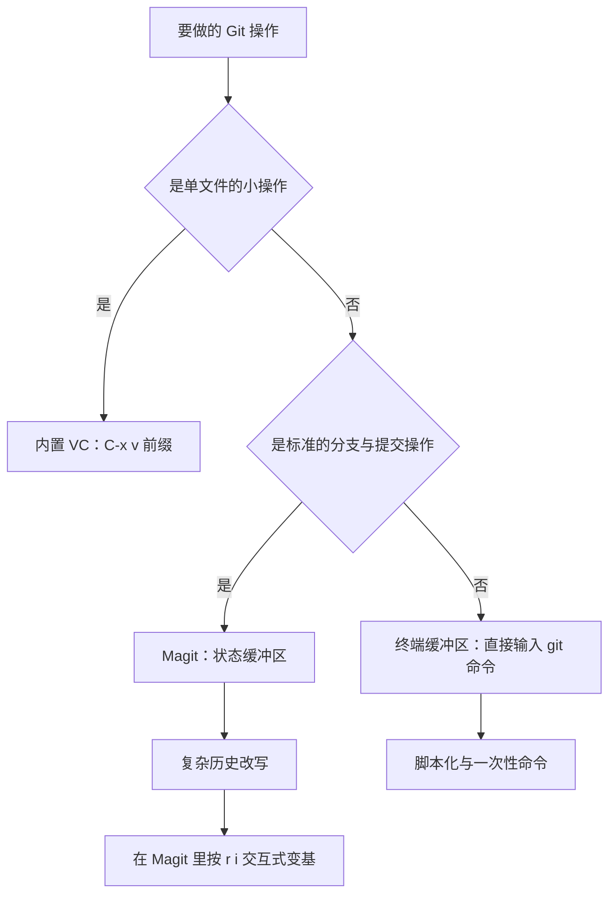
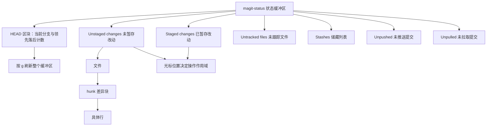
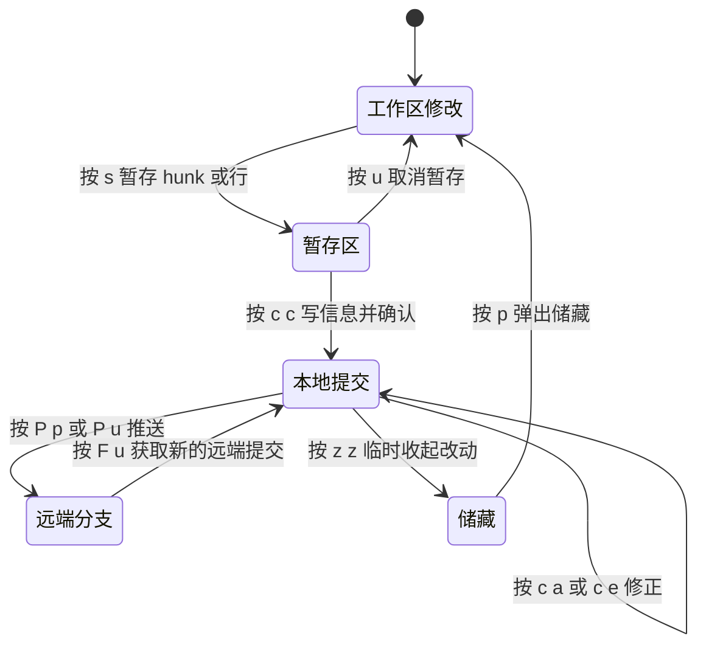

# Git 与 Magit：把版本控制搬进 Emacs

> 本篇解决「在 Emacs 里到底该用哪套 Git 界面」的问题：内置 VC、Magit、直接开终端跑命令三条路线各自适合什么场景，以及 Magit 从暂存到推送、从冲突解决到历史整理的完整用法。读者需要已经会基本的 Git 概念（工作区、暂存区、提交、分支、远端）。

---

## 一、三条路线与选择建议

在 Emacs 里操作 Git，实际存在三条互不排斥的路线。它们不是新旧替代关系，而是分工不同。

| 路线 | 入口 | 实现方式 | 优点 | 局限 |
| --- | --- | --- | --- | --- |
| 内置 VC | `C-x v` 前缀 | Emacs 自带的版本控制抽象层，通过后端（vc-git、vc-svn 等）调用外部命令 | 零安装、随 Emacs 启动即可用、与文件缓冲区结合紧密 | 只覆盖最常见操作，缺少暂存区概念的操作（部分暂存、交互式变基）几乎不可用 |
| Magit | `M-x magit-status` | 第三方包，把 `git` 命令的输出解析成可折叠的 section，用 transient 菜单暴露参数 | 覆盖面接近完整的 Git 命令行，键位少而稳定，diff 与暂存操作极其顺手 | 需要安装；仓库极大时有刷新开销；键位要花几天形成肌肉记忆 |
| 终端里直接跑 | `M-x vterm` / `M-x eshell` | 在 Emacs 内的终端模拟器里输入 `git` 命令 | 与文档、脚本、别名完全一致，适合复杂或一次性命令 | 上下文要手动切换，无法用 Emacs 的 diff 高亮与跳转 |

选择建议可以概括成三句话：

- 只想看当前文件改了什么、提交单个文件，用内置 VC 就够，不必装任何东西。
- 日常主力开发（暂存、拆分提交、变基、冲突解决、查看历史）用 Magit，它省下的时间以小时计。
- 需要 `git filter-repo`、`git bisect run`、自定义脚本这类边缘操作时，别硬套 Magit，开一个终端缓冲区跑原命令。

三者协作的关系如下：



---

## 二、内置 VC：C-x v 能做什么，什么时候够用

VC（Version Control）是 Emacs 内置的版本控制接口。它不直接操作 Git 的仓库对象，而是抽象出「文件是否已注册、是否有本地修改、是否需要提交」这一层概念，因此对任何受支持的版本控制系统都能用同一套键位。它的命令集中在 `C-x v` 前缀下，下面这张表在 Emacs 29、30 上完全一致，可以直接在任意文件缓冲区里验证：

| 键位 | 命令 | 作用 |
| --- | --- | --- |
| `C-x v v` | `vc-next-action` | 智能提交：文件未注册则注册，已修改则打开提交缓冲区 |
| `C-x v d` | `vc-dir` | 打开类似 `git status` 的目录视图 |
| `C-x v =` | `vc-diff` | 查看当前文件与仓库版本的差异 |
| `C-x v D` | `vc-root-diff` | 查看整个仓库工作区的差异 |
| `C-x v l` | `vc-print-log` | 当前文件的提交历史 |
| `C-x v L` | `vc-print-root-log` | 整个仓库的提交历史 |
| `C-x v g` | `vc-annotate` | 逐行标注作者与提交（即 blame） |
| `C-x v u` | `vc-revert` | 放弃当前文件的修改 |
| `C-x v i` | `vc-register` | 把新文件加入版本控制 |
| `C-x v +` | `vc-update` | 从远端拉取（fetch 并合并） |
| `C-x v P` | `vc-push` | 推送到远端 |
| `C-x v s` | `vc-create-tag` | 创建标签（也用于创建分支） |
| `C-x v a` | `vc-update-change-log` | 生成 ChangeLog 条目（老式 GNU 工作流） |

`vc-dir` 是 VC 路线的核心。它列出仓库中被修改、未跟踪、已暂存的文件，每个文件上可以按 `=` 看差异、按 `v` 做一次 next-action、按 `m` 标记多个文件再统一提交。它在小改动、单文件修复的场景下已经足够，而且启动速度比 Magit 快得多。

VC 的局限也很清楚：

- 没有「暂存区」这个一等公民。VC 的模型是「文件级提交」，虽然 `vc-diff` 里可以对一块补丁做 `C-x v v` 式的部分提交，但操作远不如 Magit 的 hunk 暂存顺手。
- 没有交互式变基、没有 stash、没有 cherry-pick 的完整界面。
- 冲突解决要靠 `smerge-mode` 手动开启，VC 不会主动帮你进入冲突处理流程。
- 对 Git 特有的功能（`--fixup`、`--force-with-lease`、子模块）基本没有支持。

因此把 VC 定位成「轻量阅读与单文件提交工具」比较准确。真正的主力还是 Magit。

---

## 三、Magit 的核心理念

Magit 与其它 Git 前端最大的不同，是它不提供「命令列表」，而是提供一个**仓库状态缓冲区**，所有操作都从这个缓冲区出发。理解下面三点，Magit 就不需要背。

**第一，状态缓冲区（status buffer）就是一切入口。** `M-x magit-status` 打开的这个缓冲区，内容是仓库的全景快照：HEAD 位置、未暂存改动、已暂存改动、未跟踪文件、stash 列表、未推送的提交、未拉取的提交。它不是静态输出，按 `g` 会重新执行 `git status` 一族的命令并刷新整块内容。

**第二，内容被切成可折叠的 section（区块）。** 每个区块可以折叠展开：文件下面是 hunk（差异块），hunk 下面是具体的行。折叠层级让一个改动很大的仓库在一屏内仍然可读。区块的意义在于**操作的作用域由光标位置决定**：光标在文件行上按 `s` 暂存整个文件，光标在 hunk 上按 `s` 只暂存这一块，选中若干行再按 `s` 只暂存这几行。

**第三，几乎不用记命令，因为每个命令都有 transient 菜单。** 按 `h` 或 `?` 打开 `magit-dispatch`，它是一个分层菜单：先按功能大类（提交、分支、推送），再按具体动作。菜单里的每一项都显示对应的 Git 参数开关，可以现场切换。例如推送到远端时，先在 `P` 菜单里把 `-f`（`--force-with-lease`）打开，再按 `p` 推送。菜单本身会显示当前开关状态，比记 `git push --force-with-lease origin HEAD` 更不容易出错。

状态缓冲区的结构大致如下：



键位的学习方法与其它 Emacs 包也不同：Magit 的键位是「两级菜单」，`h` 打开总菜单，菜单里每个字母再打开子菜单，子菜单里才是实际动作。因此记忆负担是「十几个字母 + 菜单里现查」，而不是几百个组合键。任何时候在 transient 菜单里按 `?` 都会展开当前菜单的完整说明，按 `C-g` 关闭菜单。

---

## 四、安装与基础配置

Magit 不在 GNU ELPA 上，需要先配置 MELPA 源再安装（MELPA 的包索引页是 https://melpa.org/ ）。Emacs 30 内置的 `use-package` 可以直接写 `:ensure t`。Magit 的项目主页在 https://github.com/magit/magit ，源码、更新日志与完整手册都在那里；它的两个关键依赖 transient 与 with-editor 是独立维护的包，主页分别是 https://github.com/magit/transient 与 https://github.com/magit/with-editor 。

```elisp
;; 先加入 MELPA 源，Magit 只发布在这里
(require 'package)
(add-to-list 'package-archives '("melpa" . "https://melpa.org/packages/") t)
(package-initialize)

;; 安装 Magit。它依赖三个包，包管理器会自动拉取：
;; transient（菜单框架）、with-editor（把 git 的编辑器指回 Emacs）、compat（兼容层）
(use-package magit
  :ensure t
  :bind (("C-x g" . magit-status)))     ; 最常用的一条绑定，建议放在最前面
```

如果不想用 `use-package`，等价的写法是：

```elisp
(require 'package)
(add-to-list 'package-archives '("melpa" . "https://melpa.org/packages/") t)
(package-initialize)
;; 然后执行 M-x package-install RET magit RET
;; 安装完成后手动绑定键位
(global-set-key (kbd "C-x g") #'magit-status)
```

关于全局键位有一个版本差异值得说明。Magit 4 引入了一个新的选项 `magit-define-global-key-bindings`，默认值是 `default`，意思是 Magit 会在 `after-init-hook` 阶段尝试安装三个全局键位，但**只在对应键位还没被占用时**才安装：

- `C-x g` 对应 `magit-status`
- `C-x M-g` 对应 `magit-dispatch`
- `C-c M-g` 对应 `magit-file-dispatch`

把该选项设为 `recommended` 会改用 `C-c g` 与 `C-c f`，但 Magit 自己说明不能默认这么做，因为 `C-c` 加单个字母是保留给用户的命名空间。Magit 3.x 没有这个选项，必须自己写 `global-set-key`。因此**无论用哪个版本，显式写一遍绑定都是最稳的做法**，既保证键位存在，也避免和别的包抢键。

`with-editor` 是 Magit 的依赖，也是理解「提交时编辑器卡住」这类问题的钥匙。它的作用是：当 Magit 需要让 Git 启动一个编辑器（写提交信息、交互式变基的 todo 列表）时，不去开新的 Emacs 进程，而是通过 server 文件把请求发给当前正在运行的 Emacs，在现有框架里打开一个缓冲区，编辑完用 `C-c C-c` 提交给 Git，`C-c C-k` 放弃。这就是为什么必须让 `(server-start)` 处于运行状态——**Magit 自己要保证这一点，但你自己在 Magit 之外用 `git commit`（比如在 vterm 里）时，就需要 Git 的 `core.editor` 指向 `emacsclient`**：

```bash
# 让命令行 Git 也复用正在运行的 Emacs；-a '' 表示没有 server 时启动一个新的 Emacs 守护进程连接
$ git config --global core.editor "emacsclient -c -a ''"
# Windows 下要用图形化的客户端程序，否则会闪出控制台窗口
$ git config --global core.editor "emacsclientw -c -a \"\""
```

with-editor 包里还带了一个同名的命令行脚本，用于在 shell 里包裹 Git 调用，把编辑器指向当前 server；在 Elisp 侧它提供 `with-editor` 宏，用来在 Lisp 代码里启动一个继承编辑器环境的外部进程。日常写作提交信息时不需要直接碰这两样东西，知道它们存在、出问题时知道往哪个方向查就够了。

---

## 五、Magit 键位总表

下面按功能分区给出 Magit 状态缓冲区（以及由状态缓冲区打开的 transient 菜单）中的键位。这些键位在 Magit 3.x 与 4.x 上基本一致，个别差异在表后单独说明。

### 5.1 刷新、区块导航与通用操作

| 键位 | 命令 | 作用 |
| --- | --- | --- |
| `g` | `magit-refresh` | 刷新当前缓冲区 |
| `G` | `magit-refresh-all` | 刷新所有 Magit 缓冲区 |
| `TAB` | `magit-section-toggle` | 折叠或展开光标所在区块 |
| `S-TAB` | `magit-section-cycle-global` | 全局循环折叠层级 |
| `C-c TAB` 或 `M-TAB` | `magit-section-cycle` | 循环当前区块的折叠状态 |
| `n` / `p` | `magit-section-forward` / `magit-section-backward` | 跳到下一个 / 上一个区块 |
| `M-n` / `M-p` | `magit-section-forward-sibling` / `magit-section-backward-sibling` | 跳同级区块 |
| `^` | `magit-section-up` | 回到父区块（例如从 hunk 回到文件） |
| `1` 到 `4` | `magit-section-show-level-1` 等 | 只展开到指定层级 |
| `RET` | `magit-visit-thing` | 访问光标所在对象：文件、提交、分支 |
| `SPC` / `DEL` | `magit-diff-show-or-scroll-up` / `-down` | 滚动 diff；若 diff 未显示则先显示 |
| `+` / `-` / `0` | `magit-diff-more-context` 等 | 增加 / 减少 / 恢复 diff 的上下文行数 |
| `h` 或 `?` | `magit-dispatch` | 打开总菜单 |
| `$` | `magit-process-buffer` | 查看 Git 命令的执行输出，排查问题时必看 |
| `!` | `magit-run` | 在仓库目录里执行任意 Git 命令 |
| `q` | `magit-mode-bury-buffer` | 关闭当前 Magit 缓冲区 |
| `C-w` | `magit-copy-section-value` | 复制光标所在区块的值（提交哈希、文件名等） |
| `M-w` | `magit-copy-buffer-revision` | 复制当前缓冲区的版本号 |

### 5.2 暂存与丢弃

| 键位 | 命令 | 作用 |
| --- | --- | --- |
| `s` | `magit-stage-files` | 暂存光标所在文件或 hunk；有活动选区时段级暂存选中的行 |
| `u` | `magit-unstage-files` | 取消暂存 |
| `S` | `magit-stage-modified` | 暂存所有已修改与已删除文件 |
| `U` | `magit-unstage-all` | 清空暂存区 |
| `k` | `magit-delete-thing` | 删除光标所在对象（未跟踪文件、stash、分支、标签等） |
| `K` | `magit-file-untrack` | 把文件从版本控制中移除但保留工作区文件 |
| `x` | `magit-reset-quickly` | 快速重置到某个提交（等价于 `git reset --hard`） |

只在 diff 缓冲区里有意义的两个命令是 `magit-stage-hunk` 与 `magit-unstage-hunk`，它们与 `s`、`u` 是同一套逻辑的显式形式，在脚本或自定义键位里按名字引用更清晰。

### 5.3 提交（`c` 菜单）

| 键位 | 命令 | 对应 Git 行为 |
| --- | --- | --- |
| `c c` | `magit-commit-create` | 创建新提交 |
| `c a` | `magit-commit-amend` | 修改 HEAD 提交（`--amend`） |
| `c e` | `magit-commit-extend` | 把暂存内容并入 HEAD 且不编辑信息（`--amend --no-edit`） |
| `c w` | `magit-commit-reword` | 只重写 HEAD 的提交信息 |
| `c f` | `magit-commit-fixup` | 生成 `fixup!` 提交，供后续 autosquash |
| `c s` | `magit-commit-squash` | 生成 `squash!` 提交 |
| `c F` / `c S` | `magit-commit-instant-fixup` / `-instant-squash` | 直接把工作区改动固定到某个提交上，跳过中间产物 |

提交菜单里的常用开关（在菜单中直接按对应字母切换）：

| 开关 | 含义 |
| --- | --- |
| `-a` | 等同于 `--all`：提交前自动暂存所有已修改与已删除文件 |
| `-e` | 允许空提交（`--allow-empty`） |
| `-v` | 在提交缓冲区里显示将要提交的差异（`--verbose`） |
| `-n` | 跳过钩子（`--no-verify`） |
| `-R` | 重置作者信息（`--reset-author`） |

需要留意：`--amend` 不是一个可以切换的开关，而是由 `c a` 这条动作本身携带的。

### 5.4 推送、拉取与获取

| 键位 | 命令 | 作用 |
| --- | --- | --- |
| `P p` | `magit-push-current-to-pushremote` | 推送到当前分支的 push-remote |
| `P u` | `magit-push-current-to-upstream` | 推送到上游分支，必要时设置上游 |
| `P e` | `magit-push-current` | 推送到别处（交互式选择远端与分支） |
| `P o` | `magit-push-other` | 推送其它分支 |
| `P r` | `magit-push-refspecs` | 推送自定义 refspec |
| `P t` / `P T` | `magit-push-tags` / `magit-push-tag` | 推送所有标签 / 单个标签 |
| `F p` / `F u` | `magit-fetch-from-pushremote` / `-from-upstream` | 从 push-remote / 上游获取 |
| `F a` | `magit-fetch-all` | 从所有远端获取 |
| `F o` / `F r` / `F m` | `magit-fetch-branch` / `-refspec` / `-modules` | 获取指定分支 / refspec / 子模块 |
| `F` 菜单的 `-p` | `--prune` | 获取时清理远端已删除的分支 |
| `f p` / `f u` / `f e` | `magit-pull-from-pushremote` / `-from-upstream` / `magit-pull-branch` | 拉取（fetch 加合并或变基） |

推送菜单里有两个力度的强制推送开关：`-f` 是 `--force-with-lease`，`-F` 是 `--force`。**始终优先用前者**：它在远端被别人更新过时会拒绝推送，而 `--force` 会直接覆盖别人的提交。

### 5.5 分支、合并与变基

| 键位 | 命令 | 作用 |
| --- | --- | --- |
| `b b` | `magit-checkout` | 检出某个分支或提交（可输入任意 revision） |
| `b l` | `magit-branch-checkout` | 从本地分支列表中选一个检出 |
| `b c` | `magit-branch-and-checkout` | 新建分支并立即检出 |
| `b n` | `magit-branch-create` | 只新建分支，不切换 |
| `b s` | `magit-branch-spinoff` | 把当前提交变成新分支并重置原分支 |
| `b m` | `magit-branch-rename` | 重命名分支 |
| `b k` | `magit-branch-delete` | 删除分支 |
| `b x` | `magit-branch-reset` | 把某个分支重置到指定提交 |
| `b C` | `magit-branch-configure` | 配置上游、push-remote 等 |
| `m m` | `magit-merge-plain` | 合并 |
| `m e` | `magit-merge-editmsg` | 合并并编辑提交信息 |
| `m n` | `magit-merge-nocommit` | 合并但不提交 |
| `m p` | `magit-merge-preview` | 预览合并结果，不产生任何改动 |
| `m s` | `magit-merge-squash` | 压缩合并（`--squash`） |
| `r i` | `magit-rebase-interactive` | 交互式变基（`git rebase -i`） |
| `r p` / `r u` / `r e` | `magit-rebase-onto-pushremote` / `-onto-upstream` / `magit-rebase-branch` | 变基到 push-remote / 上游 / 其它分支 |
| `r s` | `magit-rebase-subset` | 只取一部分提交变基到别处 |
| `r f` | `magit-rebase-autosquash` | 变基并自动应用 `fixup!` 与 `squash!` |
| `r m` / `r w` / `r k` | `magit-rebase-edit-commit` / `-reword-commit` / `-remove-commit` | 变基过程中修改 / 改写 / 删除单个提交 |
| `r r` / `r s` / `r e` / `r a` | `magit-rebase-continue` / `-skip` / `-edit` / `-abort` | 变基序列中断后的继续 / 跳过 / 编辑 / 放弃 |

变基序列中断时，`magit-sequence` 会在状态缓冲区顶部插入一个专门的区块，把「继续、跳过、编辑、放弃」四个动作摆在那里，同时也会显示还剩哪些提交要处理。

### 5.6 差异、日志与查询

| 键位 | 命令 | 作用 |
| --- | --- | --- |
| `d d` | `magit-diff-dwim` | 按上下文猜测你想看什么差异 |
| `d w` / `d s` | `magit-diff-working-tree` / `magit-diff-staged` | 工作区差异 / 暂存区差异 |
| `d r` | `magit-diff-range` | 两个 revision 之间的差异 |
| `d p` | `magit-diff-paths` | 指定路径的差异 |
| `d t` | `magit-stash-show` | 查看某个 stash 的内容 |
| `l l` | `magit-log-current` | 当前分支的提交历史 |
| `l o` | `magit-log-other` | 指定 rev 的历史 |
| `l h` | `magit-log-head` | HEAD 的历史 |
| `l L` | `magit-log-branches` | 本地分支历史 |
| `l b` | `magit-log-all-branches` | 所有分支的历史 |
| `l a` | `magit-log-all` | 所有引用（含标签、远端分支）的历史 |
| `l R` | `magit-log-reflog` | reflog 对象列表 |
| `l r` / `l O` / `l H` | `magit-reflog-current` / `-other` / `-head` | 查看 reflog |
| `l s` | `magit-shortlog` | 按作者统计的 shortlog |
| `y` | `magit-show-refs` | 列出所有引用及其指向 |
| `Y` | `magit-cherry` | 查看分支间尚未合并的提交 |

日志缓冲区里按 `L`（`magit-log-refresh`）可以修改当前日志的参数，例如加上 `--author`、`--since`、`-S` 之类的过滤条件；把光标放在某个提交上按 `RET`，可以看到该提交的完整差异。

### 5.7 储藏、标签、远端与重置

| 键位 | 命令 | 作用 |
| --- | --- | --- |
| `z z` | `magit-stash-both` | 储藏暂存区与工作区改动 |
| `z i` / `z w` | `magit-stash-index` / `magit-stash-worktree` | 只储藏暂存区 / 只储藏工作区 |
| `z x` | `magit-stash-keep-index` | 储藏工作区但保留暂存区 |
| 在 stash 条目上 `a` | `magit-stash-apply` | 应用但不删除该储藏 |
| 在 stash 条目上 `p` | `magit-stash-pop` | 应用并删除该储藏 |
| 在 stash 条目上 `k` | `magit-stash-drop` | 丢弃该储藏 |
| 在 stash 条目上 `b` | `magit-stash-branch` | 从该储藏创建分支 |
| `t t` / `t r` | `magit-tag-create` / `magit-tag-release` | 创建轻量或附注标签 / 创建发布标签 |
| `t k` / `t p` | `magit-tag-delete` / `magit-tag-prune` | 删除本地标签 / 清理远端已删除的标签 |
| `M a` / `M r` / `M k` | `magit-remote-add` / `-rename` / `-remove` | 添加 / 重命名 / 删除远端 |
| `M p` / `M P` | `magit-remote-prune` / `-prune-refspecs` | 清理失效的远端分支 / refspec |
| `X m` / `X s` / `X h` | `magit-reset-mixed` / `-soft` / `-hard` | 三种重置模式 |
| `X k` / `X i` / `X w` | `magit-reset-keep` / `-index` / `-worktree` | 保留工作区 / 只重置索引 / 只重置工作区 |
| `X b` / `X f` | `magit-branch-reset` / `magit-file-checkout` | 重置分支 / 用某个版本覆盖文件 |

### 5.8 单文件级别的入口

除了状态缓冲区，Magit 还提供一套「针对当前文件」的动作集合，绑在 `magit-file-dispatch` 上。默认的全局键位是 `C-c M-g`（Magit 4 在键位空闲时自动安装，也可自己绑定）。在任意文件缓冲区里：

| 键位 | 命令 | 作用 |
| --- | --- | --- |
| `C-c M-g l` | `magit-log-buffer-file` | 只列出改动过当前文件的提交 |
| `C-c M-g d` | `magit-diff-buffer-file` | 当前文件与某次提交的差异 |
| `C-c M-g b` | `magit-blame-addition` | 打开 blame 视图 |
| `C-c M-g B` | `magit-blame` | 打开 blame 菜单（可选 addition / removal / reverse 等方式） |
| `C-c M-g s` / `u` | `magit-file-stage` / `magit-file-unstage` | 暂存 / 取消暂存当前文件 |
| `C-c M-g c` | `magit-commit` | 对当前文件发起提交 |
| `C-c M-g p` / `n` | `magit-blob-previous` / `magit-blob-next` | 在文件的历史版本之间前后跳转 |

blame 缓冲区里继续按 `b` 可以打开 blame 菜单切换模式，`RET` 查看光标所在行的完整提交，`q` 退出 blame。

---

## 六、典型工作流实战

### 6.1 克隆一个仓库

1. `M-x magit-clone`（或在总菜单里按 `C`），Magit 会依次询问仓库地址、克隆到哪个目录。
2. 克隆完成后直接 `M-x magit-status`，状态缓冲区显示当前分支与工作区是否干净。
3. 想把常用的仓库集中管理，可以设置 `magit-repository-directories`，之后 `M-x magit-list-repositories` 会列出所有本地仓库；在状态缓冲区里按 `j`（`magit-status-quick`）可以快速跳到另一个仓库。

### 6.2 日常提交（改、看、暂存、提交、推送）

1. 在状态缓冲区按 `g` 刷新，看到 `Unstaged changes` 区块里出现改动。
2. `TAB` 展开文件，把光标放到某个 hunk 上按 `s` 暂存这一块；如果只想暂存其中几行，先用 `C-SPC` 设定 mark，移动光标选中行，再按 `s`。
3. 全部暂存完毕后按 `c c`，在提交缓冲区写信息，`C-c C-c` 确认提交。若想在写信息时对照差异，先在 `c` 菜单里打开 `-v` 开关。
4. 按 `P p` 推送到 push-remote，或者 `P u` 推送到上游。

### 6.3 修正上一次提交

- 只是补上漏掉的文件：暂存文件后按 `c e`（`magit-commit-extend`），提交信息不变。
- 想顺便改提交信息：按 `c a`（`magit-commit-amend`），在提交缓冲区里改完信息再 `C-c C-c`。
- 只想改信息、不动内容：把光标放到 HEAD 那个提交上按 `c w`（`magit-commit-reword`）。
- 已经推送过的提交要谨慎处理；如果必须修改，改完用 `P` 菜单里的 `-f`（`--force-with-lease`）推送。

### 6.4 把一次大改动拆成多个提交

这是 Magit 最能体现价值的场景：

1. 状态缓冲区里 `Unstaged changes` 下是全部改动，`TAB` 逐层展开到 hunk 与行。
2. 对属于第一个逻辑单元的 hunk 按 `s` 暂存；不属于的保持未暂存。
3. 如果一个 hunk 里混了两件事，用选区只暂存相关的那几行（mark 加移动光标，再按 `s`）。
4. 按 `c c` 提交第一个逻辑单元，写清楚信息。
5. 重复步骤 2 到 4，直到工作区干净。整个过程不需要 `git add -p` 的交互问答，也不需要担心按错键给出错误的 hunk。

如果发现历史已经乱了，不想重来，可以用 `c F`（`magit-commit-instant-fixup`）把当前改动直接固定到某个历史提交上，再用 `r f`（`magit-rebase-autosquash`）一次性合并。

### 6.5 解决冲突

冲突发生时，状态缓冲区顶部出现 `Unmerged into ...` 区块，冲突文件被单独列出：

1. 在冲突文件上按 `RET` 打开文件，`smerge-mode` 会在打开冲突标记时自动启用，冲突处用颜色区分上下两侧。
2. 用 `C-c ^ n` / `C-c ^ p` 在冲突之间跳转；`C-c ^ m` 保留上侧（通常是当前分支），`C-c ^ o` 保留下侧，`C-c ^ a` 两块都保留，`C-c ^ b` 保留原始版本。
3. 想要三窗格对照时，用 `M-x smerge-ediff` 或 `M-x ediff` 打开 Ediff 会话，在 Ediff 控制窗里按 `a` 或 `b` 采纳某一侧，`n` / `p` 在差异间移动，`q` 退出。
4. 也可以直接在 Magit 里按 `E`（`magit-ediff`），让 Magit 为当前冲突搭建 Ediff 会话。
5. 解决完一个文件后 `s` 暂存它，状态缓冲区里该文件从未合并区块移到 `Staged changes`。
6. 全部解决后，合并情形下按 `c c` 完成合并提交；变基情形下按 `r r`（`magit-rebase-continue`）继续。要放弃整个操作，合并用 `m a`（`magit-merge-abort`），变基用 `r a`（`magit-rebase-abort`）。



### 6.6 用交互式变基整理历史

1. `r i` 打开交互式变基，Magit 会询问变基到哪个提交。
2. 提交 todo 列表在一个专门的缓冲区里打开，每行是一个提交，可以改动词：`pick` 保留、`reword` 改信息、`edit` 停下来修改、`squash` 并入上一个、`fixup` 并入但丢弃信息、`drop` 删除。
3. 用 `C-c C-c` 确认开始，也可以 `C-c C-k` 取消。
4. 过程中如果停下来了，状态缓冲区会出现序列区块，用 `r r` 继续、`r s` 跳过当前提交、`r e` 进入编辑、`r a` 放弃并回到变基前。
5. 只有自己还没推送的提交才适合这样整理；已经共享出去的历史改动后必须通知协作者。

### 6.7 查看某个文件的演化

- `C-c M-g l`（`magit-log-buffer-file`）列出所有改过当前文件的提交，按 `L` 可以再加过滤条件，按 `RET` 看具体差异。
- `C-c M-g b`（`magit-blame-addition`）打开 blame 视图，每一行前面显示提交哈希、作者和时间；在某个区块上按 `RET` 查看完整提交。
- `C-c M-g p` / `n`（`magit-blob-previous` / `magit-blob-next`）可以在该文件的历史版本之间前后翻阅，对比某一行是何时被引入的非常直观。
- 需要看「这一行字符串是哪个提交引入的」，可以在日志菜单里用 `-S` 参数做 pickaxe 搜索，比逐次 blame 快。

### 6.8 创建 PR 与查看 CI 状态

纯 Git 层面能做的只有推分支（`P u`）。创建 Pull Request 与查看 CI 有两条路：

- 用 GitHub CLI：`gh pr create`、`gh pr view --web`、`gh run list`、`gh pr checks`。在 Emacs 里可以 `M-x shell-command` 直接跑，也可以在 vterm 缓冲区里跑，交互式登录等流程更自然。
- 用 Forge（见第九节）：在 Emacs 里列出、创建、评论 PR 与 issue，并把 CI 状态直接显示在状态缓冲区里。

---

## 七、Hunk 级操作

Hunk（差异块）是 Git 差异输出的最小可操作单元，Magit 把「按块操作」做得比命令行更细：

- `magit-stage-hunk`（默认绑定 `s`）暂存光标所在的整个 hunk；`magit-unstage-hunk`（`u`）反向操作。
- **暂存部分行**：在一个 hunk 内用 `C-SPC` 设定 mark，移动光标选中要暂存的行，然后按 `s`，Magit 只暂存选中的部分，其余保持在工作区。这是把混杂改动拆开的核心手段。
- `magit-diff-refine-hunk` 是一个变量，取值 `nil`、`t`、`all`，控制是否把 hunk 内部再按词做二级高亮：`nil` 关闭，`t` 只对光标所在的 hunk 做精细高亮，`all` 对所有 hunk 都做。默认 `t` 在多数机器上是性能与可读性的平衡点。对应的交互命令也叫 `magit-diff-refine-hunk`，可以随时对当前 hunk 手动切换。
- 想看清空白字符带来的差异，在 diff 菜单里打开忽略空白的开关（对应 `git diff -w`），或者直接设置 `magit-diff-arguments` 之类的变量让某类 diff 默认带上参数。
- 反向操作一个 hunk 的改动（把已经提交的内容从工作区撤掉）用 `v`（`magit-reverse`），`a`（`magit-apply`）则用于把某个提交或 stash 的改动应用过来。

---

## 八、辅助包

Magit 之外，还有几类包与它配合密切。

### 8.1 diff-hl：把改动标在边缘

`diff-hl` 在 fringe（图形界面的窗口边缘）或行号区域用小块标记出新增、修改、删除的行，并且能直接对单个 hunk 做还原或暂存。它的优点是轻量，不需要打开 Magit 就能看到当前文件相对版本库的改动。项目主页：https://github.com/dgutov/diff-hl 。

```elisp
(use-package diff-hl
  :ensure t
  :hook ((prog-mode . diff-hl-mode)      ; 编程模式里开启
         (org-mode . diff-hl-mode)       ; 写文档时也想要
         (dired-mode . diff-hl-dired-mode))
  :config
  ;; 终端里没有 fringe，用行号区域或边距显示标记
  (unless (display-graphic-p)
    (diff-hl-margin-mode 1))
  ;; 保存文件后实时更新标记，比等 idle 定时器更及时
  (add-hook 'after-save-hook #'diff-hl-update t t))
```

`git-gutter` 是同一类工具的另一实现（https://github.com/emacsorphanage/git-gutter ），功能相近：默认在行号区域显示标记，配置项风格不同。两者选一个即可，同时开着只会互相干扰。

### 8.2 git-timemachine：在历史版本之间漫游

`M-x git-timemachine` 用只读缓冲区展示当前文件在某个历史版本的内容，按 `n` 看下一个（更早的）版本，按 `p` 看上一个版本，按 `q` 退出。它适合「这个函数以前长什么样」这类问题，比反复 checkout 安全得多。项目主页在 https://codeberg.org/pidu/git-timemachine 。

### 8.3 git-link：复制远端链接

`M-x git-link`（项目主页 https://github.com/sshaw/git-link ）把当前行或选区所在的文件位置生成一个可以粘贴到聊天窗口的 URL，自动识别 GitHub、GitLab、Bitbucket 等常见托管平台并带上行号。`git-link-commit` 生成某个提交的链接，`git-link-homepage` 打开仓库主页。评审代码、在 issue 里引用代码时非常省事。

### 8.4 magit-todos：把 TODO 变成可跳转列表

`magit-todos`（项目主页 https://github.com/alphapapa/magit-todos ）扫描仓库里的 `TODO`、`FIXME` 等关键词，在 Magit 状态缓冲区里插入一个区块列出它们，按 `RET` 直接跳到对应位置。关键词表、忽略的目录都能配置。它依赖 `hl-todo` 做高亮，安装时会被自动带上。

```elisp
(use-package magit-todos
  :ensure t
  :after magit
  :config
  ;; 默认只在打开状态缓冲区时扫描，可以限制最大文件大小避免在大仓库上卡顿
  (setq magit-todos-max-files 2000)
  (magit-todos-mode 1))
```

### 8.5 smerge 与 Ediff 的分工

`smerge-mode` 是 Emacs 内置的冲突解决小模式，键位在 `C-c ^` 前缀下，操作粒度是「一个冲突」，速度最快；Ediff 提供三窗格可视化对照，适合冲突块大、需要通读上下文的情况。Magit 的 `E` 与 `M-x smerge-ediff` 是把两者接起来的桥梁。

---

## 九、Forge：把 PR 和 Issue 拉进 Emacs

Forge 是 Magit 作者写的配套包，把 GitHub、GitLab、Codeberg、Bitbucket 等平台上的 Pull Request 与 Issue 当作 Magit 里的区块来展示与操作。它不是 Git 的替代品，而是「代码托管平台的客户端」。项目主页：https://github.com/magit/forge 。

安装与配置分三步。

第一步，安装包：

```elisp
(use-package forge
  :ensure t
  :after magit)
```

第二步，准备 API token。Forge 通过 `auth-source` 读取凭据，最省事的做法是把 token 放进 `~/.authinfo.gpg`（GnuPG 加密）或 `~/.authinfo`，每行一条：

```text
machine api.github.com login 你的用户名^forge password ghp_开头的token
machine gitlab.com/api/v4 login 你的用户名^forge password 你的token
```

同时在 init.el 里确保 `auth-sources` 包含这个文件，并让 Forge 知道去哪里找：

```elisp
;; 让 auth-source 从加密文件里读取凭据；Epilogue 用 gpg 解密
(setq auth-sources '("~/.authinfo.gpg"))
;; Forge 把 token 存进数据库的位置，默认在 var/ 目录下，不用改也行
;; (setq forge-database-file (expand-file-name "forge/database.sqlite" user-emacs-directory))
```

第三步，注册仓库。打开某个仓库的状态缓冲区后执行 `M-x forge-add-repository`，Forge 会把该仓库记入数据库并开始拉取 topic 列表。

关于 `forge-alist`：这是一个把域名映射到 API 地址与后端实现的表。当前版本的默认值已经包含 github.com、gitlab.com、codeberg.org、bitbucket.org 以及 salsa.debian.org、framagit.org 等实例，所以这些平台开箱可用；**自建的 GitLab、Gitea、Forgejo 实例才需要自己往 `forge-alist` 里加条目**。加了条目之后仍需为对应域名配置 token。

Forge 的操作挂在 `forge-dispatch` 上，默认在 Magit 缓冲区里绑定到 `'`（也绑定在 `N` 上）。按 `'` 打开菜单后，可以列出当前仓库的 issue 与 pull request、创建新 topic、对当前 topic 做评论、合并、关闭等。CI 状态（例如 GitHub Actions 的运行结果）以区块形式插在状态缓冲区里，能直接看到某次推送的检查是否通过。

需要注意的现实约束：Forge 的首次同步在大仓库上可能耗时较长；它依赖平台 API，私有实例的网络不可达时会报错；token 权限不足时表现为「列表为空」而不是明确报错。遇到这类问题先看 `M-x magit-process-buffer` 与 `*Messages*`。

---

## 十、性能优化

Magit 在超大仓库（数十万文件、十年以上历史）上变慢，原因通常不是 Magit 本身，而是它需要跑的命令太多、输出太大。可用的手段按收益排序：

1. **减少状态缓冲区里的区块数量。** `magit-status-sections-hook` 决定了状态缓冲区里插入哪些区块，它的默认值包含 HEAD 头信息、未跟踪文件、未暂存改动、已暂存改动、stash、未推送与未拉取等。在巨型仓库里，未跟踪文件与 stash 的统计往往最贵，可以把不需要的区块从 hook 里去掉：

```elisp
;; 只保留最必要的区块，牺牲一部分信息换取刷新速度
(setq magit-status-sections-hook
      '(magit-insert-status-headers
        magit-insert-unstaged-changes
        magit-insert-staged-changes
        magit-insert-unpushed-to-upstream))
```

2. **限制刷新范围与频率。** `magit-refresh-status-buffer` 控制是否在每次 Git 命令之后都刷新状态缓冲区，把它设为 `nil` 可以让批量操作流畅很多，代价是状态显示可能滞后，需要手动 `g`。

3. **减少 diff 的精细高亮开销。** 把 `magit-diff-refine-hunk` 设为 `nil`，在改动巨大时能明显降低卡顿；改为 `t`（默认）只在光标所在 hunk 上做精细高亮，一般不需要动。

4. **指定 Git 可执行文件。** `magit-git-executable` 明确指向 git 的路径，避免 Magit 反复搜索 PATH；在 Windows 上从 GUI 启动 Emacs 时经常需要设置它，因为 GUI 进程继承的 PATH 与 shell 不同。

5. **Windows 上的进程类型。** `magit-process-connection-type` 在 Windows 上默认取 `nil`（不使用伪终端），这是为了让输出不被 pty 的换行转换弄乱。除非明确知道自己在做什么，不要改这个值。

6. **日志参数与历史深度。** `magit-log-arguments` 之类的变量决定日志缓冲区默认带什么参数；在大仓库里把默认的提交数量调小，可以让 `l l` 立刻出结果。

7. **缓存与自动还原。** 打开太多文件时，Magit 的自动还原（auto-revert）会在每次刷新后检查所有相关文件，把用不到的文件关掉比调参数更有效。

判断到底慢在哪里，最直接的办法是执行一次 `M-x magit-profile-refresh`（Magit 自带的剖析命令），它会显示本次刷新中哪些 Git 调用耗时最多。

---

## 十一、与命令行及其他工具的协作

**在 vterm 里跑 git，还是在 Magit 里跑。** 判断标准是「这一步需不需要看差异的全貌」。写提交信息、挑选 hunk、解冲突、看历史，Magit 明显更快；`git stash list`、`git worktree add`、`git submodule foreach`、脚本化操作等一次性命令，在 vterm 里直接敲更省心。vterm 里还有一个额外好处：`git commit` 会通过 `core.editor` 唤起 `emacsclient`，编辑体验与 Magit 一致。

**在 Emacs 里调用 GitHub CLI。** `gh` 覆盖了 Magit 与 Forge 都没有覆盖的部分：`gh run watch` 跟踪 CI、`gh release create` 发布、`gh api` 直接打 API。在 Emacs 里的调用方式有三种：

```elisp
;; 需要交互、需要看进度条的用 vterm，这个例子里的命令是 gh run watch
;; M-x vterm RET gh run watch RET

;; 只需要看输出的一次性命令用 shell-command，输出进 *Shell Command Output*
(defun my-gh-pr-list ()
  "在 minibuffer 里查看当前仓库的 PR 列表。"
  (interactive)
  (shell-command "gh pr list"))
```

第三种是把常用命令包成函数绑到键位上，适合每天都要敲的那几条。注意 `gh` 的登录状态是独立的，第一次使用需要 `gh auth login`，这一步在 vterm 里完成最方便。

**pre-commit 钩子。** 钩子是 Git 自己执行的，与用哪套前端无关：只要提交就触发。Magit 在提交缓冲区里按 `C-c C-c` 之后钩子失败，错误输出会显示在 `magit-process` 缓冲区里（按 `$` 打开）。要临时跳过钩子，在 `c` 菜单里打开 `-n`（`--no-verify`）开关；要永久跳过，用 `git config --unset core.hooksPath` 之类的命令调整，而不是每次手动加参数。

Git 命令本身的用法，包括分支模型、远端协作、签名提交、子模块等，参见 [[git|Git 与 GitHub 指南]]。

---

## 十二、完整配置块

下面这段配置可以直接放进 init.el。它按「Magit 本体、单文件入口、辅助包、Forge」的顺序组织，每段都有注释说明取舍理由。

```elisp
;;; ---------- Magit 本体 ----------
(use-package magit
  :ensure t                                ; 从 MELPA 安装
  :bind (("C-x g"   . magit-status)        ; 最常用：打开当前仓库状态缓冲区
         ("C-x M-g" . magit-dispatch)      ; 总菜单，想不起键位时按它
         ("C-c M-g" . magit-file-dispatch)) ; 针对当前文件的 Git 操作
  :custom
  ;; 状态缓冲区里只保留最常用的区块，大仓库刷新更快
  (magit-diff-refine-hunk t)               ; 只在光标所在 hunk 上做精细高亮
  (magit-save-repository-buffers 'dontask) ; 执行 Git 操作前直接保存相关缓冲区，不询问
  (magit-display-buffer-function #'magit-display-buffer-same-window-except-diff-v1)
  :config
  ;; 明确指定 git 可执行文件，Windows 上从 GUI 启动时几乎必须设置
  ;; (setq magit-git-executable "C:/Program Files/Git/bin/git.exe")
  ;; 在若干目录下寻找本地仓库，配合 M-x magit-list-repositories 使用
  (setq magit-repository-directories '(("~/src" . 2)
                                       ("~/work" . 1)))
  ;; 让 Magit 的全局键位在键位空闲时自动补齐（Magit 4 起提供）
  (when (boundp 'magit-define-global-key-bindings)
    (setq magit-define-global-key-bindings 'default)))

;;; ---------- 提交信息编辑 ----------
(use-package with-editor              ; Magit 的依赖，单独写出来是为了强调它的作用
  :ensure t
  :hook (with-editor-mode . (lambda () (setq-local show-trailing-whitespace t)))
  :custom
  ;; 命令行 git 也复用当前 Emacs：配合 (server-start) 使用
  (with-editor-emacsclient-executable nil)) ; nil 表示自动探测 emacsclient 的位置

;; 确保 server 在运行，Magit 与 with-editor 都依赖它
(require 'server)
(unless (server-running-p)
  (server-start))

;;; ---------- 边缘改动标记 ----------
(use-package diff-hl
  :ensure t
  :hook ((prog-mode . diff-hl-mode)
         (text-mode . diff-hl-mode)
         (dired-mode . diff-hl-dired-mode))
  :config
  (unless (display-graphic-p)
    (diff-hl-margin-mode 1)))          ; 终端下改用边距显示标记

;;; ---------- 复制远端链接 ----------
(use-package git-link
  :ensure t
  :bind (("C-c g l" . git-link)        ; 复制当前行的远端链接
         ("C-c g c" . git-link-commit) ; 复制当前提交的链接
         ("C-c g h" . git-link-homepage)))

;;; ---------- 历史漫游 ----------
(use-package git-timemachine
  :ensure t
  :bind (("C-c g t" . git-timemachine)))

;;; ---------- 仓库 TODO 汇总 ----------
(use-package magit-todos
  :ensure t
  :after magit
  :custom
  (magit-todos-max-files 2000)         ; 最多扫描 2000 个文件，防止大仓库卡顿
  :config
  (magit-todos-mode 1))

;;; ---------- Forge：托管平台集成 ----------
(use-package forge
  :ensure t
  :after magit
  :custom
  (auth-sources '("~/.authinfo.gpg"))) ; token 从加密的凭据文件读取

;;; ---------- 冲突解决 ----------
;; smerge-mode 是内置的，只要让它在打开文件时自动启用即可
(add-hook 'find-file-hook #'smerge-start-session)
```

关于 `magit-save-repository-buffers` 的取值：`t` 表示询问后保存，`nil` 表示不保存，`'dontask` 表示直接保存不询问。三种都可以用，团队协作里推荐 `'dontask`，避免每次提交都被追问。

---

## 十三、常见问题

**提交时编辑器卡住，或者提示 `emacsclient` 找不到。** 检查三件事：`M-x server-start` 是否成功；`git config --get core.editor` 输出什么；Windows 上是否错误地用了 `emacsclient` 而不是 `emacsclientw`（前者会打开一个控制台窗口并可能挂住）。如果在 Magit 里提交时卡住，先按 `$` 打开 `magit-process` 缓冲区看 Git 到底在等什么。

**中文文件名显示成转义序列。** Git 默认会把非 ASCII 文件名按 `core.quotepath` 转义成 `\344\275\240` 这样的形式。执行 `git config --global core.quotepath false` 即可让 Magit 与命令行都显示中文。另外把 `magit-git-global-arguments` 里带上 `-c core.quotepath=false` 也可以，但直接改 Git 配置更彻底。

**Windows 上换行符变成 `^M`，或者每次提交都说整个文件都改了。** 这是 `core.autocrlf` 的问题。团队里统一的推荐做法是设置 `git config --global core.autocrlf true`（Windows 检出时转 CRLF、提交时转 LF），并在仓库里放一个 `.gitattributes` 明确 `* text=auto`。已经混乱的仓库需要统一的规范化提交，这一步在终端里做更清楚。

**Magit 报错 `Git is not installed` 或找不到 git。** 从图形界面启动的 Emacs 在 macOS 与 Windows 上拿到的是登录 shell 之外的 PATH，常见于 Homebrew 安装的 git 或 Git for Windows 未加入系统 PATH 的情况。解决办法是显式设置 `magit-git-executable` 指向绝对路径，或者按 [[emacs教程/7进阶/01_启动加速与性能优化|启动加速与性能优化]] 里介绍的方式统一修正 `exec-path`。

**按 `s` 没反应，或者 stage 错了东西。** 看清光标位置：Magit 的操作作用域由光标所在区块决定。先按 `^`（`magit-section-up`）确认自己在哪一层，再执行操作；做了不想做的暂存马上按 `u` 撤销，尚未提交的改动都能救回来。

**已经推送的提交不小心改错了。** 先别慌：`l R`（`magit-log-reflog`）能看到 reflog，找到改动前的提交哈希，用 `X h`（`magit-reset-hard`）或 `b x`（`magit-branch-reset`）把分支指回去。如果已经推送到共享分支，更安全的做法是 `V`（`magit-revert`）生成一个反向提交。

---

## 小结

- 内置 VC 适合单文件的轻量操作，Magit 适合日常主力工作流，复杂一次性命令放回终端；三者按场景分工，不必互相替代。
- Magit 的三个核心概念是状态缓冲区、可折叠 section、transient 菜单；操作作用域由光标位置决定，`h` 与 `?` 是随身的帮助入口。
- 提交、拆分、变基、冲突解决这四件事上，Magit 相比命令行的优势最明显，而 `--force-with-lease` 与交互式变基的谨慎使用是历史安全的两条底线。

---

## 相关章节

- [[git|Git 与 GitHub 指南]]
- [[emacs教程/5开发环境集成/01_补全与LSP|补全与 LSP]]
- [[emacs教程/5开发环境集成/02_编译器集成|编译器集成]]
- [[emacs教程/5开发环境集成/03_运行器与构建任务|运行器与构建任务]]
- [[emacs教程/5开发环境集成/06_终端Shell与远程开发|终端 Shell 与远程开发]]
- [[emacs教程/3配置实践/03_键位系统设计|键位系统设计]]
- [[emacs教程/3配置实践/01_配置工程化|配置工程化]]
- [[emacs教程/7进阶/03_TRAMP远程开发|TRAMP 远程开发]]
- [[docker/README|Docker 教程]]
