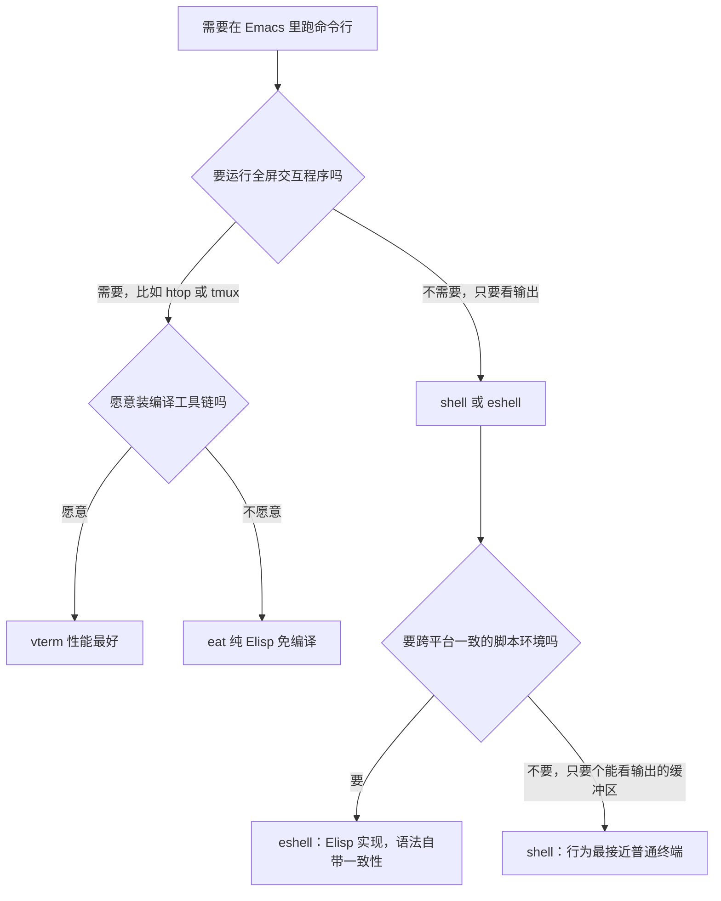
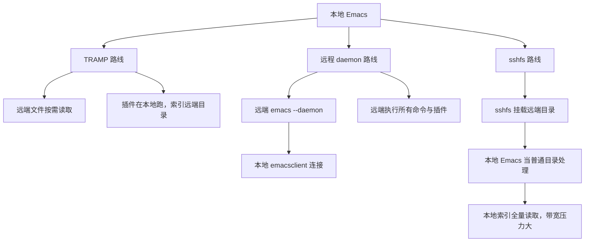

# 终端、Shell 与远程开发

> 本篇解决「在 Emacs 里怎么开终端、怎么在本地编辑远端机器上的代码」这两个问题：把 eshell、vterm、eat、term 四种方案的差别讲清楚，把 TRAMP、远程 daemon、sshfs、容器四条远程路线讲透。读者需要已经会基本的 shell 操作与 SSH 登录。

---

## 一、方案对比与选择

Emacs 里能在「Emacs 缓冲区里」运行 shell 的方案有六种，它们在实现原理上分成三类，理解分类比背参数更重要。

| 方案 | 实现方式 | 是否真 TTY | 全屏程序 | 性能 | 跨平台 | 安装难度 |
| --- | --- | --- | --- | --- | --- | --- |
| `shell` | 用 comint 与子进程通信，缓冲区即输出 | 否 | 不支持 | 中 | 三平台一致 | 内置 |
| `term` / `ansi-term` | 内置的终端模拟器，自己解析转义序列 | 是 | 基本支持 | 中偏下 | 三平台一致 | 内置 |
| `eshell` | 纯 Elisp 实现的 shell，不启动子 shell 也能工作 | 否 | 不支持（可转交 term） | 启动最快，重负载最慢 | 三平台一致 | 内置 |
| `vterm` | 通过动态模块调用 libvterm（C 库） | 是 | 支持 | 最好 | 需编译，Windows 需 MSYS2 工具链 | 需要编译环境 |
| `eat` | 纯 Elisp 的终端模拟器，逐字符解析 | 是 | 支持 | 良好 | 三平台一致，无需编译 | 装包即可 |
| `multi-vterm` | 在 vterm 之上管理多个终端缓冲区 | 继承 vterm | 继承 vterm | 继承 vterm | 继承 vterm | 装包即可 |

选择可以参考下面的决策路径：



一句话结论：**eshell 适合当日常的命令入口与目录导航工具，vterm 或 eat 适合需要 TTY 的交互程序（REPL、调试器 TUI、编辑器），shell 适合只想把命令输出放进缓冲区的场景。** term 与 ansi-term 属于历史遗留方案，除非有特殊理由，不必再选它们。

为了让「是否真 TTY」这一列不显得抽象，举三个具体的判断例子。第一，运行 `git commit` 而不带 `-m` 时，Git 需要一个编辑器：在 `shell` 缓冲区里它会直接失败或退化成在终端里等待，在 vterm 与 eat 里则正常打开编辑器（如果配置了 `core.editor`，打开的是 `emacsclient`）。第二，运行 `python` 进入交互式解释器时，`shell` 缓冲区里的方向键与历史（readline 功能）大体会失效，因为 readline 需要一个终端来查询终端能力；vterm 与 eat 里一切正常。第三，运行 `htop`、`vim`、`tmux` 时，非 TTY 方案会打印一堆转义序列或直接报错。

反过来，**不需要 TTY 的场景不要硬上终端模拟器**。查看 `git log`、跑一次测试、看编译输出、执行 `ls`/`find`/`grep`，这些只需要一个能显示文本、能点击跳转的缓冲区。用 vterm 跑这类命令的唯一后果是把输出变成难以复制的终端画面，还得额外按 `C-c C-t` 才能选中文本。习惯性地给每件事都开一个 vterm，是新手最常见的低效来源之一。

还有一个容易被忽略的维度是**输出的持久性**。`shell`、`eshell`、`term`、`vterm`、`eat` 的输出都留在缓冲区里，可以被搜索、被导出、被 diff；命令行的 `M-x compile` 与 `M-x shell-command` 也各自有独立的输出缓冲区（分别是 `*compilation*` 与 `*Shell Command Output*`），它们的优势是可以直接在输出上按 `RET` 跳到出错位置。因此「运行一次编译并定位错误」用 `M-x compile` 比在任何终端里跑 `make` 都更合适，这也是后面几篇要展开的内容。

---

## 二、eshell 详解

### 2.1 它到底是什么

eshell 不是「Emacs 里的 bash」，而是**用 Elisp 写的一个 shell**：命令解析、通配符展开、管道、重定向、变量替换全部由 Elisp 实现，只有真正需要执行外部程序时才创建子进程。这一点决定了它的全部特性：

- 不读取 `.bashrc`、不依赖 bash 存在，Windows 上不需要 MSYS2 也能用，三平台行为一致。
- 命令解析结果是一个 Elisp 对象（命令列表），因此可以在解析与执行之间插入 Lisp 逻辑。
- 名字解析顺序是先找 eshell 内置命令（`eshell/cd` 之类），再找别名，再找 Lisp 函数，最后才去找外部程序。这意味着 `ls` 在 eshell 里默认跑的是 eshell 自己的实现，而不是 `/bin/ls`。
- 因为它不是进程，所以 `C-c C-c` 之类的「终端控制字符」语义与真实终端不同，`top`、`vim` 这类需要 TTY 的程序要额外处理。

### 2.2 与 bash 的差异

| 场景 | bash | eshell |
| --- | --- | --- |
| 变量赋值 | `FOO=bar` | `setq FOO "bar"` 或 `export FOO=bar` |
| 引用变量 | `$FOO`、`${FOO}` | `$FOO`、`${FOO}`，另支持 `${FOO:u}` 之类的修饰符做大小写转换 |
| 命令替换 | `$(cmd)`、反引号 | `$(cmd)` |
| 求值 Elisp | 不支持 | 直接写 Lisp 形式，例如 `(+ 1 2)`、`(buffer-name)` |
| 管道 | 进程间管道 | 先尝试用 Elisp 实现（例如 `ls | grep x` 可能完全在 Emacs 内完成） |
| 重定向 | `>`、`>>`、`2>` | 支持 `>`、`>>`，与 Elisp 结合时可写 `>(...)` 把输出交给 Lisp |
| 通配符 | 由 bash 展开 | 由 eshell 自己展开，支持 `**` 递归匹配子目录 |
| 逻辑连接 | `&&`、`||` | 支持 `&&`、`||` |
| 别名定义 | `alias ll='ls -l'` | `alias ll 'ls -l $*'`（定义写进别名文件） |
| 脚本 | `.sh` 由 bash 解释 | 直接执行 `.sh` 也可以，但控制流语法要用 eshell 的写法或调用 bash |
| 后台任务 | `cmd &` | `cmd &` 支持，用 `eshell-list-processes` 查看 |

最重要的差别是最后两行体现的思路：eshell **不追求兼容 POSIX shell**，因此复杂脚本不要指望在 eshell 里跑通；它追求的是交互式使用的顺滑与可编程性。

### 2.3 常用内置命令

eshell 自己实现了一批常用命令，它们不依赖外部程序，因此在 Windows 上也能用：`cd`、`ls`、`pwd`、`echo`、`alias`、`export`、`source`、`which`、`clear`、`history`、`kill`、`listify` 等。其中几个值得单独说明：

- `cd -` 回到上一个目录；`cd =/` 跳到项目根目录（`=` 是 eshell 的「项目根」快捷写法）；`cd ~/src/xxx` 与 bash 一致。
- `ls` 是 eshell 的实现，支持 `-l`、`-a`、`-h`、`-R` 等常用选项，在远程目录上也能用（因为它是 Elisp 实现的，走 TRAMP）。
- `which ls` 会告诉你这个名字最终解析到什么：是内置命令、别名、Lisp 函数还是外部程序。排错时非常好用。
- `clear` 清屏，等价于 `eshell/clear`。
- `export VAR=value` 设置环境变量；也可以用 `setq` 直接给 Elisp 变量赋值，但只有 `export` 才会传给外部进程。

### 2.4 管道、重定向与通配

管道在 eshell 里的行为与 bash 不同：**只要管道两侧都是 eshell 能处理的对象，就不会创建任何子进程**。例如

```bash
# 这一行可能完全在 Emacs 内完成，不启动 cat 与 grep
$ cat file.txt | grep keyword
# 输出重定向把人写进文件
$ echo hello > /tmp/a.txt
# 追加
$ echo world >> /tmp/a.txt
```

eshell 的重定向还支持把结果交给 Elisp 处理，例如把某个命令输出插入当前缓冲区。通配符由 eshell 展开，`**` 表示递归匹配：

```bash
# 列出当前目录及其所有子目录下的 .el 文件
$ ls **/*.el
# 通配符没有匹配到任何东西时 eshell 会报错，这是它比 bash 更严格的地方
```

判断「这条命令到底跑的是内置实现还是外部程序」，用 `which` 看；判断「管道是否创建了子进程」，看 `M-x eshell-list-processes` 或用 `M-x list-processes`。

### 2.5 别名

eshell 的别名与 bash 的写法不同：**参数占位用 `$*`，整个定义用单引号包住**。定义方式有两种。

第一种，在 eshell 里直接敲：

```bash
$ alias ll 'ls -l $*'
$ alias gs 'git status'
$ alias .. 'cd ..'
```

这些别名会被写进别名文件，下次启动仍然有效。别名文件的位置由 `eshell-aliases-file` 决定，默认是 `~/.emacs.d/eshell/alias`（在 `~/.config/emacs/` 布局下对应那个目录下的 `eshell/alias`）。文件内容是纯文本，可以直接编辑：

```text
alias ll 'ls -lh $*'
alias la 'ls -lah $*'
alias gs 'git status -sb'
alias gd 'git diff $*'
alias .. 'cd ..'
alias ... 'cd ../..'
```

第二种，在 init.el 里用 Lisp 定义，适合把别名和配置放在一起管理：

```elisp
;; 用 Elisp 定义别名，效果与在 eshell 里敲 alias 相同
(defun my-eshell-aliases ()
  "在 eshell 启动时补齐常用别名。"
  (eshell/alias "ll" "ls -lh $*")
  (eshell/alias "gs" "git status -sb")
  (eshell/alias "gd" "git diff $*"))

;; eshell 第一次启动时执行；eshell 的启动钩子叫 eshell-mode-hook
(add-hook 'eshell-mode-hook #'my-eshell-aliases)
```

注意 `eshell/alias` 的第二个参数是定义字符串，不是参数列表，因此 `$*` 要写在字符串里。

### 2.6 在 eshell 里求值 Elisp

这是 eshell 相对其它 shell 最大的优势。规则很简单：**行的第一个词如果是一个 Lisp 形式，eshell 就把它当 Elisp 求值**。

```bash
# 直接把 Elisp 结果打印出来
$ (+ 1 2)
3
# 用 Elisp 生成一个路径再交给外部命令
$ ls (expand-file-name "~/src")
# 把当前缓冲区的文件名插入命令行
$ cat (buffer-file-name)
# 命令替换：把外部命令的输出作为 Elisp 能处理的文本
$ echo $(date +%Y)
```

也可以反过来：在任意 Elisp 代码里调用 eshell 执行命令并取回结果，这在写自定义命令时很有用：

```elisp
;; 执行一条 eshell 命令并把结果作为字符串返回，不切换到 eshell 缓冲区
(eshell-command-result "git rev-parse --short HEAD")
;; 执行并在当前窗口打开 eshell 缓冲区显示过程
;; M-x eshell-command RET git log --oneline -5 RET
```

### 2.7 目录导航与 TRAMP 的结合

eshell 的 `cd` 接受 TRAMP 路径，因此可以**先 cd 进远程目录，再在远程机器上执行命令**：

```bash
# 进入远程机器的项目目录；第一次连接会提示保存主机指纹
$ cd /ssh:user@server:/srv/app
# 之后的 ls、grep、git 都在远端执行，输出回到本地缓冲区
$ ls -l
$ git status
# 回到本地目录
$ cd ~/
```

这一点让 eshell 成为「远程维护」的顺手工具：不需要额外开 ssh 会话，命令历史、输出、复制粘贴都在 Emacs 里。代价是每次命令都要经过 TRAMP 的通道，交互式程序（需要 TTY 的）不要这样跑。

### 2.8 性能上限与适用场景

eshell 的性能瓶颈有两处：一是 Elisp 实现的 `ls`、`grep` 在目录很大或输出很多时比原生命令慢；二是它把所有输出都塞进 Emacs 缓冲区，几十兆的输出会让 Emacs 明显卡顿（`shell` 与 `term` 也有同样问题）。

因此 eshell 的合适场景是：日常的目录切换、文件操作、Git 命令、编译与测试、管道短输出。不合适的场景是：`find /` 全盘扫描、编译大型项目并输出几十万行日志、需要 curses 界面（`top`、`htop`、`vim`）的交互程序。后两类请用 vterm 或 eat，把输出量大的命令改成写文件再查看。

---

## 三、vterm

### 3.1 安装与依赖

`vterm` 包本身只是 Elisp 包装，真正的终端模拟由一个 C 动态模块（`vterm-module.so` / `.dylib` / `.dll`）完成，因此首次安装需要编译。依赖三样：`cmake`、`libtool`（或系统等价物）、以及 libvterm 源码（包内会自动下载，也可以指向本地副本）。

GNU/Linux（Debian/Ubuntu）：

```bash
# 安装编译依赖，然后让包管理器自己编译
$ sudo apt install cmake libtool libtool-bin build-essential
# 在 Emacs 里执行：
# M-x package-install RET vterm RET
# 安装脚本会自动下载并编译 libvterm
```

Arch 与衍生版：

```bash
$ sudo pacman -S cmake libtool base-devel
# 其余同上；AUR 里也有 emacs-vterm 之类的包，但要留意版本滞后
```

macOS（Homebrew）：

```bash
$ brew install cmake libtool
# 关键一步：让编译脚本能找到 glibtool，Homebrew 下它的名字带 g 前缀
$ export PATH="/opt/homebrew/opt/libtool/bin:$PATH"
# 然后 M-x package-install RET vterm RET
```

Windows：官方推荐用 MSYS2 提供 gcc、cmake、libtool 工具链，并且**必须使用与 Emacs 同架构的工具链**（64 位 Emacs 配 mingw64）。大致步骤如下：

```powershell
# 在 MSYS2 MINGW64 终端里安装工具链
$ pacman -S mingw-w64-x86_64-toolchain mingw-w64-x86_64-cmake
# 把 C:\msys64\mingw64\bin 加到 Windows 的 PATH 里，然后重启 Emacs
# 在 Emacs 里检查编译工具是否可见
# M-x getenv RET PATH RET
# 再执行 M-x package-install RET vterm RET
```

如果编译反复失败，不必死磕：Windows 上可以直接用 eat，或者走 WSL 在 Linux 侧安装 Emacs。验证安装是否成功的方法是在 `*scratch*` 里执行 `(require 'vterm)`，没有报错并且 `M-x vterm` 能开出终端缓冲区，就说明动态模块加载正常。

### 3.2 键位与使用

vterm 把绝大多数按键直接送给终端程序（它把所有会触发 `self-insert-command` 的键重映射到 `vterm--self-insert`），因此你在 vterm 里的按键行为与真实终端一致。留给 Emacs 的键位如下：

| 键位 | 命令 | 作用 |
| --- | --- | --- |
| `C-c C-t` | `vterm-copy-mode` | 进入 / 退出复制模式 |
| `C-c C-c` | `vterm--self-insert` | 把 `C-c` 本身送给终端程序（中断当前命令） |
| `C-c C-l` | `vterm-clear-scrollback` | 清空回滚历史 |
| `C-l` | `vterm-clear` | 清屏 |
| `C-c C-r` | `vterm-reset-cursor-point` | 复位光标位置（画面错乱时用） |
| `C-c C-n` / `C-c C-p` | `vterm-next-prompt` / `vterm-previous-prompt` | 跳到下一个 / 上一个提示符 |
| `TAB` | `vterm-send-tab` | 把 TAB 送给终端（补全） |
| `DEL` | `vterm-send-backspace` | 退格 |
| `RET` | `vterm-send-return` | 回车 |

复制模式（`vterm-copy-mode`）是 vterm 的关键设计：进入后按键恢复成 Emacs 语义，可以直接用 `C-SPC` 选区域、`M-w` 复制、`C-s` 搜索回滚历史：

| 键位（复制模式内） | 作用 |
| --- | --- |
| `RET` | 把选中的区域（或当前整行）复制到 kill ring 并退出复制模式 |
| `C-a` / `C-e` | 行首 / 行尾 |
| `C-c C-n` / `C-c C-p` | 下一条 / 上一条提示符 |
| `C-c C-t` | 退出复制模式 |

想在 vterm 里跑 Vim、htop、tmux，把 `vim`、`htop`、`tmux`、`less` 之类加到 `vterm-environment` 或相关配置中，**不需要额外设置**：vterm 提供真正的 TTY，这些程序可以直接运行。需要注意的是 Emacs 与 tmux 都抢 `C-b` 一类的键；如果键位冲突，进入复制模式或把终端程序的键位改掉。

性能方面，vterm 是这些方案里最好的，跑 `htop` 流畅，`yes` 之类的刷屏命令也不会把 Emacs 卡死（仍有刷新上限，由 libvterm 的渲染节流控制）。

### 3.3 管理多个终端：multi-vterm

`vterm` 本身每次 `M-x vterm` 都会新建一个缓冲区，缓冲区多了不好管理。`multi-vterm` 在它之上提供了编号管理与项目感知：

```elisp
(use-package multi-vterm
  :ensure t
  :after vterm
  :bind (("C-c t n" . multi-vterm)               ; 新建一个终端缓冲区
         ("C-c t p" . multi-vterm-project)       ; 在当前项目根目录新建终端
         ("C-c t [" . multi-vterm-prev)          ; 切到上一个终端
         ("C-c t ]" . multi-vterm-next)          ; 切到下一个终端
         ("C-c t t" . multi-vterm-dedicated-toggle))) ; 弹出 / 收起专用终端窗口
```

---

## 四、eat：纯 Elisp 的终端模拟器

`eat`（Emacs Terminal）是 akib 写的纯 Elisp 终端模拟器，托管在 Codeberg：https://codeberg.org/akib/emacs-eat 。它的价值在于**不需要编译、不需要外部库**，把包装上就能用，同时提供真正的 TTY，能跑全屏程序。

安装方式与普通包一样：加入 MELPA 或 NonGNU ELPA 后 `M-x package-install RET eat RET`。它以源码方式安装时依赖 `compat`，包管理器会自动处理。

eat 有三种输入模式，理解它们是使用 eat 的关键：

| 模式 | 进入方式 | 行为 |
| --- | --- | --- |
| semi-char 模式 | `M-x eat-semi-char-mode`，默认进入 | 大部分按键送给终端，同时保留一部分 Emacs 前缀键 |
| char 模式 | `M-x eat-char-mode` | 几乎全部按键送给终端，退出用 `C-M-m` 回到 semi-char |
| line 模式 | `M-x eat-line-mode` | 用 Emacs 的行编辑方式输入，`RET` 才把整行发送 |

line 模式下的键位是 Emacs 风格的，适合在慢速连接或远程 shell 上输入：

| 键位（line 模式） | 作用 |
| --- | --- |
| `RET` | 把当前行发送给 shell |
| `C-c C-c` | 发送中断信号 |
| `C-c C-e` | 退出 line 模式，回到 Emacs 模式 |
| `M-p` / `M-n` | 上一条 / 下一条历史命令 |
| `TAB` | 补全（补全候选由 eat 自己的机制提供） |
| `C-c C-r` | 在历史中搜索匹配的输入 |

想知道某个键在当前 eat 缓冲区里到底被谁处理，在 eat 缓冲区里按 `C-h k` 再按那个键，`:describe-key` 会告诉你绑定来源；按 `C-h m` 可以看到当前模式的完整说明。

与 vterm 的取舍：

- 不想装编译工具链，或者要在 Windows 与容器里保持配置可移植，选 eat。
- 追求极限性能（大量滚屏输出、`htop` 每秒刷新），选 vterm。
- 两者可以共存，键位与配置互不干扰；用 `eat-eshell-mode` 还能让 eshell 里启动的可视化程序（`vim`、`less` 等）自动改用 eat 缓冲区。

---

## 五、term 与 ansi-term 的现状

`term`（以及历史别名 `ansi-term`、`multi-term`）是 Emacs 内置的终端模拟器，不需要任何安装。它今天仍然可用，但推荐度不高，原因具体如下：

- **字符编码与显示**：term 自己处理转义序列，对现代终端特性（真彩色、鼠标上报、括号粘贴、宽字符对齐）支持不完整，中文与 emoji 的对齐经常出问题（emoji 在本仓库的写作规范里不出现，这里只是说明现象）。
- **键位冲突多**：term 用 `C-c` 作为自己的前缀，导致很多终端程序的组合键被 Emacs 截获，需要手动让键。
- **性能一般**：逐字符处理加上 Emacs 缓冲区的文本属性开销，在大量输出时明显卡顿。
- **维护状态**：Emacs 内置，会跟着 Emacs 一起修 bug，但不会新增现代终端特性。

如果一定要用，记住它在两种子模式之间切换的键位（这两个键位在 `term-raw-map` 与 `term-mode-map` 上都一致，可以直接用 `C-h k` 验证）：

| 键位 | 命令 | 作用 |
| --- | --- | --- |
| `C-c C-j` | `term-line-mode` | 切到行模式，按键按 Emacs 语义处理，适合复制与编辑 |
| `C-c C-k` | `term-char-mode` | 切回字符模式，按键原样送给终端程序 |
| `C-c C-c` | `term-interrupt-subjob` | 在行模式下发送中断 |

`ansi-term` 与 `term` 是同一个实现的不同入口，`M-x ansi-term` 会先询问要运行哪个 shell。它不是「更好的 term」，只是历史命名。

---

## 六、终端缓冲区里的键位冲突

把终端放进 Emacs，必然要面对「这个键该给谁」的问题。规则可以归纳成三条。

**第一，前缀键优先被 Emacs 拿走。** `C-c`、`C-x`、`C-h`、`M-x` 在 Emacs 里是前缀，在终端里却可能是控制字符（`C-c` 是中断，`C-x` 在 readline 里是前缀，`C-h` 是退格）。不同方案的处理方式不同：

- `shell`（comint）默认把 `C-c` 当自己的前缀，想发中断用 `C-c C-c`（`comint-interrupt-subjob`）。
- `term` 用 `C-c C-j` / `C-c C-k` 在「Emacs 处理键」与「终端处理键」之间切换；想直接把某个 `C-c` 组合键送给终端，可以在字符模式下按，或者修改 `term-raw-map` 让出键位。
- `vterm` 与现代终端一致，除了少数几个 `C-c C-` 组合，几乎全部送给终端，因此 `C-c C-c` 就是给终端发中断。
- `eat` 在 semi-char 模式下保留一部分前缀给 Emacs，需要全权交出时切到 char 模式。

**第二，`M-x` 在终端里通常还能用。** vterm 与 eat 的键映射都没有占用 `M-x`，因此可以在终端缓冲区里直接 `M-x` 执行 Emacs 命令（例如 `M-x vterm-copy-mode`）。真正受限的是那些被终端程序截获的键：例如在 tmux 里 `C-b` 被 tmux 拿走，在 readline 程序里 `C-r` 被 readline 拿走。当 `M-x` 确实不可用时（少数把 meta 键吞掉的程序），可以用 `ESC` 再按 `x` 的序列代替，因为 `ESC x` 与 `M-x` 等价；也可以先切到复制模式或行模式再发命令。

**第三，几个特殊组合键的坑。** `C-/` 与 `C-_` 在多数终端里是同一个控制字符（`C-_` 即 0x1F），Emacs 把它们都当作 `undo`。在终端缓冲区里想发 `C-_` 给远端程序，需要用 `C-c C-_` 之类的转义绑定，或者把该键从 Emacs 的映射里让出来。`C-g` 的问题在下一节。

---

## 七、在 Emacs 里运行 Vim 与其它 TUI 程序

**这完全可行，而且不特殊**：vterm 与 eat 提供的是真 TTY，`vim`、`nvim`、`htop`、`tmux`、`less`、`lazygit` 在这些终端缓冲区里就是普通程序，它们不知道自己跑在 Emacs 里。

需要接受的取舍：

- `C-g` 在终端缓冲区里会被送给终端程序，因此用 `C-g` 取消 Emacs 命令可能失效；反过来，在 vim 里按 `C-g` 是 vim 的行为。想取消 Emacs 命令，先退出终端程序的捕获范围（切复制模式），或者把 `C-g` 重新绑到 `keyboard-quit`（不推荐，会破坏终端语义）。
- 嵌套编辑器容易让人迷失方向：在 Emacs 里开终端、终端里开 vim，同一份文件可能同时被 Emacs 缓冲区与 vim 缓冲区打开。做 Git 操作、格式化这类会改文件的事情时，注意别让两边的版本互相覆盖。
- 如果只是想复用 vim 的键位思路而不是 vim 本身，更彻底的做法是用 Evil（https://github.com/emacs-evil/evil ）让 Emacs 支持 vim 的模态编辑，具体迁移路径参见 [[emacs教程/1入门/05_从Vim迁移|从 Vim 迁移]]。

因此正确的说法是：在 Emacs 里运行 vim 是「可以」而不是「推荐」。它适合偶发场景（临时用某个只有 vim 插件的工具、维护远端机器），不适合当日常编辑方式。

---

## 八、远程开发方案对比

把「本地编辑、远端运行」做起来有四条主流路线，它们在「文件在哪」「进程在哪」「网络断了会怎样」三个维度上完全不同：

| 方案 | 文件位置 | 执行位置 | 断线后 | 适用场景 | 主要代价 |
| --- | --- | --- | --- | --- | --- |
| TRAMP | 远端，按需读写 | 远端（通过 `M-x compile` 等） | 缓冲区的本地副本仍在，重连即可 | 改配置、看日志、小规模改代码 | 每个文件操作都有网络往返，大规模索引类插件会卡死 |
| 远程 daemon 加 emacsclient | 远端 | 远端 | 远端 daemon 里的状态保留，重连继续 | 长时间在远端机器上开发 | 需要配置服务器文件或端口转发，剪贴板与图形界面受限 |
| sshfs 挂载 | 远端挂载为本地路径 | 本地 | 挂载点可能挂住 | 让不认 TRAMP 的工具也能处理远端文件 | 断线时访问挂载点会阻塞整个进程 |
| 容器内开发（devcontainer） | 容器卷 | 容器 | 取决于容器生命周期 | 环境隔离、依赖复杂的项目 | 需要额外配置与镜像构建 |
| VS Code Remote 对照 | 远端 | 远端 | 依赖重连机制 | 不适用：它是 VS Code 的方案 | Emacs 没有等价的一体化实现，需要自己组合上面的方案 |



选型经验：**轻量远程编辑用 TRAMP，长期驻留开发用远程 daemon，需要本地工具链处理远端文件才考虑 sshfs，环境复杂且要求可复现时用容器。**

---

## 九、TRAMP 快速上手

TRAMP 是 Emacs 内置的透明远程访问框架，语法是 `/方法:用户@主机:路径`。它支持的方法可以用 `M-x tramp-methods` 之类的接口查看，常用的有 `ssh`、`sudo`、`docker`、`podman`、`sshfs`、`rclone` 等。

### 9.1 基本用法

```text
# 打开远端文件：C-x C-f 然后输入
/ssh:user@server:/srv/app/main.c
# 用 sudo 编辑本地系统文件（第二个冒号前留空表示用 root）
/sudo::/etc/hosts
# 多跳：先 ssh 到跳板机，再从跳板机 ssh 到目标机
/ssh:jump-host|ssh:target-host:/data/log.txt
# 打开远端目录，用 dired 浏览
/ssh:user@server:/srv/app/
```

这些语法都可以用 `M-x tramp-dissect-file-name` 验证：传入字符串会返回解析出的方法、用户、主机等字段，用来排查「为什么连不上」非常直观。

`C-x C-f` 打开远端文件之后，编辑体验与本地一致：保存时写回远端，语法高亮、补全、格式化（走本地配置）照常工作。**变慢的根源在于本地插件把远端目录当成本地目录来扫描**：LSP、projectile、ripgrep 之类会发出成百上千次文件访问，每次都是一个网络往返。

### 9.2 让哪些东西在远程目录上闭嘴

在远程路径上应该关掉的东西：

```elisp
;; 远程目录下不要启动 LSP：eglot/lsp-mode 的连接本来就该指向远端服务器，
;; 而本地启动的语言服务器去读 TRAMP 路径只会卡死
(defun my-remote-path-p ()
  "判断当前缓冲区的文件名是否是 TRAMP 远程路径。"
  (and buffer-file-name (file-remote-p buffer-file-name)))

;; 远程目录下不自动启用需要全量扫描的插件
(add-hook 'prog-mode-hook
          (lambda ()
            (when (my-remote-path-p)
              (when (bound-and-true-p eglot--managed-mode) (eglot-shutdown))
              (when (bound-and-true-p flymake-mode) (flymake-mode -1)))))
```

项目级插件（projectile、project.el 的索引、`consult-ripgrep`）在远程目录上要么禁用，要么改成使用远端的 `find`/`rg`。`project.el` 在 TRAMP 上部分命令会通过远端执行，行为比本地索引友好一些，但仍然不适合超大目录树。

### 9.3 在远端编译与运行

TRAMP 支持在远端目录里执行编译命令：在远端文件的缓冲区里执行 `M-x compile`，输入的命令会在远端机器上运行（帧的默认目录是远端目录，TRAMP 会把过程与输出通道都放在远端），错误输出可以点击跳到远端文件的对应行。`M-x shell` 在远端目录里启动的 shell 也会跑在远端——这是 TRAMP 提供的一个很实用的补充。

### 9.4 性能建议与常用变量

- `tramp-verbose`：默认值较低。排查问题时设为 6 或 10 会写出详细的调试日志（日志缓冲区名以 `*tramp/` 开头），确认问题后再改回小数值。
- `tramp-use-connection-share`：控制是否复用 SSH 连接（即 ControlMaster）。复用能显著减少重复连接的开销，但某些服务器配置下会报错，出问题时可以先关掉它判断。
- `tramp-connection-timeout`：连接超时秒数，网络不稳定时可以适当调大。
- `tramp-persistency-file-name`：连接信息的持久化文件，删掉它可以强制忘记历史连接（排查「一直连到旧地址」时有用）。
- `tramp-cleanup-connection` / `tramp-cleanup-all-connections` / `tramp-cleanup-all-buffers`：清理连接与相关缓冲区。
- SSH config 里给目标主机加 `ControlMaster auto` 与 `ControlPath`，让 ssh 自己复用连接，是最省事的加速手段，且对 TRAMP 与命令行 `ssh` 同时生效：

```text
# ~/.ssh/config
Host devbox
    HostName 203.0.113.10
    User alice
    ControlMaster auto
    ControlPath ~/.ssh/cm-%r@%h:%p
    ControlPersist 10m
```

TRAMP 的完整配置、方法与故障排查参见 [[emacs教程/7进阶/03_TRAMP远程开发|TRAMP 远程开发]]。

---

## 十、远程 daemon 方案

当你要在一台远端机器上长期开发时，TRAMP 的每次往返都会变成负担，更好的做法是**在远端运行一个 Emacs 守护进程，本地只当显示终端**。这时文件、插件、编译、LSP 全部在远端，本地只负责显示与输入。

### 10.1 基本步骤

远端机器上启动守护进程：

```bash
# 启动守护进程（--daemon 后台化；--fg-daemon 前台运行，便于 systemd 管理）
$ emacs --daemon=work
# 确认是否在运行
$ emacsclient -s work -e '(emacs-pid)'
```

本地连接有两种方式。

**终端客户端**：`emacsclient` 的 `-t` 选项在当前终端里开一个文本框架（frame）：

```bash
# -t 表示在当前终端打开，-s 指定 server 名，-n 表示不等待编辑结束立刻返回
$ ssh -t devbox 'emacsclient -s work -t ~/src/app/main.c'
```

**图形客户端**：`-c` 会新建一个图形框架。如果本地能访问远端 X11 显示，用 `ssh -X` 转发即可；在 macOS 与 Windows 上更常见的做法是走 TCP server 加端口转发：

```bash
# 远端：允许 TCP 方式启动 server，并把 server 文件写到固定位置
# 在远端 init.el 里设置： (setq server-use-tcp t)
$ emacs --daemon=work
# 本地：建立 SSH 隧道，把远端的 12345 端口映射到本地同名端口
$ ssh -N -L 12345:127.0.0.1:12345 devbox
# 把远端 ~/.emacs.d/server/work 文件复制到本地同一路径后：
$ emacsclient -f ~/.emacs.d/server/work -c ~/src/app/main.c
```

`server-use-tcp` 与 `server-port` 都是真实存在的变量：前者为 `nil` 时使用本地 socket（默认 `server-socket-dir`，一般是 `/run/user/<uid>/emacs`），为 `t` 时使用 TCP，端口默认从 12345 起自动选择。使用 TCP 时 server 文件里记录着主机与端口，因此本地与远端的路径要能对应上。

### 10.2 用 systemd 用户服务托管

在远端（Linux）把 daemon 交给 systemd 管理，可以做到登录即启动、崩溃自动重启：

```ini
# 保存为 ~/.config/systemd/user/emacs.service
[Unit]
Description=Emacs text editor daemon
Documentation=info:emacs man:emacs(1) https://www.gnu.org/software/emacs/

[Service]
Type=notify
ExecStart=/usr/bin/emacs --fg-daemon=work
ExecStop=/usr/bin/emacsclient -s work --eval "(kill-emacs)"
Environment=SSH_AUTH_SOCK=%t/ssh-agent.socket
# 让服务在用户注销后继续运行（需要管理员开启 lingering）
Restart=on-failure

[Install]
WantedBy=default.target
```

```bash
# 启用并启动，查看状态
$ systemctl --user daemon-reload
$ systemctl --user enable --now emacs.service
$ systemctl --user status emacs.service
# 若要允许用户注销后服务继续运行
$ sudo loginctl enable-linger $USER
```

注意 `Type=notify` 要求 Emacs 以 `--fg-daemon` 运行并支持 sd_notify（Emacs 29 起支持 systemd 通知，若你的发行版编译时未启用，把 `Type` 改成 `simple` 即可）。

### 10.3 断线重连与 server 的关系

远程 daemon 方案最吸引人的一点是**状态存活在远端**：SSH 断了、本地 Emacs 关了，远端的缓冲区、undo 历史、进程都还在，重新 `emacsclient` 连接回去就能继续。相比之下，本地跑的 `(server-start)` 只是在同一台机器上为 `emacsclient` 提供入口，解决的是「不要重复启动 Emacs」的问题，不涉及跨机器。

两者的共同点是：都靠 server 文件（或 TCP 端口）作为连接凭据。因此排查连接问题时，先确认 server 是否在跑、server 文件在哪、凭据是否对得上：

```elisp
;; 查看 server 相关配置：socket 目录、server 名、是否使用 TCP
(require 'server)
(list server-name server-socket-dir server-use-tcp server-port)
```

---

## 十一、容器内开发

TRAMP 可以直接进入容器，方法是把 `docker` 或 `podman` 作为 TRAMP 方法（这两个方法名都真实存在）：

```text
# 进入名为 app-dev 的容器，浏览其文件系统
/docker:app-dev:/srv/app
# 以 root 身份进入（用户名写在 @ 之前）
/docker:root@app-dev:/etc/nginx/nginx.conf
# Podman 同理
/podman:app-dev:/srv/app
```

前提是本地装了 docker 或 podman 命令行且当前用户有权限（通常要求加入 `docker` 组或使用 rootless podman），TRAMP 会通过 `docker exec` 在容器里执行文件操作。用 `M-x tramp-dissect-file-name` 传入上面的路径可以确认方法解析正确。

两条实用建议：

- 打开容器里的文件后，本地插件同样会因为「每个文件操作走一次 `docker exec`」而变慢，处理原则与 TRAMP over SSH 相同。
- 需要长期在容器里开发时，更彻底的方案是**在容器里跑一个 Emacs daemon**，然后按上一节的方式从本地连接。容器镜像里要装好 Emacs 与依赖，并把 `~/.emacs.d` 通过卷挂载进去。这样编译、LSP、测试都发生在容器内，本地只做显示，环境一致性最好。

与容器编排相关的更多内容参见 [[docker/README|Docker 教程]]，devcontainer 的规范说明见 https://containers.dev/ 。

---

## 十二、完整配置块

下面这段配置把 eshell、vterm、shell-pop 弹窗终端、TRAMP 优化组织成一个模块，可以直接抄进 init.el 后按需删减。

```elisp
;;; ---------- eshell：别名、提示符与历史 ----------
(use-package eshell
  :ensure nil                            ; 内置，不需要安装
  :custom
  (eshell-hist-ignoredups t)             ; 历史里不重复记录同一条命令
  (eshell-scroll-to-bottom-on-input 'this) ; 输入时把光标带到缓冲区底部
  (eshell-save-history-on-exit t)        ; 退出时保存历史
  (eshell-list-files-after-cd t)         ; cd 之后自动列出目录内容
  :config
  ;; 常用别名：等价于往 ~/.emacs.d/eshell/alias 里写 alias 行
  (defun my-eshell-setup-aliases ()
    "为 eshell 定义常用别名。"
    (eshell/alias "ll" "ls -lh $*")
    (eshell/alias "la" "ls -lah $*")
    (eshell/alias "gs" "git status -sb")
    (eshell/alias "gd" "git diff $*")
    (eshell/alias ".." "cd .."))
  (add-hook 'eshell-mode-hook #'my-eshell-setup-aliases))

;;; ---------- vterm：终端模拟器 ----------
(use-package vterm
  :ensure t
  :commands vterm
  :custom
  (vterm-max-scrollback 10000)           ; 回滚历史行数，太大占内存
  (vterm-shell (or (getenv "SHELL") "/bin/bash"))
  (vterm-kill-buffer-on-exit t))         ; shell 退出后自动关掉缓冲区

(use-package multi-vterm
  :ensure t
  :after vterm
  :bind (("C-c t n" . multi-vterm)
         ("C-c t p" . multi-vterm-project)
         ("C-c t [" . multi-vterm-prev)
         ("C-c t ]" . multi-vterm-next)))

;;; ---------- shell-pop：一个键弹出 / 收起终端 ----------
(use-package shell-pop
  :ensure t
  :bind (("C-`" . shell-pop))            ; 也可以设置 shell-pop-universal-key
  :custom
  ;; 三元组：模式名、缓冲区名、启动函数。这里用自带 vterm 的实现
  (shell-pop-shell-type '("vterm" "*vterm*" (lambda () (vterm))))
  (shell-pop-window-size 30)             ; 弹出窗口占 30 行（或 30%）
  (shell-pop-window-position "bottom")   ; 从底部弹出
  (shell-pop-full-span t)                ; 占满整个宽度
  (shell-pop-autocd-to-working-dir t))   ; 弹出时自动 cd 到当前文件所在目录

;;; ---------- TRAMP：连接与性能 ----------
(use-package tramp
  :ensure nil                            ; 内置
  :custom
  (tramp-verbose 1)                      ; 平时保持低日志级别，排查时临时调到 6 或 10
  (tramp-connection-timeout 10)
  (tramp-use-connection-share 't)        ; 复用 SSH 连接（Emacs 30 起的行为开关）
  (remote-file-name-inhibit-locks t)     ; 远程文件不加锁，避免每次保存都往返
  (remote-file-name-inhibit-auto-save-visited t)
  (tramp-default-method "ssh")           ; 省略方法名时默认用 ssh
  :config
  ;; 在远程目录里关掉本地全量扫描类插件
  (defun my-tramp-disable-heavy-modes ()
    "在 TRAMP 远程缓冲区里关闭重量级本地插件。"
    (when (file-remote-p default-directory)
      (when (bound-and-true-p flymake-mode) (flymake-mode -1))
      (when (bound-and-true-p eglot--managed-mode) (eglot-shutdown (eglot-current-server)))))
  (add-hook 'prog-mode-hook #'my-tramp-disable-heavy-modes))

;;; ---------- 让 emacsclient 与命令行 git 都能连上 ----------
(require 'server)
(unless (server-running-p)
  (server-start))
```

几点说明：

- `shell-pop-shell-type` 的第三个元素必须是「调用后能打开对应模式」的函数，因此写 `(lambda () (vterm))` 而不是 `#'vterm` 也完全可以，写成后者更规范。
- `remote-file-name-inhibit-locks` 与 `remote-file-name-inhibit-auto-save-visited` 都是 Emacs 29 起提供的变量，用来避免远程文件上的每次操作都产生额外往返；把它们设为 `t` 是远程场景下的常用优化。
- `tramp-use-connection-share` 在旧版本里可能不存在（更早的版本用 `tramp-use-ssh-controlmaster-options`），用 `:custom` 写在这些旧版本上只会得到一个未定义变量的警告，不会报错。

---

## 十三、常见问题

**终端里出现 `\u4e2d` 之类的转义，或者中文显示成方块。** 先确认编码：在终端缓冲区里执行 `M-: (list buffer-file-coding-system default-process-coding-system)`，看看编码是不是 UTF-8。`term` 方案下还要确认 `term-encoding` 之类的变量；这类问题恰恰是推荐 vterm/eat 的原因之一——它们透传字节流，编码问题交给终端程序自己处理。另外检查区域设置：`LANG` 与 `LC_ALL` 未设置为 UTF-8 时，远端程序的输出可能本身就是乱码。

**`C-g` 在终端里不起作用。** 在 vterm 与 eat 里 `C-g` 会被送给终端程序，这是设计如此。要取消 Emacs 命令，先 `C-c C-t` 进入复制模式再按 `C-g`，或者用 `M-x keyboard-quit`。反过来，如果你在终端程序里需要用 `C-g`，Emacs 不会抢，这正是想要的。

**TRAMP 卡住不动。** 按以下顺序排查：

1. 把 `tramp-verbose` 调到 6 或 10，重现一次，然后查看以 `*tramp/` 开头的调试缓冲区，里面会显示卡在哪一步。
2. 确认命令行 `ssh user@host` 本身能秒连；如果命令行也需要十几秒，问题在网络或 DNS，不在 Emacs。
3. 检查认证方式：TRAMP 不支持交互式输入密码的某些组合，推荐用密钥或 SSH ControlMaster；需要密码输入时建议改用 `ssh` 先建立连接复用。
4. 用 `M-x tramp-cleanup-all-connections` 清掉旧连接后重试，必要时删除 `tramp-persistency-file-name` 指向的文件。
5. 某些服务器会限制单次连接上的通道数，多文件并发读取时会卡；此时把 `tramp-use-connection-share` 关掉，或在 SSH config 里调整 `ControlMaster` 与 `MaxSessions`。

**远程目录下 Emacs 变得极慢。** 几乎总是本地插件在扫描远端目录造成的。用 `M-x profiler-start` 开始采样，重现卡顿后 `M-x profiler-report`，看排在前面的是哪个包，然后针对它在远程路径上禁用（参考第九节的写法）。

**eshell 里 `ls` 的输出格式和 bash 不一样。** 这是预期的：eshell 用自己的 `ls` 实现，支持 `-l`、`-h`、`-a` 等常用选项但不是 GNU coreutils 的全部参数。想要完全一致的输出，用 `*ls`（前置 `*` 强制走外部程序）或 `which ls` 确认解析结果。

**vterm 编译失败，提示找不到 `libtool`。** macOS 上通常是因为找不到 `glibtool`，把 Homebrew 的 libtool 目录加进 PATH 再重装；Linux 上装 `libtool-bin`（Debian 系需要单独装这个包，只装 `libtool` 往往不够）；Windows 上确认 MSYS2 的工具链与 Emacs 架构一致。

---

## 小结

- eshell 用 Elisp 实现一切，是跨平台一致、可编程的日常命令入口；需要 TTY 的交互程序交给 vterm 或 eat，二者按「愿不愿意编译」选择。
- 终端缓冲区里的键位冲突没有银弹，记住「前缀键归 Emacs、其余给终端」这条规则，并在具体方案里用对应的切换命令（`C-c C-t` 进入复制模式、`C-c C-j` / `C-c C-k` 切换 term 模式）。
- 远程开发的四条路线各有权衡：TRAMP 胜在随手可用，远程 daemon 胜在状态常驻，sshfs 胜在兼容不认 TRAMP 的工具，容器胜在环境可复现；远程目录上一定要关掉本地的全量扫描类插件。

---

## 相关章节

- [[emacs教程/5开发环境集成/05_Git与Magit|Git 与 Magit]]
- [[emacs教程/7进阶/03_TRAMP远程开发|TRAMP 远程开发]]
- [[emacs教程/5开发环境集成/01_补全与LSP|补全与 LSP]]
- [[emacs教程/5开发环境集成/03_运行器与构建任务|运行器与构建任务]]
- [[emacs教程/1入门/05_从Vim迁移|从 Vim 迁移]]
- [[emacs教程/3配置实践/04_界面布局与功能位置|界面布局与功能位置]]
- [[docker/README|Docker 教程]]
- [[bash/bash目录|Bash 教程]]
- [[git|Git 与 GitHub 指南]]
