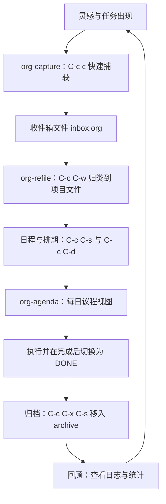
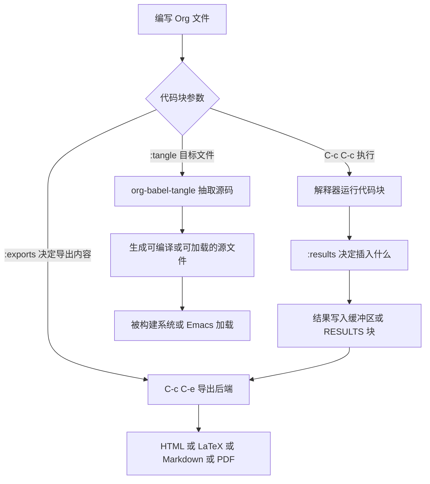

# Org Mode 效率系统

> 本篇把 Org 当作一套完整的效率系统来介绍：从最基本的语法与键位，到 TODO 工作流、议程、捕获、归档、Org Babel、导出与 org-roam 知识管理。适合已经会基本 Emacs 操作、准备把 Org 作为日程与笔记主力工具的人。目标是读完能搭出一套稳定可用、不会越用越乱的 Org 配置。

---

## 一、Org 是什么

Org 是 Emacs 内置的一个 major mode，作用是编辑 `.org` 后缀的纯文本文件。但仅仅把它当作「Markdown 的另一种写法」会低估它，因为它同时是三样东西：

**第一，一个结构化的大纲编辑器。** 任意一行以星号开头就是标题，星号数量决定层级，`TAB` 折叠展开，`M-左` / `M-右` 升降层级，整棵子树可以整体移动、复制、归档。文字仍然是纯文本，用任何编辑器都能打开，用 Git 可以管理冲突与历史，这一点决定了它能用几十年而不会因为某个软件停止服务而失效。

**第二，一套效率系统。** TODO 状态、优先级、标签、属性、排期与截止日期、重复任务、议程视图、捕获模板、归档规则，这些构成了一个完整的任务管理闭环。它与 GTD（Getting Things Done）之类的个人管理方法并不绑定，你可以只用其中的日程部分，也可以只用其中的笔记部分。

**第三，一个 literate programming（文学编程）工具。** Org Babel 允许在 Org 文件里写可执行的代码块，代码的运行结果、图表、数据都可以与文字混排，最后导出成文档或把代码抽成源文件。配置文件用 Org 写、数据分析用 Org 写、技术文档用 Org 写，都是常见用法。

为什么值得投入？因为它的**边际成本递减而收益递增**：语法很少，一天就能学会；但每加一条快捷键、每加一个捕获模板，都是在给自己省下未来几百次操作。反面也要说清楚：Org 的可配置项极多（`org-` 前缀的变量超过一千个），很容易陷入「配一整天却不用」的陷阱。因此本篇的顺序是**先建立最小可用闭环，再逐步加装**，配置块集中在最后，可以先原样抄走跑起来。



---

## 二、基础语法速查

官方手册在 https://orgmode.org/manual/ ，遇到本篇没覆盖的细节（例如列视图、附件、RSS、加密）都可以直接查它；社区文档与示例汇集在 https://orgmode.org/worg/ 。Org 的语法几乎全部在行首或行内以少量符号表示。下面按「输入 → 效果」列出最常用的部分，全部可以在一个 `.org` 文件里立刻验证。

### 2.1 结构类

| 输入 | 效果 |
| --- | --- |
| `* 一级标题` | 一级大纲节点；星号数量就是层级，最多不限 |
| `** TODO 二级标题` | 带 TODO 关键字的节点；关键字必须紧跟星号 |
| `#+TITLE: 文档标题` | 文档元数据，导出时作为标题 |
| `#+FILETAGS: :work:urgent:` | 给整个文件加标签 |
| `#+STARTUP: overview` | 文件打开时的折叠状态等启动选项 |
| `#+OPTIONS: toc:2 num:t` | 导出选项，这里是「生成两级目录、章节编号」 |
| `-----`（五个以上连字符，独占一行） | 水平分隔线 |

### 2.2 文本强调

| 输入 | 效果 |
| --- | --- |
| `*加粗*` | 加粗 |
| `/斜体/` | 斜体 |
| `_下划线_` | 下划线 |
| `+删除线+` | 删除线 |
| `=等宽字面量=` | 等宽显示，内部不做任何解析，适合写代码片段 |
| `~代码~` | 等宽显示，与 `=` 的区别是 `~` 内部的 Org 语法仍会高亮 |
| `下标_{2}` | 下标；`上标^2` 是上标 |

强调标记与中文标点容易冲突，例如 `*重点*，` 里的星号可能因为紧邻标点而被解析失败，显示成原样的星号。稳妥的做法是避免在中文标点紧邻处使用强调，需要绝对可靠时改用 `=...=` 与 `~...~` 这两种标记——它们在中文排版里更稳，也常用于代码与路径。想知道某个位置的标记为什么没生效，把光标放上去看 `C-u C-x =`（`what-cursor-position`）给出的字符信息，比反复试更快。

### 2.3 列表与复选框

| 输入 | 效果 |
| --- | --- |
| `- 无序项` | 无序列表；`+` 与 `*` 也可以（`*` 在行首会被当成标题，只在列表上下文里才安全） |
| `1. 有序项` / `1) 有序项` | 有序列表 |
| `- [ ] 待办项` | 未完成复选框 |
| `- [-] 部分完成` | 部分完成复选框 |
| `- [X] 已完成项` | 已完成复选框 |
| `- 项 :: 描述` | 描述列表，`::` 左侧是词条，右侧是说明 |
| `TAB` / `S-TAB` 在列表项上 | 缩进 / 反缩进整项，连带子项一起移动 |

复选框的状态与统计可以在标题上显示进度，例如父标题写成 `* 打包行李 [1/3]` 会随着子项的勾选自动更新计数。

### 2.4 表格

| 输入 | 效果 |
| --- | --- |
| `\| 名称 \| 数量 \|` 后按 `TAB` | 自动补出表格框架并对齐 |
| `\|------+------\|` | 分隔线，`TAB` 会自动生成 |
| `C-c \|` | 把选中的文本转成表格（`org-table-create-or-convert-from-region`） |
| `C-c *` | 光标在表格内时重算表格（`org-ctrl-c-star` 会调用 `org-table-recalculate`） |
| `#+TBLFM: $3=$1*$2` | 表格公式，`C-c C-c` 或 `C-c *` 求值 |

### 2.5 链接、脚注与代码

| 输入 | 效果 |
| --- | --- |
| `[[https://orgmode.org/manual/][Org 手册]]` | 外部链接，`C-c C-o` 打开 |
| `[[file:notes/todo.org::*小节标题][跳到小节]]` | 内部链接，跳到另一个文件的某个标题 |
| `[[#custom-id][跳到本文某处]]` | 同文件内的自定义 ID 跳转 |
| `<<目标名>>` 与 `[[目标名]]` | 文内锚点与指向它的链接 |
| `[fn:1] 脚注内容` 与 `[fn:1]` | 脚注定义与引用 |
| `#+BEGIN_SRC python` ... `#+END_SRC` | 代码块，`C-c '` 在专用缓冲区里编辑 |
| `#+BEGIN_QUOTE` ... `#+END_QUOTE` | 引用块 |
| `#+BEGIN_EXAMPLE` ... `#+END_EXAMPLE` | 原样保留文本，不做任何强调解析 |
| `#+BEGIN_EXPORT html` ... `#+END_EXPORT` | 只在导出到指定后端时输出的内容 |
| `#+BEGIN_VERSE` ... `#+END_VERSE` | 保留换行与缩进的诗歌排版 |
| `# 注释行` 与 `#+BEGIN_COMMENT` ... `#+END_COMMENT` | 行注释与整块注释，导出时丢弃 |
| `C-c C-,` | 交互式插入结构模板（`org-insert-structure-template`），不必手打 BEGIN/END |

关于 `#+BEGIN_SRC` 与 `C-c '` 的关系要强调一次：`C-c '`（`org-edit-special`）会把光标所在代码块弹到一个独立的、启用对应 major mode 的缓冲区里编辑，写完 `C-c '` 返回并写回原文。这是「在 Org 里写代码」体验好坏的关键——代码块里的缩进、补全、语法检查都依赖这个专用缓冲区。

---

## 三、基础键位表

下面这些键位都在 `org-mode-map` 上，可以在任何 `.org` 文件里用 `C-h k` 逐个验证。

| 键位 | 命令 | 作用 |
| --- | --- | --- |
| `TAB` | `org-cycle` | 折叠展开：标题的局部循环，表格内是单元格跳转 |
| `S-TAB` | `org-shifttab` | 全文层级循环，快速在「只显示标题」与「全部展开」之间切换 |
| `M-RET` | `org-meta-return` | 新建同级条目（光标在标题上）或列表项 |
| `M-<left>` / `M-<right>` | `org-metaleft` / `org-metaright` | 提升 / 降低标题层级 |
| `M-<up>` / `M-<down>` | `org-metaup` / `org-metadown` | 上下移动整棵子树 |
| `C-c C-t` | `org-todo` | 切换 TODO 状态 |
| `C-c C-s` | `org-schedule` | 插入或修改 SCHEDULED 时间戳 |
| `C-c C-d` | `org-deadline` | 插入或修改 DEADLINE 时间戳 |
| `C-c C-c` | `org-ctrl-c-ctrl-c` | 万能确认键：更新统计、求值公式、执行代码块、保存捕获 |
| `C-c '` | `org-edit-special` | 在专用缓冲区里编辑代码块或表格公式 |
| `C-c C-o` | `org-open-at-point` | 打开光标处的链接 |
| `C-c C-e` | `org-export-dispatch` | 打开导出菜单 |
| `C-c C-q` | `org-set-tags-command` | 设置标签 |
| `C-c C-w` | `org-refile` | 把当前子树移动到其它位置 |
| `C-c C-l` | `org-insert-link` | 插入链接 |
| `C-c C-,` | `org-insert-structure-template` | 插入结构模板 |
| `C-c C-x p` | `org-set-property` | 设置属性 |
| `C-c C-z` | `org-add-note` | 给当前条目加一条记录 |
| `C-c C-x C-s` | `org-archive-subtree` | 归档当前子树 |
| `C-c C-x C-a` | `org-archive-subtree-default` | 按默认规则归档 |
| `C-c C-x C-i` / `C-c C-x C-o` | `org-clock-in` / `org-clock-out` | 开始 / 结束计时 |
| `C-c C-x C-l` | `org-latex-preview` | 预览 LaTeX 片段（老版本里这个命令叫 `org-toggle-latex-fragment`，键位相同） |
| `C-c C-x C-j` | `org-clock-goto` | 跳到当前正在计时的条目 |
| `C-c C-x e` | `org-set-effort` | 设置预估工时 |
| `C-c C-x C-c` | `org-columns` | 进入列视图，概览所有条目的属性 |

关于三个全局键位需要单独说明：`C-c a`（议程）、`C-c c`（捕获）、`C-c l`（存链接）是 Org 生态里最常被引用的三个入口，但**它们的绑定情况随版本变化**——较新的 Org 不再自动安装这三个全局键位，因此按下去可能没反应。稳妥做法是自己显式绑定（见第十六节），想知道当前机器上是什么状态，用 `C-h k C-c a` 查一下即可。

---

## 四、TODO 与工作流

### 4.1 关键字定义

TODO 关键字由 `org-todo-keywords` 定义，最基本的写法是一串关键字：

```elisp
;; 最简单的两态工作流：未完成与已完成
(setq org-todo-keywords '((sequence "TODO" "DONE")))
```

实际使用中需要三样增强：快速选择键、状态分隔符、状态切换时记录时间。它们都写在关键字字符串里：

```elisp
(setq org-todo-keywords
      '((sequence "TODO(t)" "NEXT(n)" "WAIT(w@/!)" "|" "DONE(d!)" "CANCELED(c@)")
        (sequence "REPORT(r)" "BUG(b)" "KNOWNCAUSE(k)" "|" "FIXED(f!)")
        (type     "PLAN(p)" "MEETING(m)" "|" "DONE(d!)")))
```

逐项解释：

- 括号里的 `(t)` 是**快速选择键**：在 `C-c C-t` 的状态选择界面里，按 `t` 直接切到 TODO，不必再用方向键选择。配合 `org-use-fast-todo-selection` 可以把这个行为设成默认。
- `|` 把关键字分成两组：左边是「未完成」状态，右边是「已完成」状态。议程默认只显示左边那些，切换状态时 `C-c C-t` 会跳到另一组。
- `!` 表示**进入该状态时插入一条时间戳记录**（这是统计与回顾的基础）。
- `@` 表示进入该状态时**提示输入一条备注**。
- `@/!` 组合表示「记录备注，同时也记录时间戳」。
- `type` 与 `sequence` 的区别在于选择顺序：`sequence` 按定义顺序循环，适合有推进关系的流程（TODO 到 NEXT 到 DONE）；`type` 之间没有顺序，适合互斥的类别（PLAN 与 MEETING）。

多个工作流可以共存：上面的例子里第一条是任务流程，第二条是问题跟踪流程，第三条是会议与计划。不同文件可以用文件级的 `#+TODO:` 覆盖全局定义，这是「一个仓库里既有个人任务又有项目流程」时的常用做法。

### 4.2 关键字配色与优先级

```elisp
;; 给不同状态上色，让议程一眼能看出轻重
(setq org-todo-keyword-faces
      '(("TODO"     . (:foreground "firebrick"   :weight bold))
        ("NEXT"     . (:foreground "orange red"  :weight bold))
        ("WAIT"     . (:foreground "dark orange" :weight bold))
        ("DONE"     . (:foreground "forest green"))
        ("CANCELED" . (:foreground "dim gray"    :weight bold))))
```

优先级用 `[#A]` 到 `[#C]` 表示，写在标题里：`* TODO [#A] 修复登录超时`。`C-c ,`（`org-priority`）可以快速设置。默认只有三级，`org-priority-highest`、`org-priority-lowest` 与 `org-priority-default` 可以改成数字区间（例如 1 到 5），但级别越多越难维护，三级通常是够用的。

### 4.3 实用的开关

| 变量 | 取值 | 作用 |
| --- | --- | --- |
| `org-enforce-todo-dependencies` | `t` / `nil` | 为 `t` 时，父条目的所有子条目都完成后才能把父条目标记为 DONE |
| `org-use-fast-todo-selection` | `t` / `expert` | 让 `C-c C-t` 直接进入快速选择界面 |
| `org-treat-insert-todo-heading-as-state-change` | `t` | `M-S-RET` 插入带 TODO 的新标题时，是否算作一次状态变更（影响 `!` 记录的时机） |
| `org-log-done` | `t` / `'time` / `'note` | 标记 DONE 时记录时间或备注；建议直接用关键字里的 `!` 控制，避免两处配置打架 |
| `org-log-into-drawer` | `t` | 把状态变更记录收进 `:LOGBOOK:` 抽屉，而不是堆在标题下面 |
| `org-todo-repeat-to-state` | `t` / 状态名 | 重复任务完成后回到哪个状态 |

`org-log-into-drawer` 值得默认打开：状态变更记录会以

```org
* DONE 交房租
  CLOSED: [2025-03-01 Sat 09:12]
  :PROPERTIES:
  :LAST_REPEAT: [2025-03-01 Sat 09:12]
  :END:
  :LOGBOOK:
  - State "DONE"       from "TODO"       [2025-03-01 Sat 09:12]
  :END:
```

这样的形式保存下来。这些历史记录是后面用议程做回顾、用习惯图（habit graph）看坚持情况的数据来源，随手丢掉很可惜。

---

## 五、标签、属性与 ID

### 5.1 标签

标签用于跨层级的横向分类，写在标题末尾，用冒号包住：`* TODO 写周报 :work:weekly:`。设置标签用 `C-c C-q`（`org-set-tags-command`），它会提示补全，也可以直接用快速选择键。

全局标签表用于给常用标签分配快速键：

```elisp
(setq org-tag-alist '((:startgroup)
                      ("@work"   . ?w)      ; 按 w 快速选择
                      ("@home"   . ?h)
                      (:endgroup)
                      ("urgent"  . ?u)
                      ("reading" . ?r)))
```

`(:startgroup)` 与 `(:endgroup)` 之间的标签互斥（一次只能选一个），这与「任务属于工作还是家庭」的语义吻合。文件级标签用 `#+FILETAGS:` 写在文件头，继承给文件内所有条目。

### 5.2 属性抽屉

属性适合放结构化的键值数据，写在标题下面的 `:PROPERTIES:` 抽屉里：

```org
* TODO 重构配置加载
  :PROPERTIES:
  :ID:       8f3c1e0a-4b7d-4c2f-9a11-2d6b7f0e5c33
  :Effort:   4:00
  :Owner:    张三
  :END:
```

操作方式：`C-c C-x p`（`org-set-property`）交互式添加或修改属性；`C-c C-x C-c`（`org-columns`）进入列视图，把属性以表格形式铺开，适合批量检查。

几个有特殊含义的属性：

- `:ID:` 是全局唯一标识，`M-x org-id-get-create` 可以给当前条目生成一个。`[[id:8f3c1e0a-...][链接文字]]` 这种按 ID 的链接在文件改名、移动之后依然有效，这是它比按文件路径链接更抗重构的原因。
- `:Effort:` 记录预估工时，配合计时功能可以做「预估与实际」的对比。
- `:STYLE: habit` 把条目变成习惯跟踪条目（见 6.4 节）。
- `:CATEGORY:` 覆盖议程里显示的类别名。

属性的默认继承规则是「不继承」：子标题看不到父标题的属性。需要继承时打开 `org-use-property-inheritance`（可以设为 `t` 表示全部继承，也可以给一个属性名列表只继承指定项）。这个开关对 `:CATEGORY:`、`:Effort:` 之类的场景很有用，但全量开启会让属性查找变慢，建议只在明确需要时开启。

---

## 六、日程与议程

### 6.1 文件组织

`org-agenda-files` 决定议程会扫描哪些文件。它可以是文件列表，也可以是一个目录（Emacs 会递归找出目录下所有 `.org` 文件）：

```elisp
;; 手写列表：可控，但每次新建文件都要改配置
(setq org-agenda-files '("~/org/inbox.org"
                         "~/org/work.org"
                         "~/org/notes.org"))

;; 用目录：省心，代价是目录里的每个 .org 都会被扫描
(setq org-agenda-files '("~/org/" "~/work/projects/"))
```

组织建议有两条。第一，**议程文件要少而精**：议程扫描是每次打开议程都要做的事，几百个文件会让议程变成几秒钟的等待。把「只需要归档查阅、不需要进入日程」的笔记放到不在 `org-agenda-files` 里的目录（例如笔记库、资料库）。第二，**收件箱单独一个文件**，只用于捕获，定期清空（见第八节），这样议程里永远不会有堆积的未分类条目。

`org-agenda-files` 也可以通过 `C-c [`（`org-agenda-file-to-front`）在编辑文件时动态调整，或者设置 `org-agenda-file-regexp` 之类的变量控制目录扫描规则。

### 6.2 议程视图与键位

`M-x org-agenda` 打开议程调度器（如果绑定了 `C-c a`，也可以直接按）。调度器的键位是固定的：

| 调度器键位 | 作用 |
| --- | --- |
| `a` | 当前周 / 当天的议程视图 |
| `t` | 列出所有 TODO 条目 |
| `m` | 按 TAGS/PROP/TODO 条件查询（交互式输入条件） |
| `M` | 与 `m` 相同，但只查 TODO 条目 |
| `s` | 关键词搜索（`s` 只搜标题，`S` 只搜 TODO 条目的标题） |
| `?` | 查找带 `:FLAGGED:` 标签的条目 |
| `T` | 带特定 TODO 关键字的条目 |
| `/` | 在议程文件里做 multi-occur 搜索 |
| `#` | 列出「卡住的项目」（配置过 `org-stuck-projects` 后可用） |
| `*` | 在「粘性议程」与普通议程之间切换 |
| `<` / `>` | 给议程加 / 去「只显示当前文件或子树」的限制 |
| `e` | 导出议程视图 |
| `C` | 打开自定义议程命令的配置界面 |

进入议程缓冲区之后，键位换成另一套（这些键位在议程缓冲区里按下即生效）：

| 议程缓冲区键位 | 作用 |
| --- | --- |
| `d` / `w` | 切换到日视图 / 周视图 |
| `v` | 打开视图菜单（切换日、周、月、年、时间块等） |
| `.` | 跳到今天 |
| `g` | 重新生成议程 |
| `l` | 切换日志模式，显示已经完成条目的历史 |
| `R` | 切换时钟报告模式 |
| `t` | 修改光标所在条目的 TODO 状态 |
| `C` | 日期换算工具 |
| `#` | 切换是否把被依赖阻塞的任务变灰 |
| `s` | 保存所有 Org 缓冲区 |

在议程里直接操作条目是它的价值所在：看到某条任务想推迟，按 `C-c C-s` 改了日期再按 `g` 刷新；想加备注，`C-c C-z`；想把条目改归到别处，`C-c C-w` 直接重构过去。

### 6.3 自定义议程命令

内置视图够用，但真正让议程变成「个人仪表盘」的是 `org-agenda-custom-commands`。它把多个查询组合成一个键位：

```elisp
(setq org-agenda-custom-commands
      '(("d" "今日仪表盘"
         ((agenda "" ((org-agenda-span 'day)                 ; 今天的日程与截止
                      (org-agenda-start-day "0d")
                      (org-deadline-warning-days 7)))
          (todo "NEXT" ((org-agenda-overriding-header "接下来要做")))
          (todo "WAIT" ((org-agenda-overriding-header "等待他人")))
          (tags "urgent-TODO=\"DONE\""                        ; 紧急且未完成
                ((org-agenda-overriding-header "紧急任务")))))
        ("w" "本周回顾"
         ((agenda "" ((org-agenda-span 'week)
                      (org-agenda-start-on-weekday 1)))
          (todo "DONE" ((org-agenda-overriding-header "本周已完成")
                        (org-agenda-start-with-log-mode t)))))  ; 打开日志模式
        ("p" "各项目概览"
         ((tags-todo "+project"
                     ((org-agenda-overriding-header "所有项目")
                      (org-agenda-sorting-strategy '(priority-down))))))))
```

要点说明：

- 每个命令是 `(键位 描述 查询列表 可选全局选项)` 的四元组形式，查询列表里每一项是 `(类型 匹配串 局部选项)`。
- 类型 `agenda` 表示日程视图，`todo` 表示按 TODO 关键字列出，`tags` 与 `tags-todo` 表示按标签或属性查询，还可以用 `search` 做全文搜索。
- `org-agenda-overriding-header` 给这一段加上标题，否则你会在一个缓冲里看到几段没有说明的列表。
- 设置好之后，在调度器里按 `C` 会打开自定义命令配置界面，按你定义的键位（这里是 `d`、`w`、`p`）直接进入对应视图。

### 6.4 习惯跟踪

把条目变成习惯需要三个条件：有 SCHEDULED 时间戳、有 `:STYLE: habit` 属性、打开 DONE 的状态日志。写法如下：

```org
* TODO 每天背单词
  SCHEDULED: <2025-03-01 Sat .+1d/2d>
  :PROPERTIES:
  :STYLE:    habit
  :END:
```

在议程的日视图或周视图里，这类条目会显示一张一致性图（consistency graph），用图形表示最近若干天是否完成。相关变量：`org-habit-show-habits`（是否显示）、`org-habit-graph-column`（图形所在列）、`org-habit-preceding-days` 与 `org-habit-following-days`（图覆盖的历史与未来天数）、`org-habit-show-all-today`（是否把习惯都显示在今天的议程里）。习惯条目的时间戳要用 `.+` 或 `++` 风格的重复符，原因见下一节。

### 6.5 日志与回顾

回顾是效率系统里最容易被忽略、又最关键的一环。三种做法：

- 在议程缓冲区里按 `l` 打开日志模式（`org-agenda-log-mode`），完成过的条目会连同时间戳一起显示，能直观看到「这周究竟做了什么」。
- 自定义一个打开 `org-agenda-start-with-log-mode` 的周视图（见 6.3 节的 `w` 命令），把它当作每周固定的回顾入口。
- 用时钟报告（议程里按 `R`，或 `M-x org-clock-report` 类命令）查看时间都花在了哪些条目上，前提是养成 `C-c C-x C-i` / `C-c C-x C-o` 计时的习惯。

---

## 七、时间戳与重复任务

### 7.1 两种时间戳

Org 里有两类时间戳，区别不在于显示格式，而在于**是否参与议程**：

| 写法 | 名称 | 是否出现在议程 | 典型用途 |
| --- | --- | --- | --- |
| `<2025-03-01 Sat>` | 活动时间戳（active timestamp） | 是 | 会议、约定、需要提醒的时刻 |
| `[2025-03-01 Sat]` | 不活动时间戳（inactive timestamp） | 否 | 记录「这件事发生在什么时候」，作为纯历史信息 |
| `<2025-03-01 Sat 09:30>` | 带时间的活动时间戳 | 是 | 有具体时刻的事项 |
| `<2025-03-01 Sat 09:30-10:30>` | 时间段 | 是 | 会占用一段时间的事项 |

`C-c .` 插入活动时间戳，`C-c !` 插入不活动时间戳。命令名随版本略有变化：Emacs 29 与 30 自带的 Org 里分别叫 `org-time-stamp` 与 `org-time-stamp-inactive`，较新的 Org（9.8 起）改名为 `org-timestamp` 与 `org-timestamp-inactive`，键位不变；如果你在配置里按名字引用过它们，升级后需要一并调整。

这个区分非常有用：写会议记录时用不活动时间戳标记「事情发生的时间」，就不会污染每天的议程；反之，凡是需要被提醒的事情都应该用活动时间戳，并配合 `C-c C-s` 或 `C-c C-d`。

### 7.2 SCHEDULED 与 DEADLINE

`C-c C-s`（`org-schedule`）插入 `SCHEDULED`，含义是「打算在这一天做」；`C-c C-d`（`org-deadline`）插入 `DEADLINE`，含义是「必须在这一天之前完成」：

```org
* TODO 提交季度报告
  DEADLINE: <2025-03-31 Mon> SCHEDULED: <2025-03-25 Tue>
```

两者的行为差别：SCHEDULED 的条目在指定日期进入议程，即使没完成也不会显示为逾期；DEADLINE 的条目在临近时提前出现，逾期后每天都出现在议程里直到完成（或者用 `org-agenda-skip-scheduled-if-done` 之类的开关调整已完成条目的显示）。提前提醒的天数由 `org-deadline-warning-days` 控制，默认是 14 天，通常调小到 3 到 7 天更符合直觉。

也可以在时间戳里写警告期：`DEADLINE: <2025-03-31 Mon -3d>` 表示提前三天开始提醒。如果同时有重复符，重复符写在前面、警告期写在后面：`DEADLINE: <2025-03-31 Mon +1m -3d>`。

### 7.3 重复任务

重复符写在时间戳里，支持年 `y`、月 `m`、周 `w`、日 `d`、小时 `h`。三种前缀的语义差别是这一节的重点，也是新手最容易搞错的地方：

| 写法 | 语义 | 例子与后果 |
| --- | --- | --- |
| `+1m` | 日期**精确**平移一个周期，不管中间错过了几次 | `DEADLINE: <2005-10-01 Sat +1m>`，三个月没交房租，标记完成后日期变成 11-01，仍然是逾期状态 |
| `++1w` | 至少平移一个周期，并且**继续平移直到进入未来**，同时保持星期几不变 | `DEADLINE: <2008-02-10 Sun ++1w>`，即使周六才完成，日期也会落在未来的某个周日 |
| `.+1m` | 从**完成当天**起算，平移一个周期 | `DEADLINE: <2005-11-01 Tue .+1m>`，标记完成后的日期是「今天起一个月」 |

选择的经验规则：**需要「隔多久做一次」的用 `.+`**（换电池、体检、理发），**需要「固定在某天做」的用 `++`**（每周日给家里打电话），**需要「不能欠账、每次都要补」的用 `+`**（交房租、还信用卡）。习惯跟踪条目通常用 `.+`。

两个容易踩的点：

- 重复任务在 `C-c C-t` 标记 DONE 时，Org 会**自动把日期推到下一次并立刻把状态改回 TODO**。因此你不会看到它停留在 DONE 状态，这是设计如此。如果只想「记录这一次完成但不要推进日期」，用数值前缀 `C-- 1 C-c C-t`（即 `org-todo` 带参数 `-1`），它会保留一条历史记录而不平移日期。
- 重复任务的落实记录（时间戳与 LOGBOOK）是习惯图与回顾的数据来源，所以 `!` 与 `org-log-into-drawer` 建议一起用。

---

## 八、捕获（Capture）

捕获解决的是「想法出现时不要打断当前工作」的问题：按一个键，弹出一个小缓冲区写下来，`C-c C-c` 保存并回到原来的位置。它是整套系统里使用频率最高的功能，值得认真配置。

### 8.1 完整模板配置

```elisp
(setq org-capture-templates
      `(("t" "任务" entry
         (file+headline "~/org/inbox.org" "任务")
         "* TODO %?\n  %a\n  %i"
         :empty-lines 1)
        ("n" "笔记" entry
         (file+headline "~/org/notes.org" "笔记")
         "* %?\n  %U\n  %i\n  %a"
         :empty-lines 1)
        ("j" "日记" entry
         (file+datetree "~/org/journal.org")
         "* %U %?\n  %i"
         :tree-type week
         :empty-lines 1)
        ("m" "会议记录" entry
         (file+olp+datetree "~/org/meetings.org")
         "* %^{会议主题} %^g\n  SCHEDULED: %^t\n  :PROPERTIES:\n  :ID: %(org-id-new)\n  :END:\n  %?"
         :empty-lines 1)))
```

逐段解释：

- 每个模板是 `(键位 描述 类型 目标 模板字符串 可选选项)`。类型 `entry` 表示插入一条带标题的条目；其他常用类型还有 `item`（列表项）、`checkitem`（复选框项）、`table-line`（表格行）、`plain`（纯文本）。
- 目标 `file+headline` 表示「写到某个文件的某个标题下」，`file+datetree` 表示「按日期树写入」，`file+olp+datetree` 的 `olp` 是 outline path，可以指定多级路径。
- `:empty-lines 1` 在插入后留一个空行，避免条目粘在一起；`:tree-type week` 让日期树按周分组，日记场景读起来更舒服。

### 8.2 模板转义符

模板字符串里的 `%` 系列转义是捕获功能的核心，下面这张表按官方手册列出最常用的部分：

| 转义 | 插入内容 |
| --- | --- |
| `%?` | 捕获完成后光标停留的位置 |
| `%^{提示文字}` | 交互式提示输入一段文本并插入 |
| `%^{提示\|默认值}` | 同上，带默认值 |
| `%^{属性}p` | 提示输入某个属性的值 |
| `%^g` / `%^G` | 提示输入标签（`g` 只在当前文件里补全，`G` 在所有议程文件里补全） |
| `%^t` / `%^T` | 提示输入日期 / 日期加时间 |
| `%t` / `%T` | 自动插入当天日期 / 日期加时间（活动时间戳） |
| `%u` / `%U` | 同上，但不活动时间戳 |
| `%a` | 调用捕获时由 `org-store-link` 生成的链接（常用于记「在哪个文件哪一行」） |
| `%A` | 同 `%a`，但会提示输入链接描述 |
| `%i` | 初始内容：调用捕获时处于选中状态的文本 |
| `%c` | kill ring 的当前内容 |
| `%x` | 系统剪贴板内容 |
| `%f` / `%F` | 调用捕获时所在缓冲区的文件名 / 完整路径 |
| `%k` / `%K` | 当前正在计时的任务标题 / 链接 |
| `%n` | `user-full-name` 里的用户名 |
| `%(表达式)` | 求值一个返回字符串的 Elisp 表达式，例如 `%(org-id-new)` 生成新 ID |
| `%<格式>` | 按 `format-time-string` 的格式插入时间 |
| `%\1` | 插入第 1 个 `%^{提示}` 输入过的内容（便于在模板里重复使用同一输入） |

### 8.3 使用方式与配合技巧

- `C-c c` 打开捕获菜单，按模板键位选择模板。这个键位同样需要显式绑定（见第十六节）。
- 在议程缓冲区里也可以启动捕获，此时 `org-capture-use-agenda-date` 为 `t` 会让捕获的默认日期取议程当前日期，而不是今天——在回顾过去某天时补记录很方便。
- 捕获缓冲区里 `C-c C-c` 完成（`org-capture-finalize`），`C-c C-k` 放弃（`org-capture-kill`），`C-c C-w` 完成并立即重构到别处（`org-capture-refile`）。**`C-c C-c` 之后再想改归属，就要靠重构或手动移动了**，所以「先 `C-c C-w` 再确认」是整理型捕获的常用手法。
- `org-capture-bookmark` 为 `t` 时，完成捕获后会在书签里留下位置，`C-x r b` 可以快速回到刚才记的那条。
- 收件箱（inbox）的价值在于「捕获时不做分类」。所有来不及归类的条目都先落进 `inbox.org` 的「任务」标题下，每天固定时间做一次清空：用议程列出收件箱内的条目，逐条 `C-c C-w` 重构到项目文件。

---

## 九、归档与重构

### 9.1 重构（refile）

重构是把一棵子树移动到另一个位置，`C-c C-w`（`org-refile`）触发。它需要先配置目标：

```elisp
(setq org-refile-targets '((org-agenda-files :maxlevel . 3)  ; 议程文件里三级以内的标题
                           ("~/org/projects.org" :level . 1) ; 指定文件的一级标题
                           ("~/org/someday.org"  :regexp . ".*"))) ; 全部标题
(setq org-refile-use-outline-path 'file)   ; 选择时显示「文件/标题」的完整路径
(setq org-outline-path-complete-in-steps nil) ; 一次性补全整条路径，而不是逐级询问
```

`org-refile-targets` 的写法是 `(目标 条件)` 的列表，条件是 `:maxlevel`（层级限制）、`:level`（精确层级）、`:regexp`（标题匹配正则）之一；目标可以是 `org-agenda-files` 变量，也可以是具体文件路径。第 3 行与第 4 行是体验优化的关键：没有它们，重构时要逐级选择路径，容易选错也慢。

重构的两个补充命令值得记住：`C-u C-c C-w` 会跳到目标位置而不是移动（相当于「看看那里有什么」）；想把整棵子树复制而不是移动，可以用 `C-c C-x c` 之类的命令，或者移动后再复制回来。

### 9.2 归档

归档是把完成的事项从当前文件移走，保持议程文件精简。配置归档位置：

```elisp
;; 归档到同目录下的 archive 文件，保留层级结构
(setq org-archive-location "archive/%s_archive::")
;; 归档到当前文件末尾的「已归档」标题下（方便查阅，但文件会越来越大）
;; (setq org-archive-location "%s_archive::* 已归档")
```

`%s` 会被替换为当前文件名（不含扩展名）。`C-c C-x C-s`（`org-archive-subtree`）归档当前子树；`C-c C-x C-a`（`org-archive-subtree-default`）按文件的 `#+ARCHIVE:` 设置归档，适合「不同文件归档到不同位置」的场景。

配合一个自定义命令批量归档更省事：在议程里筛选出所有 DONE 条目，全选后统一归档。也可以用 `org-archive-subtree-default-with-confirmation` 之类的命令在每次确认后再处理，避免误操作。

---

## 十、Org Babel：在 Org 里执行代码

### 10.1 基本用法

代码块加上需要执行的语言支持后，`C-c C-c` 就会运行它，并把结果插入到块下方或 `#+RESULTS:` 里：

```org
#+BEGIN_SRC python :results output :exports both
print("来自 python 代码块的输出")
#+END_SRC
```

首次使用某种语言前要加载对应支持，否则 `C-c C-c` 会提示没有可用的执行后端：

```elisp
;; 只加载会用到的语言，全量加载会拖慢启动
(org-babel-do-load-languages
 'org-babel-load-languages
 '((emacs-lisp . t)   ; Elisp 代码块始终可用，这里只是显式声明
   (python     . t)
   (shell      . t)
   (C          . t)
   (js         . t)))

;; 执行前是否询问，默认 t（每次确认）。改 nil 前请确认自己只运行可信代码
(setq org-confirm-babel-evaluate t)
```

### 10.2 常用参数

参数写在 `#+BEGIN_SRC` 行上，用冒号开头：

| 参数 | 取值示例 | 作用 |
| --- | --- | --- |
| `:results` | `output` / `value` / `table` / `silent` | 结果的形态：输出流、返回值、表格、不显示 |
| `:exports` | `code` / `results` / `both` / `none` | 导出时输出哪部分 |
| `:session` | `my-session` / `none` | 是否在持久会话里运行 |
| `:tangle` | `yes` / `init.el` / `no` | 是否把代码抽到源文件，以及目标文件名 |
| `:noweb` | `yes` / `no` | 是否展开代码块之间的引用 |
| `:var` | `:var x=3` | 给代码块传入变量 |
| `:dir` | `:dir ~/projects/app` | 代码块运行的工作目录 |
| `:eval` | `never` / `no-export` | 禁止执行（安全考虑，导入别人的文档时有用） |

### 10.3 session 的用法与陷阱

`:session` 让多个代码块共享同一个解释器进程，因此上一次定义的变量、函数在下一次仍然存在——写教程、做探索性分析时非常方便：

```org
#+BEGIN_SRC python :session demo :results output
total = 0
#+END_SRC

#+BEGIN_SRC python :session demo :results output
for i in range(3):
    total += i
print(total)
#+END_SRC
```

陷阱有三个：

- **状态污染**：上一个块里定义的变量会影响下一个块的结果，导致「单独运行某个块结果不对」。写文档时最好让每个块自包含，只在确实需要共享状态时才用 session。
- **进程不会自动消失**：session 对应的解释器进程会一直活着，改了代码但解释器里还是旧定义时会困惑。用 `M-x org-babel-execute-buffer` 从头重跑一遍，或者杀掉会话缓冲区。
- **输出与值的区别**：`:results output` 只拿标准输出，`:results value` 只拿最后一个表达式的值，两个都想要就分开写。Python 里 `print` 属于 output，而裸表达式属于 value，这一点与 Elisp、Ruby 等语言的习惯不同。

### 10.4 抽取源码（tangle）

`:tangle` 把代码块写到真实文件里，于是 Org 文件可以成为「一份带解释的源代码」：

```org
#+BEGIN_SRC elisp :tangle ~/.emacs.d/my-org-config.el :comments link
;; 这一段从 Org 文件抽取到独立的配置文件
(setq org-startup-folded 'overview)
#+END_SRC
```

`M-x org-babel-tangle` 执行抽取（默认抽取当前文件里所有带 `:tangle` 的块），`C-u C-c C-v t` 之类的组合只抽取当前块。`:comments link` 会在生成的代码里插入指向源 Org 文件位置的注释，便于回溯。

这套机制最常见的两种用法：一是**用 Org 写配置**，把 `init.el` 里的一块块配置写成有注释、能执行、能抽出的代码块（详见 [[emacs教程/3配置实践/01_配置工程化|配置工程化]]）；二是**用 Org 写文档**，文档里的示例代码直接来自抽取出的源文件，避免「文档里的代码早就过时」的问题。



---

## 十一、导出

`C-c C-e`（`org-export-dispatch`）打开导出菜单，菜单分两组：上面是导出范围（当前缓冲区、当前子树、选中区域），下面是后端。常用后端：

| 后端 | 菜单键位 | 输出 | 适用场景 |
| --- | --- | --- | --- |
| HTML | `h` | `.html` | 发布到网站、发给别人浏览 |
| LaTeX | `l` | `.tex` | 需要精细排版或作为 PDF 的中间产物 |
| PDF | `l` 之后选择 `p`（经由 LaTeX） | `.pdf` | 打印、正式文档 |
| Markdown | `m` | `.md` | 发布到只支持 Markdown 的平台 |
| Plain text | `t` | `.txt` | 纯文本邮件、ASCII 输出 |
| iCalendar | `c` | `.ics` | 导入日历（见第十四节） |

导出菜单里可以直接切换选项，例如是否生成目录、是否包含作者与日期、代码是否高亮、是否导出标题编号。这些选项也可以写在文件头：`#+OPTIONS: toc:2 num:nil ^:nil`。

### 11.1 导出 HTML

HTML 导出通常配合两个设置：一是样式，二是代码高亮。`:html-head` 之类的文件级关键字可以插入自定义 CSS 或引用外部样式表；`htmlize` 包负责把 Emacs 的字体锁定信息转成 CSS 类（MELPA 可安装）。如果只是想快速得到一份排版不错的页面，直接用默认样式即可，不要一开始就折腾主题。

### 11.2 导出中文 PDF 的要点

Org 的 PDF 导出走 LaTeX，中文排版的关键是**用支持中文的引擎与宏包**：

```elisp
;; 用 xelatex 作为编译器：它对 UTF-8 与系统字体的支持最好
(setq org-latex-compiler "xelatex")

;; 在生成的 LaTeX 里加载 ctex 宏包并设置字体
(setq org-latex-packages-alist
      '(("" "ctex" t)))                    ; t 表示只在 xelatex/lualatex 下加载

;; 或者直接自定义编译命令序列，加入 -shell-escape 等参数
(setq org-latex-pdf-process
      '("xelatex -interaction nonstopmode -output-directory %o %f"
        "xelatex -interaction nonstopmode -output-directory %o %f"
        "xelatex -interaction nonstopmode -output-directory %o %f"))
```

三个要点：

1. **引擎选 xelatex 或 lualatex，不要用 pdflatex**。pdflatex 对中文的支持需要额外的 CJK 配置，容易出现缺字与报错。
2. **宏包用 ctex**（CTAN 页面：https://ctan.org/pkg/ctex ），它会自动处理中文字体、段首缩进、标点挤压等细节。也可以在 `.org` 文件头写 `#+LATEX_HEADER: \usepackage{ctex}`。
3. **编译三次**。中文文档常有交叉引用与目录，一次编译往往得不到正确的目录与页码，Org 的默认编译序列已经编译多次，自己写 `org-latex-pdf-process` 时不要图快去成一次。

发行版方面，Linux 与 macOS 推荐 TeX Live（https://www.tug.org/texlive/ ），Windows 可以用 MiKTeX（https://miktex.org/ ）。安装后要确认 `xelatex` 真的在 PATH 里：在终端执行 `xelatex --version` 能看到版本号，并且这个终端与启动 Emacs 的环境一致（macOS 与 Windows 上从图形界面启动的 Emacs 常常拿不到 Homebrew 或 MiKTeX 的 PATH，这也是导出 PDF 报「找不到命令」的常见原因）。

### 11.3 导出 Markdown

Markdown 导出（`m` 键）适合把 Org 内容发布到不支持 Org 的平台。默认导出器对表格与代码块的处理已经不错，但以下内容会丢失或变形：TODO 关键字、标签、属性抽屉、重复任务的时间戳语义。因此**不要把 Org 当作「Markdown 的超集」来写**，如果目标平台是 Markdown，最好一开始就按 Markdown 的能力范围写。需要更完整的 GitHub 风格 Markdown（表格、任务列表、脚注）时可以安装 `ox-gfm` 这类第三方导出后端。

---

## 十二、org-roam：知识管理

Org 本身按树状结构组织内容，而「笔记之间互相引用」需要的是网络结构。org-roam 在 Org 之上加了一层：每个文件是一个节点（node），节点之间用链接互相引用，反向引用（backlink）可以自动列出「谁引用了我」。

### 12.1 安装与依赖

org-roam 在 MELPA 上，包名 `org-roam`。它的依赖较重：除 Org 本身外需要 `emacsql`，以及 SQLite 支持。SQLite 有两条路径：

- 系统里装了 `sqlite3` 命令行程序，`emacsql` 可以直接调用它；
- Emacs 29 起内置 SQLite 支持，可以不依赖外部程序。

安装后先确认能用：

```elisp
(use-package org-roam
  :ensure t
  :custom
  (org-roam-directory (file-truename "~/org/roam")) ; 笔记库根目录，必须是绝对路径
  :config
  ;; 让数据库在保存文件后自动同步
  (org-roam-db-autosync-mode 1))
```

`org-roam-directory` 里的 `file-truename` 是为了解析符号链接，官方文档特别提醒过：目录里如果混入符号链接，数据库里的路径会不一致，导致同一笔记出现两条记录。

### 12.2 基本概念与操作

| 概念 | 含义 | 相关命令 |
| --- | --- | --- |
| node（节点） | 一个笔记文件，或文件里带 `:ID:` 属性的标题 | `org-roam-node-find` 按标题查找并打开 |
| backlink（反向引用） | 指向当前节点的所有链接 | `org-roam-buffer-toggle` 打开侧边缓冲区查看 |
| dailies（日志） | 按日期命名的日记笔记 | `org-roam-dailies-capture-today`、`org-roam-dailies-goto-today` |
| 数据库 | SQLite 文件，缓存标题、标签、链接关系 | `org-roam-db-sync` 手动全量重建 |

日常操作的三个核心命令：

- `M-x org-roam-node-find`：按标题查找节点，输入一个不存在的标题会走捕获流程新建它。
- `M-x org-roam-node-insert`：在当前位置插入指向某个节点的链接，同样可以在没有匹配时新建。
- `M-x org-roam-buffer-toggle`：在侧边窗口显示当前节点的反向引用与出链。

dailies 的配置与使用：

```elisp
(setq org-roam-dailies-directory "daily/")   ; 相对 org-roam-directory 的子目录
(setq org-roam-dailies-capture-templates
      '(("d" "default" entry "* %?" :target
         (file+head "%<%Y-%m-%d>.org" "#+title: %<%Y-%m-%d>\n"))))
;; 常用命令：
;; M-x org-roam-dailies-capture-today   今天的日记，追加内容
;; M-x org-roam-dailies-goto-today      打开今天的日记
;; M-x org-roam-dailies-goto-date       打开指定日期的日记（带日历选择）
;; M-x org-roam-dailies-goto-next-note  跳到下一条有内容的日记
```

日志式笔记的好处是「输入摩擦极小」：所有临时想法先写进今天，之后再整理成正式节点，用 `M-x org-roam-extract-subtree` 可以把日记里的一段抽成独立节点并自动补上链接。

### 12.3 与 Obsidian 双链接体系的对比

本仓库 RootStack 本身就是用 Obsidian 的双向链接 `[[路径/文件|别名]]` 组织的，因此把两者放在一起比较很有必要——它们看起来相似，语义却不同。

| 维度 | Obsidian 风格（本仓库用法） | org-roam v2 |
| --- | --- | --- |
| 链接语法 | `[[路径/文件\|别名]]`，按**路径**定位 | `[[id:UUID][描述]]`，按**ID**定位 |
| 文件改名后 | 路径变了，链接需要跟着改（Obsidian 有自动更新，其它工具不一定） | 链接不变，因为 ID 不随文件名变化 |
| 链接的显示 | 由别名决定，可读性好 | 描述部分是人写的，ID 部分不可读 |
| 反向链接 | 由 Obsidian 索引维护 | 由 org-roam 的 SQLite 数据库维护 |
| 跨工具互操作 | 纯文本可见，任何编辑器都能读懂 | 需要 org-roam（或至少能解析 `id:` 链接）才能跳转 |
| 与文件重命名/移动的关系 | 敏感 | 不敏感 |

由此可以得出两条实践建议：

**第一，两种链接不要混用。** 在一个 org-roam 库里同时写 `[[./笔记名.org]]` 与 `[[id:...]]` 会导致数据库与文件系统两套真相并存：ID 链接在改名后仍然有效，路径链接会断，而备份与迁移时很难判断哪些链接是「活的」。选定一种风格并坚持，是长期维护成本最低的做法。本仓库以 Obsidian 的路径链接为准，因此**在 RootStack 内部写作时应继续使用路径式 `[[路径/文件|别名]]`**，不要引入 `id:` 链接。

**第二，迁移时用工具而不是手工替换。** org-roam 提供了把路径链接转成 ID 链接的辅助函数（把文件链接替换为 ID 链接的功能，配置项里能看到相关开关），反向操作则需要自己写脚本。跨体系迁移之前先做好完整备份，并在一小部分笔记上验证。

---

## 十三、表格公式与 LaTeX 片段

### 13.1 表格公式

`#+TBLFM:` 行定义表格的计算规则，写在表格正下方：

```org
| 项目 | 单价 | 数量 | 小计 |
|------+------+------+------|
| 硬盘 |  500 |    2 | 1000 |
| 内存 |  300 |    4 | 1200 |
|------+------+------+------|
| 合计 |      |      | 2200 |
#+TBLFM: $4=$2*$3::$5=vsum(@2..@-1)
```

- `$4=$2*$3` 表示第 4 列等于第 2 列乘第 3 列；`$` 后面跟列号，`@` 后面跟行号。
- `@2..@-1` 表示从第 2 行到倒数第 1 行（`@-1` 是倒数第一行的相对写法）。
- `vsum` 是内置的求和函数，此外还有 `vmean`（平均）、`vcount`、`vmin`、`vmax` 等。
- 在表格里按 `C-c C-c` 或 `C-c *` 求值（`C-c *` 对应 `org-ctrl-c-star`，在表格上下文里会调用 `org-table-recalculate`）。
- 光标在公式行上按 `C-c '` 会在专用缓冲区里编辑公式，方便写复杂的表达式。

### 13.2 LaTeX 片段与预览

行内公式用 `$...$` 或 `\(...\)`，独立公式用 `\[...\]` 或环境块。`C-c C-x C-l`（`org-latex-preview`）把光标处或整个缓冲区的公式渲染成图片显示，再按一次恢复源码显示。常用变量：

- `org-latex-preview` 的显示行为与 `org-preview-latex-default-process` 之类的选项有关，默认用 `dvipng` 生成图片；只想在图形界面里启用预览，可以在配置里判断 `display-graphic-p`。
- `org-pretty-entities` 为 `t` 时，`\alpha` 之类的实体名会直接显示成希腊字母（需要字体支持），写数学笔记时观感很好。
- `org-hide-emphasis-markers` 为 `t` 时隐藏 `*粗体*` 的星号，只显示效果；`org-appear` 这类包可以让标记在光标所在行临时显示出来，避免「看不见分隔符」的困扰。

---

## 十四、与外部工具的配合

**移动端。** 安卓上有 orgzly 系列应用，iOS 上有 beorg，它们把 Org 文件同步到手机并支持基本的 TODO 操作。同步方式通常是 WebDAV、Syncthing 或 Git。这类工具的现实限制是：它们只支持 Org 语法的一个子集，重复任务、议程自定义命令、Org Babel 都不会生效。因此实际可行的用法是「手机负责收集与勾选，电脑负责真正的工作」，并且在手机端只操作最简单的 TODO 条目。

**导出到日历。** Org 可以把议程导出成 iCalendar 格式：`M-x org-icalendar-combine-agenda-files` 把 `org-agenda-files` 里的所有时间戳合并成一个 `.ics` 文件，`M-x org-icalendar-export-to-ics` 导出当前文件。生成的 `.ics` 可以导入 Google Calendar、Apple 日历等。

要注意「导出」与「同步」的区别：`.ics` 是**一次性快照**，日历端不会反向更新，Org 里改了时间之后需要重新导出并重新导入。因此它的定位是「把 Org 的日程给别人看」或者「在手机上查看今天的日程」，而不是双向同步。真要接近双向同步，需要自己写脚本或用第三方工具定期导出并导入，方案稳定性取决于两端工具的 API，投入产出比通常不高——更省事的替代是：让手机日历只读 Org 导出的 `.ics`，所有编辑都在 Org 里完成。

**与其它章节配合。** 学习笔记、读书摘录、项目规划都可以用 Org 记录，本仓库各模块的学习路径（例如 [[c语言教程/c目录|C 教程]]、[[python/python目录|Python 教程]]、[[rust/rust目录|Rust 教程]]）可以整理成一个 Org 文件，用复选框跟踪进度，用议程安排每周的学习时段——这正好把「教程体系」与「效率系统」接起来。

---

## 十五、性能与可维护性

Org 变慢通常有三个来源，按出现频率排序如下。

**第一，议程文件太多或太大。** 议程每次生成都会读取所有 `org-agenda-files` 里的标题与时间戳。文件数量超过几十个、或者单个文件超过几万行时，议程会明显变慢。对策：把不需要进议程的笔记移出 `org-agenda-files`；定期归档已完成条目（第九节）；用 `M-x profiler-start` 确认瓶颈确实在议程生成而不是某个次要模式。

**第二，长文件的元素缓存。** Org 9.6 起引入了元素缓存（element cache），把解析结果缓存起来加速重复查询。相关开关是 `org-element-use-cache`，默认开启。缓存带来的一个副作用是：手动改动了文件内容而缓存没失效时，可能出现「明明改了却按旧结构处理」的怪异现象，此时用 `M-x org-element-cache-reset` 之类的命令清掉缓存即可。另一个已知的注意事项是缓存与某些特殊结构的兼容性，遇到解析异常时可以临时把 `org-element-use-cache` 设为 `nil` 验证是否与它有关。

**第三，启动时加载的东西太多。** `org-startup-*` 系列变量控制打开文件时的行为，其中几个对速度影响明显：

```elisp
(setq org-startup-folded 'overview)     ; 打开时只显示一级标题，而不是全文展开
(setq org-startup-indented t)           ; 视觉缩进，日常写作更清爽
(setq org-hide-leading-stars t)         ; 隐藏多余的星号
(setq org-ellipsis " ...")              ; 折叠处显示省略号
(setq org-cycle-separator-lines 2)      ; 折叠时保留的空行数
(setq org-adapt-indentation nil)        ; 不强制正文缩进到标题下方
(setq org-catch-invisible-edits 'smart) ; 防止在折叠的不可见区域误编辑
```

这些设置可以写在文件头的 `#+STARTUP:` 里做文件级覆盖，也可以统一放在 init.el 里作为默认值。集中配置的好处是「换一台机器时行为一致」，代价是单个文件无法偏离默认——两者可以搭配：全局给保守值，个别文件用 `#+STARTUP:` 覆盖。

关于可维护性，还有两条经验。**定期重构而不是事后补救**：每周花十分钟把收件箱清空、把完成的条目归档，比攒三个月再整理要轻松得多。**配置要能一键回退**：把 Org 配置放在单独的 `org-config.el` 文件里用 `load` 或 `use-package` 的 `:config` 加载，出问题时能快速定位是本篇的配置还是别处的问题；配合 Git 管理配置，任何一次「改坏了」都能回退（参见 [[git|Git 与 GitHub 指南]]）。

---

## 十六、完整配置块

下面这一段可以直接抄进 init.el，它把捕获、议程、重构、导出、Babel 与键位组织成一个整体。每段都注明了取舍理由，可以按需删减。

```elisp
;;; ---------- 基础行为 ----------
(use-package org
  :ensure nil                             ; Org 是内置的，不需要安装
  :custom
  (org-startup-folded 'overview)          ; 打开文件时只展开一级，减少首次渲染开销
  (org-startup-indented t)
  (org-hide-leading-stars t)
  (org-ellipsis " ...")
  (org-adapt-indentation nil)
  (org-catch-invisible-edits 'smart)      ; 避免在折叠区域误编辑
  (org-log-into-drawer t)                 ; 状态变更记录收进 LOGBOOK 抽屉
  (org-use-fast-todo-selection 'expert)   ; C-c C-t 直接进入快速选择
  (org-enforce-todo-dependencies t)       ; 子任务未完成时不允许把父任务标记为 DONE
  (org-deadline-warning-days 7)           ; 截止日期提前七天开始提醒
  (org-agenda-span 'day)
  (org-agenda-start-on-weekday 1)         ; 周视图从周一开始
  (org-refile-use-outline-path 'file)
  (org-outline-path-complete-in-steps nil)
  (org-confirm-babel-evaluate t)          ; 执行代码块前确认，安全优先
  :config
  (require 'org-habit)                    ; 习惯跟踪需要显式加载
  (require 'org-tempo))                   ; 让 <s 加 TAB 展开成代码块模板

;;; ---------- TODO 工作流 ----------
(setq org-todo-keywords
      '((sequence "TODO(t)" "NEXT(n)" "WAIT(w@/!)" "|" "DONE(d!)" "CANCELED(c@)")
        (sequence "BUG(b)" "KNOWNCAUSE(k)" "|" "FIXED(f!)")))

(setq org-todo-keyword-faces
      '(("TODO"     . (:foreground "firebrick"   :weight bold))
        ("NEXT"     . (:foreground "orange red"  :weight bold))
        ("WAIT"     . (:foreground "dark orange" :weight bold))
        ("DONE"     . (:foreground "forest green"))
        ("CANCELED" . (:foreground "dim gray"    :weight bold))))

;;; ---------- 标签 ----------
(setq org-tag-alist '((:startgroup)
                      ("@work"   . ?w)
                      ("@home"   . ?h)
                      (:endgroup)
                      ("urgent"  . ?u)
                      ("reading" . ?r)))

;;; ---------- 议程文件与自定义命令 ----------
(setq org-agenda-files '("~/org/inbox.org"
                         "~/org/work.org"
                         "~/org/projects.org"
                         "~/org/journal.org"))

(setq org-agenda-custom-commands
      '(("d" "今日仪表盘"
         ((agenda "" ((org-agenda-span 'day)
                      (org-deadline-warning-days 7)))
          (todo "NEXT" ((org-agenda-overriding-header "接下来要做")))
          (todo "WAIT" ((org-agenda-overriding-header "等待他人")))
          (tags "urgent-TODO=\"DONE\""
                ((org-agenda-overriding-header "紧急任务")))))
        ("w" "本周回顾"
         ((agenda "" ((org-agenda-span 'week)
                      (org-agenda-start-on-weekday 1)))
          (todo "DONE" ((org-agenda-overriding-header "本周已完成")
                        (org-agenda-start-with-log-mode t)))))))

;;; ---------- 捕获模板 ----------
(setq org-capture-templates
      `(("t" "任务" entry
         (file+headline "~/org/inbox.org" "任务")
         "* TODO %?\n  %i\n  %a"
         :empty-lines 1)
        ("n" "笔记" entry
         (file+headline "~/org/notes.org" "笔记")
         "* %?\n  %U\n  %i\n  %a"
         :empty-lines 1)
        ("j" "日记" entry
         (file+datetree "~/org/journal.org")
         "* %U %?\n  %i"
         :tree-type week
         :empty-lines 1)
        ("m" "会议记录" entry
         (file+olp+datetree "~/org/meetings.org")
         "* %^{会议主题} %^g\n  SCHEDULED: %^t\n  :PROPERTIES:\n  :ID: %(org-id-new)\n  :END:\n  %?"
         :empty-lines 1)))
(setq org-capture-bookmark t)             ; 捕获后在书签里留下位置，方便回头找

;;; ---------- 重构与归档 ----------
(setq org-refile-targets '((org-agenda-files :maxlevel . 3)
                           ("~/org/someday.org" :maxlevel . 2)))
(setq org-archive-location "archive/%s_archive::")  ; 归档到同目录的 archive 子目录

;;; ---------- Org Babel ----------
(org-babel-do-load-languages
 'org-babel-load-languages
 '((emacs-lisp . t)
   (python     . t)
   (shell      . t)))

(setq org-src-fontify-natively t)         ; 代码块里用对应语言高亮
(setq org-src-preserve-indentation t)     ; 不重排代码块的缩进

;;; ---------- 导出 ----------
(setq org-export-backends '(ascii html icalendar latex md))
(setq org-latex-compiler "xelatex")       ; 中文 PDF 用 xelatex
(setq org-latex-packages-alist '(("" "ctex" t)))

;;; ---------- 全局键位 ----------
;; 这三个键位并非所有 Org 版本都会自动安装，显式绑定最稳
(global-set-key (kbd "C-c a") #'org-agenda)      ; 议程
(global-set-key (kbd "C-c c") #'org-capture)     ; 捕获
(global-set-key (kbd "C-c l") #'org-store-link)  ; 存链接，供捕获模板里的 %a 使用
```

几点补充说明：

- `org-tempo` 让 `<s` 加 `TAB` 这类模板展开可用，写代码块不必手打 `#+BEGIN_SRC`。如果习惯用 `C-c C-,`，这一行可以去掉。
- `org-export-backends` 里列出的是要启用的导出后端；`icalendar` 后端是导出 `.ics` 的前提。
- 键位部分如果用 `use-package` 的 `:bind` 写会更统一，这里用 `global-set-key` 是为了让「必须自己绑定」这件事显式可见。

---

## 小结

- Org 的价值在于纯文本的长期可维护性与「捕获到回顾」的完整闭环；先把最小闭环跑起来（收件箱、议程、捕获、归档四件事），再逐步加装。
- 三处最容易出错的语义差异要记牢：活动与不活动时间戳决定是否进议程；`+`、`++`、`.+` 三种重复符对应「精确平移」「跳到未来」「从完成日起算」；`C-c C-t` 对重复任务会推进日期并自动回到 TODO。
- 全局键位 `C-c a` / `C-c c` / `C-c l` 在不同 Org 版本上的默认绑定并不一致，显式绑定是唯一稳妥的做法；表格与公式、Org Babel、导出与 org-roam 都属于「按需加装」的部分。

---

## 相关章节

- [[emacs教程/3配置实践/01_配置工程化|配置工程化]]
- [[emacs教程/5开发环境集成/05_Git与Magit|Git 与 Magit]]
- [[emacs教程/5开发环境集成/06_终端Shell与远程开发|终端 Shell 与远程开发]]
- [[emacs教程/6扩展应用/05_文件管理与笔记系统|文件管理与笔记系统]]
- [[emacs教程/1入门/03_配置文件从零开始|配置文件从零开始]]
- [[emacs教程/3配置实践/03_键位系统设计|键位系统设计]]
- [[git|Git 与 GitHub 指南]]
- [[python/python目录|Python 教程]]
- [[c语言教程/c目录|C 教程]]
- [[rust/rust目录|Rust 教程]]
