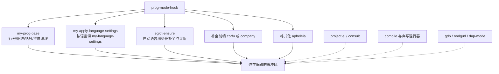
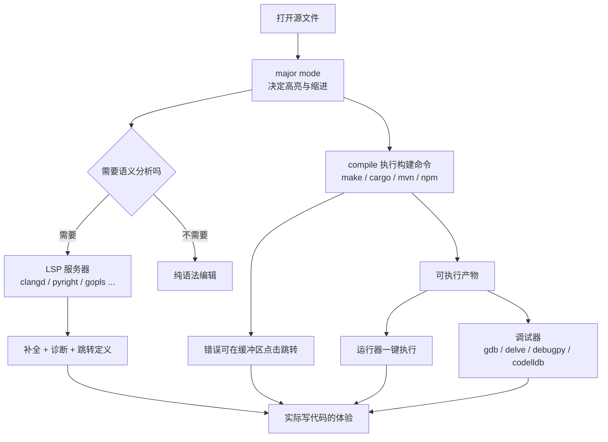

# 主流语言配置实战

> 前面几章讲的是"能力"：补全、LSP、编译、运行、调试。这一章把它们落到具体语言上，给出每种语言的完整配方——装什么、怎么配、怎么验证、哪里容易踩坑。所有配方都以"能直接抄走"为标准。

---

## 一、先把共性抽出来

### 1.1 所有编程语言的共同需求

不要为每种语言写一遍配置。先看清这些需求其实是**语言无关**的：

| 需求 | 内置能力 | 是否需要额外包 |
|------|----------|----------------|
| 语法高亮 | 各语言的 major mode（含 `*-ts-mode`） | 一般不需要 |
| 缩进与括号匹配 | `electric-pair-mode`、`show-paren-mode` | 不需要 |
| 补全候选 | `completion-at-point` + LSP | 需要补全前端（corfu 或 company） |
| 语法诊断 | `flymake` + LSP | 不需要额外包 |
| 跳转定义与引用 | `xref` + LSP | 不需要 |
| 项目内文件与搜索 | `project.el`、`rgrep` | 可选 consult / projectile |
| 编译 | `compile` | 不需要 |
| 运行 | `compile` 或自写运行器 | 不需要 |
| 调试 | `gud`、`realgud`、`dap-mode` | 视语言而定 |
| 格式化 | `apheleia` 或 LSP 的格式化 | 建议装 apheleia |
| 代码片段 | `tempel` 或 `yasnippet` | 可选 |

结论：**写一份 `prog-mode-hook` 的通用配置，再为每种语言补上差异部分。**

### 1.2 通用配置：my-prog-base

```elisp
(defun my-prog-base ()
  "所有编程模式共用的基础设置。"
  ;; 相对行号：按 C-n/C-p 或 j/k 跳转时更符合直觉
  (display-line-numbers-mode 1)
  (setq-local display-line-numbers-type 'relative)
  ;; 缩进：用空格，宽度 4（各语言可覆盖，见下一节）
  (setq-local indent-tabs-mode nil)
  (setq-local tab-width 4)
  ;; 代码不折行，长行靠横向滚动
  (setq-local truncate-lines t)
  ;; 括号配对高亮
  (show-paren-mode 1)
  (setq-local show-paren-style 'parenthesis)
  ;; 保存时自动清理行尾空白（函数定义见 3配置实践/05）
  (add-hook 'before-save-hook #'my-cleanup-before-save nil t))

(add-hook 'prog-mode-hook #'my-prog-base)
```

`prog-mode-hook` 之所以有效，是因为几乎所有编程语言的 major mode 都派生自 `prog-mode`——包括 `c-ts-mode`、`python-ts-mode`、`rust-ts-mode` 这些新型模式。给 `prog-mode-hook` 挂一次，就等于给所有语言挂上了。

注意 `add-hook` 的第四个参数 `t`：它表示**只在这个缓冲区内生效**。对 hook 来说这很重要，否则会在每个缓冲区里累积一份，越开越慢。

### 1.3 用一张表管理语言差异

```elisp
(defvar my-language-settings
  '((c-ts-mode        :indent 4 :build "cmake --build build" :run "./build/app")
    (c++-ts-mode      :indent 4 :build "cmake --build build" :run "./build/app")
    (python-ts-mode   :indent 4 :build nil                     :run "python3 %f")
    (rust-ts-mode     :indent 4 :build "cargo build"           :run "cargo run")
    (go-ts-mode       :indent 4 :build "go build ./..."        :run "go run .")
    (java-ts-mode     :indent 4 :build "mvn -q compile"        :run "mvn -q exec:java")
    (js-ts-mode       :indent 2 :build nil                     :run "node %f")
    (typescript-ts-mode :indent 2 :build "npx tsc"             :run "npx ts-node %f")
    (sh-mode          :indent 2 :build nil                     :run "bash %f")
    (lua-ts-mode      :indent 2 :build nil                     :run "lua %f"))
  "各语言的缩进宽度、构建命令与运行命令。")

(defun my-language-setting (key)
  "读取当前 major mode 对应的设置项 KEY。"
  (when-let* ((entry (assq major-mode my-language-settings)))
    (plist-get (cdr entry) key)))

(defun my-apply-language-settings ()
  "按当前缓冲区的 major mode 应用语言差异设置。"
  (when-let* ((indent (my-language-setting :indent)))
    (setq-local tab-width indent)
    (setq-local c-basic-offset indent)      ; 仅对 cc-mode 系有效，其他模式会忽略
    ))

(add-hook 'prog-mode-hook #'my-apply-language-settings)
```

这张表后面会被运行器与构建任务直接复用（见 [[emacs教程/5开发环境集成/03_运行器与构建任务|运行器与构建任务]]），这样"加一种语言"就只需要在表里加一行，而不是到处改代码。

### 1.4 整体架构



---

## 二、先确认你的 Emacs 到底支持什么

### 2.1 内置的 `*-ts-mode`

Emacs 29 起内置了大量基于 tree-sitter 的 major mode，Emacs 30 又补充了一些。**不要凭记忆假设某个模式存在**，用命令确认：

```elisp
;; 方法一：在 M-x 后面输入 -ts-mode，看补全列表里有哪些
M-x -ts-mode TAB

;; 方法二：直接问某个模式是否存在
M-x python-ts-mode RET     ; 能执行就说明存在

;; 方法三：看你的版本是否编译了 tree-sitter 支持
M-: (treesit-available-p) RET
```

在安装了 GNU Emacs 31.1 的环境中实测，`fboundp` 为真的内置模式有：

```text
bash-ts-mode        c++-ts-mode        c-or-c++-ts-mode    c-ts-mode
cmake-ts-mode       csharp-ts-mode     css-ts-mode         dockerfile-ts-mode
elixir-ts-mode      go-mod-ts-mode     go-ts-mode          go-work-ts-mode
heex-ts-mode        html-ts-mode       java-ts-mode        js-ts-mode
json-ts-mode        lua-ts-mode        mhtml-ts-mode       php-ts-mode
python-ts-mode      ruby-ts-mode       rust-ts-mode        toml-ts-mode
tsx-ts-mode         typescript-ts-mode yaml-ts-mode
```

其中 `lua-ts-mode`、`php-ts-mode`、`html-ts-mode`、`elixir-ts-mode`、`heex-ts-mode` 是 **Emacs 30 新增**的（这一点从 Emacs 30 的 `etc/NEWS` 可以确认）。你的版本可能略有出入，**以本文给出的三条确认命令为准**。

注意：**没有内置的 Dart 模式**，Dart 要用 MELPA 上的 `dart-mode`。

### 2.2 tree-sitter 语法要单独安装

`*-ts-mode` 只是前端，真正的解析器（语法）需要另外装。Emacs 内置了安装命令：

```elisp
;; 查看某个语言的语法是否已就绪
M-: (treesit-language-available-p 'python) RET

;; 交互式安装语法（会下载并编译，需要 C 编译器与 git）
M-x treesit-install-language-grammar RET python RET
```

如果输出 `treesit-available-p` 为 `nil`，说明你的 Emacs 编译时没有启用 tree-sitter，此时应改用传统模式（`python-mode`、`c-mode` 等），它们功能上同样可用，只是缩进与高亮的实现机制不同。

### 2.3 内置 ts-mode 与第三方 mode 怎么选

| 情况 | 建议 |
|------|------|
| 内置有对应的 `*-ts-mode` 且语法能装上 | 优先用内置的，升级更省心、与 LSP 配合良好 |
| 内置没有（Dart、Lua 之外的老版本、小众语言） | 用 MELPA 上的第三方 mode |
| 你想要的语言社区包提供了更强功能 | 两者都试；第三方包在文档、片段、工具链集成上往往更全 |
| 你的 Emacs 没编译 tree-sitter | 一律用传统 mode，配置写法相同（把 hook 名换掉即可） |

---

## 三、语言与工具链总表

先看一张全景图：**每种语言都要经过"识别 → 分析 → 构建 → 运行 → 调试"这五段，Emacs 在其中扮演的角色是连接器。**



这张图解释了为什么"配置一种语言"永远不止是装一个 mode：**mode 只是入口，真正决定体验的是它后面接的几个外部程序。**

这张表是本章的索引。**每一条都在本节后面的实战小节里展开。**

| 语言 | major mode | LSP 服务器（安装方式） | 调试方式 | 格式化工具 |
|------|------------|------------------------|----------|------------|
| C / C++ | `c-ts-mode` / `c++-ts-mode`（29 起内置） | `clangd`（系统包管理器） | `M-x gdb`（内置 GUD） | clang-format |
| Python | `python-ts-mode`（29 起内置） | `pyright`（npm）或 `pylsp`（pip） | `M-x pdb` 或 dap + debugpy | black / ruff |
| Rust | `rust-ts-mode`（29 起内置） | `rust-analyzer`（rustup） | dap + codelldb，或 `rust-gdb` | rustfmt |
| Java | `java-ts-mode`（29 起内置） | `jdtls`（Eclipse）或 `lsp-java`（MELPA） | dap + java-debug | google-java-format |
| Go | `go-ts-mode`（29 起内置） | `gopls`（go install） | dap + delve（`dlv dap`） | gofmt / goimports |
| JavaScript / TypeScript | `js-ts-mode`、`tsx-ts-mode`（29 起内置） | `typescript-language-server`（npm） | dap + js-debug | prettier |
| Dart / Flutter | `dart-mode`（MELPA） | Dart SDK 自带的 language server | dap 或 Flutter DevTools | `dart format` |
| Shell | `sh-mode` / `bash-ts-mode`（29 起内置） | `bash-language-server`（可选） | `M-x pdb`? 用 `bashdb` + realgud | shfmt |
| Lua | `lua-ts-mode`（30 起内置）或 `lua-mode`（MELPA） | `lua-language-server` | dap 或 `M-x gdb` 附加 | stylua |
| HTML / CSS / JSON / YAML | `html-ts-mode`、`css-ts-mode`、`json-ts-mode`、`yaml-ts-mode` | 一般不需要 | 不需要 | prettier |
| Markdown / Org | `markdown-mode`（MELPA）、Org（内置） | 不需要 | 不需要 | prettier 或手动 |

**通用原则：语言服务器由各自语言的生态提供，Emacs 只负责连接它。** 所以安装 LSP 的顺序永远是：先装服务器（命令行能跑），再配置 Emacs（`eglot-ensure`）。

---

## 四、逐语言实战

下面每种语言的模板都遵循同一个结构：**需要的包 → 语言服务器安装 → 配置片段 → 验证步骤 → 常见坑**。

统一的 LSP 配置写法（Emacs 29 起 eglot 内置，不需要安装）：

```elisp
;; eglot 在遇到支持的语言时自动启动
(add-hook 'c-ts-mode-hook #'eglot-ensure)
(add-hook 'python-ts-mode-hook #'eglot-ensure)
```

`eglot-ensure` 的优点是省心：进入对应模式就启动服务器。缺点是**打开一个没有项目的孤立文件时也会尝试启动**，可能拖慢打开速度。如果在意启动速度，改成手动 `M-x eglot`，或按项目条件启用：

```elisp
(defun my-eglot-maybe ()
  "只在属于某个项目时启动 eglot。"
  (when (project-current nil)
    (eglot-ensure)))
```

### 4.1 C 与 C++

**需要的东西**：`clangd`（服务器）、`cmake`（构建）、`gdb`（调试）、`clang-format`（格式化）。

```bash
# Debian / Ubuntu
sudo apt install clangd cmake gdb clang-format

# Arch Linux
sudo pacman -S clang cmake gdb clang-format

# macOS
brew install llvm cmake gdb        # macOS 上更常用 lldb，见下
```

**配置片段**：

```elisp
(use-package c-ts-mode
  :ensure nil                        ; 内置，不需要从仓库安装
  :mode (("\\.c\\'"   . c-ts-mode)
         ("\\.h\\'"   . c-ts-mode)
         ("\\.cc\\'"  . c++-ts-mode)
         ("\\.cpp\\'" . c++-ts-mode)
         ("\\.hpp\\'" . c++-ts-mode))
  :hook ((c-ts-mode . eglot-ensure)
         (c++-ts-mode . eglot-ensure))
  :config
  (setq c-ts-mode-indent-style 'linux)   ; 也可用 'gnu、'k&r、'bsd
  (setq c-ts-mode-indent-offset 4))
```

**让 clangd 拿到准确的编译参数**是 C/C++ 配置里最关键的一步。clangd 需要 `compile_commands.json`，而 CMake 可以生成它：

```bash
# 关键参数：导出编译数据库
cmake -S . -B build -DCMAKE_EXPORT_COMPILE_COMMANDS=ON
```

clangd 会在**源文件所在目录及其父目录**里查找 `compile_commands.json`。文件放在 `build/` 时，源文件在 `src/` 就找不到，最简单的做法是在项目根目录做一个软链接：

```bash
ln -s build/compile_commands.json compile_commands.json
```

**编译与调试**：`M-x compile RET cmake --build build RET`，错误信息可点击跳转（详见 [[emacs教程/5开发环境集成/02_编译器集成|编译器集成]]）。调试用内置的 GUD：

```elisp
M-x gdb RET
;; 在 minibuffer 里补全成：gdb -i=mi ./build/app
M-x gdb-many-windows RET   ; 六窗口布局，看变量、栈、断点
```

**验证步骤**：

1. 打开一个 `.c` 文件，确认 mode line 显示 `C-ts` 或 `C`。
2. `M-: (eglot-current-server) RET` 应返回非 nil。
3. 敲一个不存在的函数名，应出现诊断提示（波浪线或 fringe 标记）。
4. `C-h v c-ts-mode-indent-offset RET` 确认你的版本里这个变量名存在（不同版本缩进变量有过变动，这是最容易被绊住的地方）。

**常见坑**：`clangd` 不在 `PATH`（macOS 上 brew 装的 llvm 需要手动加路径）；没有 `compile_commands.json` 时补全能工作但找不到项目头文件；大项目首次索引时 CPU 占用高，属正常。

### 4.2 Python

**需要的东西**：语言服务器（`pyright` 或 `pylsp`）、`debugpy`（调试）、格式化工具（`black` 或 `ruff`）。

```bash
# 语言服务器（二选一）
npm install -g pyright                  # 需要 Node.js
pip install python-lsp-server           # 纯 Python 方案

# 调试与格式化
pip install debugpy black ruff
```

**配置片段**：

```elisp
(use-package python
  :ensure nil
  :mode (("\\.py\\'" . python-ts-mode))
  :hook (python-ts-mode . eglot-ensure)
  :config
  ;; 不要用 TAB 补全缩进时的"智能缩进"猜测
  (setq python-indent-guess-indent-offset nil)
  (setq python-indent-offset 4))

;; 虚拟环境：pyvenv 让 Emacs 用项目自己的解释器与包
(use-package pyvenv
  :ensure t
  :config
  (pyvenv-mode 1))

;; 或者用 direnv（项目里 .envrc 声明环境）：
;; (use-package envrc :ensure t :config (envrc-global-mode 1))
```

**虚拟环境是关键**。如果 Emacs 用系统 Python 而项目在 venv 里，补全与诊断会全部错位。两种做法：

| 做法 | 使用方式 | 适合 |
|------|----------|------|
| `pyvenv` | `M-x pyvenv-activate RET ~/proj/.venv RET` | 手动切换，直观 |
| `envrc` + direnv | 项目里放 `.envrc` 写 `layout python`，进目录自动生效 | 项目多、希望自动化 |

**运行与测试**：

```elisp
M-x compile RET python3 -m pytest -q RET   ; 跑测试
M-x compile RET python3 main.py RET        ; 跑脚本
```

**验证步骤**：`.py` 文件进入 `Python-ts` 模式；`M-: (eglot-current-server) RET` 非 nil；故意写一个未定义的变量，应出现诊断；`M-x pyvenv-active-virtualenv RET` 显示当前环境（若用 pyvenv）。

**常见坑**：`pyright` 首次运行要下载 Node 依赖，网络不通时会静默失败，用 `M-x eglot-events-buffer` 看日志；虚拟环境没激活导致"明明装了包却报未定义"；`python-ts-mode` 需要 tree-sitter 语法，没装时退回 `python-mode`（把 hook 名一并改掉）。

### 4.3 Rust

**需要的东西**：`rust-analyzer`、`rustfmt`、`clippy`。

```bash
# 用 rustup 安装组件（推荐）
rustup component add rust-analyzer rustfmt clippy

# 确认
rust-analyzer --version
```

```elisp
(use-package rust-ts-mode
  :ensure nil
  :mode (("\\.rs\\'" . rust-ts-mode))
  :hook (rust-ts-mode . eglot-ensure)
  :config
  (setq rust-ts-mode-indent-offset 4))
```

**构建与运行**：`M-x compile RET cargo build RET`、`cargo test`、`cargo clippy`。项目根目录有 `Cargo.toml` 时 `project.el` 会自动识别，`C-x p c` 可以直接在项目根编译。

**调试**：Rust 的调试常见两条路。一是用 `rust-gdb`/`rust-lldb` 包装脚本配合内置 GUD：

```elisp
M-x gdb RET    ; 命令改成 rust-gdb -i=mi target/debug/myapp
```

二是用 dap-mode 加 codelldb 适配器（配置较复杂，但能在 Emacs 里看到变量树与调用栈）。初学者建议先用 `M-x gdb`，熟悉之后再上 DAP。

**常见坑**：`rust-analyzer` 版本与工具链不匹配时会在 `*eglot events*` 里报协议错误；`cargo clippy` 的警告默认不会被 eglot 显示，需要 `cargo check` 的输出来源或 flymake 配置。

### 4.4 Java

Java 的服务器（Eclipse JDT Language Server，简称 jdtls）安装相对麻烦，有两个方向。

**方向一：用 lsp-java（省事）**

```elisp
(use-package lsp-java
  :ensure t
  :hook (java-ts-mode . lsp))
```

`lsp-java` 会自动下载并管理 jdtls，还会配置 Maven/Gradle 的类路径。代价是引入了 lsp-mode 这一整套（内存占用高于 eglot）。

**方向二：eglot + 手动安装 jdtls（轻量）**

jdtls 需要自己从 Eclipse 项目下载，或通过发行版包管理器安装（各发行版名称不一）。装好后确保 `jdtls` 在 `PATH` 中，然后：

```elisp
(use-package java-ts-mode
  :ensure nil
  :mode (("\\.java\\'" . java-ts-mode))
  :hook (java-ts-mode . eglot-ensure))
```

如果 eglot 没有自动识别，把服务器显式写进配置：

```elisp
(with-eval-after-load 'eglot
  (add-to-list 'eglot-server-programs
               '(java-ts-mode . ("jdtls"))))
```

**构建**：`M-x compile RET mvn -q compile RET` 或 `gradle build`。注意 Maven/Gradle 的守护进程会常驻内存，服务器上跑的时候留意资源。

**常见坑**：jdtls 需要 JDK 17 以上；项目没有 `pom.xml`/`build.gradle` 时 jdtls 无法建立类路径，补全基本不可用；`lsp-java` 与 `eglot` 不要同时启用同一个缓冲区。

### 4.5 Go

```bash
# 语言服务器与调试器
go install golang.org/x/tools/gopls@latest
go install github.com/go-delve/delve/cmd/dlv@latest

# 确认 $GOPATH/bin 在 PATH 中
gopls version
```

```elisp
(use-package go-ts-mode
  :ensure nil
  :mode (("\\.go\\'" . go-ts-mode))
  :hook (go-ts-mode . eglot-ensure))
```

**构建、运行与测试**：

```elisp
M-x compile RET go build ./... RET
M-x compile RET go test ./... RET
M-x compile RET go run . RET
```

**调试**：delve 自带 DAP 模式（`dlv dap`），dap-mode 里有 Go 的适配模块（用 `M-x` 输入 `dap-go` 看补全能看到对应命令）。配置方式与其他 DAP 语言一致：注册一个 launch 模板，指向 `dlv`。

**常见坑**：`GOPATH/bin` 不在 `PATH` 里是新手最常见的失败原因；模块代理（`GOPROXY`）在国内需要配置，否则 `go install` 会超时；`gopls` 对超大仓库的内存占用需要留意，可以在设置里关掉不必要的分析项。

### 4.6 JavaScript 与 TypeScript

```bash
npm install -g typescript typescript-language-server
```

```elisp
(use-package js
  :ensure nil
  :mode (("\\.js\\'"    . js-ts-mode)
         ("\\.mjs\\'"   . js-ts-mode)
         ("\\.ts\\'"    . typescript-ts-mode)
         ("\\.tsx\\'"   . tsx-ts-mode))
  :hook ((js-ts-mode . eglot-ensure)
         (typescript-ts-mode . eglot-ensure)
         (tsx-ts-mode . eglot-ensure))
  :config
  (setq js-indent-level 2))
```

**诊断与格式化分工**：类型与语法问题由 eglot（tsserver）负责；代码风格问题（ESLint、Prettier）建议交给专门工具：

```elisp
;; flymake-eslint：把 eslint 的诊断接进内置的 flymake
(use-package flymake-eslint
  :ensure t
  :hook ((js-ts-mode typescript-ts-mode tsx-ts-mode) . flymake-eslint-enable))

;; apheleia：保存时用 prettier 格式化
(use-package apheleia
  :ensure t
  :config
  (apheleia-global-mode 1))
```

**运行**：`M-x compile RET npm test RET`、`node app.js`、`npx ts-node index.ts`。`package.json` 里的 scripts 可以做成命令（见运行器章节）。

**常见坑**：项目里没有 `tsconfig.json` 时 tsserver 的判断会退化；全局安装的 `typescript-language-server` 与项目本地版本不一致时可能出现"补全有但类型错"；monorepo 中要在子包目录打开文件，否则项目根识别错误。

### 4.7 Dart 与 Flutter

Emacs 没有内置 Dart 模式，用 MELPA 上的 `dart-mode`（这一点已确认：MELPA 上有 `dart-mode`，GNU ELPA 上没有）。

```elisp
(use-package dart-mode
  :ensure t
  :mode (("\\.dart\\'" . dart-mode))
  :hook (dart-mode . eglot-ensure)
  :config
  (setq dart-format-on-save t))

;; 可选：flycheck 的 Dart 集成
(use-package flycheck
  :ensure t
  :config
  (global-flycheck-mode 1))
```

Dart 的 Language Server 随 SDK 一起提供（`dart language-server --lsp`），装好 Dart/Flutter SDK 后 eglot 应能自动识别。若没有识别，显式指定：

```elisp
(with-eval-after-load 'eglot
  (add-to-list 'eglot-server-programs
               '(dart-mode . ("dart" "language-server" "--lsp"))))
```

**运行与测试**：

```elisp
M-x compile RET dart run bin/main.dart RET
M-x compile RET flutter run RET          ; 需要设备或模拟器
M-x compile RET dart test RET
```

**常见坑**：Flutter 项目要确保 Emacs 的 `PATH` 里有 `flutter` 与 `dart`（图形界面启动时读不到 shell 的 `PATH` 是经典问题，见安装章节的 `exec-path-from-shell`）；`flutter run` 是交互式命令，用 `M-x compile` 会失去键盘交互，更好的做法是在 vterm 里运行。

配套语言教程见 [[dart/dart目录|Dart 教程]]。

### 4.8 Shell / Bash

```elisp
(use-package sh-script
  :ensure nil
  :mode (("\\.sh\\'"  . bash-ts-mode)
         ("\\.bash\\'" . bash-ts-mode)
         ("\\.zsh\\'"  . sh-mode))
  :config
  (setq sh-basic-offset 2)
  (setq sh-indentation 2))
```

**检查**：`shellcheck` 是 Shell 脚本最重要的静态检查工具。两种接入方式：

```elisp
;; 方式一：flymake-shellcheck（MELPA 上确有此包）
(use-package flymake-shellcheck
  :ensure t
  :hook (sh-mode . flymake-shellcheck-load))

;; 方式二：flycheck（自带 sh-shellcheck checker）
;; (use-package flycheck :ensure t :hook (sh-mode . flycheck-mode))
```

```bash
# 安装 shellcheck
sudo apt install shellcheck      # Debian / Ubuntu
sudo pacman -S shellcheck        # Arch
brew install shellcheck          # macOS
```

**常见坑**：`bash-ts-mode` 需要 tree-sitter 的 bash 语法；写 `sh-mode` 的 hook 时要注意 `bash-ts-mode` 派生自 `sh-mode`，两者的 hook 会都触发，别把同一件事注册两遍。

### 4.9 Lua

Emacs 30 起内置 `lua-ts-mode`；老版本用 MELPA 的 `lua-mode`。

```elisp
(use-package lua-ts-mode
  :ensure nil
  :mode (("\\.lua\\'" . lua-ts-mode))
  :hook (lua-ts-mode . eglot-ensure)
  :config
  (setq lua-ts-indent-offset 2))
```

语言服务器用 `lua-language-server`（需自行下载或从包管理器安装）。格式化用 `stylua` + apheleia。

如果你在写 Neovim 配置，配合本仓库的 [[lua-tutorial/00-lua简介|Lua 教程]] 会更顺。

### 4.10 Web：HTML、CSS、JSON、YAML

```elisp
(use-package web-mode                    ; MELPA 上的多合一模板模式
  :ensure t
  :mode (("\\.html?\\'" . web-mode)
         ("\\.vue\\'"   . web-mode)
         ("\\.erb\\'"   . web-mode))
  :config
  (setq web-mode-markup-indent-offset 2)
  (setq web-mode-css-indent-offset 2)
  (setq web-mode-code-indent-offset 2))

;; JSON 与 YAML 用内置的 ts 模式即可
(use-package json-ts-mode :ensure nil :mode (("\\.json\\'" . json-ts-mode)))
(use-package yaml-ts-mode :ensure nil :mode (("\\.ya?ml\\'" . yaml-ts-mode)))
```

对于单一格式的文件（纯 HTML、纯 CSS），内置的 `html-ts-mode`、`css-ts-mode` 更轻，推荐优先用内置；只有在混合模板（Vue 单文件组件、ERB）场景才需要 `web-mode`。

### 4.11 Markdown 与 Org 写作

```elisp
(use-package markdown-mode
  :ensure t
  :mode (("README\\.md\\'" . gfm-mode)
         ("\\.md\\'"       . markdown-mode))
  :config
  (setq markdown-command "pandoc")       ; 预览时用它渲染，需要先装 pandoc
  (setq markdown-enable-math t))

;; 拼写检查（内置 flyspell 或 MELPA 上的 jinx）
(use-package jinx
  :ensure t
  :hook ((markdown-mode . jinx-mode)
         (org-mode . jinx-mode)))
```

本仓库的文档全部是 Markdown 加 Obsidian 双链接。在 Emacs 里编辑它们时，用 `consult-ripgrep` 做全库检索、用 Magit 提交，是一套很顺手的组合，具体配置见 [[emacs教程/6扩展应用/05_文件管理与笔记系统|文件管理与笔记系统]]。

---

## 五、项目级配置

不同项目对同一种语言的要求常常不同（缩进、编译命令、虚拟环境）。`project.el` 加 `.dir-locals.el` 可以在不改全局配置的前提下按项目生效。

```elisp
;; 放在项目根目录的 .dir-locals.el
((c-ts-mode
  . ((c-ts-mode-indent-offset . 2)
     (eval . (setq-local my-project-run-command "./build/app"))))
 (python-ts-mode
  . ((pyvenv-activate . "/home/me/proj/.venv")
     (fill-column . 88)))
 (nil
  . ((my-cleanup-on-save . nil))))     ; nil 表示对所有模式生效
```

两个必须知道的注意点：

1. **变量必须被 Emacs 认为是"安全"的**，否则每次打开都会问你。用 `M-x add-file-local-variable-prop-line` 或直接在 Customize 里认可一次即可。
2. **`eval` 形式会被要求确认**，因为它在你的 Emacs 里执行任意代码。打开陌生仓库时不要盲目同意——`(setq enable-local-variables :safe)` 可以让 Emacs 只应用安全变量、直接拒绝 `eval`，这是更稳妥的默认值。

`.editorconfig` 是另一个跨编辑器的选择。**Emacs 30 起内置了 EditorConfig 支持**（这一点在 Emacs 30 的 NEWS 里明确写了，包名就是 EditorConfig，通过全局 minor mode `editorconfig-mode` 启用），因此现在可以这样写：

```elisp
(editorconfig-mode 1)
```

老版本 Emacs 需要从 MELPA 安装 `editorconfig` 包，用法相同。

---

## 六、新文件自动插入模板

写 C 文件时自动带上文件头注释、写 Python 时带上编码声明，是能省下大量重复劳动的小配置。Emacs 内置的 `auto-insert` 正好做这件事：

```elisp
(require 'auto-insert)
(setq auto-insert-query nil)          ; 不要每次都问

(defun my-c-file-header ()
  "插入 C 源文件头注释。"
  (insert (format "/* %s\n * 功能：\n * 创建：%s\n * 作者：%s\n */\n\n"
                  (file-name-nondirectory (buffer-file-name))
                  (format-time-string "%Y-%m-%d")
                  user-full-name))
  (goto-char (point-max)))

(defun my-py-file-header ()
  "插入 Python 文件头。"
  (insert "#!/usr/bin/env python3\n# -*- coding: utf-8 -*-\n"
          (format "# 创建：%s\n\n" (format-time-string "%Y-%m-%d")))
  (goto-char (point-max)))

;; 按文件名正则关联模板
(define-auto-insert "\\.c\\'"   #'my-c-file-header)
(define-auto-insert "\\.h\\'"   #'my-c-file-header)
(define-auto-insert "\\.py\\'"  #'my-py-file-header)

(auto-insert-mode 1)
```

另一种思路是用 `skeleton`（内置）或 `tempel`/`yasnippet` 做可交互的模板：

```elisp
(define-skeleton my-cpp-file-skeleton
  "插入 C++ 文件骨架。"
  "文件用途："
  "#include <iostream>\n\n"
  "// " str "\n"
  "int main() {\n"
  "    std::cout << \"hello\" << std::endl;\n"
  "    return 0;\n"
  "}\n")
```

**注意**：`auto-insert` 只在**新建文件**（缓冲区为空且文件不存在）时触发，打开已有文件不会插入任何东西。

---

## 七、多语言 monorepo 怎么处理

一个仓库里同时有 C++、Python、TypeScript 时，最容易出问题的是**语言服务器的项目根识别**。三条实用规则：

1. **在每个子项目目录里打开文件**，而不是从仓库根打开。`project.el` 的 `project-current` 会向上查找项目标记文件（`package.json`、`Cargo.toml`、`pyproject.toml`、`CMakeLists.txt` 等），从根打开会让所有语言都以仓库根为项目，导致服务器扫描过多文件。
2. **用 `.dir-locals.el` 按目录定制**，例如在 `frontend/` 下指定 `js-indent-level` 为 2、在 `backend/` 下指定 Python 的解释器。
3. **按需启动语言服务器**。同时开着五个 LSP 会让内存占用翻倍，把 `eglot-ensure` 换成"按项目类型启用"，比如何时该启动由 `my-eglot-maybe` 判断。

与 [[多语言工程化/多语言工程化目录|多语言工程化]] 一章配合阅读，可以理解"为什么跨语言项目的工具链统一比单语言项目难得多"。

---

## 八、性能与取舍

| 现象 | 原因 | 对策 |
|------|------|------|
| 打开大项目文件要等几秒 | eglot 启动服务器并索引 | 用 `eglot-autoshutdown` 让闲置服务器退出；只在项目内启用 eglot |
| 多个 LSP 同时运行，内存吃紧 | 每种语言一个服务器进程 | 关闭不用的项目缓冲区，或按需手动 `M-x eglot` |
| 输入时卡顿 | flymake 的诊断频率、格式化保存钩子 | 调大 `flymake-no-changes-timeout`；格式化改手动或只在需要时 |
| 保存时明显停顿 | `before-save-hook` 里的格式化与清理 | 用 apheleia（异步格式化）替代同步格式化 |
| tree-sitter 首次打开慢 | 语法文件首次编译 | 一次性完成，之后走缓存；用 `treesit-install-language-grammar` 提前装好 |

一条经验：**LSP 带来的收益在"读代码"时最大，在"改一行小文件"时反而是负担。** 如果你的 Emacs 打开一个 50 行的脚本要等两秒，那不是 Emacs 慢，是你给了它不该做的工作。

---

## 九、验证清单

每配好一种语言，用下面三条快速确认是否真的可用（以 Python 为例，其他语言替换命令即可）：

```elisp
;; 1. major mode 是否正确
;;    打开文件后看 mode line，或用：
M-: major-mode RET

;; 2. 语言服务器是否在运行
M-: (eglot-current-server) RET

;; 3. 端到端验证：跳转定义
;;    把光标放在一个函数调用上按 M-. ，应跳到定义处（不是报错也不是跳到别处）
M-.
```

三条全过，说明"高亮 + 补全/诊断 + 导航"这条链路是通的。接下来再验证编译与运行：`M-x compile` 能产出可点击的错误，`M-x recompile` 能重复。

---

## 十、完整的 my-languages.el

把本章内容组织成一个模块，可以直接放进 `lisp/` 目录：

```elisp
;;; my-languages.el --- 各语言开发环境配置  -*- lexical-binding: t; -*-

;;; Commentary:
;; 一份"统一抽象 + 语言差异表"的语言配置：
;; 共性部分放 my-prog-base，差异部分放 my-language-settings。
;; 新增语言只需在表里加一行，再补一个 hook。

;;; Code:

(require 'seq)
(require 'project)

;;;###autoload
(defvar my-language-settings
  '((c-ts-mode          :indent 4 :build "cmake --build build"      :run "./build/app")
    (c++-ts-mode        :indent 4 :build "cmake --build build"      :run "./build/app")
    (python-ts-mode     :indent 4 :build nil                        :run "python3 %f")
    (rust-ts-mode       :indent 4 :build "cargo build"              :run "cargo run")
    (go-ts-mode         :indent 4 :build "go build ./..."           :run "go run .")
    (java-ts-mode       :indent 4 :build "mvn -q compile"           :run "mvn -q exec:java")
    (js-ts-mode         :indent 2 :build nil                        :run "node %f")
    (typescript-ts-mode :indent 2 :build "npx tsc"                  :run "npx ts-node %f")
    (tsx-ts-mode        :indent 2 :build "npx tsc"                  :run "npx ts-node %f")
    (dart-mode          :indent 2 :build "dart analyze"             :run "dart run %f")
    (sh-mode            :indent 2 :build nil                        :run "bash %f")
    (bash-ts-mode       :indent 2 :build nil                        :run "bash %f")
    (lua-ts-mode        :indent 2 :build nil                        :run "lua %f"))
  "各语言的缩进宽度、构建命令与运行命令模板。%f 表示当前文件。")

(defun my-language-setting (key)
  "读取当前 major mode 对应的设置项 KEY，没有则返回 nil。"
  (when-let* ((entry (assq major-mode my-language-settings)))
    (plist-get (cdr entry) key)))

(defun my-prog-base ()
  "所有编程模式共用的基础设置。"
  (display-line-numbers-mode 1)
  (setq-local display-line-numbers-type 'relative)
  (setq-local indent-tabs-mode nil)
  (setq-local truncate-lines t)
  (when-let* ((indent (my-language-setting :indent)))
    (setq-local tab-width indent)))

(add-hook 'prog-mode-hook #'my-prog-base)

(defun my-eglot-maybe ()
  "只在属于某个项目时启动 eglot，避免打开孤立文件时也启动服务器。"
  (when (project-current nil)
    (eglot-ensure)))

;; 通用：所有编程模式都尝试启动 LSP（按需可改成逐语言添加）
(add-hook 'prog-mode-hook #'my-eglot-maybe)

(provide 'my-languages)
;;; my-languages.el ends here
```

在 `init.el` 里加载：

```elisp
(add-to-list 'load-path (expand-file-name "lisp" user-emacs-directory))
(require 'my-languages)
```

---

## 小结

- 先用 `prog-mode-hook` 写一份通用配置，再用一张 `my-language-settings` 表管理语言差异。**新增语言只加一行**，这是本章最重要的结构决策。
- 内置的 `*-ts-mode` 优先用，但要用 `M-x xxx-ts-mode` 或 `M-: major-mode` 确认它在你版本里存在；Dart 没有内置模式，用 MELPA 的 `dart-mode`。
- LSP 的顺序永远是"先装服务器、再让 Emacs 连接"。eglot 自 Emacs 29 起内置，是多数场景下最省心的选择；需要更重的 UI 与生态时才考虑 lsp-mode。
- C/C++ 的关键是 `compile_commands.json`；Python 的关键是虚拟环境；Java 的关键是 jdtls 与项目文件；这些"关键"都不是 Emacs 的问题，而是语言工具链的问题。
- 项目级差异用 `.dir-locals.el` 或 `.editorconfig`（Emacs 30 起内置支持）解决，不要污染全局配置。
- 配置完成后的验收标准只有三条：mode 正确、服务器在跑、`M-.` 能跳转定义。

---

## 相关章节

- [[emacs教程/5开发环境集成/01_补全与LSP|补全与 LSP]]：eglot 与 lsp-mode 的完整对比与配置
- [[emacs教程/5开发环境集成/02_编译器集成|编译器集成]]：compile 框架与错误跳转
- [[emacs教程/5开发环境集成/03_运行器与构建任务|运行器与构建任务]]：把本章的运行命令做成一件按键
- [[emacs教程/5开发环境集成/04_调试器集成|调试器集成]]：GUD、realgud 与 dap-mode
- [[emacs教程/4插件开发/03_编写MajorMode与语法高亮|编写 Major Mode 与语法高亮]]：tree-sitter 与 font-lock 的原理
- [[c语言教程/c目录|C 语言教程]]、[[cpp教程/cpp目录|C++ 教程]]、[[python/python目录|Python 教程]]、[[rust/rust目录|Rust 教程]]、[[java/java目录|Java 教程]]、[[dart/dart目录|Dart 教程]]
