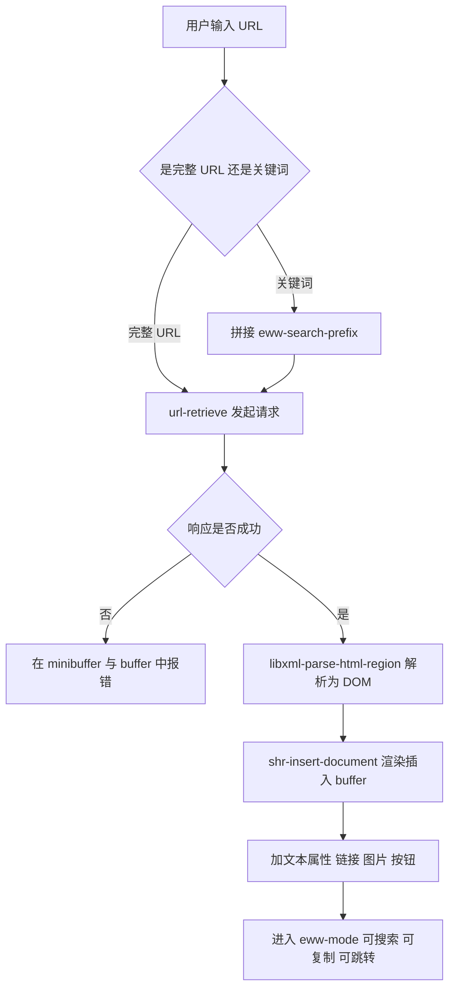
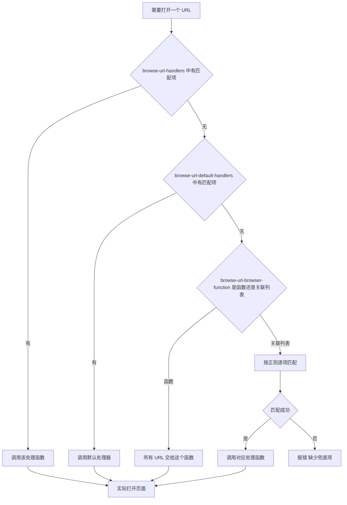

# 内置浏览器 EWW

> EWW 是 Emacs 自带的纯文本网页浏览器：它没有 JavaScript 引擎，因此不是 Chrome 的替代品，但恰好能把「查文档、读手册、看 API 返回」这类工作留在编辑器里完成。本篇讲清它的能力边界、渲染核心 shr、完整键位、与系统浏览器的分工，以及 xwidget-webkit 的真实可用范围。

---

## 一、EWW 是什么，能做什么，不能做什么

### 1.1 一句话定位

EWW 的全称是 Emacs Web Wowser，是 Emacs 内置（built-in）的网页浏览器，不需要从 ELPA 或 MELPA 安装任何包。它与编辑器共享同一套基础设施：缓冲区（buffer）、窗口（window）、键位映射（keymap）、文本属性（text property）和检索系统。这意味着你在网页里看到的每一个链接、每一段文字，都可以像普通文本一样被 `isearch` 搜索、被 `org-store-link` 记录、被 Elisp 函数处理。

EWW 的工作方式是把 HTML 解析成 DOM（文档对象模型），然后交给一个叫 shr 的渲染器，把 DOM 转成带文本属性的 Emacs 缓冲区内容。整个过程中没有任何字节码解释器参与，网页里的 `script` 标签内容会被直接忽略。

### 1.2 根本限制：没有 JavaScript 引擎

理解 EWW 的关键只有一条：**它不执行 JavaScript**。

这条限制会连锁地决定很多事情。现代网页的正文、导航、评论、按钮往往都由 JavaScript 在浏览器里动态生成，服务器发回的原始 HTML 只是一个空壳加一堆脚本引用。EWW 拿到这个空壳，渲染出来就是一片空白或者几行导航文字。你无法「配置」出一个解决方案，因为问题不在配置，而在架构上缺少一个 JS 运行时。

由此可以推出一条实用判断规则：**如果一个网站在关闭 JavaScript 后仍然能读到正文，EWW 就能用；如果关闭 JavaScript 后页面空白，EWW 就没辙。** 你可以在系统浏览器里临时禁用 JavaScript 来预先判断，也可以用 `curl` 抓取原始 HTML 看看内容是否真的在里面。

### 1.3 可行与不可行网站对照表

下表按「原始 HTML 是否已含正文」来分类。这不是精确的逐站点清单，网站改版会改变结论，但它给出了判断依据。

| 网站类型 | EWW 可用性 | 原因与说明 |
| --- | --- | --- |
| GNU/FSF 手册、Info 在线版 | 可用 | 静态 HTML，正文完整，最典型的使用场景 |
| Python、Rust、Go 等语言官方文档 | 可用 | 文档站多为静态生成，正文在 HTML 里 |
| RFC、IETF、POSIX 等标准文档 | 可用 | 纯结构文本，渲染效果接近原始排版 |
| 维基百科条目正文 | 可用 | 正文在 HTML 中；编辑、折叠等交互功能不可用 |
| Stack Overflow 问答正文 | 可用 | 问答内容服务端渲染；投票等交互不可用 |
| 博客、新闻、个人站点 | 多数可用 | 静态站点生成器产物几乎都能读 |
| GitHub 仓库文件、README | 部分可用 | 页面重度依赖 JS，建议改用 `raw.githubusercontent.com` 的原始文件或 Git 客户端 |
| 搜索引擎结果页 | 部分可用 | DuckDuckGo 的 `html` 端点可用；Google、Bing 的默认页面不可用 |
| 视频网站（如 YouTube） | 不可用 | 播放器、推荐、评论全部由 JS 生成；应交给外部浏览器或 mpv |
| 社交平台信息流 | 不可用 | 时间线由 JS 拉取并渲染，静态 HTML 中无内容 |
| 网页邮件客户端、在线文档 | 不可用 | 单页应用（SPA），无 JS 则空白 |
| 需要验证码或人机校验的登录页 | 不可用 | 校验脚本无法执行，登录流程会卡住 |
| 地图、在线表格、在线 IDE | 不可用 | 交互密集，完全依赖 JS 与 Canvas |
| Cloudflare 等拦截页 | 不可用 | 需要执行 JS 挑战才能进入，EWW 停在拦截页 |

### 1.4 它和系统浏览器不是竞争关系

把 EWW 当成「不完整的 Chrome」会一直别扭；把它当成「编辑器内的文档阅读器 + 链接处理管道」就顺了。推荐的日常分工是：查语言文档、读手册、看 API 返回、读纯文本站点用 EWW；视频、交互式后台、需要登录的服务用系统浏览器。第五章给出的分流配置就是把这套分工写成代码，让 `browse-url` 按域名自动选择。



---

## 二、渲染引擎 shr

### 2.1 shr 是什么

shr 是 Simple HTML Renderer 的缩写，位于 `shr.el`，是 Emacs 内置的 HTML 渲染器。它接收一棵 DOM 树（由 `libxml-parse-html-region` 之类的解析器产生），把节点逐个转换成缓冲区的文本、文本属性与图像，同时负责换行、缩进、列表编号、表格对齐等排版工作。

shr 是独立的：它不知道 URL、不知道历史、不知道书签。这些「浏览器」层面的功能属于 eww。所以你可以单独调用 shr 把任意一段 HTML 渲染进任意缓冲区，这也是它在邮件和文档显示中被复用的原因。

### 2.2 为什么 shr 的配置会影响邮件和文档

shr 不只服务于 EWW。Emacs 里所有需要把 HTML 变成可读文本的地方都可以复用它，最典型的是邮件与新闻组：MIME 解码层通过变量 `mm-text-html-renderer` 选择 HTML 渲染方式，当它的取值是 `shr` 时，HTML 邮件就是用 shr 渲染的。

这带来一个重要结论：**你在 EWW 里配置的 shr 变量，会同时改变 HTML 邮件的外观。** 例如把 `shr-use-fonts` 设为 `nil` 会让网页和邮件都改用等宽字体；把 `shr-blocked-images` 设置成正则会让网页和邮件里的跟踪像素一起被拦掉。后者其实是一个免费获得的隐私收益：绝大多数邮件跟踪像素都是远程图片，屏蔽它们既清爽又安全。

如果你希望两者分开（例如网页不要图片但邮件要），可以只在 `eww-mode-hook` 里设缓冲区局部值，而不是全局设 `setq`。

### 2.3 shr 常用变量

下表列出的变量都存在于 Emacs 29 与 30 中，默认值以 Emacs 30 为准。

| 变量 | 默认值 | 作用 |
| --- | --- | --- |
| `shr-use-fonts` | `t` | 非 nil 时用比例字体渲染正文；设为 nil 则全部用等宽字体，代码类站点更整齐 |
| `shr-width` | `nil` | 渲染宽度（字符数）。nil 表示用窗口全宽；非 nil 时它**覆盖** `shr-max-width` |
| `shr-max-width` | `120` | 最大文本宽度。窗口很宽时限制行宽，避免一行拉到几百字符难以阅读 |
| `shr-max-image-proportion` | `0.9` | 图片最大占窗口宽高的比例，超出则按比例缩小 |
| `shr-discard-aria-hidden` | `nil` | 非 nil 时不渲染带 `aria-hidden="true"` 的标签，可去掉屏幕阅读器专用的重复文本 |
| `shr-blocked-images` | `nil` | 匹配此正则的图片 URL 被屏蔽；配合 `shr-allowed-images` 使用 |
| `shr-use-colors` | `t` | 是否使用网页指定的颜色 |
| `shr-fill-text` | `t` | 是否按窗口宽度填充段落；设为 nil 则不填充，可配合 `visual-line-mode` 让长行按视觉折行 |
| `shr-inhibit-images` | `nil` | 非 nil 时不显示任何图片，只留占位 |
| `shr-image-animate` | `t` | 是否播放 GIF 动画 |

关于 `shr-width` 与 `shr-max-width` 的配合，实际经验是这样：把 `shr-max-width` 设成 80 到 100 之间，`shr-width` 保持 nil，阅读体验最好。窗口窄的时候自动跟随窗口，窗口很宽的时候又不会拉成超长行。若把 `shr-width` 设成固定值，窗口再宽也不会变，反而浪费空间。

需要特别注意：当 `shr-use-fonts` 非 nil 时，这两个宽度变量的单位不是「字符数」而是「默认字体平均字符宽的倍数」。这个细节在官方文档里有明确说明，调参时容易困惑。

### 2.4 在邮件里复用 shr

如果希望 HTML 邮件也用 shr 渲染并且与网页使用同一套宽度设置，确认下面这个变量即可：

```elisp
;; 让 MIME 层用 shr 渲染 HTML 邮件正文（Emacs 29 与 30 的默认值即为 shr）
(setq mm-text-html-renderer 'shr)
```

反过来，如果你觉得 shr 渲染邮件太慢或排版不合意，可以把它设成 `gnus-w3m`（需要外部 w3m 程序）或 `html2text`（需要外部 html2text 程序）。这几个取值以及对应外部程序的可用性，可以用 `M-x customize-variable RET mm-text-html-renderer RET` 查看当前构建支持哪些。

---

## 三、EWW 的使用

### 3.1 打开页面与发起搜索

最基本的入口是 `M-x eww`。它会提示 `Enter URL or keywords`，此时有两类输入方式：

- 输入完整 URL，例如 `https://www.gnu.org/software/emacs/manual/html_node/emacs/`，直接打开页面。
- 输入任意关键词，例如 `emacs shr width`，EWW 会发现它不像 URL，于是把它拼到 `eww-search-prefix` 之后当作搜索请求发出。

也就是说，`M-x eww` 本身就是一个「地址栏 + 搜索框」二合一的入口，不需要记两个命令。`M-x eww` 支持提示历史，`M-n`／`M-p` 可以在历史输入之间翻动。

另一个命令是 `M-x eww-search-words`，它专门用于搜索。它的行为有个实用细节：**如果当前有激活的区域（region），它会用区域内的文字作为搜索词**，否则才提示你输入。这让你可以「选中一段报错信息，直接搜索」：

```elisp
;; 选中文本后搜索，避免手动复制粘贴
;; 用法：选中区域后 M-x eww-search-words
```

区域搜索默认会先询问一次是否把选中内容发送给搜索引擎，由变量 `eww-search-confirm-send-region` 控制（默认 `t`，即询问）。如果你经常做「选中即搜」并且不介意，可以关掉询问；从隐私角度考虑，保留默认值更稳妥。

```elisp
;; 关掉区域搜索的确认提示（默认 t，会询问一次）
;; 只有在你不介意把选中内容直接发给搜索引擎时才这样做
(setq eww-search-confirm-send-region nil)
```

带有前缀参数时，`M-x eww` 会在新缓冲区中打开，而不是复用默认的 EWW 缓冲区。日常使用中更常见的做法是记一个键位：

```elisp
;; 前缀参数会让 eww 在新 buffer 中打开，保留当前页面
(global-set-key (kbd "C-c w e") #'eww)
;; 选中文字后直接搜索
(global-set-key (kbd "C-c w s") #'eww-search-words)
```

### 3.2 配置默认搜索引擎

`eww-search-prefix` 决定搜索请求发往哪里，它的默认值是 `https://duckduckgo.com/html/?q=`。最后必须带 `?q=` 这样的查询参数前缀，因为 EWW 只是把关键词做 URL 编码后直接拼在后面。

换成其他搜索引擎时的正确写法：

```elisp
;; DuckDuckGo 的 html 端点：无 JS 依赖，是 EWW 下最可靠的选择（默认值）
(setq eww-search-prefix "https://duckduckgo.com/html/?q=")

;; 或者换成 Bing
;; (setq eww-search-prefix "https://www.bing.com/search?q=")

;; 或者换成 SearXNG 自建实例
;; (setq eww-search-prefix "https://searx.example.com/search?q=")
```

这里有一个值得强调的取舍：**搜索引擎的结果页必须能在无 JS 环境下工作。** Google 的默认结果页在 EWW 里基本不可用，而 DuckDuckGo 的 `html` 端点专门为无脚本客户端准备，返回的是普通 HTML 结果列表，EWW 渲染良好。所以默认值不是随意的，换搜索引擎前先用 `M-x eww` 试一下结果页是否可读。

再说一个「用搜索引擎直达」的完整键位思路：把常用站点的站内搜索也做成固定前缀，然后用不同的键位区分。

```elisp
;; 用搜索引擎直达的三种常用入口
(defun my/eww-search-with (prefix words)
  "把 WORDS 拼到 PREFIX 后交给 eww 打开。"
  (eww (concat prefix (url-hexify-string words))))

(defun my/eww-search-web (words)
  "在默认搜索引擎中搜索 WORDS。"
  (interactive "s搜索：")
  (my/eww-search-with eww-search-prefix words))

(defun my/eww-search-gnu (words)
  "在 GNU 手册站内搜索 WORDS。"
  (interactive "sGNU 手册搜索：")
  (my/eww-search-with "https://duckduckgo.com/html/?q=site%3Agnu.org+" words))

(defun my/eww-search-elisp (words)
  "限定在 Elisp 手册与邮件列表范围内搜索 WORDS。"
  (interactive "sElisp 相关搜索：")
  (my/eww-search-with
   "https://duckduckgo.com/html/?q=site%3Agnu.org%2Fsoftware%2Femacs+"
   words))

(global-set-key (kbd "C-c w g") #'my/eww-search-web)
(global-set-key (kbd "C-c w G") #'my/eww-search-gnu)
(global-set-key (kbd "C-c w l") #'my/eww-search-elisp)
```

`url-hexify-string` 是 `url-util` 提供的内置函数，负责把中文、空格、特殊符号编码成合法的查询串，避免出现请求 400 或被截断。这个函数在 Emacs 29 与 30 中行为一致。

### 3.3 书签

EWW 的书签与 Emacs 通用的书签系统是两套东西，这一点容易混淆：

- EWW 自己的书签：`M-x eww-add-bookmark` 添加当前页，`M-x eww-list-bookmarks` 列出，文件写在 `eww-bookmarks-directory` 目录下、文件名为 `eww-bookmarks`。该变量默认值就是 `user-emacs-directory`，也就是 `~/.emacs.d/`（或 `~/.config/emacs/`，取决于你用的是哪个配置目录）。
- Emacs 通用书签（`bookmark.el`）：`M-x bookmark-set` 记录的是**缓冲区中的位置**，与 URL 无关。它不能替代 EWW 书签。

两者可以配合使用：用 EWW 书签保存 URL，用 `bookmark.el` 保存「这个文件里的这一行」。若希望从书签列表里区分，注意 EWW 书签文件是纯文本的 Lisp 数据，可以直接查看和编辑。

```elisp
;; 把 EWW 书签文件放到一个单独目录，便于备份与观察
(setq eww-bookmarks-directory (expand-file-name "eww/" user-emacs-directory))
;; 该目录必须存在，否则保存书签时会报错
(make-directory eww-bookmarks-directory t)
```

如果你更希望网页链接和项目笔记混在一起，用 `org-store-link` 把 URL 存进 org 文件是更好的做法，见 3.8 节。

### 3.4 历史与前进后退

EWW 在每个缓冲区里维护一条访问历史，`l` 后退、`r` 前进，`H` 打开全局历史列表，`n`／`p` 在**同一页面内的编号链接**之间跳转（EWW 会给页面上每个链接编号，`n` 是下一个链接，`p` 是上一个）。这三组功能容易混，记住：`l`／`r` 是翻页，`n`／`p` 是页内挪动。

历史条数由 `eww-history-limit` 控制。它的作用是限制每个缓冲区记住多少条记录，设置得太大在长时间浏览后会影响内存。

```elisp
;; 每个页面缓冲区的历史深度，默认 100 对大多数场景足够
(setq eww-history-limit 100)
```

### 3.5 下载文件

`d`（`eww-download`）下载**光标所在位置的链接**；如果光标不在链接上，则下载当前页面本身。下载目录由 `eww-download-directory` 决定，它是一个特殊变量：取值可以是目录名字符串，也可以是一个无参函数（返回目录名）。默认值就是一个函数 `eww--download-directory`，其逻辑是：先看 `eww-default-download-directory`（默认 `~/Downloads/`）是否存在，存在就用它；否则尝试 XDG 的下载目录；再不行才回退到默认值。

`eww-default-download-directory` 这个变量是 Emacs 29.1 引入的，在更早的版本里不存在。要在 Emacs 29 与 30 之间写通用配置时，建议直接设 `eww-download-directory`：

```elisp
;; 指定 EWW 的下载目录：字符串形式最直观，也兼容 29 与 30
(setq eww-download-directory (expand-file-name "~/Downloads/"))
```

需要注意，EWW 的下载是同步的：文件大或网速慢时 Emacs 会卡住，直到下载结束。要下载大文件（例如发行版镜像、数据集），用外部工具（`curl`、`wget`、`aria2c`）或专门的下载管理包更合适。

### 3.6 表单提交与登录的现实问题

EWW 能提交一部分表单，实现方式是把 `form` 元素转换成可编辑的字段和按钮，你填写后按按钮提交。但现实中有若干阻力：

- 表单由 JavaScript 校验或动态生成时，字段根本不会出现在缓冲区里。
- 现代登录流程常常包含多步跳转、CSRF 令牌刷新、设备指纹脚本，缺任何一环都会失败。
- 验证码无法通过。
- 双因素认证页面往往也是单页应用。

因此给出一个明确建议：**不要在 EWW 里登录重要账号。** 这不只是「可能失败」的问题，还涉及安全（见第八章）。EWW 的正确用途是读公开内容，不是做身份验证操作。若确实需要在 Emacs 里处理已登录的 Web 服务，更可靠的路线是使用该服务提供的 API 加令牌，而不是模拟浏览器登录。

### 3.7 新缓冲区与多页面并排

EWW 默认在同一个缓冲区里反复加载新页面，这会覆盖你正在读的内容。三种应对方式：

1. 用前缀参数调用 `M-x eww`（即 `C-u M-x eww`），在新缓冲区打开。
2. 在页面上把光标放到链接上，按 `M-RET`（`eww-open-in-new-buffer`），在新缓冲区打开该链接。
3. 按 `S`（`eww-list-buffers`）列出所有 EWW 缓冲区并在其中切换，按 `s`（`eww-switch-to-buffer`）直接按名字切换。

EWW 并不是「多标签浏览器」，它的「标签」就是普通缓冲区。这反而是优势：你可以用 `C-x 3` 把两个 EWW 缓冲区并排显示，一边看手册一边看代码；也可以用 `C-x b` 按名字切换，名字可以用 `R` 改（重命名缓冲区是 Emacs 的通用功能，`M-x rename-buffer`）。

若希望缓冲区名字自动带上网页标题（比 `*eww*` 更容易辨认），打开 `eww-auto-rename-buffer`：

```elisp
;; 缓冲区名字自动改为网页标题，多页面并排时非常有用
(setq eww-auto-rename-buffer 'title)
```

这个变量接受 `nil`（不改名）、`title`、`url` 以及带格式的字符串，具体取值在 `M-x customize-variable RET eww-auto-rename-buffer RET` 里能看到完整列表。

### 3.8 把网页内容转成文本或 org

这里提供一条完全基于内置函数的路线：抓取 HTML，解析成 DOM，用 shr 渲染成纯文本，再插入当前 org 缓冲区。它不依赖任何第三方包，因此在 Emacs 29 与 30 上都能直接工作。

```elisp
(defun my/fetch-html-dom (url)
  "同步抓取 URL 并返回 (DOM . 编码) 形式的解析结果。
解析失败时返回 nil。"
  (let ((buf (url-retrieve-synchronously url t t 30)))
    (unless buf
      (error "请求失败：%s" url))
    (unwind-protect
        (with-current-buffer buf
          (goto-char (point-min))
          ;; 响应头与正文之间以一个空行分隔，跳过头部
          (unless (search-forward "\n\n" nil t)
            (error "响应中缺少头部结束标记：%s" url))
          (let ((start (point)))
            ;; libxml 只能看到当前缓冲区的字节，这里按 UTF-8 解析
            (libxml-parse-html-region start (point-max)))))
      (kill-buffer buf)))

(defun my/html-dom-to-text (dom)
  "用 shr 把 DOM 渲染成纯文本字符串。"
  (with-temp-buffer
    (let ((shr-width 100)
          (shr-use-fonts nil)
          (shr-inhibit-images t)
          (shr-blocked-images "."))
      (shr-insert-document dom))
    (buffer-substring-no-properties (point-min) (point-max))))

(defun my/eww-page-to-org (url)
  "把 URL 的正文抓成纯文本，插入当前缓冲区作为 org 引用块。"
  (interactive "s要抓取的 URL：")
  (let* ((dom (my/fetch-html-dom url))
         (text (my/html-dom-to-text dom)))
    (unless (string-match-p "\\S-" text)
      (error "抓到的正文为空，该页面可能依赖 JavaScript：%s" url))
    (insert (format "#+begin_quote\n抓取自 %s\n\n" url))
    (insert text)
    (unless (bolp) (insert "\n"))
    (insert "#+end_quote\n")
    (message "已抓取 %d 个字符" (length text))))
```

几点说明。`libxml-parse-html-region` 需要 Emacs 编译时链接了 libxml2，绝大多数发行版与官方二进制都满足；可以用 `M-: (fboundp 'libxml-parse-html-region)` 确认，返回 `t` 即可用。`shr-insert-document` 是渲染入口，EWW 内部也是调它。把 `shr-blocked-images` 设成正则 `.` 会屏蔽全部图片，适合做纯文本存档。

这个函数是同步的，页面很大时会阻塞 Emacs；在 `*scratch*` 里试小页面，确认流程通了再用于批量任务。

---

## 四、EWW 键位表

下表是 `eww-mode` 缓冲区内的主要键位。Emacs 的键位是 `C-`（Control）、`M-`（Meta，通常是 Alt）、`S-`（Shift）加字符的组合写法；`RET` 是回车，`TAB` 是制表键，`SPC` 是空格。

| 键位 | 命令 | 说明 |
| --- | --- | --- |
| `RET` | `shr-browse-url` | 打开光标处的链接。该键位来自链接文本属性上的 `shr-map`，不在 `eww-mode-map` 里 |
| `TAB` | `shr-next-link` | 跳到下一个链接 |
| `S-TAB` | `shr-previous-link` | 跳到上一个链接（与 `TAB` 反向） |
| `M-TAB` | `shr-previous-link` | 同上，另一个等价键位 |
| `M-RET` | `eww-open-in-new-buffer` | 在新缓冲区打开光标处的链接 |
| `l` | `eww-back-url` | 后退一页 |
| `r` | `eww-forward-url` | 前进一页 |
| `n` | `eww-next-url` | 跳到页内下一个链接 |
| `p` | `eww-previous-url` | 跳到页内上一个链接 |
| `g` | `eww-reload` | 重新加载当前页面 |
| `w` | `eww-copy-page-url` | 复制当前页面 URL。若光标在链接上，`shr-map` 中的 `shr-maybe-probe-and-copy-url` 生效，复制的是链接地址 |
| `&` | `eww-browse-with-external-browser` | 用外部浏览器打开当前页（见第五章的说明） |
| `d` | `eww-download` | 下载光标处的链接，或当前页面 |
| `b` | `eww-add-bookmark` | 添加书签 |
| `B` | `eww-list-bookmarks` | 列出书签 |
| `v` | `eww-view-source` | 查看页面源码 |
| `R` | `eww-readable` | 切换「阅读模式」，只显示正文，去掉导航与侧栏 |
| `H` | `eww-list-histories` | 列出访问历史 |
| `u` | `eww-up-url` | 上升到上一级路径 |
| `t` | `eww-top-url` | 回到站点根路径 |
| `s` | `eww-switch-to-buffer` | 按名字切换到其他 EWW 缓冲区 |
| `S` | `eww-list-buffers` | 列出所有 EWW 缓冲区 |
| `A` | `eww-copy-alternate-url` | 复制页面的备用地址（如 RSS 或 `link rel=alternate`） |
| `C` | `url-cookie-list` | 查看当前 URL 相关的 cookie |
| `D` | `eww-toggle-paragraph-direction` | 切换段落方向（从左到右／从右到左） |
| `E` | `eww-set-character-encoding` | 手动指定字符编码，中文乱码时用 |
| `F` | `eww-toggle-fonts` | 切换比例字体与等宽字体 |
| `G` | `eww` | 打开新页面 |
| `M-n`（`ESC n`） | `eww-next-bookmark` | 跳到下一个书签 |
| `M-p`（`ESC p`） | `eww-previous-bookmark` | 跳到上一个书签 |
| `M-I`（`ESC I`） | `eww-toggle-images` | 切换图片显示 |
| `M-C`（`ESC C`） | `eww-toggle-colors` | 切换颜色显示 |
| `&` 之外的鼠标操作 | `eww-back-url` 等 | 鼠标第 8、9 键分别绑定后退与前进 |

关于 `w` 的两义性，值得单独说明，因为它是理解 Emacs 键位查找顺序的好例子。`eww-mode-map` 把 `w` 绑到了 `eww-copy-page-url`，但链接文本上带有 `shr-map` 作为局部 `keymap` 文本属性。Emacs 查找键位时，**文本属性 keymap 的优先级高于主模式 keymap**。所以光标在链接上时 `w` 复制链接，不在链接上时 `w` 复制页面地址。用 `C-h k w` 可以当场看到哪个命令生效。

---

## 五、browse-url 机制与按域名分流

### 5.1 browse-url 的查找顺序

`browse-url` 不是一个单纯「调用浏览器」的函数，而是一套分派机制。当某个命令要打开 URL 时，`browse-url` 按下面的顺序决定谁来处理：

1. `browse-url-handlers`：元素形如 `(REGEXP-OR-PREDICATE . HANDLER)` 的关联列表，按顺序对 URL 做匹配，第一个匹配项的处理函数被调用。
2. 若第 1 步没有匹配，则用同样的方式尝试 `browse-url-default-handlers`（Emacs 自带的默认处理器，例如把 `mailto:` 交给邮件客户端）。
3. 若仍无匹配，则用 `browse-url-browser-function` 的值来打开。

这个顺序是从官方文档的实现说明中可以直接读到的，理解它才能写出符合预期的分流配置。

`browse-url-browser-function` 本身接受两种形式：一个函数（所有 URL 都交给它），或一个关联列表 `(REGEXP . FUNCTION)`（按 URL 正则选择）。当它是关联列表时，注意**必须留一个能匹配所有 URL 的兜底项**，否则未匹配的 URL 会报错。

### 5.2 分流决策图



### 5.3 按域名分流的完整配置

下面这段配置实现的分工是：本地服务、GNU 手册、纯文档站点交给 EWW 在编辑器内打开；视频站与需要登录的站点交给系统浏览器。

```elisp
;;; ---- browse-url 分流：把「读文档」留在 Emacs，把「交互」交出去 ----

;; 需要在 Emacs 内用 EWW 打开的站点（正则列表）
(defvar my/eww-url-patterns
  '("\\`https?://localhost\\(:[0-9]+\\)?/"
    "\\`https?://127\\.0\\.0\\.1\\(:[0-9]+\\)?/"
    "\\`https?://[^/]*\\.?gnu\\.org/"
    "\\`https?://[^/]*\\.?python\\.org/"
    "\\`https?://[^/]*\\.?docs\\.rust-lang\\.org/"
    "\\`https?://[^/]*\\.?rust-lang\\.org/"
    "\\`https?://[^/]*\\.?wikipedia\\.org/"
    "\\`https?://[^/]*\\.?stackoverflow\\.com/"
    "\\`https?://[^/]*\\.?stackexchange\\.com/"
    "\\`https?://[^/]*\\.?emacswiki\\.org/"
    "\\`https?://[^/]*\\.?orgmode\\.org/"
    "\\`https?://[^/]*\\.?metacpan\\.org/")
  "匹配这些正则的 URL 会用 EWW 在 Emacs 内打开。")

;; 必须交给外部浏览器的站点：依赖 JS、需要登录或播放媒体
(defvar my/external-url-patterns
  '("\\`https?://[^/]*\\.?youtube\\.com/"
    "\\`https?://[^/]*\\.?youtu\\.be/"
    "\\`https?://[^/]*\\.?bilibili\\.com/"
    "\\`https?://[^/]*\\.?twitter\\.com/"
    "\\`https?://[^/]*\\.?x\\.com/"
    "\\`https?://[^/]*\\.?weibo\\.com/"
    "\\`https?://[^/]*\\.?zhihu\\.com/"
    "\\`https?://[^/]*\\.?taobao\\.com/"
    "\\`https?://[^/]*\\.?jd\\.com/"
    "\\`https?://[^/]*\\.?mail\\.google\\.com/"
    "\\`https?://[^/]*\\.?docs\\.google\\.com/"
    "\\`https?://[^/]*\\.?notion\\.so/")
  "匹配这些正则的 URL 一律用系统默认浏览器打开。")

(defun my/url-matches-p (url patterns)
  "判断 URL 是否匹配 PATTERNS 中的任意一个正则。"
  (seq-some (lambda (re) (string-match-p re url)) patterns))

(defun my/browse-url-dispatch (url &rest _args)
  "按域名把 URL 分派给 EWW 或系统浏览器。
这是给 `browse-url-browser-function` 使用的函数形式。"
  (cond
   ;; 明确要求外部浏览器的站点优先判断
   ((my/url-matches-p url my/external-url-patterns)
    (browse-url-default-browser url))
   ;; 在 EWW 白名单里的站点用 EWW 打开
   ((my/url-matches-p url my/eww-url-patterns)
    (eww url))
   ;; 其余一律交给系统浏览器：宁可打开得慢，也不要打开成空白页
   (t
    (browse-url-default-browser url))))

(setq browse-url-browser-function #'my/browse-url-dispatch)
```

几点解释。第一，兜底项选择「系统浏览器」而不是 EWW，这是刻意的：未预料到的链接交给系统浏览器，最坏结果是多开一个窗口；交给 EWW，最坏结果是一片空白让人以为坏掉了。第二，`my/browse-url-dispatch` 的签名末尾用了 `&rest _args`，因为 `browse-url-browser-function` 里的函数可能会收到第二个参数（新窗口标志位），接受并忽略它更安全。第三，用 `seq-some` 需要 `seq` 库，它在 Emacs 29 与 30 中都是内置的，无需额外安装。

如果你更喜欢关联列表的写法（更紧凑，但正则和函数的顺序关系不如 `cond` 直观），可以这样写：

```elisp
;; 关联列表写法：注意最后一项 "." 是兜底
(setq browse-url-browser-function
      `(("\\`https?://[^/]*\\.?youtube\\.com/" . browse-url-default-browser)
        ("\\`https?://[^/]*\\.?gnu\\.org/"     . eww)
        ("\\`https?://localhost"               . eww)
        ("."                                   . browse-url-default-browser)))
```

`browse-url-handlers` 适合处理「协议级别」或「需要特殊逻辑」的情况，例如把某些域名的链接先做一次转换再打开：

```elisp
;; 把 GitHub 的网页链接重写为 raw 地址后用 eww 打开
;; 用 browse-url-handlers 是因为这里需要「改写 URL」而不只是「选择浏览器」
(add-to-list 'browse-url-handlers
             '(("\\`https?://github\\.com/\\([^/]+\\)/\\([^/]+\\)/blob/\\(.+\\)"
                . (lambda (url &rest _)
                    (eww (replace-regexp-in-string
                          "\\`https?://github\\.com/\\([^/]+\\)/\\([^/]+\\)/blob/"
                          "https://raw.githubusercontent.com/\\1/\\2/"
                          url))))))
```

第 5.1 节提到的顺序在这里有实际影响：`browse-url-handlers` 在 `browse-url-browser-function` **之前**被检查，所以上面的规则会覆盖 `my/browse-url-dispatch`。理解这个优先级，才能预测某个链接最终去了哪里。

---

## 六、xwidget-webkit：Emacs 里的 WebKit

### 6.1 它是什么

xwidget 是 Emacs 的一个特性：允许把原生的 GTK 控件嵌入 Emacs 缓冲区。其中最有用的一个控件就是 WebKit 视图，对应的 Lisp 入口是 `xwidget-webkit-browse-url`。它提供的是**真正的 WebKit 渲染引擎**，因此能执行 JavaScript，能播放视频，能显示现代网页。

换句话说，EWW 的短板正是 xwidget-webkit 的长处，但代价是平台支持极不均匀，而且它不是一个「稳定可依赖」的功能。

### 6.2 编译要求

xwidget 支持不是默认开启的，必须在编译 Emacs 时传入 `--with-xwidgets`。在 GNU/Linux 上它还需要 WebKitGTK 开发库（Debian/Ubuntu 上的包名是 `libwebkit2gtk-4.1-dev`，Arch 上是 `webkit2gtk-4.1` 或 `webkitgtk-6.0`，具体名字随版本变化，装之前用 `pacman -Ss webkit2gtk` 确认）。

判断当前 Emacs 是否带 xwidget 支持，最直接的方法是执行：

```elisp
;; 返回非 nil 说明这个 Emacs 构建包含 xwidget 支持
;; 返回 nil 说明没有，xwidget-webkit-browse-url 会报错
(featurep 'xwidget-internal)
```

也可以用 `M-: (fboundp 'make-xwidget)` 来判断。这里有个容易误判的细节：`xwidget-webkit-browse-url` 这个名字**永远**是「已定义」的，因为 `xwidget.el` 用 autoload 声明了它。所以在没编译 xwidget 的 Emacs 上，`(fboundp 'xwidget-webkit-browse-url)` 返回 `t`，但真正调用时会因为底层 C 函数不存在而报错。**必须用 `xwidget-internal` 特性或 `make-xwidget` 来判断**，不能靠 `xwidget-webkit-browse-url`。

### 6.3 平台差异

这一节的结论很重要，因为它决定了你是否值得为它折腾。

| 平台 | xwidget 可用性 | 说明 |
| --- | --- | --- |
| GNU/Linux（GTK 构建） | 可用，需自行编译 | 需要 `--with-xwidgets` 和 WebKitGTK 开发库。发行版预编译的 Emacs 通常**没有**开启此项，需要自己编译或寻找开启了该选项的构建 |
| macOS（Cocoa/NS 构建） | 历史上有支持，现况不稳定 | 官方源码树中 xwidget 的 macOS 实现长期处于不完整状态，实际可用的构建很少见。建议不要把它当作 macOS 上的方案 |
| Windows | 基本不可用 | 官方 Windows 构建不支持 xwidget。这一条要明确写清：**在 Windows 上不要指望 xwidget-webkit** |
| 纯终端（`emacs -nw`） | 不可用 | xwidget 需要图形界面，终端里无法嵌入原生控件 |

因此，如果你的主要工作环境是 Windows 或 macOS，请把 EWW 加外部浏览器当作完整方案，不要为 xwidget 预留计划。如果主要在 Linux 上并且愿意自己编译 Emacs，xwidget 才是一个真实选项。

### 6.4 基本用法与局限

在带 xwidget 支持的构建上，用 `M-x xwidget-webkit-browse-url` 打开网页，它会提示输入 URL，然后在当前缓冲区里显示 WebKit 视图。在缓冲区里可用的操作包括重新加载、后退前进、放大缩小、在新缓冲区打开链接等，具体键位可以用 `C-h m` 在 xwidget 缓冲区里查看，因为不同 Emacs 版本的键位有过调整，以本机 `C-h m` 的输出为准。

它的局限必须提前知道：

- **键盘焦点问题**：WebKit 控件会捕获键盘输入，导致 `C-x`、`M-x` 这类 Emacs 前缀在该缓冲区里有时不生效。Esc 键的行为也常常被网页抢走。这是长期存在的问题，不是配置能根治的。
- **稳定性**：图形栈与 WebKit 版本不一致时容易崩溃。
- **崩溃会带走整个 Emacs**：这是最关键的一点。WebKit 运行在同一进程内，一旦崩溃，Emacs 进程随之退出，所有未保存的缓冲区、正在运行的编译任务、正在编辑的文件全部丢失。相比之下 EWW 崩溃最多损失一个缓冲区。
- **无法用 Elisp 完全控制**：虽然可以执行脚本、读取标题，但网页状态与 Emacs 状态的同步是有限度的。

基于以上，理智的用法是：把 xwidget-webkit 当成「偶尔需要就地看一个动态页面」的补充手段，而不是主力浏览器；并且在打开它之前保存工作（`C-x s`）。日常配置里，也不要把它设为 `browse-url-browser-function` 的默认值。

---

## 七、把浏览器能力组合进工作流

### 7.1 用 EWW 读文档与手册

这是 EWW 投入产出比最高的场景。三类资料特别适合：

- 语言与库的官方文档（静态 HTML）。
- GNU 项目的手册在线版，与本地 Info 手册内容一致。若你已安装对应的 Info 文件，直接用 `C-h i` 读更快；在线版的价值在于查没装 Info 的包，或者分享链接。
- 标准文档（RFC、POSIX），EWW 渲染出来的结构与原文排版一致，便于引用。

一个实用技巧是把文档站做成书签加键位，一次配置长期受益：

```elisp
;; 常用文档站：一个键位直达
(defun my/eww-open-gnu-manual ()
  "打开 GNU Emacs 手册在线版。"
  (interactive)
  (eww "https://www.gnu.org/software/emacs/manual/html_node/emacs/"))

(defun my/eww-open-elisp-manual ()
  "打开 Elisp 参考手册在线版。"
  (interactive)
  (eww "https://www.gnu.org/software/emacs/manual/html_node/elisp/"))

(defun my/eww-open-org-manual ()
  "打开 Org 手册。"
  (interactive)
  (eww "https://orgmode.org/manual/"))

;; 前缀图：C-c w 作为「网页」前缀，后续字母自行安排
(global-set-key (kbd "C-c w m") #'my/eww-open-gnu-manual)
(global-set-key (kbd "C-c w M") #'my/eww-open-elisp-manual)
(global-set-key (kbd "C-c w o") #'my/eww-open-org-manual)
```

### 7.2 与补全框架配合做搜索

EWW 的地址输入使用标准补全机制，所以它会自动获得你所用补全框架的能力。安装了 vertico 与 consult 时，地址输入历史可以用它们的方式过滤、预览与排序；consult 提供的检索命令还能把「当前项目／近期文件／标记」等来源统一到一个界面里。

一个常见的组合是「在 EWW 历史中检索」：历史条目由 `eww-list-histories` 展示，而补全框架负责在输入时快速收敛候选。若你使用 `vertico` 与 `consult`：

```elisp
;; 使用 vertico 让 minibuffer 补全更直观（Emacs 29/30 均适用）
(use-package vertico
  :init (vertico-mode 1))

;; consult 提供大量检索命令，其中 consult-line 在 EWW 缓冲区里同样可用
(use-package consult
  :bind (("C-s" . consult-line)
         ("M-y" . consult-yank-pop)))
```

在 EWW 缓冲区里，`consult-line` 可以直接对渲染后的网页正文做增量检索，这比网页自带的搜索框快得多，也不受站点实现限制。这是「把浏览器放在编辑器里」的一个具体好处。

### 7.3 用 org-store-link 把链接存到 org

`org-store-link` 会把当前位置的「链接」存进 org 的链接栈，之后在任意 org 文件里用 `C-c C-l` 插入。由于 EWW 提供了对应的后端，在 EWW 缓冲区里执行它会把**当前网页 URL 与标题**一起记下来，比手工复制粘贴整洁得多。

```elisp
;; 全局键位：存链接与插入链接。org 自带这两个命令
(global-set-key (kbd "C-c l") #'org-store-link)
(with-eval-after-load 'org
  (define-key org-mode-map (kbd "C-c C-l") #'org-insert-link))
```

典型工作流是：在 EWW 里读到有用的资料，`C-c l` 存下链接，切到当天的笔记文件里 `C-c C-l` 插入。这样笔记里留下的链接带有标题，几个月后回看仍然清楚它指向什么。

### 7.4 用 EWW 看 RSS 与 Atom

EWW 能渲染 RSS/Atom 的 XML，但结果是「XML 元素树」，不是给人看的列表，体验不佳。更实际的做法是：用 EWW 打开 feed 的**站点页面**，或者用专门的 RSS 阅读方案（Emacs 内置的 `newsticker`，或 Gnus 的 nnrss 后端）。这些内容属于邮件与 RSS 主题，参见 6扩展应用 的邮件与 RSS 章节。

需要提醒的一点是，`A`（`eww-copy-alternate-url`）能复制页面上 `link rel="alternate"` 声明的 feed 地址，这是找到站点 RSS 入口的快捷方式。

### 7.5 把正文抓下来做离线阅读

离线阅读的核心需求是：只留正文、去掉导航与广告、存成纯文本或 org。上一章的 `my/eww-page-to-org` 已经实现了这个思路。再补一个批量版本，用于把一组 URL 抓成单个 org 文件：

```elisp
(defun my/fetch-urls-to-org (urls out-file)
  "把 URLS 列表中每个页面的正文抓取后追加写入 OUT-FILE。
每个页面之间用一级标题分隔。"
  (interactive "S输入 URL 列表文件：\ns输出 org 文件：")
  (let ((urls (if (listp urls)
                  urls
                (with-temp-buffer
                  (insert-file-contents urls)
                  (split-string (buffer-string) "\n" t "[ \t\r]+")))))
    (with-current-buffer (find-file-noselect out-file)
      (goto-char (point-max))
      (dolist (url urls)
        (condition-case err
            (let* ((dom (my/fetch-html-dom url))
                   (text (my/html-dom-to-text dom)))
              (insert (format "\n* %s\n:PROPERTIES:\n:URL: %s\n:END:\n\n"
                              url url))
              (insert (if (string-match-p "\\S-" text)
                          text
                        "（正文为空，该页面可能依赖 JavaScript）"))
              (insert "\n"))
          (error
           (insert (format "\n* %s\n抓取失败：%s\n" url err)))))
      (save-buffer)
      (message "已写入 %s" out-file))))
```

用 `condition-case` 包住每个页面很重要：批量任务里单个页面失败（超时、404、需要 JS）不应该中断整批处理，而应把失败原因写进文件，事后再处理。

### 7.6 用自己的 Elisp 调 API

EWW 只能看网页，但同一套基础设施（`url` 库）可以让你直接调 API，把 JSON 解析成 alist 交给 Elisp 处理。这是把「浏览器能力」升级为「数据管道」的一步。

先看同步版本，最直观：

```elisp
(defun my/fetch-json (url)
  "同步请求 URL，把响应体按 JSON 解析后返回。
返回 alist（对象）或 list（数组）。请求失败时抛出错误。"
  (let ((buf (url-retrieve-synchronously url t t 30)))
    (unless buf
      (error "请求失败，未获得响应缓冲区：%s" url))
    (unwind-protect
        (with-current-buffer buf
          (goto-char (point-min))
          (unless (search-forward "\n\n" nil t)
            (error "响应格式异常，找不到头部结束标记：%s" url))
          ;; 以下四个变量决定 JSON 到 Lisp 数据的映射方式
          (let ((json-object-type 'alist)   ; JSON 对象映射为 alist
                (json-array-type  'list)    ; JSON 数组映射为 list
                (json-key-type    'symbol)  ; 键映射为符号，便于 assq 查找
                (json-null        nil))     ; JSON null 映射为 nil
            (json-read)))
      (kill-buffer buf))))
```

配套使用示例，读取一个公开 API 并取出字段：

```elisp
(defun my/show-github-repo-info (owner repo)
  "查询 OWNER/REPO 的基本信息并显示在 minibuffer 中。"
  (interactive "s仓库所有者：\ns仓库名：")
  (let* ((url (format "https://api.github.com/repos/%s/%s" owner repo))
         (data (my/fetch-json url))
         (name (alist-get 'full_name data))
         (stars (alist-get 'stargazers_count data))
         (lang (alist-get 'language data)))
    (message "%s：%s 个星标，主要语言 %s"
             name stars (or lang "未标注"))))
```

`url-retrieve-synchronously` 的签名是 `(url &optional silent inhibit-cookies timeout)`：第二个参数非 nil 表示不输出进度消息，第三个参数非 nil 表示不发送 cookie，第四个参数是超时秒数。后两个参数在写「调 API」这类代码时都应该显式给出，既避免卡死，也避免无意中带上你的 cookie。

有两点需要留意。其一，`url` 库默认不自动解压 gzip 响应；如果你的请求带上了 `Accept-Encoding` 头或者服务端主动返回压缩内容，解析会失败。要避免这种情况，可以显式声明不接受压缩：

```elisp
;; 让 url 库明确告诉服务端不要压缩，避免响应体是 gzip 而无法直接解析
(setq url-request-extra-headers '(("Accept-Encoding" . "identity")))
```

其二，同步请求会阻塞 Emacs。调一个响应慢的 API 时，整个编辑器会停止响应。下面的异步写法把结果交给回调，不阻塞界面：

```elisp
(defun my/fetch-json-async (url callback)
  "异步请求 URL，解析 JSON 后调用 CALLBACK。
CALLBACK 接收一个参数：解析出的数据；失败时接收 nil。"
  (url-retrieve
   url
   (lambda (status)
     (let ((data nil))
       (when (and (not (plist-get status :error))
                  (search-forward "\n\n" nil t))
         (let ((json-object-type 'alist)
               (json-array-type  'list)
               (json-key-type    'symbol))
           (setq data (condition-case nil (json-read) (error nil)))))
       (when (plist-get status :error)
         (message "请求出错：%S" (plist-get status :error)))
       (kill-buffer (current-buffer))
       (when callback (funcall callback data))))))
```

注意回调里的 `(kill-buffer (current-buffer))`：`url-retrieve` 的回调执行时当前缓冲区就是响应缓冲区，所以这个写法会正确地把临时缓冲区清掉，避免缓冲区越积越多。

### 7.7 渲染本地 HTML 文件

EWW 不只能上网，也能读本地文件，`M-x eww-open-file` 会提示选择文件并在 EWW 中渲染。这个能力有几个实际用途：阅读本地保存的离线文档集（例如各类开发者文档的离线包）、查看构建工具生成的 HTML 报告、查看测试覆盖率报告、查看由 org 导出的 HTML。需要注意的是，本地页面里的相对链接（图片、样式、站内跳转）是按该文件所在目录解析的，所以整个文档目录必须完整保留，只把单个 HTML 文件拷出来会导致图片和跳转失效。

如果只想临时看一段 HTML 片段，还有两个更轻的入口。`M-x shr-render-buffer` 把**当前缓冲区**里的 HTML 渲染到名为 `*html*` 的缓冲区中，原缓冲区内容不受影响，适合在写 HTML 时对照查看效果。`M-x shr-render-region` 渲染选区，但它会先删除选区中的原文再插入渲染结果，属于破坏性操作，执行前要确认这一步可以撤销，或者先把原文另存一份。

```elisp
;; 把常用入口绑到键位上，避免每次都敲长命令名
(global-set-key (kbd "C-c w f") #'eww-open-file)
;; 渲染当前缓冲区的 HTML 到 *html* 缓冲区，原缓冲区不受影响
(global-set-key (kbd "C-c w R") #'shr-render-buffer)
```

注意 `shr-render-buffer` 与 `shr-render-region` 都要求 Emacs 编译时链接了 libxml2，否则会直接提示 `This function requires Emacs to be compiled with libxml2`。判断方法仍是 `M-: (fboundp 'libxml-parse-html-region)`。

---

## 八、安全与隐私提示

**cookie 的存放位置。** `url` 库管理 cookie，是否落盘由 `url-cookie-file` 决定（该变量的文档是「File where cookies are stored on disk」，默认情况下并不保证有值）。如果为 nil，cookie 只存在于内存中，退出 Emacs 即消失，这其实是一个不错的安全默认值。若你显式设置了它，cookie 会以明文形式写进该文件，请把它放在权限受控的目录里。

```elisp
;; 查看当前的 cookie 策略。在 EWW 里按 C 也能列出当前 URL 相关 cookie
;; M-: url-cookie-file RET
;; M-: url-cookie-save-interval RET
```

**不要在 EWW 里登录重要账号。** 三条理由：第一，登录流程大概率失败，反复尝试还可能触发账号风控。第二，EWW 的表单处理与重定向逻辑比主流浏览器简单得多，你可能在不知情的情况下把凭据提交到非预期的地址。第三，cookie 若落盘则是明文。需要自动化访问已登录服务时，用官方 API 加访问令牌（token）。

**证书校验。** `url` 库在编译时链接了 GnuTLS 时会做 TLS 证书校验。用 `M-: (gnutls-available-p)` 查看结果，返回非 nil 表示 TLS 支持可用（不同版本返回 `t` 或一个描述支持特性的列表，判断方式都是「非 nil」）。**不要为了「解决证书报错」而关闭校验**；正确的做法是补全系统的 CA 证书包，或在确实需要时把企业自签 CA 加入信任链。

```elisp
;; 确认 TLS 支持是否可用（返回非 nil 即可用）
;; M-: (gnutls-available-p) RET

;; 检查某个具体站点的证书链是否被系统信任
;; $ gnutls-cli --print-cert example.com
```

**跟踪像素。** 邮件里的远程图片常被用作阅读回执。全局屏蔽它们既减少垃圾信息又保护隐私：

```elisp
;; 屏蔽常见跟踪域名的图片。这条设置同时作用于 EWW 与 shr 渲染的 HTML 邮件
(setq shr-blocked-images
      (concat "\\`https?://"
              "\\(www\\.\\)?"
              "\\(google-analytics\\.com\\|googletagmanager\\.com"
              "\\|doubleclick\\.net\\|facebook\\.com\\|fbcdn\\.net"
              "\\|mailchimp\\.com\\|list-manage\\.com"
              "\\|sendgrid\\.net\\|mailgun\\.org\\)"))
```

**其他细节。** EWW 的浏览历史、书签文件都是明文存放在配置目录里，涉及敏感内网地址时注意备份策略。若你在 EWW 里访问内部系统，注意历史记录会留下 URL。

---

## 九、完整配置块

下面这段配置可以直接放进 `~/.emacs.d/init.el`（或 `~/.config/emacs/init.el`）。它分成六个部分，每部分有注释说明用途，按需删减。

```elisp
;;; ============================================================
;;; EWW + shr + browse-url 完整配置
;;; 适用于 GNU Emacs 29 / 30；eww 与 shr 均为内置，不需要安装
;;; ============================================================

;;; ---- 1. shr 渲染器：网页与 HTML 邮件的共同外观 ----
(use-package shr
  :ensure nil                     ; shr 是内置包，:ensure nil 表示不查包管理器
  :custom
  ;; 用比例字体渲染正文。设为 nil 则全用等宽字体，读代码文档更整齐
  (shr-use-fonts t)
  ;; 最大宽度设为 100 字符，避免超宽窗口下一行拉得太长
  (shr-max-width 100)
  ;; 渲染宽度保持 nil，表示跟随窗口宽度；它非 nil 时会覆盖 shr-max-width
  (shr-width nil)
  ;; 图片最大占窗口宽高的 90%，超出则等比缩小
  (shr-max-image-proportion 0.9)
  ;; 不渲染 aria-hidden="true" 的标签，去掉给屏幕阅读器准备的重复文本
  (shr-discard-aria-hidden t)
  ;; 按窗口宽度填充段落；若设为 nil 可配合 visual-line-mode 使用
  (shr-fill-text t))

;;; ---- 2. EWW 本体：搜索、书签、下载、显示 ----
(use-package eww
  :ensure nil
  :custom
  ;; 搜索引擎。DuckDuckGo 的 html 端点在无 JS 环境下可用，是 EWW 的可靠选择
  (eww-search-prefix "https://duckduckgo.com/html/?q=")
  ;; 书签文件所在目录，默认就是 user-emacs-directory
  (eww-bookmarks-directory (expand-file-name "eww/" user-emacs-directory))
  ;; 下载目录。设为字符串最直观，也避免依赖 29.1 才引入的变量
  (eww-download-directory (expand-file-name "~/Downloads/"))
  ;; 缓冲区名字自动带上网页标题，多页面并排时容易辨认
  (eww-auto-rename-buffer 'title)
  ;; 区域搜索前要确认一次，避免误把选中内容发给搜索引擎
  (eww-search-confirm-send-region t)
  :hook
  ;; 进入 eww-mode 时把宽度设置成缓冲区局部值，不影响其他模式
  (eww-mode . (lambda ()
                (setq-local shr-width nil)
                (setq-local truncate-lines nil)
                (visual-line-mode 1)))
  :bind
  ;; C-c w 作为「网页」前缀，字母含义：e 打开 s 搜索 b 书签 a 加书签
  ;; r 阅读模式 d 下载 v 源码 c 复制地址 x 外部浏览器
  (("C-c w e" . eww)
   ("C-c w s" . eww-search-words)
   ("C-c w b" . eww-list-bookmarks)
   ("C-c w a" . eww-add-bookmark)
   ("C-c w r" . eww-readable)
   ("C-c w d" . eww-download)
   ("C-c w v" . eww-view-source)
   ("C-c w c" . eww-copy-page-url)
   ("C-c w x" . eww-browse-with-external-browser)))

;; 确保书签目录存在，否则第一次保存书签会报错
(make-directory eww-bookmarks-directory t)

;;; ---- 3. 跟踪像素屏蔽：同时作用于网页与 HTML 邮件 ----
(setq shr-blocked-images
      (concat "\\`https?://\\(www\\.\\)?"
              "\\(google-analytics\\.com\\|googletagmanager\\.com"
              "\\|doubleclick\\.net\\|facebook\\.com\\|fbcdn\\.net"
              "\\|mailchimp\\.com\\|list-manage\\.com"
              "\\|sendgrid\\.net\\|mailgun\\.org\\)"))

;;; ---- 4. browse-url 分流：读文档留在 Emacs，交互页面交出去 ----
(defvar my/eww-url-patterns
  '("\\`https?://localhost\\(:[0-9]+\\)?/"
    "\\`https?://127\\.0\\.0\\.1\\(:[0-9]+\\)?/"
    "\\`https?://[^/]*\\.?gnu\\.org/"
    "\\`https?://[^/]*\\.?python\\.org/"
    "\\`https?://[^/]*\\.?rust-lang\\.org/"
    "\\`https?://[^/]*\\.?wikipedia\\.org/"
    "\\`https?://[^/]*\\.?stackoverflow\\.com/"
    "\\`https?://[^/]*\\.?orgmode\\.org/")
  "用 EWW 在 Emacs 内打开的站点正则。")

(defvar my/external-url-patterns
  '("\\`https?://[^/]*\\.?youtube\\.com/"
    "\\`https?://[^/]*\\.?youtu\\.be/"
    "\\`https?://[^/]*\\.?bilibili\\.com/"
    "\\`https?://[^/]*\\.?twitter\\.com/"
    "\\`https?://[^/]*\\.?x\\.com/"
    "\\`https?://[^/]*\\.?zhihu\\.com/"
    "\\`https?://[^/]*\\.?mail\\.google\\.com/")
  "一律交给系统默认浏览器的站点正则。")

(defun my/url-matches-p (url patterns)
  "判断 URL 是否匹配 PATTERNS 中的任意一个正则。"
  (seq-some (lambda (re) (string-match-p re url)) patterns))

(defun my/browse-url-dispatch (url &rest _args)
  "按域名把 URL 分派给 EWW 或系统浏览器。
末尾的 &rest _args 用于接收并忽略 browse-url 可能传入的第二个参数。"
  (cond
   ((my/url-matches-p url my/external-url-patterns)
    (browse-url-default-browser url))
   ((my/url-matches-p url my/eww-url-patterns)
    (eww url))
   (t
    (browse-url-default-browser url))))

(setq browse-url-browser-function #'my/browse-url-dispatch)

;;; ---- 5. 用搜索引擎直达的辅助命令 ----
(defun my/eww-search-with (prefix words)
  "把 WORDS 编码后拼到 PREFIX 后面，交给 eww 打开。"
  (eww (concat prefix (url-hexify-string words))))

(defun my/eww-search-web (words)
  "在默认搜索引擎里搜索 WORDS。"
  (interactive "s搜索：")
  (my/eww-search-with eww-search-prefix words))

(defun my/eww-search-gnu (words)
  "限定在 gnu.org 范围内搜索 WORDS。"
  (interactive "sGNU 相关搜索：")
  (my/eww-search-with "https://duckduckgo.com/html/?q=site%3Agnu.org+" words))

(global-set-key (kbd "C-c w g") #'my/eww-search-web)
(global-set-key (kbd "C-c w G") #'my/eww-search-gnu)

;;; ---- 6. 把网页正文抓成 org（离线阅读） ----
(defun my/fetch-html-dom (url)
  "同步抓取 URL 并返回解析后的 DOM。失败时抛出错误。"
  (let ((buf (url-retrieve-synchronously url t t 30)))
    (unless buf
      (error "请求失败：%s" url))
    (unwind-protect
        (with-current-buffer buf
          (goto-char (point-min))
          (unless (search-forward "\n\n" nil t)
            (error "响应中缺少头部结束标记：%s" url))
          (libxml-parse-html-region (point) (point-max)))
      (kill-buffer buf))))

(defun my/html-dom-to-text (dom)
  "用 shr 把 DOM 渲染成不带文本属性的纯文本。"
  (with-temp-buffer
    (let ((shr-width 100)
          (shr-use-fonts nil)
          (shr-inhibit-images t)
          (shr-blocked-images "."))
      (shr-insert-document dom))
    (buffer-substring-no-properties (point-min) (point-max))))

(defun my/eww-page-to-org (url)
  "把 URL 的正文抓成纯文本，插入当前缓冲区作为 org 引用块。"
  (interactive "s要抓取的 URL：")
  (let* ((dom (my/fetch-html-dom url))
         (text (my/html-dom-to-text dom)))
    (unless (string-match-p "\\S-" text)
      (error "正文为空，该页面可能依赖 JavaScript：%s" url))
    (insert (format "#+begin_quote\n抓取自 %s\n\n" url))
    (insert text)
    (unless (bolp) (insert "\n"))
    (insert "#+end_quote\n")))

(global-set-key (kbd "C-c w t") #'my/eww-page-to-org)

;;; ---- 7. xwidget-webkit：仅在带 xwidget 支持的构建上启用 ----
;; 判断方式必须用 featurep 'xwidget-internal，而不是 fboundp，
;; 因为 xwidget-webkit-browse-url 永远有 autoload 声明。
(when (featurep 'xwidget-internal)
  (global-set-key (kbd "C-c w k") #'xwidget-webkit-browse-url))
```

---

## 十、常见问题

### 10.1 页面打开后一片空白

最常见原因是页面依赖 JavaScript。用 `v`（`eww-view-source`）查看源码，如果 `body` 里只有脚本引用而没有正文文本，就属于这种情况，EWW 无能为力，改走外部浏览器。

如果源码里有正文但显示为空，可以尝试：

- 按 `R` 切换到阅读模式再切回来，触发重新渲染。
- 按 `E` 手动指定字符编码。
- 把 `shr-width` 设为具体数字（例如 80）排除宽度计算为 0 的可能。
- 检查是否误把 `shr-blocked-images` 设成了过宽的正则，导致内容被连带屏蔽。

### 10.2 图片不显示

按顺序排查：

1. 当前 Emacs 是否为图形界面。终端里的 Emacs 只能显示字符画或完全无法显示图片。
2. `shr-inhibit-images` 是否为非 nil。若为 `t`，所有图片都被抑制。
3. `shr-blocked-images` 是否匹配到了这些图片的 URL。
4. `shr-max-image-proportion` 是否过小，导致图片被缩放到看不见。
5. 图片 URL 是否要求登录或防盗链，这种情况 EWW 拿不到数据。

可以在 EWW 里按 `M-I`（`eww-toggle-images`）快速切换图片显示来定位问题。

### 10.3 中文乱码

顺序尝试以下做法：

- 按 `E`（`eww-set-character-encoding`）手动选择编码，通常是 `utf-8`。
- 源码中用 `M-x eww` 打开时 URL 含中文参数，注意先用 `url-hexify-string` 编码，未编码的中文参数可能导致服务端返回非 UTF-8 内容。
- 检查 `shr-use-fonts` 与当前字体是否包含中文字形。若正文中的中文显示为方块，是字体缺少对应字形，需要在主题或字体设置里指定一个包含中文的字体族。
- 页面声明的是 `gb2312` 之类的旧编码而 Emacs 判断错误时，`E` 手动指定是有效手段。

### 10.4 登录或跳转失败

EWW 对重定向和表单的支持是有限的。典型症状是提交表单后回到原页面，或者跳转到一个要求 JavaScript 的页面。这不是配置问题。可行的绕过方式：

- 用浏览器登录后，找到该服务提供的 API 与令牌，在 Emacs 里用 `url-retrieve` 直接调用。
- 对只需要「看」的内容，用外部浏览器打开并配合「发送到 Emacs」的扩展（部分浏览器插件支持把页面正文发送到本地编辑器）。
- 对本地开发服务器（`localhost`），EWW 通常工作良好，因为这类页面多由框架直接渲染。

### 10.5 调用 xwidget-webkit-browse-url 报错

错误信息类似「Symbol's function definition is void: make-xwidget」或者提示 xwidget 未编译进来。原因就是当前构建没有 `--with-xwidgets`。用 `M-: (featurep 'xwidget-internal)` 确认返回 nil 后，只有两条路：换一个带 xwidget 支持的 Emacs 构建，或者自己用 `--with-xwidgets` 编译。

在 Windows 上不要尝试解决这个问题，官方构建不支持 xwidget。

### 10.6 编译带 xwidget 的 Emacs 失败

在 Debian/Ubuntu 上需要先装开发库，包名随发行版版本变化：

```bash
# Debian/Ubuntu：安装 WebKitGTK 开发库与构建依赖
$ sudo apt build-dep emacs
$ sudo apt install libwebkit2gtk-4.1-dev libgtk-3-dev libgnutls28-dev
# 配置时显式打开 xwidget 支持
$ ./configure --with-xwidgets --with-native-compilation
$ make -j"$(nproc)"
```

```bash
# Arch：包名可能随版本变化，先搜索确认
$ pacman -Ss webkit2gtk
$ sudo pacman -S --needed base-devel git webkit2gtk-4.1
$ ./configure --with-xwidgets
$ make -j"$(nproc)"
```

```bash
# macOS（Homebrew）：即使装了 webkit 相关库，源码树中的 xwidget 实现也不完整
# 实际可用的构建很少见，不建议为此投入时间
$ brew install webkit2gtk 2>/dev/null || echo "该包不一定存在，请先 brew search"
```

若配置阶段就报找不到 WebKitGTK，说明库名不匹配当前发行版，用包管理器搜索实际名字后再装。

### 10.7 网页打开很慢或者 Emacs 卡住

EWW 的请求是同步的，网络慢就会阻塞。可以尝试：

- 检查是否给 EWW 设置了走代理的 `url-proxy-services`，配置错误会导致长时间等待。
- 用 `M-x eww` 打开本地文件或 `about:` 类轻量页面，确认是网络问题还是渲染问题。
- 大页面渲染慢时可临时把 `shr-inhibit-images` 设为 `t` 再打开。
- 下载大文件不要用 `d`，改用 `curl` 或 `wget`。

---

## 十一、延伸阅读与官方资料

下面这些地址是本章提到的各项能力的权威来源。EWW 与 shr 的变量含义、键位定义都以官方手册与源码为准。

Emacs 官方手册：

- GNU Emacs 手册（包含 eww 与浏览器的章节）https://www.gnu.org/software/emacs/manual/html_node/emacs/
- Elisp 参考手册（`url-retrieve`、`json-encode`、`libxml-parse-html-region` 等函数的完整说明）https://www.gnu.org/software/emacs/manual/html_node/elisp/
- Elisp 参考手册单页版（便于全文检索）https://www.gnu.org/software/emacs/manual/html_mono/elisp.html
- Org 手册（`org-store-link` 与链接处理的说明）https://orgmode.org/manual/
- Emacs 源码镜像 https://github.com/emacs-mirror/emacs （想确认某个键位或变量的准确行为时，直接读 `eww.el` 与 `shr.el` 最可靠）

xwidget-webkit 的底层依赖：

- WebKitGTK 项目主页 https://webkitgtk.org/

包索引与本章提到的补全框架：

- MELPA 包索引 https://melpa.org/
- consult 仓库 https://github.com/minad/consult
- vertico 仓库 https://github.com/minad/vertico

补充说明：上面这些站点中，GNU 官方手册所在的域名在部分网络环境下需要走代理才能访问。如果打不开，可以在 Emacs 里用 `C-h i` 打开本地 Info 版的 Emacs 与 Elisp 手册，内容与在线版一致，而且检索更快。

---

## 小结

- EWW 是内置的纯文本浏览器，共享 Emacs 的缓冲区与检索系统；它不执行 JavaScript，因此能否使用取决于「关掉 JS 后正文是否还在原始 HTML 里」。
- 渲染由 shr 完成，shr 同时服务于 HTML 邮件，所以 `shr-use-fonts`、`shr-blocked-images` 这类设置会同时改变两处外观，屏蔽跟踪像素是顺带得到的隐私收益。
- 用 `browse-url-browser-function` 与 `browse-url-handlers` 做分流，把手册与文档留在 Emacs，把视频和需要登录的站点交给系统浏览器；xwidget-webkit 只在 Linux 自行编译的构建上现实可用，Windows 上不可用，且崩溃会带走整个 Emacs。

---

## 相关章节

- [[emacs教程/6扩展应用/04_邮件RSS与阅读|邮件、RSS 与阅读]]
- [[emacs教程/7进阶/03_TRAMP远程开发|TRAMP 远程开发]]
- [[emacs教程/3配置实践/05_自定义功能开发|自定义功能开发]]
- [[emacs教程/1入门/03_配置文件从零开始|配置文件从零开始]]
- [[emacs教程/2Elisp语言/04_列表序列与哈希表|列表、序列与哈希表]]
- [[docker/README|Docker 教程]]
