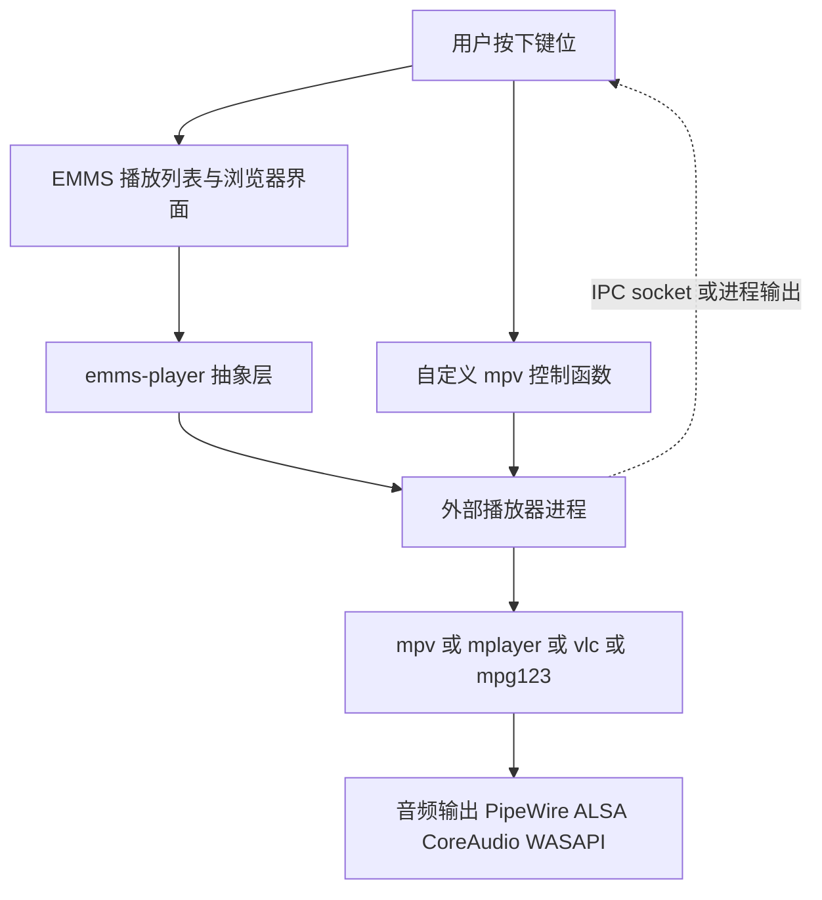
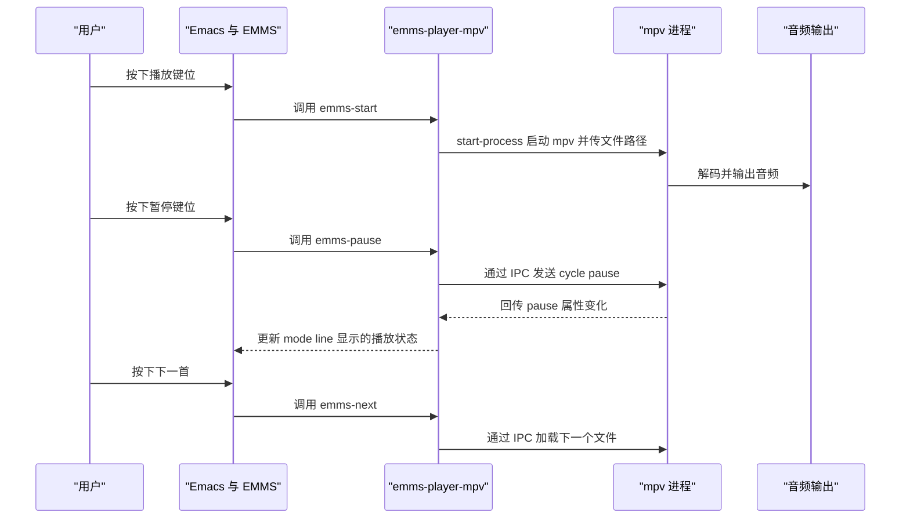

# 媒体播放器 EMMS 与 MPV

> Emacs 自己不解码音频，它负责的是「选曲、排队、控制、显示」，真正的播放交给外部播放器进程。本篇讲清这套分工，给出 EMMS 的完整配置、播放列表与电台的可行做法、歌词与封面的现实限制，以及用 `start-process` 把 mpv 变成随手可用的播放器的完整代码。

---

## 一、在编辑器里放音乐：价值与边界

### 1.1 值得做的三件事

第一是**后台播放与键位统一**。写代码时想放点音乐，不必切出 Emacs 去点播放器界面、找窗口、盯进度条。一个键位暂停、一个键位下一首，手不离键盘，注意力不被打断。这在长时间连续工作时是实实在在的效率差异。

第二是**用文本管理播放列表**。播放列表本质上就是一个文件路径的清单，用文本管理意味着它可以被 Git 版本控制、被脚本生成、被 Elisp 处理。你完全可以写一个函数，把某个目录下最近添加的音乐整理成一个播放列表，或者按标签生成「工作时听」和「专注时听」两个列表。这是图形播放器的播放列表做不到的。

第三是**把播放与工作流绑定**。例如：打开某个项目时自动播放某个播放列表；番茄钟结束时切换曲目；阅读 org 文档时把文档里链接的音频直接送给播放器。这类自动化只有把播放器放进 Emacs 才顺理成章。

### 1.2 不值得做的三件事

第一是**做音乐库管理器**。整理标签、下载封面、同步到手机、管理几万首曲目，这些事有专门的软件，做得比任何 Emacs 包都好。EMMS 的浏览器界面能用，但不要指望它替代成熟音乐库工具。

第二是**追求完美的可视化**。频谱、封面墙、歌词滚动动画，这些在终端与纯文本缓冲区里做出来效果有限，投入产出比很低。

第三是**让 Emacs 自己解码**。Emacs 不是音频库，用 Elisp 处理音频样本既不现实也没有必要。所有方案的前提都是「调用外部播放器」。

### 1.3 一句话原则

把 Emacs 当作**遥控器与编排层**，把播放器当作**执行器**。理解了这句话，后面所有配置上的选择都会变得自然：为什么播放器列表要配置、为什么进程要异步启动、为什么音量控制需要知道后端是谁。

---

## 二、整体架构

EMMS 的播放链路可以分成四层。最上层是用户界面（播放列表缓冲区、浏览器缓冲区、mode line 显示），中间是 EMMS 的播放器抽象层，下面是通过 `start-process` 一类函数启动的外部播放器进程，最底层才是真正的音频输出（PipeWire、ALSA、CoreAudio、WASAPI 等）。



这个架构带来两个直接结论。

其一，**Emacs 卡住通常是因为进程启动方式不对**。如果用同步调用（等待进程结束）去启动播放器，Emacs 会一直等到音乐播完。正确做法是用 `start-process` 把输出重定向到 `nil`（丢弃），或者用 `make-process` 配一个后台缓冲区，进程一启动就立刻返回。

其二，**播放状态有两份，需要同步**。Emacs 认为的「正在播放」和播放器实际的状态可能不一致，例如用户在播放器窗口里手动按了暂停。EMMS 通过解析进程输出或通过 IPC 通信来同步状态，这就是下面讲 `emms-player-mpv` 时反复提到的机制。

---

## 三、EMMS 入门

### 3.1 安装

EMMS 是 GNU 项目，包名就是 `emms`，可以从 GNU ELPA 或 MELPA 安装：

```text
M-x package-install RET emms RET
```

Emacs 29 与 30 都一样，不需要特殊处理。安装后可以先在 `*scratch*` 里逐条求值验证，确认能出声再写进配置文件。

### 3.2 最小初始化

EMMS 官方推荐的初始化只有三行：

```elisp
(require 'emms-setup)      ; 载入预设脚本集合
(emms-all)                 ; 启用 EMMS 的全部稳定功能
(emms-default-players)     ; 把 emms-player-list 设为默认后端列表
```

三行的分工需要说清楚，否则配置时会困惑。

`(require 'emms-setup)` 载入的是**预设脚本**而不是 EMMS 本体。这个文件提供若干「一键配置」函数，负责按需 `require` 各个子模块。

`(emms-all)` 是其中最完整的一个预设。它先执行 `(emms-minimalistic)` 的内容，再额外载入播放列表模式、标签读取、浏览器、歌词等全部稳定功能。换句话说，`emms-all` 已经包含了一个最小可用配置。

`(emms-default-players)` 做的是把变量 `emms-player-list` 设为 `emms-setup-default-player-list` 的值。后者是 `emms-setup.el` 里的一个 `defcustom`，默认内容是：

```elisp
;; emms-setup-default-player-list 的默认值（来自 emms-setup.el，不要手抄，仅作理解）
;; '(emms-player-mpg321
;;   emms-player-ogg123
;;   emms-player-mplayer-playlist
;;   emms-player-mplayer
;;   emms-player-mpv
;;   emms-player-vlc
;;   emms-player-vlc-playlist)
```

EMMS 会在运行时按顺序检查这些播放器，用「哪个能用就用哪个」的方式选择。这一点很重要：**你不需要为没装的播放器删除条目，EMMS 会跳过找不到的二进制。** 但如果你想固定使用某一个（比如只想要 mpv），就应该显式设置 `emms-player-list`，避免行为随环境变化。

### 3.3 emms-setup 各预设的含义

| 预设函数 | 作用 | 适用场景 |
| --- | --- | --- |
| `emms-minimalistic` | 只载入最基础的部分：核心播放控制与简单播放器 | 想要完全手动控制加载内容的用户 |
| `emms-standard` | 在最小配置基础上加一部分常用功能 | 中间档，介于 minimalistic 与 all 之间 |
| `emms-all` | 载入全部稳定功能，包含播放列表模式、信息读取、浏览器、歌词等 | 绝大多数用户直接用这个 |
| `emms-devel` | 历史上用于载入开发版功能 | 自 EMMS 4.1 起已废弃，等价于 `emms-all`，新配置不要再用 |
| `emms-default-players` | 不是「预设」而是辅助函数：把播放器列表设为默认值 | 在 `emms-all` 之后调用 |

关于 `emms-devel`：它在新版本里被标记为 obsolete，调用时会提示改用 `emms-all`。网上很多老教程仍在用它，照抄会看到废弃警告，这不影响功能，但新配置应当换成 `emms-all`。

### 3.4 播放器后端对比

EMMS 自带的播放器后端包括基于 `define-emms-simple-player` 定义的简单播放器，以及几个独立的播放器模块。可用的后端与对应的外部程序如下：

| 后端 | 外部程序 | 安装命令（Debian/Ubuntu） | 优点 | 缺点 |
| --- | --- | --- | --- | --- |
| `emms-player-mpg321` | `mpg123` | `sudo apt install mpg123` | 极轻量，启动快，适合纯 MP3 | 只支持 MP3 |
| `emms-player-ogg123` | `vorbis-tools`（提供 `ogg123`） | `sudo apt install vorbis-tools` | 轻量，适合 Ogg Vorbis | 只支持 Ogg |
| `emms-player-mplayer` | `mplayer` | `sudo apt install mplayer` | 格式支持广，资源占用低 | 项目本身已不活跃，新格式支持滞后 |
| `emms-player-mpv` | `mpv` | `sudo apt install mpv` | 格式支持最广，维护活跃，有 IPC 接口 | 需要较新的 mpv，控制逻辑比其他后端复杂 |
| `emms-player-vlc` | `vlc` | `sudo apt install vlc` | 格式支持广，跨平台一致 | 启动较慢，作为后端偏重 |
| `emms-player-xine` | `xine` | `sudo apt install xine-ui` | 老牌后端 | 上游基本停止维护 |
| `emms-player-mpd` | `mpd` 加 `mpc` | `sudo apt install mpd mpc` | 客户端服务端分离，最适合长时间后台播放 | 需要额外配置并运行 mpd 守护进程 |

Arch 上把包名换成对应写法即可，例如 `sudo pacman -S mpv mpg123 mplayer vlc`。macOS 上用 Homebrew：`brew install mpv mpg123`。Windows 上这些程序需要用官方安装包或 scoop 安装，并确保可执行文件在 `PATH` 中，或者把绝对路径写进配置。

这里有一处需要如实说明：**EMMS 没有内置 ffplay 后端，也没有 gstreamer 后端。** `emms-player-simple.el` 里定义的简单播放器是 `mpg321`、`ogg123`、`speexdec`、`playsound`、`mikmod`、`timidity`、`fluidsynth`、`alsaplayer` 等，加上 `mplayer`、`vlc`、`mpv`、`xine`、`mpd` 几个独立模块。如果你确实想用别的命令行播放器，可以用 `define-emms-simple-player` 这个宏自己定义一个，它接受名字、支持的类型、匹配文件名的正则和命令行：

```elisp
;; 用 define-emms-simple-player 宏把一个自定义命令行程序接进 EMMS
;; 参数依次是：播放器符号名、媒体类型、匹配正则、命令与参数
(require 'emms-player-simple)

(define-emms-simple-player my-ffplay
  '(file)
  "\\.\\(mp3\\|flac\\|ogg\\|m4a\\|wav\\)\\'"
  "ffplay"
  "-nodisp" "-autoexit" "-loglevel" "quiet")

;; 把它加进播放器列表（放在列表开头表示优先使用）
(add-to-list 'emms-player-list 'my-ffplay)
```

这段代码的关键在正则：EMMS 用它判断「这个文件我能不能播」。如果正则写错，症状是文件明明存在却报「没有可用的播放器」。

### 3.5 固定使用 mpv 后端

如果你已经决定只用 mpv，把播放器列表显式写死比依赖默认列表更可预测：

```elisp
(require 'emms-setup)
(emms-all)

;; 只使用 mpv 后端，避免行为随环境里装了什么而变化
(require 'emms-player-mpv)
(setq emms-player-list '(emms-player-mpv))

;; mpv 可执行文件的路径。默认就是 "mpv"，表示从 PATH 里查找
(setq emms-player-mpv-command-name "mpv")

;; 传给 mpv 的额外参数。默认值见下方说明
(setq emms-player-mpv-parameters
      '("--quiet" "--really-quiet" "--no-audio-display"))
```

`emms-player-mpv-command-name` 的默认值就是字符串 `"mpv"`，官方文档说它可以是绝对路径，也可以只是二进制名。在 Windows 上如果 mpv 不在 `PATH` 里，把它设成完整路径，例如 `"C:/Program Files/mpv/mpv.exe"`。

`emms-player-mpv-parameters` 的默认值是 `("--quiet" "--really-quiet" "--no-audio-display")`，分别表示降低日志噪音和关闭音频设备切换时的屏幕提示。你可以在这里追加参数，例如加上 `"--volume=60"` 控制初始音量，或者 `"--no-video"` 让它纯粹当音频后端。

关于 `emms-player-mpv-ipc-method`：这个变量在新版 EMMS 里**已经废弃且不再使用**。它的文档明确写着「Unused obsolete value」，原因是 mpv 从 0.17.0（2016 年）起就不再需要选择旧的 IPC 方式，该变量在 EMMS 18+（2024 年）被移除作用。所以网上一些老配置里出现的这个设置，在新版本上写了也没有效果，不必抄。

现在把控制命令与状态同步串起来看一遍：



---

## 四、音乐库管理

### 4.1 建立曲库

EMMS 的「曲库」不是一个数据库，而是一份**缓存的曲目列表**。建立方式是扫描目录：

```elisp
;; 扫描一个目录树，把识别到的音频文件加入缓存
;; 参数是目录名，它会递归下去
(emms-add-directory-tree "~/Music")

;; 只扫描一层，不递归
(emms-add-directory "~/Music/Albums")

;; 直接把某个目录树建成播放列表并开始播放
(emms-play-directory-tree "~/Music/工作用")
```

第一次扫描大目录会比较慢，因为要读取每个文件的标签。扫描完成后结果写入缓存文件，之后的启动就快得多。

### 4.2 标签读取

EMMS 通过 `emms-info-functions` 这个钩子列表来读取标签，列表里每个函数负责一种读取方式。可选的后端包括：

| 后端模块 | 依赖 | 说明 |
| --- | --- | --- |
| `emms-info-native` | 无，纯 Elisp | 内置的解析器，直接读 MP3、FLAC、Ogg、Opus、Vorbis 等格式的标签，不需要外部程序，是首选 |
| `emms-info-mp3info` | 外部程序 `mp3info` | 只处理 MP3，需要额外安装程序 |
| `emms-info-ogginfo` | 外部程序 `ogginfo` | 处理 Ogg 系列 |
| `emms-info-opusinfo` | 外部程序 `opusinfo` | 处理 Opus |
| `emms-info-exiftool` | 外部程序 `exiftool` | 支持格式最多，但每次调用都要启动一个 Perl 程序，慢 |
| `emms-info-libtag` | Emacs 需编译 libtag 支持 | 速度快，但构建要求高 |
| `emms-info-tinytag` | Python 的 tinytag 库 | 依赖 Python 环境 |

推荐优先用 `emms-info-native`，它是纯 Elisp 实现，没有外部依赖，跨平台一致：

```elisp
;; 只用内置的原生标签读取器，避免依赖外部程序
;; 注意 emms-all 可能已经加了一些后端，这里显式覆盖成只保留 native
(require 'emms-info)
(require 'emms-info-native)
(setq emms-info-functions '(emms-info-native))
```

如果某些文件读不到标签（常见于标签写入不规范的 MP3），可以把多个后端串起来，让前一个失败时后一个接手。EMMS 会依次尝试列表中的函数，第一个成功返回信息的生效。

```elisp
;; 原生解析器优先，失败时回退到 mp3info（需要系统里装了 mp3info）
(setq emms-info-functions '(emms-info-native emms-info-mp3info))
```

标签中文乱码是常见问题。`emms-info-mp3info` 有一个编码变量用于处理非 UTF-8 标签：

```elisp
;; 当 MP3 标签是 GBK 编码时（常见于早年国内下载的音乐），指定读取编码
;; 这个变量只在 emms-info-mp3info 后端下有意义
(setq emms-info-mp3info-coding-system 'gbk)
```

用 `emms-info-native` 时它按格式规范解析，遇到乱码多半是文件本身标签编码不规范，只能改写标签，不属于 Emacs 侧能解决的问题。

### 4.3 emms-browser 界面

`M-x emms-browser` 打开浏览器缓冲区，它把曲库按艺术家、专辑、流派等维度组织成可折叠的树。默认的浏览维度由 `emms-browser-default-browse-type` 决定。进入缓冲区后可以逐层展开、选择曲目加入播放列表，也可以直接播放。

常用的操作方式是按层级「深入」与「返回」：在某个艺术家上按回车进入其专辑列表，在专辑上按回车进入曲目列表。具体的键位在缓冲区里按 `C-h m` 或 `?` 可以看到，因为不同版本有过调整，以你本机的模式帮助为准。

浏览器的贡献在于**按标签而不是按目录结构浏览**。目录结构往往乱（同一张专辑分散在多个目录、合辑里的艺术家混乱），而标签是整理过的。用 `emms-add-directory-tree` 扫一次后，之后就可以完全按标签浏览。

```elisp
;; 让浏览器默认按艺术家组织（取值含义见变量文档）
(setq emms-browser-default-browse-type 'artist)

;; 浏览器的封面显示，默认按文件名匹配同目录下的图片
;; 若你的封面命名不统一，可在这里扩展识别的扩展名
(setq emms-browser-covers-file-extensions '("jpg" "jpeg" "png" "webp"))
```

### 4.4 缓存

缓存文件由 `emms-cache-file` 决定，默认位置是 `~/.emacs.d/emms/cache`（也就是配置目录下的 `emms/cache`）。缓存里存的是「这个文件有哪些标签」的映射，避免每次启动都重新读取全部文件。

```elisp
;; 启用缓存。emms-all 已经启用，这里显式写出便于理解
(require 'emms-cache)
(emms-cache-enable)

;; 缓存文件的位置（默认即 user-emacs-directory 下的 emms/cache）
(setq emms-cache-file (expand-file-name "emms/cache" user-emacs-directory))

;; 手动保存缓存
;; M-x emms-cache-save RET
```

需要留意的是缓存与文件系统的**一致性**：如果你在文件管理器里改了文件名或移动了文件，缓存里的路径就失效了，症状是播放列表里的曲目点不动或者报找不到文件。解决办法是删除缓存文件重新扫描，或者执行一次 `emms-cache-reset`（重置后重新 `emms-add-directory-tree`）。这也是第五章「播放列表路径失效」问题的根源。

### 4.5 播放列表与 m3u 文件

EMMS 的播放列表就是一个普通缓冲区，处于 `emms-playlist-mode`。你可以把它保存成文本文件，也可以加载已有的 m3u：

```elisp
;; 把当前播放列表保存成 m3u 文件
;; M-x emms-playlist-save RET 然后输入文件名，例如 ~/Music/工作用.m3u

;; 加载一个 m3u 播放列表（追加到当前列表）
;; M-x emms-add-m3u-playlist RET ~/Music/工作用.m3u RET

;; 加载并直接开始播放
;; M-x emms-play-m3u-playlist RET ~/Music/工作用.m3u RET
```

m3u 是纯文本格式，每行一个文件路径（或 URL），这意味着你可以用脚本生成它：

```bash
# 用 find 生成一个只包含 flac 的播放列表
$ find ~/Music -name '*.flac' -print > ~/Music/无损合集.m3u
```

由于 m3u 里通常是绝对路径，**把播放列表换台机器用就会全部失效**。要跨机器使用，要么在 m3u 里写相对于音乐根目录的路径（EMMS 加载时会基于当前 `default-directory` 解析），要么用 Elisp 在加载时把路径前缀替换掉：

```elisp
(defun my/emms-fix-playlist-paths (old-prefix new-prefix)
  "把当前播放列表中所有以 OLD-PREFIX 开头的路径替换为 NEW-PREFIX。
用于播放列表在不同机器之间迁移后修正路径。"
  (interactive "s原路径前缀：\ns新路径前缀：")
  (with-current-buffer emms-playlist-buffer-name
    (save-excursion
      (goto-char (point-min))
      (let ((count 0))
        (while (re-search-forward (regexp-quote old-prefix) nil t)
          (replace-match new-prefix t t)
          (setq count (1+ count)))
        (message "已替换 %d 处路径" count)))))
```

---

## 五、播放控制与键位

### 5.1 emms-playlist-mode 键位表

下表是 `emms-playlist-mode` 缓冲区中的主要键位，取自 EMMS 的键位映射定义。

| 键位 | 命令 | 说明 |
| --- | --- | --- |
| `RET` | `emms-playlist-mode-play-smart` | 智能播放：光标在曲目上就播这首，在分组头就播整组 |
| `SPC` | `scroll-up` | 向下滚动一屏 |
| `n` | `emms-next` | 下一首 |
| `p` | `emms-previous` | 上一首 |
| `s` | `emms-stop` | 停止 |
| `P` | `emms-pause` | 暂停或继续 |
| `r` | `emms-random` | 随机跳一首 |
| `f` | `emms-show` | 在回显区显示当前曲目信息 |
| `c` | `emms-playlist-mode-center-current` | 把光标移到当前播放的曲目上 |
| `d` | `emms-playlist-mode-goto-dired-at-point` | 在 dired 中打开光标处曲目所在目录 |
| `a` | `emms-playlist-mode-add-contents` | 把另一个播放列表的内容追加进来 |
| `b` | `emms-playlist-set-playlist-buffer` | 把当前缓冲区设为「当前播放列表」 |
| `i` | `emms-playlist-playlist-insert-track` | 在光标处插入一条曲目 |
| `TAB` | `emms-playlist-mode-shift-track-up` | 把光标处的曲目上移一位 |
| `C-o` | `emms-playlist-mode-shift-track-down` | 把光标处的曲目下移一位 |
| `C-k` | `emms-playlist-mode-kill-track` | 删除光标处的曲目行 |
| `D` | `emms-playlist-mode-kill-track` | 同上 |
| `K` | `emms-playlist-mode-current-kill` | 删除当前**正在播放**的曲目 |
| `C` | `emms-playlist-clear` | 清空整个播放列表 |
| `C-w` | `emms-playlist-mode-kill` | 剪切选区 |
| `C-y` | `emms-playlist-mode-yank` | 粘贴 |
| `C-j` | `emms-playlist-mode-insert-newline` | 插入空行 |
| `C-/` 与 `C-_` | `emms-playlist-mode-undo` | 撤销 |
| `M-n` | `emms-playlist-mode-next` | 光标跳到下一条 |
| `M-p` | `emms-playlist-mode-previous` | 光标跳到上一条 |
| `M->` | `emms-playlist-mode-last` | 光标跳到最后一条 |
| `M-<` | `emms-playlist-mode-first` | 光标跳到第一条 |
| `M-y` | `emms-playlist-mode-yank-pop` | 循环粘贴历史 |
| `<` | `emms-seek-backward` | 后退若干秒 |
| `>` | `emms-seek-forward` | 前进若干秒 |
| `q` | `emms-playlist-mode-bury-buffer` | 收起播放列表缓冲区 |
| `?` | `describe-mode` | 查看模式帮助 |

注意 `RET` 与 `n`／`p` 的区别：`RET` 是「播放选中的」，`n`／`p` 是「播放列表意义上的下一首／上一首」。在整理播放列表时，用 `M-n`／`M-p` 移动光标而不要用 `n`／`p`，否则会不停切歌。

### 5.2 全局键位推荐

在播放列表缓冲区之外，你仍然希望有播放控制键位。推荐的做法是选一个不冲突的前缀，把媒体控制集中起来。`C-c` 后跟一个字母是留给用户的保留空间，不会与任何模式冲突：

```elisp
;; 用 C-c m 作为媒体控制前缀（m 表示 media）
;; 这组键位在任何模式下都可用
(global-set-key (kbd "C-c m p") #'emms-pause)              ; 暂停或继续
(global-set-key (kbd "C-c m n") #'emms-next)               ; 下一首
(global-set-key (kbd "C-c m b") #'emms-previous)           ; 上一首
(global-set-key (kbd "C-c m s") #'emms-stop)               ; 停止
(global-set-key (kbd "C-c m S") #'emms-start)              ; 开始播放
(global-set-key (kbd "C-c m f") #'emms-show)               ; 显示当前曲目
(global-set-key (kbd "C-c m l") #'emms-playlist-mode-go)   ; 打开播放列表
(global-set-key (kbd "C-c m r") #'emms-random)             ; 随机一首
(global-set-key (kbd "C-c m x") #'emms-shuffle)            ; 打乱列表顺序
(global-set-key (kbd "C-c m t") #'emms-toggle-repeat-track)     ; 单曲循环开关
(global-set-key (kbd "C-c m T") #'emms-toggle-repeat-playlist)  ; 列表循环开关
(global-set-key (kbd "C-c m +") #'emms-volume-raise)       ; 音量增大
(global-set-key (kbd "C-c m -") #'emms-volume-lower)       ; 音量减小
(global-set-key (kbd "C-c m <") #'emms-seek-backward)      ; 后退
(global-set-key (kbd "C-c m >") #'emms-seek-forward)       ; 前进
```

音量控制需要先选一个后端，见第六章的说明。如果你更希望用媒体键（键盘上的播放／暂停键），Emacs 也能接收，但键名依赖操作系统与驱动，通常写作 `<XF86AudioPlay>`、`<XF86AudioNext>` 这样的形式：

```elisp
;; 键盘媒体键（需要系统和驱动把按键传给 Emacs，终端里通常不行）
;; 用 condition-case 包住，避免在没有这些键名的环境里报错
(dolist (pair '(("<XF86AudioPlay>"  . emms-pause)
                ("<XF86AudioNext>"  . emms-next)
                ("<XF86AudioPrev>"  . emms-previous)
                ("<XF86AudioStop>"  . emms-stop)))
  (condition-case nil
      (global-set-key (kbd (car pair)) (cdr pair))
    (error nil)))
```

### 5.3 在 mode line 上显示当前曲目

两个独立的次要模式负责这件事，它们可以各自开关：

```elisp
;; 在 mode line 上显示当前曲目信息（艺术家、标题等）
(emms-mode-line-mode 1)
;; 显示默认格式是 " [ %s ] "，其中 %s 处填入曲目描述
(setq emms-mode-line-format " [ %s ] ")

;; 在 mode line 上显示已播放时间与总时长
(emms-playing-time-mode 1)
;; 显示默认格式是 " %s "，%s 处填入时间字符串
(setq emms-playing-time-display-format " %s ")
```

`emms-mode-line-toggle` 是切换命令，可以绑到键位上临时隐藏曲目信息。如果你希望这两项在所有缓冲区都显示，上面两个模式是全局次要模式，调用一次即可生效。

一个实用细节：`emms-mode-line-format` 与 `emms-playing-time-display-format` 都包含一个 `%s`，如果你改成不含 `%s` 的字符串，信息就不会显示出来。改格式时务必保留占位符。

### 5.4 桌面通知：一种诚实的做法

这里要明确说明一件事：**EMMS 本身没有一个叫 `emms-notification` 的模块。** 你在一些配置片段里看到的相关设置，多半来自某个第三方扩展或作者自己写的函数，不属于 EMMS 的一部分。所以不要照抄一个不存在的模块名去 `require`。

可行的做法有两条。第一条最简单，用 Emacs 自己的回显区：`emms-show` 会在回显区显示当前曲目，把它挂到切歌钩子上就能实现「每换一首显示一次」。

```elisp
;; 每次切换曲目时在回显区显示曲目信息
;; emms-show 内部会调用 emms-show-format 指定的格式
(setq emms-show-format "正在播放：%s")
(add-hook 'emms-player-started-hook #'emms-show)
```

第二条是调用系统级通知程序。这些命令都是各平台真实存在的工具：Linux 桌面上是 `notify-send`（来自 libnotify），macOS 上是 `osascript`（系统自带），Windows 上可以用 PowerShell 的 BurntToast 模块或 `msg` 命令。

```elisp
(defun my/notify (title body)
  "用当前系统可用的方式弹出一条桌面通知。
找不到外部命令时退回 message，保证不会报错。"
  (let ((msg (format "%s：%s" title body)))
    (cond
     ;; Linux：notify-send 来自 libnotify
     ((executable-find "notify-send")
      (start-process "notify" nil "notify-send" title body))
     ;; macOS：osascript 是系统自带
     ((executable-find "osascript")
      (start-process
       "notify" nil "osascript" "-e"
       (format "display notification %s with title %s"
               (shell-quote-argument body)
               (shell-quote-argument title))))
     ;; 其他情况：退回回显区
     (t (message "%s" msg)))))

(defun my/emms-notify-current-track ()
  "在切歌时弹出桌面通知，内容取当前曲目的描述。"
  (my/notify "EMMS" (emms-show)))

;; 用 emms-show 取到的字符串作为通知内容
(add-hook 'emms-player-started-hook #'my/emms-notify-current-track)
```

注意 `osascript` 那一条里用的是 AppleScript 语法，`display notification "内容" with title "标题"`；这里用 `shell-quote-argument` 是为了处理内容里的引号。如果曲目名里带引号导致通知失败，这是需要额外转义的边界情况，日常使用中很少遇到。

---

## 六、流媒体与网络电台

### 6.1 把电台地址加进播放列表

这是最可靠、最不依赖外部数据的做法。网络电台通常提供一个流地址（形如 `http://host:port/stream`）或者一个 m3u/pls 播放列表文件。EMMS 的播放列表可以同时容纳本地文件路径和 URL，所以直接往播放列表里插入地址即可。

```elisp
;; 定义一个电台清单（名称与流地址）
(defvar my/radio-stations
  '(("示例电台 A" . "http://example.invalid:8000/stream")
    ("示例电台 B" . "http://example.invalid:9000/live"))
  "个人电台清单。请替换为真实可用的流地址。")

(defun my/emms-add-radio (station)
  "把 STATION（名称与地址的 cons）追加到当前 EMMS 播放列表。"
  (interactive
   (list (or (assoc (completing-read "电台：" my/radio-stations nil t)
                    my/radio-stations)
             (user-error "没有这个电台"))))
  (with-current-buffer (emms-playlist-current-buffer-insure)
    (goto-char (point-max))
    (insert (format "%s\n" (cdr station)))
    (emms-playlist-mode)
    (emms-playlist-current-clear))
  (message "已加入电台：%s" (car station)))
```

上面这个函数里用到的 `emms-playlist-current-buffer-insure` 属于内部辅助函数，不同版本名字可能变化，所以更稳妥的写法是直接操作播放列表缓冲区并调用公开命令。下面这版只使用公开接口，可移植性更好：

```elisp
(defun my/emms-play-stream (url)
  "把流地址 URL 追加进当前播放列表并立即播放。
用公开命令实现，避免依赖内部函数名。"
  (interactive "s流地址或 m3u/pls 地址：")
  (emms-playlist-mode-go)            ; 打开（或切到）播放列表缓冲区
  (goto-char (point-max))            ; 移到列表末尾
  (insert url "\n")                  ; 插入一行，播放列表就是文本
  (emms-playlist-mode-play-smart))   ; 播放光标所在的那一条
```

把电台地址存成文本文件、用 `emms-add-m3u-playlist` 一次性载入，是更适合日常使用的方式。你可以在一个 m3u 文件里放几十个电台地址，需要时载入即可。

### 6.2 emms-streams 的现状

EMMS 提供了一个 `emms-streams` 命令和配套的 `emms-streams-file` 变量（默认位置是配置目录下的 `emms/streams.emms`）。它的实现方式值得说明，因为它解释了「为什么不要指望它自带的电台列表」。

`emms-streams` 打开一个名为 `Emms Streams` 的缓冲区，这个缓冲区实际上就是一个 `emms-playlist-mode` 播放列表，内容来自 `emms-streams-file`。如果该文件不存在，命令会询问是否安装内置列表，安装动作由 `emms-streams-install` 完成。

问题在于内置列表：`emms-streams-built-in-list` 是一个普通的 `defvar`，而 EMMS 源码里同时定义了一个 `emms-streams-built-in-disclaimer` 变量，用途正是提醒使用者这个内置列表**已经过时、其中的地址大多失效**。EMMS 不会自动更新它，因为它只是一份写死在源码里的快照。

因此正确的用法是：把 `emms-streams-file` 当作「我自己的电台清单文件」，用文本编辑器或上面的 Elisp 命令维护它，而不要依赖安装出来的内置列表。这样做还有一个好处，这个文件是纯文本，可以直接纳入版本控制或云同步。

```elisp
;; 把电台清单文件放到一个自己管理的位置
(setq emms-streams-file (expand-file-name "~/Music/我的电台.emms"))

;; 之后用 M-x emms-streams 打开这个清单
;; 在缓冲区里编辑（就是普通文本），按 C-x C-s 风格保存到该文件
;; 也可以用 emms-playlist-save 另存
```

---

## 七、歌词与封面

### 7.1 emms-lyrics

`emms-lyrics` 是 EMMS 自带的歌词模块，它的原理很朴素：根据当前曲目的「艺术家 - 标题」在歌词目录里找同名的 `.lrc` 或 `.txt` 文件，找到就把内容显示出来。

```elisp
(require 'emms-lyrics)

;; 歌词目录。默认值是 ~/music/lyrics
(setq emms-lyrics-dir (expand-file-name "~/Music/lyrics"))

;; 启用歌词显示
(emms-lyrics-mode 1)
;; 或者用切换命令：M-x emms-lyrics-toggle RET

;; 在 mode line 上显示歌词（对短句有效，长句会挤爆 mode line）
(setq emms-lyrics-display-on-modeline nil)

;; 在单独的小缓冲区里显示歌词，适合长歌词
(setq emms-lyrics-display-buffer t)
```

相关的变量还有 `emms-lyrics-display-on-minibuffer`、`emms-lyrics-display-format`、`emms-lyrics-coding-system`、`emms-lyrics-scroll-p` 和 `emms-lyrics-find-lyric-function`。最后这个变量是扩展点：它接受一个函数，用来替换默认的「按文件名查找」逻辑。如果你的歌词文件命名规则特殊（例如用文件名的哈希值），可以在这里接入自己的查找函数。

`emms-lyrics-coding-system` 在处理中文歌词时值得注意：早年下载的 `.lrc` 文件常是 GBK 编码，此时需要显式指定，否则会显示成乱码。

手动查看某首歌的歌词可以用 `emms-lyrics-visit-lyric`。如果它报找不到文件，说明命名不匹配，用 `emms-lyrics-find-lyric` 可以看到它期望的文件名。

### 7.2 封面的现实限制

EMMS 的浏览器界面可以显示封面，机制是 `emms-browser-covers` 配合 `emms-browser-covers-file-extensions`：在曲目所在目录里按扩展名找图片文件。这意味着：

- 封面必须是**独立的图片文件**（例如 `cover.jpg`、`folder.png`），而不是嵌在音频标签里的内嵌封面。
- 图片命名要符合它在目录里查找的规则，或者你需要改 `emms-browser-covers-file-extensions` 来匹配你的命名习惯。
- 终端里的 Emacs 无法显示图片，这一项功能直接不可用。
- 图片尺寸过大时会拖慢浏览器界面的渲染。

现实结论是：**把封面当作「有就好，没有也不影响使用」的附加项。** 如果你的音乐库封面是内嵌在标签里的，EMMS 不会自动提取，需要先用外部工具（例如 `ffmpeg` 或专门的标签工具）把封面导出成独立文件。

---

## 八、Bongo：另一个选择

Bongo 是另一个 GNU 项目背景下的 Emacs 媒体播放器前端，包名 `bongo`，可以在 MELPA 上找到。它与 EMMS 的定位差异可以概括为：

| 维度 | EMMS | Bongo |
| --- | --- | --- |
| 设计重心 | 播放列表管理与标签库浏览 | 「在缓冲区里做一个播放器」，界面更接近传统播放器 |
| 播放列表 | 独立缓冲区，文本化，易脚本化 | 播放列表就在普通缓冲区里，行内显示曲目信息 |
| 视觉呈现 | 以列表与树形浏览为主 | 支持在缓冲区内绘制进度条、指示灯等字符图形 |
| 标签库 | 有缓存与浏览器，功能较完整 | 相对简单，更偏向直接操作文件列表 |
| 维护状态 | 活跃（随 Emacs 生态持续更新） | 更新频率低，代码库多年变化不大 |
| 与 dired 结合 | 支持 | 有专门的 `bongo-dired-library-mode`，和 dired 结合紧密 |

Bongo 的一个特点是把播放列表做成**普通的可编辑缓冲区**，你可以直接在缓冲区里输入文件路径。最小配置如下：

```elisp
;; Bongo 的最小可用配置
(require 'bongo)

;; 用 bongo 打开一个播放列表缓冲区
;; M-x bongo RET

;; 在当前缓冲区（例如 dired 或普通文件缓冲区）插入一个文件作为曲目
;; M-x bongo-insert-file RET

;; 在 dired 缓冲区里启用 Bongo 库模式，之后可以整目录加入播放列表
;; M-x bongo-dired-library-mode RET

;; 基本控制命令（可直接 M-x 调用，也可以自己绑键位）
;; bongo-start           开始播放
;; bongo-pause/resume    暂停或继续
;; bongo-stop            停止
;; bongo-next            下一首
;; bongo-previous        上一首
```

选择建议很简单：需要**按标签组织的大曲库**、需要缓存、需要配合 EMMS 的播放器后端体系，选 EMMS；只想**在缓冲区里放个播放器**、喜欢把播放列表当文本文件直接编辑、习惯和 dired 配合，选 Bongo。两者不冲突，可以都装，但没必要同时用。

---

## 九、在 Emacs 里播放视频

### 9.1 三条路线

**路线一：EMMS 加视频播放器后端。** mpv 和 mplayer 都能播视频，理论上可以让 EMMS 调用它们。但 EMMS 的界面是为音频设计的（没有画面控制、没有全屏切换、没有字幕管理），实际体验一般。

**路线二：用 `start-process` 自己调 mpv。** 这是最推荐的做法：Emacs 负责「找到要播的东西、拼参数、启动进程」，mpv 负责一切播放与显示。代码量小，行为完全可控，不受任何包的状态影响。

**路线三：用现成的 mpv 集成包。** MELPA 上确实有真实存在的包，本章末尾会列出并说明取舍。

下面重点讲路线二，因为它没有依赖，且能讲清所有细节。

### 9.2 用 start-process 调用 mpv

核心是三个决策：进程的输出往哪里去、用什么函数启动、参数怎么组织。

关于输出：`start-process` 的第二个参数是缓冲区。**如果你传一个真实缓冲区，mpv 的输出会写进去，而 Emacs 会显示这个缓冲区**，视觉上像是「Emacs 被 mpv 接管了」。传 `nil` 表示丢弃输出，进程在后台安静运行。对于播放器，这是正确的选择。

关于启动函数：`start-process` 是最直接的。它返回进程对象，我们可以保存起来，用于后续判断「是否已有播放器在跑」，避免同时启动多个 mpv 互相抢音频设备。

```elisp
(defcustom my/mpv-executable "mpv"
  "mpv 可执行文件的位置。
默认从 PATH 中查找名为 mpv 的程序；Windows 上可写成完整的 exe 路径。"
  :type 'string
  :group 'multimedia)

(defvar my/mpv-process nil
  "当前由 Emacs 启动的 mpv 进程对象。
nil 表示没有正在运行的 mpv。")

(defun my/mpv-stop ()
  "结束由 Emacs 启动的 mpv 进程（如果存在）。"
  (interactive)
  (when (process-live-p my/mpv-process)
    (delete-process my/mpv-process))
  (setq my/mpv-process nil)
  (message "已结束 mpv"))

(defun my/mpv-play (target &optional args)
  "用 mpv 播放 TARGET（本地文件路径或 URL）。
ARGS 是附加的命令行参数列表，会排在 TARGET 之前。
输出被丢弃，因此 mpv 不会占用 Emacs 的窗口，也不会阻塞编辑。"
  (interactive "s要播放的文件或 URL：")
  (unless (executable-find my/mpv-executable)
    (user-error "找不到 mpv，请检查 my/mpv-executable 的值：%s"
                my/mpv-executable))
  ;; 先结束上一个进程，避免多个 mpv 争抢音频设备
  (when (process-live-p my/mpv-process)
    (delete-process my/mpv-process))
  (setq my/mpv-process
        (apply #'start-process
               "mpv"                 ; 进程名，出现在进程列表中
               nil                   ; 输出缓冲区传 nil，表示丢弃输出
               my/mpv-executable     ; 可执行文件
               (append args (list target))))  ; 参数列表，最后是被播放的目标
  (message "已启动 mpv：%s" target))
```

`executable-find` 是内置函数，会在 `exec-path` 里查找可执行文件，用它先做检查可以给出明确的错误信息，而不是让用户看到 `Searching for program: No such file or directory, mpv` 这种底层报错。

`process-live-p` 判断进程是否还活着，比直接检查进程对象是否为 nil 更准确，因为进程可能已经退出但变量还没被清理。

在此基础上加两个常用变体：

```elisp
(defun my/mpv-play-audio (target)
  "纯音频模式播放 TARGET，不打开视频窗口。
用 --no-video 让 mpv 只输出声音（默认会尝试打开视频窗口）。"
  (interactive "s仅音频播放的文件或 URL：")
  (my/mpv-play target '("--no-video")))

(defun my/mpv-play-fullscreen (target)
  "全屏播放 TARGET。"
  (interactive "s全屏播放的文件或 URL：")
  (my/mpv-play target '("--fullscreen")))

(defun my/mpv-play-audio-playlist (files)
  "把 FILES（文件路径列表）作为播放列表交给一个 mpv 进程顺序播放。"
  (interactive (list (or (dired-get-marked-files)
                         (user-error "当前缓冲区没有可用的文件列表"))))
  (unless (executable-find my/mpv-executable)
    (user-error "找不到 mpv：%s" my/mpv-executable))
  (when (process-live-p my/mpv-process)
    (delete-process my/mpv-process))
  (setq my/mpv-process
        (apply #'start-process
               "mpv" nil my/mpv-executable
               (append '("--no-video") files)))
  (message "已交给 mpv 播放 %d 个文件" (length files)))
```

注意在纯音频场景下推荐加上 `"--no-video"`。这不是可选项：很多音频文件的容器里带有一张封面图，mpv 默认会为它打开一个视频窗口，看起来像「放音乐弹出个窗口」，加上这个参数就干净了。

### 9.3 从 dired 与 org 送内容给 mpv

把播放能力接到已有的文件浏览方式上，是让它真正好用的关键。

```elisp
(defun my/mpv-play-dired-file ()
  "把 dired 中光标处的文件交给 mpv 播放。
若已标记了多个文件，则把它们作为播放列表一起交给 mpv。"
  (interactive)
  (let ((marked (dired-get-marked-files)))
    (if (> (length marked) 1)
        (my/mpv-play-audio-playlist marked)
      (my/mpv-play-audio (car marked)))))

;; 在 dired 里用 C-c m v 播放（v 表示 video/媒体）
(with-eval-after-load 'dired
  (define-key dired-mode-map (kbd "C-c m v") #'my/mpv-play-dired-file))
```

`dired-get-marked-files` 在有标记时返回标记的文件，没有标记时返回光标处的文件，所以上面这个函数能同时处理两种情况。

从 org 链接播放：

```elisp
(defun my/mpv-play-org-link ()
  "把 org 缓冲区中光标处的链接交给 mpv 播放。
支持 http、https、file 等协议链接。"
  (interactive)
  (require 'org-element)
  (let* ((context (org-element-context))
         (link (org-element-property :raw-link context)))
    (unless link
      (user-error "光标处没有 org 链接"))
    (my/mpv-play link)))

(with-eval-after-load 'org
  (define-key org-mode-map (kbd "C-c m v") #'my/mpv-play-org-link))
```

`org-element-context` 返回光标处的语法元素，`org-element-property` 取出 `:raw-link` 就是链接的原始地址（不做任何转换）。这两步比用正则从行里抠出 URL 更可靠，因为它理解 org 的语法结构。

### 9.4 用 mpv 的 IPC socket 做双向控制

`start-process` 是单向的：只能启动和杀掉。要做「暂停、调音量、读当前播放位置」这类控制，需要 mpv 的 IPC 接口。mpv 支持在 Unix 域套接字（Linux、macOS）或命名管道（Windows）上提供 JSON IPC，启动时用 `--input-ipc-server` 指定路径即可。

思路是：启动 mpv 时带上这个参数，然后 Emacs 用 `make-network-process` 连上这个套接字，发送 JSON 命令。

```elisp
(defcustom my/mpv-ipc-socket
  (if (memq system-type '(windows-nt ms-dos))
      ;; Windows 上 IPC 用命名管道路径
      "\\\\.\\pipe\\emacs-mpv"
    ;; Linux 与 macOS 上用 Unix 域套接字
    "/tmp/emacs-mpv.sock")
  "mpv 的 IPC 地址。Windows 用命名管道，其他系统用套接字文件。"
  :type 'string
  :group 'multimedia)

(defvar my/mpv-ipc-buffer " *mpv-ipc*"
  "存放 mpv IPC 返回内容的缓冲区名。名字以空格开头表示不在缓冲区列表中显示。")

(defun my/mpv-send-command (command &optional socket)
  "通过 IPC 向 mpv 发送一条 COMMAND。
COMMAND 是 alist 或 plist，会被编码成 JSON。
返回收到的原始应答文本；连接失败时返回 nil。

这是最小实现：每次调用建立一次连接、发送、等待片刻、读回、断开。
真实项目应当保持长连接并用 :filter 异步处理应答。"
  (let* ((sock (or socket my/mpv-ipc-socket))
         (buf (get-buffer-create my/mpv-ipc-buffer))
         (proc nil))
    (with-current-buffer buf (erase-buffer))
    (condition-case err
        (setq proc (make-network-process
                    :name "mpv-ipc"
                    :family 'local        ; local 表示本地套接字而非 TCP
                    :service sock         ; 套接字路径或命名管道名
                    :coding 'utf-8
                    :buffer buf
                    :noquery t))          ; 退出 Emacs 时不追问是否杀掉该进程
      (file-error
       (message "无法连接 mpv 的 IPC 地址 %s：%s" sock err)
       (setq proc nil)))
    (when proc
      (unwind-protect
          (progn
            (process-send-string proc (concat (json-encode command) "\n"))
            ;; 给 mpv 一点时间应答；这只是为了让示例可读
            (accept-process-output proc 0.3)
            (with-current-buffer buf (buffer-string)))
        (delete-process proc)))))
```

用法示例。mpv 的 IPC 命令格式是 `{"command": ["命令名", "参数"...]}`，对应到 Elisp 就是一个 alist：

```elisp
;; 暂停或继续：cycle 命令切换 pause 属性
(my/mpv-send-command '(("command" . ["cycle" "pause"])))

;; 设置音量为 70
(my/mpv-send-command '(("command" . ["set" "volume" 70])))

;; 查询当前播放位置（返回的 JSON 里 data 字段是秒数）
(my/mpv-send-command '(("command" . ["get_property" "time-pos"])))

;; 快进 10 秒
(my/mpv-send-command '(("command" . ["seek" 10 "relative"])))
```

`json-encode` 是 `json.el` 提供的编码函数，能把 alist 与向量正确编码成 JSON 对象与数组，所以上面这种写法不需要手写字符串拼接。

这个最小实现有三个明显不足，需要如实说明：每次操作都重建连接，开销大；用固定等待时间而不是等应答，慢速机器上可能读不到；不处理请求与应答的配对。要做成可靠的控制层，应当保持一个长连接进程、用 `:filter` 累积数据、给每条命令分配序号并在应答里匹配序号。这正是现成包所做的事。

### 9.5 已存在的 mpv 集成包

如果你不想自己维护 IPC 层，MELPA 上有真实可用的包，两者的定位不同：

- `mpv`（仓库 https://github.com/kljohann/mpv.el ）：定位是「控制 mpv 以便记笔记」，通过 mpv 的 IPC 接口做双向控制，风格上鼓励「播放器在 mpv 窗口、控制与记录在 Emacs」。安装用 `M-x package-install RET mpv RET`。
- `mpvi`（仓库 https://github.com/lorniu/mpvi ）：功能更集成的视频播放与控制方案，包含字幕、播放列表、org 集成，以及对部分视频站点的直接支持。安装用 `M-x package-install RET mpvi RET`。

选择建议：如果你只需要「Emacs 里能控制 mpv」，上面那几十行自己的代码就够了，不引入依赖、行为完全可控；如果你想要完整的「边看边记 + 字幕 + 播放列表」体验，用这两个包更省事。需要提醒的是，这类包与 mpv 版本耦合较紧，升级 mpv 后如果出现异常，先检查包的兼容性说明。

---

## 十、用 Emacs 管理下载与转码任务

播放之外，媒体工作流里还有两个常被忽略的环节：下载与转码。它们的共同点是「耗时且输出大量日志」，正好适合用 Emacs 的异步进程机制来管理：**启动之后立刻返回，让你继续编辑，日志写在专用缓冲区里随时可查。**

### 10.1 用 yt-dlp 异步下载

`yt-dlp` 是活跃维护的命令行下载工具，支持大量站点。关键参数是 `--newline`，它让进度信息按行输出，便于在 Emacs 缓冲区里观察。

```elisp
(defun my/ytdlp-download (url &optional dir extra-args)
  "用 yt-dlp 在后台下载 URL 到 DIR。
EXTRA-ARGS 是附加参数列表，例如 '(\"--extract-audio\" \"--audio-format\" \"mp3\")。
返回进程对象，便于后续 kill-process。"
  (interactive "s视频或音频页面 URL：")
  (unless (executable-find "yt-dlp")
    (user-error "找不到 yt-dlp，请先安装（pip install yt-dlp 或系统包管理器）"))
  (let* ((default-directory (file-name-as-directory (or dir "~/Downloads/")))
         (name (format "yt-dlp-%s" (format-time-string "%H%M%S")))
         (buf (get-buffer-create (format "*%s*" name))))
    (with-current-buffer buf
      (erase-buffer)
      (insert (format "下载：%s\n\n" url)))
    (make-process
     :name name
     :buffer buf
     :command (append (list "yt-dlp" "--newline"
                            "-o" "%(title)s.%(ext)s")
                      extra-args
                      (list url))
     ;; 进程结束时在回显区通知，不需要盯着缓冲区
     :sentinel (lambda (proc event)
                 (when (memq (process-status proc) '(exit signal))
                   (message "yt-dlp 结束，状态 %s，日志见 %s"
                            (process-status proc)
                            (buffer-name (process-buffer proc))))))))

(defun my/ytdlp-download-audio (url)
  "下载 URL 并抽取为音频文件。"
  (interactive "s视频页面 URL：")
  (my/ytdlp-download url nil '("--extract-audio" "--audio-format" "mp3")))
```

`make-process` 的 `:buffer` 参数指定日志写入哪个缓冲区，`:sentinel` 是进程状态变化时被调用的函数。sentinel 收到的 `event` 是描述事件的字符串，但判断「是否结束」应当用 `process-status`，因为 sentinel 也会在进程启动等时刻被调用。

`--newline` 在这里的作用是让 yt-dlp 用换行而不是回车来刷新进度行。没有这个参数，整个进度会挤在同一行反复覆盖，在缓冲区里看起来像一团乱码。

### 10.2 用 ffmpeg 转码并显示进度

ffmpeg 的进度在默认情况下写在标准错误里，而且用回车刷新。要稳定解析，应当加 `-progress pipe:1 -nostats`，它会把结构化的键值对输出到标准输出，形如 `out_time_ms=...`、`progress=continue`。

```elisp
(defun my/ffmpeg-transcode (input output &rest args)
  "用 ffmpeg 在后台把 INPUT 转码为 OUTPUT。
ARGS 是插在输入与输出之间的附加参数。
进程输出写入专用缓冲区，同时把已处理时长显示在回显区。"
  (unless (executable-find "ffmpeg")
    (user-error "找不到 ffmpeg"))
  (let* ((name (format "ffmpeg-%s" (file-name-nondirectory output)))
         (buf (get-buffer-create (format "*%s*" name))))
    (with-current-buffer buf (erase-buffer))
    (make-process
     :name name
     :buffer buf
     ;; -progress pipe:1 把进度以键值对形式输出到标准输出
     ;; -nostats 关闭默认那种用回车刷新的进度显示
     :command (append (list "ffmpeg" "-y" "-i" input)
                      args
                      (list "-progress" "pipe:1" "-nostats" output))
     ;; 提供 :filter 之后，输出不会自动写入缓冲区，需要自己插入
     :filter (lambda (proc chunk)
               (with-current-buffer (process-buffer proc)
                 (insert chunk))
               (dolist (line (split-string chunk "\n" t))
                 (when (string-prefix-p "out_time=" line)
                   (message "%s 已处理 %s"
                            (process-name proc)
                            (string-trim (substring line (length "out_time=")))))))
     :sentinel (lambda (proc _event)
                 (when (memq (process-status proc) '(exit signal))
                   (message "%s 结束：%s"
                            (process-name proc)
                            (if (eq (process-status proc) 'exit)
                                "成功"
                              "异常退出")))))))

(defun my/ffmpeg-to-mp3 (input)
  "把 INPUT 转成同目录同名的 mp3 文件。"
  (interactive "f要转换的媒体文件：")
  (my/ffmpeg-transcode
   input
   (concat (file-name-sans-extension input) ".mp3")
   "-vn" "-codec:a" "libmp3lame" "-q:a" "2"))

(defun my/ffmpeg-extract-audio-copy (input)
  "从 INPUT 中无损抽取音频轨到同名的 m4a 文件，不重新编码。"
  (interactive "f要抽取音频的媒体文件：")
  (my/ffmpeg-transcode
   input
   (concat (file-name-sans-extension input) ".m4a")
   "-vn" "-acodec" "copy"))
```

几点说明。第一，传了 `:filter` 之后 Emacs 不再自动把输出写进缓冲区，所以过滤器里的 `insert` 是必需的，否则缓冲区永远是空的。第二，`-progress` 输出的 `out_time` 是已处理时长，要算出百分比还需要知道总时长，可以用 `ffprobe` 预先取一次，或者直接接受「显示已处理时长」这种不带百分比的进度。第三，`(string-trim ...)` 去掉末尾换行，`string-prefix-p` 判断行前缀，都是内置函数。

用 `ffmpeg-extract-audio-copy` 时要注意：只有当源文件的音频编码本身就能装在 m4a 容器里（例如 AAC）时，`copy` 才成立；否则应当用 `my/ffmpeg-to-mp3` 那样重新编码。

---

## 十一、多平台注意事项

### 11.1 Windows

播放器路径是第一个坎。Windows 上 mpv 通常不在 `PATH` 里，需要写完整路径，注意路径分隔符用正斜杠或双反斜杠：

```elisp
;; Windows 上的 mpv 路径写法（两种都可以）
(setq my/mpv-executable "C:/Program Files/mpv/mpv.exe")
;; 或者
;; (setq my/mpv-executable "C:\\Program Files\\mpv\\mpv.exe")
```

第二个坎是 EMMS 的默认播放器列表。`mpg123`、`ogg123`、`mplayer` 在 Windows 上通常都没有，所以 `emms-default-players` 里的多数条目都用不上。在 Windows 上应当显式设置播放器列表，只保留实际装了的那一个：

```elisp
;; Windows 上通常只保留 mpv
(setq emms-player-list '(emms-player-mpv))
(setq emms-player-mpv-command-name "C:/Program Files/mpv/mpv.exe")
```

第三点关于音量控制：Windows 没有 `pactl` 或 `amixer`，EMMS 内置的音量后端都不适用。可行的方式是用 PowerShell 调整系统音量，或者干脆在 mpv 内部调整（用 `my/mpv-send-command` 发送 `set volume`）。后者更简单也更可靠。

### 11.2 macOS

macOS 上 mpv 通过 Homebrew 安装：`brew install mpv`，路径通常已经在 `PATH` 里。EMMS 的 `emms-player-mpv` 后端可以直接用。

如果只需要播放简单音效（例如提醒音），系统自带的 `afplay` 是最轻的选择，不需要任何额外安装：

```elisp
;; macOS 自带的 afplay，适合播放短音效
(defun my/play-sound-file-macos (file)
  "用 macOS 自带的 afplay 播放 FILE。"
  (interactive "f音频文件：")
  (if (executable-find "afplay")
      (start-process "afplay" nil "afplay" file)
    (user-error "找不到 afplay，本函数仅适用于 macOS")))
```

音量控制方面，EMMS 的 `emms-volume-pulse`（依赖 `pactl`）在 macOS 上不可用；可以走 mpv 内部音量，调用 `emms-volume-mpv-change` 作为音量函数：

```elisp
;; 让 EMMS 的音量增减走 mpv 自己的音量接口
(require 'emms-volume-mpv)
(setq emms-volume-change-function #'emms-volume-mpv-change)
```

### 11.3 GNU/Linux

Linux 上的音量后端选择取决于你的音频栈：

| 后端模块 | 音量函数 | 依赖程序 | 适用场景 |
| --- | --- | --- | --- |
| `emms-volume-pulse` | `emms-volume-pulse-change` | `pactl` | PipeWire 或 PulseAudio（现代桌面发行版的默认情况） |
| `emms-volume-amixer` | `emms-volume-amixer-change` | `amixer` | 直接使用 ALSA 的环境 |
| `emms-volume-mpv` | `emms-volume-mpv-change` | 无外部依赖，走 mpv IPC | 只用 mpv 后端时最省事 |
| `emms-volume-mixerctl` | `emms-volume-mixerctl-change` | `mixerctl` | OpenBSD 等 BSD 系统 |
| `emms-volume-sndioctl` | `emms-volume-sndioctl-change` | `sndioctl` | 使用 sndio 的系统 |

选择方法：先用 `which pactl` 和 `which amixer` 看哪个存在。现代发行版（用 PipeWire 或 PulseAudio）通常有 `pactl`：

```elisp
;; 选择音量后端：按顺序尝试，用第一个能找到的
(cond
 ;; PipeWire 与 PulseAudio 环境：pactl
 ((executable-find "pactl")
  (require 'emms-volume-pulse)
  (setq emms-volume-change-function #'emms-volume-pulse-change)
  ;; 可选：指定输出设备名。留空表示使用默认设备
  ;; (setq emms-volume-pulse-sink "@DEFAULT_SINK@")
  )
 ;; 纯 ALSA 环境：amixer
 ((executable-find "amixer")
  (require 'emms-volume-amixer)
  (setq emms-volume-change-function #'emms-volume-amixer-change))
 ;; 其他情况：交给 mpv 自己
 (t
  (require 'emms-volume-mpv)
  (setq emms-volume-change-function #'emms-volume-mpv-change)))

;; 每次调整音量的步长
(setq emms-volume-change-amount 5)
```

需要指出的是，PipeWire 提供了与 PulseAudio 兼容的接口，所以 `pactl` 在 PipeWire 环境下同样工作。这让 `emms-volume-pulse` 成为 Linux 桌面上最通用的选择。

---

## 十二、完整配置块

下面这段配置可以直接放进 `~/.emacs.d/init.el`。分为七段，每段有注释说明，按需删减。假设你已经在用 `use-package`（Emacs 29 起内置）。

```elisp
;;; ============================================================
;;; EMMS + mpv + 媒体键位 + hydra 面板 完整配置
;;; 适用于 GNU Emacs 29 / 30
;;; ============================================================

;;; ---- 1. 外部程序的路径：集中在一处便于修改 ----
(defgroup my-media nil
  "个人媒体播放设置。"
  :group 'multimedia)

(defcustom my/mpv-executable "mpv"
  "mpv 可执行文件。Windows 上可写成完整的 exe 路径。"
  :type 'string
  :group 'my-media)

(defvar my/mpv-process nil
  "由 Emacs 启动的 mpv 进程对象，nil 表示没有。")

;;; ---- 2. EMMS 初始化 ----
(use-package emms
  :ensure t                        ; EMMS 不是内置包，需要从 ELPA/MELPA 安装
  :init
  (require 'emms-setup)
  (emms-all)                       ; 载入全部稳定功能
  (emms-default-players)           ; 播放器列表先设成默认值，下面再覆盖
  :custom
  ;; 只使用 mpv 后端，行为可预测
  (emms-player-list '(emms-player-mpv))
  ;; 标签读取只用内置的纯 Elisp 实现，无外部依赖
  (emms-info-functions '(emms-info-native))
  ;; mpv 可执行文件与参数
  (emms-player-mpv-command-name my/mpv-executable)
  (emms-player-mpv-parameters '("--quiet" "--really-quiet"
                                "--no-audio-display" "--no-video"))
  ;; 缓存文件位置
  (emms-cache-file (expand-file-name "emms/cache" user-emacs-directory))
  ;; 电台清单文件位置
  (emms-streams-file (expand-file-name "emms/streams.emms" user-emacs-directory))
  ;; 歌词目录与显示方式
  (emms-lyrics-dir (expand-file-name "~/Music/lyrics"))
  (emms-lyrics-display-on-modeline nil)
  (emms-lyrics-display-buffer t)
  ;; mode line 显示曲目与播放时间
  (emms-mode-line-format " [ %s ] ")
  (emms-playing-time-display-format " %s ")
  :config
  (require 'emms-player-mpv)
  (require 'emms-info-native)
  (require 'emms-cache)
  (emms-cache-enable)
  (require 'emms-lyrics)
  (emms-lyrics-mode 1)
  (emms-mode-line-mode 1)
  (emms-playing-time-mode 1))

;;; ---- 3. 音量后端：按系统实际可用的程序选择 ----
(cond
 ((executable-find "pactl")                     ; PipeWire 或 PulseAudio
  (require 'emms-volume-pulse)
  (setq emms-volume-change-function #'emms-volume-pulse-change))
 ((executable-find "amixer")                    ; 纯 ALSA
  (require 'emms-volume-amixer)
  (setq emms-volume-change-function #'emms-volume-amixer-change))
 (t                                             ; 其余情况走 mpv 内部音量
  (require 'emms-volume-mpv)
  (setq emms-volume-change-function #'emms-volume-mpv-change)))
(setq emms-volume-change-amount 5)

;;; ---- 4. 全局媒体键位：C-c m 前缀 ----
(global-set-key (kbd "C-c m p") #'emms-pause)
(global-set-key (kbd "C-c m n") #'emms-next)
(global-set-key (kbd "C-c m b") #'emms-previous)
(global-set-key (kbd "C-c m s") #'emms-stop)
(global-set-key (kbd "C-c m S") #'emms-start)
(global-set-key (kbd "C-c m f") #'emms-show)
(global-set-key (kbd "C-c m l") #'emms-playlist-mode-go)
(global-set-key (kbd "C-c m r") #'emms-random)
(global-set-key (kbd "C-c m x") #'emms-shuffle)
(global-set-key (kbd "C-c m t") #'emms-toggle-repeat-track)
(global-set-key (kbd "C-c m T") #'emms-toggle-repeat-playlist)
(global-set-key (kbd "C-c m +") #'emms-volume-raise)
(global-set-key (kbd "C-c m -") #'emms-volume-lower)
(global-set-key (kbd "C-c m <") #'emms-seek-backward)
(global-set-key (kbd "C-c m >") #'emms-seek-forward)

;;; ---- 5. 自己实现的 mpv 调用 ----
(defun my/mpv-play (target &optional args)
  "用 mpv 播放 TARGET，ARGS 是额外参数。
输出丢弃到 nil，进程在后台运行，不会阻塞 Emacs。"
  (interactive "s要播放的文件或 URL：")
  (unless (executable-find my/mpv-executable)
    (user-error "找不到 mpv，请检查 my/mpv-executable：%s" my/mpv-executable))
  (when (process-live-p my/mpv-process)
    (delete-process my/mpv-process))
  (setq my/mpv-process
        (apply #'start-process
               "mpv" nil my/mpv-executable
               (append args (list target))))
  (message "已启动 mpv：%s" target))

(defun my/mpv-play-audio (target)
  "仅音频播放 TARGET，不打开视频窗口。"
  (interactive "s仅音频播放的文件或 URL：")
  (my/mpv-play target '("--no-video")))

(defun my/mpv-play-fullscreen (target)
  "全屏播放 TARGET。"
  (interactive "s全屏播放的文件或 URL：")
  (my/mpv-play target '("--fullscreen")))

(defun my/mpv-stop ()
  "结束由 Emacs 启动的 mpv 进程。"
  (interactive)
  (when (process-live-p my/mpv-process)
    (delete-process my/mpv-process))
  (setq my/mpv-process nil)
  (message "已结束 mpv"))

;; 从 dired 播放：有标记则整批作为播放列表
(defun my/mpv-play-dired-file ()
  "把 dired 中标记的文件（或光标处的文件）交给 mpv 播放。"
  (interactive)
  (let ((files (dired-get-marked-files)))
    (if (> (length files) 1)
        (my/mpv-play (car files) (cons "--no-video" (cdr files)))
      (my/mpv-play-audio (car files)))))

(with-eval-after-load 'dired
  (define-key dired-mode-map (kbd "C-c m v") #'my/mpv-play-dired-file))

;; 从 org 链接播放
(defun my/mpv-play-org-link ()
  "把 org 中光标处的链接交给 mpv 播放。"
  (interactive)
  (require 'org-element)
  (let ((link (org-element-property :raw-link (org-element-context))))
    (unless link
      (user-error "光标处没有 org 链接"))
    (my/mpv-play link)))

(with-eval-after-load 'org
  (define-key org-mode-map (kbd "C-c m v") #'my/mpv-play-org-link))

;;; ---- 6. IPC 控制：暂停、调音量、查询进度 ----
(defcustom my/mpv-ipc-socket
  (if (memq system-type '(windows-nt ms-dos))
      "\\\\.\\pipe\\emacs-mpv"
    "/tmp/emacs-mpv.sock")
  "mpv 的 IPC 地址。Windows 用命名管道，其他系统用套接字文件。"
  :type 'string
  :group 'my-media)

(defvar my/mpv-ipc-buffer " *mpv-ipc*"
  "存放 mpv IPC 应答的缓冲区名。")

(defun my/mpv-send-command (command &optional socket)
  "通过 IPC 向 mpv 发送 COMMAND（alist 或 plist，会被编码为 JSON）。
返回应答文本；连接失败时返回 nil。"
  (let* ((sock (or socket my/mpv-ipc-socket))
         (buf (get-buffer-create my/mpv-ipc-buffer))
         (proc nil))
    (with-current-buffer buf (erase-buffer))
    (condition-case err
        (setq proc (make-network-process
                    :name "mpv-ipc"
                    :family 'local
                    :service sock
                    :coding 'utf-8
                    :buffer buf
                    :noquery t))
      (file-error
       (message "无法连接 mpv IPC %s：%s" sock err)
       (setq proc nil)))
    (when proc
      (unwind-protect
          (progn
            (process-send-string proc (concat (json-encode command) "\n"))
            (accept-process-output proc 0.3)
            (with-current-buffer buf (buffer-name)))
        (delete-process proc)))))

(defun my/mpv-toggle-pause ()
  "通过 IPC 切换 mpv 的暂停状态。"
  (interactive)
  (my/mpv-send-command '(("command" . ["cycle" "pause"]))))

;;; ---- 7. hydra 面板：一个键位呼出全部媒体操作 ----
(use-package hydra
  :ensure t
  :config
  (defhydra my/hydra-media (:color blue :hint nil)
    "
 媒体控制
 播放/暂停: p   上一首: b   下一首: n   停止: s
 随机: r        循环: t     列表循环: T
 音量: +/-      快进: >     快退: <
 列表: l        当前曲目: f
 mpv 文件: v    mpv 全屏: V  mpv 停止: k
 退出: q
"
    ("p" emms-pause "暂停/继续")
    ("b" emms-previous "上一首")
    ("n" emms-next "下一首")
    ("s" emms-stop "停止")
    ("r" emms-random "随机一首")
    ("t" emms-toggle-repeat-track "单曲循环")
    ("T" emms-toggle-repeat-playlist "列表循环")
    ("+" emms-volume-raise "音量加")
    ("-" emms-volume-lower "音量减")
    (">" emms-seek-forward "快进")
    ("<" emms-seek-backward "快退")
    ("l" emms-playlist-mode-go "打开播放列表")
    ("f" emms-show "显示当前曲目")
    ("v" my/mpv-play "用 mpv 播放")
    ("V" my/mpv-play-fullscreen "mpv 全屏")
    ("k" my/mpv-stop "结束 mpv")
    ("q" nil "退出"))
  (global-set-key (kbd "C-c m m") #'my/hydra-media/body))

;;; ---- 8. 桌面通知：用系统命令，找不到就退回回显区 ----
(defun my/notify (title body)
  "用系统可用的方式弹桌面通知，找不到外部命令时退回 message。"
  (cond
   ((executable-find "notify-send")            ; Linux
    (start-process "notify" nil "notify-send" title body))
   ((executable-find "osascript")              ; macOS
    (start-process "notify" nil "osascript" "-e"
                   (format "display notification %s with title %s"
                           (shell-quote-argument body)
                           (shell-quote-argument title))))
   (t (message "%s：%s" title body))))

(defun my/emms-notify-track ()
  "切歌时弹出通知。"
  (my/notify "EMMS" (emms-show)))

(add-hook 'emms-player-started-hook #'my/emms-notify-track)
```

几点使用提示。第一，`use-package hydra` 中的 `defhydra` 必须在 `hydra` 载入之后求值，所以放在 `:config` 里；如果你不用 hydra，整段删掉即可，键位在第四段已经覆盖了主要操作。第二，`my/hydra-media` 这个面板把 EMMS 与自建 mpv 命令放在一起，是因为这两条路线经常混用：日常听音乐走 EMMS 的播放列表，临时看个视频走 mpv。第三，`(expand-file-name "emms/cache" user-emacs-directory)` 这类写法保证了配置在 `~/.emacs.d/` 与 `~/.config/emacs/` 两种布局下都能正确工作。

---

## 十三、常见问题

### 13.1 没有声音

按顺序排查：

1. 播放器本身能否出声。退出 Emacs，直接在终端运行 `mpv 某个文件`，如果也没声音，问题在系统音频，不在 Emacs。
2. EMMS 选了哪个后端。`M-: emms-player-list` 看列表，再确认列表里第一个可用后端的程序是否真的安装了。
3. 音量后端是否选错。如果 `emms-volume-change-function` 指向一个不存在的后端，音量增减会静默失败。用 `M-: emms-volume-change-function` 检查。
4. 是否同时启动了多个播放器进程，互相抢占了音频设备。用 `M-x list-processes` 查看是否有多个 mpv 残留。

### 13.2 提示找不到播放器

症状是播放时回显区出现「没有可用的播放器」或类似信息。原因是 EMMS 遍历 `emms-player-list` 时，没有任何一个后端能同时满足「程序存在」和「文件类型匹配」两个条件。

检查两点：一是程序是否在 `PATH` 里，用 `M-: (executable-find "mpv")` 确认；二是文件扩展名是否被后端的正则接受，常见的冷门格式（例如 `.m4b`、`.ape`、`.wv`）可能不在默认正则里，需要用 `define-emms-simple-player` 自己加。

### 13.3 标签乱码

如果是 `emms-info-mp3info` 后端，设置 `emms-info-mp3info-coding-system` 为 `'gbk`（针对早年国内文件）或 `'utf-8`。如果是 `emms-info-native` 后端仍乱码，说明文件标签编码不合规范，需要用外部标签工具重写，Emacs 侧无法自动修正。

另一个容易误判的情况是**显示字体缺字形**，中文显示成方块或问号。这不是编码问题，需要在字体配置里指定包含中文的字体。

### 13.4 播放列表里的曲目点不动

几乎总是路径失效。原因有三种：文件被移动或改名、播放列表是从别的机器拷来的、缓存里还留着旧路径。

处理方式：先清理缓存并重建，然后重新加载播放列表。跨机器使用时，用第四章给的 `my/emms-fix-playlist-paths` 批量替换路径前缀，或者从一开始就在 m3u 里写相对路径。

### 13.5 mpv 在 Emacs 里启动后卡住整个 Emacs

这是最典型的新手问题，原因是用错了启动函数。如果用同步方式启动进程（等待进程结束），或者把播放器的输出缓冲区显示在当前窗口，Emacs 会一直等到播放结束。

正确写法就是第九章的 `my/mpv-play`：`start-process` 的缓冲区参数传 `nil` 丢弃输出，进程启动后函数立刻返回。如果你用了 `call-process` 或 `shell-command` 启动播放器，务必换掉；这两个函数是同步的。

还有一个隐蔽的变体：把进程缓冲区设成了一个会显示在窗口里的名字（例如 `"*mpv*"`）。Emacs 可能自动把该缓冲区弹到窗口里，于是你看到的是播放器的日志而不是你的代码。`nil` 可以彻底避免这个情况。

### 13.6 用 mpv 播放时弹出一个奇怪的窗口

播放音频文件时弹出窗口，通常是因为文件容器里带封面图，mpv 默认会为它创建视频窗口。加 `--no-video` 参数即可，这也是 `emms-player-mpv-parameters` 里建议加上它的原因。

### 13.7 切歌时 mode line 信息不更新

检查 `emms-mode-line-mode` 与 `emms-playing-time-mode` 是否真的开启了（用 `M-: emms-mode-line-mode` 看返回值），以及两个格式变量里是否保留了 `%s` 占位符。如果格式字符串里没有 `%s`，变量有值也不会显示出来。

另外，用 `emms-player-mpv` 后端时，曲目信息与播放进度依赖 mpv 的 IPC 反馈；如果 mpv 版本过旧，反馈可能不完整，表现为进度不更新。此时升级 mpv 是有效的解决办法。

---

## 小结

- Emacs 是遥控器与编排层，解码播放交给外部进程；因此配置的重点在三处：播放器列表、进程启动方式（异步、输出丢弃）、音量后端。
- EMMS 的最小配置是 `(require 'emms-setup)`、`(emms-all)`、`(emms-default-players)` 三行；播放列表就是文本缓冲区，可以存成 m3u、可以用脚本生成，跨机器使用时注意路径；`emms-streams` 的内置电台列表已过时，应当把它当成自己的清单文件来维护。
- 视频与复杂媒体用 `start-process` 自己调 mpv 最省心，需要双向控制时用 `--input-ipc-server` 加 `make-network-process` 发 JSON 命令；yt-dlp 与 ffmpeg 也用同一套异步进程机制管理，日志写进专用缓冲区。

---

## 相关章节

- [[emacs教程/6扩展应用/01_内置浏览器EWW|内置浏览器 EWW]]
- [[emacs教程/6扩展应用/04_邮件RSS与阅读|邮件、RSS 与阅读]]
- [[emacs教程/5开发环境集成/06_终端Shell与远程开发|终端、Shell 与远程开发]]
- [[emacs教程/2Elisp语言/05_控制流错误处理与迭代|控制流、错误处理与迭代]]
- [[emacs教程/4插件开发/02_编写MinorMode|编写 Minor Mode]]
- [[linux/README|Linux 教程]]
