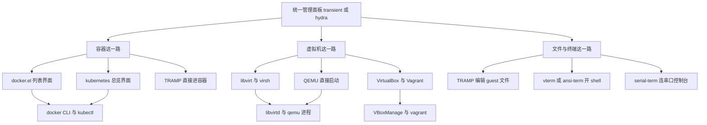
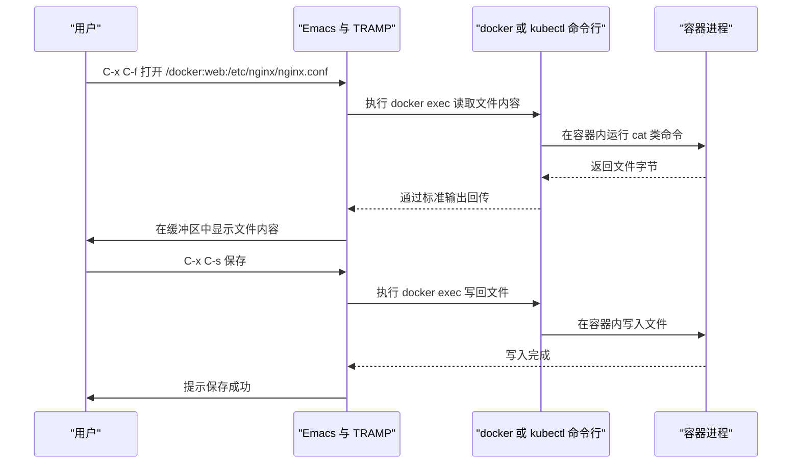
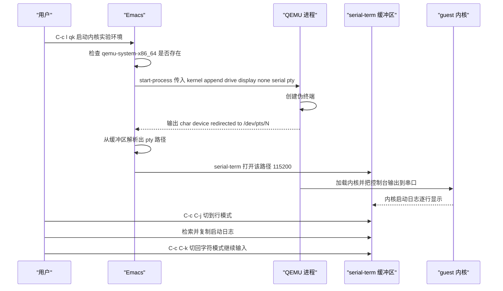

# 虚拟机与容器管理

> 把容器与虚拟机的启动、进入、看日志、连串口这些动作收进 Emacs，让「搭起一套实验环境」变成按一个键的事。本篇讲 docker.el 与 TRAMP 进容器、kubernetes 的 kubectl 集成、libvirt 与 QEMU 两条虚拟机路线，以及用 transient 做的统一管理面板。

---

## 一、为什么在 Emacs 里管虚拟化

### 1.1 三个具体收益

第一是**统一入口**。开发一台机器上通常同时有容器、Kubernetes 集群、几台虚拟机、若干串口设备。它们的工具各不相同：`docker`、`kubectl`、`virsh`、`VBoxManage`、`qemu-system-*`。每个都要记一套子命令与参数，切换时还要重新想「这个命令是哪个工具的」。把这些收进一个面板后，你只需要记一个键位，剩下的靠菜单提示。

第二是**日志与配置同屏**。看容器日志时，你往往同时需要改 Dockerfile、改 compose 文件、改 Kubernetes 清单。在终端里做这件事意味着在多个窗口之间来回切；在 Emacs 里，日志缓冲区与配置文件缓冲区可以并排放在一个窗口里，`C-x 3` 分屏即可，而且两边都能用同一套检索、复制、跳转。

第三是**把流程固化成命令**。启动一套内核实验环境的完整流程可能是：启动 QEMU、等待串口就绪、连上串口终端、在 guest 里挂载 rootfs。这套动作每次都要重复。写成 Elisp 函数后，它是一个命令；写成 transient 后，它是一个有提示的菜单。这不只是省事，更重要的是**不会漏步骤**。

### 1.2 它是编排层，不是替代品

必须把定位说清楚，否则会走弯路：

- 它**不替代** `docker` 与 `kubectl` 命令行。所有操作最终都是调用这些程序，Emacs 只是发起者与结果展示者。命令行能做的事，Emacs 里未必都能做。
- 它**不替代** `virt-manager` 这类图形管理工具。显卡配置、USB 直通、快照树管理这类复杂操作用图形界面更直观。
- 它**不替代** Dockerfile、compose 文件、Kubernetes 清单这些真正的「配置源」。Emacs 的角色是编辑它们并触发部署。

一句话：**Emacs 负责「发起与观察」，工具负责「执行」，配置文件负责「定义」。** 三者分工清楚，方案就不会别扭。

### 1.3 整体架构



这张图里最值得注意的是右侧那三个执行端：`docker`／`kubectl`、`libvirtd`／QEMU、`VBoxManage`／`vagrant`。它们才是真正干活的程序，所以第三章之后的所有配置，本质都是在解决同一个问题——**怎么让 Emacs 正确地调用它们，并优雅地接住它们的输出。**

---

## 二、容器：docker.el

### 2.1 安装与前置条件

docker.el 在 MELPA 上的包名是 `docker`，仓库是 https://github.com/Silex/docker.el 。

```text
M-x package-install RET docker RET
```

前置条件有三个，缺一个都会出问题：

1. `docker` 命令行可用。docker.el 不通过 API 直连 daemon，而是调用 `docker` 可执行文件，所以 `PATH` 里必须有它。在 Emacs 里验证：`M-: (executable-find "docker")`，返回路径才说明找得到。
2. Docker daemon 正在运行。在终端里 `docker ps` 能列出内容，Emacs 里才能用。
3. 想用 TRAMP 进容器（第三章）时，还需要额外安装 `docker-tramp` 包。docker.el 在检测不到它时会直接报错提示 `Tramp docker support was not detected, try installing docker-tramp`，这是源码里的明确检查，不是配置问题。

```elisp
;; 把 docker 相关命令集中到一个前缀，避免和别的键位冲突
(use-package docker
  :ensure t                       ; docker.el 不是内置包
  :bind ("C-c d" . docker))       ; M-x docker 与 C-c d 都会打开分发菜单
```

### 2.2 入口命令

docker.el 提供了一组列表界面命令，每个都打开一个独立缓冲区：

| 命令 | 打开的内容 |
| --- | --- |
| `M-x docker` | 分发菜单（transient），列出所有可用操作 |
| `M-x docker-containers` | 容器列表 |
| `M-x docker-images` | 镜像列表 |
| `M-x docker-volumes` | 数据卷列表 |
| `M-x docker-networks` | 网络列表 |
| `M-x docker-contexts` | 上下文（context）列表 |
| `M-x docker-compose` | compose 相关操作的分发菜单 |

这些列表界面建立在 `tabulated-list-mode` 之上，并启用了 tablist 次要模式。它带来的实际能力是：**列表可以按任意列排序、可以标记多个条目后批量操作**。标记与取消标记用 tablist 的标准键位（通常 `m` 标记、`u` 取消、`U` 全部取消，具体以 `C-h m` 在缓冲区里的帮助为准）。

`docker-containers` 缓冲区里有一套专用键位，这些键位在源码里逐个绑定，可以直接使用：

| 键位 | 命令 | 说明 |
| --- | --- | --- |
| `?` | `docker-container-help` | 弹出该界面的操作帮助菜单 |
| `S` | `docker-container-start` | 启动选中的容器 |
| `O` | `docker-container-stop` | 停止选中的容器 |
| `R` | `docker-container-restart` | 重启选中的容器 |
| `K` | `docker-container-kill` | 强制杀掉选中的容器 |
| `P` | `docker-container-pause` | 暂停容器 |
| `N` | `docker-container-unpause` | 恢复容器 |
| `D` | `docker-container-rm` | 删除选中的容器 |
| `L` | `docker-container-logs` | 查看容器日志 |
| `E` | `docker-container-exec` | 在容器里执行命令（exec） |
| `b` | `docker-container-shells` | 打开容器 shell（可选不同实现） |
| `a` | `docker-container-attach` | 附加到容器主进程 |
| `I` | `docker-container-inspect` | 查看容器的详细信息 |
| `d` | `docker-container-diff` | 查看容器文件系统改动 |
| `C` | `docker-container-cp` | 在容器与主机之间复制文件 |
| `f` | `docker-container-open` | 打开容器内文件（配合 TRAMP） |
| `l` | `docker-container-ls` | 列出容器内目录（配合 TRAMP） |
| `r` | `docker-container-rename-selection` | 重命名选中的容器 |

建议先按一次 `?` 看看当前版本到底绑了哪些键——这套界面在不同版本之间有过调整，而你本机的 `?` 输出永远是最准确的。

### 2.3 看日志与进容器

**看日志**用 `L`。日志会写进一个专用缓冲区，可以像普通文本一样检索。如果容器持续输出，缓冲区会不断增长；此时可以配合 `auto-revert-mode` 或按 `g` 重新拉取（具体行为取决于版本，用 `C-h m` 确认）。大量日志时的实用做法是在日志缓冲区里用 `C-s` 检索关键字，而不是从头翻。

**进容器**有三条路，体验差别明显：

- `E`（`docker-container-exec`）在容器内执行一条命令，适合 `ls`、`cat`、`env` 这类一次性查看。
- `a`（`docker-container-attach`）附加到容器的主进程。注意这与 exec 的语义不同：attach 是接到已经在跑的那个进程上，如果该进程没有分配 tty，你会看到输出但无法输入。
- `b`（`docker-container-shells`）打开一个交互式 shell 菜单。它支持多种终端实现：内置的 `shell`、`eshell`、`vterm`（需要 emacs-libvterm 包）、`eat`、`ghostel`。选哪个取决于你装了哪个以及偏好哪种终端。

这里给一个明确的推荐：**日常用 `vterm`。** 它基于 libvterm 提供真正的终端仿真，全屏程序（`top`、`vim`、`htop`）在里面的表现与真终端一致。`eshell` 是纯 Elisp 实现，不需要外部依赖，但运行全屏程序会有问题。如果你没有装 vterm，`shell` 是稳妥的退路。

```elisp
;; 选择容器 shell 的默认终端实现
;; 不同版本的变量名可能不同，用 C-h v 在 docker-container 前缀上检索
;; 最稳妥的方式是直接执行对应的命令：
;;   M-x docker-container-vterm        用 vterm 打开容器 shell
;;   M-x docker-container-eshell       用 eshell 打开
;;   M-x docker-container-eat          用 eat 打开
;;   M-x docker-container-ghostel      用 ghostel 打开
```

### 2.4 镜像、卷、网络、上下文

这四个列表界面的操作逻辑与容器界面一致：列表加标记加批量操作。几个常见需求对应的做法是：

- **清理无用资源**：在镜像列表里标记悬空镜像（界面会把悬空项显示为特殊状态，也可以按 `M-x docker-image-mark-dangling` 批量标记），然后删除。
- **运行新容器**：在镜像列表里选中镜像，用运行命令（`docker-image-run-selection`）按提示填端口映射、卷挂载、环境变量。
- **切换上下文**：在 `docker-contexts` 缓冲区里选中目标上下文，用它提供的「设为当前」操作（`docker-context-entry-set-active`），之后所有命令都作用于该上下文。这在同时连本地与远程 daemon 时很有用。
- **切换到 Podman**：docker.el 的部分操作支持选择运行时（源码中有 `docker-image-read-runtime` 这样的读取函数），因此可以在运行时选择 docker 或 podman。具体入口以你本机界面的提示为准。

### 2.5 docker-compose

`M-x docker-compose` 打开一个分发菜单，里面按动作分组，包括 `up`、`down`、`start`、`stop`、`restart`、`build`、`pull`、`push`、`logs`、`exec`、`run`、`config`、`create`、`rm`、`pause`、`unpause` 等，与 `docker compose` 的子命令一一对应。

使用要点是**当前目录**：compose 命令作用于「当前工作目录下的 compose 文件」，所以调用之前要确保当前缓冲区的 `default-directory` 指向项目根目录。在项目文件里执行 `M-x docker-compose` 是最自然的用法；如果你在别处调用，可以用 `M-x cd` 先切换目录到项目根。

关于 `docker compose` 与旧的 `docker-compose`：前者是新的插件形式（v2），后者是旧的独立 Python 程序（v1，已停止维护）。docker.el 会调用 `docker` 加 compose 子命令，因此需要较新的 Docker 环境。如果你的系统只有独立的 `docker-compose` 程序，界面里的某些操作可能会失败，这时升级 Docker 比改配置更有效。

更完整的 Docker 使用细节请参见 [[docker/README|Docker 教程]]。

---

## 三、用 TRAMP 直接进容器

### 3.1 /docker: 方法

TRAMP 是 Emacs 内置的远程文件访问框架（关于它的完整用法见 [[emacs教程/7进阶/03_TRAMP远程开发|TRAMP 远程开发]]）。装了 `docker-tramp` 包之后，它会向 `tramp-methods` 注册一个名为 `docker` 的方法，于是你可以用文件路径的语法直接访问容器内文件系统：

```text
C-x C-f /docker:容器名:/etc/nginx/nginx.conf RET
C-x C-f /docker:容器名:/app RET
```

路径格式是 `/docker:` 加容器名，加冒号，加容器内的绝对路径。第一次连接时会问你要用哪个用户（对应 `docker exec -u`），之后再连同一个容器不会重复询问。

docker.el 内部也复用了这个能力：容器列表里的 `f`（打开文件）与 `l`（列目录）就是构造这样的 TRAMP 路径并交给你。它使用的 TRAMP 方法名由变量 `docker-container-tramp-method` 决定，该变量的默认值就是字符串 `"docker"`。

前提条件与限制：

- 容器必须处于**运行中**状态。TRAMP 本质上是在执行 `docker exec`，停掉的容器连不上。
- 需要 `docker-tramp` 包，并且它注册的方法名与 `docker-container-tramp-method` 一致。
- **性能明显低于本地文件访问。** 每一次读写都要经过一次 `docker exec` 的往返。打开一个小配置文件可以接受，用它在容器里做大范围检索（`consult-ripgrep`、`project-find-regexp`）会很慢。
- 权限受容器内用户限制。以非 root 用户连接时，只有该用户能读的文件才读得到。

### 3.2 关于 Podman 的如实说明

这里要纠正一个常见的错误说法：**docker-tramp 并不会注册一个 `/podman:` 方法。**

docker-tramp 的源码里，方法名是一个常量（值为 `"docker"`），注册到 `tramp-methods` 的就是这一个。它对 Podman 的支持方式是另一个变量：`docker-tramp-docker-executable`，它的取值允许是 `"docker"` 或 `"podman"`。也就是说，**用 Podman 时要设置这个变量，而 TRAMP 路径前缀仍然是 `/docker:`**。

```elisp
;; 让 docker-tramp 调用 podman 而不是 docker
;; 注意：TRAMP 路径前缀依然是 /docker:，不存在 /podman: 方法
(require 'docker-tramp)
(setq docker-tramp-docker-executable "podman")
```

相关的变量还有 `docker-tramp-docker-options`（传给命令行的附加选项）和 `docker-tramp-use-names`（是否用容器名而非 ID）。如果你改了运行时而发现连不上，先用 `M-: (executable-find "podman")` 确认程序存在。

### 3.3 Kubernetes 的 TRAMP 方法

`kubernetes` 这个包（见第五章）会注册一个名为 `kubernetes` 的 TRAMP 方法，让你直接编辑 Pod 里的文件。它的路径格式有两种：

```text
/kubernetes:POD名:/路径              不指定容器，用 Pod 的默认容器
/kubernetes:容器名@POD名:/路径       指定容器
```

第二种写法值得记牢：`@` 前面是容器名，后面是 Pod 名。这个格式在多容器 Pod（例如带 sidecar 的 Pod）里是必需的，否则你无法确定进的是哪个容器。

配套的入口命令是 `kubernetes-tramp-find-file` 与 `kubernetes-tramp-dired`，它们会基于当前总览界面的状态提示你选择 Pod 与容器，然后构造上面的路径。

背后的实现原理是：该方法把 `kubectl exec -i -t -c 容器 -- shell` 当作登录程序，远程 shell 设为 `/bin/sh`。这解释了两个限制：**容器里必须有 `/bin/sh`**（用 distroless 或 scratch 基础镜像的容器没有 shell，因此无法用这种方式访问），以及**每次访问都要付一次 kubectl 往返的开销**。

另外要注意名称冲突：MELPA 上还有一个独立的 `kubernetes-tramp` 包，功能类似但由不同作者维护。`kubernetes` 包里的这个文件特意命名为 `kubernetes-el-tramp.el` 以避开冲突。**不要同时安装两个**，否则 TRAMP 方法可能被覆盖成你不期望的那个。

### 3.4 什么时候不该用 TRAMP

TRAMP 进容器适合「看几个文件、改一处配置」。以下场景应当改用别的办法：

- 需要在容器里做全项目检索或大规模重构：改用第四节讲的方式，在容器内跑 Emacs daemon，或者干脆在容器内开一个终端。
- 需要运行交互式全屏程序：用 `docker-container-shells` 走 vterm。
- 网络往返本来就慢的远程集群：TRAMP 的每一次文件操作都是一次网络往返，延迟会被放大，体验很差。



---

## 四、在容器里开发

### 4.1 三种模式

| 模式 | 做法 | 优点 | 缺点 |
| --- | --- | --- | --- |
| 本地 Emacs 加 TRAMP | 在本机 Emacs 里编辑容器内文件 | 不用在容器里装任何东西，用自己熟悉的配置 | 每次文件操作一次往返，慢；LSP、补全、检索都要走 TRAMP |
| 容器内跑 Emacs daemon | 容器里装 Emacs 并启动 daemon，本机用 `emacsclient` 连 | 运行环境与代码在同一容器内，LSP 与编译工具链天然可用 | 容器里要装 Emacs 与全部配置；容器重建后要重做 |
| 容器内全功能图形 Emacs | 把 X11 socket 或 Wayland 挂进容器，直接跑图形界面 | 体验与本地几乎一致 | 配置复杂，跨平台的 X11 转发在 macOS 与 Windows 上更麻烦 |

### 4.2 选择的判断标准

判断依据是**你的工具链在哪一侧**。如果语言服务器、编译器、测试框架都装在容器里，那么把编辑动作放在容器外会让每一次补全请求都跨越容器边界，延迟累积起来非常影响体验。这种情况下应当选模式二：在容器里跑 daemon，让编辑器与工具链待在同一侧，而你的键盘输入通过 `emacsclient` 送进去。

反之，如果工具链装在本机（只是运行环境在容器里），模式一足够，且配置成本最低。

模式二的典型流程是：在 Dockerfile 里装上 Emacs，把配置目录挂载进去，启动时执行 `emacs --daemon`，然后从宿主机用 `emacsclient -c -n -s <socket>` 连接。这里的关键点是**共享同一个 socket 路径**：把容器的 `/run/emacs` 或 `~/.emacs.d/server` 挂载到宿主机的一个目录上，双方约定同一个路径。

关于 `emacsclient` 的详细用法与远程开发的各种组合，见 [[emacs教程/7进阶/03_TRAMP远程开发|TRAMP 远程开发]]。

### 4.3 一个实用折中

实际工作中最省事的往往是**混合模式**：用 TRAMP 处理「改一行配置」这类小事，用 vterm 进容器跑构建与测试这类大事。理由是这两类操作的性能敏感度完全不同——改一行配置一次往返只要几百毫秒，可以接受；而一次全项目检索如果走 TRAMP，可能要几十秒。

```elisp
;; 在容器里跑一条命令，并把结果写进独立缓冲区
(defun my/docker-exec-async (container command)
  "在 CONTAINER 中异步执行 COMMAND，输出写入专用缓冲区。
用 exec 而不是 attach，所以不会接到容器主进程上。"
  (interactive "s容器名：\ns要在容器中执行的命令：")
  (let ((buf (get-buffer-create (format "*docker exec %s*" container))))
    (with-current-buffer buf (erase-buffer))
    (make-process
     :name (format "docker-exec-%s" container)
     :buffer buf
     :command (list "docker" "exec" container "sh" "-c" command)
     :sentinel (lambda (proc _event)
                 (when (memq (process-status proc) '(exit signal))
                   (message "命令结束：%s" (process-status proc)))))
    (display-buffer buf)
    (message "已在 %s 中启动：%s" container command)))
```

---

## 五、kubernetes：把 kubectl 收进 Emacs

### 5.1 包名与现状

这一节先纠正一个极易搞错的点：**GitHub 仓库叫 kubernetes-el，但 MELPA 上的包名是 `kubernetes`。**

```text
M-x package-install RET kubernetes RET
```

如果你按仓库名去找 `kubernetes-el` 这个包，在 MELPA 上是搜不到的。仓库地址是 https://github.com/kubernetes-el/kubernetes-el ，包名是 https://melpa.org/#/kubernetes 。

关于「它是否还活跃」这个问题，可以给出一个有依据的回答：该包在 MELPA 上的版本号是 20260402.429，也就是说在 2026 年 4 月仍有更新。版本号里的日期是 MELPA 每次构建时打上的，因此它至少说明包的构建是持续进行的。不过要如实补充两点：其一，包内文件的版权年份标注较早（首作者的信息是 2017 至 2021 年），说明核心架构多年未大改；其二，它依赖 `magit-section`、`magit-popup`、`transient`、`dash`、`s`、`request` 等包，其中 `magit-popup` 属于较老的机制（Magit 自身已转向 transient），因此它在未来可能遇到依赖兼容问题。结论是：**可以用，功能完整，但不要把它当作会跟随 kubectl 快速演进的工具**；新的 kubectl 特性往往要等包更新或干脆回到命令行。

### 5.2 kubernetes-overview

主入口是 `M-x kubernetes-overview`。它打开一个总览缓冲区，用可折叠的分节展示当前命名空间下的各类资源：Deployment、StatefulSet、Service、Pod、ConfigMap、Secret、Ingress、Job、CronJob、PersistentVolumeClaim 等。

这个缓冲区基于 `magit-section` 构建，所以操作手感与 Magit 一致：`TAB` 折叠展开节，在资源行上按 `RET` 或在行上执行命令来查看详情。缓冲区会**定时自动刷新**（内部有轮询机制），也可以用 `M-x kubernetes-refresh` 手动刷新。

几个常用命令：

| 命令 | 作用 |
| --- | --- |
| `M-x kubernetes-overview` | 打开总览界面 |
| `M-x kubernetes-refresh` | 立即刷新状态 |
| `M-x kubernetes-set-namespace` | 切换命名空间 |
| `M-x kubernetes-contexts-use-context` | 切换 kubeconfig 上下文 |
| `M-x kubernetes-commands-display-buffer` | 显示操作输出缓冲区 |
| `M-x kubernetes-config-popup` | 配置相关的操作菜单 |
| `M-x kubernetes-kubectl-config-view` | 查看当前 kubectl 配置 |
| `M-x kubernetes-kill-buffers` | 清理该包产生的缓冲区 |

关于自动刷新有一个实用提醒：轮询意味着后台会周期性执行 `kubectl` 命令。连的集群很远或集群很慢时，这会持续占用资源并让 Emacs 偶尔卡顿。不用时用 `M-x kubernetes-kill-buffers` 与相关命令停掉轮询进程，比一直开着更省心。

### 5.3 看日志与进入 Pod

在总览界面里，光标放在某个 Pod 或资源上时可以直接执行：

- `M-x kubernetes-logs-follow-with-check`：持续跟踪日志（相当于 `kubectl logs -f`）。
- `M-x kubernetes-logs-fetch-all-with-check`：一次性抓取全部日志。
- `M-x kubernetes-logs-select-resource`：先选资源再看日志。
- `M-x kubernetes-logs-refresh`：刷新日志缓冲区。
- `M-x kubernetes-exec-into`：进入 Pod 执行命令。
- `M-x kubernetes-exec-using-vterm`：用 vterm 打开 Pod 内的 shell。
- `M-x kubernetes-describe-pod`：查看 Pod 的 describe 输出。
- `M-x kubernetes-describe-dwim`：对光标处的资源执行 describe。
- `M-x kubernetes-display-pod`、`kubernetes-display-deployment`、`kubernetes-display-service`、`kubernetes-display-node`、`kubernetes-display-secret` 等：查看特定类型资源的详情。

带 `-with-check` 后缀的命令比不带的多做了一件事：检查当前上下文与命名空间是否与你的预期一致，不一致时先提示。**建议一律用带 check 的版本**，因为「看错集群的日志」是这类工具最容易造成的严重误判。

YAML 视图方面，`M-x kubernetes-yaml-make-buffer` 能把资源定义渲染成 YAML 缓冲区，方便直接阅读与对照修改。用 `kubernetes-kubectl-edit-resource` 可以直接在 Emacs 里编辑资源定义并提交，它会用 `kubectl edit` 的机制，因此最终仍受集群侧校验。

### 5.4 kubectl 与 vterm 的组合

有些操作没有现成的包支持，硬要在 Elisp 里拼参数不如直接用命令行。此时推荐的做法是**用 vterm 开一个终端，在里面敲 kubectl**，而不是用 `M-x shell`。原因是 `kubectl` 的某些子命令（例如 `kubectl exec -it`、`kubectl attach`、带进度显示的 `kubectl apply`）需要真正的 tty，`shell` 与 `eshell` 无法完整支持。

```elisp
(defun my/kubectl-in-vterm (&optional args)
  "在 vterm 中运行 kubectl ARGS。
需要安装 vterm 包；如果没有 vterm，退回 ansi-term（内置）。
PROGRAM 参数可以让 vterm 直接运行指定程序。"
  (interactive "skubectl 参数（可留空）：")
  (let ((cmd (if (string-empty-p (or args ""))
                 "kubectl"
               (concat "kubectl " args))))
    (cond
     ;; vterm 提供了真正的终端仿真，全屏程序与交互命令都能正常工作
     ((fboundp 'vterm)
      (vterm (concat "kubectl" (if (string-empty-p (or args ""))
                                   ""
                                 (concat " " args)))))
     ;; 退路：内置的 ansi-term，同样提供终端仿真
     (t
      (ansi-term cmd (format "kubectl-%s" (format-time-string "%H%M%S")))))))
```

`vterm` 这个函数接受的是一个程序名字符串（可以带参数），它会启动该程序并置于终端缓冲区中。`ansi-term` 的第一个参数是同理的「程序加参数」，第二个参数是缓冲区名。两个函数都会给你一个真正的终端，因此 `kubectl exec -it` 里的交互能正常工作。

### 5.5 把常用 kubectl 命令封装成 Emacs 命令

高频操作值得封装，好处是可以固定参数、避免敲错，也能把输出接到 Emacs 的处理流程里。下面这组函数覆盖「看 Pod、看日志、进 shell、看事件」四件事，只用 `kubectl` 命令本身，不依赖任何第三方包。

```elisp
(defcustom my/kubectl-executable "kubectl"
  "kubectl 可执行文件的位置。"
  :type 'string
  :group 'my-lab)

(defun my/kubectl--check ()
  "确认 kubectl 可执行文件存在，否则给出明确错误。"
  (unless (executable-find my/kubectl-executable)
    (user-error "找不到 kubectl，请检查 my/kubectl-executable：%s"
                my/kubectl-executable)))

(defun my/kubectl--send (name args)
  "异步执行 kubectl ARGS，输出写入以 NAME 命名的缓冲区。
NAME 会作为缓冲区名的一部分，便于区分多份输出。"
  (my/kubectl--check)
  (let ((buf (get-buffer-create (format "*kubectl: %s*" name))))
    (with-current-buffer buf (erase-buffer))
    (make-process
     :name (format "kubectl-%s" name)
     :buffer buf
     :command (append (list my/kubectl-executable) args)
     :sentinel (lambda (proc _event)
                 (when (memq (process-status proc) '(exit signal))
                   (message "kubectl %s 结束（%s）"
                            name (process-status proc)))))
    (display-buffer buf)
    buf))

(defun my/kubectl-get-pods (&optional namespace)
  "列出 NAMESPACE 中的 Pod。留空则用当前命名空间。"
  (interactive "s命名空间（留空用当前）：")
  (my/kubectl--send
   "get pods"
   (append (list "get" "pods" "-o" "wide")
           (unless (string-empty-p namespace) (list "-n" namespace)))))

(defun my/kubectl-describe (resource name &optional namespace)
  "查看 RESOURCE 类型的 NAME 资源的详情。"
  (interactive "s资源类型（如 pod）：\ns资源名：\ns命名空间（留空用当前）：")
  (my/kubectl--send
   (format "describe %s %s" resource name)
   (append (list "describe" resource name)
           (unless (string-empty-p namespace) (list "-n" namespace)))))

(defun my/kubectl-logs (pod &optional container namespace)
  "查看 POD 的日志。CONTAINER 留空表示用默认容器。"
  (interactive "sPod 名：\ns容器名（留空用默认）：\ns命名空间（留空用当前）：")
  (my/kubectl--send
   (format "logs %s" pod)
   (append (list "logs" pod)
           (unless (string-empty-p container) (list "-c" container))
           (unless (string-empty-p namespace) (list "-n" namespace)))))

(defun my/kubectl-events (&optional namespace)
  "查看集群事件，按时间排序。排障时第一个该看的命令。"
  (interactive "s命名空间（留空用当前）：")
  (my/kubectl--send
   "get events"
   (append (list "get" "events" "--sort-by=.lastTimestamp")
           (unless (string-empty-p namespace) (list "-n" namespace)))))

(defun my/kubectl-exec-vterm (pod &optional container)
  "用 vterm 打开 POD 内的交互式 shell。
exec 需要真正的 tty，所以必须走终端而不是普通进程缓冲区。"
  (interactive "sPod 名：\ns容器名（留空用默认）：")
  (my/kubectl--check)
  (let ((cmd (concat "kubectl exec -it " pod
                     (unless (string-empty-p container)
                       (concat " -c " container))
                     " -- /bin/sh")))
    (if (fboundp 'vterm)
        (vterm cmd)
      (ansi-term cmd (format "exec-%s" pod)))))
```

这组函数用到的都是内置能力：`make-process` 用于异步执行、`display-buffer` 用于展示输出、`ansi-term` 与 `vterm` 用于终端。它们与前面 docker 部分的写法完全一致——**凡是「执行一条命令并看输出」，都用异步进程加专用缓冲区；凡是「需要交互」，都走终端缓冲区。**

---

## 六、虚拟机：libvirt 与 virsh

### 6.1 为什么用 vterm 跑 virsh

`virsh` 是 libvirt 的命令行客户端。它有一批「一次性输出」的子命令（`list`、`dominfo`、`domstate`），也有一批「交互式」的子命令（`console`、`start --console`）。前者可以用异步进程加缓冲区的方式优雅处理，后者必须有终端。

因此推荐的组合是：**查看类命令用异步进程，交互类命令用 vterm（或内置的 ansi-term）。** 这与前面 kubectl 的处理方式一致。

```elisp
(defcustom my/virsh-executable "virsh"
  "virsh 可执行文件的位置。"
  :type 'string
  :group 'my-lab)

(defun my/virsh--check ()
  "确认 virsh 可用。"
  (unless (executable-find my/virsh-executable)
    (user-error "找不到 virsh，请先安装 libvirt 客户端")))

(defun my/virsh--send (name args)
  "异步执行 virsh ARGS，输出写入 *virsh: NAME* 缓冲区。"
  (my/virsh--check)
  (let ((buf (get-buffer-create (format "*virsh: %s*" name))))
    (with-current-buffer buf (erase-buffer))
    (make-process
     :name (format "virsh-%s" name)
     :buffer buf
     :command (append (list my/virsh-executable) args)
     :sentinel (lambda (proc _event)
                 (when (memq (process-status proc) '(exit signal))
                   (message "virsh %s 结束（%s）" name (process-status proc)))))
    (display-buffer buf)
    buf))
```

### 6.2 常用 virsh 命令

| 命令 | 作用 |
| --- | --- |
| `virsh list` | 列出运行中的虚拟机 |
| `virsh list --all` | 列出全部虚拟机，包括已关闭的 |
| `virsh start 域名` | 启动虚拟机 |
| `virsh shutdown 域名` | 优雅关机（向 guest 发送关机信号） |
| `virsh destroy 域名` | 强制断电，相当于拔电源 |
| `virsh reboot 域名` | 重启 |
| `virsh suspend 域名` / `resume 域名` | 暂停与恢复 |
| `virsh console 域名` | 连接到 guest 的串口控制台 |
| `virsh dominfo 域名` | 查看虚拟机信息 |
| `virsh domifaddr 域名` | 查询 guest 的 IP 地址 |
| `virsh dumpxml 域名` | 导出虚拟机的 XML 定义 |
| `virsh edit 域名` | 编辑虚拟机定义 |
| `virsh net-list --all` | 列出虚拟网络 |

关于「域」（domain）：libvirt 把虚拟机称作 domain，所以命令里出现的 `域名` 参数指的是虚拟机名或 UUID，与 DNS 域名无关。这个术语差异经常让第一次用 virsh 的人困惑。

```elisp
(defun my/virsh-list ()
  "列出全部虚拟机（含已关闭的）。"
  (interactive)
  (my/virsh--send "list" '("list" "--all")))

(defun my/virsh-start (domain)
  "启动虚拟机 DOMAIN。"
  (interactive "s要启动的虚拟机名：")
  (my/virsh--send (format "start %s" domain) (list "start" domain)))

(defun my/virsh-shutdown (domain)
  "优雅关闭虚拟机 DOMAIN。
用 shutdown 而不是 destroy，避免相当于拔电源的强制断电。"
  (interactive "s要关闭的虚拟机名：")
  (my/virsh--send (format "shutdown %s" domain) (list "shutdown" domain)))

(defun my/virsh-dominfo (domain)
  "查看虚拟机 DOMAIN 的信息。"
  (interactive "s虚拟机名：")
  (my/virsh--send (format "dominfo %s" domain) (list "dominfo" domain)))

(defun my/virsh-domifaddr (domain)
  "查询虚拟机 DOMAIN 的 IP 地址。"
  (interactive "s虚拟机名：")
  (my/virsh--send (format "domifaddr %s" domain) (list "domifaddr" domain)))
```

`my/virsh-domifaddr` 值得单独说一句：它是「拿到 guest 的 IP 以便 SSH 进去」的正规途径，比在 guest 里手动敲 `ip addr` 再抄地址要省事得多。

### 6.3 virsh console 与串口的关系

`virsh console 域名` 连接到的是**guest 的串口控制台**，而不是图形控制台，也不是 SSH。它要求两件事同时成立：

1. 虚拟机的 XML 配置里有串口设备，通常是 `<serial type='pty'>` 加 `<console type='pty'>`。libvirt 默认创建虚拟机时一般会带上，但手工写的 XML 可能没有。
2. **guest 内核要往串口输出控制台。** 这需要内核命令行里有 `console=ttyS0`（x86 上通常是 ttyS0，也可能因设备顺序不同而变），并且 guest 里运行着 getty 监听该串口，或者至少内核把日志输出到它。

这对本仓库的内核与汇编实验场景特别相关：你自己编译内核、用 QEMU 启动时，往往就是用 `console=ttyS0` 把启动日志引到串口，然后用 `virsh console` 或 `serial-term` 观察。也就是说，**`console=ttyS0` 这个内核参数是把「虚拟机管理」与「内核实验」连起来的接口**。相关背景参见 [[内核/内核索引|内核]] 与 [[汇编基础/汇编目录|汇编基础]]。

如果 `virsh console` 连上去是一片空白，按这个顺序排查：先确认 guest 的 XML 里有串口设备（`virsh dumpxml 域名 | grep -A3 serial`），再确认内核命令行里有 `console=ttyS0`，最后确认 guest 里有 getty 在监听该串口。三者缺一都会表现为「连上了但没有任何输出」。

```elisp
(defun my/virsh-console (domain)
  "用终端仿真连接到虚拟机 DOMAIN 的串口控制台。
virsh console 需要真正的 tty，所以走 vterm 或 ansi-term。
退出方式：在控制台里按 C-] （这是 virsh 自己的退出键）。"
  (interactive "s虚拟机名：")
  (my/virsh--check)
  (let ((cmd (format "virsh console %s" domain)))
    (if (fboundp 'vterm)
        (vterm cmd)
      (ansi-term cmd (format "console-%s" domain)))))
```

在 `virsh console` 里退出的按键是 `C-]`，这是 virsh 自己处理的，与 Emacs 无关。这一点需要提前知道，否则会以为终端卡住了。

### 6.4 用 TRAMP 连进 guest 编辑文件

虚拟机跑起来之后，最自然的编辑方式是通过 SSH 用 TRAMP 连进去：

```text
C-x C-f /ssh:用户名@虚拟机地址:/etc/配置文件 RET
```

如果本机与 guest 之间配置了 SSH 密钥免密登录，这个路径打开后可以直接编辑并保存，不需要输入密码。把常用的几台虚拟机写进 `~/.ssh/config` 之后，TRAMP 还支持用配置里的别名：

```text
C-x C-f /ssh:虚拟机别名:/etc/配置文件 RET
```

关于 SSH 免密配置、TRAMP 的性能调优、以及 `ControlMaster` 连接复用（对 TRAMP 的速度提升非常明显）等内容，见 [[emacs教程/7进阶/03_TRAMP远程开发|TRAMP 远程开发]]。

一个实用细节：**用 `my/virsh-domifaddr` 拿到 IP 之后再开 TRAMP**。虚拟机的 IP 由 DHCP 分配，每次重建可能变化；如果你把 IP 写死在 ssh config 里，过一段时间就会连不上。更好的做法是用 libvirt 的静态 DHCP 分配（在网络的 XML 里为某块 MAC 绑定固定 IP），或者用一个能解析 guest 主机名的 DNS。

### 6.5 把整条链路串成一个命令

把「查 IP、打开 TRAMP 路径」串起来，可以省掉手工抄地址的环节：

```elisp
(defun my/guest-find-file (domain file)
  "在虚拟机 DOMAIN 中打开 FILE。
先从 virsh 取 IP，再构造 TRAMP 路径打开。
取不到 IP 时提示你手工输入地址。"
  (interactive
   (list (read-string "虚拟机名：")
         (read-string "要打开的文件（容器内绝对路径）：" "/etc/hosts")))
  (my/virsh--check)
  (let* ((output (shell-command-to-string
                  (format "%s domifaddr %s" my/virsh-executable domain)))
         ;; domifaddr 的输出里 IP 后面带 /掩码长度，这里只取地址部分
         (ip (when (string-match "\\([0-9]+\\.[0-9]+\\.[0-9]+\\.[0-9]+\\)" output)
               (match-string 1 output)))
         (host (or ip (read-string "没能自动取得 IP，请手工输入地址："))))
    (find-file (format "/ssh:%s:%s" host file))))
```

`shell-command-to-string` 是同步的，会短暂阻塞 Emacs，但 `virsh domifaddr` 很快，这个代价可以接受。这里要明确提醒的是：**不要把 `shell-command-to-string` 用在耗时命令上**，那会让整个编辑器卡住，前面几章反复强调的异步原则在这里同样适用。

---

## 七、虚拟机：QEMU 直达

### 7.1 什么时候直接用 QEMU

libvirt 的价值在于统一管理和图形界面，但它也带来一层抽象。做内核与底层实验时，直接调用 QEMU 往往更合适，原因是：

- 参数完全透明。你写的每一个 `-append`、`-drive`、`-device` 都直接影响启动结果，没有中间层改写。
- 便于复现。一条命令就是一个完整的实验环境描述，可以直接写进文档或 Makefile。
- 便于内核调试。`-s -S` 可以让 QEMU 等待 GDB 连接，配合 `M-x gdb` 就能在本机调试 guest 内核。

代价是参数多、容易写错。所以最值得用 Elisp 做的就是把参数固定下来，让它成为一个稳定的命令。

### 7.2 关于串口：一个必须先讲清楚的关键点

在写代码之前必须理解一件事，否则写出来的函数「看起来对但连不上」。

QEMU 的 `-nographic` 选项等价于「关闭图形显示，并把串口接到标准输入输出」。它**只有在 QEMU 拥有一个真实终端时才有意义**。而我们从 Emacs 用 `start-process` 启动 QEMU 时，进程的标准输入输出被重定向到缓冲区或直接丢弃，不是一个终端，所以 `-nographic` 下你既看不到串口输出，也无法输入。

因此「在 Emacs 里启动 QEMU 并连上串口」有两条正确路线：

**路线一（推荐）：让 QEMU 开一个伪终端，用 `serial-term` 连上去。** 用 `-display none` 关闭图形显示，用 `-serial pty` 让 QEMU 自己分配一个伪终端（pty）并把路径打印到输出里。我们在 Emacs 侧读取那段输出、解析出路径、再调用 `serial-term`。这是 Linux 与 macOS 上最干净的做法。

**路线二：把串口接到 Unix 套接字，用 `make-network-process` 连接。** 用 `-chardev socket` 建一个套接字，Emacs 连上去。这条路线的优点是跨平台、路径固定，缺点是不能用 `serial-term`（它只接受串口设备名），要自己搭一个终端缓冲区。

至于 `-nographic` 加 `-serial mon:stdio`：它在 Emacs 里不适用的原因如上，但它非常适合**在 vterm 里手工启动 QEMU**，因为 vterm 提供了真实终端。这也是下面会给出的备选做法。

### 7.3 启动内核的完整函数

下面的函数采用路线一，完整实现「启动 QEMU、等待 QEMU 报告 pty 路径、自动打开串口终端」这条链路。

```elisp
(defcustom my/qemu-executable "qemu-system-x86_64"
  "QEMU 可执行文件。32 位系统用 qemu-system-i386，ARM 用 qemu-system-aarch64。"
  :type 'string
  :group 'my-lab)

(defcustom my/kernel-image "~/lab/linux/arch/x86/boot/bzImage"
  "自编译内核的镜像路径。"
  :type 'file
  :group 'my-lab)

(defcustom my/rootfs-image "~/lab/rootfs.ext4"
  "根文件系统镜像路径。"
  :type 'file
  :group 'my-lab)

(defcustom my/qemu-serial-speed 115200
  "串口速率。要与内核命令行里的 console= 设置一致。"
  :type 'integer
  :group 'my-lab)

(defvar my/qemu-process nil
  "由 Emacs 启动的 QEMU 进程对象。")

(defun my/qemu--serial-term-from-output (buffer)
  "从 BUFFER 里找出 QEMU 报告的 pty 路径并打开串口终端。
QEMU 用 -serial pty 时会在输出里打印形如
  char device redirected to /dev/pts/7 (label serial0)
的一行，本函数解析其中的设备路径。"
  (with-current-buffer buffer
    (save-excursion
      (goto-char (point-min))
      (when (re-search-forward
             "char device redirected to \\(/dev/[^ \n]+\\)" nil t)
        (let ((port (match-string 1)))
          ;; 打开串口终端。serial-term 的第一个参数是设备路径，第二个是速率
          (serial-term port my/qemu-serial-speed)
          (message "已连接串口终端：%s" port))))))

(defun my/qemu-start-kernel (&optional extra-args)
  "用 QEMU 启动自编译内核，串口走 pty，启动后自动打开串口终端。
EXTRA-ARGS 是附加的 QEMU 参数列表，例如 (\"-s\" \"-S\") 用于内核调试。

关键参数说明：
  -kernel    内核镜像
  -append    内核命令行，console=ttyS0 让内核把控制台输出到串口
  -drive     rootfs 镜像，if=virtio 表示用 virtio 块设备
  -m         内存大小，单位 MB
  -smp       CPU 核数
  -display none  不打开图形窗口
  -serial pty    让 QEMU 分配伪终端并打印其路径
  -enable-kvm -cpu host  启用 KVM 硬件加速（仅 Linux 可用）"
  (interactive)
  (unless (executable-find my/qemu-executable)
    (user-error "找不到 %s，请先安装 QEMU" my/qemu-executable))
  (when (process-live-p my/qemu-process)
    (delete-process my/qemu-process))
  (let* ((buf (get-buffer-create "*qemu*"))
         (kernel (expand-file-name my/kernel-image))
         (rootfs (expand-file-name my/rootfs-image)))
    (with-current-buffer buf (erase-buffer))
    (setq my/qemu-process
          (apply #'start-process
                 "qemu" buf my/qemu-executable
                 (append
                  (list
                   "-kernel" kernel
                   "-append" "console=ttyS0 root=/dev/vda rw"
                   "-drive" (format "file=%s,format=raw,if=virtio" rootfs)
                   "-m" "1024"
                   "-smp" "2"
                   "-display" "none"
                   "-serial" "pty")
                  ;; KVM 只在 Linux 上存在，其他平台要换参数
                  (when (eq system-type 'gnu/linux)
                    (list "-enable-kvm" "-cpu" "host"))
                  extra-args)))
    ;; QEMU 启动后很快就会打印 pty 路径，这里等它出现
    (accept-process-output my/qemu-process 2)
    (my/qemu--serial-term-from-output buf)
    (message "QEMU 已启动，日志见 *qemu* 缓冲区")))
```

这个函数有几个设计要点值得说明。

**为什么要等 2 秒。** `accept-process-output` 让 Emacs 处理该进程的输出一段时间，这样缓冲区里就有内容可供解析。这是一个务实的做法；更严格的做法是给进程装一个 `:filter`，在过滤器里检测到目标字符串就立刻触发，不用固定等待。如果你希望更快更可靠，可以把 `start-process` 换成 `make-process` 并加上过滤器，在过滤器里调用 `my/qemu--serial-term-from-output`。

**为什么用 `if=virtio`。** virtio 是虚拟化专用的半虚拟化设备接口，性能与正确性都优于模拟真实硬件（IDE、SATA）。在实验环境里养成用 virtio 的习惯，能避免很多「设备驱动没编进内核」的意外——不过这要求 guest 内核配置里启用了 virtio 相关选项，这一点需要与内核编译配置对照。

**为什么 `-serial pty` 而不是 `-nographic`。** 原因已在上一节说明。若你确实想用 `-nographic`，正确场景是在终端缓冲区里手工启动：

```elisp
;; 在 vterm 里手工启动带 -nographic 的 QEMU：这种场景下串口接到 stdio，
;; 因此能在终端里直接与 guest 交互。这是终端里做实验最方便的方式。
;; 在 vterm 里输入下面这一行（注意它需要真实终端，所以必须在终端里跑）：
;; qemu-system-x86_64 -kernel ~/lab/linux/arch/x86/boot/bzImage \
;;   -append "console=ttyS0 root=/dev/vda rw" \
;;   -drive file=~/lab/rootfs.ext4,format=raw,if=virtio \
;;   -m 1024 -smp 2 -nographic -enable-kvm -cpu host

(defun my/qemu-in-vterm (&optional args)
  "在 vterm 里启动 QEMU，使用 -nographic 让串口接到终端。
适合需要直接在终端里与 guest 交互的场景。"
  (interactive "s附加参数（可留空）：")
  (unless (executable-find my/qemu-executable)
    (user-error "找不到 %s" my/qemu-executable))
  (let ((cmd (format "%s -kernel %s -append %s -drive file=%s,format=raw,if=virtio -m 1024 -smp 2 -nographic %s"
                     my/qemu-executable
                     (expand-file-name my/kernel-image)
                     (shell-quote-argument "console=ttyS0 root=/dev/vda rw")
                     (expand-file-name my/rootfs-image)
                     (or args ""))))
    (if (fboundp 'vterm)
        (vterm cmd)
      (ansi-term cmd "*qemu-nographic*"))))
```

在 `-nographic` 模式下，QEMU 的快捷键是 `C-a` 前缀：`C-a c` 在控制台与 QEMU monitor 之间切换，`C-a x` 退出 QEMU。这两个键值得记住，因为 `-nographic` 下没有图形窗口可以点关闭。

### 7.4 串口终端与内核调试

`serial-term` 打开的缓冲区处在 Term 模式，几个必须知道的键位：

| 键位 | 命令 | 说明 |
| --- | --- | --- |
| `C-c C-j` | `term-line-mode` | 切到行模式，此时可以正常移动光标、复制文本（不向 guest 发送按键） |
| `C-c C-k` | `term-char-mode` | 切回字符模式，所有按键直接送给 guest |
| `RET` | `term-send-input` | 行模式下发送一行 |
| `C-c C-u` | `term-kill-input` | 清空当前输入 |
| `C-c C-c` | `term-interrupt-subjob` | 发送中断信号 |
| `C-c C-z` | `term-stop-subjob` | 发送停止信号 |
| `C-c C-\` | `term-quit-subjob` | 发送退出信号 |
| `C-c C-e` | `term-show-maximum-output` | 显示更多历史输出 |
| `C-c C-r` | `term-show-output` | 跳到上一段输出的开头 |
| `C-c C-o` | `term-kill-output` | 删除到上一个提示符为止的输出 |

最需要记住的是 `C-c C-j`。在字符模式下，你按的每个键都会被送给 guest，包括 `C-x`，所以**在字符模式里按 `C-x C-s` 之类的 Emacs 键位不会生效，而是被原样发送**。想复制串口里的输出（例如一段内核崩溃日志），先按 `C-c C-j` 切到行模式，才能像普通缓冲区一样选择和复制。这个切换是使用串口终端时最容易卡住的地方。

关闭串口终端只需 `C-x k` 杀掉那个缓冲区，串口会被释放。如果之后想重连同一个 pty，注意 pty 在 QEMU 进程结束前一直有效，但路径可能随重启而变化，所以每次重新启动 QEMU 都应当重新解析一次路径——这也是上面的函数每次都重新解析的原因。

### 7.5 串口工具的选择

除了 `serial-term`，Linux 上还有两个常用的串口工具：`minicom` 与 `gtkterm`。它们的功能更完整（日志记录、文件传输协议、更多流控选项），如果你需要那些功能，可以在终端缓冲区里运行它们。

`serial-term` 的优势是**与 Emacs 集成**：串口输出就在一个普通缓冲区里，可以用 `isearch` 检索、可以把整段日志 `C-x C-w` 存成文件、可以与其他窗口并排。对于内核与汇编实验这类「输出大量日志、需要反复回看」的场景，这个优势很实在。

```elisp
(defun my/serial-term-choose (port speed)
  "打开串口终端。PORT 例如 /dev/ttyUSB0 或 /dev/pts/7。
Windows 上写 COM1 或 \\\\.\\COM10 这种形式。"
  (interactive
   (list (read-string "串口设备："
                      (if (memq system-type '(windows-nt ms-dos)) "COM1" "/dev/ttyUSB0"))
         (string-to-number (read-string "速率：" (number-to-string my/qemu-serial-speed)))))
  (serial-term port speed))
```

注意 `serial-term` 的第二个参数是**数字**（速率），不是字符串。用 `M-x serial-term` 交互式调用时它会提示你输入，从 Elisp 调用时要用 `string-to-number` 转换，否则会报类型错误。

---

## 八、虚拟机：VirtualBox 与 Vagrant

### 8.1 VBoxManage 的封装

VirtualBox 的命令行工具是 `VBoxManage`。它在 Linux、macOS、Windows 上都有，因此在跨平台场景里比 libvirt 更通用（libvirt 在 Windows 上基本没有可用实现）。

| 命令 | 作用 |
| --- | --- |
| `VBoxManage list vms` | 列出所有虚拟机 |
| `VBoxManage list runningvms` | 列出运行中的虚拟机 |
| `VBoxManage startvm 名称` | 启动虚拟机（默认带图形界面） |
| `VBoxManage startvm 名称 --type headless` | 无界面启动 |
| `VBoxManage controlvm 名称 acpipowerbutton` | 模拟按下电源键，让 guest 优雅关机 |
| `VBoxManage controlvm 名称 poweroff` | 强制断电 |
| `VBoxManage showvminfo 名称` | 查看虚拟机信息 |
| `VBoxManage list ostypes` | 列出支持的客户机类型 |

`acpipowerbutton` 与 `poweroff` 的区别值得强调：前者是「按一下电源键」，由 guest 的操作系统决定如何关机，是安全的方式；后者相当于拔电源，可能损坏文件系统。日常关机一律用前者。

```elisp
(defcustom my/vboxmanage-executable
  ;; Windows 上 VBoxManage 通常不在 PATH 里，需要写完整路径
  (if (memq system-type '(windows-nt ms-dos))
      "C:/Program Files/Oracle/VirtualBox/VBoxManage.exe"
    "VBoxManage")
  "VBoxManage 可执行文件的位置。"
  :type 'string
  :group 'my-lab)

(defun my/vbox--check ()
  "确认 VBoxManage 可用。"
  (unless (executable-find my/vboxmanage-executable)
    (user-error "找不到 VBoxManage，请检查 my/vboxmanage-executable：%s"
                my/vboxmanage-executable)))

(defun my/vbox--send (name args)
  "异步执行 VBoxManage ARGS，输出写入 *vbox: NAME* 缓冲区。"
  (my/vbox--check)
  (let ((buf (get-buffer-create (format "*vbox: %s*" name))))
    (with-current-buffer buf (erase-buffer))
    (make-process
     :name (format "vbox-%s" name)
     :buffer buf
     :command (append (list my/vboxmanage-executable) args)
     :sentinel (lambda (proc _event)
                 (when (memq (process-status proc) '(exit signal))
                   (message "VBoxManage %s 结束（%s）" name (process-status proc)))))
    (display-buffer buf)
    buf))

(defun my/vbox-list ()
  "列出所有 VirtualBox 虚拟机。"
  (interactive)
  (my/vbox--send "list vms" '("list" "vms")))

(defun my/vbox-list-running ()
  "列出正在运行的 VirtualBox 虚拟机。"
  (interactive)
  (my/vbox--send "list running" '("list" "runningvms")))

(defun my/vbox-start-headless (name)
  "无界面启动虚拟机 NAME。
无界面启动适合当作服务器用，配合 SSH 访问，不必开图形窗口。"
  (interactive "s虚拟机名：")
  (my/vbox--send (format "start %s" name)
                 (list "startvm" name "--type" "headless")))

(defun my/vbox-acpi-shutdown (name)
  "通过模拟电源键优雅关闭虚拟机 NAME。
不要用 controlvm poweroff，那相当于拔电源。"
  (interactive "s虚拟机名：")
  (my/vbox--send (format "shutdown %s" name)
                 (list "controlvm" name "acpipowerbutton")))
```

无界面启动之后，访问 guest 的方式是 SSH。此时需要知道 guest 的地址：如果虚拟机用了 NAT 网络模式，宿主机无法直接访问 guest，需要配置端口转发（`VBoxManage modifyvm` 的 `--natpf1` 选项）；如果用了桥接模式，guest 会从你的局域网 DHCP 拿到一个可以直接访问的 IP。这一区别在第十一章会与 libvirt 的网络模式一起说明。

### 8.2 Vagrant 路线

Vagrant 的定位是「用一份配置文件描述虚拟机并一键创建」，配置文件是 `Vagrantfile`。它本身就是一个命令行工具，在 Emacs 里用异步进程调用是最直接的方式：

```elisp
(defun my/vagrant (args)
  "在项目根目录执行 vagrant ARGS。
注意 vagrant 命令必须在含 Vagrantfile 的目录下执行。"
  (interactive "svagrant 参数（如 up、status、ssh）：")
  (unless (executable-find "vagrant")
    (user-error "找不到 vagrant"))
  (let ((buf (get-buffer-create "*vagrant*")))
    (with-current-buffer buf (erase-buffer))
    (make-process
     :name "vagrant"
     :buffer buf
     ;; 在 shell 里执行，这样 vagrant 能自己找到 Vagrantfile
     :command (list shell-file-name shell-command-switch
                    (format "vagrant %s" args))
     :sentinel (lambda (proc _event)
                 (when (memq (process-status proc) '(exit signal))
                   (message "vagrant %s 结束（%s）" args (process-status proc)))))
    (display-buffer buf)
    buf))
```

`vagrant ssh` 这类需要交互的命令应当改用终端缓冲区。

关于 **vagrant-tramp**：这个包（仓库 https://github.com/dougm/vagrant-tramp ）让 TRAMP 能通过 Vagrant 直接访问虚拟机。它注册一个 TRAMP 方法并提供了 `vagrant-tramp-add-method`、`vagrant-tramp-term`、`vagrant-tramp-shell` 这几个函数。

但必须如实说明它的维护状态：该包在 MELPA 上的版本号是 20220508.52，也就是最后一次构建是 2022 年 5 月。这意味着**它已经多年没有更新**。它很可能仍然可用（TRAMP 的接口相对稳定），但不要指望它能适配未来 TRAMP 的接口变化。

因此我的建议是：**TRAMP 访问 Vagrant 虚拟机时，优先用 `vagrant ssh-config` 的输出**。这条命令会打印出该虚拟机的 SSH 配置（主机名、端口、密钥路径、用户名），把这段输出写进你的 `~/.ssh/config` 就能直接用 `/ssh:别名:/路径` 访问，完全不依赖任何 Emacs 包。这是更稳妥的做法。

```bash
# 把 Vagrant 虚拟机的 SSH 配置追加到 ssh config
$ vagrant ssh-config >> ~/.ssh/config
# 之后在 Emacs 里可以直接用配置里的 Host 名访问
# C-x C-f /ssh:default:/etc/hosts RET
```

---

## 九、统一管理面板

前面的章节给了很多独立的命令。把它们收进一个面板，才能实现第一章说的「一个键位搭起实验环境」。下面用 transient 实现（它在较新版本的 Emacs 中已随 Emacs 提供，也可以用 `M-x package-install RET transient RET` 从 GNU ELPA 单独安装；如果不使用 transient，用 hydra 也能达到类似效果）。

设计原则有一条：**面板里只放「打开某个界面」与「执行完整动作」的命令，不放依赖上下文的命令。** 例如 `docker-container-logs` 需要从容器列表缓冲区里读到当前选中的容器，直接在面板里调用会失败，所以面板里放的是打开列表的命令，具体操作在那个界面里用它自己的键位完成。

```elisp
(transient-define-prefix my/lab ()
  "我的实验室：容器与虚拟机的一键入口。"
  [["容器"
    ("dc" "容器列表" docker-containers)
    ("di" "镜像列表" docker-images)
    ("dv" "卷列表"   docker-volumes)
    ("dn" "网络列表" docker-networks)
    ("dk" "上下文"   docker-contexts)
    ("dx" "compose 操作" docker-compose)]
   ["Kubernetes"
    ("ko" "总览界面" kubernetes-overview)
    ("kc" "操作输出" kubernetes-commands-display-buffer)
    ("kr" "立即刷新" kubernetes-refresh)
    ("kf" "查看配置" kubernetes-kubectl-config-view)]
   ["虚拟机"
    ("vl" "libvirt 列表"  my/virsh-list)
    ("vs" "启动虚拟机"    my/virsh-start)
    ("vd" "优雅关机"      my/virsh-shutdown)
    ("vi" "虚拟机信息"    my/virsh-dominfo)
    ("va" "查询 guest IP" my/virsh-domifaddr)
    ("vc" "串口控制台"    my/virsh-console)
    ("vb" "VirtualBox 列表" my/vbox-list)
    ("vh" "无界面启动"    my/vbox-start-headless)]
   ["QEMU 与串口"
    ("qk" "启动内核 QEMU" my/qemu-start-kernel)
    ("qv" "QEMU 用终端启动" my/qemu-in-vterm)
    ("qs" "打开串口终端"  my/serial-term-choose)]
   ["文件与终端"
    ("gf" "编辑 guest 文件" my/guest-find-file)
    ("gt" "kubectl 终端"    my/kubectl-in-vterm)
    ("de" "容器内执行命令"  my/docker-exec-async)]])

;; C-c l 作为「实验室」前缀（l 表示 lab）
(global-set-key (kbd "C-c l") #'my/lab)
```

用法是 `C-c l` 呼出面板，然后按两字母的组合键。例如 `C-c l qk` 启动内核 QEMU，`C-c l vc` 连上虚拟机的串口控制台。transient 会在面板里显示每个键的含义，所以不需要背。

如果你用 hydra 而不是 transient，结构是一样的，只是把 `transient-define-prefix` 换成 `defhydra`，把两字母键改成单字母键。hydra 的字母更省按键，但同样的字母在不同分组里会冲突，键位一多就乱；transient 的两字母组合没有这个问题。这也是近几年趋势从 hydra 转向 transient 的原因。

### 9.1 一键启动 QEMU 并连上串口

把第七章的函数串起来看一遍完整时序，理解每一步在做什么：



这条链路的每一步都是可验证的：如果面板打开了但串口终端没出现，问题一定在「QEMU 没启动」或「pty 路径没解析出来」两者之一，看一下 `*qemu*` 缓冲区就能定位。

---

## 十、串口与裸机调试

### 10.1 serial-term 的定位

`serial-term` 是 Emacs 内置的串口终端（`M-x serial-term`）。它接受两个参数：串口设备路径与速率。

- Linux 上串口设备形如 `/dev/ttyS0`（板载串口）、`/dev/ttyUSB0`（USB 转串口）、`/dev/ttyACM0`（USB CDC 设备），以及 QEMU 分配的 `/dev/pts/N`。
- Windows 上写 `COM1`，编号较大时（COM10 及以上）需要写成 `\\.\COM10` 这种形式，这一点在官方文档里明确给出。
- macOS 上是 `/dev/tty.usbserial-XXXX` 或 `/dev/cu.usbserial-XXXX` 这类名字，`cu` 前缀的更适合用于外发连接。

打开后缓冲区处于 Term 模式，默认是**字符模式**（`term-char-mode`）。用前缀参数调用（`C-u M-x serial-term`）则进入**行模式**（`term-line-mode`），此时可以像普通缓冲区一样编辑与复制。前者的键位表已在 7.4 节给出。

`make-serial-process` 是更底层的入口，它用关键字参数创建串口进程：

```elisp
;; make-serial-process 的最小用法：把串口数据读进指定缓冲区
;; 关键字含义：:port 设备路径，:speed 速率，:buffer 接收数据的缓冲区
;; :coding 指定编码，串口设备的中文输出多为 UTF-8，老设备可能是 GBK
(make-serial-process
 :port "/dev/ttyUSB0"
 :speed 115200
 :buffer (get-buffer-create "*my-serial*")
 :coding 'utf-8)

;; 打开串口后可以用 process-send-string 向设备写数据
;; (process-send-string (get-buffer-process "*my-serial*") "help\n")
```

`serial-term` 内部就是基于这个机制再套一层终端仿真。当你需要「把串口数据接进自己的 Elisp 处理流程」（例如解析设备上报的数据帧、按关键字触发动作）时，用 `make-serial-process` 加自己的过滤器比 `serial-term` 更合适，因为它给你的是原始字节流而不是渲染后的终端画面。

### 10.2 与硬件实验的关系

串口是嵌入式与底层开发中最可靠的调试通道，原因是它对系统的要求极低：内核一开始运行就能往串口写字符，不需要显卡驱动、不需要网络协议栈、不需要文件系统。这意味着当系统崩溃到只剩几行汇编能跑的时候，串口往往是唯一还能把信息送出来的通道。

在 QEMU 里做内核实验时，`console=ttyS0` 就是打开这条通道的开关。这与本仓库其他模块的实验环境直接相关：

- 在 [[内核/内核索引|内核]] 里编译并启动自己的内核时，观察早期启动日志靠的就是串口。
- 在 [[汇编基础/汇编目录|汇编基础]] 里写引导程序时，用串口输出调试信息比在屏幕上画字符简单得多。
- 在 [[计算机硬件基础|计算机硬件基础]] 里理解串口控制器（UART）的寄存器与波特率设置时，`serial-term` 提供了一个可以直接观察字节流的窗口。

一个实用的调试习惯是：**把串口日志完整保留下来**。在 `serial-term` 缓冲区里按 `C-c C-j` 切到行模式，然后 `C-x C-w` 把整个缓冲区写成文件，再用 `M-x occur` 或 `consult-line` 检索关键字段。因为内核崩溃往往发生在启动后几毫秒内，屏幕上的内容会瞬间被后续输出冲掉，只有落盘的日志才便于仔细分析。

### 10.3 替代工具

如果 `serial-term` 缺少你需要的功能，Linux 上还有这些选择：`minicom`（老牌，功能完整，可记录日志与传输文件）、`picocom`（轻量，命令行友好）、`gtkterm`（图形界面，直观）、`screen /dev/ttyUSB0 115200`（用 screen 直接开串口，最省事）。在 Emacs 里可以在 vterm 中运行它们。

Windows 上常用 PuTTY 或 Tera Term；macOS 上可用 `screen` 或 `picocom`（通过 Homebrew 安装）。

---

## 十一、远程与网络

### 11.1 虚拟机网络模式

理解网络模式是解决「为什么连不上虚拟机」的前提。以 libvirt 和 VirtualBox 为例，常见的三种模式是：

| 模式 | 宿主机能否访问 guest | guest 能否访问外网 | 典型用途 |
| --- | --- | --- | --- |
| NAT（libvirt 默认的 default 网络、VirtualBox 的 NAT） | 通过端口转发或查询到的地址可以 | 可以 | 日常开发，guest 主动访问外网即可 |
| 桥接（bridged） | 可以直接访问 | 可以 | 需要 guest 像局域网内一台独立机器一样被访问 |
| 仅主机（host-only） | 可以直接访问 | 不可以 | 隔离的实验环境，只在本机通信 |

libvirt 的 default 网络就是 NAT 模式，网段通常是 `192.168.122.0/24`，网关是 `192.168.122.1`。guest 拿到的地址可以用 `virsh domifaddr 域名` 查到，也可以用 `virsh net-dhcp-leases default` 查看 DHCP 租约列表。VirtualBox 的 NAT 模式默认不提供宿主到 guest 的直连，需要显式配置端口转发。

在 Emacs 里的实用建议是：**用固定 IP 而不是依赖 DHCP 地址**。libvirt 可以在网络 XML 里为指定 MAC 地址绑定固定 IP，VirtualBox 可以配置 NAT 端口转发。固定下来之后，`~/.ssh/config` 里的配置就长期有效，TRAMP 不会因为 IP 变化而失效。

### 11.2 用 ssh config 统一管理

把所有 guest 与远程主机写进 `~/.ssh/config` 是最值得花时间的一件事。它带来两个好处：TRAMP 可以用别名代替长长的 `用户名@地址`，以及可以针对每台主机配置连接复用。

```text
# ~/.ssh/config 示例

# 一台 libvirt 虚拟机
Host lab-vm1
    HostName 192.168.122.101
    User dev
    IdentityFile ~/.ssh/id_ed25519

# 一台 VirtualBox 无界面虚拟机（通过端口转发访问）
Host lab-vm2
    HostName 127.0.0.1
    Port 2222
    User vagrant
    IdentityFile ~/.ssh/vagrant_key

# 连接复用：对 TRAMP 的速度提升非常明显
# 一次 TCP 与认证握手之后，后续连接直接复用，省掉重复握手
Host *
    ControlMaster auto
    ControlPath ~/.ssh/cm-%r@%h:%p
    ControlPersist 10m
```

配置好之后，TRAMP 路径里可以直接写别名：

```text
C-x C-f /ssh:lab-vm1:/etc/hosts RET
```

`ControlMaster` 与 `ControlPersist` 对 TRAMP 的体验改善很大，原因是 TRAMP 会对同一个远程主机反复建立连接，而每次 SSH 握手都要几百毫秒。开启复用后这些握手只发生一次。相关细节见 [[emacs教程/7进阶/03_TRAMP远程开发|TRAMP 远程开发]]。

### 11.3 免密登录的配置

免密登录的前提是把公钥放到 guest 的 `~/.ssh/authorized_keys` 里。生成与分发密钥的标准流程是：

```bash
# 生成密钥对（已有的话跳过这一步）
$ ssh-keygen -t ed25519 -C "lab"
# 把公钥复制到 guest
$ ssh-copy-id -i ~/.ssh/id_ed25519.pub dev@192.168.122.101
# 验证免密是否成功
$ ssh dev@192.168.122.101 true && echo "免密成功"
```

Vagrant 管理的虚拟机会自动生成并使用它自己的密钥对，私钥位置可以用 `vagrant ssh-config` 查到，把它写进 ssh config 的 `IdentityFile` 即可。

需要注意的是，**在容器里配 SSH 免密通常得不偿失**。容器本来就应当用 `docker exec` 直接进入，额外在里面跑一个 sshd 会增加攻击面，也违背容器「一个进程一个职责」的设计。TRAMP 进容器用第三章的 `/docker:` 方法就够，不需要 SSH。

### 11.4 把 guest 当作远程开发机

最后把这一章的所有部分串起来，看一个完整的远程开发工作流：

1. 用统一面板启动虚拟机（`C-c l vs`）或容器。
2. 用 `my/virsh-domifaddr` 或 VirtualBox 的端口转发配置确定地址。
3. 用 TRAMP 打开项目文件（`C-x C-f /ssh:lab-vm1:/home/dev/project/...`）。
4. 用 vterm 在 guest 里跑构建与测试。这里有一个效率上的选择：如果构建耗时较长，用 `my/docker-exec-async` 这类异步函数把结果写进缓冲区，比在终端里盯着看更省时间。
5. 用串口终端观察底层日志（`C-c l vc` 或 `C-c l qs`）。

这条工作流的核心思想与第二、三章一致：**编辑在 Emacs 里，执行在目标环境里，观察结果回到 Emacs 缓冲区。** 三者通过 TRAMP、异步进程与终端缓冲区连接。

---

## 十二、性能与注意事项

### 12.1 KVM 加速

在 Linux 上，QEMU 通过 KVM 使用 CPU 的硬件虚拟化能力，性能接近原生。判断与启用方式是：

```bash
# 确认 CPU 支持硬件虚拟化（输出非空表示支持）
$ grep -c -E 'vmx|svm' /proc/cpuinfo
# 确认 /dev/kvm 存在且你有访问权限
$ ls -l /dev/kvm
# 安装 QEMU 与 KVM 相关组件（Debian/Ubuntu）
$ sudo apt install qemu-system-x86 qemu-kvm
```

如果 `/dev/kvm` 不存在，通常是在 BIOS/UEFI 里关闭了虚拟化扩展（Intel 叫 VT-x，AMD 叫 SVM），需要进固件设置打开。如果在虚拟机里跑 QEMU（嵌套虚拟化），还需要宿主机把虚拟化扩展透传给这一层。

没有 KVM 时 QEMU 会退回到 TCG（纯软件模拟），速度会慢一到两个数量级。这时启动一个 Linux 内核可能需要几十秒甚至几分钟，表现为「QEMU 启动了但串口半天没输出」。看到这种情况先确认 KVM 是否生效，而不是怀疑内核有问题。

### 12.2 权限问题

libvirt 与 KVM 都涉及设备权限，这是新手最常遇到的障碍。

```bash
# 把当前用户加入 libvirt 与 kvm 组，之后就能免 sudo 使用 virsh
$ sudo usermod -aG libvirt,kvm "$USER"
# 组权限变更需要重新登录（或至少重新登录会话）才生效
$ id | tr ',' '\n' | grep -E 'libvirt|kvm'
```

如果不加组，直接运行 `virsh list` 会报权限错误，提示无法连接到 `qemu:///system`。另一种做法是使用用户会话模式的 libvirt（`virsh -c qemu:///session`），它不需要特权，但网络配置能力受限（默认没有 NAT 网络，需要手工搭建）。

`/dev/kvm` 的权限也要检查：它通常属于 `kvm` 组且权限是 `0660`。如果不在 `kvm` 组里，QEMU 会因为打不开 `/dev/kvm` 而悄悄退回 TCG，此时不会有明显报错，只是变得很慢——这是最难排查的一类问题，值得在实验开始前先确认一遍。

### 12.3 嵌套虚拟化

在虚拟机里跑虚拟机需要宿主机的支持。KVM 上需要加载 `kvm_intel`（或 `kvm_amd`）模块时开启嵌套参数：

```bash
# 检查嵌套虚拟化是否已开启（Intel）
$ cat /sys/module/kvm_intel/parameters/nested
# 临时开启
$ sudo modprobe -r kvm_intel && sudo modprobe kvm_intel nested=1
```

宿主机上的虚拟机还需要把 CPU 特性透传给它（在 libvirt 的 XML 里把 CPU 模式设为 `host-passthrough`），否则 guest 里看不到 `vmx` 或 `svm` 标志，也就无法再跑一层。嵌套虚拟化的性能损耗明显，只在确实需要时使用。

在云服务器上通常**不允许**嵌套虚拟化，表现为 `/dev/kvm` 不存在，此时只能接受 TCG 的速度，或者改用容器方案。

### 12.4 Windows 与 macOS 的现实

**Windows 上的情况需要如实说明：**

- **libvirt 与 virsh 在 Windows 上没有可用的官方实现**，所以第六章那套命令在 Windows 上不适用。Windows 上的虚拟化方案是 Hyper-V、WSL2、VirtualBox 或 QEMU。
- **QEMU 在 Windows 上没有 KVM**，只能用 WHPX（Windows Hypervisor Platform）或 TCG。WHPX 需要开启 Windows 的 Hyper-V 相关功能，而 Hyper-V 与 VirtualBox 存在长期冲突：VirtualBox 6.1 之后可以与 Hyper-V 共存，但性能会下降。这是一个需要权衡的组合。
- **Hyper-V 与 WSL2 会占用虚拟化平台**，导致 QEMU 的 WHPX 加速与 VirtualBox 的硬件加速可能都不可用。如果你主要用 WSL2，建议把虚拟化需求也放进 WSL2 里做，或者在 Windows 功能里明确取舍。
- **`-serial pty` 在 Windows 上不可用**（pty 是 Unix 概念）。因此第七章那条「QEMU 分配 pty 加 serial-term」的链路在 Windows 上走不通。替代方案是用 `-serial tcp:127.0.0.1:5555,server,nowait` 把串口接到 TCP 端口，再用 `make-network-process` 连接；或者安装虚拟串口驱动（如 com0com）造出一对虚拟 COM 口，一端给 QEMU，一端用 `serial-term` 打开后者。
- `serial-term` 本身在 Windows 上可用，参数写 `COM1` 这种形式，编号大于 9 时写 `\\.\COM10`。
- **docker.el 与 TRAMP 进容器在 Windows 上可用**，前提是 Docker Desktop 或 Podman 的 CLI 在 `PATH` 里。Docker Desktop 已经把 `docker` 命令接进 Windows 的路径，所以这部分体验与 Linux 接近。

**macOS 上的情况：**

- 没有 KVM，QEMU 使用 HVF（Hypervisor.framework）加速。在 QEMU 命令里用 `-accel hvf`（较新版本也接受 `-machine accel=hvf`）替代 `-enable-kvm`。在 Apple Silicon 上应当使用 `qemu-system-aarch64` 并配合 ARM 架构的内核，用 x86 模拟会非常慢。
- libvirt 可以通过 Homebrew 安装（`brew install libvirt`），但配置较繁琐，功能与 Linux 上的体验有差距，多数人直接用 QEMU 或容器。
- `-serial pty` 可用，所以第七章的链路在 macOS 上能正常工作。
- Docker 与 Podman 都有 macOS 版本，docker.el 与 TRAMP 进容器可用。

**终端与串口在三平台的差异汇总：**

| 功能 | Linux | macOS | Windows |
| --- | --- | --- | --- |
| `serial-term` 打开物理串口 | 可用 | 可用 | 可用（COM 端口） |
| QEMU `-serial pty` 加 `serial-term` | 可用 | 可用 | 不可用，需改用 TCP 或虚拟串口驱动 |
| `virsh` 与 libvirt | 可用 | 可通过 Homebrew 安装 | 无官方实现 |
| KVM 加速 | 可用 | 不适用 | 不适用 |
| HVF 加速 | 不适用 | 可用 | 不适用 |
| WHPX 加速 | 不适用 | 不适用 | 可用，但与 Hyper-V 存在取舍 |

---

## 十三、完整配置块

下面这段配置把本章的核心内容整合起来。它分为六段，每段有注释，可按需删减。依赖的外部包只有两个：`docker` 与 `kubernetes`（以及可选的 `vterm`）。

```elisp
;;; ============================================================
;;; 容器与虚拟机统一管理配置
;;; 适用于 GNU Emacs 29 / 30
;;; 外部依赖：docker 与 kubernetes 两个包，可选 vterm
;;; ============================================================

;;; ---- 1. 通用工具：异步执行命令并收集输出 ----
;; 这是全章反复使用的模式：凡是「执行命令看输出」都用它，
;; 凡是「需要交互」都走终端缓冲区。集中成一个函数便于复用。

(defun my/lab--run (name program args &optional shell-command)
  "异步执行 PROGRAM ARGS，输出写入 *NAME* 缓冲区并显示出来。
SHELL-COMMAND 非 nil 时通过 shell 执行，便于使用 shell 语法。
返回进程对象。"
  (let ((buf (get-buffer-create (format "*%s*" name)))
        (cmd (append (list program) args)))
    (with-current-buffer buf (erase-buffer))
    (let ((proc (if shell-command
                    (apply #'make-process
                           :name name :buffer buf
                           :command (append (list shell-file-name
                                                  shell-command-switch)
                                            (list (mapconcat #'identity cmd " "))))
                  (apply #'make-process
                         :name name :buffer buf :command cmd))))
      (set-process-sentinel
       proc
       (lambda (p _event)
         (when (memq (process-status p) '(exit signal))
           (message "%s 结束（%s）" (process-name p) (process-status p)))))
      (display-buffer buf)
      proc)))

;;; ---- 2. 容器：docker.el ----
(use-package docker
  :ensure t
  :bind ("C-c d" . docker))

;;; ---- 3. Kubernetes ----
;; 注意：MELPA 上的包名是 kubernetes，不是 kubernetes-el
(use-package kubernetes
  :ensure t
  :commands (kubernetes-overview kubernetes-refresh))

;;; ---- 4. kubectl 封装：只用 kubectl 本身，不依赖第三方包 ----
(defcustom my/kubectl-executable "kubectl"
  "kubectl 可执行文件的位置。"
  :type 'string :group 'my-lab)

(defun my/kubectl--check ()
  "确认 kubectl 存在。"
  (unless (executable-find my/kubectl-executable)
    (user-error "找不到 kubectl：%s" my/kubectl-executable)))

(defun my/kubectl-get-pods (&optional namespace)
  "列出 Pod。NAMESPACE 留空表示用当前命名空间。"
  (interactive "s命名空间（留空用当前）：")
  (my/kubectl--check)
  (my/lab--run "kubectl: pods" my/kubectl-executable
               (append (list "get" "pods" "-o" "wide")
                       (unless (string-empty-p namespace) (list "-n" namespace)))))

(defun my/kubectl-logs (pod &optional container namespace)
  "查看 POD 的日志。"
  (interactive "sPod 名：\ns容器名（留空用默认）：\ns命名空间（留空用当前）：")
  (my/kubectl--check)
  (my/lab--run (format "kubectl: logs %s" pod) my/kubectl-executable
               (append (list "logs" pod)
                       (unless (string-empty-p container) (list "-c" container))
                       (unless (string-empty-p namespace) (list "-n" namespace)))))

(defun my/kubectl-events (&optional namespace)
  "查看集群事件，按时间排序。排障时第一个该看的命令。"
  (interactive "s命名空间（留空用当前）：")
  (my/kubectl--check)
  (my/lab--run "kubectl: events" my/kubectl-executable
               (append (list "get" "events" "--sort-by=.lastTimestamp")
                       (unless (string-empty-p namespace) (list "-n" namespace)))))

(defun my/kubectl-in-vterm (&optional args)
  "在终端里运行 kubectl，适合需要 tty 的交互命令。
有 vterm 就用它，否则退回内置的 ansi-term。"
  (interactive "skubectl 参数（可留空）：")
  (my/kubectl--check)
  (let ((cmd (concat "kubectl"
                     (unless (string-empty-p (or args "")) (concat " " args)))))
    (if (fboundp 'vterm)
        (vterm cmd)
      (ansi-term cmd (format "kubectl-%s" (format-time-string "%H%M%S"))))))

;;; ---- 5. libvirt：virsh 封装 ----
(defcustom my/virsh-executable "virsh"
  "virsh 可执行文件的位置。"
  :type 'string :group 'my-lab)

(defun my/virsh--check ()
  "确认 virsh 存在。"
  (unless (executable-find my/virsh-executable)
    (user-error "找不到 virsh，请先安装 libvirt 客户端")))

(defun my/virsh-list ()
  "列出全部虚拟机，含已关闭的。"
  (interactive)
  (my/virsh--check)
  (my/lab--run "virsh: list" my/virsh-executable '("list" "--all")))

(defun my/virsh-start (domain)
  "启动虚拟机 DOMAIN。"
  (interactive "s虚拟机名：")
  (my/virsh--check)
  (my/lab--run (format "virsh: start %s" domain) my/virsh-executable
               (list "start" domain)))

(defun my/virsh-shutdown (domain)
  "优雅关闭虚拟机 DOMAIN。不要用 destroy，那相当于拔电源。"
  (interactive "s虚拟机名：")
  (my/virsh--check)
  (my/lab--run (format "virsh: shutdown %s" domain) my/virsh-executable
               (list "shutdown" domain)))

(defun my/virsh-domifaddr (domain)
  "查询虚拟机 DOMAIN 的 IP 地址，便于之后用 SSH 或 TRAMP 访问。"
  (interactive "s虚拟机名：")
  (my/virsh--check)
  (my/lab--run (format "virsh: domifaddr %s" domain) my/virsh-executable
               (list "domifaddr" domain)))

(defun my/virsh-console (domain)
  "连接到虚拟机 DOMAIN 的串口控制台。
需要 guest 的内核命令行里有 console=ttyS0，否则连上也是空白。
在控制台里按 C-] 退出 virsh console。"
  (interactive "s虚拟机名：")
  (my/virsh--check)
  (let ((cmd (format "virsh console %s" domain)))
    (if (fboundp 'vterm)
        (vterm cmd)
      (ansi-term cmd (format "console-%s" domain)))))

;;; ---- 6. QEMU：启动内核并自动连上串口 ----
(defcustom my/qemu-executable "qemu-system-x86_64"
  "QEMU 可执行文件。"
  :type 'string :group 'my-lab)

(defcustom my/kernel-image "~/lab/linux/arch/x86/boot/bzImage"
  "自编译内核的镜像路径。"
  :type 'file :group 'my-lab)

(defcustom my/rootfs-image "~/lab/rootfs.ext4"
  "根文件系统镜像路径。"
  :type 'file :group 'my-lab)

(defcustom my/qemu-serial-speed 115200
  "串口速率，需与内核命令行的 console= 设置一致。"
  :type 'integer :group 'my-lab)

(defvar my/qemu-process nil
  "由 Emacs 启动的 QEMU 进程。")

(defun my/qemu--connect-serial (buffer)
  "从 BUFFER 中解析 QEMU 报告的 pty 路径并打开串口终端。"
  (with-current-buffer buffer
    (save-excursion
      (goto-char (point-min))
      (when (re-search-forward
             "char device redirected to \\(/dev/[^ \n]+\\)" nil t)
        (serial-term (match-string 1) my/qemu-serial-speed)
        (message "已连接串口：%s" (match-string 1))))))

(defun my/qemu-start-kernel (&optional extra-args)
  "启动 QEMU 运行自编译内核，并自动打开串口终端。
EXTRA-ARGS 是附加参数，例如 (\"-s\" \"-S\") 用于等待 GDB 连接。
用 -display none 关掉图形窗口，用 -serial pty 让 QEMU 分配伪终端，
再用 serial-term 连接它。不要在这里用 -nographic：那种模式需要真实终端。"
  (interactive)
  (unless (executable-find my/qemu-executable)
    (user-error "找不到 %s，请先安装 QEMU" my/qemu-executable))
  (when (process-live-p my/qemu-process)
    (delete-process my/qemu-process))
  (let* ((buf (get-buffer-create "*qemu*"))
         (kernel (expand-file-name my/kernel-image))
         (rootfs (expand-file-name my/rootfs-image)))
    (with-current-buffer buf (erase-buffer))
    (setq my/qemu-process
          (apply #'start-process
                 "qemu" buf my/qemu-executable
                 (append
                  (list "-kernel" kernel
                        "-append" "console=ttyS0 root=/dev/vda rw"
                        "-drive" (format "file=%s,format=raw,if=virtio" rootfs)
                        "-m" "1024" "-smp" "2"
                        "-display" "none" "-serial" "pty")
                  ;; KVM 只存在于 Linux；macOS 上应改用 -accel hvf
                  (when (eq system-type 'gnu/linux)
                    (list "-enable-kvm" "-cpu" "host"))
                  extra-args)))
    ;; 等 QEMU 打印出 pty 路径
    (accept-process-output my/qemu-process 2)
    (my/qemu--connect-serial buf)
    (message "QEMU 已启动，日志见 *qemu* 缓冲区")))

(defun my/serial-term-choose (port speed)
  "打开串口终端。速率参数必须是数字。
Windows 上的设备名写 COM1，编号大于 9 时写 \\\\.\\COM10 形式。"
  (interactive
   (list (read-string "串口设备："
                      (if (memq system-type '(windows-nt ms-dos))
                          "COM1" "/dev/ttyUSB0"))
         (string-to-number
          (read-string "速率：" (number-to-string my/qemu-serial-speed)))))
  (serial-term port speed))

;;; ---- 7. VirtualBox 封装 ----
(defcustom my/vboxmanage-executable
  (if (memq system-type '(windows-nt ms-dos))
      "C:/Program Files/Oracle/VirtualBox/VBoxManage.exe"
    "VBoxManage")
  "VBoxManage 可执行文件的位置。"
  :type 'string :group 'my-lab)

(defun my/vbox-list ()
  "列出所有 VirtualBox 虚拟机。"
  (interactive)
  (unless (executable-find my/vboxmanage-executable)
    (user-error "找不到 VBoxManage：%s" my/vboxmanage-executable))
  (my/lab--run "vbox: list" my/vboxmanage-executable '("list" "vms")))

(defun my/vbox-start-headless (name)
  "无界面启动虚拟机 NAME，适合当作服务器配 SSH 使用。"
  (interactive "s虚拟机名：")
  (my/lab--run (format "vbox: start %s" name) my/vboxmanage-executable
               (list "startvm" name "--type" "headless")))

;;; ---- 8. 统一管理面板 ----
;; 面板里只放「打开界面」与「完整动作」类命令；
;; 依赖列表缓冲区上下文的命令在各自的界面里用它自己的键位执行。
(transient-define-prefix my/lab ()
  "我的实验室：容器与虚拟机的一键入口。"
  [["容器"
    ("dc" "容器列表"   docker-containers)
    ("di" "镜像列表"   docker-images)
    ("dv" "卷列表"     docker-volumes)
    ("dn" "网络列表"   docker-networks)
    ("dk" "上下文"     docker-contexts)
    ("dx" "compose"    docker-compose)]
   ["Kubernetes"
    ("ko" "总览界面"   kubernetes-overview)
    ("kp" "列出 Pod"   my/kubectl-get-pods)
    ("kl" "查看日志"   my/kubectl-logs)
    ("ke" "集群事件"   my/kubectl-events)
    ("kt" "kubectl 终端" my/kubectl-in-vterm)]
   ["虚拟机"
    ("vl" "libvirt 列表"  my/virsh-list)
    ("vs" "启动虚拟机"    my/virsh-start)
    ("vd" "优雅关机"      my/virsh-shutdown)
    ("va" "查询 guest IP" my/virsh-domifaddr)
    ("vc" "串口控制台"    my/virsh-console)
    ("vb" "VirtualBox 列表" my/vbox-list)
    ("vh" "无界面启动"    my/vbox-start-headless)]
   ["QEMU 与串口"
    ("qk" "启动内核 QEMU" my/qemu-start-kernel)
    ("qs" "打开串口终端"  my/serial-term-choose)]])

;; C-c l 作为「实验室」前缀
(global-set-key (kbd "C-c l") #'my/lab)

;;; ---- 9. 容器 shell 的推荐实现：优先 vterm ----
;; vterm 是外部包（emacs-libvterm），提供真正的终端仿真。
;; 没有它时 docker.el 会用内置的 shell 或 eshell，全屏程序会有问题。
(use-package vterm
  :ensure t
  :commands vterm)
```

使用顺序建议：先把 `my/lab--run` 与 `my/virsh-list` 跑通，确认能在缓冲区里看到输出；再加 `my/qemu-start-kernel` 并验证串口终端能出现；最后接上面板。逐段验证比一次性粘贴整段配置容易定位问题。

---

## 十四、常见问题

### 14.1 TRAMP 进容器失败

按顺序检查四件事：

1. `docker-tramp` 是否安装了。docker.el 在缺少它时会给出明确提示，这是最直接的原因。
2. 容器是否在运行。TRAMP 通过 `docker exec` 工作，停掉的容器连不上。
3. TRAMP 方法名是否一致。`docker-container-tramp-method` 默认是 `"docker"`；如果你把它改成了别的值，而 docker-tramp 没有注册同名方法，就会失败。
4. 容器里是否有可用的 shell。用 distroless 或 scratch 基础镜像构建的容器没有 `/bin/sh`，TRAMP 无法在其中执行命令。

用 `podman` 时还要确认 `docker-tramp-docker-executable` 设置正确，并且注意 **TRAMP 路径前缀仍然是 `/docker:`**——不存在 `/podman:` 方法。

### 14.2 docker.el 提示找不到 docker

症状是执行任何 docker.el 命令都报找不到 docker 可执行文件。原因是 `docker` 不在 Emacs 的 `exec-path` 里。两种可能：一是 Docker 根本没装；二是装了但 Emacs 启动时的 `PATH` 与终端里的不同。

第二种情况在 macOS（图形界面启动的 Emacs 不继承 shell 的 `PATH`）和某些 Linux 桌面环境里很常见。解决办法是显式把路径加进 `exec-path`：

```elisp
;; 把常见的可执行文件目录补进 exec-path
;; 对 macOS 上从图形界面启动的 Emacs 特别有用
(dolist (dir '("/usr/local/bin" "/opt/homebrew/bin" "/usr/bin"))
  (add-to-list 'exec-path dir))
```

在 Emacs 里用 `M-: (executable-find "docker")` 验证，返回路径就说明找到了。

### 14.3 virsh 报权限错误

症状是 `virsh list` 报无法连接到 `qemu:///system`，或者提示权限不足。原因是当前用户不在 `libvirt` 组里。执行 `sudo usermod -aG libvirt,kvm "$USER"` 之后**必须重新登录**（注销再登录，或者重启），组变更才会生效。

如果不想改权限，可以用用户会话模式：`virsh -c qemu:///session list`。代价是默认没有 NAT 网络，网络功能需要自己配置。

### 14.4 serial-term 显示乱码

三种原因，对应三种处理：

1. **速率不匹配。** 这是最常见的原因。设备与主机必须使用相同速率，115200 与 9600 是最常见的两个值。速率不对时输出的不是乱码而是完全无意义的字符，两者表现相似，值得先用已知正确的速率试一次。
2. **编码不匹配。** 串口设备输出的中文多为 UTF-8，但老设备可能是 GBK。在串口缓冲区里用 `C-x RET r` 重新指定编码，或者从 Elisp 创建串口进程时用 `:coding` 参数指定。
3. **数据位、停止位、校验位不匹配。** 默认是 8 数据位、1 停止位、无校验（8N1），但工业设备常见 7 位或带校验的配置。`serial-term` 的交互式调用会逐项提示这些参数，用 `M-x serial-term` 而不是从 Lisp 调用可以配置它们。

另外要区分「乱码」与「内核早期日志」。内核刚启动时输出的内容看起来像乱码，但实际上是正常的启动信息——速率对了之后它就会变成可读文本。如果一直不可读，才是真的配置问题。

### 14.5 QEMU 启动了但没有显示

先区分是「没有窗口」还是「没有输出」：

- **用了 `-display none` 或 `-nographic`，本来就没有窗口。** 这是预期行为，要观察输出得连串口。看 `*qemu*` 缓冲区里有没有 `char device redirected to /dev/pts/N` 这一行；如果有，说明 QEMU 正常，只是你没连串口。
- **用了 `-serial pty` 但串口终端没自动打开。** 说明 pty 路径没解析出来。可能原因是 QEMU 还没打印那一行就被读取了（把 `accept-process-output` 的等待时间调大），或者 QEMU 版本输出的措辞不同（用 `M-x eww` 之外的普通方式看一下 `*qemu*` 缓冲区的实际内容，据此调整正则）。
- **内核根本没启动起来。** 连上串口后如果没有任何输出，问题在内核或参数上：确认 `-kernel` 指向的镜像路径正确、内核编译时启用了串口控制台支持、`console=ttyS0` 写对了。也可能是内核缺 virtio 驱动而 `-drive` 用了 `if=virtio`，此时表现为启动到某个阶段后卡住。
- **KVM 没生效导致极慢。** 如果串口几秒才出一行，检查 `/dev/kvm` 是否可访问。没有硬件加速时内核启动慢一到两个数量级是正常的。

### 14.6 串口里有输出但无法输入

在 `serial-term` 缓冲区里无法输入，通常是处在**行模式**而不是字符模式。行模式下需要按 `RET` 才会把整行发送出去；字符模式下每个按键立即发送。用 `C-c C-k` 切到字符模式，或 `C-c C-j` 切到行模式。

另一个可能是 guest 侧的问题：如果 guest 里没有 getty 在监听该串口，你能看到内核的启动日志（因为内核直接写串口），但输入没有任何程序接收。这种情况下需要在 guest 里启动一个 getty，或者改用 SSH 登录。

### 14.7 docker-compose 操作失败

最常见的原因是当前目录不对。compose 命令作用于当前工作目录下的 compose 文件，所以在 `M-x docker-compose` 之前要确认缓冲区的 `default-directory` 指向项目根目录。用 `M-: default-directory` 查看，用 `M-x cd` 修改。

第二个原因是 Docker 版本过旧，只有独立的 `docker-compose` 程序而没有 `docker compose` 插件。升级 Docker 是根本的解决办法。

### 14.8 Kubernetes 相关命令卡住或报错

先确认 `kubectl` 本身在终端里可用：在 vterm 里运行 `kubectl get pods`。如果终端里也失败，问题在 kubeconfig 或集群可达性，与 Emacs 无关。

如果终端里正常而 Emacs 里失败，检查 `exec-path` 是否包含 `kubectl`（同 14.2 的处理方式）。

关于自动刷新带来的卡顿：总览界面会周期性执行 kubectl 命令，连的集群慢时会持续占用资源。不用时关掉相关缓冲区与轮询进程，比一直开着更省心。

---

## 十五、延伸阅读与官方资料

下面这些地址是本章提到的各工具的官方资料，配置参数与版本变化都以它们为准。

Emacs 侧的包：

- docker.el 仓库 https://github.com/Silex/docker.el 与 MELPA 页面 https://melpa.org/#/docker
- kubernetes-el 仓库 https://github.com/kubernetes-el/kubernetes-el 与 MELPA 页面 https://melpa.org/#/kubernetes （注意包名是 `kubernetes`）
- vagrant-tramp 仓库 https://github.com/dougm/vagrant-tramp
- vterm（emacs-libvterm）仓库 https://github.com/akermu/emacs-libvterm
- MELPA 包索引 https://melpa.org/

容器与编排：

- Docker Compose 仓库 https://github.com/docker/compose
- kubectl 命令参考 https://kubernetes.io/docs/reference/kubectl/
- Podman 项目主页 https://podman.io/

虚拟机与底层：

- libvirt 项目主页 https://libvirt.org/ 与源码仓库 https://github.com/libvirt/libvirt
- QEMU 项目主页 https://www.qemu.org/ 与源码仓库 https://gitlab.com/qemu-project/qemu
- KVM 项目主页 https://www.linux-kvm.org/page/Main_Page
- VirtualBox 项目主页 https://www.virtualbox.org/ 与官方手册 https://www.virtualbox.org/manual/
- Vagrant 项目主页 https://www.vagrantup.com/ 与开发文档 https://developer.hashicorp.com/vagrant/docs

Emacs 手册（TRAMP 与进程管理的权威说明）：

- GNU Emacs 手册 https://www.gnu.org/software/emacs/manual/html_node/emacs/
- Elisp 参考手册（`make-process`、`serial-term`、`make-serial-process` 等函数的完整参数说明）https://www.gnu.org/software/emacs/manual/html_node/elisp/

---

## 小结

- Emacs 在虚拟化里扮演的是编排层：它调用 `docker`、`kubectl`、`virsh`、`QEMU`、`VBoxManage` 这些真实工具，并负责发起与观察。因此所有配置的本质都是「正确地启动进程」与「把输出接进缓冲区」。
- 容器这一路，docker.el 提供列表界面与批量操作（容器界面里 `L` 看日志、`E` 执行命令、`b` 开 shell），MELPA 包名是 `docker`；TRAMP 用 `/docker:容器:/路径` 直接编辑容器内文件，但方法名只有 `docker` 一个，Podman 要通过 `docker-tramp-docker-executable` 切换；Kubernetes 的 MELPA 包名是 `kubernetes`（不是 `kubernetes-el`），主入口是 `kubernetes-overview`。
- 虚拟机这一路，libvirt 用 virsh 封装成异步命令，串口控制台需要 guest 的 `console=ttyS0` 配合；直接用 QEMU 做内核实验时，正确做法是 `-display none` 加 `-serial pty`，解析 QEMU 打印的伪终端路径后用 `serial-term` 连接，而不是用 `-nographic`（那种模式需要真实终端）。Windows 上 libvirt 不可用、`-serial pty` 不可用，需要改用 TCP 串口或虚拟 COM 端口。

---

## 相关章节

- [[docker/README|Docker 教程]]
- [[emacs教程/7进阶/03_TRAMP远程开发|TRAMP 远程开发]]
- [[emacs教程/5开发环境集成/06_终端Shell与远程开发|终端、Shell 与远程开发]]
- [[emacs教程/6扩展应用/01_内置浏览器EWW|内置浏览器 EWW]]
- [[内核/内核索引|内核]]
- [[汇编基础/汇编目录|汇编基础]]
- [[计算机硬件基础|计算机硬件基础]]
- [[linux/README|Linux 教程]]
