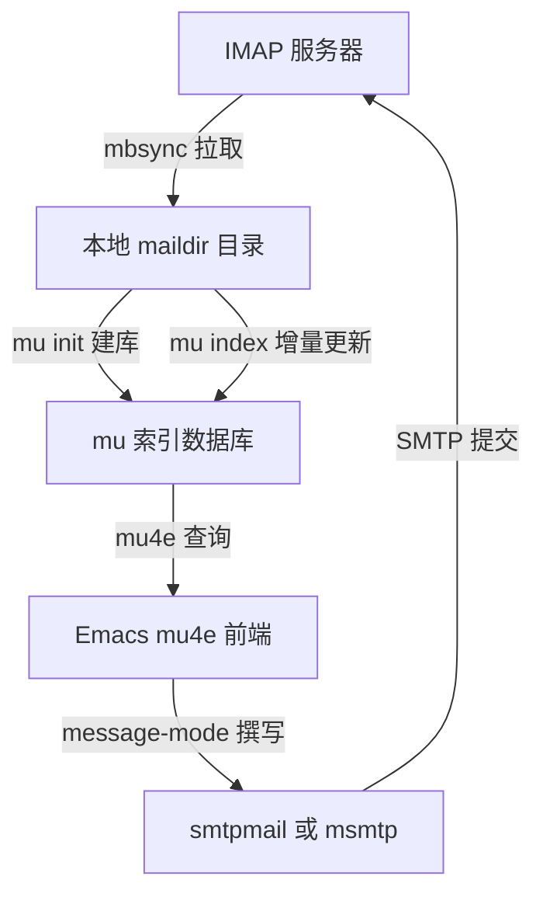

# 邮件、RSS 与文档阅读

> 把订阅源、邮件、PDF 与 EPUB 都收进同一个界面，代价是要先花几个小时把链路搭通；这一篇讲清每条链路的组成、成本与取舍。

---

## 一、先谈成本：Emacs 做阅读器适合谁

Emacs 里能读的东西很多：RSS 与 Atom 订阅、IMAP 邮件、本地 PDF、EPUB、Info 手册、网页。这些能力的共同点是：每一项都能做到可用，但几乎没有一项是"装完就能用"。RSS 需要选包与配过滤规则，邮件需要外部同步程序与索引程序，PDF 需要编译一个原生服务端程序，EPUB 相对最省事。

因此先把话说明白：

- 适合的人：已经在 Emacs 里写代码、记笔记、用 Org 管日程，希望把信息摄入（reading）和知识沉淀（note-taking）放进同一条流水线；愿意用一两个小时做一次性投入；喜欢键盘操作和可编程的界面。
- 不适合的人：只想要一个开箱可读的阅读器；不能忍受"某个包的某个版本升级后配置失效"；机器上没有编译环境也不打算装。

阅读体验的收益是具体的：

| 收益 | 具体表现 |
| --- | --- |
| 统一界面 | 订阅、邮件、PDF、EPUB 都是缓冲区（buffer），同一套键位、同一套搜索、同一套复制粘贴 |
| 纯键盘 | 上下条、切换、标记、归档都不需要鼠标 |
| 可编程 | "把所有未读里标题含 Rust 的条目导出成 Org 任务"这类需求可以写几行 Elisp 解决 |
| 可沉淀 | 读到的东西可以一键 org-capture 进笔记系统，成为可检索的文本 |
| 离线 | 数据库在本地，正文已抓取的部分断网可读 |

三个术语先约定清楚，本篇反复用到：缓冲区（buffer）指一块文本内容，与窗口无关；窗口（window）指框架内显示某个缓冲区的区域；框架（frame）指操作系统层面的一个 Emacs 窗口（在图形环境下就是一个应用窗口）。一个缓冲区可以同时显示在多个窗口里，关掉窗口不会关掉缓冲区。

任务与方案的对应关系，先给一张总表，后面逐项展开：

| 阅读任务 | 首选方案 | 备选方案 | 平台说明 |
| --- | --- | --- | --- |
| RSS 与 Atom 订阅 | elfeed | Gnus 的 nnrss、外部阅读器 | 三平台均可 |
| 本地邮件（IMAP） | mu4e（mu 索引） | notmuch、Gnus | 三平台均可，Windows 需要 MSYS2 编译 |
| 发送邮件 | message-mode 加 smtpmail | msmtp 命令行 | 三平台均可 |
| PDF 阅读 | pdf-tools | 内置 doc-view | pdf-tools 在 Windows 上需要编译，较麻烦 |
| EPUB 阅读 | nov.el | 转成文本再读 | 三平台均可 |
| 手册与 API 文档 | 内置 Info（`C-h i`） | devdocs.el | devdocs.el 需要本地 DevDocs 数据 |
| 网页正文 | EWW | elfeed-show 内置的 shr 渲染 | 三平台均可 |

---

## 二、RSS 与 Atom：elfeed

elfeed 是 Emacs 生态里使用最广的订阅阅读器，作者 Christopher Wellons（skeeto）。它把抓取、解析、存储、检索与显示分开：抓取由 `elfeed-update` 负责，数据存在本地数据库里，显示在 `elfeed-search-mode` 的列表缓冲区中，正文用 `elfeed-show-mode` 配合 shr（Emacs 内置的 HTML 渲染器）显示。

### 2.1 安装与最小可用

官方仓库：<https://github.com/skeeto/elfeed>，MELPA 页面：<https://melpa.org/#/elfeed>。

```elisp
;; 从 MELPA 安装；GNU ELPA 与 NonGNU ELPA 上没有 elfeed
;; M-x package-install RET elfeed RET

(require 'elfeed)

;; 最小配置：一个订阅源列表
(setq elfeed-feeds
      '("https://www.masteringemacs.org/feed"
        "https://nullprogram.com/feed/"))

;; M-x elfeed 打开列表缓冲区
```

`M-x elfeed` 会打开 `*elfeed-search*` 缓冲区。第一次启动时数据库为空，需要抓取一次：在列表缓冲区里按 `G`（`elfeed-search-fetch`），或者用 `M-x elfeed-update`。

注意一个常见误解：网上很多文章写"按 `g` 刷新"，在 elfeed 4.0 之后 `elfeed-search-mode-map` 里刷新是 `G`；`g` 没有被绑定到刷新上（它继承自 `special-mode-map`）。全部键位见 2.6 节。

### 2.2 elfeed-feeds 的两种写法

`elfeed-feeds` 是 `elfeed-db.el` 里定义的列表，元素可以是字符串，也可以是列表。列表形式的第一个元素是 URL，之后是附加元数据（plist，形如 `:title "标题"`）与自动标签（符号）。

```elisp
(setq elfeed-feeds
      '(;; 形式一：纯字符串，最省事
        "https://www.masteringemacs.org/feed"

        ;; 形式二：URL 加自动标签，该源所有条目都会带上这些标签
        ("https://blog.rust-lang.org/feed.xml" rust blog)

        ;; 形式三：URL 加元数据再加自动标签
        ;; :title 用来给标题很长的源起一个短名字
        ("https://this-week-in-rust.org/rss.xml"
         :title "This Week in Rust" rust weekly)

        ;; 形式四：URL 加元数据，不加自动标签
        ("https://sachachua.com/blog/feed/"
         :title "Sacha Chua")))
```

自动标签（autotags）在条目第一次被发现时应用。如果修改了某个源的自定义标签，希望它对已有条目立即生效，执行 `M-x elfeed-apply-autotags-now`，它会按当前 `elfeed-feeds` 重新给已有条目打标签。

上面例子里的几个源（Mastering Emacs、Rust 官方博客、This Week in Rust、Sacha Chua 的博客）都是长期稳定更新的技术博客。需要提醒的是：**订阅源会失效，曾经很有名的 Planet Emacsen 聚合站已经停止服务**，很多老教程里还在引用它；同样，Reddit 与 Hacker News 这类站点会拒绝缺少浏览器特征的抓取请求，在 elfeed 里可能直接报 HTTP 错误。判断一个源是否还活着，看它是否长期抓取失败即可，失效就删掉，不必纠结。

### 2.3 用 Org 文件管理订阅源：elfeed-org

手写 Elisp 列表的缺点是标签层级无法继承、新增源要改代码。elfeed-org 让订阅树写在一个 Org 文件里，父节点的标签会被子节点继承。

官方仓库：<https://github.com/remyhonig/elfeed-org>，MELPA 页面：<https://melpa.org/#/elfeed-org>。

```elisp
(use-package elfeed-org
  :ensure t
  :config
  ;; 把 elfeed-org 挂到 elfeed 上：执行 M-x elfeed 时读取下面的 Org 文件
  (elfeed-org)
  ;; 订阅树所在文件；不设置时默认是 ~/.emacs.d/elfeed.org
  (setq rmh-elfeed-org-files (list "~/.emacs.d/elfeed.org")))
```

对应的 Org 文件内容，注意树的根节点要带上 `:elfeed:` 标签（其值由 `rmh-elfeed-org-tree-id` 决定，默认就是 `elfeed`）：

```org
* Feeds                                                              :elfeed:
** 必读                                                          :mustread:
*** Emacs
**** https://www.masteringemacs.org/feed
**** https://sachachua.com/blog/feed/
**** entry-title: \(emacs\|org-mode\)
*** 技术
**** [[https://github.com/skeeto/elfeed][Elfeed 提交记录]]
**** https://lwn.net/headlines/rss                                         :hn:
** 少读                                                             :low:
**** https://github.blog/feed/                                       :ignore:
```

规则说明：

- 以 `http` 开头的行按订阅源处理；写成 Org 链接格式（`[[URL][描述]]`）时，描述会成为该源在 elfeed 里的标题。
- 以 `entry-title: ` 开头的行是标签规则，后面跟一个正则表达式；标题匹配的条目会被打上该节点及其祖先的标签，底层用 elfeed 自己的 `elfeed-make-tagger` 实现。
- 标签为 `ignore`（可通过 `rmh-elfeed-org-ignore-tag` 改）的源不会被抓取。
- 标题不以 `http` 或 `entry-title: ` 开头的行会被忽略，因此可以在源下面自由写备注。
- 抓取出错或源地址失效时，如果 `rmh-elfeed-org-auto-ignore-invalid-feeds` 设为 `t`，elfeed-org 会自动给它打上 ignore 标签。
- `M-x elfeed-org-export-opml` 与 `M-x elfeed-org-import-opml` 可以和别的阅读器互换订阅列表。

### 2.4 数据库位置与体积

`elfeed-db-directory` 决定数据库放哪。默认值是 `(locate-user-emacs-file "elfeed" "~/.elfeed")`：在 Emacs 30 上，如果你用的是 `~/.emacs.d/init.el`，数据库就是 `~/.emacs.d/elfeed/`；用 `~/.config/emacs/init.el` 则是 `~/.config/emacs/elfeed/`；只有当旧的 `~/.elfeed` 目录已经存在时才沿用旧路径。

数据库是一个目录，里面是按哈希分片的文本文件，把抓到的条目（含正文）都存下来，因此它可以长得很大：

| 订阅规模 | 抓取内容 | 数据库大致体积 |
| --- | --- | --- |
| 20 个源，日常使用 | 只保留标题与摘要 | 数 MB |
| 50 到 100 个源，长期不清理 | 含全文 | 几十 MB 到数百 MB |
| 追新闻类高频源 | 含全文与图片链接 | 可能上 GB |

控制体积的办法：

- 设置 `elfeed-search-max-entries` 限制列表里显示的最大条目数（默认 500），这只影响显示，不影响数据库。
- 在过滤器里用 `#N` 限制条目数，例如 `@1-month-ago +unread #100`。
- 定期清理旧条目：在列表里用过滤器筛出旧条目，选中后按 `-` 去掉标签，再执行 `M-x elfeed-db-compact` 回收空间。数据库文件不会自己收缩。
- 养成备份习惯：数据库损坏时最省事的恢复方式是删掉整个 `elfeed-db-directory` 重新抓取，历史标签会丢。

### 2.5 搜索过滤器语法

elfeed 的过滤器是一个空格分隔的表达式串，含义由表达式首字符决定。这是 elfeed 最值得花时间掌握的部分。

| 写法 | 含义 | 示例 |
| --- | --- | --- |
| `+tag` | 必须包含该标签 | `+unread` |
| `-tag` | 必须不含该标签 | `-junk` |
| `裸字符串` | 按正则匹配标题与正文 | `rust`、`emacs\|org` |
| `!regexp` | 必须不匹配该正则 | `!sponsored` |
| `@时长` | 只显示该时长以内的条目 | `@6-months-ago`、`@3-days-ago` |
| `@时长A--时长B` | 时间区间 | `@5-days-ago--1-day-ago` |
| `#N` | 最多显示 N 条 | `#100` |
| `=regexp` | 只显示 URL 匹配该正则的源 | `=masteringemacs` |
| `~regexp` | 排除 URL 匹配该正则的源 | `~github\.blog` |

时长写法支持 `-ago` 后缀与多种单位，例如 `@6-months-ago`、`@2-weeks-ago`、`@1-year-ago`；也可以用具体日期区间，例如 `@2026-01-01--2026-02-01`。多个表达式是"与"的关系。

在列表缓冲区里操作过滤器：

| 键位 | 命令 | 说明 |
| --- | --- | --- |
| `s` | `elfeed-search-live-filter` | 边输入边生效的实时过滤 |
| `S` | `elfeed-search-set-filter` | 设置过滤器（输入完按 RET 生效） |
| `c` | `elfeed-search-clear-filter` | 清空过滤器 |
| `=` | `elfeed-search-feed-filter` | 把光标处的源加入过滤器 |
| `~` | `elfeed-search-exclude-feed-filter` | 把光标处的源排除出过滤器 |
| `@` | `elfeed-search-date-filter` | 把光标处条目的日期加入过滤器 |
| `o` | `elfeed-search-cycle-order` | 切换排序方向 |
| `O` | `elfeed-search-reverse-order` | 反转排序 |

建议把默认过滤器设成一个"日常视图"，例如只关心三个月内、未读、非低价值标签的条目：

```elisp
(setq elfeed-search-filter "@3-months-ago +unread -low")
```

需要临时看全部时按 `c` 清空即可，按 `S` 可以把它改回来。

### 2.6 键位表

列表缓冲区（`elfeed-search-mode`）的键位来自 `elfeed-search-mode-map`：

| 键位 | 命令 | 说明 |
| --- | --- | --- |
| `RET` | `elfeed-search-show-entry` | 打开条目（下方弹出正文缓冲区） |
| `<elfeed-entry>` | `elfeed-search-show-entry` | 鼠标点击条目（文本属性上的按键映射） |
| `b` | `elfeed-search-browse-url` | 用外部浏览器打开 |
| `B` | `elfeed-search-browse-url-secondary` | 用第二浏览器打开 |
| `G` | `elfeed-search-fetch` | 抓取更新 |
| `n` / `p` | `next-line` / `previous-line` | 上下移动 |
| `N` / `P` | `elfeed-search-next-separator` / `elfeed-search-previous-separator` | 按日期分隔块跳转 |
| `m` / `M` | `elfeed-search-mark` / `elfeed-search-unmark` | 标记 / 取消标记 |
| `r` | `elfeed-search-untag-unread` | 标记为已读（去掉 unread 标签） |
| `u` | `elfeed-search-tag-unread` | 标记为未读（加回 unread 标签） |
| `+` / `-` | `elfeed-search-tag` / `elfeed-search-untag` | 为条目增删任意标签 |
| `y` / `w` | `elfeed-search-copy-link` | 复制条目链接 |
| `t` / `T` | `elfeed-search-set-entry-title` / `elfeed-search-set-feed-title` | 改显示标题 |
| `<` / `>` | `elfeed-search-first-entry` / `elfeed-search-last-entry` | 跳到首条 / 末条 |

正文缓冲区（`elfeed-show-mode`）的键位来自 `elfeed-show-mode-map`：

| 键位 | 命令 | 说明 |
| --- | --- | --- |
| `SPC` / `DEL` | `elfeed-show-scroll-up-or-next` / `elfeed-show-scroll-down-or-prev` | 翻页，到边界自动跳下一条 |
| `n` / `p` | `elfeed-show-next` / `elfeed-show-prev` | 直接跳下一条 / 上一条 |
| `b` | `elfeed-show-visit` | 在外部浏览器打开原文 |
| `f` | `elfeed-show-fetch-link` | 抓取光标处的链接并在缓冲区显示 |
| `R` | `elfeed-show-readable` | 用 readability 风格的清理重排正文 |
| `c` | `elfeed-show-copy-url-at-point` | 复制光标处链接 |
| `y` / `w` | `elfeed-show-copy-link` | 复制条目链接 |
| `m` | `elfeed-show-compose-mail` | 就当前条目写邮件 |
| `+` / `-` | `elfeed-show-tag` / `elfeed-show-untag` | 增删标签 |
| `u` | `elfeed-show-tag-unread` | 标记为未读 |
| `d` | `elfeed-show-save-enclosure` | 保存条目附带的媒体文件 |
| `TAB` | `elfeed-show-next-link` | 跳到下一个链接 |

### 2.7 标签、自动标注与打分

标签是 elfeed 的组织手段，过滤器、排序、归档全靠它。打标签有三条路径：

第一条是源级自动标签，即 2.2 节里写在 `elfeed-feeds` 中的符号。第二条是标题规则，用 elfeed 自带的 `elfeed-make-tagger` 构造。它的关键字参数都是正则表达式（或 `(not "正则")` 形式表示取反），匹配上的条目会被加上 `:add` 里的标签、去掉 `:remove` 里的标签，返回值是一个函数，放进 `elfeed-new-entry-hook` 即可：

```elisp
;; 只针对某个源的标题做匹配：标题里出现安全相关词就打 security 标签
(add-hook 'elfeed-new-entry-hook
          (elfeed-make-tagger :feed-url "example\\.com"
                              :entry-title "\\(安全\\|漏洞\\|CVE\\)"
                              :add '(security)))

;; 所有源通用：标题里出现版本发布字样就打 release 标签
(add-hook 'elfeed-new-entry-hook
          (elfeed-make-tagger :entry-title "\\(发布\\|版本\\|release\\)"
                              :add '(release)))

;; 取反用法：标题里不含"每周"并且来源是某个站点的条目，去掉 unread 标签
(add-hook 'elfeed-new-entry-hook
          (elfeed-make-tagger :feed-url "digest\\.example\\.com"
                              :entry-title '(not "每周")
                              :remove '(unread)))
```

`elfeed-new-entry-hook` 在每条新条目入库时运行，是自动打标签最合适的位置；`elfeed-tag-hook` 在给条目加标签时运行，`elfeed-untag-hook` 在去掉标签时运行，它们的签名都是 `(entry tag)`。注意 `elfeed-tag-hooks` 这个旧名字在 elfeed 4.0 起已废弃，别名指向 `elfeed-tag-hook`。

第三条是打分。如果源多到"按时间排序不够用"，可以用 elfeed-score 按规则给条目算分并优先显示高分条目，规则写在单独的 score 文件里，支持按标题正则加分、按源加分、按标签扣分。

官方仓库：<https://github.com/sp1ff/elfeed-score>，配置：

```elisp
(use-package elfeed-score
  :ensure t
  :config
  (elfeed-score-enable)
  ;; 把 = 键让给打分规则的编辑界面（默认 = 在列表缓冲区里是源过滤）
  (keymap-set elfeed-search-mode-map "=" #'elfeed-score-map))
```

### 2.8 在 Emacs 中阅读正文

按下 `RET` 后，elfeed 用 `elfeed-show-mode` 显示条目，正文来自源站提供的 HTML 或摘要，经过 shr 渲染成可读文本。这里有几个实用动作：

- `R`（`elfeed-show-readable`）会尝试提取正文主体、去掉导航与页脚，对全文输出的源效果明显。
- `f`（`elfeed-show-fetch-link`）在需要看某个具体链接时抓取页面，抓下来的 HTML 同样交给 shr 渲染。
- 想把条目永久留下来，最省事的办法是写一个 capture 函数把标题、链接与正文摘要送进 Org 文件，见 5.2 节。
- 正文里的链接可以直接用 `TAB` 跳过去，用 `RET` 打开；这一步实际调用的就是 Emacs 内置的浏览器 EWW 与 shr 机制，二者的关系见 [[emacs教程/6扩展应用/01_内置浏览器EWW|内置浏览器 EWW]]。

在 Org 里保存一条待读，可以用内置的 `org-capture`：

```elisp
;; 定义一个 capture 模板：把当前 elfeed 条目的标题和链接存成一条待读
(with-eval-after-load 'org
  (add-to-list 'org-capture-templates
               '("r" "待读条目" entry
                 (file+headline "~/org/reading.org" "待读")
                 "* TODO %? \n:PROPERTIES:\n:SOURCE: %a\n:END:\n")))
```

在 elfeed 列表里把光标放到条目上，`M-x org-capture` 选 `r`，`%a` 会被替换成条目链接（elfeed 注册了对应的链接类型）。这样"待读清单"就落在 Org 里，能被 `org-agenda` 统一调度。

### 2.9 更新策略与后台刷新

抓取是网络操作，一次抓几十个源会明显占用 Emacs。三种做法：

第一，手动抓：在列表缓冲区按 `G`，或者 `M-x elfeed-update`。默认这是同步操作，源很多时会短暂卡住。

第二，定时后台抓：`M-x elfeed-update-background` 在后台抓取，不运行更新钩子，也不会干扰已经打开的 elfeed 窗口，适合放进定时器。它自身会检查是否已有抓取任务在跑，不会重复启动：

```elisp
;; 每 30 分钟在后台抓一次；第一个参数是首次触发的延迟秒数
(run-with-timer 600 1800 #'elfeed-update-background)
```

第三，交给系统定时任务：用 cron 或 systemd timer 调 `emacsclient -e '(elfeed-update)'`，前提是你常开 daemon。

网络代理方面，`elfeed-use-curl` 的默认值取决于系统里有没有 curl 可执行文件：找得到就用 curl，找不到就打一条警告并退回 Emacs 内置的 url 库。用 curl 时它读 `http_proxy` 与 `https_proxy` 环境变量；改用内置 url 库时读 `url-proxy-services`：

```elisp
;; 让内置 url 抓取走本地代理；只在 elfeed-use-curl 为 nil 时生效
(setq url-proxy-services '(("http" . "127.0.0.1:7890")
                           ("https" . "127.0.0.1:7890")))
```

如果某些源必须走代理、另一些不能走，最简单可靠的方案是保持 `elfeed-use-curl` 为 `t`，通过外部代理软件的分流规则处理，而不是在 Emacs 里做分流。

### 2.10 大订阅量的注意点

- 抓取不是并行的，源越多一轮越久；把低频源用 `ignore` 标签剔除，或者做成两个 elfeed 实例（两个数据库目录）分别低频与高频刷新。
- 列表显示受 `elfeed-search-max-entries` 限制，`elfeed-search-title-max-width`（默认 70）调大可以让长标题不被截断，但会变慢。
- `elfeed-search-update-delay`（默认 1.0 秒）控制列表重绘延迟，条目上万时不要调小。
- 数据库体积与首次抓取时间正相关，换机器时直接拷 `elfeed-db-directory` 目录即可，不要拷正在运行中的半写入状态。
- 大量源同时报错时先怀疑网络与代理，而不是配置；`*elfeed-log*` 缓冲区里有每条源的结果。

### 2.11 一份完整的 elfeed 配置

下面这段可以直接抄进 `init.el`，逐段注释说明了每一部分的作用，其中 elfeed-org 与 elfeed-score 是可选增强。

```elisp
;;; ============ elfeed：RSS 与 Atom 阅读 ============

;; 数据库位置：显式指定，方便备份与迁移
(setq elfeed-db-directory
      (expand-file-name "elfeed" user-emacs-directory))

;; 默认视图：三个月内、未读、排除 low 标签
(setq elfeed-search-filter "@3-months-ago +unread -low")

;; 列表里标题的显示宽度；调大可读性更好，代价是轻微的性能开销
(setq elfeed-search-title-max-width 90)

;; 新条目的初始标签
(setq elfeed-initial-tags '(unread))

;; 抓取方式：系统里有 curl 就用 curl（这也是 elfeed 的默认判断逻辑）
(setq elfeed-use-curl (and (executable-find "curl") t))

;; 抓取时的 User-Agent，个别源会按它返回不同内容
(setq elfeed-user-agent "Mozilla/5.0 (compatible; Elfeed)")

;; 兜底的订阅源列表；使用 elfeed-org 时它会覆盖这里的内容
(setq elfeed-feeds
      '(("https://www.masteringemacs.org/feed" emacs)
        ("https://nullprogram.com/feed/" emacs blog)))

;; 正文缓冲区里图片的最大显示比例，避免大图撑满屏幕
(setq shr-max-image-proportion 0.6)

;; 打开 elfeed 的入口键
(keymap-set global-map "C-c w" #'elfeed)

;;; ---- 可选：用 Org 文件管理订阅源 ----
(use-package elfeed-org
  :ensure t
  :config
  (elfeed-org)
  (setq rmh-elfeed-org-files (list "~/.emacs.d/elfeed.org")))

;;; ---- 可选：标题规则自动打标签 ----
(defun my/elfeed-auto-tag ()
  "按标题关键词自动加标签的函数，挂到 `elfeed-new-entry-hook'。"
  (elfeed-make-tagger
   :entry-title-parser
   (lambda (title)
     (let (tags)
       (when (string-match-p "\\(C++\\|Rust\\|Emacs\\)" title)
         (push 'dev tags))
       (when (string-match-p "\\(发布\\|版本\\)" title)
         (push 'release tags))
       (nreverse tags)))))
(add-hook 'elfeed-new-entry-hook #'my/elfeed-auto-tag)

;;; ---- 可选：把当前条目送进 Org 待读清单 ----
(defun my/elfeed-capture ()
  "在 elfeed 列表里把光标处条目送进 Org capture。"
  (interactive)
  (unless (derived-mode-p 'elfeed-search-mode)
    (user-error "该命令只在 elfeed 列表缓冲区里可用"))
  (org-capture nil "r"))
(keymap-set elfeed-search-mode-map "C-c c" #'my/elfeed-capture)

;;; ---- 可选：打分排序 ----
(use-package elfeed-score
  :ensure t
  :config
  (elfeed-score-enable)
  (keymap-set elfeed-search-mode-map "=" #'elfeed-score-map))
```

---

## 三、邮件：三条路线与完整链路

### 3.1 四条路线对比

| 方案 | 类型 | 索引 | 适合谁 | 主要代价 |
| --- | --- | --- | --- | --- |
| Gnus | Emacs 内置的新闻与邮件阅读器 | 无独立索引，靠服务器与本地分组 | 想用一个内置方案读 IMAP 与新闻组的人 | 配置与概念体系庞大，学习曲线最陡 |
| mu4e | 外部 mu 索引器加 Emacs 前端 | mu 提供的全库索引，查询极快 | 邮件量大、要按条件快速检索的人 | 需要编译 mu，理解 maildir 结构 |
| notmuch | 外部 notmuch 索引器加 Emacs 前端 | 标签式的快速全文索引 | 习惯标签管理、不想维护 maildir 文件夹层次的人 | Emacs 端代码随 notmuch 源码分发，不走包管理器 |
| Rmail | Emacs 内置的本地邮箱阅读器 | 无 | 只读本地 mbox、需求极简的人 | 不支持 IMAP，功能最少 |

结论性建议：如果是 IMAP 邮箱且邮件量在数千封以上，选 mu4e；如果偏好"一切都是标签"的工作方式，选 notmuch；如果只想在 Emacs 里收发几封邮件而不想装外部程序，可以先试 Gnus；Rmail 只在完全离线的 mbox 场景里还有意义。

### 3.2 mu4e 的完整链路

mu4e 不是"M-x package-install 就能用"的包，它是 mu 项目的一部分，链路有四段：

1. 本地目录结构：邮件以 maildir 格式存在本地磁盘上，每个邮件是一个文件，文件夹就是目录。
2. 同步：用 mbsync（isync 项目）或 offlineimap 之类的工具，把 IMAP 服务器上的邮件拉到本地 maildir。
3. 索引：用 mu 把本地 maildir 建成索引数据库，支持快速查询。
4. 前端：mu4e 在 Emacs 里读索引、显示邮件、写邮件并交给 smtpmail 发送。



安装与初始化：

```bash
# Debian 与 Ubuntu：mu4e 随 mu 一起安装
$ sudo apt install mu4e isync

# Arch Linux
$ sudo pacman -S mu isync

# macOS（Homebrew）
$ brew install mu isync

# 建立索引数据库：--maildir 指定本地邮件根目录，--personal-address 指定自己的地址
$ mu init --maildir=~/Maildir --personal-address=me@example.com

# 首次全量建立索引；之后每次同步完只要 mu index 增量更新
$ mu index
```

注意 mu 1.12 起，根 maildir 与个人地址由 `mu init` 写进数据库，mu4e 不再需要设置 `mu4e-maildir` 与 `mu4e-user-mail-address-list`；在 1.10 及更早的版本里这两个变量还需要手工设置。写配置时要按自己装的版本调整。

mbsync 的最小配置（`~/.mbsyncrc`），用 `PassCmd` 从密码管理器或 GPG 文件里取密码，不要把密码写死：

```text
IMAPAccount example
Host imap.example.com
User me@example.com
PassCmd "gpg -q --for-your-eyes-only --no-tty -d ~/.mailpass.gpg"
TLSType IMAPS

IMAPStore example-remote
Account example

MaildirStore example-local
Path ~/Maildir/
Inbox ~/Maildir/INBOX
SubFolders Verbatim

Channel example
Far :example-remote:
Near :example-local:
Patterns *
Create Both
Expunge Both
SyncState *
```

同步命令是 `mbsync -a`（`-a` 表示所有 Channel）。

mu4e 的最小配置，下面是 mu 1.12 及以后的写法：

```elisp
;;; ============ mu4e：邮件前端 ============

(require 'mu4e)

;; 用 mbsync 同步邮件；mu4e 按 U 键时会执行这条命令
(setq mu4e-get-mail-command "mbsync -a")

;; 每 5 分钟自动同步一次；设为 nil 表示不自动同步
(setq mu4e-update-interval 300)

;; 四个默认文件夹，路径是相对 maildir 根目录的
(setq mu4e-sent-folder   "/Sent"
      mu4e-drafts-folder "/Drafts"
      mu4e-trash-folder  "/Trash"
      mu4e-refile-folder "/Archive")

;; 从这些地址发出的邮件被视为"自己发的"，回信时会更合理地选择收件人
(setq mu4e-personal-addresses '("me@example.com"))

;; 补全界面：默认是 ido；现代配置通常换成 vertico 的补全函数
;; consult 用户可以不设置这一项，让 mu4e 使用 completing-read 的默认行为
(setq mu4e-completing-read-function #'completing-read)

;; 主界面上按数字键快速进入常用文件夹
(setq mu4e-maildir-shortcuts
      '((:maildir "/INBOX"   :key ?i)
        (:maildir "/Sent"    :key ?s)
        (:maildir "/Archive" :key ?a)
        (:maildir "/Trash"   :key ?t)))

;; 保存的搜索：把常用查询做成书签
(setq mu4e-bookmarks
      '((:name "未读邮件"
         :query "flag:unread AND NOT flag:trashed"
         :key ?u)
        (:name "今天"
         :query "date:today..now"
         :key ?t)
        (:name "最近一周"
         :query "date:7d..now"
         :key ?w)
        (:name "带附件"
         :query "flag:attachment AND NOT flag:trashed"
         :key ?a)))

;; 打开 mu4e 的入口
(keymap-set global-map "C-c m" #'mu4e)
```

mu 的查询语法和 mu4e 的过滤器都基于它，常用字段：

| 字段 | 含义 | 示例 |
| --- | --- | --- |
| `from:` `to:` `subject:` | 按发件人、收件人、主题匹配 | `from:alice@example.com` |
| `maildir:` | 按文件夹匹配 | `maildir:/INBOX` |
| `flag:` | 按状态匹配 | `flag:unread`、`flag:flagged`、`flag:attachment` |
| `tag:` | 按标签（Xapian 关键词）匹配 | `tag:work` |
| `date:` | 按日期或时间范围匹配 | `date:2026-01-01..2026-02-01`、`date:7d..now` |
| `size:` | 按体积匹配 | `size:1M..5M` |
| `m:` `t:` | 简写形式 | `m:/INBOX` |

列表缓冲区（headers）的常用键位来自 `mu4e-headers-mode-map`：

| 键位 | 命令 | 说明 |
| --- | --- | --- |
| `RET` | `mu4e-headers-view-message` | 打开邮件 |
| `n` / `p` | `mu4e-headers-next` / `mu4e-headers-prev` | 上下移动 |
| `[` / `]` | `mu4e-headers-prev-unread` / `mu4e-headers-next-unread` | 跳到未读 |
| `{` / `}` | `mu4e-headers-prev-thread` / `mu4e-headers-next-thread` | 按会话跳转 |
| `g` | `mu4e-search-rerun` | 重新执行上一次查询 |
| `d` | `mu4e-headers-mark-for-trash` | 标记为删除 |
| `D` | `mu4e-headers-mark-for-delete` | 标记为彻底删除 |
| `r` | `mu4e-headers-mark-for-refile` | 标记为归档 |
| `m` | `mu4e-headers-mark-for-move` | 标记为移动 |
| `!` / `?` | `mu4e-headers-mark-for-read` / `mu4e-headers-mark-for-unread` | 标记已读 / 未读 |
| `+` / `-` | `mu4e-headers-mark-for-flag` / `mu4e-headers-mark-for-unflag` | 加星 / 取消星标 |
| `t` / `T` | `mu4e-headers-mark-subthread` / `mu4e-headers-mark-thread` | 标记整个会话 |
| `u` | `mu4e-headers-mark-for-unmark` | 取消标记 |
| `x` | `mu4e-mark-execute-all` | 执行所有标记 |
| `y` | `mu4e-select-other-view` | 在列表与正文之间切换 |
| `H` | `mu4e-display-manual` | 打开 mu4e 手册 |

发送与草稿相关的键位在撰写缓冲区里：`C-c C-c` 发送，`C-c C-k` 取消，`C-c C-d` 存草稿。附件用 `C-c C-a`（`mml-attach-file`）。

HTML 邮件的显示：mu4e 默认把 HTML 部分转成文本显示，转换用 `mu4e-html2text-command`（通常调用 `html2text` 程序）；如果装了 `w3m` 或 `lynx`，也可以指定它们。想直接看原始 HTML，可以在正文缓冲区里用 `mu4e-view-raw-message` 之类的命令切换到原始邮件视图。附件处理用 `mu4e-view-save-attachment`（在正文缓冲区里按 `e` 然后选操作），批量保存用 `mu4e-view-save-attachments`。

### 3.3 notmuch 的定位

notmuch 与 mu4e 的差异在于数据模型：notmuch 以标签为中心，所有邮件在一个索引里，邮件可以同时属于任意多组标签，不依赖文件夹层次。它的搜索语法形如 `tag:unread`、`from:alice`、`subject:patch`，Emacs 端在 `notmuch-hello` 里输入查询就能出结果，速度非常快。

代价是 Emacs 端代码随 notmuch 源码一起分发，不在 MELPA 上，安装方式是装系统包（Debian 与 Ubuntu 的 `notmuch`、Arch 的 `notmuch`、macOS 的 `brew install notmuch`），然后在 `init.el` 里：

```elisp
;; notmuch 的 Emacs 端随系统包安装，路径由发行版决定
;; Debian 与 Ubuntu 装 notmuch 包之后通常无需手动加 load-path
(require 'notmuch)

(setq notmuch-search-oldest-first nil)  ; 新邮件排在前面
(setq notmuch-saved-searches
      '((:name "未读" :query "tag:unread" :key "u")
        (:name "收件箱" :query "tag:inbox" :key "i")
        (:name "今天" :query "tag:inbox and date:today..now" :key "t")))

(keymap-set global-map "C-c n" #'notmuch)
```

notmuch 的键位分成两层。公共键位（`notmuch-common-keymap`）：`s` 搜索、`m` 写新邮件、`g` 刷新当前缓冲区、`j` 跳到保存的搜索、`t` 按标签搜索、`z` 树状视图、`q` 退出。搜索缓冲区（`notmuch-search-mode-map`）：`RET` 打开会话、`n` / `p` 上下移动、`a` 归档（去掉 inbox 标签）、`+` / `-` 增删标签、`t` 按标签过滤、`l` 在当前结果里继续过滤、`*` 给整个结果集打标签、`r` / `R` 回复。

标签归档是 notmuch 的核心工作流：`tag:inbox` 相当于"收件箱"，`a` 键去掉这个标签就等于归档；想建"待办"就自己加一个 `todo` 标签，然后把它做成一个保存的搜索。

### 3.4 发送邮件：message-mode 加 smtpmail

三条路线的前端都复用同一套撰写与发送机制：撰写用 `message-mode`，发送用 `smtpmail`（Emacs 内置）。

```elisp
;;; ============ 发送邮件 ============

(require 'smtpmail)

;; 发送方式：smtpmail-send-it 走 SMTP；也可以用 sendmail-send-it 交给本地 MTA
(setq message-send-mail-function #'smtpmail-send-it)

;; SMTP 服务器与端口
(setq smtpmail-smtp-server "smtp.example.com"
      smtpmail-smtp-service 587)

;; 连接加密方式：587 端口通常用 starttls；465 端口用 ssl；25 端口是 nil
(setq smtpmail-stream-type 'starttls)

;; SMTP 登录名（多数服务要求与发件地址一致）
(setq smtpmail-smtp-user "me@example.com")

;; 调试认证失败时把它设为 t，SMTP 会话过程会记录在 *trace of SMTP session* 里
(setq smtpmail-debug-info nil)

;; 用户级默认发信函数，影响不经过 message-mode 的场景
(setq send-mail-function #'smtpmail-send-it)
```

密码不放配置里，放认证文件里。Emacs 的 `auth-sources` 默认值是 `("~/.authinfo" "~/.authinfo.gpg" "~/.netrc")`：带 `.gpg` 后缀的文件由 EPA 与 EPG（Emacs 内置的 GPG 接口）自动解密，这是推荐做法。

`~/.authinfo`（加密前的明文内容）格式如下，每行一条：

```text
machine smtp.example.com login me@example.com password 这里是应用专用密码
machine imap.example.com login me@example.com port 993 password 这里是应用专用密码
```

加密步骤：

```bash
# 限制文件权限
$ chmod 600 ~/.authinfo

# 用 GPG 对称加密，生成 ~/.authinfo.gpg；随后删掉明文
$ gpg -c --cipher-algo AES256 ~/.authinfo
$ shred -u ~/.authinfo
```

`gpg -c` 会提示输入口令。之后 Emacs 启动时会向 GPG 代理（gpg-agent）要口令，或者由你手动输入一次。第一次设置好之后，建议把 gpg-agent 配置成缓存口令一段时间，避免每次发信都输入。

如果要显式指定认证来源，可以改 `auth-sources`：

```elisp
;; 只用加密文件，且给出多个备选路径
(setq auth-sources '("~/.authinfo.gpg"
                     "~/.config/emacs/authinfo.gpg"))
```

用 msmtp 作为替代：msmtp 是一个独立的 SMTP 客户端程序，配置写在 `~/.msmtprc` 里，Emacs 通过 `message-send-mail-function` 调它。适合需要多个发信账户、或者想在命令行也复用同一套配置的人。

```elisp
;; 用 msmtp 发信；msmtp 的账户配置在 ~/.msmtprc
(setq message-send-mail-function
      (lambda ()
        (message-send-mail-with-sendmail)))
(setq sendmail-program "msmtp")
(setq message-sendmail-extra-arguments '("--read-envelope-from"))
```

Gmail 的注意点：Gmail 已不支持"允许不够安全的应用"直接使用账户密码做 SMTP 认证（除非账户开启了两步验证并生成应用专用密码）。正确做法是在 Google 账户的安全设置里生成应用专用密码，把这个 16 位密码放进 `~/.authinfo`。无论如何不要把账户主密码或应用专用密码写进 `init.el`，尤其是当 `init.el` 在 Git 仓库里时——这是最常见的密钥泄露方式。

### 3.5 日历与邮件邀请

Org 的日程系统见 [[emacs教程/5开发环境集成/07_OrgMode效率系统|Org Mode 效率系统]]，这里只说"别人发来的会议邀请"这一类现实问题。

- Emacs 内置的 `diary` 与 `icalendar`（`diary-lib.el` 与 `icalendar.el`）能解析 iCalendar 文件，但把邀请自动转成 Org 条目的体验并不好：需要手工导出 `ics`、手工调用 `icalendar-import-file`，且对重复事件的时区处理比较弱。
- mu4e 自带 `mu4e-icalendar`，可以在查看带邀请的邮件时把它收进日历，具体命令见 mu4e 手册的 iCalendar 一节。
- 现实建议：会议邀请继续在网页版或客户端里接受，把接受后的日程手工或半自动地录进 Org；不要指望纯 Emacs 流程处理企业邮件的邀请与回执，那条链路的兼容性问题远多于收益。

```elisp
;; 把 ics 文件导入 diary 文件（内置功能，需要手工触发）
;; M-x icalendar-import-file RET ~/Downloads/invite.ics RET ~/org/diary RET
(setq diary-file "~/org/diary")
```

---

## 四、文档阅读：PDF、EPUB 与手册

### 4.1 PDF：doc-view 与 pdf-tools

Emacs 内置的 `doc-view-mode` 用外部程序把整页 PDF 渲染成图片再显示；pdf-tools 用一个常驻的原生服务端程序（epdfinfo）按需渲染，功能与交互都强得多。

| 维度 | doc-view（内置） | pdf-tools |
| --- | --- | --- |
| 安装 | 无需安装，但需要外部渲染程序 | 需要从 MELPA 安装，并编译原生服务端 |
| 渲染方式 | 调用 gs 或 mutool 把整页转成图片 | 由 epdfinfo 按需渲染到内存 |
| 搜索 | 文本搜索支持有限，部分 PDF 不能搜 | 支持增量搜索、Occur、链接跳转 |
| 链接与目录 | 无 | 支持大纲、内部链接、外部链接 |
| 批注 | 无 | 支持高亮、批注（写入 PDF 文件） |
| 大文件表现 | 首次打开慢，逐页转图 | 打开快，翻页快 |
| 依赖 | ghostscript 或 mupdf-tools | 编译工具链、poppler 开发库、libpng、zlib |
| Windows | 可用 | 编译麻烦，需要 MSYS2 环境 |
| macOS | 可用 | 需要 Xcode 命令行工具与 autoconf 等 |

结论：如果只是偶尔看一页 PDF，内置 doc-view 足够；如果要在 PDF 里搜索、跳转、做批注、跟读长文档，pdf-tools 值得花时间装。

官方仓库：<https://github.com/vedang/pdf-tools>，MELPA 页面：<https://melpa.org/#/pdf-tools>。

安装 pdf-tools：

```bash
# 先装编译依赖
# Debian 与 Ubuntu
$ sudo apt install build-essential autoconf automake libpoppler-glib-dev libpng-dev libz-dev

# Arch Linux
$ sudo pacman -S base-devel poppler-glib libpng zlib

# macOS（Homebrew）
$ brew install autoconf automake poppler libpng
```

```elisp
;; 1) M-x package-install RET pdf-tools RET
;; 2) 安装原生服务端；这一步会编译 epdfinfo，需要上面的依赖
;;    M-x pdf-tools-install RET

;; 配置：按需加载，避免拖慢启动
(pdf-loader-install)

;; 打开 PDF 时的默认缩放：适合屏幕宽度
(setq pdf-view-resize-factor 1.1)

;; 与 Org 结合：pdf-tools 注册了 pdf: 链接类型，
;; 可以在 Org 里写 [[pdf:/path/to/file.pdf#page=12][某文档第 12 页]] 并直接跳转
```

pdf-view-mode 的常用键位（来自 pdf-tools 的 README）：

| 键位 | 作用 |
| --- | --- |
| `SPC` / `DEL` | 按整页向上 / 向下翻 |
| `C-n` / `C-p` | 按行向下 / 向上滚 |
| `n` / `p` | 下一页 / 上一页 |
| `<` / `>` | 首页 / 末页 |
| `C-s` / `C-r` | 向前 / 向后增量搜索 |
| `M-s o` | Occur，列出所有匹配行 |
| `o` | 显示大纲 |
| `F` | 选择链接并跳转 |
| `f` | 在链接里增量搜索 |
| `l` / `r` | 历史后退 / 前进 |
| `M-g g` | 跳到指定页 |
| `+` / `-` | 放大 / 缩小 |
| `H` / `W` / `P` | 适应高度 / 适应宽度 / 适应整页 |
| `0` | 重置缩放 |
| `R` | 旋转页面 |
| `m` / `'` | 记录位置 / 跳回记录的位置 |

### 4.2 EPUB：nov.el

nov.el 是 Emacs 里的 EPUB 阅读器，会把 EPUB 解析成 Org 缓冲区来显示，因此目录、链接、图片、脚注都能用 Org 的方式操作，还能顺便把标注写进 Org。

官方地址：<https://depp.brause.cc/nov.el/>（MELPA 上包名为 `nov`，MELPA 页面：<https://melpa.org/#/nov>）。

```elisp
;; M-x package-install RET nov RET
(require 'nov)

;; 打开 EPUB：直接 C-x C-f 打开 .epub 文件即可
;; 用 M-x nov 也可以打开最近读过的书

;; 阅读进度与书签，nov 会存在下面的目录里
(setq nov-save-place-file
      (expand-file-name "nov-places" user-emacs-directory))

;; 在 Org 里保存标注的模板（nov-annotate 会用到）
(setq nov-annotations-file
      (expand-file-name "~/org/books.org"))

;; 目录与全文搜索的键位（nov-mode 里）
;;   n / p      下一段 / 上一段
;;   TAB        跳到下一个链接
;;   RET        跟随链接
;;   M-x nov-next-document / nov-prev-document  下一章 / 上一章
;;   M-x nov-goto-toc                            显示目录
;;   M-x nov-search                              在书里搜索
;;   M-x nov-annotate-mode                       开启标注高亮
```

nov.el 的依赖只有一个：Emacs 自带的 `shr` 与 `url`，不需要外部程序，三平台表现一致。这是本篇所有阅读方案里性价比最高的一个。

### 4.3 CHM、DjVu 与其他格式

- CHM：Emacs 没有原生支持。现实做法是在终端用 `extract_chmLib`（chmlib 提供的工具）把 CHM 解包成 HTML 目录树，然后在 Emacs 里用 EWW 打开 `index.html`，或者用外部阅读器。
- DjVu：Emacs 没有原生支持。用 `ddjvu`（djvulibre 提供）转成 PDF 再交给 pdf-tools，或者用外部阅读器。
- MOBI 与 AZW3：没有可靠的 Emacs 方案，用 Calibre 转成 EPUB 后交给 nov.el。
- 漫画与图片集：内置的 `image-dired` 与 `image-mode` 可用，把目录里的图片按顺序浏览。
- 结论：非 PDF 与 EPUB 的电子书格式，转格式比在 Emacs 里硬啃更划算。

### 4.4 代码与 API 文档：Info 与 devdocs

内置的 Info 系统（`C-h i`）是 Emacs 生态最重要的文档入口：

| 键位 | 作用 |
| --- | --- |
| `C-h i` | 打开 Info 目录 |
| `m` | 按菜单项跳转，支持补全 |
| `g` | 按节点名跳转 |
| `i` | 在索引里查找（这是查 Elisp 函数文档最快的方式） |
| `l` | 返回上一个访问的节点 |
| `u` | 回到上一层节点 |
| `s` | 在手册里正则搜索 |
| `q` | 关闭 Info 缓冲区 |

第三方库的手册也可以用 Info 读：装完包后执行 `M-x info-display-manual` 就能看到已注册的手册列表。org-roam、denote、mu4e 等包都自带 Info 手册。

devdocs.el 把 DevDocs 的离线文档集接进 Emacs，适合查第三方库的 API。

官方仓库：<https://github.com/astoff/devdocs.el>。它需要先下载 DevDocs 数据：

```bash
# 拉取需要的文档集（示例：Python 与 Rust）
$ devdocs install python~3.12 rust
$ devdocs install --list     # 查看可用文档集
```

```elisp
;; M-x package-install RET devdocs RET
(require 'devdocs)
;; 之后用 M-x devdocs-lookup 或 M-x devdocs-search 查询
(keymap-set global-map "C-h D" #'devdocs-lookup)
```

---

## 五、阅读体验与工作流

### 5.1 显示与专注

长文本阅读的舒适度主要来自行宽与字体，而不是主题配色。

```elisp
;; 用可变的成比例字体显示正文，代码块仍然用等宽字体
(add-hook 'elfeed-show-mode-hook #'variable-pitch-mode)
(add-hook 'nov-mode-hook #'variable-pitch-mode)

;; 自动换行，避免横向滚动
(add-hook 'elfeed-show-mode-hook #'visual-line-mode)
(add-hook 'nov-mode-hook #'visual-line-mode)

;; 显示 80 列的填充指示线，帮助控制行宽
(add-hook 'elfeed-show-mode-hook #'display-fill-column-indicator-mode)

;; 临时放大与缩小字号
;; C-x C-+ 放大，C-x C-- 缩小，C-x C-0 复位
(setq text-scale-mode-step 1.1)

;; 让最近一次窗口布局变化可以撤销，误关窗口时 C-c <left> 恢复
(winner-mode 1)
```

如果屏幕很宽，用 `C-x 3` 把框架竖直切成两个窗口、只用一个窗口显示正文，比让正文横跨整屏更易读。Emacs 30 内置了 `which-key`，前缀键按下去会有提示，不必额外装包。

### 5.2 把阅读沉淀到笔记

读到的内容如果不落到可检索的文本里，价值会随时间归零。推荐的做法是三步：

1. 收藏：在 elfeed 里用 `C-c c`（前面配置里的自定义键）把条目送进 `reading.org` 的待读清单。
2. 消化：在 Org 里对待读条目写几句自己的话，把来源链接留在属性里。
3. 归档：把有价值的段落移进 org-roam 或 denote 管理的笔记，建立与其他笔记的链接。


### 5.3 与 EWW 的分工

elfeed 的正文渲染与 EWW 共用 shr，但定位不同：elfeed 面向"已订阅、需要批量管理"的内容，EWW 面向"临时打开一个页面"。需要交互（登录、填表单、JavaScript）的页面都应交给外部浏览器；把 elfeed 设为日常信息入口、把 EWW 设为查文档入口、把系统浏览器留给交互式网页，是长期用下来最省心的分工。内置浏览器的细节见 [[emacs教程/6扩展应用/01_内置浏览器EWW|内置浏览器 EWW]]。

---

## 六、完整配置：阅读四件套

下面这段包含 elfeed、nov.el、pdf-tools 与最小可用邮件配置，逐段注明可选与必装。

```elisp
;;; ============ 一、elfeed：RSS 与 Atom（必装） ============
(setq elfeed-db-directory (expand-file-name "elfeed" user-emacs-directory))
(setq elfeed-search-filter "@3-months-ago +unread -low")
(setq elfeed-search-title-max-width 90)
(setq elfeed-use-curl (and (executable-find "curl") t))
(setq shr-max-image-proportion 0.6)
(setq elfeed-feeds
      '(("https://www.masteringemacs.org/feed" emacs)
        ("https://nullprogram.com/feed/" emacs blog)))
(keymap-set global-map "C-c w" #'elfeed)

;;; ---- 可选：Org 文件管理订阅源 ----
(use-package elfeed-org
  :ensure t
  :config
  (elfeed-org)
  (setq rmh-elfeed-org-files (list "~/.emacs.d/elfeed.org")))

;;; ============ 二、EPUB：nov.el（必装，零外部依赖） ============
(use-package nov
  :ensure t
  :mode ("\\.epub\\'" . nov-mode)
  :custom
  (nov-save-place-file (expand-file-name "nov-places" user-emacs-directory))
  :hook ((nov-mode . visual-line-mode)
         (nov-mode . variable-pitch-mode)))

;;; ============ 三、PDF：pdf-tools（可选，需编译） ============
;; 装之前确认已具备编译依赖；Windows 上建议改用内置 doc-view
(use-package pdf-tools
  :ensure t
  :if (not (eq system-type 'windows-nt))   ; Windows 上跳过，避免编译失败
  :mode ("\\.pdf\\'" . pdf-view-mode)
  :config
  ;; 按需加载原生服务端，未安装时不会报错
  (pdf-loader-install)
  :custom
  (pdf-view-resize-factor 1.1))

;; 没有 pdf-tools 时，PDF 自动落到内置的 doc-view
;; doc-view 需要系统里有 gs（ghostscript）或 mutool
(setq doc-view-resolution 120)   ; 默认 100，调高更清晰也更慢

;;; ============ 四、邮件：最小可用（可选，需外部程序） ============
;; 前提：装好 mu 与 isync（或 msmtp），并执行过 mu init 与 mu index
(use-package mu4e
  :if (executable-find "mu")     ; 没有 mu 就不加载，避免启动报错
  :load-path "/usr/share/emacs/site-lisp/mu4e"  ; 发行版路径，按实际情况调整
  :commands mu4e
  :config
  (setq mu4e-get-mail-command "mbsync -a"
        mu4e-update-interval 300
        mu4e-sent-folder "/Sent"
        mu4e-drafts-folder "/Drafts"
        mu4e-trash-folder "/Trash"
        mu4e-refile-folder "/Archive"
        mu4e-completing-read-function #'completing-read
        mu4e-maildir-shortcuts
        '((:maildir "/INBOX" :key ?i)
          (:maildir "/Archive" :key ?a)))
  (setq mu4e-bookmarks
        '((:name "未读" :query "flag:unread AND NOT flag:trashed" :key ?u)
          (:name "最近一周" :query "date:7d..now" :key ?w)))
  (keymap-set global-map "C-c m" #'mu4e))

;;; ---- 发送邮件：smtpmail 加加密认证文件 ----
(require 'smtpmail)
(setq message-send-mail-function #'smtpmail-send-it
      smtpmail-smtp-server "smtp.example.com"
      smtpmail-smtp-service 587
      smtpmail-stream-type 'starttls
      smtpmail-smtp-user "me@example.com")
;; 密码放在 ~/.authinfo.gpg 里；auth-sources 的默认值已经包含它
;; 需要显式指定时：
;; (setq auth-sources '("~/.authinfo.gpg"))

;;; ---- 阅读体验 ----
(add-hook 'elfeed-show-mode-hook #'visual-line-mode)
(add-hook 'elfeed-show-mode-hook #'variable-pitch-mode)
(winner-mode 1)
```

---

## 七、常见问题

### 7.1 elfeed 数据库损坏

症状：启动 elfeed 报错，或者列表为空但抓取又提示成功。处理顺序：先执行 `M-x elfeed-db-compact`，它能修掉一部分索引不一致；如果仍报错，关掉 Emacs，把 `elfeed-db-directory` 整个目录改名备份，重新启动 elfeed 并抓取一次。数据库是可再生数据，不值得花时间修；真正要保住的是 `elfeed.org` 里的订阅树和标签规则。

### 7.2 mu4e 索引失败

按出现频率排查：

- `mu index` 报找不到 maildir：检查 `mu init --maildir=` 是否指向了 mbsync 的本地根目录（两者必须一致）。
- 索引成功但 mu4e 里看不到邮件：在 mu4e 里按 `g` 重新执行查询，或者在终端跑 `mu find --fields="l" flag:unread` 验证 mu 本身能否查到。
- 同步到一半被中断导致索引与磁盘不一致：停掉 mu4e，跑一次 `mu index` 全量重建。
- Windows 上 mu 无法编译：优先用 WSL 里运行 Emacs，或者改用 notmuch 的 Windows 构建。

### 7.3 SMTP 认证失败

按顺序检查五件事：`smtpmail-stream-type` 与端口是否匹配（587 配 `starttls`，465 配 `ssl`）；`smtpmail-smtp-user` 是否与实际登录名一致；`~/.authinfo.gpg` 里的 `machine` 是否与 `smtpmail-smtp-server` 完全一致（包括子域）；服务商是否要求应用专用密码；把 `smtpmail-debug-info` 设为 `t` 后查看 `*trace of SMTP session*` 缓冲区里的原始会话，错误码会直接说明是认证失败还是 TLS 协商失败。

### 7.4 PDF 打开与渲染慢

`doc-view` 慢是因为它把整页转成图片并缓存，第一次打开几百页的文档会明显卡顿：调低 `doc-view-resolution`，或者干脆用 pdf-tools。pdf-tools 慢通常是因为缩放比例极端（例如 400%）导致每页都要重新渲染大图：用 `0` 重置缩放，用 `W` 适应宽度而不是一直放大。

### 7.5 中文 PDF 显示为乱码或方框

要区分两种情况。第一种是文本提取层面：pdf-tools 的搜索、复制依赖 PDF 里嵌入的字体与文本映射，扫描件（整页是图片）没有文本层，搜索不到是正常的，只能靠 OCR。第二种是渲染层面：pdftoppm 或 ghostscript 缺少中文字体时会显示方框，装系统级中文字体即可：

```bash
# Debian 与 Ubuntu
$ sudo apt install fonts-noto-cjk poppler-data

# Arch Linux
$ sudo pacman -S noto-fonts-cjk poppler-data

# macOS：系统自带中文字体，通常无需处理
```

EPUB 中文乱码则多半是文件本身的编码声明与实际编码不符，可以用 `M-x nov-mode` 打开后检查首章是否正常，必要时先用 Calibre 转换一次。

---

## 小结

- elfeed 是 RSS 与 Atom 的默认答案：`elfeed-feeds` 两种写法、elfeed-org 用 Org 树管理订阅、过滤器语法（`+tag`、`-tag`、`@时长`、`=`、`#N`）是必须掌握的三个点。
- 邮件要认清链路：mbsync 同步到本地 maildir、mu 建索引、mu4e 做前端、smtpmail 负责发送；密码一律放 `~/.authinfo.gpg`。
- 文档阅读按成本排序：nov.el 最省事，pdf-tools 功能最强但要编译，doc-view 是零配置兜底，Info 与 devdocs 覆盖代码文档。

---

## 相关章节

- [[emacs教程/6扩展应用/01_内置浏览器EWW|内置浏览器 EWW]]
- [[emacs教程/5开发环境集成/07_OrgMode效率系统|Org Mode 效率系统]]
- [[emacs教程/6扩展应用/05_文件管理与笔记系统|文件管理与笔记系统]]
- [[emacs教程/5开发环境集成/05_Git与Magit|Git 与 Magit]]
- [[emacs教程/1入门/04_包管理与use-package|包管理与 use-package]]
