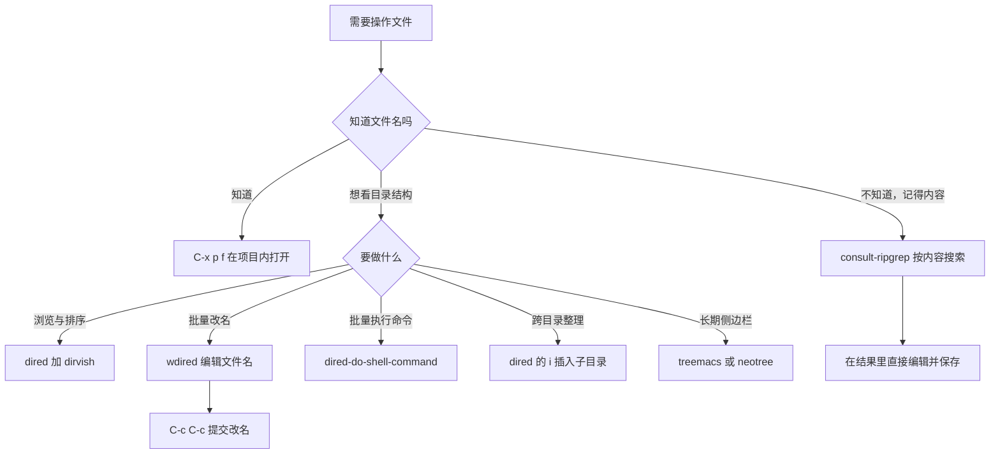
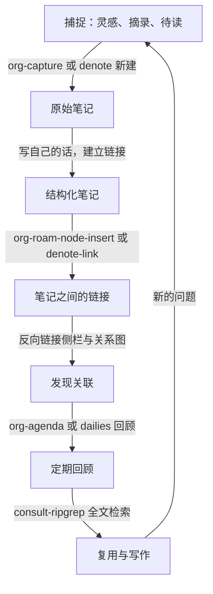

# 文件管理与笔记系统

> Dired 是 Emacs 里被低估最严重的部分：它本身就是一套完整的文件管理器；本仓库的文档体系又恰好是纯 Markdown 加双链接，因此在 Emacs 里编辑它并不需要额外的笔记软件。

---

## 一、Dired：内置文件管理器

Dired 全名 Directory Editor，随 Emacs 一起提供，不需要装任何包。它的心智模型是：把一个目录的内容列成一个普通缓冲区，每一行是一个文件，然后在这张列表上用普通的光标移动、标记、搜索加批量命令操作文件。理解了这一点，就能理解 Dired 为什么键位这么多、为什么它比图形文件管理器更适合批量操作。

术语提醒：Dired 的"缓冲区"是那个目录列表本身，不是文件内容。在 Dired 里按 `RET` 或 `f` 是"用新缓冲区打开这一行的文件"，而只移动光标不会打开任何东西。这一点与图形文件管理器的"单击选中、双击打开"不同。

### 1.1 打开与基本约定

| 键位或命令 | 作用 |
| --- | --- |
| `C-x d` | `dired`，提示输入目录名 |
| `C-x C-f` 输入一个目录名 | 直接打开该目录的 Dired |
| `C-x C-j` | `dired-jump`，跳到当前文件所在目录并把光标放在该文件上 |
| `C-x 4 C-j` | `dired-jump-other-window`，在另一个窗口打开 |
| `M-x dired-jump` | 在 Dired 缓冲区里跳到上一层 |

Dired 的标记（mark）与标记删除（flag）是两套机制：标记用 `m`，被标记的行行首显示 `*`，所有大写字母开头的命令和 `x` 之外的大多数批量命令作用在"已标记的文件"上；如果没有任何标记，则作用在光标所在的那一行。删除是两步的：`d` 只是打上删除标记（行首显示 `D`），必须再按 `x`（`dired-do-flagged-delete`）才真正删除，这是内置的安全网。

隐藏文件（点开头的文件）默认显示。要隐藏它们用 `(`（`dired-hide-details-mode`）隐藏细节列，或者用 dired-x 的 `C-x M-o`（`dired-omit-mode`）省略匹配 `dired-omit-files` 的行。

### 1.2 键位表（按功能分区）

移动与浏览：

| 键位 | 命令 | 说明 |
| --- | --- | --- |
| `n` / `p` / `SPC` / `S-SPC` | `dired-next-line` / `dired-previous-line` | 上下移动 |
| `<` / `>` | `dired-prev-dirline` / `dired-next-dirline` | 在子目录行之间跳 |
| `^` | `dired-up-directory` | 回到上一层目录 |
| `M-{` / `M-}` | `dired-prev-marked-file` / `dired-next-marked-file` | 在已标记文件之间跳 |
| `j` | `dired-goto-file` | 按文件名跳转 |
| `M-G` | `dired-goto-subdir` | 跳到已插入的子目录 |
| `g` | `revert-buffer` | 重新读取目录（刷新） |
| `l` | `dired-do-redisplay` | 重绘指定行 |

标记与取消：

| 键位 | 命令 | 说明 |
| --- | --- | --- |
| `m` | `dired-mark` | 标记当前行 |
| `u` | `dired-unmark` | 取消当前行标记 |
| `DEL` | `dired-unmark-backward` | 向上取消标记 |
| `t` | `dired-toggle-marks` | 反转所有标记 |
| `U` | `dired-unmark-all-marks` | 取消全部标记 |
| `M-DEL` | `dired-unmark-all-files` | 按标记字符批量取消 |
| `* /` | `dired-mark-directories` | 标记所有目录 |
| `* *` | `dired-mark-executables` | 标记所有可执行文件 |
| `* @` | `dired-mark-symlinks` | 标记所有符号链接 |
| `* %` 或 `% m` | `dired-mark-files-regexp` | 按正则标记 |
| `% g` | `dired-mark-files-containing-regexp` | 标记内容匹配正则的文件 |
| `* s` | `dired-mark-subdir-files` | 标记子目录里的文件 |
| `* N` | `dired-number-of-marked-files` | 显示已标记文件数 |

打开与查看：

| 键位 | 命令 | 说明 |
| --- | --- | --- |
| `f` / `e` / `RET` | `dired-find-file` | 在当前窗口打开 |
| `o` | `dired-find-file-other-window` | 在另一窗口打开 |
| `C-o` | `dired-display-file` | 在另一窗口显示但不切过去 |
| `a` | `dired-find-alternate-file` | 打开文件并关掉当前 Dired 缓冲区 |
| `v` | `dired-view-file` | 以只读方式查看 |
| `E` | `dired-do-open` | 用系统默认程序打开（在 Emacs 30 中可用） |
| `W` | `browse-url-of-dired-file` | 用浏览器打开 |
| `y` | `dired-show-file-type` | 查看文件类型（调用 file 命令） |
| `=` | `dired-diff` | 与当前文件比较 |

批量操作（复制、改名、删除、链接、权限）：

| 键位 | 命令 | 说明 |
| --- | --- | --- |
| `C` | `dired-do-copy` | 复制 |
| `R` | `dired-do-rename` | 重命名或移动 |
| `D` | `dired-do-delete` | 直接删除（不再确认一次 `x`） |
| `d` 然后 `x` | `dired-flag-file-deletion` 加 `dired-do-flagged-delete` | 先标记再删除 |
| `H` | `dired-do-hardlink` | 建硬链接 |
| `S` | `dired-do-symlink` | 建符号链接 |
| `Y` | `dired-do-relsymlink` | 建相对路径的符号链接 |
| `M` | `dired-do-chmod` | 改权限 |
| `O` | `dired-do-chown` | 改所有者 |
| `G` | `dired-do-chgrp` | 改所属组 |
| `T` | `dired-do-touch` | 改时间戳 |
| `+` | `dired-create-directory` | 新建目录 |
| `Z` | `dired-do-compress` | 压缩或解压选中的文件 |
| `c` | `dired-do-compress-to` | 压缩成指定归档文件 |

压缩与解压的行为值得说明：`Z` 作用在 `.tar.gz`、`.zip` 等归档文件上是解压，作用在普通文件上是压缩成同名归档；压缩包不会自动展开成一个目录，需要解压后再整理。

搜索与替换：

| 键位 | 命令 | 说明 |
| --- | --- | --- |
| `A` | `dired-do-find-regexp` | 在标记的文件里搜索正则（结果进 `*xref*` 缓冲区） |
| `Q` | `dired-do-find-regexp-and-replace` | 在标记的文件里搜索并替换 |
| `M-s a C-s` | `dired-do-isearch` | 在标记的文件里跨文件增量搜索 |
| `M-s f C-s` | `dired-isearch-filenames` | 只在文件名里搜索 |
| `M-s f C-M-s` | `dired-isearch-filenames-regexp` | 只在文件名里正则搜索 |

执行外部命令：

| 键位 | 命令 | 说明 |
| --- | --- | --- |
| `!` | `dired-do-shell-command` | 对标记的文件执行 shell 命令 |
| `X` | `dired-do-shell-command` | 同上（旧键位，仍保留） |
| `&` | `dired-do-async-shell-command` | 异步执行，自动追加 `&` |
| `I` | `dired-do-info` | 在 Info 里打开 |
| `N` | `dired-do-man` | 查看 man 手册 |
| `P` | `dired-do-print` | 打印 |

排序、过滤与显示：

| 键位 | 命令 | 说明 |
| --- | --- | --- |
| `s` | `dired-sort-toggle-or-edit` | 切换按名字与按时间排序，或编辑 `ls` 开关 |
| `(` | `dired-hide-details-mode` | 隐藏权限、大小、时间等细节列 |
| `M-$` | `dired-hide-all` | 折叠所有子目录 |
| `$` | `dired-hide-subdir` | 折叠或展开当前子目录 |
| `i` | `dired-maybe-insert-subdir` | 在当前缓冲区里插入子目录内容 |
| `k` | `dired-do-kill-lines` | 从显示里移除某些行（不动磁盘文件） |
| `w` | `dired-copy-filename-as-kill` | 复制文件名到 kill-ring（加前缀参数给完整路径） |

`i` 与 `k` 的组合是 Dired 独有的用法：`i` 把子目录内容平铺插入到当前列表里，之后可以在一个缓冲区里跨目录标记文件、批量操作，`k` 只是把行隐藏起来，不影响磁盘。

### 1.3 dired-do-shell-command 的替换字符

`!` 与 `X` 都调用 `dired-do-shell-command`，它识别的替换字符只有 `*` 和 `?` 两个（不是 `%`），规则由 docstring 明确规定：

| 命令里出现的字符 | 行为 |
| --- | --- |
| `*`（两侧有空白） | 整条命令只执行一次，所有标记文件的文件名替换到这个位置 |
| `?`（两侧有空白，或写成 `` `?` ``） | 每个文件执行一次命令，文件名替换到 `?` 的位置 |
| 两者都没有 | 每个文件执行一次，文件名追加到命令末尾（用空格分隔） |
| `*` 与 `?` 出现在非空白包围的位置 | 不特殊处理，交给 shell，但会先要求确认 |
| 命令以 `&` 结尾 | 异步执行，输出进异步 shell 缓冲区 |
| 命令以 `;` 或 `;&` 结尾 | 逐个文件在后台顺序执行 |

举例说明（选中若干 `.txt` 文件后）：

- `wc -l *`：一次调用 `wc -l` 并传入所有文件名，输出一份总表。
- `wc -l ?`：每个文件调用一次 `wc -l`。
- `wc -l`：等同于 `wc -l ?` 的效果，文件名会追加到末尾。
- `tar czf out.tar.gz *""`：想用 shell 的通配符 `*` 而不是 Dired 的替换时，写成 `*""`，等价于 shell 里的 `*`。

### 1.4 `%` 前缀：正则批量操作

`%` 在 Dired 里是一个前缀键，它对应的是一整组"按正则作用"的命令：

| 键位 | 命令 | 说明 |
| --- | --- | --- |
| `% m` | `dired-mark-files-regexp` | 文件名匹配正则的标记 |
| `% g` | `dired-mark-files-containing-regexp` | 文件内容匹配正则的标记 |
| `% d` | `dired-flag-files-regexp` | 文件名匹配正则的打上删除标记 |
| `% u` | `dired-upcase` | 把标记文件的文件名改成大写 |
| `% l` | `dired-downcase` | 改成小写 |
| `% R` | `dired-do-rename-regexp` | 按正则重命名 |
| `% C` | `dired-do-copy-regexp` | 按正则复制 |
| `% S` / `% Y` | `dired-do-symlink-regexp` / `dired-do-relsymlink-regexp` | 按正则建符号链接 |
| `% H` | `dired-do-hardlink-regexp` | 按正则建硬链接 |

`dired-do-rename-regexp` 的新名字里可以使用替换引用 `\&`（整个匹配）与 `\<n>`（第 n 个捕获组），这与 `query-replace-regexp` 的写法一致。例如把 `IMG_1234.JPG` 改成 `2026-01-01.jpg` 这类需求，用 `% R` 加 `IMG_\([0-9]+\)\.JPG` 与 `\1.jpg` 就能一次完成。

### 1.5 wdired：把文件名当文本编辑

wdired（Writable Dired）允许直接编辑 Dired 缓冲区里的文件名与权限位，编辑完成后一次性提交。这是批量改名最直观的方式，因为可以用上 Emacs 全部的文本编辑能力：正则替换、列编辑、宏、多个光标。

进入与提交：

| 键位 | 命令 | 说明 |
| --- | --- | --- |
| `C-x C-q` | `dired-toggle-read-only` | 在 Dired 里进入 wdired（该键在 Dired 中被重映射） |
| `C-c C-c` 或 `C-x C-s` | `wdired-finish-edit` | 提交修改，真正改磁盘 |
| `C-c C-k` | `wdired-abort-changes` | 放弃修改 |
| `C-x C-q` | `wdired-exit` | 退出 wdired |

在 wdired 模式下，`M-x replace-regexp`、`M-x query-replace-regexp` 都可以直接用在文件名上；由于每行还包括权限与时间列，正则要写得足够具体，只匹配文件名部分。`upcase-word`、`capitalize-word`、`downcase-word` 这三个命令在 wdired 里被重映射到 `wdired-upcase-word` 等版本，只作用于文件名而不会破坏权限列。

一个完整的批量改名流程（把 `IMG_0001.JPG` 这类文件改成 `photo-0001.jpg`）：

```text
1. C-x d ~/Pictures RET            打开目录
2. C-x C-q                         进入 wdired
3. M-x replace-regexp RET
   IMG_\([0-9]+\)\.JPG RET          匹配串（注意只匹配文件名部分）
   photo-\1.jpg RET                替换串
4. 检查改动；不放心可以先只改一行看效果
5. C-c C-c                         提交；此时才会真正重命名文件
```

如果改错了，在提交前按 `C-c C-k` 全部放弃；提交之后 Dired 会重新读取目录，但磁盘上的改名无法用 `undo` 撤销，重要操作前先确认目录已提交进版本控制或已有备份。

权限位也能在 wdired 里直接编辑，但需要先把 `wdired-allow-to-change-permissions` 设为 `t`（默认是 `nil`，此时权限列不可改）：光标移到行首的权限字符上修改，例如把 `-rw-r--r--` 改成 `-rwxr-xr-x`，提交时同样生效。

### 1.6 dired-x：内置的增强模块

dired-x 也是 Emacs 自带的，`(require 'dired-x)` 或 `M-x load-library RET dired-x` 之后生效：

```elisp
(require 'dired-x)

;; 打开 Dired 时自动省略匹配 dired-omit-files 的行
(add-hook 'dired-mode-hook #'dired-omit-mode)

;; 默认省略点文件与备份文件
(setq dired-omit-files
      (concat "\\`[.]?#\\|\\`[.][.]?\\'"
              "\\|^#.*#$\\|\\.pyc\\'\\|\\.elc\\'\\|\\.o\\'"))

;; 关心目录体积时打开，否则大目录会变慢
(setq dired-omit-size-limit nil)
```

dired-x 提供的主要能力：省略文件（`C-x M-o`）、`dired-jump`（`C-x C-j`，跳回当前文件在 Dired 里的位置）、按文件类型猜测打开方式（`dired-guess-shell-alist-user`，让 `!` 与 `&` 在文件上自动补出合适的命令）。

```elisp
;; 让 Dired 里对 PDF 按 & 时默认用 zathura 打开
(setq dired-guess-shell-alist-user
      '(("\\.pdf\\'" "zathura")
        ("\\.mp4\\'" "mpv")
        ("\\.epub\\'" "emacsclient -c --eval '(nov \"%s\")'")))
```

### 1.7 第三方 Dired 增强

| 包 | 作用 | 仓库 |
| --- | --- | --- |
| dired-hacks | 一组独立小组件，包含 dired-subtree、dired-narrow、dired-filter、dired-collapse 等 | <https://github.com/Fuco1/dired-hacks> |
| diredfl | 给 Dired 加更明显的字体着色 | <https://github.com/purcell/diredfl> |
| dired-hide-dotfiles | 一键切换点文件的显示 | <https://github.com/mattiasb/dired-hide-dotfiles> |

dired-subtree 把子目录内容内联展开成树状缩进显示，比内置的 `i` 更接近现代文件树的观感：

```elisp
(use-package dired-subtree
  :ensure t
  :after dired
  :bind (:map dired-mode-map
              ("TAB" . dired-subtree-toggle)
              ("<tab>" . dired-subtree-toggle)
              ("<backtab>" . dired-subtree-cycle))
  :custom
  (dired-subtree-use-backgrounds nil))

;; 简单的外观增强，可选
(use-package diredfl
  :ensure t
  :hook (dired-mode . diredfl-mode))
```

### 1.8 在 Dired 里用 Elisp 批量处理文件

除了 shell 命令，还可以用 Elisp 直接处理已标记的文件，好处是跨平台（不依赖 shell 工具）且能复用 Emacs 的读写能力。核心函数是 `dired-get-marked-files`，它返回已标记文件的绝对路径列表；没有标记时返回光标处文件。

```elisp
(defun my/dired-count-lines ()
  "统计已标记文本文件的行数与字符数，结果打印到回显区。"
  (interactive)
  (let ((files (dired-get-marked-files)))
    (dolist (file files)
      (when (file-regular-p file)
        (with-temp-buffer
          (insert-file-contents file)
          (message "%s：%d 行，%d 字符"
                   (file-name-nondirectory file)
                   (count-lines (point-min) (point-max))
                   (buffer-size)))))))

(defun my/dired-rename-to-lowercase ()
  "把已标记文件的文件名改成全小写（扩展名也一起改）。"
  (interactive)
  (let ((files (dired-get-marked-files)))
    (dolist (file files)
      (let* ((dir (file-name-directory file))
             (name (file-name-nondirectory file))
             (new (downcase name)))
        (unless (string= name new)
          (rename-file file (expand-file-name new dir) nil)))))
  (revert-buffer))

;; 绑定到 Dired 的 C-c l
(with-eval-after-load 'dired
  (keymap-set dired-mode-map "C-c l" #'my/dired-count-lines)
  (keymap-set dired-mode-map "C-c L" #'my/dired-rename-to-lowercase))
```

`dired-do-find-regexp`（`A`）与 `dired-do-find-regexp-and-replace`（`Q`）值得单独强调：前者在标记的文件里搜索并把结果整理进 xref 缓冲区，可以逐个跳转；后者相当于对多个文件做一次可控的全局替换，是"在这批文件里把这个标识符改掉"的标准做法。

### 1.9 用 TRAMP 管理远程目录

Dired 可以直接打开远程目录，语法是 TRAMP 的路径前缀：

| 路径写法 | 含义 |
| --- | --- |
| `/ssh:user@host:/var/log/` | 通过 SSH 打开远程目录 |
| `/ssh:user@host#2222:/srv/` | 指定端口 |
| `/sudo:root@localhost:/etc/` | 用 sudo 打开本地需要 root 的目录 |
| `/scp:user@host:/tmp/` | 通过 scp 传输 |
| `/docker:容器名:/app/` | 进入容器文件系统（需要容器里有可用工具） |

在 Dired 里的所有批量操作在远程目录上同样有效，但代价是每次操作都可能触发一次网络往返，因此：

```elisp
;; 打开远程 Dired 时自动关闭细节列，减少要传输的元数据
(add-hook 'dired-mode-hook
          (lambda ()
            (when (file-remote-p default-directory)
              (dired-hide-details-mode 1))))

;; 让 TRAMP 复用 SSH 连接，避免每个操作都重新握手
(setq tramp-verbose 1)
```

更完整的远程方案（连接复用、控制台与远程编译）见 [[emacs教程/7进阶/03_TRAMP远程开发|TRAMP 远程开发]]。

---

## 二、文件树方案：对比与选择

### 2.1 五种方案的定位

| 方案 | 类型 | 定位 | 依赖 | 适合的场景 |
| --- | --- | --- | --- | --- |
| treemacs | 独立包 | 完整的项目侧边栏，支持多工作区、Git 状态、图标 | 无硬依赖 | 想长期用固定侧边栏管理多个项目 |
| neotree | 独立包 | 轻量文件树，模仿 Vim 的 NERDTree | 无硬依赖 | 从 Vim 迁过来、要熟悉操作方式 |
| dirvish | 独立包 | 增强 Dired 本体，带预览、头部行、快速跳转 | 建议装 fd 以获得 `dirvish-fd` | 主要工作流是 Dired，想要更好的观感 |
| dired-sidebar | 独立包 | 把 Dired 塞进一个侧边窗口 | 无 | 只想偶尔开一个 Dired 侧栏 |
| speedbar | Emacs 内置 | 极简的文件与标签侧栏 | 无 | 老配置、不想装包 |

一个直接的建议：如果已经在用 Dired 并且键位已经形成肌肉记忆，装 dirvish 的收益最大，因为它不改变 Dired 的操作方式；如果需要"多个项目之间快速切换"的工作区概念，选 treemacs；neotree 与 dired-sidebar 定位接近，选一个即可；speedbar 只在完全不想增加依赖时使用。

### 2.2 treemacs 最小配置

官方仓库：<https://github.com/Alexander-Miller/treemacs>。treemacs 有一个明确的设计约定：它不为全局入口函数提供默认键位，需要用户自己指定。

```elisp
(use-package treemacs
  :ensure t
  :bind (("C-c t" . treemacs)                 ; 打开或关闭侧边栏
         ("C-c T" . treemacs-select-window)   ; 把光标移到侧边栏
         :map treemacs-mode-map
         ("C-c C-p a" . treemacs-add-project-to-workspace))
  :custom
  (treemacs-width 32)
  (treemacs-indentation 2)
  (treemacs-sorting 'alphabetic-case-insensitive-asc)
  (treemacs-ignored-file-predicates
   '(treemacs--std-ignore-file-predicate))
  :config
  ;; 光标跟随当前文件高亮
  (treemacs-follow-mode 1)
  ;; 目录变化时自动刷新
  (treemacs-filewatch-mode 1)
  ;; 在文件名旁边显示 Git 状态，仓库很大时可以关掉
  (treemacs-git-mode 'simple))
```

treemacs 的常用键位分几个前缀：项目操作是 `C-c C-p`（`a` 添加项目、`d` 移除项目、`r` 改名、`c c` 折叠项目），工作区操作是 `C-c C-w`（`a` 新建、`s` 切换、`n` 下一个），打开节点是 `o` 前缀（`oo` 或 `RET` 不切分窗口打开、`ov` 垂直切分、`oh` 水平切分、`ox` 用外部程序打开）。在侧边栏里按 `?` 会弹出完整的键位提示。

### 2.3 dirvish 最小配置

官方仓库：<https://github.com/alexluigit/dirvish>。dirvish 的理念是"增强 Dired 而不是取代它"，因此它没有独立的模式，而是通过 `dirvish-override-dired-mode` 让 Dired 相关命令走 dirvish 的实现。

```elisp
(use-package dirvish
  :ensure t
  :init
  ;; 让 dired 与 find-file 走 dirvish 的实现
  (dirvish-override-dired-mode)
  :custom
  ;; 头部行显示的信息；按需增减
  (dirvish-attributes
   '(vc-state subtree-state nerd-icons collapse git-msg file-time file-size))
  ;; 布局：(父目录行数 侧栏比例 预览比例)
  (dirvish-default-layout '(1 0.11 0.55))
  (dirvish-hide-details nil)
  :bind
  (("C-c d" . dirvish)                  ; 在当前目录打开
   ("C-c f" . dirvish-fd)               ; 用 fd 全盘查找后打开目录
   :map dirvish-mode-map
   ("a" . dirvish-quick-access)         ; 快速跳转到常用目录
   ("f" . dirvish-file-info-menu)       ; 文件信息菜单
   ("y" . dirvish-yank-menu)            ; 复制与移动文件
   ("TAB" . dirvish-subtree-toggle)     ; 展开子目录
   ("M-e" . dirvish-emerge-mode)        ; 按属性分组
   ("M-s" . dirvish-history-jump)))     ; 历史目录跳转
```

`nerd-icons` 属性需要安装 nerd-icons 包与对应的字体；不想折腾字体的话，把 `nerd-icons` 从 `dirvish-attributes` 里删掉即可。此外 `dirvish-fd` 需要系统里有 fd（<https://github.com/sharkdp/fd>），没有 fd 时会自动退回内置实现。

### 2.4 轻量替代：neotree 与 dired-sidebar

```elisp
;; neotree：模仿 NERDTree 的轻量文件树
(use-package neotree
  :ensure t
  :bind (("C-c n" . neotree-toggle)
         ("C-c N" . neotree-project-dir))
  :custom
  (neo-theme 'ascii)
  (neo-smart-open t))
;; 侧栏里的常用命令：neotree-dir 选目录、neotree-find 定位到当前文件、
;; neotree-change-root 换根目录、neotree-hidden-file-toggle 切换点文件、
;; neotree-refresh 刷新、neotree-rename-node 与 neotree-delete-node 改名与删除

;; dired-sidebar：把 Dired 放进侧栏，完全复用 Dired 键位
(use-package dired-sidebar
  :ensure t
  :bind (("C-c s" . dired-sidebar-toggle-sidebar)
         ("C-c S" . dired-sidebar-toggle-with-current-directory))
  :custom
  (dired-sidebar-theme 'ascii)
  (dired-sidebar-use-term-integration nil))
;; 其他命令：dired-sidebar-show-sidebar 显示、dired-sidebar-hide-sidebar 隐藏、
;; dired-sidebar-jump-to-sidebar 跳到侧栏
```

### 2.5 文件树到底需不需要

这是一个值得诚实回答的问题。文件树的实际价值有三个：一是让你知道项目里有什么；二是让你不用记路径就能打开文件；三是提供项目级的"根"概念。

但在 Emacs 里，这三件事都有更快的替代：

- 用 `C-x C-f` 加补全（vertico 与 consult 环境下的补全候选是模糊匹配的路径）打开文件，比在文件树里一层层展开更快。
- 用 `C-x p f`（`project-find-file`）在项目内部按文件名打开，完全不需要浏览目录结构。
- 用 `C-c s`（consult-ripgrep）按内容找文件，通常比记住文件名更符合直觉。

因此建议是：把文件树当作"偶尔要看全局结构"的工具，而不是每次打开文件都要经过的入口。默认不开侧边栏、需要时按一下快捷键打开，是长期使用最舒服的形态。



---

## 三、快速打开文件

### 3.1 recentf 与 savehist

`recentf-mode` 记录最近打开的文件，是"刚才那个文件在哪"的标准答案；`savehist-mode` 把各种 minibuffer 历史持久化，让补全候选在重启后仍然可用。

```elisp
;; 最近文件列表
(recentf-mode 1)
(setq recentf-max-saved-items 300)     ; 最多保存 300 条
(setq recentf-auto-cleanup 'mode)      ; 打开 recentf 时清理已不存在的文件
(setq recentf-save-file (expand-file-name "recentf" user-emacs-directory))

;; 把不值得记录的内容排除掉
(add-to-list 'recentf-exclude
             (expand-file-name "elfeed" user-emacs-directory))
(add-to-list 'recentf-exclude "\\.git/")
(add-to-list 'recentf-exclude "^/tmp/")

;; 持久化 minibuffer 历史与 kill-ring
(savehist-mode 1)
(setq savehist-file (expand-file-name "history" user-emacs-directory))
(setq savehist-additional-variables '(search-ring regexp-search-ring kill-ring))
(setq savehist-autosave-interval 300)  ; 每 5 分钟自动保存一次

;; 记录光标位置，下次打开同一文件回到原处
(save-place-mode 1)
```

### 3.2 consult 提供的几个入口

consult 把"从一堆候选里选一个"的交互标准化了，配合 vertico 使用时体验最好（两者都在 [[emacs教程/1入门/04_包管理与use-package|包管理与 use-package]] 中介绍过安装方式）：

| 命令 | 作用 |
| --- | --- |
| `consult-recent-file` | 从最近文件里选（相当于 `recentf-open-files` 的预览版） |
| `consult-buffer` | 统一的缓冲区切换入口，混合最近文件、书签与缓冲区 |
| `consult-find` | 按路径查找文件（调用 find） |
| `consult-project-buffer` | 只在当前项目内选缓冲区 |
| `consult-line` | 在当前缓冲区按行搜索，边输入边跳转 |
| `consult-imenu` | 跳到当前文件的函数与变量 |

```elisp
(use-package consult
  :ensure t
  :bind (("C-x b"   . consult-buffer)
         ("C-x C-r" . consult-recent-file)
         ("C-c f"   . consult-find)
         ("M-g l"   . consult-line)
         ("M-g i"   . consult-imenu)))
```

### 3.3 project.el：内置的项目管理

`project.el` 从 Emacs 28 起是内置的，前缀键是 `C-x p`。它在"项目根目录"的概念上工作：根目录由版本控制目录（`.git` 等）或标记文件识别。本仓库根目录有 `.git`，因此用 Emacs 打开仓库里任意文件后，`C-x p` 的一系列命令就以仓库根为范围。

| 键位 | 命令 | 说明 |
| --- | --- | --- |
| `C-x p f` | `project-find-file` | 在项目内按文件名打开（不需要输入完整路径） |
| `C-x p p` | `project-switch-project` | 切换到另一个项目 |
| `C-x p b` | `project-switch-to-buffer` | 在项目内的缓冲区之间切换 |
| `C-x p d` | `project-find-dir` | 打开项目内的目录（Dired） |
| `C-x p D` | `project-dired` | 在项目根打开 Dired |
| `C-x p g` | `project-find-regexp` | 在项目内搜索正则 |
| `C-x p r` | `project-query-replace-regexp` | 在项目内交互式替换 |
| `C-x p k` | `project-kill-buffers` | 关掉属于该项目但不该关的缓冲区（按规则过滤） |
| `C-x p v` | `project-vc-dir` | 打开版本控制状态视图 |
| `C-x p c` | `project-compile` | 在项目根执行编译 |
| `C-x p !` | `project-shell-command` | 在项目根执行 shell 命令 |
| `C-x p C-b` | `project-list-buffers` | 列出项目缓冲区 |

```elisp
;; 记住某个目录下的所有项目，之后 C-x p p 会有候选
(project-remember-projects-under "~/code/" t)

;; 关掉缓冲区时保留这些（默认保留能访问文件的缓冲区）
(setq project-kill-buffer-conditions
      '(buffer-file-name
        (major-mode . dired-mode)))
```

projectile 与 project.el 的取舍：projectile 出现更早、功能更多（项目类型自动识别、缓存、与 counsel 集成），代价是额外依赖与略慢的首次索引；project.el 是内置的，与 consult、xref、Magit 的配合已经足够。新配置建议先用 project.el，确实缺功能再引入 projectile。如果两者都用，可以关掉 projectile 的全局模式只用它的命令，避免键位冲突。

### 3.4 书签

`bookmark.el` 也是内置的，适合记住"散落在磁盘各处、又不属于任何项目"的文件与目录：

| 键位 | 命令 | 说明 |
| --- | --- | --- |
| `C-x r m` | `bookmark-set` | 为当前位置建书签 |
| `C-x r b` | `bookmark-jump` | 跳到书签 |
| `C-x r l` | `bookmark-bmenu-list` | 打开书签列表（可编辑、可批量删除） |
| `M-x bookmark-save` | `bookmark-save` | 立即保存书签文件 |

在 Org 里也可以直接把书签或文件写成链接：`[[file:~/org/notes.org::*标题][说明]]` 这种形式支持跳到文件中某个标题，比书签更细粒度。

---

## 四、全文搜索

### 4.1 ripgrep 与 consult 的组合

搜索的正确顺序是"先内容、后文件名"：记不住文件名时，用内容搜索最快。Emacs 里这条路径是 consult 加 ripgrep。

安装 ripgrep（rg）：

```bash
# Debian 与 Ubuntu
$ sudo apt install ripgrep

# Arch Linux
$ sudo pacman -S ripgrep

# macOS（Homebrew）
$ brew install ripgrep

# Windows（winget 与 scoop 二选一）
> winget install BurntSushi.ripgrep.MSVC
> scoop install ripgrep
```

```elisp
(use-package consult
  :ensure t
  :bind (("C-c s" . consult-ripgrep)      ; 在整个项目或目录里按内容搜索
         ("C-c S" . consult-grep)         ; 用 grep 搜索（不依赖 rg）
         ("C-c g" . consult-git-grep)     ; 只在 Git 跟踪的文件里搜索
         ("M-g l" . consult-line)))
```

`consult-ripgrep` 的工作方式是：在 minibuffer 里输入正则，候选列表实时显示匹配行与文件名，按 `RET` 跳到该行。几个实用细节：

- 输入里用空格分词时，consult 会把它们当作多个必须同时匹配的模式（按顺序匹配），因此 `defun consult-ripgrep` 可以直接搜到定义处。
- 前缀参数 `C-u` 可以改变搜索范围：`C-u C-c s` 会额外提示一个搜索目录，方便在非项目目录里搜。
- `consult-grep` 与 `consult-ripgrep` 的区别只是底层命令不同，前者用 grep 后者用 rg；rg 更快，并且默认尊重 `.gitignore`。

### 4.2 在大仓库里的性能

ripgrep 本身很快，但要让它在本仓库这种"几万个小 Markdown 文件"的场景里也快，需要几条设置：

```elisp
(setq consult-ripgrep-args
      "rg --null --line-buffered --color=never --max-columns=1000 \
--path-separator / --smart-case --no-heading --with-filename \
--line-number --hidden --glob !.git/ --glob !node_modules/ \
--glob !_build/ --glob !.obsidian/")
```

`--hidden` 让 rg 也搜索点开头的目录，配合 `--glob !` 排除项排除掉 `.git`、`_build`、`.obsidian` 这些不该搜的目录。这是在本仓库里用 `C-c s` 时最实际的一条优化：`_build` 与 `.git` 目录里的内容通常既不需要搜也不需要看。

### 4.3 从搜索结果直接编辑

搜索到需要修改的地方时，不需要逐个文件打开：把结果变成一个可编辑的缓冲区即可。两条路径：

- 用 consult 搜索后，通过 embark 的 `embark-export` 把候选导出成标准的 grep 缓冲区，然后在该缓冲区里进入 wgrep 模式编辑。
- 直接用内置的 `M-x grep` 或 `M-x lgrep`，结果同样进 grep 缓冲区。

wgrep 的用法（官方仓库：<https://github.com/mhayashi1120/Emacs-wgrep>）：

| 键位 | 命令 | 说明 |
| --- | --- | --- |
| `e` | `wgrep-change-to-wgrep-mode` | 在 grep 缓冲区里进入可编辑模式（`e` 是 `wgrep-enable-key` 的默认值） |
| `C-c C-e` 或 `C-x C-s` | `wgrep-finish-edit` | 把改动应用到文件 |
| `C-c C-k` | `wgrep-abort-changes` | 放弃全部改动 |
| `C-c C-d` | `wgrep-mark-deletion` | 把当前行标记为删除 |
| `C-c C-p` | `wgrep-toggle-readonly-area` | 切换只读区（文件名与行号部分） |
| `C-c C-r` | `wgrep-remove-change` | 撤销当前行的改动 |
| `C-x C-q` | `wgrep-exit` | 退出 wgrep 模式 |

```elisp
(use-package wgrep
  :ensure t
  :custom
  (wgrep-auto-save-buffer t))   ; 应用改动时自动保存被修改的文件
```

### 4.4 搜索与 LSP 的分工

两者解决的是不同问题，不该互相替代：

| 需求 | 用什么 | 原因 |
| --- | --- | --- |
| 找某个字符串在仓库里出现的位置 | consult-ripgrep | 纯文本搜索，覆盖所有文件类型，包括文档与配置 |
| 找某个函数的定义与所有引用 | LSP（lsp-mode 或 eglot）与 xref | 理解语义，能区分同名符号与字符串里的巧合 |
| 在项目内做重命名 | LSP 的 rename 或 xref 与 wgrep | LSP 更安全，wgrep 更适合非代码文件 |
| 查某个变量在注释与文档里被提到过吗 | consult-ripgrep | LSP 索引不到注释与 Markdown |

结论：写代码时用 LSP 找符号，读写文档与配置时用 ripgrep 找文本，两者都开着并不冲突。LSP 的配置见 [[emacs教程/5开发环境集成/01_补全与LSP|补全与 LSP]]。

---

## 五、笔记系统：org-roam、denote 与 deft

### 5.1 org-roam v2

org-roam 的核心概念只有两个：节点（node）与反向链接（backlink）。每个节点是一个 Org 标题，有一个稳定的唯一标识（ID）；节点之间通过 ID 链接相连，org-roam 把这些链接建成一个数据库，从而能回答"哪些笔记引用了这条笔记"。

官方仓库：<https://github.com/org-roam/org-roam>，手册：<https://www.orgroam.com/manual.html>。

依赖与安装要点：

- 需要 Org 9.6 或更新版本。Emacs 30 自带的 Org 满足要求；如果用的是 Emacs 29 且自带 Org 版本较低，需要单独安装新版 Org。
- 依赖 `emacsql`（<https://github.com/magit/emacsql>）与 `magit-section`，从 MELPA 安装 org-roam 时会被自动拉取。
- 需要 SQLite 支持：一种是系统里有 `sqlite3` 可执行文件，另一种是使用 Emacs 29 起内置的 SQLite 能力（由 emacsql 的对应实现提供）。装包之前先确认 `sqlite3 --version` 能跑，是最省事的做法。

```elisp
(use-package org-roam
  :ensure t
  :custom
  ;; 笔记库位置：用 file-truename 解析符号链接，否则符号链接会导致数据库路径错乱
  (org-roam-directory (file-truename "~/org/roam/"))
  ;; 数据库位置；默认在 org-roam-directory 下，放在同步盘之外更安全
  (org-roam-db-location "~/.emacs.d/org-roam.db")
  ;; 补全界面里显示标题与标签
  (org-roam-node-display-template
   (concat "${title:*} " (propertize "${tags:10}" 'face 'org-tag)))
  (org-roam-completion-everywhere t)   ; 在任意位置用补全插入节点链接
  :bind (("C-c n l" . org-roam-buffer-toggle)   ; 打开反向链接侧栏
         ("C-c n f" . org-roam-node-find)       ; 按标题查找节点
         ("C-c n i" . org-roam-node-insert)     ; 插入指向某节点的链接
         ("C-c n c" . org-roam-capture)         ; 新建节点
         ("C-c n g" . org-roam-graph)           ; 打开关系图
         ("C-c n j" . org-roam-dailies-capture-today)) ; 今天的日记
  :config
  ;; 保存文件时自动同步数据库，这是最省心的做法
  (org-roam-db-autosync-mode 1))
```

三个入口对应的动作：

| 命令 | 键位 | 用途 |
| --- | --- | --- |
| `org-roam-node-find` | `C-c n f` | 在已有节点里查找并打开；输入新标题则新建 |
| `org-roam-node-insert` | `C-c n i` | 在当前笔记里插入一个指向其他节点的链接（ID 链接） |
| `org-roam-capture` | `C-c n c` | 按模板新建节点，可以带上下文（例如从当前节点派生出子节点） |

日记（dailies）是 org-roam 的另一个入口：`org-roam-dailies-capture-today` 为今天建一个节点，`org-roam-dailies-goto-today` 打开它，`org-roam-dailies-capture-date` 与 `org-roam-dailies-goto-date` 用于指定日期。日记模板通过 `org-roam-dailies-capture-templates` 配置，常见做法是在日记里写当天的流水记录，然后在其他笔记里用 `org-roam-node-insert` 引用它们。

捕获模板的配置（这一段决定了"新建笔记时长什么样"）：

```elisp
(setq org-roam-capture-templates
      '(("d" "默认笔记" plain "%?"
         :if-new (file+head "%<%Y%m%d%H%M%S>-${slug}.org"
                            "#+title: ${title}\n#+filetags: \n\n")
         :unnarrowed t)
        ("p" "永久笔记" plain
         "* 结论\n\n%?\n\n* 依据\n\n* 相关\n\n"
         :if-new (file+head "%<%Y%m%d%H%M%S>-${slug}.org"
                            "#+title: ${title}\n#+filetags: permanent\n\n"))
        ("m" "会议记录" entry
         (file+head "%<%Y%m%d%H%M%S>-${slug}.org"
                    "#+title: ${title}\n#+filetags: meeting\n\n* 参会人\n\n* 议题\n\n* 结论\n\n* 待办\n\n")
         :unnarrowed t)))
```

数据库构建与性能：

- 首次使用需要执行 `M-x org-roam-db-sync` 建立数据库；`org-roam-db-autosync-mode` 之后会在保存时增量更新。
- 数据库位置很重要。放在 `org-roam-directory` 里（默认行为）会让同步盘不断上传一个频繁变动的大文件，建议显式设到 `~/.emacs.d/` 或其他不同步的目录。
- 笔记量到几千条之后，`org-roam-node-find` 的候选生成会变慢，可以通过精简 `org-roam-node-display-template`（模板越复杂，候选生成越慢）来缓解；如果笔记跨了完全不同的领域，也可以维护成两套彼此独立的 roam 目录与数据库，跨库检索时用 `consult-ripgrep` 兜底。
- 数据库本身是可以重建的派生数据。换机器时不需要同步 `.db` 文件，同步笔记的 `.org` 文件，在新机器上跑一次 `org-roam-db-sync` 即可。

### 5.2 org-roam 与 Obsidian 双链接的关系（结合本仓库）

本仓库的全部文档用 Obsidian 的双链接组织，写法是路径式链接，且不带 `.md` 后缀：

```text
[[npm|npm 教程]]
[[AI_Agent工具使用教程|AI Agent 工具]]
[[emacs教程/6扩展应用/01_内置浏览器EWW|内置浏览器 EWW]]
[[linux/README|Linux 教程]]
```

而 org-roam 生成的链接是 ID 式链接：

```org
参见 [[id:9f2c1a3e-6b4d-4c8e-8f1a-2b3c4d5e6f70][另一条笔记]]
```

两者的差别不只是写法，而是"链接指向什么"这个根本问题：

| 维度 | Obsidian 路径链接 | org-roam ID 链接 |
| --- | --- | --- |
| 链接内容 | 相对仓库根的路径（可带别名） | 一个 UUID |
| 目标定位 | 路径与文件一一对应，文件名就是身份 | ID 存在文件内部的 `:ID:` 属性里 |
| 改名影响 | 改名会让其他文件的链接失效（Obsidian 会自动更新，但外部工具不会） | 改文件名不影响链接，ID 不变 |
| 可读性 | 人直接能看懂指向哪里 | 必须靠工具解析 |
| 外部可解析性 | 静态站点生成器与 GitHub 都能识别 | 只有 org-roam 与 Org 能识别 |

因此结论很明确：**不要把 org-roam 的 ID 链接写进本仓库的 Markdown 文档**，反之也不要把 `[[路径/文件名]]` 交给 org-roam 的数据库去解析。原因有三个：

1. org-roam 的节点模型建立在 Org 文件与 Org 标题上，Markdown 文件里的 `[[路径]]` 在它看来只是一段普通文本，建不出节点与反向链接。
2. org-roam 的 ID 链接语法是 `[[id:...][描述]]`，这在本仓库的静态站点渲染里不会被解析成链接，读者会看到一串 UUID。
3. 本仓库的双链接是"路径即身份"，org-roam 是"ID 即身份"，两套身份体系混在一起，任何自动改名或自动补全工具都可能把对方的链接改坏。

如果确实想在同一个目录树里同时用 Obsidian 与本仓库的编辑流程，实践建议如下：

- 目录分层隔离：把 org-roam 笔记放在 `~/org/roam/`，本仓库文档放在仓库目录里；两边各自维护，需要互相引用时用普通 Markdown 链接或 Org 链接（`[[file:...]]`），不要用对方的内部链接语法。
- 不要在仓库里放 `.db` 文件，也不要让 `org-roam-directory` 指向仓库根目录。org-roam 扫描会把仓库里所有 Org 文件都当节点，几万篇文档会让数据库与补全都变得不可用。
- 在 Emacs 里编辑本仓库文档时，用 Markdown 模式加纯文本工具（ripgrep、wgrep、Magit），不要开 org-roam，避免误把 Markdown 当作 Org 处理（`.md` 与 `.org` 的标题语法、链接语法、缩进规则都不同）。
- 如果要用 denote 管理仓库内的文档，注意 denote 会按自己的命名规则改名与插入 front matter，会破坏现有的双链接路径，因此同样不建议直接作用在仓库文档上。

一句话总结：本仓库的文档体系与 org-roam 是两套不同的知识组织方式，各自都很好用，但混用的成本高于收益；把它们分目录管理，需要打通时手工写普通链接。

### 5.3 denote：文件名即元数据

denote 的哲学与 org-roam 相反：不依赖数据库与 ID，元数据全部写在文件名里，任何文件管理器、任何搜索工具都能看懂。官方手册：<https://protesilaos.com/emacs/denote>，仓库：<https://github.com/protesilaos/denote>（GNU ELPA 上也有）。

命名格式是：

```text
20240322T131856--some-title__topic1_topic2.org
```

拆开看：`20240322T131856` 是标识符（时间戳），`--` 之后是标题，`__` 之后是关键词，多个关键词用下划线连接，最后是扩展名。早期文档里出现过用 `==` 分隔标识符与标题的写法，那是旧版格式；以手册中的当前格式为准，配置时也不要去改这个分隔符。

```elisp
;; denote 在 GNU ELPA 上，可直接安装
;; M-x package-install RET denote RET

(require 'denote)

;; 笔记目录；denote 支持多个目录（silo），这里先设一个
(setq denote-directory (expand-file-name "~/notes/"))

;; 新笔记的默认文件类型
(setq denote-file-type 'org)          ; 可选 org、md、txt

;; 创建或打开：输入已有笔记的标题就打开，输入新标题就新建
(keymap-set global-map "C-c n n" #'denote-open-or-create)
;; 插入指向其他笔记的链接
(keymap-set global-map "C-c n l" #'denote-link)
;; 改名（同时更新引用它的链接）
(keymap-set global-map "C-c n r" #'denote-rename-file)

;; 在 Dired 里按 denote 的方式显示，并支持批量改名
(with-eval-after-load 'dired
  (define-key dired-mode-map (kbd "C-c C-d") #'denote-dired-mode))
;; 在 Dired 里给一批文件批量改关键词：denote-dired-rename-marked-files-with-keywords
```

denote 与 org-roam 的对比：

| 维度 | denote | org-roam |
| --- | --- | --- |
| 身份来源 | 文件名里的时间戳标识符 | 文件内部的 ID 属性 |
| 链接方式 | 普通文件链接，链接文本里带标识符 | `id:` 链接 |
| 数据库 | 不需要 | 需要 SQLite 数据库 |
| 反向链接 | 有（基于检索实现，规模大时较慢） | 有（基于数据库，速度快） |
| 依赖 | 无 | emacsql、SQLite、magit-section、Org 9.6 以上 |
| 外部工具兼容 | 文件名与链接都是纯文本，任何工具都能处理 | 需要理解 Org 的 ID 机制 |
| 适合 | 文件数量中等、看重可移植与低依赖 | 笔记量大、需要复杂查询与关系图 |

### 5.4 deft：最轻量的纯文本检索

deft 只做一件事：在一个目录里按标题与内容快速搜索并打开文件（支持 Org 与 Markdown）。它没有链接、没有数据库、没有反向链接，因此特别适合"一堆散装笔记"的场景。

```elisp
(use-package deft
  :ensure t
  :bind ("C-c n d" . deft)
  :custom
  (deft-directory "~/notes/")
  (deft-extensions '("org" "md" "txt"))
  (deft-recursive t)
  (deft-use-filename-as-title t)
  (deft-auto-save-interval 1.0))
```

### 5.5 三种笔记方案的取舍总结

- 需要反向链接、关系图、复杂查询，且不介意数据库与依赖：选 org-roam。
- 需要文件名自带元数据、目录可以直接用 Git 管理、换工具也能读：选 denote。
- 只需要"快速找到并打开一个文本笔记"：选 deft。
- 已经在用 Obsidian 维护仓库文档：不要为了统一而迁移，Markdown 加路径双链接的体系本身没有问题；Emacs 在这一体系里的角色是编辑器与搜索器（见下一节），不是笔记数据库。



---

## 六、与 RootStack 文档体系互操作

本仓库的文档是 Markdown 加 Obsidian 双链接，全部可以用 Emacs 编辑与检索。下面这套配置是"在本仓库里工作"的推荐起点。

### 6.1 markdown-mode 与文件识别

```elisp
(use-package markdown-mode
  :ensure t
  :mode (("\\.md\\'" . markdown-mode)
         ("\\.markdown\\'" . markdown-mode))
  :custom
  ;; 用 GitHub 风格渲染，抑制标题下方的下划线式高亮
  (markdown-header-scaling t)
  (markdown-fontify-code-blocks-natively t)
  :hook ((markdown-mode . visual-line-mode)   ; 长段落自动换行
         (markdown-mode . variable-pitch-mode))) ; 正文用比例字体
```

`markdown-mode` 能识别标准 Markdown 链接 `[文字](路径)` 并用 `C-c C-o`（`markdown-follow-link-at-point`）跳转，但它不认识 Obsidian 的 `[[路径|别名]]` 双链接，因此需要一个自定义的跳转命令。下面两个函数是完整可用的版本，第一个负责取出光标处的双链接目标，第二个负责打开它，第三个提供一个补全函数，让输入 `[[` 之后可以按文件名补全。

```elisp
;;; ============ 处理 RootStack 的双链接 ============

(require 'subr-x)   ; 用到 string-trim

(defcustom my/rootstack-root "~/RootStack/"
  "RootStack 仓库根目录。双链接里的路径都相对于这个目录。"
  :type 'directory)

(defun my/rootstack-wikilink-at-point ()
  "返回光标所在 [[路径|别名]] 中的路径部分；不在双链接上时返回 nil。"
  (let ((origin (point))
        (case-fold-search nil)
        result)
    (save-excursion
      ;; 从行首到光标处找最后一个 [[...]]
      (when (re-search-backward "\\[\\[\\([^][|]+\\)\\(?:|[^][]*\\)?\\]\\]"
                                (line-beginning-position) t)
        ;; 只有光标确实落在这一对括号之内才算命中
        (when (and (<= (match-beginning 0) origin)
                   (<= origin (match-end 0)))
          (setq result (string-trim (match-string 1))))))
    result))

(defun my/rootstack-follow-wikilink ()
  "打开光标处双链接指向的仓库文件。"
  (interactive)
  (let* ((link (my/rootstack-wikilink-at-point))
         (root (expand-file-name my/rootstack-root))
         (base (and link (expand-file-name link root)))
         ;; 链接里不带 .md 后缀，依次尝试几种扩展名
         (file (and base
                    (or (and (file-exists-p (concat base ".md")) (concat base ".md"))
                        (and (file-exists-p base) base)))))
    (cond
     ((null link) (user-error "光标处没有双链接"))
     ((null file) (user-error "找不到双链接目标：%s" link))
     (t (find-file file)))))

;; 在 markdown-mode 里接管 C-c C-o，并在头行提示可用
(with-eval-after-load 'markdown-mode
  (keymap-set markdown-mode-map "C-c C-o" #'my/rootstack-follow-wikilink))
```

补全：输入 `[[` 之后弹出仓库里所有 Markdown 文件的相对路径。

```elisp
(defun my/rootstack-wikilink-capf ()
  "在 `[[' 之后补全仓库内的 Markdown 文件路径。"
  (when (looking-back "\\[\\[\\([^][|]*\\)" (line-beginning-position))
    (let* ((start (match-beginning 0))
           (end (match-end 0))
           (root (expand-file-name my/rootstack-root))
           (files (when (file-directory-p root)
                    (directory-files-recursively
                     root "\\.md\\'"
                     nil                                   ; 不返回目录本身
                     (lambda (dir)                          ; 跳过隐藏目录与构建产物
                       (not (string-match-p
                             "/\\(?:\\.git\\|\\.obsidian\\|_build\\|node_modules\\)/?\\'"
                             dir))))))
           (cands (mapcar (lambda (f)
                            (file-name-sans-extension
                             (file-relative-name f root)))
                          files)))
      (list start end cands :exclusive 'no))))

(add-hook 'markdown-mode-hook
          (lambda ()
            (add-hook 'completion-at-point-functions
                      #'my/rootstack-wikilink-capf nil t)))
```

上面这几段代码的要点：`directory-files-recursively` 的第四个参数是"是否进入该子目录"的判断函数，用它排除 `.git`、`_build` 之后，候选列表才不会被构建产物淹没；补全返回的候选是去掉 `.md` 后缀的相对路径，正好是双链接里要写的形式。

### 6.2 在仓库里检索与提交

```elisp
;;; ============ 在 RootStack 仓库里工作 ============

(defun my/rootstack-search ()
  "在本仓库里按内容搜索（rg 会尊重排除规则，这里显式排除构建产物）。"
  (interactive)
  (let ((default-directory (expand-file-name my/rootstack-root)))
    (consult-ripgrep)))

(defun my/rootstack-open-index ()
  "打开仓库的根索引文件。"
  (interactive)
  (find-file (expand-file-name "README.md" my/rootstack-root)))

;; 打开仓库里任意文件时，自动把搜索限定在仓库范围
(with-eval-after-load 'consult
  (keymap-set global-map "C-c C-s" #'my/rootstack-search))
```

提交用 Magit：`C-x g` 打开状态视图（`M-x magit-status`），`s` 暂存、`c c` 提交、`P u` 推送。批量改名的提交特别适合在 Magit 里复查，因为状态视图会清楚列出新增、删除与重命名的文件。详细用法见 [[emacs教程/5开发环境集成/05_Git与Magit|Git 与 Magit]]。

```elisp
(keymap-set global-map "C-x g" #'magit-status)
```

---

## 七、剪贴板与 kill-ring

Emacs 内部的复制粘贴走 kill-ring（一个文本历史列表），与系统剪贴板之间通过"选择（selection）"机制交互。

| 变量 | 默认值 | 含义 |
| --- | --- | --- |
| `select-enable-clipboard` | `t` | 是否与系统 CLIPBOARD 交互（复制内容进入系统剪贴板） |
| `select-enable-primary` | `t`（图形环境） | 是否与 X11 的 PRIMARY 交互（选中即复制） |
| `interprogram-cut-function` | 图形环境下已设置 | 把 kill-ring 最新内容送进系统剪贴板的钩子 |
| `interprogram-paste-function` | 图形环境下已设置 | 从系统剪贴板取内容的钩子 |
| `kill-ring-max` | 60 | kill-ring 保留的条目数 |

CLIPBOARD 与 PRIMARY 的区别是 X11 的历史包袱：CLIPBOARD 是显式复制（`C-c`）的内容，PRIMARY 是"鼠标选中"的内容，中键粘贴用 PRIMARY。在 macOS 与 Windows 上只有 CLIPBOARD 的概念，PRIMARY 不生效，因此不要依赖"选中即复制"的行为。

```elisp
;; 让 kill-ring 更长，并且被 savehist 持久化（见 3.1 节）
(setq kill-ring-max 200)

;; 图形环境下保持与系统剪贴板同步
(setq select-enable-clipboard t)
;; 非 X11 平台上这一项没有意义，显式关闭可以避免困惑
(setq select-enable-primary
      (eq window-system 'x))

;; 查看与选择 kill-ring 历史：consult 提供 consult-yank-pop
(with-eval-after-load 'consult
  ;; 先 C-y 粘贴，再 M-y 在历史里上下选择
  (keymap-set global-map "M-y" #'consult-yank-pop))
```

`consult-yank-pop` 的用法是：先用 `C-y` 粘贴一次，然后按 `M-y` 打开候选列表，在 kill-ring 历史里选择要替换成哪一条。这样既保留了熟悉的 `C-y`，又能访问上百条历史，比装额外的剪贴板管理器更省事。

---

## 八、文件模板与自动插入

### 8.1 auto-insert

`auto-insert` 是内置功能，在新建文件时按文件名模式自动插入一段模板，最典型的用途是给新建的源码文件加文件头。

```elisp
(require 'auto-insert)
(auto-insert-mode 1)          ; 全局生效

;; 询问策略：'function 表示只有手动 M-x auto-insert 时才问；
;; 设为 nil 表示从不询问，直接插入
(setq auto-insert-query nil)

;; 模板文件存放目录；找不到模板文件时 auto-insert 会报错提示
(setq auto-insert-directory "~/.emacs.d/templates/")

;; 为 Markdown 指定模板文件。字符串形式是"模板文件名"，
;; 它的内容会被原样插入新缓冲区，不做任何替换
(define-auto-insert "\\.md\\'" "rootstack-doc.md")

;; 需要动态内容（文件名、日期）时，action 要写成 skeleton，
;; 而不是文件名。skeleton 里的 _ 表示插入后光标停在这里
(define-auto-insert "\\.el\\'"
  '(";;; " (file-name-nondirectory buffer-file-name) " --- " _ "\n"
    ";;; Commentary:\n;;\n"
    ";;; Code:\n\n"
    "\n(provide '" (file-name-base buffer-file-name) ")\n"))

;; 为某些文件关掉自动插入：把 action 设成 ignore（一个什么都不做的函数）
(setq auto-insert-alist
      (cons '(("\\.\\(?:org\\|txt\\)\\'" . "不要自动插入") . ignore)
            auto-insert-alist))
```

`~/.emacs.d/templates/rootstack-doc.md` 的内容就是新建 Markdown 文件时得到的内容，因为模板文件是被 `insert-file-contents` 原样插入的：

```text
#

> 一句话说明本篇解决什么问题、适合谁读。

---

## 一、

---

## 相关章节

- [[index|总索引]]
```

这里有一个容易误解的地方：auto-insert 的模板文件不做占位符替换。想让模板里出现文件名或日期，只有两条路——把 action 写成上面第二种 skeleton 形式，或者把 action 写成一个函数（例如 `(lambda () (insert (format-time-string "# %Y-%m-%d\n")))`）。alist 里那条 `'(("\\.\\(?:org\\|txt\\)\\'" . "不要自动插入") . ignore)` 之所以用 `. ignore`，是因为 `ignore` 是一个函数，调用它什么都不做，等于为该类文件设了"空模板"。

### 8.2 tempel：通用模板

tempel 用 GNU ELPA 分发（<https://elpa.gnu.org/packages/tempel.html>），模板写在 `user-emacs-directory` 下的 `templates` 文件里，语法沿用 Emacs 古老的 Tempo 库。

```elisp
(use-package tempel
  :ensure t
  :bind (("M-+" . tempel-complete)   ; 补全并展开模板
         ("M-*" . tempel-insert))    ; 按名字选择模板插入
  :init
  (defun my/tempel-setup-capf ()
    "把 tempel 的 Capf 加到补全函数列表最前面。"
    (setq-local completion-at-point-functions
                (cons #'tempel-expand completion-at-point-functions)))
  (add-hook 'text-mode-hook #'my/tempel-setup-capf)
  (add-hook 'prog-mode-hook #'my/tempel-setup-capf)
  (add-hook 'conf-mode-hook #'my/tempel-setup-capf))
```

`~/.emacs.d/templates` 的内容（第一行是适用的主模式，之后每行是一个模板）：

```elisp
;; ~/.emacs.d/templates
fundamental-mode
(today (format-time-string "%Y-%m-%d")
       :ann "今天的日期")

text-mode
(note "#+title: " p "\n\n" r>)

prog-mode
(todo (if (derived-mode-p 'emacs-lisp-mode) ";; " comment-start) "TODO " p)
(fixme (if (derived-mode-p 'emacs-lisp-mode) ";; " comment-start) "FIXME " p)

markdown-mode
(doc "# " p "\n\n> " p "\n\n---\n\n## 一、\n\n")
(link "[[" p "|" p "]]")
```

模板语法里 `p` 表示插入后把光标停在这里，`r>` 表示插入当前选区内容，`n>` 表示换行并重新缩进，`(s 变量)` 表示一个会被记住的字段。

### 8.3 yasnippet 与 skeleton

yasnippet 是更老牌的模板系统，模板文件是独立的 snippet 文件，生态里现成的模板更多（<https://github.com/joaotavora/yasnippet>）：

```elisp
(use-package yasnippet
  :ensure t
  :custom
  (yas-snippet-dirs '("~/.emacs.d/snippets"))
  :config
  (yas-global-mode 1))
```

`skeleton` 是内置的模板机制，适合"只在配置里定义一个模板、不想引入包"的场景：

```elisp
(define-skeleton my/insert-elisp-header
  "插入符合 Emacs 规范的文件头。"
  nil
  ";;; " (file-name-nondirectory (buffer-file-name)) " --- " _ "\n"
  ";;; Commentary:\n;;\n"
  ";;; Code:\n\n"
  "\n(provide '" (file-name-base (buffer-file-name)) ")\n"
  ";;; " (file-name-nondirectory (buffer-file-name)) " ends here\n")

;; 在空的 Elisp 文件里按 C-c h 插入
(keymap-set emacs-lisp-mode-map "C-c h" #'my/insert-elisp-header)
```

三者的取舍：只需要少量固定模板就用内置的 `skeleton`；想用语法简洁的模板文件就用 tempel；需要大量现成模板、或要跟团队共享 snippet 就用 yasnippet。三者可以共存，但模板触发键不要重叠。

---

## 九、云盘与同步目录的注意事项

把笔记目录放进 Dropbox、OneDrive、坚果云之类的同步盘是常见做法，但有几类文件不适合被同步：

- SQLite 数据库（org-roam 的 `.db`）：同步客户端在文件被写入时上传，可能传上去一个正在写入的半成品；两边同时运行 Emacs 时冲突几乎必然发生。做法是把 `org-roam-db-location` 设到同步目录之外。
- Git 仓库的 `.git` 目录：同步客户端与 Git 同时写会造成对象文件冲突。仓库用 Git 同步，不要同时用云盘同步。
- Emacs 的自动保存文件（`#file#`）与锁文件（`.#file`）：它们的存在会影响其他工具的解析，建议配置 `auto-save-file-name-transforms` 与 `create-lockfiles` 把它们移出目录，或者在同步盘目录里关掉锁文件。

```elisp
;; 把自动保存文件集中放到临时目录
(setq auto-save-file-name-transforms
      `((".*" ,(expand-file-name "auto-save/" user-emacs-directory) t)))

;; 同步盘里容易产生锁文件冲突；只在本地目录使用锁文件
(setq create-lockfiles t)

;; 备份文件也集中存放，避免把 ~ 后缀的文件同步出去
(setq backup-directory-alist
      `(("." . ,(expand-file-name "backups/" user-emacs-directory))))
```

符号链接：如果笔记目录是一个符号链接（例如 `~/notes` 指向云盘里的真实目录），org-roam 需要 `(file-truename ...)` 解析真实路径才能正确建库；denote 与 deft 一般不受影响，但 `denote-directory` 也建议写解析后的路径。

Windows 的路径长度限制：传统 Win32 API 的路径上限是 260 个字符，而 org-roam 或 denote 生成的文件名（时间戳加标题加关键词）很容易变得很长，再加上云盘的深层目录，容易触顶。规避办法有三个：把同步目录设在盘符根下的浅层路径（如 `D:\notes`）、缩短笔记标题（denote 的标题在文件名里会被截断，可用 `denote-file-name-slug-functions` 调整）、或者在 Windows 上开启长路径支持（组策略里的"启用 Win32 长路径"选项，需要程序本身声明支持）。

---

## 十、完整配置块

下面这段把 Dired 增强、文件树、搜索、笔记与键位整合在一起，逐段注释了取舍。没有用到的部分可以整段删掉。

```elisp
;;; ============ 一、Dired：内置能力优先 ============

;; 打开 Dired 时隐藏细节列，屏幕更清爽；需要看权限时按 (
(add-hook 'dired-mode-hook #'dired-hide-details-mode)

;; 复制文件时保留目标目录的标记状态，跨目录整理时更好用
(setq dired-dwim-target t)          ; 两个窗口都开着 Dired 时默认目标是另一个窗口的目录
(setq dired-recursive-copies 'always)
(setq dired-recursive-deletes 'top) ; 递归删除时只在顶层确认一次
(setq dired-kill-when-opening-new-dired-buffer t) ; 进入子目录时复用同一个缓冲区
(setq dired-listing-switches "-alh --group-directories-first") ; 目录排在前面（GNU ls 专有选项）
(setq dired-auto-revert-buffer t)   ; 重新进入目录时自动刷新

;; 让 Dired 里对常见文件按 & 时补出合适的命令
(require 'dired-x)
(setq dired-guess-shell-alist-user
      '(("\\.pdf\\'" "zathura")
        ("\\.mp4\\'" "mpv")))

;; 批量改名与查看的入口
(with-eval-after-load 'dired
  (keymap-set dired-mode-map "C-c C-r" #'wdired-change-to-wdired-mode))

;;; ---- 可选：dired-subtree 与外观增强 ----
(use-package dired-subtree
  :ensure t
  :after dired
  :bind (:map dired-mode-map
              ("TAB" . dired-subtree-toggle)
              ("<backtab>" . dired-subtree-cycle)))

(use-package diredfl
  :ensure t
  :hook (dired-mode . diredfl-mode))

;;; ============ 二、文件树：二选一 ============
;; 方案 A：dirvish（增强 Dired，不改变键位习惯）
(use-package dirvish
  :ensure t
  :init
  (dirvish-override-dired-mode)
  :custom
  (dirvish-attributes '(vc-state subtree-state file-time file-size))
  (dirvish-default-layout '(1 0.11 0.55))
  :bind (("C-c d" . dirvish)
         ("C-c f" . dirvish-fd)))

;; 方案 B：treemacs（独立侧边栏，适合多项目）
;; 两者可以共存，但不要同时占用同一个键
;; (use-package treemacs
;;   :ensure t
;;   :bind ("C-c t" . treemacs)
;;   :config (treemacs-follow-mode 1) (treemacs-filewatch-mode 1))

;;; ============ 三、快速打开与搜索 ============
(recentf-mode 1)
(setq recentf-max-saved-items 300)
(savehist-mode 1)
(save-place-mode 1)
(setq savehist-additional-variables '(search-ring regexp-search-ring kill-ring))

(use-package consult
  :ensure t
  :custom
  ;; 排除构建产物与元数据目录，避免搜索结果被噪音淹没
  (consult-ripgrep-args
   "rg --null --line-buffered --color=never --max-columns=1000 \
--path-separator / --smart-case --no-heading --with-filename \
--line-number --hidden --glob !.git/ --glob !_build/ \
--glob !.obsidian/ --glob !node_modules/")
  :bind (("C-x b"   . consult-buffer)
         ("C-x C-r" . consult-recent-file)
         ("C-c s"   . consult-ripgrep)
         ("C-c S"   . consult-grep)
         ("M-g l"   . consult-line)
         ("M-y"     . consult-yank-pop)))

(use-package wgrep
  :ensure t
  :custom
  (wgrep-auto-save-buffer t))

;;; ============ 四、笔记系统：二选一 ============
;; 方案 A：org-roam（需要 emacsql 与 SQLite）
(use-package org-roam
  :ensure t
  :custom
  (org-roam-directory (file-truename "~/org/roam/"))
  (org-roam-db-location "~/.emacs.d/org-roam.db")   ; 不要放进同步盘
  (org-roam-completion-everywhere t)
  :bind (("C-c n l" . org-roam-buffer-toggle)
         ("C-c n f" . org-roam-node-find)
         ("C-c n i" . org-roam-node-insert)
         ("C-c n c" . org-roam-capture)
         ("C-c n j" . org-roam-dailies-capture-today))
  :config
  (org-roam-db-autosync-mode 1))

;; 方案 B：denote（无数据库，元数据写在文件名里）
;; (use-package denote :ensure t
;;   :custom (denote-directory (expand-file-name "~/notes/"))
;;   :bind (("C-c n n" . denote-open-or-create)
;;          ("C-c n l" . denote-link)
;;          ("C-c n r" . denote-rename-file)))

;;; ============ 五、项目与文档 ============
;; project.el 的内置前缀键就是 C-x p：C-x p f 打开项目内文件，C-x p g 在项目内搜索
(keymap-set global-map "C-x g" #'magit-status)

;; 在本仓库里编辑 Markdown：见第六节的完整代码
(use-package markdown-mode
  :ensure t
  :mode ("\\.md\\'" . markdown-mode)
  :hook ((markdown-mode . visual-line-mode)))

;;; ============ 六、自动保存与备份的位置 ============
(setq backup-directory-alist
      `(("." . ,(expand-file-name "backups/" user-emacs-directory))))
(setq auto-save-file-name-transforms
      `((".*" ,(expand-file-name "auto-save/" user-emacs-directory) t)))
(setq backup-by-copying t)          ; 保留符号链接与硬链接
(setq delete-old-versions t)
(setq kept-new-versions 6)
(setq kept-old-versions 2)
```

取舍说明：这套配置刻意避开了"装一堆增强包"的路线。Dired 本身能覆盖八成的文件管理需求，所以只加了 dired-subtree 与 diredfl 两个小而稳定的包；文件树只选一个；搜索统一走 consult；笔记系统按是否需要数据库二选一。配置越长越容易在升级时出问题，而本篇涉及的功能都是长期每天要用的，稳定比花哨重要。

---

## 十一、常见问题

### 11.1 Dired 打开大目录很慢

先看目录里有多少文件：几万个文件的目录，任何文件管理器都会慢。可行的缓解手段是关掉细节列（`(`）、关掉 dired-x 的目录体积统计（`dired-omit-size-limit`）、以及避免在远程目录里打开大目录。如果目录确实需要频繁浏览，用 `dired-listing-switches` 加上 `--group-directories-first` 并去掉 `-h` 之外的修饰，作用有限但聊胜于无。

### 11.2 wdired 提交后文件名出错

最常见的原因是正则匹配到了行的其他部分（权限、大小、日期列）。解决办法是在替换时把匹配写得更具体，例如匹配 `IMG_` 这样只在文件名里出现的字符串。另一个原因是同一目录里改出了重名文件，wdired 会报错并拒绝提交，这时按 `C-c C-k` 放弃，改好之后重来。

### 11.3 org-roam 数据库报错或查询为空

按顺序排查：确认 `org-roam-directory` 存在且用 `file-truename` 解析过；确认 `sqlite3 --version` 能正常运行；执行 `M-x org-roam-db-sync` 看报错信息；如果之前换过笔记目录，旧的 `.db` 里还留着旧路径，删掉数据库文件重新同步即可。数据库是派生数据，重建没有损失。

### 11.4 consult-ripgrep 搜不到应有的结果

三种原因：rg 不在 `exec-path` 里（在 Emacs 里执行 `M-x shell-command RET which rg RET` 验证）；搜索范围被 `.gitignore` 排除（rg 默认尊重它，加 `--no-ignore` 可以绕过）；自定义的 `consult-ripgrep-args` 里 `--glob !` 规则写得太宽，把目标目录也排除了。第三点在改造过参数之后最容易发生。

### 11.5 文件名在 Dired 里显示为转义形式

Dired 的文件名来自 `ls` 的输出，Emacs 只是把 `dired-listing-switches`（默认 `-al`）原样传给 `ls`。如果系统里的 `ls` 或某个包装脚本给这个变量加上了 `-b`、`-Q` 或 `--quoting-style=escape` 之类的选项，含空格与中文的文件名就会显示成转义形式。处理办法是确认并改写这个变量：

```elisp
;; 默认值；不要加入 -b 或 -Q 之类的转义选项
(setq dired-listing-switches "-al")

;; 需要目录排在前面时，Linux 上可以加 GNU coreutils 的选项
;; macOS 的 BSD ls 不认识 --group-directories-first，需要装 coreutils 后用 gls
(setq dired-listing-switches "-alh --group-directories-first")
```

如果只是显示看着别扭、功能正常，也可以不处理：转义只是外观，打开、复制、重命名都不受影响。

---

## 小结

- Dired 是内置的完整文件管理器：`!` 与 `dired-do-shell-command` 的 `*`、`?` 替换、`%` 前缀的正则批量操作、`i` 插入子目录、wdired 编辑文件名，这四点掌握之后就不需要图形文件管理器了。
- 文件树只在"看全局结构"时有用；打开文件应该走 `C-x p f` 与 `consult-ripgrep`。
- org-roam 与 denote 是两种笔记哲学（ID 与文件名），本仓库的 Obsidian 双链接属于第三种（路径即身份）；三者不要混用，分目录管理最省心。

---

## 相关章节

- [[emacs教程/6扩展应用/04_邮件RSS与阅读|邮件、RSS 与阅读]]
- [[emacs教程/5开发环境集成/05_Git与Magit|Git 与 Magit]]
- [[emacs教程/7进阶/03_TRAMP远程开发|TRAMP 远程开发]]
- [[emacs教程/5开发环境集成/07_OrgMode效率系统|Org Mode 效率系统]]
- [[emacs教程/1入门/04_包管理与use-package|包管理与 use-package]]
