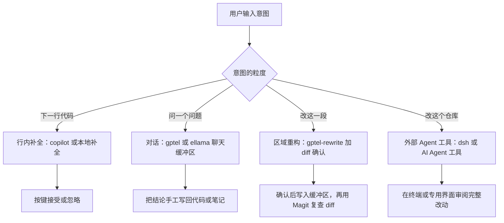
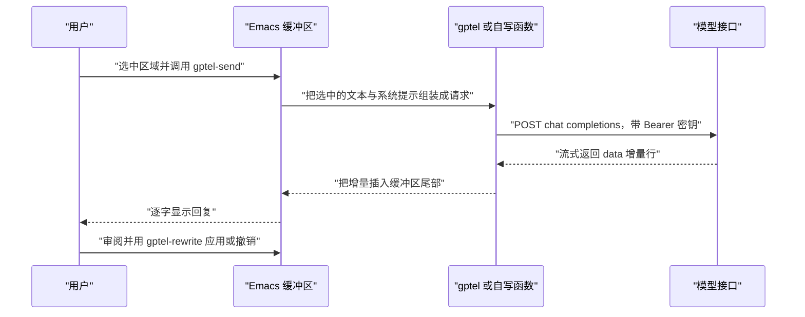

# AI 助手集成

> 在 Emacs 里接 AI 有四种用法：行内补全、对话问答、选中区域重构、Agent 式改文件。本篇先给出不依赖第三方包的最小实现，再覆盖 gptel、ellama、本地模型与提交信息生成，并说清哪些任务该交给 Emacs 之外的 Agent 工具。

---

## 一、四种形态与适用场景

把"AI 在编辑器里能做什么"拆开，实际只有四种交互形态，它们的实现难度、风险与适用场景差别很大。

| 形态 | 交互方式 | 典型命令 | 延迟要求 | 风险 | 适合的任务 |
| --- | --- | --- | --- | --- | --- |
| 行内补全 | 打字时自动出现灰色补全，按 `TAB` 接受 | `copilot-mode`、gptel 的补全能力 | 极低，超过 300 毫秒就会干扰输入 | 低，不确认不会写入 | 样板代码、重复模式、注释补全 |
| 对话问答 | 在一个缓冲区里多轮对话 | `gptel`、`gptel-send` | 中等，可以等几秒 | 低，内容在单独的缓冲区 | 解释报错、查 API 用法、梳理思路 |
| 选中区域重构 | 选中一段，让模型改写并原地替换 | `gptel-rewrite`、`ellama-change` | 中等 | 中，会覆盖原文本（可 diff） | 重命名、翻译、加注释、格式整理 |
| Agent 式改文件 | 模型自己决定读哪些文件、改哪些文件 | 外部 Agent 工具（见第九节） | 高，可以跑几分钟 | 高，跨文件改动难以逐一审查 | 仓库级重构、批量迁移、补测试 |



一个贯穿全篇的原则：**AI 的输出进入仓库之前，必须经过一次人能看懂的复查**。在 Emacs 里这件事的成本很低，因为所有改动最终都是缓冲区里的文本，可以 diff、可以撤销、可以用 Magit 逐块暂存。第四种形态之所以风险高，正是因为它一次改的文件太多，人失去了"逐块确认"的机会。

四种形态对延迟的敏感度差别极大，这直接决定了实现方式。行内补全必须在一两百毫秒内给出候选，因此它依赖专门的补全服务（Copilot 的语言服务器就是为此存在），用通用聊天接口做补全在体感上是不可用的。对话问答与区域重构可以等几秒到几十秒，所以同步调用在这些场景里勉强可接受，但更好的做法仍是流式，因为"第一个字出现"与"全部生成完"给人的感受完全不同。Agent 式任务可能跑几分钟到几十分钟，因此它必须跑在能后台执行、能中断、能看日志的环境里——这正是 Emacs 缓冲区模型不擅长的地方，也是本篇第九节要把这类任务交给外部工具的原因。

另一个必须提前想清楚的问题是"谁来兜底"。行内补全给出的代码可能是错的，但你不按 `TAB` 它就不存在；对话给出的解释可能是编造的，但只要不复制进文件就只是聊天；区域重构会真的覆盖你的文本，所以必须用 `gptel-rewrite` 这类先出 diff 的流程；Agent 式改动会真的落到磁盘上，所以必须依赖版本控制。把"风险等级"与"确认机制"对应起来，是用好这些工具的前提。

---

## 二、不依赖第三方包的最小实现

这一节的目标是：只用 Emacs 自带的能力（`url`、`json`、`auth-source`），写出一个能真正调通 OpenAI 兼容接口的函数。理解这段代码之后，再看 gptel 的配置就只是它的工程化包装。

### 2.1 OpenAI 兼容接口的形状

绝大多数服务（OpenAI、DeepSeek、月之暗面、硅基流动、Ollama、vLLM、Open WebUI、Azure OpenAI 的兼容层）都实现了同一套协议：

- 请求：`POST` 到 `/chat/completions`（或服务商指定的路径），请求头带 `Authorization: Bearer <key>` 与 `Content-Type: application/json`，请求体是 JSON。
- 请求体关键字段：`model`（模型名）、`messages`（消息数组，每条有 `role` 与 `content`）、`stream`（是否流式）。
- 响应：JSON，正文在 `choices[0].message.content`；出错时是 `{"error": {"message": "..."}}`。

因此一份代码可以对接多家服务，只需要改三处：地址、模型名、密钥来源。

这套"事实标准"带来一个实际好处：在 Emacs 里配置 AI 时，你学的是协议而不是某家的 SDK。学会一次 `messages` 数组的结构、`stream` 开关的作用、`choices[0].message.content` 的位置，之后无论换到哪家服务，改的都是配置里的两三行。这也是为什么本章的自写实现与 gptel 的配置看起来如此相似——它们只是同一份协议的两种封装程度。

需要留意的差异点有三个：一是路径，有的服务是 `/v1/chat/completions`，有的把版本号放在别处；二是鉴权，多数用 `Authorization: Bearer`，Azure 用 `api-key` 请求头，自建服务可能完全不校验；三是模型名的写法，本地 Ollama 用 `qwen2.5:7b` 这种带标签的名字，云端则是自己的一套命名。遇到 401 或 404 时，先核对这三处，比反复改提示词有效得多。

### 2.2 密钥的读取

**绝对不要把密钥硬编码在 `init.el` 里**，尤其是当 `init.el` 在一个 Git 仓库里时——提交一次就等于永久泄露（即使之后删掉，历史里仍然留着）。两种可接受的来源：

第一种是环境变量。在 shell 的启动文件里设置，Emacs 通过 `getenv` 读取：

```bash
# ~/.bashrc 或 ~/.zshrc
export MY_AI_API_KEY="sk-..."
```

第二种是 `~/.authinfo.gpg`，由 `auth-source` 读取，密码用 GPG 加密（制作方法见 [[emacs教程/6扩展应用/04_邮件RSS与阅读|邮件、RSS 与阅读]] 的发送邮件一节）：

```text
machine api.deepseek.com login apikey password sk-...
```

下面这个函数按"环境变量优先、认证文件兜底"的顺序取密钥，并且把结果缓存起来，避免每次请求都去解密文件：

```elisp
(defvar my/ai-cached-key nil
  "缓存下来的 API key，避免每次请求都查询 auth-source。")

(defun my/ai-api-key ()
  "返回 API key：先读环境变量 MY_AI_API_KEY，再查 auth-source。"
  (or my/ai-cached-key
      (setq my/ai-cached-key
            (or (getenv "MY_AI_API_KEY")
                (when-let* ((entry (car (auth-source-search
                                         :host "api.deepseek.com"
                                         :user "apikey"
                                         :max 1
                                         :require '(:secret)))))
                  (let ((secret (plist-get entry :secret)))
                    ;; auth-source-search 返回的 :secret 可能是函数，需要调用
                    (if (functionp secret) (funcall secret) secret)))
                (user-error "没有找到 API key：请设置 MY_AI_API_KEY 或配置 ~/.authinfo.gpg")))))
```

`auth-source-search` 的 `:secret` 字段既可能是字符串，也可能是一个需要调用才能拿到明文的函数（取决于后端），上面两个分支都要处理，这是很多人第一次写的时候会踩的坑。

### 2.3 同步调用：完整可用的函数

```elisp
(require 'url)
(require 'json)
(require 'subr-x)

(defcustom my/ai-endpoint "https://api.deepseek.com/chat/completions"
  "OpenAI 兼容接口的完整地址。
各家服务的差别只在主机名与路径：OpenAI 用 api.openai.com 加 /v1/chat/completions，
本地 Ollama 用主机 localhost:11434 加 /v1/chat/completions。"
  :type 'string)

(defcustom my/ai-model "deepseek-chat"
  "模型名，例如 gpt-4o-mini、deepseek-chat、qwen2.5:7b。"
  :type 'string)

(defun my/ai-chat-complete (prompt &optional system timeout)
  "同步调用 OpenAI 兼容接口，返回模型回复的文本。
PROMPT 是用户消息；SYSTEM 是可选的系统提示；TIMEOUT 是超时秒数，默认 60。"
  (let* ((url-request-method "POST")
         ;; 请求头：认证用 Bearer 令牌
         (url-request-extra-headers
          `(("Content-Type" . "application/json")
            ("Authorization" . ,(concat "Bearer " (my/ai-api-key)))))
         ;; 请求体：json-encode 生成的字符串要按 UTF-8 编码成字节
         (url-request-data
          (encode-coding-string
           (json-encode
            `((model . ,my/ai-model)
              (stream . :json-false)     ; :json-false 会被编码成 JSON 的 false
              (messages . [ ,@(when system
                                (list `((role . "system") (content . ,system))))
                            ((role . "user") (content . ,prompt)) ])))
           'utf-8))
         (buf (url-retrieve-synchronously my/ai-endpoint t t (or timeout 60))))
    (unless buf
      (error "请求没有返回缓冲区：检查网络、代理或接口地址"))
    (unwind-protect
        (with-current-buffer buf
          ;; 第一步：解析 HTTP 状态行
          (goto-char (point-min))
          (unless (re-search-forward "^HTTP/[0-9.]+ \\([0-9]+\\)" nil t)
            (error "无法解析 HTTP 状态行，响应开头：%s"
                   (buffer-substring-no-properties (point-min) (min (point-max) 200))))
          (let ((status (string-to-number (match-string 1))))
            ;; 第二步：跳过头部，取正文
            (goto-char (point-min))
            (unless (re-search-forward "\r?\n\r?\n" nil t)
              (error "响应里找不到头部与正文的分界"))
            (let* ((raw (buffer-substring-no-properties (point) (point-max)))
                   ;; 第三步：显式按 UTF-8 解码，否则中文会变成乱码
                   (body (decode-coding-string raw 'utf-8))
                   (data (condition-case err
                             (json-parse-string body
                                                :object-type 'alist
                                                :array-type 'list)
                           (error
                            (error "解析 JSON 失败：%s；响应开头：%s"
                                   (error-message-string err)
                                   (substring body 0 (min 200 (length body))))))))
              (if (not (and (>= status 200) (< status 300)))
                  ;; 第四步：非 2xx 时把服务端给的原因原样报出来
                  (error "接口返回 %d：%s" status
                         (or (alist-get 'message (alist-get 'error data))
                             (substring body 0 (min 300 (length body)))))
                ;; 第五步：取 choices[0].message.content
                (or (alist-get 'content
                               (alist-get 'message
                                          (car (alist-get 'choices data))))
                    (error "响应里没有 choices[0].message.content：%s"
                           (substring body 0 (min 300 (length body)))))))))
      (when (buffer-live-p buf)
        (kill-buffer buf)))))
```

把结果插入当前缓冲区的交互命令，以及一个方便测试的入口：

```elisp
(defun my/ai-insert-response (prompt)
  "把 PROMPT 发给模型，并把回复插入光标处。"
  (interactive "s提问：")
  (let ((answer (my/ai-chat-complete prompt)))
    (insert answer)))

(defun my/ai-test-connection ()
  "最小连通性测试：发一句问候，把回复打印到回显区。"
  (interactive)
  (message "%s" (my/ai-chat-complete "只回复两个字：正常" nil 20)))

;; 绑定：在任意缓冲区里 C-c a i 提问并插入
(keymap-set global-map "C-c a i" #'my/ai-insert-response)
```

这段代码有几个必须理解的细节：

- `url-retrieve-synchronously` 的第二个参数是 SILENT（`t` 表示不显示进度消息），第三个是 INHIBIT-COOKIES，第四个是超时秒数。它会阻塞 Emacs，因此只能用于短请求；长请求要用 2.4 节的异步方案。
- 返回的缓冲区里包含 HTTP 头部，正文从第一个空行之后开始，这是 `re-search-forward "\r?\n\r?\n"` 的作用。
- 正文必须显式 `decode-coding-string`。Emacs 的 url 库把响应放在一个单字节缓冲区里，直接取子串会得到按字节拼出来的字符串，中文就乱了。
- `json-encode` 里用 `:json-false` 表示 JSON 的 `false`，用 `t` 表示 `true`，用 `:null` 表示 `null`；写成 Elisp 的 `nil` 会被编码成 `false`，在需要"空数组"或"缺省"的字段上容易出错。
- 错误处理分三层：网络层（拿不到缓冲区）、协议层（HTTP 状态码不是 2xx）、结构层（JSON 里没有预期的字段）。三层都给出可读的报错，调试时不必再手工抓包。

### 2.4 流式（SSE）处理的思路与简化实现

同步调用最大的问题是"等全部生成完才返回"，用户面对一个卡住的 Emacs 十几秒。真正的流式需要处理 `text/event-stream`：服务端不断推送 `data: {...}` 行，每行是一个增量，最后以 `data: [DONE]` 结束。

思路是三步：

1. 用 `open-network-stream` 建立一个带 TLS 的连接，手工写出 HTTP 请求（带 `Accept: text/event-stream`）。
2. 设置进程过滤器（process filter），把收到的数据按行切开，只处理以 `data: ` 开头的行。
3. 每解析出一个增量，就把它插入目标缓冲区并让光标跟随，形成"逐字出现"的效果。

```elisp
(defvar my/ai-stream-buffer nil
  "流式输出的目标缓冲区。")

(defun my/ai-stream-send (prompt buffer host callback)
  "以流式方式把 PROMPT 发给 HOST，增量内容插入 BUFFER。
每次收到一段增量时调用 CALLBACK（接收增量字符串）。这是一个简化实现：
没有处理分块（chunk）边界以外的边界情况，也没有实现重连。"
  (let* ((key (my/ai-api-key))
         (body (encode-coding-string
                (json-encode
                 `((model . ,my/ai-model)
                   (stream . t)
                   (messages . [((role . "user") (content . ,prompt))])))
                'utf-8))
         (stub (generate-new-buffer " *my-ai-stream*"))
         (proc (open-network-stream "my-ai-stream" stub host 443 nil 'tls))
         (pending ""))
    (setq my/ai-stream-buffer buffer)
    (set-process-coding-system proc 'utf-8-unix 'utf-8-unix)
    (set-process-filter
     proc
     (lambda (_proc chunk)
       (setq pending (concat pending chunk))
       ;; 逐个完整行处理；半行留在 pending 里等下一次数据
       (while (string-match "\n" pending)
         (let ((line (substring pending 0 (match-beginning 0))))
           (setq pending (substring pending (match-end 0)))
           (when (string-prefix-p "data: " line)
             (let ((payload (string-trim (substring line 6))))
               (unless (string= payload "[DONE]")
                 (let* ((obj (json-parse-string payload
                                                :object-type 'alist
                                                :array-type 'list))
                        (delta (alist-get 'content
                                          (alist-get 'delta
                                                     (car (alist-get 'choices obj))))))
                   (when (and delta (buffer-live-p buffer))
                     (with-current-buffer buffer
                       (goto-char (point-max))
                       (insert delta))
                     (when callback (funcall callback delta)))))))))))
    ;; 手工构造 HTTP 请求。Content-Length 必须是字节数，不能用字符数
    (process-send-string
     proc
     (concat "POST " (url-filename (url-generic-parse-url my/ai-endpoint))
             " HTTP/1.1\r\n"
             "Host: " host "\r\n"
             "Authorization: Bearer " key "\r\n"
             "Content-Type: application/json\r\n"
             "Accept: text/event-stream\r\n"
             "Content-Length: " (number-to-string (string-bytes body)) "\r\n"
             "Connection: close\r\n\r\n"
             body))
    proc))
```

使用方式与注意事项：

```elisp
(defun my/ai-stream-to-buffer (prompt)
  "把流式回复写进一个新建的缓冲区。"
  (interactive "s提问：")
  (let ((buf (get-buffer-create "*AI 回复*")))
    (with-current-buffer buf
      (erase-buffer)
      (display-buffer buf))
    (my/ai-stream-send prompt buf "api.deepseek.com" nil)))
```

- `Content-Length` 用 `string-bytes` 而不是 `length`，因为中文是多字节的，用字符数会导致服务端读不完整。
- 请求行里的路径是从 `my/ai-endpoint` 里取出来的（`url-filename`），它只包含路径部分，不含查询串。因此这个简化版本只适用于路径式端点；Azure 那种把 `api-version` 放在查询串里的端点需要把整段请求目标单独写成变量。
- 过滤器里的 `pending` 机制是必须的：TCP 不保证一次收到的就是完整的一行，可能一行被拆成两次，也可能几行一起到。
- 这个实现没有处理 HTTP 头部（不过滤器的逻辑天然忽略了不以 `data: ` 开头的行）、没有处理重定向与压缩、没有错误重试。要生产可用，直接用 gptel（它把这些都做好了，并且默认就是异步流式的）。

### 2.5 异步调用：不卡住 Emacs 的做法

如果不想引入任何包，又不想卡住界面，最省事的办法是用 `url-retrieve`（异步版本）替代 `url-retrieve-synchronously`：

```elisp
(defun my/ai-chat-async (prompt callback)
  "异步调用接口，收到完整响应后调用 CALLBACK，参数是回复字符串。"
  (let ((url-request-method "POST")
        (url-request-extra-headers
         `(("Content-Type" . "application/json")
           ("Authorization" . ,(concat "Bearer " (my/ai-api-key)))))
        (url-request-data
         (encode-coding-string
          (json-encode `((model . ,my/ai-model)
                         (stream . :json-false)
                         (messages . [((role . "user") (content . ,prompt))])))
          'utf-8)))
    (url-retrieve
     my/ai-endpoint
     (lambda (status)
       (if-let* ((err (plist-get status :error)))
           (message "AI 请求失败：%S" err)
         (goto-char (point-min))
         (when (re-search-forward "\r?\n\r?\n" nil t)
           (let* ((body (decode-coding-string
                         (buffer-substring-no-properties (point) (point-max))
                         'utf-8))
                  (data (json-parse-string body :object-type 'alist :array-type 'list))
                  (text (alist-get 'content
                                   (alist-get 'message
                                              (car (alist-get 'choices data))))))
             (when text (funcall callback text)))))
       (kill-buffer (current-buffer)))
     nil t)))   ; 第三个参数是 CBARGS，第四个 SILENT 为 t
```

需要提醒的是：`url-retrieve` 仍然会在 Emacs 的主线程里做 JSON 解析与大块字符串拼接，只是网络等待不阻塞输入。真正长时间的生成（例如几百行长文）用流式更合适。

---

## 三、gptel：主流方案

gptel 是 Emacs 里使用最广的 LLM 客户端，作者 Karthink。它的设计目标是"在任何缓冲区里都能用"：不需要专门的聊天窗口，选中一段就能处理，回复直接插在下面。

- 官方仓库：<https://github.com/karthink/gptel>
- MELPA 页面：<https://melpa.org/#/gptel>

### 3.1 安装

```elisp
;; 发布版（MELPA）
;; M-x package-install RET gptel RET
;; 使用开发快照需要先把 MELPA 或 NonGNU-devel ELPA 加进 package-archives

;; Emacs 30 起，use-package 支持直接按版本控制地址安装；适合想跟最新提交的场景
(use-package gptel
  :vc (:url "https://github.com/karthink/gptel" :rev :newest)
  :commands (gptel gptel-send gptel-menu))
```

安装前需要注意：gptel 依赖 Transient 0.7.8 或更高版本，而 Transient 是 Emacs 内置包、默认不会被 `package-install` 升级。如果启动时报 Transient 相关的错误，把 `package-install-upgrade-built-in` 设为 `t` 后重新升级 Transient。可选安装 `markdown-mode`，gptel 的聊天缓冲区默认用它做语法高亮。

### 3.2 后端与模型

gptel 内置了 OpenAI 后端，开箱就能用；其它服务需要显式注册。`gptel-backend` 是默认后端，`gptel-model` 是默认模型。

```elisp
;;; ============ 后端注册 ============

;; OpenAI（默认后端，一般只需要设置密钥）
(setq gptel-model 'gpt-4o-mini
      gptel-api-key (my/ai-api-key))   ; 也可以留空，让 gptel 自己问

;; DeepSeek：官方提供了专用的注册函数
(setq gptel-model 'deepseek-chat
      gptel-backend (gptel-make-deepseek "DeepSeek"
                      :stream t
                      :key (my/ai-api-key)))

;; 本地的 Ollama：注册后模型名会以 "Ollama:" 前缀出现在菜单里
(gptel-make-ollama "Ollama"
  :host "localhost:11434"              ; Ollama 默认监听地址
  :stream t
  :models '(qwen2.5:7b deepseek-r1:7b))

;; Azure OpenAI：主机名、部署名与 api-version 都从 Azure 门户取得
(gptel-make-azure "Azure-1"
  :protocol "https"
  :host "YOUR_RESOURCE_NAME.openai.azure.com"
  :endpoint "/openai/deployments/YOUR_DEPLOYMENT_NAME/chat/completions?api-version=2023-05-15"
  :stream t
  :key #'my/ai-api-key
  :models '(gpt-4o-mini gpt-4o))

;; 其它 OpenAI 兼容服务：用 gptel-make-openai 手工描述端点
;; 例如自建的 Open WebUI（HTTP 上的 3000 端口）
(gptel-make-openai "OpenWebUI"
  :host "localhost:3000"
  :protocol "http"
  :key (my/ai-api-key)
  :endpoint "/api/chat/completions"
  :stream t
  :models '("qwen2.5:7b"))
```

`gptel-make-openai` 的关键字参数是最通用的那一组：`:host`（主机名，可带端口）、`:protocol`（`"https"` 或 `"http"`）、`:endpoint`（路径）、`:key`（密钥或返回密钥的函数）、`:stream`（是否流式）、`:models`（模型名列表）、`:curl-args`（额外传给 curl 的参数，例如自签名证书时用 `("--insecure")`）。绝大多数"兼容 OpenAI 协议"的服务都能用这一组参数接进来，只需要把 `:host` 与 `:endpoint` 换成服务商文档里给的值。

上面这些 `gptel-make-*` 调用有一个顺序要求：它们必须在 gptel 本体已经加载之后执行，否则可能提示函数未定义。写在 `use-package` 的 `:config` 段里（见 3.3 节的完整配置）或者写在 `(require 'gptel)` 之后，都能保证顺序正确。

密钥也可以用 authinfo。gptel 的默认 `gptel-api-key` 是函数 `gptel-api-key-from-auth-source`，它用后端的接口域名作为 HOST、`apikey` 作为 USER 去查 `~/.authinfo`：

```text
machine api.deepseek.com login apikey password sk-...
machine api.openai.com login apikey password sk-...
```

这样配置里完全不出现密钥，多个后端各自对应一行，是最推荐的形态。

### 3.3 使用与键位

gptel 的核心命令只有几个：

| 命令 | 键位 | 作用 |
| --- | --- | --- |
| `gptel-send` | 在 gptel 聊天缓冲区里是 `C-c RET` | 发送光标之前的文本；有选区时只发送选区 |
| `gptel` | 无默认全局键位 | 打开或切换到一个专门的聊天缓冲区（`C-u M-x gptel` 开新会话） |
| `gptel-rewrite` | 无默认全局键位 | 重构选中的区域，可以用 diff 或 ediff 先看改动再应用 |
| `gptel-menu` | 等同于 `C-u gptel-send` | 打开一个临时菜单，逐项设置本次请求的参数 |
| `gptel-add` | 无 | 把一个区域或缓冲区加入上下文；在 Dired 里可以加入已标记的文件 |
| `gptel-add-file` | 无 | 把一个文件加入上下文 |
| `gptel-org-set-topic` | 无 | 把对话上下文限制在当前 Org 标题之下 |
| `gptel-org-set-properties` | 无 | 把模型、后端、温度等写进 Org 属性，便于复现 |

一次典型的使用流程：

1. 在代码里选中一个函数，按 `C-u` 前缀调用 `gptel-send`（或直接 `M-x gptel-menu`）。
2. 菜单里可以设置系统提示（directive）、本次响应的长度、是否携带此前的对话、把回复写到哪里。
3. 回车发送。默认是流式，回复逐字出现在下方。
4. 如果要"改写而不是追加"，在选中区域上调用 `gptel-rewrite`，它会给出差异对比，确认后才替换原文。

把回答送入专用聊天缓冲区、并且让每次提问都带上系统提示，是长期使用最舒服的形态：

```elisp
;;; ============ gptel 的常用设置 ============

;; 聊天缓冲区用 Org 模式，便于折叠与导出
(setq gptel-default-mode 'org-mode)

;; 提问与回复的前缀，便于在 Org 里区分说话人
(setq gptel-prompt-prefix-alist '((org-mode . "* 我\n")
                                  (markdown-mode . "## 我\n")
                                  (text-mode . "我: ")))
(setq gptel-response-prefix-alist '((org-mode . "* 助手\n")
                                    (markdown-mode . "## 助手\n")
                                    (text-mode . "助手: ")))

;; 用 curl 传输（默认），个别自签证书的自建服务才需要调整
(setq gptel-use-curl t)

;; 回答的默认最大 token 数与随机性；具体模型的上限不同
(setq gptel-max-tokens 2048
      gptel-temperature 0.2)

;; 回复在缓冲区里的呈现方式
(gptel-highlight-mode 1)

;; 让 gptel 的临时菜单和常用命令有顺手的键位
(keymap-set global-map "C-c a g" #'gptel)
(keymap-set global-map "C-c a s" #'gptel-send)
(keymap-set global-map "C-c a r" #'gptel-rewrite)
```

### 3.4 在 Org 里做可复现的对话

gptel 与 Org 的结合是它最有价值的部分：对话就是 Org 文件，标题就是话题，可以随时折叠、批注、导出，也可以把不同的模型设置写进属性里。

```org
* 解释一下这段代码                                             :ai:
:PROPERTIES:
:GPTEL_MODEL: deepseek-chat
:GPTEL_BACKEND: DeepSeek
:GPTEL_TEMPERATURE: 0.1
:END:

下面这个宏为什么在展开时会捕获到错误的变量：

#+begin_src elisp
(defmacro my-with-timer (seconds &rest body)
  `(run-with-timer ,seconds nil (lambda () ,@body)))
#+end_src

* 助手
（把光标放在这个标题下面，调用 gptel-send，回复会写在这里）
```

要点：

- `gptel-org-set-properties` 会把模型、后端、温度、系统提示等写进当前标题的属性里，之后这个标题下的所有提问都用这套设置，做到了"同一文件里同时和多个模型对话"。
- `gptel-org-set-topic` 把上下文限制在当前标题内，长文件里不会把整篇文档都发出去，既省 token 又避免干扰。
- `gptel-org-branching-context` 设为 `t` 时，每一层标题路径是一条独立的对话分支，适合在一个文件里维护多组互不干扰的问答（需要较新的 Org）。

### 3.5 上下文与费用控制

token 费用来自三部分：系统提示、上下文（选中的区域、加入的文件、此前的对话）、以及生成长度。控制办法：

- 只发该发的部分。选中区域再发送，比让 gptel 发整个缓冲区便宜得多；长文件用 `gptel-org-set-topic` 限定范围。
- 别让上下文无限增长。多轮对话默认会带上此前的回复，长会话可以周期性开新会话（`C-u M-x gptel`）。
- 限制生成长度。`gptel-max-tokens` 限制的是提问加回复的总量，设置得小一点能防止模型"话痨"。
- 用便宜模型做初筛。解释报错、补注释这类任务用便宜的小模型足够；只有复杂重构才换大模型。在菜单里切换模型不需要改配置。
- 用本地模型处理不敏感但量大的任务（见第六节），把外部 API 的额度留给真正需要强模型的任务。

养成两个习惯可以避免账单失控：一是每周看一眼服务商后台的用量曲线，发现某天异常高就回头想那天做了什么；二是在 Emacs 里区分"探索"与"生产"两种用法——探索（问概念、试提示词）用便宜模型，生产（真要写进仓库的代码或文档）才切换到强模型。gptel 的临时菜单可以按次切换模型，不需要改配置，这个动作的成本比改配置低得多，因此更容易坚持。

---

## 四、ellama：以本地模型为先的另一种选择

ellama 的定位与 gptel 有重叠但侧重不同：它默认假设你已经在本地跑 Ollama，并把大量"一次性文本操作"做成了独立命令，例如翻译、总结、校对、改写措辞、写提交信息模板。官方仓库：<https://github.com/s-kostyaev/ellama>，包在 GNU ELPA 上。

```elisp
;; ellama 在 GNU ELPA 上，安装后默认使用 Ollama 里可用的第一个模型
;; M-x package-install RET ellama RET

(use-package ellama
  :ensure t
  :bind ("C-c e" . ellama)                       ; 打开对话缓冲区
  :hook (org-ctrl-c-ctrl-c-hook . ellama-chat-send-last-message)
  :init (setopt ellama-auto-scroll t)
  :config
  ;; 显式指定本地模型；llm-ollama 由依赖 llm 提供
  (require 'llm-ollama)
  (setopt ellama-provider
          (make-llm-ollama
           :chat-model "qwen2.5:7b"          ; 对话模型
           :embedding-model "nomic-embed-text")) ; 检索用的嵌入模型
  (ellama-context-header-line-global-mode +1)
  (ellama-session-header-line-global-mode +1))
```

常用命令（都不需要先打开对话缓冲区，在任意缓冲区里直接调用）：

| 命令 | 作用 |
| --- | --- |
| `ellama-chat` | 输入提示词，开启一次对话 |
| `ellama-ask-about` | 就选中区域或当前缓冲区提问 |
| `ellama-ask-selection` | 把选中区域发进对话 |
| `ellama-translate` / `ellama-translate-buffer` | 翻译选中内容或整个缓冲区 |
| `ellama-summarize` | 总结选中区域或整个缓冲区 |
| `ellama-proofread` / `ellama-improve-wording` | 校对、改进措辞 |
| `ellama-code-review` | 评审选中的代码 |
| `ellama-change` | 按指令修改选中区域 |
| `ellama-define-word` | 解释当前词 |
| `ellama-complete` | 用模型补全当前文本 |

与 gptel 的取舍：想要"在任意地方选中一段就处理"、并且偏好与 Org 深度结合，选 gptel；想要一堆开箱即用的固定操作（翻译、校对、总结）并且主要用本地模型，选 ellama。两者可以共存，但不要给同一批命令绑定互相冲突的键位。

还有一点差异值得注意：ellama 的命令是"命名即用途"，几十个命令各自对应一种固定操作，按 `M-x` 就能列出全部能力，适合"我知道想要翻译，但不想每次写提示词"的场景；gptel 的命令少而通用，靠提示词与上下文组合出各种用法，适合"我知道该怎么问，希望自己控制格式"的场景。选择哪种，本质上是在"预制菜"与"自己下厨"之间选，与模型强弱无关。

---

## 五、本地模型：Ollama

本地模型是隐私敏感场景下唯一可接受的方案，也是"不按量付费"的方案。Ollama 是目前最省事的本地推理运行时：一条命令装好，一条命令拉模型，默认在本机 11434 端口暴露 OpenAI 兼容接口。

- 官网与下载：<https://ollama.com/>
- 模型库：<https://ollama.com/library>
- 源码仓库：<https://github.com/ollama/ollama>

```bash
# macOS 与 Windows：从官网下载安装包直接安装
# Linux：官方安装脚本
$ curl -fsSL https://ollama.com/install.sh | sh

# 拉取并试跑一个模型
$ ollama pull qwen2.5:7b
$ ollama run qwen2.5:7b "用一句话解释什么是尾递归"

# 查看本地已有的模型与正在运行的服务
$ ollama list
$ ollama ps
```

在 Emacs 里的接入有两种：gptel 用 `gptel-make-ollama`（见 3.2 节），ellama 用 `make-llm-ollama`（见第四节）。也可以用本章第二节自己写的函数，只要把 `my/ai-endpoint` 的主机改成 `localhost:11434`、路径用 `/v1/chat/completions`，把模型名改成 `qwen2.5:7b`，并把密钥随便填一个非空值即可（Ollama 不校验密钥，但很多客户端要求该字段存在）。

模型选择的现实说明：

| 模型规模 | 大致显存需求 | 速度（消费级显卡） | 适合 |
| --- | --- | --- | --- |
| 3B 到 4B | 4 GB 以内 | 很快 | 补全、简单改写、格式转换 |
| 7B 到 8B | 6 到 8 GB | 较快，可交互 | 问答、解释代码、翻译 |
| 14B | 10 到 12 GB | 中等，需要等几秒 | 复杂一点的推理与代码 |
| 32B 及以上 | 20 GB 以上 | 慢，逐字出现 | 接近闭源小模型的质量 |
| 任何规模的 CPU 推理 | 内存足够即可 | 很慢（每秒几个词） | 只适合离线批处理，不适合交互 |

显存不够时 Ollama 会把部分层放到 CPU 上计算，速度会断崖式下降；判断办法是看 `ollama ps` 输出里的处理器分配，或者观察生成速度是否突然变慢。量化版本（模型名带 `q4_K_M` 之类后缀）能用更少的显存跑，代价是质量略有下降。

一个务实的结论：本地 7B 到 8B 模型在"解释报错、写注释、翻译、格式化"这类任务上已经足够可用，在"一次改多个文件的复杂重构"上明显不如云端大模型。因此常见的分工是本地模型处理高频琐碎任务，云端模型处理少数难题。

判断某个本地模型是否值得留在硬盘上，建议用固定的三道题自测，而不是看排行榜：第一道是"解释一段你熟悉的报错"，看它有没有抓住真正的原因；第二道是"把一个你写过的函数翻译成另一种语言"，看输出能否直接通过编译或测试；第三道是"按你的格式要求生成一段结构化文本"，看它是否遵守约束。三道题都用同一个提示词、同一份输入，换模型时结果可比。不通过第二道题的模型，无论参数多大，都不适合用来写代码。

还有两个容易被忽略的现实约束。一是内存：模型加载后就常驻内存，同时开两个 14B 模型很可能直接耗尽内存并触发系统交换，表现是整个桌面卡死。二是磁盘：每个量化模型动辄几 GB，`ollama list` 之后要定期清理不再使用的模型。这两点在只装了 16 GB 内存的笔记本上尤其明显。

---

## 六、代码助手：GitHub Copilot 的 Emacs 客户端

GitHub Copilot 官方并不维护 Emacs 客户端，社区实现是 copilot.el（<https://github.com/copilot-emacs/copilot.el>）。使用前必须清楚三件事：

1. 它需要有效的 GitHub Copilot 订阅，没有订阅时会在 `M-x copilot-diagnose` 里报 `NotAuthorized`。
2. 它是非官方实现，通过 Copilot 的语言服务器协议通信。GitHub 改变协议或鉴权方式时，它可能在一段时间内不可用，需要等社区适配。
3. 它依赖 Node.js 或预编译的语言服务器二进制。官方说明是：语言服务器自带 macOS、Linux、Windows 的预编译二进制，`copilot-install-server` 会自动下载，因此不强依赖 npm；如果走 npm 安装则需要 Node.js 22 或以上。

```elisp
;; MELPA 上的包名是 copilot
(use-package copilot
  :ensure t
  :hook (prog-mode . copilot-mode)
  :bind (:map copilot-completion-map
              ("<tab>" . copilot-accept-completion)
              ("TAB" . copilot-accept-completion)
              ("C-<tab>" . copilot-accept-completion-by-word)
              ("C-TAB" . copilot-accept-completion-by-word)
              ("C-n" . copilot-next-completion)
              ("C-p" . copilot-previous-completion)))

;; 安装并登录（只需做一次）
;; M-x copilot-install-server RET
;; M-x copilot-login RET
;; 出问题时用 M-x copilot-diagnose RET 查看状态
```

`copilot-completion-map` 里的键只在补全悬浮窗可见时生效，其余时候按键会照常执行原命令，因此把 `TAB` 绑上去是安全的。除逐条补全之外，它还有几个有用的能力：`copilot-panel-complete` 打开一个面板列出多个候选（按 `RET` 或 `C-c C-c` 插入选中的那个），`global-copilot-mode` 在所有缓冲区启用，`copilot-nes-mode` 尝试在光标附近做"下一处编辑建议"。

行内补全与对话式 AI 的分工：补全负责"我大概知道要写什么，帮我省打字"，它的价值在速度与低干扰；对话负责"我不知道怎么写，帮我讲清楚"。两者不冲突，但同时开启时要注意键位：补全占用 `TAB`，对话类命令建议放在 `C-c` 前缀下。

---

## 七、Magit 集成：自动生成提交信息

这是把 AI 接入日常流程里回报最高的一处：提交信息永远是同一个格式、同一套语气，而写它需要读一遍 diff——恰好是模型擅长的事。

思路是：取出暂存区的 diff，拼成提示词，调用模型，把结果插入 `COMMIT_EDITMSG` 缓冲区供人修改。下面这个函数可以直接用：

```elisp
(defcustom my/commit-prompt
  (concat "你是 Git 提交信息助手。根据下面的 git diff 写一条提交信息，要求：\n"
          "1. 第一行是摘要，使用祈使句，不超过 60 个字符，不加句号；\n"
          "2. 如有必要，空一行后写正文，用 - 列出要点，每条一行；\n"
          "3. 只输出提交信息本身，不要任何解释、不要代码块标记；\n"
          "4. 用中文写。\n\ndiff 如下：\n")
  "生成提交信息时使用的提示词前缀。")

(defun my/git-staged-diff ()
  "返回暂存区的 diff 文本；过长时截断，避免超出模型上下文。"
  (let ((diff (shell-command-to-string
               "git --no-pager diff --cached --no-color --find-renames")))
    (when (string-empty-p (string-trim diff))
      (user-error "暂存区是空的：先用 git add 或 Magit 的 s 键暂存改动"))
    ;; 粗略限制长度：约 12000 个字符，够描述一次正常提交
    (if (> (length diff) 12000)
        (concat (substring diff 0 12000) "\n...（diff 过长已截断）")
      diff)))

(defun my/git-generate-commit-message ()
  "把暂存区的 diff 发给模型，把生成的提交信息插入当前缓冲区开头。
在 Magit 的提交信息缓冲区（COMMIT_EDITMSG）里调用。"
  (interactive)
  (let* ((diff (my/git-staged-diff))
         (answer (my/ai-chat-complete
                  (concat my/commit-prompt diff)
                  "你是一个克制的提交信息生成器，只输出提交信息本身。"
                  90)))
    (goto-char (point-min))
    ;; 把草稿插在最前面，Magit 生成的注释行仍保留在下方
    (insert (string-trim answer) "\n\n")
    (message "已生成提交信息草稿，请检查后再提交")))

;; 在提交信息缓冲区里绑定 C-c g
(defun my/git-commit-setup ()
  "在 git-commit 缓冲区里加上生成提交信息的键位。"
  (local-set-key (kbd "C-c g") #'my/git-generate-commit-message))

(with-eval-after-load 'git-commit
  (add-hook 'git-commit-mode-hook #'my/git-commit-setup))
```

使用步骤：

1. `C-x g` 打开 Magit 状态视图，用 `s` 暂存要提交的改动。
2. 按 `c c` 进入提交信息缓冲区。
3. 按 `C-c g`，等几秒，草稿出现在最上方。
4. 通读一遍，改掉不准确的地方，`C-c C-c` 提交。

注意几个细节：`shell-command-to-string` 调用的 `git` 会使用当前缓冲区的 `default-directory`，因此必须从项目内的缓冲区（Magit 的提交缓冲区满足这一点）调用；截断长度是为了避免超出模型上下文，用 `gptel-max-tokens` 之类的设置并不能解决"输入过长"的问题；提示词里明确要求"只输出提交信息本身"，可以避免模型加一段"这是为您生成的提交信息："之类的废话。

为什么把提交信息当作接入 AI 的第一站？因为它同时满足四个条件：输入是机器生成的 diff（干净、结构化），输出是很短的文本（几十个 token，费用可以忽略），效果容易判断（好不好读自己一眼就知道），风险极低（写坏了改一下就行）。凡是具备这四个特征的环节，都适合优先交给模型；反过来，输入脏、输出长、效果难判断的环节，就应该谨慎。

如果希望用 gptel 而不是自己写的函数，把 `my/ai-chat-complete` 换成一段调用 gptel 请求 API 的代码即可；不过用同步函数更简单，因为提交信息很短，几秒的等待可以接受。

---

## 八、把 AI 用在文档与学习上

下面四类任务在 Emacs 里做特别顺手，因为输入（选中的代码或报错）与输出（要插入的文本）都在同一个缓冲区里。每类给一个提示词模板与操作步骤。

### 8.1 解释报错

操作步骤：编译或运行出错后，把 `*compilation*` 缓冲区里的报错栈选中，调用 `gptel-rewrite` 或 `M-x my/ai-insert-response`。

提示词模板：

```text
下面是我遇到的报错与相关代码。请依次回答：
1. 报错的确切含义（用一句话）；
2. 最可能的三个原因，按可能性排序；
3. 每个原因对应的验证方法（具体到命令或要打印的变量）；
4. 推荐的修复方式。
不要重写我的代码，先解释。

报错：
<粘贴报错>

相关代码：
<粘贴代码>
```

### 8.2 为函数写文档字符串

操作步骤：把光标放在函数定义里，`M-x gptel-rewrite`（或选中整个函数后 `C-c a r`），在菜单里输入指令。

提示词模板：

```text
为这个函数补一段符合 Emacs Lisp 规范的文档字符串，要求：
- 第一行是一句完整的祈使句，说明函数做什么；
- 之后说明每个参数的含义与取值范围；
- 如果有返回值，说明返回什么；
- 如果有副作用（修改缓冲区、写文件、发网络请求），必须指出；
- 只输出函数的完整新版本，不要解释。
```

### 8.3 把代码翻译成另一种语言

操作步骤：选中整个函数或文件，`M-x gptel-rewrite`，在指令里写明源语言与目标语言。

提示词模板：

```text
把下面的 <源语言> 代码翻译成 <目标语言>，要求：
- 保持行为完全一致，包括边界条件与错误处理；
- 使用目标语言的惯用写法，不要逐行直译；
- 保留原有的注释含义，用目标语言的注释风格重写；
- 在末尾用注释列出"因为语言差异而确实无法一一对应"的地方；
- 只输出代码。
```

翻译类任务建议用本地模型或者便宜的小模型，因为它是"量大、模式固定"的典型场景。

### 8.4 为函数写 ert 测试

操作步骤：选中函数，`M-x gptel-rewrite` 让它生成测试，确认后把测试放到单独的测试文件里（不要让测试和实现混在一个缓冲区里）。

提示词模板：

```text
为下面的函数写 Emacs Lisp 的 ert 测试，要求：
- 使用 (require 'ert) 与 (ert-deftest 名字 () ...) 的形式；
- 至少覆盖：正常输入、边界输入（空值、零、最大最小值）、以及会导致错误或异常的输入；
- 每个测试的断言要具体，不要写 (should t) 这种没有意义的断言；
- 对于有副作用或依赖外部状态的函数，用 cl-letf 或临时缓冲区隔离；
- 只输出测试代码。
```

写完测试之后立刻运行 `M-x ert RET t RET` 验证，不要让"看起来合理"的测试留在仓库里。

### 8.5 提示词为什么经常失效

在 Emacs 里用 AI 有一个容易被忽略的优势：上下文是现成的。选中一个函数再提问，比在网页聊天框里手工粘贴代码，少了一次"复制到别处"的动作，也少了一次"忘记粘贴依赖的头文件"的错误。反过来说，效果不好的常见原因几乎都不是模型太笨，而是三件事没做对。

第一，没有给出判据。像"这段代码有什么问题"这样的问题，模型只能猜你关心的是性能、可读性还是正确性。改成"这段代码在输入为空字符串时会发生什么；如果有问题，给出最小复现输入"之后，答案的质量会立刻不同。凡是能用"是或否""有或没有"回答的要求，都要写出来。

第二，没有给出输出格式。需要代码就用"只输出代码，不要解释"；需要在已有文件里替换就用 `gptel-rewrite` 而不是把回复粘到别处；需要多个方案就写"给出两个方案并说明取舍"。模型默认倾向于"多说话"，不约束输出格式的结果就是每次都要手工删掉包装文字。

第三，把该由人决定的事交给了模型。命名风格、日志格式、错误处理策略这类需要项目一致性的事情，应该写在提示词里作为硬约束，而不是让模型每次自由发挥。反复用到的约束，值得像 7 节里的 `my/commit-prompt` 那样做成一个变量，一次写清楚、长期复用。

### 8.6 上下文该喂多少

"多给点信息总没坏处"是错的：上下文越长，费用越高、响应越慢、模型被无关内容带偏的概率也越大。实用的取舍如下表。

| 任务 | 该给什么 | 不该给什么 |
| --- | --- | --- |
| 解释一段报错 | 报错原文、出错的那个函数、相关的类型定义 | 整个文件、整个编译日志 |
| 改写一个函数 | 函数本身、以及它调用的接口签名 | 调用它的所有位置 |
| 写测试 | 函数实现、它的副作用说明、项目用的测试框架 | 整个测试套件 |
| 翻译文档 | 待翻译的段落、术语表 | 其他语言的版本（会诱导模型抄而不是译） |
| 生成提交信息 | 暂存区 diff | 未暂存的改动、整个工作区状态 |

对应的 Emacs 操作就是：选中区域而不是整个缓冲区；用 `gptel-add-file` 精确加入需要参考的文件；在 Org 里用 `gptel-org-set-topic` 限定标题范围；长会话定期开新会话，避免把几十轮历史一直带着。注意 gptel 的上下文是显式管理的，凡是加入过的东西都会在后续每一轮里重复发送，因此"加进去忘了删"是费用失控的最常见原因。用 `C-u gptel-send` 打开菜单就可以随时检查与清理当前上下文。

### 8.7 把 AI 用在 Org 笔记与写作上

在 Org 里用 AI 有一个额外好处：笔记与对话的产物都是纯文本，可以一起提交进版本控制。三种常见用法。

第一种是"先写后问"。自己先把想法写下来（哪怕很粗糙），再让模型指出逻辑跳跃、自相矛盾或缺失的前提。这比让它"写一篇关于某主题的文章"有价值得多，因为观点是你的，模型只做审查。

第二种是"缩写与扩写"。把一段啰嗦的说明交给模型压缩成三句话，或者把三条要点扩写成一段完整说明。这类任务用本地小模型就够，且因为原文已经存在，模型很难偏离原意。

第三种是"整理成表"。把一段散文式的对比交给模型，要求输出 Markdown 表格，再人工校正。表格化之后信息密度更高，也更容易发现原本没注意到的维度缺失。

```org
* 关于缓存策略的思考                                            :writing:
** 我的初稿
（先自己写：本地缓存优先、失效时间按数据敏感度分档、写入时同步失效……）
** 助手
（光标放在这里调用 gptel-send，提问："指出上面论述中逻辑跳跃或自相矛盾的地方，
不要重写，只列出问题并说明为什么是问题。"）
```

这种"同一文件里既有自己的初稿、又有模型的审查意见"的组织方式，正是 3.4 节讲的 Org 优势：几天后回头看，能清楚知道哪些想法是自己的、哪些是模型提醒的。

---

## 九、与外部 Agent 工具的分工

Emacs 内的 AI 与外部 Agent 工具的差别不在模型强弱，而在"一次改动的范围"与"人的审查粒度"。

| 判断维度 | 留在 Emacs 内 | 交给外部 Agent 工具 |
| --- | --- | --- |
| 改动范围 | 单个缓冲区、单个函数、单段文本 | 跨多个文件、整个仓库 |
| 是否需要读很多文件 | 不需要，人已经把上下文选好了 | 需要，让工具自己去检索与阅读 |
| 是否需要跑命令 | 不需要（或只需要一条） | 需要反复运行测试、构建、格式化 |
| 审查方式 | 在缓冲区里直接 diff，逐块确认 | 在终端或专用界面审阅完整改动后一次性接受 |
| 典型任务 | 解释报错、改注释、翻译、写测试草稿、生成提交信息 | 依赖升级、接口重命名、批量迁移、补一整套测试、修一个跨模块的 bug |
| 失败代价 | 低，`undo` 即可 | 高，需要靠版本控制回退 |

结论式的分工建议：

- 只要输出的最终形态是"一段可以一次性看懂的文本"，就用 Emacs 内的方式（gptel 或本篇第二节的自写函数）。人始终在回路里，成本低。
- 只要任务需要"工具自己决定读哪些文件、跑哪些命令、改哪些文件"，就交给外部 Agent 工具。Emacs 的缓冲区模型天然不适合这种"自主循环"，硬做只会得到一堆难以审查的改动。
- 两者串起来的常见流程：用外部 Agent 完成仓库级改造，改动落到工作区后，回到 Emacs 里用 Magit 逐块复查、写提交信息、处理冲突。
- 具体工具与用法见 [[dsh|DeepSeek Harness]] 与 [[AI_Agent工具使用教程|AI Agent 工具]]。

拿不准的时候，用一条经验法则判断：**看"最终产出"是不是一次能读完的东西**。一次能读完（一个函数、一段说明、一条提交信息），就留在 Emacs 里做；需要读十几分钟才能判断对错（一次跨模块重构、一批依赖升级后的适配），就交给外部工具，并且准备好用版本控制回退。另一条补充法则是看"需不需要跑命令"：需要反复运行测试、构建、格式化的任务，只有在能自由执行命令的环境里才做得动，Emacs 里即使能跑也是手工一步一停。

两者衔接的一个具体工作流是：先在一个干净的工作区里让外部 Agent 完成改造并提交，再回到 Emacs，用 `C-x g` 打开 Magit 逐块复查这次提交，把有疑问的部分放进单独的提交或直接修正，最后用第 7 节的函数为拆分后的提交重新生成信息。这样"大规模的自动改动"与"细粒度的人工确认"各就各位，两边都不用勉强做自己不擅长的事。



---

## 十、隐私、安全与成本

### 10.1 密钥

- 不把密钥写进 `init.el`，更不要提交进 Git。即使事后删除，历史里仍然留着，正确的做法是立刻到服务商后台吊销并重新生成。
- 优先用 `~/.authinfo.gpg`（GPG 加密）或环境变量。环境变量的弱点是会被子进程继承，`M-x shell` 里的任何命令都能读到，因此不要让不可信脚本在同一个 Emacs 会话里运行。
- 用 `git diff --cached` 与 `git status` 检查即将提交的内容里有没有密钥；也可以给仓库加 `pre-commit` 钩子做模式匹配扫描。
- 团队协作时不要共用密钥：按人分配、便于单独吊销与统计用量。
- 如果 Emacs 配置本身是一个公开仓库（很多人的配置都是），除了密钥，还要检查有没有把内部域名、接口地址、甚至 commit message 模板里的项目名写进去。配置仓库泄露的信息往往比想象中多。

### 10.2 代码与数据的边界

- 公司内部代码、客户数据、未公开的设计文档，不要发给外部服务。判断标准很简单：如果这段内容不能贴到公网上，就不要发给外部模型。
- 本地模型（Ollama）的优势就在于数据不出机器。要求隐私的任务（合同、病历、内部代码）应当全部走本地模型。
- 即使服务商声明"不用于训练"，也不要据此放宽判断；合规责任在使用方。
- 在 Org 笔记里用 AI 处理内容时注意：gptel 会把上下文里包含的内容一起发出去，如果缓冲区里有敏感段落而你没有选中它，仍然可能被带入。

### 10.3 成本与限流

- 按 token 计费的服务里，输入 token 通常比输出便宜，但输入往往是大头（上下文、文件内容）。控制输入比控制输出更重要。
- 遇到 `429`（请求过多）时不要立刻重试，指数退避即可：等 2 秒、4 秒、8 秒各试一次，仍失败就提示用户。在 Emacs 里可以简单地用 `(sleep-for n)`，但注意同步调用会阻塞界面。
- 设定月度预算与用量告警。可以按 `gptel-model` 分工：默认用小模型，需要时在菜单里临时切换到大模型。
- 免费额度与限流也适用于本地模型：Ollama 单卡同时只能跑一个推理，多个 Emacs 请求会排队，表现为"第一个很快、后续变慢"。

### 10.4 卡住 Emacs 的问题

同步请求（`url-retrieve-synchronously`、`shell-command-to-string` 调外部命令）会冻结整个 Emacs，包括光标移动与 `C-g`。判断与处理：

- 短请求（几秒）可以接受，这也是提交信息生成用同步函数的原因。
- 长请求一律用异步：gptel 默认就是异步流式；自己写的话用 `url-retrieve`（2.5 节）或 `make-network-process` 加过滤器（2.4 节）。
- 已经卡住时除了等待没有别的办法，`C-g` 在同步网络调用里通常无效。这也是为什么不要把同步调用绑定到常用键上。

---

## 十一、完整配置块

下面这段整合了 gptel、自写函数、密钥管理与键位。其中自写函数既作为教学示例保留，也可以在没有 gptel 的环境里独立使用。

```elisp
;;; ============ 一、密钥管理 ============

;; 优先环境变量，其次 ~/.authinfo.gpg；不把密钥写进本文件
(defvar my/ai-cached-key nil)

(defun my/ai-api-key ()
  "返回 API key：环境变量 MY_AI_API_KEY 优先，其次 auth-source。"
  (or my/ai-cached-key
      (setq my/ai-cached-key
            (or (getenv "MY_AI_API_KEY")
                (when-let* ((entry (car (auth-source-search
                                         :host "api.deepseek.com"
                                         :user "apikey"
                                         :max 1
                                         :require '(:secret)))))
                  (let ((secret (plist-get entry :secret)))
                    (if (functionp secret) (funcall secret) secret)))
                (user-error "没有找到 API key")))))

;; 调试时想重新读取密钥，执行 M-x my/ai-forget-key
(defun my/ai-forget-key ()
  "清空缓存的 API key。"
  (interactive)
  (setq my/ai-cached-key nil)
  (message "已清空缓存的 API key"))

;;; ============ 二、自写的最小调用（不依赖任何包） ============
;; 完整实现见第二节；这里只留配置项
(defcustom my/ai-endpoint "https://api.deepseek.com/chat/completions"
  "OpenAI 兼容接口地址。"
  :type 'string)
(defcustom my/ai-model "deepseek-chat"
  "默认模型名。"
  :type 'string)

;; my/ai-chat-complete 与 my/ai-chat-async 的定义见第二节

;;; ============ 三、gptel ============
(use-package gptel
  :ensure t
  :bind (("C-c a g" . gptel)          ; 打开聊天缓冲区
         ("C-c a s" . gptel-send)     ; 发送光标之前的文本或选区
         ("C-c a r" . gptel-rewrite)  ; 重构选区并给出 diff
         ("C-c a m" . gptel-menu))    ; 临时菜单，逐项设置本次请求
  :custom
  ;; 聊天界面相关的设置可以在包加载前设置
  (gptel-default-mode 'org-mode)      ; 聊天缓冲区用 Org
  (gptel-max-tokens 2048)
  (gptel-temperature 0.2)
  (gptel-use-curl t)                  ; 用 curl 传输，默认即为 t
  ;; Org 里区分提问与回复
  (gptel-prompt-prefix-alist '((org-mode . "* 我\n")
                               (markdown-mode . "## 我\n")
                               (text-mode . "我: ")))
  (gptel-response-prefix-alist '((org-mode . "* 助手\n")
                                 (markdown-mode . "## 助手\n")
                                 (text-mode . "助手: ")))
  :config
  ;; 后端注册放在 :config 里，确保 gptel 已经加载
  (setq gptel-model 'deepseek-chat
        gptel-backend (gptel-make-deepseek "DeepSeek"
                        :stream t
                        :key #'my/ai-api-key))
  ;; 本地 Ollama 后端：只有在本机跑着 ollama 时才需要
  (when (executable-find "ollama")
    (gptel-make-ollama "Ollama"
      :host "localhost:11434"
      :stream t
      :models '(qwen2.5:7b)))
  ;; 回复高亮
  (gptel-highlight-mode 1))

;;; ============ 四、本地模型：ellama（可选，与 gptel 二选一或共存） ============
;; (use-package ellama
;;   :ensure t
;;   :bind ("C-c e" . ellama)
;;   :init (setopt ellama-auto-scroll t)
;;   :config
;;   (require 'llm-ollama)
;;   (setopt ellama-provider
;;           (make-llm-ollama :chat-model "qwen2.5:7b"
;;                            :embedding-model "nomic-embed-text")))

;;; ============ 五、Git 提交信息生成 ============
;; my/git-generate-commit-message 与 my/git-commit-setup 的定义见第七节
(with-eval-after-load 'git-commit
  (add-hook 'git-commit-mode-hook #'my/git-commit-setup))

;;; ============ 六、其它集成 ============
;; 在 Dired 里把多个文件加入 gptel 上下文：用 gptel-add
(with-eval-after-load 'dired
  (keymap-set dired-mode-map "C-c a" #'gptel-add))

;; 用 AI 处理 Org 笔记时的上下文开关：在这个文件里递归加载本地模型
;; (setq gptel-org-branching-context t)   ; 每层标题一条独立对话分支
```

配置取舍：gptel 与 ellama 只留一个，避免同一批功能有两套键位；`my/ai-chat-complete` 保留下来是因为它短、可靠、能在任何环境里跑，也是排查"到底是网络问题还是包的问题"的最好工具（先跑 `M-x my/ai-test-connection`，能通就说明密钥与网络没问题）。

---

## 十二、常见问题

### 12.1 返回 401 或 403

`401` 是认证失败，`403` 通常是权限或地域限制。排查顺序：

- 密钥本身过期或被吊销：到服务商后台确认，并重新生成。
- 密钥前缀不匹配：有些服务不是 `Bearer` 而是自定义请求头，查服务商文档。
- 请求头没带上：自己写的代码里如果 `url-request-extra-headers` 拼错（例如写成了 alist 之外的结构），认证头会被静默丢弃。
- 模型名不属于该密钥的可用范围：换一个模型名试。
- `403` 还可能是地区限制，此时只能换服务商或用本地模型。

用 curl 先验证一次是最快的分诊手段：

```bash
$ curl -sS -m 30 https://api.deepseek.com/chat/completions \
    -H "Content-Type: application/json" \
    -H "Authorization: Bearer $MY_AI_API_KEY" \
    -d '{"model":"deepseek-chat","messages":[{"role":"user","content":"hi"}]}' | head -c 300
```

### 12.2 请求超时

- 同步调用要显式给超时：`url-retrieve-synchronously` 的第四个参数就是超时秒数，不给的话可能等很久。
- 长回答本来就慢，流式是正解：gptel 默认流式，能立刻看到第一个字，体感完全不同。
- 代理问题：`url` 库读 `url-proxy-services`，curl 读 `http_proxy` 与 `https_proxy`。两者用的不是同一套设置，切换传输方式时要一起改。
- 自建服务（局域网、自签证书）要注意 TLS：gptel 可以用 `:curl-args '("--insecure")` 绕过证书校验，但那等于放弃中间人保护，只在完全可信的内网里用。

### 12.3 中文乱码

两个方向都会出问题：

- 发送方向：请求体必须是 UTF-8 字节。自己写代码时用 `(encode-coding-string (json-encode ...) 'utf-8)`；漏掉这一步时，服务端收到的 JSON 里中文会变成问号或乱码。
- 接收方向：响应要显式解码。用 `(decode-coding-string (buffer-substring-no-properties ...) 'utf-8)`，不要直接把单字节缓冲区的内容当字符串用。
- 显示方向：确认 `buffer-file-coding-system` 是 UTF-8，以及终端环境的 `LANG`。在 Windows 上尤其容易出问题。

### 12.4 回复被截断

- 模型的输出上限通常是"提问加回复"的总量，`gptel-max-tokens` 设小了会把回复截断，按模型的实际上限设一个大一点的值即可；gptel 的临时菜单里也有"响应长度"这一项，可以按次调整。
- 输入过长会挤占输出额度：先把上下文缩短（选中更小的区域、用 `gptel-org-set-topic` 限定范围），再考虑提高输出上限。
- 有些服务对单次响应有硬上限，超出的部分只能分两轮生成（第一轮写前半，第二轮说"继续"）。

### 12.5 Emacs 卡住不动

这是同步请求造成的，不是 Emacs 的问题。处理办法只有两条：等它完成，或者以后改用异步与流式。要判断当前是否卡在同步网络调用上，可以在卡住之前先 `M-x profiler-start`，恢复后 `M-x profiler-report` 看到底卡在哪个函数；更简单的判断是看回显区有没有"Waiting for..."之类的消息。预防措施是把同步函数只绑在不常用的键上，日常交互一律走 gptel。

### 12.6 补全一直不出结果

Copilot 类的补全依赖语言服务器，出问题时依次检查：`M-x copilot-diagnose` 的输出（`NotAuthorized` 就是订阅问题）、网络能否访问服务端、`copilot-mode` 是否真的启用了（看模式行）、以及当前文件的主模式是否在 `copilot-mode` 的启用范围内（默认挂在 `prog-mode` 上，纯文本文件不会启用）。

### 12.7 模型说得很肯定但是错的

这是必须提前接受的事实：大模型会以非常自信的语气给出错误的 API 名称、错误的参数顺序、甚至不存在的函数。在 Emacs 里有一个天然的优势可以对抗它——所有函数与变量都能就地查证：

- 光标停在函数名上按 `C-h f`（`describe-function`）确认它是否存在。
- 光标停在变量上按 `C-h v`（`describe-variable`）确认取值与类型。
- 想找某个函数在配置里被用在哪里，用 `M-x consult-ripgrep` 搜一遍。
- 需要看某个包到底提供了哪些命令，用 `M-x helpful-function` 或直接读源码（`M-x find-function`）。

因此一条实用的工作纪律是：AI 生成的任何 Elisp 都要经过"`C-h f` 验证函数名、`C-x C-e` 求值、`M-x check-parens` 检查括号"这三步，再放进 `init.el`。第 2 节之所以要自己写一遍最小实现，很大程度上也是为了在出问题时能判断"到底是网络、密钥、还是包的问题"，而不是只能对着别人的封装猜。

---

## 小结

- 交互形态决定工具：行内补全用 copilot 类方案，对话与区域重构用 gptel 或 ellama，仓库级改动交给外部 Agent 工具。
- 用 `url-retrieve-synchronously` 加 `json-encode` 与 `decode-coding-string` 就能写出一个可用的最小客户端，理解它之后再看 gptel 的配置只是细节；密钥一律从环境变量或 `~/.authinfo.gpg` 读，永不写进配置文件。
- AI 的产出进入仓库前必须经过一次人的复查：Emacs 内的改动可以 diff、可以 `undo`，这正是它的价值所在；代价是长请求必须异步，否则整个编辑器会卡住。

---

## 相关章节

- [[emacs教程/6扩展应用/05_文件管理与笔记系统|文件管理与笔记系统]]
- [[emacs教程/5开发环境集成/05_Git与Magit|Git 与 Magit]]
- [[emacs教程/6扩展应用/04_邮件RSS与阅读|邮件、RSS 与阅读]]
- [[emacs教程/4插件开发/01_插件结构与生命周期|插件结构与生命周期]]
- [[dsh|DeepSeek Harness]]
- [[AI_Agent工具使用教程|AI Agent 工具]]
