# 启动加速与性能优化

> 本篇解决三个具体问题：Emacs 启动要几秒、编辑时为什么卡、以及如何在不把配置搞坏的前提下把这两件事治好。适合已经能写配置、装包、写过 Elisp，准备认真调优的读者。

---

## 一、先测量，再优化

优化 Emacs 最常见的失败方式，是照着别人的配置抄一组数字（`gc-cons-threshold` 调到多少、哪些包要延迟加载），然后凭感觉认为"快了"。感觉不可靠：一次冷启动和一次热启动能差一倍以上，磁盘缓存、后台编译、杀毒软件、SSD 与机械硬盘都会影响结果。所以本篇的顺序是固定的——**先建立一个可重复的测量方法，再动配置**。

### 1.1 `emacs-init-time` 的含义与局限

`emacs-init-time` 是一个 C 层实现的函数，返回一个字符串，内容是 Emacs 初始化的耗时。它的实现依赖两个内部时间点：进程启动时间与 `after-init-time`。这带来三个必须知道的局限。

第一，**它只能在初始化结束之后调用**。如果你在 `init.el` 里写 `(message "%s" (emacs-init-time))`，得到的不是"当前已经花了多久"，而是一个空字符串，因为此刻 `after-init-time` 还没有被设置。这一点可以用批处理实测：

```bash
$ emacs -Q --batch -l /tmp/t1.el
```

如果 `t1.el` 的内容是 `(princ (format "inside-init: %s\n" (emacs-init-time)))`，输出里冒号后面是空的。而换成启动完成之后再取：

```bash
$ emacs -Q --batch --eval '(princ (format "after: %s\n" (emacs-init-time)))'
after: 0.001028 seconds
```

第二，**它只给总量，不给分布**。0.8 秒里有多少是加载 `init.el`、多少是激活包、多少是 `early-init.el` 里的设置，它一概不说。

第三，**它受首次启动与磁盘缓存影响极大**。同一个配置，冷启动（`echo 3 | sudo tee /proc/sys/vm/drop_caches` 之后）与热启动可能相差数倍。比较配置时务必使用同一种条件，并且**至少跑三次取中间值**。

因此正确的用法是：把它当作一个粗略的总量指标，与你自己打的计时探针配合使用。

### 1.2 用 `benchmark-run` 测量加载耗时

`benchmark-run` 的文档字符串说明了它的行为：可选参数 `REPETITIONS` 是重复执行的次数，返回一个列表，依次是总耗时、发生的垃圾回收次数、垃圾回收所占用的时间。这个三元组正是我们需要的，因为它同时暴露了"慢"和"慢在 GC 上"两种不同的病。

```elisp
;; 测量加载 init.el 的耗时；返回 (总耗时 GC次数 GC耗时)
(benchmark-run 1 (load (expand-file-name "init.el" user-emacs-directory)))

;; 更贴近实际的写法：让 Emacs 自己按正常流程加载用户配置文件，然后报告
;; 注意 load 的第二个参数 NOERROR 为 t 时，文件不存在不会报错
(benchmark-run 1 (load user-init-file t t))
```

`user-init-file` 是 Emacs 在启动时确定下来的用户配置文件路径，通常指向 `~/.emacs.d/init.el`，也可能是 `~/.config/emacs/init.el` 或旧式的 `~/.emacs`。用变量而不是硬编码路径，配置换到别的机器上测量结果才有可比性。

还有一个 `benchmark-run-compiled`：它与 `benchmark-run` 类似，但会先把被测代码编译成字节码再执行。对"这段代码解释执行慢，还是本身算法慢"的判断，它比 `benchmark-run` 更有意义——如果编译之后还是慢，说明瓶颈不在解释器。

### 1.3 `--debug-init` 与 `-Q` 的对照测法

命令行有两个选项必须熟练使用：

```bash
# -Q 等价于 -q --no-site-file --no-splash，跳过所有用户与站点初始化文件
$ emacs -Q

# --debug-init 在加载初始化文件出错时直接进入 Lisp 调试器，并打印 backtrace
$ emacs --debug-init
```

对照测法的思路是构造上下界：

```bash
# 下界：完全裸启动的耗时，看 Emacs 自身的启动成本
$ time emacs -Q --batch --eval '(princ (emacs-init-time))'

# 上界：完整配置的耗时
$ time emacs --batch --eval '(princ (emacs-init-time))'
```

两者之差就是你的配置成本。如果下界本身就要 0.5 秒以上，先别急着改配置——那多半是发行版打包方式、字体缓存、或是缺少预先转储（dump）导致的问题，优化空间在你控制之外。

`-Q` 同时是最小复现的起点：出问题时先用 `emacs -Q` 确认"问题是否由配置引起"，这一步能省掉大量猜测。

### 1.4 把耗时与 GC 信息打印到 `*Messages*`

下面这段代码是可复用的测量骨架，建议整段抄进 `init.el` 的末尾，或者放进一个只在需要时 `load` 的独立文件。它的设计目标是：输出到 `*Messages*` 而不是回显区，这样不会被后续消息冲掉。

```elisp
;;; my-init-benchmark.el --- 启动耗时测量骨架 -*- lexical-binding: t; -*-

(defvar my/benchmark-start (float-time)
  "记录测量起点的浮点时间戳。")

(defun my/benchmark-report ()
  "把启动耗时与垃圾回收统计写入 *Messages*。"
  (let ((elapsed (- (float-time) my/benchmark-start)))
    (message "== 启动测量 ==")
    ;; Emacs 自报的初始化时长，注意它只在初始化结束后才有值
    (message "emacs-init-time: %s" (emacs-init-time))
    ;; 我们自己打的探针：从加载本文件到现在的耗时
    (message "自定义探针耗时: %.3f 秒" elapsed)
    ;; gcs-done 是已发生的 GC 次数，gc-elapsed 是 GC 累计耗时（浮点秒）
    (message "GC 次数: %d，GC 累计耗时: %.3f 秒" gcs-done gc-elapsed)
    ;; 粗略判断 GC 占比，超过两成说明 GC 参数值得调整
    (when (> gc-elapsed (* 0.2 elapsed))
      (message "提示：GC 占比较高，检查 gc-cons-threshold 的恢复时机"))))

;; 挂在 emacs-startup-hook 上，保证在初始化收尾之后执行
(add-hook 'emacs-startup-hook #'my/benchmark-report)

(provide 'my-init-benchmark)
;;; my-init-benchmark.el ends here
```

要在配置中间打多个探针，用同样的思路分段计时即可：

```elisp
;; 分段计时：每个模块加载前后各记一次时间
(defmacro my/time-it (label &rest body)
  "执行 BODY 并把耗时以 LABEL 为前缀写入 *Messages*。"
  (declare (indent 1))
  `(let ((t0 (float-time)))
     ,@body
     (message "[耗时] %-24s %.3f 秒" ,label (- (float-time) t0))))

(my/time-it "加载 UI 模块" (require 'my-ui))
(my/time-it "加载 org 配置" (require 'my-org))
```

用宏而不用函数，是为了让 `body` 在调用处就被展开，`require` 之类的顶层形式仍然在顶层执行，不会被包进函数体里导致语义变化。

### 1.5 可按需引入的启动耗时可视化包

手工打点够用，但有两个包能让过程更直观。安装方式统一是 `M-x package-install RET 包名 RET`。

| 包名 | 作用 | 说明 |
| --- | --- | --- |
| `benchmark-init` | 记录每个 `require` 与每个包的加载耗时，并用表格展示 | 在启动最早阶段开启，之后用 `M-x benchmark-init/show-durations-tree` 或 `M-x benchmark-init/show-durations-tabulated` 查看 |
| `esup` | 以剖面报告的形式给出启动过程各函数的耗时占比 | 用 `M-x esup` 启动一个被测实例，适合定位"到底是谁在拖后腿" |

两者都只在排查阶段启用，长期留在配置里反而会增加启动开销。`gcmh` 是另一类工具，它不在启动阶段测量，而是把 GC 参数按"空闲时紧缩、忙碌时放宽"的策略动态调整；是否值得使用取决于你的工作负载，装之前先用本篇第九节的方法确认自己确实受 GC 影响。

### 1.6 测量方法决策表

| 你想知道的事 | 推荐手段 | 注意 |
| --- | --- | --- |
| 启动总共多久 | `emacs-init-time` | 只在初始化结束后有值；至少三次取中位数 |
| 是配置慢还是 Emacs 本身慢 | `-Q` 与不带 `-Q` 对照 | 两者都用 `--batch`，避免图形界面变量干扰 |
| 哪个模块最慢 | `my/time-it` 宏分段打点 | 探针要覆盖到 `require` 与 `use-package` 的 `:config` 段 |
| 哪个包最慢 | `benchmark-init` 或 `esup` | 只在排查时开启 |
| 慢在 GC 上吗 | `gcs-done` 与 `gc-elapsed` | GC 累计耗时占比超过两成值得处理 |
| 编辑时才卡 | `M-x profiler-start RET cpu RET` 后复现，再 `M-x profiler-report` | 启动优化解决不了运行时卡顿 |
| 命令本身慢 | `elp-instrument-function` 与 `M-x elp-results` | 适合已知可疑函数的场景 |
| 配置改坏了 | `emacs --debug-init` | 先看 backtrace 最内层，再看 `*Messages*` |

---

## 二、启动流程剖析

### 2.1 启动阶段时间轴

Emacs 的启动是一条顺序执行的流水线，理解顺序就理解了"哪些设置必须放在 early-init.el"。

```mermaid
gantt
    title "Emacs 启动阶段时间轴"
    dateFormat HH:mm:ss
    axisFormat %M:%S
    section 早期阶段
    "处理紧急命令行选项" :a1, 00:00:00, 1s
    "读取 early-init.el" :a2, after a1, 2s
    "初始化包系统与 GUI" :a3, after a2, 1s
    section 主阶段
    "读取 init.el" :b1, after a3, 4s
    "激活已安装的包" :b2, after b1, 2s
    "运行 after-init-hook" :b3, after b2, 1s
    section 收尾阶段
    "处理剩余命令行参数" :c1, after b3, 1s
    "运行 emacs-startup-hook" :c2, after c1, 1s
    "运行 window-setup-hook" :c3, after c2, 1s
```



图中的秒数只是示意比例，不代表真实耗时。真正要记住的是顺序：`early-init.el` 在最前面，`after-init-hook` 之后才轮到命令行参数的处理，最后才是两个 startup 钩子。

### 2.2 `early-init.el` 的时机与能做什么

`early-init.el` 与 `init.el` 放在同一个目录（`~/.emacs.d/early-init.el` 或 `~/.config/emacs/early-init.el`；Windows 上同理，路径由 `user-emacs-directory` 决定）。它在包系统初始化之前被读取，因此有三类事情**只能**在这里做：

第一，**包系统的初始化参数**。比如关闭启动时自动检查包、设置 `package-user-dir`、决定是否使用 `package-quickstart`。放到 `init.el` 里就晚了，因为包系统已经按默认值初始化过。

第二，**影响图形界面初始化的设置**。例如 `frame-inhibit-implied-resize`、`menu-bar-mode`、`tool-bar-mode`、`scroll-bar-mode` 的关闭。在图形环境下，如果等到 `init.el` 再关工具栏，Emacs 可能已经按"有工具栏"的尺寸创建了 frame，之后再关会导致一次额外的重排，视觉上表现为启动时窗口闪一下并改变大小。

第三，**GC 阈值与 `file-name-handler-alist` 这类全局变量的临时放宽**（见第三、四节）。

一个克制的 `early-init.el` 通常长这样：

```elisp
;;; early-init.el --- 在包系统初始化之前生效的设置 -*- lexical-binding: t; -*-

;; 提高 GC 阈值，减少启动期间的垃圾回收次数（具体数值见第三节的讨论）
(setq gc-cons-threshold (* 256 1024 1024))

;; 启动期间不做包检查，避免联网等待
(setq package-enable-at-startup nil)

;; 让包的加载不进 *Messages*，日志干净一些
(setq load-prefer-newer t)

;; 关闭启动画面与工具栏；图形环境下这些必须在早期设置
(setq inhibit-startup-screen t)
(menu-bar-mode -1)
(when (fboundp 'tool-bar-mode) (tool-bar-mode -1))
(when (fboundp 'scroll-bar-mode) (scroll-bar-mode -1))

;; 抑制 frame 因为字体或工具栏变化而产生的隐式缩放
(setq frame-inhibit-implied-resize t)

;; 把启动时的文件名处理器临时清空（原理与风险见第四节）
(defvar my/file-name-handler-alist-backup file-name-handler-alist
  "启动前保存的 file-name-handler-alist 原值。")
(setq file-name-handler-alist nil)

(provide 'early-init)
;;; early-init.el ends here
```

注意 `load-prefer-newer`：它的作用是当 `.elc` 与 `.el` 同时存在时，如果 `.el` 更新就加载 `.el`。这与默认行为相反——默认是只要 `.elc` 存在就用 `.elc`（并且比源文件新才用）。把 `load-prefer-newer` 设为 `t` 的好处是"改了源码立刻生效、不会被旧字节码骗到"，代价是每次启动都会去 stat 源文件。这是一个很典型的取舍：**用一点点启动时间换调试时的确定性**。生产配置里很多人把它设回 `nil`。请用 `C-h v load-prefer-newer` 阅读你版本上的原文说明。

### 2.3 `init.el` 之后的收尾钩子

初始化文件加载完成之后，Emacs 依次运行几个钩子。前三者的文档字符串值得逐字读一遍，因为它们的差异决定了你把代码挂在哪里：

- `after-init-hook`：在 Emacs 载入 `init.el`、`default` 库、abbrev 文件以及附加的 Lisp 包之后运行，运行前会设置 `after-init-time`。注意文档里有一句重要提醒：运行这个钩子时**没有 `condition-case` 保护**，如果 `debug-on-error` 非空，钩子里的错误会直接进入调试器。
- `emacs-startup-hook`：文档字符串只有一句——"在加载初始化文件并处理完命令行之后运行"。
- `window-setup-hook`：文档字符串说明它与 `emacs-startup-hook` 极为相似，唯一的差别是它在"按 init 文件中的设置调整好 frame 参数之后"才运行，并且特意指出这个名字来自历史原因、并不能准确反映用途。除非你确实关心 frame 参数的生效时机，否则应该用 `emacs-startup-hook`。

实践结论：

| 需求 | 挂哪里 | 理由 |
| --- | --- | --- |
| 常规收尾（恢复 GC 阈值、打印启动报告） | `emacs-startup-hook` | 语义清晰，文档推荐 |
| 需要读取最终 frame 尺寸或字体度量 | `window-setup-hook` | 此时 frame 参数已按配置调整完毕 |
| 需要在命令行参数处理之前执行 | `after-init-hook` | 它在命令行处理之前 |
| 需要最早执行 | `early-init.el` 顶层 | 早于包系统初始化 |

用 `add-hook` 挂载时给函数起名字、不要用匿名 lambda，是长期维护的硬要求：出错时 backtrace 会直接告诉你是哪个函数。

```elisp
;; 好的写法：有名字，backtrace 里能直接定位
(defun my/restore-startup-settings ()
  "在启动收尾阶段恢复被临时放宽的设置。"
  (setq gc-cons-threshold my/gc-cons-threshold-backup
        file-name-handler-alist my/file-name-handler-alist-backup))
(add-hook 'emacs-startup-hook #'my/restore-startup-settings)

;; 差的写法：匿名 lambda，出错时只能看到一串位置信息
;; (add-hook 'emacs-startup-hook (lambda () (setq gc-cons-threshold 800000)))
```

---

## 三、GC 优化

### 3.1 `gc-cons-threshold` 与 `gc-cons-percentage` 的作用

这两个变量的文档字符串把机制说得很清楚，直接引用要点：

- `gc-cons-threshold`：**两次垃圾回收之间允许分配的字节数**。自上次 GC 以来累计分配超过这个量，就会自动触发 GC。文档特别强调，只有在 `eval` 被调用时才会自动 GC。
- `gc-cons-percentage`：**堆中可用于分配的比例**。自上次 GC 以来分配量超过堆的这个比例，就会触发 GC。文档同时给出两个关键说明：临时绑定一个很大的值可以有效地在程序某一段内阻止 GC，但**必须尽快恢复正常值，以免造成系统级内存压力，并且绝不要长时间使用过高的值**；以及"如果这个比例小于 `gc-cons-threshold`，它会被忽略"。

在写这篇文章所用的机器上（GNU Emacs 31.1），`gc-cons-threshold` 的默认值是 `800000`（约 780KB），`gc-cons-percentage` 的默认值是 `1.0`。你的版本与平台可能不同，**先 `C-h v gc-cons-threshold` 看默认值，再谈要不要改**。

启动阶段之所以受 GC 影响大，是因为加载几十个包会产生大量短命对象（临时列表、字符串、宏展开结果），这些对象在启动结束后几乎全部变成垃圾。用 780KB 的阈值去跑这段过程，会触发几十次 GC，而每一次都要遍历整个堆。

### 3.2 为什么只应在启动期间临时调大

把 GC 阈值永久调到几百 MB，在启动阶段是收益，在编辑阶段就是风险：Emacs 会持续把垃圾攒在堆里，直到某次操作触发一次规模巨大、耗时可能达到几百毫秒的 GC。用户感受到的是"平时都很快，但每隔一会儿就卡一下"——比均匀的轻微卡顿更让人烦躁。而且堆越大，单次 GC 的遍历成本越高，形成正反馈。

所以正确策略是：**启动期间放宽，启动结束立刻收紧回原值**。

### 3.3 在 `emacs-startup-hook` 里恢复的正确写法

关键点是"保存原值"而不是"写死一个数字"。写死数字的问题在于：不同 Emacs 版本的默认值不同（历史上从 400000 到 800000 都出现过），写死之后你的配置就绑死在某个版本的默认值上了。

```elisp
;;; 放在 early-init.el

;; 先用 defvar 保存默认值。用 defvar 而不是 defconst，是为了让
;; 用户之后仍然可以按自己的意愿覆盖；如果用户已经设置过，
;; defvar 不会覆盖他设置的值。
(defvar my/gc-cons-threshold-backup gc-cons-threshold
  "启动期间放宽 gc-cons-threshold 之前保存的原值。")

(defvar my/gc-cons-percentage-backup gc-cons-percentage
  "启动期间调整 gc-cons-percentage 之前保存的原值。")

;; 启动期间放宽阈值。这里用 256MB 而不是 most-positive-fixnum：
;; 文档明确警告不要长时间使用过高的值，一个有限的大值更安全。
(setq gc-cons-threshold (* 256 1024 1024))
(setq gc-cons-percentage 0.6)

;;; 放在 init.el 末尾或 early-init.el 中（用钩子延迟执行）

(defun my/restore-gc-settings ()
  "把 GC 参数恢复为启动前的值。"
  (setq gc-cons-threshold my/gc-cons-threshold-backup)
  (setq gc-cons-percentage my/gc-cons-percentage-backup)
  ;; 立刻手动回收一次，把启动期间攒下的垃圾一次清掉，
  ;; 避免恢复阈值后第一次 GC 发生在用户已经开工的时候
  (garbage-collect))

(add-hook 'emacs-startup-hook #'my/restore-gc-settings)
```

关于 `gc-cons-percentage` 需要额外谨慎。上面写的 `0.6` 是社区里常见的数值，但请注意它与默认值 `1.0` 的关系：把它**调小**意味着"堆增长到 60% 就 GC"，比默认更频繁；只有在 `gc-cons-threshold` 被调得极大的前提下，它才成为实际起作用的那个约束。文档说得很清楚——当该比例小于 `gc-cons-threshold` 时它被忽略。两个变量同时改动时，实际行为取决于两者的相对大小，务必用 `C-h v` 读原文、并用第一节的测量方法验证，不要照抄数字。

另外要提醒一点：`garbage-collect` 在启动收尾时同步执行，会造成启动最后阶段的可见停顿。如果你更希望把这次回收推迟到用户空闲时：

```elisp
;; 变体：恢复参数后，等空闲 1 秒再回收，避免拖慢启动收尾
(defun my/restore-gc-settings-lazy ()
  "恢复 GC 参数，并在空闲时回收一次。"
  (setq gc-cons-threshold my/gc-cons-threshold-backup
        gc-cons-percentage my/gc-cons-percentage-backup)
  (run-with-idle-timer 1 nil #'garbage-collect))
```

### 3.4 把调大 GC 阈值当成万能药的问题

三个常见误区：

第一，**阈值调得越大越好**。错。超过一定规模后，启动时间不再明显下降，但内存占用和单次 GC 的停顿都在增长。256MB 与 1GB 的差异通常已经落在测量噪声里。

第二，**恢复时机无所谓**。错。如果只在 `init.el` 末尾恢复，而包的激活发生在之后，那部分工作仍然受小阈值支配；如果一直不恢复，编辑体验会退化。

第三，**只调 GC 就能解决启动慢**。错。GC 通常是启动耗时的次要项。先看 `gc-elapsed` 占总耗时的比例——低于一成的话，该去看是哪个包在拖时间（用 `benchmark-init` 或 `esup`），而不是继续调 GC。

### 3.5 与 NativeComp 的关系

GC 参数与原生编译（native-comp）解决的是两个不同层面的问题：前者减少启动期间的回收次数，后者减少代码本身的执行时间。原生编译的产物是 `.eln` 文件，第一次编译会带来明显的额外开销，缓存位置与清理方法属于下一篇的主题，参见 [[emacs教程/7进阶/02_NativeComp与字节码|NativeComp 与字节码]]。这里只需要记住一条：**如果启动时看到 CPU 长时间满载、`*Messages*` 里不断出现编译消息，那不是 GC 的问题，不要去调 `gc-cons-threshold`。**

---

## 四、`file-name-handler-alist` 技巧

### 4.1 它为什么影响启动

`file-name-handler-alist` 的文档字符串说明：它是一个由 `(REGEXP . HANDLER)` 组成的关联列表，凡是匹配某个正则的文件名，其**所有 I/O 操作**都会改为调用对应的 HANDLER 函数。也就是说，Emacs 每做一次文件名相关的操作（`file-exists-p`、`file-readable-p`、`expand-file-name`、`file-truename` 等），都要拿文件名依次去匹配这个列表里的每个正则。

在默认状态下，这个列表并不长，但每一条都不便宜。在本机 `emacs -Q` 下打印它的值，可以看到这样几条（正则已简化，实际内容更长）：

| 正则（示意） | 处理器 | 作用 |
| --- | --- | --- |
| `/\(?:-\|[^/:|]\{2,\}\):` 开头 | `tramp-autoload-file-name-handler` | 识别 `/ssh:`、`/sudo:` 等 TRAMP 前缀 |
| `\.gpg\(~\|\.~[0-9]+~\)?` 结尾 | `epa-file-handler` | 透明加解密 `.gpg` 文件 |
| 各种压缩扩展名 | `jka-compr-handler` | 透明读写 `.gz`、`.xz`、`.bz2` 等 |
| 归档文件扩展名 | `tramp-archive-autoload-file-name-handler` | 把 `.zip`、`.tar` 当目录浏览 |
| `/:` 开头 | `file-name-non-special` | TRAMP 内部使用 |

这些正则都不短（尤其压缩扩展名那一条，几乎把所有压缩后缀都枚举了一遍）。启动期间 Emacs 会执行成千上万次文件操作，于是这个匹配过程被放大成可观的开销。把它临时置为 `nil` 是社区里流传最广的启动优化之一，也是有据可依的。

### 4.2 正确与错误的写法

正确写法只有一条要点：**先备份，后清空，再恢复**。

```elisp
;;; 正确：在 early-init.el 里备份并清空，在启动收尾恢复
(defvar my/file-name-handler-alist-backup file-name-handler-alist
  "启动前保存的 file-name-handler-alist 原值。")

(setq file-name-handler-alist nil)

(defun my/restore-file-name-handlers ()
  "恢复文件名处理器列表，否则 TRAMP 与压缩文件支持都会失效。"
  (setq file-name-handler-alist my/file-name-handler-alist-backup))

(add-hook 'emacs-startup-hook #'my/restore-file-name-handlers)
```

三种典型错误：

```elisp
;;; 错误一：清空之后完全忘记恢复。
;; 后果：TRAMP 完全不工作（/ssh: 被当成普通文件名），
;; .gz / .xz / .gpg 文件打不开，zip 归档不能当目录浏览。
(setq file-name-handler-alist nil)

;;; 错误二：放在 init.el 里而不是 early-init.el。
;; 后果：清空发生在包加载大半之后，收益极小，
;; 但丢处理器的时间窗口依然存在，纯属风险没有收益。
;; （init.el 在包系统初始化之后才被读取。）
(setq file-name-handler-alist nil)

;;; 错误三：用 setq-default 或写死一份"看起来对"的列表。
;; 后果：不同 Emacs 版本的默认列表不一样（例如归档支持、
;; 压缩后缀枚举都在变化），写死的列表会漏掉新版本新增的处理器。
(setq file-name-handler-alist '((... ) . ...))
```

还有一个容易被忽略的正确性问题：**清空期间 Emacs 无法处理 TRAMP 路径与压缩文件**。如果你的 `early-init.el` 或 `init.el` 里有任何代码要读 `/ssh:...` 下的文件，或者 `load-path` 里存在需要 jka-compr 解压的 `.el.gz`，这些代码在这段时间里会失败。判断方法是：暂时注释掉清空那两行，看问题是否消失——这是标准的二分法。

### 4.3 TRAMP 不可用这一经典事故

最典型的事故是这样发生的：某天你优化了启动，把 `file-name-handler-alist` 置为 `nil`，用 `add-hook` 恢复——但把恢复挂在了 `after-init-hook` 上，而某些包在 `after-init-hook` 之后还会加载库并访问 TRAMP 路径，或者更常见的是恢复语句被写在某个 `when` 分支里，只在特定平台上执行。

症状很好辨认：`C-x C-f /ssh:user@host:/etc/hosts` 时，Emacs 不再识别 TRAMP 前缀，而是把它当作一个普通的相对路径，于是你在本地创建了一个名为 `ssh:user@host:` 的目录；或者 dired 打开 `/sudo::/etc/` 时提示路径不存在。

诊断：

```elisp
;; 检查当前列表里是否还有 TRAMP 的处理器
(assq 'tramp-autoload-file-name-handler
      (mapcar (lambda (cell) (cons (cdr cell) cell)) file-name-handler-alist))
;; 或者更直接地看整份列表
(prin1 file-name-handler-alist)
```

修复：

```elisp
;; 立刻恢复：把保存的备份装回去
(setq file-name-handler-alist my/file-name-handler-alist-backup)
;; 如果备份变量也不见了（比如清空操作写在了另一个作用域里），
;; 重新加载 TRAMP 会重新注册它的自动加载处理器
(require 'tramp)
```

结论很朴素：这个技巧值得用，但必须**成对出现**，并且恢复语句要写得简单、无条件、挂在一定会执行的钩子上。用 `defvar` 在 `early-init.el` 顶层备份、用命名函数在 `emacs-startup-hook` 恢复，是最不容易出错的形态。

---

## 五、延迟加载体系

### 5.1 autoload：延迟加载的底层机制

autoload 的本质是：为一个尚不存在的函数登记一条"存根"，存根记录了函数真正定义在哪个文件里。第一次调用该函数时，Emacs 自动加载那个文件，函数体随后被替换成真实定义。这就是为什么全新安装的 Emacs 里你能直接 `M-x magit-status`——尽管 magit 的代码一行都没加载。

给源码里的函数加自动加载存根，靠的是**自动加载饼干**注释：

```elisp
;;;###autoload
(defun my-insert-date ()
  "在光标处插入当前日期。"
  (interactive)
  (insert (format-time-string "%Y-%m-%d")))
```

扫描这些注释并生成 `包名-autoloads.el` 的工具在新版本里是 `loaddefs-generate` 一族函数（本机 Emacs 31.1 上加载旧的 `autoload` 库会提示已被废弃）。早期版本的命令是 `M-x update-directory-autoloads`。**这两组命令在你的版本上哪个可用，用 `C-h f` 确认**，不要凭记忆敲。这件事通常只对包开发者重要：安装到 `package-user-dir` 下的包，其自动加载文件由 `package.el` 在安装时生成，你不需要手工处理。

### 5.2 `use-package` 的延迟加载关键字

`use-package` 自 Emacs 29 起内置（你的版本是否内置，用 `C-h f use-package` 能查到即可确认）。它最有价值的不是语法糖，而是把延迟加载的意图写清楚。与启动速度直接相关的关键字：

| 关键字 | 作用 | 典型用法 |
| --- | --- | --- |
| `:defer` | 延迟 N 秒；`t` 表示永不自动加载，直到显式调用 | `:defer t` |
| `:demand` | 立刻加载，与 `:defer` 相反 | 少数需要立即生效的包 |
| `:commands` | 声明命令列表并建立自动加载，用户调用时才加载 | `:commands (magit-status)` |
| `:mode` | 按文件扩展名或正则延迟加载，进入对应模式时才加载 | `:mode ("\\.rs\\'" . rust-ts-mode)` |
| `:hook` | 把包的初始化挂到某个钩子上，钩子触发时才加载 | `:hook (prog-mode . flymake-mode)` |
| `:after` | 在另一个包加载之后再加载本包 | `:after (:all org projectile)` |
| `:ensure` | 声明需要安装（需要 `use-package-always-ensure` 或配合 `package.el`） | `:ensure t` |
| `:init` | 包加载前执行的代码，必须轻量 | 设置变量默认值 |
| `:config` | 包加载后执行的代码，适合放 `setq` 与键位 | 主体配置放这里 |
| `:bind` | 声明键位并自动建立延迟加载 | `:bind ("C-c g" . magit-status)` |

一个把重包推迟的实例：

```elisp
;; magit 只在按下 C-c g 时加载，启动时完全不碰它
(use-package magit
  :commands (magit-status magit-dispatch)
  :bind ("C-c g" . magit-status)
  :config
  (setq magit-save-repository-buffers 'dontask))

;; org 只在打开 .org 文件或调用 org-agenda 时加载
(use-package org
  :mode ("\\.org\\'" . org-mode)
  :commands (org-agenda org-capture)
  :config
  (setq org-startup-folded 'content))

;; 编程语言的语法高亮框架只在对应的 major mode 里启动
(use-package flymake
  :hook (prog-mode . flymake-mode))
```

关键判断标准是 `:init` 里放了什么。`:init` 在包还没加载时就执行，因此那里只能放变量赋值之类不依赖包代码的操作。如果你在 `:init` 里调用包里的函数，`use-package` 会立刻加载整个包，延迟加载就白做了。

### 5.3 `with-eval-after-load`

不用 `use-package` 时，等价的机制是 `with-eval-after-load`。它是一个宏，第一个参数是库名（符号）或正则，第二个参数是要执行的代码体：

```elisp
;; 等 org 加载之后再设置这些变量，避免为了设置变量而提前加载 org
(with-eval-after-load 'org
  (setq org-log-done 'time)
  (setq org-agenda-files '("~/org/")))

;; 第一个参数也可以是正则，匹配任意库名
(with-eval-after-load "magit"
  (define-key magit-mode-map (kbd "C-c C-c") #'magit-commit-create))
```

需要理解的一个细节：`with-eval-after-load` 的代码体在库**每次**加载时都会执行。对于只加载一次的普通库没有影响；对会被反复加载的文件（例如你自己在调试时反复 `M-x load-file` 的模块），就要注意重复执行的副作用，必要时加保护条件。

### 5.4 重包推迟清单

以下这些包在默认配置下往往会显著拖慢启动，建议全部延迟加载：

| 包 | 建议的触发方式 |
| --- | --- |
| `org` | `:mode` 绑定 `.org`，`:commands` 暴露 `org-agenda` 与 `org-capture` |
| `magit` | `:commands` 与 `:bind`，绝不放在顶层 `require` |
| `lsp-mode` 或内置 `eglot` | 挂到对应 major mode 的钩子，或干脆手动 `M-x eglot` |
| `projectile` | `:commands` 暴露 `projectile-command-map`，让键位触发加载 |
| `dired-x` 与各类 dired 增强 | 挂 `dired-mode-hook` |
| `org-roam` 或 `denote` | `:commands` 暴露主要入口命令 |
| `elfeed`、`mu4e`、`notmuch` 一类阅读器 | 只在使用时启动 |
| 主题与模型行增强 | 这类通常需要尽早加载，但要选轻量的实现 |

推迟之后要验证延迟确实生效了，方法是看该包是否出现在 `features` 列表里：

```elisp
;; 启动完成后检查某个包是否真的没有被加载
(memq 'magit features)   ; 期望返回 nil
(memq 'org features)     ; 期望返回 nil，直到你打开过 .org 文件
```

### 5.5 "延迟加载后第一次调用变慢"的取舍

延迟加载不是免费午餐，它把成本从启动阶段搬到了首次使用阶段。按下 `C-c g` 时，magit 需要加载几十个文件、建立键位表、扫描仓库状态，第一次可能有可感知的停顿。

这个取舍几乎总是划算的：启动时间是你每天都要付出的、发生在最不情愿等待的时刻；而首次调用慢只发生在你主动想做那件事的时候，心理预期完全不同。

可以做两件事缓解：一是对高频命令不要延迟（例如你每天要用二十次的 `M-x consult-line` 之类），二是让首次加载有反馈——`use-package` 在 `:config` 里的操作如果是重量级的，考虑在 `:config` 里加一句 `(message "正在加载 XXX...")`，让用户知道 Emacs 没有死掉。

---

## 六、包系统与编译产物

### 6.1 `package-quickstart`

`package.el` 的传统做法是：启动时逐个读取每个已安装包的 `包名-autoloads.el`，再逐个 `require` 它们。包多了以后，这几百次文件操作本身就是开销。

`package-quickstart` 变量就是为此设计的：把它设为 `t` 之后，`package.el` 会生成一个合并的 `package-quickstart-file`（默认是 `~/.emacs.d/package-quickstart.el`），启动时只需要加载这一个文件。用 `C-h v package-quickstart-file` 可以看到你机器上的实际路径。

```elisp
;;; 放在 early-init.el，因为包系统初始化时就要读到它
(setq package-quickstart t)
```

配套命令是 `M-x package-quickstart-refresh`，用于在包发生变化后重新生成这个文件。需要注意的维护点：

- 每次安装、升级、删除包之后，理论上都需要刷新；如果你发现新装的包在下次启动时行为异常，先执行一次刷新。
- 生成的文件可能很大（包含所有包的命令与变量声明），不要把它提交到 Git，也不要手工编辑。
- 与第三节的 `file-name-handler-alist` 技巧有交互：加载 quickstart 文件本身也是文件读取，所以它同样受益于启动期间的临时放宽。

### 6.2 native-comp 的 `.eln` 缓存

如果 Emacs 构建时启用了原生编译（用 `(native-comp-available-p)` 判断，返回非空表示可用），已安装的包会被编译成 `.eln` 文件并缓存在 `native-comp-eln-load-path` 指定的目录中，通常第一项是 `~/.emacs.d/eln-cache/`。

对启动速度的影响有两面：编译好的 `.eln` 加载更快，但**首次编译**很慢，而且默认是异步进行的——表现为"第一次启动某个包时 CPU 满载、启动变慢"。缓存的位置、结构与清理方法、以及异步编译带来的问题的完整讨论，见 [[emacs教程/7进阶/02_NativeComp与字节码|NativeComp 与字节码]]。

### 6.3 字节编译配置文件

把你的配置目录编译成字节码，通常能带来可测量的启动收益，因为解释执行几十个 `defun` 与 `setq` 并不便宜。

```bash
# 编译单个文件
$ emacs -Q --batch -f batch-byte-compile ~/.emacs.d/init.el

# 编译整个配置目录（先列出文件，再交给 batch-byte-compile）
$ emacs -Q --batch --eval '(byte-recompile-directory (expand-file-name "~/.emacs.d/lisp") 0)'
```

`byte-recompile-directory` 的第二个参数是"多少天算旧"，`0` 表示只要 `.elc` 比 `.el` 旧就重新编译；第三个参数控制是否询问，批处理场景下要用非交互形式。请以 `C-h f byte-recompile-directory` 的说明为准。

要记住的加载规则是：**只有当 `.elc` 不比 `.el` 旧时才使用 `.elc`**。这条规则保证了你改了源码之后不会继续跑旧字节码——但前提是文件时间戳正确。从 Git 检出、从压缩包解压、跨时区同步文件时，时间戳都可能出现意外，这也是配置目录被版本管理时偶发的"改了没生效"的根源。

`.elc` 还有一类副作用值得知道：编译时代码会被宏展开与内联，如果你修改了被依赖的宏却只重新编译了使用者，运行结果可能与源码不一致。遇到"源码里明明是 A，运行结果是 B"的怪事，删掉整个配置目录的 `.elc` 重新编译是最快的排除法。

### 6.4 `eln-cache` 与 `elpa` 目录的体积管理

长期使用后，两个目录会膨胀：

- `package-user-dir`（默认 `~/.emacs.d/elpa/`）：每个包一个版本化子目录。多次升级之后，旧版本目录可能被保留（尤其在你曾手动解压安装、或升级中断的情况下）。
- `eln-cache`：原生编译产物，与 Emacs 版本绑定，每个版本一套。

查看体积：

```bash
# Linux 与 macOS：按目录大小排序，找出占地最大的包
$ du -sh ~/.emacs.d/elpa/* | sort -h | tail -20

# 查看原生编译缓存总量
$ du -sh ~/.emacs.d/eln-cache
```

```powershell
# Windows PowerShell 的等价写法
PS> Get-ChildItem "$env:APPDATA\.emacs.d\elpa" -Directory |
      ForEach-Object { "{0}`t{1:N1} MB" -f $_.Name, ((Get-ChildItem $_.FullName -Recurse -File |
      Measure-Object Length -Sum).Sum / 1MB) } | Sort-Object
```

清理原则：`elpa` 目录下**不要手工删除子目录**，因为 `package.el` 依赖已安装包列表的一致性；要用 `M-x package-delete` 或列表界面 `M-x list-packages` 卸载。`eln-cache` 可以整体删除，Emacs 会按需重新编译——代价是接下来一段时间 CPU 较忙、启动略慢。

---

## 七、逐项优化清单

下表把本篇涉及的优化按"必做、推荐、谨慎、不要做"四档归类。每一行都给出做法、预期收益与副作用风险，请结合自己的测量结果决定取舍，不要整表照抄。

| 档位 | 优化项 | 做法 | 预期收益 | 副作用风险 |
| --- | --- | --- | --- | --- |
| 必做 | 先测量 | 用 `emacs-init-time` 加分段探针 | 无收益，但决定后续所有决策 | 无 |
| 必做 | 关闭启动画面 | `(setq inhibit-startup-screen t)` | 小，但视觉上立竿见影 | 无 |
| 必做 | `early-init.el` 里关工具栏与菜单栏 | `menu-bar-mode` 等设为 `-1` | 中，避免 frame 重排 | 无 |
| 必做 | 重包延迟加载 | `use-package` 的 `:defer`、`:commands`、`:hook` | 大，通常是最大单项收益 | 首次调用变慢 |
| 必做 | 配置目录字节编译 | `batch-byte-compile` 或 `byte-recompile-directory` | 中 | 时间戳异常时出现新旧不一致 |
| 推荐 | 启动期间放宽 GC 阈值 | 备份后在 `early-init.el` 调大，启动后恢复 | 中 | 忘记恢复会造成运行时内存压力 |
| 推荐 | 启动期间清空 `file-name-handler-alist` | 备份、清空、启动后恢复 | 中 | 忘记恢复则 TRAMP 与压缩文件失效 |
| 推荐 | 开启 `package-quickstart` | `(setq package-quickstart t)` | 中，包多时明显 | 包变化后需刷新 |
| 推荐 | 用 `emacs-startup-hook` 做收尾 | 命名函数加 `add-hook` | 无直接收益，提高可维护性 | 无 |
| 推荐 | 关掉不用的 UI 元素 | 关滚动条、关启动时的工具提示 | 小到中 | 无 |
| 推荐 | 减少启动时的联网行为 | 关闭启动时包检查、关闭自动更新 | 中，网络差时极大 | 需要手动检查更新 |
| 推荐 | 精简主题与模型行 | 选轻量实现，避免启动时计算大量图标 | 中 | 需要重新适应外观 |
| 推荐 | 检查 `load-path` 长度 | 删除无效路径 | 小 | 误删会导致找不到库 |
| 谨慎 | 大幅调大 `gc-cons-percentage` | 先读文档确认与阈值的关系 | 不确定 | 交互期出现长停顿 |
| 谨慎 | 使用 `gcmh` 一类动态 GC 包 | 安装后启用 | 视负载而定 | 可能与其他调优叠加出意外 |
| 谨慎 | 把 `load-prefer-newer` 设为 `t` | 见 2.2 节的讨论 | 调试确定性提升 | 每次启动多一次 stat |
| 谨慎 | 编译整个配置目录 | 含第三方源码目录时 | 中 | 编译警告淹没真正问题 |
| 不要做 | 用 `most-positive-fixnum` 当 GC 阈值长期运行 | 无 | 无 | 文档明确警告内存压力 |
| 不要做 | 手工编辑 `package-quickstart.el` | 无 | 无 | 下次刷新即被覆盖 |
| 不要做 | 清空 `file-name-handler-alist` 却不恢复 | 无 | 无 | TRAMP 与压缩文件支持永久失效 |
| 不要做 | 为省启动时间而删除 `.eln` 缓存并禁用原生编译 | 无 | 无 | 长期运行速度下降 |

---

## 八、运行时性能

启动优化只管开机那一下，编辑时的卡顿是另一套问题。下面按常见度排列。

### 8.1 大文件与超长行

**超长行**（例如压缩成一行的 `min.js`、几百 KB 无换行的日志、`package-lock.json`）是 Emacs 最典型的性能陷阱：字体锁定、行号、折行、语法分析都要按行工作，而"一行"有几十万字符时，每次编辑都会触发对整个逻辑行的重算。

应对手段，从轻到重：

```elisp
;; 一、全局启用超长行的自动缓解（Emacs 27 起内置 so-long）
(global-so-long-mode 1)

;; 二、对特定模式干脆关掉字体锁定
(add-hook 'fundamental-mode-hook (lambda () (font-lock-mode -1)))
```

`so-long-mode` 是一个 major mode，也是 `so-long-action` 的默认动作；`global-so-long-mode` 的文档字符串是"为含超长行的文件启用自动性能缓解"。它在检测到超长行时会自动切换到 `so-long-mode`（并为该缓冲区关闭字体锁定、行号等昂贵功能）。用 `C-h v so-long-action` 可以看到可选的缓解动作。

**打开日志文件**的正确姿势是不要用会做语法分析的 major mode：

```elisp
;; 让 .log 文件用 fundamental-mode 打开，避免不必要的语法分析
(add-to-list 'auto-mode-alist '("\\.log\\(':t)?\\'" . fundamental-mode))
```

**`M-x find-file-literally`** 是最后的保险。它的文档字符串说明：以不做任何转换的方式访问文件——关闭格式转换与字符编码转换、关闭多字节字符处理、无论文件名如何都使用 Fundamental 模式、忽略文件内的局部变量设置、并且禁用自动解压与自动补加末尾换行。代价是你看到的是原始字节，中文可能显示为转义序列，保存时也要格外小心。

对大文件的一般建议是：能用外部工具处理就不要在 Emacs 里打开（`grep`、`rg`、`tail`、`less`），必须在 Emacs 里看就用上面三种手段之一。

### 8.2 行号显示的开销

`display-line-numbers` 自 Emacs 26 起内置，比早期的 `linum-mode` 快得多，但它仍然有成本。文档说明了取值的含义：`t` 显示绝对行号；`relative` 显示相对于当前行所在行的行号；`visual` 与 `relative` 类似，但按屏幕行而不是缓冲区的逻辑行计数。

关键结论：**相对行号比绝对行号更贵**，因为绝对行号只需要在缓冲区变化时增量更新，而相对行号在光标每次移动时都可能要重算全部可见行的差值，`visual` 变体还要处理折行，成本更高。大文件里同时开着相对行号与折行，是输入延迟的常见来源。

```elisp
;; 只在编程模式里开行号，且用较便宜的绝对行号
(add-hook 'prog-mode-hook #'display-line-numbers-mode)
(setq display-line-numbers-type t)
```

### 8.3 字体锁定与 tree-sitter 的成本

字体锁定（font-lock）负责语法高亮的着色，它按"关键正则 + 匹配结果"给文本打属性。它的设计是增量的，所以在普通文件里成本可以忽略；出问题的是两种情况：正则写得极差（回溯爆炸），或者文件极大。

tree-sitter 是另一条路线：用真正的解析器生成语法树，再把树节点映射到高亮规则。Emacs 29 起内置支持，用 `(treesit-available-p)` 判断当前构建是否可用（返回空表示不可用）。它的优势是结构化信息更准确，代价是需要语言语法文件（grammar）、解析本身有开销，而且在超大文件上同样可能成为瓶颈。如果你的 Emacs 不支持或没有对应语法文件，会回退到传统字体锁定——同一个 major mode 在不同机器上表现不同，正是这个原因。

### 8.4 overlay 过多导致的卡顿

overlay（覆盖层）是挂在缓冲区某段文本上的属性容器，用来实现行内提示、诊断下划线、链接高亮等。问题在于**很多 Emacs 操作是遍历 overlay 的线性操作**：当缓冲区里有几千个 overlay 时，每次光标移动、每次编辑都可能变慢。

诊断方法很直接：

```elisp
;; 看当前缓冲区里有多少个 overlay
(length (overlays-in (point-min) (point-max)))
```

如果这个数字在几千以上，就该怀疑它了。常见制造者：LSP 客户端的诊断覆盖、`hl-line` 与各种高亮模式的叠加、Git 状态标注、拼写检查的行内标记。缓解方向是减少同时启用的行内标注功能，或者改用边栏（fringe）显示而不是行内 overlay。

### 8.5 minibuffer 补全在大项目下的延迟

补全框架（`vertico`、`consult`、`corfu`、`company` 等）在大型仓库里变慢，通常不是框架本身慢，而是**候选来源慢**：递归遍历目录、对每个候选执行 stat、对远程路径做一次 TRAMP 往返。

几个具体措施：

- 限制 `projectile` 或内置 `project` 的搜索范围，排除构建产物与依赖目录。
- 补全文件路径时避免在 TRAMP 路径上操作（见 [[emacs教程/7进阶/03_TRAMP远程开发|TRAMP 远程开发]]）。
- 对模糊匹配的候选数量设上限，`consult` 的各项命令大多有对应的配置变量，用 `M-x customize-group RET consult RET` 查看。
- 用 `vertico` 的 `vertico-count` 控制显示数量不会加快候选生成，但能减少绘制开销。

### 8.6 `profiler` 与 `elp`

当"哪一段慢"超出猜测范围时，必须上工具。`M-x profiler-start` 支持按 CPU 或内存采样，输入 `cpu` 后复现卡顿，再 `M-x profiler-report` 查看按调用树聚合的耗时——自顶向下找到第一个耗时占比异常的函数，通常几次就能定位。

如果可疑函数范围已知，用 elp（Emacs Lisp Profiler）更直接：

```elisp
;; 对某个包的所有函数插桩，然后复现操作，再看结果
(elp-instrument-package "org")
;; 操作完成后打开结果缓冲区
(elp-results)
;; 收工时移除插桩，否则持续有开销
(elp-restore-all)
```

两种工具的完整用法、报告解读与常见误判，属于 [[emacs教程/2Elisp语言/11_调试与性能剖析|调试与性能剖析]] 的范围，这里只强调一点：**插桩本身有开销**，测出的绝对时间不可当作真实耗时，只看相对排序。

---

## 九、输入延迟与交互卡顿

启动一秒的代价你可以接受，输入延迟二十毫秒就会让人烦躁。判断标准很简单：连续快速输入时字符是否成批出现、`C-n` 连按是否黏滞、`C-s` 搜索时是否一顿一顿。

最容易造成输入延迟的包类型，按经验排序：

1. 语法分析类（LSP 客户端、tree-sitter 配置错误的 major mode）：每次编辑都触发重新解析。
2. 高亮与装饰类（行内诊断 overlay、彩虹括号、缩进参考线）：每次重绘都要遍历装饰。
3. 制表与对齐类（自动对齐、保存时格式化）：虽然不是每次按键，但触发时停顿明显。
4. 补全类：每输入一个字符就查询候选来源。
5. 输入法集成类：与系统输入法交互的实现质量差异很大。

定位顺序建议如下，先便宜后昂贵：


快捷键响应慢的排查顺序与上图一致，但多一步：先用 `C-h k` 确认那个键到底绑到了哪个命令，再看是不是落到了某个低效的包装函数上。`M-x view-lossage` 可以回看最近按过的键，用来看"我按的键被谁吃掉了"比看性能更常用。

---

## 十、网络相关

启动变慢的相当一部分原因在网络，尤其在网络受限的环境里。

**包仓库下载**。启动时检查包更新、拉取归档索引都会联网。关闭启动检查：

```elisp
;;; early-init.el
(setq package-enable-at-startup nil)  ; 不自动激活/检查
```

如果 `package-refresh-contents` 总是超时，先确认是不是需要代理。Emacs 使用 `url` 库，代理配置有两个层面：

```elisp
;; 方式一：让 url.el 使用指定的代理
(setq url-proxy-services '(("http" . "127.0.0.1:7890")
                           ("https" . "127.0.0.1:7890")))
```

方式二是设置环境变量 `http_proxy` 与 `https_proxy`，然后从同一个 shell 启动 Emacs。**图形方式启动的 Emacs（从桌面图标点开）通常读不到你 shell 里的环境变量**，这是"终端里能用代理、桌面启动就不行"的根因。macOS 上尤其常见，解决办法之一是安装 `exec-path-from-shell` 并启用：

```elisp
(use-package exec-path-from-shell
  :if (memq window-system '(mac ns x))
  :config
  (exec-path-from-shell-initialize))
```

`exec-path-from-shell-initialize` 会读取登录 shell 的环境变量，把 `PATH`、`MANPATH` 以及你指定的变量导入 Emacs。用 `M-x customize-group RET exec-path-from-shell RET` 查看它默认导入哪些变量。

**TRAMP**。任何在远程路径上的操作都是一次或多次网络往返，慢是必然的。缓解手段（连接复用、缓存、避免在远程目录上跑全局搜索）见 [[emacs教程/7进阶/03_TRAMP远程开发|TRAMP 远程开发]]。这里只强调一条启动相关的：**不要在启动时对远程目录做任何操作**，包括恢复上次的会话、扫描项目、加载远程文件。

**LSP 服务器启动**。语言服务器进程启动本身要几百毫秒到数秒，如果 LSP 客户端被挂在 major mode 钩子上，打开一个文件就会连带启动服务器。手动启动（`M-x eglot`）或按项目延迟启动，能显著改善"打开文件就卡一下"的体验。

---

## 十一、大配置的加载策略

配置超过几百行之后，"一个 `init.el` 到底"必然出问题：启动慢、改一处崩全局、定位困难。工程化目标是**模块拆分 + 按需加载**。

目录形态：

```text
~/.emacs.d/
├── early-init.el            早期设置，保持精简
├── init.el                  只做加载与顺序编排
├── lisp/
│   ├── my-ui.el             界面与外观
│   ├── my-editing.el        编辑行为
│   ├── my-completion.el     补全框架
│   ├── my-prog.el           编程模式
│   ├── my-org.el            org 相关
│   ├── my-git.el            magit 相关
│   └── my-keys.el           键位总表
└── custom.el                被 custom-file 接管的设置
```

`init.el` 只做三件事：加入 `load-path`、按顺序 `require` 必装模块、暴露按需模块的命令。

```elisp
;;; init.el --- 配置入口 -*- lexical-binding: t; -*-

;; 1. 把私有模块目录加入 load-path
(add-to-list 'load-path (expand-file-name "lisp" user-emacs-directory))

;; 2. 让 customize 的产物写到独立文件，不污染 init.el
(setq custom-file (expand-file-name "custom.el" user-emacs-directory))
(when (file-exists-p custom-file)
  (load custom-file :no-error :no-message))

;; 3. 立即加载的模块：都是轻量的、影响全局行为的
(require 'my-ui)
(require 'my-editing)
(require 'my-keys)

;; 4. 按需加载的模块：靠自动加载暴露命令，而不是在这里 require
;;    它们的主体在 my-heavy.el 中，用 use-package 的 :commands 绑定
(use-package my-heavy
  :commands (my-heavy-command-a my-heavy-command-b)
  :bind (("C-c h a" . my-heavy-command-a)
         ("C-c h b" . my-heavy-command-b)))
```

被按需加载的模块需要自己声明自动加载存根：

```elisp
;;; my-heavy.el --- 重量级功能，按需加载 -*- lexical-binding: t; -*-

;;;###autoload
(defun my-heavy-command-a ()
  "执行某个体量较大的功能。"
  (interactive)
  (require 'some-heavy-package)
  (some-heavy-package-do-something))

;;;###autoload
(defun my-heavy-command-b ()
  "执行另一个重量级功能。"
  (interactive)
  (message "命令 B 已执行"))

(provide 'my-heavy)
;;; my-heavy.el ends here
```

注意自动加载存根依赖自动加载文件的生成。使用 `use-package` 的 `:commands` 时，`use-package` 会在展开时为你插入等价于自动加载的声明，所以上面的写法即使没有生成 `my-heavy-autoloads.el` 也能工作。如果你坚持手工管理，就需要用 `loaddefs-generate` 一族的函数生成自动加载文件，并在 `init.el` 里加载它。**具体可用的命令以你版本上的 `C-h f` 为准**；本机 Emacs 31.1 上旧的 `autoload` 库已被标记为废弃。

拆模块的额外收益是**排错变简单**：出问题时在 `init.el` 里注释掉一行 `require` 即可切掉整个功能域，比在两千行文件里二分注释高效得多。

---

## 十二、一键优化配置块

下面两个片段是可以直接抄的"安全子集"。**不要盲目复制这些数字**：`256` MB 这类数值与你的内存、Emacs 版本、包数量都有关系；请先用第一节的方法测出基线，再逐条启用、逐条复测。

### 12.1 `early-init.el` 片段

```elisp
;;; early-init.el --- 启动早期设置 -*- lexical-binding: t; -*-

;; ---- 备份与放宽：GC 阈值 ----
;; 保存原值，稍后在 emacs-startup-hook 恢复；
;; 写死数字会让配置绑死在某个版本的默认值上。
(defvar my/gc-cons-threshold-backup gc-cons-threshold
  "启动期间放宽 gc-cons-threshold 之前保存的原值。")
(setq gc-cons-threshold (* 256 1024 1024))

;; ---- 备份与放宽：文件名处理器 ----
;; 清空它可以省下大量正则匹配；但必须恢复，否则 TRAMP 失效。
(defvar my/file-name-handler-alist-backup file-name-handler-alist
  "启动前保存的 file-name-handler-alist 原值。")
(setq file-name-handler-alist nil)

;; ---- 包系统 ----
;; 不让 package.el 在启动时自动激活包，交给 quickstart 一步到位。
;; 注意：改用 package-quickstart 之后，这两项要配套设置。
(setq package-enable-at-startup nil)
(setq package-quickstart t)          ; 生成并加载合并的激活文件
(setq package-archives '(("gnu"    . "https://elpa.gnu.org/packages/")
                         ("nongnu" . "https://elpa.nongnu.org/nongnu/")
                         ("melpa"  . "https://melpa.org/packages/")))

;; ---- 界面：必须在 frame 创建前设置 ----
(setq inhibit-startup-screen t)      ; 不要启动画面
(setq frame-inhibit-implied-resize t); 抑制隐式缩放造成的窗口抖动
(menu-bar-mode -1)
(when (fboundp 'tool-bar-mode)   (tool-bar-mode -1))
(when (fboundp 'scroll-bar-mode) (scroll-bar-mode -1))
```

### 12.2 `init.el` 片段

```elisp
;;; init.el --- 配置主体 -*- lexical-binding: t; -*-

;; ---- 启动收尾：恢复被临时放宽的设置 ----
(defun my/restore-startup-settings ()
  "恢复启动期间临时放宽的 GC 阈值与文件名处理器列表。"
  (setq gc-cons-threshold my/gc-cons-threshold-backup)
  (setq file-name-handler-alist my/file-name-handler-alist-backup)
  ;; 立刻做一次回收，避免恢复阈值后立刻在用户操作时触发大 GC
  (garbage-collect))
(add-hook 'emacs-startup-hook #'my/restore-startup-settings)

;; ---- 基础编辑行为：都是便宜且收益明确的设置 ----
(setq inhibit-compacting-font-caches t)  ; 避免字体缓存被频繁压缩
(setq read-process-output-max (* 1024 1024)) ; 读子进程输出一次读更多
(setq create-lockfiles nil)              ; 不生成 .#foo 锁文件，按需自行决定
(setq make-backup-files nil)             ; 不生成 foo~ 备份，按需自行决定
(setq auto-save-default nil)             ; 关闭自动保存，按需自行决定

;; ---- 延迟加载：重包一律推迟到真正需要时 ----
(use-package magit
  :commands (magit-status magit-dispatch)
  :bind ("C-c g" . magit-status))

(use-package org
  :mode ("\\.org\\'" . org-mode)
  :commands (org-agenda org-capture))

;; ---- 大文件与超长行的保护 ----
(setq large-file-warning-threshold (* 10 1024 1024)) ; 超过 10MB 时先警告
(global-so-long-mode 1)                              ; 自动缓解超长行

;; ---- 启动报告：确认优化是否生效 ----
(defun my/report-startup-time ()
  "把启动耗时写入 *Messages*，便于前后对比。"
  (message "启动完成，emacs-init-time = %s；GC 次数 %d，GC 耗时 %.3f 秒"
           (emacs-init-time) gcs-done gc-elapsed))
(add-hook 'emacs-startup-hook #'my/report-startup-time)
```

片段里有三处需要你自己决定的地方，特别说明：

- `create-lockfiles`、`make-backup-files`、`auto-save-default` 关掉的是**数据安全网**。它们能减少磁盘 I/O 与目录里的杂文件，但也会在你崩溃时让你丢失未保存内容。是否关闭取决于你的工作流，不要因为"看起来更干净"就关。
- `read-process-output-max` 影响读取子进程（LSP、编译、终端）输出的效率。调大通常有益，但会略微增加单次读取的延迟。
- `inhibit-compacting-font-caches` 是图形环境下与字体缓存相关的设置，终端里没有影响。

---

## 十三、优化后的验收方法

优化完必须验收，否则你不知道自己是在改善还是在下意识地"感觉快了"。

### 13.1 启动时间前后对比表

固定条件（同一台机器、同一种启动方式、三次取中位数）之后填表：

| 项目 | 优化前 | 优化后 | 差值 | 备注 |
| --- | --- | --- | --- | --- |
| 裸启动（`-Q --batch`） | 0.28 秒 | 0.28 秒 | 0 | 作为下界参照，不应变化 |
| 完整启动第一次（冷） | 3.10 秒 | 1.20 秒 | -1.90 秒 | 冷启动含磁盘读取，波动大 |
| 完整启动第二次（热） | 1.90 秒 | 0.75 秒 | -1.15 秒 | 对比时优先看这一行 |
| GC 次数 | 42 | 6 | -36 | 用 `gcs-done` 取 |
| GC 累计耗时 | 0.60 秒 | 0.05 秒 | -0.55 秒 | 用 `gc-elapsed` 取 |

表格里"裸启动不应变化"这一行是重要的对照：如果它变了，说明你对比的两次测量条件不同（比如换了 Emacs 版本、改了系统负载），结论不成立。

### 13.2 交互流畅度主观检查清单

启动变快不等于体验变好。逐条走一遍：

- 连续快速输入一行中文与一行英文，字符是否即时出现。
- 在一个三千行的代码文件里按住 `C-n` 不放，滚动是否顺滑。
- 打开一个 50MB 的日志文件，是否在数秒内可用、之后能否正常移动光标。
- `M-x` 后输入几个字符，补全列表出现是否有一秒以上的延迟。
- 在大型 Git 仓库里执行 `M-x magit-status`，首次等待是否在可接受范围内。
- 在远程路径上 `C-x C-f`，是否出现长时间无响应。
- 反复按 `C-g`，是否立即响应（`C-g` 迟钝往往意味着某个循环没有检查 quit 标志）。

### 13.3 如何判断优化引入了问题

出现下列现象时，优先怀疑本篇介绍的优化项：

| 现象 | 首先检查 |
| --- | --- |
| `/ssh:` 路径不再被识别、`.gz` 文件打不开 | `file-name-handler-alist` 是否已恢复 |
| 编辑一段时间后出现长停顿、内存占用持续上升 | GC 阈值是否恢复 |
| 新装的包行为异常、命令找不到 | `package-quickstart` 是否需要刷新 |
| 改了源码但行为不变 | `.elc` 与 `.el` 时间戳，必要时删除 `.elc` 重编 |
| 启动偶发变慢、`*Messages*` 出现编译消息 | 原生编译的首次编译，属于预期行为 |
| 启动报错且不确定来自哪一行 | `emacs --debug-init`，先看 backtrace 最内层 |

最可靠的验证手段仍然是二分法：把 `early-init.el` 与 `init.el` 各分两半注释掉，逐步缩小范围。它慢，但它不骗人。

---

## 十四、过度优化本身就是一种拖延

最后说一句不客气的话：**把时间花在把启动时间从 0.9 秒压到 0.7 秒上，通常是效率最低的一种"看起来很努力"**。

判据可以这样定：

- 启动时间在 1 秒以内，收益已经很小，继续投入时间不如去写代码。
- 优化项的副作用无法用一句话说清（"这个设置会影响 X 和 Y，所以必须在 Z 之后恢复"），说明你还没理解它，暂时不要加。
- 一个优化你没法用测量证明它的效果、也说不出它为什么有效，那它大概率只是安慰剂。
- 每次优化之后都要能回答"我下次怎么验证它还在生效"——答不出来就别加。

健康的节奏是：先测量，找到最大的那一两项，处理掉，复测，然后收手去干活。下一次再遇到切实的卡顿，重复这个循环。配置是手段，把事情做完才是目的。

---

## 小结

- 优化的第一步永远是测量：`emacs-init-time` 给总量，分段探针与 `benchmark-run` 给分布，`gcs-done` 与 `gc-elapsed` 揭示 GC 占比。
- 启动期间临时放宽 GC 阈值与清空 `file-name-handler-alist` 都是有效手段，但**必须成对出现**，前者忘记恢复会导致运行时停顿，后者忘记恢复会让 TRAMP 与压缩文件支持彻底失效。
- 延迟加载是最稳定的收益来源，代价是首次调用变慢；把重包全部推迟，然后去干正事。

---

## 相关章节

- [[emacs教程/7进阶/02_NativeComp与字节码|NativeComp 与字节码]]
- [[emacs教程/7进阶/03_TRAMP远程开发|TRAMP 远程开发]]
- [[emacs教程/7进阶/04_常见故障排查|常见故障排查]]
- [[emacs教程/2Elisp语言/11_调试与性能剖析|调试与性能剖析]]
- [[emacs教程/2Elisp语言/10_包与命名空间实践|包与命名空间实践]]
- [[emacs教程/3配置实践/01_配置工程化|配置工程化]]
- [[emacs教程/1入门/04_包管理与use-package|包管理与 use-package]]

---

## 参考

- GNU Emacs 手册（启动、性能、包管理相关章节）https://www.gnu.org/software/emacs/manual/html_node/emacs/
- Elisp 参考手册（`gc-cons-threshold`、`file-name-handler-alist`、钩子的权威说明）https://www.gnu.org/software/emacs/manual/html_node/elisp/
- Elisp 参考手册单页版（便于全文检索）https://www.gnu.org/software/emacs/manual/html_mono/elisp.html
- MELPA（`benchmark-init`、`esup`、`gcmh` 等包）https://melpa.org/
- GNU ELPA https://elpa.gnu.org/
- use-package 项目主页 https://github.com/jwiegley/use-package
- Sacha Chua 周报（每期都收录配置技巧与性能讨论）https://sachachua.com/blog/
- Mastering Emacs 博客（启动与性能专题文章）https://www.masteringemacs.org/
