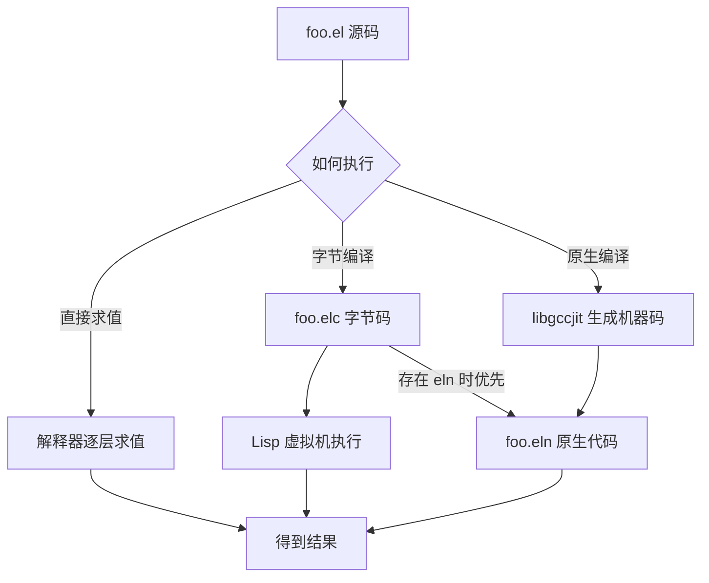
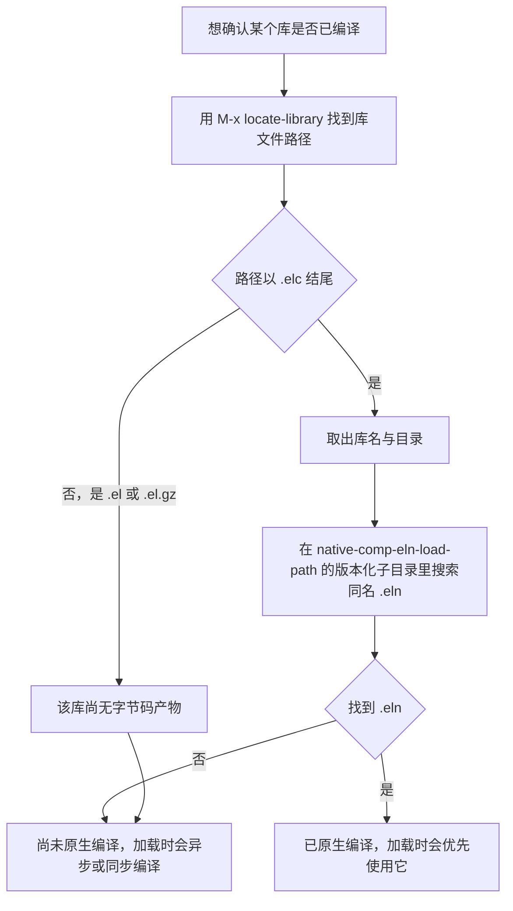

# NativeComp 与字节码

> 同一段 Elisp 可以有三种存在形式：源码、字节码、原生机器码。本篇讲清三者的差别、怎么切换、缓存放在哪里、以及什么时候不该折腾编译。

---

## 一、Elisp 的三种执行形态

### 1.1 解释执行：直接求值 S 表达式

你在 `*scratch*` 里写 `(+ 1 2)` 按下 `C-j`，Emacs 拿到的是一个 Lisp 对象（一个列表），求值器逐个检查它的结构：第一个元素是函数位置还是特殊形式、参数要不要先求值、调用哪个函数。这个过程没有任何编译产物，好处是可以边写边改、`C-x C-e` 立刻看到结果；代价是每次求值都要重新解析结构、重新查找函数定义。

解释执行只有在两种场景下是合理选择：交互式调试，以及那些"一辈子只跑一次的代码"（例如启动时读一次配置文件）。把它用在热路径上（每个按键都要跑几十遍的函数、逐行处理大文件的循环）是性能问题的头号来源。

### 1.2 字节码：`.elc` 文件

字节编译把源码转换成一种针对 Lisp 虚拟机设计的中间表示，存放在 `.elc` 文件里。执行时虚拟机逐条读取这些指令，用栈来传递参数与返回值。相比解释执行，它省掉了"解析结构 + 查函数定义"的重复工作：函数调用变成一条带索引的指令，局部变量访问变成一个确定的栈槽位置。

代价是失去可读性（`.elc` 是二进制，里面既有指令也有被序列化的常量对象），并且引入了"源码与字节码不一致"的一整类问题。

### 1.3 原生代码：`.eln` 文件

原生编译（native compilation，社区常写作 native-comp）把 Elisp 编译成本地机器码，运行时不经过 Lisp 虚拟机逐条解释。它的实现方式是 `libgccjit`：Emacs 把 Lisp 编译成一棵 GCC 能理解的中间表示，交给 `libgccjit` 生成机器码，再包成一个 `.eln` 文件（本质上是一个特殊格式的共享对象）。

要点有三个：

- 它**不是替代**字节码，而是叠加在字节码之上。加载顺序上，Emacs 先找 `.eln`，找不到再退回 `.elc`，两者都没有才用 `.el`。
- 它需要**外部依赖**，也就是 `libgccjit`。没有它，`(native-comp-available-p)` 返回空值，所有原生编译相关的功能静默失效。
- 它**需要缓存**。编译是重活，结果放在 `eln-cache` 里，与 Emacs 版本绑定；升级 Emacs 后旧缓存整体作废。

### 1.4 源码到执行的三条路径



图中最后一条边是实际加载时的优先级规则：同一个库，`.eln` 的优先级高于 `.elc`，`.elc` 又高于 `.el`（前提是时间戳不冲突）。也就是说，给一个库同时准备三种形态是正常状态，Emacs 每层都有后备。

### 1.5 性能量级该怎么谈

这里必须克制。社区里流传的数字（"快 2 到 5 倍""快 10 倍"）来自不同的基准、不同的硬件、不同的代码形态，直接引用会误导人。可以放心陈述的只有三句话：

- 字节码通常显著快于纯解释执行，因为省掉了重复的结构检查与符号查找。
- 原生代码在**数值计算密集、调用层次深、循环次数多**的代码上收益最明显；在"读一个文件、调一次外部程序"这类以 I/O 为主的代码上几乎没有差别。
- 具体到你的机器和你的工作负载，唯一可信的数字是你自己用 `benchmark-run` 测出来的。

一个实测框架，格式可以照抄，数字要自己填：

```elisp
;; 比较解释执行与字节码执行同一段函数
(defun my-busy-loop (n)
  "做 N 次整数累加，用于基准测试。"
  (let ((sum 0))
    (dotimes (i n sum)
      (setq sum (+ sum i)))))

;; 解释执行版本
(benchmark-run 3 (my-busy-loop 1000000))
;; => (耗时 GC次数 GC耗时)，把中间值记下来

;; 字节编译后重新定义，再测一次
(byte-compile 'my-busy-loop)
(benchmark-run 3 (my-busy-loop 1000000))
;; => 与上一组对比，注意三次运行取中位数
```

如果 Emacs 支持原生编译，第三组可以这样测：

```elisp
;; 原生编译这个函数（要求 (native-comp-available-p) 非空）
(native-compile 'my-busy-loop)
(benchmark-run 3 (my-busy-loop 1000000))
```

注意 `benchmark-run` 的第一个返回值包含 GC 时间，所以要看第一个数字与第三个数字的差；两者差距大时，说明测量被 GC 污染了，需要先按 [[emacs教程/7进阶/01_启动加速与性能优化|启动加速与性能优化]] 调整 GC 参数再测。

---

## 二、字节编译

### 2.1 `byte-compile-file` 与批处理编译

交互式做法是在访问 `.el` 文件时执行 `M-x byte-compile-file`，或者用 `M-x emacs-lisp-byte-compile-and-load`（编译后立即加载，写配置时最顺手）。

非交互式做法更适合脚本化，尤其是给配置目录做一次性编译：

```bash
# 编译单个文件
$ emacs -Q --batch -f batch-byte-compile ~/.emacs.d/init.el

# 编译多个文件
$ emacs -Q --batch -f batch-byte-compile ~/.emacs.d/init.el ~/.emacs.d/early-init.el

# 编译整个目录（0 表示"只要 elc 比 el 旧就重编"，最后参数 t 表示不询问）
$ emacs -Q --batch --eval '(byte-recompile-directory (expand-file-name "~/.emacs.d/lisp") 0 t)'
```

`byte-compile-file` 的文档字符串里有两条容易忽略的信息：返回值在无错误时非空、有错误时为 `nil`；如果文件设置了文件局部变量 `no-byte-compile`，它**不会**被编译，已存在的输出文件会被删除，返回值是符号 `no-byte-compile`。最后这条在写脚本判断成功与否时很重要——把返回值当布尔用时，`no-byte-compile` 是真值，但文件并没有被编译。

批量编译有个常见副作用：警告信息会刷满终端。要只看错误不看警告：

```bash
$ emacs -Q --batch -f batch-byte-compile init.el 2>&1 | grep -v '^Warning'
```

### 2.2 为什么要编译配置文件

启动时 Emacs 要按顺序加载你的配置。解释执行几千行 Elisp 的代价并不小：每个 `defun`、`setq`、`use-package` 展开后的形式都要被求值器走一遍。编译之后这些工作大部分在编译期完成（宏展开、常量折叠），启动时只需加载字节码并执行顶层形式。

这篇文档写作时所用的机器上，`~/.emacs.d` 的配置目录编译前后，热启动差距在数百毫秒量级。具体数字取决于配置规模，请用上一篇的测量方法自己得出结论。

三个注意点：

1. **编译 `init.el` 之后，改源码要重新编译**。否则你改了 `.el` 而 Emacs 因为 `.elc` 更新而继续跑旧的。
2. **不要提交 `.elc` 到 Git**。你会在不同 Emacs 版本之间同步配置，字节码格式并非跨版本稳定。
3. **编译目录时小心第三方源码目录**。如果你的 `lisp/` 下混放了你自己改过的第三方包源码，编译它会产生大量你并不想维护的警告。

### 2.3 `.elc` 的加载优先级

规则可以用一句话说清：**加载 `foo` 时，Emacs 在 `load-path` 中依次查找 `foo.elc`、`foo.el`；对 `.elc` 还会检查它的时间戳是否比对应的 `.el` 更旧，更旧就跳过它**。

这条规则由 `load-prefer-newer` 变量调节：它的默认值是 `nil`，此时"`.elc` 存在且不比 `.el` 旧"就用 `.elc`；把它设为 `t`，则只要 `.el` 更新就加载 `.el`。用 `C-h v load-prefer-newer` 阅读你版本上的完整说明。

三个由此衍生的实际问题：

- **改了源码没生效**：先看 `.elc` 的时间戳。跨时区拷贝、从压缩包解压、Git 检出都可能让 `.elc` 显得比 `.el` 新。
- **删了源码但 `.elc` 还在**：Emacs 依然会加载 `.elc`，于是"文件已经不在了但功能还在"。
- **`.el` 与 `.elc` 内容不一致**：如果依赖的宏改了却只重编了一边，运行结果会与源码读起来的样子不符。排除方法是删掉配置目录下所有 `.elc` 重新编译。

### 2.4 编译警告的意义与处理

字节编译警告不是噪音，它经常预示真实的运行时错误。常见几类：

| 警告文本（大意） | 含义 | 处理方向 |
| --- | --- | --- |
| reference to free variable | 引用了未声明的全局变量 | 用 `defvar` 声明，或检查拼写 |
| function not known to be defined | 调用了尚未定义的函数 | 补 `require`，或用 `declare-function` 声明 |
| the function is not known to be defined | 同上，措辞随版本变化 | 同上 |
| unused lexical variable | 词法变量声明了但没用 | 删除或加下划线前缀 |
| docstring wider than 80 characters | 文档字符串过长 | 折行 |
| `lexical-binding` cookie 缺失 | 文件头没有 `-*- lexical-binding: t; -*-` | 补上，否则按动态作用域编译 |

完整的警告解读、`byte-compile-warnings` 的细分控制、以及在 CI 里把警告当错误处理的做法，属于 [[emacs教程/2Elisp语言/11_调试与性能剖析|调试与性能剖析]] 与 [[emacs教程/4插件开发/04_测试打包与发布MELPA|测试打包与发布 MELPA]] 的范围。

### 2.5 `no-byte-compile` 文件局部变量

有些文件编译之后反而出问题：最常见的是依赖动态作用域的老代码，或者"编译期就要读到真实路径"的启动脚本。在文件第一行加一个文件局部变量即可阻止编译：

```elisp
;;; my-legacy-init.el --- 不要编译本文件 -*- no-byte-compile: t; lexical-binding: t; -*-
```

注意语义：`no-byte-compile` 为真时，`byte-compile-file` 不但不编译，还会**删除已存在的输出文件**。这正好解决了"我以为禁用了编译，结果旧的 `.elc` 还在被加载"的问题。

---

## 三、native-comp 的原理与依赖

### 3.1 它到底做了什么

原生编译的入口是 `libgccjit`——GCC 的一个库形态，允许程序在运行期构造中间表示并生成机器码。Emacs 的处理流程是：把 Elisp 编译成字节码，再把这套字节码按基本块转换成 GCC 的中间表示，交给 `libgccjit` 优化并生成目标代码，最后写成一个 `.eln` 文件。

`.eln` 文件与 Emacs 版本严格绑定，因为里面固化了字节码指令与内部数据结构的布局。这就是"升级 Emacs 后缓存全部作废"的原因。

### 3.2 三平台安装依赖

```bash
# Debian 与 Ubuntu：包名带版本号，用 apt search 确认当前可用名称
$ apt search libgccjit
$ sudo apt install libgccjit-14-dev    # 版本号随发行版变化，以搜索结果为准

# Arch Linux
$ sudo pacman -S libgccjit

# Fedora 一类 RPM 发行版通常包名类似 libgccjit-devel，用 dnf search 确认
$ sudo dnf search libgccjit
```

```bash
# macOS（Homebrew）
$ brew install libgccjit
```

Windows 的情况需要诚实说明：Emacs 官方发布的 Windows 构建在其原生编译支持上是有限制的，社区里更常见的做法是使用第三方构建版本。**不要根据本文的描述判断你的 Emacs 是否支持原生编译**，唯一可靠的依据是在你的 Emacs 里求值：

```elisp
(native-comp-available-p)
;; 返回非空列表表示支持；返回 nil 表示不可用
```

如果你的 Emacs 不支持，本节剩下的内容对你只是背景知识；继续使用字节码完全没有问题。

### 3.3 什么时候需要手动装依赖

三种情况值得自己装并重新构建 Emacs：一是发行版自带的 Emacs 构建时没启用原生编译；二是你需要最新的编译器行为；三是你想控制编译选项（`native-comp-speed` 等）。自己构建时，配置阶段要确保 `configure` 找到了 `libgccjit`——如果摘要里没有原生编译相关的行，说明没找到，装完依赖后要重新运行 `configure` 而不是只 `make`。

---

## 四、关键变量与函数

下表是日常会碰到的全部内容。**表中的默认值来自写作时使用的构建（GNU Emacs 31.1），你的版本可能不同，请用 `C-h v` 逐个确认。**

| 名称 | 类型 | 作用 | 备注 |
| --- | --- | --- | --- |
| `native-comp-available-p` | 函数 | 判断当前构建是否支持原生编译 | 返回非空表示支持 |
| `native-comp-jit-compilation` | 变量 | 非空时，异步原生编译"被加载的 `.elc` 文件" | 文档字符串明确写着"loaded .elc files" |
| `native-comp-deferred-compilation` | 变量 | 文档字符串与上一项完全相同 | 历史上曾是更早的变量名，两者关系随版本变化 |
| `native-comp-speed` | 变量 | 优化级别，取值 -1 到 3 | 默认 2；3 会做危险优化 |
| `native-comp-debug` | 变量 | 调试级别 0 到 3 | 面向编译器自身的调试 |
| `native-comp-eln-load-path` | 变量 | 查找 `.eln` 的目录列表 | 实际查找的是其中版本化子目录 |
| `native-comp-async-jobs-number` | 变量 | 异步编译的并行进程数 | 0 表示用一半 CPU 执行单元，只有一个时用 1 |
| `native-comp-async-report-warnings-errors` | 变量 | 是否报告异步编译的警告与错误 | 设为 `nil` 完全抑制，设为符号 `silent` 只记录不弹 `*Warnings*` |
| `native-comp-always-compile` | 变量 | 非空时无条件重新编译所有文件 | 排查"缓存是否过期"时临时开启 |
| `native-comp-async-query-on-exit` | 变量 | 退出时是否询问正在进行的异步编译 | 为 `nil` 时静默终止 |
| `native-comp-warning-on-missing-source` | 变量 | 加载字节码却找不到对应源码时是否警告 | 源码文件是查找 `.eln` 与延迟编译所必需的 |
| `native-compile` | 函数 | 同步编译入口 | 参数可以是函数符号、形式、或文件名 |
| `emacs-lisp-native-compile-and-load` | 命令 | 同步原生编译当前缓冲区的文件并加载 | 其文档建议：把它与 `native-comp-jit-compilation` 搭配可实现异步编译 |
| `native-compile-async` | 函数 | 异步编译入口 | 批量处理用 |

### 4.1 关于 `native-comp-jit-compilation` 与 `comp-deferred-compilation`

这是最容易写错的一处历史变迁，必须谨慎。可以确认的事实是：

- 早期版本（Emacs 28 前后）的机制叫**延迟编译**，对应的变量名是 `comp-deferred-compilation`，它在库被加载时才把编译任务排队。
- 后来机制改名为"即时编译（jit）"，变量名也变成 `native-comp-jit-compilation`。在这篇文章所用的 Emacs 31.1 上，`comp-deferred-compilation` 这个符号**不存在**，而 `native-comp-jit-compilation` 与 `native-comp-deferred-compilation` 都存在。
- 不同发行版打包的 Emacs 可能处于不同阶段，变量是否存在、是否存在废弃别名，都会不同。

所以在配置里写这两个变量之前，**先在你的 Emacs 里确认**：

```elisp
;; 逐个确认符号是否存在；返回 nil 表示这个符号在你的版本里没有定义
(boundp 'native-comp-jit-compilation)
(boundp 'comp-deferred-compilation)
(boundp 'native-comp-deferred-compilation)
```

只在确认存在之后才赋值，例如：

```elisp
;; 只在符号存在时设置，避免在不支持的构建上报错
(when (boundp 'native-comp-jit-compilation)
  (setq native-comp-jit-compilation t))
```

这段 `when` 看起来啰嗦，但它是跨版本配置的标准写法：**用 `boundp` 或 `fboundp` 保护版本相关的设置**，比到处写 `if (version< emacs-version "29")` 更可靠，因为它问的是"这个能力在不在"，而不是"版本号是多少"。

---

## 五、编译缓存的存放与清理

### 5.1 `eln-cache` 的位置与结构

`native-comp-eln-load-path` 的文档字符串说明：它是一个目录列表，`.eln` 文件实际存放在每个目录下**与版本相关的子目录**里，子目录名由 `comp-native-version-dir` 决定；列表最后一项被视为存放 Emacs 构建时生成的系统 `.eln` 文件的目录。

在这台机器上，两者的实际值是：

```text
native-comp-eln-load-path
  => ("/home/a/.emacs.d/eln-cache/" "/usr/lib/emacs/31.1/native-lisp/")

comp-native-version-dir
  => "31.1-fff6fc40"
```

于是用户缓存的实际位置是 `~/.emacs.d/eln-cache/31.1-fff6fc40/`，系统库的编译产物在 `/usr/lib/emacs/31.1/native-lisp/` 下。查看内容：

```bash
$ ls ~/.emacs.d/eln-cache/
31.1-fff6fc40

$ ls ~/.emacs.d/eln-cache/31.1-fff6fc40/ | head -5
cl-seq-f464c4e2-2e568bb4.eln
evil-commands-1eeaf7b6-45a1da45.eln
evil-command-window-ff21973c-f2e668ed.eln
evil-common-cba9616e-da7a143f.eln
evil-core-1664e556-ceac6008.eln

$ du -sh ~/.emacs.d/eln-cache
2.5M    /home/a/.emacs.d/eln-cache
```

文件名规律是 `库名-<摘要1>-<摘要2>.eln`，两段十六进制摘要是为了区分同名库的不同来源与不同编译参数。两个易错点：

- **目录名里的版本标识不只是版本号**，还包含一个构建指纹（示例中的 `fff6fc40`）。所以"重新编译同一版本但不同的构建"也会产生新目录。
- **`eln-cache` 下可能有多个版本目录**，那是你升级过 Emacs 留下的。旧目录不会被自动删除，可以安全清理。

### 5.2 升级 Emacs 后为什么会失效，怎么清理

`.eln` 与 Emacs 的字节码指令集、内部类型布局强绑定。升级 Emacs 之后，新版本到版本化子目录里找 `.eln`，找不到就退回 `.elc` 并重新编译——所以你并不会遇到"功能坏了"，而是遇到"升级后第一次用什么都慢，CPU 还一直响"。

清理旧缓存：

```bash
# 看看有几个版本目录、各占多大
$ du -sh ~/.emacs.d/eln-cache/*

# 只保留当前版本（先用 M-x emacs-version 或 emacs --version 确认版本号）
$ rm -rf ~/.emacs.d/eln-cache/30.1-xxxxxxxx

# 或者整体删除，让 Emacs 重新生成——代价是接下来一段时间编译较忙
$ rm -rf ~/.emacs.d/eln-cache
```

Windows 上的等价操作：

```powershell
PS> Get-ChildItem "$env:APPDATA\.emacs.d\eln-cache" -Directory |
      ForEach-Object { "{0}`t{1:N1} MB" -f $_.Name,
        ((Get-ChildItem $_.FullName -Recurse -File | Measure-Object Length -Sum).Sum / 1MB) }
```

整体删除是安全的：Emacs 会在需要时重新编译，只影响时间不影响正确性。

### 5.3 判断某个包是否已被编译



对应的操作命令：

```elisp
;; 找到库文件的实际路径
(locate-library "magit")
;; 也可以在 *scratch* 里求值，或用 M-x locate-library 交互调用
```

```bash
# 在用户缓存里按库名搜索编译产物
$ ls ~/.emacs.d/eln-cache/*/ | grep '^magit'
```

如果目标只是"让这个包立刻编译好"，直接在它的缓冲区里执行 `M-x emacs-lisp-native-compile-and-load`，或者用函数入口：

```elisp
;; 同步编译一个已安装包的主文件（路径按实际情况替换）
(native-compile (locate-library "magit"))
```

`native-compile` 的参数可以是文件名，也可以是函数符号或形式；返回编译成功的产物名或编译后的函数对象。这是排查"某个包始终编译失败"时最方便的入口，因为同步调用会把错误直接报在当前 buffer 里，而不是丢进异步的 `*Warnings*`。

---

## 六、异步编译带来的问题

异步编译的设计目标是不阻塞你，但它有三个可感知的副作用。

**第一，启动变慢与 CPU 占用。** 首次加载某个包时会排队编译，编译是纯 CPU 活。低配笔记本上的表现是：打开 Emacs 后风扇转起来、输入有轻微延迟、`*Messages*` 里滚动出现编译消息。这属于一次性成本，编译完就结束。

控制并行度：

```elisp
;; 限制并行编译进程数，降低对交互的干扰
;; 默认值 0 表示"用一半 CPU 执行单元"，核心多的机器上可以适当调小
(setq native-comp-async-jobs-number 2)
```

用 `C-h v native-comp-async-jobs-number` 阅读你版本上的说明与当前值——文档明确了 0 的含义是"一半 CPU 执行单元，只有一个执行单元时用 1"。

**第二，编译警告弹窗。** 异步编译的问题在于它从一个干净环境启动，缺少你当前会话里已经加载的那些 `require`，因此可能报出字节编译时不会出现的警告（这个解释直接来自 `native-comp-async-report-warnings-errors` 的文档字符串）。它会弹出 `*Warnings*` 缓冲区。

```elisp
;; 完全抑制
(setq native-comp-async-report-warnings-errors nil)

;; 只记录不弹窗（把值设为符号 silent）
(setq native-comp-async-report-warnings-errors 'silent)

;; 只想让重要警告弹出来，可以看这个变量
;; native-comp-async-warnings-errors-kind 的取值含义用 C-h v 确认
```

抑制弹窗的代价是：某些包确实因为缺少 `require` 而编译失败，你会看不到。折中做法是保留 `'silent`，需要排错时再去 `*Messages*` 里翻。

**第三，低配机器与移动设备上的代价。** 编译期间 CPU 满载意味着更高的温度与更快的电池消耗。Emacs 里有一个与电池相关的开关，在你版本上是否存在、默认值是什么，请用 `C-h v native-comp-async-on-battery` 确认（在这篇文章所用的 31.1 上它存在且默认值为 `nil`）。稳妥的替代方案是直接关掉异步编译：

```elisp
;; 方案一：关掉加载时的异步编译，全部改成手工编译
(setq native-comp-jit-compilation nil)

;; 方案二：安装包时同步编译好，加载时就不用再编
(setq package-native-compile t)

;; 方案三（推荐给低配机器）：保留异步编译，但把并行度压到 1
(setq native-comp-async-jobs-number 1)
```

方案二用的是 `package-native-compile`，它的文档字符串说明：非空表示在**安装包时**就做提前编译；如果为 `nil`，包会在**第一次被加载时**才编译。这个开关在 Emacs 未启用原生编译时没有任何效果。

---

## 七、是否值得开启的判断表

| 使用场景 | 硬件 | 建议 | 理由 |
| --- | --- | --- | --- |
| 日常写代码、经常跑大项目 | 现代多核 CPU、16GB 以上内存 | 开启，保留默认并行度 | 热路径收益明显，一次编译长期受益 |
| 日常写代码 | 老款双核笔记本 | 开启，但把并行度设为 1 或 2 | 避免编译抢占交互所需的 CPU |
| 主要在终端里用 daemon | 服务器 | 开启，装包时同步编译 | 服务器通常常驻，编译成本被摊薄 |
| 频繁切换 Emacs 版本或频繁重装 | 任意 | 谨慎开启 | 每次升级都要重编，缓存反复作废 |
| 用官方 Windows 构建且 `native-comp-available-p` 返回空值 | 任意 | 不涉及 | 构建本身不支持，讨论无意义 |
| 配置经常大改、常驻调试 | 任意 | 可以关闭异步编译 | 减少变量，排查时更清爽 |
| 笔记本以省电为第一优先 | 任意 | 关闭或大幅限制并行度 | 编译满载会显著增加功耗与温度 |

判断顺序建议固定为三步：先确认 `(native-comp-available-p)`；再看自己是否经常升级 Emacs；最后才考虑并行度这类细节。跳过前两步直接调参数，是浪费时间的最常见形式。

---

## 八、与包管理的配合

### 8.1 `package.el` 的自动原生编译

`package-native-compile` 控制安装时编译（见上一节的说明）。需要注意的是它的作用点：为 `t` 时"装完就编"，为 `nil` 时"第一次加载时编"。前者把成本放在你明确等待的安装阶段，后者把成本放在你正在工作的时刻。对多数人来说前者体验更好。

### 8.2 straight.el 与 elpaca

这两个包管理器都自己管理源码目录与字节编译。`straight.el` 在构建包时会执行字节编译，并支持在构建时一并做原生编译；`elpaca` 采用异步构建队列，编译行为可以在其配置里控制。**具体的变量名与默认行为随版本变化很快**，请查阅各自的文档，不要照搬本文或他人配置里的变量名——用 `C-h v` 与包自带的手册确认。

一条通用建议：无论用哪个包管理器，都要保证"源码目录不被 Emacs 的垃圾回收策略误伤"。具体来说，不要把 `straight/` 或 `elpaca/` 的构建目录放进 `package-user-dir`，也不要手工在其中创建 `.elc`，否则包管理器可能因为校验失败而重新克隆整个仓库。

### 8.3 手工编译单个已安装的包

当某个包的原生编译反复失败时，手动走一遍可以在当前缓冲区看到完整错误：

```elisp
;; 找到包的入口文件
(locate-library "some-package")

;; 同步原生编译它；失败时的错误信息会直接显示出来
(native-compile (locate-library "some-package"))

;; 如果只想先做字节编译，验证源码本身没问题
(byte-compile-file (locate-library "some-package"))
```

### 8.4 让失败的产物重新编译

原生编译失败后，Emacs 可能已经记录了"尝试过"，短期内不会自动重试。强制重来的步骤：

```elisp
;; 一、临时打开"无条件重新编译"，让所有文件重编一遍
(setq native-comp-always-compile t)
;; 处理完之后记得改回去，否则每次启动都在重编

;; 二、或者直接删除这个包的 .eln 产物（先确认缓存目录位置）
;;    用变量取路径比硬编码更稳
(concat (car native-comp-eln-load-path) comp-native-version-dir "/")
```

```bash
# 三、删掉单一编译产物，然后重启 Emacs 触发重新编译
$ rm ~/.emacs.d/eln-cache/31.1-*/some-package-*.eln
```

最后的手段是删掉整个版本目录（见 5.2 节）。请养成一个习惯：**在动手删除缓存之前，先确认当前版本目录名**（`comp-native-version-dir` 的值），避免删掉正在使用的目录之外的东西。

---

## 九、字节码的阅读与反汇编

### 9.1 `M-x disassemble`

`disassemble` 的文档字符串说明：它把 OBJECT 的反汇编结果打印到缓冲区；OBJECT 可以是用作函数定义的符号，也可以是函数本身（lambda 表达式或字节码函数对象）；**如果 OBJECT 还没有编译，它会先编译，但不会因此重新定义符号**。这最后一句很关键：对符号调用 `disassemble` 得到的是"如果编译会是什么样"，而不是替换掉当前定义。

下面的输出是把这篇文章所用机器上的真实结果照抄下来的：

```elisp
;; 输入
(defun my-square (x)
  "返回 X 的平方。"
  (* x x))
(disassemble (byte-compile 'my-square))
```

```text
byte code:
  doc:  返回 X 的平方。 ...
  args: (arg1)
0	dup
1	stack-ref 1
2	mult
3	return
```

再看一个涉及常量的例子：

```elisp
(defun my-greet (name)
  (concat "hello, " name))
(disassemble (byte-compile 'my-greet))
```

```text
byte code:
  doc:   ...
  args: (arg1)
0	constant  "hello, "
1	stack-ref 1
2	concat2
3	return
```

### 9.2 读懂字节码的基本词汇

理解四个概念，就足以看懂大多数函数的反汇编：

- **栈（stack）**：字节码执行靠一个求值栈传参。`stack-ref n` 表示把栈上从顶部数第 n 个元素压入栈顶，`stack-set n` 是弹出栈顶并写回第 n 个位置。
- **常量（constant）**：`constant` 指令把常量表里的某个对象压栈。常量表在 `.elc` 文件中序列化保存，所以字符串、整数、引用列表都不需要每次重新构造。
- **调用（call）**：`concat2`、`mult` 这类是内联的特化指令（分别是"连接两个字符串"与"整数乘法"），比通用调用快；参数个数不定时才会用通用的 `call`，此时参数个数紧随其后。
- **跳转（jump）**：`goto`、`goto-if-nil`、`goto-if-not-nil` 系列实现条件与循环。反汇编里出现 `goto-if-nil-else-pop` 之类的长名字很正常，它把"判断 + 跳转 + 弹栈"合并成一条指令。

回到 `my-square` 的例子：`dup` 复制栈顶（参数 x），`stack-ref 1` 再取一次 x，`mult` 把两个整数相乘，`return` 返回栈顶。四个指令对应 `(* x x)`，没有任何函数查找开销——这就是字节码相对解释执行的收益来源。

反汇编在实际工作中的用途有三个：确认宏展开后的真实形态（宏写错了会在这里露馅）、验证编译器的优化是否生效、以及在怀疑"某处的函数调用没有内联"时看个究竟。它不是日常工具。

### 9.3 反编译 `.elc` 的局限与合法性说明

`.elc` 不是加密格式，把字节码还原成等价源码在技术上是有工具与方法的，但要注意两点。

第一，**还原结果通常不是原始源码**。变量名与局部结构会丢失（词法变量被编译成栈槽号），文档字符串以外的注释全部消失，宏展开后的形式不会再被还原为宏调用。你能得到的是"行为等价但读起来不像人写的"代码。

第二，**版权与许可证问题**。多数 Emacs 包采用 GPL 系列许可证，其条款要求分发衍生作品时保持同样的许可并附上源码——这正是"自由软件"的核心设计。因此你**通常不需要**反编译：源码本就应该可获得。如果某个包只给了 `.elc` 不给源码，首先要做的是判断它的许可是否合规，而不是反编译它。把它当作阅读辅助工具（比如确认某个函数在某个分支下到底做了什么），不要当作绕过许可证的手段。

---

## 十、优化实践

### 10.1 该优化的对象

值得花时间编译或改写的代码有明确特征：

- **热路径函数**：每次按键、每次移动光标、每行文本都会调用的函数。
- **循环体内部**：`dotimes`、`while`、`mapc` 里被反复调用的辅助函数。
- **被 `while-no-input` 或空闲定时器反复触发的逻辑**：例如语法高亮、行内诊断的刷新。
- **大数据结构上的重复查找**：在循环里反复对列表做 `member`、对 alist 做 `assoc`，改成哈希表收益远大于编译。

最后这条特别值得强调：**算法层面的修改往往比编译带来的收益大一个数量级**。把 O(n²) 的写法改成 O(n)，比把这门语言编译成机器码更管用。

### 10.2 不该优化的对象

- **只跑一次的启动代码**：把 `init.el` 里的 `setq` 改成某种"更快的写法"，收益在毫秒级，不值一提。
- **交互式命令的门面部分**：用户按一次键执行一次的函数，慢 1 毫秒无感。
- **`message` 字符串拼接、日志格式化**：这些耗时在输出环节，不在计算环节。
- **没能测量出差异的地方**：凭直觉优化，等于在随机位置改代码。

### 10.3 用基准而不是感觉来验证

一个可用的验证流程：

```elisp
;; 一、写一个能稳定复现被测行为的函数
(defun my-bench-target ()
  "被测目标：模拟一次常见的列表查找。"
  (let ((lst (number-sequence 1 5000)))
    (dotimes (_ 200)
      (member 4999 lst))))

;; 二、解释执行下测三次
(benchmark-run 3 (my-bench-target))

;; 三、编译后测三次，对比中间值
(byte-compile 'my-bench-target)
(benchmark-run 3 (my-bench-target))
```

三条纪律：**同一个 Emacs 会话内对比**（避免加载环境差异）、**每个版本至少三次取中间值**、**把结果记录下来**。没有记录的基准等于没有做过。

对 GC 敏感的代码，`benchmark-run` 返回的第三个值（GC 耗时）必须一起看。如果它占第一个值的三成以上，说明这次测量主要在测 GC，需要按 [[emacs教程/7进阶/01_启动加速与性能优化|启动加速与性能优化]] 第三节的方法先把 GC 参数稳定下来。

---

## 十一、常见问题排查表

| 现象 | 原因 | 解决 |
| --- | --- | --- |
| `(native-comp-available-p)` 返回空值 | 构建时未启用原生编译，或缺少 `libgccjit` | 确认构建选项；安装 `libgccjit` 后重新构建 Emacs |
| 编译时报找不到 libgccjit 的符号或头文件 | 只装了运行库没装开发包，或 `configure` 时未找到 | 安装带 `-dev` 或 `-devel` 后缀的包，重新执行 `configure` 与构建 |
| 升级 Emacs 后启动明显变慢、CPU 长时间满载 | 新版本目录没有缓存，所有包都要重新编译 | 属于预期行为；等编译完成，或按 5.2 节清理旧版本缓存释放空间 |
| 同一个包有时候快有时候慢 | 一次跑 `.eln`（已编译），一次回退到 `.elc`（未编译） | 检查缓存里是否有对应 `.eln`；用 `native-comp-always-compile` 临时强制重编 |
| `Warning: Error while compiling` 反复出现 | 该包缺少 `require`，异步编译在干净环境里失败 | 直接对那个文件执行 `native-compile` 看完整错误；必要时向包作者反馈 |
| 每次启动都弹 `*Warnings*` 缓冲区 | 异步编译报告的警告与错误 | 设 `native-comp-async-report-warnings-errors` 为 `'silent` 或 `nil` |
| 改了源码但行为没变 | `.elc` 比 `.el` 新，或 `.eln` 缓存未失效 | 删除对应 `.elc` 与 `.eln`；排查时间戳；临时用 `native-comp-always-compile` |
| `.elc` 与 `.el` 行为不一致 | 依赖的宏改动后只重编了一边 | 删除配置目录下所有 `.elc` 后重新编译 |
| 低配机器上编译期间几乎无法使用 | 并行编译进程太多 | `native-comp-async-jobs-number` 设为 1 或 2 |
| 退出 Emacs 时被询问是否结束编译 | `native-comp-async-query-on-exit` 非空 | 按需设为 `nil` 静默结束，或等待编译完成再退出 |
| 加载字节码时提示找不到源码 | 只发布了 `.elc` 没有 `.el` | 源码文件是原生编译与查找 `.eln` 的前提；尽量保留源码 |
| 字节编译输出一堆警告看不出重点 | 警告里混入了大量风格类提示 | 用 `byte-compile-warnings` 细分控制，或先只看 `Error` 行 |

---

## 小结

- 三种执行形态各有位置：解释执行用于交互调试，字节码是默认形态，原生代码用于热路径；给同一个库同时准备三种形态是正常状态。
- 原生编译依赖 `libgccjit`，产物是与 Emacs 版本绑定的 `.eln` 缓存，放在 `native-comp-eln-load-path` 的版本化子目录下；升级后重新编译是预期行为。
- 版本相关的变量（尤其是 `native-comp-jit-compilation` 与 `comp-deferred-compilation` 的历史关系）一律用 `boundp` 保护并配合 `C-h v` 确认，不要凭记忆写死。

---

## 相关章节

- [[emacs教程/7进阶/01_启动加速与性能优化|启动加速与性能优化]]
- [[emacs教程/7进阶/04_常见故障排查|常见故障排查]]
- [[emacs教程/2Elisp语言/11_调试与性能剖析|调试与性能剖析]]
- [[emacs教程/2Elisp语言/10_包与命名空间实践|包与命名空间实践]]
- [[emacs教程/4插件开发/04_测试打包与发布MELPA|测试打包与发布 MELPA]]
- [[emacs教程/1入门/04_包管理与use-package|包管理与 use-package]]

---

## 参考

- Elisp 参考手册（字节编译与原生编译的权威章节）https://www.gnu.org/software/emacs/manual/html_node/elisp/
- Elisp 参考手册单页版（便于全文检索 `native-comp` 与 `byte-compile`）https://www.gnu.org/software/emacs/manual/html_mono/elisp.html
- GNU Emacs 手册（安装与包管理章节）https://www.gnu.org/software/emacs/manual/html_node/emacs/
- Emacs 源码镜像（`comp.el`、`comp-run.el`、`bytecomp.el` 的实现）https://github.com/emacs-mirror/emacs
- GNU ELPA https://elpa.gnu.org/ ／ NonGNU ELPA https://elpa.nongnu.org/ ／ MELPA https://melpa.org/
- Eldev（包开发与批量编译的工具链）https://github.com/emacs-eldev/eldev
- Sacha Chua 周报（原生编译相关的实践讨论经常出现在这里）https://sachachua.com/blog/
