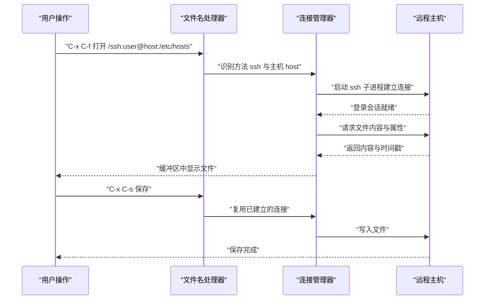
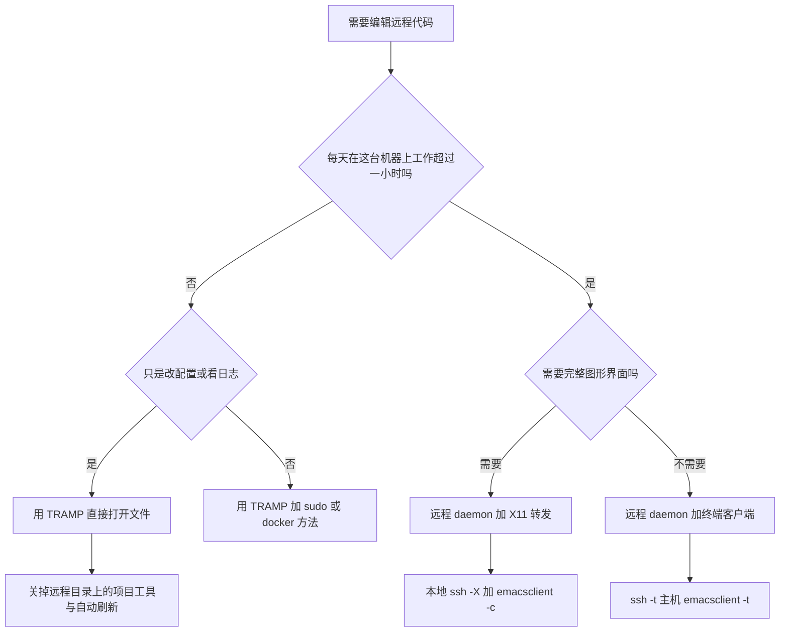

# TRAMP 远程开发

> TRAMP 让 Emacs 用本地文件的方式打开远程文件与特权文件。它把"改一台服务器上的配置"从"登录、开 vim、退出"变成"`C-x C-f`、改、`C-x C-s`"。本篇讲清它的语法、它为什么慢、以及三种远程开发方案该怎么选。

---

## 一、TRAMP 是什么，解决什么问题

### 1.1 定义

TRAMP 是 "Transparent Remote Access, Multiple Protocol" 的缩写，它是 Emacs 内置的一个子系统，核心能力是**透明地访问远程文件**：你在 `C-x C-f` 的提示里输入一个特殊格式的路径，之后就可以用与编辑本地文件完全相同的方式编辑它——包括 `C-s` 搜索、`M-%` 替换、`M-x` 调用命令、dired 浏览目录、`M-x compile` 编译。

"透明"这个词是关键。TRAMP 不是"把远程文件下载下来编辑再上传"的独立功能，而是**接入了 Emacs 的文件 I/O 层**：所有走文件名的操作（保存、查询属性、列目录、改权限）都会经过 TRAMP 的处理器，转发到远程。这意味着 Emacs 里几乎任何功能都能操作远程文件，包括你自己写的 Elisp——这是它比"用 scp 传文件"强得多的原因，也是它比"用 SSH 终端"更危险的原因（一个遍历项目文件的命令可能触发成千上万次远程调用）。

它同时解决第二类问题：**特权文件**。`/sudo::/etc/hosts` 让你用当前 Emacs 会话、当前配置去编辑 `/etc/hosts`，保存时自动提权，不需要在终端里用 `sudo vim`。这一点在日常运维中极其省事。

### 1.2 它是怎么工作的

TRAMP 的分层是：文件名处理器负责识别路径、连接管理器负责维护连接、方法（method）定义"用什么程序、什么参数"去建立连接。用 `C-h v tramp-methods` 可以看到所有内置方法的定义。



图里最重要的一点是"复用已建立的连接"：TRAMP 会为每个"方法 + 用户 + 主机"组合维持一个连接，后续操作都走这个连接。连接建立是慢的，此后每个操作仍然是一次往返——这就是下一节要讲的性能模型。

### 1.3 版本与"内置"的关系

Emacs 内置一份 TRAMP，版本号与 Emacs 版本绑定（在这篇文章所用的 Emacs 31.1 上，`tramp-version` 的值是 `2.8.2.31.1`）。三个含义：

- **不要另外安装 TRAMP**。GNU ELPA 上确实有一个独立的 TRAMP 包，但那是给老版本 Emacs 用户升级用的；在 Emacs 30 与 31 上，内置版本通常更新，装包会带来两个版本互相覆盖的麻烦。
- **不同 Emacs 版本的 TRAMP 行为有差异**。变量名会在版本间变化（下一节会给出一个具体例子），配置里使用较新的变量名之前，请用 `C-h v` 确认它存在。
- **报 bug 时要说明 TRAMP 版本**。用 `C-h v tramp-version` 取值，这比只说"我的 Emacs 是 30"信息量大得多。

---

## 二、连接语法全表

### 2.1 语法结构

默认语法（`tramp-syntax` 的值为符号 `default`）的结构是：

```text
/method:user@host:localname
```

四段都可以按情况省略，但**方法段的冒号与主机后的冒号必须存在**。几个占位规则：

- 省略 `user` 时使用当前本地用户名，或者由 `~/.ssh/config` 里的 `User` 决定。
- 省略 `host` 时，使用 `tramp-default-host` 的值（用 `C-h v tramp-default-host` 查看你机器上的值，它因发行版而异）。
- `localname` 是远程主机上的路径，必须以 `/` 开头。

### 2.2 常用方法一览

下表是在 Emacs 31.1 上从 `tramp-methods` 实际取出的方法名与真实示例。示例都通过了语法解析验证。

| 方法 | 示例 | 用途与说明 |
| --- | --- | --- |
| `ssh` | `/ssh:user@host:/etc/hosts` | 最常用。通过 ssh 建立连接，复用一条会话执行所有操作 |
| `sshx` | `/sshx:user@host:/tmp` | 与 `ssh` 类似，但用 `-t -t` 与远程命令方式建立会话，适合需要伪终端或 shell 受限的场景 |
| `scp` | `/scp:user@host:/var/log/syslog` | 以 scp 传文件。注意 `tramp-default-method` 的出厂默认值就是它 |
| `sftp` | `/sftp:user@host:/srv/data` | 走 sftp 协议，适合只开放 sftp 的受限主机 |
| `rsync` | `/rsync:user@host:/srv/site` | 用 rsync 传输，同步大量文件时效率更好 |
| `sudo` | `/sudo::/etc/hosts` | 本地提权编辑。省略用户时以 root 身份操作 |
| `sudo` 指定用户 | `/sudo:someuser@localhost:/home/someuser/x` | 切换到指定用户 |
| `doas` | `/doas::/etc/hosts` | 使用 doas 而非 sudo 的系统（部分 BSD 与 Alpine） |
| `su` | `/su:root@localhost:/etc/fstab` | 老式提权方式 |
| `docker` | `/docker:容器ID或名称:/root` | 直接编辑容器内的文件 |
| `dockercp` | `/dockercp:容器名:/tmp/x` | 以 docker cp 方式传输 |
| `podman` | `/podman:容器名:/etc/nginx/nginx.conf` | Podman 容器 |
| `podmancp` | `/podmancp:容器名:/tmp/x` | Podman 的拷贝方式 |
| `kubernetes` | `/kubernetes:pod名称:/etc/config` | 通过 `kubectl exec` 进入 Pod |
| `rclone` | `/rclone:remote:/path` | 通过 rclone 访问云存储，需要本机已配置 rclone |
| `plink` | `/plink:user@host:/path` | Windows 上用 PuTTY 的 plink 作为传输程序 |
| `pscp` | `/pscp:user@host:C:/temp` | Windows 上用 pscp |
| `plinkx` | `/plinkx:会话名:/path` | 使用 PuTTY 已保存的会话配置 |
| `adb` | `/adb:设备:/sdcard` | 通过 adb 访问 Android 设备 |
| `ftp` `sftp` `dav` `davs` `smb` `afp` `mtp` `gdrive` `nextcloud` | `/davs:user@host:/remote.php/dav/files/user` | 各自协议；多数需要外部程序或额外配置 |

`fs` 与 `smb` 一类方法在不同版本上的可用性与参数名称有差异，使用前请用 `C-h v tramp-methods` 查你版本上的定义。

### 2.3 关于简写：一个必须纠正的常见说法

网上大量教程会告诉你"可以简写成 `/host:/path`"。**在默认语法下这是错的**。用下面的方式可以自己验证：

```elisp
;; 在 *scratch* 里求值，看能否被解析
(tramp-dissect-file-name "/ssh:user@host:/tmp/x")
;; => 解析成功，返回一个 tramp-file-name 结构

(tramp-dissect-file-name "/host:/tmp/x")
;; Error: Not a Tramp file name: "/host:/tmp/x"
```

第二种写法只在 `tramp-syntax` 为 `simplified`（即 Ange-FTP 风格的旧语法）时才有效，而这个语法在新版本里属于遗留支持，不建议新配置使用。判断依据是 `C-h v tramp-syntax`，它的文档字符串明确写着"不要用 `setq` 修改它，只能通过 Customize 修改"。

**结论：永远写全 `/method:user@host:/path`。** 多打几个字符，换来的是在任何版本、任何机器上都能工作的路径。

### 2.4 多跳连接

TRAMP 支持用竖线 `|` 串联多个跳板。解析结果里，前置部分会记在 hop 字段中：

```elisp
(tramp-dissect-file-name "/ssh:hop1|ssh:hop2:/tmp/x")
;; => method=ssh host=hop2 hop="ssh:hop1|"
```

实用写法：

```text
/ssh:跳板机|ssh:目标机:/var/log/app.log      先登录跳板机，再登录目标机
/ssh:跳板机|sudo:目标机:/etc/nginx/nginx.conf  先登录跳板机，再在目标机上提权
/ssh:跳板机|docker:容器名:/root              先登录跳板机，再进入它上面的容器
```

多跳的代价是每条链路都有自己的连接建立成本，且中间任何一跳断开都会导致后续操作失败（表现为操作卡住直到超时）。配置 `~/.ssh/config` 里的 `ProxyJump` 往往是更好的选择，因为它把跳转逻辑交给 ssh 自己处理，TRAMP 只看到一条普通的 ssh 连接。

### 2.5 用 `tramp-dissect-file-name` 自检

这是排查路径问题最快的工具。任何"路径看起来对但打不开"的场合，先解析一下：

```elisp
;; 结构正确吗
(tramp-dissect-file-name "/ssh:deploy@192.0.2.10:/srv/app")

;; 这是不是一个远程路径
(file-remote-p "/ssh:deploy@192.0.2.10:/srv/app")        ; => "/ssh:deploy@192.0.2.10:"
(file-remote-p "/ssh:deploy@192.0.2.10:/srv/app" 'method) ; => "ssh"
(file-remote-p "/ssh:deploy@192.0.2.10:/srv/app" 'host)   ; => "192.0.2.10"
```

第二个函数在写配置时特别有用：你可以用它判断当前缓冲区是不是远程文件，从而关掉那些在远程会拖慢体验的功能（见下一节）。

---

## 三、性能是第一要务

### 3.1 慢的根本原因

TRAMP 的性能模型可以用一句话概括：**每一次文件操作都是一次（或多次）远程调用，而远程调用的成本是本地的几个数量级。**

具体来说，Emacs 里很多看起来是"一次"的操作，实际上是几十上百次文件属性查询：

- 打开一个文件时，Emacs 会查询它是否存在、是否为目录、大小、修改时间、是否可写、是否有备份文件、是否有自动保存文件、文件末尾换行情况……
- 打开一个目录（dired）时，会对目录里每个条目做属性查询。
- 保存时，会先检查修改时间是否变化、是否需要比较内容、是否要生成备份。
- 语法高亮、缩进、项目工具在打开文件时可能额外读取其他文件（例如找 `.gitignore`、`package.json`、`.editorconfig`）。

这些查询在本地是微秒级，在远程是"一次往返 + 一次远程命令执行"，通常是数十毫秒级。乘以几百次，就是"打开一个文件要等十秒"。

### 3.2 连接复用：正确做法与常见误解

ssh 的连接复用（connection sharing）通过 `ControlMaster` 与 `ControlPath` 实现：第一条连接建立后，后续连接复用同一条 TCP 与认证会话，省掉握手与认证时间。

社区教程的常见说法是"在 `~/.ssh/config` 里加上 ControlMaster 配置"。这句话本身没错，但**在 Emacs 上需要额外注意一件事**：TRAMP 默认会自己往 ssh 命令里加连接共享选项。

在这篇文章所用的版本上：

```elisp
tramp-use-connection-share          ; 默认值 t
tramp-use-ssh-controlmaster-options ; 默认值 t（较早的变量名）
```

`tramp-use-connection-share` 的文档字符串说得很清楚：设为 `t` 时 TRAMP 会自己应用相应的选项（对 ssh 是 `tramp-ssh-controlmaster-options`，对 PuTTY 是 `-share`）；**如果你在 ssh 配置里使用了 `Control*` 或 `Proxy*` 选项，应该把它设为 `nil`**；设为符号 `suppress` 则会忽略 `~/.ssh/config` 或 PuTTY 会话里的相关设置。

于是有两种互斥的配置路线，选一种即可：

**路线一：交给 TRAMP 自己管（保持默认）。** 什么都不用做，TRAMP 会按它检测到的 ssh 版本选择合适参数。适合"我不想去管 ssh 配置"的用户。

**路线二：自己写 `~/.ssh/config`，并把 TRAMP 的自动行为关掉。**

```ssh-config
# ~/.ssh/config
Host *
    # 复用一条连接，60 秒内没有新连接复用就关闭
    ControlMaster auto
    ControlPath ~/.ssh/cm-%r@%h:%p
    ControlPersist 60s
    # 每 30 秒发一次保活，避免空闲连接被中间设备断开
    ServerAliveInterval 30
    ServerAliveCountMax 3

Host app-prod
    HostName 192.0.2.10
    User deploy
    Port 22
    IdentityFile ~/.ssh/id_ed25519
    # 通过跳板机访问
    ProxyJump bastion.example.com
```

```elisp
;; 用了上面的 ssh 配置，就要关掉 TRAMP 的自动连接共享
;; 注意：这两个变量名在不同版本里可能只有一个存在，用 boundp 保护
(when (boundp 'tramp-use-connection-share)
  (setq tramp-use-connection-share nil))
(when (boundp 'tramp-use-ssh-controlmaster-options)
  (setq tramp-use-ssh-controlmaster-options nil))
```

```bash
# 建好 ControlPath 需要的目录（ssh 不会自动创建）
$ mkdir -p ~/.ssh && chmod 700 ~/.ssh
```

Windows 与 macOS 上的差异：

- macOS 自带 OpenSSH，上面这套配置直接可用；`ControlPath` 路径注意用绝对路径，且目录权限必须是 `700`，否则 ssh 会拒绝复用并静默退化。
- Windows 的 OpenSSH 在较新的版本上支持 `ControlMaster`，但历史版本不支持；如果你用的是 PuTTY 的 plink，复用机制是 `-share`，由 TRAMP 通过 `tramp-use-connection-share` 管理。

验证复用是否生效：

```bash
# 第一次连接，建立主连接
$ ssh -O check app-prod
# 输出类似：Master running (pid=12345)

# 复用连接的数量
$ ls ~/.ssh/cm-* 2>/dev/null | head
```

### 3.3 缓存类变量

TRAMP 会缓存远程文件的属性以减少查询。相关变量：

| 变量 | 在这台机器上的默认值 | 含义 |
| --- | --- | --- |
| `remote-file-name-inhibit-cache` | `10` | 远程文件属性的缓存时长（秒）。`nil` 表示永不过期（危险），`t` 表示从不使用缓存（安全但慢），数字表示缓存多少秒 |
| `tramp-persistency-file-name` | `~/.emacs.d/tramp` | 保存连接历史的文件，用于加速再次连接 |
| `tramp-connection-timeout` | `60` | 建立连接的最长等待秒数（不含输入密码的时间） |
| `tramp-copy-size-limit` | `10240` | 小于该字节数的文件优先用"内联"方式传输，而不是另开一条拷贝通道 |

`remote-file-name-inhibit-cache` 的默认值 `10` 是一个折中：10 秒内重复查询同一属性直接命中内存缓存。文档同时给出一个重要警告：**当 `nil` 时缓存永不过期，此时如果远程文件被 Emacs 之外的进程修改，你会看到过期信息**。只有在你确定没有其他程序会改动这些文件时，才考虑把它设为 `nil`。

其余可调项非常多，正确做法是不要背，而是按前缀查：

```text
M-x customize-group RET tramp RET   浏览 TRAMP 的全部可定制项
C-h v tramp- TAB                    用前缀补全列出所有 tramp- 开头的变量
```

### 3.4 不要在远程目录做的事情

下面这些操作在本地很快，在远程目录上会触发大量远程调用，属于"能不用就不用"：

| 操作 | 为什么慢 | 替代方案 |
| --- | --- | --- |
| 在远程项目根目录执行 `M-x projectile-find-file` 或类似的项目内搜索 | 递归遍历远程目录，每个条目一次属性查询 | 用 `M-x shell` 或终端里的 `rg` 在远程执行；或把项目克隆到本地 |
| 对远程目录跑 `M-x magit-status` | magit 要读取 refs、索引、以及所有变更文件的状态，动辄数百次远程命令 | 在远程主机上用 `git status`；或使用下面的远程 daemon 方案 |
| 让 LSP 客户端在远程目录自动启动 | 语言服务器在本地运行却要不断读取远程文件 | 见第六节的两种方案 |
| 启用文件监视类功能（自动刷新 dired、`auto-revert-mode`） | 每次刷新都是完整的目录属性查询 | 关掉远程缓冲区的自动刷新 |
| 在远程目录上跑 `rg`、`grep` 的默认实现 | 同上，且可能读取每个文件的内容 | 用 `M-x shell` 到远程执行，或用 TRAMP 的进程功能让远端执行 |
| 在远程文件上启用行内拼写检查、语法检查 | 每次编辑都要把内容传到本地检查 | 只在本地文件上启用 |

有一个简单有效的判断规则：**如果一个功能的实现方式是"遍历很多文件"，就不要让它碰 TRAMP 路径。**

### 3.5 什么时候该放弃 TRAMP

TRAMP 的定位是"偶尔、透明地改远程文件"。如果你的日常是"一整天都在这个远程项目上写代码"，TRAMP 不是最优解，应该在下面两种方式里选：

| 场景 | 推荐 |
| --- | --- |
| 改几行配置、看一两个日志、临时改一下 nginx | TRAMP，最快上手 |
| 需要以 root 身份改本地系统文件 | TRAMP 的 `/sudo::` |
| 在容器里改一个配置文件 | TRAMP 的 `/docker:` |
| 一整天在远程机器上开发、要跑 LSP 与测试 | 远程 Emacs daemon（第七节） |
| 需要在远程机器上用终端工具链 | `M-x shell` 后直接 `ssh`，或者用 `vterm` 里的 ssh |

---

## 四、认证与密钥

### 4.1 密钥与 ssh-agent

最省事的组合是"公钥认证 + ssh-agent"：TRAMP 调用 ssh 时，ssh 自己会去问 agent 要密钥，Emacs 完全不需要知道密钥在哪。

```bash
# 启动 agent 并加载密钥（多数桌面环境会自动做）
$ eval "$(ssh-agent -s)"
$ ssh-add ~/.ssh/id_ed25519

# 确认 agent 里有密钥
$ ssh-add -l
```

两个平台差异：

- **macOS** 自带 ssh-agent 并与 Keychain 集成，`ssh-add --apple-use-keychain ~/.ssh/id_ed25519` 可以把口令存进钥匙串。用 `man ssh-add` 确认你系统上支持的参数名（该参数在较新版本中才叫 `--apple-use-keychain`）。
- **Windows** 可以用系统自带的 OpenSSH Agent 服务，在"服务"里把 `OpenSSH Authentication Agent` 设为自动启动，然后用 `ssh-add` 添加密钥。用 PuTTY 生态的话则是 Pageant。

### 4.2 密码认证与 `auth-sources`

当只能用密码时，TRAMP 会弹出提示要求输入。每次都输很烦，解决办法是把凭据存进 authinfo 文件：

```text
# ~/.authinfo 的内容格式（每行一条，字段之间用空格分隔）
machine 192.0.2.10 login deploy password 你的密码 port 22
machine app-prod   login deploy password 你的密码
```

更安全的做法是加密保存：把文件命名为 `~/.authinfo.gpg`，Emacs 会通过 `epa-file-handler` 透明加解密（首次读取时要求输入 GPG 口令）。`auth-sources` 变量决定 Emacs 去哪些地方找凭据：

```elisp
;; 查看当前值：默认通常包含 ~/.authinfo 与 ~/.authinfo.gpg
;; C-h v auth-sources
```

```elisp
;; 把 macOS 钥匙串也纳入查找范围（值的确切写法以 C-h v auth-sources 的文档为准）
;; 保守做法是先用 M-x customize-variable RET auth-sources 交互式添加，
;; 确认可用之后再把生成的形式抄进配置。
```

用 `C-h v auth-sources` 与 `C-h f auth-source-search` 阅读你版本上的完整说明——这两个的取值格式在不同版本中有变化，本文不给出可能过时的具体写法。

### 4.3 密码输入卡住的排查

症状：`C-x C-f /ssh:...` 之后 Emacs 没有任何反应，也不弹密码提示。

排查顺序：

1. **先在终端里直接 ssh 一次**。如果终端里也要输密码，说明密钥没配好，TRAMP 只是在等一个它看不见的提示。
2. **确认 `tramp-verbose` 打开了日志**。把它设为 `6` 或更高，然后重新连接，`*Messages*` 与 `*debug tramp/ssh host*` 缓冲区里会显示 TRAMP 与 ssh 之间的完整交互。
3. **检查是否被 ssh 的 host key 询问卡住**。首次连接一台新主机会问 "Are you sure you want to continue connecting"，TRAMP 能处理这个提示，但如果 `~/.ssh/known_hosts` 里的记录与实际情况不符（例如服务器重装过），ssh 会拒绝连接。先在终端里 `ssh-keygen -R 主机名` 清理旧记录。
4. **检查是否有程序在抢占 stdin**。某些 ssh 配置（如 `RequestTTY force`）会让 TRAMP 的交互流程错乱。

### 4.4 Windows 上的 PuTTY 与 OpenSSH

两种路线：

- **OpenSSH**：Windows 10 之后自带，`/ssh:user@host:/path` 直接可用，配置写在 `%USERPROFILE%\.ssh\config`。
- **PuTTY 的 plink 与 pscp**：需要把 plink 放进 `PATH`，然后用 `/plink:user@host:/path` 或 `/pscp:`。`plinkx` 方法更省事——它使用 PuTTY 里已经保存好的会话：`/plinkx:会话名称:/path`。

注意两点：一是 PuTTY 的密钥格式是 `.ppk`，与 OpenSSH 的密钥格式不同，需要在 PuTTYgen 里转换；二是 `plink` 首次连接某主机会弹出确认框，需要先手工确认一次。

---

## 五、在远程执行任务

### 5.1 `M-x compile`

当 `default-directory` 是远程路径时，`M-x compile` 会在**远程主机上**执行你输入的命令，并把输出实时回传到编译缓冲区。这正是 TRAMP 的威力所在：你在本地 Emacs 里点一下，命令在服务器上跑。

```elisp
;; 打开远程文件后，default-directory 是远程路径
;; 此时 M-x compile 输入的命令在远程执行，例如：
;; cd /srv/app && make -j4
```

需要注意的地方：

- 错误信息的文件名是远程路径，`next-error` 能正确跳转，因为它走的是同一套文件名处理器。
- 交互式命令（需要 TTY 输入的）不适用，编译缓冲区没有终端。
- 长驻进程不要用 `compile` 启动，它会在你关闭编译缓冲区时被终止；需要长时间跑的任务用远程 daemon 或 `nohup`。

### 5.2 dired 的远程目录

`C-x d /ssh:user@host:/var/log` 可以列出远程目录。它支持标记、删除、改名、复制、压缩等操作，但这些操作的每一次属性查询都是远程调用，所以：

- 大目录（几千个文件）会明显变慢，目录列表是**一次一条**地构建起来的。
- 批量操作的耗时与文件数成正比，不是与总字节数成正比。
- 在 dired 里打开 `auto-revert-mode` 会让它在后台反复重新列目录，务必关掉。

### 5.3 在远程文件上搜索

`M-x grep` 与 `M-x rg` 一类命令的默认行为是"在本地启动搜索程序、作用于本地路径"。对 TRAMP 路径，支持情况取决于实现：有些工具能识别远程路径并把命令发到远端执行，有些则会把整个目录树拉回本地比较——后者在远程是灾难。

可靠的替代方案：

```text
M-x shell           在 shell 缓冲区里 ssh 到目标主机，然后用远程的 rg 或 grep
M-x vterm           同上，如果是终端交互要求高的场景
M-x compile         临时执行一次性命令
```

`M-x shell` 与 TRAMP 的关系值得单独说明：如果 `default-directory` 是 TRAMP 路径，`M-x shell` 会通过 TRAMP 在远程主机上启动一个 shell，于是后续命令都在远程执行，输出却显示在本地 Emacs 里。这是最省事的"远程终端"，缺点是 shell 缓冲区的行处理在大量输出时会成为瓶颈。

---

## 六、远程 LSP 的两种方案

在远程项目上做补全、跳转定义、诊断，有两种截然不同的做法。

### 6.1 方案一：本地 Emacs 通过 TRAMP 驱动远程语言服务器

做法：保持本地 Emacs，打开远程文件，让 LSP 客户端（Emacs 29 起内置的 `eglot`，或第三方 `lsp-mode`）在远程启动语言服务器。

工作机制是：客户端通过 TRAMP 在远程启动服务器进程，然后用 TRAMP 的文件通道读取服务器返回的文件内容、写回临时文件、同步缓冲区变更。

优点：配置最简单，不需要在远程装 Emacs，本地的键位、主题、补全习惯全部保留。

缺点很实际：

- **每一次请求都要跨网络**。补全候选、诊断信息、跳转位置全都如此，网络稍差就出现可感知的延迟。
- **每次缓冲区修改都要同步到远端**。LSP 协议要求客户端在文档变化时发送增量内容，TRAMP 的通道会把这个成本放大。
- **语言服务器必须装在远程**，本地的服务器用不上。
- 不同 LSP 客户端对 TRAMP 的支持程度不一样，出问题时排查成本高。

### 6.2 方案二：在远程运行 Emacs daemon（推荐）

做法：在远程主机上装 Emacs，跑一个 daemon，用本地终端连上去（或者用本地图形 Emacs 通过 X11 转发连上去）。此时所有文件操作、LSP 服务器、编译、搜索**都在远程本地完成**，网络只承载你的屏幕内容。

优点：

- 性能与"在远程机器上直接开 Emacs"完全一致，没有逐操作往返。
- 断网不会杀死会话：daemon 独立于 ssh 连接存在，重新连上之后缓冲区、undo 历史、打开的文件全在。
- 远程机器上装一次 Emacs 配置即可，多个客户端可以共享。

缺点：

- 需要在远程安装 Emacs 并维护配置（可以用一份 Git 仓库同步）。
- 终端界面下没有图形 Emacs 的全部能力（图片、部分字体效果、某些 GUI 特性）。
- 远程机器需要常驻一个进程，资源受限的服务器要评估内存占用。

### 6.3 对比与选择

| 维度 | 方案一：TRAMP + 本地 LSP | 方案二：远程 daemon |
| --- | --- | --- |
| 安装复杂度 | 低，只在远程装语言服务器 | 中，远程要装 Emacs 与配置 |
| 打开文件速度 | 慢，每次操作跨网络 | 与本地相同 |
| LSP 补全延迟 | 明显，取决于网络往返 | 无网络因素 |
| 断线影响 | 连接断开即中断操作 | 会话保持，重连即恢复 |
| 界面能力 | 本地图形界面，完整 | 终端界面受限，或用 X11 转发 |
| 多台服务器管理 | 每台都用本地配置，切换方便 | 每台都要配置，建议用 Git 同步 |
| 适合场景 | 偶尔改远程项目、网络良好、项目不大 | 长期在固定服务器上开发 |



---

## 七、远程 Emacs daemon 完整实战

这一节给出可以照做的完整步骤。假设远程主机名为 `app-prod`，已在 `~/.ssh/config` 里配好。

### 7.1 在远程安装 Emacs

```bash
# Debian 与 Ubuntu：安装带图形支持的版本，即使只打算用终端
$ ssh app-prod
$ sudo apt update && sudo apt install emacs-nox    # 只要终端界面就用这个
# 或者安装完整版本（包含 GUI 支持与更多内置功能）
$ sudo apt install emacs

# Arch Linux
$ sudo pacman -S emacs

# Fedora
$ sudo dnf install emacs
```

macOS 作为服务器（少见但可行）：

```bash
$ brew install emacs        # 终端版本；图形版本可用 brew install --cask emacs-app
```

在远程创建最小配置，或者把本地的 `~/.emacs.d` 用 Git 同步过去：

```bash
# 在远程主机上
$ git clone 你的配置仓库 ~/.emacs.d
```

### 7.2 `emacs --daemon` 与 `(server-start)` 的差别

两者都启动 Emacs 服务器，差别在启动时机与启动方式：

| 方式 | 含义 | 适用 |
| --- | --- | --- |
| `emacs --daemon` | 以守护进程方式启动一个**没有客户端连接**的 Emacs 实例，之后 `emacsclient` 连上来时才创建 frame | 服务器上常驻，推荐 |
| `(server-start)` | 在**已经运行的 Emacs 会话中**启动服务器，当前这个会话本身就提供服务 | 桌面环境下"复用已经开着的 Emacs" |
| `M-x server-mode` | 同上，开关形式的命令 | 交互式切换 |

守护进程方式的关键优势是：**它不依附于任何终端或图形会话**。ssh 断开、笔记本合盖、网络切换都不会影响它。

```bash
# 在远程启动守护进程
$ ssh app-prod
$ emacs --daemon
# 或者指定 socket 名称，便于同时跑多个实例
$ emacs --daemon=work
```

### 7.3 从本地连上去

三种连接方式，按需要选：

```bash
# 方式一：终端界面（最常用）。-t 表示使用当前终端，不加则尝试创建图形界面
$ ssh -t app-prod emacsclient -t

# 方式二：创建图形界面（要求本地有 X server，且 ssh 带 -X 或 -Y）
$ ssh -X app-prod
$ emacsclient -c

# 方式三：在远程终端里已经登录的情况下，直接连本地 daemon
$ emacsclient -t
$ emacsclient -c            # 图形界面
$ emacsclient -e '(emacs-version)'   # 不求值缓冲区，直接在守护进程里执行一段 Elisp
```

关于 `-T` 参数：`emacsclient -t` 会为当前终端创建一个新 frame；`-T` 用于指定 frame 名称（`-T NAME`），便于你在多个终端 frame 之间区分。`-n` 表示不等待（`--no-wait`），`-a` 表示客户端连不上时改用备用编辑器（`--alternate-editor`），`-s` 指定 socket 名。

把这些封装成一条命令，日常使用会舒服很多：

```bash
# 加到本地 ~/.bashrc 或 ~/.zshrc
# 用法：ev app-prod  ->  连接远程 daemon 的终端界面，登录后自动挂载
ev() {
  local host="${1:?用法: ev 主机名}"
  # -t 分配伪终端；command 里优先用 emacsclient，连不上则启动 daemon 再连
  ssh -t "$host" 'emacsclient -t -a "" --alternate-editor=emacs'
}

# 变体：如果 daemon 没在跑就先启动它
eva() {
  local host="${1:?用法: eva 主机名}"
  ssh -t "$host" 'pgrep -u "$USER" emacsd >/dev/null 2>&1 || emacs --daemon; emacsclient -t -a ""'
}
```

`-a ""` 与 `--alternate-editor=emacs` 的作用是：当 `emacsclient` 找不到服务器时，不用报错退出，而是启动一个新的 Emacs。`-a ""` 是它的空值写法（表示直接启动 `emacs`）。用 `man emacsclient` 确认你系统上的说明。

### 7.4 用 systemd 用户服务常驻

手工启动的 daemon 在机器重启后就没了。用 systemd 的 `--user` 服务让它自动常驻。

在远程主机上创建 `~/.config/systemd/user/emacs.service`：

```ini
[Unit]
Description=Emacs text editor
Documentation=info:emacs man:emacs(1) https://www.gnu.org/software/emacs/
# 图形会话相关的目标在无头服务器上不存在，因此这里可选
After=default.target

[Service]
Type=forking
# 直接调用 emacs 可执行文件，不用 shell 包装，避免信号传递问题
ExecStart=/usr/bin/emacs --daemon
ExecStop=/usr/bin/emacsclient --eval "(kill-emacs)"
# 永远重启，保证守护进程可用
Restart=always
# 让 Emacs 的临时文件落在标准的运行时目录
Environment=XDG_RUNTIME_DIR=%t

[Install]
WantedBy=default.target
```

```bash
# 启用并立刻启动
$ systemctl --user enable --now emacs

# 查看状态与日志
$ systemctl --user status emacs
$ journalctl --user -u emacs -n 50

# 让用户服务在用户未登录时也继续运行（服务器上很重要）
$ sudo loginctl enable-linger "$USER"
```

`loginctl enable-linger` 这一步在服务器上不能省：默认情况下用户服务会随最后一个登录会话结束而停止，导致你断开 ssh 之后 daemon 也被杀掉，那正好抵消了守护进程模式的最大优势。

### 7.5 Windows 客户端连接 Linux 服务器

Windows 侧的两种路线：

**OpenSSH 客户端（推荐）**：在 PowerShell 里 `ssh -t app-prod emacsclient -t`，与 Linux 客户端完全一致。如果需要图形界面，Windows 需要 X server（例如 VcXsrv 一类），再 `ssh -X` 转发。

**PuTTY 的 plink**：TRAMP 里把方法设为 plink：

```elisp
;; 在 Windows 上的 Emacs 配置里
(setq tramp-default-method "plink")
;; 之后可以用 /plink:user@host:/path
```

要注意 plink 与 OpenSSH 的行为差异：plink 会把主机密钥提示做成一个对话框，在无头或批处理场景下会卡住；`pscp` 的路径分隔符与 Windows 本地路径容易混淆。能用 OpenSSH 就用 OpenSSH。

### 7.6 断线后的恢复

这是远程 daemon 方案最大的价值，值得写清流程：

1. 你在终端里 `ssh -t app-prod emacsclient -t` 编辑代码，网络中断，本地终端显示连接断开。
2. 远程的 Emacs daemon **完全不受影响**，它没有检测到"你走了"这件事，因为你只是一个客户端。
3. 网络恢复后，重新执行 `ssh -t app-prod emacsclient -t`。
4. 你会看到断开前的缓冲区、光标位置、`*Messages*` 历史、甚至未保存的修改都还在。

对比一下 TRAMP 方案：网络中断时正在进行的远程操作会失败，你打开的每一个远程文件都要重新连接，未保存的修改如果没写回本地就可能丢失。

要得到同样的健壮性，也可以在远程用 `tmux` 或 `screen` 保持会话，但那解决的问题层次不同：tmux 保持的是终端会话，daemon 保持的是 Emacs 进程本身。

### 7.7 升级与重启流程

远程 daemon 升级 Emacs 版本时，顺序很重要：

```bash
# 1. 在 daemon 里保存所有缓冲区（先在 emacsclient 里做 M-x save-some-buffers）
# 2. 用 emacsclient 请求 daemon 退出
$ emacsclient -e '(kill-emacs)'

# 3. 升级 Emacs
$ sudo apt update && sudo apt upgrade emacs

# 4. 重启服务
$ systemctl --user restart emacs

# 5. 验证版本
$ emacsclient -e '(emacs-version)'
```

如果用的是 systemd 服务，第 2 步与第 4 步可以合并为 `systemctl --user restart emacs`（服务的 `ExecStop` 已经配了 `(kill-emacs)`）。

升级后第一次启动会触发大量原生编译（如果构建支持），表现为 CPU 满载与连接后短暂的响应迟缓，详见 [[emacs教程/7进阶/02_NativeComp与字节码|NativeComp 与字节码]]。

---

## 八、容器与虚拟机内的远程开发

### 8.1 TRAMP 的容器方法

```text
/docker:容器名或ID:/etc/nginx/nginx.conf    直接编辑容器内文件
/podman:容器名:/etc/nginx/nginx.conf        Podman 容器
/dockercp:容器名:/tmp/file                 以 docker cp 方式传输
/kubernetes:pod名称:/etc/config            通过 kubectl exec 进入 Pod
```

使用前提是本地装了对应的命令行工具（`docker`、`podman`、`kubectl`），并且当前用户有权限。几个实际注意点：

- 容器方法依赖容器里有可用的 shell（`/bin/sh` 一般都有，精简镜像可能没有）。
- 容器没有重启时文件系统是持久的，但**容器重建后你编辑的文件就没了**；对配置的修改要落到镜像构建或挂载卷里。
- `/kubernetes:` 方法在 Pod 有多个容器时需要用参数指定容器，具体占位符含义见 `C-h v tramp-methods` 中 `kubernetes` 方法的定义。
- 通过 `sudo` 使用 docker 时要注意 Emacs 进程本身的权限与 socket 权限（见第十节）。

虚拟机（VirtualBox、VMware、云主机）在 TRAMP 眼里就是一台普通的 ssh 主机，用 `/ssh:` 即可。容器管理的完整话题属于 [[emacs教程/6扩展应用/03_虚拟机与容器管理|虚拟机与容器管理]] 与本仓库的 [[docker/01-安装与配置|Docker 教程]]。

### 8.2 在容器里跑 Emacs daemon

对于"开发环境完全在容器里"的工作流，还有一种做法：把 Emacs 装进开发容器，在里面跑 daemon，从宿主机连进去。

```bash
# 在容器里安装 Emacs（以 Debian 基础镜像为例）
$ docker exec -it 开发容器 bash
# apt update && apt install -y emacs-nox

# 在容器里启动 daemon（注意容器需要有常驻进程，别让它一退出就停）
# emacs --daemon

# 从宿主机连接：把容器的 socket 目录映射出来，或者直接 docker exec 进容器用 emacsclient
$ docker exec -it 开发容器 emacsclient -t
```

关键点是 socket 的位置：`emacsclient` 通过 Unix socket 找 daemon，默认在 `server-socket-dir` 指定的目录下（通常是 `$XDG_RUNTIME_DIR/emacs`，回退到 `/tmp/emacs<uid>`）。要在宿主机连容器内的 daemon，需要把这个目录通过卷映射出来，并保证 UID 一致。直接在容器内 `docker exec ... emacsclient -t` 是最省事的方式，代价是多一层终端复用。

---

## 九、用 sudo 编辑系统文件

### 9.1 基本用法

```text
C-x C-f /sudo::/etc/hosts            以 root 身份编辑本地文件
C-x C-f /sudo:someuser@localhost:/home/someuser/.bashrc
C-x C-f /ssh:主机|sudo:主机:/etc/nginx/nginx.conf   在远程主机上提权
```

`/sudo::` 里的两个连续冒号表示"用户与主机都省略"，此时使用默认用户（root）。保存时 TRAMP 会自动通过 sudo 写入，你会看到一次密码提示（或使用缓存的 sudo 凭据）。

### 9.2 为什么比在终端里用 vim 更省事

- **配置一致**：你的键位、主题、补全、语法高亮全部可用，不需要在两套编辑器之间切换肌肉记忆。
- **可以在同一个会话里对照**：左边开 `/etc/nginx/sites-available/app`，右边开项目里的模板，`C-x C-w` 直接另存。
- **搜索与替换**：`M-%`、`C-M-%`、`M-x ` 查询替换一整套都在。
- **版本对照与撤销**：undo 历史完整，改错了 `C-/` 回退。

### 9.3 保存时的权限处理

TRAMP 的 sudo 方法在保存时会把内容写入一个临时文件，再用 sudo 移动到目标位置，因此能正确处理"文件本身属于 root，你只是以 root 身份写"的情形。两个注意点：

- 写入后文件的属主与权限由 TRAMP 尽力保持，但**特殊 ACL 与扩展属性**可能丢失。对安全敏感的文件（`/etc/shadow`、SSH 私钥）改完要检查权限：`ls -l` 与 `getfacl`。
- 有些目录（如 `/etc/sudoers.d/`）对权限有硬性要求，TRAMP 保存后的权限不被 `visudo` 的检查认可时会报错。这类文件建议仍在终端里用 `visudo` 编辑。

### 9.4 不要把整个 Emacs 用 sudo 启动

一个常见的错误做法是 `sudo emacs /etc/hosts`。危害有三：

1. **配置文件与缓存会被 root 拥有**。你的 `~/.emacs.d` 里会出现属主为 root 的文件，之后普通用户运行 Emacs 时读写失败，症状诡异且难排查。
2. **插件与自动加载的代码以 root 运行**。Emacs 的包生态默认假设你能信任所有已安装的代码，以 root 跑等于给它完整的系统权限。
3. **桌面环境集成会出问题**。D-Bus、剪贴板、主题、字体缓存等通常按用户会话工作，用 sudo 启动后行为不可预期。

正确做法只有一个：用普通用户启动 Emacs，用 `/sudo::` 打开需要提权的文件。

---

## 十、安全提示

- **传输加密**：ssh、scp、sftp、rsync 方法都走加密通道；`ftp` 方法是明文，不要在不可信网络上使用。
- **不要在共享机器上保存密码**：`~/.authinfo` 默认是明文，至少要用 `~/.authinfo.gpg`，并确认 `auth-sources` 里包含它。共享账号下根本不要保存密码。
- **远程 daemon 的 socket 权限**：`emacsclient` 通过本地 socket 与 daemon 通信，能访问该 socket 就等于能以你的权限执行任意 Elisp。用 `C-h v server-socket-dir` 查看目录位置，确认它是 `0700` 且只有你可读：

```bash
$ ls -ld "$(dirname "$(ls -d /run/user/$(id -u)/emacs 2>/dev/null || echo /tmp/emacs$(id -u))")"
```

- **多用户服务器上使用 `--daemon=名称`**：同一台机器上多个用户各有自己的 daemon，socket 目录按 UID 分开，但要确认 `server-socket-dir` 没有被配置成所有人可写的公共目录。
- **sudo 与 docker 的等价性**：能免密使用 `docker` 或 `sudo` 的用户实际上已经是 root。TRAMP 的方法只是把这层权限暴露得更方便，不会改变权限模型。

---

## 十一、常见问题排查表

| 现象 | 原因 | 解决 |
| --- | --- | --- |
| 输入路径后长时间无响应，最后报连接超时 | 网络不通、端口被拦、主机名解析失败 | 先在终端 `ssh 主机` 验证；用 `C-h v tramp-connection-timeout` 看当前超时值；把 `tramp-verbose` 设为 6 看日志 |
| 卡在某一步不动，日志停在等待提示符 | 远程 shell 的提示符包含控制字符或颜色转义，TRAMP 无法识别 | 在远程 `~/.bashrc` 里判断 `$INSIDE_EMACS`，交互式时才设置花哨的 PS1；TRAMP 会自动在远程 shell 里设置 `INSIDE_EMACS` |
| 每次操作都要重新输密码 | 没有配置密钥或 ssh 连接复用未生效 | 配好公钥认证与 ssh-agent；按 3.2 节二选一配置连接复用 |
| `/ssh:...` 被当成普通本地路径，提示找不到文件 | `file-name-handler-alist` 被清空且未恢复 | 见 [[emacs教程/7进阶/01_启动加速与性能优化|启动加速与性能优化]] 第四节 |
| 远程文件名含中文显示为乱码 | 远程与本地编码推断不一致 | 检查 `locale` 设置；用 `C-h v tramp-remote-process-environment` 了解环境变量；必要时 `M-x revert-buffer-with-coding-system` |
| 远程路径含空格或特殊字符 | 路径未按 TRAMP 规则转义 | 尽量避开空格；必须使用时确认文件名冒号不会与语法冲突 |
| 保存后远程文件的时间戳不对 | 远程与本地时区/时钟不一致 | 校对远程主机时间（`timedatectl`）；这类问题会影响"是否被外部修改"的判断 |
| dired 打开远程大目录极慢 | 每个目录项一次属性查询 | 用 `M-x shell` 后在远程 `ls`；避免打开超大目录 |
| `M-x magit-status` 在远程目录上卡住 | magit 需要大量文件状态查询 | 在远程终端里用 `git`；改用远程 daemon 方案 |
| 在远程目录里自动补全项目文件很慢 | 项目工具递归遍历远程目录 | 关掉远程缓冲区的项目工具，或把项目克隆到本地 |
| Windows 上 TRAMP 报找不到 plink | plink 不在 `PATH` 中 | 把 PuTTY 安装目录加入 `PATH`，或改用 OpenSSH 的 `/ssh:` |
| Windows 路径 `/ssh:host:C:/temp` 打不开 | 盘符与 TRAMP 语法的冒号冲突 | 用 `/ssh:host:/c:/temp` 一类写法，或先用 `M-x shell` 在远程操作 |
| 多跳连接偶尔失败 | 中间链路超时、跳板机限制并发 | 改用 `~/.ssh/config` 的 `ProxyJump`；减少跳数 |
| 关闭 Emacs 后远程还留着 ssh 进程 | TRAMP 维护的连接会持续存在 | 用 `M-x tramp-cleanup-all-connections`（或 `tramp-cleanup-connection`）主动清理 |

---

## 十二、完整配置块

下面四段配合使用。**数字与变量名请先在你自己的版本上用 `C-h v` 确认**，尤其是两个连接共享变量在版本间的名称差异。

### 12.1 `~/.ssh/config` 示例

```ssh-config
# 所有主机共用：连接复用与保活
Host *
    ControlMaster auto
    ControlPath ~/.ssh/cm-%r@%h:%p
    ControlPersist 60s
    ServerAliveInterval 30
    ServerAliveCountMax 3

# 具体的生产主机
Host app-prod
    HostName 192.0.2.10
    User deploy
    Port 22
    IdentityFile ~/.ssh/id_ed25519

# 通过跳板机访问的内网主机
Host db-internal
    HostName 10.0.0.5
    User dba
    ProxyJump bastion.example.com
```

### 12.2 Emacs 端的 TRAMP 优化

```elisp
;;; TRAMP 相关设置 -*- lexical-binding: t; -*-

;; 连接共享：如果你在 ssh 配置里写了 Control* 或 Proxy*，就要关掉 TRAMP 的自动行为
;; 这两个变量名在不同版本里可能只有一个存在，用 boundp 保护
(when (boundp 'tramp-use-connection-share)
  (setq tramp-use-connection-share nil))       ; 用 ssh 配置自己管连接复用
(when (boundp 'tramp-use-ssh-controlmaster-options)
  (setq tramp-use-ssh-controlmaster-options nil))

;; 远程文件属性缓存 10 秒；确认没有别的程序会改动这些文件时才考虑放宽
(setq remote-file-name-inhibit-cache 10)

;; 平时保持默认的日志级别 3（只报连接信息）；排查时再临时调到 6
(setq tramp-verbose 3)

;; 连接建立的最长等待时间（秒），不含输入密码的时间
(setq tramp-connection-timeout 60)

;; 自动保存文件放到本地目录，避免每次自动保存都跨网络
(setq tramp-auto-save-directory (expand-file-name "tramp-autosave" user-emacs-directory))
(unless (file-exists-p tramp-auto-save-directory)
  (make-directory tramp-auto-save-directory t))

;; 在远程缓冲区里关掉会大量触发文件操作的次要模式
(defun my/tame-remote-buffer ()
  "对远程文件关闭代价高的次要模式。"
  (when (file-remote-p default-directory)
    (when (bound-and-true-p auto-revert-mode) (auto-revert-mode -1))
    (when (bound-and-true-p flymake-mode) (flymake-mode -1))))
(add-hook 'find-file-hook #'my/tame-remote-buffer)
```

### 12.3 `emacsclient` 封装函数

```bash
# 本地 shell 配置（~/.bashrc 或 ~/.zshrc）中加入

# 连接远程 daemon 的终端界面；daemon 不在就自动启动
ev() {
  local host="${1:?用法: ev 主机名}"
  ssh -t "$host" 'emacs --daemon 2>/dev/null; emacsclient -t -a ""'
}

# 只连不启动，用于 daemon 已经常驻的场景
evc() {
  local host="${1:?用法: evc 主机名}"
  ssh -t "$host" 'emacsclient -t'
}

# 在远程 daemon 里求值一段 Elisp，用于检查状态
eve() {
  local host="${1:?用法: eve 主机名 表达式}"
  shift
  ssh "$host" emacsclient -e "$*"
}
```

### 12.4 systemd 用户服务单元

`~/.config/systemd/user/emacs.service`：

```ini
[Unit]
Description=Emacs text editor
Documentation=info:emacs man:emacs(1) https://www.gnu.org/software/emacs/
After=default.target

[Service]
Type=forking
ExecStart=/usr/bin/emacs --daemon
ExecStop=/usr/bin/emacsclient --eval "(kill-emacs)"
Restart=always
Environment=XDG_RUNTIME_DIR=%t

[Install]
WantedBy=default.target
```

```bash
$ systemctl --user daemon-reload
$ systemctl --user enable --now emacs
$ sudo loginctl enable-linger "$USER"     # 关键：断开 ssh 后 daemon 仍然存活
```

`ExecStart` 的路径要用 `command -v emacs` 的真实结果替换：通过 Homebrew、snap 或自编译安装时，可执行文件不一定在 `/usr/bin/emacs`。

---

## 小结

- TRAMP 的价值在于透明与顺手，它的代价在于"每次文件操作都是一次远程调用"，因此所有优化都围绕减少往返：连接复用、属性缓存、不要让遍历型工具碰远程路径。
- 默认语法下必须写全 `/method:user@host:/path`，简写形式只在旧语法下有效；用 `tramp-dissect-file-name` 可以立刻验证一个路径是否合法。
- 长期在固定服务器上开发时，远程 Emacs daemon 是更好的选择：所有操作在远端本地完成，断线不丢会话。

---

## 相关章节

- [[emacs教程/7进阶/01_启动加速与性能优化|启动加速与性能优化]]
- [[emacs教程/7进阶/04_常见故障排查|常见故障排查]]
- [[emacs教程/5开发环境集成/06_终端Shell与远程开发|终端 Shell 与远程开发]]
- [[emacs教程/5开发环境集成/05_Git与Magit|Git 与 Magit]]
- [[emacs教程/6扩展应用/03_虚拟机与容器管理|虚拟机与容器管理]]
- [[emacs教程/3配置实践/06_多机同步与配置分发|多机同步与配置分发]]

---

## 参考

- GNU Emacs 手册（远程文件与 Emacs 服务器章节）https://www.gnu.org/software/emacs/manual/html_node/emacs/
- Elisp 参考手册（文件名处理器与进程相关接口）https://www.gnu.org/software/emacs/manual/html_node/elisp/
- Emacs 源码镜像（`tramp-sh.el`、`tramp.el` 中的方法定义）https://github.com/emacs-mirror/emacs
- docker.el（在 Emacs 里管理容器的包，与 TRAMP 的容器方法互补）https://github.com/Silex/docker.el
- Emacs 中文社区论坛（TRAMP 与远程开发的经验帖）https://emacs-china.org/
- System Crafters（远程开发与配置组织的实践文章）https://systemcrafters.net/
- Mastering Emacs 博客（TRAMP 专题文章）https://www.masteringemacs.org/
