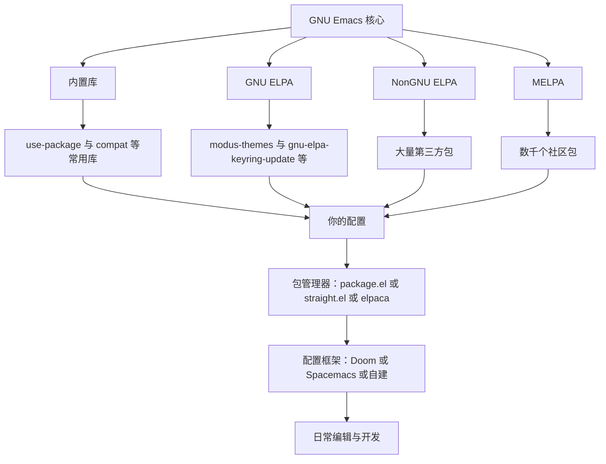
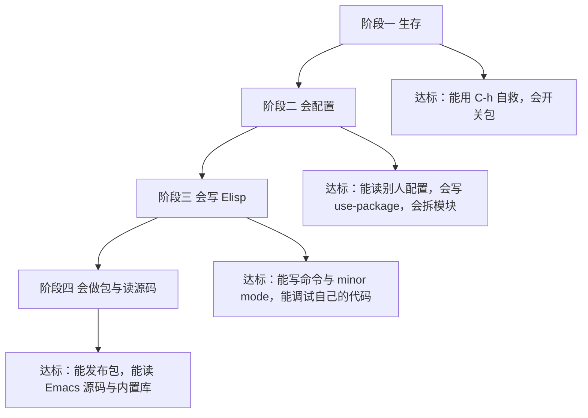

# 生态社区与进阶路线

> 本篇是整套教程的收尾：讲清 Emacs 生态由谁构成、怎么判断一个包值不值得用、如何参与贡献，并给出一条从"能用"到"能写包、能读源码"的四阶段路线与一份 30 天计划。

---

## 一、生态全景

### 1.1 核心开发与版本节奏

Emacs 由 GNU 项目维护，核心开发在 Savannah 上的 Git 仓库进行，GitHub 上的 `emacs-mirror/emacs` 是只读镜像，方便查看提交历史与检索代码。发布节奏没有一个严格的固定日期，但历史上的常态是"多数年份有一个大版本"：版本号形如 `30.1`，同系列的 `30.2` 之类的次要版本主要用于修 bug。

对你实际有用的三条推论：

- **不需要追每个新版本**。等到版本发布后一两个月，等发行版打包完成、等你依赖的包适配完成，再升级更省事。
- **升级前先看 `NEWS` 文件**。Emacs 源码树里的 `etc/NEWS` 记录了每个版本的不兼容变更（变量改名、函数废弃、默认值变化），这是比任何二手总结都可靠的依据。
- **配置里尽量用能力判断而不是版本号判断**。写 `(when (boundp 'some-new-variable) ...)` 比写 `(when (version<= "30" emacs-version) ...)` 更稳，因为它问的是"这个能力在不在"。

### 1.2 三个 ELPA 仓库的分工

Emacs 的包仓库有三个主流来源，配置方式都是在 `package-archives` 里登记地址：

```elisp
(setq package-archives
      '(("gnu"    . "https://elpa.gnu.org/packages/")
        ("nongnu" . "https://elpa.nongnu.org/nongnu/")
        ("melpa"  . "https://melpa.org/packages/")))
```

| 仓库 | 收录策略 | 版权要求 | 特点 |
| --- | --- | --- | --- |
| GNU ELPA | 由 Emacs 维护者审核，倾向于收录可进入核心的包 | 需要把版权转让给 FSF | 最稳定，包数量最少；核心库（如 `use-package`、`compat`）常在这里 |
| NonGNU ELPA | 审核较宽松，不要求版权转让 | 不要求转让 | 填补 GNU ELPA 的空白，收录了不少活跃的第三方包 |
| MELPA | 从仓库的当前代码自动构建，收录最宽松 | 不要求转让 | 包最多、更新最快；代价是"快照式"发布，稳定性由包作者自己负责 |

以写作时读取三个仓库的 `archive-contents` 统计，合计约七千个包条目，其中 MELPA 占绝大多数。**数量随时变化，以各仓库首页的统计为准**，不要记住某个具体数字。

三个仓库的差别带来两个实际影响：

- **同一个包可能在多个仓库里都有**，这时优先用 GNU ELPA 或 NonGNU ELPA 的版本（更稳定），除非你需要 MELPA 上的最新功能。
- **MELPA 包可能"腐烂"得更快**。因为它跟踪的是仓库当前代码，作者删库或改结构会立刻反映到你能不能装上。

### 1.3 生态结构



### 1.4 为什么"Emacs 的包更容易腐烂"

这是 Emacs 生态一个被反复讨论的现象，原因有几个层面：

- **贡献门槛与收益不对称**。很多包是作者解决自己问题后顺手分享的，作者换工作、换编辑器、或者需求消失后就不再维护，而接手者很少。
- **核心库的演进会打破第三方包**。Emacs 内部 API 并非全部稳定，`cl` 到 `cl-lib` 的迁移、`font-lock` 与 `tree-sitter` 的并行、原生编译带来的新行为，都会让长期不更新的包出问题。
- **发布方式放大了问题**。MELPA 从代码仓库直接构建，一次重构就可能让用户的安装流程失败，而这类问题很难被作者及时发现。
- **社区规模相对小**。与 VS Code 的扩展生态相比，Emacs 的包维护者数量少得多，好包常常只有一个人维护。

这不是要你悲观，而是要你**把"选包"当成一个有成本的决策**，而不是看到就装。

### 1.5 选包评估清单

下表是判断一个包是否值得投入时间的具体标准。每一条都可以在包的仓库页面上直接查到。

| 检查项 | 好的信号 | 警示信号 |
| --- | --- | --- |
| 最近提交时间 | 一年内有实质提交 | 三年以上没有提交 |
| 问题响应 | issue 有人回复与处理 | 大量 issue 无人回应，或维护者明确表示不再维护 |
| 兼容声明 | 头部注释里声明的 Emacs 版本要求较新 | 声明的支持版本早已过时 |
| 依赖情况 | 依赖少、依赖的包同样活跃 | 依赖一堆已经废弃的库 |
| 是否使用废弃 API | 没有依赖 `cl`（旧库）等已废弃接口 | 代码里大量 `require 'cl`、依赖已移除的变量 |
| 是否有测试 | 仓库里有测试目录与 CI 配置 | 完全没有测试，且作者不接受改动 |
| 文档质量 | README 讲清配置方式与常见问题 | 只有一行简介 |
| 替代方案 | 有活跃的替代品 | 该领域只有它一个选择且它已停更 |
| 体量与侵入性 | 只做一件事，改动局部 | 大量修改全局键位、覆盖其他包的行为 |
| 是否可被内置替代 | 内置功能已经够用 | 为了一个能用内置功能实现的需求而引入重依赖 |

评估结论落在三档：**直接采用**（活跃、依赖少、做的事你确实需要）、**谨慎采用并准备替换**（能用但维护停滞，配置里做好隔离）、**不用**（停更多年且核心 API 已变）。

---

## 二、值得关注的包分类清单

下面每类给若干选项与一句话定位。选择标准是"活跃度 + 定位清晰"，不是"功能最多"。

安装方式的三种情况要分清：绝大多数第三方包可以用 `M-x package-install RET 包名 RET` 安装；`eglot`、`which-key`、`use-package`、`project`、`flymake`、`transient`、`tramp`、`eshell`、`gnus`、`dired`、`org` 是内置，不需要装；而 `mu4e`、`notmuch` 这类依赖外部索引程序的包，需要先在系统里安装对应的命令行工具，包本身通过源码编译或发行版提供的方式获取，用 `M-x package-install` 是装不上的。遇到名字后不确定时，先用 `M-x list-packages` 搜一下。

### 2.1 补全与人机交互

- `vertico`：极简的竖向补全界面，与 `consult` 配合构成一套现代 minibuffer 体验。
- `consult`：为 minibuffer 提供搜索、跳转、缓冲切换等增强命令，是 `vertico` 的常用搭档。
- `corfu`：缓冲区内的补全前端（弹出候选列表），与 `cape` 搭配可组合多种补全源。
- `marginalia`：在补全候选旁显示注释信息（命令的文档摘要、文件的权限与大小）。
- `orderless`：把空格分隔的多个词当作多个过滤条件，改变候选匹配方式，几乎所有补全框架都能配。
- `embark`：对"光标处或补全候选处"的对象执行一整套上下文动作，改变的是操作方式而不是外观。
- `company`：老牌的缓冲区补全框架，仍在维护，生态插件多；与 `corfu` 属于同类替代关系。

### 2.2 编辑增强

- `expand-region`：按语义逐级扩大选区（词、表达式、函数、整个文件）。
- `multiple-cursors`：多光标同时编辑多处。
- `smartparens`：结构化编辑括号与标签，比裸 `paredit` 更通用。
- `paredit`：Lisp 专用的括号编辑，写 Elisp 时尤其顺手。
- `ace-window`：给窗口分配字母，一次按键跳到目标窗口。
- `undo-tree` 或 `vundo`：可视化的撤销树，处理分支式撤销历史。
- `crux`：一组作者自用的编辑命令合集（重命名文件与缓冲区、智能打开当前文件所在目录等）。

### 2.3 项目管理与导航

- `project`：Emacs 内置的项目抽象，`C-x p` 前缀下有切换项目、搜索、编译等命令，先学会内置的再考虑第三方。
- `projectile`：老牌项目管理，功能多、集成广，仍被大量配置使用。
- `consult` 的项目相关命令：把项目内搜索接进 minibuffer，与 `project` 或 `projectile` 都能配合。
- `dired` 与 `wdired`：内置的目录编辑器，`C-x C-q` 进入可编辑模式后可以批量改名，值得单独学习。

### 2.4 版本控制

- `magit`：Git 的事实标准界面，暂存、提交、变基、查看历史都在一个缓冲区里完成。
- `forge`：在 Magit 里操作 GitHub 与 GitLab 的 issue 与合并请求（需要配置令牌）。
- `magit-todos`：在 Magit 状态缓冲区里列出代码中的 TODO 与 FIXME。
- `difftastic`：接入结构化差异比较工具，按语法树展示改动。
- `git-link`：把当前行或选区的代码生成可分享的仓库链接。

### 2.5 笔记与写作

- `org`：内置的 Org mode，是 Emacs 生态里最重要的子系统之一，值得单独投入时间。
- `org-roam`：基于 Org 的双向链接笔记系统，适合构建知识网络。
- `denote`：以文件名规范为核心的组织方式，比数据库式方案更简单耐用。
- `org-modern`：为 Org 提供现代化的折叠符号与对齐效果。
- `ox-hugo`：把 Org 导出为 Hugo 站点内容，写博客的常用路径。
- `auctex` 与 `cdlatex`：在 Emacs 里写 LaTeX 与数学公式的成熟方案。

### 2.6 终端与外部程序集成

- `vterm`：基于 libvterm 的终端模拟器，性能与兼容性好，需要编译模块。
- `eat`：纯 Elisp 实现的终端模拟器，不需要编译，安装最省事。
- `eshell`：内置的、用 Elisp 实现的 shell，能与 Emacs 的数据结构直接互操作。
- `shell`：内置命令，在缓冲区里跑交互式 shell，调试 TRAMP 与远程任务时最方便。

### 2.7 邮件、阅读与资讯

- `mu4e`：基于 mu 索引器的邮件客户端，搜索能力最强，需要外部程序。
- `notmuch`：同样是索引式邮件客户端，配置简单、标签体系清晰。
- `gnus`：内置的新闻组与邮件阅读器，学习曲线陡峭但能力全面。
- `elfeed`：RSS 阅读器，与 Org 配合可以把文章转成待读列表。
- `nov`：在 Emacs 里阅读 EPUB 电子书。
- `pdf-tools`：把 PDF 变成可搜索、可标注的 Emacs 缓冲区。

### 2.8 开发与调试

- `eglot`：内置的语言服务器客户端，Emacs 29 起随版本发布，配置极少。
- `lsp-mode`：功能更丰富的 LSP 客户端，生态插件多，配置项也更多。
- `flymake`：内置的语法检查框架，`eglot` 的诊断就通过它显示。
- `flycheck`：老牌的语法检查框架，支持的检查器更多；与 `flymake` 属于同类替代。
- `apheleia`：保存时调用外部格式化程序，配置简单，不接管缩进。
- `dape`：调试适配器协议（DAP）客户端，用于在 Emacs 里调试多种语言。
- `realgud`：为多种调试器提供统一界面的老牌方案。
- `quickrun`：按当前文件类型执行代码片段并显示输出，适合写脚本时快速验证。

### 2.9 界面与观感

- `modus-themes`：GNU ELPA 上的高对比度主题系列，可访问性做得好。
- `ef-themes`：同一作者的彩色主题系列，风格活泼。
- `doom-themes` 与 `catppuccin-theme`：社区流行的主题集合。
- `doom-modeline`：信息密度高的模型行实现。
- `dashboard`：启动画面替代品，展示最近文件与项目。
- `fontaine`：按 frame 精细设置字体（族、字号、行距）。
- `spacious-padding`：给 frame 与窗口加上舒适的边距。
- `pulsar`：在跳转、粘贴、撤销之后短暂高亮受影响区域，帮助定位。
- `indent-bars`：绘制缩进参考线。

### 2.10 效率工具

- `which-key`：Emacs 30 起内置，按下前缀键时列出后续可用按键。
- `keycast`：把当前命令显示在模型行上，录屏或教学时很有用。
- `ace-window` 与内置的 `windmove`：窗口跳转的两种思路。
- `popper`：把临时弹出的缓冲区（帮助、编译输出）管理成可切换的一组。
- `jinx`：基于 enchant 的拼写检查，性能好，适合处理大量文本。
- `exec-path-from-shell`：把登录 shell 的环境变量导入 Emacs，macOS 上几乎是必需品。
- `sudo-edit`：以提升的权限重新打开当前文件（TRAMP 的 `/sudo::` 也能做，二者选一）。
- `no-littering`：把包的配置文件与缓存统一收纳到规范的目录下，保持 `~/.emacs.d` 整洁。

---

## 三、如何参与与贡献

### 3.1 报告 bug

正确的报告是一份**可复现的最小说明**，不是情绪表达。要素在 [[emacs教程/7进阶/04_常见故障排查|常见故障排查]] 第十二节已经详细展开，这里只强调三条：

- 向 Emacs 本身报告用 `M-x report-emacs-bug`，它会自动收集环境信息。
- 向第三方包报告时，先看仓库的 issue 模板，通常要求提供版本、最小配置、backtrace。
- 报告之前先在 `emacs -Q` 下复现一次。如果只在你的配置里出现，那不是包的 bug。

### 3.2 写包并发布

写完一个包之后，发布路径是：在仓库里按包规范组织文件（头部注释、版本、依赖声明、`provide`）、写测试、选择发布到哪一个 ELPA（GNU ELPA 需要版权转让，MELPA 只需要提一个 recipe）、维护版本记录。完整流程见 [[emacs教程/4插件开发/04_测试打包与发布MELPA|测试打包与发布 MELPA]]。

值得强调的一点：**发布之前先自己用三个月**。很多包的腐烂始于"作者发布完就再没用过"。

### 3.3 参与开发与文档

- **邮件列表**：Emacs 的核心讨论在 `emacs-devel` 邮件列表上进行，补丁与设计讨论都在那里；`emacs-tangents` 之类则是闲聊性质的列表。参与之前先读一段时间存档，了解讨论风格。
- **bug tracker**：GNU 的 bug tracker（debbugs）承载所有 Emacs 缺陷与功能请求，可以用邮件参与，也可以用 `M-x debbugs-gnu` 之类的包在 Emacs 里浏览。
- **翻译与文档**：把手册翻译成中文、修补文档里的错误示例、为包的 README 补充说明，都是门槛低但价值高的贡献。本仓库的 [[emacs教程/2Elisp语言/00_学习资源与视频|学习资源与视频]] 里列出了已有的中文翻译项目。
- **给 MELPA 提 recipe**：如果你发现某个包还没被 MELPA 收录，可以在 MELPA 仓库里提一个 recipe，这是最轻量的"让社区受益"的方式。
- **捐赠**：向 FSF 捐赠或直接支持包的维护者，是维持这个生态最直接的方式。

### 3.4 写博客与分享配置

分享配置的价值常被低估：它是你检验自己是否真的理解某个设置的最好方式（写不清楚，通常说明没想明白），也是别人找到你的入口。注意事项有三：不要在博客里粘贴你并不理解的配置块；说明适用版本；把"为什么这么做"写出来，而不是只贴结果。

---

## 四、学习路线四阶段



### 4.1 阶段一：生存

**目标**：不依赖记忆使用 Emacs，遇到不认识的按键与函数能自己查清楚。

**达标标准**：

- 熟练使用 `C-h k`、`C-h f`、`C-h v`、`C-h m`、`C-h b`、`C-h w` 六个帮助命令。
- 会用 `M-x` 调用命令，会 `M-x package-install` 装包。
- 能读懂模式行，知道当前 major mode 与启用的 minor mode。
- 会在 `*scratch*` 里求值表达式。

**练习任务**：用 `C-h k` 查出你每天用的十个按键分别绑到哪个命令；用 `C-h v` 查出三个你最常改的变量的默认值；把 `M-x customize` 里改过的一项还原成配置文件里的写法。

**预计时间**：一到两周。

### 4.2 阶段二：会配置

**目标**：配置不再是抄来的黑箱，而是你能读懂、能修改、能拆分的东西。

**达标标准**：

- 能读懂一个别人的 `init.el`，说出每一段在做什么。
- 会用 `use-package` 的常用关键字，清楚 `:init` 与 `:config` 的区别。
- 配置按功能拆成多个文件，并知道每个文件加载的时机。
- 会测量启动时间，能定位明显不合理的加载（见 [[emacs教程/7进阶/01_启动加速与性能优化|启动加速与性能优化]]）。

**练习任务**：把自己的 `init.el` 拆成至少五个模块；用 `use-package` 重写三处裸 `require`；把启动时间测出来并写进 README。

**预计时间**：两到四周。

### 4.3 阶段三：会写 Elisp

**目标**：从"改写别人的代码"过渡到"从零写一个能用的功能"。

**达标标准**：

- 完成 `2Elisp语言` 模块的绝大部分内容，能说清动态作用域与词法作用域的区别。
- 会写交互式命令、会定义键位、会用钩子。
- 会写一个 minor mode，理解它的键位表与生命周期。
- 会用 `edebug` 单步调试、用 `profiler` 找性能问题（见 [[emacs教程/2Elisp语言/11_调试与性能剖析|调试与性能剖析]]）。

**练习任务**：写一个对你日常工作有用的小功能，并让它在这个月里被你自己用到至少二十次；用 `edebug` 调试一次自己的 bug。

**预计时间**：一到三个月。

### 4.4 阶段四：会做包与读源码

**目标**：能维护一个给别人用的包，能读懂 Emacs 内置库的实现。

**达标标准**：

- 完整走一遍包的开发与发布流程（头部注释、`provide`、测试、发布到某个 ELPA）。
- 能用 `C-h f` 跳到定义处读内置函数的实现，看懂其中的关键部分。
- 能读懂 Emacs 源码里 `lisp/` 目录下的常见文件（`simple.el`、`subr.el`、`files.el`、`window.el`）。
- 能判断一个第三方包是否值得依赖，并能对它的实现提出改进。

**练习任务**：给一个你使用的包提一个真实的补丁（哪怕只是修文档错误）；在 Emacs 源码里找到一个你常用的函数并读完全文，写下它的实现思路。

**预计时间**：三个月以上，且没有终点。

---

## 五、十个练手项目

难度从易到难，每个都给出目标、涉及知识点与验收标准。它们刻意避开了"照着抄一遍"的类型，每一项都要求你做出判断。

**项目一：高亮 TODO 的 minor mode。**

- 目标：在所有编程模式里把 `TODO`、`FIXME` 这两种标记高亮出来。
- 知识点：minor mode 定义、`font-lock-add-keywords`、钩子。
- 验收标准：`M-x 你的模式名` 能开关；打开一个含 TODO 的代码文件能看到高亮；关掉之后高亮消失；模式在模式行上有指示。

**项目二：把当前文件路径复制到 kill-ring。**

- 目标：一个命令，把当前缓冲区的完整路径放进 kill-ring，去掉远程前缀时给出提示。
- 知识点：`buffer-file-name`、`kill-new`、`interactive`、前缀参数。
- 验收标准：本地文件返回绝对路径；未保存的新文件给出明确提示而不是报错；在 TRAMP 路径上有合理行为。

**项目三：语言运行器。**

- 目标：一个命令，按当前文件类型选择解释器或编译器，运行并显示输出。
- 知识点：`compile`、`shell-command`、`derived-mode-p`、`alist` 配置表。
- 验收标准：至少支持三种语言；未知类型给出清晰提示；输出缓冲区里保留完整命令便于排查。

**项目四：自动保存模式。**

- 目标：在空闲一段时间后自动保存当前缓冲区，并支持排除某些文件。
- 知识点：`run-with-idle-timer`、`buffer-modified-p`、`save-buffer`、用户自定义变量。
- 验收标准：空闲触发；不会对未修改的缓冲区做无意义写入；有一个排除列表变量；关闭模式后定时器被正确取消。

**项目五：一个简单的 major mode。**

- 目标：为一种配置文件格式（例如你常用的某种 `xxx.conf`）写一个 major mode。
- 知识点：`define-derived-mode`、`syntax-table`、`font-lock-defaults`、`auto-mode-alist`、注释语法。
- 验收标准：打开对应扩展名的文件自动进入该模式；注释与字符串有正确的语法处理；关键字有高亮；模式行显示模式名。

**项目六：复刻一个 Vim 插件的功能。**

- 目标：选一个你在 Vim 里用过的小功能（例如自动配对、快速注释、环绕修改），在 Emacs 里实现它。
- 知识点：键位映射、`thing-at-point`、`save-excursion`、文本属性与 overlay。
- 验收标准：功能与原来的用途等价；有清晰的开关键或命令；不会破坏其他包的行为。

**项目七：Org capture 模板体系。**

- 目标：为你的工作流设计三到五个 `org-capture` 模板（待办、笔记、会议记录、灵感），并配好归档策略。
- 知识点：`org-capture-templates`、模板展开、`org-agenda` 文件组织、`org-archive`。
- 验收标准：三个模板都能用；抓取后的条目落在正确的文件与层级；归档有明确规则。

**项目八：访问 API 并把结果插入缓冲区。**

- 目标：调用一个公开 API（天气、汇率、你自建的服务），把返回结果格式化后插入当前缓冲区。
- 知识点：`url-retrieve-synchronously` 或 `request` 一类封装、JSON 解析（`json-parse-buffer`）、错误处理、异步与同步的取舍。
- 验收标准：网络失败时有明确提示而不是抛出原始错误；结果格式化干净；不会因为一次请求失败污染缓冲区内容。

**项目九：Transient 菜单。**

- 目标：为你自己的一组命令设计一个 transient 菜单（Emacs 29 起内置 `transient`）。
- 知识点：`transient-define-prefix`、`transient-define-suffix`、参数传递、键位分组。
- 验收标准：`M-x` 能打开菜单；分组清晰；参数修改后执行命令能读到；`C-g` 能干净地取消。

**项目十：把配置整理成公开仓库并配 CI。**

- 目标：把配置整理成可以给别人用的仓库，加上 README、许可证与自动化检查。
- 知识点：Git 工作流、`.gitignore`（排除 `.elc`、`eln-cache`、`elpa`）、批量字节编译、`package-lint` 与 `elisp-lint`。
- 验收标准：别人克隆后能一次启动成功；README 说明依赖与安装步骤；CI 能跑通字节编译并报告警告。

---

## 六、与 RootStack 其他模块的衔接

Emacs 的价值在"它是一个能装下你所有工作流的容器"，因此它能与仓库里的其他教程直接组合：

| 你想做的事 | 用到的 Emacs 能力 | 相关教程 |
| --- | --- | --- |
| 读 Linux 内核源码 | `xref` 跳转、`tags` 或 LSP 索引、`dired` 浏览大型源码树 | [[内核/内核索引|内核教程]] |
| 用 gdb 调试 C 程序 | `M-x gdb`（内置的图形化调试界面）、`gud` 断点管理 | [[c语言教程/c目录|C 教程]] |
| 管理本仓库的版本历史 | Magit 的暂存与变基、`forge` 查看远端议题 | [[git|Git 与 GitHub 指南]] |
| 写学习笔记 | Org 的折叠、导出、表格计算、`org-capture` | [[emacs教程/5开发环境集成/07_OrgMode效率系统|Org Mode 效率系统]] |
| 在容器里改配置 | TRAMP 的容器方法、`docker.el` | [[docker/01-安装与配置|Docker 教程]] |
| 在 Linux 系统上完成日常操作 | `eshell`、`M-x shell`、dired 的批量操作 | [[linux/README|Linux 教程]] |
| 与 VS Code 工作流对照 | 键位与扩展体系的差异、如何在两者之间迁移 | [[VSCODE的配置与使用|VS Code 配置与使用]] |
| 从 Vim 迁移过来 | Evil 与原生键位的取舍 | [[vim教程|Vim 编辑器教程]] |

一个实际建议：**用 Org 管理你的学习笔记，用 Magit 管理这个仓库**。这两件事一旦形成习惯，Emacs 就从"一个编辑器"变成了"你的工作台"，后续的学习动力会强得多。

---

## 七、值得长期阅读的来源

下面每一条都写清"它适合解决什么问题"，请按需订阅，不要全部追。

- **Mastering Emacs**（https://www.masteringemacs.org/）：适合解决"某个内置功能到底怎么用"的问题。它是少数把 Emacs 讲透的长文博客，新增文章不多但每篇质量稳定。
- **Sacha Chua 周报**（https://sachachua.com/blog/）：适合解决"最近社区在做什么"的问题。每周汇总包更新、博客与讨论，是了解生态动向最省时的方式。
- **System Crafters**（https://systemcrafters.net/）：适合解决"配置怎么组织、怎么从零搭一套"的问题。视频与文字并重，还有活跃的社区。
- **EmacsConf**（https://emacsconf.org/）：适合解决"某个领域别人怎么做"的问题。每年的会议录像覆盖包开发、Org、可访问性、性能等主题，讲者多是包的作者本人。
- **Emacs 中文社区论坛**（https://emacs-china.org/）：适合解决中文环境下的具体问题。字体、输入法、Windows 与 macOS 的坑在这里经验最集中。
- **子龙山人《Spacemacs Rocks》**（https://github.com/zilongshanren/Spacemacs-rocks）：适合解决"中文入门与生态导览"的问题，配套视频在 B 站（https://www.bilibili.com/video/BV1fE411x7jc）。
- **《一年成为 Emacs 高手》**（https://github.com/redguardtoo/mastering-emacs-in-one-year-guide）：适合解决"学习方法与效率取舍"的问题，作者是长期使用 Emacs 的中文开发者。
- **Emacs 文档中文翻译**（https://github.com/lujun9972/emacs-document）：适合解决"英文手册读不动"的问题。
- **Emacs 101 新手指南**（https://github.com/emacs-tw/emacs-101-beginner-survival-guide）：适合解决"刚上手时不知道学什么"的问题。
- **awesome-emacs**（https://github.com/emacs-tw/awesome-emacs）：适合解决"某个需求有没有现成包"的问题，是一个分类清单。
- **Protesilaos 频道**（https://www.youtube.com/@protesilaos）：适合解决"主题、可访问性与 Org 使用细节"的问题，作者是 modus-themes 与 ef-themes 的维护者。
- **Mike Zamansky 频道与博客**（https://www.youtube.com/@mikezamansky、https://cestlaz.github.io/）：适合解决"从零开始系统学习"的问题，课程式讲解，节奏平稳。
- **Uncle Dave's Emacs**（https://www.youtube.com/@UncleDavesEmacs）与 **Emacs Elements**（https://www.youtube.com/@EmacsElements）：适合解决"短小技巧与内建功能发现"的问题，视频短、主题聚焦。

YouTube 与 GitHub 的访问在国内可能需要网络代理，中文替代来源优先看 Emacs 中文社区与上述两个中文仓库。

---

## 八、常见的思维误区

**误区一：追求完美配置。**

症状：配置永远处在"还没弄好"的状态，每次用 Emacs 之前都要先改点东西。

对策：给配置定一个"冻结期"，例如每周只允许改一次，且必须解决一个真实痛点。把"想加的功能"记进一个 TODO 文件，而不是立刻动手。

**误区二：装包成瘾。**

症状：看到别人推荐就装，`:ensure` 列表越来越长，很多包一个月没被调用过一次。

对策：每月做一次审计——列出所有的包，标出过去一个月真正用到的，其他的用 `M-x package-delete` 卸掉。装包的门槛应该是"我已经遇到过三次这个问题"。

**误区三：抄配置不理解。**

症状：配置里有大段自己讲不清作用的代码，出了问题只能整段注释掉。

对策：每加一段配置就写一行注释说明"它解决什么问题、怎么验证有效"。写不出注释的配置就删掉。

**误区四：把 Emacs 当 VS Code 用。**

症状：试图在 Emacs 里逐项复刻另一套编辑器的交互，要求什么都"像原来那样"。

对策：先花两周学 Emacs 的原生方式（`C-h` 体系、minibuffer 交互、键盘宏），再决定哪些地方确实需要改。很多"必须有"的插件，在理解原生工作流之后就不再需要了。

**误区五：频繁换框架。**

症状：Doom、Spacemacs、自建配置之间来回切换，每次都要重新配置一遍。

对策：选定一个方向后至少用满半年。框架带来的收益主要体现在"省下初始配置时间"，而你已经过了那个阶段。

**误区六：把时间花在配置上而不是做事上。**

症状：一晚上过去了，代码一行没写，配置改了三百行。

对策：用产出而非配置量衡量一天。一个可执行的标准是：如果今天配置改动超过五十行而没有任何实际工作产出，明天不许碰配置。

---

## 九、30 天进阶计划

计划的前提是每天 20 到 60 分钟，且**不追求全部完成**。完成率在七成以上就算成功，剩下的可以顺延。

| 天 | 任务 | 预计时间 | 产出 |
| --- | --- | --- | --- |
| 1 | 用 `C-h k` 查出你常用的十个按键对应的命令 | 20 分钟 | 一张键位清单 |
| 2 | 用 `C-h v` 查看三个最常改的变量，读完整文档字符串 | 20 分钟 | 三条笔记 |
| 3 | 读一遍自己的 `init.el`，给每段加一行注释 | 40 分钟 | 带注释的配置 |
| 4 | 测量启动时间，记录三次取中位数 | 30 分钟 | 一个基线数字 |
| 5 | 把配置按功能拆成模块，`init.el` 只负责加载 | 60 分钟 | 模块化目录 |
| 6 | 用 `use-package` 重写三处裸 `require` | 40 分钟 | 延迟加载生效 |
| 7 | 复测启动时间，与第 4 天对比 | 20 分钟 | 对比结论 |
| 8 | 读 `C-h f use-package` 的文档，搞清 `:init` 与 `:config` | 30 分钟 | 一条判断规则 |
| 9 | 用 `M-x profiler-start` 采样一次日常操作 | 40 分钟 | 一份性能报告 |
| 10 | 用 `edebug` 单步调试一个自己的函数 | 40 分钟 | 一次调试记录 |
| 11 | 写第一个命令：把当前文件路径复制到 kill-ring | 30 分钟 | 一个可用命令 |
| 12 | 写第二个命令：在文件中插入当前时间戳 | 20 分钟 | 一个可用命令 |
| 13 | 给这两个命令绑定键位，注意避免与现有键冲突 | 30 分钟 | 键位表更新 |
| 14 | 写一个高亮 TODO 的 minor mode | 60 分钟 | minor mode |
| 15 | 用 `M-x elp-instrument-package` 测一个包的开销 | 40 分钟 | 性能数据 |
| 16 | 学习 Org 的折叠、表格与导出，写一篇学习笔记 | 60 分钟 | 第一篇 Org 笔记 |
| 17 | 配置 `org-capture` 的三个模板 | 40 分钟 | 抓取体系 |
| 18 | 用 Magit 完成一次提交、一次变基与一次冲突解决 | 60 分钟 | Git 流程熟悉 |
| 19 | 读 `magit-status` 缓冲区的每一段提示，搞清它们的含义 | 30 分钟 | 一页笔记 |
| 20 | 在远程主机上配好 TRAMP 连接复用并测试 | 60 分钟 | 可用的远程访问 |
| 21 | 在远程主机上跑起 Emacs daemon，用 `emacsclient -t` 连上 | 60 分钟 | 远程开发环境 |
| 22 | 读 [[emacs教程/7进阶/04_常见故障排查|常见故障排查]]，把最常见的十类问题过一遍 | 40 分钟 | 急救知识 |
| 23 | 建立自己的 Org 排错记录文件，写下最近解决的两个问题 | 40 分钟 | 排错笔记 |
| 24 | 审计已安装的包，卸载一个月没用过的 | 30 分钟 | 精简的包列表 |
| 25 | 为配置仓库写好 README 与 `.gitignore`，提交到远端 | 60 分钟 | 公开的配置 |
| 26 | 给配置加上批量字节编译与一次启动时间检查的脚本 | 40 分钟 | 自动化脚本 |
| 27 | 读一个你常用函数的源码（`C-h f` 跳转到定义） | 60 分钟 | 源码笔记 |
| 28 | 给一个你使用的包提一个真实的补丁或文档修改 | 60 分钟 | 一次贡献 |
| 29 | 复习 `C-h` 系列命令，查三个你还没用过的帮助命令 | 30 分钟 | 帮助体系补全 |
| 30 | 写下这 30 天的总结：哪些改变真正有用，哪些是折腾 | 40 分钟 | 一份复盘 |

执行建议：把这张表复制进你的 Org 文件，用 `org-agenda` 跟踪；某一天没做就直接顺延，不要为了"补齐进度"而敷衍。

---

## 十、结语

Emacs 的独特之处不在于它现在比别的编辑器强，而在于它的收益是**长期复利**的：你为一个具体痛点写下的一段 Elisp，会在之后的每一年里持续替你省时间；你对 `C-h` 体系的熟悉，会让每一次"这个功能怎么做"的疑问都有确定的答案路径；你对缓冲区和进程模型的理解，会让你在别的工具里也能举一反三。

代价也很清楚：它的上手坡度确实陡，配置确实需要投入，社区里的很多方案确实会腐烂。所以本篇反复强调的判断标准是——**把时间花在做事上，配置只是为了让你做事更顺手**。一个能让你安心写完一个项目、并且三年后还能打开继续用的配置，比一个启动快 0.2 秒、装了两百个包的配置有价值得多。

到这里，本模块的五个章节已经形成一个闭环：先用测量确定问题（[[emacs教程/7进阶/01_启动加速与性能优化|启动加速与性能优化]]），再理解编译层面的加速手段（[[emacs教程/7进阶/02_NativeComp与字节码|NativeComp 与字节码]]），然后解决远程开发（[[emacs教程/7进阶/03_TRAMP远程开发|TRAMP 远程开发]]），出问题时能自己排查（[[emacs教程/7进阶/04_常见故障排查|常见故障排查]]），最后知道往哪里走（本篇）。剩下的部分，交给你的日常使用。

---

## 小结

- 生态由核心、三个 ELPA 仓库与包管理器共同构成；选包要看活跃度、依赖与是否使用废弃 API，而不是看功能多少。
- 参与贡献的门槛比想象中低：一个文档修正、一个最小复现的 bug 报告、一个 MELPA recipe 都是有价值的贡献。
- 学习路线的终点不是"配置得最漂亮"，而是"能写包、能读源码、能把 Emacs 当作长期工具"。

---

## 相关章节

- [[emacs教程/7进阶/01_启动加速与性能优化|启动加速与性能优化]]
- [[emacs教程/7进阶/02_NativeComp与字节码|NativeComp 与字节码]]
- [[emacs教程/7进阶/03_TRAMP远程开发|TRAMP 远程开发]]
- [[emacs教程/7进阶/04_常见故障排查|常见故障排查]]
- [[emacs教程/2Elisp语言/00_学习资源与视频|学习资源与视频]]
- [[emacs教程/4插件开发/04_测试打包与发布MELPA|测试打包与发布 MELPA]]
- [[emacs教程/3配置实践/01_配置工程化|配置工程化]]

---

## 参考

- GNU ELPA https://elpa.gnu.org/ ／ NonGNU ELPA https://elpa.nongnu.org/ ／ MELPA https://melpa.org/
- MELPA 的 recipe 仓库（了解一个包如何被收录）https://github.com/melpa/melpa
- Emacs 源码镜像（读 `lisp/` 目录与 `etc/NEWS`）https://github.com/emacs-mirror/emacs
- GNU Emacs 手册（权威功能说明）https://www.gnu.org/software/emacs/manual/html_node/emacs/
- 《Programming in Emacs Lisp》入门书 https://www.gnu.org/software/emacs/manual/html_node/eintr/
- Emacs 中文社区论坛 https://emacs-china.org/
- 子龙山人《Spacemacs Rocks》 https://github.com/zilongshanren/Spacemacs-rocks
- 《一年成为 Emacs 高手》 https://github.com/redguardtoo/mastering-emacs-in-one-year-guide
- Emacs 文档中文翻译 https://github.com/lujun9972/emacs-document
- awesome-emacs https://github.com/emacs-tw/awesome-emacs
- 插件开发手册 https://github.com/alphapapa/emacs-package-dev-handbook
- Mastering Emacs https://www.masteringemacs.org/ ／ Sacha Chua 周报 https://sachachua.com/blog/ ／ System Crafters https://systemcrafters.net/
- EmacsConf https://emacsconf.org/
- Protesilaos 频道 https://www.youtube.com/@protesilaos ／ Mike Zamansky 频道 https://www.youtube.com/@mikezamansky ／ 博客 https://cestlaz.github.io/
- Uncle Dave's Emacs https://www.youtube.com/@UncleDavesEmacs ／ Emacs Elements https://www.youtube.com/@EmacsElements
