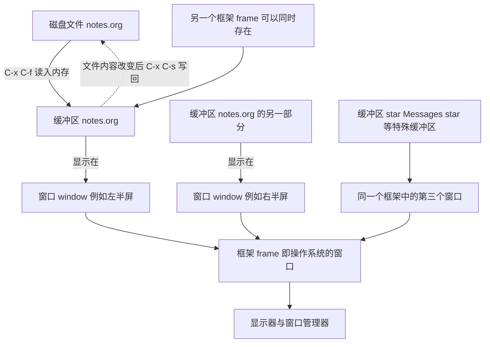

# 关于emacs的介绍
---
## 把其放在第一列，是为了有限搞清楚emacs能干什么，才能找到方向
 
### Emacs的前世今生
emacs最初并不是一个程序，或者说是软件，而是一套宏。在1976年，MIT人工智能实验室的理查德在PDP10主机和ITS操作系统上使用TECO编辑器，其本身就是一个“一次处理一行命令”的编辑器，但它内置了一套可编程的宏语言，允许用户写宏来扩展自己。斯托曼用TECO的宏语言写了一整套宏，把原本逐条敲编辑命令的方式变成按键直接触发一个功能，这套宏在1976年年底就可以实际使用了，名字叫做EMACS。Emacs当时的设计目标写在MIT技术备忘录里面：可扩展，可定制，自带文档，实时显示。这就是对Emacs最准确的描述--可扩展，可定制，自带文档，实时显示。
TECO宏版的Emacs依赖TECO,运行平台也受到局限，在1970年代末到1980年代初，James Gosling 用C语言重新写了一个Emacs,它的扩展语言叫做Mocklisp,虽然名字里存在lisp但其并不是真正的lisp,因为缺少Lisp的核心语义，所以无法承担用扩展语言重写整个编辑器这个任务。
在1984年，斯托曼开始为GNU项目开发一套全新的Emacs:用C写核心，用一门完整的Lisp方言作为扩展语言，那就是elisp语言，全称是Emacs Lisp,该介绍教程的后期大部分都在介绍这门语言的使用。
1985年先后有1.0到1.12版，直到1985年3月20日发布并在Usenet上公开宣布的GNU Emacs 13是第一个面向公众的发行版，从此Emacs的扩展语言(elsip)就是一门真正个的Lisp,而现在大多数使用的Emacs也是使用elisp作为开发语言的GNU工具也就是GNU Emacs,**本教程也是在对GNU Emacs的使用研究以及elisp的研究**

### 主要版本节点
在Emacs源码树中的/etc/HISTORY可以看到具体版本还有日期

| 版本 | 日期 | 值得记住的变化 |
|------|------|----------------|
| GNU Emacs 13 | 1985-03-20 | 首个公开发行版 |
| GNU Emacs 20 | 1997 | 引入多语言环境与 MULE，中文处理能力成熟 |
| GNU Emacs 21 | 2001-10-20 | 图形界面显示引擎重写，支持可变宽字体与图像 |
| GNU Emacs 22 | 2007-06-02 | Org mode 与 Gnus 等大量功能并入 |
| GNU Emacs 23 | 2009-07-29 | 引入 font backend，终端与图形字体统一处理 |
| GNU Emacs 24 | 2012-06-10 | 内置包管理器 `package.el`，ELPA 生态起步 |
| GNU Emacs 25 | 2016-09-16 | 引入动态模块，支持让外部 C 库直接扩展 Emacs |
| GNU Emacs 26 | 2018-05-28 | 引入 Lisp 线程，原生 JSON 解析 |
| GNU Emacs 27 | 2020-08-10 | 原生 JSON、`tab-bar`、Harfbuzz 文本整形 |
| GNU Emacs 28 | 2022-04-04 | 可选的原生编译（native compilation），NonGNU ELPA 默认启用 |
| GNU Emacs 29 | 2023-07-30 | 内置 `use-package`、EGlot、tree-sitter 支持，超长行显示优化 |
| GNU Emacs 30 | 2025-02-23 | 构建时默认启用原生编译，内置 `which-key`，新增 `completion-preview-mode`，移植到 Android |
| GNU Emacs 30.2 | 2025-08-14 | 只修 bug，无新功能 |

本教程是以Emacs 30为基线，本篇所提到的所有功能在30.x上都成立，与29的主要差异会在正文中标注

### 关于XEmacs
1991 年，Lucid 公司的开发者为了把 Emacs 集成进自家的开发环境，从当时尚未正式发布的 Emacs 19 开发代码上分叉，做出了 Lucid Emacs，后来改名为 XEmacs。
分叉的动机很实际：Emacs19开发周期拖的太久，而Lucid需要立刻能用到的东西，XEmacs一度走在前面，它率先拥有了原生的GUI控件，以及更清晰的内部框架，更好的国际化支持。
随着GNU Emacs 21 和 22 补齐了大部分差距，社区注意力逐渐回到GNU Emacs上面。 XEmacs的最后一个稳定版本是2009年版（21.4.22)。
之后的21.5系列长期停留在开发状态，项目实际上已经停止维护。
**因此当你在网上找到只支持XEmacs的教程还有代码片段，直接跳过即可**

### 关于图形版还有终端版
实际上图形版和终端版是同一个程序。Emacs可以以图形方式运行，也可以直接在终端里运行。
```bash
emacs       #图形界面启动

emacs -nw   #终端界面启动
```
这两者不是两个软件，区别只是在”显示后端“：图形后端负责把文本画到窗口内，而终端后端负责往终端里输出转义序列，缓冲区内容，键位，配置，扩展包完全公用。
而实际上，同一个Emacs进程可以同时拥有图形框架和终端框架，用守护进程启动Emacs后，在图形桌面执行emacsclient -c得到图形窗口，在SSH终端里执行emacsclient -t得到的是终端窗口，两者编辑的是同一批缓冲区。
图形能力并不是必要条件，以Emacs的按键体系，完全可以使用键盘完成所有主要操作，鼠标是可选补充。
虽然如此，**本教程主要面向的还是GUI模式**，GUI下的Emacs可以实现一些TUI做不到的渲染功能，还有一些特别的美化。
另外Emacs30新增了Android移植版本，这算是同一套代码在移动平台上的又一次后端扩展。

---
## Emacs的核心介绍和本质讲解:为了了解Emacs的理念和逻辑
从这里开始就要将一些具体的有效知识了（不是一些单纯历史讲解和名词解释),涉及一些干货内容，但是不多，仅足够了解，系统的知识下面会具体讲解

### 本质:Emacs是一个Elisp解释器
编辑器只是它自带的一个应用，这是必须要记住的核心，**Emacs的核心是一个Lisp环境，编辑器功能是Lisp写的，而且这些Lisp代码对你完全开放。**
正因如此，Emacs里内置的东西边界很模糊，dired(文件管理器),org(大纲笔记),eww(浏览器),gnus,(邮件与新闻组)tramp这(远程文件)些在其他编辑器里面足以做成独立软件的东西，在Emacs里都是一批.el文件，它们不是插进编辑器里的插件，而是**运行在同一个Lisp环境里的程序**

### 结构
第五层:用户配置层，init.el还有early-init.el与自定义函数 
第四层:第三方包，比如GNU ELPA 与 NonGNU ELPA , MELPA等等 
第三层：内置的Elisp库，files.el与simple.el与dired.el与org
第二层：Elisp解释器：读取求值 S表达式 垃圾回收 字节码 原生编译
第一层:C语言核心：缓冲区文本存储 编译原语 redisplay 各平台显示后端

这也解释了Emacs为什么启动慢，因为启动时要按顺序加载上层的东西，包越多要加载的东西越多，速度自然要慢下来。
至于为什么能做到改配置可以修改内置的功能，因为第四层可以直接覆盖第三层的定义
因为第二层到第四层都跑在同一个线程里，Lisp代码不主动让出执行权，redisplay就需要等待，因此有些操作会导致整个界面卡住 

### 函数式 
在Emacs里，按下的每一个功能键，最终都对应一个Elisp函数
比如C-x C-f打开文件，对应的函数是find-file。C-x C-s保存，对应的是save-buffer函数
当想查看哪个功能键到底绑定了什么函数，可以用C-h k再按那个键即可。
至于查询函数的作用，可以C-h f再输入函数名
想知道某个变量当前值是多少，用C-h v就可以知道。
C-h b 列出当前所有键位
这些最基本的功能键可以辅助理解Emacs的基本工具集

这些函数不是内置在C代码里无法修改的黑盒，用C-h f打开函数文档后，文档缓冲区里有指向源码的链接，可以直接跳到定义它的.el文件
也可以在任意位置使用M-x find-function输入函数名跳过去 

### 命令循环
Emacs在等你输入的时候，内部在做着这样的循环：

A等待键盘或鼠标事件->B把事件翻译成按键序列->C在keymap中查询序列对应命令->
D判断是否找到对应命令：

找到了->以interactive方式调用该命令->命令修改缓冲区文本或变量->标记缓冲区已修改->redisplay就需要等待->A

没找到->提示为定义，并可能给出相近键位建议->A

**循环的意义：改键位不需要改源码，只需要修改keymap**
调试卡死时按C-g本质是中断当前正在执行的命令，让循环回到第一步。

---
从最基本的Emacs的实现逻辑里我们可以较为清晰的了解到Emacs的一些特性，那就是**可以不用修改具体源码，仅通过修改一些声明式函数就可以自定义Emacs的一些功能**，这些功能包含方方面面，从基本键位设定，到扩展功能，到自定义一些自己奇思妙想的设定，而这些都要基于elisp语言，这也是后续将要重点花时间讲解elisp的原因。

---

## 一些基本术语
算是名词解释吧，因为后续的学习者在查阅其他文档的时候不免遇到一些很不好理解的名词解释，在后续本文章的教程里，也会用到大量的官方名词，因此需要提前说清楚。


| Emacs 术语 | 含义 | 其他软件的叫法 | 常见误解 |
|------------|------|----------------|----------|
| buffer 缓冲区 | 内存中一段可编辑文本及其状态 | 文档 / 标签页 | 以为它就是文件 |
| window 窗口 | 框架内的一块显示区域 | 分屏 / 窗格 | 以为是操作系统窗口 |
| frame 框架 | 操作系统层面的窗口 | 窗口 | 以为是某种框架库 |
| point 点 | 光标位置，位于字符之间 | 光标 / 插入点 | 以为它属于某个字符 |
| mark 标记 | 记住的另一个位置，与 point 构成 region | 选区起点 | 以为必须用鼠标选中 |
| kill-ring | 剪切历史列表 | 剪贴板 | 以为只能存一条 |
| minibuffer | 底部参数输入区 | 命令面板输入框 | 以为是普通缓冲区 |
| mode-line | 每个窗口底部的状态行 | 状态栏 | 与 header line 混淆 |


具体介绍在下面:
### 缓冲区Buffer

这个在其他编辑器里也会有的东西，比如nvim里，一些高级的终端模拟器，完整的IDE里，浏览器里，都会存在，可以直接理解为编辑器里打开的页面所占用的空间，类似应用程序的后台进程，编辑器里可以打开多个缓冲区，可以切换，可以修改，可以关闭。

正规讲解:
缓冲区是Emacs里"一块可以编辑的文本"的载体，其要点是:

- 缓冲区存在于内存中，与磁盘文件没有必然关系。当文件被读入缓冲区之后，你在缓冲区里编辑，磁盘上的文件不变，直到你进行显示保存
- 每个缓冲区都有名字，访问文件时默认用文件的基本名作为缓冲区名
- 同一个文件不会被读进两个缓冲区，当你C-x C-f 打开同一路径，Emacs只是把已有缓冲区切到前台
- 同名但是不同路径的文件会得到plan.org<2>这样的名字，尖括号里的数字是区分用的
- 缓冲区可以没有关联文件
- 主模式与小模式是缓冲区的属性，不是文件的属性，同一个文件被两个缓冲区访问时，两个缓冲区可以处于不同的模式

### 窗口window

就是字面意思，窗口，你看到的就是窗口，一开始打开Emacs至于欢迎页面那个大窗口，后面打开文件，打开两个文件，会被分割出来多个窗口，还可以合并窗口。假如说你打开一个支持分屏的软件，这个软件支持多开，你可以打开软件1,软件2,软件3,那些上方存在隐藏，放大，关闭的不是窗口，你分屏之后看到那一个一个小格子才是窗口
切确的说Emacs的window指的是**框架内部的一个显示区域**,不是操作系统层面的窗口，一个框架可以被水平或垂直切成多个window,每个window显示一个缓冲区
直接记住**Emacs 的 window 等于别人嘴里的"窗格/分屏"，Emacs 的 frame 才是别人嘴里的"窗口"。**

### 框架frame

框架就是操作系统层面的窗口，在终端下相当于整个终端屏幕，同一个Emacs进程可以同时拥有图形框架和终端框架,每个框架有自己的窗口划分，字体和位置参数

### 点point与标记mark

点point就是光标所在的位置，严格来说，point表示的是两个字符之间的位置，而不是在某个字符上面
标记mark是缓冲区里另一个被记住的位置，point与mark之间的文本叫做区域
mark可以设置，一般使用C-SPC(set-mark-command)然后再别处移动point,region就形成了。region高亮显示由transient-mark-mode控制
point与mark之间可以交换，用C-x C-x可以。选中一段文字后想回头调整选中区域的另一端，这个键比重新拖一遍鼠标快得多

### kill-ring剪贴环
kill-ring是一个文本片段列表，所有kill操作都会把文本压入kill-ring的头部，因此可以连续去会多次剪切的历史。
保留条数由kill-ring-max控制，默认是60条，在图形框架下，kill-ring与系统剪贴板互通，由select-enable-
控制

### minbuffer与mode-line

minibuffer就是屏幕最下方的那一行输入区，用来读参数，读文件名，收集M-x命令，显示提示
当minibuffer不是用来输入而是用来显示消息时，它被称为echo area（回显区)
mode-line是每个窗口底部的那一条横向状态栏，显示缓冲区名，主模式，小模式，光标位置比例，文件修改状态等
缓冲区顶部的可选状态栏叫做header line 与 modeline是两套东西

### 关系图


