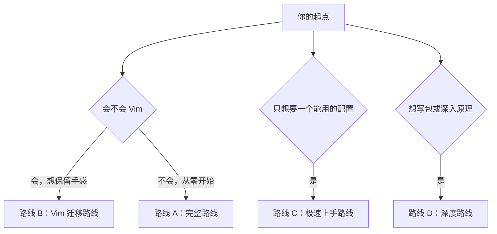
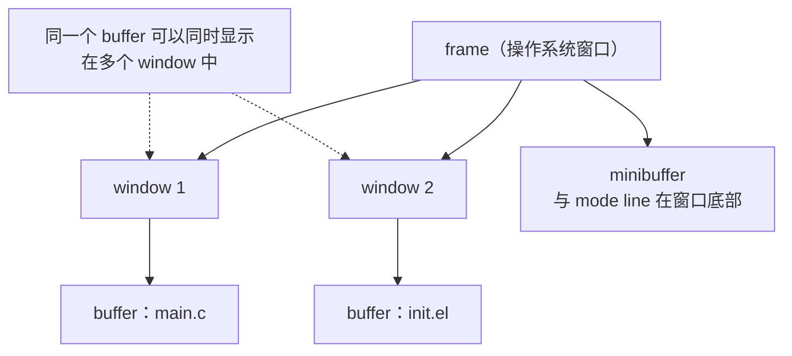

# Emacs 教程

Emacs 不是"另一个编辑器"，而是**一个用 Emacs Lisp 写成的可编程环境**，只不过它恰好自带一个文本编辑器。这句话决定了两件事：第一，你在这套环境里遇到的每一个不满意，理论上都可以自己改掉；第二，想要拿到这份自由，你必须学会它的配置语言 Elisp。

本教程覆盖从零开始安装 Emacs、快速写出第一份可用配置、从 Vim 平滑迁移、系统学习 Elisp 语言、自己写配置与插件、把编译器/运行器/调试器/浏览器/播放器/虚拟机全部接进 Emacs，直到启动优化与故障排查的完整链路，共 7 个模块 47 篇。

> 本教程面向的读者是**有一定编程基础、准备把 Emacs 当作长期主力环境**的人。教程中的示例默认你能看懂 C 语言风格的基本语法；完全零编程基础建议先完成 [[c语言教程/c目录|C 语言教程]] 的前几章。

---

## 写在教程之前

### 本教程的定位

学完本教程你将能够：

- **从零搭起环境**：在三平台上安装 Emacs，理解 `init.el`、`early-init.el` 与包系统的加载顺序，写出第一份能用的配置
- **快速上手而不是长期折腾**：用最短路径获得一个顺手的 Emacs，把时间花在做事而不是配置上
- **从 Vim 平滑迁移**：理解两套模型的根本差异，用 evil-mode 保留手感，也保留随时回到 Vim 的能力
- **掌握 Elisp**：从求值规则到宏，从缓冲区操作到键位映射与模式系统，能读懂别人的配置，也能自己动手写
- **自己写配置与插件**：模块化组织配置、设计自己的键位体系、调整界面布局、写 minor mode 与 major mode，并发布到 MELPA
- **把 Emacs 变成完整工作台**：接上语言服务器、编译器、运行器、调试器、Git、终端、远程开发、浏览器、音乐播放器、虚拟机与容器
- **让它长期稳定**：会测量启动耗时、会做性能剖析、会排查故障、会用版本控制管理配置

一句话概括 Emacs 与常见编辑器的差别：**别的编辑器让你适应它，Emacs 让你改造它。** 代价是你得学一门语言（Elisp），回报是你此后所有的工具都可以长在同一个环境里。

### 为什么值得学 Emacs

| 理由 | 具体表现 |
|------|----------|
| 同一套键位做所有事 | 写代码、写文档、管 Git、看邮件、听音乐、连服务器都在一个进程里 |
| 可编程性无上限 | 任何重复劳动都能变成一条命令；配置语言就是它的实现语言 |
| 内置能力极强 | Dired、Org、TRAMP、Edebug、profiler、EWW、Eshell 都不需要额外安装 |
| 三十年积累的生态 | MELPA 上数千个包，很多项目的维护历史比多数编辑器还长 |
| 纯文本配置 | 配置本身就是代码，可以用 Git 管理、可以评审、可以回滚 |

### 它不适合谁

诚实地说，Emacs 有几个明确的代价，提前知道比事后放弃好：

- **启动速度**：默认启动比 Vim 慢，需要靠延迟加载与守护进程弥补（见 [[emacs教程/7进阶/01_启动加速与性能优化|启动加速与性能优化]]）。
- **学习曲线**：前两周的效率一定低于你熟悉的编辑器。这不是你的问题，是必然成本。
- **配置成本**：想要"开箱即用的现代 IDE 体验"，Doom Emacs 或 Spacemacs 更省事；本教程教你的是自建，慢但可控。
- **文档门槛**：最好的资料是英文的，且更新最快的社区在英文世界。

如果只想"有个能写文件的编辑器"，不要用 Emacs。如果想让编辑器随着你的需求一起生长，它是目前唯一的选择。

### 三平台安装速览

| 系统 | 推荐安装方式 | 备注 |
|------|--------------|------|
| Debian / Ubuntu | `sudo apt install emacs` | 版本可能偏旧，需要新版可加官方 PPA 或自行编译 |
| Arch Linux | `sudo pacman -S emacs` | 官方仓库版本新，另有 `emacs-nativecomp` 等变体 |
| Fedora | `sudo dnf install emacs` | |
| macOS | `brew install --cask emacs` | 另有 `emacs-mac` 变体，两者对图形特性的支持不同 |
| Windows | `winget install GNU.Emacs` 或 `scoop install emacs` | 注意 `HOME` 环境变量；也可在 WSL 中使用 |

详细步骤、图形界面与终端模式的差异、守护进程与 `emacsclient` 的配置，见 [[emacs教程/1入门/01_安装与启动|01 安装与启动]]。

### 版本说明

**本教程以 GNU Emacs 30 为基线，同时兼容 Emacs 29。** 涉及版本差异的地方都会注明，几个最重要的分界线：

| 版本 | 关键变化 | 影响 |
|------|----------|------|
| 27 | 启动时自动激活已安装的包；`bignum` 支持 | 配置里不必再写 `(package-initialize)` |
| 28 | 原生编译（native-comp）默认可用；`use-short-answers` | 首次启动可能变慢（在编译包） |
| 29 | `use-package` 与 `eglot` 内置；tree-sitter 支持；`add-hook` 支持深度参数 | 配置可以显著变短 |
| 30 | `which-key` 内置；更多内置模式与选项 | 常用增强不再需要第三方包 |

判断你自己的版本：

```elisp
M-: emacs-version RET
```

教程中的配置片段若依赖某个版本，会明确写出，例如"Emacs 29 起内置"。

### 与其他编辑器教程的关系

本仓库已有 [[vim教程|Vim 编辑器教程]] 与 [[VSCODE的配置与使用|VS Code 配置与使用]]。三者不是替代关系：

- **Vim**：启动最快、终端下最可靠、编辑动作最高效。它是本教程最重要的对照物，[[emacs教程/1入门/05_从Vim迁移|从 Vim 迁移]] 一篇专门处理两者之间的转换。
- **VS Code**：开箱体验最好、插件生态最省心。它以"图形化 + 鼠标友好"取胜，Emacs 以"可编程 + 键盘驱动"取胜。
- **Emacs**：长期投入回报最高，但需要你先付出学习成本。

一个务实的建议：**保留 Vim 或 VS Code 作为降落伞，在 Emacs 里逐步建立自己的环境。** 不要辞职式迁移，那会让挫败感放大。

---

## 教程结构


### 1入门：Emacs 从零开始（6 篇）

| 篇目 | 内容 | 适合什么时候读 |
|------|------|----------------|
| [[emacs教程/1入门/00_认识Emacs|00 认识 Emacs]] | 历史、本质、术语、生态、发行版选择 | 决定要不要投入之前 |
| [[emacs教程/1入门/01_安装与启动|01 安装与启动]] | 三平台安装、启动参数、守护进程与 emacsclient | 第一天 |
| [[emacs教程/1入门/02_内置教程与基本操作|02 内置教程与基本操作]] | `C-h t` 自带教程、帮助系统、基本编辑与窗口操作 | 第一天到第一周 |
| [[emacs教程/1入门/03_配置文件从零开始|03 配置文件从零开始]] | 五分钟拿到可用配置、20 项必改设置、第一份 init.el | 装好之后立刻读 |
| [[emacs教程/1入门/04_包管理与use-package|04 包管理与 use-package]] | 三个 ELPA 仓库、装包升级、use-package 全语法 | 想装第一个包时 |
| [[emacs教程/1入门/05_从Vim迁移|05 从 Vim 迁移]] | 模型差异、evil-mode、键位对照、在 Emacs 里跑真正的 Vim | Vim 用户必读 |

### 2Elisp语言：配置的语言（12 篇）

这是本教程的核心。**跳过它，你就只能抄配置；学完它，你才能改配置。**

| 篇目 | 内容 |
|------|------|
| [[emacs教程/2Elisp语言/00_学习资源与视频|00 学习资源与视频]] | 官方手册、开源仓库、中文资料、视频课程与练习清单 |
| [[emacs教程/2Elisp语言/01_求值与数据类型|01 求值与数据类型]] | S 表达式、求值规则、全部数据类型、相等性比较 |
| [[emacs教程/2Elisp语言/02_变量作用域与绑定|02 变量作用域与绑定]] | 词法作用域与动态作用域、buffer-local 变量、defcustom |
| [[emacs教程/2Elisp语言/03_函数闭包与宏|03 函数闭包与宏]] | 参数形式、interactive、闭包、defmacro 与反引号 |
| [[emacs教程/2Elisp语言/04_列表序列与哈希表|04 列表、序列与哈希表]] | cons 结构、seq.el、cl-lib、哈希表与选型 |
| [[emacs教程/2Elisp语言/05_控制流错误处理与迭代|05 控制流、错误处理与迭代]] | pcase、cl-loop、condition-case、上下文保存宏 |
| [[emacs教程/2Elisp语言/06_缓冲区文本与点|06 缓冲区、文本与点]] | buffer 与 point、正则与 rx、文件读写、修改钩子 |
| [[emacs教程/2Elisp语言/07_文本属性与Overlay|07 文本属性与 Overlay]] | face、text property、overlay、图片显示与隐藏文本 |
| [[emacs教程/2Elisp语言/08_命令与键位映射|08 命令与键位映射]] | interactive 代码字符全表、keymap 体系、前缀键树 |
| [[emacs教程/2Elisp语言/09_Mode与Hook机制|09 Mode 与 Hook 机制]] | 派生模式、hook 全表、auto-mode-alist 与 dir-locals |
| [[emacs教程/2Elisp语言/10_包与命名空间实践|10 包与命名空间实践]] | 命名约定、provide/require、文件头规范、advice |
| [[emacs教程/2Elisp语言/11_调试与性能剖析|11 调试与性能剖析]] | backtrace、Edebug、编译警告、profiler 与 benchmark |

### 3配置实践：把配置做成工程（6 篇）

| 篇目 | 内容 |
|------|------|
| [[emacs教程/3配置实践/01_配置工程化|01 配置工程化]] | 目录结构、模块拆分、literate config、错误隔离 |
| [[emacs教程/3配置实践/02_主题字体与美化|02 主题、字体与美化]] | 主题系统、中文字体、face 微调、界面元素逐个美化 |
| [[emacs教程/3配置实践/03_键位系统设计|03 键位系统设计]] | 键位设计原则、leader 键、which-key、hydra 与 transient |
| [[emacs教程/3配置实践/04_界面布局与功能位置|04 界面布局与功能位置]] | display-buffer、侧边窗口、tab-bar、布局保存恢复 |
| [[emacs教程/3配置实践/05_自定义功能开发|05 自定义功能开发]] | 20 个实用函数、面板组织、ert 测试、模块化 |
| [[emacs教程/3配置实践/06_多机同步与配置分发|06 多机同步与配置分发]] | Git 管理配置、一键部署脚本、多机差异与备份回滚 |

### 4插件开发：从函数到包（4 篇）

| 篇目 | 内容 |
|------|------|
| [[emacs教程/4插件开发/01_插件结构与生命周期|01 插件结构与生命周期]] | 文件头规范、autoload、延迟加载、本地开发环境 |
| [[emacs教程/4插件开发/02_编写MinorMode|02 编写 Minor Mode]] | define-minor-mode 全参数、状态清理、三个完整实例 |
| [[emacs教程/4插件开发/03_编写MajorMode与语法高亮|03 编写 Major Mode 与语法高亮]] | syntax table、font-lock、缩进、imenu、tree-sitter |
| [[emacs教程/4插件开发/04_测试打包与发布MELPA|04 测试、打包与发布 MELPA]] | ert 与 CI、静态检查、recipe 提交与维护 |

### 5开发环境集成：把它当主力 IDE（8 篇）

| 篇目 | 内容 |
|------|------|
| [[emacs教程/5开发环境集成/01_补全与LSP|01 补全与 LSP]] | capf、corfu/company、cape、flymake/flycheck、eglot 与 lsp-mode |
| [[emacs教程/5开发环境集成/02_编译器集成|02 编译器集成]] | compile 框架、错误跳转、CMake、各语言编译配置 |
| [[emacs教程/5开发环境集成/03_运行器与构建任务|03 运行器与构建任务]] | quickrun、自写运行器、任务面板、测试运行 |
| [[emacs教程/5开发环境集成/04_调试器集成|04 调试器集成]] | GDB、realgud、dap-mode 与各语言调试配置 |
| [[emacs教程/5开发环境集成/05_Git与Magit|05 Git 与 Magit]] | Magit 键位与工作流、hunk 级操作、forge、冲突解决 |
| [[emacs教程/5开发环境集成/06_终端Shell与远程开发|06 终端、Shell 与远程开发]] | vterm/eat/eshell 对比、TRAMP、远程 daemon |
| [[emacs教程/5开发环境集成/07_OrgMode效率系统|07 Org mode 效率系统]] | TODO 工作流、agenda、capture、babel、导出、org-roam |
| [[emacs教程/5开发环境集成/08_主流语言配置实战|08 主流语言配置实战]] | C/C++/Python/Rust/Java/Go/JS/Dart/Shell/Lua 配方合集 |

### 6扩展应用：Emacs 还能做什么（6 篇）

| 篇目 | 内容 |
|------|------|
| [[emacs教程/6扩展应用/01_内置浏览器EWW|01 内置浏览器 EWW]] | EWW 与 shr、xwidget-webkit、browse-url 分流、抓取 API |
| [[emacs教程/6扩展应用/02_媒体播放器EMMS与MPV|02 媒体播放器 EMMS 与 MPV]] | EMMS 音乐库与播放列表、mpv 集成、媒体键位面板 |
| [[emacs教程/6扩展应用/03_虚拟机与容器管理|03 虚拟机与容器管理]] | docker.el、kubernetes-el、TRAMP 进容器、QEMU 与串口调试 |
| [[emacs教程/6扩展应用/04_邮件RSS与阅读|04 邮件、RSS 与阅读]] | elfeed、mu4e/notmuch、smtpmail、PDF 与 EPUB 阅读 |
| [[emacs教程/6扩展应用/05_文件管理与笔记系统|05 文件管理与笔记系统]] | Dired 详解、文件树方案、全文搜索、org-roam 与 denote |
| [[emacs教程/6扩展应用/06_AI助手集成|06 AI 助手集成]] | 自建 API 调用、gptel、本地模型、与 Agent 工具的分工 |

### 7进阶：让它长期稳定（5 篇）

| 篇目 | 内容 |
|------|------|
| [[emacs教程/7进阶/01_启动加速与性能优化|01 启动加速与性能优化]] | 测量方法、GC 优化、延迟加载、逐项优化清单 |
| [[emacs教程/7进阶/02_NativeComp与字节码|02 NativeComp 与字节码]] | 字节编译、原生编译原理与取舍、编译缓存管理 |
| [[emacs教程/7进阶/03_TRAMP远程开发|03 TRAMP 远程开发]] | 连接语法、性能优化、远程 daemon 完整实战 |
| [[emacs教程/7进阶/04_常见故障排查|04 常见故障排查]] | 按现象组织的急救手册与提问方法 |
| [[emacs教程/7进阶/05_生态社区与进阶路线|05 生态社区与进阶路线]] | 生态全景、贡献方式、四阶段路线与十个练手项目 |

---

## 推荐学习路径

不同起点的人不该走同一条路。下面给出四条路线，按自己的情况选一条。



### 路线 A：完整路线（零基础，约 8 到 12 周）

| 阶段 | 时间 | 内容 | 达标标准 |
|------|------|------|----------|
| Phase 0 环境 | 1 天 | 1入门 01、02 | 能启动、能退出、会用 `C-h` 查任何键位 |
| Phase 1 上手 | 2 到 3 天 | 1入门 03、04 | 拥有自己的 `init.el`，装过至少三个包 |
| Phase 2 语言 | 3 到 4 周 | 2Elisp语言 01 到 11 | 能读懂别人的配置，能写带 `interactive` 的命令 |
| Phase 3 工程 | 1 到 2 周 | 3配置实践 01 到 06 | 配置拆成模块、纳入 Git、键位自成一系 |
| Phase 4 集成 | 2 到 3 周 | 5开发环境集成（按自己的语言选读） | 补全、编译、运行、调试、Git 都在 Emacs 里完成 |
| Phase 5 扩展与进阶 | 持续 | 6扩展应用 与 7进阶 | 启动时间可控、故障能自查、按需扩展 |

### 路线 B：Vim 迁移路线（有 Vim 基础，约 2 到 3 周）

1. [[emacs教程/1入门/05_从Vim迁移|从 Vim 迁移]] 通读一遍，装好 evil-mode 或 Doom Emacs。
2. 回到 [[emacs教程/1入门/02_内置教程与基本操作|基本操作]]，把 Emacs 原生的缓冲区、窗口、帮助系统学明白——这是 evil 替代不了的部分。
3. 读 [[emacs教程/1入门/03_配置文件从零开始|配置文件从零开始]]，把 Vim 的肌肉记忆映射到 Emacs 的配置结构上。
4. 按需读 2Elisp语言。**Vim 用户学 Elisp 的动力通常来自"想复刻某个 Vim 插件"**，这是最好的学习动机。
5. 用 [[emacs教程/5开发环境集成/05_Git与Magit|Magit]] 替代 fugitive，用 [[emacs教程/3配置实践/03_键位系统设计|键位系统设计]] 把手感彻底接过来。

### 路线 C：极速上手路线（只想要一个能用的环境，半天）

1. [[emacs教程/1入门/01_安装与启动|安装与启动]] 装好 Emacs。
2. [[emacs教程/1入门/03_配置文件从零开始|配置文件从零开始]] 抄走那份 150 行的配置。
3. [[emacs教程/1入门/04_包管理与use-package|包管理与 use-package]] 装上 which-key、magit、vertico、corfu 四个包。
4. 之后遇到问题再回来查对应章节。**这条路线不追求掌控，只追求可用**；等你有不满意的需求时，自然会回到路线 A。

### 路线 D：深度路线（想写包、想读源码）

在路线 A 的基础上追加：

1. 把 [[emacs教程/2Elisp语言/03_函数闭包与宏|宏]] 与 [[emacs教程/2Elisp语言/10_包与命名空间实践|包与命名空间]] 两篇读透。
2. 读 Emacs 内置库的源码：用 `M-.` 跳到 `simple.el`、`subr.el`、`window.el`。
3. 按 [[emacs教程/4插件开发/01_插件结构与生命周期|插件结构与生命周期]] 写第一个包，按 [[emacs教程/4插件开发/04_测试打包与发布MELPA|测试与发布]] 发到 MELPA。
4. 用 [[emacs教程/2Elisp语言/11_调试与性能剖析|调试与性能剖析]] 的方法读自己的代码，把警告清零。

---

## 核心概念速查

Emacs 有几个术语与日常理解不同，这是新手最容易混淆的地方。**先记住这张表，再看别的教程都会顺畅很多。**

| 术语 | 含义 | 常见误解 |
|------|------|----------|
| buffer（缓冲区） | 文件或文本在内存中的载体，不一定对应磁盘文件 | 误以为打开文件就等于打开 buffer；实际上 `*scratch*`、`*Messages*` 也是 buffer |
| window（窗口） | frame 内部的一个视图区域，用于显示某个 buffer | 误以为是操作系统的窗口 |
| frame（框架） | 操作系统的窗口，里面可以含多个 window | 与"窗格"混淆 |
| point（点） | 光标位置 | |
| mark（标记） | 与 point 一起界定 region 的位置 | 与 Vim 的 mark 不是一回事 |
| minibuffer | 屏幕底部输入命令与参数的区域 | 误以为是状态栏 |
| mode line | 每个 window 底部的状态行 | 与 minibuffer 混淆 |
| kill-ring | 剪切历史的环形结构，可回看多次复制内容 | 与系统剪贴板不完全等同 |
| hook（钩子） | 在特定时机执行的一组函数 | |
| minor / major mode | 附加功能 / 决定缓冲区主要行为 | 误以为 minor 是 major 的子集 |



### 键位语法速查

| 写法 | 含义 |
|------|------|
| `C-x` | 按住 Ctrl 再按 x |
| `M-x` | 按住 Meta（通常是 Alt）再按 x |
| `C-M-x` | Ctrl 与 Meta 同时按住再按 x |
| `S-TAB` | Shift 加 Tab |
| `C-x C-f` | 先按 `C-x`，再按 `C-f` |
| `M-x 命令名 RET` | 在 minibuffer 里输入命令名并回车 |
| `C-g` | 取消当前操作（Emacs 里最重要的键） |

在终端里 `M-` 无法使用时，可以用 `ESC` 代替 Meta（先按 `ESC` 松开，再按下一个键）；在 macOS 上 Meta 通常是 Option 键。

---

## 环境自检清单

配置完之后，用下面这些检查确认环境健康。全部通过说明你的 Emacs 已经具备继续学习的基础。

```elisp
;; 1. 版本是否满足要求（应输出 29 或更高）
M-: emacs-version RET

;; 2. 配置文件位置是否正确
M-: user-init-file RET

;; 3. 配置有没有报错（启动后查看消息缓冲区）
C-h e

;; 4. 能否用 use-package（Emacs 29 起内置）
M-: (require 'use-package nil t) RET

;; 5. 包仓库是否可用（能看到包列表即正常）
M-x list-packages RET

;; 6. 启动耗时是否可接受
M-: (emacs-init-time) RET

;; 7. 图形特性是否可用（在 GUI 下应返回 t）
M-: (display-graphic-p) RET

;; 8. 中文字体是否正常（打开一个含中文的文件，观察是否出现方块）
C-x C-f ~/.emacs.d/init.el RET

;; 9. 帮助系统是否可用
C-h k C-x C-f      ; 应显示 find-file 的说明
```

对应命令行检查：

```bash
# Emacs 版本
emacs --version | head -1

# 不加载配置启动（排查配置问题时使用）
emacs -Q

# 打印配置错误位置
emacs --debug-init

# 守护进程与客户端是否可用
emacs --daemon && emacsclient -e '(emacs-version)'
```

---

## 常见问题 FAQ

**Q：我应该用原生 Emacs、Doom 还是 Spacemacs？**

想长期掌握 Emacs 就用原生加自己的配置；想立刻干活就用 Doom；想体验成熟框架就用 Spacemacs。**不要把选择当成信仰问题**，很多人的路径是"先用 Doom 上手，再迁到自己的配置"。三条路线的具体建议见 [[emacs教程/1入门/00_认识Emacs|00 认识 Emacs]]。

**Q：一定要学 Elisp 吗？**

只想抄现成配置，可以不学。但只要你想改一点东西——换个键位逻辑、加一个自己的命令、让某个模式按你的习惯工作——就必须会。本教程把 Elisp 放在核心位置，原因就在这里。

**Q：Emacs 启动太慢怎么办？**

先测量再优化。用 `(emacs-init-time)` 拿到数字，再用 [[emacs教程/7进阶/01_启动加速与性能优化|启动加速与性能优化]] 里的清单逐项处理。最常见的三个原因是：包在启动时全部加载、GC 阈值设置不当、某个包有初始化开销。另外，长期使用强烈建议开启守护进程模式（`emacs --daemon` + `emacsclient`），此时启动耗时几乎为零。

**Q：在终端里用 Emacs 和图形界面用有什么区别？**

图形界面支持图片、连字、鼠标、更高的刷新率，`C-;` 之类的键位也更可靠；终端版在 SSH 场景下无可替代。两者的配置可以共用，用 `(display-graphic-p)` 区分只对图形界面生效的设置。

**Q：改了配置不生效？**

按这个顺序检查：`M-: user-init-file RET` 确认改的是实际加载的文件；`M-x eval-buffer` 重新求值；确认那一行确实被执行（可以在后面加 `(message "到这了")`）；最后用 `emacs --debug-init` 看有无报错。

**Q：装完包后 Emacs 变慢了？**

用 `M-x profiler-start RET cpu RET` 采样，然后 `M-x profiler-report RET` 看热点。常见元凶是各种自动补全、语法检查、文件监视类包在大项目上的开销。定位后再决定是关掉、限制作用范围，还是换更轻的替代方案。

**Q：Emacs 崩溃或卡死了怎么办？**

卡死时先按 `C-g`；无效则在终端里 `kill` 掉进程，重新用 `emacs -Q` 启动救援。配置本身只是文本，不会丢数据；未保存的缓冲区内容可能在 `~/.emacs.d/auto-save/` 里找到。

**Q：我需要多久才能熟练？**

按每天 30 分钟计算：一周能用，一个月顺手，三个月形成肌肉记忆，半年能写自己的插件。**关键指标不是"学会了多少键位"，而是"遇到问题时是否知道去哪里查"。**

---

## 学习方法建议

### 1. 把配置当成代码来写

不要用"试错法"改配置：改一行、重启一次、看结果——这个循环太慢。正确的循环是：

```text
写一行 -> C-x C-e 单行验证 -> M-x eval-buffer 整体验证 -> 出问题看 *Messages* -> 提交一次 Git
```

### 2. 从第一天就用版本控制

`~/.emacs.d` 做成 Git 仓库，每次能用的状态都提交一次。这样你随时可以回滚，也敢于尝试。做法见 [[emacs教程/3配置实践/06_多机同步与配置分发|多机同步与配置分发]]。

### 3. 强制使用原生键位

即使装了 evil-mode，也请每天至少用一次 `C-x C-f`、`C-x C-s`、`C-h k`。这些是 Emacs 世界的公共语汇，绕过它们会让你读不懂别人的配置，也会让你在遇到没有 evil 支持的模式时寸步难行。

### 4. 每学一个概念就写一个命令

读到 `buffer-substring` 就写一个"复制整段"的命令；读到 `overlay` 就写一个"高亮当前词"的命令。**能跑起来的代码才是学会的代码。**

### 5. 遇到重复劳动就停下来做工具

发现自己第三次手动做同一件事时，停下来把它写成命令。这是 Emacs 用户能力增长的主要方式，也是这个环境存在的意义。

### 6. 少装包，多理解

新手最容易陷入"装包成瘾"：装了一百个包，能说清一半都不到。每装一个包之前先问："它解决了什么问题？内置方案能做到吗？"很多需求其实 `C-h` 查一下就有原生答案。

### 7. 用 Org 记录学习过程

用 Org 记键位、记踩过的坑、记配置片段的用途。三个月后，这份文件的价值会超过任何教程。Org 的用法见 [[emacs教程/5开发环境集成/07_OrgMode效率系统|Org mode 效率系统]]。

---

## 术语中英对照

| 英文 | 中文 | 说明 |
|------|------|------|
| buffer | 缓冲区 | 文本的载体 |
| window | 窗口 | frame 内的视图区域 |
| frame | 框架 | 操作系统窗口 |
| minibuffer | 迷你缓冲区 | 底部命令输入区 |
| mode line | 模式行 | 窗口底部的状态栏 |
| point / mark | 点 / 标记 | 光标位置 / 选区另一端 |
| kill-ring | 剪切环 | 剪切历史 |
| register | 寄存器 | 存放文本或位置的容器 |
| hook | 钩子 | 特定时机的回调集合 |
| major mode | 主模式 | 决定缓冲区主要行为 |
| minor mode | 次模式 | 可叠加的附加功能 |
| keymap | 键位图 | 按键到命令的映射 |
| face | 字体外观 | 文本的显示属性集合 |
| overlay | 覆盖层 | 依附于文本范围的显示修饰 |
| text property | 文本属性 | 直接写在文本上的显示属性 |
| autoload | 自动加载 | 用到时才加载函数定义 |
| advice | 建议 | 在不改源码的前提下包装函数 |
| native compilation | 原生编译 | 把 Elisp 编译成机器码 |

---

## 相关教程

- [[vim教程|Vim 编辑器教程]]：本教程最重要的对照物，迁移前建议先读一遍
- [[VSCODE的配置与使用|VS Code 配置与使用]]：三种编辑器的对比与互补
- [[c语言教程/c目录|C 语言教程]]：用 Emacs 写 C 的前置知识
- [[cpp教程/cpp目录|C++ 教程]]：`c-ts-mode` 与 clangd 的实战背景
- [[linux/README|Linux 教程]]：Emacs 在服务器与终端环境下的基础
- [[git|Git 与 GitHub 终端操作指南]]：理解 Magit 背后的命令
- [[bash/1入门/01_shell本质：bash在系统中的位置|Bash 教程]]：理解 Eshell 与 shell 的差异
- [[python/python目录|Python 教程]]、[[rust/rust目录|Rust 教程]]、[[java/java目录|Java 教程]]、[[dart/dart目录|Dart 教程]]：语言配置实战篇的配套背景
- [[内核/内核索引|内核教程]]、[[汇编基础/汇编目录|汇编基础]]：用 Emacs 读内核源码、用 `serial-term` 连 QEMU 串口
- [[dsh|DeepSeek Harness 教程]] 与 [[AI_Agent工具使用教程|AI Agent 工具教程]]：与 Emacs 内 AI 集成的分工
- [[docker/README|Docker 教程]]：TRAMP 与容器内开发的背景知识

---

## 外部资源

完整清单（含视频、开源仓库、中文资料、社区渠道与练习任务）见 [[emacs教程/2Elisp语言/00_学习资源与视频|Elisp 学习资源与视频]]。这里只给三个最常用的入口：

- GNU Emacs 官方手册：<https://www.gnu.org/software/emacs/manual/html_node/emacs/>
- Elisp 参考手册：<https://www.gnu.org/software/emacs/manual/html_node/elisp/>
- Emacs 中文社区论坛：<https://emacs-china.org/>

需要说明的是，绝大多数一手资料是英文的，且 Emacs 30 之后的很多特性只有官方手册里有准确描述。**学会读官方手册，是这套教程想教给你的最后一项能力。**

---

## 本目录的写作约定

1. **以 GNU Emacs 30 为基线**，兼容 29；涉及版本差异一律注明。
2. **三平台覆盖**：GNU/Linux（Debian/Ubuntu 与 Arch）、macOS、Windows；路径同时给出 `~/.emacs.d/` 与 Windows 的 `%APPDATA%` 写法。
3. **键位统一写法**：`C-x C-f`、`M-x`、`RET`、`C-M-`；不使用 `Ctrl+X`、`^X` 这类写法。
4. **代码块标注语言**：Elisp 一律使用 `elisp` 标注，便于高亮与复制。
5. **不含表情符号**；结构关系使用 Mermaid 渲染图表达。
6. **所有外部链接都经过可访问性校验**；函数名、包名、键位以真实存在为准，不确定的内容不写。

---

## 下一步

如果你还没装 Emacs，从 [[emacs教程/1入门/01_安装与启动|01 安装与启动]] 开始。

如果你已经装好并且只想尽快写出第一份配置，直接跳到 [[emacs教程/1入门/03_配置文件从零开始|03 配置文件从零开始]]。

如果你是从 Vim 过来的，先读 [[emacs教程/1入门/05_从Vim迁移|05 从 Vim 迁移]]，再回到 03。

如果你已经能用 Emacs 但总觉得配置是抄来的，从 [[emacs教程/2Elisp语言/01_求值与数据类型|Elisp 求值与数据类型]] 开始，把这门语言补上。
