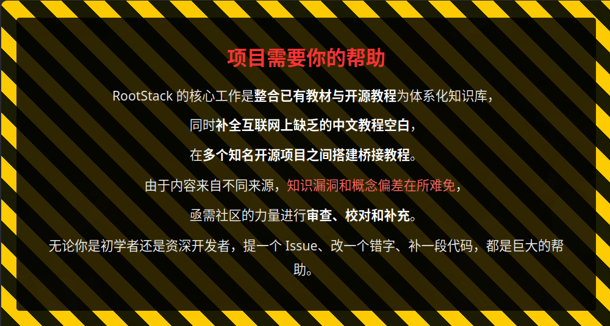

<h1 align="center">RootStack</h1>

<p align="center">
  <em>以 C 作为出发点，覆盖多领域、多计算机语言的百科全书式教程 —— C、C++、Python、Rust、数据结构与算法、Linux 系统、系统内核、汇编、网络安全（红队）</em>
</p>

<p align="center">
  
  
  
  
  
  
  
  
  
  
</p>

<p align="center">
  <a href="./git.md">Git 指南</a> · <a href="./github-settings.md">GitHub 设置</a> · <a href="./科学上网.md">科学上网</a> · <a href="./国际付费操作.md">国际付费</a> · <a href="./AI_Agent工具使用教程.md">AI Agent 工具</a> · <a href="./red_team/总目录与快速查询.md">红队知识库</a> · <a href="./ISSUES.md">参与贡献</a>
</p>

<p align="center">
  
</p>
<p align="center" style="margin-top: 12px;">
  <a href="#加入交流群" style="display: inline-block; background: #a29bfe; color: #ffffff; padding: 12px 40px; border-radius: 25px; text-decoration: none; font-weight: bold; font-size: 16px; box-shadow: 0 4px 15px rgba(162, 155, 254, 0.4);">加入我们 ♡</a>
</p>

---

<p align="center">
  <b>📖 静态网站：<a href="https://rootstack.misser.top">rootstack.misser.top</a></b>
</p>

---

## 关于本教程

本教程体系是一套以 C 语言为核心、向上延伸至 C++ 和数据结构、向下探及汇编和内核的完整知识库。教程使用 [Obsidian](https://obsidian.md/) 的双向链接 \`[[文件名]]\` 组织内容，形成相互引用的知识网络。

**路径说明**: 路径 A-D 是**通识学习路径**，适合所有计算机学习者；路径 E 是**职业分化路径**——网络安全（红队），基于 ArchStrike 体系，已覆盖 ~125 篇知识库文件。通识路径学完后，按兴趣选择职业方向。

**本教程有瑕疵**。教程内容包含 AI 辅助生成的部分，可能存在概念偏差、代码错误或总结不到位的情况。请读者始终保持批判性阅读，不要盲目照搬。如果你发现错误或有改进建议，请见 [[ISSUES|问题讨论区]]——我们非常欢迎你的议题和 Pull Request，项目组在经过实践检验和综合讨论之后会进行修改。

---

## 推荐学习环境：Linux

本教程涉及编译、链接、系统调用、内核模块、汇编等底层内容。在 Windows 下学习 C/系统编程，频繁遇到 PATH 差异、缺少标准工具链、权限模型不一致、ABI 不同步等问题，每个问题都在分散你对核心知识的注意力。**推荐使用 Linux 作为学习环境**，一次解决所有环境问题，把精力留给真正要学的东西。

### 新手推荐：Linux Mint

最推荐新手用来踩坑的发行版是 [**Linux Mint**](https://linuxmint.com/)。
- 基于 Ubuntu LTS，软件兼容性好，apt 生态成熟
- Cinnamon 桌面体验接近 Windows，上手成本低
- 开箱即用，不需要折腾就能进入学习状态

至于 Ubuntu 和 RHEL/Fedora，它们广为人知更多是因为企业/服务器市场占有率大（大多为企业程序员在使用），而非对新手友好。Mint 在桌面体验上反而更适合初学者。

如果你已经对 Linux 有一定了解，Debian、Fedora、openSUSE 都是不错的选择。想深入系统底层的话，Arch Linux 也值得尝试，但不建议作为入门首选。

### 快速入门

- [Linux Mint 官网](https://linuxmint.com/) — 下载安装、查看文档
- [Linux Mint 中文社区](https://linuxmint.com.cn/) — 中文资料与交流

---

## AI Agent 工具

AI Agent 工具是当前开发者生产力的核心加速器——它们不只是代码补全，而是能自主理解项目、读取文件、编辑代码、运行测试并迭代修复的"AI 协作者"。本教程体系本身就是在 Agent 工具的辅助下编写和维护的。

教程涵盖主流 Agent 工具（Claude Code、opencode、Cursor、GitHub Copilot 等）的推荐、安装、使用方式，以及作者的安全优先、性能至上、终端黑窗口的使用哲学。详见 [[AI_Agent工具使用教程]]。

---

## Obsidian 使用指南

本教程设计为在 Obsidian 中阅读以获得最佳体验（双向链接预览、图谱视图、可折叠答案）。以下是各平台的安装和导入方法：

### Linux

```bash
# Linux Mint / Ubuntu
sudo apt install obsidian

# Arch Linux
sudo pacman -S obsidian

# Flatpak (通用)
flatpak install flathub md.obsidian.Obsidian
```

### macOS

```bash
brew install --cask obsidian
```

### Windows

在 [obsidian.md/download](https://obsidian.md/download) 下载 `.exe` 安装包，运行安装即可。

### 导入本教程

1. 打开 Obsidian，点击 "Open folder as vault"
2. 选择本教程的根目录（即包含本 `README.md` 的文件夹）
3. Obsidian 会自动识别 `.obsidian/` 配置并加载所有双链接

导入后，从本文件（README）出发，通过 `双链接` 跳转到任意章节。阅读模式下按 `Ctrl/Cmd + 点击` 即可跳转。

---

## 教程体系结构

```
RootStack/                          ├ v0.8.0
├── README.md                    ← 你在这里
│
├── 路径A-C主线.md               C 主线: 从零到内核
├── 路径B-CPP主线.md             C++ 主线: 从零到应用开发
├── 路径C-C向下兼容C++.md        C → C++ 向下兼容
├── 路径D-DSA算法刷题.md         竞赛策略完全路线图 (力扣 + 多OJ)
├── 路径E-红队职业路径.md        网络安全职业路径 (含CTF→SRC/比赛分化)
├── 路径F-Rust学习路径.md        Rust 学习路径 (含力扣练习与竞赛OJ)
├── 算法/                         算法竞赛内容 (仅供 Path D 学习者)
│   ├── 算法技巧/ (28篇)          基础算法技巧 (数组/搜索/DP/图论等)
│   ├── 数学/ (5篇)               数论/组合数学/CRT (Phase 7)
│   ├── 搜索进阶/ (3篇)           双向搜索/A*/IDA* (Phase 8)
│   ├── DP优化/ (3篇)             单调队列/斜率/四边形不等式 (Phase 9)
│   ├── DP进阶/ (9篇)             区间DP/背包DP/树形DP/状压DP等 (Phase 6)
│   ├── 图论/ (15篇)              最短路/MST/拓扑排序/SCC/LCA/网络流等 (Phase 4)
│   ├── 字符串扩展/ (8篇)         Trie/SA/SAM/Z函数/回文自动机等 (Phase 6)
│   ├── 杂项技巧/ (4篇)           莫队/CDQ/整体二分/ODT (Phase 10)
│   ├── 题目/ (8篇)               算法题目存档
│   └── 计算几何/ (3篇)           二维几何/凸包/半平面交 (Phase 11)
│
├── c语言教程/                   C 语言: 入门 → 深化 → 库大全
│   ├── c目录.md
│   ├── 1入门/ (10篇)  2深化/ (9篇)  3数据结构/ (9篇)
│   └── 库大全/ → 容器类库/ 功能类库/ 第三方库/
│
├── cpp教程/                  C++ 教程: 基础 → 深化 → 容器库 → 功能库 → 第三方库
│   ├── cpp目录.md
│   ├── cpp基础教程/ (11篇)        cpp深化教程/ (16篇)
│   ├── 容器库/ (5子目录)       cpp功能库/ (8子目录)  cpp第三方库/ (11子目录)
│
├── rust/                       Rust 教程: 入门 → 深入 → 实践 → 工程 → 重构
│   ├── rust目录.md
│   ├── 1入门/ (14篇)             2深入/ (11篇)           3实践/ (6篇)
│   ├── 4工程/ (12篇)              5重构/ (6篇)
│
├── lua-tutorial/ (7篇)          Lua 教程: 简介 → 安装 → 基础 → 进阶 → 集成
│   ├── 00-lua简介.md             01-安装与环境配置.md    02-基础入门.md
│   ├── 03-进阶教程.md            04-C与C++集成.md
│   └── 05-Neovim示例.md          06-Love2D示例.md
│
├── 数据结构/ (21篇)             语言无关的数据结构教程 + DSA学习路线
│
├── 内核/ (~35篇)               四种内核 + C与Rust新时代 + Rust内核开发
│   ├── 系统内核/ (7篇)         语言运行时内核/ (7篇)
│   ├── 工具内核/ (7篇)         游戏引擎内核/ (7篇)
│   ├── Rust内核/ (6篇)         Rust 在内核中的实践
│   └── 内核索引.md              C与Rust的内核新时代.md
│
├── 汇编基础/ (3篇)              x86/ARM 汇编教程
│
├── red_team/ (~125篇)          网络安全红队职业路径 (ArchStrike体系)
│   ├── 网安基础知识/ (10篇)      渗透测试方法论
│   ├── 前端基础/ (25篇)          实战教程/ (13篇，含14天实训)
│   ├── archstrike-*教学/ (48篇) 10组ArchStrike工具教程
│   ├── 服务器部署与运维/ (4篇)   QQ Bot攻防实战
│   └── ctf_trea/ (7篇)          CTF竞赛知识库
│
├── git.md                       Git 与 GitHub 终端操作指南 (14节)
├── github-settings.md           GitHub 网页端设置指南（新增）
├── VERSION                      项目版本号: 0.8.0
└── ISSUES.md                   问题讨论与贡献指南
```

---

## 写在教程之前

本教程体系的目标是提供一套从 C 出发、延伸至系统底层的完整知识库，涵盖 C、C++、数据结构与算法、Linux 系统、操作系统内核、Rust 语言。我们追求的不是"一本通"的虚假承诺，而是一个结构清晰、双向链接、支持 AI 辅助学习的知识体系。

**核心原则**:

1. **精简内容，深入底层** -- 不在无关紧要处堆砌文字，关键节点深入讲解，其余留给读者思考。
2. **底层至上** -- C 和 C++ 不同于 Java/Python，它们靠近硬件。本教程体系涉及汇编、内存布局、指针本质等底层话题，从"CPU 看到了什么"的角度剖析。
3. **辩论式阅读** -- 希望读者带着批判态度阅读，将更多时间放在思考上。练习题的目的就是启发思考，不会就回去重想。
4. **双链接体系** -- 使用 Obsidian 双链接连接不同模块，形成计算机知识网络。
5. **不反对也不鼓吹 AI** -- 自我思考是第一要务，AI 工具进行辅助。推荐读者旁边开着 AI，遇到不懂的问题先自己对 AI 解释看法让其纠正，来形成自己的理解。
6. **实践为主，教程为辅** -- 真正的工程师经验来自项目堆砌和自我踩坑。本教程体系提供结构和指引，修炼靠个人。

---

## 内核 —— 技术栈的底层基石

C 语言之所以诞生，就是为了写操作系统内核。Dennis Ritchie 在 Bell Labs 创造 C 语言时，目标就是用它重写 Unix 内核（之前用汇编）。至今，Linux 内核（3000万行）、Windows NT 内核、FreeBSD 内核、以及几乎所有嵌入式 RTOS 都是用 C 写的。

### C 语言写内核的优势

- **零成本抽象**: C 的每个语法结构都直接映射到机器指令，没有隐藏的内存分配或运行时开销
- **直接硬件访问**: 指针可以映射到任意物理地址（MMIO），volatile 保证不会被优化掉
- **可预测的内存布局**: struct 的字段顺序和 padding 都是可控的
- **无运行时依赖**: 内核没有 libc，C 语言本身不需要运行时支持
- **ABI 稳定性**: C ABI 是事实上的跨语言标准，Rust/C++/Zig 都通过 C ABI 互操作

### 新时代: C 与 Rust 的结合

传统上 C 是内核的唯一选择。但约 70% 的 CVE 安全漏洞来自内存 bug。Rust 的所有权系统在编译期消除这些 bug，同时保持零成本抽象的承诺。

Linux 6.1 开始正式支持 Rust 内核模块。未来的趋势不是 C vs Rust，而是 **C AND Rust**：
- C 负责成熟稳定的核心子系统（调度器、内存管理、VFS）
- Rust 负责新开发的驱动和子系统（GPU driver、Binder、网络协议）
- 两者通过 C ABI 的 FFI 无缝交互

详见 [[内核/C与Rust的内核新时代|C与Rust的内核新时代]]

### 四种内核视角

| 内核类型 | 入口 | 代表 |
|---------|------|------|
| 系统内核 | [[ISSUES|C语言与操作系统]] | Linux, Windows, BSD |
| 语言运行时内核 | [[ISSUES|语言运行时内核索引]] | CRT, CPython, V8, JVM |
| 工具内核 | [[ISSUES|工具内核索引]] | SQLite, Redis, MySQL, Chromium |
| 游戏引擎内核 | [[ISSUES|游戏引擎内核索引]] | Unity, Unreal, raylib |

---

## 关于刷题

从工程化培训视角来看，算法竞赛并不是本教程体系下刷题的主要目的。刷题的唯一目的是**在自认为学会一个语法点或数据结构之后，去检验自己是否真的掌握了**。如果你阅读本教程的初衷不是为了竞赛，或者首要目标是步入工程化开发，我们不推荐将大量时间消耗在各大题库中。本教程在各章节末尾附带少量力扣题目，用于自检即可。

关于 AI 使用：题库平台普遍有反作弊机制。用 AI 进行**题目理解、思路讨论、代码审查**是安全且推荐的；但直接复制 AI 生成的代码提交到平台有封号风险。无论如何，本教程不推荐将刷题数量和排名放在自我思考之上。

### 推荐算法资源

以下开源项目可配合本教程的 DSA 模块使用：

| 项目 | 语言 | Stars | 说明 |
|------|------|-------|------|
| [OI-wiki](https://github.com/OI-wiki/OI-wiki) | 中文 | 26.3k | 编程竞赛百科，完整知识树，做题遇到不会的先查这里 |
| [TheAlgorithms/Python](https://github.com/TheAlgorithms/Python) | Python | 223k | 全部算法 Python 实现，教育级代码质量 |
| [TheAlgorithms/C](https://github.com/TheAlgorithms/C) | C | 22.2k | C 语言算法实现（本教程 C 主线的直接对照参考） |
| [TheAlgorithms/C-Plus-Plus](https://github.com/TheAlgorithms/C-Plus-Plus) | C++ | 34.5k | C++ 算法实现（本教程 C++ 主线的直接对照参考） |
| [TheAlgorithms/Java](https://github.com/TheAlgorithms/Java) | Java | 66k | Java 算法实现 |
| [TheAlgorithms/Rust](https://github.com/TheAlgorithms/Rust) | Rust | 25.9k | Rust 算法实现 |
| [TheAlgorithms/Go](https://github.com/TheAlgorithms/Go) | Go | 18.1k | Go 算法实现 |
| [awesome-algorithms](https://github.com/tayllan/awesome-algorithms) | 资源列表 | 25.4k | 算法学习精选书单/课程/竞赛网站/可视化工具 |
| [Algo-Atlas](https://github.com/lvy010/Algo-Atlas) | C++/Py | 493 | LeetCode 2000 题/8 月刷题计划，含完整分类笔记 |

详细用法见 [[路径D-DSA算法刷题#推荐算法资源|路径 D 的推荐资源章节]]。

---

## 学习路径（通识）

以下五条路径覆盖 C、C++、DSA、Rust 四大方向，适合所有计算机学习者，章节级阅读顺序、推荐阅读物、语言官方文档链接均已标注。

| 路径 | 文件 | 适合人群 |
|------|------|---------|
| A: C 主线 | [[ISSUES|路径A-C主线]] | 系统编程/嵌入式/内核开发 |
| B: C++ 主线 | [[ISSUES|路径B-CPP主线]] | 应用开发 + 底层贯通 |
| C: C→C++ | [[ISSUES|路径C-C→C++]] | 先 C 后 C++ 向下兼容 |
| D: DSA 刷题 | [[ISSUES|路径D-DSA算法刷题]] | 数据结构与算法/力扣练习/竞赛入门 |
| F: Rust 学习 | [[ISSUES|路径F-Rust学习路径]] | C++ 之后的系统编程进阶 |

## 职业路径（分支）

以下路径为**职业方向分化**，前五条是通识基础，不分方向都可学习；从这里开始进入具体职业领域，需要通识基础作为前置。

| 路径 | 文件 | 适合人群 |
|------|------|---------|
| E: 红队 (ArchStrike) | [[ISSUES|路径E-红队职业路径]] | 网络安全/渗透测试/CTF/红队攻防，含CTF→SRC/比赛分化 |

> 本教程体系可当作类百科全书使用，内容完善但体量庞大。若作为教程从头通读，效率不高。建议按照路径文件中的推荐阅读顺序，结合索引文件进行选择性学习。同时推荐与 AI 进行问答互动学习——在自认为掌握语法或数据结构之后，去 [力扣](https://leetcode.cn/) 做几道题验证即可。如遇到错误，不建议死磕，可用 AI 辅助纠正思路。

---

## 关于网络安全发行版

目前主流的面向网络安全的专用 Linux 发行版主要分三个体系：

1. **Kali Linux**（Debian 系）—— 由 Offensive Security 维护，最广为人知，工具齐全，基于 Debian 稳定版，适合从 Debian/Ubuntu 转过来的用户
2. **Arch 系（BlackArch / ArchStrike）** —— 滚动更新，工具库极大（BlackArch 有 2800+ 工具），DIY 程度高，适合熟悉 Arch 的用户
3. **Parrot OS**（Debian 系，独立分支）—— 轻量、注重隐私和开发环境，CTF 场景常见，介于 Kali 和日常使用之间

每个体系各有优劣：Kali 装完即用但臃肿；Arch 系灵活但需要一定 Linux 基础；Parrot 在资源和功能之间平衡较好。

RootStack 的网安部分基于 **ArchStrike（Arch 体系）**，因此要求使用者掌握 Arch Linux 的基本操作。但网安知识本身与发行版无关——即使你使用其他体系，知识点仍然适用。

另外，不一定要装专门的网安系统。**Windows + 合适的工具 + 自己写的脚本**，同样可以完成出色的安全测试工作。选择哪个发行版取决于你的使用习惯和具体场景。

---

## 各模块入口速查

| 模块 | 入口 | 说明 |
|------|------|------|
| C 语言 | [[ISSUES|C 教程目录]] | 入门 → 深化 → 3数据结构 → 库大全 |
| C++ | [[ISSUES|C++ 教程目录]] | 基础 → 深化 → 容器库 → 功能库 → 第三方库 |
| 数据结构 | [[ISSUES|DSA 学习路线]] | 18个主题, Phase 1→6, 力扣题目 |
| 算法技巧 | [[ISSUES|动态规划]] | 24个算法专题, 语言无关 |
| 内核 | [[ISSUES|内核总索引]] | 四种内核 + C与Rust新时代 |
| 汇编 | [[ISSUES|寄存器与指令基础]] | x86/ARM 汇编入门 |
| 红队 | [[ISSUES|红队知识库总目录]] | ArchStrike渗透体系, ~125篇, 职业路径 |
| AI Agent | [[AI_Agent工具使用教程]] | 编码 Agent 工具推荐、安装、使用哲学 |

---

## 力扣即时练习

本教程体系以 [力扣 (LeetCode)](https://leetcode.cn/) 为推荐的日常练习平台。各语言基础、数据结构章节末尾附带对应力扣题目类型指引。

**学习路线** → 力扣 (适合求职/工程/理解数据结构)  
**竞赛路线** → 洛谷 + Codeforces + POJ/HDU + AtCoder (适合走算法竞赛的选手)

郑重提醒：刷题的意义在于**自检**，不在于数量和排名。每学完一个主题做 2-4 道题验证理解即可。关于 AI 与刷题的边界：用 AI 讨论题目思路是好的，但直接复制 AI 生成的代码提交有被检测和封号的风险。

---

## 快速参与贡献

RootStack 欢迎任何人贡献内容、修正错误或提出建议。

### 网页端操作（无需安装 Git）

1. **Fork 本项目** — 打开 GitHub 项目页，点击右上角 `Fork` 按钮
2. **提建议** — 点击仓库上方的 `Issues` 标签 → `New Issue`，描述你的问题或想法
3. **在线修改并提交 PR** — 在 GitHub 网页上浏览到要修改的文件，点击  编辑按钮 → 修改 → `Commit changes` → 选择 `Create a new branch` → `Propose changes` → 点击 `Create Pull Request`
4. **Fork 后如何同步上游** — 在 GitHub 网页上，你的 fork 仓库页点击 `Sync fork` → `Update branch`

### 终端操作（专业流程）

详见 [[git|Git 与 GitHub 终端操作指南]]，包含从安装到 PR 合并的完整教程。

```
# 极简流程：Fork → Clone → 修改 → PR
git clone https://github.com/你的用户名/RootStack.git
cd RootStack
git remote add upstream https://github.com/原项目名/RootStack.git
git checkout -b my-feature
# 修改文件...
git add .
git commit -m "说明你的修改"
git push origin my-feature
# 然后去 GitHub 网页点 "Compare & pull request"
```

### Git 安装（各平台）

| 平台 | 安装命令 | 备注 |
|------|---------|------|
| Linux (Debian/Ubuntu) | `sudo apt install git` | |
| Linux (Arch) | `sudo pacman -S git` | |
| macOS | `brew install git` | 也可从 git-scm.com 下载 .dmg |
| Windows | `winget install Git.Git` 或从 git-scm.com 下载 exe | |

**作者观点**：推荐使用终端里的原生 Git，而不是 `git.exe` 或 IDE 内置的 Git GUI。终端 Git 给你完整的能力、一致的跨平台体验，以及对每一步操作的掌控感。图形化的 Git 工具适合查看历史，但日常操作建议回归命令行。

---

## ⭐ 求 Star

如果这个项目对你有帮助，欢迎在 [GitHub](https://github.com/missercatos/RootStack) 点个 **Star** ⭐ (｡>﹏<｡) 你的支持是我们更新的动力！

---

## 致谢

本教程体系的开发过程中使用了以下 AI 辅助工具：

- [opencode](https://opencode.ai) — 项目重构与内容批量处理
- [Claude Code](https://docs.anthropic.com/en/docs/claude-code) — 方案设计、内容编写与代码审查

关于这些工具的详细介绍、安装使用、安全风险及作者的 Agent 使用哲学，见 [[AI_Agent工具使用教程]]。

感谢所有通过 [[ISSUES|问题讨论区]] 和 Pull Request 参与贡献的读者。

---
## 近期任务

 主要是两大任务，撰写密码学部分，与筛查优化数据结构部分。
 本教程虽然是整合了已有的开源知识。但是大部分需要手动筛查和优化，即使有AI辅助也很难做完。另外本教程还有一些是没有被开源的教程，我们需要自己去探索撰写。工作量更添甚多，我们需要帮助！！！
 有意向者欢迎加入我们QQ群，即使是进来加油打气，提出意见也行！
 
---
## 近期更新

> 以下为项目管理员维护的更新日志。新增内容、删除内容、重大修改请在此处简要记录。

| 日期   | 变更类型      | 说明                                                                                               |
| ---- | --------- | ------------------------------------------------------------------------------------------------ |
| 7.13 | 首次提交项目    | 将作者以前的cpp_deep,c-learning项目整合起来并删减整理形成的一套教程                                                      |
| 7.17 | 新增职业路径    | red_team/网络安全模块(~125篇, ArchStrike体系), 路径E红队职业路径, 学习/职业路径区分                                       |
| 7.18 | OI-wiki移植 | 从 OI-wiki 移植 32 篇算法文件: 图论(15篇) + 字符串扩展(8篇) + DP进阶(9篇), 新建 算法/图论/ 算法/字符串扩展/ 算法/DP进阶/              |
| 7.18 | Rust 教程整合 | 新增 Rust 教程体系 (~55篇: 入门14+深入11+实践6+工程12+重构6)，路径F-Rust学习路径，rust目录.md 索引，Rust内核融入 内核/Rust内核/，跨模块双链接 |
| 7.20 | 新增密码学     | 密码学是计算领域的一门重要学科，所以创建密码学部分。专门列一个类目。                                                               |
| 7.22 | 网站上线       | 部署至 Cloudflare Pages，域名 rootstack.misser.top，GitHub Actions 自动发布                            |
| 7.22 | 内容更新       | Linux 推荐改为 Mint，新增网安发行版说明，增加求 Star 链接，版本升至 0.5.0
| 7.31 | 新增Lua教程     | 新增 lua-tutorial/ (7篇: 简介+安装+基础+进阶+C/C++集成+Neovim+Love2D)，双链接接入 README/index，版本升至 0.8.0


## 加入交流群

欢迎加入 QQ 群交流学习：


二维码失效或群满请通过 [[ISSUES|问题讨论区]] 联系管理员更新。
