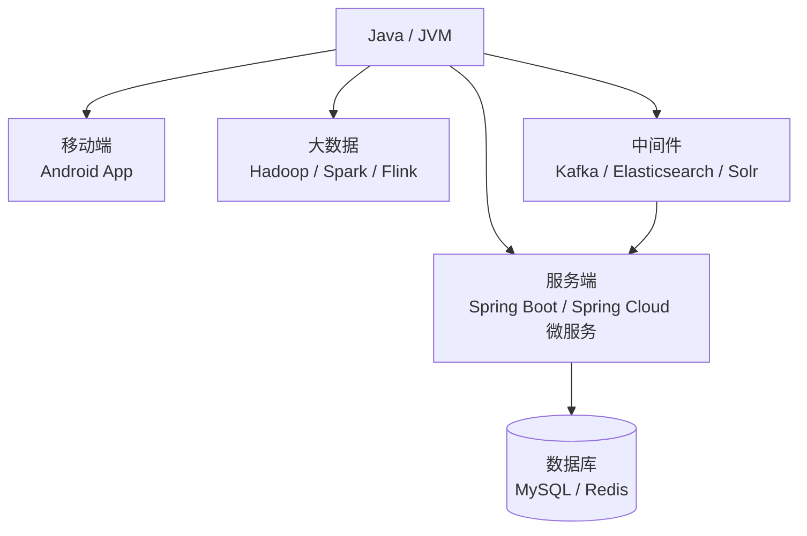
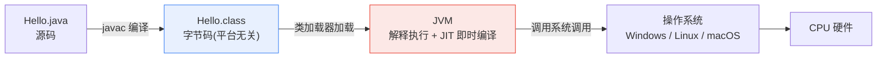
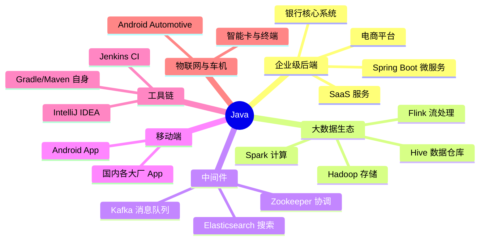
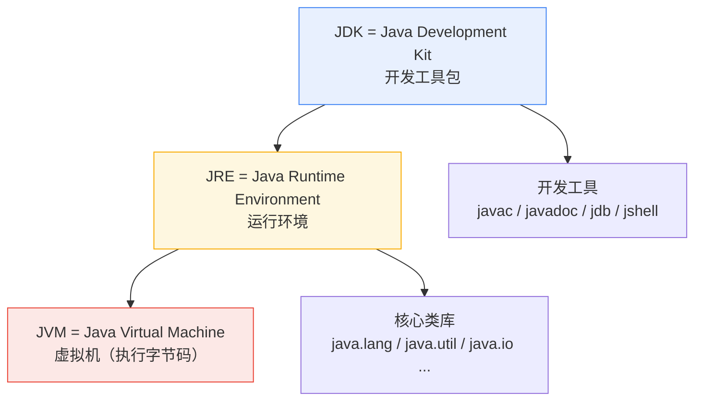
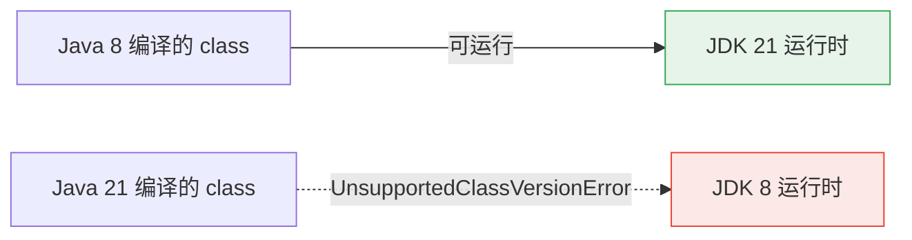
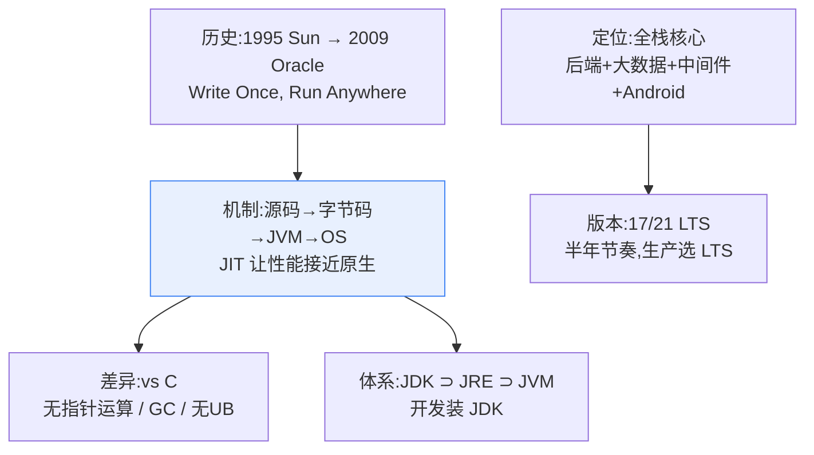

# 00 Java 是什么

在写第一行 Java 代码之前，先回答三个问题：Java 从哪来？它能干什么？和你已经会的 C 比有什么不同？本章不写代码，但决定了你后面学每一节时能否"知其所以然"。

---

## 一、Java 的历史与现状

### 1.1 简史

| 年份 | 事件 |
|------|------|
| 1991 | Sun Microsystems 的 Green 项目启动，目标语言叫 Oak（橡树），最初瞄准机顶盒等嵌入式设备——和 C 语言诞生时服务于 UNIX 系统有相似的工程动机 |
| 1995 | 更名 Java 正式发布，主打口号 **"Write Once, Run Anywhere"**（一次编译，到处运行） |
| 1996 | JDK 1.0 发布 |
| 2004 | J2SE 5.0 引入泛型、枚举、注解、自动装箱——现代 Java 语法的基石在这一版定型 |
| 2006 | Sun 开源 Java，OpenJDK 项目诞生 |
| 2009 | Oracle 收购 Sun，Java 归入 Oracle 麾下 |
| 2014 | Java 8 发布：Lambda 表达式与 Stream API，Java 史上最重要的版本之一 |
| 2018 | 版本节奏改为**每半年一版**，Oracle JDK 商用收费，开源发行版（Temurin 等）崛起 |
| 2021 | Java 17 LTS 发布 |
| 2023 | Java 21 LTS 发布：虚拟线程正式转正 |

### 1.2 现状

- **企业级后端第一语言**：全球银行、保险、电信、电商的后端系统大量由 Java 构建。TIOBE 与各类开发者调查中 Java 长期稳居前四
- **大数据领域的通用语**：Hadoop、Spark、Flink、Kafka、Elasticsearch 全部是 JVM 系项目
- **Android 的官方语言**：直到 Kotlin 兴起前是 Android 开发的唯一官方选择，存量 App 海量
- **就业市场的常青树**：国内后端岗位招聘量最大的单一技术栈
- **持续进化中**：半年一版的高频节奏让 Java 摆脱了"老态"标签——虚拟线程（21）、模式匹配、record 类等现代特性正在快速补齐与 Kotlin/Go 的人机工程差距

一句话总结：C 教你计算机如何工作，**Java 教你大型软件系统如何工作**。

一个值得玩味的事实：Java 被唱衰的每一年（2010 年代至今从未间断），它的招聘量和企业存量都在增长。"Java 已死"是技术圈持续时间最长的谣言。


---

## 二、定位：为什么说 Java 有全栈优势

"全栈"在这里不是指前端+后端，而是指**一种语言覆盖从客户端到服务端到中间件的整条链路**：



逐项展开：

| 领域 | 代表技术 | 说明 |
|------|---------|------|
| 后端 Web | Spring Boot、Spring Cloud | 全球后端事实标准；REST API、微服务、消息队列一站式解决。国内互联网大厂的后端主力语言 |
| 大数据 | Hadoop、Spark、Flink | 框架本身是 JVM 程序；Flink 原生 API 就是 Java/Scala。数据工程师的日常就是写 JVM 代码或调优 JVM 进程 |
| 中间件 | Kafka、Elasticsearch | 运维调优需要懂 JVM 内存与 GC，否则只能"盲调"——堆大小、GC 器选择、GC 日志分析都是 JVM 知识的直接应用 |
| 移动端 | Android (Java/Kotlin) | JVM 字节码运行在 ART 虚拟机上，语法与标准库高度同源 |
| 工具与桌面 | IntelliJ IDEA 本身 | 你以后天天用的 IDEA，就是用 Java（Kotlin）写的；Jenkins、各类企业内部工具同理 |

一个具体例子串起整条链路：你在电商点一次"提交订单"——

1. Android 客户端（Java/Kotlin）发起 HTTPS 请求
2. 网关层是 Spring Cloud Gateway（Java）
3. 订单服务是 Spring Boot 微服务（Java），从 Kafka（JVM）消费库存扣减消息
4. 搜索联想走 Elasticsearch（JVM），风控规则引擎可能还是 Java
5. 数据落库 MySQL，日志进 Flink（JVM）实时计算

全程没有离开过 JVM 生态——这就是"一种语言打通全栈"的直观含义。

对比 C/C++：它们贴近硬件，适合操作系统、驱动、嵌入式、游戏引擎；但在业务系统层面，手动内存管理和缺乏标准库生态让开发效率急剧下降。**Java 抽象掉了硬件细节（没有指针运算），却保留了编译型语言的性能下限和静态类型的工程严谨性**——这正是它成为企业级主力的原因。

---

## 三、JVM：一次编译，到处运行的原理

这是 Java 与 C 最本质的区别，必须彻底搞懂。

C 的编译流程：源码直接编译成**特定平台**的机器码。在 x86 Linux 上编译出的可执行文件，拿到 ARM macOS 上完全无法运行。

Java 的做法是在中间插入一层抽象——**字节码（bytecode）+ Java 虚拟机（JVM）**：



关键点：

1. `javac` 不把源码编译成机器码，而是编译成一种中间格式——字节码（`.class` 文件）
2. 字节码是平台无关的：同一份 `.class` 可以在任何装了 JVM 的系统上运行
3. JVM 在运行时负责执行字节码：早期版本纯解释执行（慢）；现代 JVM 使用 **JIT（Just-In-Time）即时编译**，把热点代码（反复执行的片段）动态编译成本地机器码——这就是"Java 比 C 慢但不慢很多"的原因
4. 平台差异被 JVM 吸收了：Windows 的 JVM 和 Linux 的 JVM 内部实现不同，但对上层字节码的接口一致

与 C 对比：

| 维度 | C | Java |
|------|---|------|
| 编译产物 | 平台专属机器码 | 平台无关字节码 |
| 执行者 | CPU 直接执行 | JVM 执行（含 JIT 编译为机器码）|
| 跨平台方式 | 各平台重新编译 | 一份 class 到处运行 |
| 性能上限 | 极高（无中间层）| 高（JIT 后接近 C，GC 有开销）|
| 启动速度 | 快 | 较慢（需启动 JVM）|

> 类比：你在 [[python/python目录|Python 教程]] 里见过 CPython 也把源码编译成字节码再由虚拟机执行——思路相同，区别在于 JVM 有 JIT 且性能高得多。

---

## 四、与 C/C++/Python/Rust 详细对比

### 4.1 全景对比表

| 维度 | C | C++ | Java | Python | Rust |
|------|---|-----|------|--------|------|
| 类型系统 | 静态弱类型 | 静态强类型 | 静态强类型 | 动态强类型 | 静态强类型 |
| 内存管理 | 手动 malloc/free | 手动 new/delete + RAII | GC 自动回收 | GC（引用计数为主）| 所有权系统，编译期检查 |
| 指针 | 有，可运算 | 有，可运算 | 无指针运算，只有引用 | 无（一切都是引用）| 无裸指针（unsafe 除外）|
| 编译方式 | AOT 编译到机器码 | AOT 编译到机器码 | 编译到字节码 + JIT | 解释执行（含字节码）| AOT 编译到机器码 |
| 性能 | 最高 | 最高 | 高（约为 C 的 50%-90%）| 低（慢 10-100 倍）| 接近 C/C++ |
| 标准库 | 极简 | 中等 | 庞大且统一 | 庞大 | 中等偏大 |
| 生态重心 | 系统/嵌入式 | 游戏/高性能计算 | 企业后端/大数据/Android | 脚本/AI/数据 | 系统工具/基础设施 |
| 学习曲线 | 低→陡（内存）| 陡 | 平缓→中等 | 最平缓 | 陡（所有权）|
| 典型产物 | 内核、驱动 | 游戏引擎、浏览器 | 银行系统、Kafka | 爬虫、AI 脚本 | 重写 C/C++ 组件 |

### 4.2 从 C 视角看 Java 的关键差异

| C 中的概念 | Java 中的对应物 | 备注 |
|-----------|----------------|------|
| `char*` 字符串 | `String` 对象，不可变 | 不再有 `\0` 结尾符，长度由对象自己记录 |
| `struct` | `class` | 天然带方法与访问控制 |
| 函数指针 | Lambda / 方法引用 / 接口 | 类型安全的函数式支持 |
| `malloc/free` | `new` 分配，GC 自动回收 | 没有 free，没有悬垂指针，但有内存泄漏的可能（失去引用的对象被持有）|
| 头文件 `.h` | 无 | import 直接读字节码的元信息 |
| 宏 `#define` | 无 | 用 `static final` 常量替代 |
| 多文件 include | 包（package）+ import | 层级化命名空间 |
| `union` | 无 | 用类继承体系表达 |
| 未定义行为 UB | 明确定义的行为 | 数组越界必抛异常而非静默踩内存 |
| `sizeof` | 无必要 | 类型大小由规范固定，与平台无关 |

---

## 五、Java 应用场景全景



注意一个反直觉的事实：**你每天使用的互联网服务里，Java 出现的频率远高于你的感知**——下单支付走的是 Java 微服务，商品搜索背后可能是 Elasticsearch（JVM），订单消息流转经过 Kafka（JVM）。

---

## 六、JDK / JRE / JVM 关系

三个缩写经常混用，必须分清：



| 名称 | 全称 | 包含什么 | 给谁用 |
|------|------|---------|--------|
| JVM | Java Virtual Machine | 字节码执行引擎 | 是 JRE 的一部分，不单独分发 |
| JRE | Java Runtime Environment | JVM + 核心类库 | 只想**运行** Java 程序的用户 |
| JDK | Java Development Kit | JRE + 编译器 + 工具（javac/javadoc/jshell 等）| 要**开发** Java 程序的我们 |

> 注：JDK 11 之后 Oracle 不再单独提供 JRE 发行包，装 JDK 即可。服务器上若只运行不开发，可选 headless/JRE 精简包（见 [[1入门/02_Linux环境配置|Linux 环境配置]]）。
>
> 与 C 对比：JDK ≈ gcc/gcc-devel 全套工具链；JRE ≈ libc 运行时；JVM ≈ 没有严格对应物，可以粗略类比为一个"进程级虚拟机监控器"，但它虚拟的不是整机而是"一台会执行 Java 字节码的机器"。

记忆技巧：装的东西永远是最大的那个圈——**开发者无脑装 JDK**；"我电脑上能跑 Java 程序吗"问的是 JRE；"字节码到底在哪执行"答案是 JVM。三者是包含关系而非并列关系。


---

### 7. 版本演进速览

| 版本 | 年份 | 类型 | 关键特性 |
|------|------|------|---------|
| Java 8 | 2014 | LTS | Lambda 表达式、Stream API、接口默认方法、新日期时间 API |
| Java 11 | 2018 | LTS | 单文件直接运行 `java Hello.java`、HttpClient 标准化、ZGC 实验 |
| Java 17 | 2021 | LTS | sealed 密封类、switch 模式匹配预览、record 记录类、移除废弃项 |
| Java 21 | 2023 | LTS | **虚拟线程**（高并发利器）、模式匹配 for switch 转正、分代 ZGC |
| Java 22-25 | 2024-2025 | 非 LTS | 结构化并发预览、值对象等持续演进 |

学习策略建议：

- **主线学 17/21**：本教程所有代码兼容两者
- **了解 8**：工作中大概率会遇到遗留系统，语法子集即可，不必专门去学旧写法
- **关注 21 的虚拟线程**：它改变了 Java 并发编程的写法，深入篇会讲

LTS（Long-Term Support）意味着 Oracle 及各发行版承诺长期维护（通常 5 年以上）。生产环境和学习都应该选 LTS。

版本兼容性心智模型：



即：字节码向下兼容运行时，高版本编译的程序无法在低版本 JVM 跑。这也是企业升级 JDK 缓慢的原因——升运行时安全，降级不可能。


---

## 九、Java 的两种含义：语言与平台

初学者常被"Java"这个词搞晕，因为它同时指两样东西：

| 含义 | 内容 | 类比 |
|------|------|------|
| Java 语言 | 语法、关键字、类型系统——你写的那门语言 | C 语言 |
| Java 平台 | JVM + 标准类库（JDK）构成的运行环境 | glibc + 系统调用接口 |

平台之上不止一门语言：Kotlin、Scala、Groovy、Clojure 都编译成同样的字节码跑在同一个 JVM 上。这意味着：

1. 你学的 JVM 知识对 Kotlin/Scala 同样有效
2. 标准类库（java.util 等）是所有这些语言共享的地基
3. "学 Java"实际上是"语言学一遍 + 平台吃透"，本教程深入篇的重心就在平台层

字节码长什么样？看一眼建立直观：

```bash
javac Hello.java
javap -c Hello    # javap 是 JDK 自带的反汇编器,-c 输出字节码指令
```

输出片段：

```text
public static void main(java.lang.String[]);
  Code:
     0: getstatic     #7   // Field java/lang/System.out:...
     3: ldc           #13  // String Hello, World!
     5: invokevirtual #15  // Method java/io/PrintStream.println:...
     8: return
```

`getstatic`、`ldc`、`invokevirtual` 这些就是 JVM 的"机器码"。对比 objdump 看 x86 指令的体验：层次不同，但都是"编译产物"。深入篇会回来看它。

---

## 十、C 视角常见疑问 FAQ

**Q：没有指针，那怎么实现链表？**
用引用。`class Node { Node next; }` ——引用可以指向对象但不能做算术运算。能做的（指向、判空）都保留，不能做的（p++、强转 int）被禁止。

**Q：没有 free，内存泄漏还存在吗？**
存在，但形态变了。GC 回收"不可达"对象；如果一个还活着的长生命周期集合不断持有新对象的引用，对象永远可达、永远不回收——这叫逻辑泄漏（如忘记从静态 Map 中移除条目）。深入篇讲内存模型时细说。

**Q：数组越界抛异常，性能不是很差吗？**
边界检查有 JIT 优化空间（循环中可消除冗余检查）；而 C 里越界是缓冲区溢出漏洞的头号来源。Java 选择"慢一点但安全"，企业软件的价值取向正在于此。

**Q：Java 慢在哪，又快在哪？**
慢在启动（加载 JVM 与类）、GC 停顿、无法像 C 那样精确控制内存布局；快在 JIT 对热点代码的激进优化（内联、逃逸分析），长期运行的服务端程序吞吐量可达 C 的同量级。所以 Java 统治"长时间运行的常驻服务"，而非操作系统内核。

**Q：为什么 main 要写一长串 public static void？**
public 让 JVM 可见；static 表示无需实例化类即可调用（JVM 启动时还没有对象）；void 因为退出码走 System.exit；String[] args 接命令行参数。每一环都被 JVM 规范钉死，不是语法糖而是协议。

**Q：Java 是编译型还是解释型语言？**
都不是/都是——这个二分法对 Java 失效。它先编译（javac → 字节码），再解释执行 + JIT 编译（字节码 → 机器码）。更准确的描述是"运行在虚拟机上的静态编译语言"。CPython 同理（见 [[python/python目录|Python 教程]] 的字节码章节），只是没有 JIT。

**Q：为什么企业不直接用 C++ 写后端？**
C++ 后端不是不行（游戏服务器、高频交易在用），而是团队协作成本高：手动内存管理的 bug 率、缺乏统一标准库、每个团队一套代码风格。Java 用"牺牲一点性能上限"换来"千人协作不出大乱子"，这正是银行系统的需求排序。

---

## 十一、一张图总结本章



如果只带走三句话：

1. Java = 静态类型语言 + 字节码 + JVM，平台差异被虚拟机吸收
2. 它用 GC 换走了 malloc/free，用异常换走了 UB，用引用换走了指针运算
3. 学 Java 就是同时学一门语言和一个庞大的平台生态，本教程两条线并行

---

## 十二、本章小结

- Java 1995 年诞生，主打"一次编译到处运行"，如今是企业级后端第一语言
- 全栈优势：Spring（后端）+ Hadoop/Flink（大数据）+ Kafka/ES（中间件）+ Android（移动端）全是 JVM 系
- 核心机制：javac 把源码编译成字节码，JVM 加载字节码并经 JIT 编译执行，平台差异被 JVM 吸收
- 与 C 最大差异：无指针运算、GC 自动管理内存、数组越界有明确异常而非 UB
- JDK ⊃ JRE ⊃ JVM；开发装 JDK，只运行装 JRE
- 选 JDK 17 或 21 LTS 作为学习版本

## LeetCode 巩固

本章是概念章，暂不需要写代码。作为开胃预告，建议先注册 LeetCode 账号，从入门篇第 05 章开始，每章末尾都会配一道对应主题的真实题目：

[两数之和](https://leetcode.cn/problems/two-sum/) —— 学完 [[1入门/05_第一个程序与jshell|第一个程序与 jshell]] 后，你可以尝试用暴力双循环解出它，验证环境是否正常。届时我们会给出完整题解。

提前预告后续各章的配套题目主题：变量与类型章对应整数反转类题目，循环章对应回文数，数组章对应删除有序数组重复项——每道都选自真实题库，学完当章语法就能独立完成。

下一章开始动手：[[1入门/01_Windows环境配置|Windows 环境配置]] / [[1入门/02_Linux环境配置|Linux 环境配置]] / [[1入门/03_macOS环境配置|macOS 环境配置]]，按你的系统选读其一。
