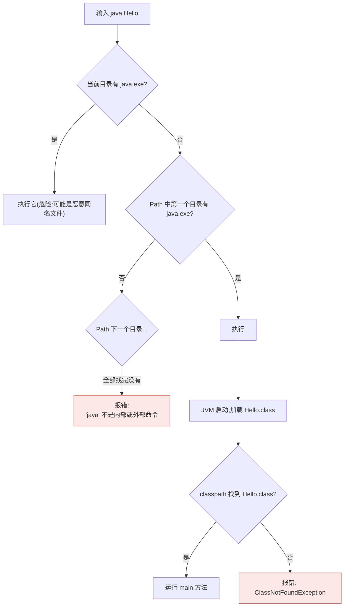

# 01 Windows 环境配置

Windows 是最多初学者的起点，也是环境变量问题的高发地。本章给出三条安装路线（官方 MSI / winget / Scoop-Chocolatey），并彻底讲清 `JAVA_HOME` 与 `Path` 的配置原理——理解原理后，"javac 不是内部或外部命令"这类报错你将永远不需要再搜。

---

## 一、JDK 发行版怎么选

Java 有个 C 世界没有的现象：语言规范开源，任何组织都可以基于 OpenJDK 打包发行自己的 JDK。常见选择：

| 发行版 | 维护方 | 免费 | 特点 | 推荐场景 |
|--------|--------|------|------|---------|
| Oracle JDK | Oracle | 有限制（商用需授权，NFTC 许可下特定版本免费）| 官方血统 | 个人学习可用 |
| **Eclipse Temurin**（原 AdoptOpenJDK）| Eclipse 基金会 | 完全免费，长期更新 | 社区事实标准，构建流程透明 | **首选推荐** |
| Amazon Corretto | AWS | 免费 | AWS 云环境优化 | 用 AWS 时可选 |
| Microsoft OpenJDK | 微软 | 免费 | Azure 环境优化、Windows 支持好 | 深度 Windows 用户 |
| Zulu | Azul | 免费 | 构建版本齐全 | 需要冷门老版本时 |
| GraalVM | Oracle | 免费 | 支持 AOT 编译成原生镜像 | 进阶：深入篇之后再碰 |

> 对比 C：这相当于 gcc/clang/msvc 之外又多了一层"同一编译器的不同打包商"。所有主流 JDK 都源自同一个 OpenJDK 代码库，**日常学习选 Temurin 即可，不必纠结**。

版本选 **JDK 21（或 17）LTS**，理由见 [[00_Java是什么|上一章]]。

---

## 二、方式一：官方安装包（MSI）

最直观的方式，适合第一次接触。

### 2.1 下载

1. 打开 <https://adoptium.net/>
2. 页面会自动识别你的系统，确认选择：
   - Operating System: Windows
   - Architecture: x64（Intel/AMD 芯片）；ARM 设备选 aarch64
   - Package Type: **MSI**
   - Version: **21 - LTS**
3. 点击 Latest LTS Release 下载

### 2.2 安装

双击 MSI 运行，安装过程中有两处关键选项：

1. 在 "Custom Setup" 页面，展开 `Adoptium Temurin JDK` 下的子项，确保以下功能被设为"安装到本地硬盘"：
   - **Add to PATH** —— 自动把 java/javac 加入 Path
   - **Set JAVA_HOME variable** —— 自动设置 JAVA_HOME
2. 其余保持默认，一路 Next 完成安装

默认安装路径为 `C:\Program Files\Eclipse Adoptium\jdk-21.x.x-hotspot\`。记下这个路径，后面手动配置时要用。

### 2.3 验证

打开一个新的命令提示符（Win+R 输入 cmd；必须是新窗口，旧窗口不会读到新环境变量）：

```bash
java -version
javac -version
where java
```

预期输出：

```text
openjdk version "21.0.x" 2025-xx-xx
OpenJDK Runtime Environment Temurin-21.0.x+x ...
OpenJDK 64-Bit Server VM Temurin-21.0.x+x ...

javac 21.0.x

C:\Program Files\Eclipse Adoptium\jdk-21.0.x-hotspot\bin\java.exe
```

注意 `java` 和 `javac` 是两个不同的程序：

| 命令 | 作用 | C 中的对应 |
|------|------|-----------|
| `java` | 启动 JVM 运行字节码 | 运行 `./a.out` |
| `javac` | 把 .java 编译成 .class | `gcc -c` |

---

## 三、方式二：winget 安装（推荐给 Win10/11）

winget 是 Windows 11 自带的官方包管理器——类比 Linux 的 apt/dnf。如果你还在用"下载 exe 双击"的思路装软件，这是改变习惯的第一步。

```powershell
# 检查 winget 可用（Win11 自带，Win10 需装 App Installer）
winget --version

# 安装 Temurin JDK 21
winget install EclipseAdoptium.Temurin.21.JDK

# 安装完成后开新终端验证
java -version
javac -version
```

winget 安装的 Temurin MSI 同样包含 Add to PATH 与 Set JAVA_HOME 功能，无需手动配置。

常用 winget 技巧：

```powershell
# 搜索所有可用的 JDK 包
winget search jdk

# 查看已安装的 JDK 信息
winget list --name Temurin

# 卸载
winget uninstall EclipseAdoptium.Temurin.21.JDK
```

---

## 四、方式三：Scoop / Chocolatey

适合已经深度使用包管理器、喜欢把软件集中管理在用户目录的读者。

### 4.1 Scoop（无管理员权限，干净）

```powershell
# 若尚未安装 scoop（PowerShell 中执行）
Set-ExecutionPolicy RemoteSigned -Scope CurrentUser
irm get.scoop.sh | iex

# 添加 extras 或 java bucket（Scoop 按 bucket 组织软件源）
scoop bucket add java

# 安装 OpenJDK 21
scoop install java/temurin21-jdk

java -version
```

Scoop 的特点：一切安装在 `~/scoop/` 用户目录下，不污染系统注册表；多版本切换用 `scoop reset temurin17-jdk` 即可。

### 4.2 Chocolatey（需要管理员权限）

```powershell
# 管理员 PowerShell 中执行
choco install temurin21 -y

java -version
```

三种方式对比：

| 方式 | 上手难度 | 多版本支持 | 是否需要管理员 | 推荐指数 |
|------|---------|-----------|--------------|---------|
| 官方 MSI | 低 | 手动 | 需要 | 初学者首选 |
| winget | 低 | 装多个包 | 需要（部分情况）| 推荐 |
| Scoop | 中 | 优秀（reset 切换）| 不需要 | 进阶推荐 |
| Chocolatey | 中 | 一般 | 需要 | 已有 choco 就用它 |

---

## 五、JAVA_HOME 与 Path 环境变量详解

如果 MSI/winget 已经自动配置好了，这一节仍然值得读完——面试和排障都会考这个。

### 5.1 为什么需要这两个变量

- **JAVA_HOME**：指向 JDK 根目录（如 `C:\Program Files\Eclipse Adoptium\jdk-21.0.5-hotspot`）。很多第三方工具（Maven、Gradle、Tomcat、各类 IDE）不直接找 java.exe，而是先读 JAVA_HOME 再拼出 bin 路径。它是 Java 生态约定俗成的"锚点"
- **Path**：操作系统查找可执行程序的目录列表。你在 cmd 里敲 `java` 时，系统按顺序在 Path 的每个目录中寻找 `java.exe`

与 C 对比：你在 MinGW 配置中做过完全一样的事——把 `mingw64\bin` 加进 Path 才能在任意位置调用 gcc。机制一模一样，只是多了个 JAVA_HOME 锚点。

### 5.2 手动配置步骤（图形界面）

1. Win+S 搜索"编辑系统环境变量"，点击"环境变量"
2. 在**系统变量**区点"新建"：
   - 变量名：`JAVA_HOME`
   - 变量值：`C:\Program Files\Eclipse Adoptium\jdk-21.0.5-hotspot`（按实际路径）
3. 在系统变量区找到 `Path`，点"编辑"，新建两项：
   - `%JAVA_HOME%\bin`
   - （若 MSI 已加了绝对路径，可保留其一即可）
4. 三次确定保存，**重新打开终端**验证

### 5.3 PATH 查找过程图解

当你敲下 `java Hello` 回车后发生的事：



两个易混概念务必分清：

| 变量 | 决定什么 | 出错时的典型报错 |
|------|---------|----------------|
| Path | 能不能**启动** javac/java 这些命令 | `'javac' 不是内部或外部命令` |
| classpath / 当前目录 | JVM 能不能**加载到**你的 .class | `ClassNotFoundException` / `找不到或无法加载主类` |

---

## 六、多版本共存方案

真实工作场景经常需要 JDK 8（遗留项目）+ JDK 21（新项目）并存。Windows 下三种方案：

### 6.1 方案一：手动切换（简单粗暴）

装多个 JDK 到不同目录，改 JAVA_HOME 指向即可切换：

```bat
@echo off
REM switch-jdk21.bat —— 双击或命令行调用切换到 JDK 21
setx JAVA_HOME "C:\Program Files\Eclipse Adoptium\jdk-21.0.5-hotspot"
echo JAVA_HOME switched to JDK 21, reopen terminal.
```

缺点：setx 后要重开终端，切换体验差。

### 6.2 方案二：SDKMAN on WSL（推荐）

Windows 本身没有好的 SDK 版本管理器，但 WSL2（Windows 子系统 Linux）里可以用 SDKMAN：

```bash
# WSL Ubuntu 内
curl -s "https://get.sdkman.io" | bash
source "$HOME/.sdkman/bin/sdkman-init.sh"

sdk list java          # 列出所有可装版本
sdk install java 21-tem   # Temurin 21
sdk install java 8.0.412-tem  # 并存 JDK 8
sdk use java 8.0.412-tem      # 当前 shell 临时切换
sdk default java 21-tem       # 设置默认
```

前提是先启用 WSL2（管理员 PowerShell：`wsl --install`）。如果你后续要学 [[../linux/README|Linux 教程]]，WSL 反正迟早要装。

### 6.3 方案三：第三方 jenv-windows / jabba

[jabba](https://github.com/shyiko/jabba) 是跨平台 JDK 版本管理器：

```powershell
# PowerShell 安装
Invoke-Expression (Invoke-WebRequest https://github.com/shyiko/jabba/raw/master/install.ps1).Content

jabba install temurin@21.0.5
jabba use temurin@21.0.5
jabba ls
```

| 方案 | 切换体验 | 依赖 | 建议 |
|------|---------|------|------|
| 手动 setx | 差 | 无 | 应急用 |
| SDKMAN + WSL | 好 | WSL2 | 学习阶段最优 |
| jabba | 好 | 网络 | 纯 Windows 原生偏好者 |

初学阶段其实只有一个 JDK，此节了解即可，等遇到第二个版本需求再回来操作。

---

## 七、Maven/Gradle 要不要现在装？

**不要，后置。**

Maven 和 Gradle 是构建工具（对应 C 世界的 make/CMake），但它们的价值要在多模块、依赖管理、测试集成的工程化场景才能体现。初学阶段手写 javac 编译单文件，能让你看清编译运行的每一步——就像学 C 先手写 gcc 而不是上来就用 CMake。

工程化阶段我们会专门讲 Maven 与 Gradle（见目录页 Phase 3），届时 IDEA 还内置了 Maven，连装都可以不装。现在只需要知道：**构建工具会读取 JAVA_HOME 定位 JDK**——这就是前面强调 JAVA_HOME 重要性的原因之一。

---

## 八、验证：写第一个 Hello.java

不依赖 IDE，纯命令行走一遍完整流程：

1. 建立工作目录，例如 `D:\code\java-lab`
2. 新建文本文件 `Hello.java`，内容如下（注意文件名必须与类名一致）：

```java
public class Hello {
    public static void main(String[] args) {
        System.out.println("Hello, RootStack!");
        System.out.println("JVM version: " + System.getProperty("java.version"));
        System.out.println("OS: " + System.getProperty("os.name"));
    }
}
```

3. 编译并运行：

```bat
cd /d D:\code\java-lab
javac Hello.java     :: 生成 Hello.class
java Hello           :: 注意:不带 .class 后缀
```

输出：

```text
Hello, RootStack!
JVM version: 21.0.5
OS: Windows 11
```

常见手误清单：

| 错误写法 | 后果 |
|---------|------|
| 文件名 hello.java，类名 Hello | 编译报错：类 Hello 是公共的，应在名为 Hello.java 的文件中声明 |
| `java Hello.class` | 报错：找不到或无法加载主类 Hello.class（它把 .class 当类名了）|
| 类名前漏掉 public 且文件名不一致 | 编译通过但属于另一套规则，初学统一"一文件一 public 类且同名" |

---

## 九、常见问题排查

### 9.1 'javac' 不是内部或外部命令

原因排查顺序：

1. 装的是 **JRE** 而非 JDK？JRE 只有 java 没有 javac。装 Temurin 的 JDK 版本
2. Path 里有没有 `%JAVA_HOME%\bin`？用 `echo %JAVA_HOME%` 和 `echo %PATH%` 检查
3. 配完环境变量后终端**没重开**？环境变量在进程启动时快照，必须新窗口
4. 检查命令：`where java` 看到底找到了哪个 java（可能被其他软件的同名文件劫持）

### 9.2 编码错误：GBK vs UTF-8

Windows 中文系统的默认编码是 GBK，而教程源码几乎都是 UTF-8。典型报错：

```text
错误: 编码GBK的不可映射字符 (0x8F)
```

解决方案（任选）：

```bat
:: 方案一:编译时显式指定编码(推荐,一次见效)
javac -encoding utf-8 Hello.java

:: 方案二:设置全局环境变量 JAVAC_OPTIONS
setx JAVAC_OPTIONS "-encoding utf-8"
setx JAVA_TOOL_OPTIONS "-encoding utf-8 -Dfile.encoding=UTF-8"
```

> 深层背景：Java 18 起 JVM 默认字符集改为 UTF-8，但 javac 读源码仍受系统区域影响，所以 `-encoding utf-8` 在 Windows 上仍是必备习惯。IDEA 默认全 UTF-8，这也是推荐 IDE 的隐性理由之一。

### 9.3 其他高频问题速查

| 现象 | 原因 | 解决 |
|------|------|------|
| `错误: 仅当显式请求注释处理时才接受类名称 'Hello'` | 写成了 `javac Hello`（少了 .java）| javac 要文件名 `Hello.java`，java 才是类名 |
| 双击 .jar 没反应 | 文件关联未配置 | 用 `java -jar xxx.jar` 显式运行 |
| 杀毒软件拦截 javac.exe | 误报 | 加白名单 |
| 安装路径含中文/空格导致某些工具异常 | 老工具兼容性差 | JDK 装默认英文路径 |

---

## 十、本章小结

- 发行版选 Eclipse Temurin，版本选 21 LTS；Oracle/OpenJDK/Temurin 同根同源
- 三条安装路线：官方 MSI（直观）、winget（现代）、Scoop（用户目录干净）
- JAVA_HOME 是 Java 生态的锚点变量，Path 决定命令能否找到；两者出错症状不同
- javac 编译（对应 gcc），java 运行（对应 ./a.out）；`java Hello` 不要带 .class 后缀
- 中文 Windows 记住 `javac -encoding utf-8`
- Maven/Gradle 后置到工程化篇，现在手写命令看清全流程

## LeetCode 巩固

环境配好后，热身一道经典题：[两数之和](https://leetcode.cn/problems/two-sum/)。

暂时还不用真去刷——下一章讲完语法基础，第 05 章会用它作为第一道实战题。现在可以做的准备：在 LeetCode 上把语言偏好设置为 Java 21，熟悉一下它的在线判题界面。
