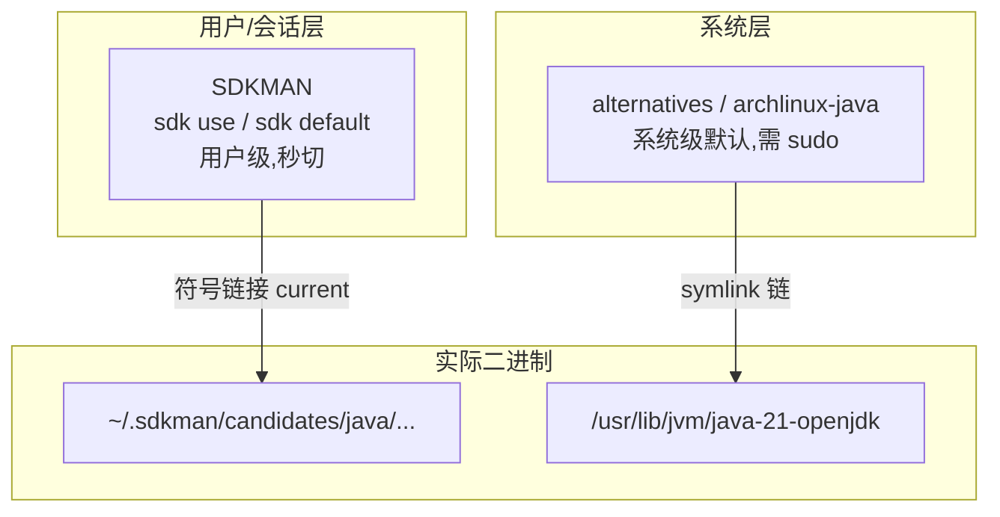

# 02 Linux 环境配置

对 RootStack 读者来说，Linux 才是 Java 的主战场：生产环境的服务器几乎清一色 Linux，你写的 Spring Boot 应用最终都部署在这里。本章覆盖三大发行版的包管理器安装，重点推荐 SDKMAN 作为 JDK 版本管理方案，并讨论无头服务器等特殊场景。

---

## 一、安装方式总览

| 方式 | 适用 | 版本新旧 | 多版本支持 | 推荐度 |
|------|------|---------|-----------|--------|
| 发行版包管理器（apt/dnf/pacman）| 快速上手 | 跟随发行版，可能滞后 | 差 | 入门可用 |
| **SDKMAN** | 学习与开发 | 最新最全 | 优秀 | **首选** |
| 手动解压 tar.gz | 离线/定制 | 自选 | 手动 | 特殊场景 |

与 C 对比：装 JDK 相当于同时装好 gcc + glibc + binutils + gdb 全家桶——JDK 一个包里自带编译器、运行时和工具链，没有"分发包"的烦恼。

---

## 二、发行版包管理器安装

### 2.1 Ubuntu / Debian（apt）

```bash
# 搜索可用的 openjdk 包
apt search openjdk-21

# 安装 JDK(含编译器;-jre 只有运行时)
sudo apt update
sudo apt install openjdk-21-jdk

# 验证
java -version
javac -version
```

Debian 系会把多个 JDK 注册进 alternatives 系统（见第五节），`openjdk-21-jdk-headless` 是不含 GUI 组件的精简版。

### 2.2 Fedora（dnf）

```bash
sudo dnf install java-21-openjdk-devel
# devel 后缀 = JDK;不带 devel = JRE
sudo dnf search openjdk   # 查看所有版本
```

### 2.3 Arch / ArchStrike（pacman）

本库读者多在 ArchStrike 体系下，Arch 的 OpenJDK 包更新最快：

```bash
# 官方仓库中的 JDK(版本号固定为当前大版本)
pacman -Ss jdk-openjdk

sudo pacman -S jdk21-openjdk

# AUR 中还有 Temurin、Zulu、GraalVM 等
yay -S temurin-jdk-21-bin    # Eclipse Temurin 二进制包
yay -S jdk17-graalvm-bin     # GraalVM 示例
```

Arch 注意点：官方 `jdk21-openjdk` 与 AUR 的 Temurin 可能同时提供 `/usr/lib/jvm/java-21-openjdk/bin/java`，用 archlinux-java 命令管理默认版本：

```bash
archlinux-java status        # 列出已注册的 Java 环境
sudo archlinux-java set java-21-openjdk
```

三发行版命令速查：

| 操作 | Debian/Ubuntu | Fedora | Arch |
|------|--------------|--------|------|
| 装 JDK | `apt install openjdk-21-jdk` | `dnf install java-21-openjdk-devel` | `pacman -S jdk21-openjdk` |
| 装 JRE | `apt install openjdk-21-jre` | `dnf install java-21-openjdk` | `pacman -S jre21-openjdk` |
| 已装列表 | `update-alternatives --list java` | `alternatives --list java` | `archlinux-java status` |
| 切换默认 | `update-alternatives --config java` | 同左 | `archlinux-java set ...` |

---

## 三、SDKMAN 管理 JDK（强烈推荐）

SDKMAN 是 JVM 生态的版本管理器——地位相当于 Rust 的 rustup、Node 的 nvm。它能装的不只是 JDK，还有 Gradle、Maven、Kotlin、Groovy。

### 3.1 安装 SDKMAN

```bash
# 依赖 curl 和 zip,先确认存在
which curl zip unzip || sudo apt install curl zip unzip

# 安装 SDKMAN 本体
curl -s "https://get.sdkman.io" | bash

# 使其生效(或重开终端)
source "$HOME/.sdkman/bin/sdkman-init.sh"

# 验证
sdk version
```

### 3.2 查看并安装 JDK

```bash
# 列出所有可用的 Java 发行版与版本(输出很长,按厂商分组)
sdk list java
```

输出节选（Vendor 列是关键）：

```text
 Vendor     | Version      | Dist  | Status     | Identifier
------------+--------------+-------+------------+-------------------
 AdoptOpenJDK| 21.0.5+11   | tem   | installed  | 21.0.5-tem
 AdoptOpenJDK| 17.0.13+11  | tem   |            | 17.0.13-tem
 Amazon     | 21.0.5       | amzn  |            | 21.0.5-amzn
 Oracle     | 21.0.5       | oracle|            | 21.0.5-oracle
```

Identifier 就是安装时用的名字。`tem` = Temurin：

```bash
# 安装 Temurin 21(推荐组合:Temurin + LTS)
sdk install java 21.0.5-tem

# 验证
java -version
# 输出类似:
# openjdk version "21.0.5" 2024-10-15 LTS
# OpenJDK Runtime Environment Temurin-21.0.5+11 ...
```

SDKMAN 把 JDK 装在 `~/.sdkman/candidates/java/21.0.5-tem/` 下，`candidates/java/current` 是指向当前版本的符号链接——这个设计和你熟悉的 rustup 管理多工具链一模一样。

### 3.3 多版本切换

```bash
# 再装一个 JDK 17 共存
sdk install java 17.0.13-tem

# 当前 shell 临时使用 17(只影响本终端)
sdk use java 17.0.13-tem
java -version   # 17.x

# 新 shell 里恢复为默认 21
sdk default java 21.0.5-tem

# 查看当前状态
sdk current java
```

还可以做**目录级自动切换**（类似 pyenv 的 local）：在项目根目录放一个 `.sdkmanrc` 文件：

```bash
cd my-project
sdk env init                 # 生成 .sdkmanrc
# 编辑 .sdkmanrc 内容: java=21.0.5-tem
sdk env                      # 按 .sdkmanrc 切换
# 配置 sdkman_auto_env=true 后,cd 进目录自动切换
```

| 场景 | 命令 |
|------|------|
| 装指定版本 | `sdk install java <identifier>` |
| 临时切换（本 shell）| `sdk use java <identifier>` |
| 设为全局默认 | `sdk default java <identifier>` |
| 卸载某版本 | `sdk uninstall java <identifier>` |
| 查看所有已装 | `sdk ls java` |
| 项目级锁定 | `.sdkmanrc` + `sdk env` |

> 与 C 对比：C 世界没有对应物，因为 gcc 通常一个版本走天下；而 Java 项目对 JDK 版本敏感得多，所以催生了这类工具。类比记忆：**rustup 管 rustc，sdkman 管 javac**。

---

## 四、环境变量 JAVA_HOME 配置

SDKMAN 会自动设置 PATH，但很多第三方工具（Maven、Gradle wrapper、某些 IDE 远程开发）仍需要显式的 JAVA_HOME。

### 4.1 bash 用户（~/.bashrc）

```bash
# 追加到 ~/.bashrc
export JAVA_HOME="$HOME/.sdkman/candidates/java/current"
export PATH="$JAVA_HOME/bin:$PATH"
```

注意这里指向 `current` 符号链接——用 SDKMAN 切换版本后，JAVA_HOME 自动跟着变，一劳永逸。

### 4.2 zsh 用户（~/.zshrc）

内容相同，只是写入的文件不同：

```bash
echo 'export JAVA_HOME="$HOME/.sdkman/candidates/java/current"' >> ~/.zshrc
echo 'export PATH="$JAVA_HOME/bin:$PATH"' >> ~/.zshrc
source ~/.zshrc
```

### 4.3 验证

```bash
echo $JAVA_HOME
# /home/a/.sdkman/candidates/java/current

readlink -f "$JAVA_HOME"
# /home/a/.sdkman/candidates/java/21.0.5-tem  (真实路径)

which java && which javac
# 都应指向 ~/.sdkman/... 或 /usr/bin/java(symlink 到真实位置)
```

若用的是发行版包管理器装的，JAVA_HOME 一般设为 `/usr/lib/jvm/java-21-openjdk-amd64`（Debian 系）或 `/usr/lib/jvm/java-21-openjdk`（Arch），具体以 `ls /usr/lib/jvm/` 实际看到的为准。

---

## 五、系统级切换：alternatives 机制

不用 SDKMAN 时，Debian/Fedora 系用 alternatives 在系统层面管理同名命令的多候选者。

### 5.1 Debian 系（update-alternatives）

假设 apt 同时装了 openjdk-17-jdk 和 openjdk-21-jdk：

```bash
# 查看 java 命令的所有候选
sudo update-alternatives --list java
# /usr/lib/jvm/java-17-openjdk-amd64/bin/java
# /usr/lib/jvm/java-21-openjdk-amd64/bin/java

# 交互式选择默认版本
sudo update-alternatives --config java
# There are 2 choices for the alternative java ...
# Press <enter> to keep the current choice[*], or type selection number:

# 自动模式:按优先级选最高
sudo update-alternatives --auto java
```

原理与 C 对比：这本质上就是一套符号链接管理系统，`/usr/bin/java` → `/etc/alternatives/java` → 真实二进制，两级间接。类似你在 Arch 上见过的 `python` 指向 `python3` 的处理，只是多了优先级与交互选择。

### 5.2 Arch 系

如前所述，Arch 用更简单的 `archlinux-java`：

```bash
archlinux-java status
sudo archlinux-java set java-21-openjdk
```

### 5.3 三层体系总结



优先级规则：PATH 里谁靠前听谁的；SDKMAN 的 PATH 条目通常在最前，所以装了 SDKMAN 后基本不需要再碰 alternatives。

---

## 六、无头服务器场景：headless 与 JRE

生产服务器没有显示器、没有 GUI 库，完整 JDK 里依赖 GTK/AWT 的部分既占空间又引入无用依赖。

| 包名 | 内容 | 大小量级 | 适用 |
|------|------|---------|------|
| openjdk-21-jdk | 全套 + GUI 支持 | ~300MB+ | 开发机 |
| openjdk-21-jdk-headless | 全套但去 GUI 依赖 | ~250MB | 服务器上的 CI 构建 |
| openjdk-21-jre-headless | 仅运行时 + 去 GUI | ~120MB | 只跑 jar 的生产服务器 |

```bash
# 生产服务器只部署应用时
sudo apt install openjdk-21-jre-headless
java -version    # 可用;javac 不存在(本来也不需要)

# headless 模式运行时的含义:程序若尝试画图会抛
# java.awt.HeadlessException —— 服务端代码本就不该画图
```

与 C 对比：相当于服务器上只装 libc 运行时而不装 gcc-dev 全家桶。Docker 化时代更进一步——工程化篇会用 `eclipse-temurin:21-jre-alpine` 这类几十 MB 的基础镜像。

---

## 七、验证与第一个程序

```bash
# 建立工作目录
mkdir -p ~/code/java-lab && cd ~/code/java-lab
```

创建 `Hello.java`：

```java
public class Hello {
    public static void main(String[] args) {
        System.out.println("Hello, RootStack!");
        // 打印 JVM 信息,Linux 排障常用
        System.out.println("JVM: " + System.getProperty("java.vm.name"));
        System.out.println("OS: " + System.getProperty("os.name"));
        System.out.println("user.dir: " + System.getProperty("user.dir"));
    }
}
```

编译运行：

```bash
javac Hello.java          # 生成 Hello.class
file Hello.class          # 查看字节码文件类型
# Hello.class: compiled Java class data, version 65.0 (Java 21)
ls                        # Hello.class  Hello.java
java Hello                # 运行,不带 .class 后缀
```

预期输出：

```text
Hello, RootStack!
JVM: OpenJDK 64-Bit Server VM
OS: Linux
user.dir: /home/a/code/java-lab
```

`version 65.0` 这个数字是字节码格式版本号：Java 8 是 52，每升一个大版本加一。老字节码能在新 JVM 上跑（向后兼容），反之不行——这就是"高版本 JDK 编译的程序无法在低版本 JRE 运行"报错 `UnsupportedClassVersionError` 的由来。

---

## 八、常见问题排查

### 8.1 NoClassDefFoundError 与 ClassNotFoundException

两者长得很像但不同：

| 异常 | 发生时机 | 典型原因 |
|------|---------|---------|
| ClassNotFoundException | 显式加载类时找不到 | `java Hello` 时 classpath 里没有 Hello.class |
| NoClassDefFoundError | 编译期在、运行期不在 | 编译时有某依赖 jar，运行时没带上 |

初学阶段最常见触发方式：

```bash
javac Hello.java
cd ..           # 换了目录
java Hello      # 报错!找不到或无法加载主类 Hello
```

解决：回到 .class 所在目录运行，或用 `-cp` 指定：

```bash
java -cp ~/code/java-lab Hello
# -cp = classpath,JVM 找类的搜索起点
```

与 C 对比：C 的链接错误发生在编译/链接期，一旦生成可执行文件就自包含；Java 的链接推迟到运行期按需进行（类加载机制），所以会有"跑到一半才发现缺类"的现象。

### 8.2 权限问题

```text
Error: Could not create the Java Virtual Machine.
Error occurred during initialization of VM: ...
```

或写文件失败类报错，排查方向：

1. 对目标目录是否有写权限？`ls -ld ~/code/java-lab`
2. 是否误用 sudo 运行了普通程序？Java 不像 apt 需要 root，日常编译运行**不要 sudo**
3. 内存不足导致 JVM 启动失败（VPS 常见）：临时限制堆大小 `java -Xmx128m Hello`

### 8.3 防火墙：为后续 Web 开发铺路

现在不涉及网络编程，但要提前知道：等你学到工程化篇跑起第一个 Spring Boot（默认监听 8080 端口）时，外部机器访问不了多半不是代码问题，而是防火墙：

```bash
# firewalld(Fedora/RHEL 系)
sudo firewall-cmd --add-port=8080/tcp --permanent
sudo firewall-cmd --reload

# ufw(Ubuntu)
sudo ufw allow 8080/tcp

# 云服务器还要在控制台的"安全组"里放行端口——这是最常见的遗漏
```

先混个脸熟，届时回来查这张表即可。

### 8.4 其他速查

| 现象 | 原因 | 解决 |
|------|------|------|
| `UnsupportedClassVersionError` | 字节码版本高于运行时版本 | 用同版本或更高 JDK 运行 |
| 中文乱码 | 终端 locale 非 UTF-8 | `locale` 检查，确保 `LANG=C.UTF-8` 或 zh_CN.UTF-8 |
| `E: Unable to locate package openjdk-21-jdk` | 源太旧或发行版不含此包 | `sudo apt update`；仍无则改用 SDKMAN |
| sdk 命令找不到 | 未 source 初始化脚本 | `source "$HOME/.sdkman/bin/sdkman-init.sh"` |

---

## 九、本章小结

- 三条路线：apt/dnf/pacman 快速装；SDKMAN 管多版本（首选）；tar.gz 离线手动装
- SDKMAN 核心命令四件套：`sdk list` / `sdk install` / `sdk use` / `sdk default`
- JAVA_HOME 指向 `~/.sdkman/candidates/java/current` 可随版本自动跟随
- alternatives/archlinux-java 是系统级切换兜底方案
- 生产服务器用 jre-headless 精简运行时
- `java Hello` 报"找不到主类"先检查当前目录与 classpath；防火墙放行是未来 Web 部署的第一坑

## LeetCode 巩固

Linux 下写代码刷题的体验其实更好——vim + 终端一气呵成。热身题目依然是 [两数之和](https://leetcode.cn/problems/two-sum/)，可以在服务器上建个 `~/code/leetcode/` 目录练手。

建议现在就把 LeetCode 语言偏好设为 Java 21。等学完 [[05_第一个程序与jshell|第一个程序与 jshell]]，我们会给出这道题的第一个 Java 实现。
