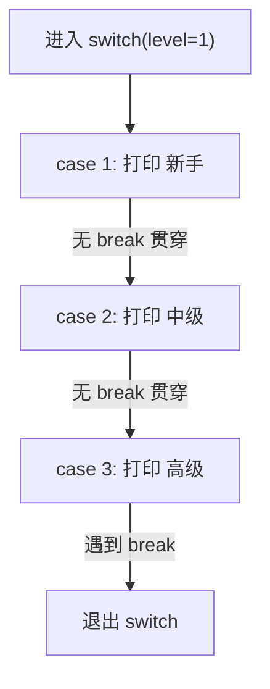
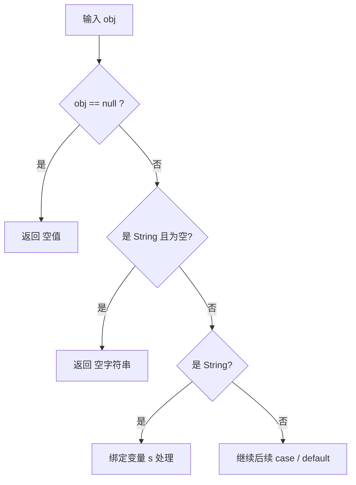

# 08 条件语句

> 前置知识：[[java/1入门/07_运算符与表达式|07 运算符与表达式]]
> 本章目标：掌握 if/else、传统 switch 的 fall-through 陷阱、switch 表达式箭头语法（Java 14+）、模式匹配 switch（Java 21），以及卫语句风格。

## 概述

条件分支是所有语言的基本功，Java 与 C 高度相似——相似到连 switch 忘写 break 的坑都一模一样。但 Java 14 之后引入了箭头语法和 yield，Java 21 又带来模式匹配 switch，让这个老语法焕然一新。本章按「传统到现代」的顺序展开。

## if / else if / else

```java
import java.util.Scanner;

public class IfDemo {
    public static void main(String[] args) {
        Scanner sc = new Scanner(System.in);
        System.out.print("输入分数: ");
        int score = sc.nextInt();

        // 基本结构与 C 一致，但条件必须是 boolean 类型
        if (score >= 90) {
            System.out.println("优秀");
        } else if (score >= 80) {
            System.out.println("良好");
        } else if (score >= 60) {
            System.out.println("及格");
        } else {
            System.out.println("不及格");
        }

        sc.close();
    }
}
```

### C 程序员最容易踩的差异

```java
public class IfTrap {
    public static void main(String[] args) {
        int x = 5;

        // 差异 1：if 条件里不能写赋值表达式（除非是 boolean 变量）
        // if (x = 3) {}          // 编译错误：int 不是 boolean
        // 这直接消灭了 C 中最经典的 "=" 误写为 "==" bug
        // （对 boolean 变量 if (flag = true) 依然能编译，仍需警惕）

        // 差异 2：条件必须是完整的 boolean 表达式
        int n = 10;
        // if (n) {}              // 编译错误！C 中非零即真，Java 不允许
        if (n != 0) { }           // 必须显式写出比较

        // 悬空 else 问题与 C 相同：else 总是配对最近的 if
        int a = 1, b = -1;
        if (a > 0)
            if (b > 0)
                System.out.println("both");
                // 这个 else 属于内层 if：
        else
            System.out.println("b<=0");   // 会执行这行
        // 规范建议：嵌套时永远写大括号，即使只有一条语句
    }
}
```

## 传统 switch 与 fall-through 陷阱

```java
public class SwitchTraditional {
    public static void main(String[] args) {
        int day = 3;

        // 传统语法：与 C 几乎逐字相同，包括那个著名的坑
        switch (day) {
            case 1:
                System.out.println("星期一");
                break;                    // 没有 break 就会贯穿到下一个 case！
            case 2:
                System.out.println("星期二");
                break;
            case 6:
            case 7:                       // 合法技巧：空 case 共享逻辑（周末）
                System.out.println("周末");
                break;
            default:
                System.out.println("工作日中");
                break;
        }
    }
}
```

fall-through 陷阱演示——忘写 break 时程序会一路执行到底：

```java
public class FallThroughTrap {
    public static void main(String[] args) {
        int level = 1;
        switch (level) {
            case 1:
                System.out.println("新手");       // 从这里进入后...
                // 忘了 break!
            case 2:
                System.out.println("中级");       // ...继续执行这里
            case 3:
                System.out.println("高级");       // ...还有这里
                break;                            // 直到遇到 break 或结尾
            default:
                System.out.println("未知");
        }
        // 输出三行：新手 / 中级 / 高级 —— 和 C 一模一样的行为
    }
}
```

用流程图看清 fall-through 的执行路径：



正确写好 break 时，每个 case 执行完直接跳到出口。

传统 switch 的其他限制（相对 C 是收紧的）：

- 只支持 `byte/short/char/int` 及其包装类、枚举、String（Java 7+）；C 允许任何整数表达式
- 不允许重复的 case 标签值，编译器会检查（C 不查）
- case 里声明的变量属于整个 switch 块作用域，跨 case 可见，容易踩坑

```java
public class SwitchScope {
    public static void main(String[] args) {
        int op = 1;
        switch (op) {
            case 1:
                int result = 100;      // 这个 result 在整个 switch 块内可见！
                System.out.println(result);
                break;
            case 2:
                // int result = 200;  // 编译错误：与 case 1 的重名
                int r2 = 200;          // 只能换名字
                System.out.println(r2);
                break;
        }
        // System.out.println(result);  // 出块后不可见
    }
}
```

## switch 表达式与箭头语法（Java 14+）

Java 14 把 switch 升级成了「表达式」——可以有返回值，并且箭头语法彻底消灭 fall-through：

```java
public class SwitchExpression {
    public static void main(String[] args) {
        int day = 6;

        // ===== 写法一：箭头标签作为语句 =====
        // -> 后不需要 break，天然不贯穿
        switch (day) {
            case 6, 7 -> System.out.println("周末");       // 多值合并用逗号，替代空 case 技巧
            default    -> System.out.println("工作日");
        }

        // ===== 写法二：switch 作为表达式返回值 =====
        String type = switch (day) {
            case 1, 2, 3, 4, 5 -> "工作日";
            case 6, 7          -> "休息日";
            default            -> "非法日期";
        };
        System.out.println(type);

        // ===== 写法三：需要多条逻辑时用 yield 返回值 =====
        int month = 3;
        String quarter = switch (month) {
            case 1, 2, 3 -> {
                // 复杂逻辑写在块里，用 yield 提交结果
                // 注意不是 return！yield 只退出 switch 并给出值
                String season = month <= 2 ? "冬末" : "初春";
                yield "第一季度(" + season + ")";
            }
            case 4, 5, 6 -> "第二季度";
            default      -> "下半年";
        };
        System.out.println(quarter);

        // 箭头 switch 作为表达式使用时必须穷尽所有情况：
        // 要么有 default，要么覆盖全部可能值（如枚举的每个成员）
    }
}
```

新旧语法对比：

| 特性 | 传统 `case X:` | 箭头 `case X ->` |
|------|----------------|-------------------|
| 贯穿 | 会 fall-through，必须 break | **永不贯穿** |
| 多值匹配 | 空 case 共享 | `case 1, 2 ->` 直接列举 |
| 有返回值 | 不能 | 可以，配合 `yield` |
| 必须 default | 否 | 作表达式时必须穷尽 |

## 模式匹配 switch（Java 21 正式）

在箭头语法之上再进一步：case 标签可以直接匹配类型、null，甚至解构记录类：

```java
public class PatternSwitch {
    public static void main(String[] args) {
        // 对不同类型的对象做不同处理
        describe("hello");
        describe(42);
        describe(3.14);
        describe(null);
    }

    static void describe(Object obj) {
        String msg = switch (obj) {
            case null                  -> "空值";           // null 可以直接作为 case！
            case String s when s.isEmpty() -> "空字符串";   // when 守卫：附加条件
            case String s              -> "字符串, 长度=" + s.length();
            case Integer i when i > 0  -> "正整数: " + i;   // 类型模式 + 条件守卫
            case Integer i             -> "非正整数: " + i;
            case Double d              -> "双精度浮点: %.2f".formatted(d);
            default                    -> "其他类型: " + obj.getClass().getSimpleName();
        };
        System.out.println(msg);
    }
}
```

要点：

- `case 类型 变量` 是类型模式，匹配成功后变量自动绑定并强转，无需手动 cast
- `when` 子句是条件守卫，不满足时继续尝试后面的 case
- `case null` 解决了传统 switch 一遇到 null 就 NPE 的老问题
- 匹配按书写顺序进行，类似 if/else if 链



## 嵌套条件与卫语句风格

深层嵌套是可读性杀手。推荐用「卫语句」提前返回，把主逻辑保持在最浅层级：

```java
public class GuardClause {

    // ===== 反面教材：嵌套金字塔 =====
    static String withdrawBad(int balance, int amount, boolean vip) {
        if (balance >= amount) {
            if (amount > 0) {
                if (vip || amount <= 10000) {
                    return "取款成功";
                } else {
                    return "普通用户单笔上限 10000";
                }
            } else {
                return "金额必须为正";
            }
        } else {
            return "余额不足";
        }
    }

    // ===== 推荐写法：卫语句先排除异常路径 =====
    static String withdrawGood(int balance, int amount, boolean vip) {
        if (amount <= 0) {                          // 卫语句 1：非法金额
            return "金额必须为正";
        }
        if (balance < amount) {                     // 卫语句 2：余额不足
            return "余额不足";
        }
        if (!vip && amount > 10000) {               // 卫语句 3：限额
            return "普通用户单笔上限 10000";
        }
        // 走到这里所有前置条件都满足，主逻辑零嵌套
        return "取款成功";
    }

    public static void main(String[] args) {
        System.out.println(withdrawGood(5000, -1, false));
        System.out.println(withdrawGood(5000, 99999, false));
        System.out.println(withdrawGood(5000, 3000, true));
    }
}
```

两条经验法则：

- 正常流程走直线，异常情况提前踢出去
- 嵌套超过两层就该考虑提取方法或改用卫语句

## 条件表达式技巧

```java
public class ConditionTips {
    public static void main(String[] args) {
        int a = 12, b = 8;

        // 技巧 1：Math.max/min 替代三元比较
        int max = Math.max(a, b);

        // 技巧 2：布尔变量本身就是条件，别画蛇添足
        boolean isEven = a % 2 == 0;
        // 反例：boolean ok = isEven == true ? true : false;
        boolean ok = isEven;                        // 直接赋值即可

        // 技巧 3：区间判断注意边界顺序
        int score = 85;
        boolean inRange = score >= 80 && score < 90;   // 数学式写法 80<=score<90 不合法

        // 技巧 4：利用短路做默认值
        String input = null;
        String name = input != null ? input : "匿名";   // Java 没有 C 的 ?? 运算符，
                                                        // 常用 Objects.requireNonNullElse(input, "匿名")
        // 技巧 5：switch 表达式替代多分支映射
        String code = switch (max) {
            case 12 -> "TWELVE";
            case 8  -> "EIGHT";
            default -> "UNKNOWN";
        };

        System.out.println(max + " " + ok + " " + inRange + " " + name + " " + code);
    }
}
```

## 综合示例：BMI 计算与分级

```java
import java.util.Scanner;

/**
 * 综合运用本章知识：读取身高体重，计算 BMI 并用箭头 switch 分级
 */
public class BmiCalculator {
    public static void main(String[] args) {
        Scanner sc = new Scanner(System.in);
        System.out.print("身高(米): ");
        double h = sc.nextDouble();
        System.out.print("体重(千克): ");
        double w = sc.nextDouble();

        // 输入合法性检查——卫语句思想
        if (h <= 0 || w <= 0) {
            System.out.println("输入无效");
            sc.close();
            return;
        }

        double bmi = w / (h * h);
        // switch 表达式对 double 不能直接匹配，先映射到整数档位
        int level = bmi < 18.5 ? 0 : bmi < 24 ? 1 : bmi < 28 ? 2 : 3;

        String advice = switch (level) {
            case 0 -> "偏瘦，注意营养均衡";
            case 1 -> "正常，保持住";
            case 2 -> "偏胖，建议增加运动";
            default -> "肥胖，建议咨询医生";
        };

        System.out.printf("BMI = %.2f%n%s%n", bmi, advice);
        sc.close();
    }
}
```

## 本章要点回顾

- if 条件必须是 boolean，C 的「非零即真」「= 误写」两类 bug 在 Java 中被编译器拦截
- 传统 switch 的 fall-through 与 C 相同，忘写 break 会贯穿；case 变量作用域横跨整个 switch
- 箭头语法（Java 14+）永不贯穿，支持多值合并；复杂逻辑用 `yield` 提交结果
- 模式匹配 switch（Java 21）支持类型模式、`when` 守卫和 `case null`
- 卫语句风格让主逻辑零嵌套，优先于深层的 if 金字塔

## LeetCode 巩固

- [Fizz Buzz](https://leetcode.cn/problems/fizz-buzz/) —— 多条件分支的经典入门题，注意 15 的倍数要先判
- [有效的三角形](https://leetcode.cn/problems/valid-triangle-number/) —— 三边合法性判断（两边之和大于第三边），练习组合条件
- [日期之间隔几天](https://leetcode.cn/problems/number-of-days-between-two-dates/) —— 用闰年判断和月份天数表练习分支逻辑
- [整数的各位积和之差](https://leetcode.cn/problems/subtract-the-product-and-sum-of-digits-of-an-integer/) —— 简单分支配合取余运算

---

- 下一章：[[java/1入门/09_循环结构|09 循环结构]]
- 相关：[[java/1入门/07_运算符与表达式|07 运算符与表达式]]
