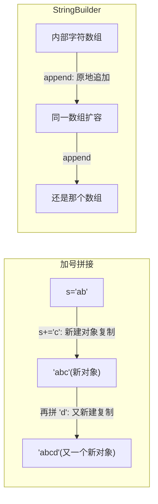

# 09 循环结构

> 前置知识：[[java/1入门/08_条件语句|08 条件语句]]
> 本章目标：掌握 while/do-while/for 三种循环、增强 for 循环的迭代器本质、break/continue 与标签、嵌套循环，以及循环内的性能陷阱。

## 概述

Java 的三种基础循环与 C 逐字兼容，可以直接迁移肌肉记忆。真正的增量在于：for-each 循环（C 到 C++11 才有范围 for）、标签 label（结构化的 goto 替代品），以及字符串拼接这个新手最常见的性能深坑。

## 三种基本循环

```java
public class BasicLoops {
    public static void main(String[] args) {
        // ===== while：先判断后执行，可能一次都不跑（同 C）=====
        int i = 0;
        while (i < 3) {
            System.out.println("while 第 " + i + " 次");
            i++;
        }

        // ===== do-while：先执行后判断，至少跑一次（同 C）=====
        int j = 10;
        do {
            System.out.println("do-while 打印一次, j=" + j);
            j++;
        } while (j < 5);    // 注意分号！

        // ===== for：初始化; 条件; 更新（同 C）=====
        for (int k = 0; k < 3; k++) {
            System.out.println("for 第 " + k + " 次");
        }
        // k 在循环外不可见——Java 的 for 变量作用域仅限循环体，
        // C89 中循环结束后变量仍存活，这是行为差异

        // 逗号分隔的多变量 for（与 C 相同的语法）
        for (int x = 0, y = 10; x < y; x++, y--) {
            System.out.println(x + " vs " + y);
        }

        // 条件必须是 boolean：
        // while (i) {}   // 编译错误，要写 while (i != 0)
    }
}
```

| 对比项 | C | Java |
|--------|---|------|
| while / do-while / for 语法 | 相同 | 相同 |
| 循环条件类型 | 整数（非零即真） | 必须 boolean |
| for 变量作用域 | C89 泄漏到块外 | 仅限循环内 |
| goto | 有 | **无**（用 label 替代，见下文） |

## 增强 for 循环 for-each

遍历数组或集合的首选写法：

```java
public class ForEachDemo {
    public static void main(String[] args) {
        int[] nums = {10, 20, 30, 40};

        // 传统下标循环
        for (int i = 0; i < nums.length; i++) {
            System.out.print(nums[i] + " ");
        }
        System.out.println();

        // for-each：冒号读作"其中每个"
        for (int n : nums) {          // n 是每次迭代的元素拷贝
            System.out.print(n + " ");
        }
        System.out.println();

        // 二维数组逐层遍历
        int[][] matrix = {{1, 2}, {3, 4, 5}};
        for (int[] row : matrix) {
            for (int cell : row) {
                System.out.print(cell + " ");
            }
            System.out.println();
        }
    }
}
```

for-each 不只是语法糖——对集合它底层是迭代器模式。编译器会把代码改写为：

```java
import java.util.ArrayList;
import java.util.List;

public class ForEachUnderTheHood {
    public static void main(String[] args) {
        List<String> list = new ArrayList<>();
        list.add("a");
        list.add("b");

        // 你写的代码：
        // for (String s : list) { System.out.println(s); }

        // 编译器实际生成的等价代码（Iterator 迭代器）：
        for (java.util.Iterator<String> it = list.iterator(); it.hasNext(); ) {
            String s = it.next();
            System.out.println(s);
        }
        // 这就是为什么任何实现了 Iterable 接口的对象都能被 for-each 遍历
    }
}
```

for-each 的限制（需要下标时必须退回传统 for）：

- 无法获取当前下标
- 不能在遍历中修改数组元素（改的是拷贝）
- 不能在遍历中增删集合元素（会抛 `ConcurrentModificationException`，删除请用 `Iterator.remove()`）

## break / continue / 标签 label

```java
public class BreakContinue {
    public static void main(String[] args) {
        // break：跳出本层循环
        for (int i = 0; i < 10; i++) {
            if (i == 3) break;
            System.out.print(i + " ");     // 0 1 2
        }
        System.out.println();

        // continue：跳过本次进入下一轮
        for (int i = 0; i < 6; i++) {
            if (i % 2 == 0) continue;
            System.out.print(i + " ");     // 1 3 5
        }
        System.out.println();

        // ===== 标签 label：Java 没有 goto，但提供了受控跳转 =====
        // 场景：多层嵌套中想直接跳出所有层
        outer:                              // 标签放在循环前，命名任意
        for (int i = 0; i < 5; i++) {
            for (int j = 0; j < 5; j++) {
                if (i * j > 6) {
                    break outer;            // 直接终止两层循环！
                }
                System.out.print(i + "*" + j + "=" + i * j + " ");
            }
            System.out.println();
        }

        // continue outer 同理：跳过外层的本次迭代
        outer2:
        for (int i = 0; i < 3; i++) {
            for (int j = 0; j < 3; j++) {
                if (j == 1) continue outer2;   // 内层触发外层下一轮
                System.out.print("(" + i + "," + j + ") ");
            }
        }
        System.out.println();
    }
}
```

与 C 对比：C 用 `goto out;` 实现同样的效果，但 goto 可以跳到函数内任意位置；Java 的标签只能贴在循环上，只能配合 break/continue 使用，是「驯化版 goto」。

## 嵌套循环与打印图形

经典练习：打印九九乘法表和金字塔。

```java
public class LoopGraphics {
    public static void main(String[] args) {
        // 九九乘法表
        for (int i = 1; i <= 9; i++) {
            for (int j = 1; j <= i; j++) {
                System.out.printf("%d*%d=%-4d", j, i, i * j);   // %-4d 左对齐占 4 格
            }
            System.out.println();
        }
        System.out.println();

        // 金字塔：行号 i 从 1 到 5，空格 5-i 个，星号 2*i-1 个
        int rows = 5;
        for (int i = 1; i <= rows; i++) {
            for (int s = 0; s < rows - i; s++) System.out.print(' ');
            for (int t = 0; t < 2 * i - 1; t++) System.out.print('*');
            System.out.println();
        }

        // 找质数（1~50）：嵌套循环 + break 提前退出的效率优化
        for (int n = 2; n <= 50; n++) {
            boolean isPrime = true;
            for (int d = 2; d * d <= n; d++) {   // 只试除到根号 n
                if (n % d == 0) {
                    isPrime = false;
                    break;                        // 找到因子立即退出，不浪费循环
                }
            }
            if (isPrime) System.out.print(n + " ");
        }
        System.out.println();
    }
}
```

## 死循环的正确写法

```java
public class InfiniteLoop {
    public static void main(String[] args) {
        // 推荐写法：while (true)，语义最直白
        int count = 0;
        while (true) {
            count++;
            if (count >= 3) break;         // 必须有明确的退出路径
        }

        // for (;;) 也合法且与 C 相同，两者编译后字节码一致
        for (;;) {
            break;
        }

        // 死循环的真实用途：服务器主循环、游戏帧循环、轮询任务
        // 配合线程与中断使用，见后续并发章节
        System.out.println("count = " + count);
    }
}
```

## 性能注意点：循环内字符串拼接陷阱

```java
public class ConcatTrap {
    public static void main(String[] args) {
        int n = 100_000;

        // ===== 反面教材：在循环里用 + 拼 String =====
        long start = System.currentTimeMillis();
        String s = "";
        for (int i = 0; i < n; i++) {
            s += i;                        // 每次 += 都新建一个 String 对象并复制全部旧内容！
        }                                  // 总时间复杂度 O(n^2)
        long mid = System.currentTimeMillis();
        System.out.println("+ 拼接耗时: " + (mid - start) + "ms, 长度=" + s.length());

        // ===== 正确姿势：StringBuilder =====
        start = System.currentTimeMillis();
        StringBuilder sb = new StringBuilder();   // 可变字符序列，内部维护可扩容数组
        for (int i = 0; i < n; i++) {
            sb.append(i);                  // 均摊 O(1)
        }
        String result = sb.toString();     // 最后一次性转成 String
        long end = System.currentTimeMillis();
        System.out.println("StringBuilder 耗时: " + (end - start) + "ms, 长度=" + result.length());
        // 差距通常是几十倍甚至上百倍
    }
}
```

原理图解：`+` 拼接每次都要复制整个已有内容到新对象：



规则总结：**单次拼接随便用 +；循环里累积拼接必须用 StringBuilder**。更多细节见 [[java/1入门/11_字符串|11 字符串]]。

## 循环中的常见 bug 清单

```java
public class LoopBugs {
    public static void main(String[] args) {
        int[] arr = {1, 2, 3};

        // ===== bug 1：边界差一（off-by-one）=====
        // for (int i = 0; i <= arr.length; i++)  // i==3 时越界异常
        for (int i = 0; i < arr.length; i++) {     // 正确：用 < 而不是 <=
            System.out.print(arr[i] + " ");
        }
        System.out.println();
        // C 中同样的错误是静默踩内存，Java 至少会当场报错提醒你

        // ===== bug 2：循环内修改循环变量 =====
        int n = 5;
        for (int i = 0; i < n; i++) {
            if (i == 2) n--;       // 能编译，但逻辑混乱，强烈不推荐
            System.out.print(i + " ");
        }
        System.out.println();      // 循环条件被中途改变，行为难以推断

        // ===== bug 3：浮点数当循环计数器 =====
        double d = 0.0;
        int steps = 0;
        for (d = 0.0; d != 1.0; d += 0.1) {   // 危险写法！
            steps++;
            if (steps > 50) break;             // 实际跑不到：浮点累加有误差，d 永远到不了精确的 1.0
        }
        System.out.println("实际执行 " + steps + " 步, 最终 d=" + d);
        // 正确做法：整数计数 + 循环内换算
        for (int k = 0; k < 10; k++) {
            double v = k * 0.1;
        }

        // ===== bug 4：在 for-each 里试图给元素赋值 =====
        for (int x : arr) {
            x *= 2;                // 改的是拷贝，arr 原封不动
        }
        System.out.println(java.util.Arrays.toString(arr));   // [1, 2, 3]
        // 要修改原数组必须用下标循环：
        for (int i = 0; i < arr.length; i++) arr[i] *= 2;
        System.out.println(java.util.Arrays.toString(arr));   // [2, 4, 6]
    }
}
```

## 综合示例

```java
// 猜数字游戏：综合 while、break、Scanner、条件判断
import java.util.Scanner;
import java.util.Random;

public class GuessNumber {
    public static void main(String[] args) {
        Random random = new Random();
        int answer = random.nextInt(100) + 1;      // [1, 100]
        Scanner sc = new Scanner(System.in);
        int tries = 0;

        System.out.println("猜一个 1~100 的整数：");
        while (true) {
            System.out.print("> ");
            if (!sc.hasNextInt()) {                // 防御非数字输入
                sc.next();                         // 丢弃非法 token
                System.out.println("请输入整数！");
                continue;
            }
            int guess = sc.nextInt();
            tries++;

            if (guess < answer) {
                System.out.println("小了");
            } else if (guess > answer) {
                System.out.println("大了");
            } else {
                System.out.println("猜对了! 共用了 " + tries + " 次");
                break;                             // 命中即退出死循环
            }
        }
        sc.close();
    }
}
```

## 本章要点回顾

- while/do-while/for 与 C 同构；条件必须 boolean；for 变量不泄漏作用域
- for-each 底层是 Iterator，遍历优先用它；需要下标或中途删元素时退回传统 for
- 标签 label 是结构化的跨层跳转，只能配 break/continue，替代了 goto 的典型用法
- 质数试除只到根号 n，找到就 break——循环里的提前退出意识
- 循环内拼字符串用 StringBuilder，`+` 在循环里是平方级复杂度

## LeetCode 巩固

- [爬楼梯](https://leetcode.cn/problems/climbing-stairs/) —— 循环递推的经典入门，体会「滚动变量」省空间的技巧
- [杨辉三角](https://leetcode.cn/problems/pascals-triangle/) —— 双层循环构建列表，练嵌套循环的行列关系
- [合并两个有序数组](https://leetcode.cn/problems/merge-sorted-array/) —— 双指针循环，从后往前填充避免覆盖
- [只出现一次的数字 II](https://leetcode.cn/problems/single-number-ii/) —— 配合位运算的遍历统计（可选进阶）

---

- 下一章：[[java/1入门/10_数组|10 数组]]
- 相关：[[java/1入门/11_字符串|11 字符串]]
